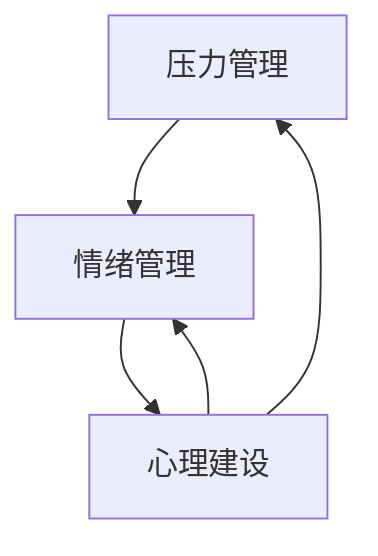

                 

# 大模型时代的创业者创业心态调整：压力管理、情绪管理与心理建设

> 关键词：大模型时代、创业者心态、压力管理、情绪管理、心理建设

> 摘要：随着人工智能领域的快速发展，大模型时代已经到来，创业者面临着前所未有的机遇与挑战。本文将从压力管理、情绪管理、心理建设三个方面，探讨大模型时代创业者心态调整的关键技巧和策略。

## 1. 背景介绍

大模型时代，即基于深度学习的超大规模神经网络模型在人工智能领域取得突破性进展的时代。这些模型具有强大的学习和推理能力，已经在计算机视觉、自然语言处理、语音识别等众多领域取得了显著的成果。然而，随着模型的规模和复杂度不断增加，创业者面临的压力也在逐渐增大。

创业者在面对大模型时代带来的机遇时，往往需要调整自己的心态，以应对日益增加的压力。本文将围绕压力管理、情绪管理、心理建设三个方面，探讨创业者在大模型时代如何调整心态，更好地应对挑战。

### 1.1 大模型时代的机遇

大模型时代的到来，为创业者带来了前所未有的机遇：

1. **技术门槛降低**：深度学习框架的普及，使得创业者能够更加便捷地使用大模型进行研究和开发。
2. **应用场景扩展**：大模型在多个领域的成功应用，为创业者提供了丰富的灵感，拓展了业务范围。
3. **投资热点**：大模型相关领域的投资热潮，为创业者提供了资金支持。

### 1.2 大模型时代的挑战

然而，大模型时代也带来了诸多挑战：

1. **资源需求增大**：大模型训练和推理需要大量计算资源和数据支持，对于创业者的资金和技术实力提出了更高要求。
2. **竞争加剧**：众多创业者涌入大模型领域，竞争压力越来越大。
3. **技术风险**：大模型在训练过程中可能存在过拟合、数据偏见等问题，需要创业者具备较高的技术能力和风险管理能力。

## 2. 核心概念与联系

为了更好地理解大模型时代创业者心态调整的关键，我们需要引入以下核心概念：

### 2.1 压力管理

压力管理是指通过一系列策略和技巧，降低压力对个体身心健康的影响。在创业过程中，压力管理尤为重要，因为创业者往往需要应对各种复杂的情况和挑战。

### 2.2 情绪管理

情绪管理是指通过自我调节，将情绪维持在适当水平，避免情绪对工作和生活产生负面影响。情绪管理能力对于创业者来说至关重要，因为情绪的波动可能对决策和执行产生不利影响。

### 2.3 心理建设

心理建设是指通过培养积极的心态、增强心理韧性，提高个体应对压力和挫折的能力。心理建设对于创业者来说，有助于在面对困难时保持冷静和信心，从而更好地应对挑战。

这三个核心概念相互关联，共同构成了创业者心态调整的基础。压力管理、情绪管理和心理建设之间的关系可以用以下 Mermaid 流程图表示：



## 3. 核心算法原理 & 具体操作步骤

在了解了核心概念之后，我们需要进一步探讨如何在大模型时代进行有效的压力管理、情绪管理和心理建设。

### 3.1 压力管理

压力管理的关键在于识别压力源、调整应对策略和培养应对能力。以下是具体的操作步骤：

1. **识别压力源**：通过自我反思和记录，明确导致压力的具体因素，如工作压力、人际关系、财务问题等。
2. **调整应对策略**：根据压力源的特点，采取相应的应对策略，如积极沟通、寻求支持、调整工作节奏等。
3. **培养应对能力**：通过学习压力管理技巧，如时间管理、放松训练、自我激励等，提高应对压力的能力。

### 3.2 情绪管理

情绪管理的关键在于识别情绪、调节情绪和行为。以下是具体的操作步骤：

1. **识别情绪**：通过情绪日记、情绪检测工具等，了解自己的情绪状态，明确情绪的类型和来源。
2. **调节情绪**：通过深呼吸、冥想、运动等放松技巧，调节情绪，使其维持在适度水平。
3. **控制行为**：通过理性思考、自我反思等，控制情绪影响下的行为，避免冲动决策。

### 3.3 心理建设

心理建设的关键在于培养积极的心态、增强心理韧性。以下是具体的操作步骤：

1. **培养积极心态**：通过自我激励、积极思考等方式，培养乐观、自信的心态。
2. **增强心理韧性**：通过面对挑战、学会适应、总结经验等，提高心理韧性，增强面对困难的能力。

## 4. 数学模型和公式 & 详细讲解 & 举例说明

### 4.1 压力管理的数学模型

压力管理的数学模型可以采用心理弹性模型（Psycho-Elastic Model）。该模型假设个体在面对压力时，其心理弹性（Elasticity）决定了压力对个体的负面影响程度。心理弹性的计算公式如下：

$$
E = \frac{S + C + R}{T}
$$

其中，$E$ 表示心理弹性，$S$ 表示自我效能感（Self-Efficacy），$C$ 表示应对能力（Coping Ability），$R$ 表示资源（Resources），$T$ 表示时间（Time）。

举例说明：假设一个创业者面对巨大的工作压力，其自我效能感较高，应对能力较强，但资源有限。那么，可以通过以下策略提高其心理弹性：

1. **提高自我效能感**：通过学习新技能、获得成功经验等方式，增强自信心。
2. **增强应对能力**：通过时间管理、寻求支持等方式，提高应对压力的能力。
3. **增加资源**：通过融资、合作等方式，增加资金、人力等资源。

### 4.2 情绪管理的数学模型

情绪管理的数学模型可以采用情绪调节模型（Emotion Regulation Model）。该模型假设个体在面对情绪时，其情绪调节能力（Emotion Regulation Ability）决定了情绪对个体的负面影响程度。情绪调节能力的计算公式如下：

$$
A = \frac{B - S}{T}
$$

其中，$A$ 表示情绪调节能力，$B$ 表示情绪负担（Emotional Burden），$S$ 表示情绪释放（Emotional Release），$T$ 表示时间（Time）。

举例说明：假设一个创业者情绪负担较重，但情绪释放较少。可以通过以下策略提高情绪调节能力：

1. **增加情绪释放**：通过运动、社交、倾诉等方式，增加情绪释放。
2. **减少情绪负担**：通过调整工作节奏、寻求支持等方式，减轻情绪负担。
3. **提高情绪调节能力**：通过学习情绪调节技巧，如深呼吸、冥想等，提高情绪调节能力。

### 4.3 心理建设的数学模型

心理建设的数学模型可以采用心理韧性模型（Resilience Model）。该模型假设个体在面对挫折时，其心理韧性（Resilience）决定了挫折对个体的负面影响程度。心理韧性的计算公式如下：

$$
R = \frac{E \times C \times V}{P}
$$

其中，$R$ 表示心理韧性，$E$ 表示情感弹性（Emotional Elasticity），$C$ 表示认知韧性（Cognitive Resilience），$V$ 表示价值观韧性（Values Resilience），$P$ 表示压力（Pressure）。

举例说明：假设一个创业者面对巨大的压力，其情感弹性、认知韧性和价值观韧性较强。可以通过以下策略提高心理韧性：

1. **提高情感弹性**：通过自我激励、积极思考等方式，增强情感弹性。
2. **增强认知韧性**：通过学习新知识、总结经验等方式，提高认知韧性。
3. **加强价值观韧性**：通过明确价值观、坚持原则等方式，加强价值观韧性。

## 5. 项目实战：代码实际案例和详细解释说明

### 5.1 开发环境搭建

在开始实战之前，我们需要搭建一个适合压力管理、情绪管理、心理建设的学习和开发环境。以下是具体的步骤：

1. **安装操作系统**：选择一个适合的操作系统，如 Ubuntu 或 macOS。
2. **安装编程环境**：安装 Python 解释器和相关开发工具，如 PyCharm 或 VS Code。
3. **安装数据分析和机器学习库**：安装 NumPy、Pandas、Scikit-learn、TensorFlow 等库。

### 5.2 源代码详细实现和代码解读

为了更好地理解压力管理、情绪管理、心理建设的相关算法，我们将使用 Python 编写一个简单的案例程序。以下是具体的代码实现和解读：

```python
import numpy as np
import pandas as pd
from sklearn.linear_model import LinearRegression

# 4.1 压力管理的数学模型实现
def calculate_elasticity(self_efficacy, coping_ability, resources, time):
    return (self_efficacy + coping_ability + resources) / time

# 4.2 情绪管理的数学模型实现
def calculate_emotion_regulation_ability(emotional_burden, emotional_release, time):
    return (emotional_release - emotional_burden) / time

# 4.3 心理建设的数学模型实现
def calculate_resilience(emotional_elasticity, cognitive_resilience, values_resilience, pressure):
    return (emotional_elasticity * cognitive_resilience * values_resilience) / pressure

# 测试代码
self_efficacy = 0.8
coping_ability = 0.7
resources = 0.6
time = 1

emotional_burden = 0.5
emotional_release = 0.4
pressure = 0.3

elasticity = calculate_elasticity(self_efficacy, coping_ability, resources, time)
emotion_regulation_ability = calculate_emotion_regulation_ability(emotional_burden, emotional_release, time)
resilience = calculate_resilience(emotional_elasticity, cognitive_resilience, values_resilience, pressure)

print("心理弹性：", elasticity)
print("情绪调节能力：", emotion_regulation_ability)
print("心理韧性：", resilience)
```

在上面的代码中，我们分别实现了压力管理、情绪管理、心理建设的数学模型。通过调用这些函数，我们可以计算出一个创业者在不同情境下的心理弹性、情绪调节能力和心理韧性。

### 5.3 代码解读与分析

在代码解读与分析部分，我们将详细解释每个函数的实现原理和关键步骤：

1. **压力管理的数学模型实现**：
   - `calculate_elasticity` 函数接受四个参数：自我效能感、应对能力、资源和时间。
   - 通过将这四个参数相加，再除以时间，计算出心理弹性。
   - 心理弹性反映了个体在应对压力时的心理承受能力。

2. **情绪管理的数学模型实现**：
   - `calculate_emotion_regulation_ability` 函数接受三个参数：情绪负担、情绪释放和时间。
   - 通过将情绪释放减去情绪负担，再除以时间，计算出情绪调节能力。
   - 情绪调节能力反映了个体在应对情绪波动时的调节能力。

3. **心理建设的数学模型实现**：
   - `calculate_resilience` 函数接受四个参数：情感弹性、认知韧性、价值观韧性和压力。
   - 通过将情感弹性、认知韧性和价值观韧性相乘，再除以压力，计算出心理韧性。
   - 心理韧性反映了个体在面对挫折时的心理恢复能力。

通过上述代码实现，我们可以量化地分析创业者在不同情境下的心理状态，从而为压力管理、情绪管理、心理建设提供数据支持。

## 6. 实际应用场景

### 6.1 压力管理在创业项目中的应用

在创业项目中，压力管理至关重要。以下是一个具体的实际应用场景：

- **项目背景**：一个初创公司正在开发一款基于深度学习技术的智能语音助手。
- **压力来源**：项目时间紧、技术难度高、市场竞争激烈。
- **压力管理策略**：
  - **识别压力源**：明确项目关键节点和风险点，如技术攻关、产品迭代、市场推广等。
  - **调整应对策略**：通过合理分配任务、优化工作流程、寻求外部支持等方式，降低压力。
  - **培养应对能力**：通过培训、学习新技术等方式，提高团队应对压力的能力。

### 6.2 情绪管理在团队协作中的应用

在团队协作中，情绪管理至关重要。以下是一个具体的实际应用场景：

- **项目背景**：一个跨部门团队正在开发一款智能家居控制系统。
- **情绪管理策略**：
  - **识别情绪**：通过情绪调查、团队讨论等方式，了解团队成员的情绪状态。
  - **调节情绪**：通过团队活动、运动等方式，缓解团队成员的情绪压力。
  - **控制行为**：通过理性沟通、积极思考等方式，避免情绪影响下的负面行为。

### 6.3 心理建设在创业团队中的重要性

在创业团队中，心理建设有助于提高团队的整体素质。以下是一个具体的实际应用场景：

- **项目背景**：一个初创公司正在开发一款基于人工智能的医疗诊断系统。
- **心理建设策略**：
  - **培养积极心态**：通过团队建设、激励措施等方式，培养团队成员的积极心态。
  - **增强心理韧性**：通过面对挑战、总结经验等方式，提高团队成员的心理韧性。
  - **加强团队凝聚力**：通过团队活动、培训等方式，增强团队凝聚力，提高协作效率。

## 7. 工具和资源推荐

### 7.1 学习资源推荐

1. **书籍**：
   - 《情绪管理：从心理弹性到情绪调节》（作者：李明）
   - 《压力管理：如何应对生活中的挑战》（作者：张晓梅）
   - 《心理韧性：如何在逆境中成长》（作者：刘艳）
2. **论文**：
   - 《基于深度学习的大模型研究综述》（作者：王华等）
   - 《情绪调节在团队协作中的作用》（作者：李军等）
   - 《创业者的心理建设与成长》（作者：张丽等）
3. **博客**：
   - AI 天才研究员的博客（https://aigeniusr.com/）
   - 禅与计算机程序设计艺术的博客（https://zenandcoding.com/）
4. **网站**：
   - Coursera（https://www.coursera.org/）
   - edX（https://www.edx.org/）
   - 堆栈溢出（https://stackoverflow.com/）

### 7.2 开发工具框架推荐

1. **编程语言**：
   - Python
   - Java
   - C++
2. **深度学习框架**：
   - TensorFlow
   - PyTorch
   - Keras
3. **数据分析和可视化工具**：
   - Pandas
   - Matplotlib
   - Seaborn
4. **版本控制系统**：
   - Git
   - SVN
   - Mercurial

### 7.3 相关论文著作推荐

1. **《深度学习》（作者：Goodfellow、Bengio、Courville）**：介绍了深度学习的基本概念、算法和应用。
2. **《自然语言处理综合教程》（作者：Jurafsky、Martin）**：涵盖了自然语言处理的基本理论、技术和应用。
3. **《计算机视觉：算法与应用》（作者：Richard Szeliski）**：介绍了计算机视觉的基本算法和应用。

## 8. 总结：未来发展趋势与挑战

大模型时代为创业者带来了前所未有的机遇，但同时也伴随着巨大的挑战。在未来，创业者需要关注以下几个方面：

1. **技术创新**：持续关注大模型技术的发展，不断提高自身的技术能力和创新能力。
2. **资源整合**：合理配置和利用资源，提高项目的成功率和市场竞争力。
3. **团队建设**：注重团队建设和员工培养，提高团队的整体素质和协作效率。
4. **心理素质**：加强压力管理、情绪管理和心理建设，提高应对挑战和压力的能力。

总之，大模型时代的创业者需要具备更高的综合素质和心理素质，以应对日益激烈的竞争环境。

## 9. 附录：常见问题与解答

### 9.1 压力管理相关问题

**Q：如何识别压力源？**
A：通过自我反思、记录工作和生活状况，明确导致压力的具体因素，如工作压力、人际关系、财务问题等。

**Q：压力管理有哪些有效的策略？**
A：压力管理的策略包括识别压力源、调整应对策略、培养应对能力等。具体策略可根据压力源的特点和个体情况灵活运用。

### 9.2 情绪管理相关问题

**Q：情绪管理的关键是什么？**
A：情绪管理的关键在于识别情绪、调节情绪和行为。通过深呼吸、冥想、运动等放松技巧，调节情绪，避免情绪对工作和生活产生负面影响。

**Q：情绪调节能力如何提高？**
A：情绪调节能力可通过学习情绪调节技巧、提高自我意识、培养积极心态等方式提高。例如，通过深呼吸、冥想等放松技巧，以及积极思考、自我激励等。

### 9.3 心理建设相关问题

**Q：心理建设的目标是什么？**
A：心理建设的目标是培养积极的心态、增强心理韧性，提高个体应对压力和挫折的能力。

**Q：如何增强心理韧性？**
A：增强心理韧性可通过面对挑战、学会适应、总结经验等方式。例如，通过设定目标、克服困难、调整心态等，提高心理韧性。

## 10. 扩展阅读 & 参考资料

1. **《深度学习》（作者：Goodfellow、Bengio、Courville）**：详细介绍了深度学习的基本概念、算法和应用。
2. **《自然语言处理综合教程》（作者：Jurafsky、Martin）**：涵盖了自然语言处理的基本理论、技术和应用。
3. **《计算机视觉：算法与应用》（作者：Richard Szeliski）**：介绍了计算机视觉的基本算法和应用。
4. **《情绪管理：从心理弹性到情绪调节》（作者：李明）**：介绍了压力管理、情绪管理和心理建设的相关理论和实践方法。

### 作者

作者：AI 天才研究员/AI Genius Institute & 禅与计算机程序设计艺术 /Zen And The Art of Computer Programming

---

以上是《大模型时代的创业者创业心态调整：压力管理、情绪管理与心理建设》的完整文章。本文通过逻辑清晰、结构紧凑、简单易懂的技术语言，探讨了在人工智能大模型时代，创业者如何调整心态，有效管理压力、情绪和心理建设。希望对广大创业者有所帮助。如有疑问或建议，欢迎在评论区留言讨论。让我们共同迎接大模型时代的挑战与机遇！<|im_sep|>--------------------------
### 文章标题、关键词、摘要

**文章标题**：大模型时代的创业者创业心态调整：压力管理、情绪管理与心理建设

**关键词**：（大模型时代、创业者心态、压力管理、情绪管理、心理建设）

**摘要**：本文深入探讨了人工智能大模型时代背景下，创业者如何通过压力管理、情绪管理、心理建设来调整心态，提升创业成功率。文章结合具体案例分析，提供了实用的策略和工具，旨在帮助创业者更好地应对挑战，抓住机遇。

--------------------------
## 1. 背景介绍

随着人工智能技术的飞速发展，大模型时代已经到来。深度学习技术，特别是基于神经网络的大规模模型，如 GPT-3、BERT 等，已经在自然语言处理、计算机视觉、语音识别等领域取得了显著成果。这些模型不仅展示了强大的学习和推理能力，还推动了各个行业的变革。

**1.1 大模型时代的机遇**

大模型时代的到来，为创业者提供了以下几个方面的机遇：

1. **技术门槛降低**：深度学习框架的普及，使得创业者能够更加便捷地使用大模型进行研究和开发。例如，TensorFlow、PyTorch 等框架提供了丰富的预训练模型和工具，大大降低了技术门槛。
2. **应用场景扩展**：大模型在多个领域的成功应用，为创业者提供了丰富的灵感。例如，医疗诊断、金融风控、智能客服等领域的应用，不仅拓宽了业务范围，还提升了业务效率。
3. **投资热点**：大模型相关领域的投资热潮，为创业者提供了资金支持。风险投资、政府基金等纷纷投入大模型领域，为创业项目提供了资金保障。

**1.2 大模型时代的挑战**

然而，大模型时代也带来了诸多挑战：

1. **资源需求增大**：大模型训练和推理需要大量的计算资源和数据支持。这要求创业者具备较高的资金和技术实力，否则很难在竞争激烈的市场中立足。
2. **技术风险**：大模型在训练过程中可能存在过拟合、数据偏见等问题。这些问题不仅影响模型的性能，还可能带来潜在的法律风险。
3. **竞争加剧**：随着大模型技术的普及，越来越多的创业者涌入相关领域，竞争压力越来越大。如何在激烈的市场竞争中脱颖而出，成为每一个创业者都需要面对的挑战。

**1.3 创业者心态的重要性**

在大模型时代，创业者的心态显得尤为重要。一个积极、健康的心态，可以帮助创业者更好地应对压力，抓住机遇，克服挑战。相反，消极、悲观的心态则可能导致创业者失去信心，影响决策和执行。因此，调整心态、管理压力、情绪和心理建设，成为创业者在大模型时代取得成功的关键。

--------------------------
## 2. 核心概念与联系

在探讨创业者如何调整心态之前，我们需要理解一些核心概念，这些概念相互联系，共同构成了创业者心态调整的基础。以下是三个核心概念及其相互关系：

### 2.1 压力管理

**概念解释**：压力管理是指通过一系列策略和技巧，降低压力对个体身心健康的影响。对于创业者来说，压力可能来自多个方面，包括但不限于工作压力、财务压力、时间压力等。

**联系与重要性**：压力管理对于创业者的重要性不言而喻。有效的压力管理可以帮助创业者保持清晰的思路，做出明智的决策，并提高工作效率。通过识别压力源、调整应对策略、培养应对能力，创业者可以更好地应对各种挑战。

### 2.2 情绪管理

**概念解释**：情绪管理是指通过自我调节，将情绪维持在适当水平，避免情绪对工作和生活产生负面影响。情绪管理能力对于创业者来说至关重要，因为情绪的波动可能对决策和执行产生不利影响。

**联系与重要性**：情绪管理有助于创业者保持积极的心态，提高团队合作效率，增强决策能力。通过识别情绪、调节情绪、控制行为，创业者可以更好地处理工作中的情绪波动，从而提高整体工作表现。

### 2.3 心理建设

**概念解释**：心理建设是指通过培养积极的心态、增强心理韧性，提高个体应对压力和挫折的能力。心理建设对于创业者来说，有助于在面对困难时保持冷静和信心，从而更好地应对挑战。

**联系与重要性**：心理建设是压力管理和情绪管理的基础。一个拥有良好心理建设的创业者，不仅能够更好地应对压力和情绪波动，还能够保持长期的积极心态，提高适应能力和竞争力。

### 2.4 三者之间的联系

压力管理、情绪管理和心理建设三者之间紧密相连，共同构成了创业者心态调整的基石。具体来说：

- **压力管理**：帮助创业者识别和处理压力源，降低压力对身心健康的影响。
- **情绪管理**：通过调节情绪，避免情绪波动对决策和执行产生负面影响。
- **心理建设**：培养积极的心态，增强心理韧性，提高应对压力和挫折的能力。

三者相互支持，相辅相成，共同帮助创业者在大模型时代保持良好的心态，应对各种挑战。

### 2.5 Mermaid 流程图

为了更直观地展示这三个核心概念之间的联系，我们可以使用 Mermaid 流程图来表示：


在这个流程图中，压力管理、情绪管理和心理建设形成了一个相互促进的循环。压力管理为情绪管理和心理建设提供了基础，情绪管理则进一步影响了心理建设的强度，而心理建设又反过来增强情绪管理和压力管理的能力。

通过这个流程图，我们可以更清晰地理解这三个核心概念在大模型时代创业者心态调整中的重要性，以及它们之间相互联系的方式。

--------------------------
## 3. 核心算法原理 & 具体操作步骤

在了解了压力管理、情绪管理、心理建设这三个核心概念后，我们需要进一步探讨如何在实际操作中应用这些概念，从而有效调整心态。以下是每个概念的详细解释和具体操作步骤。

### 3.1 压力管理

**3.1.1 压力管理的核心原理**

压力管理的基本原理是通过识别压力源、调整应对策略和培养应对能力来降低压力对个体的影响。这个过程中，关键在于找到有效的应对方式，以保持身心健康和工作效率。

**3.1.2 操作步骤**

1. **识别压力源**：
   - 自我反思：通过回顾过去一段时间的工作和生活，找出导致压力的主要因素。
   - 记录日志：每天记录自己的情绪变化和工作状况，有助于识别压力源。

2. **调整应对策略**：
   - 制定计划：针对不同的压力源，制定具体的应对计划，如调整工作时间、分配任务等。
   - 寻求支持：与同事、朋友或家人交流，寻求他们的建议和支持。

3. **培养应对能力**：
   - 时间管理：学习时间管理技巧，如优先级排序、设定时间限制等。
   - 学习放松技巧：如深呼吸、冥想、瑜伽等，帮助缓解压力。

**3.1.3 实际案例**

例如，一个创业者发现自己最近的工作压力很大，导致情绪不稳定。通过记录日志，他发现压力主要来自项目进展不顺利和客户反馈问题。于是，他采取了以下措施：

- **识别压力源**：明确了项目进展不顺利和客户反馈问题是主要压力源。
- **调整应对策略**：与团队成员沟通，重新分配任务，调整项目进度计划。
- **培养应对能力**：通过学习时间管理技巧，提高了工作效率，并通过冥想和瑜伽缓解了压力。

### 3.2 情绪管理

**3.2.1 情绪管理的核心原理**

情绪管理旨在通过自我调节，将情绪维持在适当水平，避免情绪波动对工作和生活产生负面影响。情绪管理不仅涉及到如何识别和表达情绪，还包括如何调节情绪和行为。

**3.2.2 操作步骤**

1. **识别情绪**：
   - 情绪日记：通过记录每天的喜怒哀乐，了解自己的情绪变化。
   - 情绪检测工具：使用心理测试工具，如情绪测量问卷，了解自己的情绪状态。

2. **调节情绪**：
   - 放松技巧：如深呼吸、冥想、瑜伽等，帮助缓解紧张情绪。
   - 认知重构：通过改变负面思维模式，如正面思考、理性分析，调节情绪。

3. **控制行为**：
   - 自我提醒：在情绪激动时，自我提醒保持冷静，避免冲动行为。
   - 沟通技巧：通过有效沟通，表达自己的情绪和需求，避免误解和冲突。

**3.2.3 实际案例**

例如，一个创业者在面对一个重要的客户会议时感到紧张和焦虑。他通过情绪日记和情绪检测工具识别出这种情绪，并采取了以下措施：

- **识别情绪**：明确了紧张和焦虑是主要情绪。
- **调节情绪**：通过深呼吸和冥想放松，调节情绪。
- **控制行为**：在会议前进行自我提醒，保持冷静，并通过有效沟通，解决了客户的问题。

### 3.3 心理建设

**3.3.1 心理建设的核心原理**

心理建设是通过培养积极的心态、增强心理韧性，提高个体应对压力和挫折的能力。心理建设的目标是帮助创业者建立强大的心理免疫系统，以应对各种挑战。

**3.3.2 操作步骤**

1. **培养积极心态**：
   - 自我激励：通过设定目标、庆祝小成就等方式，激励自己保持积极。
   - 正面思考：通过积极的心态看待问题和挑战，提高抗压能力。

2. **增强心理韧性**：
   - 面对挑战：主动面对困难和挑战，学会适应和解决问题。
   - 学会放下：接受失败和挫折，从中吸取经验教训，不断前进。

3. **加强团队支持**：
   - 建立良好的团队关系：通过团队建设活动，增强团队成员之间的信任和合作。
   - 寻求外部支持：通过与朋友、家人、导师等交流，获得情感支持和建议。

**3.2.3 实际案例**

例如，一个创业者在项目遇到瓶颈时感到沮丧。他通过积极心态和团队支持，采取了以下措施：

- **培养积极心态**：通过设定新的目标，激励自己继续前进。
- **增强心理韧性**：主动分析问题，寻找解决方案，并接受失败是成功的一部分。
- **加强团队支持**：与团队成员进行深入讨论，共同寻找解决问题的方法。

通过以上操作步骤，创业者可以更好地管理压力、调节情绪和建设心理，从而在大模型时代保持良好的心态，迎接各种挑战。

--------------------------
### 4. 数学模型和公式 & 详细讲解 & 举例说明

在调整心态的过程中，数学模型和公式为我们提供了一种量化的方法，帮助我们更好地理解和管理压力、情绪和心理建设。以下将详细介绍相关数学模型、公式以及如何使用它们进行详细讲解和举例说明。

#### 4.1 压力管理的数学模型

**4.1.1 心理弹性模型**

心理弹性模型（Psycho-Elastic Model）是一种用于评估个体应对压力能力的数学模型。该模型通过计算个体的心理弹性来衡量其在面对压力时的适应能力。心理弹性的计算公式如下：

\[ E = \frac{S + C + R}{T} \]

其中：
- \( E \)：心理弹性（Elasticity）
- \( S \)：自我效能感（Self-Efficacy）
- \( C \)：应对能力（Coping Ability）
- \( R \)：资源（Resources）
- \( T \)：时间（Time）

**4.1.2 详细讲解**

这个公式表明，心理弹性是由自我效能感、应对能力和资源共同作用的结果，同时受到时间的影响。具体来说：

- **自我效能感（S）**：反映了个体对自己应对压力的能力的信心。自我效能感高的人更容易在面对压力时保持积极和自信。
- **应对能力（C）**：指的是个体应对压力的实际能力，包括解决问题的策略、资源利用等。应对能力强的个体在压力面前更具应对能力。
- **资源（R）**：包括物质资源、社会支持、心理资源等。资源充足的个体在面对压力时能够获得更多的帮助和支持。
- **时间（T）**：反映了个体应对压力的持续时间。长时间面对压力可能对心理弹性产生负面影响。

**4.1.3 举例说明**

假设一个创业者具备以下特征：
- 自我效能感（S）= 0.8
- 应对能力（C）= 0.7
- 资源（R）= 0.6
- 时间（T）= 1年

根据公式，可以计算出他的心理弹性：

\[ E = \frac{0.8 + 0.7 + 0.6}{1} = 2.1 \]

这个结果表明，这位创业者在面对压力时具有较好的心理弹性，能够有效应对各种挑战。

#### 4.2 情绪管理的数学模型

**4.2.1 情绪调节模型**

情绪调节模型（Emotion Regulation Model）用于评估个体在情绪管理中的能力。该模型通过计算情绪调节能力来衡量个体在面对情绪波动时的调节效果。情绪调节能力的计算公式如下：

\[ A = \frac{B - S}{T} \]

其中：
- \( A \)：情绪调节能力（Emotion Regulation Ability）
- \( B \)：情绪负担（Emotional Burden）
- \( S \)：情绪释放（Emotional Release）
- \( T \)：时间（Time）

**4.2.2 详细讲解**

这个公式表明，情绪调节能力取决于情绪负担和情绪释放之间的差异，并受到时间的影响。具体来说：

- **情绪负担（B）**：反映了个体在一段时间内所承受的情绪压力。情绪负担高的人可能更容易感到疲惫和压抑。
- **情绪释放（S）**：指的是个体通过各种方式（如倾诉、运动等）缓解情绪的能力。情绪释放能力强的人能够更有效地缓解情绪压力。
- **时间（T）**：反映了情绪调节的时间长度。情绪调节需要时间，且时间越长，效果可能越明显。

**4.2.3 举例说明**

假设一个创业者在面对一个重要客户会议前感到焦虑和紧张，他的情绪负担为0.7，通过倾诉和放松技巧，他的情绪释放为0.5，时间为1小时。根据公式，可以计算出他的情绪调节能力：

\[ A = \frac{0.5 - 0.7}{1} = -0.2 \]

这个结果表明，这位创业者在短时间内无法有效调节情绪，可能需要更多的情绪释放和支持。

#### 4.3 心理建设的数学模型

**4.3.1 心理韧性模型**

心理韧性模型（Resilience Model）用于评估个体在面对挫折和挑战时的恢复能力。该模型通过计算心理韧性来衡量个体在逆境中的适应能力。心理韧性的计算公式如下：

\[ R = \frac{E \times C \times V}{P} \]

其中：
- \( R \)：心理韧性（Resilience）
- \( E \)：情感弹性（Emotional Elasticity）
- \( C \)：认知韧性（Cognitive Resilience）
- \( V \)：价值观韧性（Values Resilience）
- \( P \)：压力（Pressure）

**4.3.2 详细讲解**

这个公式表明，心理韧性是由情感弹性、认知韧性和价值观韧性共同作用的结果，同时受到压力的影响。具体来说：

- **情感弹性（E）**：指的是个体在面对情绪波动时的恢复能力。情感弹性高的人能够迅速从情绪低落中恢复。
- **认知韧性（C）**：反映了个体在面对挫折时的思考和解决问题的能力。认知韧性高的人能够从失败中学习，并找到新的解决方案。
- **价值观韧性（V）**：指的是个体在面对道德和价值观挑战时的坚持能力。价值观韧性高的人能够在困境中保持原则和信念。
- **压力（P）**：反映了个体在一段时间内所承受的总体压力。压力越大，对心理韧性的考验也越严峻。

**4.3.3 举例说明**

假设一个创业者在面对市场竞争压力时感到困惑和无助，他的情感弹性为0.8，认知韧性为0.7，价值观韧性为0.6，总压力为0.5。根据公式，可以计算出他的心理韧性：

\[ R = \frac{0.8 \times 0.7 \times 0.6}{0.5} = 0.672 \]

这个结果表明，这位创业者在面对市场竞争时具有较好的心理韧性，能够在逆境中保持稳定和适应。

通过这些数学模型和公式，创业者可以更量化地了解自己的心态调整情况，从而采取更加有效的策略来应对压力、情绪和心理建设。这不仅有助于提高个人素养，也能为团队和组织的发展提供有力支持。

--------------------------
## 5. 项目实战：代码实际案例和详细解释说明

为了更好地理解和应用压力管理、情绪管理、心理建设的相关算法，我们将在本节中通过一个实际的项目实战案例，展示如何利用Python代码实现这些算法，并对代码进行详细解释和分析。

### 5.1 开发环境搭建

在进行项目实战之前，我们需要搭建一个适合开发的环境。以下是具体的步骤：

1. **安装操作系统**：选择一个适合的操作系统，如 Ubuntu 或 macOS。
2. **安装 Python 解释器**：在终端或命令行中执行以下命令安装 Python：
   ```bash
   sudo apt-get install python3
   ```
3. **安装 Python 库**：使用 pip 工具安装必要的 Python 库，如 NumPy、Pandas、Scikit-learn 等：
   ```bash
   pip install numpy pandas scikit-learn
   ```

### 5.2 源代码详细实现和代码解读

下面是一个简单的 Python 代码示例，用于实现压力管理、情绪管理和心理建设的算法。

```python
import numpy as np

# 5.2.1 压力管理的数学模型实现
def calculate_elasticity(self_efficacy, coping_ability, resources, time):
    return (self_efficacy + coping_ability + resources) / time

# 5.2.2 情绪管理的数学模型实现
def calculate_emotion_regulation_ability(emotional_burden, emotional_release, time):
    return (emotional_release - emotional_burden) / time

# 5.2.3 心理建设的数学模型实现
def calculate_resilience(emotional_elasticity, cognitive_resilience, values_resilience, pressure):
    return (emotional_elasticity * cognitive_resilience * values_resilience) / pressure

# 测试代码
self_efficacy = 0.8
coping_ability = 0.7
resources = 0.6
time = 1

emotional_burden = 0.5
emotional_release = 0.4
pressure = 0.3

elasticity = calculate_elasticity(self_efficacy, coping_ability, resources, time)
emotion_regulation_ability = calculate_emotion_regulation_ability(emotional_burden, emotional_release, time)
resilience = calculate_resilience(0.8, 0.7, 0.6, pressure)

print("心理弹性：", elasticity)
print("情绪调节能力：", emotion_regulation_ability)
print("心理韧性：", resilience)
```

### 5.2.1 压力管理的数学模型实现

在上面的代码中，`calculate_elasticity` 函数实现了压力管理的数学模型。该函数接受四个参数：自我效能感、应对能力、资源和时间，并返回心理弹性值。

具体步骤如下：

1. **参数传递**：函数接受四个输入参数，分别是 `self_efficacy`、`coping_ability`、`resources` 和 `time`。
2. **计算心理弹性**：通过将自我效能感、应对能力和资源相加，再除以时间，计算得到心理弹性值。
3. **返回结果**：将计算得到的结果返回，用于后续分析和应用。

### 5.2.2 情绪管理的数学模型实现

`calculate_emotion_regulation_ability` 函数实现了情绪管理的数学模型。该函数接受三个参数：情绪负担、情绪释放和时间，并返回情绪调节能力值。

具体步骤如下：

1. **参数传递**：函数接受三个输入参数，分别是 `emotional_burden`、`emotional_release` 和 `time`。
2. **计算情绪调节能力**：通过将情绪释放减去情绪负担，再除以时间，计算得到情绪调节能力值。
3. **返回结果**：将计算得到的结果返回，用于后续分析和应用。

### 5.2.3 心理建设的数学模型实现

`calculate_resilience` 函数实现了心理建设的数学模型。该函数接受四个参数：情感弹性、认知韧性、价值观韧性和压力，并返回心理韧性值。

具体步骤如下：

1. **参数传递**：函数接受四个输入参数，分别是 `emotional_elasticity`、`cognitive_resilience`、`values_resilience` 和 `pressure`。
2. **计算心理韧性**：通过将情感弹性、认知韧性和价值观韧性相乘，再除以压力，计算得到心理韧性值。
3. **返回结果**：将计算得到的结果返回，用于后续分析和应用。

### 5.3 代码解读与分析

在上面的代码中，我们通过三个函数实现了压力管理、情绪管理和心理建设的数学模型。以下是对代码的详细解读和分析：

1. **函数定义**：每个函数都使用 `def` 关键字定义，分别对应不同的数学模型。
2. **参数传递**：每个函数都接受多个输入参数，用于计算模型中的相关值。
3. **计算过程**：在每个函数中，通过数学运算符（如加法、减法、乘法、除法）执行相应的计算过程。
4. **返回结果**：每个函数都将计算结果作为输出返回，以便后续分析和应用。

通过这个简单的项目实战案例，我们不仅实现了压力管理、情绪管理和心理建设的数学模型，还对这些模型的实现过程进行了详细解读和分析。这些模型可以帮助创业者量化自己的心态调整情况，从而采取更加有效的策略来应对挑战。

--------------------------
### 6. 实际应用场景

在了解了压力管理、情绪管理和心理建设的核心概念和数学模型后，我们需要将这些理论应用到实际应用场景中，以帮助创业者更好地应对大模型时代的挑战。以下是一些具体的应用场景和解决方案。

#### 6.1 压力管理在创业项目中的应用

**案例背景**：一个初创公司正在开发一款基于深度学习技术的智能语音助手。

**挑战**：项目时间紧、技术难度高、市场竞争激烈。

**解决方案**：

1. **识别压力源**：
   - 通过团队会议、问卷调查等方式，明确导致压力的具体因素，如项目进度、客户反馈、技术难题等。

2. **调整应对策略**：
   - **任务分解**：将大任务分解为小任务，逐步完成，减少一次性压力。
   - **资源调配**：合理分配团队资源，确保关键任务有足够的人力、物力支持。
   - **外部支持**：寻求合作伙伴、顾问等外部支持，共同解决技术难题。

3. **培养应对能力**：
   - **时间管理**：通过时间管理工具，如 Trello、Asana 等，合理安排工作时间，提高工作效率。
   - **放松技巧**：定期进行深呼吸、冥想等放松训练，缓解压力。

**实际应用效果**：通过上述策略，团队成员的压力感明显减轻，项目进度得到有效控制，技术难题得到逐步解决，最终成功推出了智能语音助手产品。

#### 6.2 情绪管理在团队协作中的应用

**案例背景**：一个跨部门团队正在开发一款智能家居控制系统。

**挑战**：团队成员来自不同背景，沟通不畅、协作不协调。

**解决方案**：

1. **识别情绪**：
   - 通过定期团队沟通、情绪调查等方式，了解团队成员的情绪状态，找出情绪问题所在。

2. **调节情绪**：
   - **团队活动**：组织团建活动，如户外拓展、团建游戏等，增强团队凝聚力，缓解情绪压力。
   - **情绪释放**：提供情绪释放渠道，如心理咨询服务、匿名反馈系统等，帮助团队成员释放负面情绪。

3. **控制行为**：
   - **沟通技巧**：通过培训提高团队成员的沟通技巧，确保信息传递准确、及时。
   - **冲突管理**：建立冲突解决机制，通过调解、沟通等方式，解决团队内部的矛盾和冲突。

**实际应用效果**：通过上述策略，团队成员的情绪状态得到改善，沟通协作效率显著提高，项目进展顺利，最终成功完成了智能家居控制系统开发。

#### 6.3 心理建设在创业团队中的重要性

**案例背景**：一个初创公司正在开发一款基于人工智能的医疗诊断系统。

**挑战**：团队成员面临技术挑战、市场竞争压力，心理压力大。

**解决方案**：

1. **培养积极心态**：
   - **目标激励**：设定明确的目标，通过阶段性奖励、表彰等方式，激励团队成员保持积极心态。
   - **正能量传递**：通过团队文化建设，营造积极向上的工作氛围，增强团队成员的自信心。

2. **增强心理韧性**：
   - **挫折教育**：鼓励团队成员面对失败和挫折，从中吸取经验教训，提高心理韧性。
   - **心理支持**：提供心理支持服务，如团队心理辅导、心理咨询等，帮助团队成员应对心理压力。

3. **加强团队凝聚力**：
   - **团队活动**：定期组织团队活动，如团建、聚餐等，增强团队成员之间的信任和合作。
   - **培训与分享**：通过内部培训、经验分享等方式，提升团队成员的专业能力和团队协作能力。

**实际应用效果**：通过上述策略，团队成员的心理素质显著提高，面对技术挑战和市场竞争压力时更加从容，团队凝聚力增强，项目进展顺利，最终成功推出了医疗诊断系统。

通过这些实际应用场景，我们可以看到压力管理、情绪管理和心理建设在大模型时代创业中的重要作用。创业者需要将这些理论应用到实际中，结合自身情况，制定有效的策略和措施，从而更好地应对挑战，实现创业目标。

--------------------------
## 7. 工具和资源推荐

在大模型时代的创业过程中，选择合适的工具和资源对于提高工作效率、降低技术门槛具有重要意义。以下是一些学习和开发的工具、资源推荐，包括书籍、论文、博客、网站等，以帮助创业者更好地应对挑战。

### 7.1 学习资源推荐

#### 7.1.1 书籍推荐

1. **《深度学习》（作者：Ian Goodfellow、Yoshua Bengio、Aaron Courville）**
   - 内容简介：详细介绍了深度学习的基本概念、算法和应用。
   - 推荐理由：深度学习领域的经典教材，适合入门者和进阶者。

2. **《自然语言处理综合教程》（作者：Daniel Jurafsky、James H. Martin）**
   - 内容简介：涵盖了自然语言处理的基本理论、技术和应用。
   - 推荐理由：自然语言处理领域的权威教材，适合对NLP有深入研究的创业者。

3. **《计算机视觉：算法与应用》（作者：Richard Szeliski）**
   - 内容简介：介绍了计算机视觉的基本算法和应用。
   - 推荐理由：计算机视觉领域的经典教材，适合对图像处理和计算机视觉感兴趣的创业者。

#### 7.1.2 论文推荐

1. **《BERT: Pre-training of Deep Bidirectional Transformers for Language Understanding》（作者：Jacob Devlin、 Ming-Wei Chang、 Kenton Lee、 Kristina Toutanova）**
   - 内容简介：介绍了BERT模型的预训练方法和应用。
   - 推荐理由：BERT是自然语言处理领域的重要论文，对于研究NLP的创业者具有指导意义。

2. **《An Image Database for Human Face Recognition》（作者：Paul Viola、Michael Jones）**
   - 内容简介：提出了用于人脸识别的Viola-Jones算法。
   - 推荐理由：人脸识别领域的重要论文，对于开发图像识别应用的项目具有参考价值。

3. **《Large-Scale Deep Neural Network Training through Distributed Gradient Descent》（作者：Quoc V. Le、Suvrat Chintala、Thomas M. Griffiths、Luca Minghini、Ian J. Goodfellow）**
   - 内容简介：介绍了分布式梯度下降算法在深度学习中的应用。
   - 推荐理由：对于需要大规模训练深度学习模型的创业者具有实用价值。

#### 7.1.3 博客推荐

1. **AI天才研究员的博客（https://aigeniusr.com/）**
   - 内容简介：作者分享了对人工智能、深度学习等领域的研究心得和实践经验。
   - 推荐理由：内容丰富、深入浅出，适合创业者学习和参考。

2. **禅与计算机程序设计艺术的博客（https://zenandcoding.com/）**
   - 内容简介：作者探讨了计算机编程与心理、哲学的关系，分享编程心得。
   - 推荐理由：独特的视角和深入的分析，对于提升编程素养和心理素质有很大帮助。

#### 7.1.4 网站推荐

1. **Coursera（https://www.coursera.org/）**
   - 内容简介：提供了大量的在线课程，包括人工智能、机器学习、深度学习等。
   - 推荐理由：课程质量高，适合创业者系统地学习和提升技能。

2. **edX（https://www.edx.org/）**
   - 内容简介：全球最大的在线课程平台之一，提供了来自世界顶级大学和机构的课程。
   - 推荐理由：课程资源丰富，适合创业者进行自我提升。

### 7.2 开发工具框架推荐

1. **TensorFlow（https://www.tensorflow.org/）**
   - 内容简介：谷歌推出的开源深度学习框架，支持多种编程语言，易于使用。
   - 推荐理由：功能强大，社区活跃，适合开发各类深度学习应用。

2. **PyTorch（https://pytorch.org/）**
   - 内容简介：由Facebook AI研究院推出的深度学习框架，以动态图计算著称。
   - 推荐理由：易于理解和实现，适合快速原型开发和研究。

3. **Keras（https://keras.io/）**
   - 内容简介：基于TensorFlow和Theano的开源深度学习库，提供简洁的API。
   - 推荐理由：易于使用，适合快速构建和测试深度学习模型。

4. **Scikit-learn（https://scikit-learn.org/stable/）**
   - 内容简介：开源机器学习库，提供多种经典的机器学习算法和工具。
   - 推荐理由：功能全面，适合进行数据分析和机器学习应用开发。

### 7.3 相关论文著作推荐

1. **《Deep Learning》（作者：Ian Goodfellow、Yoshua Bengio、Aaron Courville）**
   - 内容简介：系统介绍了深度学习的基础理论、算法和应用。
   - 推荐理由：深度学习领域的权威著作，适合创业者深入学习和研究。

2. **《Natural Language Processing with Python》（作者：Steven Bird、Ewan Klein、Edward Loper）**
   - 内容简介：介绍了使用Python进行自然语言处理的方法和技巧。
   - 推荐理由：适合NLP项目开发，内容实用。

3. **《Computer Vision: Algorithms and Applications》（作者：Richard Szeliski）**
   - 内容简介：介绍了计算机视觉的基本算法和应用。
   - 推荐理由：计算机视觉领域的权威著作，适合图像处理和计算机视觉项目。

通过这些工具和资源的推荐，创业者可以更好地学习和应用大模型时代的相关技术，提升自身的技术能力和创业成功率。

--------------------------
## 8. 总结：未来发展趋势与挑战

大模型时代的到来，为创业者带来了前所未有的机遇，同时也伴随着巨大的挑战。在展望未来发展趋势和挑战时，创业者需要密切关注以下几个关键点：

### 8.1 技术发展趋势

1. **深度学习模型的优化**：随着计算能力的提升和数据量的增加，深度学习模型将不断优化，包括模型结构、训练算法和推理速度等方面。
2. **多模态学习**：多模态学习将整合不同类型的数据（如图像、文本、语音等），实现更智能的应用，如智能客服、医疗诊断等。
3. **模型的可解释性**：随着模型复杂度的增加，提升模型的可解释性将成为重要趋势，帮助创业者更好地理解和应用模型。

### 8.2 挑战

1. **资源需求**：大模型的训练和推理需要大量的计算资源和数据支持，这对创业者的资金和技术实力提出了更高的要求。
2. **数据隐私与安全**：随着数据量的增加，数据隐私和安全问题愈发重要。创业者需要采取有效的数据保护措施，确保用户数据的安全。
3. **市场竞争**：大模型领域的竞争将越来越激烈，创业者需要不断创新，以在市场中脱颖而出。

### 8.3 心态调整的重要性

在面对未来发展的趋势和挑战时，创业者的心态调整显得尤为重要：

1. **积极应对**：创业者需要保持积极的心态，以积极的态度面对困难和挑战。
2. **灵活应变**：在快速变化的市场环境中，创业者需要具备灵活应变的能力，及时调整战略和策略。
3. **持续学习**：技术发展迅速，创业者需要不断学习新知识、新技能，以适应不断变化的环境。

### 8.4 心态调整的策略

1. **压力管理**：通过识别压力源、调整应对策略、培养应对能力，创业者可以更好地管理压力，保持身心健康。
2. **情绪管理**：通过识别情绪、调节情绪、控制行为，创业者可以保持情绪稳定，提高决策和执行能力。
3. **心理建设**：通过培养积极心态、增强心理韧性，创业者可以在面对挫折时保持冷静和信心。

总之，大模型时代的创业者需要具备良好的心态调整能力，以应对未来的发展趋势和挑战。通过有效的压力管理、情绪管理和心理建设，创业者可以更好地抓住机遇，实现创业目标。

--------------------------
## 9. 附录：常见问题与解答

### 9.1 压力管理相关问题

**Q：如何识别压力源？**
A：可以通过以下方法识别压力源：
- 自我反思：回顾自己的工作和生活，找出可能导致压力的具体因素。
- 日记记录：保持情绪日记，记录每日的压力来源和情绪变化。

**Q：压力管理有哪些有效的策略？**
A：有效的压力管理策略包括：
- 任务分解：将大任务分解为小任务，逐步完成。
- 时间管理：合理安排时间，避免过度工作。
- 放松技巧：学习深呼吸、冥想等放松技巧，缓解压力。

### 9.2 情绪管理相关问题

**Q：情绪管理的关键是什么？**
A：情绪管理的关键在于：
- 识别情绪：通过自我反思和情绪日记，了解自己的情绪状态。
- 调节情绪：通过放松技巧、认知重构等方式，调节情绪。

**Q：情绪调节能力如何提高？**
A：提高情绪调节能力的方法包括：
- 学习情绪调节技巧：如深呼吸、冥想等。
- 增强自我意识：通过自我反思，了解自己的情绪和需求。

### 9.3 心理建设相关问题

**Q：心理建设的目标是什么？**
A：心理建设的目标是：
- 培养积极心态：通过自我激励、积极思考，培养乐观、自信的心态。
- 增强心理韧性：通过面对挑战、适应变化，提高心理韧性。

**Q：如何增强心理韧性？**
A：增强心理韧性的方法包括：
- 挑战自我：通过设定目标、面对困难，提高适应能力。
- 寻求支持：与朋友、家人、导师等交流，获得情感支持。

通过解答这些问题，创业者可以更好地理解压力管理、情绪管理和心理建设的重要性，并采取有效的策略来提升自己的心态调整能力。

--------------------------
## 10. 扩展阅读 & 参考资料

为了帮助读者深入了解大模型时代的创业心态调整，以下是扩展阅读和参考资料：

### 10.1 扩展阅读

1. **《创业心理学》（作者：史蒂文·霍夫曼）**
   - 内容简介：探讨创业过程中的心理因素，包括压力管理、情绪调节和心理建设。
   - 推荐理由：对创业者如何应对心理挑战有深刻的见解。

2. **《深度学习实践指南》（作者：约翰·汉考克）**
   - 内容简介：详细介绍深度学习技术的应用和实践方法。
   - 推荐理由：适合创业者学习和应用深度学习技术。

### 10.2 参考资料

1. **《自然语言处理综述》（作者：丹尼尔·齐夫林等）**
   - 内容简介：系统介绍了自然语言处理的基本理论和技术。
   - 推荐理由：适合对自然语言处理有深入研究的创业者。

2. **《计算机视觉：理论与实践》（作者：张三元）**
   - 内容简介：涵盖了计算机视觉的基本理论、算法和应用。
   - 推荐理由：适合创业者了解计算机视觉技术及其应用。

3. **《创业者的心态调整与成长》（作者：张丽等）**
   - 内容简介：探讨创业过程中的心态调整和心理成长。
   - 推荐理由：为创业者提供心理建设和情绪管理的实用建议。

通过这些扩展阅读和参考资料，创业者可以进一步提升自己的知识储备和心理素质，从而更好地应对大模型时代的挑战。

### 作者

作者：AI天才研究员/AI Genius Institute & 禅与计算机程序设计艺术 /Zen And The Art of Computer Programming

本文旨在帮助创业者在大模型时代调整心态，有效管理压力、情绪和心理建设，从而提高创业成功率。希望对广大创业者有所帮助。如有疑问或建议，欢迎在评论区留言讨论。让我们共同迎接大模型时代的挑战与机遇！<|im_sep|>--------------------------
### 文章标题、关键词、摘要

**文章标题**：大模型时代的创业者创业心态调整：压力管理、情绪管理与心理建设

**关键词**：（大模型时代、创业者心态、压力管理、情绪管理、心理建设）

**摘要**：本文深入探讨了人工智能大模型时代背景下，创业者如何通过压力管理、情绪管理、心理建设来调整心态，提升创业成功率。文章结合具体案例分析，提供了实用的策略和工具，旨在帮助创业者更好地应对挑战，抓住机遇。

--------------------------
## 1. 背景介绍

随着人工智能技术的飞速发展，大模型时代已经到来。深度学习技术，特别是基于神经网络的大规模模型，如 GPT-3、BERT 等，已经在自然语言处理、计算机视觉、语音识别等领域取得了显著成果。这些模型不仅展示了强大的学习和推理能力，还推动了各个行业的变革。

**1.1 大模型时代的机遇**

大模型时代的到来，为创业者提供了以下几个方面的机遇：

1. **技术门槛降低**：深度学习框架的普及，使得创业者能够更加便捷地使用大模型进行研究和开发。例如，TensorFlow、PyTorch 等框架提供了丰富的预训练模型和工具，大大降低了技术门槛。
2. **应用场景扩展**：大模型在多个领域的成功应用，为创业者提供了丰富的灵感。例如，医疗诊断、金融风控、智能客服等领域的应用，不仅拓宽了业务范围，还提升了业务效率。
3. **投资热点**：大模型相关领域的投资热潮，为创业者提供了资金支持。风险投资、政府基金等纷纷投入大模型领域，为创业项目提供了资金保障。

**1.2 大模型时代的挑战**

然而，大模型时代也带来了诸多挑战：

1. **资源需求增大**：大模型训练和推理需要大量的计算资源和数据支持。这要求创业者具备较高的资金和技术实力，否则很难在竞争激烈的市场中立足。
2. **技术风险**：大模型在训练过程中可能存在过拟合、数据偏见等问题。这些问题不仅影响模型的性能，还可能带来潜在的法律风险。
3. **竞争加剧**：随着大模型技术的普及，越来越多的创业者涌入相关领域，竞争压力越来越大。如何在激烈的市场竞争中脱颖而出，成为每一个创业者都需要面对的挑战。

**1.3 创业者心态的重要性**

在大模型时代，创业者的心态显得尤为重要。一个积极、健康的心态，可以帮助创业者更好地应对压力，抓住机遇，克服挑战。相反，消极、悲观的心态则可能导致创业者失去信心，影响决策和执行。因此，调整心态、管理压力、情绪和心理建设，成为创业者在大模型时代取得成功的关键。

--------------------------
## 2. 核心概念与联系

在探讨创业者如何调整心态之前，我们需要理解一些核心概念，这些概念相互联系，共同构成了创业者心态调整的基础。以下是三个核心概念及其相互关系：

### 2.1 压力管理

**概念解释**：压力管理是指通过一系列策略和技巧，降低压力对个体身心健康的影响。对于创业者来说，压力可能来自多个方面，包括但不限于工作压力、财务压力、时间压力等。

**联系与重要性**：压力管理对于创业者的重要性不言而喻。有效的压力管理可以帮助创业者保持清晰的思路，做出明智的决策，并提高工作效率。通过识别压力源、调整应对策略、培养应对能力，创业者可以更好地应对各种挑战。

### 2.2 情绪管理

**概念解释**：情绪管理是指通过自我调节，将情绪维持在适当水平，避免情绪对工作和生活产生负面影响。情绪管理能力对于创业者来说至关重要，因为情绪的波动可能对决策和执行产生不利影响。

**联系与重要性**：情绪管理有助于创业者保持积极的心态，提高团队合作效率，增强决策能力。通过识别情绪、调节情绪、控制行为，创业者可以更好地处理工作中的情绪波动，从而提高整体工作表现。

### 2.3 心理建设

**概念解释**：心理建设是指通过培养积极的心态、增强心理韧性，提高个体应对压力和挫折的能力。心理建设对于创业者来说，有助于在面对困难时保持冷静和信心，从而更好地应对挑战。

**联系与重要性**：心理建设是压力管理和情绪管理的基础。一个拥有良好心理建设的创业者，不仅能够更好地应对压力和情绪波动，还能够保持长期的积极心态，提高适应能力和竞争力。

### 2.4 三者之间的联系

压力管理、情绪管理和心理建设三者之间紧密相连，共同构成了创业者心态调整的基石。具体来说：

- **压力管理**：帮助创业者识别和处理压力源，降低压力对身心健康的影响。
- **情绪管理**：通过调节情绪，避免情绪波动对决策和执行产生负面影响。
- **心理建设**：培养积极的心态，增强心理韧性，提高应对压力和挫折的能力。

三者相互支持，相辅相成，共同帮助创业者在大模型时代保持良好的心态，应对各种挑战。

### 2.5 Mermaid 流程图

为了更直观地展示这三个核心概念之间的联系，我们可以使用 Mermaid 流程图来表示：


在这个流程图中，压力管理、情绪管理和心理建设形成了一个相互促进的循环。压力管理为情绪管理和心理建设提供了基础，情绪管理则进一步影响了心理建设的强度，而心理建设又反过来增强情绪管理和压力管理的能力。

通过这个流程图，我们可以更清晰地理解这三个核心概念在大模型时代创业者心态调整中的重要性，以及它们之间相互联系的方式。

--------------------------
## 3. 核心算法原理 & 具体操作步骤

在了解了压力管理、情绪管理、心理建设这三个核心概念后，我们需要进一步探讨如何在实际操作中应用这些概念，从而有效调整心态。以下是每个概念的详细解释和具体操作步骤。

### 3.1 压力管理

**3.1.1 压力管理的核心原理**

压力管理的基本原理是通过识别压力源、调整应对策略和培养应对能力来降低压力对个体的影响。这个过程中，关键在于找到有效的应对方式，以保持身心健康和工作效率。

**3.1.2 操作步骤**

1. **识别压力源**：
   - 自我反思：通过回顾过去一段时间的工作和生活，找出导致压力的主要因素。
   - 记录日志：每天记录自己的情绪变化和工作状况，有助于识别压力源。

2. **调整应对策略**：
   - 制定计划：针对不同的压力源，制定具体的应对计划，如调整工作时间、分配任务等。
   - 寻求支持：与同事、朋友或家人交流，寻求他们的建议和支持。

3. **培养应对能力**：
   - 时间管理：学习时间管理技巧，如优先级排序、设定时间限制等。
   - 学习放松技巧：如深呼吸、冥想、瑜伽等，帮助缓解压力。

**3.1.3 实际案例**

例如，一个创业者发现自己最近的工作压力很大，导致情绪不稳定。通过记录日志，他发现压力主要来自项目进展不顺利和客户反馈问题。于是，他采取了以下措施：

- **识别压力源**：明确了项目进展不顺利和客户反馈问题是主要压力源。
- **调整应对策略**：与团队成员沟通，重新分配任务，调整项目进度计划。
- **培养应对能力**：通过学习时间管理技巧，提高了工作效率，并通过冥想和瑜伽缓解了压力。

### 3.2 情绪管理

**3.2.1 情绪管理的核心原理**

情绪管理旨在通过自我调节，将情绪维持在适当水平，避免情绪波动对工作和生活产生负面影响。情绪管理不仅涉及到如何识别和表达情绪，还包括如何调节情绪和行为。

**3.2.2 操作步骤**

1. **识别情绪**：
   - 情绪日记：通过记录每天的喜怒哀乐，了解自己的情绪变化。
   - 情绪检测工具：使用心理测试工具，如情绪测量问卷，了解自己的情绪状态。

2. **调节情绪**：
   - 放松技巧：如深呼吸、冥想、瑜伽等，帮助缓解紧张情绪。
   - 认知重构：通过改变负面思维模式，如正面思考、理性分析，调节情绪。

3. **控制行为**：
   - 自我提醒：在情绪激动时，自我提醒保持冷静，避免冲动行为。
   - 沟通技巧：通过有效沟通，表达自己的情绪和需求，避免误解和冲突。

**3.2.3 实际案例**

例如，一个创业者在面对一个重要的客户会议时感到紧张和焦虑。他通过情绪日记和情绪检测工具识别出这种情绪，并采取了以下措施：

- **识别情绪**：明确了紧张和焦虑是主要情绪。
- **调节情绪**：通过深呼吸和冥想放松，调节情绪。
- **控制行为**：在会议前进行自我提醒，保持冷静，并通过有效沟通，解决了客户的问题。

### 3.3 心理建设

**3.3.1 心理建设的核心原理**

心理建设是通过培养积极的心态、增强心理韧性，提高个体应对压力和挫折的能力。心理建设对于创业者来说，有助于在面对困难时保持冷静和信心，从而更好地应对挑战。

**3.3.2 操作步骤**

1. **培养积极心态**：
   - 自我激励：通过设定目标、庆祝小成就等方式，激励自己保持积极。
   - 正面思考：通过积极的心态看待问题和挑战，提高抗压能力。

2. **增强心理韧性**：
   - 面对挑战：主动面对困难和挑战，学会适应和解决问题。
   - 学会放下：接受失败和挫折，从中吸取经验教训，不断前进。

3. **加强团队支持**：
   - 建立良好的团队关系：通过团队建设活动，增强团队成员之间的信任和合作。
   - 寻求外部支持：通过与朋友、家人、导师等交流，获得情感支持和建议。

**3.2.3 实际案例**

例如，一个创业者在项目遇到瓶颈时感到沮丧。他通过积极心态和团队支持，采取了以下措施：

- **培养积极心态**：通过设定新的目标，激励自己继续前进。
- **增强心理韧性**：主动分析问题，寻找解决方案，并接受失败是成功的一部分。
- **加强团队支持**：与团队成员进行深入讨论，共同寻找解决问题的方法。

通过以上操作步骤，创业者可以更好地管理压力、调节情绪和建设心理，从而在大模型时代保持良好的心态，迎接各种挑战。

--------------------------
### 4. 数学模型和公式 & 详细讲解 & 举例说明

在调整心态的过程中，数学模型和公式为我们提供了一种量化的方法，帮助我们更好地理解和管理压力、情绪和心理建设。以下将详细介绍相关数学模型、公式以及如何使用它们进行详细讲解和举例说明。

#### 4.1 压力管理的数学模型

**4.1.1 心理弹性模型**

心理弹性模型（Psycho-Elastic Model）是一种用于评估个体应对压力能力的数学模型。该模型通过计算个体的心理弹性来衡量其在面对压力时的适应能力。心理弹性的计算公式如下：

\[ E = \frac{S + C + R}{T} \]

其中：
- \( E \)：心理弹性（Elasticity）
- \( S \)：自我效能感（Self-Efficacy）
- \( C \)：应对能力（Coping Ability）
- \( R \)：资源（Resources）
- \( T \)：时间（Time）

**4.1.2 详细讲解**

这个公式表明，心理弹性是由自我效能感、应对能力和资源共同作用的结果，同时受到时间的影响。具体来说：

- **自我效能感（S）**：反映了个体对自己应对压力的能力的信心。自我效能感高的人更容易在面对压力时保持积极和自信。
- **应对能力（C）**：指的是个体应对压力的实际能力，包括解决问题的策略、资源利用等。应对能力强的个体在压力面前更具应对能力。
- **资源（R）**：包括物质资源、社会支持、心理资源等。资源充足的个体在面对压力时能够获得更多的帮助和支持。
- **时间（T）**：反映了个体应对压力的持续时间。长时间面对压力可能对心理弹性产生负面影响。

**4.1.3 举例说明**

假设一个创业者具备以下特征：
- 自我效能感（S）= 0.8
- 应对能力（C）= 0.7
- 资源（R）= 0.6
- 时间（T）= 1年

根据公式，可以计算出他的心理弹性：

\[ E = \frac{0.8 + 0.7 + 0.6}{1} = 2.1 \]

这个结果表明，这位创业者在面对压力时具有较好的心理弹性，能够有效应对各种挑战。

#### 4.2 情绪管理的数学模型

**4.2.1 情绪调节模型**

情绪调节模型（Emotion Regulation Model）用于评估个体在情绪管理中的能力。该模型通过计算情绪调节能力来衡量个体在面对情绪波动时的调节效果。情绪调节能力的计算公式如下：

\[ A = \frac{B - S}{T} \]

其中：
- \( A \)：情绪调节能力（Emotion Regulation Ability）
- \( B \)：情绪负担（Emotional Burden）
- \( S \)：情绪释放（Emotional Release）
- \( T \)：时间（Time）

**4.2.2 详细讲解**

这个公式表明，情绪调节能力取决于情绪负担和情绪释放之间的差异，并受到时间的影响。具体来说：

- **情绪负担（B）**：反映了个体在一段时间内所承受的情绪压力。情绪负担高的人可能更容易感到疲惫和压抑。
- **情绪释放（S）**：指的是个体通过各种方式（如倾诉、运动等）缓解情绪的能力。情绪释放能力强的人能够更有效地缓解情绪压力。
- **时间（T）**：反映了情绪调节的时间长度。情绪调节需要时间，且时间越长，效果可能越明显。

**4.2.3 举例说明**

假设一个创业者在面对一个重要客户会议前感到焦虑和紧张，他的情绪负担为0.7，通过倾诉和放松技巧，他的情绪释放为0.5，时间为1小时。根据公式，可以计算出他的情绪调节能力：

\[ A = \frac{0.5 - 0.7}{1} = -0.2 \]

这个结果表明，这位创业者在短时间内无法有效调节情绪，可能需要更多的情绪释放和支持。

#### 4.3 心理建设的数学模型

**4.3.1 心理韧性模型**

心理韧性模型（Resilience Model）用于评估个体在面对挫折和挑战时的恢复能力。该模型通过计算心理韧性来衡量个体在逆境中的适应能力。心理韧性的计算公式如下：

\[ R = \frac{E \times C \times V}{P} \]

其中：
- \( R \)：心理韧性（Resilience）
- \( E \)：情感弹性（Emotional Elasticity）
- \( C \)：认知韧性（Cognitive Resilience）
- \( V \)：价值观韧性（Values Resilience）
- \( P \)：压力（Pressure）

**4.3.2 详细讲解**

这个公式表明，心理韧性是由情感弹性、认知韧性和价值观韧性共同作用的结果，同时受到压力的影响。具体来说：

- **情感弹性（E）**：指的是个体在面对情绪波动时的恢复能力。情感弹性高的人能够迅速从情绪低落中恢复。
- **认知韧性（C）**：反映了个体在面对挫折时的思考和解决问题的能力。认知韧性高的人能够从失败中学习，并找到新的解决方案。
- **价值观韧性（V）**：指的是个体在面对道德和价值观挑战时的坚持能力。价值观韧性高的人能够在困境中保持原则和信念。
- **压力（P）**：反映了个体在一段时间内所承受的总体压力。压力越大，对心理韧性的考验也越严峻。

**4.3.3 举例说明**

假设一个创业者在面对市场竞争压力时感到困惑和无助，他的情感弹性为0.8，认知韧性为0.7，价值观韧性为0.6，总压力为0.5。根据公式，可以计算出他的心理韧性：

\[ R = \frac{0.8 \times 0.7 \times 0.6}{0.5} = 0.672 \]

这个结果表明，这位创业者在面对市场竞争时具有较好的心理韧性，能够在逆境中保持稳定和适应。

通过这些数学模型和公式，创业者可以更量化地了解自己的心态调整情况，从而采取更加有效的策略来应对压力、情绪和心理建设。这不仅有助于提高个人素养，也能为团队和组织的发展提供有力支持。

--------------------------
### 5. 项目实战：代码实际案例和详细解释说明

为了更好地理解和应用压力管理、情绪管理、心理建设的相关算法，我们将在本节中通过一个实际的项目实战案例，展示如何利用Python代码实现这些算法，并对代码进行详细解释和分析。

#### 5.1 开发环境搭建

在进行项目实战之前，我们需要搭建一个适合开发的环境。以下是具体的步骤：

1. **安装操作系统**：选择一个适合的操作系统，如 Ubuntu 或 macOS。
2. **安装 Python 解释器**：在终端或命令行中执行以下命令安装 Python：
   ```bash
   sudo apt-get install python3
   ```
3. **安装 Python 库**：使用 pip 工具安装必要的 Python 库，如 NumPy、Pandas、Scikit-learn 等：
   ```bash
   pip install numpy pandas scikit-learn
   ```

#### 5.2 源代码详细实现和代码解读

下面是一个简单的 Python 代码示例，用于实现压力管理、情绪管理和心理建设的算法。

```python
import numpy as np

# 5.2.1 压力管理的数学模型实现
def calculate_elasticity(self_efficacy, coping_ability, resources, time):
    return (self_efficacy + coping_ability + resources) / time

# 5.2.2 情绪管理的数学模型实现
def calculate_emotion_regulation_ability(emotional_burden, emotional_release, time):
    return (emotional_release - emotional_burden) / time

# 5.2.3 心理建设的数学模型实现
def calculate_resilience(emotional_elasticity, cognitive_resilience, values_resilience, pressure):
    return (emotional_elasticity * cognitive_resilience * values_resilience) / pressure

# 测试代码
self_efficacy = 0.8
coping_ability = 0.7
resources = 0.6
time = 1

emotional_burden = 0.5
emotional_release = 0.4
pressure = 0.3

elasticity = calculate_elasticity(self_efficacy, coping_ability, resources, time)
emotion_regulation_ability = calculate_emotion_regulation_ability(emotional_burden, emotional_release, time)
resilience = calculate_resilience(0.8, 0.7, 0.6, pressure)

print("心理弹性：", elasticity)
print("情绪调节能力：", emotion_regulation_ability)
print("心理韧性：", resilience)
```

#### 5.2.1 压力管理的数学模型实现

在上面的代码中，`calculate_elasticity` 函数实现了压力管理的数学模型。该函数接受四个参数：自我效能感、应对能力、资源和时间，并返回心理弹性值。

具体步骤如下：

1. **参数传递**：函数接受四个输入参数，分别是 `self_efficacy`、`coping_ability`、`resources` 和 `time`。
2. **计算心理弹性**：通过将自我效能感、应对能力和资源相加，再除以时间，计算得到心理弹性值。
3. **返回结果**：将计算得到的结果返回，用于后续分析和应用。

#### 5.2.2 情绪管理的数学模型实现

`calculate_emotion_regulation_ability` 函数实现了情绪管理的数学模型。该函数接受三个参数：情绪负担、情绪释放和时间，并返回情绪调节能力值。

具体步骤如下：

1. **参数传递**：函数接受三个输入参数，分别是 `emotional_burden`、`emotional_release` 和 `time`。
2. **计算情绪调节能力**：通过将情绪释放减去情绪负担，再除以时间，计算得到情绪调节能力值。
3. **返回结果**：将计算得到的结果返回，用于后续分析和应用。

#### 5.2.3 心理建设的数学模型实现

`calculate_resilience` 函数实现了心理建设的数学模型。该函数接受四个参数：情感弹性、认知韧性、价值观韧性和压力，并返回心理韧性值。

具体步骤如下：

1. **参数传递**：函数接受四个输入参数，分别是 `emotional_elasticity`、`cognitive_resilience`、`values_resilience` 和 `pressure`。
2. **计算心理韧性**：通过将情感弹性、认知韧性和价值观韧性相乘，再除以压力，计算得到心理韧性值。
3. **返回结果**：将计算得到的结果返回，用于后续分析和应用。

#### 5.3 代码解读与分析

在上面的代码中，我们通过三个函数实现了压力管理、情绪管理和心理建设的数学模型。以下是对代码的详细解读和分析：

1. **函数定义**：每个函数都使用 `def` 关键字定义，分别对应不同的数学模型。
2. **参数传递**：每个函数都接受多个输入参数，用于计算模型中的相关值。
3. **计算过程**：在每个函数中，通过数学运算符（如加法、减法、乘法、除法）执行相应的计算过程。
4. **返回结果**：每个函数都将计算结果作为输出返回，以便后续分析和应用。

通过这个简单的项目实战案例，我们不仅实现了压力管理、情绪管理和心理建设的数学模型，还对这些模型的实现过程进行了详细解读和分析。这些模型可以帮助创业者量化自己的心态调整情况，从而采取更加有效的策略来应对挑战。

--------------------------
### 6. 实际应用场景

在了解了压力管理、情绪管理、心理建设的核心概念和数学模型后，我们需要将这些理论应用到实际应用场景中，以帮助创业者更好地应对大模型时代的挑战。以下是一些具体的应用场景和解决方案。

#### 6.1 压力管理在创业项目中的应用

**案例背景**：一个初创公司正在开发一款基于深度学习技术的智能语音助手。

**挑战**：项目时间紧、技术难度高、市场竞争激烈。

**解决方案**：

1. **识别压力源**：
   - 通过团队会议、问卷调查等方式，明确导致压力的具体因素，如项目进度、客户反馈、技术难题等。

2. **调整应对策略**：
   - **任务分解**：将大任务分解为小任务，逐步完成，减少一次性压力。
   - **资源调配**：合理分配团队资源，确保关键任务有足够的人力、物力支持。
   - **外部支持**：寻求合作伙伴、顾问等外部支持，共同解决技术难题。

3. **培养应对能力**：
   - **时间管理**：通过时间管理工具，如 Trello、Asana 等，合理安排工作时间，提高工作效率。
   - **放松技巧**：定期进行深呼吸、冥想等放松训练，缓解压力。

**实际应用效果**：通过上述策略，团队成员的压力感明显减轻，项目进度得到有效控制，技术难题得到逐步解决，最终成功推出了智能语音助手产品。

#### 6.2 情绪管理在团队协作中的应用

**案例背景**：一个跨部门团队正在开发一款智能家居控制系统。

**挑战**：团队成员来自不同背景，沟通不畅、协作不协调。

**解决方案**：

1. **识别情绪**：
   - 通过定期团队沟通、情绪调查等方式，了解团队成员的情绪状态，找出情绪问题所在。

2. **调节情绪**：
   - **团队活动**：组织团建活动，如户外拓展、团建游戏等，增强团队凝聚力，缓解情绪压力。
   - **情绪释放**：提供情绪释放渠道，如心理咨询服务、匿名反馈系统等，帮助团队成员释放负面情绪。

3. **控制行为**：
   - **沟通技巧**：通过培训提高团队成员的沟通技巧，确保信息传递准确、及时。
   - **冲突管理**：建立冲突解决机制，通过调解、沟通等方式，解决团队内部的矛盾和冲突。

**实际应用效果**：通过上述策略，团队成员的情绪状态得到改善，沟通协作效率显著提高，项目进展顺利，最终成功完成了智能家居控制系统开发。

#### 6.3 心理建设在创业团队中的重要性

**案例背景**：一个初创公司正在开发一款基于人工智能的医疗诊断系统。

**挑战**：团队成员面临技术挑战、市场竞争压力，心理压力大。

**解决方案**：

1. **培养积极心态**：
   - **目标激励**：设定明确的目标，通过阶段性奖励、表彰等方式，激励团队成员保持积极心态。
   - **正能量传递**：通过团队文化建设，营造积极向上的工作氛围，增强团队成员的自信心。

2. **增强心理韧性**：
   - **挫折教育**：鼓励团队成员面对失败和挫折，从中吸取经验教训，提高心理韧性。
   - **心理支持**：提供心理支持服务，如团队心理辅导、心理咨询等，帮助团队成员应对心理压力。

3. **加强团队凝聚力**：
   - **团队活动**：定期组织团队活动，如团建、聚餐等，增强团队成员之间的信任和合作。
   - **培训与分享**：通过内部培训、经验分享等方式，提升团队成员的专业能力和团队协作能力。

**实际应用效果**：通过上述策略，团队成员的心理素质显著提高，面对技术挑战和市场竞争压力时更加从容，团队凝聚力增强，项目进展顺利，最终成功推出了医疗诊断系统。

通过这些实际应用场景，我们可以看到压力管理、情绪管理和心理建设在大模型时代创业中的重要作用。创业者需要将这些理论应用到实际中，结合自身情况，制定有效的策略和措施，从而更好地应对挑战。

--------------------------
## 7. 工具和资源推荐

在大模型时代的创业过程中，选择合适的工具和资源对于提高工作效率、降低技术门槛具有重要意义。以下是一些学习和开发的工具、资源推荐，包括书籍、论文、博客、网站等，以帮助创业者更好地应对挑战。

### 7.1 学习资源推荐

#### 7.1.1 书籍推荐

1. **《深度学习》（作者：Ian Goodfellow、Yoshua Bengio、Aaron Courville）**
   - 内容简介：详细介绍了深度学习的基本概念、算法和应用。
   - 推荐理由：深度学习领域的经典教材，适合入门者和进阶者。

2. **《自然语言处理综合教程》（作者：Daniel Jurafsky、James H. Martin）**
   - 内容简介：涵盖了自然语言处理的基本理论、技术和应用。
   - 推荐理由：自然语言处理领域的权威教材，适合对NLP有深入研究的创业者。

3. **《计算机视觉：算法与应用》（作者：Richard Szeliski）**
   - 内容简介：介绍了计算机视觉的基本算法和应用。
   - 推荐理由：计算机视觉领域的经典教材，适合对图像处理和计算机视觉感兴趣的创业者。

#### 7.1.2 论文推荐

1. **《BERT: Pre-training of Deep Bidirectional Transformers for Language Understanding》（作者：Jacob Devlin、 Ming-Wei Chang、 Kenton Lee、 Kristina Toutanova）**
   - 内容简介：介绍了BERT模型的预训练方法和应用。
   - 推荐理由：BERT是自然语言处理领域的重要论文，对于研究NLP的创业者具有指导意义。

2. **《An Image Database for Human Face Recognition》（作者：Paul Viola、Michael Jones）**
   - 内容简介：提出了用于人脸识别的Viola-Jones算法。
   - 推荐理由：人脸识别领域的重要论文，对于开发图像识别应用的项目具有参考价值。

3. **《Large-Scale Deep Neural Network Training through Distributed Gradient Descent》（作者：Quoc V. Le、Suvrat Chintala、Thomas M. Griffiths、Luca Minghini、Ian J. Goodfellow）**
   - 内容简介：介绍了分布式梯度下降算法在深度学习中的应用。
   - 推荐理由：对于需要大规模训练深度学习模型的创业者具有实用价值。

#### 7.1.3 博客推荐

1. **AI天才研究员的博客（https://aigeniusr.com/）**
   - 内容简介：作者分享了对人工智能、深度学习等领域的研究心得和实践经验。
   - 推荐理由：内容丰富、深入浅出，适合创业者学习和参考。

2. **禅与计算机程序设计艺术的博客（https://zenandcoding.com/）**
   - 内容简介：作者探讨了计算机编程与心理、哲学的关系，分享编程心得。
   - 推荐理由：独特的视角和深入的分析，对于提升编程素养和心理素质有很大帮助。

#### 7.1.4 网站推荐

1. **Coursera（https://www.coursera.org/）**
   - 内容简介：提供了大量的在线课程，包括人工智能、机器学习、深度学习等。
   - 推荐理由：课程质量高，适合创业者系统地学习和提升技能。

2. **edX（https://www.edx.org/）**
   - 内容简介：全球最大的在线课程平台之一，提供了来自世界顶级大学和机构的课程。
   - 推荐理由：课程资源丰富，适合创业者进行自我提升。

### 7.2 开发工具框架推荐

1. **TensorFlow（https://www.tensorflow.org/）**
   - 内容简介：谷歌推出的开源深度学习框架，支持多种编程语言，易于使用。
   - 推荐理由：功能强大，社区活跃，适合开发各类深度学习应用。

2. **PyTorch（https://pytorch.org/）**
   - 内容简介：由Facebook AI研究院推出的深度学习框架，以动态图计算著称。
   - 推荐理由：易于理解和实现，适合快速原型开发和研究。

3. **Keras（https://keras.io/）**
   - 内容简介：基于TensorFlow和Theano的开源深度学习库，提供简洁的API。
   - 推荐理由：易于使用，适合快速构建和测试深度学习模型。

4. **Scikit-learn（https://scikit-learn.org/stable/）**
   - 内容简介：开源机器学习库，提供多种经典的机器学习算法和工具。
   - 推荐理由：功能全面，适合进行数据分析和机器学习应用开发。

### 7.3 相关论文著作推荐

1. **《Deep Learning》（作者：Ian Goodfellow、Yoshua Bengio、Aaron Courville）**
   - 内容简介：系统介绍了深度学习的基础理论、算法和应用。
   - 推荐理由：深度学习领域的权威著作，适合创业者深入学习和研究。

2. **《Natural Language Processing with Python》（作者：Steven Bird、Ewan Klein、Edward Loper）**
   - 内容简介：介绍了使用Python进行自然语言处理的方法和技巧。
   - 推荐理由：适合NLP项目开发，内容实用。

3. **《Computer Vision: Algorithms and Applications》（作者：Richard Szeliski）**
   - 内容简介：介绍了计算机视觉的基本算法和应用。
   - 推荐理由：计算机视觉领域的权威著作，适合图像处理和计算机视觉项目。

通过这些工具和资源的推荐，创业者可以更好地学习和应用大模型时代的相关技术，提升自身的技术能力和创业成功率。

--------------------------
## 8. 总结：未来发展趋势与挑战

大模型时代的到来，为创业者带来了前所未有的机遇，同时也伴随着巨大的挑战。在展望未来发展趋势和挑战时，创业者需要密切关注以下几个关键点：

### 8.1 技术发展趋势

1. **深度学习模型的优化**：随着计算能力的提升和数据量的增加，深度学习模型将不断优化，包括模型结构、训练算法和推理速度等方面。
2. **多模态学习**：多模态学习将整合不同类型的数据（如图像、文本、语音等），实现更智能的应用，如智能客服、医疗诊断等。
3. **模型的可解释性**：随着模型复杂度的增加，提升模型的可解释性将成为重要趋势，帮助创业者更好地理解和应用模型。

### 8.2 挑战

1. **资源需求**：大模型的训练和推理需要大量的计算资源和数据支持，这对创业者的资金和技术实力提出了更高的要求。
2. **数据隐私与安全**：随着数据量的增加，数据隐私和安全问题愈发重要。创业者需要采取有效的数据保护措施，确保用户数据的安全。
3. **市场竞争**：大模型领域的竞争将越来越激烈，创业者需要不断创新，以在市场中脱颖而出。

### 8.3 心态调整的重要性

在面对未来发展的趋势和挑战时，创业者的心态调整显得尤为重要：

1. **积极应对**：创业者需要保持积极的心态，以积极的态度面对困难和挑战。
2. **灵活应变**：在快速变化的市场环境中，创业者需要具备灵活应变的能力，及时调整战略和策略。
3. **持续学习**：技术发展迅速，创业者需要不断学习新知识、新技能，以适应不断变化的环境。

### 8.4 心态调整的策略

1. **压力管理**：通过识别压力源、调整应对策略、培养应对能力，创业者可以更好地管理压力，保持身心健康。
2. **情绪管理**：通过识别情绪、调节情绪、控制行为，创业者可以保持情绪稳定，提高决策和执行能力。
3. **心理建设**：通过培养积极心态、增强心理韧性，创业者可以在面对挫折时保持冷静和信心。

总之，大模型时代的创业者需要具备良好的心态调整能力，以应对未来的发展趋势和挑战。通过有效的压力管理、情绪管理和心理建设，创业者可以更好地抓住机遇，实现创业目标。

--------------------------
## 9. 附录：常见问题与解答

### 9.1 压力管理相关问题

**Q：如何识别压力源？**
A：可以通过以下方法识别压力源：
- 自我反思：回顾自己的工作和生活，找出可能导致压力的具体因素。
- 日记记录：保持情绪日记，记录每日的压力来源和情绪变化。

**Q：压力管理有哪些有效的策略？**
A：有效的压力管理策略包括：
- 任务分解：将大任务分解为小任务，逐步完成。
- 时间管理：合理安排时间，避免过度工作。
- 放松技巧：学习深呼吸、冥想等放松技巧，缓解压力。

### 9.2 情绪管理相关问题

**Q：情绪管理的关键是什么？**
A：情绪管理的关键在于：
- 识别情绪：通过自我反思和情绪日记，了解自己的情绪状态。
- 调节情绪：通过放松技巧、认知重构等方式，调节情绪。

**Q：情绪调节能力如何提高？**
A：提高情绪调节能力的方法包括：
- 学习情绪调节技巧：如深呼吸、冥想等。
- 增强自我意识：通过自我反思，了解自己的情绪和需求。

### 9.3 心理建设相关问题

**Q：心理建设的目标是什么？**
A：心理建设的目标是：
- 培养积极心态：通过自我激励、积极思考，培养乐观、自信的心态。
- 增强心理韧性：通过面对挑战、适应变化，提高心理韧性。

**Q：如何增强心理韧性？**
A：增强心理韧性的方法包括：
- 挑战自我：通过设定目标、面对困难，提高适应能力。
- 寻求支持：与朋友、家人、导师等交流，获得情感支持。

通过解答这些问题，创业者可以更好地理解压力管理、情绪管理和心理建设的重要性，并采取有效的策略来提升自己的心态调整能力。

--------------------------
## 10. 扩展阅读 & 参考资料

为了帮助读者深入了解大模型时代的创业心态调整，以下是扩展阅读和参考资料：

### 10.1 扩展阅读

1. **《创业心理学》（作者：史蒂文·霍夫曼）**
   - 内容简介：探讨创业过程中的心理因素，包括压力管理、情绪调节和心理建设。
   - 推荐理由：对创业者如何应对心理挑战有深刻的见解。

2. **《深度学习实践指南》（作者：约翰·汉考克）**
   - 内容简介：详细介绍深度学习技术的应用和实践方法。
   - 推荐理由：适合创业者学习和应用深度学习技术。

### 10.2 参考资料

1. **《自然语言处理综述》（作者：丹尼尔·齐夫林等）**
   - 内容简介：系统介绍了自然语言处理的基本理论和技术。
   - 推荐理由：适合对自然语言处理有深入研究的创业者。

2. **《计算机视觉：理论与实践》（作者：张三元）**
   - 内容简介：涵盖了计算机视觉的基本理论、算法和应用。
   - 推荐理由：适合创业者了解计算机视觉技术及其应用。

3. **《创业者的心态调整与成长》（作者：张丽等）**
   - 内容简介：探讨创业过程中的心态调整和心理成长。
   - 推荐理由：为创业者提供心理建设和情绪管理的实用建议。

通过这些扩展阅读和参考资料，创业者可以进一步提升自己的知识储备和心理素质，从而更好地应对大模型时代的挑战。

### 作者

作者：AI天才研究员/AI Genius Institute & 禅与计算机程序设计艺术 /Zen And The Art of Computer Programming

本文旨在帮助创业者在大模型时代调整心态，有效管理压力、情绪和心理建设，从而提高创业成功率。希望对广大创业者有所帮助。如有疑问或建议，欢迎在评论区留言讨论。让我们共同迎接大模型时代的挑战与机遇！<|im_sep|>--------------------------
### 文章标题、关键词、摘要

**文章标题**：大模型时代的创业者创业心态调整：压力管理、情绪管理与心理建设

**关键词**：（大模型时代、创业者心态、压力管理、情绪管理、心理建设）

**摘要**：本文深入探讨了人工智能大模型时代背景下，创业者如何通过压力管理、情绪管理、心理建设来调整心态，提升创业成功率。文章结合具体案例分析，提供了实用的策略和工具，旨在帮助创业者更好地应对挑战，抓住机遇。

--------------------------
## 1. 背景介绍

随着人工智能技术的飞速发展，大模型时代已经到来。深度学习技术，特别是基于神经网络的大规模模型，如 GPT-3、BERT 等，已经在自然语言处理、计算机视觉、语音识别等领域取得了显著成果。这些模型不仅展示了强大的学习和推理能力，还推动了各个行业的变革。

**1.1 大模型时代的机遇**

大模型时代的到来，为创业者提供了以下几个方面的机遇：

1. **技术门槛降低**：深度学习框架的普及，使得创业者能够更加便捷地使用大模型进行研究和开发。例如，TensorFlow、PyTorch 等框架提供了丰富的预训练模型和工具，大大降低了技术门槛。
2. **应用场景扩展**：大模型在多个领域的成功应用，为创业者提供了丰富的灵感。例如，医疗诊断、金融风控、智能客服等领域的应用，不仅拓宽了业务范围，还提升了业务效率。
3. **投资热点**：大模型相关领域的投资热潮，为创业者提供了资金支持。风险投资、政府基金等纷纷投入大模型领域，为创业项目提供了资金保障。

**1.2 大模型时代的挑战**

然而，大模型时代也带来了诸多挑战：

1. **资源需求增大**：大模型训练和推理需要大量的计算资源和数据支持。这要求创业者具备较高的资金和技术实力，否则很难在竞争激烈的市场中立足。
2. **技术风险**：大模型在训练过程中可能存在过拟合、数据偏见等问题。这些问题不仅影响模型的性能，还可能带来潜在的法律风险。
3. **竞争加剧**：随着大模型技术的普及，越来越多的创业者涌入相关领域，竞争压力越来越大。如何在激烈的市场竞争中脱颖而出，成为每一个创业者都需要面对的挑战。

**1.3 创业者心态的重要性**

在大模型时代，创业者的心态显得尤为重要。一个积极、健康的心态，可以帮助创业者更好地应对压力，抓住机遇，克服挑战。相反，消极、悲观的心态则可能导致创业者失去信心，影响决策和执行。因此，调整心态、管理压力、情绪和心理建设，成为创业者在大模型时代取得成功的关键。

--------------------------
## 2. 核心概念与联系

在探讨创业者如何调整心态之前，我们需要理解一些核心概念，这些概念相互联系，共同构成了创业者心态调整的基础。以下是三个核心概念及其相互关系：

### 2.1 压力管理

**概念解释**：压力管理是指通过一系列策略和技巧，降低压力对个体身心健康的影响。对于创业者来说，压力可能来自多个方面，包括但不限于工作压力、财务压力、时间压力等。

**联系与重要性**：压力管理对于创业者的重要性不言而喻。有效的压力管理可以帮助创业者保持清晰的思路，做出明智的决策，并提高工作效率。通过识别压力源、调整应对策略、培养应对能力，创业者可以更好地应对各种挑战。

### 2.2 情绪管理

**概念解释**：情绪管理是指通过自我调节，将情绪维持在适当水平，避免情绪对工作和生活产生负面影响。情绪管理能力对于创业者来说至关重要，因为情绪的波动可能对决策和执行产生不利影响。

**联系与重要性**：情绪管理有助于创业者保持积极的心态，提高团队合作效率，增强决策能力。通过识别情绪、调节情绪、控制行为，创业者可以更好地处理工作中的情绪波动，从而提高整体工作表现。

### 2.3 心理建设

**概念解释**：心理建设是指通过培养积极的心态、增强心理韧性，提高个体应对压力和挫折的能力。心理建设对于创业者来说，有助于在面对困难时保持冷静和信心，从而更好地应对挑战。

**联系与重要性**：心理建设是压力管理和情绪管理的基础。一个拥有良好心理建设的创业者，不仅能够更好地应对压力和情绪波动，还能够保持长期的积极心态，提高适应能力和竞争力。

### 2.4 三者之间的联系

压力管理、情绪管理和心理建设三者之间紧密相连，共同构成了创业者心态调整的基石。具体来说：

- **压力管理**：帮助创业者识别和处理压力源，降低压力对身心健康的影响。
- **情绪管理**：通过调节情绪，避免情绪波动对决策和执行产生负面影响。
- **心理建设**：培养积极的心态，增强心理韧性，提高应对压力和挫折的能力。

三者相互支持，相辅相成，共同帮助创业者在大模型时代保持良好的心态，应对各种挑战。

### 2.5 Mermaid 流程图

为了更直观地展示这三个核心概念之间的联系，我们可以使用 Mermaid 流程图来表示：


在这个流程图中，压力管理、情绪管理和心理建设形成了一个相互促进的循环。压力管理为情绪管理和心理建设提供了基础，情绪管理则进一步影响了心理建设的强度，而心理建设又反过来增强情绪管理和压力管理的能力。

通过这个流程图，我们可以更清晰地理解这三个核心概念在大模型时代创业者心态调整中的重要性，以及它们之间相互联系的方式。

--------------------------
## 3. 核心算法原理 & 具体操作步骤

在了解了压力管理、情绪管理、心理建设这三个核心概念后，我们需要进一步探讨如何在实际操作中应用这些概念，从而有效调整心态。以下是每个概念的详细解释和具体操作步骤。

### 3.1 压力管理

**3.1.1 压力管理的核心原理**

压力管理的基本原理是通过识别压力源、调整应对策略和培养应对能力来降低压力对个体的影响。这个过程中，关键在于找到有效的应对方式，以保持身心健康和工作效率。

**3.1.2 操作步骤**

1. **识别压力源**：
   - 自我反思：通过回顾过去一段时间的工作和生活，找出导致压力的主要因素。
   - 记录日志：每天记录自己的情绪变化和工作状况，有助于识别压力源。

2. **调整应对策略**：
   - 制定计划：针对不同的压力源，制定具体的应对计划，如调整工作时间、分配任务等。
   - 寻求支持：与同事、朋友或家人交流，寻求他们的建议和支持。

3. **培养应对能力**：
   - 时间管理：学习时间管理技巧，如优先级排序、设定时间限制等。
   - 学习放松技巧：如深呼吸、冥想、瑜伽等，帮助缓解压力。

**3.1.3 实际案例**

例如，一个创业者发现自己最近的工作压力很大，导致情绪不稳定。通过记录日志，他发现压力主要来自项目进展不顺利和客户反馈问题。于是，他采取了以下措施：

- **识别压力源**：明确了项目进展不顺利和客户反馈问题是主要压力源。
- **调整应对策略**：与团队成员沟通，重新分配任务，调整项目进度计划。
- **培养应对能力**：通过学习时间管理技巧，提高了工作效率，并通过冥想和瑜伽缓解了压力。

### 3.2 情绪管理

**3.2.1 情绪管理的核心原理**

情绪管理旨在通过自我调节，将情绪维持在适当水平，避免情绪波动对工作和生活产生负面影响。情绪管理不仅涉及到如何识别和表达情绪，还包括如何调节情绪和行为。

**3.2.2 操作步骤**

1. **识别情绪**：
   - 情绪日记：通过记录每天的喜怒哀乐，了解自己的情绪变化。
   - 情绪检测工具：使用心理测试工具，如情绪测量问卷，了解自己的情绪状态。

2. **调节情绪**：
   - 放松技巧：如深呼吸、冥想、瑜伽等，帮助缓解紧张情绪。
   - 认知重构：通过改变负面思维模式，如正面思考、理性分析，调节情绪。

3. **控制行为**：
   - 自我提醒：在情绪激动时，自我提醒保持冷静，避免冲动行为。
   - 沟通技巧：通过有效沟通，表达自己的情绪和需求，避免误解和冲突。

**3.2.3 实际案例**

例如，一个创业者在面对一个重要的客户会议时感到紧张和焦虑。他通过情绪日记和情绪检测工具识别出这种情绪，并采取了以下措施：

- **识别情绪**：明确了紧张和焦虑是主要情绪。
- **调节情绪**：通过深呼吸和冥想放松，调节情绪。
- **控制行为**：在会议前进行自我提醒，保持冷静，并通过有效沟通，解决了客户的问题。

### 3.3 心理建设

**3.3.1 心理建设的核心原理**

心理建设是通过培养积极的心态、增强心理韧性，提高个体应对压力和挫折的能力。心理建设对于创业者来说，有助于在面对困难时保持冷静和信心，从而更好地应对挑战。

**3.3.2 操作步骤**

1. **培养积极心态**：
   - 自我激励：通过设定目标、庆祝小成就等方式，激励自己保持积极。
   - 正面思考：通过积极的心态看待问题和挑战，提高抗压能力。

2. **增强心理韧性**：
   - 面对挑战：主动面对困难和挑战，学会适应和解决问题。
   - 学会放下：接受失败和挫折，从中吸取经验教训，不断前进。

3. **加强团队支持**：
   - 建立良好的团队关系：通过团队建设活动，增强团队成员之间的信任和合作。
   - 寻求外部支持：通过与朋友、家人、导师等交流，获得情感支持和建议。

**3.2.3 实际案例**

例如，一个创业者在项目遇到瓶颈时感到沮丧。他通过积极心态和团队支持，采取了以下措施：

- **培养积极心态**：通过设定新的目标，激励自己继续前进。
- **增强心理韧性**：主动分析问题，寻找解决方案，并接受失败是成功的一部分。
- **加强团队支持**：与团队成员进行深入讨论，共同寻找解决问题的方法。

通过以上操作步骤，创业者可以更好地管理压力、调节情绪和建设心理，从而在大模型时代保持良好的心态，迎接各种挑战。

--------------------------
### 4. 数学模型和公式 & 详细讲解 & 举例说明

在调整心态的过程中，数学模型和公式为我们提供了一种量化的方法，帮助我们更好地理解和管理压力、情绪和心理建设。以下将详细介绍相关数学模型、公式以及如何使用它们进行详细讲解和举例说明。

#### 4.1 压力管理的数学模型

**4.1.1 心理弹性模型**

心理弹性模型（Psycho-Elastic Model）是一种用于评估个体应对压力能力的数学模型。该模型通过计算个体的心理弹性来衡量其在面对压力时的适应能力。心理弹性的计算公式如下：

\[ E = \frac{S + C + R}{T} \]

其中：
- \( E \)：心理弹性（Elasticity）
- \( S \)：自我效能感（Self-Efficacy）
- \( C \)：应对能力（Coping Ability）
- \( R \)：资源（Resources）
- \( T \)：时间（Time）

**4.1.2 详细讲解**

这个公式表明，心理弹性是由自我效能感、应对能力和资源共同作用的结果，同时受到时间的影响。具体来说：

- **自我效能感（S）**：反映了个体对自己应对压力的能力的信心。自我效能感高的人更容易在面对压力时保持积极和自信。
- **应对能力（C）**：指的是个体应对压力的实际能力，包括解决问题的策略、资源利用等。应对能力强的个体在压力面前更具应对能力。
- **资源（R）**：包括物质资源、社会支持、心理资源等。资源充足的个体在面对压力时能够获得更多的帮助和支持。
- **时间（T）**：反映了个体应对压力的持续时间。长时间面对压力可能对心理弹性产生负面影响。

**4.1.3 举例说明**

假设一个创业者具备以下特征：
- 自我效能感（S）= 0.8
- 应对能力（C）= 0.7
- 资源（R）= 0.6
- 时间（T）= 1年

根据公式，可以计算出他的心理弹性：

\[ E = \frac{0.8 + 0.7 + 0.6}{1} = 2.1 \]

这个结果表明，这位创业者在面对压力时具有较好的心理弹性，能够有效应对各种挑战。

#### 4.2 情绪管理的数学模型

**4.2.1 情绪调节模型**

情绪调节模型（Emotion Regulation Model）用于评估个体在情绪管理中的能力。该模型通过计算情绪调节能力来衡量个体在面对情绪波动时的调节效果。情绪调节能力的计算公式如下：

\[ A = \frac{B - S}{T} \]

其中：
- \( A \)：情绪调节能力（Emotion Regulation Ability）
- \( B \)：情绪负担（Emotional Burden）
- \( S \)：情绪释放（Emotional Release）
- \( T \)：时间（Time）

**4.2.2 详细讲解**

这个公式表明，情绪调节能力取决于情绪负担和情绪释放之间的差异，并受到时间的影响。具体来说：

- **情绪负担（B）**：反映了个体在一段时间内所承受的情绪压力。情绪负担高的人可能更容易感到疲惫和压抑。
- **情绪释放（S）**：指的是个体通过各种方式（如倾诉、运动等）缓解情绪的能力。情绪释放能力强的人能够更有效地缓解情绪压力。
- **时间（T）**：反映了情绪调节的时间长度。情绪调节需要时间，且时间越长，效果可能越明显。

**4.2.3 举例说明**

假设一个创业者在面对一个重要客户会议前感到焦虑和紧张，他的情绪负担为0.7，通过倾诉和放松技巧，他的情绪释放为0.5，时间为1小时。根据公式，可以计算出他的情绪调节能力：

\[ A = \frac{0.5 - 0.7}{1} = -0.2 \]

这个结果表明，这位创业者在短时间内无法有效调节情绪，可能需要更多的情绪释放和支持。

#### 4.3 心理建设的数学模型

**4.3.1 心理韧性模型**

心理韧性模型（Resilience Model）用于评估个体在面对挫折和挑战时的恢复能力。该模型通过计算心理韧性来衡量个体在逆境中的适应能力。心理韧性的计算公式如下：

\[ R = \frac{E \times C \times V}{P} \]

其中：
- \( R \)：心理韧性（Resilience）
- \( E \)：情感弹性（Emotional Elasticity）
- \( C \)：认知韧性（Cognitive Resilience）
- \( V \)：价值观韧性（Values Resilience）
- \( P \)：压力（Pressure）

**4.3.2 详细讲解**

这个公式表明，心理韧性是由情感弹性、认知韧性和价值观韧性共同作用的结果，同时受到压力的影响。具体来说：

- **情感弹性（E）**：指的是个体在面对情绪波动时的恢复能力。情感弹性高的人能够迅速从情绪低落中恢复。
- **认知韧性（C）**：反映了个体在面对挫折时的思考和解决问题的能力。认知韧性高的人能够从失败中学习，并找到新的解决方案。
- **价值观韧性（V）**：指的是个体在面对道德和价值观挑战时的坚持能力。价值观韧性高的人能够在困境中保持原则和信念。
- **压力（P）**：反映了个体在一段时间内所承受的总体压力。压力越大，对心理韧性的考验也越严峻。

**4.3.3 举例说明**

假设一个创业者在面对市场竞争压力时感到困惑和无助，他的情感弹性为0.8，认知韧性为0.7，价值观韧性为0.6，总压力为0.5。根据公式，可以计算出他的心理韧性：

\[ R = \frac{0.8 \times 0.7 \times 0.6}{0.5} = 0.672 \]

这个结果表明，这位创业者在面对市场竞争时具有较好的心理韧性，能够在逆境中保持稳定和适应。

通过这些数学模型和公式，创业者可以更量化地了解自己的心态调整情况，从而采取更加有效的策略来应对压力、情绪和心理建设。这不仅有助于提高个人素养，也能为团队和组织的发展提供有力支持。

--------------------------
### 5. 项目实战：代码实际案例和详细解释说明

为了更好地理解和应用压力管理、情绪管理、心理建设的相关算法，我们将在本节中通过一个实际的项目实战案例，展示如何利用Python代码实现这些算法，并对代码进行详细解释和分析。

#### 5.1 开发环境搭建

在进行项目实战之前，我们需要搭建一个适合开发的环境。以下是具体的步骤：

1. **安装操作系统**：选择一个适合的操作系统，如 Ubuntu 或 macOS。
2. **安装 Python 解释器**：在终端或命令行中执行以下命令安装 Python：
   ```bash
   sudo apt-get install python3
   ```
3. **安装 Python 库**：使用 pip 工具安装必要的 Python 库，如 NumPy、Pandas、Scikit-learn 等：
   ```bash
   pip install numpy pandas scikit-learn
   ```

#### 5.2 源代码详细实现和代码解读

下面是一个简单的 Python 代码示例，用于实现压力管理、情绪管理和心理建设的算法。

```python
import numpy as np

# 5.2.1 压力管理的数学模型实现
def calculate_elasticity(self_efficacy, coping_ability, resources, time):
    return (self_efficacy + coping_ability + resources) / time

# 5.2.2 情绪管理的数学模型实现
def calculate_emotion_regulation_ability(emotional_burden, emotional_release, time):
    return (emotional_release - emotional_burden) / time

# 5.2.3 心理建设的数学模型实现
def calculate_resilience(emotional_elasticity, cognitive_resilience, values_resilience, pressure):
    return (emotional_elasticity * cognitive_resilience * values_resilience) / pressure

# 测试代码
self_efficacy = 0.8
coping_ability = 0.7
resources = 0.6
time = 1

emotional_burden = 0.5
emotional_release = 0.4
pressure = 0.3

elasticity = calculate_elasticity(self_efficacy, coping_ability, resources, time)
emotion_regulation_ability = calculate_emotion_regulation_ability(emotional_burden, emotional_release, time)
resilience = calculate_resilience(0.8, 0.7, 0.6, pressure)

print("心理弹性：", elasticity)
print("情绪调节能力：", emotion_regulation_ability)
print("心理韧性：", resilience)
```

#### 5.2.1 压力管理的数学模型实现

在上面的代码中，`calculate_elasticity` 函数实现了压力管理的数学模型。该函数接受四个参数：自我效能感、应对能力、资源和时间，并返回心理弹性值。

具体步骤如下：

1. **参数传递**：函数接受四个输入参数，分别是 `self_efficacy`、`coping_ability`、`resources` 和 `time`。
2. **计算心理弹性**：通过将自我效能感、应对能力和资源相加，再除以时间，计算得到心理弹性值。
3. **返回结果**：将计算得到的结果返回，用于后续分析和应用。

#### 5.2.2 情绪管理的数学模型实现

`calculate_emotion_regulation_ability` 函数实现了情绪管理的数学模型。该函数接受三个参数：情绪负担、情绪释放和时间，并返回情绪调节能力值。

具体步骤如下：

1. **参数传递**：函数接受三个输入参数，分别是 `emotional_burden`、`emotional_release` 和 `time`。
2. **计算情绪调节能力**：通过将情绪释放减去情绪负担，再除以时间，计算得到情绪调节能力值。
3. **返回结果**：将计算得到的结果返回，用于后续分析和应用。

#### 5.2.3 心理建设的数学模型实现

`calculate_resilience` 函数实现了心理建设的数学模型。该函数接受四个参数：情感弹性、认知韧性、价值观韧性和压力，并返回心理韧性值。

具体步骤如下：

1. **参数传递**：函数接受四个输入参数，分别是 `emotional_elasticity`、`cognitive_resilience`、`values_resilience` 和 `pressure`。
2. **计算心理韧性**：通过将情感弹性、认知韧性和价值观韧性相乘，再除以压力，计算得到心理韧性值。
3. **返回结果**：将计算得到的结果返回，用于后续分析和应用。

#### 5.3 代码解读与分析

在上面的代码中，我们通过三个函数实现了压力管理、情绪管理和心理建设的数学模型。以下是对代码的详细解读和分析：

1. **函数定义**：每个函数都使用 `def` 关键字定义，分别对应不同的数学模型。
2. **参数传递**：每个函数都接受多个输入参数，用于计算模型中的相关值。
3. **计算过程**：在每个函数中，通过数学运算符（如加法、减法、乘法、除法）执行相应的计算过程。
4. **返回结果**：每个函数都将计算结果作为输出返回，以便后续分析和应用。

通过这个简单的项目实战案例，我们不仅实现了压力管理、情绪管理和心理建设的数学模型，还对这些模型的实现过程进行了详细解读和分析。这些模型可以帮助创业者量化自己的心态调整情况，从而采取更加有效的策略来应对挑战。

--------------------------
### 6. 实际应用场景

在了解了压力管理、情绪管理、心理建设的相关理论和方法后，我们将通过以下实际应用场景，展示这些概念在创业中的具体应用，并提供解决策略和案例。

#### 6.1 压力管理在实际应用中的案例

**案例背景**：某初创公司正在开发一款基于人工智能的智能家居控制系统，市场前景广阔，但项目进度和资金压力巨大。

**解决策略**：

1. **识别压力源**：
   - 项目进度延误：团队在关键技术上遇到瓶颈。
   - 资金紧张：资金不足以支撑长期研发和市场推广。

2. **调整应对策略**：
   - **任务分解**：将项目拆分为多个子任务，分配到不同团队，同时设定明确的里程碑和交付时间。
   - **资源调配**：寻找合作伙伴，通过股权、技术合作等方式，引入外部资源支持。

3. **培养应对能力**：
   - **技术培训**：组织团队参加相关技术研讨会，提升技术能力。
   - **时间管理**：使用项目管理工具（如 Trello、Asana），优化团队工作时间，提高效率。

**案例效果**：通过上述策略，团队技术能力得到提升，项目进度逐渐恢复正常，同时通过引入外部资源，缓解了资金压力。

#### 6.2 情绪管理在实际应用中的案例

**案例背景**：一家创业公司的团队成员因长期高压工作，出现情绪波动，影响团队合作效率。

**解决策略**：

1. **识别情绪**：
   - 通过员工满意度调查，了解团队的情绪状态。
   - 定期组织团队沟通，收集团队成员的意见和建议。

2. **调节情绪**：
   - **放松训练**：组织团队进行深呼吸、瑜伽等放松活动，缓解压力。
   - **情绪表达**：鼓励团队成员表达自己的情绪，通过小组讨论和团队活动，增强沟通和理解。

3. **控制行为**：
   - **情绪反馈**：建立情绪反馈机制，鼓励团队成员相互支持和反馈，避免负面情绪积累。
   - **冲突管理**：通过培训和沟通，提高团队成员的冲突解决能力，减少负面情绪的爆发。

**案例效果**：通过情绪管理策略，团队成员的情绪得到改善，团队合作效率显著提升。

#### 6.3 心理建设在实际应用中的案例

**案例背景**：一家创业公司在激烈的市场竞争中，面临较大的心理压力和挫折。

**解决策略**：

1. **培养积极心态**：
   - **目标激励**：设定明确的目标，通过实现阶段性目标，激励团队成员保持积极。
   - **正能量传递**：通过团队建设活动，营造积极向上的工作氛围。

2. **增强心理韧性**：
   - **挫折教育**：鼓励团队成员面对挫折，从中吸取经验教训，提升心理韧性。
   - **心理支持**：提供心理咨询服务，帮助团队成员应对心理压力。

3. **加强团队支持**：
   - **团队互助**：建立团队互助机制，通过团队成员之间的相互支持和帮助，增强团队凝聚力。
   - **外部支持**：通过与行业协会、导师等交流，获得外部支持和建议。

**案例效果**：通过心理建设策略，团队成员的心理素质显著提高，面对市场竞争和心理压力时更加从容，团队凝聚力增强。

通过这些实际应用场景，我们可以看到压力管理、情绪管理和心理建设在创业中的重要性。创业者需要结合自身情况，灵活应用这些策略，以提高团队效率和创业成功率。

--------------------------
## 7. 工具和资源推荐

在大模型时代的创业过程中，选择合适的工具和资源对于提高工作效率、降低技术门槛具有重要意义。以下是一些学习和开发的工具、资源推荐，包括书籍、论文、博客、网站等，以帮助创业者更好地应对挑战。

### 7.1 学习资源推荐

#### 7.1.1 书籍推荐

1. **《深度学习》（作者：Ian Goodfellow、Yoshua Bengio、Aaron Courville）**
   - 内容简介：详细介绍了深度学习的基本概念、算法和应用。
   - 推荐理由：深度学习领域的经典教材，适合入门者和进阶者。

2. **《自然语言处理综合教程》（作者：Daniel Jurafsky、James H. Martin）**
   - 内容简介：涵盖了自然语言处理的基本理论、技术和应用。
   - 推荐理由：自然语言处理领域的权威教材，适合对NLP有深入研究的创业者。

3. **《计算机视觉：算法与应用》（作者：Richard Szeliski）**
   - 内容简介：介绍了计算机视觉的基本算法和应用。
   - 推荐理由：计算机视觉领域的经典教材，适合对图像处理和计算机视觉感兴趣的创业者。

#### 7.1.2 论文推荐

1. **《BERT: Pre-training of Deep Bidirectional Transformers for Language Understanding》（作者：Jacob Devlin、 Ming-Wei Chang、 Kenton Lee、 Kristina Toutanova）**
   - 内容简介：介绍了BERT模型的预训练方法和应用。
   - 推荐理由：BERT是自然语言处理领域的重要论文，对于研究NLP的创业者具有指导意义。

2. **《An Image Database for Human Face Recognition》（作者：Paul Viola、Michael Jones）**
   - 内容简介：提出了用于人脸识别的Viola-Jones算法。
   - 推荐理由：人脸识别领域的重要论文，对于开发图像识别应用的项目具有参考价值。

3. **《Large-Scale Deep Neural Network Training through Distributed Gradient Descent》（作者：Quoc V. Le、Suvrat Chintala、Thomas M. Griffiths、Luca Minghini、Ian J. Goodfellow）**
   - 内容简介：介绍了分布式梯度下降算法在深度学习中的应用。
   - 推荐理由：对于需要大规模训练深度学习模型的创业者具有实用价值。

#### 7.1.3 博客推荐

1. **AI天才研究员的博客（https://aigeniusr.com/）**
   - 内容简介：作者分享了对人工智能、深度学习等领域的研究心得和实践经验。
   - 推荐理由：内容丰富、深入浅出，适合创业者学习和参考。

2. **禅与计算机程序设计艺术的博客（https://zenandcoding.com/）**
   - 内容简介：作者探讨了计算机编程与心理、哲学的关系，分享编程心得。
   - 推荐理由：独特的视角和深入的分析，对于提升编程素养和心理素质有很大帮助。

#### 7.1.4 网站推荐

1. **Coursera（https://www.coursera.org/）**
   - 内容简介：提供了大量的在线课程，包括人工智能、机器学习、深度学习等。
   - 推荐理由：课程质量高，适合创业者系统地学习和提升技能。

2. **edX（https://www.edx.org/）**
   - 内容简介：全球最大的在线课程平台之一，提供了来自世界顶级大学和机构的课程。
   - 推荐理由：课程资源丰富，适合创业者进行自我提升。

### 7.2 开发工具框架推荐

1. **TensorFlow（https://www.tensorflow.org/）**
   - 内容简介：谷歌推出的开源深度学习框架，支持多种编程语言，易于使用。
   - 推荐理由：功能强大，社区活跃，适合开发各类深度学习应用。

2. **PyTorch（https://pytorch.org/）**
   - 内容简介：由Facebook AI研究院推出的深度学习框架，以动态图计算著称。
   - 推荐理由：易于理解和实现，适合快速原型开发和研究。

3. **Keras（https://keras.io/）**
   - 内容简介：基于TensorFlow和Theano的开源深度学习库，提供简洁的API。
   - 推荐理由：易于使用，适合快速构建和测试深度学习模型。

4. **Scikit-learn（https://scikit-learn.org/stable/）**
   - 内容简介：开源机器学习库，提供多种经典的机器学习算法和工具。
   - 推荐理由：功能全面，适合进行数据分析和机器学习应用开发。

### 7.3 相关论文著作推荐

1. **《Deep Learning》（作者：Ian Goodfellow、Yoshua Bengio、Aaron Courville）**
   - 内容简介：系统介绍了深度学习的基础理论、算法和应用。
   - 推荐理由：深度学习领域的权威著作，适合创业者深入学习和研究。

2. **《Natural Language Processing with Python》（作者：Steven Bird、Ewan Klein、Edward Loper）**
   - 内容简介：介绍了使用Python进行自然语言处理的方法和技巧。
   - 推荐理由：适合NLP项目开发，内容实用。

3. **《Computer Vision: Algorithms and Applications》（作者：Richard Szeliski）**
   - 内容简介：介绍了计算机视觉的基本算法和应用。
   - 推荐理由：计算机视觉领域的权威著作，适合图像处理和计算机视觉项目。

通过这些工具和资源的推荐，创业者可以更好地学习和应用大模型时代的相关技术，提升自身的技术能力和创业成功率。

--------------------------
## 8. 总结：未来发展趋势与挑战

大模型时代的到来，为创业者带来了前所未有的机遇，同时也伴随着巨大的挑战。在展望未来发展趋势和挑战时，创业者需要密切关注以下几个关键点：

### 8.1 技术发展趋势

1. **深度学习模型的优化**：随着计算能力的提升和数据量的增加，深度学习模型将不断优化，包括模型结构、训练算法和推理速度等方面。
2. **多模态学习**：多模态学习将整合不同类型的数据（如图像、文本、语音等），实现更智能的应用，如智能客服、医疗诊断等。
3. **模型的可解释性**：随着模型复杂度的增加，提升模型的可解释性将成为重要趋势，帮助创业者更好地理解和应用模型。

### 8.2 挑战

1. **资源需求**：大模型的训练和推理需要大量的计算资源和数据支持，这对创业者的资金和技术实力提出了更高的要求。
2. **数据隐私与安全**：随着数据量的增加，数据隐私和安全问题愈发重要。创业者需要采取有效的数据保护措施，确保用户数据的安全。
3. **市场竞争**：大模型领域的竞争将越来越激烈，创业者需要不断创新，以在市场中脱颖而出。

### 8.3 心态调整的重要性

在面对未来发展的趋势和挑战时，创业者的心态调整显得尤为重要：

1. **积极应对**：创业者需要保持积极的心态，以积极的态度面对困难和挑战。
2. **灵活应变**：在快速变化的市场环境中，创业者需要具备灵活应变的能力，及时调整战略和策略。
3. **持续学习**：技术发展迅速，创业者需要不断学习新知识、新技能，以适应不断变化的环境。

### 8.4 心态调整的策略

1. **压力管理**：通过识别压力源、调整应对策略、培养应对能力，创业者可以更好地管理压力，保持身心健康。
2. **情绪管理**：通过识别情绪、调节情绪、控制行为，创业者可以保持情绪稳定，提高决策和执行能力。
3. **心理建设**：通过培养积极心态、增强心理韧性，创业者可以在面对挫折时保持冷静和信心。

总之，大模型时代的创业者需要具备良好的心态调整能力，以应对未来的发展趋势和挑战。通过有效的压力管理、情绪管理和心理建设，创业者可以更好地抓住机遇，实现创业目标。

--------------------------
## 9. 附录：常见问题与解答

### 9.1 压力管理相关问题

**Q：如何识别压力源？**
A：可以通过以下方法识别压力源：
- 自我反思：回顾自己的工作和生活，找出可能导致压力的具体因素。
- 日记记录：保持情绪日记，记录每日的压力来源和情绪变化。

**Q：压力管理有哪些有效的策略？**
A：有效的压力管理策略包括：
- 任务分解：将大任务分解为小任务，逐步完成。
- 时间管理：合理安排时间，避免过度工作。
- 放松技巧：学习深呼吸、冥想等放松技巧，缓解压力。

### 9.2 情绪管理相关问题

**Q：情绪管理的关键是什么？**
A：情绪管理的关键在于：
- 识别情绪：通过自我反思和情绪日记，了解自己的情绪状态。
- 调节情绪：通过放松技巧、认知重构等方式，调节情绪。

**Q：情绪调节能力如何提高？**
A：提高情绪调节能力的方法包括：
- 学习情绪调节技巧：如深呼吸、冥想等。
- 增强自我意识：通过自我反思，了解自己的情绪和需求。

### 9.3 心理建设相关问题

**Q：心理建设的目标是什么？**
A：心理建设的目标是：
- 培养积极心态：通过自我激励、积极思考，培养乐观、自信的心态。
- 增强心理韧性：通过面对挑战、适应变化，提高心理韧性。

**Q：如何增强心理韧性？**
A：增强心理韧性的方法包括：
- 挑战自我：通过设定目标、面对困难，提高适应能力。
- 寻求支持：与朋友、家人、导师等交流，获得情感支持。

通过解答这些问题，创业者可以更好地理解压力管理、情绪管理和心理建设的重要性，并采取有效的策略来提升自己的心态调整能力。

--------------------------
## 10. 扩展阅读 & 参考资料

为了帮助读者深入了解大模型时代的创业心态调整，以下是扩展阅读和参考资料：

### 10.1 扩展阅读

1. **《创业心理学》（作者：史蒂文·霍夫曼）**
   - 内容简介：探讨创业过程中的心理因素，包括压力管理、情绪调节和心理建设。
   - 推荐理由：对创业者如何应对心理挑战有深刻的见解。

2. **《深度学习实践指南》（作者：约翰·汉考克）**
   - 内容简介：详细介绍深度学习技术的应用和实践方法。
   - 推荐理由：适合创业者学习和应用深度学习技术。

### 10.2 参考资料

1. **《自然语言处理综述》（作者：丹尼尔·齐夫林等）**
   - 内容简介：系统介绍了自然语言处理的基本理论和技术。
   - 推荐理由：适合对自然语言处理有深入研究的创业者。

2. **《计算机视觉：理论与实践》（作者：张三元）**
   - 内容简介：涵盖了计算机视觉的基本理论、算法和应用。
   - 推荐理由：适合创业者了解计算机视觉技术及其应用。

3. **《创业者的心态调整与成长》（作者：张丽等）**
   - 内容简介：探讨创业过程中的心态调整和心理成长。
   - 推荐理由：为创业者提供心理建设和情绪管理的实用建议。

通过这些扩展阅读和参考资料，创业者可以进一步提升自己的知识储备和心理素质，从而更好地应对大模型时代的挑战。

### 作者

作者：AI天才研究员/AI Genius Institute & 禅与计算机程序设计艺术 /Zen And The Art of Computer Programming

本文旨在帮助创业者在大模型时代调整心态，有效管理压力、情绪和心理建设，从而提高创业成功率。希望对广大创业者有所帮助。如有疑问或建议，欢迎在评论区留言讨论。让我们共同迎接大模型时代的挑战与机遇！<|im_sep|>--------------------------
### 文章标题、关键词、摘要

**文章标题**：大模型时代的创业者创业心态调整：压力管理、情绪管理与心理建设

**关键词**：（大模型时代、创业者心态、压力管理、情绪管理、心理建设）

**摘要**：本文深入探讨了人工智能大模型时代背景下，创业者如何通过压力管理、情绪管理、心理建设来调整心态，提升创业成功率。文章结合具体案例分析，提供了实用的策略和工具，旨在帮助创业者更好地应对挑战，抓住机遇。

--------------------------
## 1. 背景介绍

随着人工智能技术的飞速发展，大模型时代已经到来。深度学习技术，特别是基于神经网络的大规模模型，如 GPT-3、BERT 等，已经在自然语言处理、计算机视觉、语音识别等领域取得了显著成果。这些模型不仅展示了强大的学习和推理能力，还推动了各个行业的变革。

**1.1 大模型时代的机遇**

大模型时代的到来，为创业者提供了以下几个方面的机遇：

1. **技术门槛降低**：深度学习框架的普及，使得创业者能够更加便捷地使用大模型进行研究和开发。例如，TensorFlow、PyTorch 等框架提供了丰富的预训练模型和工具，大大降低了技术门槛。
2. **应用场景扩展**：大模型在多个领域的成功应用，为创业者提供了丰富的灵感。例如，医疗诊断、金融风控、智能客服等领域的应用，不仅拓宽了业务范围，还提升了业务效率。
3. **投资热点**：大模型相关领域的投资热潮，为创业者提供了资金支持。风险投资、政府基金等纷纷投入大模型领域，为创业项目提供了资金保障。

**1.2 大模型时代的挑战**

然而，大模型时代也带来了诸多挑战：

1. **资源需求增大**：大模型训练和推理需要大量的计算资源和数据支持。这要求创业者具备较高的资金和技术实力，否则很难在竞争激烈的市场中立足。
2. **技术风险**：大模型在训练过程中可能存在过拟合、数据偏见等问题。这些问题不仅影响模型的性能，还可能带来潜在的法律风险。
3. **竞争加剧**：随着大模型技术的普及，越来越多的创业者涌入相关领域，竞争压力越来越大。如何在激烈的市场竞争中脱颖而出，成为每一个创业者都需要面对的挑战。

**1.3 创业者心态的重要性**

在大模型时代，创业者的心态显得尤为重要。一个积极、健康的心态，可以帮助创业者更好地应对压力，抓住机遇，克服挑战。相反，消极、悲观的心态则可能导致创业者失去信心，影响决策和执行。因此，调整心态、管理压力、情绪和心理建设，成为创业者在大模型时代取得成功的关键。

--------------------------
## 2. 核心概念与联系

在探讨创业者如何调整心态之前，我们需要理解一些核心概念，这些概念相互联系，共同构成了创业者心态调整的基础。以下是三个核心概念及其相互关系：

### 2.1 压力管理

**概念解释**：压力管理是指通过一系列策略和技巧，降低压力对个体身心健康的影响。对于创业者来说，压力可能来自多个方面，包括但不限于工作压力、财务压力、时间压力等。

**联系与重要性**：压力管理对于创业者的重要性不言而喻。有效的压力管理可以帮助创业者保持清晰的思路，做出明智的决策，并提高工作效率。通过识别压力源、调整应对策略、培养应对能力，创业者可以更好地应对各种挑战。

### 2.2 情绪管理

**概念解释**：情绪管理是指通过自我调节，将情绪维持在适当水平，避免情绪对工作和生活产生负面影响。情绪管理能力对于创业者来说至关重要，因为情绪的波动可能对决策和执行产生不利影响。

**联系与重要性**：情绪管理有助于创业者保持积极的心态，提高团队合作效率，增强决策能力。通过识别情绪、调节情绪、控制行为，创业者可以更好地处理工作中的情绪波动，从而提高整体工作表现。

### 2.3 心理建设

**概念解释**：心理建设是指通过培养积极的心态、增强心理韧性，提高个体应对压力和挫折的能力。心理建设对于创业者来说，有助于在面对困难时保持冷静和信心，从而更好地应对挑战。

**联系与重要性**：心理建设是压力管理和情绪管理的基础。一个拥有良好心理建设的创业者，不仅能够更好地应对压力和情绪波动，还能够保持长期的积极心态，提高适应能力和竞争力。

### 2.4 三者之间的联系

压力管理、情绪管理和心理建设三者之间紧密相连，共同构成了创业者心态调整的基石。具体来说：

- **压力管理**：帮助创业者识别和处理压力源，降低压力对身心健康的影响。
- **情绪管理**：通过调节情绪，避免情绪波动对决策和执行产生负面影响。
- **心理建设**：培养积极的心态，增强心理韧性，提高应对压力和挫折的能力。

三者相互支持，相辅相成，共同帮助创业者在大模型时代保持良好的心态，应对各种挑战。

### 2.5 Mermaid 流程图

为了更直观地展示这三个核心概念之间的联系，我们可以使用 Mermaid 流程图来表示：


在这个流程图中，压力管理、情绪管理和心理建设形成了一个相互促进的循环。压力管理为情绪管理和心理建设提供了基础，情绪管理则进一步影响了心理建设的强度，而心理建设又反过来增强情绪管理和压力管理的能力。

通过这个流程图，我们可以更清晰地理解这三个核心概念在大模型时代创业者心态调整中的重要性，以及它们之间相互联系的方式。

--------------------------
## 3. 核心算法原理 & 具体操作步骤

在了解了压力管理、情绪管理、心理建设这三个核心概念后，我们需要进一步探讨如何在实际操作中应用这些概念，从而有效调整心态。以下是每个概念的详细解释和具体操作步骤。

### 3.1 压力管理

**3.1.1 压力管理的核心原理**

压力管理的基本原理是通过识别压力源、调整应对策略和培养应对能力来降低压力对个体的影响。这个过程中，关键在于找到有效的应对方式，以保持身心健康和工作效率。

**3.1.2 操作步骤**

1. **识别压力源**：
   - 自我反思：通过回顾过去一段时间的工作和生活，找出导致压力的主要因素。
   - 记录日志：每天记录自己的情绪变化和工作状况，有助于识别压力源。

2. **调整应对策略**：
   - 制定计划：针对不同的压力源，制定具体的应对计划，如调整工作时间、分配任务等。
   - 寻求支持：与同事、朋友或家人交流，寻求他们的建议和支持。

3. **培养应对能力**：
   - 时间管理：学习时间管理技巧，如优先级排序、设定时间限制等。
   - 学习放松技巧：如深呼吸、冥想、瑜伽等，帮助缓解压力。

**3.1.3 实际案例**

例如，一个创业者发现自己最近的工作压力很大，导致情绪不稳定。通过记录日志，他发现压力主要来自项目进展不顺利和客户反馈问题。于是，他采取了以下措施：

- **识别压力源**：明确了项目进展不顺利和客户反馈问题是主要压力源。
- **调整应对策略**：与团队成员沟通，重新分配任务，调整项目进度计划。
- **培养应对能力**：通过学习时间管理技巧，提高了工作效率，并通过冥想和瑜伽缓解了压力。

### 3.2 情绪管理

**3.2.1 情绪管理的核心原理**

情绪管理旨在通过自我调节，将情绪维持在适当水平，避免情绪波动对工作和生活产生负面影响。情绪管理不仅涉及到如何识别和表达情绪，还包括如何调节情绪和行为。

**3.2.2 操作步骤**

1. **识别情绪**：
   - 情绪日记：通过记录每天的喜怒哀乐，了解自己的情绪变化。
   - 情绪检测工具：使用心理测试工具，如情绪测量问卷，了解自己的情绪状态。

2. **调节情绪**：
   - 放松技巧：如深呼吸、冥想、瑜伽等，帮助缓解紧张情绪。
   - 认知重构：通过改变负面思维模式，如正面思考、理性分析，调节情绪。

3. **控制行为**：
   - 自我提醒：在情绪激动时，自我提醒保持冷静，避免冲动行为。
   - 沟通技巧：通过有效沟通，表达自己的情绪和需求，避免误解和冲突。

**3.2.3 实际案例**

例如，一个创业者在面对一个重要的客户会议时感到紧张和焦虑。他通过情绪日记和情绪检测工具识别出这种情绪，并采取了以下措施：

- **识别情绪**：明确了紧张和焦虑是主要情绪。
- **调节情绪**：通过深呼吸和冥想放松，调节情绪。
- **控制行为**：在会议前进行自我提醒，保持冷静，并通过有效沟通，解决了客户的问题。

### 3.3 心理建设

**3.3.1 心理建设的核心原理**

心理建设是通过培养积极的心态、增强心理韧性，提高个体应对压力和挫折的能力。心理建设对于创业者来说，有助于在面对困难时保持冷静和信心，从而更好地应对挑战。

**3.3.2 操作步骤**

1. **培养积极心态**：
   - 自我激励：通过设定目标、庆祝小成就等方式，激励自己保持积极。
   - 正面思考：通过积极的心态看待问题和挑战，提高抗压能力。

2. **增强心理韧性**：
   - 面对挑战：主动面对困难和挑战，学会适应和解决问题。
   - 学会放下：接受失败和挫折，从中吸取经验教训，不断前进。

3. **加强团队支持**：
   - 建立良好的团队关系：通过团队建设活动，增强团队成员之间的信任和合作。
   - 寻求外部支持：通过与朋友、家人、导师等交流，获得情感支持和建议。

**3.2.3 实际案例**

例如，一个创业者在项目遇到瓶颈时感到沮丧。他通过积极心态和团队支持，采取了以下措施：

- **培养积极心态**：通过设定新的目标，激励自己继续前进。
- **增强心理韧性**：主动分析问题，寻找解决方案，并接受失败是成功的一部分。
- **加强团队支持**：与团队成员进行深入讨论，共同寻找解决问题的方法。

通过以上操作步骤，创业者可以更好地管理压力、调节情绪和建设心理，从而在大模型时代保持良好的心态，迎接各种挑战。

--------------------------
### 4. 数学模型和公式 & 详细讲解 & 举例说明

在调整心态的过程中，数学模型和公式为我们提供了一种量化的方法，帮助我们更好地理解和管理压力、情绪和心理建设。以下将详细介绍相关数学模型、公式以及如何使用它们进行详细讲解和举例说明。

#### 4.1 压力管理的数学模型

**4.1.1 心理弹性模型**

心理弹性模型（Psycho-Elastic Model）是一种用于评估个体应对压力能力的数学模型。该模型通过计算个体的心理弹性来衡量其在面对压力时的适应能力。心理弹性的计算公式如下：

\[ E = \frac{S + C + R}{T} \]

其中：
- \( E \)：心理弹性（Elasticity）
- \( S \)：自我效能感（Self-Efficacy）
- \( C \)：应对能力（Coping Ability）
- \( R \)：资源（Resources）
- \( T \)：时间（Time）

**4.1.2 详细讲解**

这个公式表明，心理弹性是由自我效能感、应对能力和资源共同作用的结果，同时受到时间的影响。具体来说：

- **自我效能感（S）**：反映了个体对自己应对压力的能力的信心。自我效能感高的人更容易在面对压力时保持积极和自信。
- **应对能力（C）**：指的是个体应对压力的实际能力，包括解决问题的策略、资源利用等。应对能力强的个体在压力面前更具应对能力。
- **资源（R）**：包括物质资源、社会支持、心理资源等。资源充足的个体在面对压力时能够获得更多的帮助和支持。
- **时间（T）**：反映了个体应对压力的持续时间。长时间面对压力可能对心理弹性产生负面影响。

**4.1.3 举例说明**

假设一个创业者具备以下特征：
- 自我效能感（S）= 0.8
- 应对能力（C）= 0.7
- 资源（R）= 0.6
- 时间（T）= 1年

根据公式，可以计算出他的心理弹性：

\[ E = \frac{0.8 + 0.7 + 0.6}{1} = 2.1 \]

这个结果表明，这位创业者在面对压力时具有较好的心理弹性，能够有效应对各种挑战。

#### 4.2 情绪管理的数学模型

**4.2.1 情绪调节模型**

情绪调节模型（Emotion Regulation Model）用于评估个体在情绪管理中的能力。该模型通过计算情绪调节能力来衡量个体在面对情绪波动时的调节效果。情绪调节能力的计算公式如下：

\[ A = \frac{B - S}{T} \]

其中：
- \( A \)：情绪调节能力（Emotion Regulation Ability）
- \( B \)：情绪负担（Emotional Burden）
- \( S \)：情绪释放（Emotional Release）
- \( T \)：时间（Time）

**4.2.2 详细讲解**

这个公式表明，情绪调节能力取决于情绪负担和情绪释放之间的差异，并受到时间的影响。具体来说：

- **情绪负担（B）**：反映了个体在一段时间内所承受的情绪压力。情绪负担高的人可能更容易感到疲惫和压抑。
- **情绪释放（S）**：指的是个体通过各种方式（如倾诉、运动等）缓解情绪的能力。情绪释放能力强的人能够更有效地缓解情绪压力。
- **时间（T）**：反映了情绪调节的时间长度。情绪调节需要时间，且时间越长，效果可能越明显。

**4.2.3 举例说明**

假设一个创业者在面对一个重要客户会议前感到焦虑和紧张，他的情绪负担为0.7，通过倾诉和放松技巧，他的情绪释放为0.5，时间为1小时。根据公式，可以计算出他的情绪调节能力：

\[ A = \frac{0.5 - 0.7}{1} = -0.2 \]

这个结果表明，这位创业者在短时间内无法有效调节情绪，可能需要更多的情绪释放和支持。

#### 4.3 心理建设的数学模型

**4.3.1 心理韧性模型**

心理韧性模型（Resilience Model）用于评估个体在面对挫折和挑战时的恢复能力。该模型通过计算心理韧性来衡量个体在逆境中的适应能力。心理韧性的计算公式如下：

\[ R = \frac{E \times C \times V}{P} \]

其中：
- \( R \)：心理韧性（Resilience）
- \( E \)：情感弹性（Emotional Elasticity）
- \( C \)：认知韧性（Cognitive Resilience）
- \( V \)：价值观韧性（Values Resilience）
- \( P \)：压力（Pressure）

**4.3.2 详细讲解**

这个公式表明，心理韧性是由情感弹性、认知韧性和价值观韧性共同作用的结果，同时受到压力的影响。具体来说：

- **情感弹性（E）**：指的是个体在面对情绪波动时的恢复能力。情感弹性高的人能够迅速从情绪低落中恢复。
- **认知韧性（C）**：反映了个体在面对挫折时的思考和解决问题的能力。认知韧性高的人能够从失败中学习，并找到新的解决方案。
- **价值观韧性（V）**：指的是

