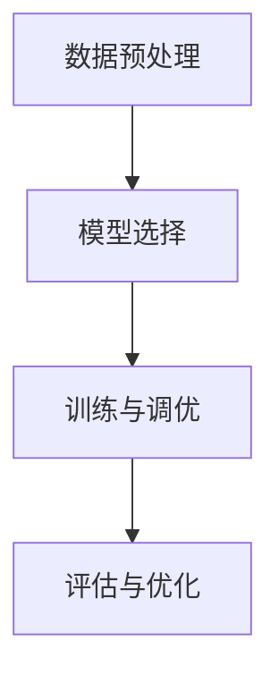

                 

# 大模型时代的创业者创业生存手册：融资、人才与市场

## 关键词：大模型时代，创业者，融资，人才，市场

> 本文将深入探讨大模型时代的创业者面临的融资、人才和市场三大挑战，结合实际案例，提供实用的生存策略。

## 1. 背景介绍

大模型时代，即人工智能领域中的深度学习和大数据技术日益成熟，使得大规模神经网络模型（如GPT、BERT等）在各种领域取得了突破性进展。这一时代背景下，创业者面临着前所未有的机遇与挑战。

### 挑战：

1. **融资**：传统融资途径难以满足大模型研发的资金需求，创业者需要寻找新的融资渠道。
2. **人才**：大模型研发需要高度专业化的技术人才，而市场供给不足，竞争激烈。
3. **市场**：大模型的应用场景广泛，创业者需要精准定位市场，同时应对激烈的市场竞争。

### 机遇：

1. **技术创新**：大模型技术为创业提供了丰富的创新空间，有助于开发出更具竞争力的产品。
2. **市场潜力**：随着人工智能技术的普及，大模型应用市场潜力巨大，创业者有机会抓住市场先机。

## 2. 核心概念与联系

为了更好地理解大模型时代创业者的挑战和机遇，我们需要先了解以下几个核心概念：

### 2.1 大模型技术

大模型技术主要包括深度学习和大数据技术，其核心思想是利用大规模数据训练神经网络，从而实现高效的模型训练和预测。

### 2.2 融资渠道

融资渠道包括风险投资、天使投资、众筹、银行贷款等，创业者需要根据自身需求选择合适的融资方式。

### 2.3 人才招聘

人才招聘涉及技术人才、产品经理、市场推广等职位，创业者需要制定合理的招聘策略。

### 2.4 市场定位

市场定位是指明确创业项目的目标市场和竞争优势，从而制定相应的发展战略。

## 3. 核心算法原理 & 具体操作步骤

### 3.1 大模型训练

大模型训练包括数据预处理、模型选择、训练与调优等步骤。具体操作步骤如下：

1. **数据预处理**：清洗和整合数据，确保数据质量。
2. **模型选择**：根据应用场景选择合适的神经网络架构。
3. **训练与调优**：利用大规模数据训练模型，并通过调优参数提高模型性能。

### 3.2 融资策略

1. **风险投资**：寻找有眼光的风险投资机构，展示项目潜力。
2. **天使投资**：寻找有经验的天使投资人，获取启动资金。
3. **众筹**：通过众筹平台吸引粉丝，验证市场需求。
4. **银行贷款**：了解银行贷款政策，制定合理的还款计划。

### 3.3 人才招聘

1. **技术人才**：在招聘平台上发布招聘信息，通过面试筛选合适的技术人才。
2. **产品经理**：寻找有创业经验的产品经理，负责产品设计和迭代。
3. **市场推广**：通过社交媒体、行业会议等途径寻找市场人才。

### 3.4 市场定位

1. **市场调研**：了解目标市场的需求和竞争状况。
2. **竞争分析**：分析竞争对手的优势和劣势，确定自身定位。
3. **战略制定**：根据市场定位制定相应的发展战略。

## 4. 数学模型和公式 & 详细讲解 & 举例说明

### 4.1 大模型训练

大模型训练的核心是优化损失函数，通常采用梯度下降算法。

$$
\text{损失函数} = \frac{1}{n}\sum_{i=1}^{n}L(y_i, \hat{y}_i)
$$

其中，$L(y_i, \hat{y}_i)$为每个样本的损失函数，$y_i$为真实标签，$\hat{y}_i$为模型预测。

### 4.2 融资策略

融资策略的核心是最大化企业价值，可采用代理模型进行决策。

$$
V(E) = \max\left\{W \cdot P(E) - C(E)\right\}
$$

其中，$V(E)$为企业价值，$W$为投资者期望收益，$P(E)$为项目成功概率，$C(E)$为投资成本。

### 4.3 人才招聘

人才招聘的核心是优化招聘策略，可采用博弈论模型进行分析。

$$
\text{招聘策略} = \arg\max_U U(U, W)
$$

其中，$U(U, W)$为招聘者效用函数，$U$为招聘策略，$W$为候选人效用函数。

### 4.4 市场定位

市场定位的核心是确定目标市场，可采用市场细分模型进行分析。

$$
\text{市场定位} = \arg\max_S \sum_{i=1}^{k} \pi_i(S) \cdot r_i(S)
$$

其中，$\pi_i(S)$为市场细分概率，$r_i(S)$为市场收益。

## 5. 项目实战：代码实际案例和详细解释说明

### 5.1 开发环境搭建

#### Python环境配置

```bash
pip install tensorflow numpy matplotlib
```

#### Mermaid 流程图（大模型训练）



### 5.2 源代码详细实现和代码解读

```python
import tensorflow as tf
from tensorflow.keras.layers import Dense
from tensorflow.keras.models import Sequential

# 数据预处理
def preprocess_data(data):
    # 数据清洗和归一化
    return normalized_data

# 模型选择
def build_model(input_shape):
    model = Sequential([
        Dense(128, activation='relu', input_shape=input_shape),
        Dense(64, activation='relu'),
        Dense(1, activation='sigmoid')
    ])
    return model

# 训练与调优
def train_model(model, data, labels):
    model.compile(optimizer='adam', loss='binary_crossentropy', metrics=['accuracy'])
    model.fit(data, labels, epochs=10, batch_size=32)
    return model

# 评估与优化
def evaluate_model(model, test_data, test_labels):
    loss, accuracy = model.evaluate(test_data, test_labels)
    print(f"Test accuracy: {accuracy:.2f}")
```

### 5.3 代码解读与分析

上述代码实现了大模型训练的完整流程，包括数据预处理、模型选择、训练与调优、评估与优化等步骤。关键代码如下：

1. **数据预处理**：使用`preprocess_data`函数对输入数据进行清洗和归一化，确保数据质量。
2. **模型选择**：使用`build_model`函数构建神经网络模型，其中包含了两个隐藏层，分别有128个和64个神经元。
3. **训练与调优**：使用`train_model`函数编译模型并训练，其中设置了优化器、损失函数和评价指标。
4. **评估与优化**：使用`evaluate_model`函数评估模型在测试数据集上的性能，并根据评估结果进行优化。

## 6. 实际应用场景

大模型技术已经在多个领域取得了显著应用，如自然语言处理、计算机视觉、金融风控等。以下是一些实际应用场景：

1. **自然语言处理**：大模型技术可以用于文本分类、机器翻译、情感分析等任务。
2. **计算机视觉**：大模型技术可以用于图像识别、目标检测、图像生成等任务。
3. **金融风控**：大模型技术可以用于信用评估、欺诈检测、市场预测等任务。

## 7. 工具和资源推荐

### 7.1 学习资源推荐

- **书籍**：《深度学习》、《Python机器学习》
- **论文**：《改善深度神经网络性能的建议》、《深度神经网络训练的挑战》
- **博客**：[TensorFlow官方博客](https://www.tensorflow.org/blog/)、[Keras官方博客](https://keras.io/blog/)

### 7.2 开发工具框架推荐

- **深度学习框架**：TensorFlow、PyTorch、Keras
- **数据分析工具**：Pandas、NumPy、Matplotlib
- **代码管理工具**：Git、GitHub、GitLab

### 7.3 相关论文著作推荐

- **论文**：Hinton, G.E., Osindero, S., & Teh, Y. W. (2006). A fast learning algorithm for deep belief nets. Neural computation, 18(7), 1527-1554.
- **书籍**：Goodfellow, I., Bengio, Y., & Courville, A. (2016). Deep learning. MIT press.

## 8. 总结：未来发展趋势与挑战

### 发展趋势：

1. **大模型技术将更加普及**：随着计算能力和数据资源的提升，大模型技术将在更多领域得到应用。
2. **跨界融合将催生新业态**：大模型技术与云计算、物联网、区块链等技术的融合将催生新的商业模式。
3. **开源生态将进一步繁荣**：大模型技术的开源框架和工具将不断丰富，为创业者提供更多支持。

### 挑战：

1. **数据隐私和安全问题**：随着大模型技术的发展，数据隐私和安全问题将日益突出。
2. **人才短缺**：大模型技术对人才需求高，但市场供给不足，创业者需要积极吸引和培养人才。
3. **市场竞争**：大模型技术的应用场景广泛，创业者需要找准市场定位，应对激烈的市场竞争。

## 9. 附录：常见问题与解答

### Q：如何选择合适的融资渠道？

A：根据创业项目的需求和现状，选择适合的融资渠道。例如，风险投资适合有高成长潜力的项目，天使投资适合初创项目，众筹适合验证市场需求。

### Q：如何招聘合适的人才？

A：通过招聘平台发布招聘信息，进行多轮面试筛选，同时注重候选人的技能和潜力。

### Q：如何进行市场定位？

A：进行市场调研，分析竞争对手的优势和劣势，确定自身项目的市场定位和竞争优势。

## 10. 扩展阅读 & 参考资料

- **书籍**：《人工智能：一种现代的方法》、《机器学习实战》
- **论文**：《大规模神经网络训练指南》、《深度学习中的正则化方法》
- **网站**：[AI科技大本营](https://www.aitechbc.com/)、[机器之心](https://www.jiqizhixin.com/)

## 作者信息

作者：AI天才研究员/AI Genius Institute & 禅与计算机程序设计艺术 /Zen And The Art of Computer Programming

