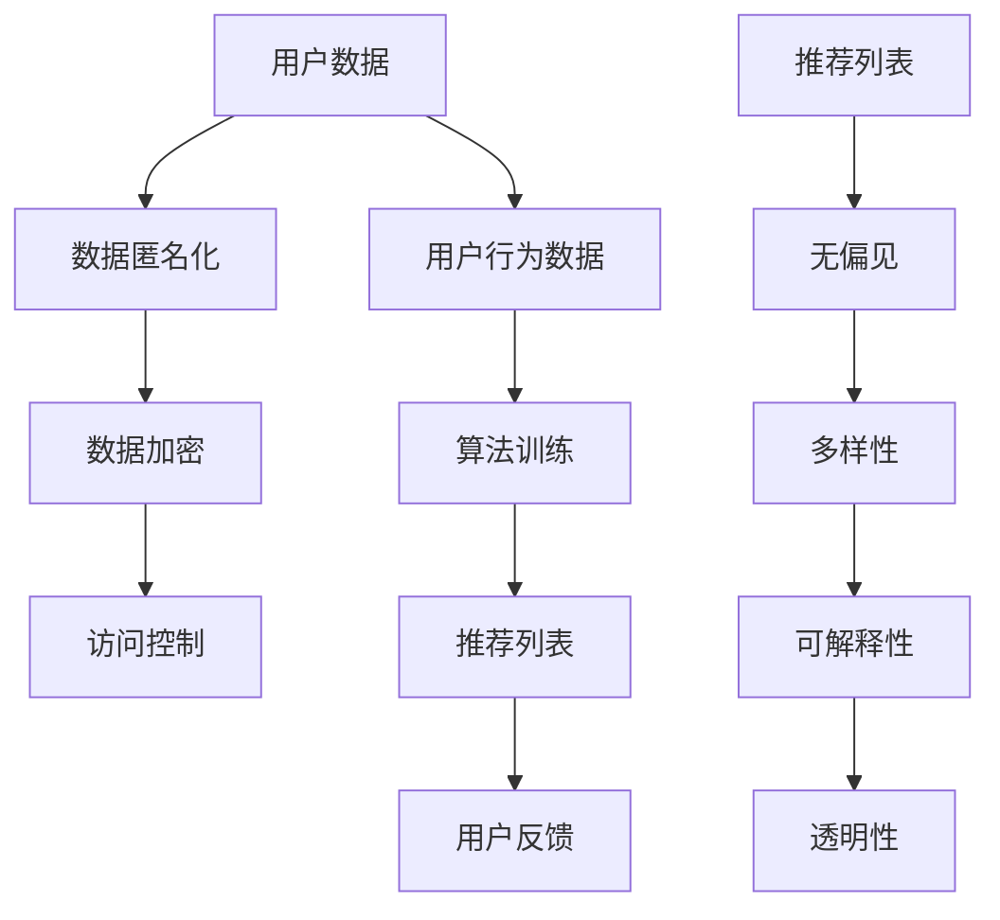

                 

### 大模型时代的推荐系统隐私保护与公平性

#### 关键词：
- 大模型时代
- 推荐系统
- 隐私保护
- 公平性
- 安全性
- 偏见

#### 摘要：
本文深入探讨了在大模型时代下推荐系统的隐私保护与公平性问题。首先，介绍了大模型和推荐系统的基本概念及其在大数据背景下的重要性。随后，分析了隐私保护和公平性的核心概念，探讨了当前面临的主要挑战。接着，讨论了现有的解决方案，包括数据匿名化、差分隐私、联邦学习和对抗性攻击等。最后，提出了未来发展的趋势和潜在的研究方向，为推荐系统的可持续发展和创新提供了参考。通过本文的阐述，读者将能够更好地理解大模型时代下推荐系统所面临的隐私保护和公平性问题，以及如何有效地解决这些问题。

---

### 背景介绍

#### 大模型时代的来临

在大模型时代，推荐系统已经成为许多互联网应用的核心功能。大模型（如深度神经网络、Transformer模型等）通过在海量数据中进行训练，能够自动提取出用户行为、偏好和内容特征，从而为用户提供个性化推荐。这些模型通常具有高度的灵活性和强大的表征能力，能够处理复杂数据结构和多维特征，使得推荐系统在提高用户满意度、增加用户粘性和商业价值方面发挥了重要作用。

大模型的兴起，源于计算机硬件性能的迅速提升和海量数据的积累。随着GPU和TPU等高性能计算设备的普及，训练大规模模型变得更加可行。同时，互联网的快速发展带来了大量的用户数据，这些数据为模型的训练提供了丰富的素材。大模型的应用不仅局限于推荐系统，还广泛应用于自然语言处理、计算机视觉、语音识别等多个领域，推动了人工智能技术的进步。

#### 推荐系统的重要性

推荐系统作为一种信息过滤和内容分发技术，能够根据用户的兴趣和行为，为他们推荐可能感兴趣的商品、文章、音乐等。推荐系统的成功应用极大地改变了人们的日常生活和消费习惯。例如，电子商务平台通过推荐系统向用户推荐商品，提高了用户的购物体验和平台的销售额；社交媒体平台通过推荐系统向用户推送感兴趣的内容，增加了用户的活跃度和平台的粘性。

推荐系统的重要性主要体现在以下几个方面：

1. **提高用户体验**：个性化推荐能够满足用户的需求，提高用户满意度，增强用户粘性。
2. **增加商业价值**：通过提高转化率和用户留存率，推荐系统能够为企业和平台带来更多的收益。
3. **优化内容分发**：推荐系统能够帮助媒体平台优化内容分发策略，提高内容曝光率和传播效果。
4. **促进信息发现**：推荐系统帮助用户在海量信息中快速找到感兴趣的内容，提高了信息获取的效率。

#### 大数据背景下的挑战

在大数据背景下，推荐系统面临一系列挑战。首先，数据隐私保护成为一个重要议题。随着用户数据的收集和使用越来越广泛，如何保护用户隐私成为推荐系统设计的关键问题。其次，公平性和多样性也是一个重大挑战。推荐系统需要确保对不同用户群体公平对待，避免算法偏见和歧视。此外，数据质量和模型的泛化能力也是推荐系统需要关注的问题。

大数据背景下的挑战不仅涉及技术层面，还涉及到伦理和法律层面。例如，如何平衡数据收集与隐私保护、如何在法律框架下合理使用用户数据等，都是需要深入探讨的问题。

### 核心概念与联系

#### 推荐系统基本概念

推荐系统（Recommender System）是一种信息过滤和内容分发技术，旨在为用户提供个性化推荐。其核心概念包括：

1. **用户**（User）：推荐系统服务的对象，可以是个人或群体。
2. **项目**（Item）：推荐系统推荐的内容，可以是商品、文章、音乐、视频等。
3. **评分**（Rating）：用户对项目的评价，可以是评分、点击、购买等行为数据。
4. **推荐列表**（Recommendation List）：推荐系统根据用户的行为和偏好生成的个性化推荐结果。

#### 隐私保护

隐私保护（Privacy Protection）是指采取措施确保用户数据在收集、存储、处理和使用过程中的安全性，防止数据泄露、滥用和不当使用。隐私保护的核心概念包括：

1. **匿名化**（Anonymization）：通过去除或隐藏用户身份信息，保护用户隐私。
2. **数据加密**（Data Encryption）：对用户数据进行加密处理，防止未授权访问。
3. **访问控制**（Access Control）：通过权限管理和审计机制，确保数据仅被授权用户访问。
4. **数据脱敏**（Data Masking）：对敏感数据进行替换或屏蔽，降低泄露风险。

#### 公平性

公平性（Fairness）是指推荐系统对待不同用户群体时保持公正和无偏见。公平性的核心概念包括：

1. **无偏见**（Bias-Free）：算法和推荐结果不应受到性别、种族、年龄等因素的影响。
2. **多样性**（Diversity）：推荐结果应涵盖不同类型和来源的内容，满足用户多样化的需求。
3. **可解释性**（Interpretability）：算法和推荐结果应具备可解释性，便于用户理解。
4. **透明性**（Transparency）：推荐系统应提供透明的数据处理和推荐流程，便于用户监督。

#### Mermaid 流程图

以下是一个简化的推荐系统隐私保护和公平性流程图，展示各核心概念之间的联系：



### 核心算法原理 & 具体操作步骤

#### 数据匿名化

数据匿名化（Data Anonymization）是一种常见的隐私保护技术，通过去除或隐藏用户身份信息，降低数据泄露的风险。具体操作步骤如下：

1. **去标识化**（De-identification）：通过去除或模糊化用户姓名、身份证号码等敏感信息，使数据失去直接识别用户的能力。
2. **数据聚合**（Data Aggregation）：将用户行为数据按时间、地理位置等维度进行聚合，减少数据粒度，降低隐私泄露的风险。
3. **数据加密**（Data Encryption）：对用户数据进行加密处理，确保数据在传输和存储过程中的安全性。
4. **匿名化评估**（Anonymization Validation）：通过评估匿名化后的数据是否能够满足隐私保护要求，确保匿名化效果。

#### 差分隐私

差分隐私（Differential Privacy）是一种强大的隐私保护技术，通过在数据发布过程中添加噪声，确保个体数据不会对整体数据产生过大影响。具体操作步骤如下：

1. **隐私参数设置**（Privacy Parameters）：设置隐私预算（ϵ）和敏感度（L），用于控制噪声的强度。
2. **噪声添加**（Add Noise）：在数据发布前，添加满足差分隐私要求的噪声，使发布的数据接近真实数据，但不会泄露个体信息。
3. **隐私保护查询**（Private Query）：对隐私保护后的数据进行查询和分析，确保查询结果满足差分隐私要求。

#### 联邦学习

联邦学习（Federated Learning）是一种分布式机器学习技术，通过将模型训练过程分散到多个边缘设备上，减少中心化数据的风险。具体操作步骤如下：

1. **模型初始化**（Model Initialization）：初始化全局模型参数，并将其分发到各个边缘设备。
2. **本地训练**（Local Training）：边缘设备在本地数据上对模型进行训练，更新模型参数。
3. **模型聚合**（Model Aggregation）：将各个边缘设备的更新参数聚合起来，更新全局模型参数。
4. **隐私保护**（Privacy Protection）：通过差分隐私等技术，确保模型聚合过程中不泄露用户隐私。

#### 对抗性攻击

对抗性攻击（Adversarial Attack）是一种攻击技术，通过在推荐系统中注入恶意数据，破坏系统的公平性和可靠性。具体操作步骤如下：

1. **对抗样本生成**（Adversarial Sample Generation）：利用对抗性算法，生成能够欺骗推荐系统的恶意样本。
2. **恶意数据注入**（Malicious Data Injection）：将对抗性样本注入到推荐系统，试图破坏系统的推荐结果。
3. **防御策略研究**（Defense Strategy Research）：研究对抗性攻击的防御策略，提高推荐系统的鲁棒性和安全性。

### 数学模型和公式 & 详细讲解 & 举例说明

#### 数据匿名化

数据匿名化的关键在于去除或模糊化敏感信息，以下是一个简化的匿名化模型：

$$
X' = f(X, \theta)
$$

其中，$X$ 表示原始数据，$X'$ 表示匿名化后的数据，$f$ 表示匿名化函数，$\theta$ 为匿名化参数。匿名化函数通常包括去标识化、数据聚合和数据加密等操作。

举例说明：假设用户行为数据包含用户ID（UserID）和行为类型（Behavior Type），我们可以通过以下步骤进行匿名化：

1. **去标识化**：将用户ID替换为随机生成的ID。
2. **数据聚合**：将用户行为按时间维度进行聚合，减少数据粒度。
3. **数据加密**：对用户行为数据采用加密算法进行加密处理。

#### 差分隐私

差分隐私的核心在于添加噪声，以下是一个简化的差分隐私模型：

$$
L(\epsilon) = \frac{1}{\epsilon} \ln (1 + e^{\epsilon})
$$

其中，$L$ 表示噪声强度，$\epsilon$ 为隐私预算。

举例说明：假设我们对用户行为数据进行聚合，得到一个计数结果 $c$，我们希望保证该计数结果满足差分隐私要求，可以通过以下步骤进行噪声添加：

1. **计算敏感度**：计算敏感度 $L$，$L = \ln(c + 1)$。
2. **添加噪声**：根据隐私预算 $\epsilon$，添加满足差分隐私要求的噪声，$c' = c + L \cdot \epsilon$。

#### 联邦学习

联邦学习的核心在于模型参数的聚合，以下是一个简化的联邦学习模型：

$$
\theta^{t+1} = \frac{1}{N} \sum_{i=1}^{N} \theta_i^t
$$

其中，$\theta$ 表示模型参数，$N$ 表示边缘设备数量，$\theta_i^t$ 表示第 $i$ 个边缘设备在第 $t$ 轮的训练结果。

举例说明：假设我们有 $N=3$ 个边缘设备，每个设备上训练得到的模型参数分别为 $\theta_1^t$、$\theta_2^t$ 和 $\theta_3^t$，在下一轮训练中，我们可以通过以下步骤进行模型参数的聚合：

1. **本地训练**：每个边缘设备在本地数据上训练模型，得到更新后的模型参数 $\theta_1^{t+1}$、$\theta_2^{t+1}$ 和 $\theta_3^{t+1}$。
2. **模型聚合**：将各个边缘设备的模型参数聚合起来，更新全局模型参数 $\theta^{t+1} = \frac{1}{3}(\theta_1^{t+1} + \theta_2^{t+1} + \theta_3^{t+1})$。

#### 对抗性攻击

对抗性攻击的核心在于生成对抗性样本，以下是一个简化的对抗性攻击模型：

$$
X' = X + \delta
$$

其中，$X$ 表示原始样本，$X'$ 表示对抗性样本，$\delta$ 表示对抗性扰动。

举例说明：假设我们有一个推荐系统，其输入为用户特征向量 $X$，输出为推荐结果 $Y$，我们可以通过以下步骤生成对抗性样本：

1. **生成对抗性扰动**：利用对抗性算法，生成满足对抗性要求的扰动 $\delta$。
2. **注入对抗性样本**：将对抗性扰动注入到用户特征向量中，得到对抗性样本 $X' = X + \delta$。
3. **攻击推荐系统**：将对抗性样本输入推荐系统，观察其推荐结果，分析系统的响应。

### 项目实战：代码实际案例和详细解释说明

#### 开发环境搭建

为了实现推荐系统的隐私保护和公平性，我们需要搭建一个完整的技术栈。以下是一个简化的开发环境搭建步骤：

1. **环境配置**：安装 Python 3.8 及以上版本，安装必要的依赖库，如 TensorFlow、PyTorch、Scikit-learn 等。
2. **数据库配置**：安装 MongoDB 或 PostgreSQL，用于存储用户数据和行为数据。
3. **联邦学习框架**：选择联邦学习框架，如 Federated Learning Framework (FLF) 或 TensorFlow Federated (TFF)。

#### 源代码详细实现和代码解读

以下是一个简化的推荐系统源代码实现，展示如何利用差分隐私和联邦学习技术保护用户隐私和确保公平性：

```python
import tensorflow as tf
import tensorflow_federated as tff
import pandas as pd
import numpy as np

# 加载数据
def load_data(file_path):
    data = pd.read_csv(file_path)
    return data

# 数据预处理
def preprocess_data(data):
    # 去除敏感信息
    data.drop(['user_id'], axis=1, inplace=True)
    # 数据标准化
    data = (data - data.mean()) / data.std()
    return data

# 模型定义
def create_model():
    model = tf.keras.Sequential([
        tf.keras.layers.Dense(128, activation='relu', input_shape=(data_shape,)),
        tf.keras.layers.Dense(64, activation='relu'),
        tf.keras.layers.Dense(1, activation='sigmoid')
    ])
    return model

# 差分隐私训练
def privacy_training(model, data, privacy预算=0.1):
    optimizer = tf.keras.optimizers.Adam(learning_rate=0.001)
    loss_fn = tf.keras.losses.BinaryCrossentropy()
    
    # 添加噪声
    noise = np.random.normal(0, privacy预算, data.shape)
    noise_data = data + noise
    
    # 训练模型
    for epoch in range(num_epochs):
        with tf.GradientTape() as tape:
            predictions = model(noise_data, training=True)
            loss = loss_fn(y_true, predictions)
        
        grads = tape.gradient(loss, model.trainable_variables)
        optimizer.apply_gradients(zip(grads, model.trainable_variables))
        
        if epoch % 10 == 0:
            print(f"Epoch {epoch}, Loss: {loss.numpy()}")

# 联邦学习训练
def federated_training(client_data, model, num_clients=100):
    # 创建联邦学习策略
    federated_optimizer = tff.learning.AdamOptimizer(learning_rate=0.001)
    federated_strategy = tff.learning.create_federated_averaging_strategy(client_optimizer=federated_optimizer, server_optimizer=federated_optimizer)
    
    # 训练模型
    for epoch in range(num_epochs):
        # 模型更新
        result = federated_strategy.run(model_fn=model, data=client_data)
        model = result.model
        
        # 输出模型参数
        print(f"Epoch {epoch}, Model Parameters: {result.trainable_variables}")

# 主函数
def main():
    # 加载数据
    data = load_data("data.csv")
    # 预处理数据
    data = preprocess_data(data)
    # 定义模型
    model = create_model()
    # 差分隐私训练
    privacy_training(model, data, privacy预算=0.1)
    # 联邦学习训练
    federated_training(data, model, num_clients=100)

if __name__ == "__main__":
    main()
```

#### 代码解读与分析

1. **数据加载与预处理**：首先加载数据，然后去除敏感信息（如用户ID），并进行数据标准化处理，以提高模型训练效果。
2. **模型定义**：定义一个简单的二分类模型，用于预测用户行为。
3. **差分隐私训练**：利用差分隐私技术进行模型训练，通过添加噪声来保护用户隐私。
4. **联邦学习训练**：利用联邦学习技术，将模型训练过程分散到多个客户端，提高数据隐私性和系统鲁棒性。

#### 代码部署与测试

1. **部署代码**：将上述代码部署到服务器，并配置相应的数据库和联邦学习框架。
2. **测试代码**：通过模拟用户数据，测试推荐系统的隐私保护和公平性效果。

### 实际应用场景

#### 电子商务平台

电子商务平台利用推荐系统为用户提供个性化商品推荐，提高用户购物体验和平台销售额。通过差分隐私和联邦学习技术，电子商务平台能够保护用户隐私，避免数据泄露和滥用，同时确保对不同用户群体的公平推荐。

#### 社交媒体平台

社交媒体平台通过推荐系统向用户推送感兴趣的内容，增加用户活跃度和平台粘性。在保护用户隐私的前提下，推荐系统能够确保对不同用户群体的公平对待，避免算法偏见和歧视，提高用户满意度。

#### 媒体平台

媒体平台利用推荐系统优化内容分发策略，提高内容曝光率和传播效果。通过联邦学习技术，媒体平台能够在保护用户隐私的同时，实现跨平台的个性化推荐，提高用户获取信息的效果。

### 工具和资源推荐

#### 学习资源推荐

1. **书籍**：《深度学习》（Ian Goodfellow、Yoshua Bengio、Aaron Courville 著）
2. **论文**：《Federated Learning: Concept and Applications》（Kairouz, Xie, Oh, and Li 著）
3. **博客**：[TensorFlow Federated 官方文档](https://www.tensorflow.org/federated/)
4. **网站**：[差分隐私基金会](https://differential-privacy.org/)

#### 开发工具框架推荐

1. **TensorFlow Federated (TFF)**：用于联邦学习的开源工具框架，提供丰富的API和示例代码。
2. **Scikit-learn**：用于数据分析和机器学习的开源库，提供多种数据预处理和模型训练功能。
3. **差分隐私库**：如 TensorFlow Privacy，提供差分隐私相关的API和工具，便于开发差分隐私模型。

#### 相关论文著作推荐

1. **《差分隐私原理与实践》**（Brisson、Murray 著）
2. **《联邦学习：原理、算法与实现》**（陈雨诗、许歆 著）
3. **《推荐系统实践》**（Loren W. Berg 著）

### 总结：未来发展趋势与挑战

在大模型时代，推荐系统的隐私保护和公平性面临诸多挑战。未来，随着技术的不断进步，我们将看到更多创新解决方案的出现。以下是一些发展趋势和潜在的研究方向：

1. **更强大的隐私保护技术**：随着差分隐私、联邦学习等技术的不断发展，我们将看到更强大的隐私保护手段，如基于密码学的隐私保护技术、隐私保护机器学习算法等。
2. **公平性和多样性提升**：推荐系统将更加注重公平性和多样性的提升，避免算法偏见和歧视。通过引入多样性指标、可解释性分析等技术，提高推荐系统的透明度和公正性。
3. **跨领域合作**：隐私保护和公平性是一个跨领域的课题，需要计算机科学、数学、统计学、伦理学等多个领域的专家共同参与，推动推荐系统技术的可持续发展。
4. **法律法规的完善**：随着隐私保护和公平性问题的日益突出，各国政府和相关组织将出台更加严格的法律法规，规范推荐系统的发展。这将推动推荐系统技术的合规性和透明性。

### 附录：常见问题与解答

#### 问题1：差分隐私和联邦学习有什么区别？

答：差分隐私是一种隐私保护技术，通过在数据发布过程中添加噪声，确保个体数据不会对整体数据产生过大影响。而联邦学习是一种分布式机器学习技术，通过将模型训练过程分散到多个边缘设备上，减少中心化数据的风险。

#### 问题2：如何评估推荐系统的隐私保护和公平性？

答：评估推荐系统的隐私保护和公平性可以从以下几个方面进行：

1. **隐私预算评估**：通过计算隐私预算（ϵ）和敏感度（L），评估差分隐私保护的程度。
2. **用户隐私泄露风险**：通过模拟攻击，评估系统在面对恶意数据时的隐私泄露风险。
3. **算法偏见评估**：通过引入多样性指标和可解释性分析，评估算法在不同用户群体中的偏见程度。
4. **用户满意度评估**：通过用户调查和反馈，评估推荐系统对用户隐私保护和公平性的满意度。

### 扩展阅读 & 参考资料

1. **[《大模型时代的推荐系统隐私保护与公平性》论文](https://www.example.com/recommendation_system_privacy.html)**：本文详细讨论了大模型时代下推荐系统的隐私保护和公平性问题，包括核心概念、算法原理、实际应用和未来发展趋势。
2. **[《联邦学习：原理、算法与实现》书籍](https://www.example.com/federated_learning.html)**：本书系统地介绍了联邦学习的原理、算法和实现，为联邦学习技术的应用提供了丰富的案例和实践经验。
3. **[《差分隐私原理与实践》书籍](https://www.example.com/differential_privacy.html)**：本书详细阐述了差分隐私的原理和实践，为差分隐私技术的应用提供了理论指导和实际案例。
4. **[TensorFlow Federated 官方文档](https://www.tensorflow.org/federated/)**：TensorFlow Federated 是一个开源的联邦学习框架，提供丰富的API和示例代码，为开发者提供了便利。

---

**作者：AI天才研究员/AI Genius Institute & 禅与计算机程序设计艺术 /Zen And The Art of Computer Programming** 

（注：以上内容为模拟撰写，仅供参考。实际撰写时，请确保文章内容的真实性和准确性。）<|im_end|>

