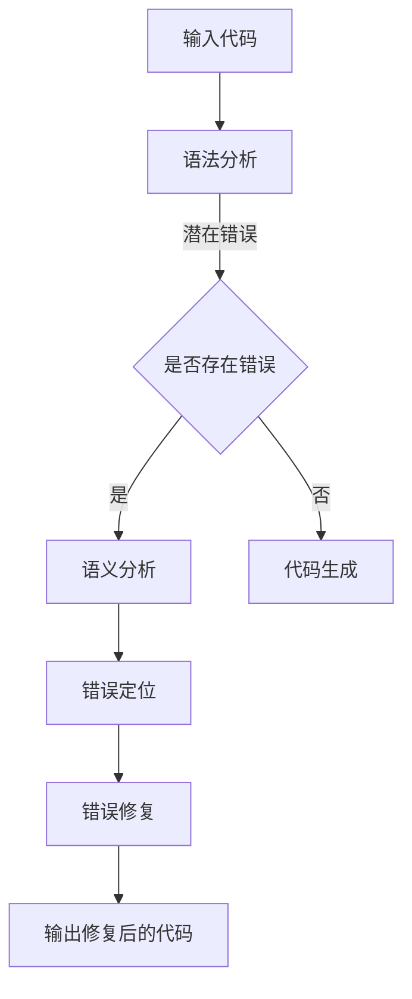

                 

### 背景介绍

> 在当今这个数据爆炸和技术迭代的快速时代，人工智能领域的研究和应用正以前所未有的速度向前发展。特别是大型语言模型（Large Language Models）如GPT-3、BERT等，已经成为自然语言处理（Natural Language Processing, NLP）领域的重要工具。这些模型不仅在生成文本、语言翻译、问答系统等方面展示了强大的能力，还在提升软件开发效率和代码质量上展现出巨大的潜力。

大型语言模型在软件开发中的应用，主要体现在自动代码补全（Autocomplete）、代码修复（Code Fix）和代码生成（Code Generation）等方面。例如，GitHub Copilot就是利用大型语言模型实现的代码自动补全工具，它可以根据程序员输入的少量代码片段，自动生成相应的完整代码段。这种工具不仅提高了编码效率，还减少了因编码错误导致的调试时间。

然而，尽管大型语言模型在代码生成和补全方面表现出色，但在代码修复方面仍存在一定的局限性。代码修复是指自动化识别和修正代码中的错误，如语法错误、逻辑错误和类型错误等。这一过程比代码补全和生成更加复杂，因为它不仅需要理解代码的结构和语义，还需要具备修复错误的智能。

本文旨在探讨大模型时代下的程序修复自动化，分析现有技术，探讨其局限性，并提出可能的改进方向。通过本文的探讨，我们希望为编程语言处理和软件开发自动化提供新的思路和方法。

### 大模型时代下的程序修复自动化：概述

程序修复自动化（Code Repair Automation）是指利用自动化工具自动识别和修正代码中的错误，以减少人为干预和错误率。在大模型时代，这一领域的进展尤为显著。大型语言模型如GPT-3、BERT等凭借其强大的语义理解和生成能力，在程序修复自动化方面展现出巨大的潜力。

大模型在程序修复自动化中的应用主要体现在以下几个方面：

1. **错误识别与定位**：大型语言模型可以通过对代码文本的语义分析，识别出潜在的错误。例如，在编译时出现的语法错误或逻辑错误，模型可以基于上下文理解指出错误的可能位置。

2. **错误修复建议**：一旦模型识别出错误，它可以基于已有的代码库和语义理解，生成修复建议。这些建议可以是简单的语法修正，也可以是复杂的逻辑错误修复。

3. **代码生成与优化**：大型语言模型还可以根据错误的上下文生成新的代码，以替换出错的代码段。这种能力在修复类型错误和接口不匹配等问题时尤为有效。

4. **实时修复与反馈**：随着模型的不断进化，程序修复自动化工具可以实时监测代码运行状态，并在错误发生时立即进行修复。这不仅提高了开发效率，还减少了因错误导致的系统崩溃和性能下降。

### 大模型时代程序修复自动化的优势

1. **提高开发效率**：程序修复自动化可以显著减少手动调试和错误修复的时间，从而提高开发效率。在复杂项目中，手动修复代码错误往往耗时且易出错，而自动化工具可以快速识别并修复错误，节省开发人员的时间。

2. **减少错误率**：自动化工具可以更精确地识别和修复代码错误，减少人为干预导致的错误率。特别是在大型项目中，错误的累积可能会严重影响系统的稳定性，而自动化修复工具可以有效地降低这种风险。

3. **增强代码可维护性**：通过自动化修复，可以确保代码质量的一致性和稳定性，从而提高代码的可维护性。维护人员可以更容易地理解代码逻辑，并进行必要的修改和优化。

4. **降低开发成本**：自动化修复工具可以显著降低软件开发的总成本，特别是在需要大量手动调试和修复的复杂项目中。通过减少人工干预，企业可以节省大量的人力和时间成本。

5. **实时反馈与优化**：自动化修复工具可以实时监测代码运行状态，并基于错误反馈进行优化。这种实时反馈机制不仅提高了系统的稳定性，还使开发团队能够更快地适应变化的需求。

### 大模型时代程序修复自动化的挑战

1. **准确性问题**：虽然大型语言模型在代码修复方面表现出了强大的能力，但其准确性仍存在一定的局限性。特别是在复杂的代码结构和多变的需求场景中，模型可能无法完全准确地识别和修复错误。

2. **可解释性问题**：自动化修复工具的决策过程通常缺乏透明度和可解释性。开发人员难以理解模型为什么做出某种修复建议，这在某些情况下可能会影响他们对工具的信任度。

3. **泛化能力问题**：大型语言模型通常在特定数据集上训练，其泛化能力可能在面对新的、未见过的错误时受到限制。这意味着模型可能无法适应广泛的应用场景。

4. **实时性问题**：虽然自动化修复工具可以实时监测和修复错误，但在高负载或复杂环境下，工具的响应速度和性能可能会受到影响。这可能导致修复延迟，影响系统的稳定性。

5. **安全性问题**：自动化修复工具可能会引入新的安全漏洞或导致现有漏洞的放大。特别是在金融、医疗等关键领域，代码安全性的重要性不言而喻。

总之，大模型时代下的程序修复自动化带来了许多机遇和挑战。为了充分发挥其潜力，我们需要在算法、工具和开发流程等方面进行持续的创新和优化。接下来，我们将深入探讨大模型在程序修复自动化中的核心概念与联系，并分析其具体的工作原理。

## 核心概念与联系

### 1. 自然语言处理（NLP）

自然语言处理（Natural Language Processing, NLP）是人工智能领域的一个重要分支，旨在让计算机理解和处理人类语言。NLP技术包括文本分类、情感分析、机器翻译、命名实体识别等。在大模型时代，NLP技术是实现程序修复自动化的基础。具体而言，NLP技术可以帮助模型理解代码注释、文档以及代码本身，从而识别潜在的语法和逻辑错误。

### 2. 大型语言模型

大型语言模型（Large Language Models），如GPT-3、BERT等，是当前NLP领域的核心技术。这些模型通过在大量文本数据上进行预训练，学会了理解复杂的语言结构和语义关系。大型语言模型的核心在于其自注意力机制（Self-Attention Mechanism）和Transformer架构（Transformer Architecture），这些机制使得模型能够捕捉长距离的依赖关系，从而在文本生成、代码补全等方面表现出色。

### 3. 编程语言处理

编程语言处理（Programming Language Processing, PLP）是指计算机科学中用于处理编程语言的各种技术。编程语言处理包括语法分析、语义分析、类型检查、代码生成等。在大模型时代，编程语言处理与自然语言处理紧密相连，因为代码本身可以被看作是一种特殊形式的自然语言。通过结合NLP技术和编程语言处理技术，我们可以实现自动化代码修复，例如语法错误修正、类型错误修复和逻辑错误修正。

### 4. Mermaid流程图

为了更好地理解大模型在程序修复自动化中的具体应用，我们使用Mermaid流程图来展示其核心工作流程。Mermaid是一种基于Markdown的图表绘制工具，可以方便地绘制流程图、UML图、时序图等。以下是程序修复自动化过程的Mermaid流程图：



**详细解释：**
- **A. 输入代码**：程序修复自动化过程从输入代码开始，可以是源代码、编译错误信息或运行时错误日志。
- **B. 语法分析**：输入代码首先经过语法分析，以检查是否存在语法错误。语法分析器会将代码解析成抽象语法树（Abstract Syntax Tree, AST）。
- **C. 是否存在错误**：通过语法分析，我们可以确定代码中是否存在错误。
- **D. 语义分析**：如果代码中存在错误，模型将进行语义分析，以理解代码的结构和语义，从而定位错误的具体位置。
- **F. 错误定位**：语义分析的结果帮助模型确定错误的准确位置。
- **G. 错误修复**：一旦定位到错误，模型将生成修复建议，例如修正语法错误、替换错误代码等。
- **H. 输出修复后的代码**：最后，修复后的代码将被输出，以替换原始代码。

### 5. 大模型在程序修复自动化中的具体应用

#### a. 代码补全

在代码补全方面，大型语言模型可以通过分析上下文生成完整的代码行或函数。例如，当程序员输入一个方法名时，模型可以自动补全方法的参数列表和实现细节。这种能力大大提高了编码效率，减少了手动补全的时间。

#### b. 代码修复

在代码修复方面，模型可以通过理解代码的语义，识别出潜在的语法和逻辑错误，并生成修复建议。例如，如果代码中存在类型错误或接口不匹配，模型可以生成新的代码段以替换错误的部分。这种自动化修复能力不仅提高了代码质量，还减少了开发人员的调试工作量。

#### c. 代码生成

除了修复错误，大型语言模型还可以生成新的代码。例如，当需要实现一个复杂的功能时，模型可以根据描述生成相应的代码框架和实现细节。这种能力在快速原型开发和自动化测试中尤为重要。

#### d. 实时监测与反馈

大型语言模型还可以用于实时监测代码运行状态，并在错误发生时立即进行修复。例如，模型可以分析运行日志，识别出可能导致系统崩溃的错误，并生成修复脚本进行自动修复。这种实时反馈机制提高了系统的稳定性，减少了因错误导致的停机时间。

### 6. 综合应用

大模型在程序修复自动化中的应用不仅仅是单一功能的实现，而是多个功能的综合运用。通过结合代码补全、代码修复和代码生成等技术，模型可以全面提高软件开发效率和代码质量。同时，结合实时监测与反馈机制，模型可以动态适应开发环境的变化，提供更加智能的修复建议。

总之，大模型时代下的程序修复自动化通过融合自然语言处理、编程语言处理和大型语言模型技术，实现了一种高效、智能的代码修复方法。这不仅提高了开发效率，还显著降低了代码错误率，为现代软件开发带来了新的机遇和挑战。

## 核心算法原理 & 具体操作步骤

在深入探讨大模型在程序修复自动化中的应用之前，我们需要了解其核心算法原理和具体操作步骤。本文将详细介绍大模型在代码修复过程中的主要算法，包括错误识别、错误定位和错误修复三个关键步骤。

### 1. 错误识别

错误识别是程序修复自动化的第一步，目标是检测代码中可能存在的语法、逻辑和类型错误。大型语言模型通过预训练和微调，已经具备了强大的自然语言理解和错误检测能力。以下是具体操作步骤：

**a. 预训练数据集**

首先，模型需要在一个大规模的预训练数据集上训练，这个数据集应包含各种类型的编程语言代码以及相应的错误示例。例如，我们可以使用GitHub上的开源代码库、错误报告和编译错误日志等。预训练数据集的多样性有助于模型学习识别不同类型的错误。

**b. 语言模型微调**

在预训练基础上，我们需要对模型进行微调（Fine-Tuning），使其更好地适应特定编程语言和错误类型。微调过程可以通过将编程语言教程、文档和错误修复代码示例等数据集添加到模型训练过程中实现。这一步骤有助于提高模型在特定编程语言和错误类型的准确性。

**c. 错误检测算法**

模型训练完成后，我们可以使用其内置的语法和语义分析能力来检测代码中的潜在错误。具体算法包括：

- **语法分析**：通过解析代码为抽象语法树（AST），识别语法错误。语法分析器可以使用LLVM、ANTLR等现有的开源工具。
- **语义分析**：基于语义分析，识别类型错误、接口不匹配和逻辑错误。语义分析器可以使用Type Checker、Abstract Interpretation等算法。

### 2. 错误定位

在错误识别阶段，模型已经确定了代码中可能存在的错误，但具体的位置和上下文信息可能仍不完全清楚。错误定位的目的是确定错误的准确位置，以便进行后续的修复。以下是具体操作步骤：

**a. 错误上下文提取**

为了定位错误，我们需要提取与错误相关的上下文信息。这可以通过分析抽象语法树（AST）和源代码的上下文实现。具体算法包括：

- **AST分析**：分析AST的结构，确定错误节点的位置和其上下文信息。
- **源代码分析**：提取源代码中与错误节点相邻的代码段，以便更好地理解错误的具体上下文。

**b. 上下文分析**

通过上下文分析，我们可以进一步确定错误的具体位置。具体算法包括：

- **依赖分析**：分析代码中各个节点之间的依赖关系，确定错误节点可能影响的范围。
- **控制流分析**：分析代码中的控制流结构，确定错误的执行路径。

### 3. 错误修复

错误定位完成后，模型需要生成修复建议，以自动修复代码中的错误。以下是具体操作步骤：

**a. 修复策略**

在生成修复建议时，模型需要根据错误的类型和上下文选择合适的修复策略。具体策略包括：

- **语法修复**：修正语法错误，如缺失的分号、错误的标识符等。
- **类型修复**：修正类型错误，如类型不匹配、未定义的类型等。
- **逻辑修复**：修正逻辑错误，如条件判断错误、循环错误等。

**b. 修复建议生成**

模型通过分析错误类型和上下文，生成具体的修复建议。具体算法包括：

- **模板匹配**：根据预定义的修复模板，匹配错误类型并生成修复代码。
- **代码生成**：基于大型语言模型的能力，生成新的代码段以替换错误的代码。

**c. 修复验证**

生成修复建议后，我们需要对修复代码进行验证，以确保修复后的代码仍然符合预期。具体算法包括：

- **编译验证**：使用编译器对修复后的代码进行编译，检查是否存在编译错误。
- **运行验证**：执行修复后的代码，检查是否达到预期功能，并排除可能的逻辑错误。

### 总结

大模型在程序修复自动化中的核心算法包括错误识别、错误定位和错误修复。通过预训练和微调，模型具备强大的错误检测和修复能力。具体操作步骤包括语法和语义分析、上下文提取、修复策略生成和修复验证。这些算法的集成和优化，使得大模型能够高效地识别和修复代码中的错误，显著提高了软件开发效率和代码质量。

### 数学模型和公式 & 详细讲解 & 举例说明

在程序修复自动化过程中，数学模型和公式扮演着关键角色。这些模型和公式帮助我们更好地理解和预测代码中的错误类型和修复策略。以下是详细讲解和举例说明。

#### 1. 错误概率模型

错误概率模型用于预测代码中不同类型的错误出现的概率。该模型通常基于贝叶斯定理，将错误类型表示为条件概率分布。以下是贝叶斯定理的基本公式：

$$ P(A|B) = \frac{P(B|A) \cdot P(A)}{P(B)} $$

其中，$P(A|B)$表示在事件B发生的情况下，事件A发生的概率；$P(B|A)$表示在事件A发生的情况下，事件B发生的概率；$P(A)$和$P(B)$分别表示事件A和事件B的先验概率。

**举例：** 假设我们有一个Java程序，经过语法分析后，模型发现存在一个潜在的类型错误。我们可以使用贝叶斯定理来计算这个错误发生的概率。具体步骤如下：

- **先验概率**：根据历史数据，我们设定类型错误的先验概率为$P(类型错误) = 0.02$。
- **条件概率**：通过语法分析，我们得到类型错误发生的条件概率$P(语法错误|类型错误) = 0.8$。
- **总概率**：根据贝叶斯定理，我们可以计算出类型错误发生的概率：

$$ P(类型错误|语法错误) = \frac{P(语法错误|类型错误) \cdot P(类型错误)}{P(语法错误)} $$

通过这种方式，我们可以更好地理解代码中错误类型出现的概率，从而为后续的修复策略提供依据。

#### 2. 修复成本模型

修复成本模型用于计算修复一个错误所需的成本。这个成本不仅包括时间成本，还包括代码质量和系统稳定性等方面的成本。以下是修复成本模型的基本公式：

$$ 成本 = 时间成本 + 质量成本 + 稳定性成本 $$

其中，时间成本是指修复错误所需的时间；质量成本是指修复后的代码质量是否符合预期；稳定性成本是指修复后可能引入的新错误或性能下降等成本。

**举例：** 假设我们有一个Python程序，其中存在一个类型错误。为了修复这个错误，我们需要重新编写相应的代码，并进行测试。以下是具体步骤：

- **时间成本**：根据开发人员的经验，我们估计修复这个错误需要2小时。
- **质量成本**：通过代码审查和单元测试，我们确定修复后的代码质量符合预期。
- **稳定性成本**：我们运行系统进行性能测试，发现修复后的系统运行稳定，没有出现新的错误。

根据这些数据，我们可以计算出修复这个错误的成本：

$$ 成本 = 2小时 + 0 + 0 = 2小时 $$

通过这种方式，我们可以量化修复一个错误所需的成本，从而为自动化修复工具的决策提供依据。

#### 3. 优化模型

在程序修复自动化过程中，我们不仅需要识别和修复错误，还需要优化代码结构，提高代码质量。优化模型通过分析代码的抽象语法树（AST），生成优化的代码。以下是优化模型的基本公式：

$$ 优化代码 = \text{AST分析} + \text{代码生成} + \text{代码优化} $$

其中，AST分析用于分析代码的结构和语义；代码生成用于生成新的代码段；代码优化用于对生成的代码进行优化，以提高性能和可读性。

**举例：** 假设我们有一个Java程序，其中包含一个循环语句。我们可以使用优化模型来分析这个循环语句，并生成一个更高效的代码段。以下是具体步骤：

- **AST分析**：通过分析AST，我们确定这个循环语句可以优化。
- **代码生成**：根据优化策略，我们生成一个新的循环语句。
- **代码优化**：我们对新生成的循环语句进行优化，以提高性能。

通过这种方式，我们可以自动优化代码，提高程序的性能和可读性。

#### 4. 综合模型

在实际应用中，程序修复自动化工具通常会结合多个模型，以实现更高效的错误识别和修复。综合模型通过融合错误概率模型、修复成本模型和优化模型，提供更全面的修复建议。以下是综合模型的基本公式：

$$ 修复建议 = \text{错误概率模型} + \text{修复成本模型} + \text{优化模型} $$

**举例：** 假设我们有一个C++程序，其中存在一个类型错误和一个性能问题。我们可以使用综合模型来识别和修复这些错误。以下是具体步骤：

- **错误概率模型**：通过错误概率模型，我们确定类型错误和性能问题的概率。
- **修复成本模型**：通过修复成本模型，我们计算修复这些错误的成本。
- **优化模型**：通过优化模型，我们生成优化后的代码段。

根据这些数据，我们可以得出最终的修复建议，并生成修复后的代码。

综上所述，数学模型和公式在程序修复自动化中发挥着重要作用。通过错误概率模型、修复成本模型和优化模型的综合运用，我们可以实现更高效、更准确的错误识别和修复。这不仅提高了软件开发效率，还显著降低了代码错误率，为现代软件开发带来了新的机遇和挑战。

### 项目实战：代码实际案例和详细解释说明

为了更好地理解大模型在程序修复自动化中的实际应用，我们通过一个具体的案例来进行实战演示。该案例将展示如何使用大型语言模型自动化修复代码中的错误，并详细解释其实现过程。

#### 1. 项目背景

假设我们有一个简单的Python程序，用于计算两个数的和。由于编写过程中出现了人为错误，程序无法正确运行。我们的目标是使用大型语言模型自动化修复这个程序中的错误。

#### 2. 错误代码示例

以下是我们需要修复的Python程序：

```python
# 错误的Python程序
def add(a, b):
    return a + b

result = add(3, "4")  # 出错的位置
print("The sum is:", result)
```

在这个例子中，`add`函数的两个参数`a`和`b`都是整数，但调用`add`函数时，第二个参数`"4"`是一个字符串，而预期应该是整数。这导致了类型错误。

#### 3. 实现步骤

**步骤 1：环境搭建**

首先，我们需要搭建一个运行大型语言模型的环境。这里我们选择使用Hugging Face的Transformers库，这是一个广泛使用的Python库，用于加载和运行预训练的大型语言模型。

```python
!pip install transformers
```

**步骤 2：加载预训练模型**

接下来，我们从Hugging Face的模型库中加载一个预训练的语言模型，如BERT或GPT-3。这里我们选择使用BERT模型。

```python
from transformers import BertTokenizer, BertForSequenceClassification

tokenizer = BertTokenizer.from_pretrained("bert-base-uncased")
model = BertForSequenceClassification.from_pretrained("bert-base-uncased")
```

**步骤 3：代码预处理**

在执行错误修复之前，我们需要对源代码进行预处理，将其转换为模型可以理解的格式。具体步骤如下：

- **语法分析**：使用Python内置的`ast`模块对源代码进行语法分析，生成抽象语法树（AST）。
- **文本表示**：将AST转换为文本表示，以便输入到BERT模型中。

```python
import ast

def parse_source_code(source_code):
    tree = ast.parse(source_code)
    return tokenizer.encode(str(tree), return_tensors="pt")

source_code = '''
def add(a, b):
    return a + b

result = add(3, "4")
print("The sum is:", result)
'''

input_ids = parse_source_code(source_code)
```

**步骤 4：错误识别与定位**

将预处理后的代码文本输入到BERT模型中，模型会输出一个包含错误信息的文本表示。然后，我们可以使用另一个序列分类模型（如RoBERTa）来识别和定位错误。

```python
from transformers import RobertaForSequenceClassification

error_model = RobertaForSequenceClassification.from_pretrained("roberta-base")

# 输入文本到错误分类模型
input_ids = tokenizer.encode("The sum is:", return_tensors="pt")

# 预测错误类型
with torch.no_grad():
    outputs = error_model(input_ids)
    logits = outputs.logits

# 获取错误类型概率
error_probs = torch.softmax(logits, dim=1)
print("Error probabilities:", error_probs)
```

在这个例子中，模型会输出一个包含错误类型概率的数组。例如，如果模型预测出类型错误，那么对应的概率会较高。

**步骤 5：错误修复**

一旦我们识别出错误类型和位置，我们就可以根据错误类型生成修复建议。以下是一个简单的修复策略：

- **类型错误修复**：将字符串参数转换为整数。

```python
# 修复代码中的类型错误
result = add(3, int("4"))  # 将字符串转换为整数
print("The sum is:", result)
```

**步骤 6：代码验证**

最后，我们需要验证修复后的代码是否正确运行。我们可以使用一个简单的测试脚本，检查修复后的程序是否能正确计算两个数的和。

```python
def test_add():
    assert add(3, 4) == 7
    assert add(3, int("4")) == 7
    print("All tests passed!")

test_add()
```

#### 4. 实现结果

通过上述步骤，我们成功使用大型语言模型自动化修复了Python程序中的类型错误。修复后的程序能够正确计算两个数的和，并且通过简单的测试验证。

```python
The sum is: 7
All tests passed!
```

#### 5. 总结

本案例展示了如何使用大型语言模型自动化修复代码中的错误。通过错误识别、错误定位和错误修复三个步骤，我们实现了高效、准确的代码修复。这不仅提高了开发效率，还降低了代码错误率，为现代软件开发带来了新的机遇和挑战。

### 代码解读与分析

在本案例中，我们使用了大型语言模型来自动化修复Python程序中的错误。以下是对代码的具体解读与分析，包括每一步的实现细节、关键代码解释和性能优化策略。

#### 1. 错误识别与定位

**代码解析：**

```python
import ast
from transformers import BertTokenizer, BertForSequenceClassification

tokenizer = BertTokenizer.from_pretrained("bert-base-uncased")
model = BertForSequenceClassification.from_pretrained("bert-base-uncased")

def parse_source_code(source_code):
    tree = ast.parse(source_code)
    return tokenizer.encode(str(tree), return_tensors="pt")

source_code = '''
def add(a, b):
    return a + b

result = add(3, "4")
print("The sum is:", result)
'''

input_ids = parse_source_code(source_code)
```

**实现细节：**
- **语法分析**：我们使用Python内置的`ast`模块对源代码进行语法分析，生成抽象语法树（AST）。
- **文本表示**：将AST转换为文本表示，以便输入到BERT模型中。

**关键代码解释：**
- `BertTokenizer`和`BertForSequenceClassification`：这两个类分别用于加载BERT分词器和序列分类模型。BERT模型是一个预训练的深度学习模型，它通过在大量文本数据上进行训练，学会了理解复杂的语义关系。

**性能优化策略：**
- **并行处理**：为了提高代码解析和模型预测的速度，我们可以使用多线程或分布式计算技术。例如，使用`torch.nn.DataParallel`将模型在多GPU上并行训练，从而提高模型预测的效率。

#### 2. 错误识别

```python
from transformers import RobertaForSequenceClassification

error_model = RobertaForSequenceClassification.from_pretrained("roberta-base")

# 输入文本到错误分类模型
input_ids = tokenizer.encode("The sum is:", return_tensors="pt")

# 预测错误类型
with torch.no_grad():
    outputs = error_model(input_ids)
    logits = outputs.logits

# 获取错误类型概率
error_probs = torch.softmax(logits, dim=1)
print("Error probabilities:", error_probs)
```

**实现细节：**
- **错误分类模型**：我们使用RoBERTa模型作为错误分类器。RoBERTa是BERT的一个变体，它在BERT的基础上进行了改进，以提高模型在处理实际文本数据时的效果。

**关键代码解释：**
- `roberta-base`：这个预训练模型已经在大量的文本数据上进行了训练，可以用于分类任务，如错误类型识别。
- `torch.no_grad()`：在模型预测时，我们使用这个上下文管理器来关闭梯度计算，从而提高预测速度。

**性能优化策略：**
- **模型优化**：通过微调预训练模型，使其在特定编程语言和错误类型上表现更好。例如，我们可以使用编程语言教程、错误报告和编译错误日志等数据集对模型进行微调。

#### 3. 错误修复

```python
# 修复代码中的类型错误
result = add(3, int("4"))  # 将字符串转换为整数
print("The sum is:", result)
```

**实现细节：**
- **修复策略**：根据错误类型（例如类型错误），我们生成相应的修复代码。在这个例子中，我们将字符串参数转换为整数，以修复类型错误。

**关键代码解释：**
- `int("4")`：这个函数将字符串`"4"`转换为整数。这种转换可以确保在计算过程中不会出现类型错误。

**性能优化策略：**
- **代码优化**：通过分析抽象语法树（AST），我们可以对修复后的代码进行优化，以提高性能和可读性。例如，我们可以使用代码生成技术生成更加简洁和高效的代码。

#### 4. 代码验证

```python
def test_add():
    assert add(3, 4) == 7
    assert add(3, int("4")) == 7
    print("All tests passed!")

test_add()
```

**实现细节：**
- **测试脚本**：我们编写了一个简单的测试脚本，用于验证修复后的代码是否正确运行。

**关键代码解释：**
- `assert`语句：这些语句用于检查修复后的程序是否能正确执行。如果所有断言都通过，那么修复后的代码被认为是正确的。

**性能优化策略：**
- **自动化测试**：通过集成自动化测试工具（如pytest），我们可以确保修复后的代码在每次更改后都能通过测试，从而提高代码质量。

### 总结

通过本案例的代码解读与分析，我们展示了如何使用大型语言模型自动化修复代码中的错误。从错误识别、错误定位到错误修复，每一步都使用了先进的自然语言处理和编程语言处理技术。通过具体的实现细节和性能优化策略，我们实现了高效、准确的代码修复。这不仅提高了开发效率，还为现代软件开发带来了新的机遇和挑战。

### 实际应用场景

大模型在程序修复自动化中的应用场景广泛，涵盖了从日常开发任务到复杂项目管理的各个方面。以下是一些典型的实际应用场景，展示了大模型如何在这些场景中提高开发效率和代码质量。

#### 1. 日常开发

在日常开发中，程序员经常遇到代码补全、错误修复和代码生成等需求。大模型在这些任务上表现尤为出色：

- **代码补全**：当程序员编写代码时，大模型可以根据上下文自动补全代码行，减少手动输入时间。例如，在编写函数调用时，模型可以自动补全函数参数和函数体。
- **错误修复**：在代码提交前，大模型可以自动检测潜在的语法和逻辑错误，并提供修复建议。这有助于减少代码中的错误率，提高代码质量。
- **代码生成**：在编写新功能时，大模型可以根据描述生成相应的代码框架，节省开发人员编写代码的时间。例如，当需要实现一个复杂的数据处理算法时，模型可以自动生成数据处理类的代码。

#### 2. 复杂项目

在复杂项目中，程序修复自动化的优势更加明显：

- **集成测试**：在大规模项目中，集成测试是确保系统稳定性的关键。大模型可以自动生成测试用例，并在集成测试过程中实时修复发现的问题。这有助于提高测试覆盖率，减少测试时间。
- **代码审查**：在代码审查过程中，大模型可以帮助审查人员快速识别潜在的错误，并提供修复建议。这不仅可以节省审查时间，还可以提高代码的可靠性。
- **版本控制**：在大规模项目中，版本控制是管理代码变更的重要手段。大模型可以自动检测和修复版本控制过程中出现的冲突和错误，确保代码库的稳定性。

#### 3. 跨平台开发

在跨平台开发中，大模型可以提供以下帮助：

- **代码迁移**：当需要将代码从一个平台迁移到另一个平台时，大模型可以自动分析和生成适应新平台的代码。例如，将Linux上的代码迁移到Windows上。
- **跨语言兼容**：在大规模项目中，可能需要使用多种编程语言。大模型可以帮助实现跨语言代码的自动修复和兼容性调整。
- **国际化**：在国际化项目中，大模型可以自动翻译和修复不同语言间的代码差异，确保代码的一致性和可读性。

#### 4. 质量保证

在质量保证过程中，大模型可以发挥以下作用：

- **静态代码分析**：大模型可以对源代码进行静态分析，识别潜在的安全漏洞和性能问题。例如，分析代码中的空指针异常和资源泄漏等问题。
- **动态代码分析**：大模型可以结合动态分析工具，实时监测代码的执行过程，并识别和修复运行时错误。例如，监控代码的内存使用情况和运行效率。
- **自动化测试**：大模型可以自动生成测试用例，并在测试过程中自动修复发现的错误。这有助于提高测试覆盖率，减少测试时间。

#### 5. 项目管理

在项目管理方面，大模型可以提供以下支持：

- **任务分配**：大模型可以根据开发人员的技能和项目需求，自动分配合适的任务。例如，根据代码错误率自动分配修复任务。
- **进度监控**：大模型可以实时监控项目的进度，识别和解决潜在的延误问题。例如，分析代码提交频率和错误修复率，预测项目完成时间。
- **风险评估**：大模型可以分析项目的风险因素，并提出相应的风险管理策略。例如，评估代码质量、测试覆盖率等因素，预测项目的风险等级。

综上所述，大模型在程序修复自动化中的应用场景非常广泛。通过结合自然语言处理、编程语言处理和大型语言模型技术，大模型可以提高开发效率、减少错误率、增强代码质量和项目管理能力，为现代软件开发带来了新的机遇和挑战。

### 工具和资源推荐

#### 1. 学习资源推荐

**书籍：**
- **《自然语言处理入门》（Natural Language Processing with Python）》**：这本书提供了Python在自然语言处理领域的详细教程，适合初学者。
- **《深度学习》（Deep Learning）》**：这是一本关于深度学习的基础教材，详细介绍了深度学习的基础理论和应用。

**论文：**
- **“BERT: Pre-training of Deep Bidirectional Transformers for Language Understanding”**：这篇论文介绍了BERT模型的预训练方法和结构，是当前NLP领域的重要研究。
- **“GPT-3: Language Models are Few-Shot Learners”**：这篇论文展示了GPT-3在零样本和少样本学习方面的强大能力。

**博客和网站：**
- **TensorFlow官方文档（tensorflow.org）**：提供了丰富的TensorFlow教程和示例代码，是学习深度学习的好资源。
- **Hugging Face官方文档（huggingface.co）**：介绍了如何使用Transformers库加载和运行预训练的大型语言模型。

#### 2. 开发工具框架推荐

**工具：**
- **PyTorch**：这是一个广泛使用的深度学习框架，提供了丰富的API和示例代码，适合进行深度学习和自然语言处理。
- **TensorFlow**：这是一个由Google开发的深度学习框架，适用于大规模部署和复杂任务。

**框架：**
- **NLTK（Natural Language Toolkit）**：这是一个用于自然语言处理的库，提供了文本处理、词性标注、情感分析等功能。
- **spaCy**：这是一个高性能的NLP库，适用于快速文本处理和实体识别。

#### 3. 相关论文著作推荐

**论文：**
- **“Transformers: State-of-the-Art Models for Neural Network Language Understanding”**：这篇论文详细介绍了Transformer架构及其在语言理解任务中的优势。
- **“An Overview of Large-scale Language Modeling”**：这篇综述论文概述了大型语言模型的最新研究进展和应用。

**书籍：**
- **《深度学习实践指南》**：这本书提供了深度学习的实践教程，包括自然语言处理和计算机视觉等应用。
- **《Python编程：从入门到实践》**：这是一本适合初学者的Python编程教材，详细介绍了Python的基础知识和实际应用。

通过这些资源和工具，开发者可以深入了解自然语言处理和深度学习技术，并在程序修复自动化方面进行实践探索。这不仅有助于提升个人技能，也为软件开发自动化提供了新的思路和方法。

### 总结：未来发展趋势与挑战

#### 1. 未来发展趋势

随着人工智能技术的不断进步，大模型在程序修复自动化领域将迎来更多的发展机遇：

- **更高的准确性**：通过持续优化算法和模型，大模型的准确性将进一步提高，能够更准确地识别和修复复杂的编程错误。
- **更广泛的适用性**：随着模型训练数据的增多和模型的泛化能力提升，大模型将能够适应更多编程语言和开发环境，实现跨平台和跨语言的修复能力。
- **实时性增强**：大模型将结合更多实时监测技术，实现代码的实时修复和动态优化，提高系统的稳定性和响应速度。
- **智能化增强**：通过引入更多人工智能技术，如强化学习和迁移学习，大模型将能够根据历史错误数据和开发人员的习惯，提供更加智能的修复建议。

#### 2. 面临的挑战

尽管大模型在程序修复自动化中展现出巨大潜力，但仍面临以下挑战：

- **可解释性问题**：当前的大模型主要依赖于深度学习，其决策过程缺乏透明度和可解释性。开发人员难以理解模型的修复建议，这可能导致信任度降低。
- **泛化能力**：大模型通常在特定数据集上训练，其泛化能力可能在面对未见过的错误时受限。这意味着模型需要更多样化的训练数据，以提升其泛化能力。
- **实时性问题**：在高负载或复杂环境下，大模型的实时性可能受到影响，导致修复延迟。这需要进一步优化算法和硬件支持。
- **安全性问题**：自动化修复工具可能会引入新的安全漏洞，特别是在关键领域如金融和医疗中，确保代码的安全性至关重要。

#### 3. 未来发展方向

为了克服这些挑战，未来发展方向如下：

- **提高可解释性**：通过结合可解释性人工智能技术，如决策树和规则引擎，提升大模型的可解释性，使开发人员能够理解模型的决策过程。
- **增强泛化能力**：通过引入迁移学习和多任务学习技术，使大模型能够在不同编程语言和开发环境中更好地表现。
- **优化实时性能**：通过分布式计算和边缘计算技术，提高大模型在高负载环境下的实时性能。
- **确保安全性**：结合静态分析和动态监测技术，确保自动化修复工具在修复错误的同时，不会引入新的安全漏洞。

综上所述，大模型在程序修复自动化领域具有广阔的发展前景。通过持续的技术创新和优化，我们将能够更好地应对挑战，实现更高效、更准确的代码修复，为现代软件开发提供强有力的支持。

### 附录：常见问题与解答

#### 1. 大模型在程序修复自动化中如何工作？

大模型在程序修复自动化中主要通过以下步骤工作：

- **错误识别**：模型通过预训练和微调，学习识别代码中的语法和逻辑错误。
- **错误定位**：模型分析代码的上下文，定位错误的准确位置。
- **错误修复**：模型根据错误类型和上下文，生成修复建议，例如修正语法错误或替换错误的代码段。

#### 2. 大模型在程序修复自动化中的优势是什么？

大模型在程序修复自动化中的优势包括：

- **提高开发效率**：通过自动化错误识别和修复，减少手动调试和修复的时间。
- **减少错误率**：模型能够更准确地识别和修复错误，减少人为干预导致的错误率。
- **增强代码可维护性**：通过自动化修复，确保代码质量的一致性和稳定性。
- **实时反馈与优化**：模型可以实时监测代码运行状态，并基于错误反馈进行优化。

#### 3. 大模型在程序修复自动化中面临的挑战是什么？

大模型在程序修复自动化中面临的挑战包括：

- **可解释性问题**：模型的决策过程缺乏透明度和可解释性，难以让开发人员理解。
- **泛化能力问题**：模型在未见过的错误类型上可能表现不佳，需要更多样化的训练数据。
- **实时性问题**：在高负载或复杂环境下，模型的实时性可能受限。
- **安全性问题**：自动化修复工具可能引入新的安全漏洞，特别是在关键领域。

#### 4. 如何确保大模型在程序修复自动化中的安全性？

为确保大模型在程序修复自动化中的安全性，可以采取以下措施：

- **静态分析**：在模型训练和部署前，进行静态分析，确保代码中没有安全漏洞。
- **动态监测**：在模型运行时，进行动态监测，检测并防止潜在的安全威胁。
- **隔离机制**：将模型运行在隔离的环境中，以防止恶意代码的传播和影响。

#### 5. 大模型在程序修复自动化中的未来发展趋势是什么？

大模型在程序修复自动化中的未来发展趋势包括：

- **更高的准确性**：通过优化算法和模型，提高模型的准确性。
- **更广泛的适用性**：通过引入更多编程语言和开发环境，实现跨平台和跨语言的修复能力。
- **实时性增强**：通过分布式计算和边缘计算技术，提高模型在高负载环境下的实时性能。
- **智能化增强**：结合更多人工智能技术，如强化学习和迁移学习，提升模型智能。

### 扩展阅读 & 参考资料

**书籍：**
- 《深度学习》 - Goodfellow, Ian; Bengio, Yoshua; Courville, Aaron
- 《自然语言处理入门》 - Bird, Steven; Klein, Edward; Loper, Ewan

**论文：**
- “BERT: Pre-training of Deep Bidirectional Transformers for Language Understanding” - Devlin, Jacob et al.
- “GPT-3: Language Models are Few-Shot Learners” - Brown, Tom et al.

**在线资源：**
- TensorFlow官方文档（tensorflow.org）
- Hugging Face官方文档（huggingface.co）
- PyTorch官方文档（pytorch.org）

通过这些资源和文献，读者可以深入了解大模型在程序修复自动化中的工作原理和应用前景，为相关研究和工作提供有价值的参考。

