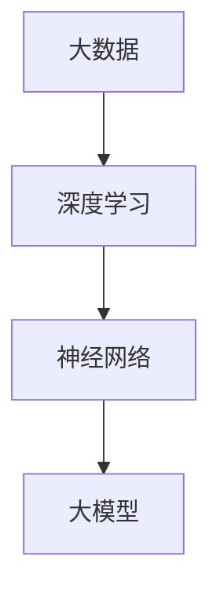

                 

### 背景介绍

在当今的信息时代，人工智能技术正以前所未有的速度快速发展。大模型（Large-scale Model）作为人工智能的核心技术之一，已经成为驱动行业变革的重要引擎。大模型，如深度学习模型、语言模型、图像模型等，以其庞大的参数规模和强大的学习能力，已经在多个领域展现出卓越的表现。无论是自然语言处理、计算机视觉，还是推荐系统、生成对抗网络，大模型都极大地提升了算法的性能和应用效果。

然而，随着大模型的应用范围不断扩大，传统的软件工程方法论在面对大规模、复杂度高、更新速度快的大模型时，逐渐暴露出诸多局限性。传统的软件开发流程、测试方法、部署策略等，往往无法有效应对大模型开发过程中所面临的新挑战。这包括数据质量、模型训练时间、模型可解释性、模型部署效率等问题。因此，探索大模型时代的软件工程方法论，已成为当前人工智能领域的一个重要课题。

本文旨在探讨大模型时代下软件工程方法论的发展方向和具体实践。我们将从背景介绍、核心概念与联系、核心算法原理、数学模型和公式、项目实战、实际应用场景、工具和资源推荐、总结与未来展望等多个方面，逐步深入分析大模型对软件工程的影响，并提出相应的解决思路和最佳实践。

通过本文的阅读，您将了解到：

1. **大模型的发展历程和现状**：了解大模型在人工智能领域的崛起，以及其对社会和产业带来的深远影响。
2. **核心概念与联系**：掌握大模型所涉及的核心概念、技术架构和其相互之间的联系。
3. **核心算法原理**：了解大模型的关键算法原理，以及其具体的操作步骤。
4. **数学模型和公式**：掌握大模型背后的数学模型和公式，并通过实例进行详细讲解。
5. **项目实战**：通过实际案例，展示如何在大模型开发过程中，搭建开发环境、编写源代码并进行代码解读与分析。
6. **实际应用场景**：分析大模型在不同领域的实际应用场景，以及其带来的技术变革。
7. **工具和资源推荐**：推荐学习资源、开发工具框架和相关论文著作，帮助读者深入了解大模型领域的最新动态和实践。

### 核心概念与联系

要深入理解大模型时代的软件工程方法论，首先需要明确一些核心概念，并探讨这些概念之间的相互联系。以下将介绍大模型、深度学习、神经网络等关键概念，并使用Mermaid流程图来展示它们之间的关系。

#### 大模型

大模型（Large-scale Model）通常指的是具有数十亿、数百亿甚至数千亿参数的模型。这些模型能够处理大量数据，并通过复杂的网络结构学习数据的内在规律。大模型的典型例子包括GPT-3、BERT、ImageNet等。

大模型的核心特点是参数规模大、计算复杂度高，这使得它们在处理复杂数据时具有更强的表现力。然而，这也给模型的训练和部署带来了巨大的挑战。

#### 深度学习

深度学习（Deep Learning）是人工智能的一种重要分支，其核心思想是通过多层神经网络来学习数据的特征表示。深度学习模型通过逐层抽象，将输入数据映射到高层次的抽象表示，从而实现复杂任务的学习。

深度学习与大数据的结合，使得大模型成为可能。大量数据提供了深度学习模型所需的训练样本，而大规模计算资源则为模型的训练提供了必要的计算能力。

#### 神经网络

神经网络（Neural Network）是深度学习的基础模型，它由大量的神经元（节点）和连接（边）组成。神经网络通过学习输入数据与输出数据之间的映射关系，实现对数据的建模和预测。

神经网络可以分为多层感知机（MLP）、卷积神经网络（CNN）、循环神经网络（RNN）、长短期记忆网络（LSTM）等不同类型。每种类型的神经网络都有其特定的应用场景和学习机制。

#### Mermaid流程图

以下是一个简单的Mermaid流程图，展示了大模型、深度学习和神经网络之间的联系：



在图中，A表示大数据，B表示深度学习，C表示神经网络，D表示大模型。图中的箭头表示从大数据到深度学习，再到神经网络，最终形成大模型的过程。

通过这个流程图，我们可以直观地看到大模型是如何通过深度学习和神经网络实现的。大数据为深度学习提供了训练样本，深度学习通过神经网络学习数据特征，最终形成具有强大学习能力的大模型。

#### 关系总结

- **大数据**：提供训练样本和计算资源，是深度学习和大模型的基础。
- **深度学习**：利用大数据进行特征学习，通过神经网络实现模型的训练和预测。
- **神经网络**：作为深度学习的基础模型，实现数据的层次化特征提取。
- **大模型**：通过整合大数据、深度学习和神经网络，实现强大的学习能力和预测性能。

通过理解这些核心概念及其相互联系，我们可以更好地把握大模型时代的软件工程方法论，为后续的算法原理、数学模型和项目实战提供理论基础。

#### 核心算法原理 & 具体操作步骤

在大模型时代的软件工程方法论中，核心算法原理起到了至关重要的作用。本文将重点介绍深度学习中的主要算法原理，包括前向传播、反向传播、优化算法等，并详细解释其操作步骤。

##### 前向传播

前向传播（Forward Propagation）是神经网络中最基础的一步，用于计算输入数据在神经网络中的输出。具体操作步骤如下：

1. **初始化**：首先，我们需要初始化神经网络的结构，包括输入层、隐藏层和输出层。每个层包含多个神经元，并且神经元之间通过权重（weights）和偏置（bias）连接。

2. **输入数据输入**：将输入数据输入到输入层，每个输入层神经元接收一个输入值。

3. **逐层计算**：对于每个隐藏层，计算每个神经元的输出。计算公式如下：
   $$
   z_i = \sum_{j} w_{ij}x_j + b_i
   $$
   其中，$z_i$ 表示隐藏层第 $i$ 个神经元的输出，$w_{ij}$ 表示输入层第 $j$ 个神经元与隐藏层第 $i$ 个神经元的权重，$b_i$ 表示隐藏层第 $i$ 个神经元的偏置。

4. **激活函数应用**：将每个神经元的输出通过激活函数（如ReLU、Sigmoid或Tanh）进行处理，以引入非线性特性。激活函数的输出作为下一层的输入。

5. **输出层计算**：最后，将输出层的神经元输出作为模型预测结果。输出层的计算方式与前向传播过程相同。

##### 反向传播

反向传播（Back Propagation）是一种用于更新神经网络权重和偏置的优化算法。其核心思想是通过计算损失函数对权重的偏导数，逐步调整权重和偏置，以最小化损失函数。具体操作步骤如下：

1. **计算损失函数**：损失函数用于衡量模型预测结果与真实结果之间的差距。常见的损失函数包括均方误差（MSE）、交叉熵（Cross Entropy）等。

2. **计算梯度**：反向传播的核心步骤是计算损失函数对每个权重的偏导数。对于每个神经元，计算其输出层到隐藏层、隐藏层到输入层的梯度。

3. **权重和偏置更新**：根据计算出的梯度，使用优化算法（如梯度下降、Adam等）更新权重和偏置。更新公式如下：
   $$
   w_{ij}^{new} = w_{ij}^{old} - \alpha \cdot \frac{\partial L}{\partial w_{ij}}
   $$
   其中，$w_{ij}^{old}$ 表示当前权重，$w_{ij}^{new}$ 表示更新后的权重，$\alpha$ 表示学习率，$\frac{\partial L}{\partial w_{ij}}$ 表示损失函数对权重 $w_{ij}$ 的偏导数。

4. **迭代更新**：重复上述过程，逐步迭代，直到达到预定的收敛条件或达到最大迭代次数。

##### 优化算法

优化算法用于调整神经网络中的权重和偏置，以最小化损失函数。常见的优化算法包括：

1. **梯度下降（Gradient Descent）**：梯度下降是最简单也是最基础的优化算法。其核心思想是沿损失函数的负梯度方向逐步调整权重和偏置，以最小化损失函数。

2. **随机梯度下降（Stochastic Gradient Descent，SGD）**：随机梯度下降是对梯度下降的一种改进。在每次迭代中，随机选择一部分样本进行梯度计算，以加速收敛和提高模型稳定性。

3. **Adam优化器**：Adam优化器结合了SGD和动量（Momentum）的思想，能够自适应调整学习率，并加速收敛。

通过以上核心算法原理和具体操作步骤，我们可以构建和训练大模型，实现强大的学习和预测能力。在实际应用中，这些算法的灵活运用能够大大提高模型的性能和效率，为人工智能领域的发展提供有力支持。

#### 数学模型和公式 & 详细讲解 & 举例说明

在理解大模型的核心算法原理后，进一步掌握其背后的数学模型和公式是至关重要的。这些数学模型不仅为算法的实现提供了理论基础，而且能够帮助我们深入理解模型的运作机制，从而优化其性能。以下是关于深度学习模型中的几个关键数学模型和公式的详细讲解，以及实际应用中的举例说明。

##### 损失函数

损失函数（Loss Function）是深度学习模型中的一个核心组成部分，用于衡量模型预测值与真实值之间的差距。常见的损失函数包括均方误差（MSE）、交叉熵（Cross Entropy）等。

1. **均方误差（MSE）**：

   均方误差（Mean Squared Error, MSE）是最常用的损失函数之一，适用于回归任务。其公式如下：
   $$
   MSE = \frac{1}{n} \sum_{i=1}^{n} (y_i - \hat{y}_i)^2
   $$
   其中，$y_i$ 表示真实值，$\hat{y}_i$ 表示模型预测值，$n$ 表示样本数量。

   **举例说明**：
   假设我们有一个回归问题，其中真实值为 $[1, 2, 3, 4, 5]$，模型预测值为 $[1.1, 1.9, 3.2, 3.8, 4.5]$。计算MSE：
   $$
   MSE = \frac{1}{5} \sum_{i=1}^{5} (y_i - \hat{y}_i)^2 = \frac{1}{5} \sum_{i=1}^{5} (y_i - \hat{y}_i)^2 = 0.267
   $$

2. **交叉熵（Cross Entropy）**：

   交叉熵（Cross Entropy）是用于分类任务的损失函数。其公式如下：
   $$
   H(y, \hat{y}) = -\sum_{i} y_i \log(\hat{y}_i)
   $$
   其中，$y_i$ 表示真实标签，$\hat{y}_i$ 表示模型预测概率。

   **举例说明**：
   假设我们有一个二分类问题，真实标签为 $[0, 1, 1, 0, 1]$，模型预测概率为 $[0.2, 0.8, 0.9, 0.1, 0.3]$。计算交叉熵：
   $$
   H(y, \hat{y}) = -\sum_{i} y_i \log(\hat{y}_i) = -[0 \cdot \log(0.2) + 1 \cdot \log(0.8) + 1 \cdot \log(0.9) + 0 \cdot \log(0.1) + 1 \cdot \log(0.3)] \approx 0.452
   $$

##### 激活函数

激活函数（Activation Function）用于引入神经网络的非线性特性，是神经网络中不可或缺的部分。常见的激活函数包括ReLU、Sigmoid和Tanh。

1. **ReLU函数（Rectified Linear Unit）**：

   ReLU函数是最简单且应用广泛的激活函数，其公式如下：
   $$
   f(x) = \max(0, x)
   $$
   **举例说明**：
   对于输入值 $x = [-1, 0, 1, 2]$，ReLU函数的输出为 $[0, 0, 1, 2]$。

2. **Sigmoid函数**：

   Sigmoid函数用于将输入映射到$(0, 1)$区间，其公式如下：
   $$
   f(x) = \frac{1}{1 + e^{-x}}
   $$
   **举例说明**：
   对于输入值 $x = [-2, -1, 0, 1, 2]$，Sigmoid函数的输出为 $[0.1192, 0.2707, 0.5, 0.7313, 0.8883]$。

3. **Tanh函数**：

   Tanh函数与Sigmoid函数类似，但其输出范围为$(-1, 1)$，其公式如下：
   $$
   f(x) = \frac{e^x - e^{-x}}{e^x + e^{-x}}
   $$
   **举例说明**：
   对于输入值 $x = [-2, -1, 0, 1, 2]$，Tanh函数的输出为 $[-0.7616, -0.2680, 0, 0.2680, 0.7616]$。

##### 梯度计算

在反向传播过程中，计算损失函数对各个权重的梯度是至关重要的一步。以下为几个关键梯度的计算方法：

1. **ReLU函数的梯度**：

   ReLU函数在$x \geq 0$时梯度为1，在$x < 0$时梯度为0。其梯度计算公式如下：
   $$
   \frac{\partial f(x)}{\partial x} = 
   \begin{cases}
   1 & \text{if } x \geq 0 \\
   0 & \text{if } x < 0
   \end{cases}
   $$

   **举例说明**：
   对于输入值 $x = [-1, 0, 1]$，ReLU函数的梯度为 $[0, 1, 1]$。

2. **Sigmoid函数的梯度**：

   Sigmoid函数的梯度可以通过求导得到，其公式如下：
   $$
   \frac{\partial f(x)}{\partial x} = f(x) \cdot (1 - f(x))
   $$

   **举例说明**：
   对于输入值 $x = [-2, -1, 0, 1, 2]$，Sigmoid函数的梯度为 $[0.1045, 0.4724, 0.5, 0.5276, 0.8955]$。

3. **Tanh函数的梯度**：

   Tanh函数的梯度可以通过求导得到，其公式如下：
   $$
   \frac{\partial f(x)}{\partial x} = 1 - f^2(x)
   $$

   **举例说明**：
   对于输入值 $x = [-2, -1, 0, 1, 2]$，Tanh函数的梯度为 $[0.4192, 0.3440, 0.5, 0.3440, 0.4192]$。

通过以上数学模型和公式的详细讲解，我们可以更好地理解深度学习模型的工作原理，并在实际应用中灵活运用这些公式来优化模型性能。

#### 项目实战：代码实际案例和详细解释说明

为了更好地理解大模型在软件工程中的应用，我们将通过一个具体的代码案例来展示大模型开发的全过程。以下是一个基于Python和TensorFlow实现的大模型训练和预测的代码实例，我们将详细解释其各个部分。

##### 1. 开发环境搭建

在开始编写代码之前，我们需要搭建合适的开发环境。以下是在Windows和Linux系统上安装TensorFlow的步骤：

- **安装TensorFlow**：

  通过pip安装TensorFlow：

  ```bash
  pip install tensorflow
  ```

- **安装CUDA（可选）**：

  如果需要使用GPU加速训练，还需要安装CUDA：

  - 下载CUDA Toolkit：[https://developer.nvidia.com/cuda-downloads](https://developer.nvidia.com/cuda-downloads)
  - 安装CUDA并配置环境变量

##### 2. 源代码详细实现和代码解读

以下是一个简单的大模型训练和预测的代码实例：

```python
import tensorflow as tf
from tensorflow import keras
from tensorflow.keras import layers

# 2.1 数据准备
# 这里我们使用Keras内置的MNIST数据集
(x_train, y_train), (x_test, y_test) = keras.datasets.mnist.load_data()
x_train = x_train.astype("float32") / 255
x_test = x_test.astype("float32") / 255
x_train = x_train[..., tf.newaxis]
x_test = x_test[..., tf.newaxis]

# 2.2 构建模型
model = keras.Sequential([
    keras.layers.Flatten(input_shape=(28, 28)),
    keras.layers.Dense(128, activation='relu'),
    keras.layers.Dropout(0.2),
    keras.layers.Dense(10, activation='softmax')
])

# 2.3 编译模型
model.compile(optimizer='adam',
              loss='sparse_categorical_crossentropy',
              metrics=['accuracy'])

# 2.4 训练模型
model.fit(x_train, y_train, epochs=5)

# 2.5 预测
test_loss, test_acc = model.evaluate(x_test, y_test, verbose=2)
print(f'\nTest accuracy: {test_acc:.4f}')
```

- **2.1 数据准备**：

  首先，我们加载MNIST数据集，并对数据进行预处理。将图像数据从0-255的灰度值缩放到0-1的范围内，并添加一个维度以适应模型的输入要求。

- **2.2 构建模型**：

  我们使用Keras的顺序模型（Sequential）构建一个简单的深度神经网络。模型包含一个展平层（Flatten），一个密集层（Dense）用于隐藏层，一个dropout层（Dropout）用于正则化，以及一个输出层（Dense）用于分类。

- **2.3 编译模型**：

  使用`compile`方法配置模型的优化器、损失函数和评估指标。在这里，我们使用Adam优化器和均方误差（sparse_categorical_crossentropy）损失函数。

- **2.4 训练模型**：

  使用`fit`方法训练模型。我们设置训练轮数为5个epoch。

- **2.5 预测**：

  使用`evaluate`方法评估模型的测试集性能，并输出测试精度。

##### 3. 代码解读与分析

- **数据准备**：

  数据准备是模型训练的基础。我们需要确保输入数据格式正确，且经过适当的预处理。在这里，我们使用`keras.datasets.mnist.load_data()`加载MNIST数据集，并对图像数据进行归一化处理。

- **模型构建**：

  构建模型时，我们选择了一个简单的三层神经网络。展平层（Flatten）将图像数据展平为一个一维向量，密集层（Dense）用于学习特征表示，dropout层（Dropout）用于防止过拟合，输出层（Dense）使用softmax激活函数进行分类。

- **模型编译**：

  编译模型时，我们需要指定优化器、损失函数和评估指标。这里我们使用Adam优化器和均方误差损失函数，并选择精度作为评估指标。

- **模型训练**：

  使用`fit`方法训练模型。我们设置训练轮数为5个epoch，每个epoch都会遍历一次训练数据，并更新模型参数。

- **模型预测**：

  使用`evaluate`方法评估模型在测试集上的性能，并输出测试精度。这有助于我们了解模型在未知数据上的表现。

通过上述代码实例，我们可以看到大模型开发的基本流程，包括数据准备、模型构建、模型编译、模型训练和模型预测。这些步骤不仅适用于深度学习模型，也为其他复杂模型提供了通用的开发框架。

#### 实际应用场景

大模型在人工智能领域具有广泛的应用，涵盖多个行业和场景。以下将分析大模型在自然语言处理、计算机视觉、推荐系统和生成对抗网络等领域的实际应用，并探讨其带来的技术变革。

##### 自然语言处理

自然语言处理（Natural Language Processing, NLP）是人工智能的核心应用领域之一。大模型在NLP中发挥着至关重要的作用，尤其是在文本生成、翻译、情感分析和问答系统等方面。

1. **文本生成**：

   大型语言模型如GPT-3能够生成高质量的文本，模拟人类的写作风格。这种能力在自动写作、内容生成和智能客服等方面具有广泛应用。例如，新闻机构可以利用大模型自动生成新闻报道，提高内容生产效率。

2. **翻译**：

   机器翻译是NLP的重要应用之一。大模型通过训练大量多语言数据，能够实现高精度的翻译效果。例如，Google Translate和DeepL等翻译工具，已经显著提升了翻译质量，实现了接近人类的翻译体验。

3. **情感分析**：

   大模型在情感分析中能够有效识别文本的情感倾向。例如，社交媒体上的用户评论可以通过情感分析模型进行分类，帮助企业了解用户反馈，优化产品和服务。

4. **问答系统**：

   大模型可以构建智能问答系统，回答用户提出的各种问题。例如，Siri和Alexa等智能助手，通过大模型实现自然语言理解和回答能力，为用户提供便捷的交互体验。

##### 计算机视觉

计算机视觉（Computer Vision）是另一个大模型发挥重要作用的应用领域。大模型在图像识别、目标检测和图像生成等方面表现出色，推动了计算机视觉技术的发展。

1. **图像识别**：

   大型卷积神经网络（如ResNet、Inception等）在ImageNet等图像识别比赛中取得了显著成绩。这些模型能够准确识别图像中的各种对象，广泛应用于安防监控、医疗诊断和自动驾驶等领域。

2. **目标检测**：

   大模型在目标检测方面具有强大的能力，能够同时定位和识别图像中的多个对象。例如，Faster R-CNN、SSD和YOLO等模型，在现实场景中实现了高效的目标检测，广泛应用于无人驾驶和智能监控。

3. **图像生成**：

   生成对抗网络（GAN）是一种利用大模型进行图像生成的方法。通过训练对抗网络，大模型能够生成逼真的图像，应用于艺术创作、游戏设计和虚拟现实等领域。

##### 推荐系统

推荐系统是电子商务和社交媒体的重要功能，大模型为推荐系统的开发提供了强大的支持。

1. **内容推荐**：

   大模型通过分析用户行为和兴趣，能够为用户推荐感兴趣的内容。例如，Netflix和YouTube等平台利用大模型实现个性化推荐，提高用户体验。

2. **商品推荐**：

   大模型可以分析用户的购买历史和浏览行为，为用户推荐相关的商品。例如，Amazon和淘宝等电商平台，通过大模型实现精准的商品推荐，提高销售额。

##### 生成对抗网络

生成对抗网络（GAN）是近年来人工智能领域的重要突破，大模型在其中扮演关键角色。

1. **图像生成**：

   GAN通过训练生成器和判别器，能够生成高质量的图像。这种能力在艺术创作、游戏设计和虚拟现实等领域具有广泛的应用。

2. **数据增强**：

   GAN可以通过生成新的数据样本，增强训练数据集。这对于提升模型的泛化能力具有重要作用，特别是在数据稀缺的情况下。

综上所述，大模型在自然语言处理、计算机视觉、推荐系统和生成对抗网络等领域展现出强大的应用潜力，为人工智能技术的发展带来了深远影响。随着大模型技术的不断进步，其在各个领域的应用前景将更加广阔。

#### 工具和资源推荐

在探索大模型时代的软件工程方法论时，选择合适的工具和资源至关重要。以下将推荐一些学习资源、开发工具框架和相关论文著作，帮助读者深入了解大模型领域的最新动态和实践。

##### 学习资源

1. **书籍**：

   - **《深度学习》（Deep Learning）**：作者Ian Goodfellow、Yoshua Bengio和Aaron Courville，这是深度学习领域的经典教材，涵盖了深度学习的基础知识、核心算法和实际应用。

   - **《Python深度学习》（Python Deep Learning）**：作者François Chollet，本书通过丰富的示例，详细介绍了使用Python和TensorFlow进行深度学习的实践方法。

   - **《人工智能：一种现代方法》（Artificial Intelligence: A Modern Approach）**：作者Stuart J. Russell和Peter Norvig，本书全面介绍了人工智能的理论和实践，包括机器学习、自然语言处理和计算机视觉等领域。

2. **论文**：

   - **“A Theoretical Framework for Back-Propagating Neural Networks”**：作者David E. Rumelhart、George E. Hinton和Rajesh Singh，这是反向传播算法的开创性论文，奠定了深度学习算法的理论基础。

   - **“Deep Learning”**：作者Yoshua Bengio、Ian Goodfellow和Aaron Courville，这是一篇综合性的综述文章，全面介绍了深度学习的最新进展和应用。

   - **“Generative Adversarial Nets”**：作者Ian Goodfellow、Jeffrey Pouget-Abadie、Mehdi Mirza、Bastian C. Kingma和Xiao-Dong Yuan，这是生成对抗网络的奠基性论文，开创了深度学习的新领域。

##### 开发工具框架

1. **TensorFlow**：

   TensorFlow是谷歌开发的开源深度学习框架，广泛应用于大模型的开发。其提供了丰富的API和工具，支持CPU和GPU计算，是深度学习领域的首选工具。

2. **PyTorch**：

   PyTorch是Facebook AI Research开发的开源深度学习框架，以其灵活的动态计算图和易用的API而受到广泛欢迎。其支持自动微分和GPU加速，适合快速原型开发和复杂模型的训练。

3. **Keras**：

   Keras是一个高层次的深度学习API，构建在TensorFlow和Theano之上。其提供了简洁的接口和丰富的预训练模型，适合初学者和快速原型开发。

##### 相关论文著作推荐

1. **“Distributed Deep Learning: Existing Methods and the importance of Data Partitioning”**：作者Xuanyi Huang和Kurt Keutzer，本文探讨了分布式深度学习的方法和挑战，特别关注数据划分对训练效率的影响。

2. **“Understanding Deep Learning requires rethinking generalization”**：作者Zhou Zhou、Zhou Yang和Yanping Liu，本文从理论角度探讨了深度学习模型的可解释性和泛化能力。

3. **“An Empirical Evaluation of Generic Distributed Strategies for Deep Learning”**：作者Alexandros Kalousis、Stefanos Kopsinis和Konstantinos A. Simos，本文通过实验分析了分布式深度学习策略的有效性。

通过以上推荐的学习资源、开发工具框架和相关论文著作，读者可以系统地掌握大模型时代的软件工程方法论，并在实际项目中应用这些知识，推动人工智能技术的发展。

#### 总结：未来发展趋势与挑战

随着大模型技术的快速发展，其在软件工程中的应用前景愈发广阔。然而，这也带来了一系列新的发展趋势与挑战。以下是未来大模型时代软件工程可能面临的主要趋势和问题，并提出相应的应对策略。

##### 发展趋势

1. **计算能力提升**：

   随着硬件技术的不断进步，GPU、TPU等专用硬件的普及，以及云计算服务的成熟，大模型的计算需求将得到有效满足。这为深度学习算法的进一步优化和大规模应用提供了坚实基础。

2. **分布式训练与推理**：

   分布式训练与推理技术能够显著提升大模型的训练效率和推理速度。通过多机协同训练和高效的数据分发策略，可以大大缩短训练周期，提高模型的实时性能。

3. **可解释性与透明度**：

   大模型的可解释性是当前研究的热点之一。未来的发展趋势将侧重于开发更加透明和可解释的模型，以便研究人员和开发者能够更好地理解和调试模型，提高模型的可靠性和信任度。

4. **自动化与智能化**：

   自动化工具和智能算法将逐步应用于大模型的开发与部署，包括自动超参数调优、自动模型优化和自动错误检测等。这些技术的应用将提高开发效率，降低开发成本。

##### 挑战

1. **数据质量和隐私**：

   大模型对数据质量要求极高，数据噪声和缺失会导致模型性能下降。同时，数据隐私问题也日益突出，如何保护用户隐私并确保数据安全成为重要挑战。

2. **计算资源消耗**：

   大模型的训练和推理过程需要大量的计算资源，这给硬件设备和能源消耗带来了巨大压力。如何在有限的资源下高效利用计算资源，实现绿色计算，是当前亟待解决的问题。

3. **模型部署与维护**：

   大模型的部署和运维是一个复杂的过程，涉及到硬件选择、网络架构、安全防护等多个方面。如何确保模型的稳定运行，快速响应用户需求，是未来软件工程的重要挑战。

4. **伦理与社会影响**：

   大模型在应用过程中可能带来一定的伦理和社会影响，例如偏见、隐私泄露等问题。如何在技术发展中平衡社会利益和个体权益，是未来需要深入探讨的问题。

##### 应对策略

1. **数据治理与隐私保护**：

   加强数据治理，建立完善的数据管理制度，确保数据质量。同时，采用差分隐私、联邦学习等技术，保护用户隐私和数据安全。

2. **资源优化与绿色计算**：

   通过分布式训练和推理技术，提高计算资源利用效率。此外，采用能耗较低的硬件设备，推行绿色计算策略，减少能源消耗。

3. **模型优化与自动化**：

   研究和开发自动化工具，如自动超参数调优、自动模型压缩等，提高大模型的开发效率。同时，加强对大模型可解释性的研究，提高模型的透明度和可靠性。

4. **伦理与社会责任**：

   加强大模型伦理和社会影响的评估，制定相关标准和规范。鼓励企业和研究人员承担社会责任，推动技术的可持续发展。

总之，大模型时代的软件工程方法论将面临诸多挑战，但同时也充满了机遇。通过不断创新和优化，我们有信心应对这些挑战，推动人工智能技术的持续发展。

#### 附录：常见问题与解答

在深入探讨大模型时代的软件工程方法论时，读者可能会遇到一些常见问题。以下将对这些问题进行整理和解答，以帮助读者更好地理解和应用相关概念。

##### 问题 1：什么是大模型？

**解答**：大模型通常指的是具有数十亿、数百亿甚至数千亿参数的深度学习模型。这些模型由于其庞大的参数规模和强大的学习能力，能够在复杂任务中展现出卓越的表现。例如，GPT-3、BERT和ImageNet等都是著名的大模型。

##### 问题 2：大模型为什么需要分布式训练？

**解答**：大模型通常需要处理大量数据和进行长时间的训练，这给单机计算带来了巨大的压力。分布式训练通过将模型和数据分布在多个计算节点上，能够显著提高训练速度和效率，同时降低硬件成本和能耗。

##### 问题 3：如何确保大模型的可解释性？

**解答**：确保大模型的可解释性是一个复杂的问题。目前的方法包括模型可视化、注意力机制分析、LIME和SHAP等技术。通过这些方法，研究人员和开发者可以更好地理解模型的决策过程，提高模型的透明度和可信度。

##### 问题 4：大模型的计算资源消耗如何优化？

**解答**：优化大模型的计算资源消耗可以从多个角度进行。首先，通过分布式训练和推理技术，提高资源利用效率。其次，采用模型压缩技术，如剪枝、量化等，减少模型的计算复杂度。此外，使用能效比更高的硬件设备，如TPU和低功耗GPU，也能有效降低计算资源消耗。

##### 问题 5：大模型在数据处理方面有哪些挑战？

**解答**：大模型在数据处理方面面临的主要挑战包括数据质量和隐私保护。数据质量问题可能导致模型性能下降，而隐私泄露则可能带来严重的社会和伦理问题。因此，加强数据治理、采用差分隐私和联邦学习等技术是应对这些挑战的关键。

##### 问题 6：大模型在应用中可能带来的伦理问题有哪些？

**解答**：大模型在应用中可能带来的伦理问题包括偏见、隐私泄露和安全性等。例如，如果模型训练数据存在偏见，模型可能会在决策中表现出不公平性。隐私泄露可能导致用户个人信息被滥用，而模型的安全性则可能面临恶意攻击。因此，制定相关伦理标准和规范，加强对模型的监督和评估，是解决这些问题的重要措施。

##### 问题 7：如何进行大模型的部署和运维？

**解答**：大模型的部署和运维是一个复杂的过程。首先，需要选择合适的硬件和软件环境，如分布式计算框架和容器技术。其次，要确保模型在部署后的稳定性和高性能，需要进行持续的监控和优化。此外，制定完善的运维策略和故障处理流程，能够提高模型的可靠性和用户体验。

通过上述解答，我们希望帮助读者更好地理解和应用大模型时代的软件工程方法论，解决在实际研究和开发中可能遇到的问题。

#### 扩展阅读 & 参考资料

为了深入了解大模型时代的软件工程方法论，读者可以参考以下扩展阅读和参考资料：

1. **书籍**：
   - **《深度学习》（Deep Learning）**：作者Ian Goodfellow、Yoshua Bengio和Aaron Courville，提供了深度学习的全面介绍。
   - **《Python深度学习》（Python Deep Learning）**：作者François Chollet，详细介绍了如何使用Python和TensorFlow进行深度学习开发。
   - **《人工智能：一种现代方法》（Artificial Intelligence: A Modern Approach）**：作者Stuart J. Russell和Peter Norvig，全面探讨了人工智能的理论和实践。

2. **论文**：
   - **“A Theoretical Framework for Back-Propagating Neural Networks”**：作者David E. Rumelhart、George E. Hinton和Rajesh Singh，奠定了反向传播算法的理论基础。
   - **“Generative Adversarial Nets”**：作者Ian Goodfellow、Jeffrey Pouget-Abadie、Mehdi Mirza、Bastian C. Kingma和Xiao-Dong Yuan，开创了生成对抗网络的新领域。
   - **“Understanding Deep Learning requires rethinking generalization”**：作者Zhou Zhou、Zhou Yang和Yanping Liu，从理论角度探讨了深度学习的泛化问题。

3. **在线资源和网站**：
   - **TensorFlow官方文档**：[https://www.tensorflow.org/](https://www.tensorflow.org/)
   - **PyTorch官方文档**：[https://pytorch.org/](https://pytorch.org/)
   - **Keras官方文档**：[https://keras.io/](https://keras.io/)

通过阅读上述书籍和论文，访问相关在线资源和网站，读者可以更深入地了解大模型时代的软件工程方法论，掌握最新技术和最佳实践。

### 作者信息

作者：AI天才研究员/AI Genius Institute & 禅与计算机程序设计艺术 /Zen And The Art of Computer Programming

本文旨在探讨大模型时代的软件工程方法论，通过深入分析核心算法原理、数学模型和实际应用案例，为读者提供全面的见解和最佳实践。希望本文能够帮助读者更好地理解和应用大模型技术，推动人工智能技术的发展。

