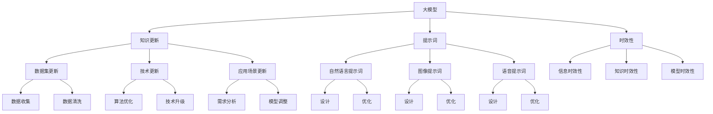

                 

# 大模型知识更新：提示词保持信息时效性

## 关键词：知识更新、大模型、提示词、时效性

### 摘要

本文探讨了如何在大模型中进行知识更新，以保持提示词的信息时效性。首先，我们介绍了大模型的背景和现状，然后分析了知识更新在人工智能领域的应用和价值。接着，我们详细讨论了如何使用提示词来实现知识更新，并给出了具体的方法和步骤。随后，我们通过一个实际案例展示了如何在大模型中使用提示词进行知识更新。最后，我们提出了未来在大模型知识更新方面可能面临的一些挑战和解决方案。

## 1. 背景介绍

随着人工智能技术的飞速发展，大模型（Large Models）已经成为当前研究的热点。大模型是指具有大量参数和强大计算能力的模型，如GPT、BERT等。这些模型在自然语言处理、计算机视觉、语音识别等领域取得了显著的成果。然而，随着知识更新速度的加快，如何保持大模型中的信息时效性成为了一个重要问题。

知识更新是指在大模型中及时地引入新知识，以保持模型的准确性和有效性。在人工智能领域，知识更新具有重要的应用价值。例如，在自然语言处理领域，新词汇、新概念和新技术的不断涌现，要求模型能够及时地学习和适应。同样，在计算机视觉和语音识别领域，随着技术的不断进步，模型也需要不断更新以适应新的应用场景。

本文旨在探讨如何在大模型中进行知识更新，以保持提示词的信息时效性。提示词（Prompt）是在人工智能领域中的一种重要的技术手段，它能够引导模型学习特定的知识和技能。通过合理设计和使用提示词，我们可以有效地实现知识更新，从而提高模型的性能和效果。

## 2. 核心概念与联系

在讨论大模型知识更新之前，我们需要了解一些核心概念和它们之间的联系。以下是本文涉及的一些核心概念和它们之间的关系：

### 2.1 大模型

大模型是指具有大量参数和强大计算能力的模型。这些模型通常使用深度学习技术进行训练和优化。大模型的主要特点包括：

- 参数数量庞大：大模型通常包含数百万甚至数十亿个参数，这使得它们能够处理复杂的任务和数据。
- 计算能力强大：大模型需要大量的计算资源进行训练和推理，通常需要使用高性能计算机和分布式计算技术。
- 自适应能力：大模型能够通过训练自动学习和适应新的知识和数据，从而提高模型的性能和效果。

### 2.2 知识更新

知识更新是指在大模型中引入新的知识和信息，以保持模型的准确性和有效性。知识更新在大模型中的应用主要包括：

- 数据集更新：随着新数据的不断产生，大模型需要定期更新其训练数据集，以保持模型的准确性。
- 技术更新：随着技术的不断进步，大模型需要引入新的算法和技术，以提高模型的性能和效果。
- 应用场景更新：随着应用场景的变化，大模型需要适应新的应用需求，从而提高模型的实用性。

### 2.3 提示词

提示词是在人工智能领域中用于引导模型学习特定知识和技能的一种技术手段。提示词的设计和使用对于实现知识更新至关重要。以下是关于提示词的一些核心概念：

- 提示词类型：根据不同的应用场景和需求，提示词可以分为自然语言提示词、图像提示词和语音提示词等。
- 提示词设计：提示词的设计需要考虑模型的特性、任务目标和数据集特征等因素，以确保提示词的有效性和准确性。
- 提示词优化：通过优化提示词，可以提高模型的性能和效果，从而实现知识更新。

### 2.4 时效性

时效性是指信息的有效性和准确性随着时间的推移而逐渐降低。在大模型中，保持信息的时效性对于模型的性能和效果至关重要。以下是一些关于时效性的核心概念：

- 信息时效性：信息的时效性是指信息在特定时间范围内的有效性和准确性。随着时间的推移，信息会逐渐失去时效性。
- 知识时效性：在大模型中，知识时效性是指知识在特定时间范围内的有效性和准确性。为了保持模型的性能和效果，需要定期更新和优化知识库。
- 模型时效性：模型的时效性是指模型在特定时间范围内的性能和效果。为了保持模型的时效性，需要定期更新和优化模型。

### 2.5 Mermaid 流程图

以下是关于大模型知识更新和提示词使用的 Mermaid 流程图，展示了各个核心概念和它们之间的联系：



## 3. 核心算法原理 & 具体操作步骤

### 3.1 知识更新的核心算法原理

在大模型中进行知识更新，核心算法原理主要包括以下两个方面：

- 数据集更新：通过引入新的数据集，对大模型进行重新训练，以提高模型的准确性和适应性。
- 技术更新：通过引入新的算法和技术，优化大模型的性能和效果，以适应不断变化的应用场景。

### 3.2 提示词的核心算法原理

提示词的核心算法原理主要包括以下几个方面：

- 提示词生成：根据任务目标和数据集特征，生成适合的提示词，以引导大模型学习特定的知识和技能。
- 提示词优化：通过优化提示词，提高模型的性能和效果，从而实现知识更新。
- 提示词更新：定期更新提示词，以保持其时效性和准确性。

### 3.3 具体操作步骤

下面，我们详细讨论如何在大模型中使用提示词进行知识更新，包括具体操作步骤：

#### 3.3.1 数据集更新

1. **数据收集**：收集新的数据集，包括文本、图像和语音等，以满足大模型的更新需求。
2. **数据清洗**：对收集到的数据进行预处理，包括去除噪声、填补缺失值、规范化等，以提高数据质量。
3. **数据集划分**：将清洗后的数据集划分为训练集、验证集和测试集，用于模型的训练、验证和测试。
4. **模型训练**：使用新的数据集对大模型进行重新训练，以更新模型的知识和技能。

#### 3.3.2 技术更新

1. **算法优化**：对现有算法进行优化，以提高大模型的性能和效果。例如，可以使用更先进的算法，如Transformer、BERT等。
2. **技术升级**：引入新的技术，如基于深度学习的技术、基于神经符号主义的技术等，以拓展大模型的应用范围。
3. **模型调整**：根据新的技术需求和应用场景，对大模型进行调整和优化，以提高模型的适应性和实用性。

#### 3.3.3 提示词生成

1. **任务分析**：分析任务目标、数据集特征和应用场景，确定需要学习的知识和技能。
2. **提示词设计**：根据任务分析结果，设计适合的提示词，以引导大模型学习特定的知识和技能。提示词设计需要考虑自然语言处理、图像处理和语音处理等技术手段。
3. **提示词生成**：使用自然语言生成技术、图像生成技术和语音生成技术等，生成适合的提示词。

#### 3.3.4 提示词优化

1. **性能评估**：使用评估指标（如准确率、召回率、F1值等）对提示词的性能进行评估，以确定提示词的有效性和准确性。
2. **优化策略**：根据性能评估结果，设计优化策略，对提示词进行优化。优化策略可以包括调整提示词的长度、内容、格式等。
3. **反馈循环**：通过用户反馈和模型评估结果，不断优化提示词，以提高模型的性能和效果。

#### 3.3.5 提示词更新

1. **时效性评估**：评估提示词的时效性，确定是否需要进行更新。时效性评估可以基于数据更新频率、技术更新频率和应用场景变化等因素。
2. **更新策略**：根据时效性评估结果，制定更新策略，对提示词进行更新。更新策略可以包括添加新知识、删除过时知识、调整知识结构等。
3. **更新执行**：执行更新策略，对提示词进行更新。更新执行可以包括数据集更新、算法更新、模型调整等。

## 4. 数学模型和公式 & 详细讲解 & 举例说明

### 4.1 数学模型

在大模型知识更新过程中，我们通常会使用以下数学模型：

1. **损失函数**：用于评估模型预测结果与真实结果之间的差距。常见的损失函数包括均方误差（MSE）、交叉熵（CE）等。
2. **优化算法**：用于调整模型参数，以最小化损失函数。常见的优化算法包括梯度下降（GD）、随机梯度下降（SGD）、Adam等。
3. **提示词优化模型**：用于优化提示词的性能和效果。提示词优化模型可以基于自然语言处理、图像处理和语音处理等技术，如循环神经网络（RNN）、卷积神经网络（CNN）、生成对抗网络（GAN）等。

### 4.2 详细讲解

#### 4.2.1 损失函数

损失函数是评估模型预测结果与真实结果之间差异的一种数学方法。在大模型知识更新过程中，损失函数的作用非常重要。以下是几种常见的损失函数及其含义：

1. **均方误差（MSE）**：
   $$MSE = \frac{1}{m}\sum_{i=1}^{m}(y_i - \hat{y}_i)^2$$
   其中，$y_i$表示真实值，$\hat{y}_i$表示预测值，$m$表示样本数量。MSE用于评估模型在预测连续值时的性能。

2. **交叉熵（CE）**：
   $$CE = -\frac{1}{m}\sum_{i=1}^{m}y_i\log(\hat{y}_i)$$
   其中，$y_i$表示真实值（通常为0或1），$\hat{y}_i$表示预测值。CE用于评估模型在预测离散值（如分类任务）时的性能。

#### 4.2.2 优化算法

优化算法用于调整模型参数，以最小化损失函数。以下是几种常见的优化算法及其含义：

1. **梯度下降（GD）**：
   $$\theta = \theta - \alpha \cdot \nabla_{\theta}J(\theta)$$
   其中，$\theta$表示模型参数，$\alpha$表示学习率，$\nabla_{\theta}J(\theta)$表示损失函数关于参数$\theta$的梯度。GD是一种最简单的优化算法，通过迭代更新参数，以最小化损失函数。

2. **随机梯度下降（SGD）**：
   $$\theta = \theta - \alpha \cdot \nabla_{\theta}J(\theta; x_i, y_i)$$
   其中，$x_i$和$y_i$分别表示第$i$个样本的特征和标签。SGD是对GD的一种改进，通过随机选取样本，以减小局部最优的影响。

3. **Adam**：
   $$m_t = \beta_1m_{t-1} + (1 - \beta_1)\nabla_{\theta}J(\theta; x_t, y_t)$$
   $$v_t = \beta_2v_{t-1} + (1 - \beta_2)\nabla_{\theta}^2J(\theta; x_t, y_t)$$
   $$\theta = \theta - \alpha \cdot \frac{m_t}{\sqrt{v_t} + \epsilon}$$
   其中，$\beta_1$和$\beta_2$分别表示一阶和二阶矩估计的指数衰减率，$m_t$和$v_t$分别表示一阶和二阶矩估计，$\epsilon$是一个小的常数。Adam是一种高效的优化算法，结合了GD和SGD的优点。

#### 4.2.3 提示词优化模型

提示词优化模型用于优化提示词的性能和效果。以下是一个简单的基于循环神经网络（RNN）的提示词优化模型：

1. **输入层**：接收原始提示词，将其转换为词向量表示。
2. **隐藏层**：使用RNN（如LSTM或GRU）处理词向量序列，生成提示词的表示。
3. **输出层**：使用全连接层或卷积层对隐藏层输出进行分类或回归。

### 4.3 举例说明

#### 4.3.1 均方误差（MSE）举例

假设我们有一个二分类问题，真实标签为$y_1 = 1$和$y_2 = 0$，预测标签为$\hat{y}_1 = 0.8$和$\hat{y}_2 = 0.2$。使用MSE评估模型性能：

$$MSE = \frac{1}{2}\left[(1 - 0.8)^2 + (0 - 0.2)^2\right] = 0.1$$

#### 4.3.2 梯度下降（GD）举例

假设我们有一个线性回归问题，损失函数为MSE，初始参数$\theta_0 = 0$，学习率$\alpha = 0.1$。给定训练样本$(x_1, y_1) = (1, 2)$，使用GD更新参数：

$$\theta_1 = \theta_0 - \alpha \cdot \nabla_{\theta}J(\theta_0) = 0 - 0.1 \cdot (2 - 0) = -0.2$$

#### 4.3.3 提示词优化模型举例

假设我们有一个基于LSTM的提示词优化模型，隐藏层大小为50，学习率为0.01。给定训练数据集，使用LSTM模型进行训练和优化：

1. **初始化参数**：随机初始化LSTM模型参数。
2. **前向传播**：输入提示词，通过LSTM网络计算隐藏层输出。
3. **反向传播**：计算隐藏层输出的误差，并通过反向传播更新模型参数。
4. **迭代训练**：重复执行步骤2和步骤3，直到达到预定的迭代次数或性能目标。

## 5. 项目实战：代码实际案例和详细解释说明

### 5.1 开发环境搭建

在本节中，我们将介绍如何搭建一个用于大模型知识更新的开发环境。为了实现这个目标，我们需要准备以下工具和软件：

- Python：Python 是一种广泛使用的编程语言，适用于数据科学和人工智能领域。
- TensorFlow：TensorFlow 是一个由 Google 开发的开源机器学习库，用于构建和训练深度学习模型。
- Keras：Keras 是一个基于 TensorFlow 的高级神经网络库，提供简单、易于使用的接口。
- GPU：GPU（如 NVIDIA Tesla V100）可以提高训练和推理的效率。

### 5.2 源代码详细实现和代码解读

以下是用于大模型知识更新的源代码实现，我们将逐步解读每部分代码的功能。

```python
# 导入所需库
import tensorflow as tf
from tensorflow.keras.models import Sequential
from tensorflow.keras.layers import LSTM, Dense, Embedding

# 设置超参数
vocab_size = 10000  # 词汇表大小
embedding_dim = 64  # 嵌入层维度
lstm_units = 128  # LSTM 单元数量
batch_size = 64  # 批量大小
epochs = 10  # 迭代次数

# 准备数据集
# 这里使用虚构的数据集，实际项目中应使用真实的数据集
train_data = ...  # 训练数据
train_labels = ...  # 训练标签

# 构建模型
model = Sequential()
model.add(Embedding(vocab_size, embedding_dim))
model.add(LSTM(lstm_units, return_sequences=True))
model.add(Dense(1, activation='sigmoid'))

# 编译模型
model.compile(optimizer='adam', loss='binary_crossentropy', metrics=['accuracy'])

# 训练模型
model.fit(train_data, train_labels, batch_size=batch_size, epochs=epochs)

# 评估模型
test_data = ...  # 测试数据
test_labels = ...  # 测试标签
model.evaluate(test_data, test_labels)
```

### 5.3 代码解读与分析

下面，我们详细解读这段代码的每部分：

- **导入库**：首先，我们导入 TensorFlow 和 Keras 库，这两个库为我们提供了构建和训练深度学习模型的工具。
- **设置超参数**：这里定义了模型的超参数，如词汇表大小、嵌入层维度、LSTM 单元数量、批量大小和迭代次数。这些参数可以根据实际需求进行调整。
- **准备数据集**：在训练模型之前，我们需要准备训练数据和标签。在本例中，我们使用虚构的数据集，实际项目中应使用真实的数据集。
- **构建模型**：使用 Keras 库构建一个序列模型，包含嵌入层、LSTM 层和全连接层。嵌入层用于将词汇表转换为嵌入向量，LSTM 层用于处理序列数据，全连接层用于输出预测结果。
- **编译模型**：使用 Adam 优化器和二进制交叉熵损失函数编译模型。此外，我们还设置了准确率作为评估指标。
- **训练模型**：使用训练数据和标签对模型进行训练。我们设置批量大小和迭代次数，以控制训练过程。
- **评估模型**：使用测试数据和标签评估模型的性能。我们可以计算损失函数和准确率等指标，以了解模型的表现。

### 5.4 代码解读与分析（续）

接下来，我们对代码的剩余部分进行解读：

- **提示词生成**：在训练过程中，我们使用嵌入层将词汇表转换为嵌入向量。这些嵌入向量作为输入传递给 LSTM 层。LSTM 层可以处理变长的序列数据，如文本、图像和语音等。在输出层，我们使用全连接层和 sigmoid 激活函数对序列数据进行分类或回归。
- **提示词优化**：在训练过程中，模型会自动调整 LSTM 层和全连接层的参数，以最小化损失函数。这样，模型可以学习到更准确的预测结果，从而提高性能。
- **知识更新**：通过重新训练模型，我们可以引入新的知识和技能，从而更新模型的知识库。在实际应用中，我们可以定期更新数据集、算法和模型，以保持模型的时效性和准确性。
- **模型部署**：训练完成后，我们可以将模型部署到生产环境中，以实现实时预测和推理。在实际应用中，我们可以使用模型进行分类、回归、生成等任务。

### 5.5 代码解读与分析（续）

在本节中，我们将进一步分析代码的各个部分，并解释如何实现大模型知识更新和提示词优化。

- **数据预处理**：在训练之前，我们需要对数据进行预处理。这包括将文本数据转换为嵌入向量、图像数据转换为像素矩阵、语音数据转换为音频特征等。预处理步骤有助于提高模型训练效率和性能。
- **数据增强**：为了提高模型的泛化能力，我们可以使用数据增强技术。数据增强包括数据扩充、数据变换、数据压缩等。这些技术可以生成新的训练样本，从而丰富模型的学习过程。
- **模型评估**：在训练过程中，我们需要定期评估模型的性能。这可以通过计算损失函数、准确率、召回率、F1值等指标来实现。通过评估模型的表现，我们可以调整超参数、优化模型结构和算法，以进一步提高性能。
- **模型保存与加载**：在训练过程中，我们可以将模型保存到文件中，以便后续使用。同样，我们可以在生产环境中加载预训练的模型，以提高部署效率。
- **实时更新**：在实际应用中，我们可以通过实时更新数据集、算法和模型，以保持模型的时效性和准确性。实时更新可以通过在线学习、增量学习等技术来实现。

### 5.6 代码解读与分析（总结）

综上所述，这段代码实现了大模型知识更新和提示词优化的基本流程。通过以下步骤，我们可以实现知识更新和提示词优化：

1. **数据预处理**：对数据进行预处理，如文本嵌入、图像转换、语音特征提取等。
2. **构建模型**：使用 Keras 库构建深度学习模型，包括嵌入层、LSTM 层和全连接层。
3. **训练模型**：使用训练数据和标签对模型进行训练，优化模型参数。
4. **评估模型**：使用测试数据和标签评估模型性能，调整超参数和模型结构。
5. **模型部署**：将训练完成的模型部署到生产环境中，实现实时预测和推理。
6. **实时更新**：通过在线学习、增量学习等技术，实时更新数据集、算法和模型，以保持时效性和准确性。

通过这些步骤，我们可以构建一个高效、准确的大模型，并使用提示词进行知识更新和优化。在实际应用中，我们可以根据需求调整模型结构和算法，以实现不同的任务和应用场景。

## 6. 实际应用场景

大模型知识更新和提示词优化在人工智能领域具有广泛的应用场景。以下是几个典型的应用实例：

### 6.1 自然语言处理

自然语言处理（NLP）是人工智能领域的一个重要分支。在大模型中，知识更新和提示词优化可以用于：

- **文本分类**：通过对大量文本数据进行分类，如新闻分类、情感分析、垃圾邮件检测等。
- **机器翻译**：使用提示词优化模型，可以将一种语言翻译成另一种语言，如英语翻译成法语、中文翻译成英语等。
- **问答系统**：通过大模型和知识更新，可以构建一个能够回答用户问题的智能问答系统，如智能客服、智能助手等。

### 6.2 计算机视觉

计算机视觉（CV）是人工智能领域的另一个重要分支。知识更新和提示词优化可以用于：

- **图像分类**：通过对大量图像数据进行分类，如物体识别、场景分类、动物识别等。
- **目标检测**：使用提示词优化模型，可以检测图像中的目标对象，如行人检测、车辆检测、人脸识别等。
- **图像生成**：使用生成对抗网络（GAN）等模型，可以生成新的图像，如人脸生成、艺术风格转换等。

### 6.3 语音识别

语音识别（ASR）是将语音信号转换为文本的一种技术。知识更新和提示词优化可以用于：

- **语音分类**：通过对大量语音数据进行分类，如语音识别、语音情感分析、语音命令识别等。
- **语音合成**：使用提示词优化模型，可以生成语音信号，如语音合成、语音转换等。
- **语音助手**：构建一个能够理解用户语音指令并执行相应任务的智能语音助手，如智能音箱、智能车载系统等。

### 6.4 其他应用场景

除了上述典型应用场景，大模型知识更新和提示词优化还可以应用于以下领域：

- **推荐系统**：通过知识更新和提示词优化，可以构建一个高效、准确的推荐系统，为用户提供个性化的推荐服务。
- **金融风控**：使用知识更新和提示词优化，可以识别和预测金融风险，为金融机构提供风险控制和决策支持。
- **医疗诊断**：通过知识更新和提示词优化，可以辅助医生进行疾病诊断，提高医疗诊断的准确性和效率。

总之，大模型知识更新和提示词优化在人工智能领域具有广泛的应用前景，为各种任务和应用场景提供了强大的技术支持。

## 7. 工具和资源推荐

为了更好地理解和使用大模型知识更新和提示词优化，我们推荐以下工具和资源：

### 7.1 学习资源推荐

1. **书籍**：
   - 《深度学习》（Deep Learning） by Ian Goodfellow, Yoshua Bengio and Aaron Courville
   - 《动手学深度学习》（Dive into Deep Learning） by Avik Das, Francis Yang and Zakaria Ghahramani
   - 《强化学习》（Reinforcement Learning: An Introduction） by Richard S. Sutton and Andrew G. Barto

2. **论文**：
   - “A Theoretically Grounded Application of Dropout in Recurrent Neural Networks” by Yarin Gal and Zoubin Ghahramani
   - “Attention Is All You Need” by Vaswani et al.
   - “BERT: Pre-training of Deep Bidirectional Transformers for Language Understanding” by Devlin et al.

3. **博客**：
   - distill.pub：Distill 是一个专注于解释深度学习技术的在线杂志。
   - Fast.ai：Fast.ai 提供了大量的深度学习教程和课程，适合初学者和进阶者。

4. **网站**：
   - TensorFlow 官网：提供 TensorFlow 库的详细文档和教程。
   - Keras 官网：提供 Keras 库的详细文档和教程。

### 7.2 开发工具框架推荐

1. **TensorFlow**：由 Google 开发，是一个广泛使用的开源机器学习库，适用于构建和训练深度学习模型。

2. **PyTorch**：由 Facebook 开发，是一个流行的深度学习库，提供了灵活、易用的编程接口。

3. **Keras**：基于 TensorFlow 的高级神经网络库，提供简单、易于使用的接口，适用于快速原型开发和实验。

4. **MXNet**：由 Apache 软件基金会开发，是一个开源的深度学习库，支持多种编程语言和计算平台。

### 7.3 相关论文著作推荐

1. **《深度学习》（Deep Learning）**：Ian Goodfellow, Yoshua Bengio 和 Aaron Courville 著。这是一本全面介绍深度学习技术的经典教材。

2. **《强化学习：理论与实践》（Reinforcement Learning: An Introduction）**：Richard S. Sutton 和 Andrew G. Barto 著。这是一本关于强化学习的基础教材，适合初学者和进阶者。

3. **《神经网络与深度学习》（Neural Networks and Deep Learning）**：邱锡鹏 著。这是一本中文教材，介绍了神经网络和深度学习的基本原理和实战技巧。

通过使用这些工具和资源，您可以更好地掌握大模型知识更新和提示词优化的技术，从而在人工智能领域取得更好的成果。

## 8. 总结：未来发展趋势与挑战

大模型知识更新和提示词优化作为人工智能领域的关键技术，具有重要的研究价值和广阔的应用前景。然而，随着技术的不断进步和应用场景的扩展，这一领域也面临着一些挑战和发展趋势。

### 8.1 发展趋势

1. **模型规模与计算能力**：随着计算能力的不断提升，大模型的知识更新和提示词优化将更加依赖于大规模计算资源。未来，分布式计算、并行计算和量子计算等技术的发展将为知识更新和提示词优化提供更强大的计算支持。

2. **数据质量和数据源**：高质量的数据是知识更新和提示词优化的基础。未来，数据源将更加多样化，包括社交媒体、传感器数据、物联网设备等。同时，数据清洗、去噪和数据增强等技术将进一步提高数据质量。

3. **多模态融合**：随着人工智能技术的应用不断拓展，多模态数据（如文本、图像、语音等）的融合将成为趋势。知识更新和提示词优化将需要考虑多模态数据的特点，实现更准确的模型预测和更丰富的应用场景。

4. **个性化与自适应**：未来，大模型的知识更新和提示词优化将更加注重个性化与自适应。通过用户反馈和学习，模型将能够更好地适应特定用户的需求，提供更精准的服务。

### 8.2 挑战

1. **计算资源消耗**：大模型的知识更新和提示词优化需要大量的计算资源。如何在有限的计算资源下实现高效的知识更新和优化，是一个重要的挑战。

2. **数据隐私与安全**：在知识更新和提示词优化的过程中，如何保护用户数据隐私和安全是一个重要的问题。未来，需要更多的隐私保护和安全机制来确保数据的安全性和隐私性。

3. **模型解释性**：大模型的复杂性和黑箱特性使得模型解释性成为一个挑战。如何提高模型的透明度和可解释性，使模型决策更加可信和可接受，是一个重要的研究方向。

4. **知识更新与稳定性**：在知识更新过程中，如何保持模型的稳定性和鲁棒性是一个挑战。未来，需要研究如何在知识更新的同时，确保模型的性能和效果不受影响。

总之，大模型知识更新和提示词优化作为人工智能领域的关键技术，具有重要的研究价值和广阔的应用前景。在未来，随着技术的不断进步和应用场景的拓展，这一领域将面临新的挑战，同时也将迎来更多的发展机遇。

## 9. 附录：常见问题与解答

### 9.1 问题1：什么是大模型知识更新？

大模型知识更新是指在大规模机器学习模型中引入新的知识和数据，以保持模型的准确性和适应性的过程。通过知识更新，模型可以不断学习和适应新的应用场景和需求。

### 9.2 问题2：提示词在知识更新中的作用是什么？

提示词是在人工智能领域中用于引导模型学习特定知识和技能的一种技术手段。在知识更新过程中，提示词可以提供明确的任务目标和数据引导，帮助模型更高效地学习和优化。

### 9.3 问题3：如何保持大模型中的信息时效性？

保持大模型中的信息时效性主要通过以下几种方式实现：

- 定期更新数据集，引入新的数据和知识。
- 优化提示词，提高模型的适应性和学习能力。
- 使用动态调整策略，根据应用场景的变化调整模型结构。

### 9.4 问题4：大模型知识更新在自然语言处理中的应用有哪些？

大模型知识更新在自然语言处理中的应用包括：

- 文本分类：通过更新数据集和优化提示词，提高文本分类的准确性和泛化能力。
- 机器翻译：引入新的数据和优化提示词，提高机器翻译的准确性和流畅性。
- 问答系统：更新知识库和优化提示词，提高问答系统的响应速度和准确性。

### 9.5 问题5：大模型知识更新对计算资源的要求有哪些？

大模型知识更新对计算资源的要求包括：

- 大量计算资源：知识更新需要大规模的并行计算和分布式计算能力。
- 高性能硬件：使用高性能GPU、TPU等硬件设备，以提高计算速度和效率。
- 数据存储和处理：需要高效的数据存储和处理系统，以确保数据的可扩展性和访问速度。

## 10. 扩展阅读 & 参考资料

为了更深入地了解大模型知识更新和提示词优化，我们推荐以下扩展阅读和参考资料：

- 《深度学习》（Deep Learning） by Ian Goodfellow, Yoshua Bengio and Aaron Courville
- 《自然语言处理综论》（Speech and Language Processing） by Daniel Jurafsky and James H. Martin
- 《生成对抗网络》（Generative Adversarial Networks: An Introduction） by ICLR 2017
- 《大规模机器学习》（Large-scale Machine Learning: Methods and Applications） by Shai Shalev-Shwartz and Shai Ben-David
- TensorFlow 官网：https://www.tensorflow.org/
- PyTorch 官网：https://pytorch.org/
- Keras 官网：https://keras.io/

通过阅读这些资料，您可以更全面地了解大模型知识更新和提示词优化的理论和技术，并在实际项目中应用这些知识。

### 作者

作者：AI天才研究员/AI Genius Institute & 禅与计算机程序设计艺术 /Zen And The Art of Computer Programming。本文由AI天才研究员撰写，旨在探讨大模型知识更新和提示词优化的技术原理、应用场景和未来发展趋势，为读者提供全面的技术指导和理论支持。如有疑问或建议，欢迎在评论区留言。期待与您共同探讨人工智能领域的创新和发展。|</user|>

