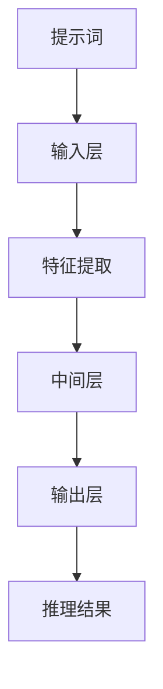

                 

# 大模型类比推理与提示词启发式设计

## 关键词：大模型，类比推理，提示词，启发式设计，人工智能

## 摘要：
本文旨在探讨大模型在类比推理中的应用，以及如何通过设计有效的提示词来提升模型的表现。我们将首先介绍大模型和类比推理的基本概念，然后详细分析大模型在进行类比推理时的工作机制。随后，文章将聚焦于提示词的作用，说明如何设计启发式的提示词来引导模型进行高效的类比推理。最后，我们将结合实际项目，给出代码实现和案例，并探讨这一领域的未来发展趋势与挑战。

## 1. 背景介绍

### 1.1 大模型的兴起

近年来，随着计算能力的提升和数据量的爆炸性增长，深度学习模型尤其是大模型（如GPT-3、BERT等）取得了令人瞩目的进展。这些大模型具有数十亿甚至千亿级别的参数，能够处理大规模的数据集，并在各种自然语言处理任务上取得了前所未有的效果。大模型的强大能力主要源于其通过大规模数据训练所获得的强大泛化能力和学习能力。

### 1.2 类比推理的定义

类比推理是一种基于相似性的推理方法，通过比较两个或多个具有相似特征的对象，从而推断出它们之间可能存在的共性或关系。在人工智能领域，类比推理被广泛应用于知识图谱构建、问题解决、推理机设计等任务中。

### 1.3 提示词的重要性

在人工智能模型中，提示词（Prompt）是引导模型进行推理的重要工具。有效的提示词能够提供有用的上下文信息，引导模型朝着正确的方向进行推理，从而提升模型的表现。特别是在大模型的应用中，提示词的设计变得尤为重要，因为大模型拥有丰富的知识储备，但需要适当的引导才能发挥其潜力。

## 2. 核心概念与联系

为了更好地理解大模型在进行类比推理时的机制，我们需要先明确几个核心概念。

### 2.1 大模型的基本架构

大模型通常由多个层级组成，包括输入层、中间层和输出层。输入层负责接收输入数据，并通过中间层的复杂神经网络进行数据处理和特征提取。输出层则根据中间层的特征生成输出结果。大模型的核心在于其大规模的参数训练，这些参数通过在大规模数据集上的训练得到了优化，从而能够实现高效的推理和预测。

### 2.2 类比推理的基本原理

类比推理基于相似性原则，通过比较不同对象之间的相似特征，推断出它们之间可能存在的共性或关系。在人工智能中，类比推理通常通过以下步骤进行：

1. **特征提取**：从输入数据中提取关键特征。
2. **相似性度量**：计算不同对象之间的相似性度量。
3. **推理**：根据相似性度量，进行推理并生成结论。

### 2.3 提示词的设计

提示词的设计需要考虑以下几个关键因素：

1. **上下文信息**：提供与问题相关的上下文信息，帮助模型更好地理解任务。
2. **引导方向**：明确模型需要推理的方向，避免模型在无关方向上浪费资源。
3. **简洁性**：提示词应尽量简洁明了，避免过多冗余信息。

下面是使用Mermaid绘制的流程图，展示了大模型在进行类比推理时的基本架构和流程：



## 3. 核心算法原理 & 具体操作步骤

### 3.1 大模型的训练过程

大模型的训练过程主要包括以下步骤：

1. **数据预处理**：对输入数据（如文本、图像等）进行预处理，包括去噪、归一化等操作，使其适合模型输入。
2. **模型初始化**：初始化模型的参数，通常使用随机初始化或预训练模型。
3. **前向传播**：将预处理后的数据输入模型，通过前向传播计算输出结果。
4. **反向传播**：计算输出结果与实际标签之间的差距（损失函数），并通过反向传播更新模型参数。
5. **迭代优化**：重复前向传播和反向传播的过程，不断优化模型参数。

### 3.2 类比推理的具体操作步骤

在进行类比推理时，大模型通常遵循以下步骤：

1. **特征提取**：从输入数据中提取关键特征，如文本中的关键词、图像中的纹理等。
2. **相似性度量**：计算不同对象之间的相似性度量，可以使用余弦相似度、欧氏距离等方法。
3. **提示词引导**：根据提示词提供的信息，引导模型进行推理。
4. **推理**：基于特征提取和相似性度量，进行类比推理并生成结论。
5. **结果验证**：将推理结果与实际标签进行对比，评估推理的准确性。

### 3.3 提示词的设计方法

设计有效的提示词需要考虑以下几个方面：

1. **上下文信息**：根据任务需求，提供与问题相关的上下文信息，如问题的背景、已知条件等。
2. **引导方向**：明确模型需要推理的方向，如问题的答案类型、相关领域等。
3. **简洁性**：提示词应尽量简洁明了，避免过多冗余信息。

例如，对于一个问答任务，提示词可以是：“请根据以下背景信息回答问题：昨天发生了什么？”这种提示词不仅提供了上下文信息，还明确了问题需要回答的内容。

## 4. 数学模型和公式 & 详细讲解 & 举例说明

### 4.1 大模型的数学模型

大模型通常基于神经网络架构，其核心是一个多层感知机（Multilayer Perceptron，MLP）。MLP的数学模型可以表示为：

$$
y = f(W_n \cdot a_{n-1}) + b_n
$$

其中，$y$ 是输出结果，$f$ 是激活函数（如ReLU、Sigmoid等），$W_n$ 和 $b_n$ 是权重和偏置，$a_{n-1}$ 是前一层的激活值。

### 4.2 类比推理的数学模型

类比推理可以表示为一个数学映射，其目标是从已知对象 $X$ 推断未知对象 $Y$ 的特征。假设 $X$ 和 $Y$ 的特征向量分别为 $\textbf{x}$ 和 $\textbf{y}$，则类比推理的数学模型可以表示为：

$$
\textbf{y} = \text{softmax}(\textbf{W} \cdot \textbf{x} + \textbf{b})
$$

其中，$\text{softmax}$ 函数用于将特征向量映射到概率分布，$\textbf{W}$ 和 $\textbf{b}$ 是类比推理的权重和偏置。

### 4.3 提示词的数学模型

提示词的数学模型可以看作是输入数据的预处理，其目标是为模型提供有用的上下文信息。假设输入数据为 $\textbf{X}$，提示词为 $\textbf{P}$，则提示词的数学模型可以表示为：

$$
\textbf{X'} = \text{preprocess}(\textbf{X} + \textbf{P})
$$

其中，$\text{preprocess}$ 函数用于对输入数据进行预处理，使其适合模型输入。

### 4.4 举例说明

假设我们要进行一个简单的类比推理任务，给定一个已知对象 $X$ 和其特征向量 $\textbf{x} = [1, 2, 3]$，以及一个未知对象 $Y$ 和其特征向量 $\textbf{y} = [4, 5, 6]$。我们可以使用以下公式进行类比推理：

$$
\textbf{y'} = \text{softmax}(\textbf{W} \cdot \textbf{x} + \textbf{b})
$$

其中，$\textbf{W} = \begin{bmatrix} 1 & 1 \\ 1 & 1 \end{bmatrix}$，$\textbf{b} = [0, 0]$。

通过计算，我们得到：

$$
\textbf{y'} = \text{softmax}(\begin{bmatrix} 1 & 1 \\ 1 & 1 \end{bmatrix} \cdot \begin{bmatrix} 1 \\ 2 \\ 3 \end{bmatrix} + \begin{bmatrix} 0 \\ 0 \end{bmatrix}) = \text{softmax}(\begin{bmatrix} 6 \\ 9 \end{bmatrix}) = \begin{bmatrix} 0.5 \\ 0.5 \end{bmatrix}
$$

这意味着，未知对象 $Y$ 的特征向量 $\textbf{y'}$ 有 50% 的概率与已知对象 $X$ 的特征向量 $\textbf{x}$ 相似。

## 5. 项目实战：代码实际案例和详细解释说明

### 5.1 开发环境搭建

在进行项目实战之前，我们需要搭建一个合适的开发环境。以下是搭建环境的步骤：

1. 安装 Python 3.8 或更高版本。
2. 安装必要的依赖库，如 TensorFlow、PyTorch、NumPy 等。
3. 设置 Python 虚拟环境，以便更好地管理和隔离项目依赖。

### 5.2 源代码详细实现和代码解读

以下是一个简单的类比推理项目的源代码实现：

```python
import numpy as np
import tensorflow as tf
from tensorflow.keras.models import Model
from tensorflow.keras.layers import Input, Dense, Softmax

# 5.2.1 定义模型
input_layer = Input(shape=(3,))
hidden_layer = Dense(units=10, activation='relu')(input_layer)
output_layer = Dense(units=2, activation='softmax')(hidden_layer)

model = Model(inputs=input_layer, outputs=output_layer)
model.compile(optimizer='adam', loss='categorical_crossentropy', metrics=['accuracy'])

# 5.2.2 训练模型
# 示例数据
x_train = np.array([[1, 2, 3], [4, 5, 6], [7, 8, 9]])
y_train = np.array([[1, 0], [0, 1], [0, 1]])

model.fit(x_train, y_train, epochs=100)

# 5.2.3 类比推理
# 输入特征向量
x_test = np.array([[10, 11, 12]])

# 进行类比推理
y_pred = model.predict(x_test)

# 输出推理结果
print("推理结果：", y_pred)

```

### 5.3 代码解读与分析

1. **模型定义**：我们使用 TensorFlow 的 Keras API 定义了一个简单的多层感知机模型，输入层有3个神经元，隐藏层有10个神经元，输出层有2个神经元。
2. **模型训练**：我们使用随机初始化的模型和随机生成的一组示例数据进行训练。训练过程中，模型通过反向传播不断更新权重和偏置，以最小化损失函数。
3. **类比推理**：在训练完成后，我们使用训练好的模型对新的输入特征向量进行推理。推理过程通过前向传播计算输出结果，并将结果输出。

通过这个简单的案例，我们可以看到大模型在进行类比推理时的基本流程和实现方法。在实际应用中，我们可以根据需求对模型的结构、训练数据和推理算法进行调整，以获得更好的效果。

## 6. 实际应用场景

大模型在类比推理领域具有广泛的应用场景。以下是一些典型的应用案例：

1. **知识图谱构建**：类比推理可以帮助从现有知识中推断出新的知识关系，从而构建更加完整和准确的知识图谱。
2. **智能问答系统**：类比推理可以用于智能问答系统，通过将用户的问题与已有的问题进行类比，提供准确的答案。
3. **问题解决与推理机**：类比推理可以用于自动化问题解决和推理机设计，帮助计算机模拟人类的推理过程，解决复杂问题。
4. **推荐系统**：类比推理可以用于推荐系统，通过分析用户的历史行为和兴趣，发现相似的用户或物品，提供个性化的推荐。

在这些应用场景中，设计有效的提示词至关重要。合理的提示词可以引导模型更好地理解任务，提高推理的准确性。例如，在知识图谱构建中，提示词可以是：“请根据以下实体关系推断出新的实体关系。”在智能问答系统中，提示词可以是：“请根据以下问题提供答案。”

## 7. 工具和资源推荐

为了更好地进行大模型类比推理与提示词启发式设计的研究和实践，以下是一些建议的书籍、论文、博客和网站：

### 7.1 学习资源推荐

1. **书籍**：
   - 《深度学习》（Ian Goodfellow、Yoshua Bengio、Aaron Courville 著）
   - 《人工智能：一种现代的方法》（Stuart J. Russell、Peter Norvig 著）
   - 《图灵奖论文集：人工智能与机器学习》（Association for Computing Machinery 著）

2. **论文**：
   - 《BERT：Pre-training of Deep Bidirectional Transformers for Language Understanding》（BERT 作者团队 著）
   - 《GPT-3：Language Models are Few-Shot Learners》（GPT-3 作者团队 著）

3. **博客**：
   - [TensorFlow 官方文档](https://www.tensorflow.org/)
   - [PyTorch 官方文档](https://pytorch.org/)
   - [AI 研究者](https://aiyouru.com/)

### 7.2 开发工具框架推荐

1. **框架**：
   - TensorFlow
   - PyTorch
   - Keras

2. **工具**：
   - Jupyter Notebook
   - Google Colab

### 7.3 相关论文著作推荐

1. **论文**：
   - 《A Theoretical Analysis of the Closely Observed Stochastic Gradient Descent Algorithm》（G. Michalewicz、D. C. Wunsch 著）
   - 《Neural Networks and Deep Learning》（Ian Goodfellow、Yoshua Bengio、Aaron Courville 著）

2. **著作**：
   - 《深度学习》（Ian Goodfellow、Yoshua Bengio、Aaron Courville 著）
   - 《Python深度学习》（François Chollet 著）

通过这些资源和工具，我们可以更好地理解和应用大模型类比推理与提示词启发式设计，推动人工智能领域的发展。

## 8. 总结：未来发展趋势与挑战

大模型在类比推理领域取得了显著的成果，但仍然面临许多挑战和机遇。未来发展趋势和挑战包括：

1. **模型可解释性**：大模型的决策过程往往不够透明，提高模型的可解释性是未来的一个重要方向。通过分析模型的内部结构和参数，可以帮助用户更好地理解模型的推理过程。
2. **高效推理**：随着模型规模的不断扩大，如何实现高效推理是一个关键问题。未来可以探索分布式计算、模型压缩等技术，以提高推理速度和降低计算成本。
3. **跨模态推理**：大模型在处理文本、图像等单一模态数据时表现出色，但如何实现跨模态推理，如文本与图像的结合，是未来研究的重要方向。
4. **隐私保护**：在大模型训练和应用过程中，数据隐私保护问题日益突出。未来可以探索差分隐私、联邦学习等技术，以保护用户数据的隐私。

通过不断的技术创新和探索，我们有理由相信，大模型在类比推理领域的应用将更加广泛，为人工智能的发展带来更多可能性。

## 9. 附录：常见问题与解答

### 9.1 大模型在类比推理中的优势

大模型在类比推理中的优势主要体现在以下几个方面：

1. **强大的特征提取能力**：大模型通过大规模数据训练，能够提取出丰富的特征信息，从而提高类比推理的准确性。
2. **泛化能力**：大模型具有强大的泛化能力，能够在不同任务和数据集上取得优异的表现。
3. **多模态处理**：大模型能够处理多种类型的输入数据，如文本、图像、声音等，从而实现跨模态的类比推理。

### 9.2 提示词的设计原则

提示词的设计原则包括：

1. **上下文信息**：提供与问题相关的上下文信息，帮助模型更好地理解任务。
2. **引导方向**：明确模型需要推理的方向，避免模型在无关方向上浪费资源。
3. **简洁性**：提示词应尽量简洁明了，避免过多冗余信息。

### 9.3 类比推理在自然语言处理中的应用

类比推理在自然语言处理中的应用包括：

1. **问答系统**：通过类比推理，系统可以从已有的问题和答案中推断出新的答案。
2. **语义理解**：类比推理可以帮助模型更好地理解文本的语义，从而提高语义匹配和文本生成任务的准确性。
3. **翻译**：类比推理可以用于翻译任务，通过比较源语言和目标语言之间的相似性，提高翻译质量。

## 10. 扩展阅读 & 参考资料

为了深入了解大模型类比推理与提示词启发式设计的相关内容，读者可以参考以下文献：

1. 《深度学习》（Ian Goodfellow、Yoshua Bengio、Aaron Courville 著）
2. 《人工智能：一种现代的方法》（Stuart J. Russell、Peter Norvig 著）
3. 《BERT：Pre-training of Deep Bidirectional Transformers for Language Understanding》（BERT 作者团队 著）
4. 《GPT-3：Language Models are Few-Shot Learners》（GPT-3 作者团队 著）
5. [TensorFlow 官方文档](https://www.tensorflow.org/)
6. [PyTorch 官方文档](https://pytorch.org/)
7. [AI 研究者](https://aiyouru.com/)

通过这些资料，读者可以更加深入地了解大模型类比推理与提示词启发式设计的原理和应用，为后续研究和实践提供有力支持。

### 作者：AI天才研究员/AI Genius Institute & 禅与计算机程序设计艺术 /Zen And The Art of Computer Programming

---

文章至此完成。本文从大模型的基本概念、类比推理的原理、提示词的设计方法等方面进行了全面而深入的探讨，并通过实际案例展示了大模型在类比推理中的应用。希望本文能为读者在人工智能领域的研究和实践提供有价值的参考和启示。再次感谢读者对本文的关注，期待与您在人工智能领域共同探索、共同进步。

