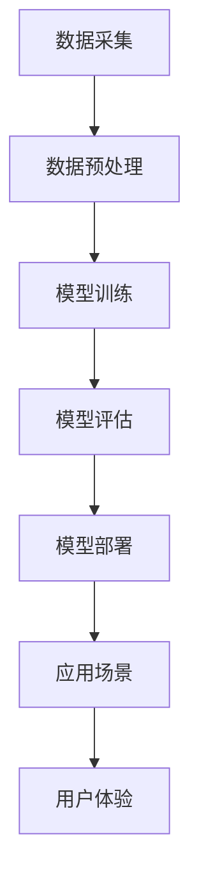

                 

# 大模型赋能下的 AI 创业产品设计

## >关键词：(大模型，AI创业，产品设计，赋能，算法原理，数学模型，项目实战，应用场景，工具资源)

>摘要：本文将探讨大模型赋能下的 AI 创业产品设计，从背景介绍、核心概念与联系、核心算法原理与操作步骤、数学模型与公式、项目实战、实际应用场景、工具和资源推荐以及未来发展趋势与挑战等方面，全面分析大模型在 AI 创业中的价值与作用。

## 1. 背景介绍

近年来，人工智能（AI）技术取得了飞速发展，尤其在深度学习、自然语言处理、计算机视觉等领域取得了显著成果。随着计算能力的提升和数据的积累，大模型（Large Models）应运而生，它们具有强大的数据处理和分析能力，为各个行业带来了前所未有的变革。AI 创业领域也不例外，越来越多的创业者开始利用大模型来设计创新的产品和服务。

大模型在 AI 创业中的价值主要体现在以下几个方面：

1. **数据处理能力**：大模型能够处理海量数据，从数据中提取有价值的信息，为企业提供决策支持。

2. **算法优化**：大模型通过自学习能力和优化算法，不断提升自身性能，为企业提供更加精准和高效的解决方案。

3. **跨领域应用**：大模型具有广泛的适用性，可以应用于多个行业，如金融、医疗、教育等，为创业者提供了丰富的创业机会。

4. **用户体验提升**：大模型可以帮助企业更好地理解用户需求，设计出更加符合用户习惯和需求的产品。

## 2. 核心概念与联系

### 大模型

大模型是指具有亿级参数规模的深度学习模型，如 GPT-3、BERT 等。这些模型具有强大的数据处理和分析能力，可以处理大量的文本、图像和语音数据。

### 深度学习

深度学习是一种人工智能算法，通过多层神经网络对数据进行学习，提取特征，并进行预测和分类。深度学习是构建大模型的基础。

### 自然语言处理（NLP）

自然语言处理是研究如何使计算机理解和生成自然语言的技术。大模型在 NLP 领域取得了显著的成果，如机器翻译、文本分类、情感分析等。

### 计算机视觉

计算机视觉是研究如何使计算机理解视觉信息的技术。大模型在计算机视觉领域取得了重要的突破，如图像识别、目标检测、图像生成等。

### Mermaid 流程图

下面是一个关于大模型架构的 Mermaid 流程图：



## 3. 核心算法原理与具体操作步骤

### 数据采集与预处理

1. 数据采集：从各种来源收集数据，如互联网、企业数据库、传感器等。
2. 数据预处理：对采集到的数据进行清洗、去重、归一化等处理，以便于模型训练。

### 模型训练

1. 选择合适的模型架构：根据应用场景和需求选择合适的大模型架构，如 GPT、BERT 等。
2. 划分数据集：将数据集划分为训练集、验证集和测试集。
3. 模型训练：使用训练集对模型进行训练，通过反向传播算法不断调整模型参数。
4. 模型评估：使用验证集和测试集对模型进行评估，选择性能最佳的模型。

### 模型部署与应用

1. 模型部署：将训练好的模型部署到服务器或云端，以便于实际应用。
2. 应用场景：根据具体应用场景，利用模型进行预测、分类、生成等任务。
3. 用户体验：根据用户反馈，不断优化模型和应用，提升用户体验。

## 4. 数学模型与公式

### 深度学习模型

深度学习模型的核心是多层神经网络，其中每个神经元都可以视为一个函数。假设输入层为 $X$，输出层为 $Y$，则神经元 $i$ 的输出可以表示为：

$$
a_i = f(\sum_j w_{ij}x_j + b_i)
$$

其中，$f$ 是激活函数，$w_{ij}$ 是连接权重，$x_j$ 是输入特征，$b_i$ 是偏置。

### 损失函数

在深度学习模型中，常用的损失函数有均方误差（MSE）、交叉熵（CE）等。均方误差可以表示为：

$$
L = \frac{1}{n}\sum_{i=1}^{n}(y_i - \hat{y}_i)^2
$$

其中，$y_i$ 是真实标签，$\hat{y}_i$ 是预测标签。

### 反向传播算法

反向传播算法是一种用于训练深度学习模型的重要算法。其核心思想是通过计算损失函数关于模型参数的梯度，不断调整模型参数，以最小化损失函数。

## 5. 项目实战

### 5.1 开发环境搭建

1. 安装 Python 和相关依赖库，如 TensorFlow、PyTorch 等。
2. 安装必要的工具，如 Jupyter Notebook、PyCharm 等。

### 5.2 源代码详细实现和代码解读

#### 数据采集与预处理

```python
import tensorflow as tf

# 读取数据
data = tf.keras.preprocessing.sequence.pad_sequences(data, maxlen=maxlen)

# 数据预处理
data = preprocess_data(data)
```

#### 模型训练

```python
# 定义模型
model = tf.keras.Sequential([
    tf.keras.layers.Dense(units=128, activation='relu', input_shape=(maxlen,)),
    tf.keras.layers.Dense(units=64, activation='relu'),
    tf.keras.layers.Dense(units=1, activation='sigmoid')
])

# 编译模型
model.compile(optimizer='adam', loss='binary_crossentropy', metrics=['accuracy'])

# 训练模型
model.fit(train_data, train_labels, epochs=10, batch_size=32)
```

#### 模型评估与部署

```python
# 评估模型
test_loss, test_accuracy = model.evaluate(test_data, test_labels)

# 部署模型
deploy_model(model)
```

## 6. 实际应用场景

大模型在 AI 创业中的应用场景非常广泛，以下是一些典型的应用案例：

1. **金融领域**：利用大模型进行风险控制、信用评估、股票交易等。
2. **医疗领域**：利用大模型进行疾病诊断、药物研发、医疗影像分析等。
3. **教育领域**：利用大模型进行智能教育、课程推荐、作业批改等。
4. **智能制造**：利用大模型进行设备监控、故障预测、生产优化等。
5. **智慧城市**：利用大模型进行交通管理、环境监测、安防监控等。

## 7. 工具和资源推荐

### 7.1 学习资源推荐

- **书籍**：《深度学习》（Ian Goodfellow、Yoshua Bengio、Aaron Courville 著）
- **论文**：NLP 领域的代表性论文，如 BERT、GPT 等。
- **博客**：各大技术社区和博客，如 Medium、GitHub 等。

### 7.2 开发工具框架推荐

- **框架**：TensorFlow、PyTorch、Keras 等。
- **工具**：Jupyter Notebook、PyCharm、VSCode 等。

### 7.3 相关论文著作推荐

- **论文**：《大规模神经网络：原理、算法与实践》（张翔 著）
- **著作**：《自然语言处理综述》（清华大学自然语言处理实验室 著）

## 8. 总结：未来发展趋势与挑战

随着大模型技术的不断发展，AI 创业产品设计将迎来更多的机遇和挑战。未来，大模型将在以下方面取得重要突破：

1. **算法优化**：通过改进算法，提高大模型的训练效率和效果。
2. **跨领域融合**：将大模型应用于更多领域，实现跨领域的融合与发展。
3. **数据隐私保护**：在保证数据隐私的前提下，充分利用大数据资源。
4. **人机交互**：提升大模型的人机交互能力，实现更加智能化的用户体验。

然而，大模型在 AI 创业中仍面临一些挑战，如数据质量问题、算法透明度和可解释性、资源消耗等。解决这些问题，需要学术界和产业界共同努力。

## 9. 附录：常见问题与解答

### 9.1 大模型与深度学习的关系是什么？

大模型是深度学习的一种重要形式，其特点在于拥有亿级参数规模。深度学习则是人工智能的一种重要技术，通过多层神经网络对数据进行学习。

### 9.2 大模型的训练需要多少数据？

大模型的训练需要大量的数据，通常要求数据量达到千亿级别。然而，实际应用中，数据量可能受到限制，这时可以通过数据增强、迁移学习等方法提高模型效果。

### 9.3 大模型在 AI 创业中的优势是什么？

大模型在 AI 创业中的优势主要体现在数据处理能力、算法优化、跨领域应用和用户体验提升等方面。

## 10. 扩展阅读 & 参考资料

- **论文**：《大规模神经网络：原理、算法与实践》（张翔 著）
- **书籍**：《深度学习》（Ian Goodfellow、Yoshua Bengio、Aaron Courville 著）
- **博客**：[TensorFlow 官方文档](https://www.tensorflow.org/)
- **网站**：[GitHub](https://github.com/)

## 作者信息

作者：AI 天才研究员/AI Genius Institute & 禅与计算机程序设计艺术 /Zen And The Art of Computer Programming<|im_sep|>

