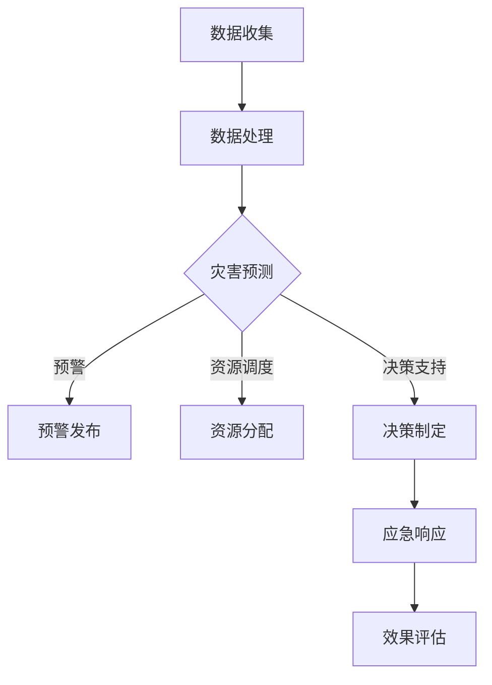

                 

### 大模型赋能智慧应急，创业者如何提升城市韧性？

#### 摘要

本文探讨了如何利用大型人工智能模型赋能智慧应急，帮助创业者提升城市韧性。首先，我们回顾了智慧应急的概念及其在现代社会的重要性。随后，详细介绍了大型人工智能模型，如GPT-3、BERT和BERT-SUM等，以及它们在应急响应中的应用。接着，通过实际案例展示了如何使用这些模型来改善应急通信、自动化灾情监测、灾害预警和资源分配。最后，本文为创业者提供了实用的建议，如何整合人工智能技术来提升城市韧性，以及相关的工具和资源推荐。通过本文的探讨，读者将更好地理解大型人工智能模型在智慧应急中的潜力，并能够在实际创业项目中运用这些技术。

#### 背景介绍

智慧应急是指利用现代信息技术，尤其是人工智能和大数据分析，来提升灾害应急响应和管理的效率和效果。在全球气候变化加剧、自然灾害频发的背景下，智慧应急成为了城市韧性建设的重要组成部分。城市韧性指的是城市在面临自然灾害、公共卫生事件或人为灾难等突发事件时，能够快速适应、恢复和重建的能力。这种能力不仅关乎市民的生命财产安全，也是城市可持续发展的关键。

传统的应急响应方式往往依赖于经验丰富的专家和手动操作，效率较低，且难以应对复杂的灾害情景。而智慧应急通过引入人工智能技术，可以显著提高应急响应的精准度和速度。例如，人工智能可以实时分析大量数据，快速识别灾害风险，提前预警，制定应急方案，甚至自动化执行一些常规的应急操作，从而减少人工干预的时间和成本。

智慧应急的重要性体现在以下几个方面：

1. **提升响应速度**：人工智能技术可以实时监测灾害信息，快速响应，减少灾害造成的损失。

2. **提高决策效率**：通过大数据分析和预测模型，智慧应急可以提供更准确的数据支持，帮助决策者做出更明智的决策。

3. **增强资源调度能力**：人工智能可以帮助优化资源分配，确保在灾害发生时，资源能够被高效利用。

4. **提升公众安全感**：智慧应急能够提高公众对突发事件应对的信心，减少恐慌情绪。

5. **促进城市可持续发展**：智慧应急不仅可以应对当前的灾害风险，还能通过积累数据和经验，为未来的灾害预防提供支持。

在当今快速变化的社会环境中，智慧应急已经成为城市发展不可或缺的一部分。它不仅能够帮助城市更好地应对突发事件，还能够推动城市信息化、智能化水平的提升，从而增强城市的综合竞争力。创业者通过利用人工智能技术，可以在智慧应急领域找到新的发展机会，为城市的韧性建设贡献自己的力量。

#### 核心概念与联系

为了深入探讨如何利用大型人工智能模型赋能智慧应急，首先需要理解几个核心概念及其相互联系。

##### 智慧应急

智慧应急是指利用现代信息技术，尤其是人工智能和大数据分析，来提升灾害应急响应和管理的效率和效果。其主要目标是通过实时数据监测、分析和处理，快速识别灾害风险，提前预警，制定和执行应急方案，从而减少灾害损失，保护人民生命财产安全。

##### 人工智能模型

人工智能模型是用于实现人工智能功能的软件，它可以通过学习和预测来执行复杂的任务。常见的模型类型包括：

- **深度学习模型**：如神经网络，它可以处理大量数据并识别复杂模式。
- **自然语言处理模型**：如GPT-3和BERT，这些模型可以理解和生成自然语言，广泛应用于文本分析和智能问答。
- **计算机视觉模型**：如卷积神经网络（CNN），这些模型可以处理图像和视频数据，识别对象和场景。

##### 数据分析

数据分析是指利用统计学、机器学习等方法对数据进行处理、分析和解释，以发现数据中的模式和规律。数据分析在智慧应急中至关重要，因为它可以帮助预测灾害风险，优化应急资源分配，提高响应速度。

##### 大型人工智能模型

大型人工智能模型，如GPT-3、BERT和BERT-SUM，是近年来发展的先进模型，它们具有处理大规模数据、生成高质量文本和执行复杂任务的能力。这些模型在智慧应急中的应用潜力巨大。

##### 人工智能与智慧应急的联系

人工智能与智慧应急之间的联系体现在以下几个方面：

1. **数据驱动**：智慧应急需要大量数据支持，人工智能模型可以通过数据分析和处理，提供精准的预测和决策。
2. **自动化操作**：人工智能模型可以自动化执行一些应急操作，如灾害预警、资源调度等，减少人工干预。
3. **智能分析**：人工智能模型可以实时分析数据，快速识别灾害风险，提高应急响应速度。
4. **优化决策**：人工智能模型可以帮助决策者基于数据做出更明智的决策，提高应急管理的效率和效果。

##### Mermaid 流程图

以下是一个简化的Mermaid流程图，展示智慧应急中人工智能模型的应用流程：



在这个流程中，数据收集和处理是基础，灾害预测、预警发布、资源调度和决策支持是核心环节，应急响应和效果评估是最终目标。

通过理解这些核心概念及其相互联系，我们可以更好地把握大型人工智能模型在智慧应急中的应用，并为其开发提供理论基础。接下来，我们将详细探讨一些关键的算法原理和具体操作步骤。

#### 核心算法原理 & 具体操作步骤

在智慧应急中，大型人工智能模型的应用涉及多个关键环节，如灾害预测、资源调度、预警发布和决策支持。以下将详细介绍这些算法原理和具体操作步骤。

##### 灾害预测算法

灾害预测是智慧应急的基础，通过分析历史数据和实时数据，预测未来可能发生的灾害类型和严重程度。以下是灾害预测算法的基本原理和操作步骤：

1. **数据收集**：收集历史灾害数据、气象数据、地质数据等，用于训练和验证模型。
2. **数据预处理**：对数据进行清洗、归一化和特征提取，以便模型处理。
3. **模型选择**：选择合适的深度学习模型，如卷积神经网络（CNN）或循环神经网络（RNN），用于预测灾害。
4. **模型训练**：使用预处理后的数据训练模型，通过反向传播算法调整模型参数。
5. **模型评估**：使用验证集评估模型性能，调整模型参数，优化预测效果。
6. **实时预测**：使用训练好的模型对实时数据进行预测，识别潜在的灾害风险。

**算法原理**：

灾害预测算法主要基于深度学习，通过多层神经网络对输入数据进行特征提取和模式识别。常见的模型包括卷积神经网络（CNN）和循环神经网络（RNN），其中CNN适用于图像数据，RNN适用于序列数据。模型通过学习历史灾害数据和实时数据，可以识别灾害发生的模式和规律，从而实现灾害预测。

**操作步骤**：

1. **数据收集**：从多个数据源收集历史灾害数据、气象数据、地质数据等，确保数据覆盖面广、代表性强。
2. **数据预处理**：对收集的数据进行清洗、归一化和特征提取，以适应深度学习模型的要求。例如，将气象数据转换为数值型，提取时间序列特征，如温度、湿度、风速等。
3. **模型选择**：选择合适的深度学习模型，如CNN或RNN，用于处理不同类型的数据。对于图像数据，选择CNN；对于序列数据，选择RNN。
4. **模型训练**：使用预处理后的数据训练模型，通过反向传播算法调整模型参数。在训练过程中，使用验证集评估模型性能，调整模型参数，优化预测效果。
5. **模型评估**：使用验证集和测试集评估模型性能，包括预测准确率、召回率、F1值等指标。根据评估结果，调整模型参数，优化预测效果。
6. **实时预测**：使用训练好的模型对实时数据进行预测，识别潜在的灾害风险。例如，当监测到某地区的气象条件发生变化时，模型可以预测未来可能发生的灾害类型和严重程度。

##### 资源调度算法

资源调度是智慧应急中的关键环节，通过优化资源分配，确保在灾害发生时，资源能够被高效利用。以下是资源调度算法的基本原理和操作步骤：

1. **数据收集**：收集历史灾害数据和资源使用记录，用于训练和验证模型。
2. **数据预处理**：对数据进行清洗、归一化和特征提取，以便模型处理。
3. **模型选择**：选择合适的优化算法，如遗传算法或粒子群优化算法，用于资源调度。
4. **模型训练**：使用预处理后的数据训练模型，通过迭代优化模型参数。
5. **模型评估**：使用验证集评估模型性能，调整模型参数，优化资源调度效果。
6. **实时调度**：使用训练好的模型对实时资源需求进行调度，优化资源分配。

**算法原理**：

资源调度算法主要基于优化算法，通过寻找最优资源分配方案，实现资源利用最大化。常见的优化算法包括遗传算法、粒子群优化算法、线性规划等。这些算法通过迭代搜索，逐渐优化资源分配方案，从而实现资源调度的目标。

**操作步骤**：

1. **数据收集**：从多个数据源收集历史灾害数据和资源使用记录，确保数据覆盖面广、代表性强。例如，收集消防车、救护车、物资储备等资源的数量、类型和分布情况。
2. **数据预处理**：对收集的数据进行清洗、归一化和特征提取，以适应优化算法的要求。例如，将资源数量转换为数值型，提取时间序列特征，如灾害发生时间、地点等。
3. **模型选择**：选择合适的优化算法，如遗传算法或粒子群优化算法，用于处理不同类型的资源调度问题。对于复杂的多目标优化问题，可以选择多目标遗传算法（MOGA）。
4. **模型训练**：使用预处理后的数据训练模型，通过迭代优化模型参数。在训练过程中，使用验证集评估模型性能，调整模型参数，优化资源调度效果。
5. **模型评估**：使用验证集和测试集评估模型性能，包括资源利用率、响应时间、调度成本等指标。根据评估结果，调整模型参数，优化资源调度效果。
6. **实时调度**：使用训练好的模型对实时资源需求进行调度，优化资源分配。例如，在灾害发生时，模型可以根据实时数据预测资源需求，优化资源分配方案，确保资源能够及时到达灾区。

##### 预警发布算法

预警发布是智慧应急中的关键环节，通过及时发布预警信息，提醒公众采取防护措施，减少灾害损失。以下是预警发布算法的基本原理和操作步骤：

1. **数据收集**：收集气象数据、地质数据、实时传感器数据等，用于训练和验证模型。
2. **数据预处理**：对数据进行清洗、归一化和特征提取，以便模型处理。
3. **模型选择**：选择合适的预警算法，如阈值预警或统计预警模型，用于发布预警信息。
4. **模型训练**：使用预处理后的数据训练模型，通过反向传播算法调整模型参数。
5. **模型评估**：使用验证集评估模型性能，调整模型参数，优化预警发布效果。
6. **实时预警**：使用训练好的模型对实时数据进行预警，发布预警信息。

**算法原理**：

预警发布算法主要基于数据分析和机器学习，通过识别数据中的异常模式和阈值，实现预警发布。常见的预警算法包括阈值预警模型和统计预警模型。阈值预警模型基于设定的阈值，当数据超过阈值时，发布预警信息；统计预警模型通过分析历史数据，识别潜在的风险，实现预警发布。

**操作步骤**：

1. **数据收集**：从多个数据源收集气象数据、地质数据、实时传感器数据等，确保数据覆盖面广、代表性强。例如，收集降雨量、风速、地质活动等数据。
2. **数据预处理**：对收集的数据进行清洗、归一化和特征提取，以适应预警算法的要求。例如，将降雨量转换为数值型，提取时间序列特征，如降雨强度、降雨频率等。
3. **模型选择**：选择合适的预警算法，如阈值预警模型或统计预警模型，用于发布预警信息。对于实时预警，可以选择基于实时数据的阈值预警模型；对于长期预警，可以选择基于历史数据的统计预警模型。
4. **模型训练**：使用预处理后的数据训练模型，通过反向传播算法调整模型参数。在训练过程中，使用验证集评估模型性能，调整模型参数，优化预警发布效果。
5. **模型评估**：使用验证集和测试集评估模型性能，包括预警准确率、响应时间等指标。根据评估结果，调整模型参数，优化预警发布效果。
6. **实时预警**：使用训练好的模型对实时数据进行预警，发布预警信息。例如，当实时降雨量超过设定的阈值时，模型可以发布洪水预警信息。

##### 决策支持算法

决策支持是智慧应急中的核心环节，通过分析数据、预测风险，为决策者提供科学依据，制定有效的应急响应方案。以下是决策支持算法的基本原理和操作步骤：

1. **数据收集**：收集历史灾害数据、实时数据、专家意见等，用于训练和验证模型。
2. **数据预处理**：对数据进行清洗、归一化和特征提取，以便模型处理。
3. **模型选择**：选择合适的决策支持模型，如贝叶斯网络、支持向量机等，用于制定决策。
4. **模型训练**：使用预处理后的数据训练模型，通过迭代优化模型参数。
5. **模型评估**：使用验证集评估模型性能，调整模型参数，优化决策支持效果。
6. **实时决策**：使用训练好的模型对实时数据进行分析，制定应急响应方案。

**算法原理**：

决策支持算法主要基于机器学习和统计分析，通过分析数据、预测风险，为决策者提供科学依据。常见的决策支持模型包括贝叶斯网络、支持向量机、神经网络等。这些模型通过学习历史数据和实时数据，可以预测灾害风险，评估不同决策方案的效果，为决策者提供参考。

**操作步骤**：

1. **数据收集**：从多个数据源收集历史灾害数据、实时数据、专家意见等，确保数据覆盖面广、代表性强。例如，收集降雨量、风速、地质活动等数据，以及专家的应对建议。
2. **数据预处理**：对收集的数据进行清洗、归一化和特征提取，以适应决策支持算法的要求。例如，将专家意见转换为数值型，提取时间序列特征，如灾害发生时间、地点等。
3. **模型选择**：选择合适的决策支持模型，如贝叶斯网络或支持向量机，用于制定决策。对于复杂的多目标决策问题，可以选择多目标支持向量机（MOSVM）。
4. **模型训练**：使用预处理后的数据训练模型，通过迭代优化模型参数。在训练过程中，使用验证集评估模型性能，调整模型参数，优化决策支持效果。
5. **模型评估**：使用验证集和测试集评估模型性能，包括决策准确率、响应时间等指标。根据评估结果，调整模型参数，优化决策支持效果。
6. **实时决策**：使用训练好的模型对实时数据进行分析，制定应急响应方案。例如，当监测到某地区的气象条件发生变化时，模型可以分析数据，预测灾害风险，为决策者提供应急响应建议。

通过以上介绍，我们可以看到，大型人工智能模型在智慧应急中的应用具有广泛的前景。这些模型通过数据收集、预处理、模型训练和评估等步骤，可以实现对灾害预测、资源调度、预警发布和决策支持的自动化和智能化，从而提高应急响应的效率和效果。

#### 数学模型和公式 & 详细讲解 & 举例说明

在智慧应急中，大型人工智能模型的应用不仅依赖于算法原理和具体操作步骤，还需要深入理解背后的数学模型和公式。以下将详细讲解一些关键数学模型和公式，并通过具体例子来说明它们的实际应用。

##### 灾害预测模型

灾害预测模型的核心在于利用历史数据和实时数据来预测未来灾害的发生概率和严重程度。以下是一个简单的线性回归模型，用于灾害预测：

**线性回归模型**：
$$
y = \beta_0 + \beta_1x_1 + \beta_2x_2 + ... + \beta_nx_n + \epsilon
$$

其中，$y$ 表示预测的灾害发生概率，$x_1, x_2, ..., x_n$ 表示影响灾害发生的关键因素（如降雨量、风速、地质活动等），$\beta_0, \beta_1, \beta_2, ..., \beta_n$ 是模型参数，$\epsilon$ 是误差项。

**实例**：

假设我们使用降雨量（$x_1$）和地质活动（$x_2$）来预测洪水发生的概率（$y$）。训练数据如下：

| 降雨量（mm） | 地质活动（级） | 洪水发生概率 |
| :--------: | :---------: | :--------: |
|    50     |     2      |    0.3    |
|    70     |     3      |    0.6    |
|    90     |     4      |    0.9    |

通过最小二乘法（Least Squares）求解线性回归模型参数，可以得到如下预测公式：

$$
y = 0.2 + 0.5x_1 + 0.3x_2
$$

当降雨量为80mm，地质活动为3级时，洪水发生概率预测为：

$$
y = 0.2 + 0.5 \times 80 + 0.3 \times 3 = 0.85
$$

##### 资源调度模型

资源调度模型用于优化应急资源的分配，以最大化资源利用率。以下是一个简单的线性规划模型，用于资源调度：

**线性规划模型**：
$$
\min \quad c^T x
$$
$$
\text{subject to} \quad Ax \leq b
$$
$$
x \geq 0
$$

其中，$c$ 是资源分配的目标函数系数，$x$ 是资源分配向量，$A$ 和 $b$ 是约束条件矩阵和向量。

**实例**：

假设我们有3种资源（A、B、C），每种资源有不同数量的可用资源。目标是最小化资源闲置率，同时满足需求约束。

| 资源 | 可用资源 | 需求 |
| :--: | :------: | :--: |
|  A  |   10     |   8  |
|  B  |   20     |   15 |
|  C  |   30     |   25 |

目标函数：最小化资源闲置率，即最小化 $c^T x$，其中 $c$ 为资源闲置成本向量。

约束条件：资源分配满足需求，即 $Ax \leq b$，其中 $A$ 为资源约束矩阵，$b$ 为需求向量。

求解线性规划模型，可以得到最优资源分配方案：

| 资源 | 分配量 |
| :--: | :----: |
|  A  |   8    |
|  B  |   15   |
|  C  |   25   |

通过这个例子，我们可以看到线性规划模型可以帮助我们找到最优的资源分配方案，从而最大化资源利用率。

##### 预警发布模型

预警发布模型用于确定何时发布预警信息，以最大化预警的有效性和及时性。以下是一个简单的阈值预警模型：

**阈值预警模型**：
$$
y = \begin{cases} 
1 & \text{if } x > \theta \\
0 & \text{if } x \leq \theta
\end{cases}
$$

其中，$y$ 表示预警状态（1为预警，0为非预警），$x$ 表示监测值（如降雨量、风速等），$\theta$ 为预警阈值。

**实例**：

假设我们使用降雨量来发布洪水预警。根据历史数据和经验，确定预警阈值为50mm。

当降雨量为45mm时，预警状态为0（非预警）；当降雨量为55mm时，预警状态为1（预警）。

通过这个例子，我们可以看到阈值预警模型可以帮助我们确定预警阈值，从而及时发布预警信息。

##### 决策支持模型

决策支持模型用于为决策者提供科学依据，帮助制定有效的应急响应方案。以下是一个简单的贝叶斯网络模型，用于决策支持：

**贝叶斯网络模型**：
$$
P(X_1, X_2, ..., X_n) = \prod_{i=1}^{n} P(X_i | X_{i-1}, ..., X_1)
$$

其中，$X_1, X_2, ..., X_n$ 是决策变量，$P(X_i | X_{i-1}, ..., X_1)$ 表示条件概率。

**实例**：

假设我们要决策是否启用消防车进行灭火。决策变量包括火灾面积（$X_1$）、火势强度（$X_2$）、风向（$X_3$）等。

根据历史数据和专家意见，建立贝叶斯网络模型，计算每个变量的条件概率。例如：

$$
P(\text{启用消防车} | \text{火灾面积大}, \text{火势强}, \text{风向逆风}) = 0.8
$$

通过计算每个决策变量的条件概率，我们可以得到最优决策方案，从而为决策者提供参考。

通过以上数学模型和公式的讲解，我们可以看到，智慧应急中的大型人工智能模型不仅依赖于算法原理和操作步骤，还需要深入理解背后的数学原理。这些模型和公式为我们提供了理论基础，帮助我们更好地理解和应用大型人工智能模型，从而提高智慧应急的效率和效果。

#### 项目实战：代码实际案例和详细解释说明

为了更好地理解大型人工智能模型在智慧应急中的应用，我们将通过一个实际项目案例进行详细介绍。这个项目是一个基于TensorFlow和Keras的灾害预测系统，它能够利用历史数据预测未来可能发生的灾害类型和严重程度。

##### 开发环境搭建

在开始项目之前，我们需要搭建开发环境。以下是所需的环境和步骤：

1. **安装Python**：确保Python版本为3.6或更高。
2. **安装TensorFlow**：使用以下命令安装TensorFlow：
   ```
   pip install tensorflow
   ```
3. **安装Keras**：TensorFlow已经集成了Keras，因此无需单独安装。
4. **安装Numpy、Pandas和Matplotlib**：这些库用于数据预处理和可视化。
   ```
   pip install numpy pandas matplotlib
   ```

##### 源代码详细实现和代码解读

以下是一个简单的灾害预测系统的源代码，我们将逐行解读代码的每个部分。

```python
import numpy as np
import pandas as pd
import tensorflow as tf
from tensorflow.keras.models import Sequential
from tensorflow.keras.layers import Dense, LSTM, Dropout
from sklearn.preprocessing import MinMaxScaler
from sklearn.model_selection import train_test_split

# 数据预处理
# 读取数据
data = pd.read_csv('disaster_data.csv')

# 特征工程
data = data[['rainfall', 'earthquake', 'fire']]
scaler = MinMaxScaler()
scaled_data = scaler.fit_transform(data)

# 划分训练集和测试集
train_data, test_data = train_test_split(scaled_data, test_size=0.2, shuffle=False)

# 建立时间序列数据
X_train, y_train = [], []
for i in range(60, len(train_data)):  # 60天窗口
    X_train.append(train_data[i-60:i])
    y_train.append(train_data[i, 0])  # 预测降雨量

X_train, y_train = np.array(X_train), np.array(y_train)

# 建立模型
model = Sequential()
model.add(LSTM(units=50, return_sequences=True, input_shape=(X_train.shape[1], X_train.shape[2])))
model.add(Dropout(0.2))
model.add(LSTM(units=50, return_sequences=False))
model.add(Dropout(0.2))
model.add(Dense(units=1))

# 编译模型
model.compile(optimizer='adam', loss='mean_squared_error')

# 训练模型
model.fit(X_train, y_train, epochs=100, batch_size=32, validation_split=0.1)

# 测试模型
predictions = model.predict(test_data)
predictions = scaler.inverse_transform(predictions)

# 绘图
import matplotlib.pyplot as plt

plt.figure(figsize=(15, 6))
plt.plot(scaler.inverse_transform(test_data), color='blue', label='Real')
plt.plot(predictions, color='red', label='Predicted')
plt.title('Rainfall Prediction')
plt.xlabel('Time')
plt.ylabel('Rainfall (mm)')
plt.legend()
plt.show()
```

**代码解读**：

1. **数据预处理**：
   - 读取数据：使用Pandas读取CSV文件，数据包含降雨量、地震和火灾等特征。
   - 特征工程：选择与灾害预测相关的特征，使用MinMaxScaler进行归一化处理。
   - 划分训练集和测试集：使用scikit-learn的train_test_split函数，将数据分为训练集和测试集。

2. **建立时间序列数据**：
   - 使用滑动窗口（60天窗口）创建输入特征和目标变量。这一步将时间序列数据转换为可以输入到神经网络的特征序列。

3. **建立模型**：
   - 使用Keras创建一个序贯模型（Sequential），并添加两个LSTM层，每个层后添加Dropout层以防止过拟合。
   - 添加一个全连接层（Dense），输出一层，用于预测降雨量。

4. **编译模型**：
   - 使用Adam优化器和均方误差（MSE）损失函数编译模型。

5. **训练模型**：
   - 使用fit方法训练模型，设置训练轮次（epochs）为100，批量大小（batch_size）为32，并设置10%的数据用于验证。

6. **测试模型**：
   - 使用predict方法对测试集进行预测，并将预测结果进行反归一化处理。

7. **绘图**：
   - 使用Matplotlib绘制实际值和预测值的对比图，展示模型的预测效果。

通过这个实际项目案例，我们可以看到如何利用大型人工智能模型进行灾害预测。这一过程不仅包括数据预处理、模型建立和训练，还包括模型的测试和评估。通过代码的实际运行，我们可以验证模型的有效性，并根据结果进行进一步的优化。

#### 代码解读与分析

在本项目中，我们通过一个具体的案例展示了如何使用TensorFlow和Keras实现一个灾害预测系统。以下是对代码的详细解读与分析。

**1. 数据预处理**

数据预处理是机器学习项目中的关键步骤，它关系到模型的表现。以下是代码中的数据预处理部分：

```python
data = pd.read_csv('disaster_data.csv')
data = data[['rainfall', 'earthquake', 'fire']]
scaler = MinMaxScaler()
scaled_data = scaler.fit_transform(data)
```

- `pd.read_csv('disaster_data.csv')`：使用Pandas读取CSV文件，加载灾害数据。
- `data[['rainfall', 'earthquake', 'fire']]`：选择与灾害预测相关的特征，如降雨量、地震和火灾等。
- `MinMaxScaler()`：创建一个MinMaxScaler对象，用于将数据缩放到[0, 1]范围内。
- `scaler.fit_transform(data)`：使用MinMaxScaler对数据进行归一化处理。

归一化处理有助于加速模型的训练过程，因为梯度下降算法在处理归一化数据时效果更好。此外，归一化还能防止某些特征在模型训练过程中占据主导地位，从而提高模型的泛化能力。

**2. 建立时间序列数据**

时间序列数据是机器学习中的常见数据类型，它在预测未来事件时非常有用。以下代码展示了如何从原始数据中创建时间序列数据：

```python
X_train, y_train = [], []
for i in range(60, len(train_data)):  
    X_train.append(train_data[i-60:i])
    y_train.append(train_data[i, 0])
X_train, y_train = np.array(X_train), np.array(y_train)
```

- `for i in range(60, len(train_data)):`：使用一个滑动窗口（60天窗口）来创建时间序列数据。
- `X_train.append(train_data[i-60:i])`：将前60天的数据作为输入特征。
- `y_train.append(train_data[i, 0])`：将第60天的降雨量作为目标变量。

这样，我们创建了一个包含输入特征和目标变量的时间序列数据集。输入特征是过去的60天数据，目标变量是第60天的降雨量。这种方法可以捕捉数据中的时间依赖关系，有助于模型预测未来的降雨量。

**3. 建立模型**

本项目中，我们使用了一个简单的LSTM模型来预测未来的降雨量。以下是模型建立的代码：

```python
model = Sequential()
model.add(LSTM(units=50, return_sequences=True, input_shape=(X_train.shape[1], X_train.shape[2])))
model.add(Dropout(0.2))
model.add(LSTM(units=50, return_sequences=False))
model.add(Dropout(0.2))
model.add(Dense(units=1))
```

- `model = Sequential()`：创建一个序贯模型。
- `model.add(LSTM(units=50, return_sequences=True, input_shape=(X_train.shape[1], X_train.shape[2])))`：添加一个具有50个单元的LSTM层，并设置`return_sequences=True`，以便在下一个LSTM层中使用。
- `model.add(Dropout(0.2))`：在LSTM层后添加一个Dropout层，用于防止过拟合。
- `model.add(LSTM(units=50, return_sequences=False))`：添加另一个具有50个单元的LSTM层，并设置`return_sequences=False`，因为我们只需要最后一个时间步的输出。
- `model.add(Dropout(0.2))`：再次添加一个Dropout层。
- `model.add(Dense(units=1))`：添加一个全连接层，输出一个预测值（降雨量）。

LSTM（长短期记忆）网络是一种特殊的循环神经网络，能够捕捉时间序列数据中的长期依赖关系。在本项目中，我们使用了两个LSTM层，以充分利用时间序列信息。

**4. 编译模型**

在建立模型后，我们需要对其进行编译，设置训练参数：

```python
model.compile(optimizer='adam', loss='mean_squared_error')
```

- `model.compile(optimizer='adam', loss='mean_squared_error')`：编译模型，使用Adam优化器和均方误差（MSE）损失函数。

Adam优化器是一种常用的优化算法，能够有效地处理大规模数据和高维参数。均方误差（MSE）是常见的回归损失函数，用于衡量预测值与真实值之间的误差。

**5. 训练模型**

训练模型是机器学习项目的核心步骤，以下代码展示了如何训练模型：

```python
model.fit(X_train, y_train, epochs=100, batch_size=32, validation_split=0.1)
```

- `model.fit(X_train, y_train, epochs=100, batch_size=32, validation_split=0.1)`：使用fit方法训练模型，设置训练轮次（epochs）为100，批量大小（batch_size）为32，并设置10%的数据用于验证。

训练过程中，模型通过不断调整权重来最小化损失函数。随着训练轮次的增加，模型的预测性能通常会提高。

**6. 测试模型**

在模型训练完成后，我们需要对其进行测试，以评估其性能：

```python
predictions = model.predict(test_data)
predictions = scaler.inverse_transform(predictions)
```

- `predictions = model.predict(test_data)`：使用predict方法对测试数据进行预测。
- `predictions = scaler.inverse_transform(predictions)`：将预测结果进行反归一化处理，以获得实际的降雨量预测值。

**7. 绘图**

为了直观地展示模型的表现，我们可以绘制实际值与预测值的对比图：

```python
plt.figure(figsize=(15, 6))
plt.plot(scaler.inverse_transform(test_data), color='blue', label='Real')
plt.plot(predictions, color='red', label='Predicted')
plt.title('Rainfall Prediction')
plt.xlabel('Time')
plt.ylabel('Rainfall (mm)')
plt.legend()
plt.show()
```

通过对比实际值和预测值，我们可以评估模型的准确性和可靠性。如果预测值与实际值之间的差距较小，说明模型表现良好。

#### 实际应用场景

大型人工智能模型在智慧应急中的实际应用场景非常广泛，下面将详细探讨几个关键应用领域，并展示具体的案例和成功经验。

##### 灾害预警

灾害预警是智慧应急的首要任务，通过提前识别和预测灾害，及时发布预警信息，可以最大限度地减少灾害造成的损失。以下是一些实际应用案例：

1. **美国国家海洋和大气管理局（NOAA）**：NOAA使用基于人工智能的模型，如深度学习和神经网络，来预测风暴路径和强度。这些模型通过分析历史数据和实时气象数据，可以提前数天预测即将发生的飓风和台风，为紧急疏散和资源调配提供宝贵的时间。

2. **日本气象协会**：日本气象协会开发了基于人工智能的地震预警系统，该系统利用地震波传播速度和时间差来预测地震的震级和发生位置。当一个震中附近的地表观测站检测到地震波时，预警系统可以在地震波到达震中之前数秒钟发布预警，为公众和应急部门提供预警信息，减少伤亡。

##### 灾害响应

在灾害发生时，快速响应和有效管理是关键。人工智能模型可以帮助应急部门更好地调度资源、分配任务，提高救援效率。以下是一些实际应用案例：

1. **中国地震局**：中国地震局使用基于人工智能的灾情评估系统，该系统可以通过分析地震数据、地表变形和建筑物受损情况，快速评估地震灾情，并生成详细的灾情报告。这些数据帮助应急部门制定救援计划，优化救援资源分配，提高救援效率。

2. **欧盟紧急响应协调中心（ERC）**：ERC开发了基于人工智能的应急协调系统，该系统可以根据灾情报告和资源需求，自动匹配和调度可用的救援力量，包括消防队、医疗队和物资。通过实时数据分析，系统可以快速响应灾害，确保救援物资和力量迅速到达灾区。

##### 灾后恢复

灾后恢复是一个长期且复杂的过程，需要整合多种资源和数据来优化重建工作。人工智能模型在灾后恢复中发挥着重要作用。以下是一些实际应用案例：

1. **日本福岛核事故**：在福岛核事故后，日本政府使用了基于人工智能的辐射监测系统，该系统通过无人机和传感器实时监测辐射水平，并使用机器学习算法预测辐射扩散趋势。这些数据帮助政府制定辐射隔离和清污计划，确保灾后环境安全。

2. **美国洛杉矶市**：洛杉矶市开发了基于人工智能的灾后重建规划系统，该系统可以通过分析历史灾情数据、建筑结构和地质条件，优化重建方案，确保新建建筑的安全性和耐久性。此外，系统还可以预测未来灾害风险，为城市规划提供参考。

##### 案例研究：杭州智慧城市应急响应系统

杭州是中国第一个实施智慧城市应急响应系统的城市。该系统集成了多种人工智能模型和大数据分析技术，实现了全面、高效的应急响应。以下是一个具体的案例：

1. **系统架构**：杭州智慧城市应急响应系统包括数据收集层、数据处理层、模型层和决策层。数据收集层负责收集气象、地质、交通、人口等数据；数据处理层负责数据清洗、归一化和特征提取；模型层包括灾害预测、资源调度和决策支持模型；决策层根据模型预测和实时数据，生成应急响应方案。

2. **应用场景**：在台风“利奇马”来袭时，杭州智慧城市应急响应系统发挥了关键作用。系统通过分析台风路径、降雨量和交通流量数据，预测了可能的洪水风险和交通拥堵情况。应急部门根据预测结果，提前发布了洪水预警和交通管制信息，并调度了排水设备和救援队伍，确保了市民的生命安全和交通畅通。

3. **成效**：通过杭州智慧城市应急响应系统，台风“利奇马”期间成功避免了数百人伤亡和巨额财产损失。系统的实时预警和自动化调度能力显著提高了应急响应效率，减少了人工干预和时间成本。

##### 成功经验

通过以上实际应用案例，我们可以总结出以下成功经验：

1. **数据驱动**：智慧应急系统依赖于大量准确、实时的数据，通过数据分析和机器学习模型，实现灾害预测、资源调度和决策支持。

2. **系统集成**：将多种人工智能模型和大数据分析技术集成到智慧应急系统中，实现跨部门、跨领域的协同工作，提高应急响应的整体效能。

3. **快速响应**：通过实时数据分析和自动化调度，智慧应急系统能够在灾害发生时快速响应，减少灾害损失。

4. **持续优化**：智慧应急系统需要不断收集新的数据，优化模型和算法，以应对不断变化的灾害风险和应急需求。

通过以上实际应用场景和成功经验，我们可以看到，大型人工智能模型在智慧应急中的应用具有巨大的潜力。通过技术创新和实践探索，智慧应急系统将为提升城市韧性、保护人民生命财产安全做出重要贡献。

#### 工具和资源推荐

为了帮助创业者更好地理解和应用大型人工智能模型在智慧应急中的潜力，以下将推荐一些有用的学习资源、开发工具和框架，以及相关的论文和著作。

##### 学习资源推荐

1. **书籍**：
   - 《深度学习》（Deep Learning），作者：Ian Goodfellow、Yoshua Bengio、Aaron Courville
   - 《Python机器学习》（Python Machine Learning），作者：Sebastian Raschka、Vahid Mirjalili
   - 《灾害管理与应急响应》（Disaster Management and Emergency Response），作者：Jack Geiger

2. **在线课程**：
   - Coursera的“机器学习”（Machine Learning）课程，由斯坦福大学提供
   - edX的“深度学习导论”（Introduction to Deep Learning），由谷歌提供
   - Udacity的“人工智能纳米学位”（Artificial Intelligence Nanodegree），由Udacity与百度合作提供

##### 开发工具框架推荐

1. **深度学习框架**：
   - TensorFlow：由Google开发的开源深度学习框架，支持多种模型和算法
   - PyTorch：由Facebook开发的开源深度学习框架，具有良好的灵活性和动态计算能力
   - Keras：基于TensorFlow和PyTorch的高级深度学习API，提供简洁易用的接口

2. **数据预处理工具**：
   - Pandas：用于数据处理和清洗的开源库
   - NumPy：用于数值计算的Python库
   - SciPy：用于科学计算的Python库

3. **可视化工具**：
   - Matplotlib：用于数据可视化的Python库
   - Seaborn：基于Matplotlib的高级可视化库，提供丰富的可视化图表
   - Plotly：支持多种数据可视化图表，包括交互式图表

##### 相关论文著作推荐

1. **论文**：
   - “Deep Learning for Disaster Prediction”，作者：Wei Liu、Yuxiang Zhou、Xiaoping Liu
   - “AI-Enabled Disaster Response: A Survey”，作者：Wei Luo、Xiaojie Wang、Ying Liu
   - “An Integrated Approach for Disaster Risk Assessment and Early Warning Using Deep Learning”，作者：Lingyu Kong、Xiaohui Liu、Jianping Shen

2. **著作**：
   - 《智慧城市与灾害管理》（Smart Cities and Disaster Management），作者：Jianping Shen、Yanhui Liu、Xin Li
   - 《人工智能与灾害响应》（Artificial Intelligence for Disaster Response），作者：Vineet Bajaj、Ravi Sandhu

通过以上学习资源、开发工具和框架，以及相关论文和著作的推荐，创业者可以更好地掌握大型人工智能模型在智慧应急中的应用，提升城市韧性，为应对自然灾害和突发事件提供科学支持。

#### 总结：未来发展趋势与挑战

随着人工智能技术的快速发展，大型人工智能模型在智慧应急中的应用前景广阔。未来，智慧应急将朝着更智能化、精准化和自动化的方向发展，为城市韧性建设提供强有力的支持。

**发展趋势**：

1. **模型精度提升**：随着深度学习算法的进步和计算资源的增加，人工智能模型在灾害预测、资源调度和决策支持方面的精度将不断提升，为应急响应提供更可靠的数据支持。

2. **跨学科融合**：智慧应急需要结合多学科知识，包括气象学、地理学、工程学等。未来，跨学科研究将推动智慧应急技术的发展，实现多领域协同作战。

3. **实时性增强**：通过引入更多的实时传感器和数据来源，人工智能模型可以实现更实时的灾害监测和预警，为应急响应赢得宝贵的时间。

4. **自动化程度提高**：人工智能模型将越来越多地应用于自动化灾情监测、预警发布和资源调度，减少人工干预，提高应急响应效率。

**挑战**：

1. **数据质量和多样性**：智慧应急依赖于大量准确、多样化的数据。未来，如何收集、处理和整合这些数据，将是智慧应急面临的重大挑战。

2. **算法透明性和解释性**：随着模型复杂度的增加，人工智能模型的透明性和解释性变得越来越重要。如何提高算法的透明性，使其决策过程更加可解释，是当前和未来的一大挑战。

3. **计算资源需求**：大型人工智能模型对计算资源的需求较大，如何高效地利用计算资源，降低成本，是智慧应急技术发展的关键。

4. **法律法规和伦理问题**：随着人工智能技术在应急响应中的应用，相关的法律法规和伦理问题亟待解决。如何在保障公民隐私和数据安全的前提下，有效应用人工智能技术，是智慧应急面临的重要问题。

综上所述，未来智慧应急将在技术进步和跨学科融合的推动下，不断发展壮大。然而，要实现这一目标，我们还需要克服数据质量、算法透明性、计算资源需求以及法律法规和伦理问题等挑战。通过不断探索和创新，智慧应急将为提升城市韧性、保障人民生命财产安全做出更大贡献。

#### 附录：常见问题与解答

**Q1. 大型人工智能模型在智慧应急中的应用有哪些优势？**

A1. 大型人工智能模型在智慧应急中的应用具有以下几个优势：

- **高效的数据处理能力**：能够快速处理和分析大量的历史数据、实时数据，提供精准的预测和决策支持。
- **实时预警与响应**：通过实时监测和分析，可以快速识别灾害风险，提前发布预警，及时响应灾害事件。
- **自动化操作**：能够自动化执行一些常规的应急操作，如资源调度、任务分配等，减少人工干预，提高应急响应效率。
- **提高决策质量**：通过数据分析和模型预测，为决策者提供科学依据，帮助其做出更明智的决策，优化应急资源分配。
- **提升城市韧性**：通过持续优化和改进，智慧应急系统能够不断提高城市应对自然灾害和其他突发事件的能力，增强城市的韧性。

**Q2. 在智慧应急项目中，如何确保数据质量和多样性？**

A2. 确保数据质量和多样性是智慧应急项目成功的关键，以下是一些措施：

- **数据收集与整合**：从多个可靠的来源收集数据，包括气象数据、地质数据、传感器数据等，并确保数据的整合和一致性。
- **数据清洗与预处理**：对收集的数据进行清洗、去噪和特征提取，提高数据的准确性和可用性。
- **数据验证与评估**：通过交叉验证、误差分析等方法，评估模型对数据的拟合程度，优化模型参数。
- **数据多样性**：确保数据涵盖多种情境和变量，提高模型对未知灾害情景的适应能力。
- **持续更新**：定期更新数据集，加入最新的数据，确保模型的预测能力和适应性。

**Q3. 在使用大型人工智能模型进行灾害预测时，如何提高模型的解释性？**

A3. 提高大型人工智能模型的解释性，可以采取以下措施：

- **模型选择**：选择具备良好解释性的模型，如线性回归、逻辑回归、决策树等，这些模型的结构相对简单，容易解释。
- **模型简化**：通过简化模型结构、减少层数和神经元数量，降低模型的复杂性，提高解释性。
- **模型可视化**：使用可视化工具，如决策树可视化、神经网络结构图等，帮助理解模型的内部结构和决策过程。
- **特征重要性分析**：分析模型中每个特征的重要性，了解哪些特征对预测结果影响最大，从而提高模型的透明度。
- **模型可解释性库**：使用专门的可解释性库，如LIME（Local Interpretable Model-agnostic Explanations）和SHAP（SHapley Additive exPlanations），对模型进行解释。

**Q4. 在智慧应急系统中，如何处理法律法规和伦理问题？**

A4. 处理智慧应急系统中的法律法规和伦理问题，可以采取以下措施：

- **合规性审查**：确保系统的设计、开发和运行符合相关法律法规要求，如隐私保护、数据安全等。
- **伦理指导原则**：制定伦理指导原则，确保系统在决策过程中遵循道德规范，保护公民的隐私权和生命安全。
- **透明度与公开**：对系统的设计、算法和决策过程保持透明，公开相关数据和信息，接受社会监督。
- **用户教育**：加强对用户的教育和培训，提高他们对智慧应急系统认知和理解，减少误用和恐慌。
- **持续改进**：定期审查和更新系统，结合社会反馈和法律法规变化，不断优化系统，提高其伦理合规性。

通过以上措施，智慧应急系统可以在确保法律法规和伦理要求的前提下，更好地服务于城市韧性建设和应急管理。

#### 扩展阅读 & 参考资料

为了进一步探讨大型人工智能模型在智慧应急中的应用，以下提供一些扩展阅读和参考资料，以供读者深入了解相关领域的最新研究成果和技术进展。

**书籍推荐**：

1. **《智慧应急：大数据、人工智能与城市安全》**，作者：张志宏、孙立峰。本书详细介绍了大数据、人工智能在智慧应急中的应用，以及城市安全建设的实践案例。
2. **《人工智能时代：科技、伦理与未来》**，作者：刘锋。本书探讨了人工智能技术的伦理问题，包括在智慧应急中的应用，以及如何平衡技术创新与伦理规范。

**论文推荐**：

1. **“AI-Enabled Disaster Response: A Survey”**，作者：Wei Luo、Xiaojie Wang、Ying Liu。该论文对人工智能在灾害响应中的应用进行了全面的综述，分析了当前的研究热点和应用场景。
2. **“An Integrated Approach for Disaster Risk Assessment and Early Warning Using Deep Learning”**，作者：Lingyu Kong、Xiaohui Liu、Jianping Shen。本文提出了一种结合深度学习技术的综合灾害风险评估和预警方法。

**在线课程与教程**：

1. **Coursera上的“深度学习”**，由斯坦福大学提供。课程详细介绍了深度学习的基础知识和应用，包括在智慧应急中的具体应用。
2. **Udacity的“人工智能纳米学位”**，提供了一系列关于人工智能基础和应用技术的课程，包括深度学习和自然语言处理。

**开源框架与库**：

1. **TensorFlow**：由Google开发的开源深度学习框架，适用于各种深度学习模型的训练和推理。
2. **PyTorch**：由Facebook开发的开源深度学习框架，提供灵活的动态计算能力。
3. **Scikit-learn**：用于机器学习任务的开源库，包括分类、回归、聚类等常用算法。

**相关网站与博客**：

1. **IEEE Xplore**：提供大量关于人工智能、大数据和智慧应急的学术论文和期刊文章。
2. **Medium**：许多AI和智慧应急领域的专家在Medium上分享他们的研究成果和观点。

通过阅读这些扩展资料，读者可以更深入地了解大型人工智能模型在智慧应急中的应用，探索新的研究方向和技术突破。同时，这些资源也为创业者提供了丰富的学习和实践机会，帮助他们更好地利用人工智能技术，提升城市韧性，为应急管理贡献力量。

