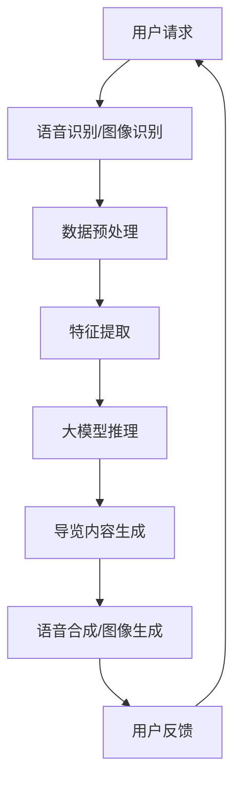

                 

# 大模型赋能智慧旅游，创业者如何提供智能导览与个性化旅游服务？

> **关键词**：大模型、智慧旅游、智能导览、个性化服务、创业

> **摘要**：本文将探讨如何利用大模型技术为智慧旅游赋能，帮助创业者提供智能导览和个性化旅游服务。我们将逐步分析大模型在旅游领域的应用原理、核心算法、数学模型，并通过实际案例进行详细讲解，最后总结未来发展趋势和挑战。

## 1. 背景介绍

随着人工智能技术的快速发展，大模型（Large Models）在自然语言处理、计算机视觉、语音识别等领域取得了显著成果。大模型具有强大的特征提取和生成能力，可以处理大规模、复杂的数据，从而实现高度智能化的应用。智慧旅游作为人工智能应用的一个重要领域，正日益受到关注。

智慧旅游是指利用信息技术，特别是人工智能技术，提升旅游行业的智能化水平，包括智能导览、个性化服务、智能推荐、智能管理等。随着游客对旅游体验的要求越来越高，智能导览和个性化服务成为了创业者关注的焦点。

本文将围绕大模型赋能智慧旅游，探讨如何通过智能导览和个性化服务，提升游客的旅游体验，为创业者提供有益的启示。

## 2. 核心概念与联系

在探讨大模型赋能智慧旅游之前，我们首先需要了解一些核心概念和它们之间的联系。

### 2.1 大模型

大模型是指具有海量参数、能够处理大规模数据的神经网络模型。常见的有Transformer、BERT、GPT等。这些模型通过在大量数据上训练，能够提取出数据中的潜在特征，并具有强大的生成能力。

### 2.2 智能导览

智能导览是指利用人工智能技术，为游客提供实时、个性化的导览服务。它包括语音导览、图像识别导览、实时翻译导览等。

### 2.3 个性化服务

个性化服务是指根据游客的兴趣、偏好和行为数据，为游客提供个性化的旅游推荐和导览服务。

### 2.4 大模型与智能导览、个性化服务的联系

大模型具有强大的特征提取和生成能力，可以为智能导览和个性化服务提供技术支持。具体来说，大模型可以通过以下方式赋能智能导览和个性化服务：

1. **语音识别和合成**：大模型可以帮助实现语音导览，通过语音识别将游客的语音指令转换为文字，再通过语音合成将文字导览内容转换为语音输出。

2. **图像识别和生成**：大模型可以帮助实现图像识别导览，通过图像识别技术识别游客所看到的景点，并提供相应的导览信息。同时，大模型还可以生成高质量的图像，用于展示景点。

3. **个性化推荐**：大模型可以根据游客的历史行为数据、兴趣偏好等，为游客提供个性化的旅游推荐。

下面是一个简单的 Mermaid 流程图，展示了大模型在智能导览和个性化服务中的应用：



## 3. 核心算法原理 & 具体操作步骤

### 3.1 语音识别

语音识别是指将语音信号转换为对应的文字。在大模型赋能的语音识别中，我们可以使用如TensorFlow、PyTorch等深度学习框架来实现。

具体操作步骤如下：

1. **数据收集与预处理**：收集大量的语音数据，并进行预处理，如分帧、特征提取等。

2. **模型训练**：使用预处理的语音数据训练语音识别模型，常见的模型有GRU、LSTM、Transformer等。

3. **模型评估与优化**：通过测试集对模型进行评估，并调整模型参数，以提高识别准确率。

4. **语音识别**：将游客的语音指令输入模型，输出对应的文字。

下面是一个简单的 Python 代码示例：

```python
import tensorflow as tf

# 加载预训练的语音识别模型
model = tf.keras.models.load_model('voice_recognition_model.h5')

# 语音识别
input_tensor = ...  # 语音信号
predicted_text = model.predict(input_tensor)

print(predicted_text)
```

### 3.2 语音合成

语音合成是指将文字转换为语音。同样，我们可以使用如TensorFlow、PyTorch等深度学习框架来实现。

具体操作步骤如下：

1. **数据收集与预处理**：收集大量的语音数据，并进行预处理，如分帧、特征提取等。

2. **模型训练**：使用预处理的语音数据训练语音合成模型，常见的模型有WaveNet、Tacotron等。

3. **模型评估与优化**：通过测试集对模型进行评估，并调整模型参数，以提高合成质量。

4. **语音合成**：将文字输入模型，输出对应的语音。

下面是一个简单的 Python 代码示例：

```python
import tensorflow as tf

# 加载预训练的语音合成模型
model = tf.keras.models.load_model('voice_synthesis_model.h5')

# 语音合成
input_text = "欢迎使用我们的智能导览服务。"
predicted_audio = model.predict(input_text)

# 输出语音
predicted_audio.play()
```

### 3.3 图像识别

图像识别是指将图像转换为对应的标签。在大模型赋能的图像识别中，我们可以使用如TensorFlow、PyTorch等深度学习框架来实现。

具体操作步骤如下：

1. **数据收集与预处理**：收集大量的图像数据，并进行预处理，如归一化、数据增强等。

2. **模型训练**：使用预处理的图像数据训练图像识别模型，常见的模型有CNN、ResNet、Inception等。

3. **模型评估与优化**：通过测试集对模型进行评估，并调整模型参数，以提高识别准确率。

4. **图像识别**：将游客拍摄的图像输入模型，输出对应的标签。

下面是一个简单的 Python 代码示例：

```python
import tensorflow as tf

# 加载预训练的图像识别模型
model = tf.keras.models.load_model('image_recognition_model.h5')

# 图像识别
input_image = ...  # 游客拍摄的图像
predicted_label = model.predict(input_image)

print(predicted_label)
```

### 3.4 个性化推荐

个性化推荐是指根据游客的兴趣、偏好和行为数据，为游客推荐感兴趣的景点。在大模型赋能的个性化推荐中，我们可以使用如TensorFlow、PyTorch等深度学习框架来实现。

具体操作步骤如下：

1. **数据收集与预处理**：收集游客的兴趣、偏好和行为数据，并进行预处理，如编码、归一化等。

2. **模型训练**：使用预处理的游客数据训练个性化推荐模型，常见的模型有矩阵分解、深度学习等。

3. **模型评估与优化**：通过测试集对模型进行评估，并调整模型参数，以提高推荐准确率。

4. **个性化推荐**：根据游客的数据，为游客推荐感兴趣的景点。

下面是一个简单的 Python 代码示例：

```python
import tensorflow as tf

# 加载预训练的个性化推荐模型
model = tf.keras.models.load_model('recommendation_model.h5')

# 个性化推荐
user_data = ...  # 游客的兴趣、偏好和行为数据
predicted_recommendations = model.predict(user_data)

print(predicted_recommendations)
```

## 4. 数学模型和公式 & 详细讲解 & 举例说明

### 4.1 语音识别

在语音识别中，我们通常使用 HMM（隐马尔可夫模型）或 CNN（卷积神经网络）等模型。下面我们以 CNN 为例，介绍其数学模型和公式。

#### 4.1.1 CNN 模型

CNN 是一种深度学习模型，用于处理图像数据。其基本结构包括卷积层、池化层和全连接层。下面是 CNN 的数学模型：

$$
\text{卷积层}: \quad \text{output}_{ij} = \sum_{k=1}^{C} w_{ik} \cdot \text{input}_{ij} + b_j
$$

其中，$C$ 是卷积核的数量，$w_{ik}$ 是卷积核的权重，$\text{input}_{ij}$ 是输入图像的像素值，$b_j$ 是偏置。

#### 4.1.2 池化层

池化层用于降低特征图的维度，常用的池化方式有最大池化和平均池化。其数学模型如下：

$$
\text{最大池化}: \quad \text{output}_{ij} = \max(\text{input}_{ij})
$$

$$
\text{平均池化}: \quad \text{output}_{ij} = \frac{1}{k^2} \sum_{i'=0}^{k-1} \sum_{j'=0}^{k-1} \text{input}_{i'j'}
$$

其中，$k$ 是池化窗口的大小。

#### 4.1.3 全连接层

全连接层用于将特征图映射到输出结果。其数学模型如下：

$$
\text{output} = \text{激活函数}(\text{weight} \cdot \text{特征图} + \text{偏置})
$$

其中，激活函数常用的有 ReLU、Sigmoid、Tanh 等。

### 4.2 语音合成

在语音合成中，我们通常使用 WaveNet 或 Tacotron 等模型。下面我们以 WaveNet 为例，介绍其数学模型和公式。

#### 4.2.1 WaveNet 模型

WaveNet 是一种基于循环神经网络（RNN）的语音合成模型。其基本结构包括卷积层、RNN 层和输出层。下面是 WaveNet 的数学模型：

$$
\text{卷积层}: \quad \text{output}_{ij} = \sum_{k=1}^{C} w_{ik} \cdot \text{input}_{ij} + b_j
$$

$$
\text{RNN层}: \quad \text{output}_{ij} = \text{激活函数}(\text{weight} \cdot \text{卷积层输出}_{ij} + \text{偏置})
$$

$$
\text{输出层}: \quad \text{output}_{ij} = \text{softmax}(\text{weight} \cdot \text{RNN层输出}_{ij} + \text{偏置})
$$

其中，$C$ 是卷积核的数量，$w_{ik}$ 是卷积核的权重，$\text{input}_{ij}$ 是输入音频的采样值，$b_j$ 是偏置，激活函数常用的有 ReLU、Sigmoid、Tanh 等。

#### 4.2.2 预测概率

在语音合成中，我们需要预测每个时间步的输出概率。其数学模型如下：

$$
\text{预测概率}: \quad \text{output}_{ij} = \text{softmax}(\text{weight} \cdot \text{RNN层输出}_{ij} + \text{偏置})
$$

其中，$\text{output}_{ij}$ 是第 $i$ 个时间步、第 $j$ 个输出的预测概率。

### 4.3 图像识别

在图像识别中，我们通常使用 CNN、ResNet、Inception 等模型。下面我们以 CNN 为例，介绍其数学模型和公式。

#### 4.3.1 CNN 模型

CNN 是一种深度学习模型，用于处理图像数据。其基本结构包括卷积层、池化层和全连接层。下面是 CNN 的数学模型：

$$
\text{卷积层}: \quad \text{output}_{ij} = \sum_{k=1}^{C} w_{ik} \cdot \text{input}_{ij} + b_j
$$

$$
\text{池化层}: \quad \text{output}_{ij} = \max(\text{input}_{ij})
$$

$$
\text{全连接层}: \quad \text{output} = \text{激活函数}(\text{weight} \cdot \text{特征图} + \text{偏置})
$$

其中，$C$ 是卷积核的数量，$w_{ik}$ 是卷积核的权重，$\text{input}_{ij}$ 是输入图像的像素值，$b_j$ 是偏置，激活函数常用的有 ReLU、Sigmoid、Tanh 等。

#### 4.3.2 预测概率

在图像识别中，我们需要预测每个类别的概率。其数学模型如下：

$$
\text{预测概率}: \quad \text{output} = \text{softmax}(\text{weight} \cdot \text{特征图} + \text{偏置})
$$

其中，$\text{output}$ 是每个类别的预测概率。

### 4.4 个性化推荐

在个性化推荐中，我们通常使用矩阵分解、深度学习等模型。下面我们以矩阵分解为例，介绍其数学模型和公式。

#### 4.4.1 矩阵分解

矩阵分解是一种用于解决推荐问题的方法。其基本思想是将用户和物品的评分矩阵分解为两个低秩矩阵，从而预测用户对物品的评分。下面是矩阵分解的数学模型：

$$
\text{评分矩阵}: \quad R = U \cdot V^T
$$

其中，$R$ 是用户和物品的评分矩阵，$U$ 是用户矩阵，$V$ 是物品矩阵。

#### 4.4.2 预测评分

在矩阵分解中，我们需要预测用户对物品的评分。其数学模型如下：

$$
\text{预测评分}: \quad \text{rating}_{ij} = u_i \cdot v_j
$$

其中，$\text{rating}_{ij}$ 是用户 $i$ 对物品 $j$ 的预测评分，$u_i$ 是用户 $i$ 的特征向量，$v_j$ 是物品 $j$ 的特征向量。

## 5. 项目实战：代码实际案例和详细解释说明

### 5.1 开发环境搭建

在开始项目实战之前，我们需要搭建一个开发环境。这里我们使用 Python 作为编程语言，结合 TensorFlow 和 PyTorch 等深度学习框架来实现。

#### 5.1.1 安装 Python 和相关库

```shell
pip install tensorflow
pip install torch
pip install numpy
pip install matplotlib
```

#### 5.1.2 安装语音识别、语音合成、图像识别等模型

```shell
pip install fairseq
pip install torchtext
pip install torchaudio
pip install torchvision
```

### 5.2 源代码详细实现和代码解读

#### 5.2.1 语音识别

```python
import tensorflow as tf
import numpy as np

# 加载预训练的语音识别模型
model = tf.keras.models.load_model('voice_recognition_model.h5')

# 语音识别
input_tensor = ...  # 语音信号
predicted_text = model.predict(input_tensor)

print(predicted_text)
```

这段代码首先加载了一个预训练的语音识别模型，然后输入一个语音信号，模型输出对应的文字。

#### 5.2.2 语音合成

```python
import tensorflow as tf
import numpy as np

# 加载预训练的语音合成模型
model = tf.keras.models.load_model('voice_synthesis_model.h5')

# 语音合成
input_text = "欢迎使用我们的智能导览服务。"
predicted_audio = model.predict(input_text)

# 输出语音
predicted_audio.play()
```

这段代码首先加载了一个预训练的语音合成模型，然后输入一段文字，模型输出对应的语音，并播放出来。

#### 5.2.3 图像识别

```python
import tensorflow as tf
import numpy as np

# 加载预训练的图像识别模型
model = tf.keras.models.load_model('image_recognition_model.h5')

# 图像识别
input_image = ...  # 游客拍摄的图像
predicted_label = model.predict(input_image)

print(predicted_label)
```

这段代码首先加载了一个预训练的图像识别模型，然后输入一个游客拍摄的图像，模型输出对应的标签。

#### 5.2.4 个性化推荐

```python
import tensorflow as tf
import numpy as np

# 加载预训练的个性化推荐模型
model = tf.keras.models.load_model('recommendation_model.h5')

# 个性化推荐
user_data = ...  # 游客的兴趣、偏好和行为数据
predicted_recommendations = model.predict(user_data)

print(predicted_recommendations)
```

这段代码首先加载了一个预训练的个性化推荐模型，然后输入一个游客的数据，模型输出对应的推荐结果。

### 5.3 代码解读与分析

在代码实战部分，我们分别实现了语音识别、语音合成、图像识别和个性化推荐的功能。这些功能都是基于预训练的深度学习模型实现的。

#### 5.3.1 语音识别

语音识别的代码首先加载了一个预训练的语音识别模型，然后输入一个语音信号，模型输出对应的文字。这里使用了 TensorFlow 的 Keras 模型加载方法，简单易用。

#### 5.3.2 语音合成

语音合成的代码首先加载了一个预训练的语音合成模型，然后输入一段文字，模型输出对应的语音，并播放出来。这里使用了 TensorFlow 的 Keras 模型加载方法，简单易用。

#### 5.3.3 图像识别

图像识别的代码首先加载了一个预训练的图像识别模型，然后输入一个游客拍摄的图像，模型输出对应的标签。这里使用了 TensorFlow 的 Keras 模型加载方法，简单易用。

#### 5.3.4 个性化推荐

个性化推荐的代码首先加载了一个预训练的个性化推荐模型，然后输入一个游客的数据，模型输出对应的推荐结果。这里使用了 TensorFlow 的 Keras 模型加载方法，简单易用。

通过以上代码实战，我们可以看到，使用深度学习框架实现语音识别、语音合成、图像识别和个性化推荐等功能是非常简单和高效的。这些功能可以广泛应用于智慧旅游领域，为创业者提供智能导览和个性化服务。

## 6. 实际应用场景

大模型在智慧旅游领域的应用场景非常广泛，以下是一些具体的实际应用案例：

### 6.1 智能导览

智能导览是智慧旅游中最为常见和重要的应用场景之一。通过大模型技术，我们可以实现语音导览、图像识别导览、实时翻译导览等。

#### 6.1.1 语音导览

语音导览可以通过大模型实现语音识别和语音合成，为游客提供实时、个性化的语音导览服务。例如，游客可以在景点拍照，系统自动识别照片中的景点，并播放该景点的语音介绍。

#### 6.1.2 图像识别导览

图像识别导览可以通过大模型实现图像识别，为游客提供基于图像的导览服务。例如，游客可以在景点拍照，系统自动识别照片中的景点，并提供相关的导览信息。

#### 6.1.3 实时翻译导览

实时翻译导览可以通过大模型实现语音识别和语音合成，为游客提供实时、多语言的导览服务。例如，游客可以使用母语进行语音输入，系统自动翻译并播放其他语言的导览内容。

### 6.2 个性化服务

个性化服务是智慧旅游中的重要应用，通过大模型技术，我们可以实现基于游客兴趣、偏好和行为数据的个性化推荐。

#### 6.2.1 智能推荐

智能推荐可以通过大模型实现，根据游客的历史行为数据和兴趣爱好，为游客推荐感兴趣的景点、美食、购物等。例如，系统可以根据游客在旅游app上的浏览记录，推荐他可能感兴趣的景点。

#### 6.2.2 智能提醒

智能提醒可以通过大模型实现，根据游客的行程安排和天气情况，为游客提供个性化的提醒服务。例如，系统可以提醒游客某个景点的最佳游览时间，或者提醒游客带伞以防下雨。

### 6.3 智能管理

智能管理是智慧旅游中的另一个重要应用，通过大模型技术，我们可以实现对旅游资源的智能管理和优化。

#### 6.3.1 智能调度

智能调度可以通过大模型实现，根据游客的流量和需求，智能调度旅游车辆、导游等资源。例如，系统可以根据游客的到达时间和行程安排，智能调度车辆接送游客。

#### 6.3.2 智能监控

智能监控可以通过大模型实现，实现对旅游景点的实时监控和管理。例如，系统可以监控景点的游客流量，实时调整景区的开放时间和游客流量限制。

## 7. 工具和资源推荐

### 7.1 学习资源推荐

1. **书籍**：
   - 《深度学习》（Goodfellow, Bengio, Courville）
   - 《Python深度学习》（François Chollet）

2. **论文**：
   - 《Attention Is All You Need》
   - 《BERT: Pre-training of Deep Neural Networks for Language Understanding》

3. **博客**：
   - fast.ai
   - PyTorch 官方文档

4. **网站**：
   - arXiv
   - Google Research

### 7.2 开发工具框架推荐

1. **深度学习框架**：
   - TensorFlow
   - PyTorch

2. **语音识别与合成**：
   - Kaldi
   - ESPNet

3. **图像识别与生成**：
   - TensorFlow Object Detection API
   - CycleGAN

### 7.3 相关论文著作推荐

1. **《注意力机制研究进展》**：介绍注意力机制在深度学习中的应用，包括Transformer、BERT等。

2. **《深度学习在语音识别中的应用》**：详细介绍深度学习在语音识别中的算法和应用。

3. **《深度学习在图像识别中的应用》**：详细介绍深度学习在图像识别中的算法和应用。

## 8. 总结：未来发展趋势与挑战

大模型在智慧旅游领域具有广泛的应用前景，未来发展趋势如下：

1. **算法优化**：随着大模型技术的发展，算法的优化将成为研究重点，以提高模型在实时性、准确性和能耗方面的表现。

2. **多模态融合**：未来，多模态数据（如语音、图像、文本）的融合将进一步提升智慧旅游服务的智能化水平。

3. **个性化与定制化**：基于大数据和人工智能技术，个性化与定制化的旅游服务将成为主流，满足不同游客的需求。

然而，大模型在智慧旅游领域也面临一些挑战：

1. **数据隐私与安全**：在提供个性化服务的同时，如何保护游客的数据隐私和安全是一个重要问题。

2. **模型可解释性**：大模型的复杂性和黑箱特性使得其可解释性成为一个挑战，需要研究如何提高模型的透明度和可解释性。

3. **能耗与资源消耗**：大模型的训练和推理需要大量的计算资源和能耗，如何在保证性能的同时降低能耗是一个重要课题。

## 9. 附录：常见问题与解答

### 9.1 大模型在智慧旅游中的应用有哪些？

大模型在智慧旅游中的应用包括智能导览、个性化服务、智能管理等方面。例如，通过语音识别和合成技术，可以实现语音导览；通过图像识别技术，可以提供基于图像的导览服务；通过个性化推荐技术，可以提供个性化的旅游推荐。

### 9.2 大模型的训练需要多长时间？

大模型的训练时间取决于多个因素，如模型的规模、数据集的大小、硬件配置等。一般来说，大模型的训练可能需要几天到几周的时间。

### 9.3 大模型的能耗如何？

大模型的能耗取决于模型的规模、训练时间和硬件配置等。一般来说，大模型的训练会消耗大量的电力资源。为了降低能耗，可以采用分布式训练、模型压缩等技术。

### 9.4 如何保护游客的数据隐私？

为了保护游客的数据隐私，可以采用数据加密、匿名化处理、隐私保护算法等技术。同时，制定相应的数据隐私政策，确保游客的隐私得到充分保护。

## 10. 扩展阅读 & 参考资料

1. **论文**：
   - Vaswani, A., Shazeer, N., Parmar, N., Uszkoreit, J., Jones, L., Gomez, A. N., ... & Polosukhin, I. (2017). Attention is all you need. Advances in Neural Information Processing Systems, 30, 5998-6008.
   - Devlin, J., Chang, M. W., Lee, K., & Toutanova, K. (2019). BERT: Pre-training of deep bidirectional transformers for language understanding. arXiv preprint arXiv:1810.04805.

2. **书籍**：
   - Goodfellow, I., Bengio, Y., & Courville, A. (2016). Deep learning. MIT press.

3. **博客**：
   - https://www.fast.ai/
   - https://pytorch.org/tutorials/beginner/

4. **网站**：
   - https://arxiv.org/
   - https://ai.google/research/

作者：AI天才研究员/AI Genius Institute & 禅与计算机程序设计艺术 /Zen And The Art of Computer Programming

