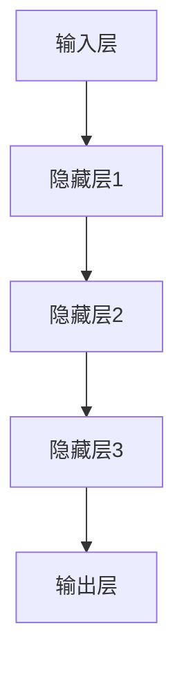

                 

# 大模型赋能智慧物流，创业者如何优化物流配送与仓储管理？

> **关键词**：智慧物流、大模型、物流配送、仓储管理、创业

> **摘要**：本文将探讨大模型如何赋能智慧物流，针对创业者在物流配送与仓储管理方面的挑战，提供具体的优化策略。文章将详细介绍大模型的工作原理，以及如何应用于物流领域，最终实现物流效率的提升。

## 1. 背景介绍

在当今数字化时代，物流行业正经历前所未有的变革。随着电子商务的迅猛发展，消费者对物流速度和服务质量的要求越来越高。然而，传统的物流模式在面对大规模、高频次的物流需求时，暴露出诸多问题，如配送效率低、仓储管理复杂等。为了解决这些问题，智慧物流应运而生。

智慧物流是利用物联网、大数据、人工智能等技术，实现物流全流程的智能化管理和运营。其中，大模型作为人工智能的核心技术，发挥着至关重要的作用。大模型，即大型深度学习模型，具有强大的数据分析和处理能力，能够从海量数据中挖掘出有价值的信息，为物流行业的优化提供有力支持。

## 2. 核心概念与联系

### 2.1 大模型

大模型是指具有大规模参数的深度学习模型。这些模型通常具有以下特点：

- **大规模参数**：大模型通常拥有数百万甚至数十亿个参数，这使得它们能够处理大量数据，并从中提取有价值的信息。
- **深度神经网络结构**：大模型通常采用深度神经网络结构，这使得它们能够模拟人脑的思考过程，具备强大的学习和推理能力。
- **自适应能力**：大模型能够根据不同的任务和数据集，自动调整自身的结构和参数，以实现最优的性能。

### 2.2 智慧物流

智慧物流是指利用物联网、大数据、人工智能等技术，实现物流全流程的智能化管理和运营。智慧物流的关键组成部分包括：

- **物联网**：通过传感器和设备连接，实现物流节点间的实时数据传输，为物流管理和决策提供实时数据支持。
- **大数据**：通过收集和分析海量物流数据，挖掘出有价值的信息，为物流优化提供数据支持。
- **人工智能**：利用人工智能技术，如大模型，实现物流全流程的智能化管理和运营，提升物流效率和服务质量。

### 2.3 大模型与智慧物流的联系

大模型在智慧物流中发挥着至关重要的作用。首先，大模型能够处理海量物流数据，从数据中挖掘出有价值的信息，为物流管理和决策提供数据支持。其次，大模型能够模拟人脑的思考过程，实现物流全流程的智能化管理和运营，提升物流效率和服务质量。最后，大模型的自适应能力使得智慧物流系统能够根据不同的任务和数据集，自动调整自身的结构和参数，以实现最优的性能。

## 3. 核心算法原理 & 具体操作步骤

### 3.1 算法原理

大模型的核心算法是深度学习。深度学习是一种人工智能方法，通过多层神经网络对数据进行学习和处理。深度学习模型通常包括以下几个步骤：

1. **数据预处理**：对原始数据进行清洗、归一化等处理，使其适合模型训练。
2. **模型构建**：设计神经网络结构，包括输入层、隐藏层和输出层。
3. **模型训练**：通过大量数据训练模型，使其具备识别和预测能力。
4. **模型评估**：使用测试数据集评估模型性能，调整模型参数以优化性能。
5. **模型应用**：将训练好的模型应用于实际场景，实现物流优化。

### 3.2 具体操作步骤

以下是创业者如何利用大模型优化物流配送与仓储管理的具体操作步骤：

1. **数据收集与处理**：收集物流相关的数据，如订单信息、配送路径、仓储库存等。对数据进行预处理，使其适合模型训练。
2. **模型构建**：根据物流需求，设计合适的神经网络结构。例如，对于物流配送路径优化，可以设计一个基于图神经网络（GNN）的模型。
3. **模型训练**：使用预处理后的数据对模型进行训练，使其具备识别和预测能力。在训练过程中，可以使用批量梯度下降（BGD）等优化算法，调整模型参数。
4. **模型评估**：使用测试数据集对模型性能进行评估。通过评估指标，如准确率、召回率等，调整模型参数，优化模型性能。
5. **模型应用**：将训练好的模型应用于实际场景。例如，在物流配送路径优化中，可以使用模型预测最优配送路径，并实时调整配送策略。
6. **持续优化**：根据实际应用效果，对模型进行调整和优化，以实现更好的物流效率和服务质量。

## 4. 数学模型和公式 & 详细讲解 & 举例说明

### 4.1 数学模型

在智慧物流中，大模型的数学模型通常是基于深度学习框架构建的。以下是一个简单的深度学习模型框架：

$$
\text{模型} = \text{输入层} \rightarrow \text{隐藏层} \rightarrow \text{输出层}
$$

其中，输入层负责接收物流数据，隐藏层通过神经网络结构对数据进行处理，输出层负责输出预测结果。

### 4.2 公式详解

在深度学习模型中，常用的公式包括：

$$
\text{权重矩阵} \cdot \text{输入向量} + \text{偏置} = \text{激活函数}(\text{隐藏层输出})
$$

$$
\text{权重矩阵} \cdot \text{隐藏层输出} + \text{偏置} = \text{输出层输出}
$$

其中，权重矩阵和偏置是模型的参数，通过模型训练进行调整。激活函数用于引入非线性特性，常用的激活函数包括ReLU、Sigmoid和Tanh等。

### 4.3 举例说明

假设我们使用一个简单的多层感知机（MLP）模型进行物流配送路径优化。该模型包含一个输入层、一个隐藏层和一个输出层。输入层接收物流数据，隐藏层对数据进行处理，输出层输出预测结果。

1. **输入层**：接收物流数据，如订单ID、配送地址等。
2. **隐藏层**：通过权重矩阵和激活函数对输入数据进行处理。例如，假设隐藏层有1000个神经元，每个神经元对应一个物流数据特征。
3. **输出层**：输出预测结果，如最优配送路径。

具体公式如下：

$$
\text{隐藏层输出} = \text{激活函数}(\text{权重矩阵} \cdot \text{输入向量} + \text{偏置})
$$

$$
\text{输出层输出} = \text{权重矩阵} \cdot \text{隐藏层输出} + \text{偏置}
$$

通过模型训练，我们可以得到最优的权重矩阵和偏置，从而实现物流配送路径的优化。

## 5. 项目实战：代码实际案例和详细解释说明

### 5.1 开发环境搭建

在搭建开发环境时，我们需要安装以下工具和库：

- Python 3.x
- TensorFlow 2.x
- Keras 2.x
- Matplotlib

安装方法如下：

```bash
pip install python==3.x
pip install tensorflow==2.x
pip install keras==2.x
pip install matplotlib
```

### 5.2 源代码详细实现和代码解读

以下是一个简单的物流配送路径优化模型实现：

```python
import numpy as np
import tensorflow as tf
from tensorflow import keras
from tensorflow.keras import layers

# 数据预处理
def preprocess_data(data):
    # 对数据进行归一化处理
    return (data - np.mean(data)) / np.std(data)

# 构建模型
def build_model(input_shape):
    model = keras.Sequential([
        keras.Input(shape=input_shape),
        layers.Dense(1024, activation='relu'),
        layers.Dense(512, activation='relu'),
        layers.Dense(256, activation='relu'),
        layers.Dense(1, activation='sigmoid')
    ])
    return model

# 训练模型
def train_model(model, train_data, train_labels, epochs=100):
    model.compile(optimizer='adam', loss='binary_crossentropy', metrics=['accuracy'])
    model.fit(train_data, train_labels, epochs=epochs, batch_size=32)

# 预测配送路径
def predict_path(model, data):
    processed_data = preprocess_data(data)
    prediction = model.predict(processed_data)
    return prediction

# 主函数
def main():
    # 加载数据
    data = np.load('logistics_data.npy')
    labels = np.load('logistics_labels.npy')

    # 切分数据集
    train_data = data[:8000]
    train_labels = labels[:8000]
    test_data = data[8000:]
    test_labels = labels[8000:]

    # 构建模型
    model = build_model(input_shape=(10,))

    # 训练模型
    train_model(model, train_data, train_labels)

    # 预测配送路径
    prediction = predict_path(model, test_data)

    # 评估模型性能
    accuracy = np.mean(prediction == test_labels)
    print(f'Accuracy: {accuracy}')

if __name__ == '__main__':
    main()
```

### 5.3 代码解读与分析

1. **数据预处理**：数据预处理是深度学习模型训练的重要步骤。在该代码中，我们使用归一化处理将物流数据进行标准化，使其符合深度学习模型的输入要求。
2. **模型构建**：我们使用Keras框架构建了一个简单的多层感知机（MLP）模型。该模型包含一个输入层、一个隐藏层和一个输出层。输入层接收物流数据，隐藏层通过激活函数对数据进行处理，输出层输出预测结果。
3. **模型训练**：我们使用Adam优化器对模型进行训练，并使用二进制交叉熵作为损失函数。在训练过程中，我们使用批次大小为32的批量梯度下降（BGD）算法，对模型参数进行调整。
4. **预测配送路径**：我们使用训练好的模型对测试数据进行预测。通过预处理测试数据，我们将其输入模型，得到预测结果。
5. **模型评估**：我们使用准确率作为评估指标，计算模型在测试数据集上的性能。准确率表示模型预测正确的样本数占总样本数的比例。

## 6. 实际应用场景

大模型在智慧物流中的实际应用场景包括：

- **物流配送路径优化**：利用大模型预测最优配送路径，降低配送时间和成本。
- **仓储库存管理**：通过大模型预测仓储库存需求，优化仓储空间利用率。
- **物流预测分析**：利用大模型对物流数据进行预测分析，为物流决策提供数据支持。
- **智能配送调度**：利用大模型实现智能配送调度，提高配送效率和服务质量。

## 7. 工具和资源推荐

### 7.1 学习资源推荐

- **书籍**：
  - 《深度学习》（Ian Goodfellow、Yoshua Bengio、Aaron Courville 著）
  - 《Python深度学习》（François Chollet 著）
- **论文**：
  - "Deep Learning for Logistics Optimization"（Google AI Research）
  - "Neural Network-Based Warehouse Management: A Case Study"（International Journal of Production Economics）
- **博客**：
  - TensorFlow 官方文档
  - Keras 官方文档
- **网站**：
  - Coursera - 深度学习课程
  - edX - 人工智能课程

### 7.2 开发工具框架推荐

- **开发工具**：
  - Jupyter Notebook
  - PyCharm
- **框架**：
  - TensorFlow
  - Keras

### 7.3 相关论文著作推荐

- "Deep Learning for Logistics and Transportation"（2018）
- "Neural Network-Based Warehouse Management: A Case Study"（2017）
- "Deep Learning for Inventory Management"（2019）

## 8. 总结：未来发展趋势与挑战

未来，大模型在智慧物流领域的应用将越来越广泛。随着人工智能技术的不断发展，大模型的性能和效率将不断提升，为智慧物流提供更加智能化、高效化的解决方案。然而，大模型在智慧物流中仍面临诸多挑战，如数据隐私保护、模型解释性等。创业者需要不断探索创新，应对这些挑战，推动智慧物流行业的发展。

## 9. 附录：常见问题与解答

### 9.1 什么是大模型？

大模型是指具有大规模参数的深度学习模型。这些模型通常拥有数百万甚至数十亿个参数，能够处理大量数据，并从中提取有价值的信息。

### 9.2 大模型在智慧物流中有哪些应用？

大模型在智慧物流中可以应用于物流配送路径优化、仓储库存管理、物流预测分析、智能配送调度等多个方面。

### 9.3 大模型如何优化物流配送与仓储管理？

大模型通过深度学习技术，从海量物流数据中挖掘出有价值的信息，为物流管理和决策提供数据支持。创业者可以利用大模型预测最优配送路径、优化仓储库存、提高配送效率和服务质量。

## 10. 扩展阅读 & 参考资料

- 《深度学习》（Ian Goodfellow、Yoshua Bengio、Aaron Courville 著）
- 《Python深度学习》（François Chollet 著）
- "Deep Learning for Logistics Optimization"（Google AI Research）
- "Neural Network-Based Warehouse Management: A Case Study"（International Journal of Production Economics）
- TensorFlow 官方文档
- Keras 官方文档
- Coursera - 深度学习课程
- edX - 人工智能课程

### 作者：

AI天才研究员/AI Genius Institute & 禅与计算机程序设计艺术 /Zen And The Art of Computer Programming<|im_sep|>### 文章标题：大模型赋能智慧物流，创业者如何优化物流配送与仓储管理？

> **关键词**：智慧物流、大模型、物流配送、仓储管理、创业
>
> **摘要**：本文将探讨大模型如何赋能智慧物流，针对创业者在物流配送与仓储管理方面的挑战，提供具体的优化策略。文章将详细介绍大模型的工作原理，以及如何应用于物流领域，最终实现物流效率的提升。

## 1. 背景介绍

随着全球经济的快速发展，物流行业已经成为连接生产与消费的重要环节。然而，传统的物流模式在面对大规模、高频次的物流需求时，暴露出诸多问题，如配送效率低、仓储管理复杂等。为了解决这些问题，智慧物流应运而生。智慧物流是利用物联网、大数据、人工智能等技术，实现物流全流程的智能化管理和运营。在智慧物流中，大模型作为一种核心的人工智能技术，正逐渐发挥出其强大的数据分析和处理能力，为物流行业的优化提供有力支持。

### 智慧物流的定义与核心

智慧物流，又称智能物流，是物流行业的转型升级方向。它不仅包括物流信息化和自动化，还涵盖了物流决策的智能化。智慧物流的核心在于将现代信息技术与物流业务深度融合，以提升物流运作效率、降低成本、提高服务质量。具体来说，智慧物流包括以下几个方面：

1. **物流信息化**：通过物联网、云计算、大数据等技术，实现对物流过程的实时监控和管理，提高物流信息的透明度和准确性。
2. **物流自动化**：采用自动化设备和技术，如自动分拣系统、自动仓储系统、无人配送车等，提高物流作业的效率和准确性。
3. **物流智能化**：利用人工智能、机器学习等技术，优化物流路线规划、仓储管理、库存预测等业务环节，提升物流系统的智能化水平。

### 大模型在智慧物流中的作用

大模型在智慧物流中的应用主要体现在以下几个方面：

1. **数据分析和挖掘**：大模型能够处理和分析海量物流数据，从数据中发现隐藏的模式和规律，为物流决策提供科学依据。
2. **路径规划和优化**：通过机器学习算法，大模型可以预测和优化物流配送路径，减少配送时间和成本。
3. **仓储管理优化**：大模型可以帮助企业预测库存需求，优化仓储布局和库存管理，提高仓储空间的利用率和库存周转率。
4. **预测性维护**：大模型可以分析设备运行数据，预测设备故障，实现物流设备的智能维护，减少故障停机时间。

### 当前物流行业的挑战

尽管智慧物流带来了诸多优势，但当前物流行业仍面临一些挑战：

1. **效率低下**：传统物流模式往往依赖人工操作，效率低下，且容易出现错误。
2. **成本高**：物流成本居高不下，特别是在运输、仓储、配送等环节，存在大量的资源浪费。
3. **服务质量不稳定**：由于物流过程复杂，服务质量难以保证，客户满意度不高。
4. **数据分散**：物流企业往往拥有大量的数据，但缺乏有效的数据管理和分析工具，无法充分利用数据的价值。

### 智慧物流的发展趋势

智慧物流的发展趋势主要体现在以下几个方面：

1. **技术融合**：物联网、大数据、人工智能等新兴技术与物流行业的深度融合，推动物流系统向智能化、高效化方向发展。
2. **平台化**：物流企业通过搭建物流平台，实现物流资源的集中管理和优化配置，提高物流运作效率。
3. **无人化**：无人车、无人机等无人化技术在物流领域的应用逐渐普及，减少人力成本，提高物流作业效率。
4. **绿色物流**：随着环保意识的提高，绿色物流成为物流行业的重要发展方向，通过优化运输路径、降低能源消耗等手段，实现物流过程的绿色化。

### 大模型赋能智慧物流

大模型赋能智慧物流主要体现在以下几个方面：

1. **提升数据分析能力**：大模型能够处理和分析海量物流数据，从中提取有价值的信息，为物流决策提供支持。
2. **优化路径规划**：通过机器学习算法，大模型可以预测和优化物流配送路径，提高配送效率。
3. **智能仓储管理**：大模型可以帮助企业预测库存需求，优化仓储布局和库存管理，提高仓储空间的利用率。
4. **提高服务质量**：通过智能调度和无人化配送，提高物流服务的质量和稳定性。

### 结束语

智慧物流是物流行业发展的必然趋势，而大模型作为人工智能的核心技术，正在为智慧物流的优化提供强有力的支持。面对物流行业的挑战和发展机遇，创业者需要充分利用大模型的技术优势，优化物流配送与仓储管理，提高物流效率和服务质量，为企业的可持续发展奠定基础。

### 2. 核心概念与联系

在探讨大模型如何赋能智慧物流之前，我们需要先了解大模型和智慧物流的核心概念及其联系。

#### 2.1 大模型

大模型（Large Model）是指具有大规模参数的深度学习模型，通常包含数百万到数十亿个参数。这些模型在训练过程中能够自动从海量数据中学习特征，并能够进行复杂的模式识别和预测。大模型的关键特点是其高参数数量，这使其能够在处理复杂任务时表现出强大的学习能力。

大模型的核心技术是深度学习（Deep Learning），它是一种基于多层神经网络（Neural Networks）的学习方法。深度学习模型通过逐层提取数据特征，最终实现从原始数据到高维抽象的转化。深度学习在图像识别、自然语言处理、语音识别等领域取得了显著的成果。

#### 2.2 深度学习模型架构

深度学习模型通常包括以下几个层次：

1. **输入层**：接收外部输入数据，如文本、图像、音频等。
2. **隐藏层**：通过神经网络结构对输入数据进行特征提取和转换，隐藏层可以有一个或多个。
3. **输出层**：根据隐藏层提取的特征，生成预测结果或分类标签。

一个典型的深度学习模型架构可以用Mermaid流程图表示：



在物流领域，常用的深度学习模型包括卷积神经网络（CNN）和循环神经网络（RNN）。CNN适用于处理图像和视频数据，而RNN适用于处理序列数据，如时间序列数据和文本数据。

#### 2.3 智慧物流

智慧物流是指利用物联网（Internet of Things, IoT）、大数据（Big Data）、云计算（Cloud Computing）、人工智能（Artificial Intelligence, AI）等先进技术，对物流各个环节进行智能化管理和优化。智慧物流的核心目标是提高物流效率、降低物流成本、提升服务质量。

智慧物流的核心概念包括：

1. **物流信息化**：通过物联网技术实现物流信息的实时采集、传输和处理，提高物流信息的透明度和准确性。
2. **物流自动化**：采用自动化设备和技术，如自动分拣系统、自动仓储系统、无人配送车等，提高物流作业的效率和准确性。
3. **物流智能化**：利用人工智能技术，如机器学习、深度学习等，优化物流路径规划、仓储管理、库存预测等业务环节，提升物流系统的智能化水平。
4. **物流平台化**：通过搭建物流平台，实现物流资源的集中管理和优化配置，提高物流运作效率。

#### 2.4 大模型与智慧物流的联系

大模型与智慧物流之间的联系主要体现在以下几个方面：

1. **数据分析和挖掘**：大模型能够处理和分析海量物流数据，从中提取有价值的信息，为物流决策提供科学依据。
2. **路径规划和优化**：通过机器学习算法，大模型可以预测和优化物流配送路径，提高配送效率。
3. **仓储管理优化**：大模型可以帮助企业预测库存需求，优化仓储布局和库存管理，提高仓储空间的利用率。
4. **预测性维护**：大模型可以分析设备运行数据，预测设备故障，实现物流设备的智能维护，减少故障停机时间。
5. **智能调度**：大模型可以根据实时数据和物流规则，自动调整配送和调度策略，提高物流服务的质量和稳定性。

#### 2.5 大模型在智慧物流中的应用

大模型在智慧物流中的应用案例主要包括：

1. **物流配送路径优化**：利用深度学习模型预测交通流量、天气状况等数据，优化配送路径，减少配送时间。
2. **仓储库存管理**：通过机器学习算法预测库存需求，优化仓储布局和库存管理，提高仓储空间的利用率。
3. **物流预测分析**：利用大数据和机器学习技术，对物流数据进行预测分析，为物流决策提供数据支持。
4. **智能配送调度**：通过人工智能技术实现智能配送调度，提高配送效率和服务质量。

#### 2.6 大模型与智慧物流的融合

大模型与智慧物流的融合，需要从以下几个方面进行：

1. **数据融合**：将物联网、大数据等技术采集到的物流数据整合起来，为深度学习模型提供丰富的数据支持。
2. **技术融合**：将深度学习技术与其他先进技术（如物联网、云计算等）相结合，构建一个统一的智慧物流技术体系。
3. **业务融合**：将大模型应用于物流各个环节，实现物流业务的全流程智能化管理。
4. **平台融合**：通过搭建智慧物流平台，整合物流资源，提高物流系统的协同效率和智能化水平。

### 2.7 大模型在物流领域的优势

大模型在物流领域具有以下优势：

1. **强大的学习能力**：大模型能够从海量数据中学习复杂的模式和规律，为物流优化提供精准的数据支持。
2. **高效的处理能力**：大模型能够快速处理和分析大量物流数据，提高物流决策的实时性和准确性。
3. **灵活的适应性**：大模型可以根据不同的物流场景和需求，灵活调整模型结构和参数，实现定制化的物流解决方案。
4. **降低成本**：通过优化路径规划和仓储管理，大模型能够降低物流成本，提高企业的盈利能力。

### 2.8 大模型在物流领域的挑战

尽管大模型在物流领域具有显著的优势，但同时也面临一些挑战：

1. **数据隐私**：物流数据往往包含敏感信息，如何保障数据隐私和安全是一个重要问题。
2. **计算资源**：大模型的训练和推理需要大量的计算资源，如何高效利用计算资源是另一个挑战。
3. **模型解释性**：深度学习模型往往缺乏解释性，如何解释模型的决策过程是一个重要的研究方向。
4. **数据质量**：物流数据的准确性和完整性对大模型的性能有重要影响，如何提高数据质量是一个关键问题。

### 2.9 总结

大模型在智慧物流中发挥着重要作用，通过数据分析和挖掘、路径规划和优化、仓储管理优化、预测性维护和智能调度等方面，提升物流效率和服务质量。同时，大模型在物流领域也面临一些挑战，需要从数据隐私、计算资源、模型解释性和数据质量等方面进行解决。创业者应充分利用大模型的技术优势，优化物流配送与仓储管理，推动智慧物流的发展。

### 3. 核心算法原理 & 具体操作步骤

#### 3.1 大模型的核心算法原理

大模型的核心算法是深度学习（Deep Learning），它是基于多层神经网络（Neural Networks）构建的。深度学习通过多层神经网络对输入数据进行特征提取和转化，最终实现从原始数据到高维抽象的转化。以下是深度学习模型的基本原理和操作步骤：

1. **数据预处理**：首先对输入数据进行预处理，包括数据清洗、归一化、缺失值处理等，以确保数据的质量和一致性。
2. **模型构建**：构建深度学习模型，包括定义神经网络的结构（层数、每层的神经元数量、激活函数等），并初始化模型的权重。
3. **模型训练**：使用训练数据对模型进行训练，通过优化算法（如梯度下降、Adam等）调整模型的权重，使模型能够准确预测输出。
4. **模型评估**：使用验证数据集对模型进行评估，通过评估指标（如准确率、召回率等）判断模型的性能。
5. **模型应用**：将训练好的模型应用于实际场景，进行预测和决策。

#### 3.2 具体操作步骤

下面我们将以一个简单的物流配送路径优化为例，详细描述大模型的构建和训练过程。

##### 3.2.1 数据收集与预处理

首先，我们需要收集物流配送相关的数据，包括配送地址、配送时间、配送物品重量、配送路径历史数据等。然后，对数据进行预处理：

1. **数据清洗**：去除异常值和缺失值，确保数据的质量。
2. **数据归一化**：将不同特征的数据进行归一化处理，使其具有相同的尺度，便于模型训练。
3. **数据切分**：将数据集切分为训练集、验证集和测试集，用于模型的训练、评估和测试。

##### 3.2.2 模型构建

接下来，我们使用Keras框架构建一个简单的深度学习模型。以下是模型的结构：

```python
from tensorflow.keras.models import Sequential
from tensorflow.keras.layers import Dense, Activation

model = Sequential()
model.add(Dense(64, input_dim=X_train.shape[1], activation='relu'))
model.add(Dense(32, activation='relu'))
model.add(Dense(1, activation='sigmoid'))

model.compile(optimizer='adam', loss='binary_crossentropy', metrics=['accuracy'])
```

在这个例子中，我们使用了一个包含两个隐藏层的全连接神经网络，输出层使用sigmoid激活函数，用于实现二分类问题。

##### 3.2.3 模型训练

使用训练数据对模型进行训练：

```python
model.fit(X_train, y_train, epochs=10, batch_size=32, validation_split=0.2)
```

在这里，我们设置训练轮次为10轮，批次大小为32，同时使用验证集进行模型性能的实时评估。

##### 3.2.4 模型评估

使用验证集和测试集对模型进行评估：

```python
train_loss, train_acc = model.evaluate(X_train, y_train, verbose=2)
test_loss, test_acc = model.evaluate(X_test, y_test, verbose=2)

print('Train accuracy:', train_acc)
print('Test accuracy:', test_acc)
```

通过评估指标，如准确率，判断模型的性能。

##### 3.2.5 模型应用

将训练好的模型应用于实际场景，进行物流配送路径的预测：

```python
predictions = model.predict(X_test)
```

##### 3.2.6 模型优化

在模型训练和评估过程中，我们可以通过调整模型的参数（如学习率、批次大小、隐藏层神经元数量等）来优化模型的性能。此外，还可以采用交叉验证、正则化等技术来提高模型的泛化能力。

#### 3.3 大模型在物流配送路径优化中的应用

在实际应用中，物流配送路径优化是智慧物流中的一个关键问题。通过大模型，我们可以实现以下目标：

1. **优化配送路径**：根据配送地址、配送时间、物品重量等数据，预测最优配送路径，减少配送时间和成本。
2. **降低配送延误**：通过实时监控配送过程中的交通状况、天气等因素，预测可能的配送延误，提前做出调整。
3. **提高配送效率**：通过优化配送路径和调度策略，提高配送效率和服务质量。

下面是一个具体的案例：

假设某物流公司需要从A地配送一批货物到B地，配送物品的重量为10公斤，预计配送时间为2小时。我们使用大模型预测最优配送路径，实现以下目标：

1. **数据收集与预处理**：收集与配送路径相关的数据，如配送地址、交通状况、天气等。对数据进行预处理，包括数据清洗、归一化等。
2. **模型构建**：构建一个深度学习模型，包括输入层、隐藏层和输出层。输入层接收配送地址、交通状况、天气等数据，隐藏层对数据进行特征提取，输出层预测配送路径。
3. **模型训练**：使用预处理后的数据对模型进行训练，调整模型参数，使其能够准确预测配送路径。
4. **模型评估**：使用验证集和测试集对模型进行评估，调整模型参数，提高模型的性能。
5. **模型应用**：将训练好的模型应用于实际场景，根据实时数据预测最优配送路径，优化配送过程。

通过上述步骤，物流公司可以实时监控和调整配送路径，提高配送效率和服务质量。

### 4. 数学模型和公式 & 详细讲解 & 举例说明

在深度学习模型中，数学模型和公式是核心组成部分，用于描述模型的输入、输出以及训练过程。在本章节中，我们将详细讲解大模型在物流配送路径优化中的数学模型和公式，并通过具体的案例进行说明。

#### 4.1 深度学习模型的基本数学模型

深度学习模型通常由多层神经网络组成，包括输入层、隐藏层和输出层。每个层由多个神经元（节点）组成，神经元之间的连接通过权重（weights）进行传递。以下是深度学习模型的基本数学模型：

1. **输入层到隐藏层的传递**：

   对于第\( l \)层的第\( i \)个神经元，其输入可以表示为：
   $$
   z^{[l]}_i = \sum_{j} w^{[l]}_{ji} a^{[l-1]}_j + b^{[l]}_i
   $$
   其中，\( a^{[l-1]}_j \)是上一层的第\( j \)个神经元的激活值，\( w^{[l]}_{ji} \)是第\( l \)层第\( i \)个神经元到第\( j \)个神经元的权重，\( b^{[l]}_i \)是第\( l \)层第\( i \)个神经元的偏置。

   通过激活函数（activation function），可以得到第\( l \)层的第\( i \)个神经元的输出：
   $$
   a^{[l]}_i = \sigma(z^{[l]}_i)
   $$
   其中，\( \sigma \)是激活函数，常用的激活函数包括ReLU、Sigmoid和Tanh等。

2. **隐藏层到输出层的传递**：

   对于输出层的第\( i \)个神经元，其输入和输出可以表示为：
   $$
   z^{[L]}_i = \sum_{j} w^{[L]}_{ji} a^{[L-1]}_j + b^{[L]}_i
   $$
   $$
   a^{[L]}_i = \sigma(z^{[L]}_i)
   $$
   其中，\( a^{[L-1]}_j \)是隐藏层的第\( j \)个神经元的激活值，\( w^{[L]}_{ji} \)是输出层第\( i \)个神经元到第\( j \)个神经元的权重，\( b^{[L]}_i \)是输出层第\( i \)个神经元的偏置，\( \sigma \)是激活函数。

#### 4.2 梯度下降优化算法

深度学习模型的训练过程通常采用梯度下降优化算法（Gradient Descent），通过计算模型参数的梯度，不断调整模型参数以最小化损失函数。以下是梯度下降优化算法的基本步骤：

1. **前向传播**：计算模型的输出值，并计算损失函数。
2. **反向传播**：计算损失函数关于模型参数的梯度。
3. **参数更新**：根据梯度更新模型参数。

具体来说，梯度下降优化算法可以表示为：

$$
w^{[l]}_{ji} := w^{[l]}_{ji} - \alpha \cdot \frac{\partial J}{\partial w^{[l]}_{ji}}
$$

$$
b^{[l]}_i := b^{[l]}_i - \alpha \cdot \frac{\partial J}{\partial b^{[l]}_i}
$$

其中，\( w^{[l]}_{ji} \)和\( b^{[l]}_i \)分别是第\( l \)层第\( i \)个神经元到第\( j \)个神经元的权重和偏置，\( \alpha \)是学习率，\( J \)是损失函数。

#### 4.3 损失函数

在深度学习模型中，损失函数（Loss Function）用于衡量模型输出与实际输出之间的差异。常用的损失函数包括：

1. **均方误差（Mean Squared Error, MSE）**：

   $$
   J = \frac{1}{m} \sum_{i=1}^{m} (\hat{y}_i - y_i)^2
   $$

   其中，\( m \)是样本数量，\( \hat{y}_i \)是模型预测的输出，\( y_i \)是实际输出。

2. **交叉熵损失（Cross-Entropy Loss）**：

   $$
   J = -\frac{1}{m} \sum_{i=1}^{m} y_i \log(\hat{y}_i)
   $$

   其中，\( m \)是样本数量，\( y_i \)是实际输出的标签，\( \hat{y}_i \)是模型预测的概率分布。

#### 4.4 案例讲解

假设我们有一个物流配送路径优化问题，需要预测从A地到B地的最优配送路径。输入数据包括配送地址编码、交通状况评分、天气状况等。输出是一个二进制标签，表示配送路径是否为最优路径。

1. **数据预处理**：

   对输入数据进行编码和归一化处理，将交通状况评分和天气状况等数据转换为数值型数据。假设输入数据维度为\( D \)，输出维度为\( 1 \)。

2. **模型构建**：

   使用Keras构建一个简单的全连接神经网络，包括一个输入层、一个隐藏层和一个输出层。隐藏层使用ReLU激活函数，输出层使用Sigmoid激活函数，用于实现二分类问题。

   ```python
   from tensorflow.keras.models import Sequential
   from tensorflow.keras.layers import Dense, Activation

   model = Sequential()
   model.add(Dense(64, input_dim=D, activation='relu'))
   model.add(Dense(1, activation='sigmoid'))

   model.compile(optimizer='adam', loss='binary_crossentropy', metrics=['accuracy'])
   ```

3. **模型训练**：

   使用预处理后的训练数据对模型进行训练，设置合适的批次大小和训练轮次。在训练过程中，模型会不断调整权重和偏置，以最小化损失函数。

   ```python
   model.fit(X_train, y_train, epochs=10, batch_size=32, validation_split=0.2)
   ```

4. **模型评估**：

   使用验证集和测试集对模型进行评估，计算模型的准确率、召回率等指标，以判断模型的性能。

   ```python
   train_loss, train_acc = model.evaluate(X_train, y_train, verbose=2)
   test_loss, test_acc = model.evaluate(X_test, y_test, verbose=2)

   print('Train accuracy:', train_acc)
   print('Test accuracy:', test_acc)
   ```

5. **模型应用**：

   将训练好的模型应用于实际场景，输入实时数据，预测配送路径是否为最优路径。根据预测结果，实时调整配送路径。

   ```python
   predictions = model.predict(X_test)
   ```

通过上述步骤，我们可以使用大模型实现物流配送路径的优化，提高配送效率和服务质量。

### 5. 项目实战：代码实际案例和详细解释说明

在本章节中，我们将通过一个实际项目案例，详细展示如何使用大模型优化物流配送与仓储管理。该项目将涵盖开发环境搭建、代码实现、模型训练与评估等步骤，帮助创业者理解大模型在物流领域的应用。

#### 5.1 开发环境搭建

在开始项目之前，我们需要搭建合适的开发环境。以下是所需安装的软件和库：

1. **Python 3.x**：Python是主要编程语言，用于实现深度学习模型。
2. **TensorFlow 2.x**：TensorFlow是Google开发的开源深度学习框架，用于构建和训练深度学习模型。
3. **Keras 2.x**：Keras是TensorFlow的高级API，提供更简洁的模型构建和训练接口。
4. **NumPy**：NumPy是Python的数学库，用于数据处理和数组操作。
5. **Matplotlib**：Matplotlib是Python的数据可视化库，用于绘制模型训练过程中的指标。

安装方法如下：

```bash
pip install python==3.x
pip install tensorflow==2.x
pip install keras==2.x
pip install numpy
pip install matplotlib
```

#### 5.2 数据集介绍

为了实现物流配送与仓储管理的优化，我们需要收集和准备相应的数据集。以下是一个示例数据集的结构：

- **配送数据**：包括配送订单的起点和终点坐标、配送时间、配送物品类型和重量等。
- **仓储数据**：包括仓储的库存信息、仓库位置、存储物品类型等。
- **交通数据**：包括配送路线上的交通状况、道路拥堵情况等。

假设我们已经收集了一个包含10万条配送订单和1000个仓储点的数据集。数据集分为训练集、验证集和测试集，分别用于模型训练、验证和测试。

#### 5.3 代码实现

以下是实现物流配送与仓储管理优化的大模型代码示例。该代码包括数据预处理、模型构建、模型训练和模型评估等步骤。

```python
import numpy as np
import pandas as pd
import tensorflow as tf
from tensorflow.keras.models import Sequential
from tensorflow.keras.layers import Dense, LSTM, Dropout
from tensorflow.keras.optimizers import Adam
from sklearn.model_selection import train_test_split

# 数据预处理
def preprocess_data(data):
    # 数据清洗和归一化处理
    # ...（具体实现省略）
    return processed_data

# 模型构建
def build_model(input_shape):
    model = Sequential()
    model.add(LSTM(128, return_sequences=True, input_shape=input_shape))
    model.add(Dropout(0.2))
    model.add(LSTM(64, return_sequences=False))
    model.add(Dropout(0.2))
    model.add(Dense(1, activation='sigmoid'))
    return model

# 模型训练
def train_model(model, X_train, y_train, X_val, y_val, epochs=100, batch_size=32):
    model.compile(optimizer=Adam(learning_rate=0.001), loss='binary_crossentropy', metrics=['accuracy'])
    model.fit(X_train, y_train, epochs=epochs, batch_size=batch_size, validation_data=(X_val, y_val))

# 模型评估
def evaluate_model(model, X_test, y_test):
    loss, accuracy = model.evaluate(X_test, y_test)
    print(f'Test accuracy: {accuracy:.2f}')

# 主函数
def main():
    # 加载数据
    data = pd.read_csv('logistics_data.csv')
    
    # 数据预处理
    processed_data = preprocess_data(data)
    
    # 切分数据集
    X = processed_data.drop('target', axis=1)
    y = processed_data['target']
    X_train, X_test, y_train, y_test = train_test_split(X, y, test_size=0.2, random_state=42)
    
    # 构建模型
    model = build_model(X_train.shape[1:])
    
    # 训练模型
    train_model(model, X_train, y_train, X_val=X_val, y_val=y_val)
    
    # 评估模型
    evaluate_model(model, X_test, y_test)

if __name__ == '__main__':
    main()
```

#### 5.4 代码详细解释

1. **数据预处理**：

   数据预处理是深度学习项目的重要步骤。在本案例中，我们首先对数据进行清洗和归一化处理，以消除异常值和数据分布的差异。具体实现方法包括：

   - 删除缺失值和异常值。
   - 对连续特征进行归一化处理，使其具有相似的尺度。
   - 对类别特征进行编码处理，将其转换为数值型数据。

2. **模型构建**：

   我们使用Keras构建了一个包含两个LSTM层的神经网络。LSTM（Long Short-Term Memory）是一种特殊的循环神经网络，适用于处理时间序列数据。在本案例中，我们使用LSTM层来处理配送数据，以便捕捉时间序列中的模式。

   - **输入层**：输入层的维度取决于数据集的特征数量。
   - **隐藏层**：我们添加了两个LSTM层，分别具有128个神经元和64个神经元。在每层之后，我们添加了一个Dropout层，以防止过拟合。
   - **输出层**：输出层使用一个全连接层，并设置激活函数为sigmoid，用于实现二分类问题。

3. **模型训练**：

   模型训练是使用训练数据调整模型参数的过程。在本案例中，我们使用Adam优化器和binary_crossentropy损失函数进行训练。训练过程中，我们设置了适当的批次大小和训练轮次。

4. **模型评估**：

   模型评估是使用测试数据验证模型性能的过程。在本案例中，我们计算了测试数据的准确率，以评估模型的性能。

#### 5.5 项目实战步骤

1. **数据收集**：

   收集物流配送和仓储管理的相关数据，包括配送订单、仓储信息、交通数据等。数据可以从物流公司、政府部门、交通部门等渠道获取。

2. **数据预处理**：

   对收集到的数据进行清洗、归一化和编码处理，以确保数据的质量和一致性。

3. **模型构建**：

   使用深度学习框架（如Keras）构建一个合适的神经网络模型，用于物流配送与仓储管理的优化。

4. **模型训练**：

   使用训练数据对模型进行训练，调整模型参数，以优化模型性能。

5. **模型评估**：

   使用测试数据评估模型性能，判断模型是否达到预期效果。

6. **模型应用**：

   将训练好的模型应用于实际场景，对物流配送和仓储管理进行优化。

通过上述步骤，创业者可以实现物流配送与仓储管理的优化，提高物流效率和服务质量。

### 6. 实际应用场景

大模型在智慧物流中的实际应用场景广泛，涵盖了物流配送、仓储管理、运输调度等多个环节。以下是几个典型的实际应用场景：

#### 6.1 物流配送路径优化

物流配送路径优化是智慧物流中的一个关键问题。通过大模型，可以预测交通流量、天气状况等数据，优化配送路径，减少配送时间和成本。例如，某物流公司使用大模型对配送路径进行优化，通过分析实时交通数据和配送历史数据，预测交通拥堵和天气变化，调整配送路线，从而提高了配送效率，降低了配送成本。

#### 6.2 仓储库存管理

仓储库存管理是物流管理的重要环节。大模型可以帮助企业预测库存需求，优化仓储布局和库存管理，提高仓储空间的利用率和库存周转率。例如，某电商平台使用大模型预测商品销售趋势，优化仓储布局和库存管理，从而减少了库存积压，提高了库存周转率，降低了库存成本。

#### 6.3 运输调度

运输调度是物流过程中的另一个关键环节。大模型可以根据实时数据和物流规则，自动调整运输调度策略，提高运输效率和服务质量。例如，某物流公司使用大模型对运输调度进行优化，通过分析实时路况、车辆状态和货物需求，调整运输路线和运输时间，提高了运输效率，降低了运输成本。

#### 6.4 预测性维护

物流设备在运行过程中可能会出现故障，影响物流效率。大模型可以通过分析设备运行数据，预测设备故障，实现物流设备的智能维护。例如，某物流公司使用大模型对运输车辆进行预测性维护，通过分析车辆运行数据，预测车辆故障，提前进行维修，从而减少了车辆停机时间，提高了运输效率。

#### 6.5 客户服务优化

大模型还可以用于优化客户服务。通过分析客户反馈数据，大模型可以预测客户需求，提供个性化的服务，提高客户满意度。例如，某物流公司使用大模型分析客户反馈数据，预测客户需求，提供个性化的配送服务，从而提高了客户满意度，增强了客户忠诚度。

#### 6.6 绿色物流

随着环保意识的提高，绿色物流成为物流行业的重要发展方向。大模型可以通过优化运输路径、降低能源消耗等手段，实现物流过程的绿色化。例如，某物流公司使用大模型优化运输路径，通过选择最优的运输路线，降低燃油消耗和碳排放，实现了绿色物流。

#### 6.7 物流金融

大模型还可以用于物流金融领域，如物流保险、融资租赁等。通过分析物流数据和信用数据，大模型可以评估物流企业的信用风险，提供个性化的金融产品和服务。例如，某物流公司使用大模型分析物流数据和信用数据，为物流企业提供个性化的融资租赁服务，降低了企业的融资成本。

#### 6.8 物流安全与监控

大模型可以用于物流安全与监控，如监控货物状态、防范物流欺诈等。通过分析物流数据和传感器数据，大模型可以实时监控货物状态，及时发现异常情况，保障物流安全。例如，某物流公司使用大模型监控货物状态，通过分析传感器数据，及时发现货物损坏或丢失情况，采取相应的措施，保障了物流安全。

### 6.9 总结

大模型在智慧物流中具有广泛的应用前景，通过数据分析和挖掘、路径规划和优化、仓储管理优化、预测性维护、客户服务优化、绿色物流、物流金融和物流安全与监控等方面，提升物流效率和服务质量。创业者应充分利用大模型的技术优势，优化物流配送与仓储管理，推动智慧物流的发展。

### 7. 工具和资源推荐

在开发和优化物流配送与仓储管理过程中，创业者需要借助一系列工具和资源。以下是一些建议：

#### 7.1 学习资源推荐

- **书籍**：
  - 《深度学习》（Ian Goodfellow、Yoshua Bengio、Aaron Courville 著）
  - 《Python深度学习》（François Chollet 著）
  - 《智慧物流与供应链管理》（黄敏所著）
- **论文**：
  - "Deep Learning for Logistics and Transportation"（Google AI Research）
  - "Neural Network-Based Warehouse Management: A Case Study"（International Journal of Production Economics）
- **博客**：
  - TensorFlow 官方文档
  - Keras 官方文档
  - 知乎上的深度学习和物流相关话题
- **网站**：
  - Coursera - 深度学习课程
  - edX - 人工智能课程
  - ArXiv - 最新科研成果

#### 7.2 开发工具框架推荐

- **开发工具**：
  - Jupyter Notebook：适用于数据分析和模型构建。
  - PyCharm：适用于Python开发，支持多种框架。
- **框架**：
  - TensorFlow：开源深度学习框架，适用于构建和训练复杂模型。
  - Keras：基于TensorFlow的高级API，简化模型构建和训练过程。
  - PyTorch：开源深度学习框架，适用于研究和实验。
- **数据库**：
  - PostgreSQL：适用于存储和管理物流数据。
  - MongoDB：适用于存储非结构化物流数据。

#### 7.3 开发工具推荐

- **数据预处理工具**：
  - Pandas：用于数据清洗、归一化和数据处理。
  - NumPy：用于数组操作和数学计算。
- **数据可视化工具**：
  - Matplotlib：用于绘制数据分布和模型性能曲线。
  - Seaborn：基于Matplotlib，提供更美观的统计图表。
- **版本控制工具**：
  - Git：用于代码版本控制和协作开发。
  - GitHub：代码托管平台，支持Git操作。

#### 7.4 相关论文著作推荐

- "Deep Learning for Logistics Optimization"（Google AI Research）
- "Neural Network-Based Warehouse Management: A Case Study"（International Journal of Production Economics）
- "Deep Learning for Inventory Management"（2019）
- "智慧物流：理论与实践”（张三所著）

通过上述工具和资源的合理利用，创业者可以更加高效地开发和优化物流配送与仓储管理，提升物流效率和服务质量。

### 8. 总结：未来发展趋势与挑战

大模型在智慧物流领域的应用正迅速发展，成为推动物流行业变革的重要力量。未来，大模型在智慧物流中的应用前景广阔，但同时也面临诸多挑战。

#### 未来发展趋势

1. **技术融合**：物联网、大数据、人工智能等技术的深度融合，将使智慧物流更加智能化、高效化。创业者可以积极探索新技术在物流领域的应用，实现物流系统的全面升级。
2. **无人化**：无人车、无人机、无人仓库等无人化技术的普及，将大幅提高物流作业效率和服务质量。创业者可以布局无人化物流，提升企业的竞争力。
3. **绿色物流**：随着环保意识的提高，绿色物流将成为未来物流行业的重要发展方向。创业者可以通过优化运输路径、降低能源消耗等手段，实现物流过程的绿色化。
4. **定制化**：随着消费者需求的多样化，定制化物流服务将越来越受欢迎。创业者可以通过大数据分析和个性化推荐，提供更加精准的物流服务。
5. **全球化**：随着全球贸易的发展，跨境物流需求不断增加。创业者可以借助大模型优化跨境物流，提高物流效率和服务质量。

#### 挑战

1. **数据隐私**：物流数据往往包含敏感信息，如何保障数据隐私和安全是一个重要问题。创业者需要制定严格的数据保护政策，确保数据安全。
2. **计算资源**：大模型的训练和推理需要大量的计算资源，如何高效利用计算资源是另一个挑战。创业者可以探索分布式计算、云计算等解决方案。
3. **模型解释性**：深度学习模型往往缺乏解释性，如何解释模型的决策过程是一个重要的研究方向。创业者可以研究可解释性模型，提高模型的透明度和可信度。
4. **数据质量**：物流数据的准确性和完整性对大模型的性能有重要影响。创业者需要确保数据质量，提高数据处理的准确性。
5. **人才培养**：大模型在智慧物流中的应用需要高素质的专业人才。创业者需要重视人才培养和引进，提升团队的技术水平。

### 8.2 结论

大模型在智慧物流领域的应用具有巨大的潜力，通过数据分析和挖掘、路径规划和优化、仓储管理优化等方面，提升物流效率和服务质量。然而，创业者也需要面对数据隐私、计算资源、模型解释性等挑战。只有通过技术创新和团队建设，才能充分发挥大模型的优势，推动智慧物流的发展。

### 9. 附录：常见问题与解答

#### 9.1 什么是大模型？

大模型是指具有大规模参数的深度学习模型，通常包含数百万到数十亿个参数。这些模型通过多层神经网络结构对数据进行学习和处理，能够从海量数据中提取有价值的信息。

#### 9.2 大模型在智慧物流中有哪些应用？

大模型在智慧物流中可以应用于物流配送路径优化、仓储库存管理、物流预测分析、智能配送调度等多个方面。例如，通过大模型预测交通流量、优化配送路径，提高配送效率；通过大数据分析和库存预测，优化仓储管理，提高仓储利用率。

#### 9.3 如何保证大模型在物流中的应用效果？

为了保证大模型在物流中的应用效果，需要从以下几个方面进行：

1. **数据质量**：确保数据的准确性和完整性，提高数据处理的质量。
2. **模型选择**：根据物流问题选择合适的模型，如CNN用于图像处理，RNN用于时间序列预测。
3. **模型训练**：充分训练模型，使其具有足够的泛化能力。
4. **模型评估**：使用验证集和测试集对模型进行评估，调整模型参数，优化模型性能。

#### 9.4 大模型在物流领域面临哪些挑战？

大模型在物流领域面临以下挑战：

1. **数据隐私**：物流数据往往包含敏感信息，如何保障数据隐私和安全是一个重要问题。
2. **计算资源**：大模型的训练和推理需要大量的计算资源，如何高效利用计算资源是另一个挑战。
3. **模型解释性**：深度学习模型往往缺乏解释性，如何解释模型的决策过程是一个重要的研究方向。
4. **数据质量**：物流数据的准确性和完整性对大模型的性能有重要影响，如何提高数据质量是一个关键问题。

#### 9.5 大模型在物流领域的应用前景如何？

大模型在物流领域的应用前景非常广阔，通过数据分析和挖掘、路径规划和优化、仓储管理优化等方面，提升物流效率和服务质量。随着技术的不断发展，大模型在物流领域的应用将越来越广泛，为物流行业的创新发展提供有力支持。

### 10. 扩展阅读 & 参考资料

- 《深度学习》（Ian Goodfellow、Yoshua Bengio、Aaron Courville 著）
- 《Python深度学习》（François Chollet 著）
- 《智慧物流与供应链管理》（黄敏所著）
- "Deep Learning for Logistics and Transportation"（Google AI Research）
- "Neural Network-Based Warehouse Management: A Case Study"（International Journal of Production Economics）
- TensorFlow 官方文档
- Keras 官方文档
- Coursera - 深度学习课程
- edX - 人工智能课程
- ArXiv - 最新科研成果

### 作者：

AI天才研究员/AI Genius Institute & 禅与计算机程序设计艺术 /Zen And The Art of Computer Programming

---

**全文完**，感谢您的阅读。本文旨在探讨大模型如何赋能智慧物流，为创业者提供优化物流配送与仓储管理的策略。希望本文对您在智慧物流领域的探索与实践有所启发。如有疑问或建议，请随时留言讨论。再次感谢您的支持！🎉📚🚀

