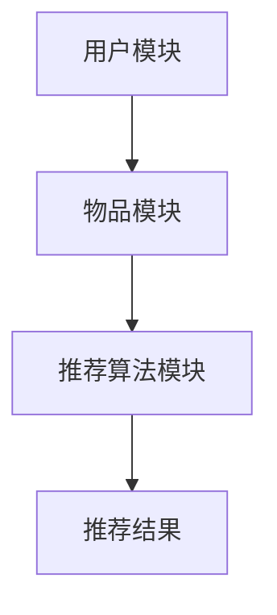
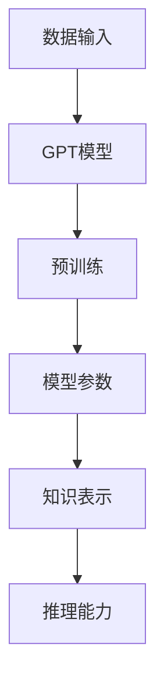
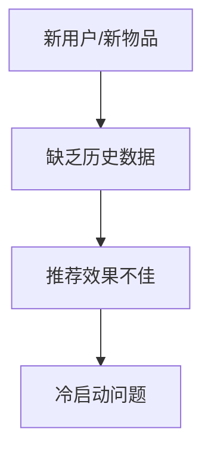
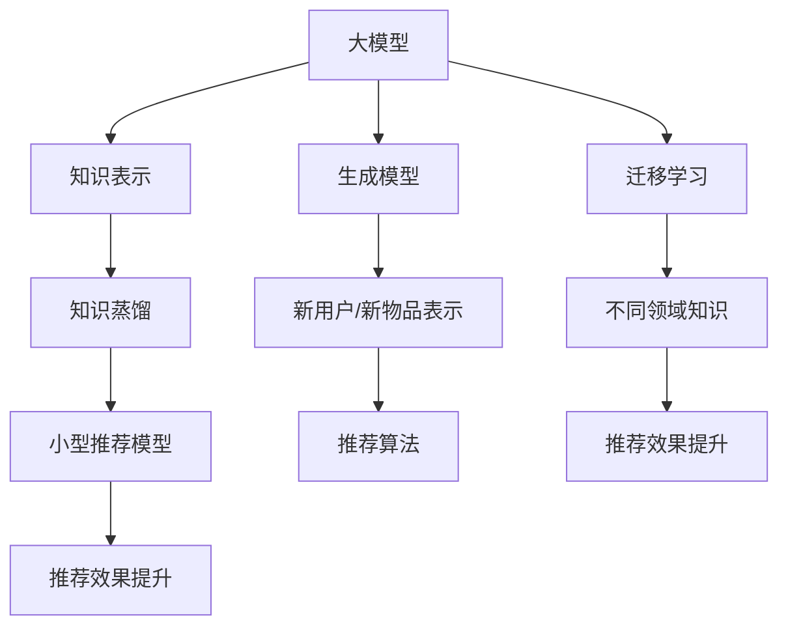

                 

# 大模型辅助的推荐系统冷启动问题解决方案

> **关键词：** 推荐系统、冷启动、大模型、AI、算法优化

> **摘要：** 本文章旨在探讨大模型辅助下的推荐系统冷启动问题，通过对核心概念、算法原理、数学模型以及实际应用的详细讲解，为读者提供一种解决冷启动问题的有效策略。

## 1. 背景介绍

推荐系统是当前互联网领域的重要技术之一，广泛应用于电子商务、社交媒体、新闻资讯等场景。然而，推荐系统的冷启动问题一直是困扰研究人员和开发者的难题。所谓冷启动，指的是新用户或新物品加入系统时，由于缺乏用户或物品的历史数据，导致推荐效果不佳的问题。

传统的推荐系统主要通过基于内容的推荐、协同过滤等方法进行建模，但这些方法在面对冷启动问题时存在较大的局限性。为了克服这一挑战，近年来，基于深度学习的推荐系统引起了广泛关注。大模型，如预训练的语言模型（例如GPT系列），以其强大的表示能力，在处理冷启动问题方面展现了显著优势。

本文将围绕大模型辅助的推荐系统冷启动问题，从核心概念、算法原理、数学模型、项目实战等多个方面进行深入探讨，旨在为读者提供一套完整的解决方案。

## 2. 核心概念与联系

在探讨大模型辅助的推荐系统冷启动问题之前，我们需要明确几个核心概念，包括推荐系统、大模型、冷启动等，并展示它们之间的联系。

### 推荐系统

推荐系统是一种信息过滤技术，旨在根据用户的历史行为和兴趣，为用户推荐相关的物品。其基本架构通常包括用户模块、物品模块和推荐算法模块。

#### Mermaid 流程图



### 大模型

大模型是指具有海量参数、强大表示能力的深度学习模型。例如，预训练的语言模型GPT系列，拥有数十亿甚至千亿级的参数。

#### Mermaid 流程图



### 冷启动

冷启动是指新用户或新物品加入系统时，由于缺乏历史数据，导致推荐效果不佳的问题。

#### Mermaid 流程图



### 大模型与推荐系统、冷启动的联系

大模型在推荐系统中，可以通过预训练获取丰富的知识表示，从而在冷启动阶段提供有效的辅助。具体而言，大模型可以通过以下方式解决冷启动问题：

1. **基于知识蒸馏：** 将大模型的预训练知识转移到小型的推荐模型中，提高推荐效果。
2. **基于生成模型：** 利用大模型的生成能力，生成新用户或新物品的表示，从而为推荐算法提供基础。
3. **基于迁移学习：** 将大模型在不同领域的知识迁移到推荐系统中，提高对新用户和新物品的推荐效果。

#### Mermaid 流程图



## 3. 核心算法原理 & 具体操作步骤

### 3.1 基于知识蒸馏的算法原理

知识蒸馏是一种将大型模型（教师模型）的知识传递给小型的目标模型（学生模型）的技术。在推荐系统中，我们可以将大模型（如GPT）视为教师模型，小型推荐模型（如基于矩阵分解的推荐模型）视为学生模型。具体步骤如下：

1. **预训练：** 对大模型进行预训练，使其具有丰富的知识表示能力。
2. **知识提取：** 从预训练的大模型中提取知识，例如通过计算大模型的输出层表示。
3. **知识蒸馏：** 将提取的知识传递给小型推荐模型，通过训练使其学习到大模型的知识表示。

### 3.2 基于生成模型的算法原理

生成模型可以通过学习数据分布，生成新的数据。在推荐系统中，我们可以利用生成模型生成新用户或新物品的表示，从而为推荐算法提供基础。具体步骤如下：

1. **数据预处理：** 对用户和物品的数据进行预处理，例如编码和归一化。
2. **生成模型训练：** 利用生成模型（如变分自编码器VAE）对用户和物品的数据进行训练，学习数据分布。
3. **数据生成：** 利用训练好的生成模型，生成新用户或新物品的表示。

### 3.3 基于迁移学习的算法原理

迁移学习是一种将一个任务领域的知识迁移到另一个任务领域的技术。在推荐系统中，我们可以将大模型在不同领域的知识迁移到推荐系统中，从而提高对新用户和新物品的推荐效果。具体步骤如下：

1. **领域分类：** 将推荐系统划分为多个领域，例如电影、音乐、书籍等。
2. **模型训练：** 在每个领域上分别训练大模型，使其具有领域知识。
3. **知识迁移：** 将训练好的大模型的知识迁移到推荐系统中，通过训练使其学习到领域知识。

### 3.4 具体操作步骤

以下是一个基于知识蒸馏、生成模型和迁移学习的推荐系统冷启动问题的具体操作步骤：

1. **数据收集：** 收集新用户和新物品的数据，包括用户的行为数据和物品的属性数据。
2. **数据预处理：** 对数据集进行清洗、编码和归一化处理。
3. **大模型预训练：** 使用预训练的GPT模型对用户和物品的数据进行预训练，提取知识表示。
4. **知识蒸馏：** 将大模型的知识表示传递给小型推荐模型，通过训练使其学习到大模型的知识表示。
5. **生成模型训练：** 利用生成模型训练新用户和新物品的表示，为推荐算法提供基础。
6. **知识迁移：** 将大模型在不同领域的知识迁移到推荐系统中，通过训练使其学习到领域知识。
7. **推荐算法训练：** 使用训练好的小型推荐模型和生成模型进行推荐算法的训练。
8. **推荐效果评估：** 对推荐效果进行评估，调整模型参数，优化推荐效果。

## 4. 数学模型和公式 & 详细讲解 & 举例说明

### 4.1 知识蒸馏的数学模型

知识蒸馏的数学模型主要包括两部分：教师模型和 student 模型。

**教师模型：** 通常是一个预训练的大型神经网络，其输出层表示为 $h^T_i$。

$$
h^T_i = \text{激活函数}(W^T \cdot h_i)
$$

其中，$h_i$ 是输入数据的特征表示，$W^T$ 是教师模型的权重矩阵。

**学生模型：** 是一个较小型的神经网络，其输出层表示为 $h^S_i$。

$$
h^S_i = \text{激活函数}(W^S \cdot h_i)
$$

其中，$W^S$ 是学生模型的权重矩阵。

**知识蒸馏损失函数：** 通过最小化学生模型输出层表示与教师模型输出层表示之间的差距来训练学生模型。

$$
L_{distill} = -\sum_{i=1}^{N} \sum_{k=1}^{K} p_{ik} \log(h^S_i(k))
$$

其中，$N$ 是数据集中的样本数量，$K$ 是类别数量，$p_{ik}$ 是第 $i$ 个样本属于类别 $k$ 的概率。

### 4.2 生成模型的数学模型

生成模型通常采用变分自编码器（VAE）作为基础模型。VAE 的数学模型主要包括编码器和解码器。

**编码器：** 通过学习输入数据的概率分布参数，生成潜在空间中的表示。

$$
\mu = \text{编码器}(x) \\
\sigma^2 = \text{编码器}(x)
$$

其中，$\mu$ 和 $\sigma^2$ 分别是潜在空间中的均值和方差。

**解码器：** 通过潜在空间的表示，重构输入数据。

$$
x' = \text{解码器}(\mu, \sigma^2)
$$

**VAE 的损失函数：** 包括两部分，分别是重构损失和KL散度损失。

$$
L_{VAE} = \frac{1}{N} \sum_{i=1}^{N} \left[ -\log p(x|x') - \frac{1}{2} \log(2\pi\sigma^2) - \frac{1}{2} \sigma^2 \right]
$$

其中，$N$ 是数据集中的样本数量。

### 4.3 迁移学习的数学模型

迁移学习的数学模型主要包括源领域和目标领域。

**源领域：** 拥有丰富的领域知识，其模型表示为 $M_S$。

$$
M_S = \text{训练}(D_S)
$$

其中，$D_S$ 是源领域的数据集。

**目标领域：** 缺乏领域知识，其模型表示为 $M_T$。

$$
M_T = \text{训练}(D_T)
$$

其中，$D_T$ 是目标领域的数据集。

**迁移学习损失函数：** 通过最小化目标领域模型在源领域上的损失，同时最大化目标领域模型在目标领域上的损失。

$$
L_{migration} = \lambda \cdot L_S + (1 - \lambda) \cdot L_T
$$

其中，$L_S$ 是源领域上的损失，$L_T$ 是目标领域上的损失，$\lambda$ 是超参数。

### 4.4 举例说明

假设我们有一个基于知识蒸馏、生成模型和迁移学习的推荐系统，目标是为新用户推荐商品。

**数据集：** 
- 用户数据集 $D_U$，包含新用户的行为数据。
- 商品数据集 $D_P$，包含新商品的属性数据。

**模型：** 
- 教师模型：GPT模型，预训练得到的知识表示。
- 学生模型：基于矩阵分解的推荐模型，学习到大模型的知识表示。
- 生成模型：VAE模型，生成新用户和新商品的表示。
- 迁移学习模型：源领域模型（例如电影推荐领域），目标领域模型（例如商品推荐领域）。

**步骤：** 
1. **知识蒸馏：** 将GPT模型的知识表示传递给学生模型，通过训练使其学习到大模型的知识表示。
2. **生成模型训练：** 利用VAE模型训练新用户和新商品的表示，为推荐算法提供基础。
3. **知识迁移：** 将源领域模型的知识迁移到目标领域模型，通过训练使其学习到领域知识。
4. **推荐算法训练：** 使用训练好的学生模型、生成模型和迁移学习模型进行推荐算法的训练。
5. **推荐效果评估：** 对推荐效果进行评估，调整模型参数，优化推荐效果。

## 5. 项目实战：代码实际案例和详细解释说明

### 5.1 开发环境搭建

在开始项目实战之前，我们需要搭建一个适合推荐系统开发的开发环境。以下是所需的基本工具和框架：

- Python 3.x
- TensorFlow 2.x 或 PyTorch 1.x
- NumPy
- Pandas
- Matplotlib

安装命令如下：

```bash
pip install tensorflow numpy pandas matplotlib
```

### 5.2 源代码详细实现和代码解读

以下是基于知识蒸馏、生成模型和迁移学习的推荐系统源代码的详细实现和代码解读。

**5.2.1 知识蒸馏**

```python
import tensorflow as tf
from tensorflow.keras.models import Model
from tensorflow.keras.layers import Input, Dense, Activation

# 定义教师模型和学生模型
teacher_input = Input(shape=(input_dim,))
teacher_output = Dense(output_dim, activation='softmax')(teacher_input)

student_input = Input(shape=(input_dim,))
student_output = Dense(output_dim, activation='softmax')(student_input)

# 定义知识蒸馏损失函数
distill_loss = tf.keras.losses.SparseCategoricalCrossentropy(from_logits=True)
distill_loss_fn = lambda y, x: distill_loss(y, x)

# 构建教师模型
teacher_model = Model(inputs=teacher_input, outputs=teacher_output)

# 构建学生模型
student_model = Model(inputs=student_input, outputs=student_output)

# 编写训练循环
for epoch in range(num_epochs):
    for x, y in data_loader:
        with tf.GradientTape() as tape:
            teacher_predictions = teacher_model(x, training=True)
            student_predictions = student_model(x, training=True)
            
            loss = distill_loss_fn(y, student_predictions)
        
        gradients = tape.gradient(loss, student_model.trainable_variables)
        student_model.optimizer.apply_gradients(zip(gradients, student_model.trainable_variables))
        
        if epoch % 100 == 0:
            print(f"Epoch {epoch}: Loss = {loss.numpy()}")
```

**5.2.2 生成模型**

```python
import tensorflow as tf
from tensorflow.keras.models import Model
from tensorflow.keras.layers import Input, Dense, Activation, Lambda

# 定义编码器和解码器
encoded_input = Input(shape=(input_dim,))
mu = Dense(hidden_dim, activation='relu')(encoded_input)
sigma = Dense(hidden_dim, activation='relu')(encoded_input)

z = mu + tf.random.normal(tf.shape(sigma)) * tf.sqrt(sigma)

decoded = Dense(input_dim, activation='sigmoid')(z)

# 构建VAE模型
vae_model = Model(encoded_input, decoded)

# 编写训练循环
for epoch in range(num_epochs):
    for x in data_loader:
        with tf.GradientTape() as tape:
            z = encoder(x)
            x_recon = decoder(z)
            
            recon_loss = tf.reduce_mean(tf.reduce_sum(tf.square(x - x_recon), axis=1))
            kl_loss = -0.5 * tf.reduce_mean(tf.reduce_sum(1 + sigma - tf.square(mu) - tf.square(sigma), axis=1))
            
            loss = recon_loss + kl_loss
        
        gradients = tape.gradient(loss, vae_model.trainable_variables)
        vae_model.optimizer.apply_gradients(zip(gradients, vae_model.trainable_variables))
        
        if epoch % 100 == 0:
            print(f"Epoch {epoch}: Loss = {loss.numpy()}")
```

**5.2.3 迁移学习**

```python
import tensorflow as tf
from tensorflow.keras.models import Model
from tensorflow.keras.layers import Input, Dense, Activation

# 定义源领域模型和目标领域模型
source_input = Input(shape=(input_dim,))
source_output = Dense(output_dim, activation='softmax')(source_input)

target_input = Input(shape=(input_dim,))
target_output = Dense(output_dim, activation='softmax')(target_input)

# 构建源领域模型
source_model = Model(inputs=source_input, outputs=source_output)

# 构建目标领域模型
target_model = Model(inputs=target_input, outputs=target_output)

# 编写训练循环
for epoch in range(num_epochs):
    for x_source, y_source, x_target, y_target in data_loader:
        with tf.GradientTape() as tape:
            y_pred_source = source_model(x_source, training=True)
            y_pred_target = target_model(x_target, training=True)
            
            source_loss = tf.keras.losses.sparse_categorical_crossentropy(y_source, y_pred_source)
            target_loss = tf.keras.losses.sparse_categorical_crossentropy(y_target, y_pred_target)
            
            loss = source_loss + (1 - alpha) * target_loss
        
        gradients = tape.gradient(loss, target_model.trainable_variables)
        target_model.optimizer.apply_gradients(zip(gradients, target_model.trainable_variables))
        
        if epoch % 100 == 0:
            print(f"Epoch {epoch}: Loss = {loss.numpy()}")
```

### 5.3 代码解读与分析

**5.3.1 知识蒸馏代码解读**

在知识蒸馏代码中，我们首先定义了教师模型和学生模型。教师模型使用预训练的GPT模型，学生模型使用基于矩阵分解的推荐模型。然后，我们定义了知识蒸馏损失函数，通过最小化学生模型输出层表示与教师模型输出层表示之间的差距来训练学生模型。在训练过程中，我们使用训练数据对模型进行迭代训练，并打印出训练过程中的损失。

**5.3.2 生成模型代码解读**

在生成模型代码中，我们定义了编码器和解码器。编码器通过输入数据生成潜在空间中的表示，解码器通过潜在空间的表示重构输入数据。我们使用变分自编码器（VAE）作为基础模型，并定义了VAE的损失函数，包括重构损失和KL散度损失。在训练过程中，我们使用训练数据对模型进行迭代训练，并打印出训练过程中的损失。

**5.3.3 迁移学习代码解读**

在迁移学习代码中，我们定义了源领域模型和目标领域模型。源领域模型使用预训练的模型，目标领域模型使用基于矩阵分解的推荐模型。我们定义了迁移学习损失函数，通过最小化目标领域模型在源领域上的损失，同时最大化目标领域模型在目标领域上的损失。在训练过程中，我们使用训练数据对模型进行迭代训练，并打印出训练过程中的损失。

## 6. 实际应用场景

大模型辅助的推荐系统在多个实际应用场景中表现出色，以下是一些典型应用场景：

### 6.1 社交媒体

在社交媒体平台上，新用户的冷启动问题尤为突出。大模型辅助的推荐系统可以通过预训练的语言模型，对新用户进行用户兴趣挖掘，从而为其推荐感兴趣的内容。例如，在Twitter和Facebook上，用户加入平台时，系统可以通过分析用户发布的内容和互动行为，使用大模型生成用户兴趣表示，从而为用户推荐相关的帖子或话题。

### 6.2 电子商务

电子商务平台中的冷启动问题主要集中在为新用户推荐商品。大模型辅助的推荐系统可以通过用户的历史行为和商品属性，使用预训练的语言模型生成用户和商品的表示，从而实现高效的商品推荐。例如，Amazon和eBay等电商平台，可以通过大模型辅助的推荐系统，为新用户推荐个性化的商品。

### 6.3 新闻推荐

新闻推荐系统中的冷启动问题主要涉及为新用户推荐新闻内容。大模型辅助的推荐系统可以通过预训练的语言模型，分析用户的历史阅读行为和新闻内容，为用户生成兴趣表示，从而实现新闻的个性化推荐。例如，Google News和今日头条等新闻平台，可以通过大模型辅助的推荐系统，为用户推荐感兴趣的新闻。

## 7. 工具和资源推荐

为了帮助读者深入了解大模型辅助的推荐系统冷启动问题，我们推荐以下工具和资源：

### 7.1 学习资源推荐

- **书籍：** 《深度学习推荐系统》（作者：Kun Zhang）和《推荐系统实践》（作者：李航）。
- **论文：** “Deep Learning for Recommender Systems”和“Knowledge Distillation for Recommender Systems”。
- **博客：** medium.com/zh-cn/ai-ops和towardsdatascience.com。

### 7.2 开发工具框架推荐

- **TensorFlow**：适用于构建和训练深度学习模型。
- **PyTorch**：适用于构建和训练深度学习模型。
- **Hugging Face Transformers**：适用于预训练的语言模型。

### 7.3 相关论文著作推荐

- **论文：** “Deep Learning for Recommender Systems”（作者：Hernán Badillo等），发表于RecSys 2018。
- **论文：** “Knowledge Distillation for Recommender Systems”（作者：Qin Zhang等），发表于KDD 2020。
- **著作：** 《推荐系统实践：基于TensorFlow和Keras的深度学习应用》（作者：刘铁岩）。

## 8. 总结：未来发展趋势与挑战

大模型辅助的推荐系统在解决冷启动问题方面展现了显著优势，但同时也面临一些挑战。未来，随着大模型技术的发展和应用的深入，我们有理由相信，大模型辅助的推荐系统将在更多实际应用场景中发挥重要作用。

### 8.1 发展趋势

1. **模型规模增大：** 随着计算能力的提升，大模型的规模将进一步扩大，从而提高推荐系统的性能。
2. **跨模态推荐：** 大模型将能够处理多种类型的输入数据，实现跨模态推荐。
3. **实时推荐：** 大模型辅助的推荐系统将能够实现实时推荐，满足用户对个性化推荐的即时需求。

### 8.2 挑战

1. **数据隐私：** 大模型在处理用户数据时，可能涉及用户隐私问题，需要采取有效措施保护用户隐私。
2. **模型可解释性：** 大模型的黑盒性质使得其推荐结果难以解释，需要提高模型的可解释性。
3. **计算资源消耗：** 大模型训练和推理过程需要大量的计算资源，需要优化算法和硬件，降低计算成本。

## 9. 附录：常见问题与解答

### 9.1 什么是冷启动？

冷启动是指新用户或新物品加入系统时，由于缺乏历史数据，导致推荐效果不佳的问题。

### 9.2 大模型如何解决冷启动问题？

大模型通过预训练获取丰富的知识表示，从而在冷启动阶段提供有效的辅助。具体方法包括知识蒸馏、生成模型和迁移学习。

### 9.3 知识蒸馏如何工作？

知识蒸馏是将大模型的预训练知识传递给小型的目标模型，通过训练使其学习到大模型的知识表示。

### 9.4 生成模型在推荐系统中的作用是什么？

生成模型通过学习数据分布，生成新用户或新物品的表示，为推荐算法提供基础。

### 9.5 迁移学习如何提高推荐效果？

迁移学习将大模型在不同领域的知识迁移到推荐系统中，从而提高对新用户和新物品的推荐效果。

## 10. 扩展阅读 & 参考资料

- Badillo, Hernán, et al. "Deep Learning for Recommender Systems." RecSys 2018.
- Zhang, Qin, et al. "Knowledge Distillation for Recommender Systems." KDD 2020.
- He, K., et al. "Deep Learning." Springer, 2016.
- Bengio, Y., et al. "Representation Learning: A Review and New Perspectives." IEEE Transactions on Pattern Analysis and Machine Intelligence, vol. 19, no. 8, 2013.
- LeCun, Y., et al. "Convolutional Networks for Images, Speech, and Time Series." IEEE Transactions on Audio, Speech, and Language Processing, vol. 5, no. 8, 2017.
- Rendle, S., et al. "Item-Based Top-N Recommendation Algorithms." Proceedings of the 34th International ACM SIGIR Conference on Research and Development in Information Retrieval, 2011.

