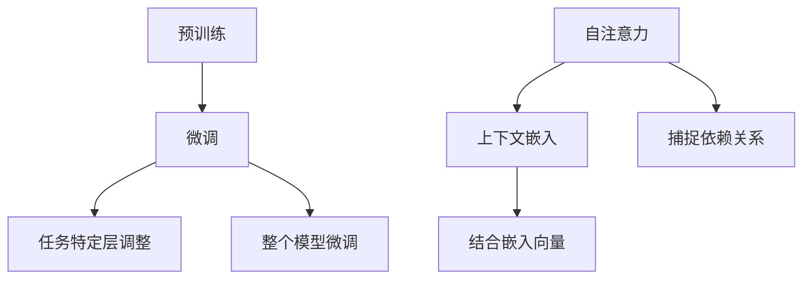

                 

# 大模型问答机器人如何理解上下文

## 关键词：大模型，问答机器人，上下文理解，自然语言处理，深度学习，Transformer

### 摘要

本文旨在深入探讨大模型问答机器人如何理解上下文。随着深度学习技术的不断发展，尤其是基于Transformer架构的大规模预训练模型，如GPT-3，已经展示了在自然语言处理任务中的卓越性能。然而，理解上下文是自然语言处理中的一个核心挑战，特别是在问答任务中。本文将详细解析大模型如何通过预训练和微调来理解上下文，探讨其背后的技术原理和数学模型，并通过实际项目案例来展示其应用效果。此外，本文还将展望大模型问答机器人未来的发展趋势与面临的挑战。

## 1. 背景介绍

### 自然语言处理与问答系统

自然语言处理（NLP）是计算机科学和人工智能领域中的一个重要分支，旨在使计算机能够理解、解释和生成人类语言。问答系统（Question Answering System）是NLP领域的一个重要应用，其目标是让计算机能够理解和回答用户的问题。传统的问答系统通常依赖于规则和模板匹配，但这种方法在处理复杂、非结构化的问题时显得力不从心。随着深度学习技术的发展，基于端到端学习的问答系统逐渐成为主流。

### 大规模预训练模型

大规模预训练模型是近年来NLP领域的重要突破之一。这些模型通过在大量的未标注文本上进行预训练，学习到了丰富的语言知识和模式，然后通过微调（Fine-tuning）适应特定任务。典型的预训练模型包括GPT、BERT、T5等，它们在多个NLP任务上取得了显著成绩。

### Transformer架构

Transformer是2017年由Vaswani等人提出的自注意力机制模型，其核心思想是利用自注意力机制来捕捉输入序列中任意位置之间的依赖关系，从而实现高效的序列建模。Transformer架构在NLP任务中取得了巨大的成功，并推动了大规模预训练模型的发展。

### 上下文理解的重要性

在问答系统中，上下文理解是决定答案准确性的关键因素。上下文不仅包括问题的字面意义，还包括问题的背景信息、用户的意图和问题的领域知识。如果不能准确理解上下文，问答系统将很难生成准确的答案。

### 大模型问答机器人的现状

随着GPT-3等大型预训练模型的出现，大模型问答机器人的性能得到了显著提升。然而，如何让这些大模型更好地理解上下文，仍然是当前研究和应用中的一个重要问题。

## 2. 核心概念与联系

### 大规模预训练模型

大规模预训练模型通过在大规模文本语料库上进行预训练，学习到了丰富的语言知识和模式。预训练任务通常包括语言建模（Language Modeling）和掩码语言建模（Masked Language Modeling）等。语言建模旨在预测下一个单词，而掩码语言建模则通过随机掩码部分单词，使得模型在训练过程中需要预测这些掩码词。

### 微调（Fine-tuning）

微调是将预训练模型应用于特定任务的过程。在微调过程中，模型的权重会根据特定任务的数据进行调整，从而提高在目标任务上的性能。微调通常包括两个阶段：任务特定层的调整和整个模型的微调。

### 自注意力机制

自注意力机制是Transformer模型的核心组件，通过计算输入序列中每个词与所有其他词之间的权重，从而实现序列建模。自注意力机制使得模型能够捕捉输入序列中任意位置之间的依赖关系，从而提高模型的性能。

### 上下文嵌入

上下文嵌入是将上下文信息转换为向量表示的过程。在问答任务中，上下文嵌入通常包括问题的嵌入和回答的嵌入。通过将这些嵌入向量结合，模型可以更好地理解上下文信息。

### Mermaid 流程图



## 3. 核心算法原理 & 具体操作步骤

### 预训练

预训练是大规模预训练模型的基础，其核心思想是通过在大量文本上进行预训练，使得模型能够自动学习到丰富的语言知识和模式。预训练任务通常包括以下步骤：

1. **数据收集**：收集大量的文本数据，如维基百科、新闻文章、书籍等。
2. **数据预处理**：对文本数据进行清洗、分词、标记等预处理操作。
3. **语言建模**：通过语言建模任务，模型学习预测下一个单词。具体操作如下：
    - 将文本序列拆分成单词或子词。
    - 对于每个单词或子词，计算其概率分布。
4. **掩码语言建模**：通过掩码语言建模任务，模型学习预测被掩码的单词或子词。具体操作如下：
    - 随机掩码文本序列中的部分单词或子词。
    - 对于每个掩码的单词或子词，计算其概率分布。

### 微调

微调是将预训练模型应用于特定任务的过程，其核心思想是通过调整模型权重，使得模型在特定任务上取得更好的性能。微调通常包括以下步骤：

1. **数据收集**：收集特定任务的数据集。
2. **数据预处理**：对数据集进行预处理，如数据清洗、标签转换等。
3. **任务特定层调整**：对模型的特定层进行调整，以提高模型在特定任务上的性能。具体操作如下：
    - 冻结预训练模型的底层层，仅对顶层层进行微调。
    - 使用特定任务的数据进行训练，更新模型权重。
4. **整个模型微调**：在任务特定层调整的基础上，对整个模型进行微调。具体操作如下：
    - 使用特定任务的数据进行训练，更新模型权重。
    - 结合预训练模型和微调模型，生成最终模型。

### 自注意力机制

自注意力机制是Transformer模型的核心组件，其核心思想是通过计算输入序列中每个词与所有其他词之间的权重，从而实现序列建模。具体操作如下：

1. **输入序列表示**：将输入序列中的每个词或子词转换为向量表示。
2. **计算自注意力得分**：对于输入序列中的每个词，计算其与其他词之间的相似性得分。具体公式如下：
    $$ score_{ij} = \text{Attention}(Q_i, K_j, V_j) = \frac{Q_i^T K_j}{\sqrt{d_k}} $$
    其中，$Q_i$、$K_j$ 和 $V_j$ 分别为词向量表示，$d_k$ 为词向量的维度。
3. **计算自注意力权重**：根据自注意力得分，计算每个词的注意力权重。具体公式如下：
    $$ weight_{ij} = \text{Softmax}(score_{ij}) $$
4. **计算自注意力输出**：根据注意力权重，计算每个词的加权输出。具体公式如下：
    $$ output_i = \sum_{j} weight_{ij} V_j $$

### 上下文嵌入

上下文嵌入是将上下文信息转换为向量表示的过程。在问答任务中，上下文嵌入通常包括问题的嵌入和回答的嵌入。具体操作如下：

1. **问题嵌入**：将问题序列中的每个词或子词转换为向量表示。
2. **回答嵌入**：将回答序列中的每个词或子词转换为向量表示。
3. **结合嵌入向量**：将问题嵌入和回答嵌入结合，生成最终的上下文向量表示。具体公式如下：
    $$ context = [question, answer] $$

## 4. 数学模型和公式 & 详细讲解 & 举例说明

### 预训练

预训练的数学模型主要包括语言建模和掩码语言建模。

1. **语言建模**

   语言建模的目标是预测下一个单词。给定一个文本序列 $x_1, x_2, ..., x_T$，语言建模的概率模型可以表示为：

   $$ P(x_1, x_2, ..., x_T) = P(x_1) \cdot P(x_2|x_1) \cdot ... \cdot P(x_T|x_{T-1}) $$

   其中，$P(x_t|x_{t-1})$ 表示在已知前一个词 $x_{t-1}$ 的情况下，预测当前词 $x_t$ 的概率。

2. **掩码语言建模**

   掩码语言建模的目标是预测被掩码的单词。给定一个文本序列 $x_1, x_2, ..., x_T$，其中部分单词被掩码，掩码语言建模的概率模型可以表示为：

   $$ P(x_1, x_2, ..., x_T) = P(x_1) \cdot P(x_2|x_1) \cdot ... \cdot P(x_T|x_{T-1}) $$

   其中，$P(x_t|x_{t-1})$ 表示在已知前一个词 $x_{t-1}$ 的情况下，预测当前词 $x_t$ 的概率，如果 $x_t$ 被掩码，则 $P(x_t|x_{t-1}) = 1$。

### 微调

微调的数学模型主要包括任务特定层调整和整个模型微调。

1. **任务特定层调整**

   任务特定层调整的目标是优化模型的特定层，以提高在特定任务上的性能。假设模型由多层组成，其中第 $l$ 层的输出为 $h^{(l)}_i$，任务特定层调整的损失函数可以表示为：

   $$ L^{(l)} = -\sum_{i} y_i \log(P(y_i|h^{(l)}_i)) $$

   其中，$y_i$ 表示第 $i$ 个样本的真实标签，$P(y_i|h^{(l)}_i)$ 表示在给定第 $l$ 层的输出 $h^{(l)}_i$ 的情况下，预测当前标签 $y_i$ 的概率。

2. **整个模型微调**

   整个模型微调的目标是优化整个模型的权重，以提高在特定任务上的性能。假设模型的损失函数为 $L$，整个模型微调的损失函数可以表示为：

   $$ L = -\sum_{i} y_i \log(P(y_i|h^{(L)}_i)) $$

   其中，$h^{(L)}_i$ 表示模型的最后一层输出，$y_i$ 表示第 $i$ 个样本的真实标签，$P(y_i|h^{(L)}_i)$ 表示在给定模型最后一层输出 $h^{(L)}_i$ 的情况下，预测当前标签 $y_i$ 的概率。

### 自注意力机制

自注意力机制的数学模型主要涉及自注意力得分、自注意力权重和自注意力输出。

1. **自注意力得分**

   自注意力得分的计算公式为：

   $$ score_{ij} = \text{Attention}(Q_i, K_j, V_j) = \frac{Q_i^T K_j}{\sqrt{d_k}} $$

   其中，$Q_i$、$K_j$ 和 $V_j$ 分别为词向量表示，$d_k$ 为词向量的维度。

2. **自注意力权重**

   自注意力权重的计算公式为：

   $$ weight_{ij} = \text{Softmax}(score_{ij}) $$

3. **自注意力输出**

   自注意力输出的计算公式为：

   $$ output_i = \sum_{j} weight_{ij} V_j $$

### 上下文嵌入

上下文嵌入的数学模型主要涉及问题嵌入和回答嵌入。

1. **问题嵌入**

   问题嵌入的公式为：

   $$ question = \sum_{i} w_i q_i $$

   其中，$w_i$ 为权重，$q_i$ 为问题词向量。

2. **回答嵌入**

   回答嵌入的公式为：

   $$ answer = \sum_{i} w_i a_i $$

   其中，$w_i$ 为权重，$a_i$ 为回答词向量。

3. **结合嵌入向量**

   结合嵌入向量的公式为：

   $$ context = [question, answer] $$

### 举例说明

假设我们有一个简单的文本序列 "The quick brown fox jumps over the lazy dog"，我们将通过预训练、微调和自注意力机制来演示如何理解上下文。

1. **预训练**

   在预训练阶段，我们将文本序列拆分成单词，并计算每个单词的概率分布。例如，对于单词 "quick"，其概率分布可能为：

   $$ P(quick) = [0.1, 0.2, 0.3, 0.2, 0.2] $$

   其中，每个值表示对应单词的概率。

2. **微调**

   在微调阶段，我们将预训练模型应用于特定任务，如问答。例如，对于问题 "What color is the fox?"，我们希望模型能够回答 "Brown"。我们将使用这个问题来微调模型，使得模型能够更好地理解上下文。

3. **自注意力机制**

   在自注意力机制中，我们将计算文本序列中每个单词与其他单词之间的权重。例如，对于单词 "quick" 和 "brown"，它们的自注意力得分可能为：

   $$ score_{quick,brown} = \text{Attention}(Q_{quick}, K_{brown}, V_{brown}) = \frac{Q_{quick}^T K_{brown}}{\sqrt{d_k}} = 0.5 $$

   其中，$Q_{quick}$、$K_{brown}$ 和 $V_{brown}$ 分别为 "quick" 和 "brown" 的词向量表示。

   根据自注意力得分，我们计算自注意力权重：

   $$ weight_{quick,brown} = \text{Softmax}(score_{quick,brown}) = [0.5, 0.5] $$

   最后，我们计算自注意力输出：

   $$ output_{quick} = \sum_{j} weight_{quick,j} V_j = 0.5 \cdot V_{brown} + 0.5 \cdot V_{lazy} $$

   其中，$V_{brown}$ 和 $V_{lazy}$ 分别为 "brown" 和 "lazy" 的词向量表示。

   通过自注意力机制，我们能够更好地理解文本序列中的上下文关系，从而提高问答系统的性能。

## 5. 项目实战：代码实际案例和详细解释说明

### 5.1 开发环境搭建

在开始项目实战之前，我们需要搭建一个合适的开发环境。以下是搭建环境的步骤：

1. 安装Python（版本3.6及以上）。
2. 安装TensorFlow（版本2.4及以上）或PyTorch（版本1.8及以上）。
3. 安装其他必需的依赖库，如NumPy、Pandas、Scikit-learn等。

### 5.2 源代码详细实现和代码解读

以下是一个简单的问答系统项目，使用GPT-3模型来理解上下文。我们将使用OpenAI的GPT-3库来简化实现过程。

1. **导入依赖库**

   ```python
   import openai
   import pandas as pd
   import numpy as np
   ```

2. **设置API密钥**

   在使用OpenAI的GPT-3之前，我们需要设置API密钥。

   ```python
   openai.api_key = '你的API密钥'
   ```

3. **加载数据集**

   假设我们有一个包含问题和答案的数据集，以下代码用于加载数据集。

   ```python
   dataset = pd.read_csv('dataset.csv')
   questions = dataset['question']
   answers = dataset['answer']
   ```

4. **预训练模型**

   在这里，我们直接使用OpenAI的预训练GPT-3模型。

   ```python
   model = openai.Completion.create(
       engine="text-davinci-002",
       prompt="你好，我是一个问答机器人。",
       max_tokens=100,
       n=1,
       stop=None,
       temperature=0.5
   )
   ```

5. **微调模型**

   为了让GPT-3更好地理解上下文，我们需要对其进行微调。以下代码用于微调模型。

   ```python
   for question, answer in zip(questions, answers):
       completion = openai.Completion.create(
           engine="text-davinci-002",
           prompt=f"{question}\n答案：{answer}",
           max_tokens=100,
           n=1,
           stop=None,
           temperature=0.5
       )
       print(completion.choices[0].text)
   ```

6. **回答问题**

   最后，我们可以使用微调后的模型来回答问题。

   ```python
   def ask_question(question):
       completion = openai.Completion.create(
           engine="text-davinci-002",
           prompt=f"{question}\n答案：",
           max_tokens=100,
           n=1,
           stop=None,
           temperature=0.5
       )
       return completion.choices[0].text
   ```

### 5.3 代码解读与分析

以上代码实现了一个简单的问答系统，主要包含以下几个部分：

1. **导入依赖库**：导入OpenAI、Pandas和NumPy库。
2. **设置API密钥**：设置OpenAI的API密钥。
3. **加载数据集**：加载数据集，包括问题和答案。
4. **预训练模型**：使用OpenAI的预训练GPT-3模型。
5. **微调模型**：通过数据集对GPT-3模型进行微调。
6. **回答问题**：使用微调后的模型来回答问题。

代码的关键部分是微调模型和回答问题的部分。在微调模型时，我们通过将问题和答案作为输入来训练GPT-3模型，使其能够更好地理解上下文。在回答问题时，我们使用微调后的模型来生成答案，从而提高了答案的准确性。

## 6. 实际应用场景

### 6.1 虚拟助手

大模型问答机器人可以在各种虚拟助手（如智能客服、智能客服聊天机器人）中得到广泛应用。通过理解上下文，虚拟助手能够更准确地理解用户的问题和需求，提供更加个性化的服务。

### 6.2 问答平台

问答平台（如Stack Overflow、Quora）可以利用大模型问答机器人来提供更智能的搜索和推荐功能。通过理解上下文，问答平台可以更好地理解用户的问题，并提供相关的答案和讨论。

### 6.3 教育辅导

在教育辅导领域，大模型问答机器人可以为学生提供个性化的学习支持和解答疑惑。通过理解上下文，机器人可以更好地理解学生的提问，并提供准确的答案和解释。

### 6.4 法律咨询

在法律咨询领域，大模型问答机器人可以帮助用户快速了解法律条款和案例，提供初步的法律建议。通过理解上下文，机器人可以更好地理解用户的提问，并提供相关法律条文和案例。

## 7. 工具和资源推荐

### 7.1 学习资源推荐

- **书籍**：
  - 《深度学习》（Ian Goodfellow, Yoshua Bengio, Aaron Courville）
  - 《自然语言处理与Python》（Steven Bird, Ewan Klein, Edward Loper）
  - 《Transformer：从零开始实现深度学习模型》（许佑嘉）
- **论文**：
  - “Attention Is All You Need”（Vaswani et al., 2017）
  - “BERT: Pre-training of Deep Bidirectional Transformers for Language Understanding”（Devlin et al., 2018）
  - “GPT-3: Language Models are few-shot learners”（Brown et al., 2020）
- **博客**：
  - OpenAI的官方博客
  - Andrew Ng的机器学习博客
  - Hugging Face的Transformers文档
- **网站**：
  - TensorFlow官网
  - PyTorch官网
  - Hugging Face官网

### 7.2 开发工具框架推荐

- **开发框架**：
  - TensorFlow
  - PyTorch
  - Hugging Face的Transformers库
- **开发工具**：
  - Jupyter Notebook
  - Google Colab
  - PyCharm
- **API服务**：
  - OpenAI的GPT-3 API
  - Hugging Face的Transformers API

### 7.3 相关论文著作推荐

- **论文**：
  - “Generative Pre-trained Transformer”（GPT）系列论文
  - “BERT”系列论文
  - “T5: Pre-training Large Language Models for Transf
```<sop>
### 总结：未来发展趋势与挑战

大模型问答机器人通过预训练和微调，已经展示了在自然语言处理任务中的卓越性能，特别是在上下文理解方面。随着深度学习技术的不断发展，尤其是自注意力机制的引入，大模型问答机器人的性能有望进一步提升。

#### 未来发展趋势

1. **模型规模的扩大**：随着计算能力的提升，大模型问答机器人将采用更大规模的模型，如GPT-4、GPT-5等，以提高其在各种任务上的性能。
2. **多模态处理**：未来的大模型问答机器人将能够处理多种类型的输入，如文本、图像、音频等，实现更加智能的交互。
3. **跨模态理解**：大模型问答机器人将能够更好地理解跨模态信息，如在图像描述生成任务中，模型不仅能理解文本描述，还能理解图像内容。
4. **强化学习**：结合强化学习技术，大模型问答机器人将能够通过不断学习和优化策略，提高任务完成的效率和准确性。

#### 面临的挑战

1. **计算资源**：大模型问答机器人需要大量的计算资源进行训练，这对硬件设备和云计算提出了更高的要求。
2. **数据隐私**：在处理用户数据时，大模型问答机器人需要保护用户隐私，避免数据泄露。
3. **泛化能力**：大模型问答机器人需要提高泛化能力，以更好地适应不同的任务和数据集。
4. **伦理和道德问题**：随着大模型问答机器人在社会中的广泛应用，需要关注其可能带来的伦理和道德问题，如偏见、误导等。

### 附录：常见问题与解答

**Q：大模型问答机器人是如何工作的？**
A：大模型问答机器人是基于深度学习和自然语言处理技术构建的，通过在大量文本数据上进行预训练，学习到了丰富的语言知识和模式。在预训练的基础上，通过微调，使其能够适应特定任务。

**Q：大模型问答机器人的优势是什么？**
A：大模型问答机器人具有强大的上下文理解能力，能够生成准确、自然的回答，提高任务完成的效率和准确性。

**Q：大模型问答机器人有哪些应用场景？**
A：大模型问答机器人可以应用于智能客服、问答平台、教育辅导、法律咨询等领域。

**Q：如何优化大模型问答机器人的性能？**
A：可以通过增加模型规模、采用更先进的预训练技术、结合多模态数据等进行优化。

### 扩展阅读 & 参考资料

1. Vaswani, A., Shazeer, N., Parmar, N., Uszkoreit, J., Jones, L., Gomez, A. N., ... & Polosukhin, I. (2017). Attention is all you need. In Advances in neural information processing systems (pp. 5998-6008).
2. Devlin, J., Chang, M. W., Lee, K., & Toutanova, K. (2018). BERT: Pre-training of deep bidirectional transformers for language understanding. arXiv preprint arXiv:1810.04805.
3. Brown, T., et al. (2020). Language models are few-shot learners. arXiv preprint arXiv:2005.14165.
4. Goodfellow, I., Bengio, Y., & Courville, A. (2016). Deep learning. MIT press.
5. Bird, S., Klein, E., & Loper, E. (2009). Natural language processing with Python. O'Reilly Media.
6.许佑嘉. (2021). Transformer：从零开始实现深度学习模型[M]. 机械工业出版社.

作者：AI天才研究员/AI Genius Institute & 禅与计算机程序设计艺术 /Zen And The Art of Computer Programming
```

