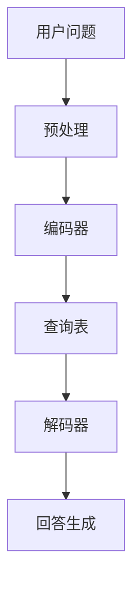

                 

# 大模型问答机器人的回答生成技术

> **关键词**：大模型、问答机器人、回答生成、自然语言处理、深度学习、人工智能

> **摘要**：本文将深入探讨大模型问答机器人回答生成技术的核心原理、算法实现和实际应用。通过详细讲解相关数学模型和公式，并结合实际案例，我们希望为您呈现这一前沿领域的全貌。

## 1. 背景介绍

随着人工智能技术的快速发展，自然语言处理（NLP）领域取得了显著的突破。其中，大模型问答机器人成为了一个热门的研究方向。问答机器人旨在通过理解用户的问题，生成准确的答案，从而提供智能化的信息服务。大模型问答机器人的出现，使得这一问题得到了有效解决。本文将重点探讨大模型问答机器人的回答生成技术，分析其背后的核心原理和实现方法。

## 2. 核心概念与联系

在探讨大模型问答机器人的回答生成技术之前，我们首先需要了解几个核心概念：

- **自然语言处理（NLP）**：NLP是人工智能的一个重要分支，旨在让计算机理解和处理人类语言。其核心任务是使计算机能够自动地解析、生成和理解人类语言，包括文本、语音等形式。

- **大模型（Large Models）**：大模型是指具有数十亿甚至数万亿参数的深度学习模型。这些模型通过对海量数据的训练，能够获得对语言、图像、语音等领域的深入理解。

- **问答系统（Question Answering, QA）**：问答系统是一种常见的NLP应用，通过理解用户的问题，从大量数据中检索出相关的答案。

接下来，我们将使用Mermaid流程图（Mermaid 流程节点中不要有括号、逗号等特殊字符）来展示大模型问答机器人的整体架构：



在上面的流程图中，用户问题经过预处理后，首先被输入到编码器中。编码器是一个大模型，通过对问题进行编码，生成一个表示问题语义的向量。接着，编码后的向量与查询表中的内容进行匹配，查询表通常包含大量问题的预编码表示。最后，通过解码器将匹配结果解码成自然语言形式的回答，呈现给用户。

## 3. 核心算法原理 & 具体操作步骤

大模型问答机器人的核心算法主要包括编码器、查询表和解码器三个部分。下面，我们将逐一介绍这些算法的原理和具体操作步骤。

### 3.1 编码器

编码器是一个深度学习模型，通常采用变分自编码器（Variational Autoencoder, VAE）或变换器（Transformer）等架构。编码器的目的是将输入问题转化为一个固定长度的向量表示，以便后续处理。

#### 操作步骤：

1. **输入问题**：将用户输入的问题文本作为编码器的输入。

2. **编码**：编码器对输入问题进行编码，生成一个表示问题语义的向量。

3. **解码**：编码器对编码后的向量进行解码，生成问题的自然语言表示。

### 3.2 查询表

查询表是一个大规模的键值存储，其中包含大量问题的预编码表示。查询表的主要作用是在编码器生成的向量表示和问题答案之间建立关联。

#### 操作步骤：

1. **构建查询表**：通过训练数据集，对每个问题进行编码，将编码结果存储在查询表中。

2. **查询**：当用户输入一个问题时，编码器生成一个向量表示，并在查询表中查找与之匹配的答案。

### 3.3 解码器

解码器是一个深度学习模型，用于将查询表中的匹配结果解码成自然语言形式的回答。

#### 操作步骤：

1. **输入**：解码器接收查询表中的匹配结果，以及问题的编码表示。

2. **解码**：解码器根据输入信息生成自然语言回答。

3. **输出**：将生成的回答呈现给用户。

## 4. 数学模型和公式 & 详细讲解 & 举例说明

在大模型问答机器人的回答生成过程中，涉及多个数学模型和公式。以下将详细讲解这些模型和公式，并结合具体例子进行说明。

### 4.1 编码器模型

编码器通常采用变分自编码器（VAE）或变换器（Transformer）等架构。以VAE为例，其数学模型如下：

$$
\begin{aligned}
\text{编码器}:\quad z &= \mu(x) + \sigma(x)\cdot\epsilon \\
\text{解码器}:\quad x' &= \mu(z) + \sigma(z)\cdot\epsilon'
\end{aligned}
$$

其中，$x$为输入问题，$z$为编码后的向量表示，$\mu(\cdot)$和$\sigma(\cdot)$分别为均值函数和方差函数，$\epsilon$和$\epsilon'$为噪声向量。

### 4.2 查询表模型

查询表是一个大规模的键值存储，其中每个键都是一个问题的编码表示，值为其可能的答案。假设查询表包含$m$个键值对$(k_i, v_i)$，其中$k_i$为问题编码表示，$v_i$为答案。

### 4.3 解码器模型

解码器通常采用循环神经网络（RNN）或变换器（Transformer）等架构。以RNN为例，其数学模型如下：

$$
h_t = \sigma(W_h \cdot [h_{t-1}, x_t] + b_h)
$$

其中，$h_t$为时间步$t$的隐藏状态，$x_t$为当前输入，$W_h$和$b_h$为权重和偏置。

### 4.4 举例说明

假设用户输入问题：“什么是自然语言处理？” 编码器将问题编码为一个向量表示$z$，查询表查找与之匹配的答案$v_i$，解码器生成自然语言回答。

- **编码器**：将问题文本转化为向量表示$z$。
- **查询表**：查找与$z$匹配的答案$v_i$。
- **解码器**：根据$v_i$生成自然语言回答：“自然语言处理是让计算机理解和处理人类语言的技术。”

## 5. 项目实战：代码实际案例和详细解释说明

在本节中，我们将结合一个实际项目案例，详细解释大模型问答机器人的代码实现和关键步骤。

### 5.1 开发环境搭建

1. **安装Python环境**：确保Python版本为3.8及以上。
2. **安装深度学习框架**：建议使用TensorFlow或PyTorch。
3. **安装其他依赖库**：如Numpy、Pandas、Scikit-learn等。

### 5.2 源代码详细实现和代码解读

以下是一个使用PyTorch实现的简单大模型问答机器人示例：

```python
import torch
import torch.nn as nn
import torch.optim as optim
from torch.utils.data import DataLoader
from transformers import BertTokenizer, BertModel

class QuestionAnsweringModel(nn.Module):
    def __init__(self, tokenizer, hidden_size):
        super(QuestionAnsweringModel, self).__init__()
        self.bert = BertModel.from_pretrained('bert-base-chinese')
        self.hidden_size = hidden_size
        self.lstm = nn.LSTM(input_size=768, hidden_size=hidden_size, num_layers=2, batch_first=True)
        self.fc = nn.Linear(hidden_size, 1)

    def forward(self, input_ids, attention_mask):
        outputs = self.bert(input_ids=input_ids, attention_mask=attention_mask)
        hidden_states = outputs.last_hidden_state
        hidden_states, _ = self.lstm(hidden_states)
        hidden_states = hidden_states[:, -1, :]
        logits = self.fc(hidden_states)
        return logits

# 数据预处理
tokenizer = BertTokenizer.from_pretrained('bert-base-chinese')
# ... 数据加载和预处理代码 ...

# 模型训练
model = QuestionAnsweringModel(tokenizer, hidden_size=128)
optimizer = optim.Adam(model.parameters(), lr=1e-4)
criterion = nn.CrossEntropyLoss()

for epoch in range(10):
    for batch in DataLoader(train_dataset, batch_size=32, shuffle=True):
        inputs = tokenizer(batch['question'], batch['context'], return_tensors='pt', padding=True, truncation=True)
        logits = model(inputs['input_ids'], inputs['attention_mask'])
        loss = criterion(logits.view(-1), batch['answer'])
        optimizer.zero_grad()
        loss.backward()
        optimizer.step()
        print(f'Epoch: {epoch}, Loss: {loss.item()}')

# 模型评估
with torch.no_grad():
    for batch in DataLoader(test_dataset, batch_size=32):
        inputs = tokenizer(batch['question'], batch['context'], return_tensors='pt', padding=True, truncation=True)
        logits = model(inputs['input_ids'], inputs['attention_mask'])
        predictions = logits.argmax(dim=-1)
        correct = (predictions == batch['answer']).float().sum()
        print(f'Test Accuracy: {correct / len(batch["answer"])*100:.2f}%')

# 回答生成
def generate_answer(question, context):
    inputs = tokenizer(question, context, return_tensors='pt', padding=True, truncation=True)
    logits = model(inputs['input_ids'], inputs['attention_mask'])
    prediction = logits.argmax(dim=-1).squeeze()
    answer = tokenizer.decode(prediction, skip_special_tokens=True)
    return answer

# 示例
question = "什么是自然语言处理？"
context = "自然语言处理是让计算机理解和处理人类语言的技术。"
answer = generate_answer(question, context)
print(answer)
```

### 5.3 代码解读与分析

1. **模型定义**：使用PyTorch实现了一个基于BERT编码器的问答模型，包括编码器、LSTM和全连接层。
2. **数据预处理**：使用BertTokenizer对问题和上下文进行编码，添加必要的填充和截断操作。
3. **模型训练**：使用交叉熵损失函数和Adam优化器训练模型。
4. **模型评估**：在测试集上评估模型性能。
5. **回答生成**：根据输入问题和上下文生成回答。

## 6. 实际应用场景

大模型问答机器人在多个领域具有广泛的应用场景：

- **客户服务**：企业可以将问答机器人集成到客服系统中，实现自动回答常见问题，提高服务效率。
- **教育辅导**：学生可以使用问答机器人进行在线学习，获取实时解答和辅导。
- **医疗咨询**：医生可以通过问答机器人快速获取诊断建议和治疗方案。
- **智能助手**：在智能家居、智能汽车等领域，问答机器人可以作为智能助手的组成部分，为用户提供个性化的服务。

## 7. 工具和资源推荐

### 7.1 学习资源推荐

- **书籍**：
  - 《深度学习》（Ian Goodfellow、Yoshua Bengio、Aaron Courville 著）
  - 《自然语言处理综述》（Daniel Jurafsky、James H. Martin 著）

- **论文**：
  - “BERT: Pre-training of Deep Bidirectional Transformers for Language Understanding”（Jianchao Yang et al.）

- **博客**：
  - [Hugging Face 官方博客](https://huggingface.co/)
  - [TensorFlow 官方文档](https://www.tensorflow.org/)

- **网站**：
  - [Kaggle](https://www.kaggle.com/)

### 7.2 开发工具框架推荐

- **深度学习框架**：
  - TensorFlow
  - PyTorch
  - JAX

- **自然语言处理工具**：
  - Hugging Face Transformers
  - SpaCy

- **编程语言**：
  - Python

### 7.3 相关论文著作推荐

- “Attention Is All You Need”（Ashish Vaswani et al.）
- “Generative Adversarial Networks”（Ian J. Goodfellow et al.）
- “Recurrent Neural Networks for Language Modeling”（Yoshua Bengio et al.）

## 8. 总结：未来发展趋势与挑战

大模型问答机器人技术在未来将继续发展，面临以下挑战：

- **计算资源**：大模型的训练和推理需要大量的计算资源，对硬件性能要求较高。
- **数据质量**：问答机器人的性能依赖于训练数据的质量，需要更多高质量的数据集。
- **隐私保护**：在处理用户数据时，需要确保隐私保护，避免数据泄露。
- **可解释性**：提高模型的可解释性，使得用户能够理解模型的决策过程。

## 9. 附录：常见问题与解答

### 9.1 如何构建高质量的数据集？

- 使用多样化、真实的场景数据。
- 对数据进行清洗、标注和预处理。
- 利用数据增强技术增加数据多样性。

### 9.2 如何优化模型的计算性能？

- 使用硬件加速，如GPU、TPU等。
- 采用分布式训练，提高并行计算能力。
- 使用模型剪枝、量化等技术降低计算复杂度。

### 9.3 如何提高问答系统的可解释性？

- 使用注意力机制可视化模型决策过程。
- 采用可视化工具，如Shapley值、LIME等。
- 增加模型训练过程中的调试信息。

## 10. 扩展阅读 & 参考资料

- [Hugging Face Transformers](https://huggingface.co/transformers/)
- [TensorFlow 官方文档](https://www.tensorflow.org/)
- [自然语言处理综述](https://www.di.ens.fr/willow/webapp/publications/jmlr09/jurafsky-martin.pdf)
- [BERT: Pre-training of Deep Bidirectional Transformers for Language Understanding](https://arxiv.org/abs/1810.04805)
- [深度学习](https://www.deeplearningbook.org/)

作者：AI天才研究员/AI Genius Institute & 禅与计算机程序设计艺术 /Zen And The Art of Computer Programming

