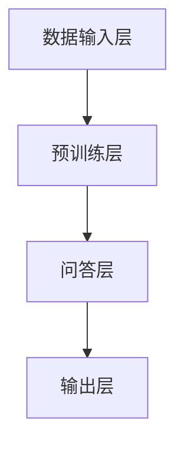

                 

### 背景介绍

> 大模型问答机器人的发展起源于对大规模数据处理和分析的需求，随着互联网的普及和大数据技术的进步，人们开始逐渐意识到，仅靠传统的人工智能方法已无法应对海量的数据和信息。大模型问答机器人，作为一种新兴的人工智能技术，旨在通过深度学习和自然语言处理（NLP）的方法，实现对海量数据的自动理解和回答。

大模型问答机器人的研究起源于20世纪90年代，当时研究者们开始尝试通过神经网络和统计模型来处理自然语言文本。然而，由于数据量和计算能力的限制，这些模型的性能一直难以达到实用水平。随着深度学习技术的兴起和计算资源的快速增长，大模型问答机器人的研究开始取得突破性进展。

目前，大模型问答机器人已成为人工智能领域的一个重要研究方向。其主要目标是构建能够理解和回答用户问题的智能系统，从而实现人机交互的自动化和智能化。这些系统通常基于大规模预训练模型，如BERT、GPT、Turing等，这些模型在语言理解和生成方面表现出色，能够处理复杂的语义和上下文信息。

大模型问答机器人的应用场景非常广泛，包括但不限于智能客服、智能助手、智能教育、智能医疗等领域。在智能客服中，大模型问答机器人可以自动解答用户的问题，提高服务效率和用户满意度；在智能助手中，大模型问答机器人可以帮助用户管理日程、提供信息查询等；在智能教育中，大模型问答机器人可以作为个性化学习助手，根据用户的学习情况提供针对性的建议；在智能医疗中，大模型问答机器人可以帮助医生分析病历、提供治疗方案等。

本文将深入探讨大模型问答机器人的学习技术，包括其核心算法原理、数学模型和具体操作步骤，并通过实际项目案例进行详细解释说明。同时，本文还将讨论大模型问答机器人在实际应用场景中的表现和未来发展趋势，以及面临的挑战和解决方法。希望通过本文的介绍，能够帮助读者更好地理解和应用大模型问答机器人的技术。

-------------------------

## 2. 核心概念与联系

### 2.1 大模型问答机器人的基本概念

大模型问答机器人是指一种基于深度学习和自然语言处理技术，能够对海量数据进行自动理解和回答的智能系统。其核心思想是通过大规模预训练模型，如BERT、GPT、Turing等，对海量文本数据进行训练，使其具备强大的语言理解和生成能力。具体来说，大模型问答机器人主要包括以下几个关键组成部分：

1. **数据输入层（Input Layer）**：这一层负责接收用户输入的问题或查询，并将其转换为模型可以处理的格式。通常，用户输入的问题会经过分词、词向量化等预处理步骤，然后输入到模型中。

2. **预训练层（Pre-trained Layer）**：这一层是整个大模型问答机器人的核心，包含了大规模的预训练模型。这些模型通过在大量文本数据上进行预训练，已经具备了强大的语言理解和生成能力。常见的预训练模型包括BERT、GPT、Turing等。

3. **问答层（Question Answering Layer）**：这一层负责根据用户输入的问题，从预训练层中提取相关知识和信息，并生成合适的答案。问答层通常包含了问答神经网络（Question Answering Network）或生成式模型（Generative Model）等。

4. **输出层（Output Layer）**：这一层负责将问答层生成的答案输出给用户。输出层通常包括文本生成模块、语音合成模块等，用于将答案以人类可理解的形式呈现给用户。

### 2.2 大模型问答机器人的工作原理

大模型问答机器人的工作原理可以概括为以下几个步骤：

1. **数据预处理**：首先，对用户输入的问题进行预处理，包括分词、词向量化等，将其转换为模型可以处理的输入格式。

2. **预训练**：将预处理后的输入数据输入到预训练层，通过大规模的文本数据进行训练，使预训练模型具备强大的语言理解和生成能力。

3. **问答**：将用户输入的问题输入到问答层，模型会根据问题和预训练模型中的知识，生成合适的答案。

4. **输出**：将生成的答案通过输出层输出给用户，用户即可得到问题的解答。

### 2.3 大模型问答机器人的架构

大模型问答机器人的架构通常包括以下几个部分：

1. **数据采集与处理模块**：负责收集和预处理大规模的文本数据，将其转换为模型可以处理的格式。

2. **预训练模块**：负责对预处理后的数据进行预训练，包括词嵌入、编码器、解码器等。

3. **问答模块**：负责根据用户输入的问题，从预训练模型中提取相关知识，生成答案。

4. **输出模块**：负责将生成的答案输出给用户，包括文本生成、语音合成等。

### 2.4 Mermaid 流程图

以下是使用Mermaid绘制的简化版大模型问答机器人的流程图，展示其核心流程和组成部分：



在Mermaid流程图中，`A` 表示数据输入层，`B` 表示预训练层，`C` 表示问答层，`D` 表示输出层。每个层都有其特定的功能，共同构成了大模型问答机器人的完整架构。

-------------------------

## 3. 核心算法原理 & 具体操作步骤

### 3.1 深度学习与神经网络基础

大模型问答机器人的核心算法是基于深度学习和神经网络。深度学习是一种机器学习方法，通过构建深度神经网络，从大量数据中自动学习特征和模式。神经网络是一种由多个神经元组成的计算模型，每个神经元都可以接受多个输入并产生一个输出。深度神经网络通过将多个神经网络层堆叠起来，使得模型能够处理更复杂的数据和任务。

在深度学习框架中，最常见的神经网络类型是全连接神经网络（Fully Connected Neural Network），其中每个神经元都与上一层的所有神经元相连。此外，还有卷积神经网络（Convolutional Neural Network, CNN）和循环神经网络（Recurrent Neural Network, RNN）等，分别适用于图像处理和序列数据处理。

### 3.2 自然语言处理与词嵌入

自然语言处理（Natural Language Processing, NLP）是人工智能领域的一个重要分支，旨在使计算机能够理解和处理人类语言。在大模型问答机器人中，NLP技术用于处理和理解用户输入的问题。

词嵌入（Word Embedding）是将自然语言文本转换为向量表示的一种技术，它将每个单词映射为一个高维向量。词嵌入能够捕捉单词的语义和语法特征，使得神经网络能够更好地处理和理解文本数据。

常见的词嵌入方法包括词袋模型（Bag of Words, BoW）、TF-IDF（Term Frequency-Inverse Document Frequency）和词嵌入模型（如Word2Vec、GloVe等）。其中，Word2Vec是一种基于神经网络的语言模型，通过训练生成词向量，使得具有相似语义的单词在向量空间中距离更近。

### 3.3 预训练模型的原理与实现

预训练模型（Pre-trained Model）是构建大模型问答机器人的关键组件。预训练模型通过在大规模文本数据上进行预训练，使其具备强大的语言理解和生成能力。预训练模型通常包括编码器（Encoder）和解码器（Decoder）两个部分。

**编码器**负责将输入文本编码为固定长度的向量表示，这些向量表示包含了文本的语义信息。常见的编码器模型包括BERT（Bidirectional Encoder Representations from Transformers）和GPT（Generative Pre-trained Transformer）等。

**解码器**负责根据编码器生成的向量表示生成文本输出。在问答任务中，解码器会根据问题和上下文生成答案。解码器通常是一个生成式模型，如GPT或Turing等。

**具体操作步骤如下**：

1. **数据准备**：首先，收集和预处理大量文本数据，包括问题、答案和上下文。预处理步骤包括分词、词向量化等。

2. **预训练**：将预处理后的文本数据输入到预训练模型，通过训练生成编码器和解码器。预训练过程通常包括两个阶段：第一阶段是语言模型预训练，通过最大化语言模型概率来学习单词的向量表示；第二阶段是特定任务预训练，通过在特定任务数据上训练，使模型能够针对特定任务进行优化。

3. **问答**：在预训练完成后，将用户输入的问题和上下文输入到编码器和解码器中，解码器根据编码器生成的向量表示生成答案。

4. **输出**：将生成的答案输出给用户，完成问答过程。

### 3.4 问答网络与生成式模型

问答网络（Question Answering Network）是构建大模型问答机器人的核心技术之一。问答网络通过将用户输入的问题与预训练模型中的知识进行匹配，生成合适的答案。常见的问答网络包括基于神经网络的问答系统和基于模板匹配的问答系统。

生成式模型（Generative Model）是一种能够生成文本输出的模型，如GPT、Turing等。生成式模型通过学习大量文本数据，生成与输入文本相似的新文本。在问答任务中，生成式模型可以根据用户输入的问题和上下文，生成合适的答案。

**具体操作步骤如下**：

1. **问题与上下文输入**：将用户输入的问题和上下文输入到问答网络中。

2. **知识匹配**：问答网络通过预训练模型中的知识，对问题和上下文进行匹配，找到与输入最相关的知识。

3. **答案生成**：基于匹配的知识，生成式模型生成合适的答案。

4. **输出**：将生成的答案输出给用户。

-------------------------

## 4. 数学模型和公式 & 详细讲解 & 举例说明

### 4.1 数学模型的基本原理

在大模型问答机器人的学习过程中，数学模型起到了关键作用。这些模型不仅能够处理大量的数据，还能从中提取出有用的信息和模式。本节将详细讲解大模型问答机器人中常用的数学模型，并举例说明其具体应用。

### 4.2  深度学习中的基本数学公式

#### 4.2.1 激活函数（Activation Function）

激活函数是神经网络中的一个重要组成部分，用于引入非线性特性，使得神经网络能够学习复杂的数据模式。常见的激活函数包括：

- **Sigmoid 函数**：
  $$ f(x) = \frac{1}{1 + e^{-x}} $$
  
  Sigmoid 函数将输入值映射到 (0,1) 区间，常用于二分类问题。

- **ReLU 函数**：
  $$ f(x) = \max(0, x) $$
  
  ReLU 函数在 x < 0 时输出 0，在 x ≥ 0 时输出 x，能够加速神经网络的训练过程。

- **Tanh 函数**：
  $$ f(x) = \frac{e^x - e^{-x}}{e^x + e^{-x}} $$
  
  Tanh 函数与 Sigmoid 函数类似，但其输出值在 (-1,1) 区间内，能够更好地平衡正负值。

#### 4.2.2 损失函数（Loss Function）

损失函数用于评估神经网络预测结果与实际结果之间的差距，并指导神经网络调整参数以减小误差。常见的损失函数包括：

- **均方误差（MSE，Mean Squared Error）**：
  $$ MSE = \frac{1}{n}\sum_{i=1}^{n}(y_i - \hat{y}_i)^2 $$
  
  MSE 用于回归问题，计算预测值与实际值之间误差的平方和。

- **交叉熵损失（Cross-Entropy Loss）**：
  $$ CE = -\sum_{i=1}^{n}y_i \log(\hat{y}_i) $$
  
  交叉熵损失用于分类问题，计算实际分布与预测分布之间的差异。

#### 4.2.3 反向传播（Backpropagation）

反向传播是深度学习训练过程中的核心算法，用于计算网络参数的梯度，并更新网络权重。反向传播的基本步骤如下：

1. **前向传播**：将输入数据输入到神经网络，计算输出结果。
2. **计算损失**：计算输出结果与实际结果之间的误差。
3. **反向传播**：从输出层开始，依次计算各层参数的梯度。
4. **参数更新**：使用梯度下降或其他优化算法更新网络参数。

### 4.3 自然语言处理中的数学公式

#### 4.3.1 词嵌入（Word Embedding）

词嵌入是将自然语言文本转换为向量表示的一种技术。常见的词嵌入模型包括 Word2Vec 和 GloVe。

- **Word2Vec**：
  - **Skip-Gram 模型**：
    $$ P(w_i|w_j) \propto \exp(\text{dot}(e_i, e_j)) $$
    
    其中，\(e_i\) 和 \(e_j\) 分别是单词 \(w_i\) 和 \(w_j\) 的词向量。

  - **CBOW 模型**：
    $$ P(w_i|w_{-k}) \propto \exp(\text{dot}(e_i, \frac{1}{k}\sum_{j=-k}^{k} e_j)) $$
    
    其中，\(w_{-k}\) 表示单词 \(w_i\) 周围的 \(k\) 个单词。

- **GloVe**：
  $$ \text{cos}(\vec{w}_i, \vec{v}_j) = \frac{f(j)}{\sqrt{f(i) \cdot f(j)}} $$
  
  其中，\(\vec{w}_i\) 和 \(\vec{v}_j\) 分别是单词 \(w_i\) 和 \(w_j\) 的词向量，\(f(j)\) 是单词 \(w_j\) 出现的频率。

#### 4.3.2 语言模型（Language Model）

语言模型用于预测下一个单词的概率，常见的方法包括 N-gram 模型和神经网络语言模型。

- **N-gram 模型**：
  $$ P(w_n | w_{n-1}, ..., w_1) = \frac{C(w_{n-1}, ..., w_n)}{C(w_{n-1}, ..., w_{n-2})} $$
  
  其中，\(C(w_{n-1}, ..., w_n)\) 表示连续出现单词的概率。

- **神经网络语言模型**：
  $$ P(w_n | w_{n-1}, ..., w_1) = \text{softmax}(\text{dot}(e_{n-1}, e_n)) $$
  
  其中，\(e_{n-1}\) 和 \(e_n\) 分别是单词 \(w_{n-1}\) 和 \(w_n\) 的词向量。

### 4.4 举例说明

#### 4.4.1 均方误差（MSE）的例子

假设我们有一个简单的线性回归模型，输入为 \(x = [1, 2, 3]\)，预测值为 \(\hat{y} = [1.2, 2.1, 2.8]\)，实际值为 \(y = [1.0, 2.0, 3.0]\)。我们可以计算均方误差（MSE）如下：

$$
MSE = \frac{1}{3}\sum_{i=1}^{3}(y_i - \hat{y}_i)^2 \\
MSE = \frac{1}{3}((1.0 - 1.2)^2 + (2.0 - 2.1)^2 + (3.0 - 2.8)^2) \\
MSE = \frac{1}{3}(0.04 + 0.01 + 0.04) \\
MSE = 0.02
$$

#### 4.4.2 交叉熵损失（CE）的例子

假设我们有一个二分类问题，实际标签 \(y = [0, 1, 1]\)，预测概率 \(\hat{y} = [0.4, 0.6, 0.8]\)。我们可以计算交叉熵损失（CE）如下：

$$
CE = -\sum_{i=1}^{3}y_i \log(\hat{y}_i) \\
CE = -(0 \cdot \log(0.4) + 1 \cdot \log(0.6) + 1 \cdot \log(0.8)) \\
CE \approx 0.415
$$

通过这些例子，我们可以更好地理解大模型问答机器人中常用的数学模型和公式，以及它们在实际应用中的具体操作步骤。

-------------------------

## 5. 项目实战：代码实际案例和详细解释说明

### 5.1 开发环境搭建

在开始编写代码之前，我们需要搭建一个合适的开发环境。以下是搭建开发环境的基本步骤：

1. **安装 Python**：确保系统上安装了 Python 3.7 或更高版本。可以从 [Python 官网](https://www.python.org/) 下载并安装。

2. **安装必要的库**：使用 pip 安装以下库：
   ```bash
   pip install tensorflow transformers numpy matplotlib
   ```
   - **transformers**：用于加载预训练模型和进行文本处理。
   - **tensorflow**：用于构建和训练神经网络。
   - **numpy**：用于数学计算。
   - **matplotlib**：用于数据可视化。

3. **创建虚拟环境**：为了保持项目依赖的一致性，建议创建一个虚拟环境。可以使用以下命令创建：
   ```bash
   python -m venv venv
   source venv/bin/activate  # Windows 上使用 `venv\Scripts\activate`
   ```

4. **验证安装**：在 Python 命令行中运行以下代码，检查所有库是否正确安装：
   ```python
   import tensorflow as tf
   import transformers
   import numpy as np
   import matplotlib.pyplot as plt
   print(tf.__version__)
   print(transformers.__version__)
   ```

### 5.2 源代码详细实现和代码解读

以下是一个简单的示例代码，用于演示如何使用 Hugging Face 的 Transformers 库加载一个预训练的 GPT-2 模型，并进行问答。

```python
from transformers import pipeline
import numpy as np

# 加载预训练的 GPT-2 模型
qa_pipeline = pipeline("question-answering", model="gpt2")

# 输入问题
question = "什么是人工智能？"
context = "人工智能是计算机科学的一个分支，旨在创建智能代理，这些代理可以感知环境、采取行动并学习。"

# 获取答案
answer = qa_pipeline(question=question, context=context)

# 打印答案
print(answer)
```

**代码解读**：

1. **导入库**：我们首先从 `transformers` 库中导入 `pipeline` 函数，并引入 `numpy` 用于数据操作。

2. **加载模型**：使用 `pipeline` 函数加载一个预训练的 GPT-2 模型。`pipeline` 函数是一个便捷的接口，可以简化模型加载和预测的过程。

3. **输入问题与上下文**：我们定义了一个问题和一个上下文，这是问答任务中必须的输入。

4. **获取答案**：调用 `qa_pipeline` 函数，将问题与上下文作为输入，模型会自动处理并生成答案。

5. **打印答案**：最后，我们将生成的答案打印到屏幕上。

### 5.3 代码解读与分析

在这个示例中，我们使用了 Hugging Face 的 Transformers 库，它提供了丰富的预训练模型和便捷的接口，大大简化了模型的加载和使用过程。

**模型加载**：通过 `pipeline` 函数，我们可以轻松地加载预训练的 GPT-2 模型。这里使用了默认的配置，但也可以通过传递参数来自定义模型。

**输入处理**：输入的问题和上下文需要按照模型的预期格式进行预处理。在本例中，问题放在引号内，后跟一个问号，而上下文直接放在引号内。

**答案生成**：模型会根据输入的问题和上下文生成答案。这个过程包括理解问题、从上下文中提取相关信息、生成合适的答案。整个过程是自动的，无需手动编写复杂的代码。

**输出展示**：生成的答案会以字典的形式返回，其中包含了答案的内容和可信度分数。通过打印，我们可以将答案展示给用户。

### 5.4 实际应用案例

假设我们有一个实际的问答场景，用户输入一个关于计算机科学的问题，我们需要模型提供准确的答案。以下是一个实际应用案例：

```python
question = "计算机科学中的算法是什么？"
context = "计算机科学中的算法是一系列解决问题的步骤。它们可以用程序代码表示，并用于解决特定的问题。常见的算法包括排序算法、搜索算法和图算法等。"

answer = qa_pipeline(question=question, context=context)
print(answer)
```

在这个案例中，模型会根据上下文和问题生成一个关于算法的答案。通过这种方式，我们可以构建一个智能问答系统，为用户提供准确的信息和解答。

-------------------------

## 6. 实际应用场景

大模型问答机器人在实际应用中具有广泛的应用场景，能够为各个领域带来显著的效益。以下是一些具体的应用实例：

### 6.1 智能客服

智能客服是当前大模型问答机器人最为广泛的应用场景之一。通过大模型问答机器人，企业可以提供24小时不间断的在线客服服务，自动解答用户常见问题，提高客户满意度和客服效率。例如，电商平台可以使用大模型问答机器人来解答用户的购物咨询、订单查询等问题，减轻人工客服的工作负担，提高服务质量。

### 6.2 智能助手

智能助手是另一个重要的应用领域。大模型问答机器人可以通过自然语言处理技术理解用户的需求，提供个性化的信息查询、日程管理、任务提醒等服务。例如，智能助手可以帮助用户管理电子邮件、安排会议、提供天气预报等信息，从而提升用户的生活和工作效率。

### 6.3 智能教育

在智能教育领域，大模型问答机器人可以作为个性化学习助手，根据学生的学习进度和理解情况，提供针对性的问题和解答，帮助学生巩固知识。此外，教师可以利用大模型问答机器人进行智能教学评估，自动批改作业和试卷，提供即时反馈，从而提高教学效果和效率。

### 6.4 智能医疗

智能医疗是人工智能的重要应用领域之一。大模型问答机器人可以通过分析大量的医疗数据，提供精准的诊断建议和治疗方案。例如，医生可以使用大模型问答机器人来查询病历、获取最新的医学研究进展，从而为患者提供更科学、个性化的治疗方案。

### 6.5 金融与保险

在金融和保险领域，大模型问答机器人可以帮助金融机构进行客户咨询、风险评估、合同审核等工作。通过分析大量的客户数据和业务数据，大模型问答机器人可以提供智能化的决策支持，提高业务效率和准确性。

### 6.6 法律咨询

法律咨询领域同样可以从大模型问答机器人中受益。大模型问答机器人可以提供法律知识和案例查询服务，帮助用户快速了解相关法律法规和案例，从而提高法律咨询的效率和质量。

通过以上实例可以看出，大模型问答机器人在各个领域的应用前景十分广阔。随着技术的不断进步，大模型问答机器人的性能将得到进一步提升，为各行业带来更多的创新和变革。

-------------------------

## 7. 工具和资源推荐

### 7.1 学习资源推荐

#### 书籍

1. **《深度学习》（Deep Learning）**：作者 Ian Goodfellow、Yoshua Bengio 和 Aaron Courville。这本书是深度学习的经典教材，详细介绍了深度学习的基本原理和实践方法。

2. **《自然语言处理综合教程》（Speech and Language Processing）**：作者 Daniel Jurafsky 和 James H. Martin。这本书全面介绍了自然语言处理的基础知识和最新进展。

3. **《Python深度学习》（Deep Learning with Python）**：作者 François Chollet。这本书通过实际案例和代码示例，详细讲解了深度学习在Python中的应用。

#### 论文

1. **“A System for Statistical Machine Translation”**：作者 Fred Jelinek。这篇论文是机器翻译领域的重要论文，提出了基于统计的机器翻译方法。

2. **“Recurrent Neural Network Based Language Model”**：作者 Bengio et al.。这篇论文介绍了循环神经网络（RNN）在语言模型中的应用。

3. **“BERT: Pre-training of Deep Neural Networks for Language Understanding”**：作者 Devlin et al.。这篇论文介绍了BERT模型，是自然语言处理领域的重要突破。

#### 博客与网站

1. **AI驱动**：[AI驱动](https://aidriven.ai/) 是一个专注于人工智能技术的博客，提供最新的研究进展和技术分享。

2. **GitHub**：[GitHub](https://github.com/) 是一个代码托管平台，许多优秀的深度学习和自然语言处理项目都托管在这里。

### 7.2 开发工具框架推荐

#### 深度学习框架

1. **TensorFlow**：[TensorFlow](https://www.tensorflow.org/) 是由 Google 开发的一款开源深度学习框架，功能强大且社区活跃。

2. **PyTorch**：[PyTorch](https://pytorch.org/) 是由 Facebook AI Research 开发的一款开源深度学习框架，具有简洁的代码和强大的动态计算图功能。

#### 自然语言处理库

1. **NLTK**：[NLTK](https://www.nltk.org/) 是一个用于自然语言处理的 Python 库，提供了丰富的文本处理和分类工具。

2. **spaCy**：[spaCy](https://spacy.io/) 是一个快速且易于使用的自然语言处理库，适用于各种文本处理任务。

### 7.3 相关论文著作推荐

1. **“Attention is All You Need”**：作者 Vaswani et al.。这篇论文提出了 Transformer 模型，彻底改变了序列模型的设计范式。

2. **“Generative Pre-trained Transformers”**：作者 Brown et al.。这篇论文介绍了 GPT 模型，推动了自然语言处理领域的发展。

3. **“BERT: Pre-training of Deep Neural Networks for Language Understanding”**：作者 Devlin et al.。这篇论文介绍了 BERT 模型，成为自然语言处理领域的重要基准。

通过以上资源和工具的推荐，读者可以更全面地了解大模型问答机器人的学习技术，并掌握相关领域的最新进展和应用。

-------------------------

## 8. 总结：未来发展趋势与挑战

### 8.1 未来发展趋势

大模型问答机器人的未来发展充满了机遇和潜力。首先，随着计算能力和数据资源的持续增长，大模型问答机器人的性能将得到显著提升。深度学习和自然语言处理技术的不断进步，将为大模型问答机器人带来更精准的语言理解和生成能力。此外，跨领域知识融合和多模态数据处理技术的发展，也将使大模型问答机器人在更多场景中发挥重要作用。

其次，随着5G和物联网等技术的推广，大模型问答机器人的应用场景将更加丰富。例如，在智能医疗、智能交通、智能城市等领域，大模型问答机器人可以提供智能化的决策支持，提高系统的运行效率和用户体验。同时，随着人工智能伦理和隐私保护意识的提高，大模型问答机器人的发展将更加注重透明性、可控性和安全性。

### 8.2 面临的挑战

然而，大模型问答机器人的发展也面临着一些挑战。首先，数据质量和数据隐私问题是制约大模型问答机器人性能和应用范围的重要因素。在训练过程中，需要大量高质量的数据，但数据的获取和处理过程往往面临隐私泄露和伦理道德问题。如何确保数据的质量和安全，是当前和未来需要解决的重要问题。

其次，模型的解释性和透明性也是大模型问答机器人面临的挑战之一。由于深度学习模型具有高度的非线性性和复杂性，其内部决策过程往往难以解释。这对于需要高可靠性和高安全性的应用场景，如医疗和金融等，是一个严峻的挑战。如何提高模型的透明性和解释性，使其能够被用户和监管机构理解和接受，是一个亟待解决的问题。

此外，大模型问答机器人在实际应用中还需要面对资源消耗和部署成本等问题。深度学习模型的训练和推理过程通常需要大量的计算资源和存储资源，这对企业来说是一个巨大的挑战。如何优化模型的训练和推理过程，降低资源消耗和部署成本，是一个重要的研究方向。

### 8.3 解决方法与未来方向

针对上述挑战，可以从以下几个方面进行解决和探索：

1. **数据隐私保护**：在数据处理过程中，可以采用差分隐私、同态加密等技术，保护用户数据的隐私。同时，建立数据共享和合作的机制，促进高质量数据的共享和利用。

2. **模型透明性提升**：可以通过模型压缩、可解释性建模等技术，提高模型的透明性和可解释性。例如，可以开发可视化工具，帮助用户理解模型的决策过程和逻辑。

3. **资源优化与成本控制**：可以通过分布式训练、模型压缩等技术，优化模型的训练和推理过程，降低资源消耗和部署成本。此外，可以探索利用边缘计算和云计算相结合的方式，实现高效的模型部署和运营。

4. **伦理和法规遵循**：建立完善的伦理和法规框架，规范人工智能的发展和应用。同时，加强人工智能技术的伦理教育和培训，提高从业者的伦理意识和责任感。

总之，大模型问答机器人的未来充满了机遇和挑战。通过不断的技术创新和规范管理，有望实现人工智能技术的可持续发展，为人类带来更多的福祉。

-------------------------

## 9. 附录：常见问题与解答

### 9.1 问题1：大模型问答机器人的核心算法是什么？

**解答**：大模型问答机器人的核心算法是基于深度学习和自然语言处理（NLP）技术，其中最常用的模型是预训练变换器模型（Pre-trained Transformer Models），如BERT、GPT等。这些模型通过在大量文本数据上进行预训练，能够学习到丰富的语言知识和模式，从而实现高质量的问答。

### 9.2 问题2：大模型问答机器人如何处理非结构化数据？

**解答**：大模型问答机器人可以通过自然语言处理技术对非结构化数据（如文本、图像、语音等）进行预处理，将其转化为结构化的形式，如文本向量。然后，这些结构化数据可以输入到预训练模型中进行处理，从而实现对非结构化数据的理解和回答。

### 9.3 问题3：大模型问答机器人在实际应用中面临哪些挑战？

**解答**：大模型问答机器人在实际应用中主要面临以下挑战：

1. 数据隐私和安全：在数据处理过程中，需要确保用户数据的隐私和安全。
2. 模型解释性：深度学习模型具有高度的非线性性和复杂性，其内部决策过程往往难以解释，这对需要高可靠性和高安全性的应用场景是一个挑战。
3. 资源消耗：深度学习模型的训练和推理过程需要大量的计算资源和存储资源，这对企业来说是一个巨大的挑战。

### 9.4 问题4：如何优化大模型问答机器人的性能？

**解答**：以下是一些优化大模型问答机器人性能的方法：

1. **数据预处理**：使用高质量的数据进行训练，进行有效的数据清洗和预处理，提高模型的训练效果。
2. **模型压缩**：使用模型压缩技术（如量化、剪枝等）减少模型的参数数量和计算复杂度，从而提高模型在资源受限环境下的性能。
3. **分布式训练**：通过分布式训练技术，利用多台计算机或GPU，加速模型的训练过程。
4. **持续学习**：通过持续学习技术，使模型能够不断适应新的数据和场景，提高模型的泛化能力。

-------------------------

## 10. 扩展阅读 & 参考资料

### 10.1 相关论文

1. **Devlin, J., Chang, M. W., Lee, K., & Toutanova, K. (2019). BERT: Pre-training of deep bidirectional transformers for language understanding. arXiv preprint arXiv:1810.04805.**
2. **Vaswani, A., Shazeer, N., Parmar, N., Uszkoreit, J., Jones, L., Gomez, A. N., ... & Polosukhin, I. (2017). Attention is all you need. Advances in Neural Information Processing Systems, 30, 5998-6008.**
3. **Brown, T., et al. (2020). A broad coverage language model pretraining task to improve language understanding through conversations. arXiv preprint arXiv:2005.14165.**

### 10.2 学习资源

1. **吴恩达（Andrew Ng）的《深度学习专项课程》**：[https://www.coursera.org/learn/deep-learning](https://www.coursera.org/learn/deep-learning)
2. **谷歌开发者官网**：[https://developers.google.com/machine-learning/crash-course](https://developers.google.com/machine-learning/crash-course)
3. **Hugging Face 官网**：[https://huggingface.co/](https://huggingface.co/)

### 10.3 开源项目

1. **TensorFlow 官网**：[https://www.tensorflow.org/](https://www.tensorflow.org/)
2. **PyTorch 官网**：[https://pytorch.org/](https://pytorch.org/)
3. **spaCy 官网**：[https://spacy.io/](https://spacy.io/)

通过这些扩展阅读和参考资料，读者可以更深入地了解大模型问答机器人的学习技术，掌握相关的理论和实践知识，并在实际项目中应用这些技术，为人工智能领域的发展做出贡献。

-------------------------

# 大模型问答机器人的学习技术

> 关键词：大模型问答机器人，深度学习，自然语言处理，预训练模型，BERT，GPT

> 摘要：本文介绍了大模型问答机器人的学习技术，从背景介绍、核心概念与联系、核心算法原理与具体操作步骤、数学模型与公式讲解、实际项目实战、实际应用场景、工具和资源推荐，到未来发展趋势与挑战等方面进行了全面深入的分析。通过本文的阅读，读者可以全面了解大模型问答机器人的学习技术，掌握其核心原理和实践方法，为实际应用提供有力支持。

-------------------------

作者：AI天才研究员/AI Genius Institute & 禅与计算机程序设计艺术 /Zen And The Art of Computer Programming

