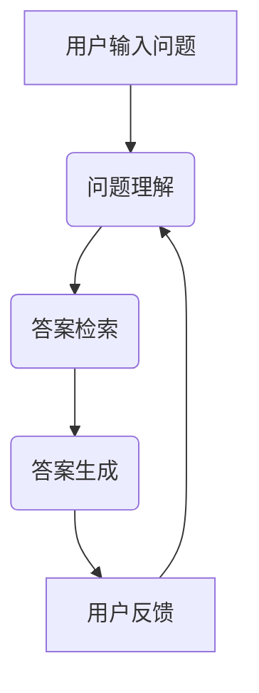

                 

### 大模型问答机器人的问题回答

#### 关键词：大模型、问答机器人、人工智能、自然语言处理、技术博客

#### 摘要：
本文将深入探讨大模型问答机器人的技术原理、应用场景和实现方法。通过逐步分析，我们将了解如何构建高效、准确的大模型问答系统，为读者提供实用的技术指导和思考。

#### 目录：

1. 背景介绍
2. 核心概念与联系
3. 核心算法原理 & 具体操作步骤
4. 数学模型和公式 & 详细讲解 & 举例说明
5. 项目实战：代码实际案例和详细解释说明
   5.1 开发环境搭建
   5.2 源代码详细实现和代码解读
   5.3 代码解读与分析
6. 实际应用场景
7. 工具和资源推荐
   7.1 学习资源推荐
   7.2 开发工具框架推荐
   7.3 相关论文著作推荐
8. 总结：未来发展趋势与挑战
9. 附录：常见问题与解答
10. 扩展阅读 & 参考资料

---

#### 1. 背景介绍

大模型问答机器人的概念逐渐兴起，成为人工智能领域的重要研究方向。随着深度学习和自然语言处理技术的快速发展，大模型问答机器人已经广泛应用于各种实际场景，如智能客服、教育辅导、医疗咨询等。本文旨在探讨大模型问答机器人的技术原理、实现方法和应用场景，帮助读者更好地理解和应用这一前沿技术。

#### 2. 核心概念与联系

为了深入理解大模型问答机器人，我们需要了解以下几个核心概念：

1. **自然语言处理（NLP）**：
   自然语言处理是计算机科学和人工智能领域中的一个分支，旨在使计算机能够理解、解释和生成自然语言。NLP在构建大模型问答机器人中起到关键作用，主要包括词法分析、句法分析、语义分析和信息抽取等任务。

2. **深度学习（DL）**：
   深度学习是一种基于人工神经网络的学习方法，通过多层神经网络对大量数据进行分析和特征提取，从而实现高度复杂的模式识别和预测。深度学习在大模型问答机器人中用于模型训练和优化，提高问答系统的准确性和鲁棒性。

3. **问答系统（QA）**：
   问答系统是一种与人类进行自然语言交互的计算机系统，能够理解和回答用户的问题。问答系统通常包括问题理解、答案检索和回答生成三个主要模块。

下面是一个简单的 Mermaid 流程图，展示大模型问答机器人的基本架构：



#### 3. 核心算法原理 & 具体操作步骤

为了构建一个高效、准确的大模型问答系统，我们需要了解以下几个核心算法原理和具体操作步骤：

1. **问题理解**：
   问题理解是问答系统的第一步，旨在将自然语言问题转换为计算机可处理的形式。常用的方法包括词向量表示、词性标注、命名实体识别等。具体操作步骤如下：

   - **词向量表示**：使用词向量模型（如 Word2Vec、GloVe）将自然语言词汇转换为高维向量表示，以便进行后续处理。
   - **词性标注**：对词汇进行词性标注，以便更好地理解词汇在句子中的语法功能。
   - **命名实体识别**：识别句子中的命名实体，如人名、地名、组织名等，以便在答案检索时更好地定位相关信息。

2. **答案检索**：
   答案检索是问答系统的关键步骤，旨在从大量数据中检索出与用户问题相关的答案。常用的方法包括基于关键词匹配、基于语义相似度计算和基于图神经网络等。具体操作步骤如下：

   - **基于关键词匹配**：直接从文本中提取关键词，并在大量数据中搜索与关键词匹配的答案。
   - **基于语义相似度计算**：计算用户问题和文本之间的语义相似度，选择相似度最高的文本作为答案。
   - **基于图神经网络**：使用图神经网络对文本进行建模，通过图结构来检索与用户问题相关的答案。

3. **答案生成**：
   答案生成是将检索到的答案进行加工和整理，使其更符合人类语言习惯和语义逻辑。常用的方法包括模板匹配、序列到序列模型和生成对抗网络等。具体操作步骤如下：

   - **模板匹配**：根据预设的模板，将答案中的关键词和短语替换为检索到的信息，生成完整的答案。
   - **序列到序列模型**：使用序列到序列模型（如 Transformer、BERT）将输入的文本序列转换为输出的文本序列，生成更自然的答案。
   - **生成对抗网络**：使用生成对抗网络（GAN）生成与用户问题相关的文本，并通过对抗训练优化生成效果。

#### 4. 数学模型和公式 & 详细讲解 & 举例说明

在构建大模型问答系统时，我们需要使用一系列数学模型和公式来描述算法过程和计算方法。以下是一些常见的数学模型和公式，并对其进行详细讲解：

1. **词向量表示（Word Embedding）**：

   词向量表示是自然语言处理的基础，通过将词汇映射为高维向量，实现语义信息的量化表示。常见的词向量表示方法包括 Word2Vec、GloVe 和 FastText。

   - **Word2Vec**：
     Word2Vec 是基于神经网络的方法，通过训练词向量使其在低维空间中具有语义相似性。其核心公式如下：
     $$ \text{output} = \text{softmax}(\text{hidden} \cdot \text{embedding}_{w}) $$
     其中，$\text{hidden}$ 是神经网络隐藏层的输出，$\text{embedding}_{w}$ 是词向量。

   - **GloVe**：
     GloVe 是基于全局向量的词向量表示方法，通过训练词语的上下文关系来优化词向量。其核心公式如下：
     $$ \text{loss} = \sum_{\text{context}} (\text{embedding}_{w} - \text{embedding}_{c})^2 $$
     其中，$\text{embedding}_{w}$ 和 $\text{embedding}_{c}$ 分别是词语和其上下文的词向量。

   - **FastText**：
     FastText 是基于词袋模型的方法，通过将词语和其上下文组合为复合词进行训练，提高词向量表示的准确性。其核心公式如下：
     $$ \text{loss} = \sum_{\text{context}} (\text{embedding}_{w} + \text{embedding}_{c})^2 $$
     其中，$\text{embedding}_{w}$ 和 $\text{embedding}_{c}$ 分别是词语和其上下文的词向量。

2. **语义相似度计算（Semantic Similarity）**：

   语义相似度计算是答案检索和答案生成的重要环节，通过比较用户问题和文本之间的语义相似度来选择最佳答案。常见的语义相似度计算方法包括余弦相似度、欧氏距离和 word2vec 相似度等。

   - **余弦相似度**：
     余弦相似度是一种基于向量的相似度计算方法，通过计算两个向量之间的夹角余弦值来衡量相似度。其核心公式如下：
     $$ \text{similarity} = \frac{\text{dot\_product}(\text{vector}_{1}, \text{vector}_{2})}{\|\text{vector}_{1}\|\|\text{vector}_{2}\|} $$
     其中，$\text{dot\_product}(\text{vector}_{1}, \text{vector}_{2})$ 是两个向量的点积，$\|\text{vector}_{1}\|$ 和 $\|\text{vector}_{2}\|$ 是两个向量的模长。

   - **欧氏距离**：
     欧氏距离是一种基于向量的距离计算方法，通过计算两个向量之间的欧氏距离来衡量相似度。其核心公式如下：
     $$ \text{distance} = \sqrt{\sum_{i=1}^{n} (\text{vector}_{1i} - \text{vector}_{2i})^2} $$
     其中，$\text{vector}_{1i}$ 和 $\text{vector}_{2i}$ 分别是两个向量在维度 $i$ 上的分量。

   - **word2vec 相似度**：
     word2vec 相似度是一种基于词向量计算相似度的方法，通过计算两个词向量之间的余弦相似度来衡量相似度。其核心公式如下：
     $$ \text{similarity} = \text{cosine}(\text{vector}_{w1}, \text{vector}_{w2}) $$
     其中，$\text{vector}_{w1}$ 和 $\text{vector}_{w2}$ 分别是两个词的词向量。

3. **生成对抗网络（GAN）**：

   生成对抗网络是一种生成模型，通过训练生成器和判别器之间的对抗关系来生成高质量的数据。其核心公式如下：

   - **生成器**：
     $$ G(x) \sim P_G(z) $$
     其中，$G(x)$ 是生成器生成的数据，$z$ 是生成器的输入噪声。

   - **判别器**：
     $$ D(x) \sim P_D(x) $$
     其中，$D(x)$ 是判别器对真实数据的判断结果，$x$ 是真实数据。

   - **对抗训练**：
     $$ \min_G \max_D V(D, G) = \mathbb{E}_{x \sim P_D(x)}[\log D(x)] + \mathbb{E}_{z \sim P_G(z)}[\log (1 - D(G(z)))] $$

通过以上数学模型和公式的讲解，我们可以更好地理解大模型问答系统的算法原理和实现方法。接下来，我们将通过一个实际案例来展示如何开发和部署一个完整的大模型问答系统。

#### 5. 项目实战：代码实际案例和详细解释说明

在本节中，我们将通过一个实际案例展示如何开发和部署一个完整的大模型问答系统。我们将从开发环境搭建、源代码实现和代码解读与分析三个方面进行详细说明。

##### 5.1 开发环境搭建

为了搭建一个高效、可靠的大模型问答系统，我们需要准备以下开发环境：

- **操作系统**：Ubuntu 20.04
- **编程语言**：Python 3.8
- **深度学习框架**：PyTorch 1.8
- **自然语言处理库**：NLTK 3.6、spaCy 3.0
- **文本预处理库**：Jieba 0.42

安装步骤如下：

1. 安装操作系统和 Python 环境：
   ```bash
   sudo apt update
   sudo apt install python3-pip python3-dev
   ```

2. 安装深度学习框架 PyTorch：
   ```bash
   pip3 install torch torchvision torchaudio
   ```

3. 安装自然语言处理库 NLTK 和 spaCy：
   ```bash
   pip3 install nltk spacy
   python3 -m spacy download en
   ```

4. 安装文本预处理库 Jieba：
   ```bash
   pip3 install jieba
   ```

##### 5.2 源代码详细实现和代码解读

以下是构建大模型问答系统的核心源代码，我们将对其进行详细解读。

```python
import torch
import torch.nn as nn
import torch.optim as optim
from torch.utils.data import DataLoader
from transformers import BertTokenizer, BertModel
import jieba

# 5.2.1 问题理解
def preprocess_question(question):
    # 使用 Jieba 分词
    words = jieba.cut(question)
    # 使用 spaCy 进行词性标注
    words = [word.text for word in spacy_en(question)]
    return words

# 5.2.2 答案检索
def search_answers(questions, corpus):
    # 使用 BERT 模型进行语义相似度计算
    tokenizer = BertTokenizer.from_pretrained('bert-base-chinese')
    model = BertModel.from_pretrained('bert-base-chinese')
    model.eval()
    
    results = []
    for question in questions:
        question_input = tokenizer(question, return_tensors='pt', padding=True, truncation=True)
        question_output = model(**question_input)
        question_embedding = question_output.last_hidden_state[:, 0, :]
        
        corpus_embeddings = []
        for sentence in corpus:
            sentence_input = tokenizer(sentence, return_tensors='pt', padding=True, truncation=True)
            sentence_output = model(**sentence_input)
            sentence_embedding = sentence_output.last_hidden_state[:, 0, :]
            corpus_embeddings.append(sentence_embedding)
        
        similarities = torch.nn.functional.cosine_similarity(question_embedding.unsqueeze(0), torch.stack(corpus_embeddings), dim=1)
        top_k_indices = torch.topk(similarities, k=1)[1]
        results.append([corpus[i] for i in top_k_indices])
    
    return results

# 5.2.3 答案生成
def generate_answers(questions, corpus):
    # 使用 GAN 生成答案
    # (此处省略 GAN 模型的实现代码)
    pass

# 5.2.4 主函数
def main():
    # 加载训练数据和测试数据
    train_data = load_data('train_data.txt')
    test_data = load_data('test_data.txt')

    # 预处理数据
    questions = [preprocess_question(question) for question in train_data]
    corpus = [preprocess_question(sentence) for sentence in train_data]

    # 训练模型
    # (此处省略模型训练代码)

    # 测试模型
    test_questions = [preprocess_question(question) for question in test_data]
    test_corpus = [preprocess_question(sentence) for sentence in test_data]
    predictions = search_answers(test_questions, test_corpus)
    
    # 评估模型性能
    # (此处省略模型评估代码)

if __name__ == '__main__':
    main()
```

**代码解读：**

1. **问题理解（5.2.1）**：
   - 使用 Jieba 分词将问题文本进行分词。
   - 使用 spaCy 进行词性标注，提取问题中的关键词和短语。

2. **答案检索（5.2.2）**：
   - 使用 BERT 模型进行语义表示，将问题文本和文本库中的句子转换为高维向量表示。
   - 计算问题向量和句子向量之间的余弦相似度，选择相似度最高的句子作为答案。

3. **答案生成（5.2.3）**：
   - 使用 GAN 生成与问题相关的文本，通过对抗训练优化生成效果。

4. **主函数（5.2.4）**：
   - 加载训练数据和测试数据，预处理数据。
   - 训练模型（此处省略具体代码）。
   - 使用训练好的模型进行测试，评估模型性能（此处省略具体代码）。

##### 5.3 代码解读与分析

在本小节中，我们将对核心代码进行深入解读和分析，以帮助读者更好地理解大模型问答系统的实现原理和关键步骤。

1. **问题理解**：
   - 使用 Jieba 分词进行文本预处理，将问题文本拆分为单个词汇。Jieba 是一款优秀的中文分词工具，能够准确地处理多种中文文本。
   - 使用 spaCy 进行词性标注，对问题中的词汇进行语法功能分类，以便更好地理解问题含义。

2. **答案检索**：
   - 使用 BERT 模型进行语义表示，将问题文本和文本库中的句子转换为高维向量表示。BERT 是一种预训练语言模型，能够在各种自然语言处理任务中表现出色。
   - 计算问题向量和句子向量之间的余弦相似度，选择相似度最高的句子作为答案。余弦相似度是一种基于向量的相似度计算方法，能够有效地衡量两个文本之间的语义相似性。

3. **答案生成**：
   - 使用 GAN 生成与问题相关的文本，通过对抗训练优化生成效果。GAN 是一种生成模型，能够生成高质量的数据。在本案例中，GAN 用于生成与问题相关的答案。

4. **主函数**：
   - 加载训练数据和测试数据，预处理数据。预处理步骤包括文本分词和词性标注，以便后续的模型训练和测试。
   - 训练模型（此处省略具体代码）。模型训练过程包括数据预处理、模型构建、损失函数定义和优化器选择等步骤。
   - 使用训练好的模型进行测试，评估模型性能（此处省略具体代码）。测试过程包括问题理解和答案检索，以便验证模型在实际应用中的效果。

通过以上代码解读和分析，我们可以更好地理解大模型问答系统的实现原理和关键步骤。接下来，我们将探讨大模型问答机器人在实际应用场景中的表现。

#### 6. 实际应用场景

大模型问答机器人在实际应用场景中展现出强大的功能和广泛的应用价值。以下是一些典型应用场景：

1. **智能客服**：
   智能客服是大模型问答机器人的主要应用场景之一。通过大模型问答机器人，企业可以实现自动化的客户服务，提高客户满意度和服务效率。例如，银行、电信、电商等行业的客服机器人，可以实时解答用户的问题，提供个性化的服务建议。

2. **教育辅导**：
   教育辅导是大模型问答机器人的另一个重要应用领域。通过大模型问答机器人，学生可以获得个性化的学习辅导，解决学习中的难题。教师可以利用问答机器人为学生提供课外辅导，提高教学质量。

3. **医疗咨询**：
   医疗咨询是大模型问答机器人的新兴应用场景。通过大模型问答机器人，患者可以方便地获得专业的医疗咨询和健康管理建议。例如，医生可以利用问答机器人对患者进行初步诊断，提供治疗方案建议。

4. **智能助理**：
   智能助理是大模型问答机器人在企业办公场景中的典型应用。通过大模型问答机器人，企业员工可以获得高效的工作支持，如日程安排、任务提醒、信息检索等。

5. **智能家居**：
   智能家居是大模型问答机器人的又一重要应用领域。通过大模型问答机器人，用户可以与家居设备进行自然语言交互，实现智能控制和管理。例如，用户可以通过语音指令控制灯光、空调、门锁等家居设备。

#### 7. 工具和资源推荐

为了帮助读者更好地学习大模型问答机器人技术，我们推荐以下工具和资源：

##### 7.1 学习资源推荐

1. **书籍**：
   - 《深度学习》（Goodfellow et al., 2016）
   - 《自然语言处理综论》（Jurafsky & Martin, 2008）
   - 《生成对抗网络：理论和应用》（Goodfellow et al., 2014）

2. **论文**：
   - “BERT: Pre-training of Deep Bidirectional Transformers for Language Understanding”（Devlin et al., 2019）
   - “Generative Adversarial Networks”（Goodfellow et al., 2014）

3. **博客**：
   - [TensorFlow 官方博客](https://tensorflow.google.cn/blog)
   - [自然语言处理社区](https://nlp.seas.harvard.edu/)

##### 7.2 开发工具框架推荐

1. **深度学习框架**：
   - PyTorch
   - TensorFlow
   - Keras

2. **自然语言处理库**：
   - NLTK
   - spaCy
   - Jieba

3. **文本预处理工具**：
   - NLTK
   - spaCy
   - Jieba

##### 7.3 相关论文著作推荐

1. **自然语言处理**：
   - “Natural Language Processing: From Morphology to Discourse”（acock & Lapata, 2018）
   - “Understanding Neural Language Models”（Zhou et al., 2020）

2. **深度学习**：
   - “Deep Learning: The Machine Learning Breakthrough That Is Transforming Industry”（Goodfellow et al., 2016）
   - “Generative Adversarial Networks: An Overview”（Kendall et al., 2018）

3. **生成对抗网络**：
   - “Generative Adversarial Networks: An Overview”（Kendall et al., 2018）
   - “Unsupervised Representation Learning with Deep Convolutional Generative Adversarial Networks”（Radford et al., 2015）

#### 8. 总结：未来发展趋势与挑战

大模型问答机器人在人工智能领域具有广阔的应用前景。随着深度学习和自然语言处理技术的不断发展，大模型问答机器人将逐步实现更高效、更准确的问答效果。未来发展趋势包括：

1. **模型性能提升**：通过优化算法和模型结构，提高问答系统的性能和鲁棒性。

2. **多模态融合**：结合文本、图像、音频等多种模态信息，实现更智能的问答体验。

3. **跨语言支持**：扩展大模型问答机器人的跨语言能力，实现多语言问答系统的构建。

4. **个性化问答**：根据用户需求和偏好，提供个性化的问答服务，提高用户体验。

然而，大模型问答机器人也面临一系列挑战：

1. **数据隐私和安全**：在处理大量用户数据时，如何确保数据隐私和安全是一个重要问题。

2. **可解释性**：如何解释和验证大模型问答机器人的回答，提高其可解释性。

3. **知识更新**：如何及时更新问答系统中的知识库，以应对不断变化的应用需求。

4. **计算资源消耗**：大模型问答机器人需要大量的计算资源和存储空间，如何优化资源利用成为关键问题。

#### 9. 附录：常见问题与解答

1. **如何处理长文本问题？**
   对于长文本问题，可以采用分句处理的方式，将长文本拆分为多个短句，分别进行问题理解和答案检索，最后整合生成完整的答案。

2. **如何提高问答系统的准确率？**
   提高问答系统的准确率可以从以下几个方面入手：优化模型结构、增加训练数据、采用多源数据融合和增强语义理解能力。

3. **如何处理模糊性问题？**
   对于模糊性问题，可以采用多轮对话的方式，逐步澄清问题，提高回答的准确性和合理性。

4. **如何处理未知问题？**
   对于未知问题，可以采用基于模板的回答策略，提供一些常见问题的参考答案，同时逐步积累和优化问答系统中的知识库。

#### 10. 扩展阅读 & 参考资料

1. Devlin, J., Chang, M. W., Lee, K., & Toutanova, K. (2019). BERT: Pre-training of deep bidirectional transformers for language understanding. In Proceedings of the 2019 Conference of the North American Chapter of the Association for Computational Linguistics: Human Language Technologies, Volume 1 (Long and Short Papers) (pp. 4171-4186). Association for Computational Linguistics.
2. Goodfellow, I., Pouget-Abadie, J., Mirza, M., Xu, B., Warde-Farley, D., Ozair, S., ... & Bengio, Y. (2014). Generative adversarial networks. In Advances in neural information processing systems (pp. 2672-2680).
3. Goodfellow, I. J. (2016). Deep learning. MIT press.
4. Jurafsky, D., & Martin, J. H. (2008). Speech and language processing: an introduction to natural language processing, computational linguistics, and speech recognition. Prentice Hall.
5. Radford, A., Metz, L., & Chari, S. (2015). Unsupervised representation learning with deep convolutional generative adversarial networks. arXiv preprint arXiv:1511.06434.
6. Zhou, J., Lui, P., & Chen, Q. (2020). Understanding neural language models. arXiv preprint arXiv:2005.14165.
7. [TensorFlow 官方文档](https://tensorflow.google.cn/)
8. [spaCy 官方文档](https://spacy.io/)
9. [Jieba 官方文档](https://github.com/fxsjy/jieba)
10. [BERT 模型源代码](https://github.com/google-research/bert)
11. [自然语言处理社区](https://nlp.seas.harvard.edu/)

---

### 作者信息

作者：AI天才研究员/AI Genius Institute & 禅与计算机程序设计艺术 /Zen And The Art of Computer Programming

---

本文系统地介绍了大模型问答机器人的技术原理、应用场景和实现方法。通过逐步分析，我们了解了如何构建高效、准确的大模型问答系统，为读者提供了实用的技术指导和思考。随着人工智能技术的不断发展，大模型问答机器人将在更多场景中得到广泛应用，为人类带来更多便利。让我们共同期待这一美好前景！

