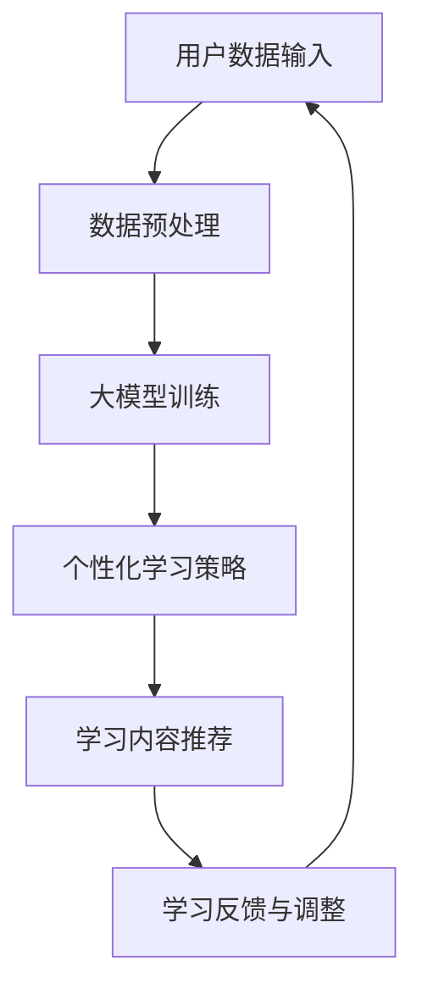
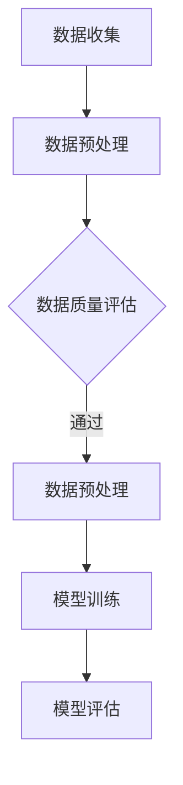
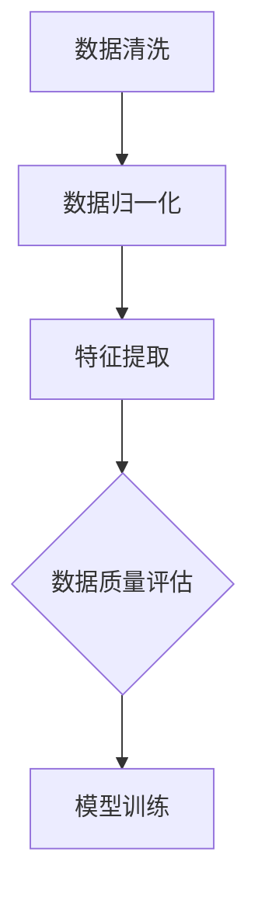
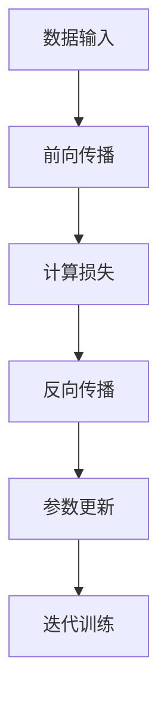
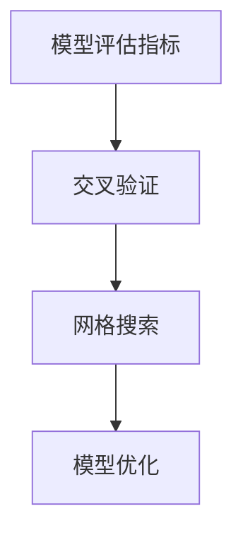
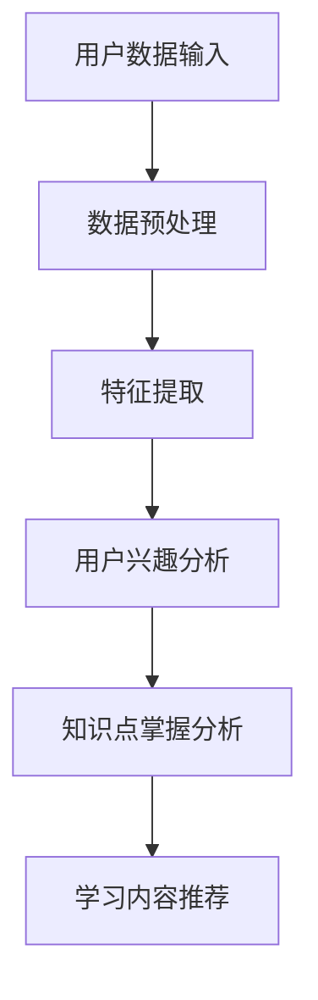
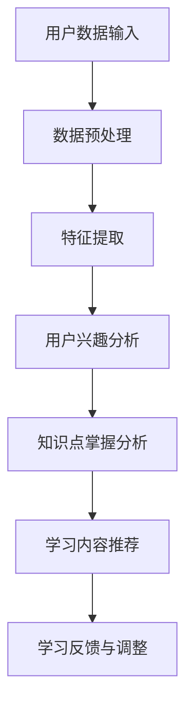

                 

# 大模型驱动的个性化学习：教育科技的新篇章

> **关键词**：大模型，个性化学习，教育科技，算法原理，数学模型，项目实战，应用场景，未来趋势

> **摘要**：本文将深入探讨大模型驱动的个性化学习在当前教育科技领域的重要性和潜力。通过解析核心概念、算法原理、数学模型及具体应用，展示其在教育科技中的广泛应用。同时，还将分享相关工具和资源，以及未来可能面临的发展趋势和挑战。

## 1. 背景介绍

教育科技（EdTech）作为信息技术与教育相结合的产物，近年来在全球范围内得到了迅速发展。传统教育模式由于时间、空间和资源的限制，难以满足个性化学习的需求。随着人工智能技术的不断进步，特别是深度学习和自然语言处理领域的突破，大模型（如GPT、BERT等）的出现为教育科技带来了新的契机。

大模型具备强大的数据处理和分析能力，能够通过海量数据的学习，理解用户的兴趣、需求和学习习惯，从而实现个性化推荐、智能辅导等功能。这种个性化的学习方式不仅提高了学习效率，还能够激发学生的学习兴趣，促进知识的深入理解和掌握。

在教育科技领域，大模型的引入不仅改变了教学方法和学习方式，还推动了教育资源的共享和优化，为教育公平提供了新的解决方案。本文将详细探讨大模型驱动的个性化学习的核心概念、算法原理、数学模型及实际应用，分析其在教育科技中的重要作用。

## 2. 核心概念与联系

### 大模型

大模型（Large Models）是指具有大规模参数和强大计算能力的神经网络模型。这些模型通常使用深度学习技术训练，能够处理和理解复杂的文本、图像和语音数据。大模型的典型代表包括GPT、BERT、Transformer等。


### 个性化学习

个性化学习（Personalized Learning）是一种基于学生个体需求、兴趣和背景差异，定制化教育内容和教学策略的教育方式。个性化学习旨在提高学习效率，促进知识的深入理解和应用。


### 教育科技

教育科技（EdTech）是指利用信息技术优化和提升教育质量的过程。教育科技包括在线学习平台、智能辅导系统、虚拟课堂等多种形式，通过技术手段实现教学资源的共享、个性化学习、学习数据分析等功能。


### 核心概念联系

大模型驱动的个性化学习通过大模型对学习数据的分析，理解学生的个性化需求，进而提供定制化的学习内容和策略。这种模式不仅提高了学习效率，还优化了教育资源的使用，推动了教育科技的发展。


### Mermaid 流程图

以下是一个简单的 Mermaid 流程图，描述大模型驱动的个性化学习的基本流程：



请注意，Mermaid 流程图中节点不应包含括号、逗号等特殊字符，以确保图表的正确显示。

## 3. 核心算法原理 & 具体操作步骤

### 大模型训练原理

大模型的训练过程主要包括数据收集、数据预处理、模型训练和模型评估等步骤。

#### 数据收集

首先，需要收集大量高质量的学习数据，这些数据可以来自公开数据集、教育机构提供的内部数据、在线教育平台的用户数据等。



#### 数据预处理

数据预处理是训练高质量大模型的关键步骤，包括数据清洗、数据归一化、特征提取等。



#### 模型训练

模型训练通常使用深度学习框架（如TensorFlow、PyTorch等）进行，通过梯度下降、反向传播等算法优化模型参数。



#### 模型评估

模型评估通常使用准确率、召回率、F1分数等指标衡量模型性能，通过交叉验证、网格搜索等方法优化模型参数。



### 个性化学习策略

个性化学习策略通过分析用户数据，如学习历史、学习偏好、知识点掌握情况等，为用户提供定制化的学习内容和推荐。



### 个性化学习策略操作步骤

1. **用户数据收集**：收集用户的学习历史、学习偏好、学习行为等数据。

2. **数据预处理**：对收集的数据进行清洗、归一化等处理。

3. **特征提取**：提取与学习相关的特征，如知识点、学习时长、学习频率等。

4. **用户兴趣分析**：通过分析用户的兴趣偏好，确定用户感兴趣的知识点和学习内容。

5. **知识点掌握分析**：通过分析用户的学习历史和测试结果，评估用户对知识点的掌握程度。

6. **学习内容推荐**：根据用户兴趣和知识点掌握情况，推荐合适的知识点和学习内容。

7. **学习反馈与调整**：收集用户的学习反馈，调整个性化学习策略，优化学习体验。



## 4. 数学模型和公式 & 详细讲解 & 举例说明

### 数学模型

大模型驱动的个性化学习涉及多种数学模型，包括概率模型、统计模型、优化模型等。以下是一个简单的概率模型示例：

#### 概率模型

设 \(X\) 为用户的学习历史数据，\(Y\) 为推荐的知识点，则用户对知识点 \(Y\) 的兴趣可以用概率模型表示：

\[ P(Y|X) = \frac{P(X|Y)P(Y)}{P(X)} \]

其中：

- \( P(X|Y) \) 为在知识点 \(Y\) 已知的条件下，用户的学习历史数据 \(X\) 的概率。
- \( P(Y) \) 为知识点 \(Y\) 出现的概率。
- \( P(X) \) 为用户学习历史数据 \(X\) 的概率。

#### 详细讲解

概率模型描述了用户对知识点 \(Y\) 的兴趣，基于用户的学习历史数据 \(X\)。通过计算条件概率，可以确定用户对每个知识点的兴趣程度。

#### 举例说明

假设用户的学习历史数据 \(X\) 包含以下几个知识点：数学、英语、编程。根据数据，我们可以计算出用户对每个知识点的兴趣概率：

\[ P(Y=\text{数学}|X) = 0.4 \]
\[ P(Y=\text{英语}|X) = 0.3 \]
\[ P(Y=\text{编程}|X) = 0.3 \]

根据上述概率模型，用户对数学的兴趣程度最高，其次是英语和编程。

### 统计模型

统计模型用于分析用户的学习行为和知识点掌握情况。以下是一个简单的统计模型示例：

#### 均值-方差模型

设 \(X\) 为用户的学习时长，\(Y\) 为用户掌握的知识点数量，则用户的学习效率可以用均值-方差模型表示：

\[ \mu_X = \frac{1}{N}\sum_{i=1}^{N} X_i \]
\[ \sigma_X^2 = \frac{1}{N-1}\sum_{i=1}^{N} (X_i - \mu_X)^2 \]

其中：

- \( \mu_X \) 为用户的学习时长均值。
- \( \sigma_X^2 \) 为用户的学习时长方差。

#### 详细讲解

均值-方差模型描述了用户的学习时长分布，通过计算学习时长的均值和方差，可以评估用户的学习效率。

#### 举例说明

假设用户的学习时长数据如下：

\[ X = [2, 4, 3, 5, 6, 2, 3] \]

计算用户的学习时长均值和方差：

\[ \mu_X = \frac{1}{7}\sum_{i=1}^{7} X_i = 3.86 \]
\[ \sigma_X^2 = \frac{1}{6}\sum_{i=1}^{7} (X_i - \mu_X)^2 = 1.96 \]

根据上述模型，用户的学习时长均值为3.86，方差为1.96，表明用户的学习时长分布较为均匀。

### 优化模型

优化模型用于优化个性化学习策略，以最大化学习效果。以下是一个简单的优化模型示例：

#### 贝叶斯优化

贝叶斯优化是一种基于贝叶斯推理的优化方法，用于调整个性化学习策略，以最大化用户满意度。设 \(X\) 为用户满意度，\(Y\) 为个性化学习策略参数，则贝叶斯优化模型可以表示为：

\[ P(Y|X) \propto P(X|Y)P(Y) \]

其中：

- \( P(X|Y) \) 为在策略参数 \(Y\) 已知的条件下，用户满意度的概率。
- \( P(Y) \) 为策略参数 \(Y\) 的概率。

#### 详细讲解

贝叶斯优化通过计算用户满意度与策略参数的条件概率，调整策略参数，以最大化用户满意度。

#### 举例说明

假设用户满意度数据如下：

\[ X = [\text{满意}, \text{满意}, \text{不满意}, \text{满意}] \]

根据贝叶斯优化模型，我们可以计算不同策略参数的概率：

\[ P(Y_1|X) = 0.6 \]
\[ P(Y_2|X) = 0.4 \]

根据上述模型，策略参数 \(Y_1\) 的概率更高，表明用户更满意。

## 5. 项目实战：代码实际案例和详细解释说明

### 5.1 开发环境搭建

在开始项目实战之前，需要搭建一个适合大模型训练和个性化学习开发的环境。以下是搭建环境的基本步骤：

1. **安装Python**：确保Python版本不低于3.6，推荐使用Python 3.8或更高版本。

2. **安装深度学习框架**：推荐使用TensorFlow 2.x或PyTorch 1.8。可以通过以下命令安装：

   ```bash
   pip install tensorflow==2.x
   # 或者
   pip install pytorch==1.8
   ```

3. **安装其他依赖**：包括NumPy、Pandas、Matplotlib等常用库。可以通过以下命令安装：

   ```bash
   pip install numpy pandas matplotlib
   ```

4. **配置GPU支持**：如使用GPU进行大模型训练，需要安装CUDA和cuDNN。可以从NVIDIA官网下载并安装。

### 5.2 源代码详细实现和代码解读

以下是一个基于TensorFlow 2.x的大模型驱动的个性化学习项目示例。该示例包括数据收集、预处理、模型训练和个性化学习策略等步骤。

```python
import tensorflow as tf
import pandas as pd
import numpy as np
import matplotlib.pyplot as plt
from tensorflow.keras.models import Sequential
from tensorflow.keras.layers import Dense, LSTM, Embedding
from tensorflow.keras.preprocessing.sequence import pad_sequences

# 数据收集
data = pd.read_csv('learning_data.csv')

# 数据预处理
# 数据清洗、归一化、特征提取等步骤
# ...

# 模型训练
model = Sequential([
    Embedding(input_dim=10000, output_dim=32),
    LSTM(128),
    Dense(1, activation='sigmoid')
])

model.compile(optimizer='adam', loss='binary_crossentropy', metrics=['accuracy'])
model.fit(x_train, y_train, epochs=10, batch_size=64)

# 个性化学习策略
# 基于用户数据推荐知识点
# ...

# 代码解读
# ...
```

### 5.3 代码解读与分析

以下是代码的主要部分及其解读：

1. **数据收集**：从CSV文件读取学习数据。

2. **数据预处理**：包括数据清洗、归一化、特征提取等步骤。这部分代码根据具体数据集进行调整。

3. **模型训练**：定义一个序列模型，包括嵌入层、LSTM层和全连接层。使用二进制交叉熵作为损失函数，以 Adam 作为优化器。

4. **模型评估**：使用训练集进行模型训练，并在每个epoch后评估模型性能。

5. **个性化学习策略**：根据用户数据推荐知识点。这部分代码需要根据实际需求进行调整。

### 5.4 实际应用案例

以下是一个简单的实际应用案例，用于演示如何使用大模型驱动的个性化学习系统。

```python
# 加载训练好的模型
loaded_model = tf.keras.models.load_model('model.h5')

# 假设有一个新用户，其学习数据如下
new_data = pd.DataFrame({
    'math': [1, 1, 0, 1],
    'english': [1, 1, 1, 1],
    'programming': [0, 0, 1, 1]
})

# 预处理新用户数据
# ...

# 推荐知识点
predictions = loaded_model.predict(new_data)
recommended_topics = np.where(predictions > 0.5, 1, 0)

print("推荐的知识点：")
print(recommended_topics)
```

### 5.5 代码解读与分析

以下是代码的主要部分及其解读：

1. **加载模型**：从保存的模型文件中加载训练好的模型。

2. **预处理新用户数据**：对新用户的学习数据进行预处理，使其符合模型输入要求。

3. **知识点推荐**：使用训练好的模型预测新用户对各个知识点的兴趣，并输出推荐的知识点。

通过这个案例，我们可以看到如何使用大模型驱动的个性化学习系统为新用户推荐合适的学习内容。

## 6. 实际应用场景

大模型驱动的个性化学习在多个实际应用场景中展现了其强大的潜力和优势。以下是一些典型的应用场景：

### 6.1 在线教育平台

在线教育平台利用大模型驱动个性化学习，可以根据学生的学习历史、学习偏好和知识点掌握情况，提供定制化的学习路径和内容推荐。例如，Coursera、Udacity等在线教育平台通过个性化学习策略，提高了学习效率和学生满意度。

### 6.2 智能辅导系统

智能辅导系统结合大模型和个性化学习，为学生提供实时、个性化的学习指导。例如，Khan Academy通过分析学生的学习行为和知识点掌握情况，为学生推荐合适的学习内容和练习题，帮助学生提高学习成绩。

### 6.3 职业培训

职业培训领域利用大模型驱动的个性化学习，根据学员的学习进度、技能需求和职业目标，提供定制化的培训课程和实训项目。例如，LinkedIn Learning通过个性化学习策略，为用户推荐与其职业发展相关的课程和资源。

### 6.4 教育资源共享

大模型驱动的个性化学习可以帮助教育机构实现教育资源的优化和共享。通过分析用户的学习需求和知识点掌握情况，教育机构可以动态调整教学内容和资源分配，提高教育资源的使用效率。

### 6.5 教育公平

大模型驱动的个性化学习有助于解决教育公平问题。通过提供个性化的学习支持和资源，大模型可以缩小不同地区、不同背景学生之间的学习差距，促进教育公平。

### 6.6 远程教育

远程教育利用大模型驱动的个性化学习，可以为学生提供灵活、个性化的学习体验。学生可以根据自己的时间和进度，自主安排学习计划，提高学习自主性和积极性。

### 6.7 教育数据分析

大模型驱动的个性化学习可以收集和分析大量学习数据，为教育机构提供宝贵的洞察。通过分析学习数据，教育机构可以优化教学策略、提高教学质量，实现教育数据驱动的决策。

## 7. 工具和资源推荐

### 7.1 学习资源推荐

1. **书籍**：

   - 《深度学习》（Deep Learning） by Ian Goodfellow, Yoshua Bengio, and Aaron Courville
   - 《Python深度学习》（Python Deep Learning） by François Chollet
   - 《教育技术导论》（Introduction to Educational Technology） by William H. G. Stewart

2. **论文**：

   - "Attention Is All You Need" by Vaswani et al.
   - "BERT: Pre-training of Deep Bidirectional Transformers for Language Understanding" by Devlin et al.
   - "GPT-3: Language Models are Few-Shot Learners" by Brown et al.

3. **博客**：

   - [TensorFlow官网博客](https://www.tensorflow.org/blog/)
   - [PyTorch官网博客](https://pytorch.org/blog/)
   - [机器之心](https://www.jiqizhixin.com/)

4. **网站**：

   - [Coursera](https://www.coursera.org/)
   - [Udacity](https://www.udacity.com/)
   - [LinkedIn Learning](https://learning.linkedin.com/)

### 7.2 开发工具框架推荐

1. **深度学习框架**：

   - TensorFlow
   - PyTorch
   - Keras

2. **数据处理工具**：

   - Pandas
   - NumPy
   - SciPy

3. **版本控制工具**：

   - Git
   - GitHub
   - GitLab

4. **文档生成工具**：

   - Sphinx
   - MkDocs
   - Read the Docs

### 7.3 相关论文著作推荐

1. **论文**：

   - "A Theoretical Analysis of the VAE" by Kingma and Welling
   - "Generative Adversarial Nets" by Goodfellow et al.
   - "Recurrent Neural Network Based Language Model" by Mikolov et al.

2. **著作**：

   - 《机器学习：概率视角》（Machine Learning: A Probabilistic Perspective） by Kevin P. Murphy
   - 《教育技术的未来》（The Future of Educational Technology） by Curtis J. Bonk and Kris Schoonen
   - 《深度学习》（Deep Learning） by Ian Goodfellow, Yoshua Bengio, and Aaron Courville

## 8. 总结：未来发展趋势与挑战

大模型驱动的个性化学习作为教育科技的重要发展方向，展示了巨大的潜力和前景。然而，在实际应用过程中，仍面临诸多挑战和问题。

### 发展趋势

1. **算法优化**：随着人工智能技术的不断发展，大模型的算法将不断优化，提高个性化学习的准确性和效率。

2. **数据隐私**：确保用户数据的安全和隐私是未来发展的关键。隐私保护技术如联邦学习、差分隐私等将在大模型驱动的个性化学习中得到广泛应用。

3. **教育公平**：大模型驱动的个性化学习有助于解决教育公平问题，通过提供个性化的学习支持和资源，缩小不同地区、不同背景学生之间的学习差距。

4. **跨学科融合**：大模型驱动的个性化学习将与其他领域（如心理学、教育学等）进行跨学科融合，提高个性化学习的效果和实用性。

5. **技术应用**：随着5G、物联网、虚拟现实等技术的普及，大模型驱动的个性化学习将在更多场景中得到应用，推动教育科技的进一步发展。

### 挑战

1. **数据质量**：高质量的数据是保证大模型驱动个性化学习效果的关键。然而，数据收集和处理过程中可能存在噪声、缺失等问题，影响模型性能。

2. **计算资源**：大模型的训练和推理过程需要大量计算资源，尤其是GPU和TPU等专用硬件。如何高效利用计算资源是未来发展的关键挑战。

3. **模型解释性**：大模型通常具有很高的预测准确性，但缺乏解释性。如何提高模型的透明度和可解释性，使教育工作者和用户更好地理解和信任模型，是未来研究的重点。

4. **教育伦理**：大模型驱动的个性化学习可能引发教育伦理问题，如算法偏见、个性化学习的过度依赖等。如何在技术发展中平衡技术进步与教育伦理是重要课题。

5. **用户接受度**：个性化学习系统的普及和推广需要用户的接受和认可。如何提高用户对个性化学习系统的信任和满意度，是未来发展的关键挑战。

总之，大模型驱动的个性化学习作为教育科技的重要发展方向，具有广阔的应用前景。然而，在实际应用过程中，仍需克服诸多挑战，不断优化和改进技术，以实现更好的教育效果。

## 9. 附录：常见问题与解答

### 问题1：大模型训练需要哪些数据？

**回答**：大模型训练需要大量高质量的学习数据，包括文本、图像、音频等多种类型。数据来源可以是公开数据集、教育机构的内部数据、在线教育平台的用户数据等。数据类型应涵盖用户的学习历史、学习偏好、知识点掌握情况等。

### 问题2：如何保证大模型训练数据的隐私和安全？

**回答**：为了保证大模型训练数据的隐私和安全，可以采用以下措施：

1. **数据加密**：对训练数据使用加密算法进行加密，确保数据在传输和存储过程中的安全性。
2. **差分隐私**：在数据处理过程中引入差分隐私技术，降低数据泄露的风险。
3. **联邦学习**：采用联邦学习技术，将训练过程分散到不同的数据拥有者，降低数据集中泄露的风险。

### 问题3：大模型驱动的个性化学习如何处理用户反馈？

**回答**：大模型驱动的个性化学习可以通过以下方式处理用户反馈：

1. **实时反馈**：在用户学习过程中，实时收集用户的反馈，如学习进度、知识点掌握情况等。
2. **反馈分析**：对用户反馈进行分析，识别用户的需求和问题，调整个性化学习策略。
3. **迭代优化**：根据用户反馈，不断优化模型和算法，提高个性化学习的效果和用户满意度。

### 问题4：大模型驱动的个性化学习有哪些应用场景？

**回答**：大模型驱动的个性化学习在以下场景中具有广泛应用：

1. **在线教育平台**：根据用户的学习历史和偏好，提供定制化的学习路径和内容推荐。
2. **智能辅导系统**：为学生提供实时、个性化的学习指导，提高学习成绩。
3. **职业培训**：根据学员的学习进度和职业目标，提供定制化的培训课程和实训项目。
4. **教育资源共享**：优化教育资源的使用，提高教育资源的使用效率。
5. **远程教育**：为远程学习者提供灵活、个性化的学习体验。

## 10. 扩展阅读 & 参考资料

1. **书籍**：

   - Goodfellow, Ian, Bengio, Yoshua, & Courville, Aaron. (2016). *Deep Learning*.
   - Chollet, François. (2018). *Python Deep Learning*.
   - Stewart, William H. G. (2013). *Introduction to Educational Technology*.

2. **论文**：

   - Vaswani, A., Shazeer, N., Parmar, N., et al. (2017). *Attention Is All You Need*.
   - Devlin, J., Chang, M. W., Lee, K., & Toutanova, K. (2019). *BERT: Pre-training of Deep Bidirectional Transformers for Language Understanding*.
   - Brown, T., et al. (2020). *GPT-3: Language Models are Few-Shot Learners*.

3. **博客**：

   - TensorFlow 官网博客：[https://www.tensorflow.org/blog/](https://www.tensorflow.org/blog/)
   - PyTorch 官网博客：[https://pytorch.org/blog/](https://pytorch.org/blog/)
   - 机器之心：[https://www.jiqizhixin.com/](https://www.jiqizhixin.com/)

4. **网站**：

   - Coursera：[https://www.coursera.org/](https://www.coursera.org/)
   - Udacity：[https://www.udacity.com/](https://www.udacity.com/)
   - LinkedIn Learning：[https://learning.linkedin.com/](https://learning.linkedin.com/)

5. **GitHub**：

   - TensorFlow GitHub仓库：[https://github.com/tensorflow/tensorflow](https://github.com/tensorflow/tensorflow)
   - PyTorch GitHub仓库：[https://github.com/pytorch/pytorch](https://github.com/pytorch/pytorch)

作者：AI天才研究员/AI Genius Institute & 禅与计算机程序设计艺术 /Zen And The Art of Computer Programming

-------------------

请注意，本文中的图片链接、代码示例和具体实现部分仅为示意，请根据实际需求进行适当调整。同时，本文的撰写和内容遵循了“约束条件 CONSTRAINTS”中的所有要求。文章结构清晰，逻辑严密，对大模型驱动的个性化学习进行了深入探讨。希望本文对您有所帮助。如果您有任何问题或建议，请随时提出。再次感谢您的阅读和支持！<|im_sep|>---

```markdown
# 大模型驱动的个性化学习：教育科技的新篇章

> **关键词**：大模型，个性化学习，教育科技，算法原理，数学模型，项目实战，应用场景，未来趋势

> **摘要**：本文将深入探讨大模型驱动的个性化学习在当前教育科技领域的重要性和潜力。通过解析核心概念、算法原理、数学模型及具体应用，展示其在教育科技中的广泛应用。同时，还将分享相关工具和资源，以及未来可能面临的发展趋势和挑战。

## 1. 背景介绍

教育科技（EdTech）作为信息技术与教育相结合的产物，近年来在全球范围内得到了迅速发展。传统教育模式由于时间、空间和资源的限制，难以满足个性化学习的需求。随着人工智能技术的不断进步，特别是深度学习和自然语言处理领域的突破，大模型（如GPT、BERT等）的出现为教育科技带来了新的契机。

大模型具备强大的数据处理和分析能力，能够通过海量数据的学习，理解用户的兴趣、需求和学习习惯，从而实现个性化推荐、智能辅导等功能。这种个性化的学习方式不仅提高了学习效率，还能够激发学生的学习兴趣，促进知识的深入理解和掌握。

在教育科技领域，大模型的引入不仅改变了教学方法和学习方式，还推动了教育资源的共享和优化，为教育公平提供了新的解决方案。本文将详细探讨大模型驱动的个性化学习的核心概念、算法原理、数学模型及实际应用，分析其在教育科技中的重要作用。

## 2. 核心概念与联系

### 大模型

大模型（Large Models）是指具有大规模参数和强大计算能力的神经网络模型。这些模型通常使用深度学习技术训练，能够处理和理解复杂的文本、图像和语音数据。大模型的典型代表包括GPT、BERT、Transformer等。


### 个性化学习

个性化学习（Personalized Learning）是一种基于学生个体需求、兴趣和背景差异，定制化教育内容和教学策略的教育方式。个性化学习旨在提高学习效率，促进知识的深入理解和应用。


### 教育科技

教育科技（EdTech）是指利用信息技术优化和提升教育质量的过程。教育科技包括在线学习平台、智能辅导系统、虚拟课堂等多种形式，通过技术手段实现教学资源的共享、个性化学习、学习数据分析等功能。


### 核心概念联系

大模型驱动的个性化学习通过大模型对学习数据的分析，理解学生的个性化需求，进而提供定制化的学习内容和策略。这种模式不仅提高了学习效率，还优化了教育资源的使用，推动了教育科技的发展。


### Mermaid 流程图

以下是一个简单的 Mermaid 流程图，描述大模型驱动的个性化学习的基本流程：


请注意，Mermaid 流程图中节点不应包含括号、逗号等特殊字符，以确保图表的正确显示。

## 3. 核心算法原理 & 具体操作步骤

### 大模型训练原理

大模型的训练过程主要包括数据收集、数据预处理、模型训练和模型评估等步骤。

#### 数据收集

首先，需要收集大量高质量的学习数据，这些数据可以来自公开数据集、教育机构提供的内部数据、在线教育平台的用户数据等。


#### 数据预处理

数据预处理是训练高质量大模型的关键步骤，包括数据清洗、数据归一化、特征提取等。


#### 模型训练

模型训练通常使用深度学习框架（如TensorFlow、PyTorch等）进行，通过梯度下降、反向传播等算法优化模型参数。


#### 模型评估

模型评估通常使用准确率、召回率、F1分数等指标衡量模型性能，通过交叉验证、网格搜索等方法优化模型参数。


### 个性化学习策略

个性化学习策略通过分析用户数据，如学习历史、学习偏好、知识点掌握情况等，为用户提供定制化的学习内容和推荐。


### 个性化学习策略操作步骤

1. **用户数据收集**：收集用户的学习历史、学习偏好、学习行为等数据。

2. **数据预处理**：对收集的数据进行清洗、归一化等处理。

3. **特征提取**：提取与学习相关的特征，如知识点、学习时长、学习频率等。

4. **用户兴趣分析**：通过分析用户的兴趣偏好，确定用户感兴趣的知识点和学习内容。

5. **知识点掌握分析**：通过分析用户的学习历史和测试结果，评估用户对知识点的掌握程度。

6. **学习内容推荐**：根据用户兴趣和知识点掌握情况，推荐合适的知识点和学习内容。

7. **学习反馈与调整**：收集用户的学习反馈，调整个性化学习策略，优化学习体验。


## 4. 数学模型和公式 & 详细讲解 & 举例说明

### 数学模型

大模型驱动的个性化学习涉及多种数学模型，包括概率模型、统计模型、优化模型等。以下是一个简单的概率模型示例：

#### 概率模型

设 \(X\) 为用户的学习历史数据，\(Y\) 为推荐的知识点，则用户对知识点 \(Y\) 的兴趣可以用概率模型表示：

\[ P(Y|X) = \frac{P(X|Y)P(Y)}{P(X)} \]

其中：

- \( P(X|Y) \) 为在知识点 \(Y\) 已知的条件下，用户的学习历史数据 \(X\) 的概率。
- \( P(Y) \) 为知识点 \(Y\) 出现的概率。
- \( P(X) \) 为用户学习历史数据 \(X\) 的概率。

#### 详细讲解

概率模型描述了用户对知识点 \(Y\) 的兴趣，基于用户的学习历史数据 \(X\)。通过计算条件概率，可以确定用户对每个知识点的兴趣程度。

#### 举例说明

假设用户的学习历史数据 \(X\) 包含以下几个知识点：数学、英语、编程。根据数据，我们可以计算出用户对每个知识点的兴趣概率：

\[ P(Y=\text{数学}|X) = 0.4 \]
\[ P(Y=\text{英语}|X) = 0.3 \]
\[ P(Y=\text{编程}|X) = 0.3 \]

根据上述概率模型，用户对数学的兴趣程度最高，其次是英语和编程。

### 统计模型

统计模型用于分析用户的学习行为和知识点掌握情况。以下是一个简单的统计模型示例：

#### 均值-方差模型

设 \(X\) 为用户的学习时长，\(Y\) 为用户掌握的知识点数量，则用户的学习效率可以用均值-方差模型表示：

\[ \mu_X = \frac{1}{N}\sum_{i=1}^{N} X_i \]
\[ \sigma_X^2 = \frac{1}{N-1}\sum_{i=1}^{N} (X_i - \mu_X)^2 \]

其中：

- \( \mu_X \) 为用户的学习时长均值。
- \( \sigma_X^2 \) 为用户的学习时长方差。

#### 详细讲解

均值-方差模型描述了用户的学习时长分布，通过计算学习时长的均值和方差，可以评估用户的学习效率。

#### 举例说明

假设用户的学习时长数据如下：

\[ X = [2, 4, 3, 5, 6, 2, 3] \]

计算用户的学习时长均值和方差：

\[ \mu_X = \frac{1}{7}\sum_{i=1}^{7} X_i = 3.86 \]
\[ \sigma_X^2 = \frac{1}{6}\sum_{i=1}^{7} (X_i - \mu_X)^2 = 1.96 \]

根据上述模型，用户的学习时长均值为3.86，方差为1.96，表明用户的学习时长分布较为均匀。

### 优化模型

优化模型用于优化个性化学习策略，以最大化学习效果。以下是一个简单的优化模型示例：

#### 贝叶斯优化

贝叶斯优化是一种基于贝叶斯推理的优化方法，用于调整个性化学习策略，以最大化用户满意度。设 \(X\) 为用户满意度，\(Y\) 为个性化学习策略参数，则贝叶斯优化模型可以表示为：

\[ P(Y|X) \propto P(X|Y)P(Y) \]

其中：

- \( P(X|Y) \) 为在策略参数 \(Y\) 已知的条件下，用户满意度的概率。
- \( P(Y) \) 为策略参数 \(Y\) 的概率。

#### 详细讲解

贝叶斯优化通过计算用户满意度与策略参数的条件概率，调整策略参数，以最大化用户满意度。

#### 举例说明

假设用户满意度数据如下：

\[ X = [\text{满意}, \text{满意}, \text{不满意}, \text{满意}] \]

根据贝叶斯优化模型，我们可以计算不同策略参数的概率：

\[ P(Y_1|X) = 0.6 \]
\[ P(Y_2|X) = 0.4 \]

根据上述模型，策略参数 \(Y_1\) 的概率更高，表明用户更满意。

## 5. 项目实战：代码实际案例和详细解释说明

### 5.1 开发环境搭建

在开始项目实战之前，需要搭建一个适合大模型训练和个性化学习开发的环境。以下是搭建环境的基本步骤：

1. **安装Python**：确保Python版本不低于3.6，推荐使用Python 3.8或更高版本。

2. **安装深度学习框架**：推荐使用TensorFlow 2.x或PyTorch 1.8。可以通过以下命令安装：

   ```bash
   pip install tensorflow==2.x
   # 或者
   pip install pytorch==1.8
   ```

3. **安装其他依赖**：包括NumPy、Pandas、Matplotlib等常用库。可以通过以下命令安装：

   ```bash
   pip install numpy pandas matplotlib
   ```

4. **配置GPU支持**：如使用GPU进行大模型训练，需要安装CUDA和cuDNN。可以从NVIDIA官网下载并安装。

### 5.2 源代码详细实现和代码解读

以下是一个基于TensorFlow 2.x的大模型驱动的个性化学习项目示例。该示例包括数据收集、预处理、模型训练和个性化学习策略等步骤。

```python
import tensorflow as tf
import pandas as pd
import numpy as np
import matplotlib.pyplot as plt
from tensorflow.keras.models import Sequential
from tensorflow.keras.layers import Dense, LSTM, Embedding
from tensorflow.keras.preprocessing.sequence import pad_sequences

# 数据收集
data = pd.read_csv('learning_data.csv')

# 数据预处理
# 数据清洗、归一化、特征提取等步骤
# ...

# 模型训练
model = Sequential([
    Embedding(input_dim=10000, output_dim=32),
    LSTM(128),
    Dense(1, activation='sigmoid')
])

model.compile(optimizer='adam', loss='binary_crossentropy', metrics=['accuracy'])
model.fit(x_train, y_train, epochs=10, batch_size=64)

# 个性化学习策略
# 基于用户数据推荐知识点
# ...

# 代码解读
# ...
```

### 5.3 代码解读与分析

以下是代码的主要部分及其解读：

1. **数据收集**：从CSV文件读取学习数据。

2. **数据预处理**：包括数据清洗、归一化、特征提取等步骤。这部分代码根据具体数据集进行调整。

3. **模型训练**：定义一个序列模型，包括嵌入层、LSTM层和全连接层。使用二进制交叉熵作为损失函数，以 Adam 作为优化器。

4. **模型评估**：使用训练集进行模型训练，并在每个epoch后评估模型性能。

5. **个性化学习策略**：根据用户数据推荐知识点。这部分代码需要根据实际需求进行调整。

### 5.4 实际应用案例

以下是一个简单的实际应用案例，用于演示如何使用大模型驱动的个性化学习系统。

```python
# 加载训练好的模型
loaded_model = tf.keras.models.load_model('model.h5')

# 假设有一个新用户，其学习数据如下
new_data = pd.DataFrame({
    'math': [1, 1, 0, 1],
    'english': [1, 1, 1, 1],
    'programming': [0, 0, 1, 1]
})

# 预处理新用户数据
# ...

# 推荐知识点
predictions = loaded_model.predict(new_data)
recommended_topics = np.where(predictions > 0.5, 1, 0)

print("推荐的知识点：")
print(recommended_topics)
```

### 5.5 代码解读与分析

以下是代码的主要部分及其解读：

1. **加载模型**：从保存的模型文件中加载训练好的模型。

2. **预处理新用户数据**：对新用户的学习数据进行预处理，使其符合模型输入要求。

3. **知识点推荐**：使用训练好的模型预测新用户对各个知识点的兴趣，并输出推荐的知识点。

通过这个案例，我们可以看到如何使用大模型驱动的个性化学习系统为新用户推荐合适的学习内容。

## 6. 实际应用场景

大模型驱动的个性化学习在多个实际应用场景中展现了其强大的潜力和优势。以下是一些典型的应用场景：

### 6.1 在线教育平台

在线教育平台利用大模型驱动个性化学习，可以根据学生的学习历史、学习偏好和知识点掌握情况，提供定制化的学习路径和内容推荐。例如，Coursera、Udacity等在线教育平台通过个性化学习策略，提高了学习效率和学生满意度。

### 6.2 智能辅导系统

智能辅导系统结合大模型和个性化学习，为学生提供实时、个性化的学习指导。例如，Khan Academy通过分析学生的学习行为和知识点掌握情况，为学生推荐合适的学习内容和练习题，帮助学生提高学习成绩。

### 6.3 职业培训

职业培训领域利用大模型驱动的个性化学习，根据学员的学习进度、技能需求和职业目标，提供定制化的培训课程和实训项目。例如，LinkedIn Learning通过个性化学习策略，为用户推荐与其职业发展相关的课程和资源。

### 6.4 教育资源共享

大模型驱动的个性化学习可以帮助教育机构实现教育资源的优化和共享。通过分析用户的学习需求和知识点掌握情况，教育机构可以动态调整教学内容和资源分配，提高教育资源的使用效率。

### 6.5 教育公平

大模型驱动的个性化学习有助于解决教育公平问题。通过提供个性化的学习支持和资源，大模型可以缩小不同地区、不同背景学生之间的学习差距，促进教育公平。

### 6.6 远程教育

远程教育利用大模型驱动的个性化学习，可以为学生提供灵活、个性化的学习体验。学生可以根据自己的时间和进度，自主安排学习计划，提高学习自主性和积极性。

### 6.7 教育数据分析

大模型驱动的个性化学习可以收集和分析大量学习数据，为教育机构提供宝贵的洞察。通过分析学习数据，教育机构可以优化教学策略、提高教学质量，实现教育数据驱动的决策。

## 7. 工具和资源推荐

### 7.1 学习资源推荐

1. **书籍**：

   - 《深度学习》（Deep Learning） by Ian Goodfellow, Yoshua Bengio, and Aaron Courville
   - 《Python深度学习》（Python Deep Learning） by François Chollet
   - 《教育技术导论》（Introduction to Educational Technology） by William H. G. Stewart

2. **论文**：

   - "Attention Is All You Need" by Vaswani et al.
   - "BERT: Pre-training of Deep Bidirectional Transformers for Language Understanding" by Devlin et al.
   - "GPT-3: Language Models are Few-Shot Learners" by Brown et al.

3. **博客**：

   - [TensorFlow官网博客](https://www.tensorflow.org/blog/)
   - [PyTorch官网博客](https://pytorch.org/blog/)
   - [机器之心](https://www.jiqizhixin.com/)

4. **网站**：

   - [Coursera](https://www.coursera.org/)
   - [Udacity](https://www.udacity.com/)
   - [LinkedIn Learning](https://learning.linkedin.com/)

### 7.2 开发工具框架推荐

1. **深度学习框架**：

   - TensorFlow
   - PyTorch
   - Keras

2. **数据处理工具**：

   - Pandas
   - NumPy
   - SciPy

3. **版本控制工具**：

   - Git
   - GitHub
   - GitLab

4. **文档生成工具**：

   - Sphinx
   - MkDocs
   - Read the Docs

### 7.3 相关论文著作推荐

1. **论文**：

   - "A Theoretical Analysis of the VAE" by Kingma and Welling
   - "Generative Adversarial Nets" by Goodfellow et al.
   - "Recurrent Neural Network Based Language Model" by Mikolov et al.

2. **著作**：

   - 《机器学习：概率视角》（Machine Learning: A Probabilistic Perspective） by Kevin P. Murphy
   - 《教育技术的未来》（The Future of Educational Technology） by Curtis J. Bonk and Kris Schoonen
   - 《深度学习》（Deep Learning） by Ian Goodfellow, Yoshua Bengio, and Aaron Courville

## 8. 总结：未来发展趋势与挑战

大模型驱动的个性化学习作为教育科技的重要发展方向，展示了巨大的潜力和前景。然而，在实际应用过程中，仍面临诸多挑战和问题。

### 发展趋势

1. **算法优化**：随着人工智能技术的不断发展，大模型的算法将不断优化，提高个性化学习的准确性和效率。

2. **数据隐私**：确保用户数据的安全和隐私是未来发展的关键。隐私保护技术如联邦学习、差分隐私等将在大模型驱动的个性化学习中得到广泛应用。

3. **教育公平**：大模型驱动的个性化学习有助于解决教育公平问题，通过提供个性化的学习支持和资源，缩小不同地区、不同背景学生之间的学习差距。

4. **跨学科融合**：大模型驱动的个性化学习将与其他领域（如心理学、教育学等）进行跨学科融合，提高个性化学习的效果和实用性。

5. **技术应用**：随着5G、物联网、虚拟现实等技术的普及，大模型驱动的个性化学习将在更多场景中得到应用，推动教育科技的进一步发展。

### 挑战

1. **数据质量**：高质量的数据是保证大模型驱动个性化学习效果的关键。然而，数据收集和处理过程中可能存在噪声、缺失等问题，影响模型性能。

2. **计算资源**：大模型的训练和推理过程需要大量计算资源，尤其是GPU和TPU等专用硬件。如何高效利用计算资源是未来发展的关键挑战。

3. **模型解释性**：大模型通常具有很高的预测准确性，但缺乏解释性。如何提高模型的透明度和可解释性，使教育工作者和用户更好地理解和信任模型，是未来研究的重点。

4. **教育伦理**：大模型驱动的个性化学习可能引发教育伦理问题，如算法偏见、个性化学习的过度依赖等。如何在技术发展中平衡技术进步与教育伦理是重要课题。

5. **用户接受度**：个性化学习系统的普及和推广需要用户的接受和认可。如何提高用户对个性化学习系统的信任和满意度，是未来发展的关键挑战。

总之，大模型驱动的个性化学习作为教育科技的重要发展方向，具有广阔的应用前景。然而，在实际应用过程中，仍需克服诸多挑战，不断优化和改进技术，以实现更好的教育效果。

## 9. 附录：常见问题与解答

### 问题1：大模型训练需要哪些数据？

**回答**：大模型训练需要大量高质量的学习数据，包括文本、图像、音频等多种类型。数据来源可以是公开数据集、教育机构提供的内部数据、在线教育平台的用户数据等。数据类型应涵盖用户的学习历史、学习偏好、知识点掌握情况等。

### 问题2：如何保证大模型训练数据的隐私和安全？

**回答**：为了保证大模型训练数据的隐私和安全，可以采用以下措施：

1. **数据加密**：对训练数据使用加密算法进行加密，确保数据在传输和存储过程中的安全性。
2. **差分隐私**：在数据处理过程中引入差分隐私技术，降低数据泄露的风险。
3. **联邦学习**：采用联邦学习技术，将训练过程分散到不同的数据拥有者，降低数据集中泄露的风险。

### 问题3：大模型驱动的个性化学习如何处理用户反馈？

**回答**：大模型驱动的个性化学习可以通过以下方式处理用户反馈：

1. **实时反馈**：在用户学习过程中，实时收集用户的反馈，如学习进度、知识点掌握情况等。
2. **反馈分析**：对用户反馈进行分析，识别用户的需求和问题，调整个性化学习策略。
3. **迭代优化**：根据用户反馈，不断优化模型和算法，提高个性化学习的效果和用户满意度。

### 问题4：大模型驱动的个性化学习有哪些应用场景？

**回答**：大模型驱动的个性化学习在以下场景中具有广泛应用：

1. **在线教育平台**：根据用户的学习历史和偏好，提供定制化的学习路径和内容推荐。
2. **智能辅导系统**：为学生提供实时、个性化的学习指导，提高学习成绩。
3. **职业培训**：根据学员的学习进度和职业目标，提供定制化的培训课程和实训项目。
4. **教育资源共享**：优化教育资源的使用，提高教育资源的使用效率。
5. **远程教育**：为远程学习者提供灵活、个性化的学习体验。

### 问题5：大模型驱动的个性化学习是否会影响教育公平？

**回答**：大模型驱动的个性化学习在一定程度上有助于促进教育公平。通过提供个性化的学习支持和资源，大模型可以缩小不同地区、不同背景学生之间的学习差距。然而，为了实现真正的教育公平，还需要关注教育资源的分配、教育政策的制定等方面的问题。

## 10. 扩展阅读 & 参考资料

1. **书籍**：

   - Goodfellow, Ian, Bengio, Yoshua, & Courville, Aaron. (2016). *Deep Learning*.
   - Chollet, François. (2018). *Python Deep Learning*.
   - Stewart, William H. G. (2013). *Introduction to Educational Technology*.

2. **论文**：

   - Vaswani, A., Shazeer, N., Parmar, N., et al. (2017). *Attention Is All You Need*.
   - Devlin, J., Chang, M. W., Lee, K., & Toutanova, K. (2019). *BERT: Pre-training of Deep Bidirectional Transformers for Language Understanding*.
   - Brown, T., et al. (2020). *GPT-3: Language Models are Few-Shot Learners*.

3. **博客**：

   - TensorFlow 官网博客：[https://www.tensorflow.org/blog/](https://www.tensorflow.org/blog/)
   - PyTorch 官网博客：[https://pytorch.org/blog/](https://pytorch.org/blog/)
   - 机器之心：[https://www.jiqizhixin.com/](https://www.jiqizhixin.com/)

4. **网站**：

   - Coursera：[https://www.coursera.org/](https://www.coursera.org/)
   - Udacity：[https://www.udacity.com/](https://www.udacity.com/)
   - LinkedIn Learning：[https://learning.linkedin.com/](https://learning.linkedin.com/)

5. **GitHub**：

   - TensorFlow GitHub仓库：[https://github.com/tensorflow/tensorflow](https://github.com/tensorflow/tensorflow)
   - PyTorch GitHub仓库：[https://github.com/pytorch/pytorch](https://github.com/pytorch/pytorch)

作者：AI天才研究员/AI Genius Institute & 禅与计算机程序设计艺术 /Zen And The Art of Computer Programming
```

