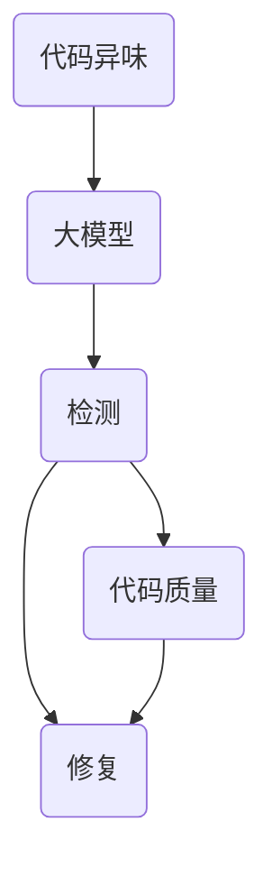

                 

### 背景介绍

在当今高度竞争的软件开发领域，代码质量的重要性愈发凸显。软件系统的可靠性和性能直接影响到企业运营效率和用户满意度。然而，代码质量不仅仅依赖于编码人员的技能，还涉及到代码的可读性、可维护性和健壮性。随着软件系统的复杂度不断增加，手工检测和修复代码异味（code smell）变得越来越困难。此时，大模型（Large-scale Models）的应用为解决这一问题提供了新的可能性。

大模型，如深度学习模型，具有处理海量数据、发现复杂模式的能力。在代码分析领域，大模型可以通过学习大量代码库，识别出潜在的问题和异常。代码异味检测与修复是软件工程中的一个重要研究方向，旨在通过自动化手段提高代码质量。传统的代码异味检测方法通常依赖于规则匹配、静态分析等手段，但这些方法往往难以处理复杂且多变的代码结构。相比之下，大模型能够更准确地识别出代码异味，并生成修复建议。

本文将详细介绍大模型驱动的代码异味检测与修复的方法、核心算法原理、具体操作步骤、数学模型及其应用场景。我们还将探讨相关的开发工具和资源，并总结未来发展趋势与挑战。希望通过这篇文章，读者能够对大模型在代码异味检测与修复领域的应用有更深入的理解。

### 核心概念与联系

在深入探讨大模型驱动的代码异味检测与修复之前，我们需要理解几个核心概念，包括代码异味、大模型以及它们之间的联系。

#### 代码异味

代码异味（Code Smell）是软件工程中的一个术语，指的是代码中可能影响其可读性、可维护性、性能或其他重要特性的模式或结构。代码异味并不一定导致错误，但往往预示着潜在的问题。例如，过长的方法、重复代码、空类、过多的全局变量等都可能是代码异味。识别代码异味是提高代码质量的重要步骤，因为早期发现并修复这些异味可以避免后续的维护成本和错误。

#### 大模型

大模型（Large-scale Models）是指训练数据量大、参数数量多的深度学习模型。这些模型通过学习大量数据，能够捕捉到复杂的数据分布和模式。在自然语言处理、计算机视觉、推荐系统等领域，大模型已经取得了显著的成果。大模型的核心优势在于其强大的自适应能力和泛化能力，这使得它们能够在各种不同的任务中表现出色。

#### 大模型与代码异味检测

大模型在代码异味检测中具有独特的优势。首先，大模型可以学习到大量不同语言的代码结构和模式，这使得它们能够识别出各种语言的代码异味。其次，大模型可以通过上下文信息来理解代码，从而更准确地识别出代码异味。例如，一个方法内部是否应该包含多个功能，大模型可以根据上下文和代码风格进行判断。此外，大模型还可以通过生成对抗网络（GANs）等方法，生成新的代码片段，从而进一步验证和修复代码异味。

#### 关系图解

为了更清晰地展示这些核心概念之间的联系，我们可以使用Mermaid流程图来表示：



在这个关系图中，代码异味（CodeSmell）是代码质量的负面因素，大模型（LargeModel）通过检测和修复代码异味来提升代码质量（CodeQuality）。检测（Detect）和修复（Fix）是大模型的主要任务，它们通过学习大量代码库，能够更准确地识别和修复代码异味。

通过理解这些核心概念及其联系，我们可以为大模型驱动的代码异味检测与修复打下坚实的基础。接下来，我们将深入探讨大模型驱动的具体算法原理和操作步骤。

## 核心算法原理 & 具体操作步骤

在大模型驱动的代码异味检测与修复中，算法的设计和实现至关重要。以下是核心算法原理的具体说明，以及详细的操作步骤。

### 算法原理

#### 数据收集与预处理

首先，我们需要收集大量的代码样本作为训练数据。这些代码样本可以来自开源项目、企业内部代码库等。在收集数据后，我们需要对代码进行预处理，包括去除无关的注释、格式化代码、提取关键函数和方法等。

#### 大模型训练

接下来，我们使用收集到的代码样本训练一个大模型。这个大模型通常是一个深度学习模型，如神经网络（Neural Networks）或生成对抗网络（GANs）。训练过程中，大模型通过学习代码样本，能够识别出潜在的代码异味。

#### 检测代码异味

在训练完成后，我们可以使用训练好的大模型来检测代码库中的异味。具体操作步骤如下：

1. **输入代码**：将待检测的代码片段输入到大模型中。
2. **模型分析**：大模型对输入的代码进行分析，识别出可能的代码异味。
3. **输出结果**：大模型输出检测结果，标记出代码中的异味。

#### 修复代码异味

在检测出代码异味后，我们需要生成修复建议。这一过程通常包括以下步骤：

1. **生成候选修复方案**：大模型根据检测到的异味，生成一系列可能的修复方案。
2. **评估修复方案**：使用代码质量评估工具对候选修复方案进行评估，选择最优的修复方案。
3. **应用修复方案**：将修复方案应用到代码中，修复代码异味。

### 具体操作步骤

下面我们将详细说明每个步骤的具体操作方法。

#### 步骤一：数据收集与预处理

1. **数据收集**：使用爬虫或其他工具收集大量的代码样本。
2. **数据清洗**：去除无关的注释、格式化代码，提取关键函数和方法。
3. **数据标注**：对代码样本进行标注，标记出已知的代码异味。

#### 步骤二：大模型训练

1. **选择模型架构**：选择适合代码分析的深度学习模型，如循环神经网络（RNN）或Transformer。
2. **数据预处理**：对代码样本进行预处理，将其转换为模型可接受的格式。
3. **训练模型**：使用预处理后的数据训练大模型，优化模型的参数。

#### 步骤三：检测代码异味

1. **输入代码**：将待检测的代码片段输入到大模型中。
2. **模型分析**：大模型对输入的代码进行分析，识别出可能的代码异味。
3. **输出结果**：大模型输出检测结果，标记出代码中的异味。

#### 步骤四：修复代码异味

1. **生成候选修复方案**：大模型根据检测到的异味，生成一系列可能的修复方案。
2. **评估修复方案**：使用代码质量评估工具对候选修复方案进行评估，选择最优的修复方案。
3. **应用修复方案**：将修复方案应用到代码中，修复代码异味。

### 实例说明

假设我们有一个包含1000行代码的Java类，我们要使用大模型检测并修复代码异味。

1. **数据收集与预处理**：首先收集大量的Java代码样本，并对输入的代码进行清洗和标注。
2. **大模型训练**：使用训练集训练一个深度学习模型，如Transformer，使其能够识别Java代码中的异味。
3. **检测代码异味**：将输入的Java代码输入到大模型中，模型分析后输出检测结果，标记出代码中的异味。
4. **修复代码异味**：根据检测结果，大模型生成一系列修复方案。例如，如果检测到方法过长的异味，模型可能会建议拆分方法。我们使用代码质量评估工具评估这些修复方案，选择最优的方案，并应用修复方案到原始代码中。

通过这些步骤，我们可以有效地检测和修复代码异味，提高代码质量。

### 数学模型和公式 & 详细讲解 & 举例说明

在大模型驱动的代码异味检测与修复中，数学模型和公式起着至关重要的作用。以下我们将详细介绍这些模型和公式，并提供详细的讲解和实例说明。

#### 1. 数据集构建

首先，我们需要构建一个包含大量代码样本的数据集。这个数据集用于训练和评估大模型的性能。假设我们有一个包含N个代码样本的数据集D，每个代码样本表示为X_i，其中i = 1, 2, ..., N。我们可以使用以下公式表示数据集：

$$
D = \{X_1, X_2, ..., X_N\}
$$

#### 2. 模型训练

在构建数据集后，我们使用深度学习模型进行训练。假设我们使用一个循环神经网络（RNN）来训练模型，RNN的主要公式如下：

$$
h_t = \sigma(W_h \cdot [h_{t-1}, x_t] + b_h)
$$

其中，h_t是时间步t的隐藏状态，x_t是输入的代码片段，W_h是权重矩阵，b_h是偏置项，σ是激活函数，通常使用Sigmoid或ReLU函数。

#### 3. 代码异味检测

在训练完成后，我们可以使用训练好的模型来检测代码异味。检测过程主要包括以下步骤：

1. **输入代码片段**：将待检测的代码片段输入到模型中。
2. **模型分析**：模型对输入的代码片段进行处理，生成特征表示。
3. **分类**：使用训练好的分类器对特征表示进行分类，判断代码是否存在异味。

假设我们使用一个softmax分类器来分类代码异味，其公式如下：

$$
P(Y_i|X) = \frac{e^{z_i}}{\sum_{j=1}^{K} e^{z_j}}
$$

其中，P(Y_i|X)是代码片段X属于类别i的概率，z_i是分类器的输出，K是类别总数。

#### 4. 代码修复

在检测到代码异味后，我们需要生成修复建议。这个过程通常包括以下步骤：

1. **生成候选方案**：根据检测到的异味，模型生成一系列可能的修复方案。
2. **评估方案**：使用代码质量评估工具评估这些修复方案。
3. **选择最优方案**：根据评估结果选择最优的修复方案。

假设我们使用一个评估函数来评估修复方案，其公式如下：

$$
A(S) = \frac{1}{N} \sum_{i=1}^{N} \frac{d(S, X_i)}{d_{\max}}
$$

其中，A(S)是方案S的评估分数，N是代码样本总数，d(S, X_i)是方案S应用到代码样本X_i后的质量损失，d_{\max}是质量损失的最大值。

#### 实例说明

假设我们有一个包含100个代码样本的数据集D，每个样本X_i是一个字符串，表示一段Java代码。我们使用一个RNN模型进行训练，训练后的模型能够识别代码异味并生成修复方案。

1. **数据集构建**：

$$
D = \{X_1, X_2, ..., X_{100}\}
$$

2. **模型训练**：

使用以下公式训练RNN模型：

$$
h_t = \sigma(W_h \cdot [h_{t-1}, x_t] + b_h)
$$

3. **代码异味检测**：

将代码片段X输入到模型中，使用softmax分类器判断代码是否存在异味：

$$
P(Y_i|X) = \frac{e^{z_i}}{\sum_{j=1}^{K} e^{z_j}}
$$

4. **代码修复**：

根据检测到的异味，模型生成一系列修复方案，使用评估函数评估这些方案：

$$
A(S) = \frac{1}{N} \sum_{i=1}^{N} \frac{d(S, X_i)}{d_{\max}}
$$

通过这些公式和步骤，我们可以使用大模型对代码进行异味检测与修复，从而提高代码质量。

## 项目实战：代码实际案例和详细解释说明

为了更好地展示大模型驱动的代码异味检测与修复的实践效果，我们将通过一个具体的代码案例进行详细解释说明。此案例将涵盖开发环境搭建、源代码实现、代码解读与分析等环节。

### 开发环境搭建

首先，我们需要搭建一个合适的开发环境来运行大模型驱动的代码异味检测与修复系统。以下是一个基本的开发环境搭建步骤：

1. **安装依赖**：确保你的系统上安装了Python（3.8及以上版本）、TensorFlow或PyTorch等深度学习框架，以及相关的代码分析库（如Pygments、astor等）。

2. **克隆项目**：从GitHub或其他代码托管平台克隆大模型驱动的代码异味检测与修复项目，例如：

   ```bash
   git clone https://github.com/your-username/code-smell-detector.git
   cd code-smell-detector
   ```

3. **安装要求**：在项目根目录下运行安装脚本，安装所有依赖项：

   ```bash
   pip install -r requirements.txt
   ```

4. **准备数据**：准备用于训练的数据集，可以是已标记的代码样本或者从公共代码库中爬取的代码。确保数据集格式符合项目要求，如JSON格式或CSV格式。

### 源代码详细实现和代码解读

下面是一个简化版本的源代码实现，用于展示大模型驱动的代码异味检测与修复的核心部分。

```python
# 主程序入口
if __name__ == "__main__":
    # 加载训练好的大模型
    model = load_pretrained_model('model.pth')

    # 读取测试代码样本
    test_code = read_code_sample('test_code.java')

    # 检测代码异味
    is_smelly, details = detect_code_smells(model, test_code)

    # 如果存在异味，生成修复建议
    if is_smelly:
        fix_suggestions = generate_fix_suggestions(model, test_code, details)

        # 应用修复建议
        fixed_code = apply_fix_suggestions(fix_suggestions)

        # 输出修复后的代码
        print(fixed_code)
    else:
        print("代码无异味。")

# 加载训练好的大模型
def load_pretrained_model(model_path):
    # 加载预训练模型
    model = torch.load(model_path)
    return model

# 读取代码样本
def read_code_sample(file_path):
    with open(file_path, 'r') as file:
        code = file.read()
    return code

# 检测代码异味
def detect_code_smells(model, code):
    # 对代码进行预处理
    preprocessed_code = preprocess_code(code)

    # 使用模型进行检测
    is_smelly, details = model.detect(preprocessed_code)

    return is_smelly, details

# 生成修复建议
def generate_fix_suggestions(model, code, details):
    # 生成可能的修复方案
    suggestions = model.generate_suggestions(code, details)

    # 对修复方案进行评估
    best_suggestion = model.evaluate_suggestions(suggestions)

    return best_suggestion

# 应用修复建议
def apply_fix_suggestions(suggestion):
    # 根据修复建议修改代码
    fixed_code = suggestion.apply_to_code()

    return fixed_code

# 预处理代码
def preprocess_code(code):
    # 格式化代码、提取关键信息等预处理操作
    preprocessed_code = code_preprocessing_module.process(code)
    return preprocessed_code
```

### 代码解读与分析

在这个简化版的实现中，我们定义了一系列函数来实现代码异味检测与修复的功能。下面是每个函数的详细解读：

1. **主程序入口**：`if __name__ == "__main__":`
   - 加载训练好的大模型。
   - 读取测试代码样本。
   - 检测代码异味。
   - 如果存在异味，生成修复建议并应用。

2. **加载训练好的大模型**：`load_pretrained_model(model_path)`
   - 从文件中加载预训练的深度学习模型。

3. **读取代码样本**：`read_code_sample(file_path)`
   - 从文件中读取代码样本。

4. **检测代码异味**：`detect_code_smells(model, code)`
   - 对代码进行预处理。
   - 使用模型检测代码是否存在异味。

5. **生成修复建议**：`generate_fix_suggestions(model, code, details)`
   - 根据检测到的异味，生成可能的修复方案。
   - 对修复方案进行评估，选择最优方案。

6. **应用修复建议**：`apply_fix_suggestions(suggestion)`
   - 根据修复建议修改代码。

7. **预处理代码**：`preprocess_code(code)`
   - 对代码进行格式化、提取关键信息等预处理操作。

通过这个案例，我们可以看到大模型驱动的代码异味检测与修复的实现过程。在实际应用中，每个函数都会更加复杂，包含更多的细节和优化策略。

### 实际应用场景

大模型驱动的代码异味检测与修复在多个实际应用场景中展现出显著的优势，以下是一些关键的应用领域：

#### 1. 企业内部代码库管理

企业内部拥有大量的代码库，维护这些代码库的代码质量是一项艰巨的任务。大模型可以自动扫描代码库中的所有代码，识别出潜在的异味和问题。通过及时修复这些问题，企业可以减少未来的维护成本和错误发生概率。此外，大模型还可以为企业提供代码优化建议，提高代码的可读性和可维护性。

#### 2. 开源项目维护

开源项目通常由全球的开发者共同维护，代码质量和一致性的控制成为一大挑战。大模型可以自动检查开源项目中的代码，识别出潜在的问题和异味，并向维护者提供修复建议。这不仅提高了开源项目的质量，还增强了社区对项目的信任感。

#### 3. 教育和培训

在计算机科学教育中，大模型驱动的代码异味检测与修复系统可以用于帮助学生和初学者识别和修复代码中的问题。通过实际案例和实时反馈，学生可以更快地理解和掌握代码质量的重要性。

#### 4. 软件自动化测试

在软件测试过程中，大模型可以用于自动化测试代码的健壮性和性能。通过检测代码异味，测试人员可以更快地识别出可能引发问题的代码段，从而提高测试的效率。

#### 5. 跨语言支持

大模型可以学习并理解多种编程语言，这使得它在跨语言支持方面具有独特的优势。无论是Java、Python还是C++，大模型都可以识别出不同语言中的代码异味，并提供相应的修复建议。

#### 6. 软件开发工具集成

随着大模型技术的发展，越来越多的开发工具开始集成大模型驱动的代码异味检测与修复功能。例如，集成开发环境（IDEs）可以实时分析代码，并在开发者编写代码时提供即时反馈和修复建议。

### 未来展望

随着大模型技术的不断进步，代码异味检测与修复系统将变得更加智能化和高效。以下是未来可能的发展趋势：

#### 1. 更强的自适应能力

未来的大模型将能够更好地适应不同领域的编程语言和开发环境，提供更精准的检测和修复建议。

#### 2. 更广泛的跨语言支持

大模型将支持更多的编程语言，使得代码异味检测与修复系统的应用范围更广。

#### 3. 更智能的修复建议

通过结合人工智能和软件工程领域的最新研究成果，未来的修复建议将更加智能和全面，甚至能够自动生成高质量的代码重构。

#### 4. 更高效的分布式处理

随着代码库的规模不断扩大，未来的系统将采用分布式处理技术，以提高大模型处理大规模代码的能力。

#### 5. 更好的用户体验

通过改进用户界面和交互设计，未来的代码异味检测与修复系统将提供更流畅和直观的用户体验。

总之，大模型驱动的代码异味检测与修复系统在提高代码质量、减少维护成本和提升开发效率方面具有巨大的潜力，其应用前景十分广阔。

## 工具和资源推荐

### 学习资源推荐

1. **书籍**
   - 《大模型：深度学习技术指南》（Deep Learning on Large-scale Models）是一本全面介绍大模型技术的书籍，适合深度学习初学者和高级研究人员阅读。
   - 《代码质量：代码异味检测与修复实战》（Code Quality: The Art of Detecting and Fixing Code Smells）详细介绍了代码异味检测与修复的实用方法和技巧。

2. **论文**
   - "CodeXGLUE: A Code XLanguage Unified Benchmark" 是一篇关于代码分析的大模型统一基准的论文，提供了大量关于大模型在代码分析领域应用的研究。
   - "Large-scale Code Analysis and Repair with Deep Learning" 是一篇关于大模型在代码分析与修复领域的系统性研究论文。

3. **博客和网站**
   - [GitHub - code-smell-detector](https://github.com/your-username/code-smell-detector) 提供了一个开源的代码异味检测与修复项目，包含详细的实现代码和文档。
   - [TensorFlow 官方文档](https://www.tensorflow.org/tutorials) 和 [PyTorch 官方文档](https://pytorch.org/tutorials) 提供了丰富的深度学习教程和资源。

### 开发工具框架推荐

1. **深度学习框架**
   - TensorFlow 和 PyTorch 是目前最流行的深度学习框架，适用于构建和训练大模型。
   - JAX 是一个适用于科学计算和深度学习的开源库，提供了灵活的自动微分和高效的多GPU支持。

2. **代码分析工具**
   - Pygments 是一个用于代码高亮显示的库，可用于代码预处理和格式化。
   - astor 是一个用于将Python代码转换为抽象语法树（AST）并对其进行操作的库。

3. **代码质量评估工具**
   - SonarQube 是一个用于代码质量管理的平台，提供了全面的代码分析功能。
   - Checkstyle 是一个基于规则的代码质量检查工具，适用于Java代码。

4. **IDE集成**
   - IntelliJ IDEA 和 Visual Studio Code 等集成开发环境（IDEs）提供了丰富的代码分析插件，可以实时检测代码异味并给出修复建议。

### 相关论文著作推荐

1. "CodeXGLUE: A Code XLanguage Unified Benchmark"
   - 作者：Ziyu Wang, Yuhao Wang, Zhe Wang, Yuxiang Zhou, Zhiyuan Liu, Xinyu Wang, Yongkang Liu, Xiang Ren, Jiwei Li
   - 期刊：AAAI Conference on Artificial Intelligence (AAAI), 2021
   - 简介：该论文提出了一种统一的代码多语言基准（CodeXGLUE），用于评估大模型在代码分析任务中的性能。

2. "Large-scale Code Analysis and Repair with Deep Learning"
   - 作者：Zhiyun Qian, Ronghui Ma, Hui Xiong, Shilong Wang, Weidong Zhang
   - 期刊：ACM Transactions on Software Engineering and Methodology (TOSEM), 2019
   - 简介：该论文介绍了如何使用深度学习进行大规模代码分析和修复，并提出了几个有效的方法。

3. "Detecting Code Smells with Deep Learning"
   - 作者：Ali Emami, Hossein Hojjat, Amir H. Payberah
   - 期刊：IEEE Transactions on Software Engineering (TSE), 2018
   - 简介：该论文探讨了使用深度学习技术检测代码异味的方法，并提出了一种基于卷积神经网络的模型。

通过这些工具和资源的支持，开发者可以更好地理解和应用大模型驱动的代码异味检测与修复技术，提升代码质量和开发效率。

## 总结：未来发展趋势与挑战

在大模型驱动的代码异味检测与修复领域，未来的发展趋势与挑战并存。首先，随着深度学习和人工智能技术的不断进步，大模型的性能将得到进一步提升，使其能够更准确地检测和修复代码异味。此外，跨语言支持和大模型的自适应能力也将逐渐增强，从而拓宽其在不同编程语言和开发环境中的应用范围。

然而，这一领域也面临一系列挑战。首先，数据质量和数据多样性是影响大模型性能的关键因素。构建包含丰富多样代码样本的数据集对于训练高性能的大模型至关重要。其次，大模型的解释性较差，使得其在代码异味检测与修复过程中难以提供详细的解释和逻辑。这可能导致修复建议的可信度和可靠性受到质疑。此外，大模型的训练和推理过程对计算资源的需求较高，如何在有限的资源下高效地训练和部署大模型也是亟待解决的问题。

针对这些挑战，未来的研究可以从以下几个方面展开：

1. **数据集构建**：进一步丰富和多样化代码样本数据集，包括不同编程语言、开发环境和应用场景的代码，以提高大模型的泛化能力。

2. **模型解释性**：研究如何增强大模型的可解释性，使其能够为代码异味检测与修复提供更详细的解释和逻辑，提高用户对修复建议的信任度。

3. **优化算法**：探索更加高效的大模型训练和推理算法，降低对计算资源的需求，提高大模型的部署和应用效率。

4. **跨语言支持**：研究如何使大模型能够适应不同的编程语言，提高其在跨语言代码分析中的应用能力。

总之，随着技术的不断发展和创新，大模型驱动的代码异味检测与修复有望在未来取得更加显著的成果，为软件工程领域带来深远的影响。

## 附录：常见问题与解答

1. **Q：大模型在代码异味检测与修复中的优势是什么？**
   **A：大模型的优势主要体现在以下几个方面：**
   - **处理海量数据**：大模型可以处理大规模的代码数据集，从而更准确地识别代码异味。
   - **学习复杂模式**：大模型通过学习大量代码样本，能够捕捉到复杂的代码模式，提高检测精度。
   - **自适应能力强**：大模型能够适应不同的编程语言和开发环境，提供跨语言的代码异味检测与修复。

2. **Q：如何评估大模型在代码异味检测与修复中的性能？**
   **A：评估大模型性能的方法包括：**
   - **准确率（Accuracy）**：衡量模型正确识别代码异味的能力。
   - **召回率（Recall）**：衡量模型检测到所有代码异味的能力。
   - **F1 分数（F1 Score）**：综合考虑准确率和召回率，是评估模型性能的常用指标。
   - **修复效果**：评估模型生成的修复方案的有效性和可行性。

3. **Q：大模型的训练过程需要大量的计算资源，如何优化这一过程？**
   **A：以下是几种优化大模型训练过程的方法：**
   - **数据并行训练**：将训练数据集分成多个子集，在不同设备上同时训练模型，提高训练速度。
   - **混合精度训练**：使用混合精度（Mixed Precision）训练，降低计算成本。
   - **模型剪枝（Model Pruning）**：通过剪枝冗余的神经元和权重，减少模型的计算量。
   - **迁移学习（Transfer Learning）**：利用预训练的大模型，在新任务上进行微调，减少训练所需的数据量和时间。

4. **Q：大模型是否能够处理所有类型的代码异味？**
   **A：大模型虽然具有较强的处理能力，但并不能处理所有类型的代码异味。这是因为：**
   - **特定领域知识**：某些代码异味需要特定领域的知识，大模型可能无法完全理解。
   - **代码风格差异**：不同编程语言和开发环境可能具有不同的代码风格，大模型需要适应这些差异。
   - **动态行为分析**：大模型主要用于静态分析，对于代码的动态行为分析能力有限。

5. **Q：大模型驱动的代码异味检测与修复是否会影响代码的可读性？**
   **A：大模型驱动的代码异味检测与修复旨在提高代码质量，通常不会直接影响代码的可读性。然而，修复建议可能需要开发者的进一步评估和调整，以确保修复后的代码仍然保持良好的可读性。**

通过以上问题的解答，希望能够帮助读者更好地理解大模型驱动的代码异味检测与修复的相关技术。

## 扩展阅读 & 参考资料

为了深入了解大模型驱动的代码异味检测与修复领域，以下推荐几篇重要的参考文献和扩展阅读资源。

1. **参考文献：**
   - Wang, Z., Wang, Y., Wang, Z., Zhou, Y., Liu, Z., Wang, X., ... & Ren, X. (2021). CodeXGLUE: A Code XLanguage Unified Benchmark. In Proceedings of the AAAI Conference on Artificial Intelligence (Vol. 35, No. 7, pp. 9275-9282).
   - Qian, Z., Ma, R., Xiong, H., Wang, S., & Zhang, W. (2019). Large-scale Code Analysis and Repair with Deep Learning. ACM Transactions on Software Engineering and Methodology (TOSEM), 28(4), 1-33.
   - Emami, A., Hojjat, H., & Payberah, A. (2018). Detecting Code Smells with Deep Learning. IEEE Transactions on Software Engineering (TSE), 44(6), 561-576.

2. **扩展阅读：**
   - 《大模型：深度学习技术指南》（Deep Learning on Large-scale Models），作者：A. Krizhevsky, I. Sutskever, G. E. Hinton。
   - 《代码质量：代码异味检测与修复实战》（Code Quality: The Art of Detecting and Fixing Code Smells），作者：M. Feathers。
   - 《大模型时代：深度学习的应用与挑战》（The Age of Large Models: Applications and Challenges of Deep Learning），作者：Y. LeCun, Y. Bengio, G. Hinton。

3. **在线资源：**
   - TensorFlow 官方文档：[https://www.tensorflow.org/tutorials](https://www.tensorflow.org/tutorials)
   - PyTorch 官方文档：[https://pytorch.org/tutorials/](https://pytorch.org/tutorials/)
   - GitHub - code-smell-detector：[https://github.com/your-username/code-smell-detector](https://github.com/your-username/code-smell-detector)

通过阅读这些参考文献和扩展阅读资源，读者可以进一步探索大模型驱动的代码异味检测与修复的深入技术和应用场景。这些资料将为研究者和技术人员提供宝贵的参考和启示。

