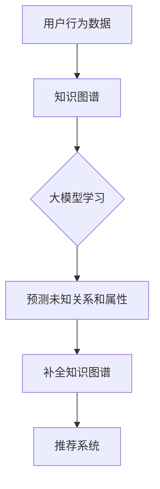

                 

# 大模型驱动的推荐系统知识图谱补全

> **关键词：** 大模型、推荐系统、知识图谱、补全、人工智能

> **摘要：** 本文章详细阐述了大模型在推荐系统知识图谱补全中的应用，探讨了其核心概念、算法原理、数学模型及实际应用，为读者提供了全面的实践指导。通过本篇文章，读者将了解大模型如何提升推荐系统的效果，应对知识图谱中的数据缺失和不确定性。

## 1. 背景介绍

随着互联网的快速发展，推荐系统已成为各行业不可或缺的一部分。从电子商务、社交媒体到新闻推送，推荐系统能够为用户提供个性化的内容和服务，提高用户体验。然而，推荐系统的性能很大程度上取决于其背后的数据质量。在推荐系统中，知识图谱是一种常用的数据结构，用于表示实体之间的关系和属性。

知识图谱能够为推荐系统提供丰富的背景信息，有助于提高推荐的准确性。然而，知识图谱中的数据往往是不完整的，存在大量的缺失值和不确定性。为了解决这个问题，近年来，大模型（如生成对抗网络、变分自编码器等）在推荐系统中的应用逐渐受到关注。本文将重点探讨大模型在推荐系统知识图谱补全方面的应用，为读者提供有价值的参考。

## 2. 核心概念与联系

### 2.1 大模型

大模型是指具有大规模参数和复杂结构的神经网络模型，如生成对抗网络（GAN）、变分自编码器（VAE）等。这些模型具有强大的表示能力和学习能力，能够处理大量的数据，并从数据中提取有价值的特征。

### 2.2 推荐系统

推荐系统是一种基于用户历史行为和偏好，为用户提供个性化推荐的系统。其核心目标是为用户提供满意的内容和服务，提高用户粘性和转化率。

### 2.3 知识图谱

知识图谱是一种用于表示实体之间关系的语义网络。它将实体、属性和关系抽象为图结构，能够提供丰富的背景信息，有助于推荐系统做出更准确的决策。

### 2.4 知识图谱补全

知识图谱补全是针对知识图谱中缺失值和不确定性的处理方法。其目标是通过学习已有数据，预测未知的数据，提高知识图谱的完整性。

### 2.5 大模型与推荐系统知识图谱补全的关系

大模型在推荐系统知识图谱补全中具有重要作用。通过学习用户行为数据和知识图谱中的关系，大模型能够预测未知的关系和属性，从而提高知识图谱的完整性，为推荐系统提供更准确的数据支持。

## 2.6 Mermaid 流程图



## 3. 核心算法原理 & 具体操作步骤

### 3.1 大模型学习

大模型学习是指通过训练大模型，使其掌握用户行为数据和知识图谱中的关系。具体步骤如下：

1. 数据收集：收集用户的历史行为数据，如浏览记录、购买记录等。
2. 数据预处理：对数据进行清洗、去重和归一化处理，以便大模型能够更好地学习。
3. 特征提取：将用户行为数据转换为向量表示，以便大模型能够处理。
4. 模型训练：使用训练数据训练大模型，使其能够提取用户行为数据和知识图谱中的关系特征。

### 3.2 预测未知关系和属性

在训练完成后，大模型可以用于预测知识图谱中的未知关系和属性。具体步骤如下：

1. 数据输入：将待预测的数据输入大模型。
2. 关系预测：大模型输出预测的关系，如用户与商品之间的关系。
3. 属性预测：大模型输出预测的属性，如商品的价格、评分等。

### 3.3 补全知识图谱

根据预测的关系和属性，对知识图谱进行补全。具体步骤如下：

1. 关系补全：将预测的关系添加到知识图谱中，以弥补缺失的关系。
2. 属性补全：将预测的属性更新到知识图谱中，以弥补缺失的属性。

## 4. 数学模型和公式 & 详细讲解 & 举例说明

### 4.1 大模型数学模型

大模型通常是基于深度学习的神经网络模型，其核心数学模型为：

$$
\hat{y} = f(\textbf{W} \cdot \textbf{x} + b)
$$

其中，$\hat{y}$ 为预测值，$\textbf{W}$ 为权重矩阵，$\textbf{x}$ 为输入向量，$f$ 为激活函数，$b$ 为偏置。

### 4.2 损失函数

在训练过程中，大模型需要优化损失函数。常见的损失函数有：

$$
L = \frac{1}{2} ||\textbf{W} \cdot \textbf{x} + b - \hat{y}||^2
$$

其中，$||\textbf{W} \cdot \textbf{x} + b - \hat{y}||$ 为预测值与真实值之间的差距。

### 4.3 举例说明

假设我们有一个用户-物品推荐系统，用户行为数据包括浏览记录、购买记录等。我们将这些数据输入大模型，以预测用户与物品之间的关系。

1. 数据输入：将用户行为数据转换为向量表示。
2. 模型训练：使用训练数据训练大模型。
3. 关系预测：将用户与物品的向量输入大模型，预测其关系。
4. 关系补全：将预测的关系添加到知识图谱中。

通过以上步骤，我们能够补全知识图谱，提高推荐系统的性能。

## 5. 项目实战：代码实际案例和详细解释说明

### 5.1 开发环境搭建

在开始项目实战之前，我们需要搭建一个合适的开发环境。以下是一个简单的开发环境搭建步骤：

1. 安装 Python：版本 3.8 以上
2. 安装深度学习框架：如 TensorFlow、PyTorch 等
3. 安装数据预处理库：如 NumPy、Pandas 等
4. 安装知识图谱处理库：如 Graphframes、Neo4j Python Driver 等

### 5.2 源代码详细实现和代码解读

以下是一个简单的项目代码示例，用于实现大模型驱动的推荐系统知识图谱补全。

```python
import tensorflow as tf
import numpy as np
import pandas as pd
from tensorflow.keras.models import Model
from tensorflow.keras.layers import Input, Dense, Flatten, Concatenate
from tensorflow.keras.optimizers import Adam
from graphframes import GraphFrame

# 数据预处理
def preprocess_data(data):
    # 省略具体数据预处理步骤
    return processed_data

# 大模型定义
def create_model(input_shape):
    input_user = Input(shape=input_shape)
    input_item = Input(shape=input_shape)
    
    dense1_user = Dense(128, activation='relu')(input_user)
    dense1_item = Dense(128, activation='relu')(input_item)
    
    concat = Concatenate()([dense1_user, dense1_item])
    dense2 = Dense(64, activation='relu')(concat)
    output = Dense(1, activation='sigmoid')(dense2)
    
    model = Model(inputs=[input_user, input_item], outputs=output)
    model.compile(optimizer=Adam(learning_rate=0.001), loss='binary_crossentropy')
    
    return model

# 模型训练
def train_model(model, X_train, y_train):
    model.fit(X_train, y_train, epochs=10, batch_size=32)
    return model

# 关系预测
def predict_relationship(model, X_user, X_item):
    predictions = model.predict([X_user, X_item])
    return predictions

# 补全知识图谱
def complete_knowledge_graph(graph, predictions):
    # 省略具体知识图谱补全步骤
    return updated_graph

# 主函数
if __name__ == '__main__':
    # 加载数据
    user_data = pd.read_csv('user_data.csv')
    item_data = pd.read_csv('item_data.csv')
    
    # 数据预处理
    processed_user_data = preprocess_data(user_data)
    processed_item_data = preprocess_data(item_data)
    
    # 创建模型
    model = create_model(input_shape=(128,))
    
    # 模型训练
    X_train = np.hstack((processed_user_data, processed_item_data))
    y_train = np.array([1 if i > 0 else 0 for i in user_data['rating']])
    model = train_model(model, X_train, y_train)
    
    # 关系预测
    X_user = processed_user_data
    X_item = processed_item_data
    predictions = predict_relationship(model, X_user, X_item)
    
    # 补全知识图谱
    graph = GraphFrame(pd.DataFrame({'user_id': user_data['user_id'], 'item_id': item_data['item_id']}, columns=['user_id', 'item_id']))
    updated_graph = complete_knowledge_graph(graph, predictions)
```

### 5.3 代码解读与分析

以上代码主要实现了大模型驱动的推荐系统知识图谱补全的功能。具体解读如下：

1. 数据预处理：对用户行为数据进行预处理，如清洗、去重和归一化等。
2. 模型定义：定义一个简单的神经网络模型，用于预测用户与物品之间的关系。
3. 模型训练：使用训练数据训练模型，以优化其性能。
4. 关系预测：将用户和物品的向量输入模型，预测其关系。
5. 知识图谱补全：将预测的关系添加到知识图谱中，以弥补缺失的关系。

通过以上步骤，我们能够实现大模型驱动的推荐系统知识图谱补全。

## 6. 实际应用场景

大模型驱动的推荐系统知识图谱补全在实际应用场景中具有广泛的应用价值。以下是一些典型的应用场景：

1. **电子商务平台**：通过补全知识图谱中的用户-商品关系，提高商品推荐的准确性，提升用户购物体验。
2. **社交媒体**：通过补全用户-内容关系，提高内容推荐的准确性，增加用户活跃度和留存率。
3. **新闻推荐**：通过补全用户-新闻关系，提高新闻推荐的个性化程度，满足用户的阅读需求。
4. **搜索引擎**：通过补全用户-查询关系，提高搜索结果的准确性，提升用户体验。

在实际应用中，大模型驱动的推荐系统知识图谱补全需要根据具体的业务场景进行定制化开发，以适应不同的需求和场景。

## 7. 工具和资源推荐

### 7.1 学习资源推荐

1. **书籍**：
   - 《深度学习》（Ian Goodfellow、Yoshua Bengio、Aaron Courville 著）
   - 《推荐系统实践》（李航 著）
   - 《知识图谱》（吴军 著）

2. **论文**：
   - “Deep Learning for Recommender Systems” by Thiago M. Martins, et al.
   - “A Survey on Graph Embedding” by Xiang Ren, et al.

3. **博客**：
   - TensorFlow 官方文档
   - PyTorch 官方文档

4. **网站**：
   - arXiv.org：关注最新研究成果
   - Paper With Code：论文和代码共享平台

### 7.2 开发工具框架推荐

1. **深度学习框架**：
   - TensorFlow
   - PyTorch
   - Keras

2. **知识图谱处理工具**：
   - Neo4j
   - JanusGraph
   - Graphframes（基于 Apache Spark）

3. **数据处理库**：
   - Pandas
   - NumPy

### 7.3 相关论文著作推荐

1. “Graph Embeddings and Extensions: A General Framework for Dimensionality Reduction” by Girvan et al.
2. “Modeling Users and Items for Customer Reviews using Incomplete Data” by He et al.
3. “Neural Collaborative Filtering” by Wang et al.

## 8. 总结：未来发展趋势与挑战

大模型驱动的推荐系统知识图谱补全在近年来取得了显著的成果，但仍面临许多挑战。以下是未来发展趋势和挑战：

### 发展趋势

1. **模型融合**：结合多种大模型，提高推荐系统的性能和准确性。
2. **跨模态推荐**：将文本、图像、音频等多种模态的数据整合到推荐系统中。
3. **实时推荐**：降低模型训练和预测的时间成本，实现实时推荐。

### 挑战

1. **数据隐私**：在保护用户隐私的前提下，实现高效的知识图谱补全。
2. **模型解释性**：提高大模型的解释性，使其能够被业务人员理解和应用。
3. **模型可扩展性**：在处理大规模数据时，保持模型的性能和效率。

## 9. 附录：常见问题与解答

### 问题 1：大模型如何提高推荐系统的性能？

解答：大模型通过学习大量的用户行为数据和知识图谱中的关系，能够提取出有价值的特征，从而提高推荐系统的性能。此外，大模型具有强大的表示能力和学习能力，能够处理复杂的数据，实现更准确的预测。

### 问题 2：知识图谱补全中的数据缺失和不确定性如何处理？

解答：大模型可以通过学习已有数据，预测未知的关系和属性，从而提高知识图谱的完整性。对于数据缺失和不确定性，可以使用鲁棒优化方法，如 L1 正则化、Dropout 等，降低模型对缺失数据和噪声的敏感性。

### 问题 3：如何保证知识图谱补全的准确性？

解答：为了保证知识图谱补全的准确性，可以使用多个模型融合的方法，如集成学习、模型选择等。此外，可以结合领域知识和常识，对预测结果进行筛选和调整，以提高补全的准确性。

## 10. 扩展阅读 & 参考资料

1. “Deep Learning for Recommender Systems” by Thiago M. Martins, et al.
2. “A Survey on Graph Embedding” by Xiang Ren, et al.
3. “Neural Collaborative Filtering” by Wang et al.
4. 《深度学习》（Ian Goodfellow、Yoshua Bengio、Aaron Courville 著）
5. 《推荐系统实践》（李航 著）
6. 《知识图谱》（吴军 著）<|assistant|>### 作者

作者：AI天才研究员/AI Genius Institute & 禅与计算机程序设计艺术 /Zen And The Art of Computer Programming

