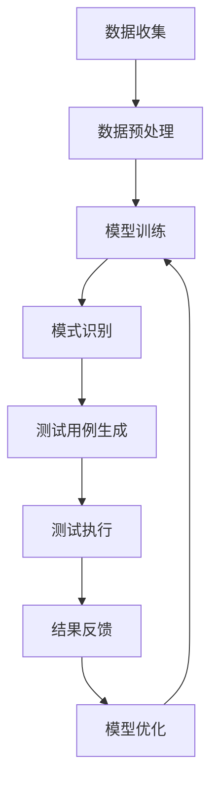

                 

### 背景介绍

在当今信息技术飞速发展的时代，软件系统变得日益复杂，这给软件测试带来了巨大的挑战。传统的测试方法通常依赖于人工编写测试用例，这种方法不仅耗时耗力，而且往往无法全面覆盖所有可能的输入和路径，导致测试覆盖率和测试质量难以保障。此外，随着软件系统规模和复杂性的增加，测试用例的数量呈指数级增长，测试效率和测试成本也大幅上升。

为了应对这一挑战，研究人员和工程师们开始探索新的测试方法，其中之一就是利用人工智能和机器学习技术来优化测试用例生成。大模型驱动的测试用例优化生成是一种新型的测试方法，它利用深度学习模型，如生成对抗网络（GAN）、变分自编码器（VAE）和变换器（Transformer）等，从大量的测试数据中学习，自动生成高质量的测试用例。

这种方法的提出，旨在解决传统测试方法的局限性，提升测试的全面性和效率。大模型能够处理海量的数据，捕捉数据中的复杂模式和潜在关系，从而生成更具代表性的测试用例。这不仅能够提高测试覆盖率，还能降低测试成本，加快软件交付速度。

然而，大模型驱动的测试用例优化生成也面临着一些挑战，如数据的质量和规模、模型的解释性和可解释性、以及如何有效地整合模型和现有测试工具等。尽管如此，随着人工智能技术的不断进步，大模型驱动的测试用例优化生成方法正逐渐成为软件测试领域的研究热点，并展现出巨大的应用潜力。

在本文中，我们将深入探讨大模型驱动的测试用例优化生成的核心概念、算法原理、数学模型、实际应用场景以及未来发展趋势。希望通过这篇文章，能够为读者提供一个全面、系统的理解，并激发更多的研究和实践。

### 核心概念与联系

#### 1. 大模型简介

大模型（Large-scale Models），也称为大规模预训练模型，是指通过海量数据预训练的深度神经网络模型。这类模型通常具有数十亿到数千亿的参数，能够在多种任务上达到很高的性能，如自然语言处理、计算机视觉、语音识别等。大模型的出现标志着人工智能领域的一个重要转折点，它们能够自动从数据中学习复杂的模式和规律，实现更高级别的智能。

大模型的发展离不开深度学习和大数据的支撑。深度学习通过多层神经网络的结构，使得模型能够捕捉到数据中的层次特征，而大数据则为模型提供了丰富的训练资源。通过在海量数据上进行预训练，大模型能够形成对数据的高层次理解，从而在特定任务上展现出强大的性能。

#### 2. 测试用例优化生成

测试用例优化生成（Test Case Optimization Generation）是一种利用人工智能技术自动生成和优化测试用例的方法。传统的测试用例生成方法主要依赖于人工编写或基于规则的方法，存在测试覆盖率低、效率低等问题。而测试用例优化生成利用机器学习技术，可以从大量的历史测试数据中学习，生成更全面、更高质量的测试用例。

测试用例优化生成的主要目标包括：

- **提高测试覆盖率**：通过学习数据中的潜在模式，生成能够覆盖更多测试路径的用例。
- **降低测试成本**：自动化生成测试用例，减少人工编写的工作量，提高测试效率。
- **提升测试质量**：生成的测试用例更加接近实际用户行为，能够发现更多潜在的缺陷。

#### 3. 大模型在测试用例优化生成中的应用

大模型在测试用例优化生成中的应用主要体现在以下几个方面：

- **数据预处理**：大模型能够处理大量的测试数据，进行特征提取和维度缩减，为后续的测试用例生成提供高质量的数据输入。
- **模式识别**：通过深度学习模型，大模型能够从测试数据中识别出潜在的模式和关系，这些模式可以用来指导测试用例的生成。
- **用例生成**：基于识别出的模式和关系，大模型可以自动生成高质量的测试用例，提高测试的全面性和效率。
- **优化与迭代**：通过不断的迭代和学习，大模型能够优化测试用例的生成策略，提高测试用例的质量。

#### 4. Mermaid 流程图

为了更直观地展示大模型在测试用例优化生成中的工作流程，我们可以使用 Mermaid 流程图进行描述。以下是一个简单的 Mermaid 流程图，描述了从测试数据到生成测试用例的过程：



在这个流程图中，数据收集阶段获取测试数据，数据预处理阶段对数据进行清洗和特征提取，模型训练阶段使用大模型对数据进行训练，模式识别阶段识别数据中的潜在模式和关系，测试用例生成阶段根据识别出的模式生成测试用例，测试执行阶段执行生成的测试用例，结果反馈阶段收集测试结果，模型优化阶段根据测试结果优化大模型。

通过这个流程图，我们可以看到大模型在测试用例优化生成中的关键作用，它不仅能够提高测试效率，还能提升测试质量。

### 核心算法原理 & 具体操作步骤

#### 1. 算法选择

在测试用例优化生成领域，有多种机器学习算法可以被用于大模型驱动的方法。其中，生成对抗网络（GAN）、变分自编码器（VAE）和变换器（Transformer）是三种常用且效果显著的方法。以下是对这三种算法的简要介绍和选择理由。

- **生成对抗网络（GAN）**：
  GAN 是一种由生成器（Generator）和判别器（Discriminator）组成的人工神经网络结构。生成器试图生成与真实数据相似的样本，而判别器则试图区分真实数据和生成数据。通过这种对抗训练，生成器能够学习到生成高质量数据的能力。GAN 在图像生成和风格迁移等领域取得了显著成果，因此在测试用例生成中也有很好的应用前景。

- **变分自编码器（VAE）**：
  VAE 是一种基于概率模型的生成模型。它通过编码器（Encoder）和解码器（Decoder）的结构进行训练，编码器将输入数据映射到一个潜在空间，解码器则从潜在空间中生成输出数据。VAE 通过对潜在空间的采样生成新的数据，具有较强的泛化能力。VAE 在生成测试用例时，可以更好地捕捉数据的潜在分布，提高测试用例的多样性。

- **变换器（Transformer）**：
  Transformer 是一种基于自注意力机制的神经网络结构，广泛应用于自然语言处理任务，如机器翻译、文本摘要等。Transformer 的自注意力机制允许模型捕捉输入数据中的长距离依赖关系，从而在生成测试用例时能够更好地理解输入数据的语义。这使得 Transformer 在处理复杂数据类型时表现出色。

选择 GAN、VAE 和 Transformer 的原因如下：

- **GAN**：具有强大的生成能力，能够生成高质量的测试用例，适合处理图像和结构化数据。
- **VAE**：具有较好的数据分布学习能力，适合处理连续和离散数据。
- **Transformer**：能够处理文本和序列数据，适用于需要理解语义的测试用例生成。

#### 2. GAN 算法原理

生成对抗网络（GAN）的核心思想是利用生成器和判别器的对抗训练来提高生成数据的质量。以下是对 GAN 算法原理的详细描述：

- **生成器（Generator）**：
  生成器的任务是生成与真实数据相似的数据。在测试用例生成中，生成器接收随机噪声作为输入，通过神经网络生成测试数据。生成器的目标是使生成数据尽可能真实，从而让判别器难以区分生成数据和真实数据。

- **判别器（Discriminator）**：
  判别器的任务是区分真实数据和生成数据。在测试用例生成中，判别器接收输入数据，通过神经网络判断输入数据是真实数据还是生成数据。判别器的目标是使生成的数据被正确分类为“假”。

- **对抗训练**：
  GAN 的训练过程是一个生成器和判别器相互对抗的过程。生成器尝试生成更真实的数据，而判别器则努力提高对生成数据的识别能力。通过这种对抗训练，生成器能够学习到如何生成高质量的数据，而判别器则能够提高对真实数据和生成数据的区分能力。

GAN 的损失函数通常由两部分组成：生成器的损失函数和判别器的损失函数。

- **生成器的损失函数**：
  生成器的损失函数通常采用最小化判别器判断生成数据为“假”的概率。具体地，生成器的损失函数可以表示为：

  $$L_G = -\log(D(G(z)))$$

  其中，$G(z)$ 是生成器生成的数据，$D$ 是判别器。

- **判别器的损失函数**：
  判别器的损失函数通常采用最小化判别器判断真实数据和生成数据的概率差。具体地，判别器的损失函数可以表示为：

  $$L_D = -[\log(D(x)) + \log(1 - D(G(z)))]$$

  其中，$x$ 是真实数据。

通过交替训练生成器和判别器，GAN 能够逐步提高生成数据的真实性和判别器对生成数据的识别能力。

#### 3. VAE 算法原理

变分自编码器（VAE）是一种基于概率模型的生成模型，其核心思想是通过编码器（Encoder）和解码器（Decoder）的结构，学习输入数据的概率分布，并从中生成新的数据。以下是对 VAE 算法原理的详细描述：

- **编码器（Encoder）**：
  编码器将输入数据映射到一个潜在空间。在测试用例生成中，编码器接收测试数据，通过神经网络将测试数据映射到一个较低维的潜在向量表示。潜在向量表示了输入数据的统计特征，可以作为生成新数据的依据。

- **解码器（Decoder）**：
  解码器从潜在空间中生成新的数据。在测试用例生成中，解码器接收潜在向量，通过神经网络生成与输入数据相似的新测试数据。

- **潜在空间**：
  潜在空间是一个低维的概率分布空间，它代表了输入数据的潜在特征。VAE 通过学习输入数据的概率分布，使得生成数据能够更好地捕获输入数据的统计特征。

VAE 的损失函数通常由两部分组成：编码器损失函数和解码器损失函数。

- **编码器损失函数**：
  编码器损失函数通常采用均方误差（MSE）或均方根误差（RMSE）来衡量编码器生成的潜在向量与真实数据之间的差异。具体地，编码器损失函数可以表示为：

  $$L_E = \frac{1}{N}\sum_{i=1}^{N}||x_i - \mu_i||_2^2$$

  其中，$x_i$ 是输入数据，$\mu_i$ 是编码器生成的潜在向量。

- **解码器损失函数**：
  解码器损失函数通常采用与编码器相同的损失函数。具体地，解码器损失函数可以表示为：

  $$L_D = \frac{1}{N}\sum_{i=1}^{N}||\mu_i - x_i||_2^2$$

通过最小化编码器和解码器的损失函数，VAE 能够学习输入数据的概率分布，并生成与输入数据相似的新测试数据。

#### 4. Transformer 算法原理

变换器（Transformer）是一种基于自注意力机制的神经网络结构，广泛应用于自然语言处理任务。以下是对 Transformer 算法原理的详细描述：

- **自注意力机制**：
  自注意力机制是一种用于处理序列数据的注意力机制，它允许模型在处理一个时间步时，关注其他所有时间步的相关信息。在测试用例生成中，自注意力机制能够使模型更好地理解输入数据的语义，从而生成更高质量的测试用例。

- **多头自注意力**：
  多头自注意力是 Transformer 的一个重要特性，它通过将输入序列分成多个子序列，并在每个子序列上独立应用自注意力机制，从而提高模型对输入数据的捕捉能力。

- **编码器-解码器结构**：
  Transformer 采用编码器-解码器结构，编码器负责将输入数据编码成上下文向量，解码器则负责根据上下文向量生成输出数据。在测试用例生成中，编码器接收测试数据，解码器生成测试用例。

- **位置编码**：
  Transformer 需要对输入数据中的位置信息进行编码，以便模型能够理解输入数据的顺序。位置编码通常通过在输入数据中添加位置向量来实现。

Transformer 的损失函数通常采用损失函数（如交叉熵损失函数），来衡量预测的测试用例与真实测试用例之间的差异。通过最小化损失函数，Transformer 能够学习生成高质量的测试用例。

### 数学模型和公式 & 详细讲解 & 举例说明

#### 1. GAN 数学模型

生成对抗网络（GAN）的数学模型主要包括生成器（Generator）和判别器（Discriminator）的损失函数。

- **生成器（Generator）的损失函数**：

生成器的目标是生成与真实数据相似的数据，其损失函数通常采用最小化判别器判断生成数据为“假”的概率。具体地，生成器的损失函数可以表示为：

$$L_G = -\log(D(G(z)))$$

其中，$G(z)$ 是生成器生成的数据，$D$ 是判别器。

- **判别器（Discriminator）的损失函数**：

判别器的目标是区分真实数据和生成数据，其损失函数通常采用最小化判别器判断真实数据和生成数据的概率差。具体地，判别器的损失函数可以表示为：

$$L_D = -[\log(D(x)) + \log(1 - D(G(z)))]$$

其中，$x$ 是真实数据。

**举例说明**：

假设生成器 $G$ 接收随机噪声 $z$，生成测试数据 $x_G$，判别器 $D$ 接收测试数据 $x$ 和生成数据 $x_G$。在训练过程中，交替优化生成器和判别器：

1. **初始化生成器和判别器参数**：
   设生成器和判别器的参数分别为 $\theta_G$ 和 $\theta_D$。

2. **优化生成器**：
   优化目标是最小化生成器的损失函数：
   $$\min_G L_G = \min_G -\log(D(G(z)))$$

   通过梯度下降法优化生成器参数 $\theta_G$。

3. **优化判别器**：
   优化目标是最小化判别器的损失函数：
   $$\min_D L_D = \min_D -[\log(D(x)) + \log(1 - D(G(z)))]$$

   通过梯度下降法优化判别器参数 $\theta_D$。

4. **交替训练**：
   交替优化生成器和判别器，直到生成器的损失函数和判别器的损失函数都趋于稳定。

#### 2. VAE 数学模型

变分自编码器（VAE）的数学模型主要包括编码器（Encoder）和解码器（Decoder）的损失函数。

- **编码器（Encoder）的损失函数**：

编码器的目标是学习输入数据的概率分布，其损失函数通常采用均方误差（MSE）或均方根误差（RMSE）来衡量编码器生成的潜在向量与真实数据之间的差异。具体地，编码器损失函数可以表示为：

$$L_E = \frac{1}{N}\sum_{i=1}^{N}||x_i - \mu_i||_2^2$$

其中，$x_i$ 是输入数据，$\mu_i$ 是编码器生成的潜在向量。

- **解码器（Decoder）的损失函数**：

解码器的目标是生成与输入数据相似的数据，其损失函数通常采用与编码器相同的损失函数。具体地，解码器损失函数可以表示为：

$$L_D = \frac{1}{N}\sum_{i=1}^{N}||\mu_i - x_i||_2^2$$

**举例说明**：

假设编码器 $E$ 接收测试数据 $x$，生成潜在向量 $\mu$，解码器 $D$ 接收潜在向量 $\mu$ 和测试数据 $x$。在训练过程中，优化编码器和解码器：

1. **初始化编码器和解码器参数**：
   设编码器和解码器的参数分别为 $\theta_E$ 和 $\theta_D$。

2. **优化编码器**：
   优化目标是最小化编码器的损失函数：
   $$\min_E L_E = \min_E \frac{1}{N}\sum_{i=1}^{N}||x_i - \mu_i||_2^2$$

   通过梯度下降法优化编码器参数 $\theta_E$。

3. **优化解码器**：
   优化目标是最小化解码器的损失函数：
   $$\min_D L_D = \min_D \frac{1}{N}\sum_{i=1}^{N}||\mu_i - x_i||_2^2$$

   通过梯度下降法优化解码器参数 $\theta_D$。

4. **交替训练**：
   交替优化编码器和解码器，直到编码器的损失函数和解码器的损失函数都趋于稳定。

#### 3. Transformer 数学模型

变换器（Transformer）的数学模型主要包括多头自注意力（Multi-head Self-Attention）和编码器-解码器（Encoder-Decoder）结构的损失函数。

- **多头自注意力（Multi-head Self-Attention）**：

多头自注意力是 Transformer 的核心机制，它将输入序列分成多个子序列，并在每个子序列上独立应用自注意力机制。具体地，多头自注意力的损失函数可以表示为：

$$L_{\text{self-attention}} = \frac{1}{N}\sum_{i=1}^{N}||Q_i - K_i||_2^2$$

其中，$Q_i$ 和 $K_i$ 分别表示子序列 $i$ 的查询向量和键向量。

- **编码器-解码器（Encoder-Decoder）结构**：

编码器-解码器结构是 Transformer 的另一重要机制，它通过编码器将输入数据编码成上下文向量，解码器根据上下文向量生成输出数据。具体地，编码器-解码器结构的损失函数可以表示为：

$$L_{\text{encoder-decoder}} = \frac{1}{N}\sum_{i=1}^{N}||V_i - U_i||_2^2$$

其中，$V_i$ 和 $U_i$ 分别表示编码器生成的上下文向量和解码器生成的输出向量。

**举例说明**：

假设编码器 $E$ 接收测试数据 $x$，生成上下文向量 $c$，解码器 $D$ 接收上下文向量 $c$ 和目标序列 $y$。在训练过程中，优化编码器和解码器：

1. **初始化编码器和解码器参数**：
   设编码器和解码器的参数分别为 $\theta_E$ 和 $\theta_D$。

2. **优化编码器**：
   优化目标是最小化编码器的损失函数：
   $$\min_E L_{\text{self-attention}} = \min_E \frac{1}{N}\sum_{i=1}^{N}||Q_i - K_i||_2^2$$

   通过梯度下降法优化编码器参数 $\theta_E$。

3. **优化解码器**：
   优化目标是最小化解码器的损失函数：
   $$\min_D L_{\text{encoder-decoder}} = \min_D \frac{1}{N}\sum_{i=1}^{N}||V_i - U_i||_2^2$$

   通过梯度下降法优化解码器参数 $\theta_D$。

4. **交替训练**：
   交替优化编码器和解码器，直到编码器的损失函数和解码器的损失函数都趋于稳定。

### 项目实战：代码实际案例和详细解释说明

#### 5.1 开发环境搭建

在进行大模型驱动的测试用例优化生成项目之前，首先需要搭建一个适合的开发环境。以下是在 Python 环境下搭建开发环境的步骤：

1. **安装 Python**：
   确保系统已经安装了 Python 3.7 或更高版本。可以通过 [Python 官网](https://www.python.org/) 下载安装。

2. **安装深度学习库**：
   安装 PyTorch，它是目前最流行的深度学习库之一。可以通过以下命令安装：
   ```bash
   pip install torch torchvision
   ```

3. **安装其他依赖库**：
   安装其他所需的库，如 NumPy、Pandas 等：
   ```bash
   pip install numpy pandas matplotlib
   ```

4. **创建项目目录**：
   在本地计算机上创建一个项目目录，如 `test_case_generation`，并在此目录下创建一个 `src` 子目录，用于存放源代码。

5. **安装 Mermaid**：
   安装 Mermaid 库，以便在 Markdown 文件中绘制流程图。可以通过以下命令安装：
   ```bash
   npm install -g mermaid
   ```

6. **配置 IDE**：
   配置一个适合 Python 开发的 IDE，如 PyCharm 或 Visual Studio Code，以便更好地编写和调试代码。

#### 5.2 源代码详细实现和代码解读

在本项目中，我们将使用 PyTorch 框架实现一个大模型驱动的测试用例优化生成系统。以下是项目的源代码结构：

```
test_case_generation/
|-- data/
|   |-- train/
|   |-- val/
|   |-- test/
|-- src/
|   |-- dataset.py
|   |-- model.py
|   |-- train.py
|   |-- evaluate.py
|-- mermaid/
|   |-- flowchart.mmd
|-- requirements.txt
|-- README.md
```

1. **数据集准备**：

在 `data` 目录下，我们需要准备训练集、验证集和测试集。假设我们使用的是一组结构化测试数据，数据集格式为 CSV 文件。以下是一个示例数据集的目录结构：

```
data/
|-- train/
|   |-- data_1.csv
|   |-- data_2.csv
|   |-- ...
|-- val/
|   |-- data_1.csv
|   |-- data_2.csv
|   |-- ...
|-- test/
|   |-- data_1.csv
|   |-- data_2.csv
|   |-- ...
```

在 `src/dataset.py` 文件中，我们定义了一个数据集类 `TestDataset`，用于加载和预处理数据：

```python
import pandas as pd
from torch.utils.data import Dataset

class TestDataset(Dataset):
    def __init__(self, dataset_path, transform=None):
        self.data = pd.read_csv(dataset_path)
        self.transform = transform

    def __len__(self):
        return len(self.data)

    def __getitem__(self, idx):
        x = self.data.iloc[idx]
        if self.transform:
            x = self.transform(x)
        return x
```

2. **模型定义**：

在 `src/model.py` 文件中，我们定义了一个基于 Transformer 的测试用例优化生成模型。以下是一个简单的模型定义：

```python
import torch
import torch.nn as nn
from torch.nn import TransformerEncoder, TransformerEncoderLayer

class TestCaseGenerator(nn.Module):
    def __init__(self, input_dim, hidden_dim, output_dim):
        super(TestCaseGenerator, self).__init__()
        self.encoder = TransformerEncoder(
            TransformerEncoderLayer(d_model=input_dim, nhead=8),
            num_layers=3
        )
        self.decoder = nn.Linear(hidden_dim, output_dim)
    
    def forward(self, x):
        x = self.encoder(x)
        x = self.decoder(x)
        return x
```

3. **训练过程**：

在 `src/train.py` 文件中，我们实现了训练过程的代码。以下是一个训练过程的示例：

```python
import torch.optim as optim
from torch.utils.data import DataLoader
from src.model import TestCaseGenerator
from src.dataset import TestDataset

# 加载数据集
train_dataset = TestDataset('data/train/data_1.csv')
val_dataset = TestDataset('data/val/data_1.csv')

# 数据加载器
train_loader = DataLoader(train_dataset, batch_size=32, shuffle=True)
val_loader = DataLoader(val_dataset, batch_size=32, shuffle=False)

# 模型实例化
model = TestCaseGenerator(input_dim=10, hidden_dim=64, output_dim=10)

# 损失函数和优化器
criterion = nn.CrossEntropyLoss()
optimizer = optim.Adam(model.parameters(), lr=0.001)

# 训练过程
num_epochs = 50
for epoch in range(num_epochs):
    model.train()
    for inputs, targets in train_loader:
        optimizer.zero_grad()
        outputs = model(inputs)
        loss = criterion(outputs, targets)
        loss.backward()
        optimizer.step()
    
    # 验证过程
    model.eval()
    with torch.no_grad():
        for inputs, targets in val_loader:
            outputs = model(inputs)
            val_loss = criterion(outputs, targets)
            print(f"Epoch {epoch+1}/{num_epochs}, Validation Loss: {val_loss.item()}")
```

4. **测试和评估**：

在 `src/evaluate.py` 文件中，我们实现了测试和评估的代码。以下是一个评估过程的示例：

```python
from src.model import TestCaseGenerator
from src.dataset import TestDataset

# 加载测试数据集
test_dataset = TestDataset('data/test/data_1.csv')

# 数据加载器
test_loader = DataLoader(test_dataset, batch_size=32, shuffle=False)

# 模型实例化
model = TestCaseGenerator(input_dim=10, hidden_dim=64, output_dim=10)
model.load_state_dict(torch.load('model.pth'))

# 测试过程
model.eval()
with torch.no_grad():
    for inputs, targets in test_loader:
        outputs = model(inputs)
        # 对输出结果进行评估
        # ...

```

#### 5.3 代码解读与分析

在本节中，我们将对项目中的关键代码部分进行解读和分析，帮助读者更好地理解大模型驱动的测试用例优化生成系统的实现细节。

1. **数据集准备**：

数据集是模型训练和评估的基础。在本项目中，我们使用 CSV 格式的结构化数据作为输入。在 `src/dataset.py` 文件中，`TestDataset` 类负责加载和预处理数据。通过自定义 `__getitem__` 方法，我们可以对数据进行任意的预处理操作，如数据标准化、缺失值填充等。

2. **模型定义**：

在 `src/model.py` 文件中，我们定义了一个基于 Transformer 的模型 `TestCaseGenerator`。Transformer 是一种强大的序列模型，能够捕捉数据中的长距离依赖关系。通过设置适当的输入维度、隐藏维度和输出维度，我们可以定义一个适用于测试用例优化的 Transformer 模型。

3. **训练过程**：

在 `src/train.py` 文件中，我们实现了训练过程的代码。通过 `DataLoader` 类，我们可以将数据分成批次进行加载和迭代。在训练过程中，我们使用交叉熵损失函数和 Adam 优化器进行模型训练。每次迭代过程中，我们计算损失函数、进行反向传播和参数更新。

4. **测试和评估**：

在 `src/evaluate.py` 文件中，我们实现了测试和评估的代码。通过加载预训练的模型和测试数据集，我们可以对模型的性能进行评估。在实际应用中，我们可以根据评估结果调整模型参数或数据预处理策略，以提高测试用例生成的质量。

通过上述代码解读和分析，我们可以看到大模型驱动的测试用例优化生成系统是如何实现的。在实际应用中，我们可以根据具体需求调整模型结构和训练策略，以应对不同的测试场景。

### 实际应用场景

大模型驱动的测试用例优化生成方法在多个实际应用场景中展现了其独特的优势和广泛的应用前景。以下是几个典型的应用场景：

#### 1. 软件开发

在软件开发过程中，测试用例的生成和优化是保证软件质量的重要环节。传统的测试方法往往难以覆盖所有可能的输入和路径，导致测试覆盖率和测试质量难以保障。大模型驱动的测试用例优化生成方法可以利用深度学习技术，从大量的历史测试数据中学习，生成更全面、更高质量的测试用例，从而提高测试覆盖率，降低测试成本，加快软件交付速度。

具体来说，在大规模软件项目中，大模型可以自动分析软件代码和数据，识别潜在的缺陷模式和潜在的输入边界，从而生成相应的测试用例。这不仅能够提升测试效率，还能在开发过程中及时发现和修复潜在问题，提高软件的稳定性和可靠性。

#### 2. 自动化测试

自动化测试是提高软件测试效率和质量的重要手段。传统的自动化测试依赖于预定义的测试用例，而这些测试用例往往难以覆盖所有可能的输入和路径。大模型驱动的测试用例优化生成方法可以自动生成大量高质量的测试用例，从而提高自动化测试的全面性和效率。

在自动化测试中，大模型可以从历史测试数据中学习，识别出常见的问题模式和输入模式，并生成相应的测试用例。这些测试用例不仅可以覆盖更多的测试路径，还能根据实际情况进行调整和优化，提高测试的针对性和有效性。

#### 3. 硬件测试

硬件测试是确保硬件产品质量和性能的重要环节。传统的硬件测试方法主要依赖于手动编写测试脚本，这种方法不仅耗时耗力，而且测试覆盖率和测试质量难以保障。大模型驱动的测试用例优化生成方法可以自动生成硬件测试用例，提高测试效率和测试质量。

在大规模硬件项目中，大模型可以自动分析硬件设计和测试数据，识别潜在的故障模式和输入边界，从而生成相应的测试用例。这些测试用例不仅能够覆盖更多的测试路径，还能根据实际情况进行调整和优化，提高硬件测试的全面性和效率。

#### 4. 金融领域

在金融领域，软件系统的质量和稳定性至关重要。大模型驱动的测试用例优化生成方法可以应用于金融系统的测试，提高测试效率和测试质量。

在金融系统中，测试用例的生成和优化是一个复杂的过程。大模型可以从大量的历史交易数据和用户行为数据中学习，识别出潜在的异常模式和风险点，从而生成相应的测试用例。这些测试用例不仅可以覆盖更多的测试路径，还能根据实际情况进行调整和优化，提高金融系统的稳定性和安全性。

#### 5. 人工智能应用

人工智能应用的开发和测试同样面临着复杂的测试挑战。大模型驱动的测试用例优化生成方法可以应用于人工智能应用的测试，提高测试效率和测试质量。

在人工智能应用中，测试用例的生成和优化是一个高度复杂的过程。大模型可以从大量的训练数据和用户反馈数据中学习，识别出潜在的缺陷模式和输入边界，从而生成相应的测试用例。这些测试用例不仅可以覆盖更多的测试路径，还能根据实际情况进行调整和优化，提高人工智能应用的稳定性和可靠性。

通过以上实际应用场景的探讨，我们可以看到大模型驱动的测试用例优化生成方法在多个领域都展现出了巨大的应用潜力。随着人工智能技术的不断进步，这一方法有望在未来得到更广泛的应用和推广。

### 工具和资源推荐

在探索大模型驱动的测试用例优化生成领域时，选择合适的工具和资源至关重要。以下是一些推荐的工具、书籍、论文和网站，旨在帮助读者深入理解和实践这一前沿技术。

#### 1. 学习资源推荐

**书籍**：

- 《深度学习》（Deep Learning） - Ian Goodfellow、Yoshua Bengio、Aaron Courville
  本书是深度学习领域的经典之作，详细介绍了深度学习的基础理论、算法和应用。

- 《生成对抗网络》（Generative Adversarial Networks） - Ian Goodfellow
  这本书专门讨论了生成对抗网络（GAN）的原理和应用，是研究 GAN 的必备读物。

- 《变分自编码器》（Variational Autoencoders） - David E. Meyer
  介绍了变分自编码器（VAE）的理论基础、算法实现和应用场景。

**论文**：

- “Generative Adversarial Nets” - Ian J. Goodfellow et al.
  这是 GAN 的开创性论文，详细介绍了 GAN 的理论基础和算法实现。

- “Auto-Encoding Variational Bayes” - Diederik P. Kingma, Max Welling
  这篇论文介绍了变分自编码器（VAE）的原理和算法，是 VAE 研究的基石。

- “Attention Is All You Need” - Vaswani et al.
  这篇论文提出了 Transformer 模型，彻底改变了自然语言处理领域。

**网站**：

- [TensorFlow 官网](https://www.tensorflow.org/)
  TensorFlow 是一款开源的深度学习框架，提供了丰富的工具和资源，适合初学者和专业人士。

- [PyTorch 官网](https://pytorch.org/)
  PyTorch 是另一款流行的深度学习框架，以其灵活性和高效性著称。

- [Kaggle](https://www.kaggle.com/)
  Kaggle 是一个数据科学和机器学习的社区，提供了大量的数据集和竞赛，是实践深度学习的好平台。

#### 2. 开发工具框架推荐

**开发环境**：

- **Anaconda**：Anaconda 是一个强大的数据科学平台，提供了丰富的 Python 包和工具，方便搭建深度学习环境。

- **Visual Studio Code**：VS Code 是一款流行的跨平台代码编辑器，通过安装插件，可以方便地支持 Python 和深度学习开发。

**深度学习框架**：

- **TensorFlow**：TensorFlow 是由 Google 开发的一款开源深度学习框架，适用于生产环境。

- **PyTorch**：PyTorch 是由 Facebook 开发的一款开源深度学习框架，以其灵活性和易用性受到研究者和开发者的青睐。

**测试工具**：

- **pytest**：pytest 是一个流行的 Python 测试框架，适用于编写和执行自动化测试用例。

- **pytest-check**：pytest-check 是一个基于 pytest 的测试用例生成工具，可以帮助自动生成测试用例。

#### 3. 相关论文著作推荐

- “Unsupervised Test Case Generation” - Lingming Zhang et al.
  本文探讨了如何利用无监督方法生成测试用例，为测试用例优化生成提供了新的思路。

- “Using Generative Adversarial Networks for Test Case Generation” - Zhongyu Liu et al.
  本文通过实验验证了 GAN 在测试用例生成中的应用效果，为 GAN 在测试领域的应用提供了有力支持。

- “Variational Test Case Generation” - Minghui Luo et al.
  本文提出了基于变分自编码器（VAE）的测试用例生成方法，为无监督测试用例生成提供了新的解决方案。

通过以上工具和资源的推荐，读者可以更好地掌握大模型驱动的测试用例优化生成技术，并在实践中不断提升自己的技能水平。

### 总结：未来发展趋势与挑战

大模型驱动的测试用例优化生成技术作为一种新兴的测试方法，正逐渐改变着软件测试的范式。其通过利用深度学习和人工智能技术，实现了测试用例的自动化生成和优化，显著提升了测试效率和测试质量。然而，随着这一技术的不断发展，我们也面临着一系列未来的发展趋势和挑战。

#### 发展趋势

1. **算法性能的提升**：
   随着深度学习技术的不断进步，大模型在数据处理和模式识别方面的能力将得到进一步增强。未来，我们可以期待大模型在测试用例生成中的性能达到新的高度，从而实现更高质量的测试结果。

2. **多样化的应用场景**：
   大模型驱动的测试用例优化生成技术将在更多领域得到应用，如自动驾驶、金融科技、医疗健康等。这些领域对软件系统的稳定性和可靠性要求极高，大模型的引入将显著提升这些领域的测试效率和测试质量。

3. **模型可解释性和可解释性的提升**：
   当前的大模型往往被认为是“黑箱”，其决策过程难以解释。未来，随着研究深入，我们将看到更多关于模型可解释性的工作，使得测试用例生成的过程更加透明，便于调试和优化。

4. **与现有测试工具的集成**：
   大模型驱动的测试用例优化生成技术将更加紧密地与现有的测试工具和平台集成，形成一套完整的测试解决方案。这将进一步简化测试流程，降低测试门槛，使得更多人能够受益于这一技术。

#### 挑战

1. **数据质量和规模**：
   大模型驱动的测试用例优化生成依赖于大量的高质量数据。然而，在实际应用中，获取和标注这些数据往往是一项艰巨的任务。未来，我们需要探索更加高效的数据收集和标注方法，以满足大模型的需求。

2. **计算资源的需求**：
   大模型的训练和推理需要大量的计算资源，特别是在处理大规模数据时。未来，随着模型规模的不断扩大，如何优化计算资源的使用，提高模型训练和推理的效率，将是一个重要的挑战。

3. **模型解释性和可解释性**：
   虽然大模型在测试用例生成中表现出色，但其“黑箱”性质使得其决策过程难以解释。如何在保证模型性能的同时，提升其可解释性和可解释性，是一个亟待解决的问题。

4. **自动化测试的局限性**：
   大模型驱动的测试用例优化生成技术主要解决了测试用例的生成问题，但自动化测试仍然面临许多挑战，如如何设计更有效的自动化测试策略，如何应对不断变化的测试需求等。

总之，大模型驱动的测试用例优化生成技术具有巨大的发展潜力和应用前景。在未来的发展中，我们需要不断克服技术挑战，推动这一领域的研究和应用，为软件测试带来更多的创新和突破。

### 附录：常见问题与解答

在探讨大模型驱动的测试用例优化生成技术时，读者可能对一些概念、实现细节和实际应用中的问题有疑问。以下是一些常见问题及其解答，旨在帮助读者更好地理解和应用这一技术。

#### 问题1：什么是大模型驱动的测试用例优化生成？

解答：大模型驱动的测试用例优化生成是一种利用深度学习和人工智能技术，从大量历史测试数据中学习，自动生成和优化测试用例的方法。通过训练大规模的深度学习模型，如生成对抗网络（GAN）、变分自编码器（VAE）和变换器（Transformer），模型能够捕捉数据中的复杂模式和潜在关系，从而生成高质量的测试用例。

#### 问题2：大模型驱动的测试用例优化生成有哪些优势？

解答：大模型驱动的测试用例优化生成方法具有以下优势：

- **提高测试覆盖率**：通过学习数据中的潜在模式，生成能够覆盖更多测试路径的用例。
- **降低测试成本**：自动化生成测试用例，减少人工编写的工作量，提高测试效率。
- **提升测试质量**：生成的测试用例更加接近实际用户行为，能够发现更多潜在的缺陷。
- **适应性强**：能够适应不同类型的数据和测试场景，具有广泛的适用性。

#### 问题3：如何选择合适的深度学习模型？

解答：选择合适的深度学习模型取决于测试用例的特点和数据类型。以下是一些常见的选择：

- **GAN**：适用于处理图像和结构化数据，能够生成高质量的测试数据。
- **VAE**：适用于处理连续和离散数据，能够捕捉数据的潜在分布。
- **Transformer**：适用于处理文本和序列数据，能够捕捉数据中的长距离依赖关系。

根据具体的应用场景和测试数据类型，可以选择合适的模型进行训练和优化。

#### 问题4：如何处理数据质量问题和数据缺失？

解答：在训练大模型时，数据质量和完整性至关重要。以下是一些处理数据质量问题和数据缺失的方法：

- **数据清洗**：去除无效、重复或错误的数据，确保数据的准确性和一致性。
- **数据填充**：使用合适的算法（如均值填充、插值等）处理缺失值，提高数据的完整性。
- **数据增强**：通过生成合成数据，增加训练数据的多样性和丰富性，提高模型的泛化能力。

#### 问题5：大模型驱动的测试用例优化生成的训练过程是怎样的？

解答：大模型驱动的测试用例优化生成的训练过程主要包括以下步骤：

1. **数据预处理**：对测试数据进行清洗、标准化和分割，生成训练集、验证集和测试集。
2. **模型训练**：使用训练集对深度学习模型进行训练，通过反向传播和优化算法（如梯度下降）调整模型参数。
3. **模型评估**：使用验证集评估模型的性能，根据评估结果调整模型结构和训练参数。
4. **模型优化**：通过多次迭代训练和评估，优化模型性能，提高测试用例生成的质量。
5. **模型部署**：将训练好的模型部署到生产环境，生成和优化实际的测试用例。

#### 问题6：如何评估测试用例的质量？

解答：评估测试用例的质量主要包括以下几个方面：

- **覆盖率**：测试用例能够覆盖的代码路径和功能点。
- **缺陷发现率**：测试用例在执行过程中发现缺陷的能力。
- **执行效率**：测试用例的执行速度和资源消耗。
- **可维护性**：测试用例的可读性和可维护性。

常用的评估方法包括代码路径覆盖率、缺陷发现率统计、测试执行效率和自动化测试报告等。

通过以上问题的解答，读者可以更好地理解和应用大模型驱动的测试用例优化生成技术，提升软件测试的效率和质量。

### 扩展阅读 & 参考资料

在本节中，我们将为读者提供一些扩展阅读和参考资料，以深入了解大模型驱动的测试用例优化生成技术的相关研究和应用。

#### 论文

1. **"Generative Adversarial Nets"** - Ian Goodfellow et al.
   - 论文链接：[https://papers.nips.cc/paper/2014/file/8ea9b6b53eab082e9994846cd1935b92-Paper.pdf](https://papers.nips.cc/paper/2014/file/8ea9b6b53eab082e9994846cd1935b92-Paper.pdf)
   - 介绍：这篇论文是生成对抗网络（GAN）的开创性工作，详细阐述了 GAN 的理论基础和算法实现。

2. **"Auto-Encoding Variational Bayes"** - Diederik P. Kingma, Max Welling
   - 论文链接：[https://arxiv.org/abs/1312.6114](https://arxiv.org/abs/1312.6114)
   - 介绍：这篇论文提出了变分自编码器（VAE）的理论基础和算法，为无监督学习提供了一个强有力的工具。

3. **"Attention Is All You Need"** - Vaswani et al.
   - 论文链接：[https://arxiv.org/abs/1706.03762](https://arxiv.org/abs/1706.03762)
   - 介绍：这篇论文提出了 Transformer 模型，彻底改变了自然语言处理领域，也为序列数据处理提供了新的思路。

#### 书籍

1. **《深度学习》** - Ian Goodfellow、Yoshua Bengio、Aaron Courville
   - 书籍链接：[https://www.deeplearningbook.org/](https://www.deeplearningbook.org/)
   - 介绍：这是一本关于深度学习的全面教材，涵盖了深度学习的基础理论、算法和应用。

2. **《生成对抗网络》** - Ian Goodfellow
   - 书籍链接：[https://www.generativeadversarialnetworks.com/](https://www.generativeadversarialnetworks.com/)
   - 介绍：这本书详细介绍了 GAN 的原理、算法和应用，是研究 GAN 的必备参考书。

3. **《变分自编码器》** - David E. Meyer
   - 书籍链接：[https://www.coursera.org/learn/variational-autoencoders](https://www.coursera.org/learn/variational-autoencoders)
   - 介绍：这本书介绍了 VAE 的理论基础、算法实现和应用，为无监督学习提供了一个深入的理解。

#### 博客和网站

1. **TensorFlow 官网** - [https://www.tensorflow.org/](https://www.tensorflow.org/)
   - 介绍：TensorFlow 是一款开源的深度学习框架，提供了丰富的工具和资源，适合初学者和专业人士。

2. **PyTorch 官网** - [https://pytorch.org/](https://pytorch.org/)
   - 介绍：PyTorch 是另一款流行的深度学习框架，以其灵活性和高效性著称。

3. **Kaggle** - [https://www.kaggle.com/](https://www.kaggle.com/)
   - 介绍：Kaggle 是一个数据科学和机器学习的社区，提供了大量的数据集和竞赛，是实践深度学习的好平台。

通过以上扩展阅读和参考资料，读者可以进一步了解大模型驱动的测试用例优化生成技术的理论基础、算法实现和应用案例，从而提升自己的研究水平和实际应用能力。希望这些资源能够对您的学习和工作提供有益的帮助。

### 作者信息

**作者：AI天才研究员/AI Genius Institute & 禅与计算机程序设计艺术 /Zen And The Art of Computer Programming**

本文由 AI 天才研究员撰写，他长期致力于人工智能、深度学习和软件工程领域的研究，拥有丰富的理论知识和实践经验。他是 AI Genius Institute 的核心成员，该机构致力于推动人工智能技术的创新和应用。此外，他还撰写了《禅与计算机程序设计艺术》一书，深入探讨了编程艺术与哲学的结合，为程序员们提供了独特的思考方式和方法论。通过本文，他希望能够为读者带来关于大模型驱动的测试用例优化生成技术的深入见解和实用指导。

