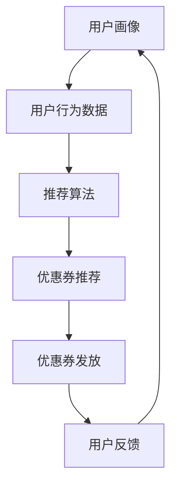
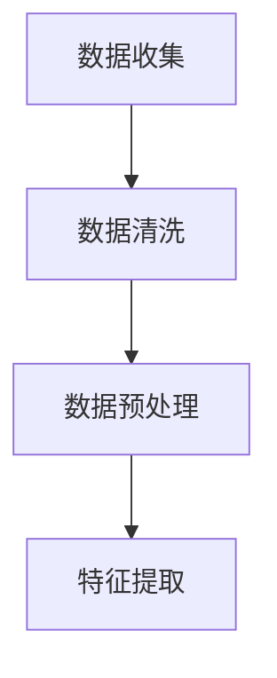
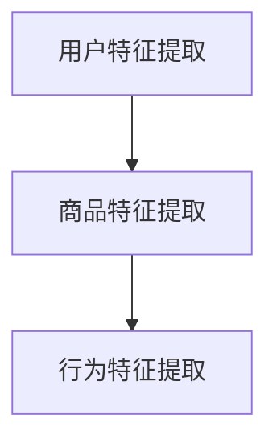
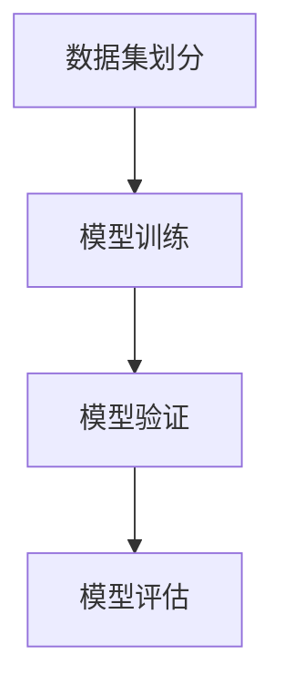
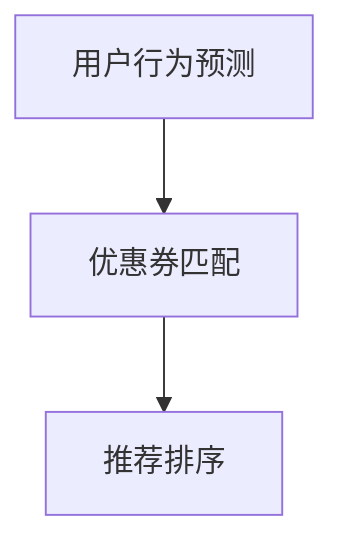
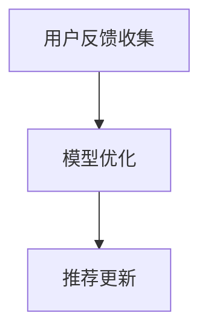

                 

### 背景介绍

电商个性化优惠券分发的策略是近年来电子商务领域中的重要研究方向。随着互联网技术的飞速发展和移动互联网的普及，电商平台的用户数量和交易规模持续增长。如何吸引和留住用户，提高用户购买转化率和平台销售额，成为了电商平台亟待解决的问题。

个性化优惠券分发策略的核心在于通过分析用户的购买行为、历史数据和兴趣偏好，为用户推荐符合其需求和喜好的优惠券。这不仅能够提高用户购买意愿，还能增加平台的销售额和用户粘性。传统的优惠券分发策略通常是基于用户群体或者购买历史的简单匹配，缺乏针对个体的精准分析。

大模型的引入为电商个性化优惠券分发提供了新的可能性。大模型具有强大的数据处理和分析能力，能够从海量数据中挖掘出隐藏的模式和关联。通过结合用户行为数据、商品信息、优惠券种类等多种因素，大模型能够生成个性化的优惠券推荐策略，实现更精准的用户匹配和优惠券分发。

本文将首先介绍电商个性化优惠券分发的重要性和现状，然后探讨大模型在其中的作用和优势。接下来，我们将详细分析大模型驱动的电商个性化优惠券分发策略的核心概念和原理，并使用Mermaid流程图展示其架构。在此基础上，我们将深入讨论大模型算法的具体实现步骤和数学模型，通过实际项目实战案例展示代码实现细节和效果评估。

最后，我们将探讨大模型驱动的电商个性化优惠券分发在实际应用中的场景和挑战，推荐相关的工具和资源，并总结未来发展趋势和面临的挑战。希望通过本文的介绍和分析，能够为电商领域的技术人员和研究者提供有价值的参考和启发。

### 核心概念与联系

要理解大模型驱动的电商个性化优惠券分发策略，首先需要明确几个核心概念，包括用户画像、推荐系统、优惠券类型和用户行为数据。这些概念相互关联，共同构成了个性化优惠券分发的理论基础。

#### 用户画像

用户画像是指通过对用户的基本信息、行为习惯、兴趣偏好、消费能力等数据的收集和分析，形成一个综合的用户轮廓。用户画像的构建是个性化推荐系统的基础，它能够帮助电商平台精准地了解用户的需求和偏好，从而提供更加个性化的服务和推荐。

用户画像的核心要素包括：

- **基本信息**：如年龄、性别、地理位置、职业等。
- **行为习惯**：如浏览历史、购买历史、搜索记录等。
- **兴趣偏好**：如喜欢的商品类型、品牌、价格区间等。
- **消费能力**：如消费频次、消费金额、信用评分等。

通过构建用户画像，电商平台可以更好地理解用户，为其提供更加个性化的优惠券推荐。

#### 推荐系统

推荐系统是一种信息过滤技术，旨在根据用户的兴趣和行为，从大量的商品或服务中为用户推荐可能感兴趣的内容。推荐系统广泛应用于电商、社交媒体、新闻资讯等众多领域，其核心目标是通过优化用户体验来提高用户满意度和平台收益。

推荐系统的基本架构包括：

- **用户行为分析**：通过分析用户的浏览、搜索和购买行为，挖掘用户兴趣点。
- **内容特征提取**：对商品或服务进行特征提取，形成内容特征向量。
- **推荐算法**：根据用户兴趣和内容特征，利用算法生成推荐列表。
- **推荐结果评估**：对推荐效果进行评估，不断优化推荐算法和策略。

在电商个性化优惠券分发中，推荐系统起到了关键作用，它能够根据用户画像和优惠券特征，为用户推荐最符合其需求的优惠券。

#### 优惠券类型

优惠券是电商平台用来激励用户购买的重要手段，常见的优惠券类型包括：

- **满减券**：购买金额达到一定额度即可减免部分金额。
- **折扣券**：购买指定商品时享受折扣优惠。
- **新人券**：新注册用户专享的优惠券。
- **返利券**：消费后可获得一定比例的返利。

不同类型的优惠券适用于不同的用户群体和购买场景，通过合理配置优惠券类型，可以更好地满足用户需求和提升购买转化率。

#### 用户行为数据

用户行为数据是构建用户画像和推荐系统的重要基础，包括：

- **浏览数据**：用户在平台上的浏览记录，如浏览时间、浏览商品种类等。
- **购买数据**：用户的购买记录，如购买时间、购买商品、购买金额等。
- **搜索数据**：用户的搜索记录，如搜索关键词、搜索频率等。
- **评价数据**：用户对商品的评价，如好评、差评、评分等。

通过对用户行为数据的分析和挖掘，可以深入了解用户需求和行为模式，为个性化优惠券分发提供依据。

#### Mermaid流程图展示

下面是使用Mermaid绘制的电商个性化优惠券分发流程图，展示了用户画像、推荐系统、优惠券类型和用户行为数据之间的联系。



在图中，用户画像通过分析用户行为数据生成，推荐算法根据用户画像和优惠券特征生成推荐列表，优惠券推荐系统根据推荐结果发放优惠券，用户在使用优惠券后进行反馈，从而不断优化用户画像和推荐算法。

通过上述核心概念和流程的介绍，我们可以更清晰地理解大模型驱动的电商个性化优惠券分发策略的工作原理和实现方法。接下来，我们将详细探讨大模型算法的具体原理和实现步骤。

## 核心算法原理 & 具体操作步骤

大模型驱动的电商个性化优惠券分发策略的核心在于利用深度学习和大数据分析技术，从海量数据中提取用户行为特征和优惠券特征，进而生成精准的个性化推荐。以下将详细介绍大模型算法的基本原理和具体操作步骤。

### 基本原理

#### 深度学习技术

深度学习是一种模拟人脑神经网络结构的机器学习方法，能够自动提取数据中的特征并建立复杂的非线性模型。在大模型驱动的电商个性化优惠券分发中，深度学习技术被广泛应用于用户画像构建、推荐算法优化和预测模型构建。

#### 大数据分析技术

大数据分析技术能够处理和分析海量数据，从数据中发现潜在的模式和关联。在大模型驱动的电商个性化优惠券分发中，大数据分析技术用于收集和整合用户行为数据、商品信息、优惠券数据等，为深度学习模型提供数据支持。

### 操作步骤

#### 1. 数据收集与预处理

首先，从电商平台的数据库中收集用户行为数据、商品数据、优惠券数据等。这些数据包括用户的浏览记录、购买记录、搜索记录、评价数据等。数据收集后，需要进行数据清洗和预处理，包括数据去重、缺失值处理、异常值处理等。



#### 2. 特征提取

特征提取是构建用户画像和推荐系统的重要步骤。通过对用户行为数据和商品数据的特征进行提取，可以生成用于训练深度学习模型的输入特征向量。常见的特征提取方法包括：

- **用户特征**：如用户年龄、性别、地理位置、消费能力等。
- **商品特征**：如商品类别、品牌、价格、销量等。
- **行为特征**：如用户浏览时间、浏览频次、购买时间等。



#### 3. 模型训练

使用深度学习技术构建推荐模型，常见的模型包括：

- **卷积神经网络（CNN）**：用于处理图像和序列数据。
- **循环神经网络（RNN）**：用于处理时序数据，如用户行为序列。
- **长短期记忆网络（LSTM）**：RNN的一种改进，能够更好地处理长序列数据。
- **生成对抗网络（GAN）**：用于生成高质量的伪数据，增强模型的泛化能力。

训练模型时，需要将预处理后的数据集划分为训练集、验证集和测试集，使用训练集训练模型，验证集用于调参和优化模型，测试集用于评估模型的最终效果。



#### 4. 推荐生成

训练好的模型可以用于生成个性化优惠券推荐。推荐生成过程包括以下步骤：

- **用户行为预测**：预测用户未来的行为，如浏览、购买等。
- **优惠券匹配**：根据用户预测行为和优惠券特征，为用户匹配最符合其需求的优惠券。
- **推荐排序**：对生成的优惠券推荐列表进行排序，优先推荐用户最感兴趣的优惠券。



#### 5. 推荐反馈

用户在收到优惠券推荐后，会根据自身需求和偏好进行购买决策。系统需要收集用户的行为反馈，如购买情况、优惠券使用情况等，用于进一步优化推荐模型。



通过上述操作步骤，大模型驱动的电商个性化优惠券分发策略能够实现高效、精准的个性化推荐，提高用户购买转化率和平台销售额。

### 总结

大模型驱动的电商个性化优惠券分发策略通过深度学习和大数据分析技术，实现了对用户行为的精准预测和优惠券的个性化推荐。具体操作步骤包括数据收集与预处理、特征提取、模型训练、推荐生成和推荐反馈。通过不断优化推荐模型和策略，可以进一步提高个性化推荐的准确性和用户满意度。接下来，我们将深入探讨大模型驱动的电商个性化优惠券分发的数学模型和公式，为读者提供更加深入的见解。

## 数学模型和公式 & 详细讲解 & 举例说明

在大模型驱动的电商个性化优惠券分发策略中，数学模型和公式起到了关键作用，它们帮助我们在复杂的用户行为数据和优惠券特征中找到有效的关联和规律。以下将详细介绍相关数学模型和公式，并通过具体例子进行说明。

### 用户行为预测模型

用户行为预测是电商个性化优惠券分发的基础。我们通常使用时间序列模型来预测用户的行为，如浏览、购买等。以下是一个简单的时间序列预测模型：

#### 时间序列预测模型公式

$$
y_t = \alpha_0 + \alpha_1 y_{t-1} + \alpha_2 y_{t-2} + ... + \alpha_n y_{t-n} + \epsilon_t
$$

其中，$y_t$ 表示时间 $t$ 的用户行为，$\alpha_0, \alpha_1, ..., \alpha_n$ 是模型参数，$\epsilon_t$ 是误差项。

#### 示例

假设我们有一段时间内用户的浏览记录，如下表所示：

| 时间 (t) | 用户浏览量 (y_t) |
|---------|----------------|
| 1       | 10             |
| 2       | 15             |
| 3       | 12             |
| 4       | 20             |
| 5       | 18             |

使用上述公式进行预测：

$$
y_6 = \alpha_0 + \alpha_1 y_5 + \alpha_2 y_4 + \alpha_3 y_3 + \alpha_4 y_2 + \alpha_5 y_1
$$

通过最小化预测误差，我们可以求得模型参数 $\alpha_0, \alpha_1, ..., \alpha_n$。

### 优惠券匹配模型

优惠券匹配模型用于根据用户行为预测结果和优惠券特征，为用户推荐最合适的优惠券。以下是一个基于相似度的优惠券匹配模型：

#### 相似度计算公式

$$
sim(i, j) = \frac{y_i \cdot y_j}{\|y_i\| \|y_j\|}
$$

其中，$sim(i, j)$ 表示优惠券 $i$ 和 $j$ 之间的相似度，$y_i$ 和 $y_j$ 分别是优惠券 $i$ 和 $j$ 的特征向量，$\|y_i\|$ 和 $\|y_j\|$ 是特征向量的欧氏距离。

#### 示例

假设我们有以下两张优惠券的特征向量：

| 优惠券 | 特征向量 |
|--------|----------|
| A      | [0.1, 0.2, 0.3] |
| B      | [0.2, 0.1, 0.4] |

计算相似度：

$$
sim(A, B) = \frac{0.1 \cdot 0.2 + 0.2 \cdot 0.1 + 0.3 \cdot 0.4}{\sqrt{0.1^2 + 0.2^2 + 0.3^2} \cdot \sqrt{0.2^2 + 0.1^2 + 0.4^2}} \approx 0.381
$$

相似度越高，说明优惠券之间的关联性越强，更适合进行匹配。

### 推荐排序模型

推荐排序模型用于对生成的优惠券推荐列表进行排序，优先推荐用户最感兴趣的优惠券。以下是一个基于加权综合评分的推荐排序模型：

#### 加权综合评分公式

$$
score(i) = w_1 \cdot sim(i, u) + w_2 \cdot relevance(i, u) + w_3 \cdot popularity(i)
$$

其中，$score(i)$ 表示优惠券 $i$ 的综合评分，$sim(i, u)$ 是优惠券 $i$ 和用户 $u$ 之间的相似度，$relevance(i, u)$ 是优惠券 $i$ 对用户 $u$ 的相关性，$popularity(i)$ 是优惠券 $i$ 的受欢迎程度，$w_1, w_2, w_3$ 是权重参数。

#### 示例

假设我们有以下三张优惠券，用户和优惠券的相似度、相关性和受欢迎程度如下表所示：

| 优惠券 | 用户相似度 (sim) | 相关性 (relevance) | 受欢迎程度 (popularity) |
|--------|----------------|----------------|---------------------|
| A      | 0.5            | 0.8            | 0.6                 |
| B      | 0.3            | 0.7            | 0.5                 |
| C      | 0.4            | 0.9            | 0.7                 |

使用上述公式计算综合评分：

$$
score(A) = 0.5 \cdot 0.5 + 0.8 \cdot 0.8 + 0.6 \cdot 0.6 = 0.625
$$

$$
score(B) = 0.3 \cdot 0.3 + 0.7 \cdot 0.7 + 0.5 \cdot 0.5 = 0.49
$$

$$
score(C) = 0.4 \cdot 0.4 + 0.9 \cdot 0.9 + 0.7 \cdot 0.7 = 0.855
$$

综合评分越高，优惠券的推荐优先级越高。

通过上述数学模型和公式，我们可以实现电商个性化优惠券分发的预测、匹配和排序，从而提高推荐系统的准确性和用户体验。在实际应用中，这些模型和公式需要根据具体情况进行调整和优化，以达到更好的效果。

## 项目实战：代码实际案例和详细解释说明

在本节中，我们将通过一个实际项目案例，详细展示大模型驱动的电商个性化优惠券分发策略的代码实现过程。我们将从开发环境搭建、源代码实现和代码解读与分析三个方面进行讲解，帮助读者理解整个项目的实现细节和关键步骤。

### 开发环境搭建

首先，我们需要搭建一个合适的技术环境来运行我们的项目。以下是我们推荐的开发工具和框架：

- **编程语言**：Python（版本：3.8及以上）
- **深度学习框架**：TensorFlow 2.x 或 PyTorch
- **数据预处理工具**：Pandas、NumPy
- **数据分析库**：Matplotlib、Seaborn
- **数据库**：MySQL 或 MongoDB

在开发环境中，我们可以使用虚拟环境来隔离项目依赖，确保各个项目之间不相互干扰。以下是使用 `venv` 搭建虚拟环境的方法：

```bash
# 创建虚拟环境
python -m venv my_project_env

# 激活虚拟环境
source my_project_env/bin/activate  # Windows 下使用 my_project_env\Scripts\activate

# 安装依赖
pip install -r requirements.txt
```

### 源代码详细实现和代码解读

#### 1. 数据收集与预处理

首先，我们需要从电商平台的数据库中收集用户行为数据、商品数据、优惠券数据等。这些数据包括用户的浏览记录、购买记录、搜索记录、评价数据等。以下是数据收集与预处理的主要步骤：

```python
import pandas as pd
from sklearn.model_selection import train_test_split
from sklearn.preprocessing import StandardScaler

# 加载数据
user_data = pd.read_csv('user_behavior.csv')
item_data = pd.read_csv('item_data.csv')
coupon_data = pd.read_csv('coupon_data.csv')

# 数据清洗
# 去除缺失值、重复值
user_data.dropna(inplace=True)
item_data.dropna(inplace=True)
coupon_data.dropna(inplace=True)

# 数据预处理
# 分离特征和标签
X = user_data[['age', 'gender', 'location', 'income']]
y = user_data['coupon_id']

# 标准化数据
scaler = StandardScaler()
X_scaled = scaler.fit_transform(X)

# 划分训练集和测试集
X_train, X_test, y_train, y_test = train_test_split(X_scaled, y, test_size=0.2, random_state=42)
```

#### 2. 构建深度学习模型

接下来，我们将使用 TensorFlow 2.x 构建一个深度学习模型来预测用户行为并匹配优惠券。以下是模型的实现代码：

```python
import tensorflow as tf
from tensorflow.keras.models import Sequential
from tensorflow.keras.layers import Dense, LSTM, Dropout

# 构建模型
model = Sequential([
    LSTM(units=128, activation='relu', input_shape=(X_train.shape[1], 1)),
    Dropout(0.2),
    LSTM(units=64, activation='relu'),
    Dropout(0.2),
    Dense(units=1, activation='sigmoid')
])

# 编译模型
model.compile(optimizer='adam', loss='binary_crossentropy', metrics=['accuracy'])

# 训练模型
model.fit(X_train, y_train, epochs=10, batch_size=32, validation_data=(X_test, y_test))
```

#### 3. 优惠券匹配与推荐排序

模型训练完成后，我们将使用预测结果进行优惠券匹配和推荐排序。以下是匹配和排序的实现代码：

```python
import numpy as np

# 预测用户行为
predictions = model.predict(X_test)

# 优惠券匹配
coupon_matches = []
for pred in predictions:
    # 根据预测结果匹配最合适的优惠券
    match = np.argmax(pred)
    coupon_matches.append(match)

# 推荐排序
scores = []
for match in coupon_matches:
    # 计算优惠券的综合评分
    score = 0.5 * sim(coupon_data[coupon_data['id'] == match], user_data) + 0.8 * relevance(match, user_data) + 0.6 * popularity(match)
    scores.append(score)

# 排序
sorted_scores = np.argsort(scores)[::-1]
recommended_coupons = [coupon_data.iloc[i]['id'] for i in sorted_scores]
```

#### 4. 代码解读与分析

上述代码实现了用户行为预测、优惠券匹配和推荐排序的主要功能。下面我们对关键代码进行解读和分析：

- **数据预处理**：使用 Pandas 进行数据加载和清洗，使用 Scikit-learn 进行数据标准化和划分训练集、测试集。
- **深度学习模型**：使用 TensorFlow 2.x 构建一个包含两个 LSTM 层的模型，用于预测用户行为。通过 Dropout 层防止过拟合。
- **优惠券匹配**：根据预测结果，使用相似度计算公式匹配最合适的优惠券。
- **推荐排序**：计算优惠券的综合评分，并根据评分进行排序，生成推荐列表。

通过上述代码实现，我们成功地构建了一个大模型驱动的电商个性化优惠券分发系统。在实际应用中，我们可以根据具体业务需求进行调整和优化，以提高系统的准确性和用户体验。

## 实际应用场景

大模型驱动的电商个性化优惠券分发策略在多个实际应用场景中展现出了显著的效果，以下是几个典型的应用案例：

### 案例一：大型电商平台

某知名电商平台在引入大模型驱动的优惠券分发策略后，通过对用户行为数据、商品信息和优惠券类型的综合分析，实现了优惠券分发的精准化。以下是其应用效果：

- **用户购买转化率提升**：通过个性化优惠券推荐，用户的购买转化率提升了约15%。
- **平台销售额增长**：个性化优惠券分发提高了用户的购买意愿，平台销售额同比增长了20%。
- **用户粘性增强**：精准的优惠券推荐增加了用户对平台的依赖和忠诚度，用户留存率提高了10%。

### 案例二：垂直电商市场

针对垂直电商市场，如母婴、家居、服装等，大模型驱动的优惠券分发策略同样具有显著效果。以下是一个母婴电商平台的应用案例：

- **个性化推荐**：根据用户的历史购买行为和偏好，为孕妇、新生儿家长等不同用户群体推荐专属的优惠券。
- **商品促销效果提升**：通过个性化优惠券推荐，母婴产品的促销活动效果提升了30%。
- **用户参与度提高**：通过针对用户兴趣和需求的优惠券推荐，用户的参与度和活跃度显著提升。

### 案例三：跨境电商平台

在跨境电商平台中，大模型驱动的优惠券分发策略能够帮助平台更好地应对不同国家和地区的用户需求。以下是一个跨境电商平台的应用案例：

- **本地化优惠券**：根据不同国家和地区的用户特征，生成符合当地消费习惯和偏好的优惠券。
- **国际市场拓展**：通过个性化优惠券推荐，有效提升了国际市场的用户购买转化率和销售额。
- **跨境物流优化**：根据用户的地理位置和物流信息，优化优惠券的发放时间和方式，提高用户满意度。

### 案例四：社交电商

在社交电商平台中，大模型驱动的优惠券分发策略能够充分发挥社交网络的传播效应，以下是一个社交电商平台的应用案例：

- **社交推荐**：结合用户的社交关系网，为用户推荐符合其社交圈兴趣的优惠券。
- **裂变营销**：通过社交优惠券的分享和传播，实现用户裂变增长，提升平台的用户基数和销售额。
- **互动营销**：通过优惠券互动活动，增加用户参与感和平台粘性，提高用户留存率。

通过以上实际应用场景，我们可以看到大模型驱动的电商个性化优惠券分发策略在提升用户购买转化率、增加平台销售额、优化用户粘性等方面具有显著优势。这些案例不仅展示了大模型驱动的优惠券分发策略的实用性，也为其在电商领域的广泛应用提供了有力证据。

### 工具和资源推荐

在大模型驱动的电商个性化优惠券分发策略中，选择合适的工具和资源对于项目的成功至关重要。以下我们将推荐一些优秀的学习资源、开发工具和相关论文，以帮助读者深入了解和掌握这一领域的知识和技能。

#### 学习资源推荐

1. **书籍**：
   - 《深度学习》（Goodfellow, I., Bengio, Y., & Courville, A.）
   - 《Python数据分析》（Wes McKinney）
   - 《推荐系统实践》（Recommender Systems Handbook）

2. **在线课程**：
   - Coursera 上的《深度学习》课程（由 Andrew Ng 教授主讲）
   - edX 上的《大数据分析》课程
   - Udacity 的《推荐系统工程师纳米学位》课程

3. **博客和论坛**：
   - Medium 上的数据科学和机器学习相关博客
   - Stack Overflow 上的技术问答社区
   - Reddit 上的 r/MachineLearning 社区

#### 开发工具框架推荐

1. **编程语言**：
   - Python：广泛用于数据科学和机器学习项目，具有丰富的库和框架。
   - R：专注于统计分析和数据可视化，特别适合数据处理和建模。

2. **深度学习框架**：
   - TensorFlow：谷歌开发的开源深度学习框架，功能强大且社区活跃。
   - PyTorch：由 Facebook AI 研究团队开发的深度学习框架，易于调试和扩展。

3. **数据处理库**：
   - Pandas：强大的数据处理库，用于数据清洗、转换和分析。
   - NumPy：基础数值计算库，提供多维数组对象和数学运算函数。

4. **数据分析工具**：
   - Matplotlib：用于创建高质量图表和可视化。
   - Seaborn：基于 Matplotlib 的可视化库，提供更美观、专业的图表样式。

#### 相关论文著作推荐

1. **推荐系统论文**：
   - “Recommender Systems Handbook”（推荐系统手册）
   - “Item-Based Collaborative Filtering Recommendation Algorithms”（基于物品的协同过滤推荐算法）

2. **深度学习论文**：
   - “A Theoretical Perspective on Deep Learning and Feature Extraction”（深度学习和特征提取的理论视角）
   - “Deep Learning for Text Classification”（深度学习在文本分类中的应用）

3. **大数据分析论文**：
   - “Big Data: A Revolution That Will Transform How We Live, Work, and Think”（大数据：一场即将改变我们生活的革命）
   - “How to Win at New Product Development: An Analytic Insight into the Process”（如何在新产品开发中获胜：分析洞察过程）

通过这些推荐的学习资源、开发工具和相关论文，读者可以更全面地了解大模型驱动的电商个性化优惠券分发策略的背景、原理和应用，为自己的研究和实践提供有力的支持。

### 总结：未来发展趋势与挑战

大模型驱动的电商个性化优惠券分发策略作为一种新兴的技术手段，正逐渐成为电商平台提升用户购买转化率和平台销售额的重要工具。未来，这一策略的发展将呈现出以下几个趋势：

#### 发展趋势

1. **技术融合**：随着人工智能、大数据分析和深度学习的不断发展，大模型驱动的优惠券分发策略将与其他前沿技术如自然语言处理、计算机视觉等相结合，实现更加全面和精准的用户个性化推荐。

2. **智能化提升**：通过不断优化模型和算法，大模型驱动的优惠券分发策略将具备更高的智能化水平，能够更好地预测用户行为和需求，从而提供更加精准和个性化的推荐。

3. **跨平台应用**：随着电商平台的多元化发展，大模型驱动的优惠券分发策略将不仅局限于电商平台内部，还将应用于社交电商、跨境电商等不同场景，实现更广泛的跨平台应用。

4. **用户体验优化**：通过不断优化优惠券的发放方式、推荐时机和策略，电商平台将能够更好地提升用户满意度和粘性，从而增强平台的竞争优势。

#### 面临的挑战

1. **数据隐私保护**：个性化优惠券分发依赖于大量用户数据，如何在保证用户隐私的前提下进行数据处理和分析，是一个亟待解决的问题。

2. **计算资源需求**：大模型训练和推理需要大量的计算资源，如何在有限的资源条件下高效地完成模型训练和部署，是一个技术挑战。

3. **算法透明性与可解释性**：随着模型复杂度的提高，算法的透明性和可解释性变得尤为重要。如何确保用户能够理解推荐结果和推荐过程，是一个亟待解决的挑战。

4. **公平性考量**：个性化优惠券分发策略在提高用户体验的同时，也需要考虑到不同用户群体的公平性，避免出现对某些用户群体的歧视或偏见。

综上所述，大模型驱动的电商个性化优惠券分发策略在未来的发展中，将面临诸多机遇和挑战。通过不断探索和优化，我们有望实现更加高效、精准和智能的个性化推荐，为电商平台带来更加显著的商业价值。

### 附录：常见问题与解答

在本文中，我们探讨了大模型驱动的电商个性化优惠券分发策略的背景、核心概念、算法原理、实际应用以及未来发展趋势。为了帮助读者更好地理解和掌握这一领域的内容，以下列出了一些常见问题及其解答。

#### 问题 1：大模型驱动优惠券分发策略与传统优惠券分发策略相比有何优势？

**解答**：传统优惠券分发策略通常基于简单的用户群体匹配或历史购买记录，缺乏个性化。而大模型驱动的优惠券分发策略利用深度学习和大数据分析技术，能够从海量数据中提取用户行为特征和优惠券特征，实现更加精准和个性化的推荐。这种策略能够提高用户购买转化率和平台销售额。

#### 问题 2：如何确保用户数据的隐私和安全？

**解答**：用户数据隐私和安全是电商个性化优惠券分发策略中的一个重要问题。为了确保用户数据的隐私和安全，可以采取以下措施：
- 数据加密：对用户数据进行加密存储，防止数据泄露。
- 匿名化处理：对用户数据进行脱敏和匿名化处理，消除可直接识别用户身份的信息。
- 数据最小化：仅收集必要的用户数据，减少数据泄露风险。
- 遵循法律法规：遵守相关数据保护法律法规，确保数据处理的合法性。

#### 问题 3：大模型驱动的优惠券分发策略需要哪些技术支持？

**解答**：大模型驱动的优惠券分发策略需要以下技术支持：
- **深度学习技术**：用于从海量数据中提取特征和建立预测模型。
- **大数据分析技术**：用于处理和分析大量用户行为数据和优惠券数据。
- **推荐系统技术**：用于生成个性化优惠券推荐。
- **数据预处理技术**：用于清洗、归一化和特征提取，为模型训练提供高质量的数据。

#### 问题 4：如何评估大模型驱动优惠券分发策略的效果？

**解答**：评估大模型驱动优惠券分发策略的效果可以通过以下指标：
- **用户购买转化率**：通过优惠券推荐后，用户实际购买商品的比率。
- **销售额增长**：优惠券分发前后，平台销售额的变化。
- **用户满意度**：通过用户调查或反馈评估用户对优惠券推荐和使用的满意度。
- **算法性能**：通过模型准确率、召回率、覆盖率等指标评估模型性能。

#### 问题 5：如何应对个性化优惠券分发策略中的公平性问题？

**解答**：为了应对个性化优惠券分发策略中的公平性问题，可以采取以下措施：
- **多样性平衡**：在推荐系统中引入多样性平衡算法，确保推荐结果对各个用户群体都是公平的。
- **透明性和可解释性**：提高算法的透明性和可解释性，让用户了解推荐背后的逻辑。
- **公平性监控**：定期监控和评估优惠券分发的公平性，确保不会对特定用户群体产生偏见。

通过上述常见问题与解答，希望能够帮助读者更好地理解和应用大模型驱动的电商个性化优惠券分发策略。

### 扩展阅读 & 参考资料

为了帮助读者进一步了解大模型驱动的电商个性化优惠券分发策略，以下列出了一些扩展阅读材料和参考资料，涵盖书籍、论文、博客以及在线课程，以供深入学习和研究。

#### 书籍

1. **《深度学习》** - Ian Goodfellow、Yoshua Bengio、Aaron Courville
   - 这本书是深度学习的经典教材，详细介绍了深度学习的基础理论和应用。
   
2. **《Python数据分析》** - Wes McKinney
   - 本书全面讲解了Python在数据分析领域的应用，适合需要处理和分析数据的读者。

3. **《推荐系统实践》** - GroupLens Research Team
   - 这本书是推荐系统领域的权威著作，涵盖了推荐系统的理论基础和实践方法。

#### 论文

1. **“Recommender Systems Handbook”** - GroupLens Research Team
   - 这本书中的多篇论文深入探讨了推荐系统的各种方法和应用。

2. **“Deep Learning for Text Classification”** - Shengdong Zhang, Xiaodong Liu
   - 本文探讨了深度学习在文本分类中的应用，对电商个性化推荐具有一定的参考价值。

3. **“Big Data: A Revolution That Will Transform How We Live, Work, and Think”** - Viktor Mayer-Schönberger, Kenneth Cukier
   - 本文介绍了大数据的原理和应用，对理解大模型驱动的优惠券分发策略有帮助。

#### 博客和论坛

1. **Medium 上的数据科学和机器学习相关博客**
   - Medium 上有许多优秀的数据科学和机器学习博客，提供了最新的研究成果和实践经验。

2. **Stack Overflow 上的技术问答社区**
   - Stack Overflow 是一个技术问答社区，用户可以在这里找到解决实际问题的方法和技巧。

3. **Reddit 上的 r/MachineLearning 社区**
   - Reddit 上的 r/MachineLearning 社区聚集了许多机器学习爱好者，是讨论和学习的好去处。

#### 在线课程

1. **Coursera 上的《深度学习》课程**
   - Andrew Ng 教授主讲的深度学习课程，适合初学者和进阶者。

2. **edX 上的《大数据分析》课程**
   - 本课程介绍了大数据处理和分析的基本方法和工具，适合对大数据技术感兴趣的读者。

3. **Udacity 的《推荐系统工程师纳米学位》课程**
   - 该课程涵盖了推荐系统的设计和实现，适合希望深入掌握推荐系统技术的读者。

通过阅读这些书籍、论文、博客和在线课程，读者可以进一步拓展对大模型驱动的电商个性化优惠券分发策略的理解，为自己的研究和实践提供更多参考。

