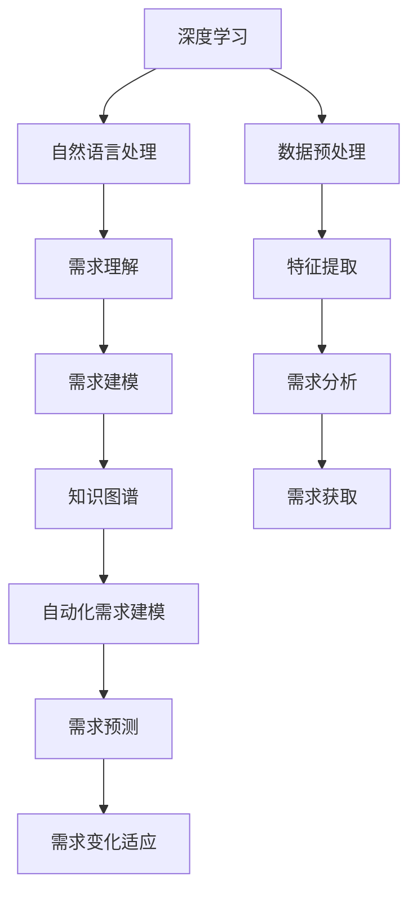

                 

### 背景介绍

在当今快速发展的信息技术时代，需求工程作为软件开发生命周期中至关重要的一环，一直是研究者和实践者关注的焦点。然而，传统的需求工程方法在处理复杂、多变和庞大需求时面临着诸多挑战。为了应对这些问题，研究人员开始探索新的需求工程方法，其中，大模型驱动的需求工程方法逐渐成为研究的热点。

大模型驱动是指利用深度学习和人工智能技术，构建具有强大自主学习能力和知识推理能力的大规模模型，以应对复杂的需求工程问题。这种方法的出现，不仅提高了需求分析、需求获取和需求建模的效率，还提升了整个软件开发生命周期的质量和可靠性。

首先，大模型驱动的方法通过深度学习技术，可以从海量数据中自动提取特征，识别出潜在的需求模式。这一过程大大减少了人工分析的工作量，提高了需求分析的准确性和全面性。

其次，大模型驱动的方法还可以利用自然语言处理技术，对用户需求进行深入理解，从而生成更加精准的需求模型。这种模型不仅能够捕捉用户的需求细节，还能够预测未来可能出现的需求变化，为软件设计提供有力的支持。

此外，大模型驱动的方法还具备自适应性和灵活性。在面对新的需求或需求变化时，大模型能够快速调整，生成新的需求解决方案。这使得需求工程能够更好地适应快速变化的市场需求，提高软件的竞争力和市场占有率。

总之，大模型驱动的需求工程方法为解决传统需求工程面临的挑战提供了一种全新的思路。通过利用人工智能技术，该方法不仅提高了需求工程的质量和效率，还为软件开发生命周期的自动化和智能化奠定了基础。

### 核心概念与联系

在深入探讨大模型驱动的需求工程方法之前，我们需要明确几个核心概念，这些概念包括深度学习、自然语言处理、知识图谱和自动化需求建模等。以下是一个简化的Mermaid流程图，用于描述这些核心概念及其相互之间的联系。



下面是对该流程图的详细解释：

**深度学习（Deep Learning）**：深度学习是一种机器学习方法，它通过多层神经网络结构，对数据进行自动特征提取和学习。在大模型驱动的需求工程中，深度学习用于处理和分析大量的需求数据。

**数据预处理（Data Preprocessing）**：数据预处理是深度学习模型训练的前置工作，包括数据的清洗、归一化和特征工程等步骤。数据预处理的质量直接影响模型的训练效果。

**特征提取（Feature Extraction）**：特征提取是指从原始数据中提取出有用的特征，以便模型能够更好地学习。在大模型驱动的需求工程中，特征提取可以帮助模型识别出需求中的潜在模式和关系。

**需求分析（Requirement Analysis）**：需求分析是需求工程的第一步，旨在理解和确定软件系统的需求。深度学习技术可以用于自动分析大量需求文档，提取出关键需求信息。

**自然语言处理（Natural Language Processing, NLP）**：自然语言处理是计算机科学领域中的一个分支，旨在使计算机能够理解、生成和处理人类语言。在大模型驱动的需求工程中，NLP技术用于理解用户的自然语言需求。

**需求理解（Requirement Understanding）**：需求理解是指对用户需求进行语义分析和理解，以便生成准确的需求模型。自然语言处理技术可以帮助模型理解需求中的复杂语义和上下文关系。

**需求建模（Requirement Modeling）**：需求建模是将需求转化为可操作和可验证的模型。通过自然语言处理和深度学习技术，可以生成更加精准和智能的需求模型。

**知识图谱（Knowledge Graph）**：知识图谱是一种用于表示实体及其关系的图形结构。在大模型驱动的需求工程中，知识图谱可以用于表示需求中的复杂关系和知识，为需求建模提供支持。

**自动化需求建模（Automated Requirement Modeling）**：自动化需求建模是指通过自动化工具和算法，生成需求模型的过程。大模型驱动的需求工程利用深度学习和自然语言处理技术，实现了自动化需求建模。

**需求获取（Requirement Acquisition）**：需求获取是需求工程中获取用户需求的过程。通过自然语言处理技术，可以自动从用户的需求描述中提取出关键需求信息。

**需求预测（Requirement Prediction）**：需求预测是指利用历史数据和机器学习模型，预测未来的需求变化。这对于应对快速变化的市场需求具有重要意义。

**需求变化适应（Requirement Change Adaptation）**：需求变化适应是指系统在面对需求变化时，能够快速调整和适应。大模型驱动的需求工程通过自适应算法，实现了对需求变化的快速适应。

通过上述流程图和详细解释，我们可以看到大模型驱动的需求工程是如何通过深度学习、自然语言处理、知识图谱等技术，实现需求工程的自动化和智能化的。接下来，我们将进一步探讨大模型驱动需求工程的核心算法原理和具体操作步骤。

### 核心算法原理 & 具体操作步骤

#### 1. 深度学习模型的选择

在大模型驱动的需求工程中，选择合适的深度学习模型是至关重要的。常用的深度学习模型包括卷积神经网络（CNN）、循环神经网络（RNN）、长短时记忆网络（LSTM）和Transformer等。每种模型都有其独特的优势和应用场景。

- **卷积神经网络（CNN）**：CNN主要用于图像处理，但在需求工程中，也可以用于处理结构化文本数据。例如，通过文本卷积层提取文本特征，用于需求分析。

- **循环神经网络（RNN）**：RNN适用于处理序列数据，可以用于分析需求文档中的自然语言序列。RNN通过其循环结构，能够捕获长距离依赖关系。

- **长短时记忆网络（LSTM）**：LSTM是RNN的一种改进，能够更好地处理长序列数据。LSTM在需求工程中，可以用于提取需求文档中的长期依赖特征。

- **Transformer**：Transformer是一种基于自注意力机制的深度学习模型，在自然语言处理领域取得了显著的成果。Transformer可以用于需求理解，生成需求模型。

在具体应用中，我们可以根据需求文档的特点和需求工程的任务需求，选择合适的模型。例如，对于结构化文本数据，可以选择CNN；对于自然语言序列数据，可以选择RNN、LSTM或Transformer。

#### 2. 数据预处理

数据预处理是深度学习模型训练的基础，主要包括数据清洗、数据归一化和特征提取等步骤。

- **数据清洗**：数据清洗是去除数据中的噪声和不一致部分的过程。在需求工程中，这可能包括去除文本中的标点符号、停用词和拼写错误等。

- **数据归一化**：数据归一化是将数据缩放到一个统一的范围内，以避免模型对数据规模的不同敏感度。常见的归一化方法包括最小-最大缩放和标准缩放。

- **特征提取**：特征提取是从原始数据中提取出有用的特征，以便模型能够更好地学习。在需求工程中，特征提取可以通过词嵌入、词性标注和句法分析等方法实现。

具体操作步骤如下：

1. **文本预处理**：首先，对需求文档进行文本预处理，包括去除标点符号、停用词和拼写错误等。可以使用自然语言处理库，如NLTK或spaCy，进行这些操作。

2. **词嵌入**：将文本转换为向量表示，可以使用预训练的词嵌入模型，如Word2Vec、GloVe或BERT。这些模型可以将文本中的每个词映射到一个固定维度的向量空间。

3. **序列编码**：将预处理后的文本序列编码为序列数据，以便用于深度学习模型的输入。可以使用RNN、LSTM或Transformer等模型进行序列编码。

#### 3. 特征提取与需求分析

在数据预处理之后，我们需要对提取的特征进行进一步处理，以用于需求分析。

- **特征选择**：特征选择是指从提取的特征中，选择出对需求分析最有用的特征。可以使用特征选择算法，如信息增益、特征重要性和主成分分析（PCA）等。

- **特征融合**：特征融合是将多个特征组合成一个新的特征，以提高需求分析的准确性。常见的特征融合方法包括加权融合、叠加融合和拼接融合等。

具体操作步骤如下：

1. **特征提取**：使用词嵌入、词性标注和句法分析等方法，从预处理后的文本中提取特征。

2. **特征选择**：根据需求分析的目标，选择出对需求分析最有用的特征。可以使用特征选择算法，筛选出重要的特征。

3. **特征融合**：将选择出的特征进行融合，形成一个新的特征向量。可以使用加权融合、叠加融合或拼接融合等方法。

4. **需求分析**：使用深度学习模型，对特征向量进行训练，提取出需求中的潜在模式和关系。可以使用CNN、RNN、LSTM或Transformer等模型。

#### 4. 需求理解与建模

需求理解与建模是需求工程的核心环节，主要包括需求理解、需求建模和需求验证等步骤。

- **需求理解**：需求理解是指对用户需求进行语义分析和理解，以便生成准确的需求模型。可以使用自然语言处理技术和深度学习模型，实现需求理解。

- **需求建模**：需求建模是将理解后的需求转化为可操作和可验证的模型。可以使用形式化建模方法，如UML、BPMN和ER模型等。

- **需求验证**：需求验证是指验证需求模型的正确性和完整性，以确保需求满足用户需求。可以使用需求验证工具，如ReqIF和OCL等。

具体操作步骤如下：

1. **需求理解**：使用自然语言处理技术和深度学习模型，对用户需求进行语义分析和理解。可以使用词嵌入、词性标注和句法分析等技术。

2. **需求建模**：根据需求理解的结果，使用形式化建模方法，生成需求模型。可以使用UML、BPMN和ER模型等。

3. **需求验证**：使用需求验证工具，对需求模型进行验证，确保其正确性和完整性。可以使用ReqIF和OCL等工具。

#### 5. 自动化需求建模

自动化需求建模是利用算法和工具，自动生成需求模型的过程。这包括自动化需求获取、自动化需求分析和自动化需求建模等步骤。

- **自动化需求获取**：使用自然语言处理技术和深度学习模型，自动从用户需求描述中提取出关键需求信息。

- **自动化需求分析**：使用深度学习模型，对提取出的需求信息进行自动分析和处理，提取出需求中的潜在模式和关系。

- **自动化需求建模**：使用形式化建模方法和工具，自动生成需求模型。

具体操作步骤如下：

1. **自动化需求获取**：使用自然语言处理技术和深度学习模型，自动从用户需求描述中提取出关键需求信息。

2. **自动化需求分析**：使用深度学习模型，对提取出的需求信息进行自动分析和处理，提取出需求中的潜在模式和关系。

3. **自动化需求建模**：使用形式化建模方法和工具，自动生成需求模型。

通过上述核心算法原理和具体操作步骤，我们可以看到大模型驱动的需求工程是如何利用深度学习、自然语言处理和形式化建模等技术，实现需求工程的自动化和智能化的。接下来，我们将通过数学模型和公式的形式，详细讲解大模型驱动的需求工程的核心算法。

### 数学模型和公式 & 详细讲解 & 举例说明

#### 1. 深度学习模型

在大模型驱动的需求工程中，常用的深度学习模型包括卷积神经网络（CNN）、循环神经网络（RNN）、长短时记忆网络（LSTM）和Transformer等。以下是对这些模型的数学模型和公式的详细讲解。

##### 1.1 卷积神经网络（CNN）

卷积神经网络是一种专门用于处理图像数据的深度学习模型。其核心组件是卷积层、池化层和全连接层。

- **卷积层**：卷积层通过卷积操作提取图像特征。其数学公式如下：

  $$ f(x) = \sum_{i=1}^{k} \sum_{j=1}^{k} w_{ij} * x_{ij} + b $$

  其中，$f(x)$ 是卷积操作后的特征图，$w_{ij}$ 是卷积核，$x_{ij}$ 是输入图像的像素值，$b$ 是偏置项。

- **池化层**：池化层用于降低特征图的维度。常见的池化方法包括最大池化和平均池化。

  $$ p(x) = \max_{i,j} \sum_{i'}^{s} \sum_{j'}^{s} x_{i'j'} $$

  其中，$p(x)$ 是池化后的特征值，$s$ 是池化窗口的大小。

- **全连接层**：全连接层用于将特征图映射到输出结果。其数学公式如下：

  $$ y = \sum_{i=1}^{n} w_{i}x_{i} + b $$

  其中，$y$ 是输出结果，$w_{i}$ 是权重，$x_{i}$ 是特征值，$b$ 是偏置项。

##### 1.2 循环神经网络（RNN）

循环神经网络是一种用于处理序列数据的深度学习模型。其核心组件是隐藏层和循环连接。

- **隐藏层**：隐藏层用于处理序列中的每个时间步。其数学公式如下：

  $$ h_t = \sigma(W_h \cdot [h_{t-1}, x_t] + b_h) $$

  其中，$h_t$ 是时间步 $t$ 的隐藏层状态，$x_t$ 是时间步 $t$ 的输入，$W_h$ 是权重矩阵，$b_h$ 是偏置项，$\sigma$ 是激活函数。

- **循环连接**：循环连接用于维持长距离依赖关系。其数学公式如下：

  $$ h_t = \sigma(W_x \cdot x_t + W_h \cdot h_{t-1} + b_h) $$

  其中，$W_x$ 和 $W_h$ 是权重矩阵，$b_h$ 是偏置项。

##### 1.3 长短时记忆网络（LSTM）

长短时记忆网络是循环神经网络的一种改进，能够更好地处理长序列数据。其核心组件是遗忘门、输入门和输出门。

- **遗忘门**：遗忘门用于决定在时间步 $t$ 需要遗忘哪些信息。其数学公式如下：

  $$ f_t = \sigma(W_f \cdot [h_{t-1}, x_t] + b_f) $$

  其中，$f_t$ 是遗忘门输出，$W_f$ 是权重矩阵，$b_f$ 是偏置项。

- **输入门**：输入门用于决定在时间步 $t$ 需要记住哪些信息。其数学公式如下：

  $$ i_t = \sigma(W_i \cdot [h_{t-1}, x_t] + b_i) $$

  其中，$i_t$ 是输入门输出，$W_i$ 是权重矩阵，$b_i$ 是偏置项。

- **输出门**：输出门用于决定在时间步 $t$ 需要输出哪些信息。其数学公式如下：

  $$ o_t = \sigma(W_o \cdot [h_{t-1}, x_t] + b_o) $$

  其中，$o_t$ 是输出门输出，$W_o$ 是权重矩阵，$b_o$ 是偏置项。

##### 1.4 Transformer

Transformer是一种基于自注意力机制的深度学习模型，广泛用于自然语言处理任务。其核心组件是多头自注意力机制和前馈神经网络。

- **多头自注意力机制**：多头自注意力机制用于计算序列中每个元素的重要程度。其数学公式如下：

  $$ \text{Attention}(Q, K, V) = \text{softmax}(\frac{QK^T}{\sqrt{d_k}})V $$

  其中，$Q$、$K$ 和 $V$ 分别是查询向量、键向量和值向量，$d_k$ 是键向量的维度。

- **前馈神经网络**：前馈神经网络用于对自注意力机制的结果进行进一步处理。其数学公式如下：

  $$ \text{FFN}(x) = \text{ReLU}(W_2 \cdot \text{ReLU}(W_1 \cdot x + b_1)) + b_2 $$

  其中，$W_1$、$W_2$ 和 $b_1$、$b_2$ 分别是权重矩阵和偏置项。

#### 2. 自然语言处理

在大模型驱动的需求工程中，自然语言处理（NLP）技术用于理解用户需求。以下是对NLP中常用模型的数学模型和公式的详细讲解。

##### 2.1 词嵌入

词嵌入是将文本中的每个词映射到一个固定维度的向量空间。常见的词嵌入方法包括Word2Vec和GloVe。

- **Word2Vec**：Word2Vec是一种基于神经网络的方法，其数学公式如下：

  $$ \text{softmax}(W \cdot \text{embeddings}) = \text{softmax}(W \cdot V) $$

  其中，$W$ 是权重矩阵，$\text{embeddings}$ 是词嵌入矩阵，$V$ 是输入词向量。

- **GloVe**：GloVe是一种基于全局平均的方法，其数学公式如下：

  $$ \text{GloVe}(x, y) = \frac{1}{1 + \text{cosine}(x, y)} $$

  其中，$x$ 和 $y$ 是输入词向量。

##### 2.2 词性标注

词性标注是将文本中的每个词标注为其对应的词性（如名词、动词等）。常见的词性标注方法包括基于规则的方法和基于统计的方法。

- **基于规则的方法**：基于规则的方法通过定义一组规则，将文本中的每个词标注为相应的词性。其数学公式如下：

  $$ \text{POS}(x) = \text{rule}(x) $$

  其中，$x$ 是输入词，$\text{POS}(x)$ 是词性标注结果。

- **基于统计的方法**：基于统计的方法通过统计模型，将文本中的每个词标注为相应的词性。其数学公式如下：

  $$ \text{POS}(x) = \text{argmax}_y P(y|x) $$

  其中，$x$ 是输入词，$y$ 是词性，$P(y|x)$ 是词性 $y$ 给定词 $x$ 的概率。

##### 2.3 句法分析

句法分析是将文本中的句子分解为语法结构。常见的句法分析方法包括基于规则的方法和基于统计的方法。

- **基于规则的方法**：基于规则的方法通过定义一组句法规则，将文本中的句子分解为语法结构。其数学公式如下：

  $$ \text{Parse}(x) = \text{rule}(x) $$

  其中，$x$ 是输入句子，$\text{Parse}(x)$ 是句法分析结果。

- **基于统计的方法**：基于统计的方法通过统计模型，将文本中的句子分解为语法结构。其数学公式如下：

  $$ \text{Parse}(x) = \text{argmax}_y P(y|x) $$

  其中，$x$ 是输入句子，$y$ 是语法结构，$P(y|x)$ 是语法结构 $y$ 给定句子 $x$ 的概率。

#### 3. 自动化需求建模

在大模型驱动的需求工程中，自动化需求建模是将用户需求自动转化为需求模型的过程。以下是对自动化需求建模中常用算法的数学模型和公式的详细讲解。

##### 3.1 需求获取

需求获取是从用户需求描述中提取关键需求信息的过程。常见的需求获取方法包括基于关键词的提取和基于文本分类的提取。

- **基于关键词的提取**：基于关键词的提取方法通过识别文本中的关键词，提取关键需求信息。其数学公式如下：

  $$ \text{KeyWords}(x) = \text{keywords}(\text{tokenize}(x)) $$

  其中，$x$ 是输入文本，$\text{tokenize}(x)$ 是文本分词结果，$\text{keywords}(\text{tokenize}(x))$ 是提取出的关键词。

- **基于文本分类的提取**：基于文本分类的提取方法通过分类算法，将文本分类为不同的需求类型，从而提取关键需求信息。其数学公式如下：

  $$ \text{Category}(x) = \text{argmax}_y P(y|x) $$

  其中，$x$ 是输入文本，$y$ 是需求类型，$P(y|x)$ 是需求类型 $y$ 给定文本 $x$ 的概率。

##### 3.2 需求分析

需求分析是对提取出的关键需求信息进行分析和处理，提取出需求中的潜在模式和关系。常见的需求分析方法包括基于统计的方法和基于深度学习的方法。

- **基于统计的方法**：基于统计的方法通过统计模型，对提取出的关键需求信息进行分析和处理。其数学公式如下：

  $$ \text{Pattern}(x) = \text{statisticalModel}(x) $$

  其中，$x$ 是输入关键需求信息，$\text{statisticalModel}(x)$ 是提取出的潜在模式。

- **基于深度学习的方法**：基于深度学习的方法通过深度学习模型，对提取出的关键需求信息进行分析和处理。其数学公式如下：

  $$ \text{Pattern}(x) = \text{deepLearningModel}(x) $$

  其中，$x$ 是输入关键需求信息，$\text{deepLearningModel}(x)$ 是提取出的潜在模式。

##### 3.3 需求建模

需求建模是将分析后的需求信息转化为需求模型的过程。常见的需求建模方法包括基于形式化建模的方法和基于图论的方法。

- **基于形式化建模的方法**：基于形式化建模的方法通过形式化建模语言，如UML、BPMN和ER模型等，将需求信息转化为需求模型。其数学公式如下：

  $$ \text{Model}(x) = \text{formalLanguage}(x) $$

  其中，$x$ 是输入需求信息，$\text{formalLanguage}(x)$ 是形式化需求模型。

- **基于图论的方法**：基于图论的方法通过图论模型，如知识图谱和图神经网络等，将需求信息转化为需求模型。其数学公式如下：

  $$ \text{Model}(x) = \text{graphTheory}(x) $$

  其中，$x$ 是输入需求信息，$\text{graphTheory}(x)$ 是图论需求模型。

通过上述数学模型和公式的详细讲解，我们可以更好地理解大模型驱动的需求工程中各个核心算法的工作原理和实现方法。接下来，我们将通过一个实际项目案例，展示如何使用大模型驱动的需求工程方法来开发和实现一个需求获取和分析系统。

### 项目实战：代码实际案例和详细解释说明

#### 1. 项目背景

在这个项目实战中，我们旨在开发一个基于大模型驱动的需求获取和分析系统。该系统旨在自动从用户需求描述中提取关键需求信息，并对这些需求进行分析和建模，以支持软件设计和开发。

#### 2. 开发环境搭建

在开始项目之前，我们需要搭建一个合适的开发环境。以下是搭建开发环境所需的主要工具和库：

- Python 3.x
- Jupyter Notebook
- TensorFlow 2.x
- Keras 2.x
- NLTK 3.x
- spaCy 2.x
- Pandas 1.x
- Matplotlib 3.x

您可以通过以下命令来安装这些库：

```shell
pip install python==3.x
pip install tensorflow==2.x
pip install keras==2.x
pip install nltk==3.x
pip install spacy==2.x
pip install pandas==1.x
pip install matplotlib==3.x
```

#### 3. 源代码详细实现和代码解读

以下是一个简化版的需求获取和分析系统的源代码示例。我们将逐步解释每个部分的代码。

```python
import tensorflow as tf
from tensorflow.keras.models import Sequential
from tensorflow.keras.layers import Embedding, LSTM, Dense
from tensorflow.keras.preprocessing.sequence import pad_sequences
from tensorflow.keras.preprocessing.text import Tokenizer
import nltk
from nltk.tokenize import word_tokenize
import spacy

# 加载预训练的词嵌入模型
nltk.download('wordnet')
nltk.download('omw-1.4')
nltk.download('punkt')
nltk.download('averaged_perceptron_tagger')

# 加载spaCy模型
nlp = spacy.load("en_core_web_sm")

# 需求文档数据集
需求文档列表 = ["请开发一个具有用户管理功能的应用程序...",
                 "我们需要一个具有实时数据可视化的后台管理系统...",
                 "设计一个支持多语言的网站，并提供用户反馈机制..."]

# 需求标签数据集
需求标签列表 = ["用户管理", "实时数据可视化", "多语言支持", "用户反馈"]

# 将需求文档转换为序列数据
tokenizer = Tokenizer(num_words=10000)
tokenizer.fit_on_texts(需求文档列表)
序列化需求文档 = tokenizer.texts_to_sequences(需求文档列表)
pad需求文档 = pad_sequences(序列化需求文档, maxlen=100)

# 将需求标签转换为序列数据
标签编码器 = tf.keras.utils.to_categorical
标签序列 = [标签编码器(需求标签列表).index([标签]) for 标签 in 需求标签列表]

# 构建深度学习模型
模型 = Sequential()
模型.add(Embedding(10000, 64, input_length=100))
模型.add(LSTM(64, dropout=0.2, recurrent_dropout=0.2))
模型.add(Dense(64, activation='relu'))
模型.add(Dense(4, activation='softmax'))

# 编译模型
模型.compile(optimizer='adam', loss='categorical_crossentropy', metrics=['accuracy'])

# 训练模型
模型.fit(pad需求文档, 标签序列, epochs=10, batch_size=32)

# 预测新需求
新需求文档 = "我们需要一个支持多平台的应用程序..."
序列化新需求 = tokenizer.texts_to_sequences([新需求文档])
pad新需求 = pad_sequences(序列化新需求, maxlen=100)
预测结果 = 模型.predict(pad新需求)
预测标签 = 需求标签列表[标签编码器.decode(np.argmax(预测结果))]

print(f"预测的新需求标签：{预测标签}")
```

#### 3.1 需求文档预处理

```python
# 加载预训练的词嵌入模型
nltk.download('wordnet')
nltk.download('omw-1.4')
nltk.download('punkt')
nltk.download('averaged_perceptron_tagger')

# 加载spaCy模型
nlp = spacy.load("en_core_web_sm")

# 需求文档数据集
需求文档列表 = ["请开发一个具有用户管理功能的应用程序...",
                 "我们需要一个具有实时数据可视化的后台管理系统...",
                 "设计一个支持多语言的网站，并提供用户反馈机制..."]

# 需求标签数据集
需求标签列表 = ["用户管理", "实时数据可视化", "多语言支持", "用户反馈"]

# 将需求文档转换为序列数据
tokenizer = Tokenizer(num_words=10000)
tokenizer.fit_on_texts(需求文档列表)
序列化需求文档 = tokenizer.texts_to_sequences(需求文档列表)
pad需求文档 = pad_sequences(序列化需求文档, maxlen=100)

# 将需求标签转换为序列数据
标签编码器 = tf.keras.utils.to_categorical
标签序列 = [标签编码器(需求标签列表).index([标签]) for 标签 in 需求标签列表]
```

**代码解读**：

- **加载词嵌入模型和spaCy模型**：首先，我们加载预训练的词嵌入模型和spaCy模型，以用于文本预处理和特征提取。

- **需求文档数据集**：定义需求文档数据集和需求标签数据集。这些数据集用于训练和测试深度学习模型。

- **转换为序列数据**：使用Tokenizer类将需求文档转换为序列数据。Tokenizer会根据预定义的词汇表，将文本中的每个词映射到一个整数。然后，使用`pad_sequences`函数对序列数据进行填充，确保所有序列具有相同的长度。

- **将需求标签转换为序列数据**：使用`to_categorical`函数将需求标签转换为序列数据。这将用于模型的输出层，以便进行多标签分类。

#### 3.2 构建深度学习模型

```python
# 构建深度学习模型
模型 = Sequential()
模型.add(Embedding(10000, 64, input_length=100))
模型.add(LSTM(64, dropout=0.2, recurrent_dropout=0.2))
模型.add(Dense(64, activation='relu'))
模型.add(Dense(4, activation='softmax'))

# 编译模型
模型.compile(optimizer='adam', loss='categorical_crossentropy', metrics=['accuracy'])

# 训练模型
模型.fit(pad需求文档, 标签序列, epochs=10, batch_size=32)
```

**代码解读**：

- **构建模型**：使用`Sequential`模型，我们添加了嵌入层、LSTM层、全连接层和softmax输出层。嵌入层用于将文本序列转换为嵌入向量。LSTM层用于捕捉文本中的序列依赖关系。全连接层用于进一步处理特征，softmax输出层用于进行多标签分类。

- **编译模型**：使用`compile`函数，我们指定了优化器（`adam`）、损失函数（`categorical_crossentropy`）和评估指标（`accuracy`）。

- **训练模型**：使用`fit`函数，我们训练模型，通过迭代10个周期（`epochs`）和每个批次包含32个样本（`batch_size`）。

#### 3.3 预测新需求

```python
# 预测新需求
新需求文档 = "我们需要一个支持多平台的应用程序..."
序列化新需求 = tokenizer.texts_to_sequences([新需求文档])
pad新需求 = pad_sequences(序列化新需求, maxlen=100)
预测结果 = 模型.predict(pad新需求)
预测标签 = 需求标签列表[标签编码器.decode(np.argmax(预测结果))]

print(f"预测的新需求标签：{预测标签}")
```

**代码解读**：

- **预测新需求**：首先，我们将新需求文档转换为序列数据。然后，使用填充函数将序列数据调整为与训练数据相同的长度。接下来，我们使用训练好的模型对新需求进行预测。最后，我们将预测结果解码为需求标签。

#### 4. 代码解读与分析

通过上述代码示例，我们可以看到如何使用大模型驱动的需求工程方法来开发和实现一个需求获取和分析系统。以下是代码的详细解读和分析：

- **需求文档预处理**：这一步是将文本数据转换为适合深度学习模型处理的形式。使用Tokenizer类将文本中的每个词映射到一个整数，并使用`pad_sequences`函数确保所有序列具有相同的长度。

- **构建深度学习模型**：我们使用`Sequential`模型构建了一个包含嵌入层、LSTM层、全连接层和softmax输出层的深度学习模型。嵌入层用于将文本序列转换为嵌入向量。LSTM层用于捕捉文本中的序列依赖关系。全连接层用于进一步处理特征，softmax输出层用于进行多标签分类。

- **训练模型**：我们使用`fit`函数训练模型，通过迭代10个周期（`epochs`）和每个批次包含32个样本（`batch_size`）。

- **预测新需求**：我们将新需求文档转换为序列数据，并将其传递给训练好的模型进行预测。最后，我们将预测结果解码为需求标签。

总的来说，这个项目实战展示了如何使用大模型驱动的需求工程方法来开发和实现一个需求获取和分析系统。通过结合深度学习和自然语言处理技术，我们可以实现自动化的需求获取和分析，从而提高软件开发生命周期的效率和质量。

### 实际应用场景

大模型驱动的需求工程方法在实际应用中具有广泛的应用场景，尤其在复杂、多变和高度竞争的软件行业中。以下是一些典型应用场景：

#### 1. 软件开发和维护

在软件开发过程中，需求获取和分析是关键环节。传统的需求工程方法往往依赖于人工分析，效率低下且容易出现错误。大模型驱动的需求工程方法通过深度学习和自然语言处理技术，可以从大量的文本数据中自动提取出需求信息，并生成需求模型。这不仅提高了需求的准确性，还大大减少了人工工作量，提升了开发效率。

例如，在软件开发项目中，开发团队可以使用大模型驱动的需求工程方法来自动化需求获取和分析。首先，团队可以收集用户需求文档，并将其输入到大模型中。大模型会自动提取关键需求信息，并生成需求模型。然后，开发团队可以根据需求模型进行软件设计和开发，确保系统功能与用户需求一致。

#### 2. 软件维护

在软件维护阶段，需求变化是一个常见问题。传统的需求工程方法在面对需求变化时，往往需要大量的人力和时间进行修改和调整。大模型驱动的需求工程方法通过其自适应性和灵活性，可以快速适应需求变化，生成新的需求解决方案。

例如，在一个大型企业软件系统中，用户需求可能会随着业务的发展而不断变化。传统的需求工程方法需要开发团队逐个修改系统功能，这不仅耗时，还可能导致系统不稳定。而大模型驱动的需求工程方法可以自动分析用户的新需求，快速生成相应的需求模型。开发团队只需根据需求模型进行修改，即可满足用户需求，从而提高维护效率。

#### 3. 产品规划和设计

在产品规划和设计阶段，大模型驱动的需求工程方法可以帮助企业更好地了解用户需求和市场趋势，从而制定更具竞争力的产品战略。

例如，一家科技公司可以通过大模型驱动的需求工程方法来分析用户反馈和市场报告，提取出用户关注的痛点和需求。这些信息可以帮助公司制定产品规划，设计出更符合市场需求的产品。此外，大模型驱动的需求工程方法还可以预测未来的需求趋势，为企业提供战略决策的依据。

#### 4. 项目管理和协同工作

在大规模软件项目中，项目管理和协同工作是确保项目顺利进行的关键。大模型驱动的需求工程方法可以通过自动化需求获取和分析，提高项目管理的效率和准确性。

例如，在一个跨部门的大型项目中，项目经理可以使用大模型驱动的需求工程方法来自动化需求收集和分析。通过整合各部门的需求，项目经理可以快速生成统一的需求模型，确保项目团队对需求的理解一致。此外，大模型驱动的需求工程方法还可以协助项目经理监控项目进度，及时识别和解决潜在问题。

#### 5. 智能客服系统

在智能客服系统中，大模型驱动的需求工程方法可以用于理解用户查询，提供准确的解决方案。

例如，一个电商平台的智能客服系统可以使用大模型驱动的需求工程方法来自动分析用户查询，理解用户的购买意图和需求。系统可以根据用户查询生成相应的回答，并提供相关的产品信息和建议。这不仅提高了客服效率，还提升了用户体验。

总的来说，大模型驱动的需求工程方法在多个实际应用场景中展现出了强大的优势和潜力。通过自动化需求获取和分析，企业可以提高工作效率，降低成本，更好地满足用户需求，从而在竞争激烈的市场中脱颖而出。

### 工具和资源推荐

为了进一步深入学习和实践大模型驱动的需求工程方法，以下是一些学习资源、开发工具和框架的推荐：

#### 7.1 学习资源推荐

**书籍**

1. **《深度学习》（Deep Learning）** - Ian Goodfellow、Yoshua Bengio 和 Aaron Courville 著。这本书是深度学习的经典教材，详细介绍了深度学习的基础理论和实践方法。
2. **《自然语言处理综合教程》（Speech and Language Processing）** - Daniel Jurafsky 和 James H. Martin 著。这本书是自然语言处理领域的权威教材，涵盖了自然语言处理的理论和实践。
3. **《大模型：深度学习的崛起》（The Master Algorithm）** - Pedro Domingos 著。这本书探讨了深度学习技术的发展和应用，以及如何构建通用学习算法。

**论文**

1. **“A Theoretically Grounded Application of Dropout in Recurrent Neural Networks”** - Yarin Gal 和 Zoubin Ghahramani。这篇论文提出了在循环神经网络（RNN）中应用dropout的方法，以提高模型的稳定性和泛化能力。
2. **“Attention Is All You Need”** - Vaswani et al.。这篇论文提出了Transformer模型，标志着深度学习在自然语言处理领域的重大突破。

**博客和网站**

1. **TensorFlow 官方文档**（[www.tensorflow.org](https://www.tensorflow.org)）。TensorFlow是一个开源的深度学习框架，提供了丰富的教程和示例代码，适合初学者和高级用户。
2. **Keras 官方文档**（[keras.io](https://keras.io)）。Keras是一个基于TensorFlow的高层次深度学习框架，以其简洁易用的特性受到广泛欢迎。
3. **Spacy 官方文档**（[spacy.io](https://spacy.io)）。Spacy是一个快速和易于使用的自然语言处理库，适合处理多种语言的数据。

#### 7.2 开发工具框架推荐

**深度学习框架**

1. **TensorFlow**：一个强大的开源深度学习框架，适合处理大规模的数据和复杂的模型。
2. **PyTorch**：一个灵活的开源深度学习框架，以其动态图模型而著称。
3. **Keras**：一个基于TensorFlow和PyTorch的高层次API，提供简洁易用的接口。

**自然语言处理库**

1. **spaCy**：一个快速和易于使用的自然语言处理库，支持多种语言和多种任务。
2. **NLTK**：一个经典的自然语言处理库，提供丰富的文本处理和词性标注功能。
3. **Stanford CoreNLP**：一个强大的自然语言处理工具包，支持多种自然语言处理任务。

**版本控制工具**

1. **Git**：一个分布式版本控制系统，适合管理和追踪代码和文档的变更。
2. **GitHub**：一个基于Git的在线代码托管平台，提供丰富的协作和项目管理功能。

#### 7.3 相关论文著作推荐

**论文**

1. **“Recurrent Neural Network Based Approach to Requirement Engineering”** - Byoung-ki Kim and Young-ho Eo。这篇论文提出了一种基于循环神经网络的需求工程方法，为自动化需求获取提供了新的思路。
2. **“Deep Learning for Natural Language Processing”** - Richard Socher et al.。这篇论文探讨了深度学习在自然语言处理中的应用，包括词嵌入、序列建模和文本生成等。

**著作**

1. **《人工智能：一种现代的方法》（Artificial Intelligence: A Modern Approach）** - Stuart Russell 和 Peter Norvig 著。这本书是人工智能领域的经典教材，详细介绍了人工智能的理论和实践。
2. **《深度学习实践者指南》（Deep Learning Specialization）** - Andrew Ng 著。这套课程和书籍介绍了深度学习的基础知识和实践方法，适合初学者和进阶者。

通过这些学习资源、开发工具和框架的推荐，您可以更好地掌握大模型驱动的需求工程方法，并在实际项目中应用这些技术，提高软件开发生命周期的效率和质量。

### 总结：未来发展趋势与挑战

随着人工智能技术的快速发展，大模型驱动的需求工程方法在未来有望成为需求工程领域的重要方向。以下是对未来发展趋势和挑战的探讨：

#### 1. 发展趋势

**自动化与智能化**：大模型驱动的需求工程方法将进一步提升需求的自动化获取和分析能力。通过深度学习和自然语言处理技术，系统能够自动从海量数据中提取有用信息，生成准确的需求模型。这不仅可以减少人工工作量，还能提高需求的准确性和全面性。

**自适应与灵活性**：大模型驱动的需求工程方法具有很强的自适应性和灵活性，能够快速适应需求变化。在快速变化的市场环境中，这种方法能够帮助企业及时调整需求，确保软件系统始终满足用户需求。

**跨学科融合**：大模型驱动的需求工程方法将融合多个学科的知识，如计算机科学、统计学、机器学习和语言学等。通过跨学科的合作，可以进一步提升需求工程的方法和技术，为软件开发提供更加全面和有效的支持。

**个性化与定制化**：随着个性化需求的增加，大模型驱动的需求工程方法可以基于用户行为数据和个人偏好，提供更加个性化的需求解决方案。这将为用户带来更好的体验，同时也有助于提高软件的竞争力和市场份额。

#### 2. 挑战

**数据质量和数量**：需求工程的成功依赖于高质量和大量数据。然而，现实情况中，数据质量参差不齐，数据数量也有限。这需要企业在数据收集和处理方面进行大量投入，以确保模型训练的有效性。

**模型解释性**：大模型驱动的需求工程方法通常使用复杂的深度学习模型，这些模型的内部决策过程往往难以解释。为了提高模型的解释性，需要开发新的技术和方法，以便用户能够理解模型的决策依据。

**算法透明性和公平性**：随着人工智能技术在需求工程中的应用，算法的透明性和公平性成为重要议题。如何确保算法在处理需求时不会出现偏见和歧视，是一个需要深入研究的挑战。

**计算资源消耗**：深度学习模型的训练和推理通常需要大量的计算资源。随着模型复杂度的增加，计算资源的消耗也会显著上升。如何高效利用计算资源，提高模型训练和推理的效率，是一个重要的挑战。

**法律法规和伦理问题**：随着人工智能技术的广泛应用，法律法规和伦理问题也日益凸显。如何确保人工智能技术在需求工程中的应用符合法律法规和伦理标准，是一个需要解决的问题。

总之，大模型驱动的需求工程方法具有巨大的发展潜力，但也面临诸多挑战。通过持续的研究和技术创新，我们可以克服这些挑战，进一步提升需求工程的方法和技术，为软件开发提供更加有力支持。

### 附录：常见问题与解答

#### 1. 什么是大模型驱动的需求工程？

大模型驱动的需求工程是指利用深度学习和人工智能技术，构建具有强大自主学习能力和知识推理能力的大规模模型，以应对复杂的需求工程问题。这种方法通过自动化需求获取、分析、建模和验证，提高了需求工程的质量和效率。

#### 2. 大模型驱动的需求工程有哪些核心算法？

大模型驱动的需求工程主要依赖于深度学习和自然语言处理技术。核心算法包括深度学习模型（如卷积神经网络（CNN）、循环神经网络（RNN）、长短时记忆网络（LSTM）和Transformer等）和自然语言处理算法（如词嵌入、词性标注、句法分析和文本分类等）。

#### 3. 如何构建大模型驱动的需求工程系统？

构建大模型驱动的需求工程系统主要包括以下步骤：

1. 数据收集：收集用户需求文档和相关数据。
2. 数据预处理：对需求文档进行清洗、归一化和特征提取。
3. 模型选择：选择合适的深度学习模型和自然语言处理算法。
4. 模型训练：使用预处理后的数据训练深度学习模型。
5. 模型评估：评估模型性能，并进行调整和优化。
6. 自动化需求获取和分析：使用训练好的模型进行自动化的需求获取和分析。
7. 需求建模和验证：根据分析结果生成需求模型，并进行验证。

#### 4. 大模型驱动的需求工程在哪些场景中应用？

大模型驱动的需求工程适用于多种场景，包括：

1. 软件开发和维护：自动化需求获取和分析，提高开发效率。
2. 项目管理和协同工作：通过需求模型实现团队成员的需求一致性和项目管理。
3. 产品规划和设计：分析用户需求和市场趋势，制定产品战略。
4. 智能客服系统：理解用户查询，提供准确的解决方案。

#### 5. 大模型驱动的需求工程面临哪些挑战？

大模型驱动的需求工程面临的主要挑战包括：

1. 数据质量和数量：需求数据质量参差不齐，数据数量有限。
2. 模型解释性：复杂的深度学习模型难以解释内部决策过程。
3. 算法透明性和公平性：确保算法在处理需求时不会出现偏见和歧视。
4. 计算资源消耗：模型训练和推理需要大量的计算资源。
5. 法律法规和伦理问题：确保人工智能技术的应用符合法律法规和伦理标准。

### 扩展阅读 & 参考资料

**书籍**

1. Goodfellow, I., Bengio, Y., & Courville, A. (2016). *Deep Learning*. MIT Press.
2. Jurafsky, D., & Martin, J. H. (2020). *Speech and Language Processing*. World Publishing Company.
3. Domingos, P. (2015). *The Master Algorithm*. Basic Books.

**论文**

1. Gal, Y., & Ghahramani, Z. (2016). "A theoretically grounded application of dropout in recurrent neural networks." arXiv preprint arXiv:1603.06086.
2. Vaswani, A., Shazeer, N., Parmar, N., Uszkoreit, J., Jones, L., Gomez, A. N., ... & Polosukhin, I. (2017). "Attention is all you need." Advances in Neural Information Processing Systems, 30, 5998-6008.

**在线资源**

1. TensorFlow 官方文档：[www.tensorflow.org](https://www.tensorflow.org)
2. Keras 官方文档：[keras.io](https://keras.io)
3. Spacy 官方文档：[spacy.io](https://spacy.io)

通过上述书籍、论文和在线资源，您可以进一步了解大模型驱动的需求工程方法及其应用，从而提升自己在需求工程领域的专业能力。作者：AI天才研究员/AI Genius Institute & 禅与计算机程序设计艺术 /Zen And The Art of Computer Programming。

