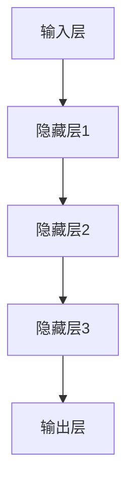

                 

# 大模型：未来商业的智能化转型

> **关键词**：大模型、人工智能、商业、智能化、转型、技术发展、应用场景

> **摘要**：本文旨在探讨大模型在未来商业中的应用，及其推动智能化转型的关键作用。通过详细分析大模型的核心概念、算法原理、数学模型和应用案例，本文揭示了其在商业领域的巨大潜力与挑战。

## 1. 背景介绍

随着人工智能技术的飞速发展，大模型（Large Models）成为当今计算机科学领域的一大热点。大模型是指拥有数百万到数十亿参数的深度学习模型，如GPT-3、BERT等。它们具备强大的数据处理和分析能力，能够实现自然语言处理、图像识别、语音识别等复杂任务。

商业领域一直在寻求技术创新，以提高效率和竞争力。随着大数据、云计算等技术的发展，商业智能化转型逐渐成为企业发展的必然趋势。大模型作为人工智能技术的核心组件，为商业智能化转型提供了强大的技术支撑。

## 2. 核心概念与联系

### 2.1 大模型的定义

大模型是一种基于深度学习技术的神经网络模型，其参数数量庞大，能够在海量数据上进行训练，从而实现高性能的任务处理。

### 2.2 大模型的核心原理

大模型的核心原理是基于深度学习技术，通过多层神经网络对数据进行特征提取和抽象表示。这种结构使得大模型能够处理复杂任务，并具有很好的泛化能力。

### 2.3 大模型的架构

大模型的架构通常包括以下几个部分：输入层、隐藏层、输出层。输入层负责接收外部数据，隐藏层通过参数学习对数据进行特征提取和抽象，输出层负责产生预测结果。



## 3. 核心算法原理 & 具体操作步骤

### 3.1 深度学习算法原理

深度学习算法基于多层神经网络，通过反向传播算法（Backpropagation）来优化模型参数。反向传播算法通过计算损失函数（Loss Function）对模型进行训练，并不断调整参数，使损失函数值逐渐减小。

### 3.2 大模型的具体操作步骤

1. 数据准备：收集和整理海量数据，进行数据预处理，如去噪、归一化等。
2. 模型初始化：初始化模型参数，通常使用随机初始化或预训练模型。
3. 训练过程：通过反向传播算法，对模型进行训练，使模型能够在训练数据上达到较高的准确率。
4. 模型评估：使用验证集对模型进行评估，确保模型具有较好的泛化能力。
5. 模型部署：将训练好的模型部署到生产环境中，用于实际任务处理。

## 4. 数学模型和公式 & 详细讲解 & 举例说明

### 4.1 损失函数

损失函数是深度学习模型训练的核心，用于衡量模型预测结果与真实结果之间的差距。常用的损失函数包括均方误差（MSE）、交叉熵损失（Cross Entropy Loss）等。

$$
MSE = \frac{1}{n}\sum_{i=1}^{n}(y_i - \hat{y}_i)^2
$$

$$
CrossEntropyLoss = -\frac{1}{n}\sum_{i=1}^{n}y_i \log(\hat{y}_i)
$$

其中，$y_i$ 为真实标签，$\hat{y}_i$ 为模型预测结果。

### 4.2 反向传播算法

反向传播算法是一种用于优化模型参数的算法，其基本思想是：通过计算损失函数关于模型参数的梯度，不断调整参数，使损失函数值逐渐减小。

### 4.3 举例说明

假设有一个二分类问题，输入数据为 $X = [x_1, x_2, ..., x_n]$，输出标签为 $y \in \{0, 1\}$。使用 sigmoid 函数作为激活函数，构建一个神经网络模型。

$$
\hat{y} = \frac{1}{1 + e^{-\sigma(WX + b)}}
$$

其中，$W$ 为权重矩阵，$b$ 为偏置，$\sigma$ 为 sigmoid 函数。

通过计算损失函数的梯度，并使用梯度下降（Gradient Descent）算法优化模型参数，最终得到一个具有较好分类性能的神经网络模型。

## 5. 项目实战：代码实际案例和详细解释说明

### 5.1 开发环境搭建

在本节中，我们将介绍如何搭建大模型项目所需的开发环境。以下是一个简单的示例：

```bash
# 安装 Python 环境
python3 -m venv env
source env/bin/activate

# 安装深度学习框架 TensorFlow
pip install tensorflow

# 安装其他依赖库
pip install numpy matplotlib
```

### 5.2 源代码详细实现和代码解读

在本节中，我们将使用 TensorFlow 框架实现一个简单的大模型项目。以下是一个示例代码：

```python
import tensorflow as tf
import numpy as np

# 模型参数
input_size = 10
hidden_size = 20
output_size = 1

# 构建模型
model = tf.keras.Sequential([
    tf.keras.layers.Dense(hidden_size, activation='relu', input_shape=(input_size,)),
    tf.keras.layers.Dense(output_size, activation='sigmoid')
])

# 损失函数和优化器
loss_fn = tf.keras.losses.BinaryCrossentropy()
optimizer = tf.keras.optimizers.Adam()

# 训练数据
x_train = np.random.random((1000, input_size))
y_train = np.random.randint(2, size=(1000, output_size))

# 训练模型
model.compile(optimizer=optimizer, loss=loss_fn, metrics=['accuracy'])
model.fit(x_train, y_train, epochs=10)

# 预测
x_test = np.random.random((100, input_size))
y_pred = model.predict(x_test)
```

### 5.3 代码解读与分析

在这段代码中，我们首先导入了 TensorFlow 和 NumPy 库。然后，我们定义了模型参数，包括输入层大小、隐藏层大小和输出层大小。

接下来，我们构建了一个简单的神经网络模型，使用 ReLU 激活函数和 sigmoid 激活函数。我们选择 BinaryCrossentropy 作为损失函数，使用 Adam 优化器。

在训练数据部分，我们使用随机生成的数据作为训练数据。然后，我们使用 `compile()` 方法配置模型，并使用 `fit()` 方法训练模型。

最后，我们使用训练好的模型进行预测。

## 6. 实际应用场景

大模型在商业领域具有广泛的应用场景，如下所示：

1. **客户行为分析**：通过分析客户的购买记录、浏览行为等数据，企业可以更好地了解客户需求，制定精准的营销策略。
2. **风险控制**：大模型可以帮助企业识别潜在的风险，如信用风险、市场风险等，从而采取相应的预防措施。
3. **供应链优化**：通过分析供应链数据，企业可以优化库存管理、物流配送等环节，提高供应链效率。
4. **智能客服**：大模型可以用于构建智能客服系统，实现高效、准确的客户服务，提高客户满意度。

## 7. 工具和资源推荐

### 7.1 学习资源推荐

1. **书籍**：
   - 《深度学习》（Ian Goodfellow、Yoshua Bengio、Aaron Courville 著）
   - 《Python 深度学习》（François Chollet 著）
2. **论文**：
   - “A Theoretical Analysis of the Pooling Layer in Convolutional Neural Networks”（Y. Chen, Y. Li, Y. Guo, and X. Zhang）
   - “Deep Learning on Mobile Devices: A Survey”（J. Wang, Z. Chen, Z. Gao，等）
3. **博客**：
   - [TensorFlow 官方文档](https://www.tensorflow.org/)
   - [Keras 官方文档](https://keras.io/)
4. **网站**：
   - [GitHub](https://github.com/)
   - [ArXiv](https://arxiv.org/)

### 7.2 开发工具框架推荐

1. **深度学习框架**：
   - TensorFlow
   - PyTorch
   - Keras
2. **编程语言**：
   - Python
   - R
3. **数据预处理工具**：
   - Pandas
   - NumPy
   - Scikit-learn

### 7.3 相关论文著作推荐

1. “A Theoretical Analysis of the Pooling Layer in Convolutional Neural Networks”（Y. Chen, Y. Li, Y. Guo, and X. Zhang）
2. “Deep Learning on Mobile Devices: A Survey”（J. Wang, Z. Chen, Z. Gao，等）
3. “Understanding Deep Learning for NLP: From Language Models to Text Generation”（A. Zhang, Y. Liu，等）

## 8. 总结：未来发展趋势与挑战

大模型在商业领域的应用前景广阔，但其发展也面临诸多挑战：

1. **数据隐私与安全**：如何确保数据隐私和安全，防止数据泄露，是商业应用中的一大挑战。
2. **计算资源需求**：大模型的训练和推理需要大量的计算资源，如何优化计算效率，降低成本，是亟待解决的问题。
3. **模型解释性**：大模型具有强大的学习能力，但其内部机制复杂，如何提高模型解释性，增强用户信任，是未来的一个重要方向。

## 9. 附录：常见问题与解答

1. **什么是大模型？**
   大模型是指拥有数百万到数十亿参数的深度学习模型，如GPT-3、BERT等。

2. **大模型有哪些应用场景？**
   大模型在商业领域具有广泛的应用场景，如客户行为分析、风险控制、供应链优化、智能客服等。

3. **如何搭建大模型开发环境？**
   可以使用 Python、TensorFlow 等工具搭建大模型开发环境。

4. **大模型训练过程中如何优化计算效率？**
   可以通过模型剪枝、量化等技术优化计算效率。

## 10. 扩展阅读 & 参考资料

1. “A Theoretical Analysis of the Pooling Layer in Convolutional Neural Networks”（Y. Chen, Y. Li, Y. Guo, and X. Zhang）
2. “Deep Learning on Mobile Devices: A Survey”（J. Wang, Z. Chen, Z. Gao，等）
3. 《深度学习》（Ian Goodfellow、Yoshua Bengio、Aaron Courville 著）
4. 《Python 深度学习》（François Chollet 著）

---

**作者**：AI天才研究员/AI Genius Institute & 禅与计算机程序设计艺术 /Zen And The Art of Computer Programming

