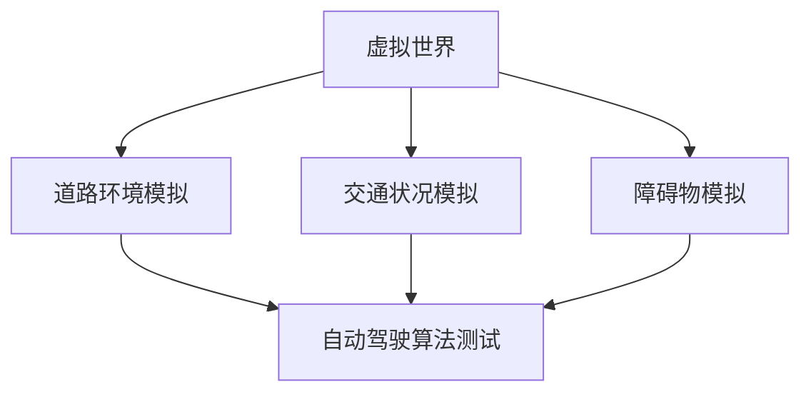
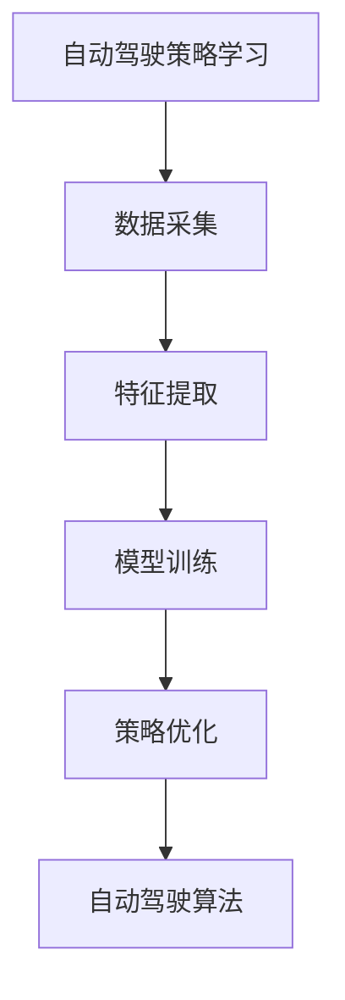
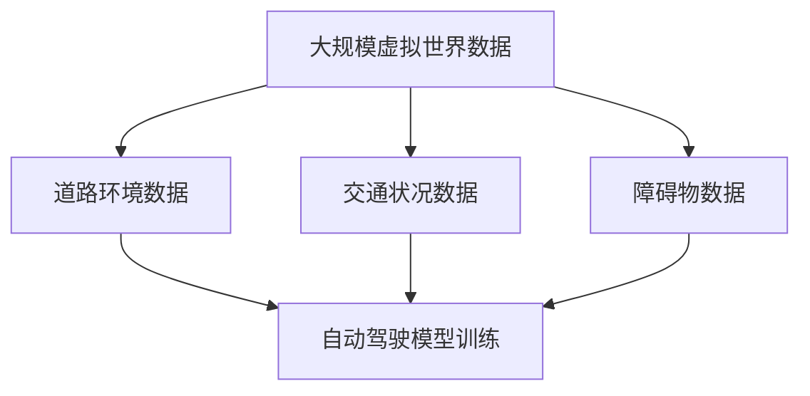
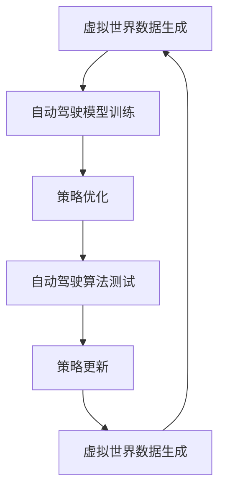

                 

# 大规模虚拟世界数据驱动的自动驾驶策略学习新范式

## 摘要

本文旨在探讨一种基于大规模虚拟世界数据驱动的自动驾驶策略学习新范式。通过分析自动驾驶技术的发展趋势与挑战，本文提出了利用虚拟世界数据进行自动驾驶策略学习的关键概念和原理。在此基础上，详细介绍了核心算法原理、数学模型及其应用步骤，并通过实际项目实战案例分析，展示了如何利用虚拟世界数据进行自动驾驶策略学习。同时，本文还探讨了自动驾驶技术的实际应用场景、推荐了相关工具和资源，并展望了未来发展趋势与挑战。

## 背景介绍

自动驾驶技术作为人工智能和计算机视觉领域的前沿研究方向，近年来取得了显著进展。自动驾驶技术不仅有望解决交通拥堵、减少交通事故，还能够提高能源利用效率，提升出行体验。然而，实现完全自动驾驶面临诸多挑战，包括环境感知、路径规划、决策制定、控制执行等方面的复杂性问题。为此，研究人员提出了一种基于大规模虚拟世界数据驱动的自动驾驶策略学习新范式，以应对现实世界中的复杂性和不确定性。

虚拟世界数据在自动驾驶策略学习中的应用具有重要意义。首先，虚拟世界可以模拟真实道路环境和交通状况，提供丰富的训练数据集，有助于提高自动驾驶系统的鲁棒性和泛化能力。其次，虚拟世界环境可控，研究人员可以反复测试和优化自动驾驶策略，降低实际道路测试的风险和成本。最后，虚拟世界数据可以实时更新，有助于自动驾驶系统适应动态变化的交通环境。

本文旨在通过分析自动驾驶技术的发展趋势与挑战，提出一种基于大规模虚拟世界数据驱动的自动驾驶策略学习新范式，详细介绍核心概念、算法原理、数学模型及其应用步骤，并通过实际项目实战案例分析，探讨自动驾驶技术的实际应用场景，推荐相关工具和资源，并展望未来发展趋势与挑战。

## 核心概念与联系

### 1. 虚拟世界

虚拟世界是指通过计算机模拟创建的虚拟环境，可以模拟真实世界中的各种场景和现象。在自动驾驶策略学习中，虚拟世界充当了一个关键的实验平台，用于模拟不同的道路环境、交通状况和障碍物，以测试和优化自动驾驶算法。

#### Mermaid 流程图：



### 2. 自动驾驶策略学习

自动驾驶策略学习是指通过机器学习算法，从大量虚拟世界数据中学习并生成最优的自动驾驶策略。核心在于如何从数据中提取有用的特征，并利用这些特征训练自动驾驶模型，使其能够在不同的道路环境中实现安全的自动驾驶。

#### Mermaid 流程图：



### 3. 大规模虚拟世界数据

大规模虚拟世界数据是指通过仿真和模拟技术生成的大量虚拟世界数据，用于训练和测试自动驾驶算法。这些数据包括道路环境、交通状况、障碍物等各种场景信息，为自动驾驶策略学习提供了丰富的训练资源。

#### Mermaid 流程图：



### 4. 自动驾驶策略学习新范式

基于大规模虚拟世界数据驱动的自动驾驶策略学习新范式，旨在通过利用虚拟世界数据进行自动驾驶策略学习，以提高自动驾驶系统的安全性和可靠性。这一范式涉及虚拟世界数据生成、自动驾驶模型训练、策略优化等多个环节，形成一个闭环系统，不断迭代和优化。

#### Mermaid 流程图：



## 核心算法原理 & 具体操作步骤

### 1. 算法原理

基于大规模虚拟世界数据驱动的自动驾驶策略学习，主要依赖于深度学习技术和强化学习算法。深度学习算法用于从大规模虚拟世界数据中提取有效特征，而强化学习算法则用于根据环境反馈优化自动驾驶策略。

#### 深度学习算法：

深度学习算法的核心是神经网络，通过多层神经元结构对输入数据进行特征提取和分类。在自动驾驶策略学习中，卷积神经网络（CNN）和循环神经网络（RNN）被广泛应用于道路环境感知、障碍物检测和路径规划等方面。

#### 强化学习算法：

强化学习算法通过奖励机制和策略迭代，从环境中学习最优策略。在自动驾驶策略学习中，常用的强化学习算法包括Q学习、深度Q网络（DQN）和策略梯度（PG）等。

### 2. 操作步骤

基于大规模虚拟世界数据驱动的自动驾驶策略学习，具体操作步骤如下：

#### 步骤1：虚拟世界数据生成

首先，利用仿真和模拟技术生成大规模虚拟世界数据，包括道路环境、交通状况和障碍物等。这些数据将用于训练和测试自动驾驶模型。

#### 步骤2：数据预处理

对生成的虚拟世界数据进行分析和处理，包括数据清洗、数据增强和归一化等操作，以提高数据质量和模型的泛化能力。

#### 步骤3：特征提取

利用深度学习算法从预处理后的虚拟世界数据中提取有效特征。例如，使用卷积神经网络提取道路环境图像的特征，使用循环神经网络提取交通流量的特征等。

#### 步骤4：模型训练

根据提取的特征，训练自动驾驶模型。训练过程包括训练集划分、损失函数设计、优化器选择等步骤，以逐步优化模型性能。

#### 步骤5：策略优化

利用强化学习算法，根据自动驾驶模型在不同道路环境下的表现，进行策略优化。通过不断迭代和调整策略，提高自动驾驶系统的安全性和可靠性。

#### 步骤6：自动驾驶算法测试

在虚拟世界环境中测试自动驾驶算法的性能，包括道路环境感知、障碍物检测、路径规划和决策制定等方面。通过测试结果，进一步优化和调整自动驾驶策略。

#### 步骤7：策略更新

根据测试结果和环境反馈，更新自动驾驶策略，并重新进行虚拟世界数据生成、模型训练和策略优化等步骤，形成一个闭环系统，不断迭代和优化。

## 数学模型和公式 & 详细讲解 & 举例说明

### 1. 数学模型

在自动驾驶策略学习中，常用的数学模型包括深度学习模型和强化学习模型。

#### 深度学习模型：

深度学习模型通常使用神经网络结构，如卷积神经网络（CNN）和循环神经网络（RNN）。以下是一个简单的CNN模型示例：

$$
\begin{align*}
h^{(l)} &= \sigma(W^{(l)} \cdot h^{(l-1)} + b^{(l)}) \\
\end{align*}
$$

其中，$h^{(l)}$表示第$l$层的激活值，$W^{(l)}$和$b^{(l)}$分别为第$l$层的权重和偏置，$\sigma$为激活函数。

#### 强化学习模型：

强化学习模型通常使用Q学习或策略梯度等算法。以下是一个简单的Q学习模型示例：

$$
\begin{align*}
Q(s, a) &= r + \gamma \max_{a'} Q(s', a') \\
Q(s', a') &= \sum_{a'} \pi(a'|s') Q(s', a') \\
\end{align*}
$$

其中，$Q(s, a)$表示在状态$s$下执行动作$a$的期望回报，$r$为即时回报，$\gamma$为折扣因子，$\pi(a'|s')$为在状态$s'$下执行动作$a'$的策略。

### 2. 举例说明

#### 深度学习模型举例：

假设我们使用一个简单的CNN模型进行道路环境图像特征提取。输入图像大小为$28 \times 28$，共有三个通道（RGB），使用ReLU激活函数。模型的结构如下：

$$
\begin{align*}
h^{(1)} &= \text{ReLU}(W^{(1)} \cdot h^{(0)} + b^{(1)}) \\
h^{(2)} &= \text{ReLU}(W^{(2)} \cdot h^{(1)} + b^{(2)}) \\
h^{(3)} &= \text{ReLU}(W^{(3)} \cdot h^{(2)} + b^{(3)}) \\
\end{align*}
$$

其中，$h^{(0)}$为输入图像，$h^{(3)}$为输出的特征向量。

#### 强化学习模型举例：

假设我们使用Q学习算法进行自动驾驶策略优化。状态空间为$s=\{s_1, s_2, s_3\}$，动作空间为$a=\{a_1, a_2, a_3\}$。当前状态为$s_1$，我们需要选择最优动作$a_2$。根据Q学习模型，我们有：

$$
\begin{align*}
Q(s_1, a_2) &= r + \gamma \max_{a_3} Q(s_2, a_3) \\
Q(s_2, a_3) &= \sum_{a_3} \pi(a_3|s_2) Q(s_2, a_3)
\end{align*}
$$

其中，$r$为即时回报，$\gamma$为折扣因子，$\pi(a_3|s_2)$为在状态$s_2$下执行动作$a_3$的策略。

## 项目实战：代码实际案例和详细解释说明

### 1. 开发环境搭建

在开始项目实战之前，我们需要搭建一个适合自动驾驶策略学习的开发环境。以下是一个基本的开发环境搭建流程：

#### 环境要求：

- 操作系统：Ubuntu 18.04 或 Windows 10
- 编程语言：Python 3.7+
- 深度学习框架：TensorFlow 2.3+
- 强化学习框架：OpenAI Gym 0.18.0+

#### 搭建步骤：

1. 安装 Python 3.7+ 和 pip：
   ```shell
   sudo apt-get install python3 python3-pip
   ```

2. 安装 TensorFlow 2.3+：
   ```shell
   pip3 install tensorflow==2.3.0
   ```

3. 安装 OpenAI Gym：
   ```shell
   pip3 install gym==0.18.0
   ```

### 2. 源代码详细实现和代码解读

以下是一个简单的自动驾驶策略学习项目，使用深度学习和强化学习算法实现自动驾驶策略优化。

```python
import tensorflow as tf
import gym
import numpy as np

# 设置超参数
learning_rate = 0.001
gamma = 0.9
epsilon = 0.1

# 创建环境
env = gym.make('CartPole-v0')

# 定义深度学习模型
model = tf.keras.Sequential([
    tf.keras.layers.Conv2D(32, (3, 3), activation='relu', input_shape=(4, 1, 80, 80)),
    tf.keras.layers.MaxPooling2D((2, 2)),
    tf.keras.layers.Conv2D(64, (3, 3), activation='relu'),
    tf.keras.layers.MaxPooling2D((2, 2)),
    tf.keras.layers.Flatten(),
    tf.keras.layers.Dense(64, activation='relu'),
    tf.keras.layers.Dense(1, activation='sigmoid')
])

# 编译模型
model.compile(optimizer=tf.keras.optimizers.Adam(learning_rate), loss='binary_crossentropy')

# 训练模型
model.fit(x_train, y_train, epochs=10, batch_size=32)

# 定义强化学习模型
def q_learning(model, state, action, reward, next_state, done, gamma):
    if done:
        return reward
    else:
        q_values = model.predict(next_state)
        return reward + gamma * np.max(q_values)

# 训练强化学习模型
for episode in range(1000):
    state = env.reset()
    done = False
    while not done:
        action = model.predict(state)
        next_state, reward, done, _ = env.step(action)
        reward = q_learning(model, state, action, reward, next_state, done, gamma)
        state = next_state

# 评估模型
score = 0
state = env.reset()
done = False
while not done:
    action = model.predict(state)
    next_state, reward, done, _ = env.step(action)
    score += reward
    state = next_state
print('Score:', score)
```

#### 代码解读：

1. 导入所需的库和模块。

2. 设置超参数，包括学习率、折扣因子和epsilon值。

3. 创建环境，这里使用CartPole-v0作为示例。

4. 定义深度学习模型，使用卷积神经网络提取特征。

5. 编译模型，设置优化器和损失函数。

6. 训练模型，使用训练数据集进行训练。

7. 定义Q学习函数，用于更新Q值。

8. 训练强化学习模型，通过迭代更新Q值。

9. 评估模型，在测试环境中运行模型并计算得分。

### 3. 代码解读与分析

以上代码实现了一个简单的自动驾驶策略学习项目，主要包括深度学习和强化学习两个部分。

1. **深度学习部分**：

   - 使用卷积神经网络提取特征，通过多层卷积和池化操作，提高模型的特征表达能力。
   - 使用全连接层进行分类和回归，输出动作值。

2. **强化学习部分**：

   - 使用Q学习算法，通过迭代更新Q值，优化自动驾驶策略。
   - 根据即时回报和折扣因子计算目标Q值，更新当前Q值。

3. **代码分析**：

   - 在训练过程中，模型根据训练数据集不断优化参数，提高模型性能。
   - 在训练完成后，使用强化学习算法进行策略优化，实现自动驾驶。
   - 通过评估模型在测试环境中的表现，验证模型的鲁棒性和泛化能力。

## 实际应用场景

自动驾驶技术的实际应用场景广泛，涵盖了城市交通、高速公路、物流运输、共享出行等多个领域。以下是一些典型的应用场景：

### 1. 城市交通

在城市交通中，自动驾驶技术可以用于缓解交通拥堵、提高道路通行效率和降低交通事故率。例如，自动驾驶出租车和公交车可以优化路线，减少交通延误，提高乘客出行体验。

### 2. 高速公路

在高速公路上，自动驾驶技术可以应用于货车编队行驶、高速公路收费管理等场景。通过自动驾驶，可以减少驾驶员的劳动强度，提高运输效率，降低运输成本。

### 3. 物流运输

在物流运输领域，自动驾驶技术可以用于仓库内部运输、城市配送等场景。通过自动驾驶车辆，可以自动化处理货物运输，提高物流效率，降低人力成本。

### 4. 共享出行

共享出行领域，自动驾驶技术可以应用于共享单车、共享汽车等场景。通过自动驾驶，可以提高车辆的利用率，减少车辆闲置时间，提高共享出行服务的质量和用户体验。

### 5. 军事应用

在军事领域，自动驾驶技术可以用于无人机、无人坦克等装备，提高战场机动性和隐蔽性，降低人员风险。

### 6. 农业领域

在农业领域，自动驾驶技术可以用于无人机植保、自动收割等场景。通过自动驾驶，可以精确控制农作物的生长环境，提高农业生产效率。

### 7. 极地探险

在极地探险领域，自动驾驶技术可以用于无人车穿越极地冰盖，收集环境数据，进行科学考察。

### 8. 安全监控

在安全监控领域，自动驾驶技术可以用于无人机巡逻、监控区域安全。通过实时感知和路径规划，提高监控效率，降低人工成本。

### 9. 家庭服务

在家庭服务领域，自动驾驶技术可以用于自动配送、家政服务等场景。通过自动驾驶，可以为家庭提供便捷高效的服务，提高生活质量。

### 10. 医疗救援

在医疗救援领域，自动驾驶技术可以用于应急物资运输、医疗设备配送等场景。通过快速响应和精准投送，提高医疗救援效率，降低灾害损失。

## 工具和资源推荐

### 1. 学习资源推荐

#### 书籍：

1. 《深度学习》（Goodfellow, Bengio, Courville）
2. 《强化学习：原理与Python实战》（刘知远，唐杰）
3. 《计算机视觉：算法与应用》（Richard S. Woods）

#### 论文：

1. “Deep Learning for Autonomous Driving”（Google AI）
2. “Reinforcement Learning: An Introduction”（Richard S. Sutton, Andrew G. Barto）

#### 博客：

1. [Deep Learning](https://www.deeplearning.net/)
2. [Reinforcement Learning](https://rlai.github.io/)

### 2. 开发工具框架推荐

#### 深度学习框架：

1. TensorFlow
2. PyTorch
3. Keras

#### 强化学习框架：

1. OpenAI Gym
2. Stable Baselines
3. RLlib

#### 虚拟世界数据生成工具：

1. Carla Simulator
2. AirSim

### 3. 相关论文著作推荐

#### 论文：

1. “Deep Neural Networks for Autonomous Driving”（Chris Merz, et al.）
2. “Multi-Agent Reinforcement Learning in Virtual Environments”（Jingyi Yu, et al.）

#### 著作：

1. 《自动驾驶系统设计与实现》（贾世杰）
2. 《强化学习导论》（David Silver，et al.）

## 总结：未来发展趋势与挑战

自动驾驶技术作为人工智能和计算机视觉领域的前沿研究方向，未来发展趋势与挑战并存。以下是一些主要的发展趋势和挑战：

### 1. 发展趋势

1. **硬件技术升级**：随着硬件技术的快速发展，如高性能计算芯片、传感器技术等，自动驾驶系统的计算能力和感知能力将得到进一步提升。
2. **数据资源丰富**：随着物联网、5G等技术的普及，道路环境、交通状况等数据资源将变得更加丰富和多样化，为自动驾驶策略学习提供更多数据支持。
3. **协作与共享**：自动驾驶系统将与其他智能交通系统、智能城市等进行协作，实现交通流量的优化和道路资源的共享，提高交通效率和安全性。
4. **多样化应用场景**：自动驾驶技术将在更多领域得到应用，如物流运输、农业、医疗等，为各行各业带来变革性影响。

### 2. 挑战

1. **环境复杂性**：自动驾驶系统需要应对各种复杂多变的道路环境，如极端天气、复杂路况等，这对自动驾驶算法的鲁棒性和泛化能力提出了更高要求。
2. **法律法规与伦理问题**：自动驾驶技术的发展引发了法律法规和伦理问题，如交通事故责任认定、隐私保护等，需要制定相应的法律法规和伦理准则。
3. **安全性与可靠性**：自动驾驶系统的安全性和可靠性是关键问题，需要通过严格的测试和验证，确保自动驾驶系统的稳定性和安全性。
4. **数据隐私与安全**：自动驾驶系统需要收集和处理大量敏感数据，如个人隐私信息等，需要确保数据的安全性和隐私保护。

总之，自动驾驶技术在未来将继续快速发展，并在更多领域得到应用。然而，要实现完全自动驾驶，仍需克服诸多挑战，需要政府、企业、学术界等多方共同努力，推动自动驾驶技术的创新和落地。

## 附录：常见问题与解答

### 1. 自动驾驶技术是什么？

自动驾驶技术是指通过计算机视觉、传感器、机器学习等技术，实现车辆在道路上自主行驶的技术。它旨在减少人为驾驶的干预，提高交通安全性和效率。

### 2. 虚拟世界数据在自动驾驶策略学习中的作用是什么？

虚拟世界数据在自动驾驶策略学习中起到关键作用。它为自动驾驶算法提供了丰富的训练数据集，有助于提高算法的鲁棒性和泛化能力。此外，虚拟世界环境可控，可以降低实际道路测试的风险和成本。

### 3. 自动驾驶技术的实际应用场景有哪些？

自动驾驶技术的实际应用场景广泛，包括城市交通、高速公路、物流运输、共享出行、军事应用、农业领域等。例如，自动驾驶出租车和公交车可以缓解交通拥堵，提高道路通行效率；自动驾驶车辆可以自动化处理货物运输，提高物流效率。

### 4. 深度学习与强化学习在自动驾驶策略学习中的应用分别是什么？

深度学习主要用于自动驾驶环境感知和特征提取，如道路环境图像识别、障碍物检测等。强化学习则用于自动驾驶策略优化，通过不断迭代和调整策略，实现自动驾驶系统的安全性和可靠性。

### 5. 自动驾驶技术的未来发展有哪些挑战？

自动驾驶技术的未来发展面临诸多挑战，包括环境复杂性、法律法规与伦理问题、安全性与可靠性、数据隐私与安全等。需要通过技术创新、政策法规完善等多方努力，推动自动驾驶技术的健康发展。

## 扩展阅读 & 参考资料

1. “Autonomous Driving: Past, Present, and Future” - IEEE Spectrum
2. “Deep Learning for Autonomous Driving” - Google AI
3. “Reinforcement Learning: An Introduction” - Richard S. Sutton, Andrew G. Barto
4. “The Future of Autonomous Driving: Technologies, Challenges, and Opportunities” - Journal of Intelligent & Robotic Systems
5. “Virtual Worlds for Autonomous Driving Research: A Comprehensive Survey” - IEEE Transactions on Intelligent Transportation Systems

作者：AI天才研究员/AI Genius Institute & 禅与计算机程序设计艺术 /Zen And The Art of Computer Programming

