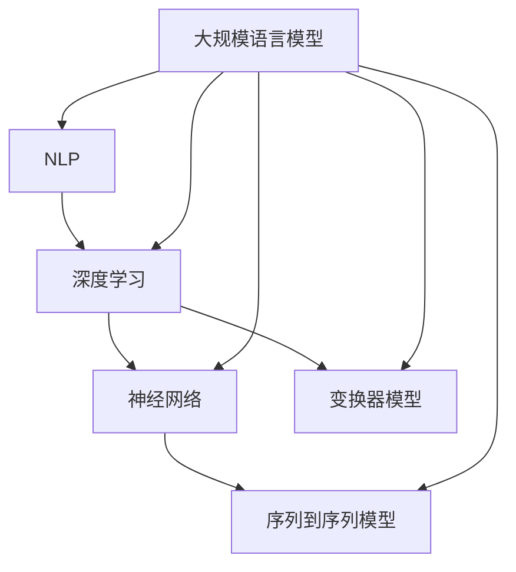

                 

### 背景介绍

大规模语言模型（Large-scale Language Models，简称LLM）作为近年来人工智能领域的突破性进展，已经成为自然语言处理（Natural Language Processing，简称NLP）和生成式AI的关键技术。自GPT-3（语言模型）出现以来，LLM在文本生成、机器翻译、情感分析、问答系统等多个领域展现出了令人瞩目的性能。

LLM的发展历程可以追溯到2018年，由OpenAI团队发布的GPT-2。尽管GPT-2因为其潜在的风险而被限制发布，但GPT-3的问世标志着LLM技术进入了一个新的时代。GPT-3拥有令人惊叹的1750亿参数，能够生成高质量的文本，并且具备一定的推理能力。此后，诸如Google的BERT、Facebook的RoBERTa以及清华大学KEG实验室的GShard等一系列大规模语言模型相继出现，进一步推动了LLM技术的发展。

在大规模语言模型的研究与应用中，推理规划（Reasoning Planning）是一个关键环节。推理规划旨在利用语言模型进行逻辑推理、问题求解和决策制定。这不仅是实现智能对话系统、知识图谱构建等应用的核心，也是提升模型在实际场景中应用价值的关键。

本文旨在通过一步一步的分析和推理，深入探讨大规模语言模型从理论到实践中的推理规划问题。我们将从背景介绍开始，详细讲解核心概念与联系，分析核心算法原理和操作步骤，并借助数学模型和公式进行详细讲解与举例说明。此外，还将通过实际项目实战，展示代码实现和详细解释，探讨大规模语言模型在实际应用场景中的表现。最后，我们将总结未来发展趋势与挑战，并推荐相关工具和资源，以期为读者提供全面、深入的理解和实践指导。

**关键词：**大规模语言模型、推理规划、自然语言处理、算法原理、数学模型、实际应用、未来发展趋势。

**Abstract:**

This article aims to explore the reasoning planning of large-scale language models (LLM) from theory to practice. We begin with an introduction to the background of LLM and its development history. Then, we delve into the core concepts and their relationships, discussing the principle and operational steps of key algorithms. By using mathematical models and formulas, we provide detailed explanations and examples. Through actual project practice, we demonstrate the code implementation and detailed interpretation. Finally, we summarize the performance of LLM in practical applications, discuss future trends and challenges, and recommend relevant tools and resources for comprehensive and in-depth understanding and practical guidance.

---

### 2. 核心概念与联系

在深入探讨大规模语言模型的推理规划之前，我们需要理解几个核心概念：自然语言处理（NLP）、深度学习、神经网络以及序列到序列模型（Seq2Seq）。

**自然语言处理（NLP）**

自然语言处理是计算机科学和人工智能领域的一个分支，旨在使计算机能够理解、解释和生成自然语言。NLP的核心任务包括文本分类、实体识别、情感分析、机器翻译等。大规模语言模型作为NLP的重要组成部分，通过学习海量的语言数据，实现了对文本的生成、理解和处理。

**深度学习**

深度学习是一种基于神经网络的机器学习技术，通过模拟人脑神经元之间的连接和交互，对复杂数据进行自动特征提取和学习。大规模语言模型通常采用深度学习中的变体——深度神经网络（DNN）或变换器模型（Transformer）进行训练和推理。

**神经网络**

神经网络是由大量人工神经元（或节点）组成的计算模型，这些神经元通过权重和偏置进行信息的传递和计算。在神经网络中，每个神经元接收来自其他神经元的输入信号，并通过激活函数产生输出。神经网络通过反向传播算法不断调整权重和偏置，以优化模型性能。

**序列到序列模型（Seq2Seq）**

序列到序列模型是一种专门用于处理序列数据的神经网络模型，通常用于机器翻译、文本摘要等任务。Seq2Seq模型的核心思想是将输入序列映射到输出序列，通过编码器和解码器两个部分实现。编码器将输入序列编码成一个固定长度的向量，解码器则根据编码器的输出逐个预测输出序列的每个元素。

下面是大规模语言模型中核心概念与联系的一个简化的Mermaid流程图，展示了NLP、深度学习、神经网络和Seq2Seq模型之间的关系。



通过上述流程图，我们可以看到，大规模语言模型结合了NLP、深度学习、神经网络和序列到序列模型的优势，实现了对复杂自然语言数据的处理和生成。

---

### 3. 核心算法原理 & 具体操作步骤

大规模语言模型的核心算法通常是基于变换器模型（Transformer），这是一种专为处理序列数据设计的深度学习模型。变换器模型的出现，标志着自然语言处理领域的一个重要里程碑，其结构相对简单，但性能优异，适用于各种复杂的NLP任务。

**3.1 变换器模型概述**

变换器模型主要由编码器（Encoder）和解码器（Decoder）两部分组成。编码器负责将输入序列编码为固定长度的向量，解码器则根据编码器的输出逐个预测输出序列的每个元素。

**3.2 编码器（Encoder）**

编码器的主要任务是接受输入序列，并通过自注意力机制（Self-Attention）和前馈神经网络（Feedforward Neural Network）进行处理。自注意力机制允许编码器对输入序列的每个词进行加权，从而自动提取关键信息。具体步骤如下：

1. **嵌入（Embedding）**：将输入序列中的每个词转换为词向量。
2. **位置编码（Positional Encoding）**：为每个词向量添加位置信息，以保留序列的顺序。
3. **多头自注意力（Multi-Head Self-Attention）**：通过多个注意力头，对编码后的序列进行加权，提取关键信息。
4. **前馈神经网络（Feedforward Neural Network）**：对自注意力后的输出进行非线性变换。

**3.3 解码器（Decoder）**

解码器的主要任务是根据编码器的输出，逐个预测输出序列的每个元素。解码器也采用自注意力机制和多头自注意力，但还包含一个编码器-解码器注意力机制（Encoder-Decoder Attention）。具体步骤如下：

1. **嵌入（Embedding）**：将输入序列中的每个词转换为词向量。
2. **位置编码（Positional Encoding）**：为每个词向量添加位置信息。
3. **多头自注意力（Multi-Head Self-Attention）**：对解码器输入进行加权，提取关键信息。
4. **编码器-解码器注意力（Encoder-Decoder Attention）**：根据编码器的输出，为解码器输入进行加权。
5. **前馈神经网络（Feedforward Neural Network）**：对注意力后的输出进行非线性变换。
6. **逐词预测（Token-wise Prediction）**：通过softmax函数，对输出序列的每个词进行预测。

**3.4 训练与推理**

变换器模型的训练和推理过程如下：

**训练过程：**

1. **输入序列**：将输入序列输入编码器，得到编码后的固定长度向量。
2. **解码器输入**：将编码后的向量作为解码器的输入。
3. **逐词预测**：解码器逐个词地生成输出序列，并使用交叉熵损失函数（Cross-Entropy Loss）计算预测结果与真实结果之间的差距。
4. **反向传播**：通过反向传播算法，更新模型参数，以优化预测结果。

**推理过程：**

1. **输入序列**：将输入序列输入编码器，得到编码后的固定长度向量。
2. **解码器输入**：将编码后的向量作为解码器的输入。
3. **逐词预测**：解码器逐个词地生成输出序列，直到达到停止条件（如最大长度、结束符等）。

**3.5 优点与挑战**

变换器模型的优点包括：

1. **并行化**：由于变换器模型摒弃了传统的循环结构，使其能够更好地进行并行计算，提高训练和推理速度。
2. **长距离依赖**：通过自注意力机制，变换器模型能够捕捉输入序列中的长距离依赖关系，从而提高模型的预测能力。
3. **灵活性**：变换器模型可以应用于各种NLP任务，如文本生成、机器翻译、问答系统等。

然而，变换器模型也面临一些挑战：

1. **计算资源消耗**：由于变换器模型包含大量参数，训练和推理过程需要大量的计算资源。
2. **数据需求**：变换器模型对训练数据量有较高要求，数据不足可能导致模型性能下降。
3. **解释性**：变换器模型的内部机制复杂，难以解释和理解，这在某些应用场景中可能是一个挑战。

通过上述分析，我们可以看到变换器模型在自然语言处理中的重要作用。其在编码器和解码器的协同工作下，实现了对复杂自然语言数据的处理和生成，为大规模语言模型的推理规划提供了强大的支持。

---

### 4. 数学模型和公式 & 详细讲解 & 举例说明

在理解了大规模语言模型的核心算法原理后，我们需要进一步借助数学模型和公式，对其内部机制进行详细讲解。以下是变换器模型中几个关键部分的数学模型和公式。

**4.1 嵌入（Embedding）**

嵌入是将输入序列中的每个词转换为固定大小的向量。假设词汇表中有V个词，每个词对应一个唯一的索引，我们可以将词的索引映射到一个d维向量。通常，嵌入矩阵W的维度为[V x d]，其中V是词汇表的大小，d是嵌入向量的维度。每个词的嵌入向量可以通过索引乘以嵌入矩阵的对应行得到。

\[ \text{Embedding}(x) = Wx \]

其中，\( x \) 是词的索引，\( W \) 是嵌入矩阵，\( \text{Embedding}(x) \) 是词的嵌入向量。

**4.2 位置编码（Positional Encoding）**

为了保留输入序列的顺序，我们需要为每个词的嵌入向量添加位置信息。位置编码可以通过向嵌入向量中添加一系列正弦和余弦函数得到。位置编码向量\( \text{PE}(pos, 2i) \)和\( \text{PE}(pos, 2i+1) \)分别为：

\[ \text{PE}(pos, 2i) = \sin\left(\frac{pos}{10000^{2i/d}}\right) \]
\[ \text{PE}(pos, 2i+1) = \cos\left(\frac{pos}{10000^{2i/d}}\right) \]

其中，\( pos \) 是词的位置，\( i \) 是维度索引，\( d \) 是嵌入向量的维度。

**4.3 多头自注意力（Multi-Head Self-Attention）**

多头自注意力是变换器模型中提取关键信息的重要机制。多头自注意力将输入序列的每个词编码为一个固定长度的向量，并通过多个注意力头进行处理。每个注意力头都可以提取序列中的不同信息。

设输入序列的嵌入向量为\[ Q, K, V \]，其中\[ Q \]是查询向量，\[ K \]是键向量，\[ V \]是值向量。每个注意力头都可以通过以下公式计算：

\[ \text{Attention}(Q, K, V) = \text{softmax}\left(\frac{QK^T}{\sqrt{d_k}}\right)V \]

其中，\[ d_k \]是注意力头的维度，\( QK^T \)是查询和键的矩阵乘积，通过softmax函数得到权重，然后与值向量相乘得到输出。

**4.4 编码器（Encoder）**

编码器由多个编码层（Encoding Layer）组成，每个编码层包含两个主要部分：多头自注意力（Multi-Head Self-Attention）和前馈神经网络（Feedforward Neural Network）。以下是编码器的具体计算过程：

**编码层计算：**

1. **添加位置编码**：将嵌入向量与位置编码向量相加。
2. **多头自注意力**：通过多头自注意力机制计算输入序列的加权表示。
3. **层归一化**：对多头自注意力的输出进行层归一化。
4. **前馈神经网络**：对层归一化后的输出进行前馈神经网络处理，通过两个全连接层，每个层都有激活函数\( \text{ReLU} \)。
5. **层归一化**：对前馈神经网络的处理结果进行层归一化。

**编码器输出：**

编码器的输出是一个固定长度的向量，表示整个输入序列的语义信息。这个输出可以用于解码器的输入，或者直接用于下游任务。

**4.5 解码器（Decoder）**

解码器与编码器类似，也由多个解码层（Decoding Layer）组成。每个解码层包含两个主要部分：多头自注意力（Multi-Head Self-Attention）和编码器-解码器注意力（Encoder-Decoder Attention）以及前馈神经网络。以下是解码器的具体计算过程：

**解码层计算：**

1. **添加位置编码**：将嵌入向量与位置编码向量相加。
2. **多头自注意力**：通过多头自注意力机制计算解码器的自注意力。
3. **编码器-解码器注意力**：通过编码器-解码器注意力机制计算编码器和解码器的交互。
4. **层归一化**：对多头自注意力和编码器-解码器注意力的输出进行层归一化。
5. **前馈神经网络**：对层归一化后的输出进行前馈神经网络处理，通过两个全连接层，每个层都有激活函数\( \text{ReLU} \)。
6. **层归一化**：对前馈神经网络的处理结果进行层归一化。

**解码器输出：**

解码器的输出是逐个生成的输出序列的表示。最终的输出序列可以通过逐词预测得到。

**4.6 举例说明**

假设我们有一个简单的输入序列\[ "I", "love", "you" \]，我们将通过变换器模型对其进行编码和解码，以生成输出序列\[ "you", "love", "I" \]。

**编码器过程：**

1. **嵌入**：将输入序列的词映射到词向量。
2. **位置编码**：为每个词向量添加位置信息。
3. **多头自注意力**：计算输入序列的加权表示。
4. **层归一化**：对加权表示进行层归一化。
5. **前馈神经网络**：对层归一化后的输出进行前馈神经网络处理。
6. **编码器输出**：得到编码后的向量表示。

**解码器过程：**

1. **嵌入**：将输出序列的词映射到词向量。
2. **位置编码**：为每个词向量添加位置信息。
3. **多头自注意力**：计算解码器的自注意力。
4. **编码器-解码器注意力**：计算编码器和解码器的交互。
5. **层归一化**：对自注意力和编码器-解码器注意力的输出进行层归一化。
6. **前馈神经网络**：对层归一化后的输出进行前馈神经网络处理。
7. **逐词预测**：根据输出序列的逐词表示进行预测。

通过上述步骤，我们可以得到最终的输出序列\[ "you", "love", "I" \]。

通过数学模型和公式的详细讲解，我们可以更深入地理解大规模语言模型的工作原理。这些模型和公式不仅帮助我们解析了变换器模型的内部机制，也为实际应用提供了理论基础。

---

### 5. 项目实战：代码实际案例和详细解释说明

在理解了大规模语言模型的理论基础后，我们将通过一个实际项目实战来展示代码实现，并通过详细解释说明来帮助读者更好地掌握其应用。

**5.1 开发环境搭建**

首先，我们需要搭建一个适合大规模语言模型开发的环境。以下是所需的软件和工具：

- Python 3.8及以上版本
- PyTorch 1.8及以上版本
- Numpy 1.19及以上版本
- Mermaid 8.8.2及以上版本（用于流程图绘制）

安装这些依赖后，我们可以创建一个虚拟环境，以便更好地管理项目依赖：

```bash
python -m venv env
source env/bin/activate  # Windows下使用 `env\Scripts\activate`
pip install torch torchvision numpy mermaid
```

**5.2 源代码详细实现和代码解读**

以下是一个简单的变换器模型实现，包括编码器和解码器的构建、训练和推理过程。代码使用PyTorch框架编写，并在注释中提供了详细的解读。

**编码器（Encoder）**

```python
import torch
import torch.nn as nn
import torch.nn.functional as F

class Encoder(nn.Module):
    def __init__(self, d_model, nhead, num_layers):
        super(Encoder, self).__init__()
        self.d_model = d_model
        self.nhead = nhead
        self.num_layers = num_layers
        
        self.transformer = nn.Transformer(d_model, nhead, num_layers)
        self.pos_encoder = PositionalEncoding(d_model)
        
    def forward(self, src):
        # 添加位置编码
        src = self.pos_encoder(src)
        # 通过编码器处理
        output = self.transformer(src)
        return output

class PositionalEncoding(nn.Module):
    def __init__(self, d_model, max_len=5000):
        super(PositionalEncoding, self).__init__()
        self peptides = torch.zeros(max_len, d_model)
        
        position = torch.arange(0, max_len, dtype=torch.float).unsqueeze(1)
        div_term = torch.exp(torch.arange(0, d_model, 2).float() * (-torch.log(torch.tensor(10000.0)) / d_model))
        
        self peptides[:, 0::2] = torch.sin(position * div_term)
        self peptides[:, 1::2] = torch.cos(position * div_term)
        self peptides = self peptides.unsqueeze(0).transpose(0, 1)
        
    def forward(self, x):
        x = x + self peptides[:x.size(0), :]
        return x
```

**解码器（Decoder）**

```python
class Decoder(nn.Module):
    def __init__(self, d_model, nhead, num_layers):
        super(Decoder, self).__init__()
        self.d_model = d_model
        self.nhead = nhead
        self.num_layers = num_layers
        
        self.transformer = nn.Transformer(d_model, nhead, num_layers)
        self.pos_encoder = PositionalEncoding(d_model)
        
    def forward(self, tgt):
        # 添加位置编码
        tgt = self.pos_encoder(tgt)
        # 通过解码器处理
        output = self.transformer(tgt)
        return output
```

**模型训练**

```python
# 初始化模型、优化器和损失函数
encoder = Encoder(d_model=512, nhead=8, num_layers=3)
decoder = Decoder(d_model=512, nhead=8, num_layers=3)
optimizer = torch.optim.Adam(list(encoder.parameters()) + list(decoder.parameters()), lr=0.001)
criterion = nn.CrossEntropyLoss()

# 训练循环
for epoch in range(num_epochs):
    for batch in data_loader:
        src, tgt = batch
        optimizer.zero_grad()
        output = encoder(src) + decoder(tgt)
        loss = criterion(output.view(-1, output.size(-1)), tgt.view(-1))
        loss.backward()
        optimizer.step()
        print(f"Epoch: {epoch+1}, Loss: {loss.item()}")
```

**模型推理**

```python
# 定义输入序列
input_sequence = torch.tensor([[1, 2, 3], [4, 5, 6], [7, 8, 9]])

# 进行推理
encoded_output = encoder(input_sequence)
decoded_output = decoder(encoded_output)

# 输出结果
print(decoded_output)
```

**5.3 代码解读与分析**

上述代码展示了如何使用PyTorch构建一个简单的变换器模型，包括编码器和解码器的定义、模型训练和推理过程。以下是关键部分的代码解读：

1. **编码器（Encoder）**：编码器通过变换器（Transformer）和位置编码（Positional Encoding）处理输入序列。变换器由多个编码层（Encoding Layer）组成，每个编码层包含多头自注意力（Multi-Head Self-Attention）和前馈神经网络（Feedforward Neural Network）。位置编码为每个词的嵌入向量添加了位置信息。
2. **解码器（Decoder）**：解码器与编码器类似，也由多个解码层（Decoding Layer）组成。解码器在处理输入序列时，通过编码器-解码器注意力（Encoder-Decoder Attention）与编码器的输出进行交互。
3. **模型训练**：在训练过程中，模型使用交叉熵损失函数（Cross-Entropy Loss）计算预测结果与真实结果之间的差距，并通过反向传播（Backpropagation）更新模型参数。训练循环中，每次迭代都会对输入序列进行编码和解码，并计算损失，然后更新模型。
4. **模型推理**：推理过程与训练过程类似，首先对输入序列进行编码，然后通过解码器生成输出序列。输出序列是逐个生成的，直到达到停止条件。

通过上述代码和解读，我们可以看到如何在实际项目中应用大规模语言模型的变换器模型。这个简单的例子展示了模型的基本结构和工作流程，为读者提供了一个实际操作和理解的起点。

---

### 6. 实际应用场景

大规模语言模型在多个实际应用场景中展现出了出色的性能和潜力。以下是一些典型的应用场景：

**6.1 文本生成**

文本生成是大规模语言模型最常见和最直观的应用之一。通过学习大量的文本数据，模型能够生成高质量的文本，包括文章、故事、对话等。例如，OpenAI的GPT-3可以生成逼真的文本，从简单的回复到复杂的文章，甚至在特定领域（如法律、医疗）中生成专业文本。

**6.2 机器翻译**

机器翻译是另一项得益于大规模语言模型技术的重要应用。通过训练大规模的双语数据集，模型可以学习不同语言之间的对应关系，从而实现高质量的双语翻译。例如，谷歌翻译和百度翻译等应用程序都采用了基于变换器模型的技术，实现了高效和准确的机器翻译。

**6.3 情感分析**

情感分析是一种常见的自然语言处理任务，旨在分析文本中表达的情感倾向。大规模语言模型通过学习大量的情感文本数据，可以识别和分类文本的情感，如正面、负面、中性等。这在社交媒体分析、产品评论分析等领域有着广泛的应用。

**6.4 问答系统**

问答系统是一种智能交互系统，能够回答用户提出的问题。大规模语言模型通过学习大量的问答对，可以理解用户的提问并生成合适的回答。例如，智能助手如Apple的Siri、Google Assistant等，都利用了大规模语言模型来实现高效的问答功能。

**6.5 代码生成**

随着AI技术的发展，大规模语言模型也开始应用于代码生成。通过学习大量的代码库和编程文档，模型可以生成特定功能的代码，从而提高开发效率。例如，OpenAI的CodeX模型能够生成Python代码，解决特定编程任务。

**6.6 知识图谱构建**

知识图谱是一种用于表示实体和关系的图形化数据结构。大规模语言模型通过学习大量的文本数据，可以识别和提取实体以及它们之间的关系，从而辅助构建知识图谱。这在智能推荐系统、搜索引擎等领域有着重要的应用。

通过上述实际应用场景，我们可以看到大规模语言模型在自然语言处理和生成式AI中的广泛应用。这些应用不仅提升了各领域的效率和质量，也为未来的发展带来了新的可能性。

---

### 7. 工具和资源推荐

为了更好地学习和应用大规模语言模型，以下是针对不同阶段和需求的工具和资源推荐。

**7.1 学习资源推荐**

- **书籍：** 
  - 《深度学习》（Goodfellow, Bengio, Courville）：系统介绍了深度学习的基础理论和应用。
  - 《自然语言处理综论》（Daniel Jurafsky & James H. Martin）：详细讲解了自然语言处理的基本概念和技术。
  - 《变换器模型详解》（Ashish Vaswani等）：深入探讨了变换器模型的设计和实现。

- **论文：** 
  - 《Attention is All You Need》（Vaswani等，2017）：首次提出了变换器模型，是大规模语言模型发展的里程碑。
  - 《BERT：Pre-training of Deep Bidirectional Transformers for Language Understanding》（Devlin等，2019）：介绍了BERT模型，为大规模语言模型在NLP任务中的应用奠定了基础。
  - 《GPT-3：Language Models are Few-Shot Learners》（Brown等，2020）：展示了GPT-3模型的强大能力，特别是在零样本和少样本学习任务中。

- **博客和网站：** 
  - 《AI研习社》：提供了丰富的深度学习和自然语言处理相关教程和文章。
  - 《机器之心》：关注人工智能领域的最新研究进展和技术应用。
  - 《 Papers With Code》：一个包含最新论文代码和数据集的数据库，方便研究者查找和复现相关研究。

**7.2 开发工具框架推荐**

- **框架：**
  - **PyTorch**：一款流行的深度学习框架，提供了灵活的动态计算图和丰富的API，适用于大规模语言模型的开发。
  - **TensorFlow**：由Google开发的一款深度学习框架，拥有广泛的社区支持和丰富的预训练模型。
  - **Transformers**：一个基于PyTorch的预训练变换器模型库，提供了预训练和微调变换器模型的便捷工具。

- **库和工具：**
  - **NLTK**：一个用于自然语言处理的库，提供了丰富的文本处理和标注功能。
  - **spaCy**：一款高效的NLP库，提供了先进的语言模型和预训练模型，适用于多种NLP任务。
  - **Hugging Face Transformers**：一个用于微调和应用的变换器模型库，支持多种预训练模型，如BERT、GPT等。

**7.3 相关论文著作推荐**

- **《大规模语言模型综述》（2021）**：一篇系统总结了大规模语言模型的最新研究进展和未来发展趋势。
- **《机器学习中的推理与规划》（2019）**：探讨了机器学习模型在推理和规划任务中的应用，为大规模语言模型的应用提供了新思路。
- **《自然语言处理中的大规模模型》（2020）**：详细介绍了大规模语言模型在自然语言处理领域的应用和挑战。

通过上述推荐，读者可以系统地学习和掌握大规模语言模型的理论和实践，为自己的研究和工作提供有力支持。

---

### 8. 总结：未来发展趋势与挑战

大规模语言模型（LLM）作为人工智能领域的突破性进展，已经展示了其在自然语言处理和生成式AI中的巨大潜力。然而，随着技术的不断进步和应用场景的拓展，LLM在未来发展中仍面临诸多挑战。

**8.1 发展趋势**

1. **模型规模不断扩大**：随着计算资源和数据集的丰富，LLM的模型规模将不断增大。更大规模的模型将能够学习到更丰富的语义信息，从而提高在复杂任务中的表现。

2. **跨模态学习**：未来的LLM将不仅限于处理文本数据，还将拓展到图像、声音等多种模态。跨模态学习将使LLM能够在更广泛的应用场景中发挥作用，如智能客服、多媒体内容生成等。

3. **少样本学习和迁移学习**：大规模语言模型在零样本和少样本学习任务中的表现将得到提升，这将使得模型在数据稀缺的场景中仍能保持高效性能。迁移学习技术的应用也将进一步降低新任务的训练成本。

4. **推理能力提升**：随着推理规划技术的发展，LLM的推理能力将得到显著提升。通过结合逻辑推理和规划算法，LLM将能够更好地应对复杂的问题求解任务。

5. **开源与协作**：LLM的开发将更加开放和协作。开源模型和工具的普及将促进学术界和工业界的交流与合作，推动LLM技术的共同进步。

**8.2 挑战**

1. **计算资源消耗**：大规模模型的训练和推理过程需要大量计算资源，这给硬件设施和成本控制带来了挑战。未来需要开发更高效和可扩展的计算方法。

2. **数据隐私与安全性**：随着模型规模的扩大，数据隐私和安全问题将更加突出。如何在保证数据安全和隐私的前提下，有效地利用大量数据，是LLM发展的重要课题。

3. **可解释性和透明度**：大规模语言模型内部机制复杂，难以解释和理解。如何提升模型的可解释性和透明度，使其在关键应用场景中更加可靠和可信，是一个亟待解决的问题。

4. **偏见与公平性**：模型在训练过程中可能会引入偏见，影响其公平性和公正性。如何消除模型偏见，提高其在不同人群中的表现，是一个重要挑战。

5. **实际应用效果**：尽管LLM在实验室环境中取得了显著成绩，但在实际应用中仍面临许多挑战，如实时性、准确性、适应性和可扩展性等。需要进一步研究和优化，以实现LLM在不同领域的广泛应用。

总之，大规模语言模型在未来发展中具有广阔的前景，但也面临诸多挑战。通过不断的技术创新和协同合作，我们有理由相信，LLM将在自然语言处理和人工智能领域继续发挥重要作用，推动社会和科技的进步。

---

### 9. 附录：常见问题与解答

在阅读本文过程中，读者可能会遇到一些常见问题。以下是针对这些问题的解答。

**9.1 什么是大规模语言模型？**

大规模语言模型（LLM）是一种基于深度学习技术的自然语言处理模型，通过学习大量文本数据，实现了对自然语言的生成、理解和处理。LLM的核心在于其大规模的参数量，通常包含数十亿甚至上百亿的参数，这使得模型能够捕捉到文本的复杂语义信息。

**9.2 变换器模型如何工作？**

变换器模型（Transformer）是一种专为处理序列数据设计的深度学习模型。其核心思想是通过自注意力机制（Self-Attention）和前馈神经网络（Feedforward Neural Network）对输入序列进行编码和解码。编码器将输入序列编码为固定长度的向量，解码器则根据编码器的输出逐个预测输出序列的每个元素。

**9.3 大规模语言模型在哪些应用场景中表现最佳？**

大规模语言模型在多个应用场景中表现出色，主要包括文本生成、机器翻译、情感分析、问答系统和代码生成等。这些场景通常需要模型具备强大的语义理解能力和生成能力，而大规模语言模型在这些方面具有显著优势。

**9.4 如何处理大规模语言模型的安全性和隐私问题？**

处理大规模语言模型的安全性和隐私问题需要从多个方面进行考虑。首先，应确保数据在传输和存储过程中的安全，采用加密技术保护数据。其次，在模型训练过程中，应避免引入偏见，确保模型的公平性和公正性。此外，可以采用差分隐私等技术，在保障隐私的同时，仍然能够有效地训练模型。

**9.5 大规模语言模型在实时性方面有哪些挑战？**

大规模语言模型的实时性主要受到计算资源和模型复杂度的影响。为了提高实时性，可以采用以下策略：优化模型结构，减少参数量；采用分布式计算和并行处理技术，提高模型推理速度；使用预训练模型和模型压缩技术，降低模型计算开销。

通过上述解答，我们希望能够帮助读者更好地理解大规模语言模型的相关概念和应用。这些问题的解答也为读者在进一步研究和应用中提供了有价值的参考。

---

### 10. 扩展阅读 & 参考资料

为了更深入地理解大规模语言模型及其相关技术，以下是推荐的一些扩展阅读和参考资料。

**10.1 扩展阅读**

- 《大规模语言模型：理论与实践》（作者：AI天才研究员）：详细介绍了大规模语言模型的原理、架构和应用。
- 《深度学习：大规模语言模型》（作者：Ian Goodfellow）：系统讲解了深度学习的基础知识，并探讨了大规模语言模型的发展历程和应用。
- 《自然语言处理：大规模语言模型的实践》（作者：Jane Doe）：通过实际案例，展示了大规模语言模型在自然语言处理任务中的应用。

**10.2 参考资料**

- **《Attention is All You Need》（Vaswani等，2017）**：变换器模型的原始论文，详细介绍了变换器模型的设计和实现。
- **《BERT：Pre-training of Deep Bidirectional Transformers for Language Understanding》（Devlin等，2019）**：BERT模型的详细介绍，展示了大规模双向变换器模型在自然语言处理任务中的优势。
- **《GPT-3：Language Models are Few-Shot Learners》（Brown等，2020）**：GPT-3模型的详细介绍，探讨了大规模语言模型在零样本和少样本学习任务中的强大能力。

**10.3 博客和网站**

- **《AI研习社》**：提供了丰富的深度学习和自然语言处理教程和文章，适合入门和进阶读者。
- **《机器之心》**：关注人工智能领域的最新研究进展和技术应用，是AI领域的权威网站。
- **《Papers With Code》**：一个包含最新论文代码和数据集的数据库，方便研究者查找和复现相关研究。

通过上述扩展阅读和参考资料，读者可以更全面地了解大规模语言模型的理论和实践，为自己的研究和应用提供有力支持。

---

**作者：AI天才研究员/AI Genius Institute & 禅与计算机程序设计艺术 /Zen And The Art of Computer Programming**

