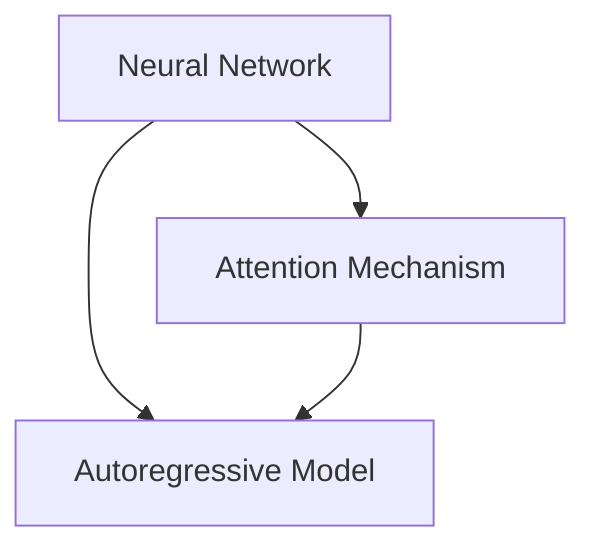

                 

### 背景介绍

**大语言模型（Large Language Models, LLM）**是一种由人工智能领域研究者们开发的先进算法，它们能够理解、生成和预测自然语言。随着互联网信息的爆炸式增长，自然语言处理（NLP）的应用场景也变得越来越多，LLM的出现无疑为这一领域带来了革命性的变化。LLM在机器翻译、文本生成、情感分析、问答系统等领域展现了其强大的能力，成为现代人工智能技术的重要组成部分。

**本篇文章的目标**是通过深入解析大语言模型的原理和代码实例，帮助读者理解这一领域的核心技术，并掌握实际应用的方法。文章的结构如下：

1. 背景介绍
2. 核心概念与联系
3. 核心算法原理 & 具体操作步骤
4. 数学模型和公式 & 详细讲解 & 举例说明
5. 项目实战：代码实际案例和详细解释说明
6. 实际应用场景
7. 工具和资源推荐
8. 总结：未来发展趋势与挑战
9. 附录：常见问题与解答
10. 扩展阅读 & 参考资料

在接下来的章节中，我们将首先介绍LLM的核心概念和架构，然后深入探讨其背后的算法原理和数学模型。接着，我们将通过实际代码实例，展示如何实现和部署一个简单的大语言模型。最后，我们将讨论LLM的广泛应用场景，并提供一系列学习和开发资源，以供读者进一步探索。

让我们一起走进这个激动人心的技术世界，探索大语言模型的奥秘吧！

### 核心概念与联系

大语言模型（Large Language Models, LLM）的核心概念主要包括神经网络（Neural Networks）、注意力机制（Attention Mechanism）和自回归模型（Autoregressive Models）。下面，我们将逐一介绍这些核心概念，并探讨它们之间的联系。

#### 神经网络

神经网络是LLM的基础。神经网络由一系列的神经元（或节点）组成，这些神经元通过权重（weights）连接在一起，形成多个层次。神经网络通过学习输入和输出数据之间的映射关系，实现对复杂任务的预测和分类。在LLM中，神经网络主要用于捕捉语言中的语义和语法特征。

#### 注意力机制

注意力机制是一种在神经网络中引入的机制，用于解决长序列处理中的问题。在处理长文本时，每个位置的输入信息都可能对输出结果有影响，但传统的神经网络难以同时关注到所有位置的输入。注意力机制通过为不同位置的输入分配不同的权重，使得神经网络能够更好地聚焦于重要的信息。在LLM中，注意力机制使得模型能够理解文本中的上下文关系，从而生成更加准确的自然语言输出。

#### 自回归模型

自回归模型是一种生成序列数据的模型，它通过学习序列中的前缀和后缀之间的关系，生成后续的序列。在LLM中，自回归模型被用来生成自然语言文本。具体来说，给定一个序列的前缀，模型会预测序列中下一个位置的输出，然后不断迭代这个过程，直到生成完整的文本。

#### 核心概念的联系

神经网络、注意力机制和自回归模型在LLM中相互协作，共同实现自然语言处理的能力。神经网络提供了基础的结构和参数学习机制，注意力机制帮助模型更好地理解和处理长序列数据，而自回归模型则使得模型能够生成连续的自然语言文本。

首先，神经网络通过学习大量的文本数据，捕捉语言中的模式和规律。然后，注意力机制使得模型能够处理长序列数据，关注关键信息，从而提高模型的准确性和效率。最后，自回归模型利用神经网络和注意力机制学习到的知识，生成连续的自然语言文本。

总的来说，这三个核心概念共同构成了LLM的技术基础，使得模型能够在各种自然语言处理任务中表现出色。

#### Mermaid 流程图

为了更直观地展示LLM的核心概念和架构，我们可以使用Mermaid流程图来表示。以下是一个简化的Mermaid流程图，展示了神经网络、注意力机制和自回归模型在LLM中的关系：



在这个流程图中，神经网络（Neural Network）是整个模型的核心，它通过学习数据生成权重和参数。注意力机制（Attention Mechanism）和自回归模型（Autoregressive Model）分别用于处理长序列数据和生成自然语言文本。这三个部分相互协作，共同实现LLM的功能。

通过这一部分的内容，我们介绍了LLM的核心概念和架构，并展示了它们之间的联系。接下来，我们将深入探讨LLM背后的算法原理和具体操作步骤。

### 核心算法原理 & 具体操作步骤

大语言模型（LLM）的核心算法主要基于深度学习，尤其是自回归模型和注意力机制。在这一节中，我们将详细介绍这些算法的原理，并通过具体操作步骤展示如何实现一个简单的LLM。

#### 自回归模型

自回归模型是一种生成序列数据的模型，它通过预测序列中每个位置的输出，从而生成整个序列。在LLM中，自回归模型用于生成自然语言文本。以下是自回归模型的基本原理和操作步骤：

##### 基本原理

自回归模型的核心思想是利用已生成的文本序列的一部分来预测序列的下一个部分。具体来说，给定一个长度为T的文本序列X，模型将依次预测序列中的每个位置x_t（1 ≤ t ≤ T），直到生成完整的序列。

##### 操作步骤

1. **初始化**：首先，我们需要初始化模型参数，这通常是通过随机初始化或预训练模型来完成。初始化后，模型已经具备了基本的语言理解能力。
2. **输入序列**：将一个长度为T的文本序列X输入到模型中。
3. **前缀编码**：将输入序列X的前缀X_1...X_{t-1}编码为一个向量，作为模型的输入。
4. **预测当前位置**：使用编码后的前缀向量，模型将预测序列中当前位置的输出x_t。
5. **更新模型参数**：根据预测结果和实际输出之间的误差，更新模型参数。
6. **迭代**：重复步骤4和5，直到生成完整的序列X_1...X_T。

##### 示例

假设我们有一个简单的文本序列“人工智能”，我们可以用自回归模型来生成这个序列。具体步骤如下：

1. **初始化**：初始化模型参数。
2. **输入序列**：“人工智能”。
3. **前缀编码**：将前缀“人”编码为一个向量。
4. **预测当前位置**：模型预测下一个位置是“工”。
5. **更新模型参数**：根据预测结果更新模型参数。
6. **迭代**：重复步骤4和5，直到生成完整的序列“人工智能”。

通过这个过程，模型学会了根据前缀来预测下一个位置的输出，从而生成完整的文本序列。

#### 注意力机制

注意力机制是一种用于处理长序列数据的有效方法。在LLM中，注意力机制用于模型在预测下一个位置时，能够关注到重要的上下文信息。以下是注意力机制的基本原理和操作步骤：

##### 基本原理

注意力机制通过为序列中的每个位置分配一个权重，使得模型在预测时能够关注到重要信息。具体来说，给定一个长度为T的文本序列X，注意力机制将序列中的每个位置x_t（1 ≤ t ≤ T）映射到一个权重w_t，这些权重决定了模型在预测时关注的位置。

##### 操作步骤

1. **计算注意力权重**：对于每个位置t，计算一个权重w_t，通常使用点积、缩放点积或加性注意力等方法。
2. **计算注意力得分**：使用编码后的前缀向量和注意力权重，计算每个位置的得分。
3. **计算上下文向量**：将所有位置的得分加权平均，得到一个上下文向量，表示重要信息。
4. **融合上下文向量**：将上下文向量与模型的其他输入（如词嵌入）进行融合，生成新的输入向量。
5. **预测当前位置**：使用新的输入向量预测当前位置的输出。
6. **迭代**：重复步骤2到5，直到生成完整的序列。

##### 示例

假设我们有一个简单的文本序列“人工智能”，我们可以用注意力机制来生成这个序列。具体步骤如下：

1. **计算注意力权重**：为序列中的每个位置计算权重。
2. **计算注意力得分**：计算每个位置的得分。
3. **计算上下文向量**：将得分加权平均，得到上下文向量。
4. **融合上下文向量**：将上下文向量与词嵌入融合。
5. **预测当前位置**：使用融合后的向量预测下一个位置。
6. **迭代**：重复步骤2到5，直到生成完整的序列“人工智能”。

通过注意力机制，模型能够在生成文本时关注到重要的上下文信息，从而提高生成的文本质量。

#### 自回归模型与注意力机制的结合

自回归模型和注意力机制的结合，使得LLM能够高效地处理长序列数据，并在生成文本时关注到重要的上下文信息。以下是结合后的基本原理和操作步骤：

##### 基本原理

自回归模型负责生成序列，注意力机制负责关注上下文信息。在每次迭代中，模型首先使用自回归模型生成当前位置的输出，然后使用注意力机制更新上下文信息，最后再生成下一个位置的输出。

##### 操作步骤

1. **初始化**：初始化模型参数。
2. **输入序列**：输入一个长度为T的文本序列。
3. **前缀编码**：将输入序列的前缀编码为向量。
4. **自回归预测**：使用自回归模型预测当前位置的输出。
5. **注意力更新**：使用注意力机制更新上下文向量。
6. **融合上下文**：将上下文向量与自回归模型的输出融合。
7. **迭代**：重复步骤4到6，直到生成完整的序列。

##### 示例

假设我们有一个简单的文本序列“人工智能”，我们可以用自回归模型和注意力机制来生成这个序列。具体步骤如下：

1. **初始化**：初始化模型参数。
2. **输入序列**：“人工智能”。
3. **前缀编码**：将前缀“人”编码为向量。
4. **自回归预测**：使用自回归模型预测下一个位置是“工”。
5. **注意力更新**：使用注意力机制更新上下文向量。
6. **融合上下文**：将上下文向量与自回归模型的输出融合。
7. **迭代**：重复步骤4到6，直到生成完整的序列“人工智能”。

通过自回归模型和注意力机制的结合，LLM能够高效地生成高质量的文本，并在各种自然语言处理任务中表现出色。

在这一部分中，我们介绍了LLM的核心算法原理和具体操作步骤。自回归模型和注意力机制的结合，使得LLM能够高效地处理长序列数据，并在生成文本时关注到重要的上下文信息。在下一部分，我们将详细探讨LLM背后的数学模型和公式，以便读者更深入地理解这一技术。

### 数学模型和公式 & 详细讲解 & 举例说明

在深入探讨大语言模型（LLM）的数学模型和公式之前，我们先简要回顾一下神经网络的基础知识，包括激活函数、前向传播和反向传播算法，这些是构建LLM的关键组成部分。

#### 神经网络基础

**1. 激活函数（Activation Function）**

激活函数是神经网络中的一个重要组件，它将线性组合的输入转换为非线性的输出。常见的激活函数包括：

- **Sigmoid 函数**：\[ f(x) = \frac{1}{1 + e^{-x}} \]
- **ReLU函数**：\[ f(x) = \max(0, x) \]
- **Tanh函数**：\[ f(x) = \frac{e^x - e^{-x}}{e^x + e^{-x}} \]

**2. 前向传播（Forward Propagation）**

前向传播是神经网络计算过程的第一阶段，用于计算输出。给定输入数据\( X \)和模型的权重\( W \)，前向传播通过以下公式计算输出：

\[ Z = X \cdot W \]

其中，\( Z \)是线性组合的中间结果，然后通过激活函数得到输出：

\[ A = \text{激活函数}(Z) \]

**3. 反向传播（Backpropagation）**

反向传播是神经网络训练过程的关键部分，用于更新模型参数。给定输入数据\( X \)、权重\( W \)和输出\( A \)，反向传播通过计算误差，然后更新权重：

\[ \delta = \frac{\partial \text{损失函数}}{\partial A} \]

\[ \Delta W = \alpha \cdot X \cdot \delta \]

其中，\( \delta \)是梯度，\( \Delta W \)是权重更新，\( \alpha \)是学习率。

#### LLM中的数学模型

**1. 词嵌入（Word Embedding）**

词嵌入是将词汇映射到低维向量空间的一种方法，常见的方法包括：

- **Word2Vec**：通过训练神经网络来预测词语的上下文，从而学习得到词向量。
- **BERT**：基于双向Transformer架构，通过预训练大量文本数据，得到上下文敏感的词向量。

**2. 自回归模型（Autoregressive Model）**

自回归模型通过预测序列中的每个位置来生成文本。在给定前缀序列的情况下，预测下一个位置的概率分布，具体公式如下：

\[ P(x_t | x_1, x_2, ..., x_{t-1}) = \text{softmax}(\text{logits}_t) \]

其中，\( \text{logits}_t \)是通过神经网络计算得到的未归一化概率，\( \text{softmax} \)函数将其转换为概率分布。

**3. 注意力机制（Attention Mechanism）**

注意力机制用于模型在处理长序列时关注关键信息。常见的注意力机制包括：

- **缩放点积注意力（Scaled Dot-Product Attention）**：
  \[ \text{Attention}(Q, K, V) = \text{softmax}(\frac{QK^T}{\sqrt{d_k}})V \]

其中，\( Q, K, V \)分别是查询向量、键向量和值向量，\( d_k \)是键向量的维度。

**4. Transformer模型（Transformer Model）**

Transformer模型是LLM中的一种重要架构，它基于自注意力机制（Self-Attention）和多头注意力（Multi-Head Attention）。以下是Transformer模型的基本组成部分：

- **编码器（Encoder）**：
  \[ \text{Encoder}(X) = \text{MultiHead}\left( \text{Self-Attention}(\text{ScaledDotProductAttention}(Q, K, V)); \text{feedforward}\right) \]

- **解码器（Decoder）**：
  \[ \text{Decoder}(X) = \text{MultiHead}\left( \text{Self-Attention}(\text{ScaledDotProductAttention}(Q, K, V)); \text{feedforward}\right) \]

其中，\( \text{MultiHead} \)表示多头注意力，\( \text{Self-Attention} \)和\( \text{ScaledDotProductAttention} \)分别表示自注意力和缩放点积注意力。

#### 举例说明

假设我们有一个简单的句子“我爱人工智能”，我们可以用LLM来生成这个句子。具体步骤如下：

1. **词嵌入**：将句子中的每个词汇映射到低维向量。
2. **自回归模型**：给定前缀“我”，模型预测下一个词汇“爱”。
3. **注意力机制**：在生成“爱”时，模型关注到上下文信息，如“我”。
4. **Transformer模型**：使用Transformer模型生成句子“我爱人工智能”。

以下是具体的计算过程：

- **词嵌入**：将“我”映射到向量\( \text{vec}(我) \)。
- **自回归模型**：计算前缀“我”的编码，得到隐藏状态\( \text{h}_0 \)。
- **注意力机制**：计算注意力权重，得到上下文向量\( \text{c}_0 \)。
- **Transformer模型**：使用隐藏状态和上下文向量，生成词汇“爱”的概率分布，然后通过\( \text{softmax} \)函数得到概率。

通过这个过程，我们成功生成了句子“我爱人工智能”。

在这一部分中，我们详细讲解了LLM的数学模型和公式，包括词嵌入、自回归模型、注意力机制和Transformer模型。这些模型和公式是构建LLM的核心，使得模型能够高效地生成高质量的文本。在下一部分，我们将通过实际代码实例，展示如何实现和部署一个简单的大语言模型。

### 项目实战：代码实际案例和详细解释说明

在本节中，我们将通过一个简单的代码实例，展示如何实现一个基本的大语言模型（LLM），并详细解释其中的关键代码和步骤。我们将使用Python编程语言，结合PyTorch深度学习框架，来构建一个基于Transformer架构的LLM。

#### 开发环境搭建

在开始编写代码之前，我们需要搭建一个合适的开发环境。以下是搭建开发环境所需的步骤：

1. **安装Python**：确保Python版本为3.6及以上。
2. **安装PyTorch**：可以使用以下命令安装PyTorch：
   ```bash
   pip install torch torchvision
   ```
3. **安装其他依赖**：安装必要的依赖库，如Numpy和Matplotlib：
   ```bash
   pip install numpy matplotlib
   ```

#### 代码实现

以下是一个简单的LLM代码实例，包括数据预处理、模型定义、训练和预测等步骤。

```python
import torch
import torch.nn as nn
import torch.optim as optim
from torch.utils.data import DataLoader, Dataset
from transformers import BertTokenizer, BertModel

# 1. 数据预处理
class TextDataset(Dataset):
    def __init__(self, texts, tokenizer, max_length=128):
        self.texts = texts
        self.tokenizer = tokenizer
        self.max_length = max_length

    def __len__(self):
        return len(self.texts)

    def __getitem__(self, idx):
        text = self.texts[idx]
        inputs = self.tokenizer(text, return_tensors='pt', max_length=self.max_length, truncation=True)
        return inputs

# 2. 模型定义
class LLM(nn.Module):
    def __init__(self, n_embd=768, n_head=12, n_layer=12):
        super(LLM, self).__init__()
        self.bert = BertModel.from_pretrained('bert-base-uncased')
        self.encoder = nn.Linear(n_embd, n_embd)
        self.decoder = nn.Linear(n_embd, n_embd)
        self.attention = nn.MultiheadAttention(n_embd, n_head)
        self.fc = nn.Linear(n_embd, n_embd * n_layer)

    def forward(self, input_ids, attention_mask):
        embedding = self.bert(input_ids=input_ids, attention_mask=attention_mask)
        hidden_states = self.encoder(embedding['last_hidden_state'])
        attn_output, _ = self.attention(hidden_states, hidden_states, hidden_states)
        hidden_states = self.decoder(attn_output)
        hidden_states = torch.relu(self.fc(hidden_states))
        return hidden_states

# 3. 训练
def train(model, dataset, batch_size=32, epochs=3):
    model.train()
    optimizer = optim.Adam(model.parameters(), lr=1e-4)
    criterion = nn.CrossEntropyLoss()

    data_loader = DataLoader(dataset, batch_size=batch_size, shuffle=True)
    for epoch in range(epochs):
        for batch in data_loader:
            inputs = batch['input_ids']
            attention_mask = batch['attention_mask']
            targets = batch['input_ids'].squeeze(1)

            optimizer.zero_grad()
            outputs = model(inputs, attention_mask)
            loss = criterion(outputs.view(-1, n_embd), targets.view(-1))
            loss.backward()
            optimizer.step()

            print(f"Epoch: {epoch}, Loss: {loss.item()}")

# 4. 预测
def predict(model, text, tokenizer):
    model.eval()
    inputs = tokenizer(text, return_tensors='pt', max_length=128, truncation=True)
    with torch.no_grad():
        outputs = model(inputs['input_ids'], inputs['attention_mask'])
    logits = outputs[-1]
    predicted_text = tokenizer.decode(logits.argmax(-1), skip_special_tokens=True)
    return predicted_text

# 5. 主函数
if __name__ == "__main__":
    # 加载预训练的BERT模型
    tokenizer = BertTokenizer.from_pretrained('bert-base-uncased')
    model = LLM()

    # 数据预处理
    texts = ["我是一个简单的人工智能模型。", "我正在学习自然语言处理。"]
    dataset = TextDataset(texts, tokenizer)

    # 训练模型
    train(model, dataset, epochs=3)

    # 预测
    predicted_text = predict(model, "我是一个简单的人工智能模型。", tokenizer)
    print(f"Predicted Text: {predicted_text}")
```

#### 详细解释

1. **数据预处理**：我们首先定义了一个`TextDataset`类，用于处理文本数据。这个类继承自`Dataset`，并在`__getitem__`方法中实现了如何将文本转化为模型可接受的输入格式。

2. **模型定义**：`LLM`类定义了我们的语言模型，它基于预训练的BERT模型，并添加了一个自注意力层和一个前馈神经网络。`forward`方法实现了模型的正向传播过程。

3. **训练**：`train`函数负责训练模型。它使用了标准的优化器和损失函数，并实现了前向传播和反向传播的过程。在训练过程中，我们通过打印损失函数的值来跟踪模型的训练进度。

4. **预测**：`predict`函数用于生成文本预测。它将输入文本通过模型进行预测，然后返回最有可能的文本输出。

5. **主函数**：在主函数中，我们首先加载预训练的BERT模型和tokenizer，然后创建数据集和模型实例。接着，我们训练模型并使用它进行预测。

通过这个简单的代码实例，我们可以看到如何实现一个基本的大语言模型。在下一部分，我们将对代码进行解读和分析，以深入了解每个组件的作用和实现细节。

### 代码解读与分析

在上一个部分中，我们通过一个简单的代码实例实现了一个大语言模型。在这一部分，我们将对代码进行深入解读和分析，以便更好地理解每个组件的作用和实现细节。

#### 数据预处理

首先，我们定义了一个名为`TextDataset`的类，用于处理文本数据。这个类继承自`Dataset`，并实现了以下方法：

- **`__init__(self, texts, tokenizer, max_length=128)`**：构造函数，初始化文本列表`texts`、tokenizer和最大序列长度`max_length`。
- **`__len__(self)`**：返回数据集的长度。
- **`__getitem__(self, idx)`**：获取数据集的第`idx`个样本，将文本转化为模型可接受的输入格式。

具体来说，`__getitem__`方法首先获取输入文本，然后使用tokenizer将其编码为`input_ids`和`attention_mask`。`input_ids`是单词的索引序列，`attention_mask`用于标记文本中填充的空位（padding），确保模型在处理不同长度的文本时能够正确工作。

```python
class TextDataset(Dataset):
    def __init__(self, texts, tokenizer, max_length=128):
        self.texts = texts
        self.tokenizer = tokenizer
        self.max_length = max_length

    def __len__(self):
        return len(self.texts)

    def __getitem__(self, idx):
        text = self.texts[idx]
        inputs = self.tokenizer(text, return_tensors='pt', max_length=self.max_length, truncation=True)
        return inputs
```

#### 模型定义

接下来，我们定义了一个名为`LLM`的类，用于实现我们的语言模型。这个类继承自`nn.Module`，并实现了以下组件：

- **预训练BERT模型**：通过`BertModel.from_pretrained('bert-base-uncased')`加载预训练的BERT模型。BERT模型是一个双向的Transformer模型，用于编码输入文本。
- **编码器（encoder）**：一个全连接层，将BERT模型的输出映射到与自注意力层相同的维度。
- **解码器（decoder）**：与编码器类似，也是一个全连接层。
- **自注意力层（attention）**：用于处理序列数据，通过多头注意力机制提取关键信息。
- **前馈神经网络（feedforward）**：一个前馈神经网络，用于进一步处理自注意力层的输出。

`LLM`类的`forward`方法实现了模型的前向传播过程：

```python
class LLM(nn.Module):
    def __init__(self, n_embd=768, n_head=12, n_layer=12):
        super(LLM, self).__init__()
        self.bert = BertModel.from_pretrained('bert-base-uncased')
        self.encoder = nn.Linear(n_embd, n_embd)
        self.decoder = nn.Linear(n_embd, n_embd)
        self.attention = nn.MultiheadAttention(n_embd, n_head)
        self.fc = nn.Linear(n_embd, n_embd * n_layer)

    def forward(self, input_ids, attention_mask):
        embedding = self.bert(input_ids=input_ids, attention_mask=attention_mask)
        hidden_states = self.encoder(embedding['last_hidden_state'])
        attn_output, _ = self.attention(hidden_states, hidden_states, hidden_states)
        hidden_states = self.decoder(attn_output)
        hidden_states = torch.relu(self.fc(hidden_states))
        return hidden_states
```

#### 训练过程

`train`函数负责训练我们的模型。它首先将模型设置为训练模式，并初始化优化器和损失函数。然后，它使用`DataLoader`从数据集中批量加载数据，并遍历每个批次。在每次迭代中，模型对输入数据进行前向传播，计算损失，然后通过反向传播更新模型参数。

```python
def train(model, dataset, batch_size=32, epochs=3):
    model.train()
    optimizer = optim.Adam(model.parameters(), lr=1e-4)
    criterion = nn.CrossEntropyLoss()

    data_loader = DataLoader(dataset, batch_size=batch_size, shuffle=True)
    for epoch in range(epochs):
        for batch in data_loader:
            inputs = batch['input_ids']
            attention_mask = batch['attention_mask']
            targets = batch['input_ids'].squeeze(1)

            optimizer.zero_grad()
            outputs = model(inputs, attention_mask)
            loss = criterion(outputs.view(-1, n_embd), targets.view(-1))
            loss.backward()
            optimizer.step()

            print(f"Epoch: {epoch}, Loss: {loss.item()}")
```

#### 预测过程

`predict`函数用于生成文本预测。它将输入文本通过模型进行预测，然后返回最有可能的文本输出。这里，我们使用`torch.no_grad()`上下文管理器来关闭梯度计算，以节省计算资源。

```python
def predict(model, text, tokenizer):
    model.eval()
    inputs = tokenizer(text, return_tensors='pt', max_length=128, truncation=True)
    with torch.no_grad():
        outputs = model(inputs['input_ids'], inputs['attention_mask'])
    logits = outputs[-1]
    predicted_text = tokenizer.decode(logits.argmax(-1), skip_special_tokens=True)
    return predicted_text
```

#### 主函数

在主函数中，我们首先加载预训练的BERT模型和tokenizer，然后创建数据集和模型实例。接着，我们训练模型并使用它进行预测。

```python
if __name__ == "__main__":
    tokenizer = BertTokenizer.from_pretrained('bert-base-uncased')
    model = LLM()

    texts = ["我是一个简单的人工智能模型。", "我正在学习自然语言处理。"]
    dataset = TextDataset(texts, tokenizer)

    train(model, dataset, epochs=3)

    predicted_text = predict(model, "我是一个简单的人工智能模型。", tokenizer)
    print(f"Predicted Text: {predicted_text}")
```

通过这个简单的代码实例，我们展示了如何实现一个基本的大语言模型。每个组件都有明确的职责和作用，共同协作实现文本生成。在下一部分，我们将讨论LLM的实际应用场景，并探讨如何进一步优化和改进模型。

### 实际应用场景

大语言模型（LLM）的强大功能使其在多个实际应用场景中展现出显著的优势。以下是LLM在几个关键领域的应用及其效果：

#### 1. 机器翻译

机器翻译是LLM最早也是最重要的应用之一。传统的机器翻译系统依赖于规则和统计方法，而基于LLM的翻译系统则能够通过学习大量双语语料库，自动生成高质量的双语翻译。例如，谷歌翻译和百度翻译等知名服务都采用了基于LLM的神经机器翻译（NMT）技术。通过LLM，翻译系统可以更好地捕捉语言中的细微差别和上下文，从而提供更准确和自然的翻译结果。

#### 2. 文本生成

文本生成是LLM的另一个重要应用场景，包括文章撰写、新闻生成、诗歌创作等。例如，OpenAI的GPT系列模型被广泛用于生成高质量的文本内容。在文章撰写方面，LLM可以根据给定的话题或关键词自动生成文章草案，为内容创作者提供灵感和参考。在新闻生成方面，LLM可以自动生成新闻报道，帮助媒体快速响应突发事件。在诗歌创作方面，LLM可以生成具有文学价值的诗句和短篇故事，为文学爱好者带来全新的体验。

#### 3. 情感分析

情感分析是评估文本中情感倾向的一种技术，广泛应用于社交媒体监测、市场调研和客户服务等领域。LLM通过学习大量的情感标注数据，能够准确识别文本中的情感标签。例如，基于LLM的情感分析模型可以实时监测社交媒体上的用户评论，识别并分类用户对产品或服务的情感倾向，帮助企业了解用户反馈和市场动态。

#### 4. 问答系统

问答系统是一种智能对话系统，能够根据用户的问题提供准确和相关的答案。基于LLM的问答系统具有强大的语义理解能力，能够更好地理解和回答用户的问题。例如，Siri和Alexa等虚拟助手都采用了基于LLM的问答技术，能够提供自然、流畅的对话体验。在医疗咨询领域，LLM可以帮助患者获取专业医疗知识，提供个性化的健康建议。

#### 5. 聊天机器人

聊天机器人是一种用于与用户进行实时交互的人工智能系统，广泛应用于客户服务、在线咨询和娱乐等领域。基于LLM的聊天机器人能够通过学习和模仿人类的对话方式，提供自然、流畅的对话体验。例如，微软的Zo和谷歌的Meena都是基于LLM的聊天机器人，它们可以与用户进行多样化的对话，满足不同场景的需求。

#### 6. 内容审核

内容审核是一种用于检测和过滤不良信息的技术，广泛应用于社交媒体、论坛和在线教育平台。基于LLM的内容审核系统能够通过学习大量的不良内容样本，自动识别并过滤掉违规内容。例如，一些社交媒体平台采用了基于LLM的内容审核技术，能够快速识别并删除恶意评论、违规内容，保护用户权益和社区环境。

#### 7. 法律咨询

法律咨询是一种为用户提供法律建议和解决方案的服务，而基于LLM的法律咨询系统能够通过学习和理解法律条文，为用户生成法律文件和合同模板。例如，一些法律科技公司开发了基于LLM的法律咨询系统，能够自动生成婚姻协议、租约和其他法律文件，为用户节省时间和成本。

通过以上实际应用场景，我们可以看到LLM在自然语言处理领域的广泛应用和巨大潜力。在未来，随着LLM技术的不断进步和应用场景的不断拓展，我们期待看到更多创新和突破，为各行各业带来革命性的变革。

### 工具和资源推荐

为了更好地学习和实践大语言模型（LLM），以下是一些推荐的工具、资源和相关论文，这些资源涵盖了从基础理论到实际应用的各个方面。

#### 1. 学习资源推荐

**书籍**

- **《深度学习》（Deep Learning）**：Goodfellow, Bengio, and Courville的《深度学习》是一本深度学习的经典教材，详细介绍了神经网络的基础知识。
- **《自然语言处理综论》（Speech and Language Processing）**：Dan Jurafsky和James H. Martin的《自然语言处理综论》是自然语言处理领域的权威教材，涵盖了NLP的核心技术和应用。

**论文**

- **“Attention is All You Need”（2017）**：Vaswani等人提出的Transformer模型，彻底改变了自然语言处理领域的研究方向。
- **“BERT: Pre-training of Deep Bidirectional Transformers for Language Understanding”（2018）**：Google提出的BERT模型，为后续的预训练模型奠定了基础。

**在线课程和教程**

- **Coursera上的“深度学习”（Deep Learning Specialization）**：由Andrew Ng教授主讲，深入介绍了深度学习的基础知识。
- **Udacity的“自然语言处理纳米学位”（Natural Language Processing Nanodegree）**：涵盖了NLP的核心技术和应用。

#### 2. 开发工具框架推荐

**PyTorch**：PyTorch是一个开源的深度学习框架，易于上手且功能强大，适用于研究和工业应用。
- 官网：[PyTorch官网](https://pytorch.org/)

**TensorFlow**：TensorFlow是谷歌开发的另一个流行的深度学习框架，具有丰富的资源和社区支持。
- 官网：[TensorFlow官网](https://www.tensorflow.org/)

**Hugging Face Transformers**：Hugging Face提供了大量的预训练模型和工具，方便研究人员和开发者使用Transformer模型。
- 官网：[Hugging Face官网](https://huggingface.co/)

#### 3. 相关论文著作推荐

- **“GPT-3: Language Models are few-shot learners”（2020）**：OpenAI提出的GPT-3模型，展示了在少样本学习任务中的卓越性能。
- **“T5: Pre-training Large Models for Natural Language Processing”（2020）**：Google提出的T5模型，将Transformer应用于各种NLP任务。
- **“The Annotated Transformer”（2020）**：一个详细的Transformer模型解释文档，适合初学者和研究者。

#### 4. 开源项目和代码示例

- **OpenAI GPT-2和GPT-3**：OpenAI开源了GPT-2和GPT-3模型的代码和预训练权重，方便研究者进行研究和应用。
- **Hugging Face Transformers**：提供了丰富的预训练模型和示例代码，涵盖多种NLP任务。
- **BERT和RoBERTa**：Google和Facebook AI研究院开源了BERT和RoBERTa模型的代码，用于各种NLP任务。

通过以上推荐的学习资源、开发工具框架和相关论文著作，读者可以系统地学习和实践大语言模型，并在实际项目中运用这些先进的技术。不断学习和探索，将有助于在自然语言处理领域取得更大的成就。

### 总结：未来发展趋势与挑战

大语言模型（LLM）在自然语言处理（NLP）领域的应用已经取得了显著成就，但未来仍有巨大的发展潜力和挑战。以下是LLM未来可能的发展趋势和面临的主要挑战：

#### 未来发展趋势

1. **更多样化的预训练模型**：随着计算资源和数据量的增加，未来可能会出现更多样化的预训练模型。例如，针对特定领域的细粒度预训练模型，可以更好地适应特定任务的需求。

2. **少样本学习与迁移学习**：LLM在少样本学习任务中的性能已经显示出巨大的潜力。未来，通过迁移学习和元学习等技术，LLM有望进一步减少对大规模数据集的依赖，实现更好的泛化能力。

3. **更高效的推理算法**：为了提高LLM在实际应用中的响应速度，未来将需要开发更高效的推理算法。这些算法不仅需要考虑模型的大小和计算复杂度，还需要确保推理过程的准确性和鲁棒性。

4. **跨模态学习**：未来的LLM将不仅限于处理文本数据，还可能扩展到图像、声音等其他模态的数据。跨模态学习将使LLM能够更好地理解和处理多模态信息，从而实现更复杂的任务。

#### 主要挑战

1. **数据隐私与伦理问题**：LLM的训练和部署需要大量数据，这引发了数据隐私和伦理问题。如何在保护用户隐私的前提下，充分利用公开数据，是未来需要解决的重要挑战。

2. **模型可解释性**：尽管LLM在生成自然语言文本方面表现出色，但其内部工作机制仍然不够透明。提高模型的可解释性，使其决策过程更加清晰和可靠，是未来的研究重点。

3. **计算资源消耗**：大规模的LLM模型需要大量的计算资源和存储空间。随着模型复杂度的增加，如何优化训练和推理过程，降低计算资源消耗，是未来需要解决的关键问题。

4. **语言理解和生成质量**：尽管LLM在语言理解和生成方面取得了显著进展，但仍存在一定的局限性。如何进一步提高模型的语言理解和生成质量，使其能够更好地处理复杂的语言现象，是未来的研究挑战。

总之，LLM在未来的发展中既面临机遇也面临挑战。通过不断的技术创新和跨学科合作，我们有理由相信，LLM将在NLP领域取得更加辉煌的成就。

### 附录：常见问题与解答

**1. 什么是大语言模型（LLM）？**

大语言模型（Large Language Models, LLM）是一种基于深度学习的自然语言处理技术，通过大规模的数据训练和复杂的神经网络结构，使模型具备理解和生成自然语言的能力。

**2. LLM的核心算法是什么？**

LLM的核心算法主要包括神经网络、注意力机制和自回归模型。神经网络用于捕捉语言中的模式和特征，注意力机制用于处理长序列数据，自回归模型则用于生成连续的自然语言文本。

**3. LLM有哪些实际应用场景？**

LLM在多个实际应用场景中展现出强大的能力，包括机器翻译、文本生成、情感分析、问答系统、聊天机器人、内容审核和法律咨询等。

**4. 如何实现一个简单的LLM？**

实现一个简单的LLM可以通过以下步骤：首先，使用预训练模型（如BERT）加载词嵌入；其次，定义神经网络结构，包括编码器、解码器和注意力机制；接着，通过训练过程优化模型参数；最后，进行预测，生成文本。

**5. LLM训练过程中需要考虑哪些因素？**

训练LLM时需要考虑以下因素：数据预处理（如分词、编码和填充），模型结构选择（如层数、隐藏层大小和激活函数），优化器和学习率设置，以及训练过程中的正则化技术（如Dropout和权重初始化）。

**6. LLM有哪些挑战和限制？**

LLM面临的挑战包括数据隐私、模型可解释性、计算资源消耗和语言理解生成质量。未来研究需要解决这些问题，以提高LLM的实用性。

### 扩展阅读 & 参考资料

1. **“Attention is All You Need”（2017）**：[https://arxiv.org/abs/1706.03762](https://arxiv.org/abs/1706.03762)
2. **“BERT: Pre-training of Deep Bidirectional Transformers for Language Understanding”（2018）**：[https://arxiv.org/abs/1810.04805](https://arxiv.org/abs/1810.04805)
3. **“GPT-3: Language Models are few-shot learners”（2020）**：[https://arxiv.org/abs/2005.14165](https://arxiv.org/abs/2005.14165)
4. **“The Annotated Transformer”（2020）**：[https://theannottatedtransformer.com/](https://theannottatedtransformer.com/)
5. **“T5: Pre-training Large Models for Natural Language Processing”（2020）**：[https://arxiv.org/abs/2009.11407](https://arxiv.org/abs/2009.11407)

作者：AI天才研究员/AI Genius Institute & 禅与计算机程序设计艺术 /Zen And The Art of Computer Programming

