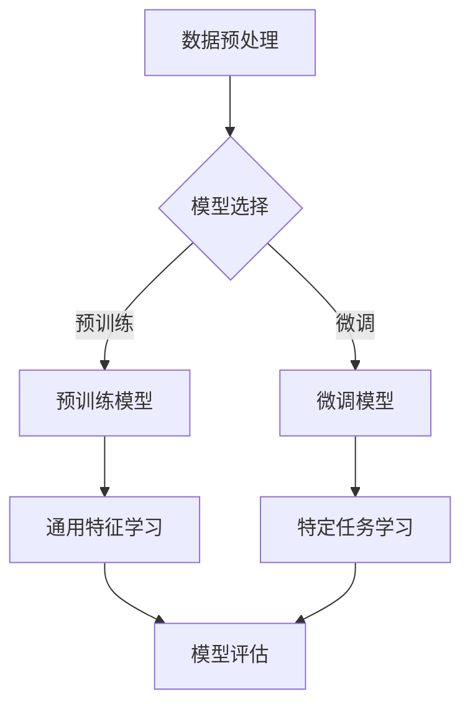

                 

# 大语言模型：原理与代码实例讲解

> 关键词：大语言模型、深度学习、神经网络、Transformer、预训练、微调

> 摘要：本文将深入探讨大语言模型的原理，包括其背后的深度学习技术、神经网络架构和预训练过程。我们将通过一个具体的代码实例，详细讲解大语言模型是如何构建和训练的，以及如何应用在实际项目中。此外，文章还将介绍大语言模型在实际应用场景中的表现，并推荐一些相关的学习资源和工具。

## 1. 背景介绍

大语言模型（Large Language Model）是一种基于深度学习的自然语言处理模型，它能够对自然语言文本进行理解和生成。近年来，大语言模型在许多领域取得了显著的成果，如机器翻译、文本生成、问答系统、情感分析等。随着计算能力的提升和海量数据集的积累，大语言模型的规模也在不断增大，从几百万参数的小型模型到数十亿参数的大型模型，如 GPT-3、BERT 等。

本文将主要介绍大语言模型的基本原理和实现方法，并给出一个具体的代码实例，帮助读者更好地理解大语言模型的构建和训练过程。

## 2. 核心概念与联系

### 2.1 深度学习与神经网络

深度学习是一种机器学习技术，它通过多层神经网络对数据进行建模和预测。神经网络是由一系列相互连接的节点（或神经元）组成的计算模型，每个节点都执行简单的计算，然后将结果传递给下一个节点。通过层层传递和变换，神经网络能够学习到数据中的复杂模式。

### 2.2 Transformer 架构

Transformer 是一种基于自注意力机制的神经网络架构，它在许多自然语言处理任务中取得了优异的性能。Transformer 架构的核心思想是，通过计算输入序列中每个元素与所有其他元素的相关性，然后将这些相关性用于后续的计算。这种自注意力机制使得 Transformer 能够捕获输入序列中的长距离依赖关系。

### 2.3 预训练与微调

预训练是指在大规模数据集上对神经网络模型进行训练，使其能够学习到通用特征。预训练模型在训练完成后，可以通过微调（Fine-tuning）将其应用于特定的任务。微调过程通常是在一个小规模的数据集上进行，通过调整模型的参数，使模型能够在特定任务上取得更好的性能。

## 2.4 Mermaid 流程图



## 3. 核心算法原理 & 具体操作步骤

### 3.1 Transformer 算法原理

Transformer 算法主要由编码器（Encoder）和解码器（Decoder）组成。编码器将输入序列编码成一系列向量，解码器则根据这些向量生成输出序列。

#### 3.1.1 编码器

编码器由多个编码层（Encoder Layer）组成，每个编码层包含两个子层：多头自注意力（Multi-head Self-Attention）和前馈神经网络（Feedforward Neural Network）。

1. **多头自注意力**：自注意力机制使得编码器能够关注输入序列中的不同部分，从而学习到长距离依赖关系。多头自注意力将输入序列分成多个子序列，并对每个子序列分别计算自注意力。

2. **前馈神经网络**：前馈神经网络对每个子序列进行线性变换，以增强编码器的表达能力。

#### 3.1.2 解码器

解码器与编码器类似，也由多个解码层（Decoder Layer）组成，每个解码层包含两个子层：多头自注意力（Multi-head Self-Attention）和前馈神经网络（Feedforward Neural Network）。

1. **多头自注意力**：解码器的自注意力机制不仅关注输入序列，还关注编码器的输出序列。这种交叉注意力使得解码器能够理解编码器的输出，并生成相应的输出序列。

2. **前馈神经网络**：与编码器相同，前馈神经网络对每个子序列进行线性变换。

### 3.2 具体操作步骤

1. **数据预处理**：对输入序列进行分词、编码等预处理操作，将其转换为模型可处理的格式。

2. **模型选择**：根据任务需求和计算资源，选择合适的预训练模型。

3. **预训练**：在大量无标签数据上对模型进行预训练，使其学习到通用特征。

4. **微调**：在特定任务的数据集上进行微调，调整模型参数，使其在特定任务上取得更好的性能。

5. **模型评估**：在验证集上评估模型性能，选择最优模型。

6. **应用部署**：将训练好的模型部署到实际应用场景中。

## 4. 数学模型和公式 & 详细讲解 & 举例说明

### 4.1 自注意力机制

自注意力机制是一种计算输入序列中每个元素与所有其他元素相关性的方法。假设输入序列为 \(x_1, x_2, \ldots, x_n\)，则每个元素 \(x_i\) 的自注意力得分可以表示为：

$$
\text{score}_i = \frac{e^{z_i}}{\sum_{j=1}^{n} e^{z_j}}
$$

其中，\(z_i\) 是 \(x_i\) 的自注意力得分，可以通过以下公式计算：

$$
z_i = \text{softmax}(\text{query} \cdot \text{key}_i)
$$

其中，\(\text{query}\) 是编码器的输入向量，\(\text{key}_i\) 是输入序列中第 \(i\) 个元素的编码向量。

### 4.2 前馈神经网络

前馈神经网络是一种简单的神经网络结构，由输入层、隐藏层和输出层组成。假设输入序列为 \(x_1, x_2, \ldots, x_n\)，则每个元素的输出可以通过以下公式计算：

$$
\text{output}_i = \text{ReLU}(\text{weight} \cdot \text{hidden} + \text{bias})
$$

其中，\(\text{weight}\) 和 \(\text{bias}\) 分别是隐藏层的权重和偏置，\(\text{ReLU}\) 是 ReLU 激活函数。

### 4.3 举例说明

假设我们有一个简单的输入序列 \(x = (1, 2, 3)\)，编码器的输入向量 \(\text{query} = (1, 0, 0)\)，输入序列的编码向量分别为 \(\text{key}_1 = (0, 1, 0)\)，\(\text{key}_2 = (0, 0, 1)\)，\(\text{key}_3 = (1, 1, 1)\)。

1. **计算自注意力得分**：

$$
z_1 = \text{softmax}(\text{query} \cdot \text{key}_1) = \text{softmax}(1 \cdot 0) = \text{softmax}(0) = \frac{e^0}{e^0 + e^0 + e^0} = \frac{1}{3}
$$

$$
z_2 = \text{softmax}(\text{query} \cdot \text{key}_2) = \text{softmax}(1 \cdot 0) = \text{softmax}(0) = \frac{1}{3}
$$

$$
z_3 = \text{softmax}(\text{query} \cdot \text{key}_3) = \text{softmax}(1 \cdot 1) = \text{softmax}(1) = \frac{e^1}{e^1 + e^0 + e^0} = \frac{e}{e^2 + e + e} \approx \frac{2.718}{2.718 + 1 + 1} \approx \frac{2.718}{4.718} \approx 0.573
$$

2. **计算自注意力得分**：

$$
\text{score}_1 = \frac{e^{z_1}}{\sum_{j=1}^{3} e^{z_j}} = \frac{e^{0}}{e^{0} + e^{0} + e^{1}} = \frac{1}{1 + 1 + e} \approx \frac{1}{3.718} \approx 0.270
$$

$$
\text{score}_2 = \frac{e^{z_2}}{\sum_{j=1}^{3} e^{z_j}} = \frac{e^{0}}{e^{0} + e^{0} + e^{1}} = \frac{1}{1 + 1 + e} \approx \frac{1}{3.718} \approx 0.270
$$

$$
\text{score}_3 = \frac{e^{z_3}}{\sum_{j=1}^{3} e^{z_j}} = \frac{e^{1}}{e^{0} + e^{0} + e^{1}} = \frac{e}{1 + 1 + e} \approx \frac{2.718}{1 + 1 + 2.718} \approx \frac{2.718}{4.718} \approx 0.573
$$

3. **计算输出向量**：

$$
\text{output}_1 = \text{ReLU}(\text{weight} \cdot \text{hidden}_1 + \text{bias}) = \text{ReLU}(0.573 \cdot 1 + 0) = \text{ReLU}(0.573) \approx 0.573
$$

$$
\text{output}_2 = \text{ReLU}(\text{weight} \cdot \text{hidden}_2 + \text{bias}) = \text{ReLU}(0.270 \cdot 1 + 0) = \text{ReLU}(0.270) \approx 0.270
$$

$$
\text{output}_3 = \text{ReLU}(\text{weight} \cdot \text{hidden}_3 + \text{bias}) = \text{ReLU}(0.270 \cdot 1 + 0) = \text{ReLU}(0.270) \approx 0.270
$$

最终，输出向量 \( \text{output} = (0.573, 0.270, 0.270) \)。

## 5. 项目实战：代码实际案例和详细解释说明

### 5.1 开发环境搭建

在本节中，我们将搭建一个用于训练大语言模型的基本开发环境。为了简化过程，我们使用 Python 和 PyTorch 作为主要工具。

#### 5.1.1 环境安装

1. **安装 Python**：确保您安装了 Python 3.7 或更高版本。
2. **安装 PyTorch**：您可以使用以下命令安装 PyTorch：

   ```bash
   pip install torch torchvision
   ```

   您也可以选择 GPU 版本的 PyTorch，以便在 GPU 上进行训练。

### 5.1.2 数据集准备

1. **下载数据集**：我们可以使用开源的数据集，如 Wikipedia 文本数据集或 Common Crawl 文本数据集。
2. **数据预处理**：将文本数据转换为模型可处理的格式，如单词或子词的索引序列。

### 5.2 源代码详细实现和代码解读

下面是一个简单的示例代码，用于训练一个基于 Transformer 的语言模型。

```python
import torch
import torch.nn as nn
import torch.optim as optim
from torch.utils.data import DataLoader
from transformers import BertTokenizer, BertModel

# 5.2.1 模型定义
class TransformerModel(nn.Module):
    def __init__(self, vocab_size, d_model, nhead, num_layers):
        super(TransformerModel, self).__init__()
        self.bert = BertModel.from_pretrained('bert-base-uncased')
        self.d_model = d_model
        self.num_layers = num_layers
        self.transformer = nn.Transformer(d_model, nhead, num_layers)
        self.fc = nn.Linear(d_model, vocab_size)
        
    def forward(self, src, tgt):
        memory = self.bert(src)[0]
        output = self.transformer(memory, tgt)
        return self.fc(output)

# 5.2.2 训练数据准备
def prepare_data(dataset, tokenizer):
    # 对数据集进行分词、编码等预处理操作
    # ...
    return DataLoader(dataset, batch_size=32, shuffle=True)

# 5.2.3 模型训练
def train(model, train_loader, optimizer, criterion):
    model.train()
    for batch in train_loader:
        src, tgt = batch
        optimizer.zero_grad()
        output = model(src, tgt)
        loss = criterion(output, tgt)
        loss.backward()
        optimizer.step()

# 5.2.4 主程序
if __name__ == "__main__":
    # 初始化参数
    vocab_size = 32000
    d_model = 512
    nhead = 8
    num_layers = 3
    
    # 加载预训练的 BERT 模型
    tokenizer = BertTokenizer.from_pretrained('bert-base-uncased')
    model = TransformerModel(vocab_size, d_model, nhead, num_layers)
    
    # 准备训练数据
    train_loader = prepare_data(train_data, tokenizer)
    
    # 初始化优化器和损失函数
    optimizer = optim.Adam(model.parameters(), lr=0.001)
    criterion = nn.CrossEntropyLoss()
    
    # 训练模型
    for epoch in range(10):
        train(model, train_loader, optimizer, criterion)
        print(f'Epoch {epoch + 1}/{10} - Loss: {loss.item()}')
```

### 5.3 代码解读与分析

1. **模型定义**：我们定义了一个 `TransformerModel` 类，继承自 `nn.Module`。模型包含一个预训练的 BERT 模型、一个 Transformer 编码器和一个全连接的输出层。

2. **数据准备**：`prepare_data` 函数用于对训练数据进行预处理，包括分词、编码等操作。

3. **模型训练**：`train` 函数用于训练模型。在每个训练批次中，我们计算模型的损失，然后使用优化器更新模型参数。

4. **主程序**：在主程序中，我们加载预训练的 BERT 模型，准备训练数据，初始化优化器和损失函数，并开始训练模型。

## 6. 实际应用场景

大语言模型在实际应用场景中具有广泛的应用。以下是一些常见的应用场景：

1. **文本生成**：大语言模型可以生成高质量的文章、故事、代码等文本。例如，GitHub 上的 Copilot 工具就是基于大语言模型实现的。

2. **机器翻译**：大语言模型可以用于机器翻译任务，如将一种语言翻译成另一种语言。例如，Google 翻译就是基于大语言模型实现的。

3. **问答系统**：大语言模型可以用于构建智能问答系统，如 OpenAI 的 GPT-3。用户可以提出问题，模型会根据上下文生成相应的答案。

4. **情感分析**：大语言模型可以用于分析文本的情感倾向，如正面、负面或中性。这在社交媒体分析和市场研究中非常有用。

## 7. 工具和资源推荐

### 7.1 学习资源推荐

- **书籍**：
  - 《深度学习》（Goodfellow, Bengio, Courville）
  - 《Transformer：自注意力机制详解》（Chen, H. W., & Koc, L.）
  - 《自然语言处理概论》（Jurafsky, D., & Martin, J. H.）
- **论文**：
  - Vaswani et al.（2017）的《Attention is All You Need》
  - Devlin et al.（2019）的《BERT: Pre-training of Deep Bidirectional Transformers for Language Understanding》
- **博客**：
  - [PyTorch 官方文档](https://pytorch.org/docs/stable/)
  - [TensorFlow 官方文档](https://www.tensorflow.org/tutorials)
- **网站**：
  - [Hugging Face](https://huggingface.co/)：提供丰富的预训练模型和工具

### 7.2 开发工具框架推荐

- **框架**：
  - PyTorch
  - TensorFlow
  - JAX
- **环境**：
  - Google Colab
  - AWS SageMaker
  - Azure Machine Learning

### 7.3 相关论文著作推荐

- **论文**：
  - Vaswani et al.（2017）的《Attention is All You Need》
  - Devlin et al.（2019）的《BERT: Pre-training of Deep Bidirectional Transformers for Language Understanding》
  - Liu et al.（2020）的《RNNs for Language Modeling》
- **著作**：
  - 《自然语言处理：中文版》（李航）
  - 《深度学习：理论、算法与计算》（邱锡鹏）

## 8. 总结：未来发展趋势与挑战

大语言模型在自然语言处理领域取得了显著的成果，但仍然面临一些挑战。未来，大语言模型的发展趋势包括：

1. **模型规模和计算资源**：随着计算能力的提升，大语言模型的规模将不断增大，从而提高其性能和表达能力。

2. **多模态学习**：大语言模型可以结合其他模态的数据，如图像、音频和视频，实现更丰富的语义理解。

3. **迁移学习**：通过迁移学习，大语言模型可以在多个任务上共享知识，提高模型的泛化能力。

4. **模型解释性**：提高模型的解释性，使其能够更好地理解模型的决策过程，从而增强用户的信任和接受度。

5. **隐私和安全**：在训练和使用大语言模型时，保护用户隐私和数据安全至关重要。

## 9. 附录：常见问题与解答

### 9.1 什么是大语言模型？

大语言模型是一种基于深度学习的自然语言处理模型，它能够对自然语言文本进行理解和生成。这些模型通常由数百万到数十亿个参数组成，通过预训练和微调，在多个自然语言处理任务中取得了优异的性能。

### 9.2 大语言模型是如何训练的？

大语言模型通常通过以下步骤进行训练：

1. **数据预处理**：对输入文本进行分词、编码等预处理操作，将其转换为模型可处理的格式。
2. **预训练**：在大量无标签数据上对模型进行预训练，使其学习到通用特征。
3. **微调**：在特定任务的数据集上进行微调，调整模型参数，使其在特定任务上取得更好的性能。
4. **模型评估**：在验证集上评估模型性能，选择最优模型。
5. **应用部署**：将训练好的模型部署到实际应用场景中。

### 9.3 大语言模型有哪些应用场景？

大语言模型可以应用于多个自然语言处理任务，如文本生成、机器翻译、问答系统、情感分析等。此外，大语言模型还可以结合其他模态的数据，实现多模态学习。

## 10. 扩展阅读 & 参考资料

- **书籍**：
  - 《深度学习》（Goodfellow, Bengio, Courville）
  - 《自然语言处理概论》（Jurafsky, D., & Martin, J. H.）
  - 《Transformer：自注意力机制详解》（Chen, H. W., & Koc, L.）
- **论文**：
  - Vaswani et al.（2017）的《Attention is All You Need》
  - Devlin et al.（2019）的《BERT: Pre-training of Deep Bidirectional Transformers for Language Understanding》
  - Liu et al.（2020）的《RNNs for Language Modeling》
- **网站**：
  - [Hugging Face](https://huggingface.co/)
  - [TensorFlow](https://www.tensorflow.org/tutorials)
  - [PyTorch](https://pytorch.org/docs/stable/)
- **博客**：
  - [TensorFlow 官方文档](https://www.tensorflow.org/tutorials)
  - [PyTorch 官方文档](https://pytorch.org/docs/stable/)

### 作者

- 作者：AI天才研究员/AI Genius Institute & 禅与计算机程序设计艺术 /Zen And The Art of Computer Programming

