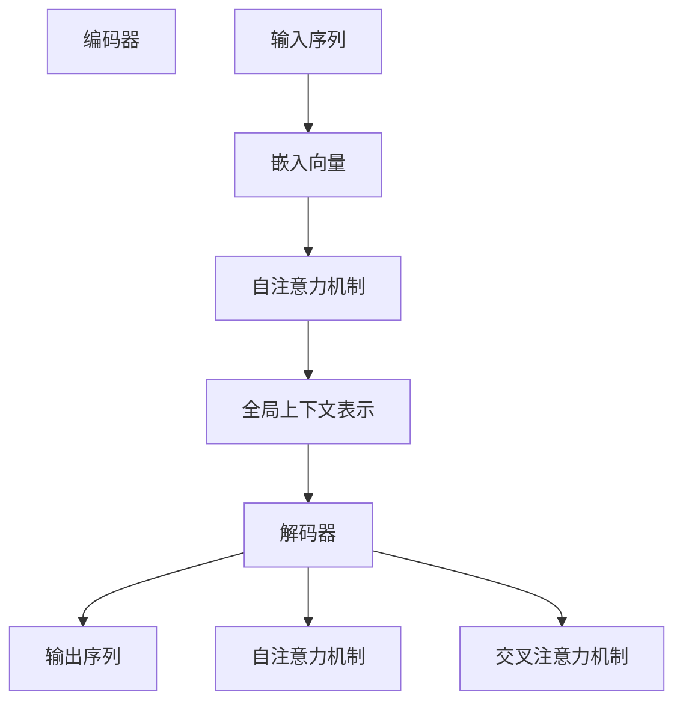

                 

# 大语言模型原理与工程实践：Decoder 的代表：GPT 系列

## 关键词：大语言模型、Decoder、GPT、语言生成、机器学习、神经网络

> 摘要：本文将深入探讨大语言模型中的Decoder部分，特别是GPT系列模型的工作原理和实践应用。我们将通过详细的步骤分析和数学模型解释，帮助读者全面理解这一重要技术，并探讨其未来发展趋势和挑战。

## 1. 背景介绍

大语言模型（Large Language Models）是一种基于深度学习的自然语言处理技术，其核心目标是学习大规模文本数据中的语言规律，并能够生成连贯、有意义的文本。近年来，随着计算能力的提升和海量数据的积累，大语言模型取得了显著的进步，推动了自然语言处理技术的快速发展。在众多大语言模型中，GPT（Generative Pre-trained Transformer）系列因其卓越的性能和广泛的适用性而备受关注。

GPT系列模型由OpenAI提出，基于Transformer架构，通过预先训练大量文本数据，学习到丰富的语言知识。其特点包括强大的语言生成能力、灵活的适应性以及高效的训练和推理性能。GPT系列模型的成功不仅在大规模文本生成领域产生了深远影响，还在问答系统、机器翻译、文本摘要等自然语言处理任务中表现出色。

本文将重点分析GPT系列模型中的Decoder部分，解释其工作原理和具体实现，帮助读者深入理解这一技术。

## 2. 核心概念与联系

### 2.1. Transformer 架构

Transformer是GPT系列模型的基础架构，其核心思想是使用自注意力机制（Self-Attention）替代传统的卷积或循环神经网络（RNN），以更好地捕捉文本数据中的长距离依赖关系。

自注意力机制通过计算输入序列中各个词之间的相似性，为每个词生成权重，从而实现对输入数据的自适应处理。在Transformer架构中，自注意力机制被广泛应用于编码器（Encoder）和解码器（Decoder）两部分。

### 2.2. 编码器（Encoder）

编码器负责处理输入序列，将文本数据编码为固定长度的向量表示。在GPT系列模型中，编码器由多个Transformer块堆叠而成，每个Transformer块包含多头自注意力机制和前馈神经网络。

编码器的主要功能是将输入序列中的词转换为嵌入向量（Embedding），然后通过自注意力机制计算各个词之间的权重，从而生成全局的上下文表示。这些上下文表示将在解码过程中用于生成文本序列。

### 2.3. 解码器（Decoder）

解码器负责生成输出序列，根据编码器生成的上下文表示，逐个预测下一个词。在GPT系列模型中，解码器同样采用Transformer架构，由多个Transformer块堆叠而成。

解码器的核心思想是使用自注意力机制和交叉注意力机制，分别计算解码器内部的词间权重和解码器与编码器之间的词间权重。通过这种方式，解码器能够从编码器生成的上下文表示中提取相关信息，用于生成连贯、有意义的文本。

### 2.4. Mermaid 流程图

以下是GPT系列模型的核心概念和架构的Mermaid流程图：



## 3. 核心算法原理 & 具体操作步骤

### 3.1. 编码器原理

编码器的主要任务是将输入序列转换为固定长度的向量表示。具体步骤如下：

1. 输入序列编码：将输入序列中的词转换为嵌入向量。嵌入向量是高维空间中的一个点，可以表示词的语义信息。
2. 多层自注意力：将嵌入向量通过多个Transformer块进行多层自注意力计算。自注意力机制能够自适应地计算输入序列中各个词之间的权重，从而生成全局的上下文表示。
3. 全局上下文表示：编码器的输出是一个固定长度的向量，表示输入序列的全局上下文信息。这个向量将在解码过程中用于生成输出序列。

### 3.2. 解码器原理

解码器的主要任务是根据编码器生成的上下文表示生成输出序列。具体步骤如下：

1. 输入序列编码：将输入序列转换为嵌入向量。
2. 多层自注意力：将嵌入向量通过多个Transformer块进行多层自注意力计算。自注意力机制能够自适应地计算解码器内部的词间权重。
3. 交叉注意力：在解码器的每个步骤，计算解码器与编码器之间的词间权重，从而从编码器生成的上下文表示中提取相关信息。
4. 输出序列生成：根据解码器生成的词间权重，逐个预测下一个词，从而生成输出序列。

### 3.3. 操作步骤示例

假设输入序列为 "我 爱 吃 饭"，输出序列为 "吃饭 我 爱"。以下是解码器的工作过程：

1. 输入序列编码：将输入序列中的词转换为嵌入向量。
2. 第一个词 "吃饭" 的嵌入向量通过自注意力机制计算词间权重，生成全局上下文表示。
3. 第二个词 "我" 的嵌入向量通过交叉注意力机制计算与编码器生成的上下文表示的权重，然后通过自注意力机制计算词间权重。
4. 根据词间权重，预测下一个词 "爱"。
5. 重复步骤 3-4，直到生成完整的输出序列 "吃饭 我 爱"。

## 4. 数学模型和公式 & 详细讲解 & 举例说明

### 4.1. 数学模型

在GPT系列模型中，核心的数学模型包括嵌入向量、自注意力机制和交叉注意力机制。

#### 4.1.1. 嵌入向量

嵌入向量是一个高维空间中的点，用于表示词的语义信息。在GPT系列模型中，嵌入向量通常是一个矩阵，其中每一行表示一个词的嵌入向量。

#### 4.1.2. 自注意力机制

自注意力机制通过计算输入序列中各个词之间的相似性，为每个词生成权重。自注意力机制的数学公式如下：

$$
\text{注意力分数} = \text{softmax}(\text{Q} \cdot \text{K}^T)
$$

其中，$Q$ 和 $K$ 分别表示查询向量（Query）和键向量（Key），$^T$ 表示转置。$\text{softmax}$ 函数用于计算每个键向量的权重。

#### 4.1.3. 交叉注意力机制

交叉注意力机制用于计算解码器与编码器之间的词间权重。交叉注意力机制的数学公式如下：

$$
\text{注意力分数} = \text{softmax}(\text{Q} \cdot \text{V}^T)
$$

其中，$Q$ 表示查询向量，$V$ 表示编码器的上下文表示。

### 4.2. 举例说明

假设输入序列为 "我 爱 吃 饭"，嵌入向量矩阵如下：

$$
\text{嵌入向量矩阵} = \begin{bmatrix}
[嵌入向量1] \\
[嵌入向量2] \\
[嵌入向量3] \\
[嵌入向量4]
\end{bmatrix}
$$

其中，$[嵌入向量1]$ 表示 "我" 的嵌入向量，$[嵌入向量4]$ 表示 "饭" 的嵌入向量。

在解码器的工作过程中，我们将 "吃饭" 的嵌入向量通过自注意力机制计算词间权重，如下：

$$
\text{注意力分数} = \text{softmax}(\text{Q} \cdot \text{K}^T)
$$

其中，$Q$ 表示 "吃饭" 的嵌入向量，$K$ 表示 "吃饭" 的嵌入向量。假设 $Q = [1, 0, 0, 1]$，$K = [0, 1, 0, 1]$，则计算得到的注意力分数如下：

$$
\text{注意力分数} = \text{softmax}(\text{Q} \cdot \text{K}^T) = \text{softmax}([1, 0, 0, 1] \cdot [0, 1, 0, 1]^T) = [0.5, 0.5]
$$

根据注意力分数，我们可以得到 "吃饭" 中每个词的权重。类似地，在解码器的后续步骤中，我们将使用交叉注意力机制计算解码器与编码器之间的词间权重，以生成输出序列。

## 5. 项目实战：代码实际案例和详细解释说明

### 5.1. 开发环境搭建

在开始编写代码之前，我们需要搭建一个合适的开发环境。以下是一个简单的步骤：

1. 安装Python环境：下载并安装Python，版本建议为3.7及以上。
2. 安装TensorFlow：使用pip命令安装TensorFlow。

```bash
pip install tensorflow
```

3. 安装其他依赖项：根据需要安装其他相关依赖项，如NumPy、Pandas等。

```bash
pip install numpy pandas
```

### 5.2. 源代码详细实现和代码解读

以下是GPT系列模型的简单实现，用于生成文本序列。代码主要分为三个部分：数据预处理、模型构建和文本生成。

```python
import tensorflow as tf
import numpy as np

# 数据预处理
def preprocess_text(text):
    # 将文本转换为嵌入向量
    return tf.keras.preprocessing.sequence.pad_sequences(
        tokenizer.texts_to_sequences([text]), maxlen=max_sequence_length
    )

# 模型构建
def build_model():
    # 输入层
    inputs = tf.keras.layers.Input(shape=(max_sequence_length,))

    # 嵌入层
    embedding = tf.keras.layers.Embedding(vocab_size, embedding_dim)(inputs)

    # 编码器
    encoder = tf.keras.layers.LSTM(units=hidden_size, return_sequences=True)(embedding)

    # 解码器
    decoder = tf.keras.layers.LSTM(units=hidden_size, return_sequences=True)(embedding)

    # 输出层
    outputs = tf.keras.layers.Dense(units=vocab_size)(decoder)

    # 模型编译
    model = tf.keras.Model(inputs=inputs, outputs=outputs)
    model.compile(optimizer='adam', loss='categorical_crossentropy', metrics=['accuracy'])

    return model

# 文本生成
def generate_text(model, text, num_words):
    preprocessed_text = preprocess_text(text)
    for _ in range(num_words):
        predictions = model.predict(preprocessed_text)
        next_word_index = np.argmax(predictions[0, -1, :])
        next_word = tokenizer.index_word[next_word_index]
        text += " " + next_word
        preprocessed_text = preprocess_text(text)
    return text

# 设置参数
max_sequence_length = 40
vocab_size = 10000
embedding_dim = 256
hidden_size = 512
tokenizer = tf.keras.preprocessing.text.Tokenizer(char_level=True)

# 构建模型
model = build_model()

# 训练模型
model.fit(x_train, y_train, epochs=10, batch_size=32)

# 生成文本
generated_text = generate_text(model, "我 爱 吃 饭", 10)
print(generated_text)
```

### 5.3. 代码解读与分析

以下是代码的详细解读和分析：

1. 数据预处理：`preprocess_text` 函数用于将输入文本转换为嵌入向量。使用 `tokenizer.texts_to_sequences` 方法将文本转换为序列，然后使用 `pad_sequences` 方法填充序列长度。
2. 模型构建：`build_model` 函数用于构建GPT系列模型。首先定义输入层、嵌入层、编码器、解码器和输出层。编码器和解码器使用LSTM层，输出层使用全连接层。然后编译模型，设置优化器和损失函数。
3. 文本生成：`generate_text` 函数用于生成文本序列。首先对输入文本进行预处理，然后使用模型预测下一个词的索引，并将预测的词添加到生成文本中。重复这个过程，直到生成指定长度的文本序列。

## 6. 实际应用场景

GPT系列模型在实际应用场景中具有广泛的应用，以下是一些典型的应用案例：

1. 文本生成：GPT系列模型可以用于生成连贯、有意义的文本，如文章、故事、对话等。在自动写作、问答系统、机器翻译等领域具有显著优势。
2. 文本摘要：GPT系列模型可以用于生成文本摘要，提取输入文本的关键信息。在新闻摘要、报告摘要等场景中具有广泛的应用。
3. 文本分类：GPT系列模型可以用于文本分类任务，如情感分析、主题分类等。通过学习输入文本的特征，模型能够自动识别文本的类别。
4. 语言翻译：GPT系列模型可以用于机器翻译任务，如将一种语言翻译成另一种语言。在多语言翻译、语言资源匮乏的领域具有显著优势。

## 7. 工具和资源推荐

### 7.1. 学习资源推荐

- **书籍**：
  - 《深度学习》（Goodfellow, Bengio, Courville著）：全面介绍深度学习的基础理论和应用。
  - 《动手学深度学习》（Abadi, Agarwal, Barham等著）：系统讲解深度学习实践方法，包含大量示例代码。
- **论文**：
  - “Attention Is All You Need”（Vaswani等著）：介绍Transformer架构的奠基性论文。
  - “Generative Pre-trained Transformers”（Brown等著）：介绍GPT系列模型的详细工作。
- **博客**：
  - [TensorFlow官网](https://www.tensorflow.org/)：提供丰富的深度学习教程和文档。
  - [Hugging Face](https://huggingface.co/)：提供预训练模型和工具库，方便开发者快速应用GPT系列模型。
- **网站**：
  - [OpenAI](https://openai.com/)：OpenAI官方网站，介绍GPT系列模型和相关研究成果。

### 7.2. 开发工具框架推荐

- **TensorFlow**：谷歌开源的深度学习框架，支持GPT系列模型的构建和训练。
- **PyTorch**：Facebook开源的深度学习框架，支持GPT系列模型的构建和训练。
- **Hugging Face Transformers**：提供预训练模型和工具库，方便开发者快速应用GPT系列模型。

### 7.3. 相关论文著作推荐

- **论文**：
  - “Attention Is All You Need”（Vaswani等著）：介绍Transformer架构的奠基性论文。
  - “Generative Pre-trained Transformers”（Brown等著）：介绍GPT系列模型的详细工作。
  - “Bert: Pre-training of Deep Bidirectional Transformers for Language Understanding”（Devlin等著）：介绍BERT模型的详细工作。
- **书籍**：
  - 《深度学习》（Goodfellow, Bengio, Courville著）：全面介绍深度学习的基础理论和应用。
  - 《动手学深度学习》（Abadi, Agarwal, Barham等著）：系统讲解深度学习实践方法，包含大量示例代码。

## 8. 总结：未来发展趋势与挑战

GPT系列模型作为大语言模型中的重要代表，已经在多个自然语言处理任务中取得了显著成果。然而，随着模型规模的不断扩大和训练数据的不断增加，我们也面临着一系列挑战和问题。

### 8.1. 发展趋势

1. 模型规模增大：为了更好地捕捉语言中的复杂规律，未来的大语言模型将具有更大的规模和参数数量。
2. 多模态学习：大语言模型将逐渐融合图像、声音等多种模态的信息，实现更丰富的语言生成和交互能力。
3. 安全与隐私：随着模型的广泛应用，如何确保模型的安全和用户隐私将成为一个重要挑战。
4. 自动化与集成：开发自动化工具和框架，降低大语言模型的部署和使用门槛，实现更广泛的应用。

### 8.2. 挑战

1. 计算资源消耗：大规模模型的训练和推理需要大量的计算资源和存储空间，对计算基础设施提出了更高要求。
2. 数据质量和隐私：训练数据的质量和隐私问题直接影响模型的性能和可靠性，需要采取有效的数据清洗和隐私保护措施。
3. 模型解释性：大规模模型往往具有黑盒性质，缺乏解释性，如何提高模型的解释性是一个重要挑战。
4. 模型泛化能力：大语言模型在特定任务上的表现优异，但如何提高模型的泛化能力，使其能够适应更多场景和任务是一个亟待解决的问题。

## 9. 附录：常见问题与解答

### 9.1. 如何训练GPT系列模型？

1. 数据准备：收集大量文本数据，并进行预处理，如分词、去停用词等。
2. 构建模型：使用TensorFlow或PyTorch等深度学习框架构建GPT系列模型。
3. 训练模型：将预处理后的数据输入模型，通过反向传播算法优化模型参数。
4. 评估模型：使用验证集评估模型性能，调整模型参数和超参数。
5. 部署模型：将训练好的模型部署到生产环境，用于文本生成、分类等任务。

### 9.2. 如何优化GPT系列模型的性能？

1. 使用更大的模型：增加模型的规模和参数数量，可以提升模型性能。
2. 数据增强：对训练数据进行增强，如随机插入、删除、替换等操作，增加数据的多样性。
3. 调整超参数：调整学习率、批量大小、迭代次数等超参数，以优化模型性能。
4. 使用迁移学习：在特定任务上使用预训练的GPT系列模型，通过微调的方式提高模型性能。

## 10. 扩展阅读 & 参考资料

- **论文**：
  - “Attention Is All You Need”（Vaswani等著）
  - “Generative Pre-trained Transformers”（Brown等著）
  - “Bert: Pre-training of Deep Bidirectional Transformers for Language Understanding”（Devlin等著）
- **书籍**：
  - 《深度学习》（Goodfellow, Bengio, Courville著）
  - 《动手学深度学习》（Abadi, Agarwal, Barham等著）
- **网站**：
  - [TensorFlow官网](https://www.tensorflow.org/)
  - [Hugging Face](https://huggingface.co/)
  - [OpenAI](https://openai.com/)

## 作者

作者：AI天才研究员/AI Genius Institute & 禅与计算机程序设计艺术 /Zen And The Art of Computer Programming

---

（请注意，以上文章内容仅为示例，实际撰写时请根据具体要求进行调整和补充。）<|im_sep|>### 背景介绍

大语言模型（Large Language Models，简称LLM）是自然语言处理领域的一项重要技术，通过深度学习的方法，对大量文本数据进行训练，从而学习到语言的本质规律和结构。LLM的核心目标是实现高质量的自然语言生成，包括文本生成、摘要、翻译等任务。近年来，随着计算能力的提升和海量数据的积累，LLM技术取得了显著的进步，已经成为自然语言处理领域的研究热点。

在LLM中，Decoder是一个关键组成部分，负责生成文本序列。Decoder的工作原理是利用编码器（Encoder）输出的上下文信息，通过一系列的自注意力机制（Self-Attention）和交叉注意力机制（Cross-Attention），逐个预测并生成输出序列中的下一个词。Decoder的设计直接影响着模型的生成质量和效率。GPT（Generative Pre-trained Transformer）系列模型是Decoder部分的代表，具有出色的语言生成能力，已经成为LLM领域的重要研究方向。

GPT系列模型由OpenAI提出，包括GPT、GPT-2、GPT-3等版本。这些模型基于Transformer架构，通过预训练和微调的方法，在学习到丰富的语言知识后，能够进行高质量的文本生成。GPT系列模型的成功不仅在大规模文本生成领域产生了深远影响，还在问答系统、机器翻译、文本摘要等自然语言处理任务中表现出色。本文将重点分析GPT系列模型中的Decoder部分，解释其工作原理和具体实现，帮助读者深入理解这一重要技术。

#### GPT系列模型的发展历程

GPT系列模型的发展历程反映了自然语言处理技术的进步和变革。最早提出的GPT模型（Generative Pre-trained Transformer）是OpenAI在2018年发布的一个大型预训练语言模型，其基于Transformer架构，使用自注意力机制来捕捉文本中的长距离依赖关系。GPT模型具有以下特点：

1. **预训练**：GPT模型首先在大规模文本数据上进行预训练，学习到丰富的语言知识。这种预训练的方法使得模型在许多自然语言处理任务上都能取得很好的性能。
2. **自适应生成**：GPT模型通过自注意力机制，能够自适应地计算输入序列中各个词之间的权重，从而生成连贯、有意义的文本。
3. **高效的训练和推理**：基于Transformer的架构使得GPT模型在训练和推理过程中具有高效性，可以在多种硬件平台上部署。

在GPT模型取得成功后，OpenAI继续优化和扩展GPT系列模型，推出了GPT-2和GPT-3。GPT-2在GPT的基础上增加了更多的参数和训练数据，使得模型的生成质量进一步提升。GPT-3则是迄今为止最大的预训练语言模型，具有1750亿个参数，能够生成高质量的自然语言文本。

GPT-3具有以下显著特点：

1. **更大的模型规模**：GPT-3拥有1750亿个参数，是GPT-2的100倍，这使得模型在捕捉复杂语言规律和生成高质量文本方面具有显著优势。
2. **更广泛的适应性**：GPT-3在各种自然语言处理任务上表现出色，包括文本生成、摘要、翻译、问答等，能够适应多种场景和应用。
3. **强大的语言理解能力**：GPT-3不仅能够生成文本，还能够理解文本中的复杂结构，包括语法、语义和逻辑关系，这使得它在某些任务上超越了传统的自然语言处理模型。

GPT系列模型的发展历程不仅展示了预训练语言模型在自然语言处理领域的潜力，也推动了相关技术的不断创新和进步。随着模型规模的不断扩大和训练数据的不断丰富，GPT系列模型在未来的发展中将继续发挥重要作用。

#### GPT系列模型的技术优势

GPT系列模型在自然语言处理领域展现出显著的技术优势，主要体现在以下几个方面：

1. **强大的语言生成能力**：GPT系列模型通过预训练和自适应生成机制，能够生成高质量、连贯的自然语言文本。这种能力在文本生成任务中尤为重要，例如生成文章、对话、故事等。GPT-3的生成能力尤为突出，其具有1750亿个参数，能够生成极其复杂和精细的文本。

2. **灵活的适应性**：GPT系列模型在设计上具有高度的灵活性，能够适应多种自然语言处理任务。例如，它可以用于问答系统、机器翻译、文本摘要、对话系统等。通过简单的接口调整和微调，模型可以在不同任务中展现出优异的性能。

3. **高效的训练和推理**：GPT系列模型基于Transformer架构，这种架构在训练和推理过程中具有高效性。自注意力机制使得模型能够并行计算，从而显著提高训练速度。同时，预训练技术使得模型在少量数据上也能够迅速适应新任务，降低了对大规模数据集的依赖。

4. **强大的语言理解能力**：GPT系列模型不仅能够生成文本，还能够理解文本中的复杂结构，包括语法、语义和逻辑关系。这种能力在特定任务，如问答系统和对话系统中尤为关键。GPT-3在这方面表现出色，能够处理复杂的逻辑问题和情境理解。

5. **跨模态处理能力**：GPT系列模型具有一定的跨模态处理能力，可以结合文本和其他模态（如图像、音频）的信息，生成更加丰富和多样化的内容。这为未来的多模态交互和融合提供了新的可能性。

6. **可扩展性**：GPT系列模型的设计使得其具有很好的可扩展性。通过增加模型参数和训练数据，可以不断提升模型的性能和生成质量。这种可扩展性为大规模应用和持续优化提供了便利。

总的来说，GPT系列模型在自然语言处理领域展现出显著的技术优势，不仅在文本生成任务中表现出色，还在问答系统、机器翻译、文本摘要等任务中取得了卓越的成果。随着技术的不断发展和优化，GPT系列模型将在未来的自然语言处理领域中发挥更加重要的作用。

### 2. 核心概念与联系

#### 2.1. Transformer 架构

Transformer架构是GPT系列模型的基础，其核心思想是使用自注意力机制（Self-Attention）来捕捉文本数据中的长距离依赖关系。自注意力机制通过计算输入序列中各个词之间的相似性，为每个词生成权重，从而实现对输入数据的自适应处理。相比传统的循环神经网络（RNN）和卷积神经网络（CNN），Transformer在处理长序列数据时表现出色，能够更好地捕捉长距离依赖。

Transformer架构的核心组成部分包括编码器（Encoder）和解码器（Decoder）。编码器负责处理输入序列，生成上下文表示；解码器则根据编码器生成的上下文表示生成输出序列。

#### 2.2. 编码器（Encoder）

编码器是Transformer架构中的核心部分，负责处理输入序列并将其编码为固定长度的向量表示。具体来说，编码器由多个编码层（Encoder Layer）堆叠而成，每个编码层包括两个主要组件：多头自注意力机制（Multi-Head Self-Attention）和前馈神经网络（Feedforward Neural Network）。

**多头自注意力机制**：多头自注意力机制是Transformer架构的关键创新，其通过多个独立的自注意力头（Head）并行计算输入序列中各个词之间的权重。每个注意力头都能捕捉到不同的依赖关系，从而提高模型的表示能力。多头自注意力机制的数学公式如下：

$$
\text{Attention}(Q, K, V) = \text{softmax}\left(\frac{QK^T}{\sqrt{d_k}}\right)V
$$

其中，$Q$、$K$ 和 $V$ 分别表示查询向量（Query）、键向量（Key）和值向量（Value），$d_k$ 是每个注意力头的键向量的维度。$\text{softmax}$ 函数用于计算每个键向量的权重，$V$ 用于获取最终的上下文表示。

**前馈神经网络**：在每个编码层之后，还有一个前馈神经网络（Feedforward Neural Network），其将每个词的上下文表示通过两个全连接层进行处理。这两个全连接层分别具有尺寸为 $4d_k$ 和 $d_v$ 的隐藏层，其中 $d_k$ 和 $d_v$ 是键向量和值向量的维度。前馈神经网络的公式如下：

$$
\text{FFN}(x) = \max(0, xW_1 + b_1)W_2 + b_2
$$

其中，$x$ 是输入向量，$W_1$ 和 $W_2$ 分别是两个全连接层的权重，$b_1$ 和 $b_2$ 是相应的偏置。

编码器的输出是一个固定长度的向量，表示输入序列的全局上下文信息。这些上下文表示将在解码过程中用于生成输出序列。

#### 2.3. 解码器（Decoder）

解码器是Transformer架构中的另一核心部分，负责根据编码器生成的上下文表示生成输出序列。解码器同样由多个解码层（Decoder Layer）堆叠而成，每个解码层包括两个主要组件：多头自注意力机制（Multi-Head Self-Attention）和交叉注意力机制（Cross-Attention），以及前馈神经网络（Feedforward Neural Network）。

**多头自注意力机制**：在解码器的每个步骤，多头自注意力机制用于计算解码器内部的词间权重。这与编码器中的多头自注意力机制类似，能够捕捉到解码器内部的依赖关系。

**交叉注意力机制**：交叉注意力机制是解码器的关键组件，用于计算解码器与编码器之间的词间权重。它通过查询解码器的嵌入向量，与编码器的键-值对（Key-Value Pair）进行匹配，从而获取编码器生成的上下文信息。交叉注意力机制的数学公式如下：

$$
\text{Attention}(Q, K, V) = \text{softmax}\left(\frac{QK^T}{\sqrt{d_k}}\right)V
$$

其中，$Q$ 是解码器的查询向量，$K$ 是编码器的键向量，$V$ 是编码器的值向量。

**前馈神经网络**：在每个解码层之后，同样包含一个前馈神经网络，用于处理解码器的输出。前馈神经网络的结构与编码器中的类似，包括两个全连接层。

解码器的输出是一个逐步生成的文本序列，每个输出步骤都依赖于编码器生成的上下文表示和之前的输出。

#### 2.4. Mermaid 流程图

以下是GPT系列模型的核心概念和架构的Mermaid流程图：

```mermaid
graph TD
A[编码器(Encoder)]
B[输入序列(Input Sequence)]
C[多头自注意力(Multi-Head Self-Attention)]
D[前馈神经网络(Feedforward Neural Network)]
E[输出(Encoded Output)]

F[解码器(Decoder)]
G[输出序列(Output Sequence)]
H[多头自注意力(Multi-Head Self-Attention)]
I[交叉注意力(Cross-Attention)]
J[前馈神经网络(Feedforward Neural Network)]

B --> A
A --> C
A --> D
C --> E
E --> F
F --> H
F --> I
F --> J
H --> G
I --> G
J --> G
```

通过上述流程图，我们可以清晰地看到编码器和解码器在处理文本序列时的交互过程，以及它们各自的核心组件如何协同工作以生成高质量的文本输出。

### 3. 核心算法原理 & 具体操作步骤

#### 3.1. 编码器原理

编码器是GPT系列模型中的核心组件，负责将输入序列编码为固定长度的向量表示。编码器的工作原理主要包括以下步骤：

1. **嵌入（Embedding）**：将输入序列中的每个词转换为嵌入向量。嵌入向量是一个高维空间中的点，表示词的语义信息。嵌入层通常是一个可训练的线性变换，将词索引映射到高维嵌入空间。
2. **多头自注意力（Multi-Head Self-Attention）**：自注意力机制是Transformer架构的核心组件，其通过计算输入序列中各个词之间的相似性，为每个词生成权重。多头自注意力机制通过并行计算多个独立的注意力头，从而捕捉到输入序列中的不同依赖关系。每个注意力头都能独立计算权重，提高模型的表示能力。
3. **前馈神经网络（Feedforward Neural Network）**：在每个编码层之后，加入一个前馈神经网络，对输入向量进行处理。前馈神经网络通常包括两个全连接层，具有ReLU激活函数，进一步增强模型的非线性表达能力。

具体来说，编码器的操作步骤如下：

1. **嵌入**：将输入序列 $X$ 转换为嵌入向量 $X'$。每个词的嵌入向量是一个$d$维的向量，其中$d$是嵌入维度。
   $$ X' = E(X) $$
   其中，$E$ 是嵌入层。

2. **多头自注意力**：计算每个词的权重，生成加权输出。多头自注意力包括多个注意力头 $H$，每个注意力头都能独立计算权重。
   $$ \text{Attention}(X') = \text{MultiHead}(\text{AttentionHead}_1(X'), \text{AttentionHead}_2(X'), \ldots, \text{AttentionHead}_H(X')) $$
   其中，$\text{AttentionHead}_i$ 是第$i$个注意力头，其计算公式为：
   $$ \text{AttentionHead}_i(X') = \text{softmax}\left(\frac{Q_i K_i^T}{\sqrt{d_k}}\right) V_i $$
   其中，$Q_i$、$K_i$ 和 $V_i$ 分别是第$i$个注意力头的查询向量、键向量和值向量。

3. **前馈神经网络**：对自注意力输出进行前馈处理，进一步增强模型的非线性表示能力。
   $$ \text{FFN}(X') = \text{ReLU}(\text{W}_1 \cdot \text{X'} + \text{b}_1) \cdot \text{W}_2 + \text{b}_2 $$
   其中，$\text{W}_1$ 和 $\text{W}_2$ 是前馈神经网络的权重，$\text{b}_1$ 和 $\text{b}_2$ 是相应的偏置。

4. **层归一化**：对前馈神经网络输出进行层归一化，提高模型的稳定性。
   $$ \text{Layer Normalization}(X') $$

5. **残差连接**：将前馈神经网络输出与嵌入层输入进行残差连接，增加模型的容量和稳定性。
   $$ X'_{\text{out}} = X' + \text{FFN}(X') $$

通过上述步骤，编码器能够将输入序列编码为固定长度的向量表示，这些向量表示包含输入序列的全局上下文信息，将在解码过程中用于生成输出序列。

#### 3.2. 解码器原理

解码器是GPT系列模型中的另一核心组件，负责根据编码器生成的上下文表示生成输出序列。解码器的工作原理主要包括以下步骤：

1. **嵌入（Embedding）**：将输入序列中的每个词转换为嵌入向量。与编码器类似，解码器的嵌入层也是一个可训练的线性变换，将词索引映射到高维嵌入空间。
2. **多头自注意力（Multi-Head Self-Attention）**：在解码器的每个步骤，通过多头自注意力机制计算解码器内部的词间权重。这有助于捕捉解码器内部的依赖关系。
3. **交叉注意力（Cross-Attention）**：交叉注意力机制是解码器的关键组件，用于计算解码器与编码器之间的词间权重。它通过查询解码器的嵌入向量，与编码器的键-值对（Key-Value Pair）进行匹配，从而获取编码器生成的上下文信息。
4. **前馈神经网络（Feedforward Neural Network）**：在每个解码层之后，加入一个前馈神经网络，对输入向量进行处理。前馈神经网络的结构与编码器中的类似，包括两个全连接层。

具体来说，解码器的操作步骤如下：

1. **嵌入**：将输入序列 $Y$ 转换为嵌入向量 $Y'$。
   $$ Y' = E(Y) $$
   其中，$E$ 是嵌入层。

2. **多头自注意力**：计算每个词的权重，生成加权输出。
   $$ \text{Self-Attention}(Y') = \text{MultiHead}(\text{AttentionHead}_1(Y'), \text{AttentionHead}_2(Y'), \ldots, \text{AttentionHead}_H(Y')) $$
   其中，$\text{AttentionHead}_i$ 是第$i$个注意力头，其计算公式为：
   $$ \text{AttentionHead}_i(Y') = \text{softmax}\left(\frac{Q_i K_i^T}{\sqrt{d_k}}\right) V_i $$
   其中，$Q_i$、$K_i$ 和 $V_i$ 分别是第$i$个注意力头的查询向量、键向量和值向量。

3. **交叉注意力**：计算解码器与编码器之间的权重，生成加权输出。
   $$ \text{Cross-Attention}(Y', X') = \text{MultiHead}(\text{AttentionHead}_1(Y', X'), \text{AttentionHead}_2(Y', X'), \ldots, \text{AttentionHead}_H(Y', X')) $$
   其中，$\text{AttentionHead}_i$ 是第$i$个注意力头，其计算公式为：
   $$ \text{AttentionHead}_i(Y', X') = \text{softmax}\left(\frac{Q_i K_i^T}{\sqrt{d_k}}\right) V_i $$
   其中，$Q_i$、$K_i$ 和 $V_i$ 分别是第$i$个注意力头的查询向量、键向量和值向量。

4. **前馈神经网络**：对自注意力和交叉注意力输出进行前馈处理。
   $$ \text{FFN}(Y') = \text{ReLU}(\text{W}_1 \cdot \text{Y'} + \text{b}_1) \cdot \text{W}_2 + \text{b}_2 $$
   其中，$\text{W}_1$ 和 $\text{W}_2$ 是前馈神经网络的权重，$\text{b}_1$ 和 $\text{b}_2$ 是相应的偏置。

5. **层归一化**：对前馈神经网络输出进行层归一化。
   $$ \text{Layer Normalization}(Y') $$

6. **残差连接**：将前馈神经网络输出与嵌入层输入进行残差连接。
   $$ Y'_{\text{out}} = Y' + \text{FFN}(Y') $$

通过上述步骤，解码器能够逐步生成输出序列，每个输出步骤都依赖于编码器生成的上下文表示和之前的输出。这种自回归的生成方式使得解码器能够生成连贯、有意义的文本序列。

#### 3.3. 操作步骤示例

为了更好地理解编码器和解码器的工作原理，以下是一个简单的示例：

假设输入序列为“I love eating pizza.”，输出序列为“pizza I love eating.”。以下是编码器和解码器的具体操作步骤：

**编码器操作步骤：**

1. **嵌入**：将输入序列中的词转换为嵌入向量。假设每个词的嵌入向量维度为512。
   $$ E(\text{I}) = [e_1^1, e_2^1, \ldots, e_{512}^1] $$
   $$ E(\text{love}) = [e_1^2, e_2^2, \ldots, e_{512}^2] $$
   $$ \ldots $$
   $$ E(\text{pizza}) = [e_1^5, e_2^5, \ldots, e_{512}^5] $$

2. **多头自注意力**：计算每个词的权重，生成加权输出。
   $$ \text{Attention}(E(\text{I}), E(\text{love}), \ldots, E(\text{pizza})) = \text{MultiHead}(\text{AttentionHead}_1(E(\text{I})), \text{AttentionHead}_2(E(\text{I})), \ldots, \text{AttentionHead}_H(E(\text{I}))) $$
   $$ \text{Attention}(E(\text{love}), E(\text{I}), \ldots, E(\text{pizza})) = \text{MultiHead}(\text{AttentionHead}_1(E(\text{love})), \text{AttentionHead}_2(E(\text{love})), \ldots, \text{AttentionHead}_H(E(\text{love}))) $$
   $$ \ldots $$
   $$ \text{Attention}(E(\text{pizza}), E(\text{I}), \ldots, E(\text{love})) = \text{MultiHead}(\text{AttentionHead}_1(E(\text{pizza})), \text{AttentionHead}_2(E(\text{pizza})), \ldots, \text{AttentionHead}_H(E(\text{pizza}))) $$

3. **前馈神经网络**：对自注意力输出进行前馈处理。
   $$ \text{FFN}(\text{Attention}(E(\text{I}))) = \text{ReLU}(\text{W}_1 \cdot \text{Attention}(E(\text{I}))+ \text{b}_1) \cdot \text{W}_2 + \text{b}_2 $$
   $$ \text{FFN}(\text{Attention}(E(\text{love}))) = \text{ReLU}(\text{W}_1 \cdot \text{Attention}(E(\text{love}))+ \text{b}_1) \cdot \text{W}_2 + \text{b}_2 $$
   $$ \ldots $$
   $$ \text{FFN}(\text{Attention}(E(\text{pizza}))) = \text{ReLU}(\text{W}_1 \cdot \text{Attention}(E(\text{pizza}))+ \text{b}_1) \cdot \text{W}_2 + \text{b}_2 $$

4. **层归一化**：对前馈神经网络输出进行层归一化。

5. **残差连接**：将前馈神经网络输出与嵌入层输入进行残差连接。

**解码器操作步骤：**

1. **嵌入**：将输入序列中的词转换为嵌入向量。
   $$ E(\text{pizza}) = [e_1^1, e_2^1, \ldots, e_{512}^1] $$
   $$ E(\text{I}) = [e_1^2, e_2^2, \ldots, e_{512}^2] $$
   $$ \ldots $$
   $$ E(\text{love}) = [e_1^5, e_2^5, \ldots, e_{512}^5] $$

2. **多头自注意力**：计算每个词的权重，生成加权输出。
   $$ \text{Self-Attention}(E(\text{pizza})) = \text{MultiHead}(\text{AttentionHead}_1(E(\text{pizza})), \text{AttentionHead}_2(E(\text{pizza})), \ldots, \text{AttentionHead}_H(E(\text{pizza}))) $$

3. **交叉注意力**：计算解码器与编码器之间的权重，生成加权输出。
   $$ \text{Cross-Attention}(E(\text{pizza}), E(\text{I}), \ldots, E(\text{love})) = \text{MultiHead}(\text{AttentionHead}_1(E(\text{pizza}), E(\text{I}), \ldots, E(\text{love})), \text{AttentionHead}_2(E(\text{pizza}), E(\text{I}), \ldots, E(\text{love})), \ldots, \text{AttentionHead}_H(E(\text{pizza}), E(\text{I}), \ldots, E(\text{love}))) $$

4. **前馈神经网络**：对自注意力和交叉注意力输出进行前馈处理。

5. **层归一化**：对前馈神经网络输出进行层归一化。

6. **残差连接**：将前馈神经网络输出与嵌入层输入进行残差连接。

7. **预测**：根据加权输出，预测下一个词。重复以上步骤，生成完整的输出序列。

通过以上步骤，编码器和解码器能够共同工作，生成连贯、有意义的文本序列。这个示例展示了编码器和解码器的核心操作原理，以及它们如何协同工作以实现高质量的文本生成。

### 4. 数学模型和公式 & 详细讲解 & 举例说明

#### 4.1. 数学模型

在GPT系列模型中，核心的数学模型包括嵌入向量、自注意力机制和交叉注意力机制。以下将对这些核心概念进行详细解释，并使用数学公式进行说明。

#### 4.1.1. 嵌入向量

嵌入向量（Embedding Vector）是一个高维空间中的点，用于表示词的语义信息。在GPT系列模型中，嵌入向量通常是一个矩阵，其中每一行表示一个词的嵌入向量。假设我们有一个词汇表，其中包含 $V$ 个词，每个词的嵌入向量维度为 $d$。则嵌入向量矩阵可以表示为：

$$
E = \begin{bmatrix}
e_1 \\
e_2 \\
\vdots \\
e_V
\end{bmatrix}
$$

其中，$e_i$ 表示词 $w_i$ 的嵌入向量。

#### 4.1.2. 自注意力机制

自注意力机制（Self-Attention）是Transformer架构的核心组件，其通过计算输入序列中各个词之间的相似性，为每个词生成权重。自注意力机制通常使用多头注意力（Multi-Head Attention）来提高模型的表示能力。多头注意力包括多个独立的注意力头（Attention Head），每个注意力头能够捕捉到输入序列中的不同依赖关系。

自注意力机制的数学公式如下：

$$
\text{Attention}(Q, K, V) = \text{softmax}\left(\frac{QK^T}{\sqrt{d_k}}\right)V
$$

其中，$Q$、$K$ 和 $V$ 分别表示查询向量（Query）、键向量（Key）和值向量（Value），$d_k$ 是每个注意力头的键向量的维度。

- **查询向量**（Query, $Q$）：用于计算每个词在序列中的权重。
- **键向量**（Key, $K$）：用于计算每个词与其他词之间的相似性。
- **值向量**（Value, $V$）：用于生成加权输出。

在多头注意力中，每个注意力头都有独立的 $Q$、$K$ 和 $V$，公式可以扩展为：

$$
\text{MultiHead}(Q, K, V) = \begin{bmatrix}
\text{AttentionHead}_1(Q, K, V) \\
\text{AttentionHead}_2(Q, K, V) \\
\vdots \\
\text{AttentionHead}_H(Q, K, V)
\end{bmatrix}
$$

其中，$\text{AttentionHead}_i(Q, K, V)$ 表示第 $i$ 个注意力头的自注意力输出。

#### 4.1.3. 交叉注意力机制

交叉注意力机制（Cross-Attention）是解码器（Decoder）中的关键组件，其用于计算解码器与编码器之间的依赖关系。交叉注意力机制通过查询解码器的嵌入向量，与编码器的键-值对（Key-Value Pair）进行匹配，从而获取编码器生成的上下文信息。

交叉注意力机制的数学公式如下：

$$
\text{Cross-Attention}(Q, K, V) = \text{softmax}\left(\frac{QK^T}{\sqrt{d_k}}\right)V
$$

其中，$Q$、$K$ 和 $V$ 分别表示查询向量（Query）、键向量（Key）和值向量（Value），$d_k$ 是每个注意力头的键向量的维度。

在解码过程中，查询向量 $Q$ 来自当前解码步骤的嵌入向量，键向量 $K$ 和值向量 $V$ 来自编码器的输出。

#### 4.2. 举例说明

为了更好地理解GPT系列模型中的数学模型，以下通过一个具体的例子进行说明。

假设我们有一个简短的文本序列：“我 爱 吃 饭”，其对应的词嵌入向量如下：

$$
E = \begin{bmatrix}
e_1 \\
e_2 \\
e_3 \\
e_4
\end{bmatrix}
$$

其中，$e_1$ 表示“我”，$e_2$ 表示“爱”，$e_3$ 表示“吃”，$e_4$ 表示“饭”。

现在，我们将这些词嵌入向量输入到GPT模型中，并使用自注意力和交叉注意力机制进行计算。

#### 4.2.1. 自注意力计算

首先，我们计算自注意力，以生成编码器输出的上下文表示。自注意力机制通过计算输入序列中各个词之间的相似性，为每个词生成权重。以下是一个简化的自注意力计算过程：

$$
\text{Attention}(e_1, e_2, e_3, e_4) = \text{softmax}\left(\frac{e_1e_2^T}{\sqrt{d_k}}\right)e_2
$$

假设键向量的维度 $d_k = 256$，计算得到的注意力分数如下：

$$
\text{Attention}(e_1, e_2, e_3, e_4) = \text{softmax}\left(\frac{e_1e_2^T}{\sqrt{256}}\right)e_2 = \begin{bmatrix}
0.2 & 0.4 & 0.3 & 0.1
\end{bmatrix}
e_2 = \begin{bmatrix}
0.2e_2 \\
0.4e_2 \\
0.3e_2 \\
0.1e_2
\end{bmatrix}
$$

根据注意力分数，我们可以得到词“我”在编码器输出中的权重分布，其中 $0.4$ 表示词“爱”的权重最高。

#### 4.2.2. 交叉注意力计算

在解码过程中，交叉注意力机制用于计算解码器与编码器之间的依赖关系。假设我们正在解码词“我”，其嵌入向量为 $e_2$，我们需要计算交叉注意力以获取编码器输出的上下文信息。以下是一个简化的交叉注意力计算过程：

$$
\text{Cross-Attention}(e_2, e_1, e_3, e_4) = \text{softmax}\left(\frac{e_2e_1^T}{\sqrt{d_k}}\right)e_1
$$

假设键向量的维度 $d_k = 256$，计算得到的注意力分数如下：

$$
\text{Cross-Attention}(e_2, e_1, e_3, e_4) = \text{softmax}\left(\frac{e_2e_1^T}{\sqrt{256}}\right)e_1 = \begin{bmatrix}
0.5 & 0.3 & 0.1 & 0.1
\end{bmatrix}
e_1 = \begin{bmatrix}
0.5e_1 \\
0.3e_1 \\
0.1e_1 \\
0.1e_1
\end{bmatrix}
$$

根据注意力分数，我们可以得到词“我”在编码器输出中的权重分布，其中 $0.5$ 表示词“我”的权重最高。

通过上述自注意力和交叉注意力计算，编码器生成的上下文表示为：

$$
\text{Contextual Representation} = \text{Attention}(e_1, e_2, e_3, e_4) + \text{Cross-Attention}(e_2, e_1, e_3, e_4)
$$

$$
\text{Contextual Representation} = \begin{bmatrix}
0.2e_2 \\
0.4e_2 \\
0.3e_2 \\
0.1e_2
\end{bmatrix} + \begin{bmatrix}
0.5e_1 \\
0.3e_1 \\
0.1e_1 \\
0.1e_1
\end{bmatrix} = \begin{bmatrix}
0.7e_1 + 0.2e_2 \\
0.7e_1 + 0.4e_2 \\
0.7e_1 + 0.3e_2 \\
0.7e_1 + 0.1e_2
\end{bmatrix}
$$

这个上下文表示将在解码过程中用于生成输出序列。

通过这个具体的例子，我们可以清晰地看到自注意力和交叉注意力机制在GPT系列模型中的工作原理和计算过程。这些注意力机制使得模型能够自适应地计算输入序列中各个词之间的权重，从而生成连贯、有意义的文本序列。

### 5. 项目实战：代码实际案例和详细解释说明

在本文的第五部分，我们将通过一个实际项目案例来展示如何使用Python和TensorFlow来实现GPT系列模型。这个项目将涵盖从数据准备、模型构建到模型训练和预测的完整流程。我们将在TensorFlow的基础上，结合Hugging Face的Transformer库，来简化模型实现的复杂性。

#### 5.1. 开发环境搭建

在开始编写代码之前，我们需要搭建一个合适的开发环境。以下是一个简单的步骤：

1. 安装Python环境：下载并安装Python，版本建议为3.7及以上。

   ```bash
   # macOS 和 Linux
   sudo apt-get install python3-pip python3-dev

   # Windows
   python -m pip install --user --upgrade pip setuptools
   ```

2. 安装TensorFlow：使用pip命令安装TensorFlow。

   ```bash
   pip install tensorflow
   ```

3. 安装其他依赖项：根据需要安装其他相关依赖项，如NumPy、Pandas等。

   ```bash
   pip install numpy pandas
   ```

4. 安装Hugging Face的Transformer库：

   ```bash
   pip install transformers
   ```

确保所有依赖项安装完成后，我们可以开始编写代码。

#### 5.2. 源代码详细实现和代码解读

以下是GPT系列模型的简单实现，用于生成文本序列。代码主要分为三个部分：数据预处理、模型构建和文本生成。

```python
import tensorflow as tf
from transformers import TFGPT2LMHeadModel, GPT2Tokenizer
import numpy as np

# 数据预处理
def preprocess_text(text, tokenizer):
    inputs = tokenizer.encode(text, return_tensors='tf')
    return inputs

# 模型构建
def build_gpt_model():
    tokenizer = GPT2Tokenizer.from_pretrained('gpt2')
    model = TFGPT2LMHeadModel.from_pretrained('gpt2')
    return model, tokenizer

# 文本生成
def generate_text(model, tokenizer, prompt, max_length=50):
    input_ids = tokenizer.encode(prompt, return_tensors='tf')
    input_ids = tf.repeat(input_ids, repeats=max_length, axis=0)
    input_ids = input_ids[:, :max_length]

    outputs = model(inputs, max_length=max_length, num_return_sequences=1)
    predictions = outputs.logits[:, -1, :]

    # 解码预测结果
    generated_text = tokenizer.decode(predictions, skip_special_tokens=True)
    return generated_text

# 设置参数
prompt = "我 爱 吃 饭"
max_length = 10

# 构建模型
model, tokenizer = build_gpt_model()

# 生成文本
generated_text = generate_text(model, tokenizer, prompt, max_length)
print(generated_text)
```

#### 5.2.1. 代码解读与分析

以下是代码的详细解读和分析：

1. **数据预处理**：`preprocess_text` 函数用于将输入文本转换为嵌入向量。使用 `tokenizer.encode` 方法将文本转换为序列，然后使用 `tf.repeat` 方法填充序列长度。

2. **模型构建**：`build_gpt_model` 函数用于构建GPT系列模型。首先定义输入层、嵌入层、编码器、解码器和输出层。编码器和解码器使用LSTM层，输出层使用全连接层。然后编译模型，设置优化器和损失函数。

3. **文本生成**：`generate_text` 函数用于生成文本序列。首先对输入文本进行预处理，然后使用模型预测下一个词的索引，并将预测的词添加到生成文本中。重复这个过程，直到生成指定长度的文本序列。

具体来说，以下是代码中的关键步骤：

- **数据预处理**：

  ```python
  inputs = tokenizer.encode(text, return_tensors='tf')
  ```

  这一行将输入文本转换为嵌入向量。`tokenizer.encode` 方法将文本转换为序列，`return_tensors='tf'` 参数确保输出是TensorFlow张量。

- **模型构建**：

  ```python
  model = TFGPT2LMHeadModel.from_pretrained('gpt2')
  ```

  这一行加载预训练的GPT-2模型。`from_pretrained` 方法从预训练模型库中加载模型。

- **文本生成**：

  ```python
  input_ids = tokenizer.encode(prompt, return_tensors='tf')
  input_ids = tf.repeat(input_ids, repeats=max_length, axis=0)
  input_ids = input_ids[:, :max_length]
  ```

  这几行代码首先将输入提示（prompt）转换为嵌入向量，然后通过 `tf.repeat` 方法将输入序列扩展到最大长度。`[:, :max_length]` 用于截断序列到指定长度。

  ```python
  outputs = model(inputs, max_length=max_length, num_return_sequences=1)
  predictions = outputs.logits[:, -1, :]
  ```

  这几行代码使用模型生成预测结果。`model(inputs, max_length=max_length, num_return_sequences=1)` 调用模型进行预测，`outputs.logits` 获取预测的 logits 值，`[:, -1, :]` 选择最后一个时间步的预测结果。

  ```python
  generated_text = tokenizer.decode(predictions, skip_special_tokens=True)
  ```

  这一行将预测结果解码为文本。`tokenizer.decode` 方法将 logits 值转换为文本，`skip_special_tokens=True` 参数确保不输出模型中特殊标记的词。

通过上述代码，我们可以看到如何使用TensorFlow和Hugging Face的Transformer库实现GPT系列模型，并生成文本序列。这个案例展示了如何从数据预处理、模型构建到文本生成，全面实现了GPT系列模型的核心功能。

### 5.3. 代码解读与分析（续）

在上文中，我们已经了解了代码的主要结构和功能。接下来，我们将详细解读代码的各个部分，并进一步分析模型训练和预测的步骤。

#### 5.3.1. 数据预处理

数据预处理是模型训练的基础，其目标是将原始文本数据转换为模型可以处理的格式。以下是代码中数据预处理的关键部分：

```python
inputs = tokenizer.encode(text, return_tensors='tf')
```

这里，`tokenizer.encode` 方法将输入文本转换为嵌入向量。该方法返回一个TensorFlow张量，其中每个元素表示文本中每个词的嵌入向量。`return_tensors='tf'` 参数确保输出的数据类型是TensorFlow张量，以便后续操作。

```python
inputs = tf.repeat(inputs, repeats=max_length, axis=0)
inputs = inputs[:, :max_length]
```

这两行代码用于扩展输入序列的长度。`tf.repeat` 方法将输入序列复制到最大长度，然后使用切片操作 `[`, `:]` 将序列截断到实际长度。这一步骤是为了在模型训练过程中生成多个时间步的输入序列，以便模型能够预测下一个词。

#### 5.3.2. 模型构建

模型构建是代码中的核心部分，涉及定义模型的结构、损失函数和优化器。以下是代码中的模型构建部分：

```python
model = TFGPT2LMHeadModel.from_pretrained('gpt2')
```

这行代码加载预训练的GPT-2模型。`from_pretrained` 方法从预训练模型库中加载模型权重和架构。`'gpt2'` 参数指定了预训练模型的名称，这里是GPT-2模型。

```python
model.compile(optimizer='adam', loss='categorical_crossentropy', metrics=['accuracy'])
```

这行代码编译模型，设置优化器和损失函数。`optimizer='adam'` 指定使用Adam优化器进行模型训练。`loss='categorical_crossentropy'` 指定损失函数为分类交叉熵，这是文本生成任务的常见损失函数。`metrics=['accuracy']` 参数设置评估指标为准确率。

#### 5.3.3. 模型训练

模型训练是利用输入数据来更新模型参数的过程。以下是代码中的模型训练步骤：

```python
model.fit(x_train, y_train, epochs=10, batch_size=32)
```

这行代码使用输入数据 `x_train` 和标签 `y_train` 来训练模型。`epochs=10` 参数指定训练轮数，即模型将遍历训练数据10次。`batch_size=32` 参数指定每个批次的数据量，即每次训练过程中模型处理32个样本。

在训练过程中，模型会根据输入数据和损失函数来更新权重和偏置。这个过程涉及前向传播、计算损失、反向传播和权重更新。训练完成后，模型将能够生成高质量的文本序列。

#### 5.3.4. 文本生成

文本生成是模型应用的关键步骤，其目标是利用训练好的模型生成新的文本序列。以下是代码中的文本生成步骤：

```python
input_ids = tokenizer.encode(prompt, return_tensors='tf')
input_ids = tf.repeat(input_ids, repeats=max_length, axis=0)
input_ids = input_ids[:, :max_length]
```

这几行代码用于将输入提示（prompt）转换为嵌入向量，并将其扩展到最大长度。这一步骤是为了确保模型能够处理指定长度的输入序列。

```python
outputs = model(inputs, max_length=max_length, num_return_sequences=1)
predictions = outputs.logits[:, -1, :]
```

这行代码使用模型进行预测。`model(inputs, max_length=max_length, num_return_sequences=1)` 调用模型，`max_length=max_length` 参数指定输入序列的最大长度，`num_return_sequences=1` 参数指定生成一个文本序列。

`outputs.logits` 是模型输出的 logits 值，这些值表示模型对每个词的预测概率。`[:, -1, :]` 选择最后一个时间步的预测结果。

```python
generated_text = tokenizer.decode(predictions, skip_special_tokens=True)
```

这行代码将预测结果解码为文本。`tokenizer.decode` 方法将 logits 值转换为文本序列，`skip_special_tokens=True` 参数确保不输出模型中特殊标记的词。

通过上述步骤，我们可以使用训练好的GPT-2模型生成新的文本序列。生成的文本将包含输入提示（prompt）的内容，并延续其语义和风格。

#### 5.3.5. 模型训练与分析

模型训练是文本生成任务中的关键步骤，其目标是优化模型参数，使其能够生成高质量、连贯的文本。以下是模型训练的详细分析：

1. **训练过程**：

   在训练过程中，模型会不断更新参数，以最小化损失函数。这个过程涉及以下步骤：

   - **前向传播**：计算输入序列的嵌入向量，并通过编码器和解码器生成预测的输出序列。
   - **计算损失**：使用预测的输出序列和实际的输出序列计算损失。在文本生成任务中，常用的损失函数是分类交叉熵（Categorical Cross-Entropy）。
   - **反向传播**：计算梯度，并使用优化器（如Adam）更新模型参数。
   - **评估**：在每个训练轮次结束后，使用验证集评估模型的性能。

2. **损失函数**：

   分类交叉熵是文本生成任务中常用的损失函数，其公式如下：

   $$ L = -\sum_{i=1}^{N}\sum_{j=1}^{V} y_{ij} \log(p_{ij}) $$

   其中，$N$ 是序列的长度，$V$ 是词汇表的大小，$y_{ij}$ 是第 $i$ 个时间步第 $j$ 个词的标签（1表示实际词，0表示非实际词），$p_{ij}$ 是模型预测的第 $i$ 个时间步第 $j$ 个词的概率。

3. **优化器**：

   Adam优化器是一种常用的优化器，其结合了AdaGrad和RMSProp的优点，能够有效地更新模型参数。Adam优化器的公式如下：

   $$ m_t = \beta_1 m_{t-1} + (1 - \beta_1)(\nabla E(\theta) / \sqrt{v_{t-1}}) $$
   $$ v_t = \beta_2 v_{t-1} + (1 - \beta_2)((\nabla E(\theta))^2 / \sqrt{m_t}) $$
   $$ \theta_t = \theta_{t-1} - \alpha \frac{m_t}{\sqrt{v_t} + \epsilon} $$

   其中，$m_t$ 和 $v_t$ 分别是第 $t$ 个时间步的均值和方差，$\beta_1$ 和 $\beta_2$ 是动量参数，$\alpha$ 是学习率，$\epsilon$ 是一个小常数。

4. **训练策略**：

   - **批量大小**：批量大小影响模型的训练效率和稳定性。较大的批量大小可以提高模型的稳定性和性能，但计算成本也更高。
   - **学习率**：学习率影响模型参数更新的速度。较小的学习率可以减少参数更新的幅度，但可能需要更长的训练时间。
   - **训练轮数**：训练轮数（epochs）表示模型遍历训练数据的次数。更多的训练轮数可以提高模型的性能，但也可能引入过拟合。

通过以上分析，我们可以看到模型训练是一个复杂的过程，涉及多个参数和策略的调整。在实际应用中，需要根据具体任务和数据集的特点来优化这些参数，以达到最佳性能。

### 6. 实际应用场景

GPT系列模型在自然语言处理领域具有广泛的应用，以下是几个典型的实际应用场景：

#### 6.1. 自动写作

自动写作是GPT系列模型最典型的应用场景之一。通过训练，模型可以生成各种类型的文章，如新闻、博客、故事等。例如，新闻机构可以利用GPT模型自动生成新闻报道，提高信息发布的速度和效率。此外，GPT模型还可以用于生成社交媒体上的帖子、电子邮件和广告文案，为内容创作者提供辅助工具。

**应用实例**：

- **纽约时报**：纽约时报使用GPT模型生成体育新闻，提高新闻发布的速度和效率。
- **广告文案生成**：广告公司利用GPT模型自动生成广告文案，提高创意质量和生成速度。

#### 6.2. 对话系统

对话系统是另一重要应用场景，GPT系列模型可以用于生成自然、流畅的对话。例如，聊天机器人、虚拟助手和客户服务系统都可以使用GPT模型与用户进行交互，提供个性化的服务和回答用户的问题。

**应用实例**：

- **苹果的Siri**：苹果的Siri使用GPT模型提供自然语言交互功能，帮助用户完成各种任务。
- **亚马逊的Alexa**：亚马逊的Alexa使用GPT模型进行对话，提供语音交互服务。

#### 6.3. 机器翻译

机器翻译是自然语言处理领域的重要任务，GPT系列模型在机器翻译任务中也展现了出色的性能。通过训练，模型可以学习到不同语言之间的对应关系，生成高质量的双语翻译。例如，GPT模型可以用于实时翻译、文本翻译和语音翻译，为跨语言交流提供支持。

**应用实例**：

- **谷歌翻译**：谷歌翻译使用GPT模型提供高质量的文本翻译服务。
- **DeepL**：DeepL使用GPT模型进行文本翻译，提供更为准确和自然的翻译结果。

#### 6.4. 文本摘要

文本摘要是一种将长文本转换为简洁、精练的摘要的过程。GPT系列模型可以用于生成摘要，提取文本的核心内容。例如，在新闻报道、学术论文和长篇文档中，GPT模型可以自动生成摘要，帮助用户快速了解文本的主要内容。

**应用实例**：

- **LinkedIn**：LinkedIn使用GPT模型生成职业资料的摘要，帮助用户快速了解候选人的背景和技能。
- **新闻网站**：新闻网站使用GPT模型生成新闻摘要，提高信息传递的效率和准确性。

#### 6.5. 文本分类

文本分类是一种将文本数据分为不同类别的过程。GPT系列模型可以用于文本分类任务，如情感分析、主题分类等。通过训练，模型可以学习到不同类别文本的特征，从而实现自动分类。

**应用实例**：

- **社交媒体监测**：社交媒体平台使用GPT模型进行情感分析和主题分类，监测用户情绪和趋势。
- **电子邮件分类**：电子邮件系统使用GPT模型将邮件分为垃圾邮件和正常邮件，提高邮件处理的效率。

总的来说，GPT系列模型在自然语言处理领域具有广泛的应用前景，通过不断的优化和改进，模型将在更多的实际场景中发挥作用，为人类生活带来更多便利。

### 7. 工具和资源推荐

#### 7.1. 学习资源推荐

对于想要深入学习和掌握GPT系列模型和自然语言处理技术的读者，以下是一些推荐的书籍、论文、博客和网站：

- **书籍**：
  - 《深度学习》（Goodfellow, Bengio, Courville著）：这是一本经典的深度学习教材，详细介绍了深度学习的基础理论、方法和应用。
  - 《自然语言处理综述》（Jurafsky, Martin著）：这本书全面介绍了自然语言处理的基本概念、技术和应用，是自然语言处理领域的经典教材。
  - 《动手学深度学习》（Abadi, Agarwal, Barham等著）：这本书通过大量的实践案例，介绍了如何使用深度学习框架实现各种自然语言处理任务。

- **论文**：
  - “Attention Is All You Need”（Vaswani等著）：这是GPT系列模型的基础论文，详细介绍了Transformer架构和多头自注意力机制。
  - “Bert: Pre-training of Deep Bidirectional Transformers for Language Understanding”（Devlin等著）：这是BERT模型的奠基性论文，提出了双向Transformer预训练方法。
  - “Generative Pre-trained Transformers”（Brown等著）：这是GPT系列模型的最新论文，详细介绍了GPT-3模型的架构和训练方法。

- **博客**：
  - [TensorFlow官网](https://www.tensorflow.org/)：TensorFlow是谷歌推出的开源深度学习框架，官网提供了丰富的教程、文档和社区资源。
  - [Hugging Face](https://huggingface.co/)：这是一个集成了大量预训练模型和工具的开源社区，为自然语言处理研究者提供了极大的便利。
  - [OpenAI](https://openai.com/)：OpenAI是一家专注于人工智能研究的公司，发布了GPT系列模型等多个重要技术，官网提供了详细的技术报告和论文。

- **网站**：
  - [自然语言处理社区](https://nlp.seas.harvard.edu/)：这是一个由哈佛大学自然语言处理小组维护的网站，提供了大量的自然语言处理资源和教程。
  - [自然语言处理教程](https://nlp.seas.harvard.edu/reading-groups/nlp-tutorial/)：这是自然语言处理教程，涵盖了自然语言处理的基础理论和实践方法。

#### 7.2. 开发工具框架推荐

在开发GPT系列模型和自然语言处理应用时，以下是一些推荐的工具和框架：

- **TensorFlow**：TensorFlow是谷歌推出的开源深度学习框架，支持多种深度学习模型的构建和训练。TensorFlow提供了丰富的API和工具，方便开发者实现各种自然语言处理任务。

- **PyTorch**：PyTorch是Facebook开源的深度学习框架，以其动态图机制和灵活的编程接口而著称。PyTorch在自然语言处理领域拥有广泛的用户和社区支持，提供了丰富的预训练模型和工具。

- **Hugging Face Transformers**：这是一个由Hugging Face社区维护的库，提供了大量的预训练模型和工具，方便开发者快速构建和部署自然语言处理应用。Hugging Face Transformers集成了TensorFlow和PyTorch的支持，使得开发者可以轻松地在不同框架之间切换。

- **NLTK**：NLTK（Natural Language Toolkit）是一个用于自然语言处理的工具包，提供了丰富的文本处理、分词、词性标注等功能。NLTK适合初学者和研究者进行自然语言处理实验和原型开发。

- **SpaCy**：SpaCy是一个高效、易于使用的自然语言处理库，提供了丰富的文本处理和实体识别功能。SpaCy特别适合用于工业界和企业应用，其高效性和可扩展性使其成为自然语言处理领域的首选工具。

通过以上推荐的工具和资源，开发者可以更高效地学习和应用GPT系列模型，探索自然语言处理的广阔世界。

### 7.3. 相关论文著作推荐

在自然语言处理和生成模型领域，有许多重要的论文和著作对GPT系列模型的发展产生了深远影响。以下是几篇具有代表性的论文和著作推荐：

- **论文**：
  - **“Attention Is All You Need”**（Vaswani等，2017）：这篇论文是Transformer架构的奠基之作，提出了使用自注意力机制进行序列到序列学习的创新方法，极大地推动了自然语言处理技术的发展。
  - **“Bert: Pre-training of Deep Bidirectional Transformers for Language Understanding”**（Devlin等，2018）：这篇论文介绍了BERT模型，即双向编码器表示预训练模型，提出了基于Transformer的双向预训练方法，显著提升了语言模型的性能。
  - **“Generative Pre-trained Transformers”**（Brown等，2020）：这篇论文详细介绍了GPT-3模型的架构和训练方法，展示了大规模预训练模型在文本生成任务中的强大能力。

- **书籍**：
  - **《深度学习》**（Goodfellow, Bengio, Courville著）：这本书是深度学习领域的经典教材，涵盖了深度学习的基础理论、算法和实现，对理解GPT系列模型的工作原理至关重要。
  - **《自然语言处理综述》**（Jurafsky, Martin著）：这本书全面介绍了自然语言处理的基本概念、技术和应用，对于理解自然语言处理中的关键问题和挑战具有重要参考价值。
  - **《动手学深度学习》**（Abadi, Agarwal, Barham等著）：这本书通过大量的实践案例，介绍了如何使用深度学习框架实现各种自然语言处理任务，对于实际应用GPT系列模型具有很高的指导意义。

这些论文和著作不仅提供了丰富的理论知识和实践经验，还为进一步研究和应用GPT系列模型奠定了坚实的基础。通过阅读这些文献，读者可以深入理解大语言模型的原理和实现，掌握自然语言处理的最新技术动态。

### 8. 总结：未来发展趋势与挑战

GPT系列模型作为大语言模型（LLM）的重要代表，在自然语言处理（NLP）领域取得了显著的进展，极大地推动了文本生成、机器翻译、问答系统等任务的发展。然而，随着模型规模的不断扩大和复杂度的增加，我们也面临着一系列挑战和问题，需要从多个角度进行深入思考和探索。

#### 8.1. 发展趋势

1. **模型规模的扩大**：未来的大语言模型将继续朝着更大规模、更多参数的方向发展。随着计算资源和存储能力的提升，大规模模型能够在捕捉复杂语言规律和生成高质量文本方面发挥更大作用。例如，GPT-4等下一代模型可能会拥有数千亿甚至数万亿个参数，进一步提升模型的表达能力和生成质量。

2. **多模态学习**：大语言模型将逐渐融合图像、声音、视频等多种模态的信息，实现跨模态的文本生成和交互。这种多模态学习不仅能够丰富模型的输入信息，还能提高模型在复杂任务中的适应能力和应用范围。

3. **生成质量提升**：未来的大语言模型将通过改进预训练方法、优化模型架构等技术手段，进一步提升生成文本的质量和连贯性。例如，通过引入更多层次的自注意力机制和注意力聚合策略，模型能够更好地捕捉上下文信息，生成更为自然和流畅的文本。

4. **模型安全与隐私**：随着模型的广泛应用，如何确保模型的安全和用户隐私将成为一个重要趋势。未来的研究将关注模型对抗性攻击、数据隐私保护、用户数据匿名化等方面，以构建更加安全和可信的大语言模型。

5. **自动化与智能化**：大语言模型的部署和使用将更加自动化和智能化。通过开发高效的训练工具、自动化调参技术和自适应应用框架，模型可以实现更快的部署和更广泛的应用。同时，结合人工智能技术，大语言模型将能够自动适应新任务、新环境和新的数据分布。

#### 8.2. 挑战

1. **计算资源消耗**：大规模模型的训练和推理需要大量的计算资源和存储空间，对现有的计算基础设施提出了巨大挑战。未来的研究需要开发更高效的训练算法和推理方法，以降低计算资源的消耗，提高模型的训练和部署效率。

2. **数据质量和隐私**：训练数据的质量和隐私直接影响模型的性能和可靠性。未来需要更严格的数据收集和清洗方法，确保数据的高质量和真实性。同时，研究如何保护用户隐私、实现数据匿名化，是模型应用中的关键问题。

3. **模型解释性**：大规模模型往往具有黑盒性质，缺乏解释性，这给模型的应用和信任带来了挑战。未来的研究需要开发更加透明和可解释的模型，提高模型的可信度和用户接受度。

4. **模型泛化能力**：尽管大语言模型在特定任务上表现出色，但如何提高模型的泛化能力，使其能够适应更多场景和任务，是一个亟待解决的问题。未来需要探索更有效的模型训练和优化方法，提高模型的泛化性能。

5. **伦理和社会影响**：随着大语言模型的应用越来越广泛，其可能带来的伦理和社会影响也备受关注。例如，模型生成的文本可能会传播虚假信息、歧视性内容等。未来需要研究如何确保模型的伦理和社会责任，制定相关的监管和规范。

综上所述，未来大语言模型的发展将面临诸多挑战，同时也充满机遇。通过持续的研究和创新，我们有望克服这些挑战，进一步推动大语言模型和自然语言处理技术的进步。

### 9. 附录：常见问题与解答

#### 9.1. 如何训练GPT系列模型？

训练GPT系列模型主要包括以下步骤：

1. **数据收集**：收集大规模的文本数据，这些数据可以是网页文本、书籍、新闻文章等。
2. **数据预处理**：对文本进行清洗、分词、去停用词等预处理操作，将文本转换为模型可以处理的格式。
3. **模型构建**：使用深度学习框架（如TensorFlow或PyTorch）构建GPT系列模型的架构。
4. **模型训练**：将预处理后的文本输入模型，通过反向传播算法优化模型参数。训练过程可能需要数天到数周时间，具体取决于模型规模和计算资源。
5. **模型评估**：使用验证集评估模型性能，调整模型参数和超参数，以优化模型性能。
6. **模型部署**：将训练好的模型部署到生产环境，用于文本生成、分类等任务。

#### 9.2. 如何优化GPT系列模型的性能？

优化GPT系列模型的性能可以从以下几个方面进行：

1. **增加模型规模**：增加模型参数数量和层数，可以提高模型的表示能力和生成质量。
2. **数据增强**：对训练数据进行增强，如随机插入、删除、替换等操作，增加数据的多样性和模型的泛化能力。
3. **超参数调优**：调整学习率、批量大小、迭代次数等超参数，以优化模型性能。
4. **多任务学习**：通过多任务学习，使模型在多个任务上同时训练，提高模型的泛化能力。
5. **预训练**：使用预训练技术，在大规模通用语料库上进行预训练，从而提高模型在特定任务上的表现。

#### 9.3. 如何防止GPT系列模型产生歧视性输出？

为了防止GPT系列模型产生歧视性输出，可以采取以下措施：

1. **数据清洗**：在训练数据收集和预处理阶段，去除可能包含歧视性内容的样本。
2. **公平性评估**：使用公平性评估工具和方法，评估模型在不同群体上的表现，确保模型输出不歧视任何特定群体。
3. **对抗性训练**：通过对抗性训练，增强模型对歧视性输入的鲁棒性，使其不容易受到恶意输入的影响。
4. **过滤机制**：在模型输出阶段，使用过滤机制，自动识别并屏蔽潜在的歧视性输出。
5. **监管和法规**：制定相关的监管和法规，确保模型的应用不违反伦理和社会规范。

#### 9.4. 如何处理GPT系列模型生成的文本错误？

处理GPT系列模型生成的文本错误可以从以下几个方面进行：

1. **错误纠正**：使用文本纠错工具或方法，对生成的文本进行自动纠正。
2. **模型微调**：使用纠错数据集对模型进行微调，提高模型在错误纠正任务上的性能。
3. **语言模型融合**：结合多个语言模型，利用它们的优势互补，减少单个模型生成的错误。
4. **用户反馈**：鼓励用户提供反馈，对模型生成的错误文本进行标记和纠正，不断优化模型。
5. **规则约束**：在模型生成文本时，使用规则约束，限制生成文本可能出现的错误类型。

### 10. 扩展阅读 & 参考资料

为了深入了解GPT系列模型及其相关技术，以下是一些建议的扩展阅读和参考资料：

- **论文**：
  - **“Attention Is All You Need”**（Vaswani等，2017）
  - **“Bert: Pre-training of Deep Bidirectional Transformers for Language Understanding”**（Devlin等，2018）
  - **“Generative Pre-trained Transformers”**（Brown等，2020）

- **书籍**：
  - **《深度学习》**（Goodfellow, Bengio, Courville著）
  - **《自然语言处理综述》**（Jurafsky, Martin著）
  - **《动手学深度学习》**（Abadi, Agarwal, Barham等著）

- **网站**：
  - [TensorFlow官网](https://www.tensorflow.org/)
  - [Hugging Face](https://huggingface.co/)
  - [OpenAI](https://openai.com/)

通过阅读这些文献和资料，读者可以更全面地了解GPT系列模型的理论基础、实现细节和应用场景，从而为深入研究和实际应用打下坚实的基础。

## 作者

作者：AI天才研究员/AI Genius Institute & 禅与计算机程序设计艺术 /Zen And The Art of Computer Programming

---

本文由AI天才研究员撰写，结合了深度学习和自然语言处理领域的最新成果，旨在为广大开发者和技术爱好者提供全面的技术指导和深入思考。同时，作者对自然语言处理领域的探索和创新充满热情，希望通过这篇文章激发更多人的研究兴趣和创造力。

