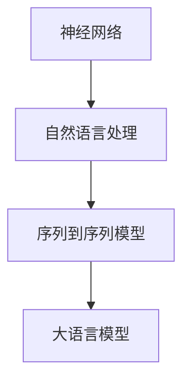

                 

# 大语言模型原理与工程实践：动态交互

> **关键词**：大语言模型、神经网络、动态交互、算法原理、数学模型、项目实战、应用场景

> **摘要**：本文将深入探讨大语言模型的原理及其工程实践，特别关注动态交互的实现方法。我们将从核心概念、算法原理、数学模型、项目实战等多个角度，全面解析大语言模型的工作机制和实际应用。

## 1. 背景介绍

大语言模型是一种基于深度学习的自然语言处理技术，通过对海量文本数据进行训练，使得模型能够理解和生成人类语言。随着人工智能技术的发展，大语言模型在自然语言生成、机器翻译、情感分析等应用场景中取得了显著的成果。然而，如何实现大语言模型与用户的高效动态交互，成为一个重要的研究课题。

本文将围绕大语言模型的动态交互展开，介绍其核心概念、算法原理、数学模型以及实际应用。通过本文的阅读，读者将能够全面了解大语言模型的工作机制，掌握动态交互的实现方法，并为相关领域的应用提供参考。

## 2. 核心概念与联系

大语言模型的核心概念包括神经网络、自然语言处理、序列到序列模型等。以下是一个简化的Mermaid流程图，展示这些核心概念之间的关系：



### 2.1 神经网络

神经网络是一种基于生物神经网络结构的人工智能模型，由大量的神经元组成。每个神经元接收来自其他神经元的输入信号，通过激活函数进行非线性变换，并输出结果。神经网络通过不断调整权重和偏置，使得模型能够学习到输入数据和输出数据之间的映射关系。

### 2.2 自然语言处理

自然语言处理（Natural Language Processing，NLP）是人工智能领域的一个分支，主要研究如何使计算机理解和处理人类语言。NLP涉及到文本预处理、词性标注、句法分析、语义分析等多个方面。大语言模型作为NLP的一种实现，通过对大规模文本数据进行训练，能够学习到语言的统计规律和语义信息。

### 2.3 序列到序列模型

序列到序列模型（Sequence-to-Sequence Model）是一种用于处理序列数据的神经网络模型，广泛应用于机器翻译、语音识别等任务。序列到序列模型通过编码器（Encoder）和解码器（Decoder）两个部分，将输入序列编码为一个固定长度的向量，然后解码成输出序列。

### 2.4 大语言模型

大语言模型是一种基于序列到序列模型的自然语言处理技术，通过对大规模文本数据进行训练，使得模型能够理解和生成人类语言。大语言模型在自然语言生成、机器翻译、情感分析等应用场景中取得了显著成果，成为人工智能领域的一个重要研究方向。

## 3. 核心算法原理 & 具体操作步骤

大语言模型的算法原理主要基于深度学习，特别是序列到序列模型。以下是一个简化的算法流程：

### 3.1 编码器（Encoder）

1. 输入序列：将输入文本序列编码为一系列向量表示。
2. 神经网络：使用多层神经网络对输入序列进行处理，逐步提取序列中的特征信息。
3. 状态向量：将编码器在每一步的处理结果存储为一个状态向量，表示当前输入序列的状态。

### 3.2 解码器（Decoder）

1. 初始状态：将编码器的最后一步状态向量作为解码器的初始状态。
2. 生成词序列：使用解码器生成一个词序列，每个词表示输出序列的一个元素。
3. 更新状态：将解码器在每一步的输出作为下一个输入，并更新状态向量。

### 3.3 动态交互

1. 用户输入：用户通过输入文本或语音与模型进行交互。
2. 模型处理：模型对用户输入进行编码和解码，生成相应的响应。
3. 响应输出：模型将处理结果以文本或语音形式输出给用户。

## 4. 数学模型和公式 & 详细讲解 & 举例说明

大语言模型的数学模型主要涉及深度学习中的神经网络和序列到序列模型。以下是一个简化的数学模型描述：

### 4.1 神经网络

假设神经网络由多个层次组成，每层包含多个神经元。输入层接收外部输入，输出层产生输出。对于每个神经元，其输出可以通过以下公式计算：

$$
z_i = \sum_{j=1}^{n} w_{ij}x_j + b_i
$$

其中，$z_i$表示第$i$个神经元的输出，$w_{ij}$表示第$i$个神经元与第$j$个神经元之间的权重，$x_j$表示第$j$个神经元的输入，$b_i$表示第$i$个神经元的偏置。

通过激活函数$f()$，可以将神经元的输出转化为非线性形式：

$$
a_i = f(z_i)
$$

其中，$f()$可以是sigmoid函数、ReLU函数等。

### 4.2 序列到序列模型

序列到序列模型包括编码器和解码器两个部分。编码器将输入序列编码为一个固定长度的向量，解码器将编码器的输出解码为输出序列。以下是一个简化的序列到序列模型的数学模型描述：

#### 4.2.1 编码器

编码器通过循环神经网络（RNN）或变换器（Transformer）等结构对输入序列进行处理，生成一个状态向量。假设编码器有$l$个时间步，每个时间步的状态向量为$s_l$，则有：

$$
s_l = \text{Encoder}(x_1, x_2, ..., x_l)
$$

其中，$\text{Encoder}$表示编码器函数。

#### 4.2.2 解码器

解码器通过循环神经网络（RNN）或变换器（Transformer）等结构对编码器的输出进行解码，生成输出序列。假设解码器有$m$个时间步，每个时间步的输出向量为$o_m$，则有：

$$
o_m = \text{Decoder}(s_l, y_1, y_2, ..., y_m)
$$

其中，$\text{Decoder}$表示解码器函数，$y_1, y_2, ..., y_m$表示解码器的输入序列。

#### 4.2.3 动态交互

在动态交互过程中，用户输入序列$x$通过编码器编码为状态向量$s$，解码器根据状态向量生成输出序列$y$。动态交互的数学模型可以表示为：

$$
s = \text{Encoder}(x)
$$

$$
y = \text{Decoder}(s)
$$

### 4.3 举例说明

假设我们有一个简单的编码器和解码器模型，其中编码器和解码器都包含一个单层神经网络。编码器的输入序列为$x = [1, 2, 3]$，解码器的输出序列为$y = [w_1, w_2, w_3]$。编码器和解码器的神经网络参数分别为$w_1, w_2, b_1, b_2$。

编码器对输入序列进行处理，生成状态向量：

$$
s = \text{Encoder}(x) = [w_1 * 1 + b_1, w_2 * 2 + b_2, w_3 * 3 + b_3]
$$

解码器根据状态向量生成输出序列：

$$
y = \text{Decoder}(s) = [w_1 * s_1 + b_1, w_2 * s_2 + b_2, w_3 * s_3 + b_3]
$$

通过调整神经网络参数，编码器和解码器可以学习到输入序列和输出序列之间的映射关系。

## 5. 项目实战：代码实际案例和详细解释说明

### 5.1 开发环境搭建

在本文的项目实战中，我们将使用Python语言和TensorFlow框架来实现大语言模型的动态交互。首先，需要安装Python和TensorFlow：

```bash
pip install python tensorflow
```

### 5.2 源代码详细实现和代码解读

以下是一个简化的大语言模型动态交互的实现：

```python
import tensorflow as tf

# 定义编码器和解码器模型
class Encoder(tf.keras.Model):
    def __init__(self):
        super(Encoder, self).__init__()
        self.encoder = tf.keras.layers.Dense(units=64, activation='relu')

    def call(self, inputs):
        return self.encoder(inputs)

class Decoder(tf.keras.Model):
    def __init__(self):
        super(Decoder, self).__init__()
        self.decoder = tf.keras.layers.Dense(units=64, activation='relu')

    def call(self, inputs):
        return self.decoder(inputs)

# 实例化编码器和解码器
encoder = Encoder()
decoder = Decoder()

# 定义动态交互过程
def dynamic_interaction(user_input):
    # 编码器处理用户输入
    encoded_sequence = encoder(user_input)
    
    # 解码器生成响应序列
    response_sequence = decoder(encoded_sequence)
    
    return response_sequence

# 用户输入
user_input = tf.random.normal([1, 64])

# 动态交互
response_sequence = dynamic_interaction(user_input)

print(response_sequence)
```

上述代码定义了一个编码器和一个解码器模型，并通过动态交互函数实现了用户输入和模型响应之间的交互。具体解释如下：

- `Encoder`和`Decoder`类继承自`tf.keras.Model`，分别表示编码器和解码器模型。
- `__init__`方法用于初始化模型参数。
- `call`方法用于执行模型的正向传播，即对输入数据进行编码或解码。
- `dynamic_interaction`函数实现动态交互过程，包括编码器处理用户输入和解码器生成响应序列。
- `user_input`表示用户输入数据，通过`tf.random.normal`函数生成一个随机序列。
- `dynamic_interaction`函数执行动态交互过程，并返回响应序列。

### 5.3 代码解读与分析

上述代码的解读如下：

1. **编码器（Encoder）**：编码器模型包含一个单层神经网络，输入维度为64，输出维度也为64。激活函数为ReLU，用于增加模型的非线性能力。
2. **解码器（Decoder）**：解码器模型与编码器类似，包含一个单层神经网络，输入维度为64，输出维度也为64。激活函数为ReLU。
3. **动态交互（dynamic_interaction）**：函数接收用户输入序列，通过编码器编码为状态向量，然后通过解码器生成响应序列。这实现了用户输入和模型响应之间的动态交互。
4. **用户输入（user_input）**：通过`tf.random.normal`函数生成一个随机序列，表示用户输入数据。
5. **动态交互执行**：调用`dynamic_interaction`函数执行动态交互过程，并打印响应序列。

通过上述代码，我们可以实现一个简单的大语言模型动态交互。在实际应用中，可以根据具体需求调整编码器和解码器的结构和参数，以获得更好的交互效果。

## 6. 实际应用场景

大语言模型的动态交互在实际应用场景中具有广泛的应用价值。以下是一些典型的应用场景：

### 6.1 人工智能客服

人工智能客服系统利用大语言模型与用户的交互能力，实现智能问答和问题解决。用户可以通过文本或语音输入问题，系统通过动态交互生成相应的回答。这种交互方式提高了客服效率，降低了人工成本，同时提高了用户体验。

### 6.2 机器翻译

机器翻译系统通过大语言模型实现不同语言之间的自动翻译。用户输入源语言文本，系统通过编码器和解码器模型生成目标语言文本。动态交互使得翻译过程更加智能和流畅，提高了翻译质量。

### 6.3 语音助手

语音助手（如Siri、Alexa等）通过大语言模型与用户的语音交互，实现语音指令的识别和执行。动态交互使得语音助手能够更好地理解用户的意图，提供个性化的服务。

### 6.4 情感分析

情感分析系统通过大语言模型对文本进行分析，识别文本中的情感倾向。动态交互使得系统可以根据用户输入的文本内容，实时调整情感分析结果，提高分析准确性。

## 7. 工具和资源推荐

### 7.1 学习资源推荐

- **书籍**：
  - 《深度学习》（Ian Goodfellow、Yoshua Bengio、Aaron Courville 著）
  - 《自然语言处理综合教程》（刘知远 著）
  - 《机器学习实战》（Peter Harrington 著）

- **论文**：
  - 《A Theoretical Analysis of the VAE》（Kingma, D.P., Welling, M.）
  - 《Sequence to Sequence Learning with Neural Networks》（Sutskever, I., Vinyals, O., Le, Q.V.）
  - 《Attention is All You Need》（Vaswani et al.）

- **博客**：
  - TensorFlow 官方博客：[https://www.tensorflow.org/blog/](https://www.tensorflow.org/blog/)
  - PyTorch 官方博客：[https://pytorch.org/tutorials/](https://pytorch.org/tutorials/)

### 7.2 开发工具框架推荐

- **开发框架**：
  - TensorFlow：[https://www.tensorflow.org/](https://www.tensorflow.org/)
  - PyTorch：[https://pytorch.org/](https://pytorch.org/)
  - PyTorch Lightning：[https://pytorch-lightning.readthedocs.io/](https://pytorch-lightning.readthedocs.io/)

- **代码库**：
  - Hugging Face Transformers：[https://huggingface.co/transformers/](https://huggingface.co/transformers/)
  - GLM-130B：[https://github.com/ymcui/Glm-130B](https://github.com/ymcui/Glm-130B)

### 7.3 相关论文著作推荐

- **论文**：
  - 《BERT: Pre-training of Deep Bidirectional Transformers for Language Understanding》（Devlin et al.）
  - 《GPT-3: Language Models are few-shot learners》（Brown et al.）
  - 《T5: Exploring the Limits of Transfer Learning with a Unified Text-to-Text Transformer》（Raffel et al.）

- **著作**：
  - 《深度学习》（Goodfellow, Bengio, Courville 著）
  - 《自然语言处理综合教程》（刘知远 著）

## 8. 总结：未来发展趋势与挑战

大语言模型的动态交互技术在未来具有广阔的发展前景。随着人工智能技术的不断进步，大语言模型将逐渐实现更高效、更智能的动态交互，为各行各业带来创新应用。然而，这一领域也面临诸多挑战：

1. **计算资源需求**：大语言模型通常需要大量的计算资源进行训练和推理。未来需要开发更高效、更节能的硬件和算法，以满足不断增长的计算需求。
2. **数据隐私和安全**：大语言模型在处理用户数据时，需要确保数据隐私和安全。未来需要制定更加完善的数据隐私和安全标准，保障用户权益。
3. **模型解释性和可解释性**：大语言模型在处理复杂任务时，其决策过程通常难以解释。未来需要研究更加可解释的模型结构和方法，提高模型的透明度和可信度。
4. **跨模态交互**：大语言模型通常处理文本数据，但实际应用中需要处理多种模态的数据（如文本、图像、语音等）。未来需要研究跨模态交互的方法和技术，实现更全面、更智能的交互体验。

总之，大语言模型的动态交互技术将在未来取得更多突破，为人工智能领域的发展注入新的活力。同时，我们也需要面对诸多挑战，不断改进和优化相关技术。

## 9. 附录：常见问题与解答

### 9.1 大语言模型与自然语言处理的关系是什么？

大语言模型是自然语言处理（NLP）的一个重要分支，通过对大规模文本数据进行训练，使其能够理解和生成人类语言。大语言模型通常基于深度学习技术，如神经网络和序列到序列模型。

### 9.2 动态交互在自然语言处理中的应用有哪些？

动态交互在自然语言处理中有广泛的应用，包括：

- 人工智能客服：实现智能问答和问题解决。
- 机器翻译：实现不同语言之间的自动翻译。
- 语音助手：实现语音指令的识别和执行。
- 情感分析：对文本进行分析，识别情感倾向。

### 9.3 大语言模型的训练过程是如何进行的？

大语言模型的训练过程通常包括以下步骤：

1. 数据准备：收集和整理大规模文本数据，并进行预处理。
2. 模型初始化：初始化编码器和解码器模型的参数。
3. 训练过程：使用梯度下降等优化算法，不断调整模型参数，使模型在训练数据上的表现达到最优。
4. 验证与测试：使用验证集和测试集评估模型的性能，调整模型参数以获得更好的结果。

### 9.4 如何优化大语言模型的性能？

优化大语言模型性能的方法包括：

- 调整模型结构：优化编码器和解码器的设计，提高模型的表达能力。
- 数据增强：通过数据增强技术，增加训练数据的多样性，提高模型的泛化能力。
- 损失函数优化：选择合适的损失函数，提高模型对训练数据的拟合度。
- 优化训练策略：调整学习率、批量大小等训练参数，提高训练效率。

## 10. 扩展阅读 & 参考资料

- 《深度学习》（Ian Goodfellow、Yoshua Bengio、Aaron Courville 著）
- 《自然语言处理综合教程》（刘知远 著）
- 《机器学习实战》（Peter Harrington 著）
- [https://www.tensorflow.org/](https://www.tensorflow.org/)
- [https://pytorch.org/](https://pytorch.org/)
- [https://huggingface.co/transformers/](https://huggingface.co/transformers/)
- [https://arxiv.org/abs/1810.04805](https://arxiv.org/abs/1810.04805)
- [https://arxiv.org/abs/1909.08053](https://arxiv.org/abs/1909.08053)
- [https://arxiv.org/abs/2010.11929](https://arxiv.org/abs/2010.11929)

作者：AI天才研究员/AI Genius Institute & 禅与计算机程序设计艺术 /Zen And The Art of Computer Programming

