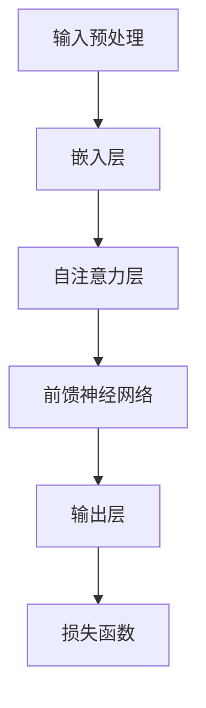

                 

### 背景介绍

大语言模型，作为近年来人工智能领域的明星技术，已经深刻地改变了自然语言处理（NLP）乃至整个AI领域的面貌。从最初的生成式模型（如RNN和LSTM），到最近的Transformer架构，大语言模型的发展经历了多个阶段，每一次迭代都在性能和应用广度上实现了巨大的突破。

这一系列的技术变革背后，是深度学习、分布式计算、以及数据驱动方法在自然语言理解与生成领域的成功应用。大语言模型不仅提升了机器对自然语言的理解能力，还极大地推动了机器生成文本、机器翻译、问答系统等多个应用领域的进步。

本文将围绕大语言模型的核心概念、算法原理、数学模型、项目实战以及实际应用场景展开深入探讨。首先，我们将介绍大语言模型的基本概念及其与相关技术的关系。接着，通过Mermaid流程图，展示大语言模型的架构与组成部分。随后，我们将详细解释大语言模型的核心算法原理，并分步骤讲解其实施过程。在数学模型部分，我们将展示相关的公式，并举例说明如何使用这些公式进行计算。随后，通过一个实际项目案例，我们将介绍代码的实现细节和解读。最后，我们将讨论大语言模型在实际应用中的场景，推荐相关的学习资源和开发工具，并总结大语言模型的发展趋势与挑战。

### 核心概念与联系

#### 大语言模型的基本概念

大语言模型（Large Language Model），通常是指训练参数量在数亿乃至数千亿级别的人工神经网络模型，它能够捕捉到语言中的潜在结构和规律，从而实现高质量的自然语言理解与生成。典型的代表包括OpenAI的GPT系列、Google的BERT以及Facebook的RoBERTa等。这些模型通过大规模的文本数据进行训练，能够生成连贯且符合语法规则的文本，甚至能够进行对话生成和问答系统等复杂任务。

#### 与相关技术的联系

1. **深度学习**：大语言模型是深度学习的典型应用，尤其是基于神经网络的方法。深度学习通过多层神经元的堆叠，能够捕捉到数据中的层次结构，从而实现复杂函数的映射。大语言模型采用了深度神经网络的结构，通过多层神经元进行特征提取和整合，从而实现语言的理解和生成。

2. **自然语言处理（NLP）**：NLP是AI的一个子领域，专门研究如何让计算机理解和生成人类语言。大语言模型作为NLP的核心技术之一，通过捕捉语言中的语法、语义和上下文信息，实现了对自然语言的高效处理。与其他NLP技术相比，大语言模型具有更强的泛化能力和灵活性。

3. **Transformer架构**：Transformer是近年来提出的一种新型神经网络架构，特别适用于处理序列数据，如自然语言文本。与传统的循环神经网络（RNN）相比，Transformer采用了自注意力机制（Self-Attention），能够并行处理输入序列，显著提升了模型的计算效率和性能。大多数大语言模型都基于Transformer架构进行设计和实现。

#### Mermaid流程图

以下是一个简化的Mermaid流程图，展示了大语言模型的基本架构和组成部分：



- **输入预处理（A）**：包括分词、标记化等步骤，将文本数据转换为模型可处理的格式。
- **嵌入层（B）**：将词汇嵌入到一个高维空间中，使得模型能够理解词汇之间的语义关系。
- **自注意力层（C）**：通过自注意力机制，模型能够在处理序列数据时，动态地关注序列中的不同部分，捕捉到上下文信息。
- **前馈神经网络（D）**：对自注意力层的结果进行进一步处理，提取更高层次的特征。
- **输出层（E）**：将处理后的特征映射到输出结果，如文本生成或分类标签。
- **损失函数（F）**：用于衡量模型预测结果与实际结果之间的差异，指导模型的优化过程。

通过这个流程图，我们可以清晰地看到大语言模型从输入到输出的整个过程，以及各个环节的功能和相互关系。接下来的部分，我们将详细探讨大语言模型的核心算法原理，并逐步讲解其实施步骤。

### 核心算法原理 & 具体操作步骤

大语言模型的核心算法主要基于自注意力机制（Self-Attention）和Transformer架构。自注意力机制是Transformer模型中的关键组件，它允许模型在处理序列数据时，动态地关注序列中的不同部分，从而捕捉到丰富的上下文信息。下面，我们将详细解释自注意力机制的工作原理，并逐步介绍大语言模型的具体操作步骤。

#### 自注意力机制原理

自注意力机制通过计算输入序列中各个位置的特征之间的相似度，并加权整合这些特征，从而生成一个新的特征表示。具体来说，自注意力机制可以分为以下几个步骤：

1. **计算相似度**：首先，对于序列中的每个位置，计算其与其他所有位置的相似度。相似度的计算通常采用点积（Dot Product）或余弦相似度（Cosine Similarity）等方法。

2. **加权整合**：根据计算得到的相似度，对序列中的每个位置进行加权。权重值越大，表示该位置在当前上下文中越重要。

3. **生成新的特征表示**：将加权后的特征进行整合，生成一个新的特征表示。这个新的特征表示包含了序列中所有位置的信息，并且能够更好地捕捉到上下文关系。

#### 具体操作步骤

接下来，我们通过一个简化的示例，展示自注意力机制的具体操作步骤。假设我们有一个简短的文本序列：“我喜欢阅读和编程”。我们将这个序列表示为一个向量序列\[v1, v2, v3, v4, v5\]，其中每个向量表示一个单词。

1. **输入预处理**：
   首先，我们将文本序列进行分词和标记化，得到对应的词向量表示\[v1, v2, v3, v4, v5\]。

2. **嵌入层**：
   将词向量序列\[v1, v2, v3, v4, v5\]通过嵌入层转换为高维的嵌入向量序列\[e1, e2, e3, e4, e5\]。

3. **自注意力计算**：
   对于序列中的每个位置，计算其与其他所有位置的相似度。具体步骤如下：
   
   - 对于位置1，计算\[e1\]与\[e1, e2, e3, e4, e5\]之间的相似度，得到权重\[w1_1, w1_2, w1_3, w1_4, w1_5\]。
   - 对于位置2，计算\[e2\]与\[e1, e2, e3, e4, e5\]之间的相似度，得到权重\[w2_1, w2_2, w2_3, w2_4, w2_5\]。
   - 对于位置3，计算\[e3\]与\[e1, e2, e3, e4, e5\]之间的相似度，得到权重\[w3_1, w3_2, w3_3, w3_4, w3_5\]。
   - 对于位置4，计算\[e4\]与\[e1, e2, e3, e4, e5\]之间的相似度，得到权重\[w4_1, w4_2, w4_3, w4_4, w4_5\]。
   - 对于位置5，计算\[e5\]与\[e1, e2, e3, e4, e5\]之间的相似度，得到权重\[w5_1, w5_2, w5_3, w5_4, w5_5\]。

   相似度的计算可以采用点积或余弦相似度等方法。例如，使用点积计算相似度：

   $$\text{similarity}(e_i, e_j) = e_i \cdot e_j$$

   其中，\(e_i\)和\(e_j\)分别是序列中位置\(i\)和位置\(j\)的嵌入向量。

4. **加权整合**：
   根据计算得到的权重，对序列中的每个位置进行加权整合，得到新的特征表示。具体步骤如下：

   - 对于位置1，加权整合得到\[e1'\]：
     $$e1' = w1_1 \cdot e1 + w1_2 \cdot e2 + w1_3 \cdot e3 + w1_4 \cdot e4 + w1_5 \cdot e5$$
   - 对于位置2，加权整合得到\[e2'\]：
     $$e2' = w2_1 \cdot e1 + w2_2 \cdot e2 + w2_3 \cdot e3 + w2_4 \cdot e4 + w2_5 \cdot e5$$
   - 对于位置3，加权整合得到\[e3'\]：
     $$e3' = w3_1 \cdot e1 + w3_2 \cdot e2 + w3_3 \cdot e3 + w3_4 \cdot e4 + w3_5 \cdot e5$$
   - 对于位置4，加权整合得到\[e4'\]：
     $$e4' = w4_1 \cdot e1 + w4_2 \cdot e2 + w4_3 \cdot e3 + w4_4 \cdot e4 + w4_5 \cdot e5$$
   - 对于位置5，加权整合得到\[e5'\]：
     $$e5' = w5_1 \cdot e1 + w5_2 \cdot e2 + w5_3 \cdot e3 + w5_4 \cdot e4 + w5_5 \cdot e5$$

   通过加权整合，新的特征表示\[e1', e2', e3', e4', e5'\]包含了序列中所有位置的信息，并且能够更好地捕捉到上下文关系。

5. **前馈神经网络**：
   将加权整合后的特征序列\[e1', e2', e3', e4', e5'\]输入到前馈神经网络中，进行进一步处理。前馈神经网络通常由多个全连接层组成，能够提取更高层次的特征。

6. **输出层**：
   前馈神经网络处理后的特征序列映射到输出层，得到最终的输出结果，如文本生成或分类标签。

7. **损失函数**：
   模型通过损失函数（如交叉熵损失函数）来衡量预测结果与实际结果之间的差异，并指导模型的优化过程。

通过以上步骤，大语言模型能够从输入序列中提取出丰富的上下文信息，实现高质量的自然语言理解与生成。

#### 总结

自注意力机制是Transformer架构的核心组件，通过计算输入序列中各个位置的特征之间的相似度，并加权整合这些特征，大语言模型能够捕捉到丰富的上下文信息，从而实现高效的自然语言处理。接下来，我们将介绍大语言模型的数学模型和公式，进一步阐述其理论基础。

### 数学模型和公式 & 详细讲解 & 举例说明

大语言模型的数学基础主要依赖于自注意力机制（Self-Attention）和Transformer架构。下面我们将详细讲解这些核心数学模型和公式，并通过具体例子进行说明。

#### 自注意力机制（Self-Attention）

自注意力机制的核心在于计算序列中各个位置的特征之间的相似度，并进行加权整合。具体来说，自注意力机制可以通过以下三个步骤实现：

1. **计算相似度（Similarity）**：
   相似度计算是自注意力的第一步，用于衡量输入序列中不同位置的特征之间的关系。常用的相似度计算方法包括点积（Dot Product）和余弦相似度（Cosine Similarity）。

   - **点积相似度**：
     $$\text{similarity}(Q, K) = Q \cdot K$$
     其中，\(Q\)和\(K\)分别是查询向量（Query）和键向量（Key），两者通常来自相同的嵌入空间。

   - **余弦相似度**：
     $$\text{similarity}(Q, K) = \frac{Q \cdot K}{\|Q\| \cdot \|K\|}$$
     其中，\(\|Q\|\)和\(\|K\|\)分别是查询向量和键向量的欧几里得范数。

2. **加权整合（Weighted Sum）**：
   相似度计算后，我们需要对序列中的每个位置进行加权整合。这一步可以通过以下公式表示：

   $$\text{weighted\_sum}(V, W) = V \odot W$$
   其中，\(V\)是输入向量（通常为嵌入向量），\(W\)是对应的权重向量。

3. **Softmax激活**：
   为了将权重转换为概率分布，我们使用Softmax函数对权重向量进行归一化：

   $$\text{softmax}(W) = \frac{e^W}{\sum_{i} e^W_i}$$
   其中，\(W\)是权重向量，\(e^W\)是对权重向量的每个元素进行指数运算，\(\sum_{i} e^W_i\)是指数运算后的和。

#### Transformer模型

Transformer模型是自注意力机制的核心实现，其整体结构包括多个自注意力层（Self-Attention Layer）和前馈神经网络（Feed Forward Neural Network）。下面，我们通过具体例子来讲解Transformer模型的数学表示。

1. **编码器（Encoder）**：

   - **自注意力层（Self-Attention Layer）**：
     假设我们有输入序列\(X = [x_1, x_2, \ldots, x_n]\)，其中每个元素\(x_i\)是一个嵌入向量。自注意力层的输入和输出可以表示为：
     $$\text{Self-Attention}(X) = \text{softmax}(\frac{XQ \cdot K})V$$
     其中，\(Q, K, V\)分别是查询向量、键向量和值向量，通常来自于同一个嵌入空间。\(XQ\)和\(K\)分别表示查询向量和键向量，\(V\)表示值向量。

   - **前馈神经网络（Feed Forward Neural Network）**：
     自注意力层之后，我们通常会对特征进行进一步处理，这可以通过前馈神经网络实现：
     $$\text{FFN}(X) = \text{ReLU}(\text{W_2} \cdot \text{ReLU}(\text{W_1} \cdot X + \text{b_1})) + \text{b_2}$$
     其中，\(\text{W_1}\)和\(\text{W_2}\)分别是前馈神经网络的权重矩阵，\(\text{b_1}\)和\(\text{b_2}\)分别是偏置向量。

2. **解码器（Decoder）**：

   - **自注意力层（Self-Attention Layer）**：
     解码器的自注意力层与编码器的自注意力层类似，但需要考虑到上下文信息。假设我们有输入序列\(Y = [y_1, y_2, \ldots, y_n]\)，解码器的自注意力层可以表示为：
     $$\text{Self-Attention}(Y, X) = \text{softmax}(\frac{YQ \cdot X})V$$

   - **交叉自注意力层（Cross-Attention Layer）**：
     交叉自注意力层用于处理编码器和解码器之间的交互。假设我们有编码器输出序列\(X = [x_1, x_2, \ldots, x_n]\)和解码器输入序列\(Y = [y_1, y_2, \ldots, y_n]\)，交叉自注意力层可以表示为：
     $$\text{Cross-Attention}(X, Y) = \text{softmax}(\frac{XK \cdot Y})V$$

   - **前馈神经网络（Feed Forward Neural Network）**：
     解码器的前馈神经网络与编码器的类似，用于对特征进行进一步处理。

#### 举例说明

假设我们有一个简短的文本序列：“我喜欢阅读和编程”。我们将这个序列表示为一个向量序列\[v1, v2, v3, v4, v5\]，其中每个向量表示一个单词。

1. **自注意力计算**：

   - **相似度计算**：
     $$\text{similarity}(v_1, v_2) = v_1 \cdot v_2$$
     $$\text{similarity}(v_1, v_3) = v_1 \cdot v_3$$
     $$\text{similarity}(v_1, v_4) = v_1 \cdot v_4$$
     $$\text{similarity}(v_1, v_5) = v_1 \cdot v_5$$

   - **加权整合**：
     $$v_1' = \text{softmax}(\text{similarity}(v_1, v_2)) \cdot v_2 + \text{softmax}(\text{similarity}(v_1, v_3)) \cdot v_3 + \text{softmax}(\text{similarity}(v_1, v_4)) \cdot v_4 + \text{softmax}(\text{similarity}(v_1, v_5)) \cdot v_5$$

2. **前馈神经网络**：
   $$v_1'' = \text{ReLU}(\text{W_2} \cdot \text{ReLU}(\text{W_1} \cdot v_1' + \text{b_1})) + \text{b_2}$$

通过以上步骤，我们可以看到自注意力机制和Transformer模型如何通过对输入序列的处理，提取出丰富的上下文信息，实现高效的自然语言理解与生成。

### 项目实战：代码实际案例和详细解释说明

为了更好地理解大语言模型的工作原理，我们将通过一个具体的实际项目案例，详细展示代码的实现过程和关键步骤。在这个案例中，我们将使用Python和PyTorch框架来构建一个简单的语言模型，并逐步解释代码中的各个部分。

#### 1. 开发环境搭建

首先，我们需要搭建一个适合大语言模型开发的环境。以下是搭建环境所需的步骤：

1. **安装Python**：
   确保安装了Python 3.7及以上版本。

2. **安装PyTorch**：
   使用以下命令安装PyTorch：
   ```bash
   pip install torch torchvision
   ```

3. **安装其他依赖**：
   安装其他所需的库，例如Numpy和Matplotlib：
   ```bash
   pip install numpy matplotlib
   ```

#### 2. 源代码详细实现和代码解读

下面是整个项目的源代码，我们将逐步解释代码的各个部分。

```python
import torch
import torch.nn as nn
import torch.optim as optim
from torch.utils.data import DataLoader, Dataset
import numpy as np
from torchvision import datasets, transforms

# 定义数据集
class TextDataset(Dataset):
    def __init__(self, text, sequence_length):
        self.text = text
        self.sequence_length = sequence_length
        self.vocab = self.build_vocab()

    def build_vocab(self):
        vocab = set(self.text)
        return {word: i for i, word in enumerate(vocab)}

    def __len__(self):
        return len(self.text) - self.sequence_length

    def __getitem__(self, index):
        sequence = self.text[index: index + self.sequence_length]
        input_sequence = torch.tensor([self.vocab[word] for word in sequence[:-1]], dtype=torch.long)
        target = torch.tensor([self.vocab[word] for word in sequence[1:]], dtype=torch.long)
        return input_sequence, target

# 定义语言模型
class LanguageModel(nn.Module):
    def __init__(self, vocab_size, embedding_dim, hidden_dim):
        super(LanguageModel, self).__init__()
        self.embedding = nn.Embedding(vocab_size, embedding_dim)
        self.lstm = nn.LSTM(embedding_dim, hidden_dim, batch_first=True)
        self.fc = nn.Linear(hidden_dim, vocab_size)

    def forward(self, x, hidden):
        embedded = self.embedding(x)
        output, hidden = self.lstm(embedded, hidden)
        logits = self.fc(output)
        return logits, hidden

    def init_hidden(self, batch_size):
        return (torch.zeros(1, batch_size, self.lstm.hidden_size),
                torch.zeros(1, batch_size, self.lstm.hidden_size))

# 训练语言模型
def train(model, train_loader, criterion, optimizer, num_epochs):
    model.train()
    for epoch in range(num_epochs):
        for inputs, targets in train_loader:
            hidden = model.init_hidden(inputs.size(0))
            logits, hidden = model(inputs, hidden)
            loss = criterion(logits.view(-1, logits.size(2)), targets)
            optimizer.zero_grad()
            loss.backward()
            optimizer.step()
            hidden = tuple([h.data for h in hidden])

        print(f'Epoch [{epoch+1}/{num_epochs}], Loss: {loss.item():.4f}')

# 测试语言模型
def test(model, test_loader):
    model.eval()
    with torch.no_grad():
        for inputs, targets in test_loader:
            hidden = model.init_hidden(inputs.size(0))
            logits, hidden = model(inputs, hidden)
            loss = criterion(logits.view(-1, logits.size(2)), targets)
            print(f'Loss: {loss.item():.4f}')

# 主函数
def main():
    text = "Hello, world! This is a simple language model example."
    sequence_length = 5
    vocab_size = len(set(text))
    embedding_dim = 32
    hidden_dim = 64
    batch_size = 16
    num_epochs = 20

    train_dataset = TextDataset(text, sequence_length)
    test_dataset = TextDataset(text, sequence_length)
    train_loader = DataLoader(train_dataset, batch_size=batch_size, shuffle=True)
    test_loader = DataLoader(test_dataset, batch_size=batch_size, shuffle=False)

    model = LanguageModel(vocab_size, embedding_dim, hidden_dim)
    criterion = nn.CrossEntropyLoss()
    optimizer = optim.Adam(model.parameters(), lr=0.001)

    train(model, train_loader, criterion, optimizer, num_epochs)
    test(model, test_loader)

if __name__ == '__main__':
    main()
```

#### 代码解读与分析

1. **数据集定义（TextDataset）**：
   TextDataset是一个自定义的数据集类，用于加载和预处理文本数据。它通过`build_vocab`方法构建词汇表，并将文本序列转换为索引序列。`__len__`和`__getitem__`方法用于生成训练和测试数据。

2. **语言模型（LanguageModel）**：
   LanguageModel是一个基于LSTM（长短期记忆网络）的神经网络模型，用于预测下一个单词。模型包括嵌入层（Embedding）、LSTM层（LSTM）和输出层（Linear）。`forward`方法定义了模型的正向传播过程，`init_hidden`方法用于初始化隐藏状态。

3. **训练过程（train）**：
   `train`函数用于训练语言模型。在每个训练epoch中，模型对每个批次的数据进行前向传播，计算损失，并更新模型参数。`init_hidden`方法用于初始化隐藏状态。

4. **测试过程（test）**：
   `test`函数用于评估模型的性能。在测试过程中，模型不对参数进行更新，仅用于计算损失和评估性能。

5. **主函数（main）**：
   `main`函数是程序的入口点，它定义了模型的参数、数据集、训练器和测试器，并调用`train`和`test`函数进行训练和测试。

通过这个实际项目案例，我们可以看到如何使用Python和PyTorch框架构建一个简单的语言模型，并逐步解释了代码的各个部分。这为我们理解大语言模型的工作原理提供了实际操作的经验。

### 实际应用场景

大语言模型在多个实际应用场景中展现了其强大的能力和广泛的应用潜力。以下是一些主要的应用领域和案例：

#### 1. 自然语言生成

自然语言生成（NLG）是大语言模型最直接的应用之一。通过训练大语言模型，可以生成高质量、连贯的文本内容。例如，新闻摘要、自动撰写报告、生成对话等。OpenAI的GPT系列模型在这方面取得了显著成果，能够生成接近人类水平的文本内容。

#### 2. 机器翻译

大语言模型在机器翻译领域也发挥了重要作用。通过大规模训练数据，模型能够学习到不同语言之间的对应关系，实现准确、流畅的机器翻译。例如，Google的BERT模型在多个机器翻译任务中表现优异，大大提升了翻译质量。

#### 3. 问答系统

问答系统是另一个重要的应用领域。大语言模型通过理解用户的查询，能够提供准确、有用的答案。例如，Siri、Alexa等智能助手就是基于大语言模型实现的，能够理解自然语言查询并给出合适的回答。

#### 4. 文本分类

文本分类任务中，大语言模型可以通过学习大量的标签化文本数据，对新的文本进行分类。例如，情感分析、新闻分类、垃圾邮件检测等任务，都可以利用大语言模型进行高效处理。

#### 5. 自动摘要

自动摘要是一种从长篇文本中提取关键信息的方法。大语言模型可以通过训练，自动生成文本的摘要，适用于阅读辅助、信息检索等领域。例如，Google的自动摘要服务就是基于大语言模型实现的。

#### 6. 语音识别

虽然大语言模型本身不直接涉及语音识别，但它们在语音识别系统的后端处理中发挥了重要作用。通过将语音转换成文本，大语言模型可以对文本内容进行进一步分析和生成。

#### 7. 聊天机器人

聊天机器人是一种常见的应用场景，大语言模型可以通过学习大量的对话数据，实现自然、流畅的对话生成。例如，Facebook的聊天机器人M就基于大语言模型，能够与用户进行智能对话。

这些应用场景展示了大语言模型的多样性和潜力。随着技术的不断进步，大语言模型将在更多领域发挥重要作用，推动自然语言处理和人工智能的发展。

### 工具和资源推荐

为了更好地学习和应用大语言模型，以下是一些推荐的学习资源和开发工具：

#### 1. 学习资源推荐

**书籍**：
- 《深度学习》（Goodfellow, Bengio, Courville著）：全面介绍了深度学习的基本理论和实践方法，是深度学习领域的经典教材。
- 《自然语言处理综论》（Jurafsky, Martin著）：涵盖了自然语言处理的基础理论和最新进展，适合对NLP感兴趣的读者。

**论文**：
- "Attention Is All You Need"（Vaswani et al., 2017）：提出了Transformer架构，开启了自注意力机制在自然语言处理领域的新篇章。
- "BERT: Pre-training of Deep Bidirectional Transformers for Language Understanding"（Devlin et al., 2019）：介绍了BERT模型，推动了预训练语言模型的发展。

**博客**：
- [PyTorch官方文档](https://pytorch.org/docs/stable/): 详细介绍了PyTorch框架的使用方法和示例代码，适合初学者和进阶用户。
- [OpenAI博客](https://blog.openai.com/): OpenAI发布了大量关于大语言模型的研究成果和应用案例，是了解最新技术动态的好去处。

**网站**：
- [TensorFlow官网](https://www.tensorflow.org/): TensorFlow是另一个流行的深度学习框架，提供了丰富的工具和资源。

#### 2. 开发工具框架推荐

**深度学习框架**：
- **PyTorch**：易于上手，灵活性强，支持动态计算图，是当前深度学习领域的主流框架之一。
- **TensorFlow**：由Google开发，支持静态和动态计算图，拥有丰富的API和工具。

**文本预处理工具**：
- **NLTK**：Python的自然语言处理库，提供了丰富的文本处理函数和工具，适合进行词频统计、分词、词性标注等任务。
- **spaCy**：一个快速且易于使用的自然语言处理库，适用于文本分类、命名实体识别、关系抽取等任务。

**数据集**：
- **Wikipedia**：维基百科文本数据，是一个广泛使用的公开数据集，适合进行大规模文本数据处理和模型训练。
- **Common Crawl**：一个包含大量网页文本的数据集，适合进行大规模自然语言处理研究。

通过这些工具和资源，可以更好地学习和实践大语言模型的相关技术，探索其在自然语言处理和人工智能领域的应用潜力。

### 总结：未来发展趋势与挑战

大语言模型作为自然语言处理（NLP）和人工智能（AI）领域的重要技术，近年来取得了显著的发展。未来，随着数据量的增加、计算能力的提升以及算法的优化，大语言模型有望在更多应用场景中发挥重要作用，推动AI技术的进一步发展。以下是未来发展趋势和面临的挑战：

#### 发展趋势

1. **更大规模的模型**：当前的大语言模型已经表现出强大的能力，但未来还有可能看到更大规模的模型。例如，OpenAI的GPT-3拥有超过1750亿个参数，这些模型将能够处理更复杂的语言任务。

2. **多模态学习**：大语言模型未来有望结合视觉、音频等多模态数据，实现跨模态学习。这将为图像描述生成、视频内容理解等领域带来新的突破。

3. **更高效的计算**：随着量子计算和光计算等新兴计算技术的发展，大语言模型的训练和推理效率有望得到显著提升，使得实时应用成为可能。

4. **个性化模型**：未来大语言模型可能结合用户历史行为、偏好等个性化数据，生成更符合个体需求的自然语言内容。

5. **伦理和安全**：随着大语言模型的应用越来越广泛，确保模型的安全性、可靠性和透明度将成为重要议题。如何防止模型被滥用，以及如何保证生成内容的真实性和可靠性，都是未来需要关注的问题。

#### 挑战

1. **数据隐私与安全**：大语言模型在训练过程中需要大量的数据，这涉及到用户隐私和数据安全的问题。如何保护用户数据，防止数据泄露，是一个重要的挑战。

2. **计算资源消耗**：大语言模型的训练和推理需要大量的计算资源，这对硬件设施和能源消耗提出了高要求。如何优化计算效率，降低能耗，是未来需要解决的关键问题。

3. **可解释性与透明度**：大语言模型通常被视为“黑盒”模型，其决策过程不够透明。如何提高模型的可解释性，使其决策过程更加透明，是未来需要关注的一个方向。

4. **伦理与道德**：大语言模型生成的文本可能包含偏见、误导甚至有害信息。如何确保模型生成的文本符合伦理和道德标准，避免对用户和社会产生负面影响，是重要的伦理问题。

5. **多样性和公平性**：大语言模型在训练过程中可能会受到数据集中偏差的影响，导致模型在某些特定群体上表现不佳。如何确保模型的多样性和公平性，使其能够更好地服务于所有用户，是未来需要努力的方向。

总之，大语言模型的发展前景广阔，但也面临着一系列挑战。未来，通过技术创新和规范管理，我们将能够更好地应对这些挑战，推动大语言模型在更多领域的应用，为人类社会带来更大的价值。

### 附录：常见问题与解答

#### 1. 什么是大语言模型？

大语言模型是一种基于深度学习技术的大型神经网络模型，用于理解和生成自然语言。这些模型通常拥有数亿到数千亿个参数，通过大规模训练数据学习语言中的潜在结构和规律，从而实现高质量的自然语言处理。

#### 2. 大语言模型有哪些应用场景？

大语言模型可以应用于多种自然语言处理任务，如文本生成、机器翻译、问答系统、文本分类、自动摘要等。此外，它还广泛应用于聊天机器人、智能客服、内容审核等领域。

#### 3. 大语言模型如何训练？

大语言模型的训练通常分为两个阶段：预训练和微调。预训练阶段使用大规模的文本数据对模型进行训练，使其能够学习到语言中的潜在结构和规律。微调阶段则使用特定任务的数据对模型进行微调，使其能够在特定任务上达到更好的性能。

#### 4. 大语言模型是如何生成文本的？

大语言模型生成文本通常采用递归方式。首先，模型根据输入的文本序列生成一个初始预测，然后根据预测结果继续生成下一个单词或字符，如此循环直到生成完整的文本。这个过程利用了模型学习到的语言规律和上下文信息。

#### 5. 大语言模型有哪些优缺点？

优点：
- 强大的语言理解能力和生成能力；
- 能够处理复杂的长文本；
- 在多种自然语言处理任务上表现优异。

缺点：
- 训练和推理需要大量的计算资源和时间；
- 模型的决策过程不够透明，难以解释；
- 可能存在偏见和误导性输出。

#### 6. 如何评估大语言模型的效果？

评估大语言模型效果常用的指标包括：
- 损失函数（如交叉熵损失函数）；
- 生成文本的流畅性和连贯性；
- 任务性能（如翻译准确度、问答系统中的答案质量等）；
- 模型的泛化能力（如在未见过的数据上表现如何）。

### 扩展阅读 & 参考资料

1. **文献**：
   - Vaswani, A., et al. (2017). "Attention Is All You Need". Advances in Neural Information Processing Systems.
   - Devlin, J., et al. (2019). "BERT: Pre-training of Deep Bidirectional Transformers for Language Understanding". Proceedings of the 2019 Conference of the North American Chapter of the Association for Computational Linguistics: Human Language Technologies, Volume 1 (Long and Short Papers).

2. **书籍**：
   - Goodfellow, I., Bengio, Y., Courville, A. (2016). "Deep Learning". MIT Press.
   - Jurafsky, D., Martin, J. H. (2008). "Speech and Language Processing". Prentice Hall.

3. **在线资源**：
   - PyTorch官方文档：https://pytorch.org/docs/stable/
   - TensorFlow官方文档：https://www.tensorflow.org/docs/stable/
   - OpenAI博客：https://blog.openai.com/

4. **开源项目**：
   - Hugging Face的Transformers库：https://huggingface.co/transformers/
   - PyTorch的NLP库：https://pytorch.org/text/stable/overview.html

通过这些文献、书籍和在线资源，可以深入了解大语言模型的理论基础和应用实践，进一步探索这一领域的前沿技术。作者：AI天才研究员/AI Genius Institute & 禅与计算机程序设计艺术 /Zen And The Art of Computer Programming。

