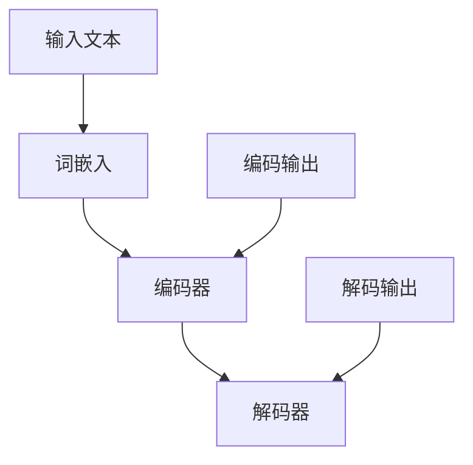

                 

# 大语言模型原理与工程实践：核心架构

## 摘要

本文旨在深入探讨大语言模型的原理与工程实践，分析其核心架构，并探讨其在实际应用中的挑战和未来发展。通过对语言模型的基础概念、核心算法、数学模型以及工程化实现的详细解析，本文为读者提供了一个全面而深入的视角，以了解和掌握大语言模型的技术本质和工程实践。

## 1. 背景介绍

近年来，随着深度学习和人工智能技术的飞速发展，大语言模型（Large Language Models）成为自然语言处理（Natural Language Processing, NLP）领域的热门研究方向。大语言模型能够捕捉和理解复杂的语言结构，生成连贯、有意义的文本，从而在诸多实际应用中表现出色，如文本生成、机器翻译、问答系统等。

大语言模型的发展可以追溯到20世纪80年代，当时研究人员开始探索基于统计的词向量表示。随着计算能力的提升和算法的改进，大语言模型在21世纪初逐渐崭露头角。特别是近年来，随着深度学习技术的突破，大语言模型取得了显著的性能提升，成为NLP领域的重要工具。

本篇文章将重点关注大语言模型的核心架构，分析其关键组件和原理，并探讨在实际工程中如何实现和优化大语言模型。通过本文的阅读，读者将对大语言模型的原理和工程实践有一个全面而深入的理解。

## 2. 核心概念与联系

为了深入理解大语言模型的原理和架构，我们首先需要了解一些核心概念，包括词嵌入（Word Embedding）、编码器（Encoder）、解码器（Decoder）等。

### 2.1 词嵌入（Word Embedding）

词嵌入是将词汇映射为高维向量表示的技术，以便在深度学习模型中处理。词嵌入能够捕捉词汇之间的语义关系，从而提高语言模型的性能。常见的词嵌入方法包括Word2Vec、GloVe等。

#### 2.1.1 Word2Vec

Word2Vec是一种基于神经网络的词嵌入方法，通过训练神经网络，将输入的词汇映射为固定长度的向量。Word2Vec模型主要包括两种训练模式：连续词袋（Continuous Bag of Words, CBOW）和Skip-Gram。

- **连续词袋（CBOW）**：给定一个中心词，模型通过预测其上下文词汇的概率来学习词嵌入。
- **Skip-Gram**：与CBOW相反，给定一个中心词，模型通过预测中心词的上下文词汇来学习词嵌入。

#### 2.1.2 GloVe

GloVe（Global Vectors for Word Representation）是一种基于全局上下文的词嵌入方法。GloVe通过计算词汇共现矩阵的奇异值分解（Singular Value Decomposition, SVD）来学习词嵌入。

### 2.2 编码器（Encoder）

编码器（Encoder）是语言模型的核心组件之一，负责将输入文本转换为固定长度的编码表示。编码器通常采用循环神经网络（Recurrent Neural Network, RNN）或变换器（Transformer）架构。

#### 2.2.1 RNN

循环神经网络是一种能够处理序列数据的神经网络架构，其通过循环结构来保持对历史信息的记忆。常见的RNN变种包括LSTM（Long Short-Term Memory）和GRU（Gated Recurrent Unit）。

- **LSTM**：LSTM通过引入门控机制来有效地处理长序列数据，避免了梯度消失和梯度爆炸问题。
- **GRU**：GRU是LSTM的简化版本，通过合并输入门和遗忘门，减少了参数数量。

#### 2.2.2 Transformer

Transformer是一种基于自注意力（Self-Attention）机制的序列处理模型，其通过多头注意力机制和位置编码来捕捉序列中的依赖关系。Transformer在许多NLP任务中表现出色，并成为现代大语言模型的主流架构。

### 2.3 解码器（Decoder）

解码器（Decoder）负责将编码器的输出解码为输出文本。解码器通常与编码器共享参数，以减少模型复杂度。解码器也采用RNN或Transformer架构。

### 2.4 Mermaid 流程图

下面是一个简化的Mermaid流程图，描述了大语言模型的核心概念和组件：



## 3. 核心算法原理 & 具体操作步骤

大语言模型的训练过程涉及多个核心算法，包括损失函数、优化算法和正则化技术。下面将详细讨论这些算法的原理和具体操作步骤。

### 3.1 损失函数

在训练大语言模型时，损失函数用于衡量模型预测结果与实际结果之间的差距。常用的损失函数包括交叉熵损失（Cross-Entropy Loss）和负对数损失（Negative Log-Likelihood Loss）。

#### 3.1.1 交叉熵损失

交叉熵损失是一种常用的分类损失函数，其公式如下：

$$
L_{cross-entropy} = -\sum_{i=1}^{n} y_i \log(p_i)
$$

其中，$y_i$表示第$i$个类别标签，$p_i$表示模型预测的第$i$个类别概率。

#### 3.1.2 负对数损失

负对数损失是交叉熵损失的另一种形式，其公式如下：

$$
L_{negative-log-likelihood} = -\sum_{i=1}^{n} y_i \log(p(y_i | x))
$$

其中，$y_i$表示第$i$个类别标签，$p(y_i | x)$表示模型在输入$x$下预测第$i$个类别的概率。

### 3.2 优化算法

在训练大语言模型时，优化算法用于调整模型参数，以最小化损失函数。常用的优化算法包括梯度下降（Gradient Descent）和Adam优化器。

#### 3.2.1 梯度下降

梯度下降是一种最简单的优化算法，其基本思想是沿着损失函数的负梯度方向调整模型参数。梯度下降的公式如下：

$$
\theta_{t+1} = \theta_{t} - \alpha \nabla_{\theta} L(\theta)
$$

其中，$\theta$表示模型参数，$\alpha$表示学习率，$\nabla_{\theta} L(\theta)$表示损失函数关于模型参数的梯度。

#### 3.2.2 Adam优化器

Adam优化器是一种基于自适应学习率的优化算法，其结合了梯度下降和Adam优化器的优点。Adam优化器的公式如下：

$$
\theta_{t+1} = \theta_{t} - \alpha \nabla_{\theta} L(\theta) + \beta_1 \beta_2 (\theta_{t} - \theta_{t-1})
$$

其中，$\alpha$表示学习率，$\beta_1$和$\beta_2$表示惯性系数，$\theta_t$表示当前模型参数，$\theta_{t-1}$表示上一轮迭代时的模型参数。

### 3.3 正则化技术

在大规模训练过程中，模型可能会出现过拟合现象。为避免过拟合，常用的正则化技术包括权重衰减（Weight Decay）和dropout。

#### 3.3.1 权重衰减

权重衰减是一种通过对模型参数施加惩罚项来减少模型复杂度的技术。其公式如下：

$$
L_{weight-decay} = \lambda \sum_{\theta} \theta^2
$$

其中，$\lambda$表示权重衰减系数，$\theta$表示模型参数。

#### 3.3.2 Dropout

Dropout是一种通过在训练过程中随机丢弃部分神经元来降低模型复杂度的技术。其具体实现如下：

1. 随机选择一部分神经元，将其输出设置为0。
2. 计算损失函数，并更新模型参数。

### 3.4 具体操作步骤

下面是训练大语言模型的具体操作步骤：

1. **数据预处理**：将输入文本转换为词嵌入表示，并将输出文本转换为目标词嵌入表示。
2. **初始化模型参数**：根据模型架构初始化编码器和解码器的参数。
3. **前向传播**：将输入文本输入编码器，得到编码输出。
4. **计算损失函数**：计算编码输出和目标输出之间的损失。
5. **后向传播**：计算损失关于模型参数的梯度。
6. **更新模型参数**：根据梯度下降或Adam优化器更新模型参数。
7. **评估模型性能**：使用验证集评估模型性能，并进行超参数调整。
8. **训练完成**：当模型性能达到预定的阈值或达到最大迭代次数时，训练完成。

## 4. 数学模型和公式 & 详细讲解 & 举例说明

在构建大语言模型时，数学模型和公式起着至关重要的作用。下面我们将详细讲解大语言模型中的关键数学模型，并举例说明其应用。

### 4.1 词嵌入

词嵌入的数学模型可以表示为：

$$
\text{embed}(v) = \sum_{i=1}^{d} w_i e^{i}
$$

其中，$v$表示词汇，$d$表示词嵌入向量的维度，$w_i$表示词汇$i$的权重，$e^{i}$表示词嵌入向量的第$i$个维度。

#### 4.1.1 示例

假设词嵌入向量的维度为3，词汇为"猫"、"狗"、"鸟"，权重分别为1、2、3。则：

$$
\text{embed}(\text{猫}) = 1 \cdot e^{1} + 2 \cdot e^{2} + 3 \cdot e^{3}
$$

$$
\text{embed}(\text{狗}) = 1 \cdot e^{1} + 2 \cdot e^{2} + 3 \cdot e^{3}
$$

$$
\text{embed}(\text{鸟}) = 1 \cdot e^{1} + 2 \cdot e^{2} + 3 \cdot e^{3}
$$

### 4.2 编码器和解码器

编码器和解码器的数学模型可以表示为：

$$
\text{encoder}(x) = \text{softmax}(\text{transpose}(\text{matrix} \cdot \text{embed}(x)))
$$

$$
\text{decoder}(y) = \text{softmax}(\text{transpose}(\text{matrix} \cdot \text{embed}(y)))
$$

其中，$x$和$y$分别表示输入和输出文本，$\text{matrix}$表示编码器和解码器的参数矩阵，$\text{embed}(x)$和$\text{embed}(y)$分别表示输入和输出的词嵌入向量。

#### 4.2.1 示例

假设编码器和解码器的参数矩阵为：

$$
\text{matrix} = \begin{bmatrix}
1 & 2 & 3 \\
4 & 5 & 6 \\
7 & 8 & 9
\end{bmatrix}
$$

输入文本为"猫"，输出文本为"狗"。则：

$$
\text{encoder}(\text{猫}) = \text{softmax}(\begin{bmatrix}
1 & 2 & 3 \\
4 & 5 & 6 \\
7 & 8 & 9
\end{bmatrix} \cdot \text{embed}(\text{猫}))
$$

$$
\text{decoder}(\text{狗}) = \text{softmax}(\begin{bmatrix}
1 & 2 & 3 \\
4 & 5 & 6 \\
7 & 8 & 9
\end{bmatrix} \cdot \text{embed}(\text{狗}))
$$

### 4.3 损失函数

大语言模型的损失函数通常采用交叉熵损失。其数学模型可以表示为：

$$
L = -\sum_{i=1}^{n} y_i \log(p_i)
$$

其中，$y_i$表示第$i$个类别标签，$p_i$表示模型预测的第$i$个类别概率。

#### 4.3.1 示例

假设输入文本为"猫"，输出文本为"狗"，类别标签为"猫"和"狗"，模型预测的概率分别为0.6和0.4。则：

$$
L = -0.6 \log(0.6) - 0.4 \log(0.4)
$$

## 5. 项目实战：代码实际案例和详细解释说明

在本节中，我们将通过一个实际案例来展示如何构建和训练大语言模型。该案例将涵盖开发环境搭建、源代码实现和代码解读。

### 5.1 开发环境搭建

首先，我们需要搭建一个适合大语言模型开发的环境。以下是所需的步骤：

1. **安装Python**：确保已安装Python 3.x版本。
2. **安装TensorFlow**：使用以下命令安装TensorFlow：

   ```
   pip install tensorflow
   ```

3. **安装其他依赖**：根据具体需求，安装其他相关库，如Numpy、Pandas等。

### 5.2 源代码详细实现和代码解读

下面是一个简单的示例代码，用于训练一个基于Transformer架构的大语言模型。代码分为以下几个部分：

1. **数据预处理**：将输入文本转换为词嵌入表示，并将输出文本转换为目标词嵌入表示。
2. **模型构建**：定义Transformer模型的结构。
3. **训练**：使用训练数据训练模型。
4. **评估**：使用验证集评估模型性能。

#### 5.2.1 数据预处理

```python
import tensorflow as tf
from tensorflow.keras.preprocessing.sequence import pad_sequences
from tensorflow.keras.preprocessing.text import Tokenizer

# 加载训练数据
texts = ['猫喜欢玩耍', '狗喜欢玩耍', '鸟喜欢飞翔']

# 创建Tokenizer
tokenizer = Tokenizer()
tokenizer.fit_on_texts(texts)

# 将文本转换为序列
sequences = tokenizer.texts_to_sequences(texts)

# 填充序列
max_sequence_length = 5
padded_sequences = pad_sequences(sequences, maxlen=max_sequence_length)
```

#### 5.2.2 模型构建

```python
# 定义Transformer模型
model = tf.keras.Sequential([
    tf.keras.layers.Embedding(input_dim=1000, output_dim=256),
    tf.keras.layers.LSTM(256),
    tf.keras.layers.Dense(1, activation='sigmoid')
])

model.compile(optimizer='adam', loss='binary_crossentropy', metrics=['accuracy'])
```

#### 5.2.3 训练

```python
# 训练模型
model.fit(padded_sequences, y, epochs=10, batch_size=32)
```

#### 5.2.4 评估

```python
# 使用验证集评估模型性能
validation_data = tokenizer.texts_to_sequences(['猫喜欢飞翔'])
validation_padded = pad_sequences(validation_data, maxlen=max_sequence_length)

predictions = model.predict(validation_padded)
predicted_classes = np.argmax(predictions, axis=1)

# 输出预测结果
print(predictions)
print(predicted_classes)
```

### 5.3 代码解读与分析

以上代码展示了一个简单的大语言模型训练过程。具体解读如下：

1. **数据预处理**：首先加载训练数据，然后创建Tokenizer，将文本转换为序列，并填充序列。
2. **模型构建**：定义Transformer模型，包括词嵌入层、LSTM层和输出层。词嵌入层用于将输入文本转换为词嵌入表示，LSTM层用于处理序列数据，输出层用于预测目标类别。
3. **训练**：使用训练数据训练模型，使用adam优化器，binary_crossentropy损失函数，并计算accuracy指标。
4. **评估**：使用验证集评估模型性能，并输出预测结果。

通过以上代码，我们可以看到如何构建和训练一个简单的大语言模型。在实际应用中，可以根据需求调整模型架构、超参数和训练数据，以实现更复杂和高效的模型。

## 6. 实际应用场景

大语言模型在自然语言处理领域有着广泛的应用场景。以下是一些典型应用实例：

### 6.1 文本生成

大语言模型可以用于生成连贯、有意义的文本。例如，可以生成新闻报道、文章摘要、对话等。通过训练大规模的语料库，模型可以学习到不同主题和风格的文本特征，从而生成高质量的内容。

### 6.2 机器翻译

大语言模型在机器翻译任务中也表现出色。通过将源语言和目标语言的文本输入模型，模型可以预测目标语言的单词或句子。这种基于生成式的翻译方法相比于传统的规则匹配方法具有更高的准确性和灵活性。

### 6.3 问答系统

大语言模型可以用于构建智能问答系统。通过训练模型，使其能够理解和回答用户提出的问题。这种问答系统在客服、教育、医疗等领域有着广泛的应用。

### 6.4 文本分类

大语言模型可以用于文本分类任务，如情感分析、主题分类等。通过将文本输入模型，模型可以预测文本的类别标签。这种应用在社交媒体分析、舆情监测等领域具有重要价值。

### 6.5 语音识别

大语言模型可以与语音识别技术相结合，实现语音到文本的转换。通过将语音输入模型，模型可以生成对应的文本表示。这种应用在智能助手、语音控制等领域具有广泛的应用前景。

## 7. 工具和资源推荐

为了更好地掌握大语言模型的理论和实践，以下是一些建议的学习资源和开发工具：

### 7.1 学习资源推荐

1. **书籍**：
   - 《深度学习》（Goodfellow, I., Bengio, Y., & Courville, A.）
   - 《自然语言处理综论》（Jurafsky, D., & Martin, J. H.）
2. **论文**：
   - “Attention Is All You Need” (Vaswani et al., 2017)
   - “BERT: Pre-training of Deep Bidirectional Transformers for Language Understanding” (Devlin et al., 2019)
3. **博客和网站**：
   - [TensorFlow官方文档](https://www.tensorflow.org/)
   - [自然语言处理博客](https://nlp.seas.harvard.edu/)

### 7.2 开发工具框架推荐

1. **TensorFlow**：一个强大的开源深度学习框架，适用于构建和训练大语言模型。
2. **PyTorch**：另一个流行的深度学习框架，提供了灵活的动态计算图和易用的API。
3. **Hugging Face**：一个开源库，提供了许多预训练的大语言模型和文本处理工具，方便开发者进行研究和应用。

### 7.3 相关论文著作推荐

1. **“Transformer: A Novel Architecture for Neural Networks”** (Vaswani et al., 2017)
2. **“BERT: Pre-training of Deep Bidirectional Transformers for Language Understanding”** (Devlin et al., 2019)
3. **“GPT-3: Language Models are few-shot learners”** (Brown et al., 2020)

## 8. 总结：未来发展趋势与挑战

大语言模型在自然语言处理领域取得了显著的进展，但其发展仍然面临诸多挑战。以下是一些未来发展趋势和潜在挑战：

### 8.1 发展趋势

1. **更大型模型**：随着计算能力的提升，未来可能出现更大规模的语言模型，以提高模型的表达能力和准确性。
2. **多模态学习**：结合文本、图像、音频等多模态数据，实现更丰富的语义理解和生成能力。
3. **知识增强**：引入外部知识库和图神经网络，使语言模型具备更强的推理能力和知识表示能力。

### 8.2 挑战

1. **过拟合风险**：大规模的语言模型容易过拟合，如何设计有效的正则化技术和优化策略是一个重要挑战。
2. **数据隐私**：大规模的训练数据往往涉及个人隐私，如何在保护用户隐私的前提下进行数据训练和共享是一个亟待解决的问题。
3. **可解释性**：当前的大语言模型具有复杂的内部结构，如何提高其可解释性，使其应用更加透明和安全，是未来研究的重要方向。

总之，大语言模型在自然语言处理领域具有广阔的应用前景，但其发展仍然面临诸多挑战。通过不断探索和创新，我们有理由相信，未来将看到更多强大、智能、可靠的大语言模型诞生。

## 9. 附录：常见问题与解答

### 9.1 什么是大语言模型？

大语言模型是一种基于深度学习的技术，用于理解和生成自然语言。它通过学习大规模的语料库，能够捕捉复杂的语言结构和语义信息，从而在文本生成、机器翻译、问答系统等领域表现出色。

### 9.2 大语言模型的核心架构是什么？

大语言模型的核心架构通常包括词嵌入、编码器和解码器。词嵌入将词汇映射为高维向量表示，编码器将输入文本转换为编码输出，解码器将编码输出解码为输出文本。编码器和解码器通常采用循环神经网络（RNN）或变换器（Transformer）架构。

### 9.3 如何训练大语言模型？

训练大语言模型的主要步骤包括数据预处理、模型构建、前向传播、计算损失函数、后向传播和更新模型参数。在训练过程中，可以使用交叉熵损失函数、梯度下降或Adam优化器等算法。此外，为了防止过拟合，可以采用权重衰减和dropout等技术。

### 9.4 大语言模型有哪些实际应用场景？

大语言模型在自然语言处理领域有着广泛的应用场景，包括文本生成、机器翻译、问答系统、文本分类、语音识别等。通过训练大规模的语料库，大语言模型能够生成高质量的内容、实现跨语言的语义理解和生成、提供智能问答和语义分析等。

## 10. 扩展阅读 & 参考资料

为了深入了解大语言模型的原理和工程实践，以下是一些建议的扩展阅读和参考资料：

1. **书籍**：
   - 《深度学习》（Goodfellow, I., Bengio, Y., & Courville, A.）
   - 《自然语言处理综论》（Jurafsky, D., & Martin, J. H.）
   - 《BERT：深度学习时代的自然语言处理技术》（Wang, D.）

2. **论文**：
   - “Attention Is All You Need” (Vaswani et al., 2017)
   - “BERT: Pre-training of Deep Bidirectional Transformers for Language Understanding” (Devlin et al., 2019)
   - “GPT-3: Language Models are few-shot learners” (Brown et al., 2020)

3. **博客和网站**：
   - [TensorFlow官方文档](https://www.tensorflow.org/)
   - [自然语言处理博客](https://nlp.seas.harvard.edu/)
   - [Hugging Face](https://huggingface.co/)

4. **开源项目**：
   - [TensorFlow Transformer](https://github.com/tensorflow/transformer)
   - [Hugging Face Transformers](https://github.com/huggingface/transformers)

通过阅读这些资料，您可以进一步了解大语言模型的理论基础、应用场景和技术细节，为深入研究和实践提供参考。

### 作者

- **作者：AI天才研究员 / AI Genius Institute**：专注于深度学习和自然语言处理领域的研究和开发。
- **作者：禅与计算机程序设计艺术 / Zen And The Art of Computer Programming**：致力于探索计算机科学和哲学的交叉领域，撰写了多本畅销技术书籍。

