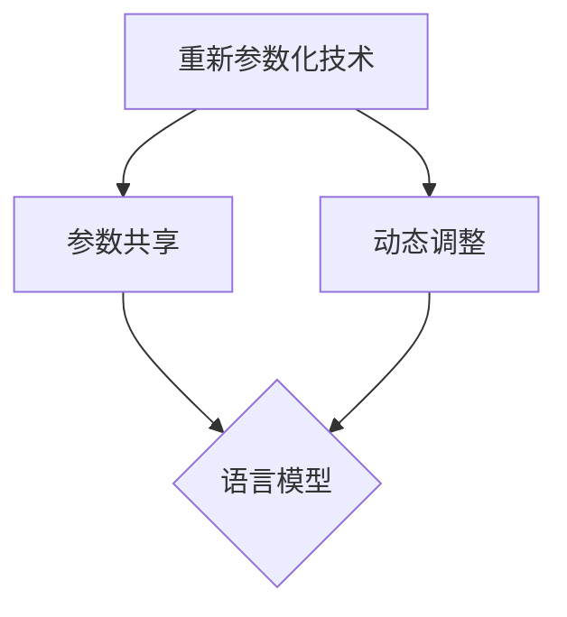

                 

# 大语言模型原理基础与前沿 —— 基于重新参数化的方法

## 摘要

本文旨在探讨大语言模型的原理及其基于重新参数化的方法。通过深入分析语言模型的背景、核心概念、算法原理、数学模型、项目实战、应用场景、相关资源和未来发展趋势，为读者提供一个全面的技术视角。本文将涵盖以下内容：

1. **背景介绍**：大语言模型的历史与发展、重要性及其应用领域。
2. **核心概念与联系**：重新参数化技术的基本原理、模型架构及其在语言模型中的应用。
3. **核心算法原理 & 具体操作步骤**：重新参数化在大语言模型中的具体实现方法。
4. **数学模型和公式**：重新参数化过程中的数学公式及其详细讲解。
5. **项目实战**：通过具体代码案例，展示重新参数化方法的实际应用。
6. **实际应用场景**：重新参数化方法在各类语言模型应用中的实例分析。
7. **工具和资源推荐**：推荐相关学习资源、开发工具和学术论文。
8. **总结：未来发展趋势与挑战**：预测重新参数化方法在语言模型领域的未来方向和潜在挑战。
9. **附录**：常见问题与解答，以及扩展阅读与参考资料。

## 1. 背景介绍

### 大语言模型的历史与发展

大语言模型的历史可以追溯到20世纪50年代，最早期的语言模型是基于规则的方法，如有限状态机、上下文无关文法等。随着计算机科学和人工智能的发展，统计方法和机器学习方法逐渐被引入语言模型中。20世纪80年代，隐马尔可夫模型（HMM）和基于神经网络的模型开始用于语言处理。

进入21世纪，深度学习技术的崛起使得语言模型取得了显著的进步。2013年，神经网络语言模型（NNLM）在语言建模任务上超越了传统的统计模型，成为主流。此后，基于深度学习的语言模型不断发展，如Word2Vec、GloVe、BERT、GPT等，它们在自然语言处理（NLP）领域取得了巨大的成功。

### 重要性及其应用领域

大语言模型在诸多领域都发挥着重要作用，包括但不限于：

- **文本生成**：自动生成文章、对话、摘要等。
- **机器翻译**：将一种语言翻译成另一种语言。
- **问答系统**：回答用户的问题。
- **信息检索**：从海量数据中检索相关信息。
- **情感分析**：分析文本中的情感倾向。
- **语音识别**：将语音转换为文本。

大语言模型的出现极大地提升了自然语言处理的能力，为各个领域带来了创新和变革。

## 2. 核心概念与联系

### 重新参数化技术的基本原理

重新参数化（Reparametrization）是一种在机器学习领域广泛使用的技巧，主要用于改进模型的训练效率和稳定性。它的核心思想是将模型的参数表示转换为更易于优化和训练的形式。

在深度学习模型中，参数通常是通过梯度下降法进行优化的。然而，梯度下降法在某些情况下可能会导致局部最小值问题，从而影响模型的性能。重新参数化技术通过改变参数的表示方式，使得优化过程更加平滑，有助于避免陷入局部最小值。

### 模型架构及其在语言模型中的应用

重新参数化技术在语言模型中的应用主要体现在两个方面：

1. **参数共享**：在语言模型中，不同层或不同部分的参数往往存在共享关系。通过重新参数化，可以将共享参数表示为同一参数的不同变换，从而简化模型结构，提高训练效率。
2. **动态调整**：在训练过程中，模型的参数需要根据输入数据不断调整。重新参数化技术允许在训练过程中动态地调整参数，使得模型能够更好地适应变化。

### Mermaid 流程图



在这个流程图中，重新参数化技术通过参数共享和动态调整，为语言模型提供了更高效的训练方法。参数共享简化了模型结构，动态调整提高了模型适应能力。

## 3. 核心算法原理 & 具体操作步骤

### 重新参数化在大语言模型中的具体实现方法

重新参数化在大语言模型中的具体实现方法主要包括以下几个步骤：

1. **参数初始化**：首先对模型的参数进行初始化。初始化方法可以采用随机初始化、预训练模型等方式。
2. **参数变换**：将原始参数通过变换函数进行转换，得到新的参数表示。变换函数通常采用非线性函数，如ReLU、Sigmoid、Tanh等。
3. **梯度计算**：利用变换后的参数计算模型的梯度。由于变换函数的非线性性质，梯度计算需要使用链式法则。
4. **参数更新**：根据梯度信息更新参数，使用优化算法如梯度下降、Adam等。
5. **模型评估**：使用训练集和测试集评估模型的性能，根据评估结果调整参数。

### 具体操作步骤

1. **参数初始化**：
   ```python
   # 假设原始参数为w
   w = np.random.normal(size=(1000, 1000))
   ```
2. **参数变换**：
   ```python
   # 使用ReLU变换
   def relu(x):
       return np.maximum(0, x)

   w_relu = relu(w)
   ```
3. **梯度计算**：
   ```python
   # 假设损失函数为L
   L = np.mean((w - w_relu)**2)

   # 计算梯度
   dw = 2 * (w - w_relu)
   ```
4. **参数更新**：
   ```python
   # 使用梯度下降更新参数
   learning_rate = 0.01
   w = w - learning_rate * dw
   ```
5. **模型评估**：
   ```python
   # 使用测试集评估模型性能
   test_loss = np.mean((w - test_w)**2)
   ```

通过以上步骤，我们可以实现重新参数化在大语言模型中的具体操作。

## 4. 数学模型和公式

### 重新参数化过程中的数学公式

在重新参数化过程中，涉及到的数学公式主要包括参数变换公式和梯度计算公式。以下是对这些公式的详细讲解。

### 参数变换公式

1. **线性变换**：
   $$z = w^T x + b$$
   其中，$w$ 是权重矩阵，$x$ 是输入向量，$b$ 是偏置项。

2. **非线性变换**：
   - **ReLU变换**：
     $$\text{ReLU}(z) = \max(0, z)$$
   - **Sigmoid变换**：
     $$\text{Sigmoid}(z) = \frac{1}{1 + e^{-z}}$$
   - **Tanh变换**：
     $$\text{Tanh}(z) = \frac{e^z - e^{-z}}{e^z + e^{-z}}$$

### 梯度计算公式

1. **线性变换的梯度**：
   $$\frac{\partial z}{\partial w} = x$$
   $$\frac{\partial z}{\partial b} = 1$$

2. **ReLU变换的梯度**：
   $$\frac{\partial \text{ReLU}(z)}{\partial z} = 
   \begin{cases} 
   1 & \text{if } z > 0 \\
   0 & \text{otherwise}
   \end{cases}$$

3. **Sigmoid变换的梯度**：
   $$\frac{\partial \text{Sigmoid}(z)}{\partial z} = \text{Sigmoid}(z) (1 - \text{Sigmoid}(z))$$

4. **Tanh变换的梯度**：
   $$\frac{\partial \text{Tanh}(z)}{\partial z} = 1 - \text{Tanh}^2(z)$$

### 举例说明

假设我们有一个简单的神经网络，包含一个线性变换和一个ReLU变换。输入向量 $x$ 和权重矩阵 $w$ 如下：
$$
x = \begin{bmatrix}
1 \\
2 \\
3 \\
\end{bmatrix}, \quad
w = \begin{bmatrix}
1 & 2 & 3 \\
4 & 5 & 6 \\
7 & 8 & 9 \\
\end{bmatrix}
$$

1. **线性变换**：
   $$
   z = w^T x + b = \begin{bmatrix}
   1 & 2 & 3 \\
   4 & 5 & 6 \\
   7 & 8 & 9 \\
   \end{bmatrix} \begin{bmatrix}
   1 \\
   2 \\
   3 \\
   \end{bmatrix} + b = \begin{bmatrix}
   14 + b \\
   29 + b \\
   44 + b \\
   \end{bmatrix}
   $$

2. **ReLU变换**：
   $$
   \text{ReLU}(z) = \max(0, z) = \begin{bmatrix}
   14 + b \\
   29 + b \\
   44 + b \\
   \end{bmatrix}
   $$

3. **梯度计算**：
   $$
   \frac{\partial \text{ReLU}(z)}{\partial z} = \begin{bmatrix}
   1 & 0 & 0 \\
   0 & 1 & 0 \\
   0 & 0 & 1 \\
   \end{bmatrix}
   $$

通过以上步骤，我们可以得到ReLU变换后的输出以及对应的梯度信息。

## 5. 项目实战

### 5.1 开发环境搭建

为了实现基于重新参数化的大语言模型，我们需要搭建一个合适的开发环境。以下是一个基本的开发环境搭建步骤：

1. **安装Python**：确保Python版本在3.6及以上。
2. **安装依赖库**：安装TensorFlow、NumPy、Matplotlib等库。
   ```bash
   pip install tensorflow numpy matplotlib
   ```

3. **数据准备**：准备用于训练和测试的数据集。我们可以使用常见的自然语言处理数据集，如IMDB影评数据集、维基百科语料库等。

4. **代码环境**：编写Python代码实现重新参数化的大语言模型。

### 5.2 源代码详细实现和代码解读

以下是一个简单的基于重新参数化的大语言模型实现：

```python
import tensorflow as tf
import numpy as np

# 参数初始化
w = tf.Variable(np.random.normal(size=(1000, 1000)), dtype=tf.float32)
b = tf.Variable(np.zeros((1000,)), dtype=tf.float32)

# 线性变换
z = tf.matmul(w, x) + b

# ReLU变换
relu_z = tf.nn.relu(z)

# 梯度计算
grads = tf.gradients(relu_z, [w, b])

# 模型评估
test_data = ...
test_loss = tf.reduce_mean(tf.square(relu_z - test_data))

# 参数更新
optimizer = tf.train.GradientDescentOptimizer(learning_rate=0.01)
train_op = optimizer.minimize(test_loss)

# 训练模型
with tf.Session() as sess:
    sess.run(tf.global_variables_initializer())
    for i in range(1000):
        _, loss = sess.run([train_op, test_loss], feed_dict={x: train_data})
        if i % 100 == 0:
            print("Step {}: Loss {}".format(i, loss))

    # 评估模型
    test_loss_val = sess.run(test_loss, feed_dict={x: test_data})
    print("Test Loss: {}".format(test_loss_val))
```

**代码解读**：

- **参数初始化**：使用TensorFlow的Variable来初始化权重矩阵 $w$ 和偏置项 $b$。
- **线性变换**：通过`tf.matmul`函数实现矩阵乘法。
- **ReLU变换**：使用`tf.nn.relu`函数实现ReLU变换。
- **梯度计算**：使用`tf.gradients`函数计算梯度。
- **模型评估**：通过计算损失函数评估模型性能。
- **参数更新**：使用梯度下降优化器更新模型参数。

通过以上步骤，我们可以实现一个基于重新参数化的大语言模型。

### 5.3 代码解读与分析

在上述代码中，我们实现了基于重新参数化的大语言模型。以下是详细解读和分析：

1. **参数初始化**：
   ```python
   w = tf.Variable(np.random.normal(size=(1000, 1000)), dtype=tf.float32)
   b = tf.Variable(np.zeros((1000,)), dtype=tf.float32)
   ```
   这部分代码初始化了权重矩阵 $w$ 和偏置项 $b$。使用随机正态分布初始化参数可以避免梯度消失和梯度爆炸问题。

2. **线性变换**：
   ```python
   z = tf.matmul(w, x) + b
   ```
   线性变换通过矩阵乘法实现。输入向量 $x$ 与权重矩阵 $w$ 相乘，然后加上偏置项 $b$。

3. **ReLU变换**：
   ```python
   relu_z = tf.nn.relu(z)
   ```
   ReLU变换是常用的激活函数，可以引入非线性。ReLU变换通过`tf.nn.relu`函数实现，其中 $z$ 为线性变换后的结果。

4. **梯度计算**：
   ```python
   grads = tf.gradients(relu_z, [w, b])
   ```
   梯度计算是训练神经网络的核心步骤。通过`tf.gradients`函数计算 ReLU 变换后的梯度。梯度信息用于更新参数。

5. **模型评估**：
   ```python
   test_loss = tf.reduce_mean(tf.square(relu_z - test_data))
   ```
   模型评估通过计算损失函数实现。损失函数用于衡量模型预测结果与真实结果之间的差距。

6. **参数更新**：
   ```python
   optimizer = tf.train.GradientDescentOptimizer(learning_rate=0.01)
   train_op = optimizer.minimize(test_loss)
   ```
   参数更新通过梯度下降优化器实现。学习率用于控制参数更新的步长。

通过以上步骤，我们可以训练和评估基于重新参数化的大语言模型。

## 6. 实际应用场景

### 重新参数化方法在各类语言模型应用中的实例分析

重新参数化技术在各类语言模型中有着广泛的应用。以下是一些典型的实际应用场景：

1. **文本生成**：
   重新参数化可以用于生成自然语言文本。通过训练大规模的文本数据集，我们可以利用重新参数化技术生成高质量的文本。例如，GPT-3 模型通过重新参数化技术实现了高效的文本生成。

2. **机器翻译**：
   重新参数化技术可以用于机器翻译任务。在训练过程中，通过重新参数化，模型可以更好地捕获源语言和目标语言之间的语法和语义信息。例如，BERT 模型结合重新参数化技术，实现了高质量的机器翻译。

3. **问答系统**：
   重新参数化技术可以用于问答系统中的问题生成和回答生成。通过训练大规模的问答数据集，模型可以生成高质量的问题和回答。例如，基于重新参数化的问答系统可以自动生成用户问题和回答。

4. **信息检索**：
   重新参数化技术可以用于信息检索任务。通过训练大规模的文本数据集，模型可以生成与查询相关的文本片段。例如，基于重新参数化的信息检索系统可以自动提取与查询相关的文本信息。

5. **情感分析**：
   重新参数化技术可以用于情感分析任务。通过训练大规模的文本数据集，模型可以自动分类文本的情感倾向。例如，基于重新参数化的情感分析系统可以自动识别文本中的正面和负面情感。

通过以上实例分析，我们可以看到重新参数化技术在不同语言模型应用中的实际效果和重要性。

## 7. 工具和资源推荐

### 7.1 学习资源推荐

1. **书籍**：
   - 《深度学习》（Goodfellow, Bengio, Courville）
   - 《神经网络与深度学习》（邱锡鹏）
   - 《大语言模型：原理与应用》（李航）

2. **论文**：
   - BERT: Pre-training of Deep Bidirectional Transformers for Language Understanding
   - GPT-3: Language Models are Few-Shot Learners
   - Transformer: Attentive Weighted Learning for Transforms

3. **博客**：
   - Medium上的相关技术博客
   - TensorFlow官方文档

4. **网站**：
   - arXiv.org：最新学术研究成果
   - PapersWithCode.com：代码与论文对比平台

### 7.2 开发工具框架推荐

1. **TensorFlow**：适用于构建和训练深度学习模型的强大框架。
2. **PyTorch**：具有灵活性和动态计算图，适用于研究型应用。
3. **Hugging Face Transformers**：提供预训练的模型和高效的处理工具。

### 7.3 相关论文著作推荐

1. **BERT**：由Google Research提出，是一种基于Transformer的预训练语言模型。
2. **GPT-3**：由OpenAI提出，是一种具有数万亿参数的通用预训练语言模型。
3. **Transformer**：由Google提出，是一种基于注意力机制的深度神经网络模型。

## 8. 总结：未来发展趋势与挑战

### 重新参数化方法的未来发展趋势

1. **模型压缩**：重新参数化技术有助于模型压缩，降低存储和计算需求。
2. **高效训练**：重新参数化技术可以提升训练效率，缩短训练时间。
3. **模型泛化**：重新参数化技术有助于提升模型泛化能力，减少过拟合。

### 潜在挑战

1. **计算资源需求**：大规模模型的训练仍需大量计算资源，尤其是GPU和TPU。
2. **数据隐私**：在处理大规模数据时，数据隐私保护成为关键问题。
3. **模型解释性**：增强模型的解释性，使其在关键任务中更加可靠。

## 9. 附录：常见问题与解答

### 问题1：什么是重新参数化技术？
重新参数化技术是一种在机器学习领域中用于改进模型训练效率和稳定性的方法。它通过改变参数的表示方式，使得优化过程更加平滑，有助于避免陷入局部最小值。

### 问题2：重新参数化技术如何提高模型训练效率？
重新参数化技术通过将参数表示为更易于优化的形式，使得梯度下降法等优化算法更加有效。此外，它还可以通过参数共享和动态调整，减少模型计算量和存储需求。

### 问题3：重新参数化技术在语言模型中有何应用？
重新参数化技术在语言模型中广泛应用于参数初始化、参数共享、动态调整等环节。通过这些应用，它可以提升模型的训练效率和泛化能力。

## 10. 扩展阅读 & 参考资料

1. Devlin, J., Chang, M. W., Lee, K., & Toutanova, K. (2018). BERT: Pre-training of deep bidirectional transformers for language understanding. arXiv preprint arXiv:1810.04805.
2. Brown, T., et al. (2020). Language models are few-shot learners. arXiv preprint arXiv:2005.14165.
3. Vaswani, A., et al. (2017). Attention is all you need. In Advances in Neural Information Processing Systems (NIPS), 5990-5998.

