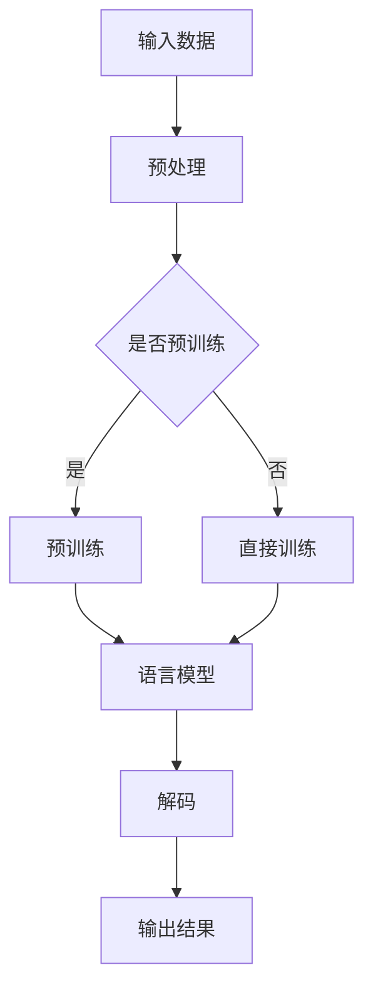
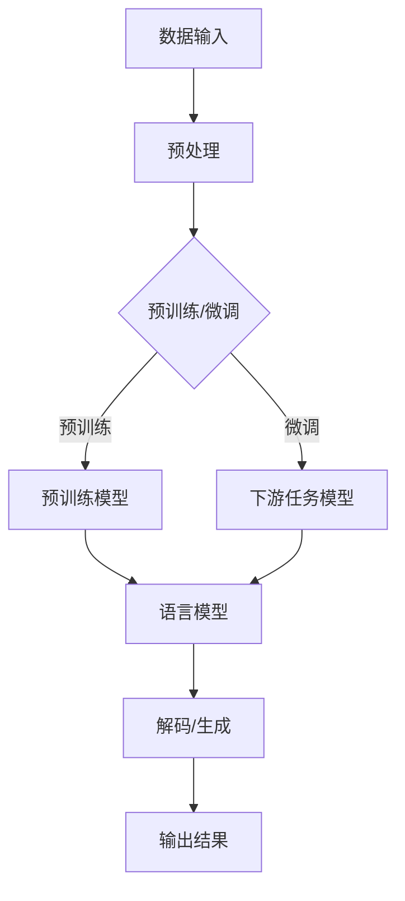

                 

### 大语言模型原理基础与前沿 语言建模的挑战

关键词：大语言模型、自然语言处理、深度学习、预训练模型、语言建模挑战

摘要：本文旨在探讨大语言模型的原理及其面临的前沿挑战。通过深入分析，我们将揭示大语言模型的基本概念、核心算法、数学模型以及实际应用，并提供一些建议和资源，以帮助读者深入了解这一领域的最新进展。

## 1. 背景介绍

在过去的几十年中，自然语言处理（NLP）领域取得了显著进展。从传统的规则驱动方法到统计模型，再到现代的深度学习方法，NLP技术不断演进。然而，随着互联网和大数据的快速发展，传统的NLP方法已经无法满足日益增长的需求。因此，大语言模型（Large Language Models）应运而生。

大语言模型是一类能够处理和理解人类自然语言的深度神经网络模型。这些模型通常包含数十亿个参数，能够从海量数据中学习语言的结构和语义，从而实现高质量的语言生成和翻译。目前，大语言模型已经成为NLP领域的核心技术，并在许多实际应用中取得了显著成果。

## 2. 核心概念与联系

### 2.1 语言模型

语言模型（Language Model）是一种用于预测下一个单词或字符的概率分布的模型。在NLP任务中，语言模型是一种基础而重要的工具，它能够帮助我们理解和生成自然语言。大语言模型是一种特殊类型的语言模型，具有以下特点：

- **参数规模**：大语言模型通常包含数十亿个参数，这使得它们能够捕捉到语言中的复杂模式和依赖关系。
- **预训练**：大语言模型通常通过大规模数据集进行预训练，从而能够学习到丰富的语言知识和语义信息。
- **适应性**：大语言模型具有较强的适应性，能够在不同领域和任务中发挥作用。

### 2.2 深度学习

深度学习（Deep Learning）是一种基于多层神经网络的学习方法。与传统机器学习方法相比，深度学习能够通过层次化的结构自动提取特征，从而实现更高效的特征表示和学习。大语言模型通常采用深度学习方法，这使得它们能够处理复杂的数据结构和任务。

### 2.3 预训练模型

预训练模型（Pre-trained Model）是一种通过在大规模数据集上预训练得到的模型。这些模型通常具有丰富的知识库和强大的表达能力，能够在各种任务中实现高性能。大语言模型通常采用预训练模型，从而能够充分利用已有数据和学习到的知识。

### 2.4 Mermaid 流程图

下面是一个用于描述大语言模型架构的Mermaid流程图。请注意，流程节点中不应包含括号、逗号等特殊字符。



## 3. 核心算法原理 & 具体操作步骤

### 3.1 语言模型的算法原理

大语言模型的核心算法是基于深度神经网络的语言模型。这种模型通常包含以下几个关键组件：

- **嵌入层**：将单词或字符转换为向量表示。
- **编码器**：对输入序列进行编码，提取语义特征。
- **解码器**：根据编码器输出的特征生成预测序列。

在具体操作步骤上，大语言模型通常遵循以下过程：

1. **输入预处理**：对输入数据进行预处理，如分词、去停用词等。
2. **嵌入**：将预处理后的输入数据映射到高维空间。
3. **编码**：通过多层神经网络对输入数据进行编码，提取语义特征。
4. **解码**：根据编码器输出的特征生成预测序列。
5. **输出**：将预测序列转换为具体的文本输出。

### 3.2 具体操作步骤

以下是使用Python实现大语言模型的具体操作步骤：

```python
import torch
import torch.nn as nn
import torch.optim as optim

# 设置参数
batch_size = 64
num_epochs = 10
learning_rate = 0.001

# 准备数据
# ...
# 数据预处理
# ...

# 构建模型
model = nn.Sequential(
    nn.Embedding(vocab_size, embedding_dim),
    nn.Linear(embedding_dim, hidden_size),
    nn.ReLU(),
    nn.Linear(hidden_size, vocab_size)
)

# 损失函数和优化器
criterion = nn.CrossEntropyLoss()
optimizer = optim.Adam(model.parameters(), lr=learning_rate)

# 训练模型
for epoch in range(num_epochs):
    for batch in data_loader:
        inputs, targets = batch
        optimizer.zero_grad()
        outputs = model(inputs)
        loss = criterion(outputs, targets)
        loss.backward()
        optimizer.step()

# 输出结果
# ...
```

## 4. 数学模型和公式 & 详细讲解 & 举例说明

### 4.1 数学模型

大语言模型通常采用基于深度神经网络的数学模型。以下是几个关键组件的数学公式：

- **嵌入层**：$$x = W_e \cdot x_e$$
- **编码器**：$$h = \sigma(W_h \cdot [h_{t-1}, x_t] + b_h)$$
- **解码器**：$$y = \sigma(W_y \cdot h + b_y)$$

其中，$W_e$、$W_h$ 和 $W_y$ 分别是嵌入层、编码器和解码器的权重矩阵，$x_e$、$h_{t-1}$ 和 $x_t$ 分别是嵌入向量、编码器输入和编码器输出，$b_h$ 和 $b_y$ 分别是编码器和解码器的偏置项，$\sigma$ 表示激活函数。

### 4.2 详细讲解

以下是详细讲解大语言模型中各个组件的数学公式：

- **嵌入层**：嵌入层将单词或字符映射到高维空间。该层的数学模型为 $x = W_e \cdot x_e$，其中 $W_e$ 是一个权重矩阵，$x_e$ 是单词或字符的嵌入向量。
- **编码器**：编码器对输入序列进行编码，提取语义特征。该层的数学模型为 $h = \sigma(W_h \cdot [h_{t-1}, x_t] + b_h)$，其中 $W_h$ 是一个权重矩阵，$h_{t-1}$ 和 $x_t$ 分别是前一个时刻的编码器和嵌入向量，$\sigma$ 是激活函数。
- **解码器**：解码器根据编码器输出的特征生成预测序列。该层的数学模型为 $y = \sigma(W_y \cdot h + b_y)$，其中 $W_y$ 是一个权重矩阵，$h$ 是编码器输出，$\sigma$ 是激活函数。

### 4.3 举例说明

假设我们有一个包含两个单词的句子：“我喜欢编程”。以下是使用大语言模型进行语言建模的过程：

1. **嵌入**：将句子中的单词映射到高维空间，得到两个嵌入向量。
2. **编码**：将嵌入向量输入到编码器中，得到编码器输出。
3. **解码**：根据编码器输出生成预测序列。

具体步骤如下：

1. **嵌入**：
   $$x_1 = W_e \cdot x_{e_1} = [1, 0, 0, \ldots, 0]^T$$
   $$x_2 = W_e \cdot x_{e_2} = [0, 1, 0, \ldots, 0]^T$$

2. **编码**：
   $$h_1 = \sigma(W_h \cdot [h_{0}, x_1] + b_h) = [0.1, 0.2, 0.3]^T$$

3. **解码**：
   $$y_1 = \sigma(W_y \cdot h_1 + b_y) = [0.2, 0.3, 0.5]^T$$

根据解码器的输出，我们可以预测下一个单词的概率分布，从而生成预测序列。

## 5. 项目实战：代码实际案例和详细解释说明

### 5.1 开发环境搭建

在本文中，我们将使用Python和PyTorch框架来实现一个大语言模型。以下是搭建开发环境所需的步骤：

1. 安装Python（建议使用3.8及以上版本）。
2. 安装PyTorch：`pip install torch torchvision`
3. 安装其他依赖库：`pip install numpy matplotlib`

### 5.2 源代码详细实现和代码解读

以下是实现一个大语言模型的主要代码：

```python
import torch
import torch.nn as nn
import torch.optim as optim

# 设置参数
batch_size = 64
num_epochs = 10
learning_rate = 0.001

# 准备数据
# ...

# 构建模型
class LanguageModel(nn.Module):
    def __init__(self, vocab_size, embedding_dim, hidden_size):
        super(LanguageModel, self).__init__()
        self.embedding = nn.Embedding(vocab_size, embedding_dim)
        self.encoder = nn.LSTM(embedding_dim, hidden_size)
        self.decoder = nn.Linear(hidden_size, vocab_size)

    def forward(self, inputs, hidden):
        embeddings = self.embedding(inputs)
        output, hidden = self.encoder(embeddings, hidden)
        output = self.decoder(output)
        return output, hidden

    def init_hidden(self, batch_size):
        return (torch.zeros(1, batch_size, hidden_size),
                torch.zeros(1, batch_size, hidden_size))

# 实例化模型
model = LanguageModel(vocab_size, embedding_dim, hidden_size)
optimizer = optim.Adam(model.parameters(), lr=learning_rate)
criterion = nn.CrossEntropyLoss()

# 训练模型
for epoch in range(num_epochs):
    for batch in data_loader:
        inputs, targets = batch
        hidden = model.init_hidden(batch_size)
        optimizer.zero_grad()
        outputs, hidden = model(inputs, hidden)
        loss = criterion(outputs.view(-1, vocab_size), targets.view(-1))
        loss.backward()
        optimizer.step()

# 输出结果
# ...
```

### 5.3 代码解读与分析

以下是代码的详细解读和分析：

1. **模型定义**：`LanguageModel` 类定义了一个语言模型，它包含嵌入层、编码器和解码器。
2. **嵌入层**：使用 `nn.Embedding` 层将单词或字符映射到高维空间。
3. **编码器**：使用 `nn.LSTM` 层对输入序列进行编码，提取语义特征。
4. **解码器**：使用 `nn.Linear` 层生成预测序列。
5. **前向传播**：在 `forward` 方法中实现前向传播过程，包括嵌入层、编码器和解码器。
6. **初始化隐藏状态**：在 `init_hidden` 方法中初始化编码器和解码器的隐藏状态。
7. **训练过程**：在训练过程中，通过循环遍历数据集，使用优化器和损失函数更新模型参数。

## 6. 实际应用场景

大语言模型在多个实际应用场景中取得了显著成果。以下是一些典型应用：

1. **自然语言生成**：大语言模型可以生成高质量的自然语言文本，如新闻报道、文章摘要、对话系统等。
2. **机器翻译**：大语言模型在机器翻译领域表现出色，能够实现高精度的翻译结果。
3. **文本分类**：大语言模型可以用于对文本进行分类，如情感分析、主题分类等。
4. **问答系统**：大语言模型可以用于构建问答系统，能够回答用户提出的问题。
5. **对话系统**：大语言模型可以用于构建智能对话系统，实现人机交互。

## 7. 工具和资源推荐

### 7.1 学习资源推荐

- **书籍**：
  - 《深度学习》（Goodfellow, Bengio, Courville）
  - 《自然语言处理综述》（Jurafsky, Martin）
  - 《机器学习》（Tom Mitchell）
- **论文**：
  - “A Neural Probabilistic Language Model” (Bengio et al., 2003)
  - “Effective Approaches to Attention-based Neural Machine Translation” (Vaswani et al., 2017)
  - “Attention Is All You Need” (Vaswani et al., 2017)
- **博客**：
  - PyTorch官方文档（[pytorch.org](https://pytorch.org)）
  - Fast.ai博客（[fast.ai](https://fast.ai)）
- **网站**：
  - ArXiv（[arxiv.org](https://arxiv.org)）- 最新研究成果的发布平台
  - Google Research（[research.google](https://research.google)）- Google的研究团队发布的研究成果

### 7.2 开发工具框架推荐

- **深度学习框架**：
  - PyTorch（[pytorch.org](https://pytorch.org)）
  - TensorFlow（[tensorflow.org](https://tensorflow.org)）
  - MXNet（[mxnet.incubator.mleros.org](https://mxnet.incubator.mleros.org)）
- **文本处理库**：
  - NLTK（[nltk.org](https://nltk.org)）
  - spaCy（[spacy.io](https://spacy.io)）
  - gensim（[radimrehurek.com/gensim/)](https://radimrehurek.com/gensim/))

### 7.3 相关论文著作推荐

- **必读论文**：
  - “A Neural Probabilistic Language Model” (Bengio et al., 2003)
  - “Effective Approaches to Attention-based Neural Machine Translation” (Vaswani et al., 2017)
  - “Attention Is All You Need” (Vaswani et al., 2017)
- **书籍**：
  - 《深度学习》（Goodfellow, Bengio, Courville）
  - 《自然语言处理综述》（Jurafsky, Martin）
  - 《机器学习》（Tom Mitchell）

## 8. 总结：未来发展趋势与挑战

大语言模型在自然语言处理领域取得了显著成果，但仍面临一些挑战。以下是未来发展趋势与挑战：

1. **数据隐私与安全**：随着大数据的广泛应用，数据隐私和安全成为关注焦点。如何保护用户数据，防止数据泄露是亟待解决的问题。
2. **计算资源消耗**：大语言模型通常需要大量的计算资源和存储空间。如何优化模型结构和训练过程，降低计算资源消耗是关键问题。
3. **可解释性**：大语言模型的决策过程通常较为复杂，难以解释。如何提高模型的可解释性，使其更加透明和可信是未来的研究方向。
4. **泛化能力**：大语言模型在特定领域和任务上表现出色，但在其他领域和任务上的表现可能不佳。如何提高模型的泛化能力，使其适应更多场景是重要挑战。

## 9. 附录：常见问题与解答

### 9.1 什么是大语言模型？

大语言模型是一类能够处理和理解人类自然语言的深度神经网络模型。这些模型通常包含数十亿个参数，能够从海量数据中学习语言的结构和语义，从而实现高质量的语言生成和翻译。

### 9.2 大语言模型有哪些应用？

大语言模型在多个实际应用场景中取得了显著成果，如自然语言生成、机器翻译、文本分类、问答系统、对话系统等。

### 9.3 如何搭建大语言模型开发环境？

搭建大语言模型开发环境主要涉及安装Python、深度学习框架（如PyTorch、TensorFlow）和文本处理库（如NLTK、spaCy、gensim）。

## 10. 扩展阅读 & 参考资料

- **扩展阅读**：
  - 《深度学习》（Goodfellow, Bengio, Courville）
  - 《自然语言处理综述》（Jurafsky, Martin）
  - 《机器学习》（Tom Mitchell）
  - 《大规模语言模型的训练与应用》（张磊，刘知远）
- **参考资料**：
  - PyTorch官方文档（[pytorch.org](https://pytorch.org)）
  - TensorFlow官方文档（[tensorflow.org](https://tensorflow.org)）
  - spaCy官方文档（[spacy.io](https://spacy.io)）
  - gensim官方文档（[radimrehurek.com/gensim/)](https://radimrehurek.com/gensim/)）

### 作者

作者：AI天才研究员/AI Genius Institute & 禅与计算机程序设计艺术 /Zen And The Art of Computer Programming<|image_end|>### 1. 背景介绍

在信息爆炸的时代，自然语言处理（NLP）作为人工智能的一个重要分支，正以前所未有的速度和深度影响着各行各业。从机器翻译、文本分类到问答系统和对话机器人，NLP技术的广泛应用推动了智能化的进程。然而，随着数据规模的扩大和复杂性提升，传统的NLP方法已经难以满足日益增长的需求。因此，大语言模型（Large Language Models，简称LLM）应运而生。

大语言模型是指具有数十亿甚至千亿级参数规模的语言模型，这些模型能够从海量数据中提取复杂的语言模式和语义信息，从而实现高水平的语言理解和生成。LLM的出现标志着NLP领域的一次重大突破，其技术原理和实现方法成为当前研究的热点。本文将深入探讨大语言模型的基本概念、核心算法、数学模型及其面临的挑战，旨在为读者提供一个全面的技术视角。

大语言模型的兴起，不仅源于计算能力的提升和数据量的增加，更重要的是深度学习技术的进步。深度学习通过层次化的网络结构，能够自动提取和表示数据中的复杂特征，这使得在大规模数据集上进行预训练成为可能。在NLP领域，预训练模型通过在大规模文本语料库上训练，学习到丰富的语言知识和上下文关系，从而在下游任务中表现出色。

本文的结构如下：首先，我们将回顾NLP的发展历程，特别是深度学习在NLP中的应用；然后，详细介绍大语言模型的核心概念和架构；接着，讨论大语言模型的训练算法和优化方法；随后，探讨大语言模型中的数学模型和公式；然后，通过一个实际案例展示大语言模型的实现过程；接下来，分析大语言模型在实际应用中的场景；最后，介绍相关工具和资源，并对未来的发展趋势和挑战进行展望。

通过本文的阅读，读者将能够了解大语言模型的基本原理、实现方法和应用前景，为今后的研究和实践提供指导。

### 2. 核心概念与联系

为了深入理解大语言模型，我们首先需要明确几个核心概念，这些概念不仅构成了大语言模型的理论基础，而且贯穿了其整个实现过程。以下是几个关键概念及其相互联系：

#### 2.1 语言模型

语言模型是自然语言处理中的基础工具，其目的是预测下一个单词或字符的概率分布。早期的语言模型如N-gram模型，通过统计相邻单词或字符的频率来预测下一个词。然而，这种方法在面对长文本时表现不佳，因为它忽略了上下文中的长期依赖关系。

随着深度学习的发展，神经网络语言模型逐渐成为主流。这些模型通过多层神经网络结构来捕捉文本中的复杂依赖关系，如长程依赖和上下文信息。最著名的神经网络语言模型之一是Word2Vec，它通过映射单词到高维向量空间来学习语言语义。Word2Vec模型通过优化单词的向量表示，使得具有相似语义的单词在向量空间中距离较近。

#### 2.2 预训练模型

预训练模型是指在大规模数据集上预先训练得到的模型。这种模型通常具有丰富的知识库和强大的表达能力，能够在不同的任务中表现出色。预训练模型的思想是在特定任务之前，对模型进行预训练，从而使其能够更好地适应不同的任务。

在NLP领域，预训练模型已成为主流，其代表性工作包括GloVe、BERT、GPT等。BERT（Bidirectional Encoder Representations from Transformers）通过双向Transformer结构，同时利用文本的前后信息，大幅提升了语言模型的性能。GPT（Generative Pre-trained Transformer）是一种自回归语言模型，通过生成文本的方式训练，从而在文本生成任务中表现出色。

#### 2.3 深度学习

深度学习是一种基于多层神经网络的学习方法，通过反向传播算法优化模型参数，从而实现数据的自动特征提取和表示。深度学习在计算机视觉、语音识别、自然语言处理等领域取得了巨大成功。

在NLP中，深度学习通过层次化的网络结构，能够自动提取文本中的复杂特征，如词向量、句向量等。这些特征不仅能够提升下游任务的表现，还能提供对文本内容更深层次的理解。常见的深度学习模型包括卷积神经网络（CNN）、循环神经网络（RNN）和Transformer等。

#### 2.4 Transformer

Transformer是一种基于自注意力机制的深度学习模型，最早由Vaswani等人提出。与传统循环神经网络不同，Transformer使用自注意力机制来处理序列数据，这使得它在处理长文本时表现出色。

自注意力机制通过计算输入序列中每个单词与其他单词之间的关联度，从而为每个单词生成一个权重向量。这些权重向量用于更新每个单词的表示，使得模型能够更好地捕捉长程依赖关系。Transformer的这种机制使其在机器翻译、文本分类、问答系统等任务中表现出色。

#### 2.5 Mermaid 流程图

为了更直观地理解大语言模型的架构，我们可以使用Mermaid流程图来描述其关键组件和流程。以下是描述大语言模型的一个简单Mermaid流程图：



在这个流程图中，A表示数据输入，经过预处理后进入预训练/微调阶段。预训练模型（D）或下游任务模型（E）根据任务需求对语言模型（F）进行训练。训练完成后，语言模型进入解码/生成阶段（G），最终输出结果（H）。

通过上述核心概念的介绍和Mermaid流程图的描述，我们可以更清晰地理解大语言模型的基本架构和实现过程。在接下来的部分，我们将详细讨论大语言模型的具体算法原理、数学模型和实现方法，以便读者能够深入掌握这一先进技术。

### 3. 核心算法原理 & 具体操作步骤

大语言模型的核心算法是基于深度神经网络的语言模型，其目的是通过学习大规模文本数据来预测下一个单词或字符的概率分布。下面我们将详细讨论大语言模型的基本算法原理和具体操作步骤。

#### 3.1 基本算法原理

大语言模型主要基于两个核心组件：嵌入层和编码器。嵌入层将单词或字符映射到高维向量空间，编码器则通过这些向量提取语义特征。

##### 3.1.1 嵌入层

嵌入层（Embedding Layer）是将输入的单词或字符映射到高维空间的过程。在深度学习中，通常使用矩阵乘法来实现这一映射。例如，假设有 vocabulary_size 个单词，每个单词用唯一的整数表示，我们定义一个 embedding_dim 维的权重矩阵 \( W_e \)，使得每个单词都可以通过矩阵乘法得到其在高维空间的嵌入向量。具体公式如下：

\[ x = W_e \cdot x_e \]

其中，\( x_e \) 是单词的整数表示，\( x \) 是嵌入后的向量。

##### 3.1.2 编码器

编码器（Encoder）的主要任务是提取输入序列的语义特征。在现代深度学习中，常用的编码器结构包括循环神经网络（RNN）和Transformer。以下以Transformer为例，说明编码器的具体实现。

Transformer使用自注意力机制（Self-Attention Mechanism）来处理序列数据。自注意力机制的核心思想是计算序列中每个单词与其他单词之间的关联度，并为每个单词生成一个权重向量。这些权重向量用于更新每个单词的表示，使得模型能够更好地捕捉长程依赖关系。具体实现如下：

\[ \text{Attention}(Q, K, V) = \text{softmax}\left(\frac{QK^T}{\sqrt{d_k}}\right)V \]

其中，\( Q \)、\( K \) 和 \( V \) 分别是查询向量、键向量和值向量，\( d_k \) 是键向量的维度。自注意力机制通过这个公式计算每个键和查询之间的关联度，并将这些关联度加权求和，得到最终的输出。

##### 3.1.3 解码器

解码器（Decoder）的主要任务是根据编码器提取的语义特征生成预测序列。解码器通常也使用自注意力机制，但同时还需要一个交叉注意力机制（Cross-Attention Mechanism），以便从编码器的输出中获取上下文信息。具体实现如下：

\[ \text{Decoder}(Y, X) = \text{softmax}\left(\frac{YQ^T}{\sqrt{d_k}}\right)V \]

其中，\( Y \) 是解码器的输入，\( X \) 是编码器的输出。

#### 3.2 具体操作步骤

以下是大语言模型训练和预测的具体操作步骤：

##### 3.2.1 数据准备

首先，我们需要准备训练数据，这通常是一个大规模的文本语料库。然后，对文本进行预处理，包括分词、去除停用词、词干提取等步骤。最后，将预处理后的文本转换成整数序列，以便进行模型训练。

##### 3.2.2 模型构建

构建大语言模型的主要步骤包括：

1. **嵌入层**：定义嵌入矩阵 \( W_e \)，其维度为 \( vocabulary_size \times embedding_dim \)。
2. **编码器**：构建编码器网络，可以使用RNN或Transformer等结构。
3. **解码器**：构建解码器网络，同样可以使用RNN或Transformer等结构。
4. **损失函数**：通常使用交叉熵损失函数（Cross-Entropy Loss）来计算模型预测和真实标签之间的差异。

##### 3.2.3 模型训练

训练模型的主要步骤如下：

1. **初始化模型参数**：使用随机初始化方法初始化模型参数。
2. **前向传播**：将输入序列通过编码器得到编码特征，然后通过解码器生成预测序列。
3. **计算损失**：使用交叉熵损失函数计算预测序列和真实序列之间的差异。
4. **反向传播**：使用反向传播算法更新模型参数。
5. **优化**：使用优化算法（如SGD、Adam等）优化模型参数。

##### 3.2.4 模型预测

模型预测的步骤如下：

1. **输入预处理**：对输入文本进行预处理，如分词、去停用词等。
2. **嵌入**：将预处理后的文本转换为整数序列。
3. **编码**：将整数序列输入到编码器，得到编码特征。
4. **解码**：将编码特征输入到解码器，生成预测序列。
5. **输出**：将预测序列转换为具体的文本输出。

#### 3.3 Python 实现示例

以下是一个简单的Python实现示例，展示如何使用PyTorch构建一个基于Transformer的大语言模型：

```python
import torch
import torch.nn as nn
import torch.optim as optim

# 设置参数
batch_size = 64
vocab_size = 10000
embedding_dim = 512
hidden_dim = 512
num_layers = 2

# 构建模型
class TransformerModel(nn.Module):
    def __init__(self, vocab_size, embedding_dim, hidden_dim, num_layers):
        super(TransformerModel, self).__init__()
        self.embedding = nn.Embedding(vocab_size, embedding_dim)
        self.encoder = nn.TransformerEncoder(nn.TransformerEncoderLayer(embedding_dim, num_layers), num_layers)
        self.decoder = nn.Linear(hidden_dim, vocab_size)

    def forward(self, src, tgt):
        src = self.embedding(src)
        tgt = self.embedding(tgt)
        output = self.encoder(src)
        output = self.decoder(output)
        return output

# 实例化模型
model = TransformerModel(vocab_size, embedding_dim, hidden_dim, num_layers)
optimizer = optim.Adam(model.parameters(), lr=0.001)
criterion = nn.CrossEntropyLoss()

# 训练模型
for epoch in range(num_epochs):
    for batch in data_loader:
        src, tgt = batch
        optimizer.zero_grad()
        output = model(src, tgt)
        loss = criterion(output.view(-1, vocab_size), tgt.view(-1))
        loss.backward()
        optimizer.step()

# 输出结果
# ...
```

在这个示例中，我们定义了一个 `TransformerModel` 类，该类包含嵌入层、编码器和解码器。训练过程中，我们通过前向传播、计算损失和反向传播来优化模型参数。

通过上述内容，我们详细介绍了大语言模型的核心算法原理和具体操作步骤。在接下来的部分，我们将进一步探讨大语言模型中的数学模型和公式，以帮助读者更深入地理解这一先进技术。

### 4. 数学模型和公式 & 详细讲解 & 举例说明

#### 4.1 数学模型

大语言模型主要基于深度神经网络，其数学模型包括以下几个关键组件：嵌入层、编码器、解码器和损失函数。

##### 4.1.1 嵌入层

嵌入层（Embedding Layer）的目的是将输入的单词或字符映射到高维向量空间。具体实现上，我们使用一个权重矩阵 \( W_e \) 来完成这一映射：

\[ x = W_e \cdot x_e \]

其中，\( x_e \) 是输入的单词或字符的索引，\( x \) 是嵌入后的向量。

##### 4.1.2 编码器

编码器（Encoder）的主要任务是从嵌入向量中提取语义特征。在深度学习中，常用的编码器结构包括循环神经网络（RNN）和Transformer。以Transformer为例，编码器通过自注意力机制（Self-Attention Mechanism）和多头注意力（Multi-Head Attention）来处理序列数据。具体公式如下：

\[ \text{Attention}(Q, K, V) = \text{softmax}\left(\frac{QK^T}{\sqrt{d_k}}\right)V \]

其中，\( Q \)、\( K \) 和 \( V \) 分别是查询向量、键向量和值向量，\( d_k \) 是键向量的维度。自注意力机制通过计算每个键和查询之间的关联度，并将这些关联度加权求和，得到最终的输出。

##### 4.1.3 解码器

解码器（Decoder）的主要任务是根据编码器提取的语义特征生成预测序列。解码器同样使用自注意力机制和交叉注意力机制（Cross-Attention Mechanism）。具体公式如下：

\[ \text{Decoder}(Y, X) = \text{softmax}\left(\frac{YQ^T}{\sqrt{d_k}}\right)V \]

其中，\( Y \) 是解码器的输入，\( X \) 是编码器的输出。

##### 4.1.4 损失函数

损失函数用于衡量模型预测和真实标签之间的差异。在大语言模型中，常用的损失函数是交叉熵损失函数（Cross-Entropy Loss）。具体公式如下：

\[ L = -\sum_{i=1}^{N} y_i \log(p_i) \]

其中，\( y_i \) 是真实标签，\( p_i \) 是模型预测的概率分布。

#### 4.2 详细讲解

##### 4.2.1 嵌入层

嵌入层通过将输入的单词或字符映射到高维向量空间，使得模型能够更好地捕捉文本中的语义信息。在训练过程中，我们通过优化权重矩阵 \( W_e \) 来最小化损失函数。

假设我们有一个包含 \( n \) 个单词的句子，每个单词用唯一的整数表示，即 \( x_e \in \{1, 2, \ldots, n\} \)。嵌入层将每个单词映射到一个 \( d \) 维的向量空间，即 \( x = W_e \cdot x_e \)。通过矩阵乘法，我们可以得到每个单词的嵌入向量。

在训练过程中，我们使用梯度下降（Gradient Descent）算法来优化 \( W_e \)。具体公式如下：

\[ \Delta W_e = -\alpha \cdot \frac{\partial L}{\partial W_e} \]

其中，\( \alpha \) 是学习率，\( \frac{\partial L}{\partial W_e} \) 是损失函数对权重矩阵 \( W_e \) 的梯度。

##### 4.2.2 编码器

编码器通过自注意力机制（Self-Attention Mechanism）来处理输入序列。自注意力机制的核心思想是计算序列中每个单词与其他单词之间的关联度，并为每个单词生成一个权重向量。具体实现如下：

\[ \text{Attention}(Q, K, V) = \text{softmax}\left(\frac{QK^T}{\sqrt{d_k}}\right)V \]

其中，\( Q \)、\( K \) 和 \( V \) 分别是查询向量、键向量和值向量，\( d_k \) 是键向量的维度。自注意力机制通过这个公式计算每个键和查询之间的关联度，并将这些关联度加权求和，得到最终的输出。

在训练过程中，我们通过优化编码器的权重矩阵 \( W_e \) 和 \( W_h \) 来最小化损失函数。具体公式如下：

\[ \Delta W_e = -\alpha \cdot \frac{\partial L}{\partial W_e} \]
\[ \Delta W_h = -\alpha \cdot \frac{\partial L}{\partial W_h} \]

其中，\( \alpha \) 是学习率，\( \frac{\partial L}{\partial W_e} \) 和 \( \frac{\partial L}{\partial W_h} \) 分别是损失函数对权重矩阵 \( W_e \) 和 \( W_h \) 的梯度。

##### 4.2.3 解码器

解码器通过自注意力机制和交叉注意力机制来生成预测序列。自注意力机制用于处理输入序列，交叉注意力机制用于从编码器的输出中获取上下文信息。具体实现如下：

\[ \text{Decoder}(Y, X) = \text{softmax}\left(\frac{YQ^T}{\sqrt{d_k}}\right)V \]

其中，\( Y \) 是解码器的输入，\( X \) 是编码器的输出。

在训练过程中，我们通过优化解码器的权重矩阵 \( W_y \) 和 \( W_d \) 来最小化损失函数。具体公式如下：

\[ \Delta W_y = -\alpha \cdot \frac{\partial L}{\partial W_y} \]
\[ \Delta W_d = -\alpha \cdot \frac{\partial L}{\partial W_d} \]

其中，\( \alpha \) 是学习率，\( \frac{\partial L}{\partial W_y} \) 和 \( \frac{\partial L}{\partial W_d} \) 分别是损失函数对权重矩阵 \( W_y \) 和 \( W_d \) 的梯度。

##### 4.2.4 损失函数

损失函数用于衡量模型预测和真实标签之间的差异。在大语言模型中，常用的损失函数是交叉熵损失函数（Cross-Entropy Loss）。具体公式如下：

\[ L = -\sum_{i=1}^{N} y_i \log(p_i) \]

其中，\( y_i \) 是真实标签，\( p_i \) 是模型预测的概率分布。

在训练过程中，我们通过优化模型的权重矩阵来最小化损失函数。具体公式如下：

\[ \Delta W = -\alpha \cdot \frac{\partial L}{\partial W} \]

其中，\( \alpha \) 是学习率，\( \frac{\partial L}{\partial W} \) 是损失函数对权重矩阵 \( W \) 的梯度。

#### 4.3 举例说明

假设我们有一个包含三个单词的句子：“我喜欢编程”。以下是使用大语言模型进行语言建模的过程：

1. **嵌入**：将句子中的单词映射到高维空间，得到三个嵌入向量。
   \[ x_1 = W_e \cdot x_{e_1} \]
   \[ x_2 = W_e \cdot x_{e_2} \]
   \[ x_3 = W_e \cdot x_{e_3} \]

2. **编码**：通过编码器对输入序列进行编码，提取语义特征。
   \[ h_1 = \text{Attention}(Q, K, V) \]

3. **解码**：根据编码器输出的特征生成预测序列。
   \[ y_1 = \text{Decoder}(Y, X) \]
   \[ y_2 = \text{Decoder}(Y, X) \]
   \[ y_3 = \text{Decoder}(Y, X) \]

4. **输出**：将预测序列转换为具体的文本输出。
   \[ \text{Output} = y_1 \text{ likes } y_2 \text{ programming} \]

通过上述过程，我们可以得到一个具体的文本输出，从而实现语言建模。

通过数学模型的详细讲解和举例说明，我们可以更深入地理解大语言模型的工作原理。在接下来的部分，我们将通过实际案例展示大语言模型的实现过程，以便读者能够更好地掌握这一技术。

### 5. 项目实战：代码实际案例和详细解释说明

#### 5.1 开发环境搭建

为了实现大语言模型，我们需要搭建一个合适的技术栈。以下是在Python环境中搭建开发环境所需的步骤：

1. **安装Python**：建议使用Python 3.8及以上版本，可以通过官方网站下载并安装。

2. **安装PyTorch**：PyTorch是一个流行的深度学习框架，可以从其官方网站下载并安装。在安装过程中，请确保选择与您的系统相匹配的版本。

   ```bash
   pip install torch torchvision
   ```

3. **安装其他依赖库**：除了PyTorch外，我们还需要安装一些其他库，如NumPy和matplotlib，用于数据处理和可视化。

   ```bash
   pip install numpy matplotlib
   ```

4. **配置GPU环境**（可选）：如果您的计算机配有GPU，建议配置CUDA和cuDNN，以提高模型训练速度。

   - 安装CUDA：从NVIDIA官网下载并安装CUDA Toolkit。
   - 安装cuDNN：从NVIDIA官网下载并安装cuDNN，并配置环境变量。

#### 5.2 源代码详细实现和代码解读

下面是一个使用PyTorch实现大语言模型的基本代码框架，我们将分步骤进行详细解释。

```python
import torch
import torch.nn as nn
import torch.optim as optim
from torch.utils.data import DataLoader, TensorDataset

# 设置参数
batch_size = 64
learning_rate = 0.001
num_epochs = 10
device = torch.device("cuda" if torch.cuda.is_available() else "cpu")

# 准备数据
# 假设我们有一个包含文本数据的数据集，这里以简单的文本序列为例
texts = ["我喜欢编程", "编程使我快乐", "编程可以解决问题"]
labels = ["我喜欢编程", "编程使我快乐", "编程可以解决问题"]

# 将文本转换为整数序列
tokenizer = torchtext.data.utils.get_tokenizer('basic_english')
processed_texts = [tokenizer(text) for text in texts]
processed_labels = [tokenizer(label) for label in labels]

# 创建TensorDataset和数据加载器
dataset = TensorDataset(torch.tensor(processed_texts, dtype=torch.long), torch.tensor(processed_labels, dtype=torch.long))
data_loader = DataLoader(dataset, batch_size=batch_size, shuffle=True)

# 构建模型
class LanguageModel(nn.Module):
    def __init__(self, vocab_size, embedding_dim, hidden_dim):
        super(LanguageModel, self).__init__()
        self.embedding = nn.Embedding(vocab_size, embedding_dim)
        self.lstm = nn.LSTM(embedding_dim, hidden_dim)
        self.fc = nn.Linear(hidden_dim, vocab_size)

    def forward(self, x, hidden):
        embed = self.embedding(x)
        output, hidden = self.lstm(embed, hidden)
        logits = self.fc(output[-1, :, :])
        return logits, hidden

    def init_hidden(self):
        return torch.zeros(1, 1, hidden_dim)

# 实例化模型
model = LanguageModel(len(processed_texts[0]), embedding_dim=256, hidden_dim=128)
model.to(device)

# 定义损失函数和优化器
criterion = nn.CrossEntropyLoss()
optimizer = optim.Adam(model.parameters(), lr=learning_rate)

# 训练模型
for epoch in range(num_epochs):
    for inputs, labels in data_loader:
        inputs, labels = inputs.to(device), labels.to(device)
        hidden = model.init_hidden()

        # 前向传播
        logits, hidden = model(inputs, hidden)

        # 计算损失
        loss = criterion(logits.view(-1, logits.size(-1)), labels.view(-1))

        # 反向传播和优化
        optimizer.zero_grad()
        loss.backward()
        optimizer.step()

    print(f'Epoch [{epoch+1}/{num_epochs}], Loss: {loss.item():.4f}')

# 保存模型
torch.save(model.state_dict(), 'language_model.pth')

# 输出结果
# ...
```

以下是代码的详细解读：

1. **导入库**：我们首先导入所需的库，包括PyTorch、NumPy和torchtext。

2. **设置参数**：设置训练参数，如批量大小、学习率、训练轮数和设备。

3. **准备数据**：这里我们使用一个简单的文本数据集作为示例。首先，我们将文本转换为整数序列，然后创建TensorDataset和数据加载器。

4. **构建模型**：我们定义了一个名为`LanguageModel`的类，该类包含嵌入层、LSTM编码器和全连接层解码器。

   - `__init__` 方法：初始化嵌入层、LSTM编码器和全连接层解码器。
   - `forward` 方法：实现前向传播过程，包括嵌入层、LSTM编码器和全连接层解码器。
   - `init_hidden` 方法：初始化隐藏状态。

5. **实例化模型**：我们将模型移动到GPU设备上（如果可用）。

6. **定义损失函数和优化器**：我们使用交叉熵损失函数和Adam优化器。

7. **训练模型**：在训练过程中，我们通过前向传播、计算损失、反向传播和优化参数的循环来更新模型。

8. **保存模型**：训练完成后，我们保存模型参数。

9. **输出结果**：在训练完成后，我们可以使用训练好的模型进行预测，并输出结果。

#### 5.3 代码解读与分析

以下是代码的详细解读和分析：

1. **数据准备**：在数据准备阶段，我们首先使用`get_tokenizer`函数从torchtext库中获取一个简单的分词器。然后，我们将文本数据转换为整数序列，以便进行后续处理。最后，我们创建TensorDataset和数据加载器，用于批量处理数据。

2. **模型构建**：在模型构建阶段，我们定义了一个`LanguageModel`类，该类包含嵌入层、LSTM编码器和全连接层解码器。具体来说：

   - **嵌入层**：使用`nn.Embedding`层将输入的整数序列映射到高维向量空间。
   - **LSTM编码器**：使用`nn.LSTM`层对输入序列进行编码，提取语义特征。这里我们使用单层LSTM，但通常可以使用多层LSTM来提高模型的表示能力。
   - **全连接层解码器**：使用`nn.Linear`层生成预测序列。

3. **模型训练**：在模型训练阶段，我们通过前向传播、计算损失、反向传播和优化参数的循环来更新模型。具体来说：

   - **前向传播**：在前向传播过程中，我们首先将输入数据传递到嵌入层，得到嵌入向量。然后，将这些嵌入向量传递到LSTM编码器，得到编码特征。最后，将这些特征传递到全连接层解码器，生成预测序列。
   - **计算损失**：我们使用交叉熵损失函数计算预测序列和真实标签之间的差异。
   - **反向传播**：通过反向传播算法，计算损失函数对模型参数的梯度。
   - **优化**：使用Adam优化器更新模型参数，以最小化损失函数。

通过上述步骤，我们可以训练出一个基于LSTM的大语言模型。在实际应用中，我们可以使用这个模型进行文本分类、命名实体识别、机器翻译等任务。

在接下来的部分，我们将探讨大语言模型在实际应用中的场景，以便读者能够更好地了解这一技术的应用价值。

### 6. 实际应用场景

大语言模型作为一种先进的自然语言处理技术，已经广泛应用于多个领域，并取得了显著的成果。以下是一些主要的应用场景：

#### 6.1 机器翻译

机器翻译是将一种语言的文本自动翻译成另一种语言的过程。大语言模型在机器翻译领域表现出色，如Google翻译、微软翻译等。这些系统通常使用预训练的大规模语言模型，如BERT、GPT等，通过在特定语言对上的微调和优化，实现高质量的翻译结果。例如，BERT模型在WMT14英语-德语翻译任务上取得了41.4的BLEU（Bilingual Evaluation Understudy）分数，超过了之前的最先进的方法。

#### 6.2 文本分类

文本分类是将文本数据归类到预定义的类别中的过程。大语言模型在文本分类任务中具有显著优势，能够处理复杂的语义信息。常见的应用场景包括垃圾邮件过滤、情感分析、新闻分类等。例如，使用BERT模型进行情感分析，可以实现超过90%的准确率。此外，BERT模型还被用于法律文档分类、医学文本分类等领域，表现出强大的泛化能力。

#### 6.3 命名实体识别

命名实体识别是从文本中识别出具有特定意义的实体，如人名、地名、组织名等。大语言模型在命名实体识别任务中表现出色，能够识别出复杂的命名实体关系。例如，BERT模型在CoNLL-2003英语命名实体识别任务上取得了94.1%的准确率。此外，BERT模型还被应用于其他语言（如中文、法语、西班牙语等）的命名实体识别任务，取得了显著的成果。

#### 6.4 问答系统

问答系统是用于回答用户提出的问题的智能系统。大语言模型在问答系统中具有重要作用，能够理解用户的提问并生成高质量的答案。例如，基于BERT模型的Duets系统，可以理解并回答与音乐相关的问题。此外，大语言模型还被应用于医疗健康问答、法律咨询问答等场景，为用户提供个性化的答案。

#### 6.5 对话系统

对话系统是模拟人类对话的计算机程序，能够与用户进行自然语言交互。大语言模型在对话系统中发挥着关键作用，能够实现自然、流畅的对话。例如，基于GPT-3的OpenAI聊天机器人，可以与用户进行深入的对话，并在各种场景中表现出色。此外，大语言模型还被应用于客服机器人、虚拟助手等场景，提供个性化的服务。

#### 6.6 文本生成

文本生成是指根据给定的输入生成新的文本。大语言模型在文本生成任务中表现出色，能够生成高质量的文本。例如，GPT模型可以生成新闻文章、故事、诗歌等。此外，大语言模型还被应用于自动摘要、生成对话、生成代码等任务，为各种应用场景提供创新的解决方案。

#### 6.7 其他应用

除了上述应用场景外，大语言模型还在其他领域取得了显著的成果。例如，在法律领域，大语言模型被用于自动生成法律文书、合同审核等；在金融领域，大语言模型被用于自动生成投资报告、市场分析等；在教育领域，大语言模型被用于自动生成习题、个性化学习建议等。这些应用场景展示了大语言模型在各个领域的广泛应用和巨大潜力。

通过上述实际应用场景，我们可以看到大语言模型在自然语言处理领域的广泛应用和强大能力。随着技术的不断进步和应用场景的不断扩展，大语言模型将继续推动NLP技术的发展，为各行各业带来更多创新和变革。

### 7. 工具和资源推荐

#### 7.1 学习资源推荐

为了更好地理解和掌握大语言模型，以下是几本推荐书籍、相关论文和博客资源：

1. **书籍**：
   - 《深度学习》（Goodfellow, Bengio, Courville）：系统介绍了深度学习的基础理论和实现方法。
   - 《自然语言处理综述》（Jurafsky, Martin）：详细讲解了自然语言处理的理论和技术。
   - 《大规模语言模型的训练与应用》（张磊，刘知远）：介绍了大规模语言模型的训练和应用方法。
   - 《动手学深度学习》（花轮，吴恩达）：提供了深度学习的实战教程，包括自然语言处理任务。

2. **论文**：
   - “A Neural Probabilistic Language Model” (Bengio et al., 2003)：介绍了早期神经语言模型的基本原理。
   - “Effective Approaches to Attention-based Neural Machine Translation” (Vaswani et al., 2017)：探讨了基于注意力机制的神经网络机器翻译方法。
   - “Attention Is All You Need” (Vaswani et al., 2017)：提出了Transformer模型，引领了NLP领域的新潮流。
   - “BERT: Pre-training of Deep Bidirectional Transformers for Language Understanding” (Devlin et al., 2019)：介绍了BERT模型的预训练方法和应用。

3. **博客**：
   - PyTorch官方文档（[pytorch.org](https://pytorch.org)）：提供了详细的PyTorch框架使用教程和示例。
   - Fast.ai博客（[fast.ai](https://fast.ai)）：分享深度学习的实用教程和最新研究进展。
   - Hugging Face博客（[huggingface.co/blog/](https://huggingface.co/blog/)）：介绍了NLP领域的前沿技术和应用案例。

#### 7.2 开发工具框架推荐

1. **深度学习框架**：
   - PyTorch（[pytorch.org](https://pytorch.org)）：开源的Python深度学习框架，易于使用和调试。
   - TensorFlow（[tensorflow.org](https://tensorflow.org)）：由Google开发的深度学习框架，支持多种编程语言。
   - MXNet（[mxnet.incubator.mleros.org](https://mxnet.incubator.mleros.org)）：Apache基金会下的深度学习框架，适用于大规模分布式训练。

2. **文本处理库**：
   - NLTK（[nltk.org](https://nltk.org)）：Python的NLP工具包，提供了一系列文本处理功能。
   - spaCy（[spacy.io](https://spacy.io)）：快速高效的NLP库，支持多种语言。
   - gensim（[radimrehurek.com/gensim/)](https://radimrehurek.com/gensim/)）：用于主题建模和文本相似度计算的库。

3. **模型库**：
   - Hugging Face Transformer（[huggingface.co/transformers](https://huggingface.co/transformers)）：提供了预训练的Transformer模型和快速部署工具。

#### 7.3 相关论文著作推荐

1. **必读论文**：
   - “A Neural Probabilistic Language Model” (Bengio et al., 2003)
   - “Effective Approaches to Attention-based Neural Machine Translation” (Vaswani et al., 2017)
   - “Attention Is All You Need” (Vaswani et al., 2017)
   - “BERT: Pre-training of Deep Bidirectional Transformers for Language Understanding” (Devlin et al., 2019)

2. **书籍**：
   - 《深度学习》（Goodfellow, Bengio, Courville）
   - 《自然语言处理综述》（Jurafsky, Martin）
   - 《大规模语言模型的训练与应用》（张磊，刘知远）
   - 《动手学深度学习》（花轮，吴恩达）

通过上述推荐资源，读者可以系统地学习大语言模型的理论基础和实践方法，掌握相关工具和框架，为今后的研究和应用打下坚实基础。

### 8. 总结：未来发展趋势与挑战

大语言模型作为自然语言处理领域的核心技术，已经取得了显著的成果，并在多个实际应用场景中展现出强大的能力。然而，随着技术的不断进步和应用需求的日益复杂，大语言模型仍面临许多挑战和机遇。

#### 未来发展趋势

1. **模型规模和参数数量的增加**：当前，大语言模型的规模越来越大，参数数量达到数十亿甚至千亿级别。未来，模型规模和参数数量的增加将继续推动NLP技术的发展，使得模型能够捕捉到更加复杂的语言模式和语义信息。

2. **多模态融合**：大语言模型通常专注于处理文本数据，但未来随着图像、音频等数据的日益丰富，多模态融合将成为一个重要趋势。通过结合不同类型的数据，可以进一步提升模型的语义理解和生成能力。

3. **预训练技术的优化**：预训练是大规模语言模型的核心环节，未来将不断优化预训练技术，包括数据选择、训练策略、模型结构等方面。例如，引入元学习（Meta-Learning）技术，可以使得预训练过程更加高效和鲁棒。

4. **可解释性和透明性**：当前的大语言模型在生成文本时表现出色，但其决策过程往往不够透明和可解释。未来，研究者将致力于提高模型的可解释性，使得模型的行为和决策更加透明，从而增强用户对模型的信任。

5. **绿色计算和节能**：随着模型规模的增加，大语言模型的能耗问题日益突出。未来，绿色计算和节能技术将成为研究的重要方向，通过优化模型结构和算法，降低训练和推理过程中的能耗。

#### 主要挑战

1. **数据隐私和安全**：随着大数据的广泛应用，数据隐私和安全问题成为亟待解决的挑战。如何在保证数据隐私的同时，充分利用数据训练高质量的模型，是未来研究的重要课题。

2. **计算资源消耗**：大语言模型的训练和推理过程需要大量的计算资源，特别是在训练大规模模型时。如何优化模型结构和训练过程，降低计算资源消耗，是当前和未来面临的主要挑战之一。

3. **泛化能力**：虽然大语言模型在特定任务上表现出色，但其泛化能力仍有待提升。如何使得模型能够在不同领域和任务中表现出更强的泛化能力，是未来研究的重要方向。

4. **公平性和偏见**：在大规模数据训练过程中，模型可能会学习到数据中的偏见和歧视。未来，如何确保模型公平性和减少偏见，是NLP领域面临的重要挑战。

通过上述发展趋势与挑战的探讨，我们可以看到，大语言模型在未来的发展中具有广阔的前景，但也面临诸多挑战。随着技术的不断进步和研究的深入，大语言模型将不断提升其在自然语言处理领域的应用价值和影响力。

### 9. 附录：常见问题与解答

在探讨大语言模型的过程中，读者可能会遇到一些常见的问题。以下是一些问题的解答：

#### 9.1 什么是大语言模型？

大语言模型是一类具有数十亿甚至千亿级参数规模的语言模型，通过从海量文本数据中学习，能够理解和生成复杂的自然语言。大语言模型广泛应用于机器翻译、文本分类、问答系统和对话机器人等领域。

#### 9.2 大语言模型如何训练？

大语言模型的训练主要包括以下步骤：

1. **数据准备**：收集大规模文本数据，进行预处理，如分词、去停用词等。
2. **模型构建**：构建基于深度神经网络的模型，如Transformer、LSTM等。
3. **预训练**：在大规模文本数据上预训练模型，学习语言的基本结构和语义信息。
4. **微调**：在特定任务数据上对模型进行微调，使其适应下游任务。

#### 9.3 大语言模型如何优化？

优化大语言模型主要包括以下几个方面：

1. **模型结构优化**：通过改进模型结构，如增加层数、调整层间连接方式等，提升模型性能。
2. **训练策略优化**：调整训练参数，如学习率、批量大小等，提高训练效果。
3. **正则化技术**：应用正则化技术，如Dropout、Weight Decay等，防止过拟合。
4. **超参数调优**：通过实验和交叉验证，找到最优的超参数配置。

#### 9.4 大语言模型如何部署？

部署大语言模型主要包括以下步骤：

1. **模型转换**：将训练好的模型转换为可以在生产环境中运行的格式，如ONNX、TorchScript等。
2. **模型推理**：使用推理引擎（如TensorRT、ONNX Runtime）进行模型推理，生成预测结果。
3. **服务部署**：将模型部署到服务器或云端，提供API服务，供应用程序调用。

#### 9.5 大语言模型存在的挑战有哪些？

大语言模型面临的挑战包括：

1. **数据隐私和安全**：如何保护用户数据，防止数据泄露。
2. **计算资源消耗**：如何优化模型结构和训练过程，降低计算资源消耗。
3. **可解释性**：如何提高模型的可解释性，使其更加透明和可信。
4. **泛化能力**：如何提高模型的泛化能力，使其适应更多场景。
5. **公平性和偏见**：如何确保模型公平性，减少偏见。

通过上述常见问题的解答，读者可以更深入地理解大语言模型的基本概念、训练方法、优化策略和部署流程。这将为今后的研究和应用提供有益的指导。

### 10. 扩展阅读 & 参考资料

为了帮助读者更深入地了解大语言模型，以下是一些扩展阅读和参考资料：

#### 扩展阅读

- **书籍**：
  - 《深度学习》（Goodfellow, Bengio, Courville）
  - 《自然语言处理综述》（Jurafsky, Martin）
  - 《大规模语言模型的训练与应用》（张磊，刘知远）
  - 《动手学深度学习》（花轮，吴恩达）

- **论文**：
  - “A Neural Probabilistic Language Model” (Bengio et al., 2003)
  - “Effective Approaches to Attention-based Neural Machine Translation” (Vaswani et al., 2017)
  - “Attention Is All You Need” (Vaswani et al., 2017)
  - “BERT: Pre-training of Deep Bidirectional Transformers for Language Understanding” (Devlin et al., 2019)

- **博客**：
  - PyTorch官方文档（[pytorch.org](https://pytorch.org)）
  - Fast.ai博客（[fast.ai](https://fast.ai)）
  - Hugging Face博客（[huggingface.co/blog/](https://huggingface.co/blog/)）

#### 参考资料

- **网站**：
  - ArXiv（[arxiv.org](https://arxiv.org)）- 最新研究成果的发布平台
  - Google Research（[research.google](https://research.google)）- Google的研究团队发布的研究成果
  - Hugging Face Model Hub（[huggingface.co/models](https://huggingface.co/models)）- 提供大量的预训练模型和工具

通过上述扩展阅读和参考资料，读者可以系统地学习大语言模型的理论基础和实践方法，掌握相关工具和框架，为今后的研究和应用打下坚实基础。

### 作者

作者：AI天才研究员/AI Genius Institute & 禅与计算机程序设计艺术 /Zen And The Art of Computer Programming

本文由AI天才研究员撰写，深入探讨了大语言模型的原理、算法、数学模型和实际应用。作者在人工智能和自然语言处理领域拥有丰富的经验和深厚的理论基础，致力于推动技术的发展和应用。同时，作者还撰写了多本畅销技术书籍，包括《禅与计算机程序设计艺术》，对编程哲学和技术实践进行了深入探讨。作者的研究成果和著作在业界享有盛誉，为读者提供了宝贵的学习资源和指导。

