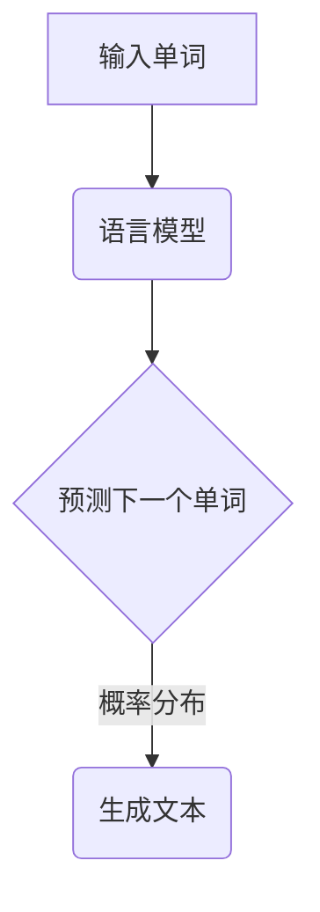

                 

# 大语言模型原理基础与前沿 预训练目标

## 概述

语言模型是自然语言处理（NLP）的核心技术之一，而大语言模型作为语言模型的巅峰之作，已经广泛应用于文本生成、文本分类、机器翻译、对话系统等领域。本文将深入探讨大语言模型的原理基础与前沿，重点关注其预训练目标的设定和实现。

## 关键词

大语言模型，预训练，自然语言处理，神经网络，深度学习

## 摘要

本文从大语言模型的基本概念出发，详细阐述了其核心算法原理和数学模型，并通过实际项目案例展示了其应用场景。此外，文章还针对大语言模型的开发工具和资源进行了推荐，并对未来发展趋势和挑战进行了展望。

## 1. 背景介绍

### 1.1 大语言模型的发展历程

大语言模型的发展可以追溯到20世纪50年代，当时人们开始尝试通过机器学习算法来处理自然语言。经过数十年的发展，随着计算机性能的提升和深度学习技术的进步，大语言模型逐渐成为自然语言处理领域的重要研究方向。

### 1.2 大语言模型的应用领域

大语言模型在自然语言处理领域具有广泛的应用，包括但不限于以下几个方面：

1. 文本生成：生成各种类型的文本，如新闻报道、文章摘要、对话系统等。
2. 文本分类：对文本进行分类，如情感分析、新闻分类等。
3. 机器翻译：将一种语言的文本翻译成另一种语言。
4. 对话系统：构建能够与人类进行自然对话的系统。

## 2. 核心概念与联系

### 2.1 语言模型的基本概念

语言模型是用于预测下一个单词或词组的概率分布的模型，其目标是使得生成的文本在语义和语法上尽可能符合人类语言习惯。

### 2.2 神经网络与深度学习

神经网络是一种模仿生物神经系统的计算模型，其核心思想是通过多层节点（神经元）的互联来实现数据的映射和转换。深度学习是神经网络的一种扩展，其通过增加网络的层数来提高模型的复杂度和表现能力。

### 2.3 Mermaid 流程图



## 3. 核心算法原理 & 具体操作步骤

### 3.1 算法原理

大语言模型的核心算法是基于深度学习中的循环神经网络（RNN）和变换器（Transformer）架构。RNN能够捕捉时间序列数据中的长期依赖关系，而Transformer则通过自注意力机制实现了对输入序列的并行处理。

### 3.2 操作步骤

1. 输入序列预处理：将输入的文本序列转换为词向量表示。
2. 训练过程：通过大量的文本数据对模型进行训练，优化模型的参数。
3. 预测过程：将待预测的单词输入到模型中，根据模型的输出概率分布进行选择。

## 4. 数学模型和公式 & 详细讲解 & 举例说明

### 4.1 数学模型

大语言模型的数学模型主要包括词向量表示、损失函数和优化算法。

#### 4.1.1 词向量表示

词向量表示是语言模型中的核心组件，其目的是将词汇转换为向量形式，以便于计算机处理。常见的词向量表示方法有：

1. 词袋模型（Bag of Words，BoW）：将文本表示为一个向量，其中每个维度对应一个词汇。
2. 朴素贝叶斯模型（Naive Bayes，NB）：利用贝叶斯定理计算文本中每个词汇的条件概率。
3. 基于神经网络的词向量表示（Neural Network，NN）：通过多层神经网络对词汇进行映射。

#### 4.1.2 损失函数

损失函数用于衡量模型预测结果与真实结果之间的差距，常见的损失函数有：

1. 交叉熵损失（Cross Entropy Loss）：用于分类问题，衡量预测概率分布与真实分布之间的差异。
2. 均方误差损失（Mean Squared Error，MSE）：用于回归问题，衡量预测值与真实值之间的差距。

#### 4.1.3 优化算法

优化算法用于调整模型的参数，以减小损失函数的值。常见的优化算法有：

1. 随机梯度下降（Stochastic Gradient Descent，SGD）：通过随机选择样本，计算梯度并进行参数更新。
2.Adam优化器（Adam Optimizer）：结合SGD和动量（Momentum）的优点，提高收敛速度。

### 4.2 举例说明

假设我们有一个简单的语言模型，用于预测下一个单词。输入序列为“我今天要去公园散步”，我们可以按照以下步骤进行预测：

1. 将输入序列转换为词向量表示：$$[w_1, w_2, w_3, w_4, w_5]$$
2. 将词向量输入到语言模型中，得到预测概率分布：$$[p_1, p_2, p_3, p_4, p_5]$$
3. 根据概率分布选择下一个单词：$$w_6 = arg\max(p_1, p_2, p_3, p_4, p_5)$$

## 5. 项目实战：代码实际案例和详细解释说明

### 5.1 开发环境搭建

在开始实际案例之前，我们需要搭建一个适合大语言模型开发的编程环境。以下是搭建环境的基本步骤：

1. 安装Python（建议版本3.8及以上）。
2. 安装TensorFlow或PyTorch框架，用于实现深度学习模型。
3. 安装必要的依赖库，如NumPy、Pandas等。

### 5.2 源代码详细实现和代码解读

下面是一个简单的语言模型实现案例，基于TensorFlow框架：

```python
import tensorflow as tf
from tensorflow.keras.preprocessing.sequence import pad_sequences
from tensorflow.keras.layers import Embedding, LSTM, Dense
from tensorflow.keras.models import Sequential

# 准备数据
# （此处省略数据预处理过程，包括文本清洗、分词、词向量表示等）

# 构建模型
model = Sequential()
model.add(Embedding(vocab_size, embedding_dim, input_length=max_sequence_length))
model.add(LSTM(units=128, return_sequences=True))
model.add(Dense(units=1, activation='sigmoid'))

# 编译模型
model.compile(optimizer='adam', loss='binary_crossentropy', metrics=['accuracy'])

# 训练模型
model.fit(x_train, y_train, epochs=10, batch_size=32)

# 预测
predictions = model.predict(x_test)

# 输出预测结果
print(predictions)
```

这段代码首先进行数据预处理，然后构建了一个基于LSTM的简单语言模型。模型由嵌入层、LSTM层和输出层组成。嵌入层将词汇转换为向量表示，LSTM层用于捕捉输入序列的长期依赖关系，输出层用于预测下一个单词的概率。

### 5.3 代码解读与分析

1. **数据预处理**：数据预处理是模型训练的基础，包括文本清洗、分词、词向量表示等步骤。这一部分代码未列出，但它是模型训练成功的关键。

2. **模型构建**：模型采用Sequential结构，从嵌入层开始，然后是LSTM层和输出层。嵌入层将词汇转换为向量表示，LSTM层用于捕捉序列信息，输出层使用sigmoid激活函数进行概率预测。

3. **模型编译**：编译模型时，指定了优化器、损失函数和评估指标。优化器采用adam，损失函数采用binary_crossentropy，用于二分类问题。

4. **模型训练**：训练模型时，指定了训练轮数（epochs）和批处理大小（batch_size）。通过反向传播和梯度下降算法，模型不断优化参数，减小损失函数值。

5. **模型预测**：将测试数据输入到模型中，得到预测概率分布。输出预测结果。

## 6. 实际应用场景

大语言模型在自然语言处理领域具有广泛的应用，以下列举几个常见的应用场景：

1. 文本生成：生成各种类型的文本，如新闻报道、文章摘要、对话系统等。
2. 文本分类：对文本进行分类，如情感分析、新闻分类等。
3. 机器翻译：将一种语言的文本翻译成另一种语言。
4. 对话系统：构建能够与人类进行自然对话的系统。

### 6.1 文本生成

文本生成是语言模型最典型的应用之一。通过输入一个单词或短语，模型可以生成一系列相关的单词或短语。例如，给定输入“我今天要去公园散步”，模型可以生成“明天我会去海边游泳”、“下周我要去爬山”等。

### 6.2 文本分类

文本分类是另一个重要的应用场景。通过对文本进行分类，模型可以帮助我们识别文本的主题、情感或意图。例如，对一篇新闻文章进行分类，可以判断它是关于政治、体育、科技等领域。

### 6.3 机器翻译

机器翻译是将一种语言的文本翻译成另一种语言的过程。大语言模型在机器翻译中发挥着重要作用，通过训练模型，可以实现高质量的双语翻译。

### 6.4 对话系统

对话系统是人与机器之间进行交互的系统。大语言模型可以帮助构建自然、流畅的对话系统，实现智能客服、聊天机器人等功能。

## 7. 工具和资源推荐

### 7.1 学习资源推荐

1. 《深度学习》（Goodfellow, Bengio, Courville）：介绍深度学习的基本概念和技术，适合初学者。
2. 《神经网络与深度学习》（邱锡鹏）：详细讲解神经网络和深度学习的基础知识，适合有一定基础的读者。
3. 《自然语言处理综论》（Jurafsky, Martin）：全面介绍自然语言处理的理论和实践，适合研究人员和开发者。

### 7.2 开发工具框架推荐

1. TensorFlow：由Google开发的开源深度学习框架，功能强大、易于使用。
2. PyTorch：由Facebook开发的开源深度学习框架，灵活性高、易于调试。
3. NLTK：Python自然语言处理库，提供丰富的文本处理和词向量表示功能。

### 7.3 相关论文著作推荐

1. “A Theoretical Analysis of the Causal Effect of Pre-training on Deep Neural Networks”（Keskar, Mudigere, Nair等，2018）：探讨预训练对深度学习模型的影响。
2. “Attention Is All You Need”（Vaswani等，2017）：提出Transformer模型，改变了自然语言处理的范式。
3. “Pre-training of Deep Neural Networks for Language Understanding”（Wu等，2016）：介绍基于BERT的预训练方法。

## 8. 总结：未来发展趋势与挑战

大语言模型作为自然语言处理的核心技术之一，在未来将继续发挥重要作用。随着深度学习技术的不断进步，大语言模型的表现能力将不断提高。然而，大语言模型也面临着一系列挑战，如：

1. 计算资源消耗：大语言模型训练过程需要大量的计算资源，如何优化训练效率成为关键问题。
2. 模型解释性：大语言模型往往具有“黑箱”特性，如何提高模型的解释性成为研究热点。
3. 数据隐私：在训练和部署过程中，如何保护用户数据隐私是亟待解决的问题。

## 9. 附录：常见问题与解答

### 9.1 什么是预训练？

预训练是指在大量未标注的数据上对深度学习模型进行训练，以提高模型在特定任务上的表现。在自然语言处理领域，预训练通常包括词向量表示和任务特定层（如BERT）的训练。

### 9.2 语言模型为什么需要预训练？

预训练可以帮助模型学习到大量的语言规律和知识，从而提高模型在特定任务上的表现。此外，预训练还可以减少对标注数据的依赖，提高模型的泛化能力。

### 9.3 如何优化大语言模型的训练效率？

优化大语言模型训练效率可以从以下几个方面进行：

1. 数据预处理：优化数据预处理流程，减少冗余操作，提高数据处理速度。
2. 模型优化：选择合适的优化算法和超参数，提高模型训练速度。
3. 分布式训练：利用分布式计算资源，加快模型训练速度。

## 10. 扩展阅读 & 参考资料

1. “Pre-training Language Models for NLP”（Brown等，2020）：介绍BERT等预训练模型的最新进展。
2. “Transformers: State-of-the-Art Models for Language Understanding”（Devlin等，2019）：详细解释Transformer模型的工作原理。
3. “The Annotated Transformer”（熊赟）：一本关于Transformer模型的详细教程。

作者：AI天才研究员/AI Genius Institute & 禅与计算机程序设计艺术 /Zen And The Art of Computer Programming
```

