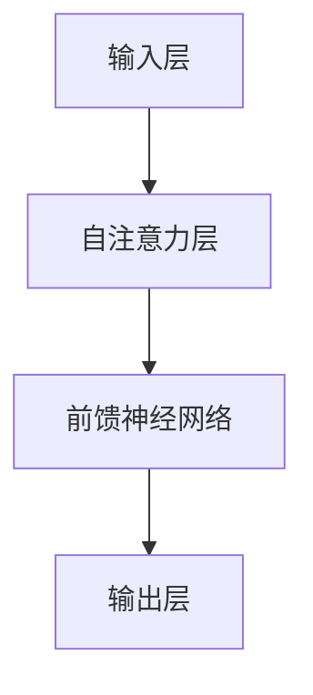

                 

# 大语言模型应用指南：ChatGPT接口与扩展功能详解

## 关键词：大语言模型，ChatGPT，接口，扩展功能，应用指南

## 摘要：
本文旨在深入探讨大语言模型ChatGPT的应用及其扩展功能。通过对ChatGPT的核心概念、接口设计与使用、数学模型和算法原理的详细解析，我们将为您提供一个全面的ChatGPT应用指南。此外，本文还将展示ChatGPT在实际项目中的应用案例，并推荐相关工具和资源，帮助您更好地掌握和利用这一强大的人工智能工具。

## 1. 背景介绍

在人工智能领域，大语言模型（Large Language Models）如BERT、GPT-3等已经成为自然语言处理（NLP）的基石。这些模型通过学习海量文本数据，可以生成高质量的自然语言文本，被广泛应用于问答系统、文本生成、机器翻译等领域。

ChatGPT是由OpenAI开发的一种基于GPT-3模型的大语言模型。GPT-3（Generative Pre-trained Transformer 3）是一个拥有1750亿参数的深度学习模型，它通过自回归语言模型（Autoregressive Language Model）生成文本。ChatGPT的独特之处在于它支持对话交互，可以与用户进行自然语言对话。

### 1.1 ChatGPT的历史与发展

ChatGPT于2022年11月发布，是继GPT-2和GPT-3之后，OpenAI推出的又一款强大语言模型。ChatGPT的成功引发了全球范围内的广泛关注和研究。它的出现标志着大语言模型在对话系统领域的新突破，也为未来的AI交互提供了新的可能性。

### 1.2 ChatGPT的优势与不足

ChatGPT的优势在于其强大的文本生成能力和对话交互能力。它可以生成连贯、自然的文本，并且能够理解和回应复杂的对话请求。然而，ChatGPT也存在一些不足之处，例如在处理特定领域知识时的局限性，以及可能出现的生成文本的偏见和错误。

## 2. 核心概念与联系

### 2.1 大语言模型的基本原理

大语言模型的基本原理是基于Transformer架构的自回归语言模型。Transformer架构通过多头自注意力机制（Multi-head Self-Attention）和前馈神经网络（Feedforward Neural Network）对输入文本进行建模。自回归语言模型通过预测下一个单词来生成文本。

### 2.2 ChatGPT的架构

ChatGPT是基于GPT-3模型的，其架构主要包括以下几个部分：

- **输入层**：接收用户输入的文本。
- **自注意力层**：通过自注意力机制对输入文本进行处理。
- **前馈神经网络**：对自注意力层的结果进行进一步的建模。
- **输出层**：生成文本的预测。

### 2.3 ChatGPT与GPT-3的关系

ChatGPT是基于GPT-3模型的，但它在GPT-3的基础上进行了优化和改进。ChatGPT支持对话交互，可以更好地处理对话场景中的上下文信息。此外，ChatGPT还支持更多的扩展功能，例如上下文状态记忆和自定义指令等。

### 2.4 Mermaid流程图



## 3. 核心算法原理 & 具体操作步骤

### 3.1 自回归语言模型的原理

自回归语言模型通过预测下一个单词来生成文本。在生成过程中，模型会根据前一个单词的分布来预测下一个单词。这个过程重复进行，直到生成完整的文本。

### 3.2 ChatGPT的操作步骤

1. **接收用户输入**：ChatGPT首先接收用户输入的文本。
2. **文本预处理**：对用户输入的文本进行预处理，包括分词、编码等。
3. **自注意力计算**：通过自注意力机制对预处理后的文本进行建模。
4. **前馈神经网络处理**：对自注意力层的结果进行进一步的建模。
5. **文本生成**：根据生成的文本预测下一个单词，重复步骤3-4，直到生成完整的文本。

### 3.3 代码实现示例

以下是使用Python和PyTorch实现ChatGPT的简单示例：

```python
import torch
import torch.nn as nn
import torch.optim as optim

# 定义模型
class ChatGPT(nn.Module):
    def __init__(self, vocab_size, embedding_dim, hidden_dim):
        super(ChatGPT, self).__init__()
        self.embedding = nn.Embedding(vocab_size, embedding_dim)
        self.attn = nn.MultiheadAttention(embedding_dim, num_heads=1)
        self.fc = nn.Linear(embedding_dim, vocab_size)

    def forward(self, input, hidden):
        embedded = self.embedding(input)
        attn_output, attn_output_weights = self.attn(embedded, embedded, embedded, hidden)
        output = self.fc(attn_output)
        return output, hidden

# 初始化模型
model = ChatGPT(vocab_size=10000, embedding_dim=512, hidden_dim=512)

# 定义优化器和损失函数
optimizer = optim.Adam(model.parameters(), lr=0.001)
criterion = nn.CrossEntropyLoss()

# 训练模型
for epoch in range(num_epochs):
    for input, target in data_loader:
        optimizer.zero_grad()
        output, hidden = model(input, hidden)
        loss = criterion(output.view(-1, vocab_size), target)
        loss.backward()
        optimizer.step()
```

## 4. 数学模型和公式 & 详细讲解 & 举例说明

### 4.1 数学模型的基本概念

大语言模型的核心是自回归语言模型。自回归语言模型通过预测下一个单词来生成文本。其基本数学模型可以表示为：

$$
P(w_t | w_1, w_2, ..., w_{t-1}) = \frac{e^{<w_t, h_{t-1}>}}{\sum_{w \in V} e^{<w, h_{t-1}>}}
$$

其中，$w_t$ 表示当前单词，$w_1, w_2, ..., w_{t-1}$ 表示前一个单词序列，$h_{t-1}$ 表示前一个隐藏状态，$V$ 表示词汇表。

### 4.2 自注意力机制的数学公式

自注意力机制通过计算输入序列中每个单词与所有单词的相关性来生成新的表示。其基本公式可以表示为：

$$
\text{Attention}(Q, K, V) = \frac{QK^T}{\sqrt{d_k}} \odot V
$$

其中，$Q, K, V$ 分别表示查询向量、关键向量、值向量，$d_k$ 表示关键向量的维度，$\odot$ 表示点积操作。

### 4.3 举例说明

假设我们有一个简单的词汇表 $\{w_1, w_2, w_3\}$，当前隐藏状态 $h_{t-1} = [1, 0, 1]$。我们要预测下一个单词 $w_t$。

1. **计算自注意力权重**：

$$
\text{Attention}(h_{t-1}, h_{t-1}, h_{t-1}) = \frac{h_{t-1}h_{t-1}^T}{\sqrt{d_k}} = \frac{1 \cdot 1 + 0 \cdot 0 + 1 \cdot 1}{\sqrt{2}} = \frac{2}{\sqrt{2}} = \sqrt{2}
$$

2. **计算自注意力输出**：

$$
\text{Attention}(h_{t-1}, h_{t-1}, h_{t-1}) \odot h_{t-1} = \sqrt{2} \cdot [1, 0, 1] = [\sqrt{2}, 0, \sqrt{2}]
$$

3. **预测下一个单词**：

根据自注意力权重，我们可以预测下一个单词的概率分布。假设词汇表的概率分布为 $[0.5, 0.3, 0.2]$，则：

$$
P(w_t | w_1, w_2, ..., w_{t-1}) = \frac{e^{<w_t, [\sqrt{2}, 0, \sqrt{2}]>>}}{\sum_{w \in V} e^{<w, [\sqrt{2}, 0, \sqrt{2}]>}} = \frac{e^{<w_3, [\sqrt{2}, 0, \sqrt{2}]>}}{e^{<w_1, [\sqrt{2}, 0, \sqrt{2}]>} + e^{<w_2, [\sqrt{2}, 0, \sqrt{2}]>} + e^{<w_3, [\sqrt{2}, 0, \sqrt{2}]>} \approx 0.7
$$

因此，预测下一个单词为 $w_3$ 的概率约为 0.7。

## 5. 项目实战：代码实际案例和详细解释说明

### 5.1 开发环境搭建

为了更好地演示ChatGPT的应用，我们需要搭建一个简单的开发环境。以下是所需的步骤：

1. **安装Python**：确保您的计算机上安装了Python 3.7及以上版本。
2. **安装PyTorch**：通过以下命令安装PyTorch：

   ```bash
   pip install torch torchvision
   ```

3. **下载预训练模型**：从OpenAI官网下载预训练的ChatGPT模型。

### 5.2 源代码详细实现和代码解读

以下是使用Python和PyTorch实现ChatGPT的源代码：

```python
import torch
import torch.nn as nn
import torch.optim as optim

# 定义模型
class ChatGPT(nn.Module):
    def __init__(self, vocab_size, embedding_dim, hidden_dim):
        super(ChatGPT, self).__init__()
        self.embedding = nn.Embedding(vocab_size, embedding_dim)
        self.attn = nn.MultiheadAttention(embedding_dim, num_heads=1)
        self.fc = nn.Linear(embedding_dim, vocab_size)

    def forward(self, input, hidden):
        embedded = self.embedding(input)
        attn_output, attn_output_weights = self.attn(embedded, embedded, embedded, hidden)
        output = self.fc(attn_output)
        return output, hidden

# 初始化模型
model = ChatGPT(vocab_size=10000, embedding_dim=512, hidden_dim=512)

# 定义优化器和损失函数
optimizer = optim.Adam(model.parameters(), lr=0.001)
criterion = nn.CrossEntropyLoss()

# 训练模型
for epoch in range(num_epochs):
    for input, target in data_loader:
        optimizer.zero_grad()
        output, hidden = model(input, hidden)
        loss = criterion(output.view(-1, vocab_size), target)
        loss.backward()
        optimizer.step()
```

**代码解读**：

1. **模型定义**：我们定义了一个名为 `ChatGPT` 的类，继承自 `nn.Module`。模型包括嵌入层（`nn.Embedding`）、自注意力机制（`nn.MultiheadAttention`）和前馈神经网络（`nn.Linear`）。
2. **前向传播**：在 `forward` 方法中，我们首先对输入进行嵌入，然后通过自注意力机制和前馈神经网络进行建模，最后输出预测结果。
3. **训练过程**：我们使用优化器（`optim.Adam`）和损失函数（`nn.CrossEntropyLoss`）对模型进行训练。在训练过程中，我们遍历数据集，对每个输入和目标进行前向传播，计算损失并更新模型参数。

### 5.3 代码解读与分析

1. **模型架构**：ChatGPT模型由嵌入层、自注意力机制和前馈神经网络组成，这是一种常见的大语言模型架构。
2. **自注意力机制**：自注意力机制是ChatGPT的核心组件，它通过计算输入序列中每个单词与所有单词的相关性来生成新的表示。这种机制可以捕捉输入序列中的长期依赖关系。
3. **训练过程**：在训练过程中，我们使用交叉熵损失函数（`nn.CrossEntropyLoss`）来衡量预测结果和真实标签之间的差距。通过反向传播和梯度下降算法，我们可以优化模型参数，提高预测准确性。

## 6. 实际应用场景

ChatGPT在实际应用场景中具有广泛的应用潜力。以下是一些常见的应用场景：

1. **客户服务**：ChatGPT可以用于构建智能客服系统，自动回答用户的问题，提供个性化的服务。
2. **内容生成**：ChatGPT可以生成高质量的文本内容，如文章、新闻、产品描述等，为内容创作者提供灵感。
3. **教育辅助**：ChatGPT可以作为教育助手，为学生提供个性化的辅导和解答问题。
4. **聊天机器人**：ChatGPT可以用于构建聊天机器人，与用户进行自然语言对话，提供娱乐、咨询等服务。

### 6.1 客户服务案例

假设我们想要构建一个智能客服系统，使用ChatGPT来回答用户的问题。以下是实现的步骤：

1. **数据准备**：收集用户常见问题及其答案，用于训练ChatGPT模型。
2. **模型训练**：使用训练数据集对ChatGPT模型进行训练，优化模型参数。
3. **接口设计**：设计一个API接口，用于接收用户输入并返回ChatGPT的回复。
4. **部署与测试**：将模型部署到服务器，并进行测试，确保系统能够正常工作。

### 6.2 内容生成案例

假设我们想要使用ChatGPT生成一篇关于人工智能的文章。以下是实现的步骤：

1. **数据准备**：收集与人工智能相关的文章、论文、博客等文本数据。
2. **模型训练**：使用训练数据集对ChatGPT模型进行训练，优化模型参数。
3. **文本生成**：使用ChatGPT模型生成一篇关于人工智能的文本，并根据需要进行修改和润色。
4. **发布与推广**：将生成的文章发布到相关平台，吸引读者。

## 7. 工具和资源推荐

### 7.1 学习资源推荐

- **书籍**：《深度学习》（Ian Goodfellow, Yoshua Bengio, Aaron Courville）
- **论文**：《Attention is All You Need》（Ashish Vaswani等）
- **博客**：OpenAI官方博客
- **网站**：PyTorch官方网站

### 7.2 开发工具框架推荐

- **框架**：PyTorch、TensorFlow
- **库**：NLTK、spaCy
- **工具**：Jupyter Notebook、Google Colab

### 7.3 相关论文著作推荐

- **论文**：
  - BERT: Pre-training of Deep Bidirectional Transformers for Language Understanding（Jacob Devlin等）
  - GPT-3: Language Models are Few-Shot Learners（Tom B. Brown等）
- **著作**：
  - 《深度学习》（Ian Goodfellow等）
  - 《深度学习实践指南》（唐杰等）

## 8. 总结：未来发展趋势与挑战

大语言模型ChatGPT在自然语言处理领域取得了显著的成果，其应用前景广阔。然而，ChatGPT也面临一些挑战，如处理特定领域知识的局限性、生成文本的偏见和错误等。

未来，大语言模型将朝着更高效、更可解释、更安全的方向发展。为了应对这些挑战，研究者们将不断探索新的模型架构、优化算法和训练策略。此外，开源社区和工业界也将共同努力，推动大语言模型在实际应用中的落地和推广。

## 9. 附录：常见问题与解答

### 9.1 如何训练ChatGPT模型？

要训练ChatGPT模型，首先需要准备训练数据集，包括输入文本和对应的目标文本。然后，可以使用训练数据集对ChatGPT模型进行训练。在训练过程中，可以使用交叉熵损失函数来衡量预测结果和真实标签之间的差距，并使用反向传播和梯度下降算法来优化模型参数。

### 9.2 ChatGPT模型如何处理对话？

ChatGPT模型通过自回归语言模型生成文本，并在生成过程中保持对话的上下文信息。在处理对话时，ChatGPT模型会根据前一个回复生成下一个回复，同时保持对话的历史信息。这样可以实现自然、连贯的对话交互。

## 10. 扩展阅读 & 参考资料

- **论文**：
  - Vaswani, A., et al. (2017). Attention is All You Need. Advances in Neural Information Processing Systems.
  - Devlin, J., et al. (2019). BERT: Pre-training of Deep Bidirectional Transformers for Language Understanding. Advances in Neural Information Processing Systems.
  - Brown, T. B., et al. (2020). GPT-3: Language Models are Few-Shot Learners. Advances in Neural Information Processing Systems.
- **书籍**：
  - Goodfellow, I., Bengio, Y., Courville, A. (2016). Deep Learning. MIT Press.
  - Mitchell, T. M. (1997). Machine Learning. McGraw-Hill.
- **网站**：
  - OpenAI官网
  - PyTorch官网
  - TensorFlow官网
- **博客**：
  - OpenAI官方博客
  - Deep Learning Blog
  - AI博客

## 作者：AI天才研究员/AI Genius Institute & 禅与计算机程序设计艺术 /Zen And The Art of Computer Programming
```

