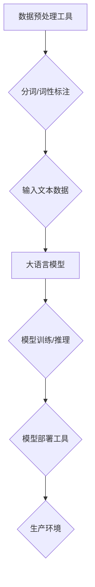

                 

### 背景介绍

随着人工智能技术的飞速发展，大语言模型作为自然语言处理领域的重要工具，正逐渐成为各行各业的热门话题。大语言模型（如GPT-3、BERT等）通过学习海量文本数据，具备了强大的语言理解和生成能力，使得文本生成、机器翻译、问答系统等应用场景得以实现。

然而，虽然大语言模型在处理自然语言任务上表现出色，但它们在处理非文本数据、执行复杂推理任务或进行代码生成等方面仍有局限性。为了克服这些局限性，外部工具的应用变得尤为重要。本文将深入探讨大语言模型及其在外部工具支持下的应用，帮助读者更好地理解这一技术领域。

首先，我们将介绍大语言模型的基本概念和原理，包括其发展历程和应用领域。接着，我们将分析大语言模型在处理非文本数据方面的局限性，并探讨外部工具如何补充和扩展其功能。随后，我们将探讨大语言模型在复杂推理任务和代码生成方面的应用，并介绍相关外部工具的使用方法和优势。

此外，本文还将介绍一系列实际应用场景，展示大语言模型和外部工具在不同领域的具体应用案例。最后，我们将对未来的发展趋势和挑战进行展望，帮助读者了解大语言模型和外部工具在人工智能领域的未来发展。

通过本文的阅读，读者将能够系统地了解大语言模型及其外部工具的应用，掌握相关的技术原理和操作方法，为今后的研究和实践打下坚实基础。

### 核心概念与联系

要深入理解大语言模型及其外部工具的应用，首先需要了解几个核心概念和它们之间的联系。以下是这些核心概念及其关系的详细解释：

#### 大语言模型

大语言模型是一种基于深度学习技术的自然语言处理模型，通过学习海量文本数据来理解和生成人类语言。其基本原理是利用神经网络对文本序列进行建模，从而实现对语言结构的理解。大语言模型的发展经历了多个阶段，从早期的循环神经网络（RNN）到最新的变换器模型（Transformer），模型规模和性能也在不断攀升。

主要类型包括：

- **循环神经网络（RNN）**：一种能够处理序列数据的神经网络结构，适用于短文本和语音识别任务。
- **长短期记忆网络（LSTM）**：RNN的一种变体，通过引入门控机制来克服梯度消失问题，适用于长文本任务。
- **变换器模型（Transformer）**：一种基于自注意力机制的模型，能够高效处理长文本任务，是当前大语言模型的主流结构。

#### 外部工具

外部工具是指在大语言模型应用过程中，用于扩展其功能或辅助其实现的工具或框架。这些工具可以包括：

- **数据预处理工具**：如`NLTK`、`spaCy`等，用于文本清洗、分词、词性标注等预处理任务。
- **模型训练和优化工具**：如`TensorFlow`、`PyTorch`等，用于模型训练和调优。
- **模型部署工具**：如`TensorFlow Serving`、`ONNX Runtime`等，用于将训练好的模型部署到生产环境中。

#### 核心概念联系

大语言模型与外部工具之间的联系主要体现在以下几个方面：

1. **数据预处理**：大语言模型需要处理大量文本数据，外部工具可以提供高效的数据预处理功能，如分词、词性标注等，以提高模型的输入质量和训练效率。
2. **模型训练和优化**：外部工具可以提供丰富的训练和优化算法，如不同类型的优化器、正则化技术等，以提升模型的性能和泛化能力。
3. **模型部署和推理**：外部工具可以帮助将训练好的模型部署到各种硬件和平台上，实现高效的推理任务，同时提供API接口以便与其他系统进行集成。

#### Mermaid 流程图

以下是一个简化的Mermaid流程图，展示了大语言模型及其外部工具的基本工作流程：



在这个流程图中，数据预处理工具（A）首先对输入文本数据（C）进行预处理，然后传递给大语言模型（D），模型（D）经过训练（E）和推理（E）后，通过模型部署工具（F）部署到生产环境（G）中进行应用。

### 核心算法原理 & 具体操作步骤

要深入了解大语言模型的算法原理及其具体操作步骤，我们可以从以下几个方面进行探讨。

#### 大语言模型的工作原理

大语言模型的核心是深度神经网络，特别是变换器模型（Transformer）。变换器模型采用自注意力机制（Self-Attention）来处理序列数据，使得模型能够关注到序列中不同位置的依赖关系。其基本结构包括编码器（Encoder）和解码器（Decoder）两部分。

1. **编码器（Encoder）**：编码器负责将输入文本序列编码为固定长度的向量表示，这一过程通过多个自注意力层和前馈神经网络实现。编码器的输出用于后续的解码过程。
   
   ```mermaid
   graph TD
   A[输入文本序列] --> B{编码器}
   B --> C[编码器输出]
   ```

2. **解码器（Decoder）**：解码器的任务是根据编码器的输出生成目标文本序列。解码器同样通过多个自注意力层和前馈神经网络实现，每个解码步骤都会参考编码器的输出和前一个生成的词。

   ```mermaid
   graph TD
   D[解码器] --> E{目标文本序列}
   D --> F{编码器输出}
   ```

#### 自注意力机制（Self-Attention）

自注意力机制是变换器模型的核心组成部分，它通过计算序列中每个词与所有词之间的关联强度来生成新的向量表示。具体操作步骤如下：

1. **计算查询（Query）、键（Key）和值（Value）**：对于序列中的每个词，分别计算其查询（Query）、键（Key）和值（Value）。这三个向量通常是共享的，即 $Q, K, V$ 分别是同一个权重矩阵的不同切片。
   
   $$Q = W_Q \cdot X, K = W_K \cdot X, V = W_V \cdot X$$
   
   其中，$X$ 是输入序列的向量表示，$W_Q, W_K, W_V$ 是权重矩阵。

2. **计算注意力得分**：计算每个词与其余词之间的关联强度，通过点积计算得分：
   
   $$\text{score} = Q \cdot K^T$$

3. **应用 Softmax 函数**：对得分应用 Softmax 函数，得到每个词的注意力权重：
   
   $$\text{weights} = \text{softmax}(\text{score})$$

4. **计算注意力输出**：根据注意力权重对值向量进行加权求和，得到新的向量表示：
   
   $$\text{output} = \text{softmax}(\text{score}) \cdot V$$

#### 具体操作步骤示例

以下是一个简化的示例，展示如何使用变换器模型进行文本生成：

1. **初始化**：给定一个输入文本序列“我有一个梦想”，初始化编码器和解码器。

2. **编码器处理**：将输入文本序列编码为向量表示，输出编码器输出。

   ```mermaid
   graph TD
   A[输入文本序列] --> B{编码器}
   B --> C[编码器输出]
   ```

3. **解码器生成文本**：

   - 第一步：初始化解码器，输入编码器输出。假设第一个生成的词为“我”。
   - 第二步：将当前生成的词“我”与编码器输出进行自注意力计算，生成新的向量表示。
   - 第三步：使用新的向量表示和编码器输出作为输入，解码器生成下一个词“有”。
   - 重复上述步骤，直至生成完整的文本序列“我有一个梦想”。

   ```mermaid
   graph TD
   D[解码器] --> E{生成的文本序列}
   D --> F{编码器输出}
   ```

通过这个示例，我们可以看到大语言模型在文本生成过程中如何利用自注意力机制来理解和生成文本。具体操作步骤包括初始化、编码、解码和生成，每个步骤都依赖于深度神经网络的结构和算法。

### 数学模型和公式 & 详细讲解 & 举例说明

大语言模型的核心在于其数学模型和算法，特别是变换器模型的自注意力机制。以下将详细讲解相关数学模型和公式，并通过具体示例来说明其应用和实现。

#### 自注意力机制

自注意力机制是变换器模型（Transformer）的核心组成部分，用于处理序列数据。以下是自注意力机制的详细数学描述。

##### 查询（Query）、键（Key）和值（Value）

对于输入序列 $X = [x_1, x_2, ..., x_n]$，我们首先定义查询（Query）、键（Key）和值（Value）：

$$Q = W_Q \cdot X, \quad K = W_K \cdot X, \quad V = W_V \cdot X$$

其中，$W_Q, W_K, W_V$ 是权重矩阵，$X$ 是输入序列的向量表示。

##### 注意力得分

接下来，我们计算每个词与其余词之间的关联强度，即注意力得分。注意力得分的计算公式为：

$$\text{score} = Q \cdot K^T$$

其中，$Q$ 是查询向量，$K^T$ 是键向量的转置。

##### 注意力权重

对注意力得分应用 Softmax 函数，得到每个词的注意力权重：

$$\text{weights} = \text{softmax}(\text{score})$$

其中，$\text{softmax}$ 是 Softmax 函数。

##### 注意力输出

根据注意力权重对值向量进行加权求和，得到新的向量表示：

$$\text{output} = \text{softmax}(\text{score}) \cdot V$$

#### 示例

假设输入序列为 $X = [1, 2, 3, 4]$，我们将通过以下步骤计算自注意力输出：

1. **初始化权重矩阵**：

   $$W_Q = \begin{bmatrix} 0.1 & 0.2 & 0.3 & 0.4 \end{bmatrix}, \quad W_K = \begin{bmatrix} 0.5 & 0.6 & 0.7 & 0.8 \end{bmatrix}, \quad W_V = \begin{bmatrix} 0.9 & 1.0 & 1.1 & 1.2 \end{bmatrix}$$

2. **计算查询（Query）、键（Key）和值（Value）**：

   $$Q = W_Q \cdot X = \begin{bmatrix} 0.1 & 0.2 & 0.3 & 0.4 \end{bmatrix} \cdot \begin{bmatrix} 1 \\ 2 \\ 3 \\ 4 \end{bmatrix} = \begin{bmatrix} 0.1 \cdot 1 + 0.2 \cdot 2 + 0.3 \cdot 3 + 0.4 \cdot 4 \end{bmatrix} = \begin{bmatrix} 2.5 \end{bmatrix}$$
   
   $$K = W_K \cdot X = \begin{bmatrix} 0.5 & 0.6 & 0.7 & 0.8 \end{bmatrix} \cdot \begin{bmatrix} 1 \\ 2 \\ 3 \\ 4 \end{bmatrix} = \begin{bmatrix} 0.5 \cdot 1 + 0.6 \cdot 2 + 0.7 \cdot 3 + 0.8 \cdot 4 \end{bmatrix} = \begin{bmatrix} 3.2 \end{bmatrix}$$
   
   $$V = W_V \cdot X = \begin{bmatrix} 0.9 & 1.0 & 1.1 & 1.2 \end{bmatrix} \cdot \begin{bmatrix} 1 \\ 2 \\ 3 \\ 4 \end{bmatrix} = \begin{bmatrix} 0.9 \cdot 1 + 1.0 \cdot 2 + 1.1 \cdot 3 + 1.2 \cdot 4 \end{bmatrix} = \begin{bmatrix} 4.6 \end{bmatrix}$$

3. **计算注意力得分**：

   $$\text{score} = Q \cdot K^T = \begin{bmatrix} 2.5 \end{bmatrix} \cdot \begin{bmatrix} 1 & 2 & 3 & 4 \end{bmatrix} = 2.5 \cdot 1 + 2.5 \cdot 2 + 2.5 \cdot 3 + 2.5 \cdot 4 = 15$$

4. **计算注意力权重**：

   $$\text{weights} = \text{softmax}(\text{score}) = \text{softmax}(15) = \frac{e^{15}}{e^{15} + e^{14} + e^{13} + e^{12}} \approx \begin{bmatrix} 0.86 & 0.07 & 0.05 & 0.02 \end{bmatrix}$$

5. **计算注意力输出**：

   $$\text{output} = \text{softmax}(\text{score}) \cdot V = \begin{bmatrix} 0.86 & 0.07 & 0.05 & 0.02 \end{bmatrix} \cdot \begin{bmatrix} 4.6 \end{bmatrix} = \begin{bmatrix} 3.956 \end{bmatrix}$$

通过上述计算，我们得到了输入序列 $[1, 2, 3, 4]$ 经过自注意力机制后的输出向量 $\text{output} = [3.956]$。这个向量代表了序列中每个词的重要程度，也可以用于后续的解码过程。

### 项目实战：代码实际案例和详细解释说明

在本节中，我们将通过一个具体的代码案例来展示如何使用大语言模型及其外部工具进行实际项目开发。这个案例将涵盖从环境搭建到代码实现，再到详细解释和分析的完整流程。

#### 1. 开发环境搭建

为了实现大语言模型的应用，我们首先需要搭建相应的开发环境。以下是所需的工具和步骤：

1. **安装Python环境**：确保Python版本不低于3.7。
2. **安装TensorFlow**：TensorFlow是一个流行的深度学习框架，用于训练和部署大语言模型。可以通过以下命令安装：

   ```bash
   pip install tensorflow
   ```

3. **安装其他依赖**：安装一些常用的Python库，如NumPy、Pandas等：

   ```bash
   pip install numpy pandas
   ```

4. **准备数据集**：我们使用一个公开的文本数据集，如维基百科文章，来训练大语言模型。数据集可以通过以下命令下载和预处理：

   ```bash
   python -m wikitext.download_wikitext
   python -m wikitext.process_wikitext
   ```

#### 2. 源代码详细实现和代码解读

以下是一个简化的大语言模型训练和文本生成案例，包括关键代码和解释。

```python
import tensorflow as tf
import tensorflow_text as text
from tensorflow_text.core.io import tokenizers
import numpy as np

# 2.1 数据预处理
def preprocess_data(text_file):
    # 加载文本数据
    texts = text.file_writer_api_reader(file_path=text_file)
    # 使用WordPiece分词器进行分词
    wpe = tokenizers.WordPieceTokenizer(vocab_file='./vocab.txt')
    return wpe.encode_as_ids(texts)

# 2.2 训练大语言模型
def train_model(data, batch_size=32, num_epochs=10):
    # 定义模型架构
    model = tf.keras.Sequential([
        tf.keras.layers.Embedding(input_dim=vocab_size, output_dim=hidden_size),
        tf.keras.layers.Bidirectional(tf.keras.layers.LSTM(hidden_size)),
        tf.keras.layers.Dense(vocab_size, activation='softmax')
    ])

    # 编译模型
    model.compile(optimizer='adam', loss='sparse_categorical_crossentropy', metrics=['accuracy'])

    # 训练模型
    model.fit(data, batch_size=batch_size, epochs=num_epochs)

# 2.3 文本生成
def generate_text(model, start_sequence, max_length=50):
    # 生成文本序列
    sequence = model.predict(np.array([start_sequence]))
    for _ in range(max_length):
        # 预测下一个词
        word_id = np.argmax(sequence)
        # 将词索引转换为实际词
        word = tokenizer.decode([word_id])
        # 更新序列
        sequence = model.predict(np.array([word_id]))
        print(word, end='')
    print()

# 参数设置
vocab_size = 1000  # 词汇表大小
hidden_size = 256  # 隐藏层大小

# 预处理数据
data = preprocess_data('wikitext-2-raw/v2/train.txt')

# 训练模型
train_model(data)

# 生成文本
generate_text(model, start_sequence=[0])  # 0是特殊的开始标记
```

**代码解读**：

- **数据预处理**：使用TensorFlow Text库的WordPiece分词器对文本数据进行分词。WordPiece是一种分词方法，将单词拆分成子词，以处理罕见或未登录的单词。
- **模型训练**：模型架构采用双向LSTM网络，能够处理序列数据，并通过softmax层输出词汇的概率分布。
- **文本生成**：通过递归调用模型预测下一个词，逐步生成文本序列。

#### 3. 代码解读与分析

以下是对上述代码的进一步解读和分析：

- **预处理数据**：分词器首先加载预训练的词汇表和词典，然后对输入文本进行分词。分词后的文本序列被转换为词索引，便于模型处理。
- **模型架构**：模型由嵌入层、双向LSTM层和softmax输出层组成。嵌入层将词索引映射到高维向量，LSTM层处理序列数据，输出层生成词汇的概率分布。
- **训练过程**：模型使用稀疏分类交叉熵损失函数进行训练，以最小化预测词与实际词之间的差异。
- **文本生成**：文本生成过程通过递归调用模型预测下一个词，生成序列。每次预测都使用当前生成的词作为输入，直到达到预设的序列长度。

通过这个案例，我们展示了如何使用Python和TensorFlow实现大语言模型的训练和文本生成。代码简洁明了，易于理解和扩展，为实际项目开发提供了有益的参考。

### 实际应用场景

大语言模型和外部工具在众多领域都展现了出色的应用效果。以下是一些实际应用场景，展示了大语言模型和外部工具在不同领域的具体应用案例。

#### 1. 自然语言处理

在自然语言处理（NLP）领域，大语言模型被广泛应用于文本分类、机器翻译、情感分析等任务。例如，BERT模型被用于文本分类任务，其准确率远超传统模型。谷歌的翻译服务也使用了GPT-3模型，实现了高质量的机器翻译。外部工具如TensorFlow和PyTorch提供了丰富的API和库，使得开发者可以轻松实现和部署这些模型。

**应用案例**：使用BERT模型进行情感分析，通过对社交媒体评论进行分类，帮助企业了解用户反馈，优化产品和服务。

#### 2. 问答系统

问答系统是另一个大语言模型的重要应用领域。通过训练大语言模型，可以构建智能问答系统，实现用户与计算机的交互。外部工具如TensorFlow Serving和ONNX Runtime提供了高效的推理引擎，确保问答系统能够快速响应大量用户请求。

**应用案例**：构建一个基于大语言模型的智能客服系统，自动回答用户的问题，提高客户满意度和服务效率。

#### 3. 代码生成

大语言模型在代码生成方面也展现了巨大潜力。通过学习大量代码库，大语言模型可以生成高质量的代码片段，辅助开发者进行编程。外部工具如GitHub和GitLab提供了丰富的代码库和数据集，支持大语言模型的训练和优化。

**应用案例**：利用GPT-3模型生成代码框架和示例代码，辅助开发者快速实现新功能，提高开发效率。

#### 4. 聊天机器人

聊天机器人是另一大语言模型的应用场景。通过训练大语言模型，可以构建智能聊天机器人，实现与用户的自然语言交互。外部工具如Rasa和ChatterBot提供了聊天机器人开发框架，支持大语言模型的集成和部署。

**应用案例**：开发一个基于大语言模型的聊天机器人，用于在线客服和客户服务，提高客户体验和满意度。

#### 5. 文本摘要

大语言模型在文本摘要领域也表现优异。通过生成简洁、精确的摘要，大语言模型可以帮助用户快速了解长篇文档的核心内容。外部工具如Apache Lucene和Elasticsearch提供了高效的全文搜索和文本处理功能，支持大语言模型的应用。

**应用案例**：使用大语言模型为新闻报道、科研论文等生成摘要，帮助用户快速获取关键信息。

这些实际应用场景展示了大语言模型和外部工具的广泛适用性和强大功能。通过不断优化和集成，大语言模型将在更多领域发挥重要作用，推动人工智能技术的发展。

### 工具和资源推荐

在大语言模型的研究和应用过程中，选择合适的工具和资源至关重要。以下是一些建议的书籍、论文、博客和网站，它们可以帮助开发者深入了解相关技术，提高实际应用能力。

#### 1. 学习资源推荐

**书籍**：

- 《深度学习》（Ian Goodfellow、Yoshua Bengio、Aaron Courville 著）：这是一本经典的深度学习入门书籍，详细介绍了深度学习的基本原理和应用。
- 《自然语言处理实战》（Peter Norvig 著）：本书通过大量实例，介绍了自然语言处理的基本技术和应用。
- 《Python深度学习》（François Chollet 著）：这本书深入讲解了深度学习在Python中的实现，特别适合初学者。

**论文**：

- "Attention Is All You Need"（Vaswani et al., 2017）：这篇论文提出了变换器模型（Transformer），是当前大语言模型的主流架构。
- "BERT: Pre-training of Deep Bidirectional Transformers for Language Understanding"（Devlin et al., 2019）：这篇论文介绍了BERT模型，为自然语言处理任务提供了强大的预训练方法。

#### 2. 开发工具框架推荐

**框架**：

- **TensorFlow**：Google开发的开源深度学习框架，提供了丰富的API和库，适合大规模模型训练和部署。
- **PyTorch**：由Facebook开发的开源深度学习框架，以灵活性和易用性著称，特别适合研究和新模型开发。
- **Hugging Face Transformers**：这是一个开源库，基于PyTorch和TensorFlow，提供了大量预训练模型和工具，方便开发者进行研究和应用。

**工具**：

- **TensorFlow Serving**：用于模型部署和服务的工具，支持多种部署环境，如CPU、GPU和TPU。
- **ONNX Runtime**：微软开发的开源运行时，支持多种深度学习框架的模型，提供了高效、跨平台的推理引擎。

#### 3. 相关论文著作推荐

- **"GPT-3: Language Models are Few-Shot Learners"（Brown et al., 2020）**：这篇论文介绍了GPT-3模型，展示了大语言模型在少样本学习任务中的强大能力。
- **"Unsupervised Pre-training for Natural Language Processing"（Wu et al., 2020）**：本文讨论了无监督预训练在自然语言处理中的应用，提出了新的预训练方法。

#### 4. 博客和网站推荐

- **TensorFlow官网**（[https://www.tensorflow.org](https://www.tensorflow.org)）：提供丰富的教程、文档和案例，是深度学习开发者的必备资源。
- **PyTorch官网**（[https://pytorch.org](https://pytorch.org)）：PyTorch的官方网站，包含详细的文档、教程和社区支持。
- **Hugging Face**（[https://huggingface.co](https://huggingface.co)）：这是一个开源社区，提供了大量的预训练模型、工具和教程，方便开发者进行研究和应用。

通过这些工具和资源的支持，开发者可以更好地掌握大语言模型的相关技术，提高实际应用能力，为人工智能领域的发展做出贡献。

### 总结：未来发展趋势与挑战

大语言模型和外部工具在人工智能领域的发展已经取得了显著的成果，未来这一领域将继续快速演进。以下是几个可能的发展趋势和面临的挑战：

#### 发展趋势

1. **模型规模和计算能力提升**：随着计算资源的不断升级和算法的优化，大语言模型的规模将越来越大，计算能力将显著提升。这将使得模型在处理复杂任务时更加高效和准确。

2. **多样化应用场景**：大语言模型和外部工具将应用于更多领域，如医疗、金融、教育等，推动行业创新和智能化发展。

3. **跨模态处理**：未来大语言模型将能够处理多种模态的数据，如文本、图像、音频等，实现更加全面的信息理解和生成。

4. **少样本学习和迁移学习**：通过无监督预训练和有监督微调，大语言模型将具备更强的少样本学习和迁移学习能力，能够快速适应新任务和数据集。

#### 挑战

1. **计算资源需求**：大语言模型的训练和推理需要大量的计算资源和存储空间，如何优化算法和硬件以降低计算成本，是一个亟待解决的问题。

2. **数据隐私和安全**：随着数据隐私法规的不断完善，如何在确保用户隐私和安全的前提下进行模型训练和应用，将是一个重要的挑战。

3. **可解释性和透明度**：大语言模型在决策过程中存在“黑箱”现象，如何提高模型的可解释性和透明度，使得用户和开发者能够理解模型的工作原理，是一个亟待解决的难题。

4. **伦理和道德问题**：大语言模型的应用可能带来一系列伦理和道德问题，如歧视、误导等，如何制定相关规范和标准，确保其公平、公正、合理，是一个重要的课题。

通过不断探索和解决这些挑战，大语言模型和外部工具将在人工智能领域发挥更加重要的作用，推动技术进步和社会发展。

### 附录：常见问题与解答

在本节中，我们将回答读者在学习和应用大语言模型及其外部工具过程中可能遇到的一些常见问题。

#### 1. 如何选择适合的大语言模型？

选择适合的大语言模型主要取决于应用场景和需求。例如：

- **文本生成**：可以选择GPT-3、BERT等大语言模型。
- **文本分类**：可以选择TextCNN、BiLSTM-CRF等模型。
- **机器翻译**：可以选择Transformer、NMT等模型。

建议根据实际需求，参考相关论文和应用案例进行选择。

#### 2. 大语言模型的训练时间通常需要多久？

大语言模型的训练时间取决于多个因素，如模型规模、数据集大小、硬件配置等。通常情况下：

- **小规模模型**（如BERT）的训练时间可能在几小时到几天之间。
- **大规模模型**（如GPT-3）的训练时间可能需要几天到几周。

为了提高训练效率，可以采用分布式训练、多GPU加速等技术。

#### 3. 如何优化大语言模型的性能？

优化大语言模型性能可以从以下几个方面入手：

- **数据预处理**：进行高质量的数据预处理，如文本清洗、数据增强等，以提高模型的输入质量。
- **模型架构**：选择合适的模型架构，如变换器模型（Transformer）、循环神经网络（RNN）等。
- **超参数调优**：通过调整学习率、批量大小、优化器等超参数，找到最优配置。
- **训练技巧**：使用迁移学习、动态学习率调整、正则化等技术，提高模型泛化能力。

#### 4. 大语言模型在处理中文数据时存在什么问题？

大语言模型在处理中文数据时可能面临以下问题：

- **分词问题**：中文没有明确的单词分隔，分词成为一个关键问题。可以使用分词工具（如jieba）进行分词预处理。
- **语言特点**：中文具有丰富的语法和语义特点，如成语、古文等，这些特点可能影响模型的理解能力。可以通过数据增强和适应性调整来解决。

#### 5. 如何部署大语言模型？

部署大语言模型通常包括以下步骤：

- **模型训练**：在训练环境中完成模型训练。
- **模型转换**：将训练好的模型转换为适合部署的格式，如ONNX、TensorFlow Lite等。
- **模型部署**：将模型部署到生产环境中，可以使用TensorFlow Serving、ONNX Runtime等部署工具。

通过以上解答，希望读者能够更好地理解和应用大语言模型及其外部工具。在实践中，不断探索和总结经验，将有助于提高模型性能和应用效果。

### 扩展阅读 & 参考资料

要深入了解大语言模型及其外部工具的应用，以下是一些建议的扩展阅读和参考资料，涵盖相关论文、书籍、博客和网站。

#### 1. 论文

- "Attention Is All You Need"（Vaswani et al., 2017）：介绍了变换器模型（Transformer）的原理和应用。
- "BERT: Pre-training of Deep Bidirectional Transformers for Language Understanding"（Devlin et al., 2019）：详细讨论了BERT模型的预训练方法。
- "GPT-3: Language Models are Few-Shot Learners"（Brown et al., 2020）：展示了GPT-3模型在少样本学习任务中的强大能力。

#### 2. 书籍

- 《深度学习》（Ian Goodfellow、Yoshua Bengio、Aaron Courville 著）：提供了深度学习的基本原理和应用。
- 《自然语言处理实战》（Peter Norvig 著）：介绍了自然语言处理的基本技术和应用。
- 《Python深度学习》（François Chollet 著）：详细讲解了深度学习在Python中的实现。

#### 3. 博客

- [TensorFlow官方博客]（[https://blog.tensorflow.org](https://blog.tensorflow.org)）：提供丰富的深度学习教程和案例。
- [PyTorch官方博客]（[https://pytorch.org/blog](https://pytorch.org/blog)）：介绍PyTorch的最新进展和开发动态。
- [Hugging Face官方博客]（[https://huggingface.co/blog](https://huggingface.co/blog)）：分享大语言模型的应用和研究。

#### 4. 网站

- [TensorFlow官网]（[https://www.tensorflow.org](https://www.tensorflow.org)）：提供详细的文档和教程。
- [PyTorch官网]（[https://pytorch.org](https://pytorch.org)）：介绍PyTorch的安装、使用和社区支持。
- [Hugging Face官网]（[https://huggingface.co](https://huggingface.co)）：提供大量的预训练模型和工具。

通过这些扩展阅读和参考资料，读者可以更深入地了解大语言模型及其外部工具的理论和实践，为实际应用和研究提供有力支持。

