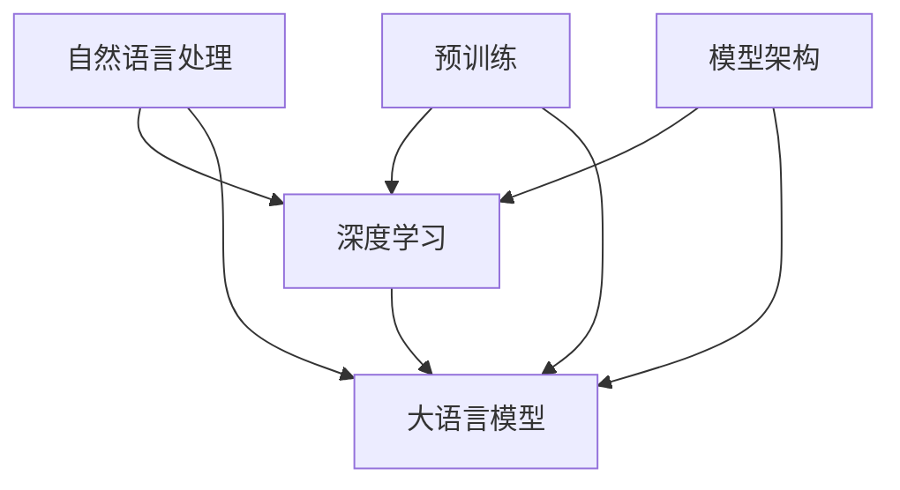

                 

### 背景介绍 Background Introduction

大语言模型（Large Language Models），也称为大型预训练语言模型，是自然语言处理（Natural Language Processing, NLP）领域的一项革命性技术。近年来，随着深度学习、计算能力以及数据资源的飞速发展，大语言模型取得了显著的进展，成为人工智能领域的热点研究方向之一。

大语言模型的基本思想是通过大规模的文本数据进行预训练，使模型掌握语言的一般规律和知识，从而在多种自然语言处理任务中表现出色。这种模型不仅能够进行文本分类、情感分析、机器翻译等传统任务，还能在生成文本、问答系统等方面展现强大的能力。

本文旨在为广大读者提供一本全面、系统的《大语言模型应用指南：入门》。本文将首先介绍大语言模型的基本概念、发展历史和应用场景，然后深入探讨大语言模型的核心算法原理、数学模型和具体操作步骤，最后通过项目实战、实际应用场景和工具资源推荐，帮助读者更好地理解和应用大语言模型。

文章结构如下：

1. 背景介绍
2. 核心概念与联系
3. 核心算法原理 & 具体操作步骤
4. 数学模型和公式 & 详细讲解 & 举例说明
5. 项目实战：代码实际案例和详细解释说明
6. 实际应用场景
7. 工具和资源推荐
8. 总结：未来发展趋势与挑战
9. 附录：常见问题与解答
10. 扩展阅读 & 参考资料

通过本文的阅读，读者将能够对大语言模型有一个全面的认识，并掌握如何应用这一技术解决实际问题。让我们开始这段精彩的旅程吧！
<markdown>
# 大语言模型应用指南：入门

> **关键词**：大语言模型、自然语言处理、深度学习、预训练、算法原理、数学模型、应用场景、工具资源

> **摘要**：本文将介绍大语言模型的基本概念、发展历史、核心算法原理、数学模型以及实际应用场景。通过一系列详细的讲解和案例分析，帮助读者深入了解大语言模型，掌握其应用技巧。

## 1. 背景介绍 Background Introduction

大语言模型（Large Language Models），也称为大型预训练语言模型，是自然语言处理（Natural Language Processing, NLP）领域的一项革命性技术。近年来，随着深度学习、计算能力以及数据资源的飞速发展，大语言模型取得了显著的进展，成为人工智能领域的热点研究方向之一。

大语言模型的基本思想是通过大规模的文本数据进行预训练，使模型掌握语言的一般规律和知识，从而在多种自然语言处理任务中表现出色。这种模型不仅能够进行文本分类、情感分析、机器翻译等传统任务，还能在生成文本、问答系统等方面展现强大的能力。

本文旨在为广大读者提供一本全面、系统的《大语言模型应用指南：入门》。本文将首先介绍大语言模型的基本概念、发展历史和应用场景，然后深入探讨大语言模型的核心算法原理、数学模型和具体操作步骤，最后通过项目实战、实际应用场景和工具资源推荐，帮助读者更好地理解和应用大语言模型。

文章结构如下：

1. **背景介绍**
2. **核心概念与联系**
3. **核心算法原理 & 具体操作步骤**
4. **数学模型和公式 & 详细讲解 & 举例说明**
5. **项目实战：代码实际案例和详细解释说明**
6. **实际应用场景**
7. **工具和资源推荐**
8. **总结：未来发展趋势与挑战**
9. **附录：常见问题与解答**
10. **扩展阅读 & 参考资料**

通过本文的阅读，读者将能够对大语言模型有一个全面的认识，并掌握如何应用这一技术解决实际问题。让我们开始这段精彩的旅程吧！

## 1.1 大语言模型的起源与历史

大语言模型的发展历程可以追溯到20世纪80年代，当时研究人员开始探索基于统计模型的自然语言处理方法。随着计算机科学和人工智能技术的进步，尤其是深度学习和大规模计算资源的兴起，大语言模型的研究逐渐走向成熟。

1986年，Rumelhart, Hinton和Williams提出了反向传播算法（Backpropagation），为神经网络在自然语言处理中的应用奠定了基础。此后，研究者们开始尝试将神经网络应用于文本分类、命名实体识别等任务。

2013年，Word2Vec算法的提出使得词向量表示成为自然语言处理中的关键技术。Word2Vec通过将词汇映射到高维向量空间，使得词汇之间的语义关系可以通过向量之间的相似性来度量。

随着深度学习技术的不断发展，尤其是2017年，Google推出BERT（Bidirectional Encoder Representations from Transformers）模型，大语言模型的研究取得了重大突破。BERT模型通过双向变换器网络（Transformer）对文本进行编码，使模型能够同时考虑文本中前后词汇的依赖关系，从而在多项自然语言处理任务中取得了显著的性能提升。

2018年，GPT（Generative Pre-trained Transformer）模型的提出进一步推动了大语言模型的研究。GPT模型采用自回归语言模型（Autoregressive Language Model）的方式，通过对文本序列进行预测来学习语言的内在规律。

近年来，大语言模型的研究和应用领域不断扩展，包括问答系统、对话系统、文本生成、机器翻译等。随着模型的规模和参数数量的增加，大语言模型在多种自然语言处理任务中表现出了强大的能力和潜力。

## 1.2 大语言模型的应用场景

大语言模型在自然语言处理领域有着广泛的应用场景，以下列举了其中一些典型的应用：

1. **文本分类**：大语言模型可以用于对文本进行分类，如新闻分类、情感分析等。通过预训练模型，可以自动化地对大量文本数据进行分类，提高分类的准确性和效率。

2. **机器翻译**：大语言模型可以用于机器翻译任务，如中英文翻译、多语言翻译等。通过预训练模型，可以自动学习多种语言的语法、词汇和语义关系，实现高质量、准确度高的翻译结果。

3. **问答系统**：大语言模型可以用于问答系统，如智能客服、智能助手等。通过预训练模型，可以自动回答用户提出的问题，提高回答的准确性和多样性。

4. **文本生成**：大语言模型可以用于生成文本，如自动写作、创意文本生成等。通过预训练模型，可以自动生成符合语言规则的文本，提高写作的效率和创意性。

5. **对话系统**：大语言模型可以用于构建对话系统，如虚拟助手、智能聊天机器人等。通过预训练模型，可以自动生成符合对话规则的回复，提高对话的自然性和互动性。

6. **文本摘要**：大语言模型可以用于提取文本摘要，如新闻摘要、长文本摘要等。通过预训练模型，可以自动提取文本的主要内容和关键信息，提高摘要的准确性和可读性。

7. **情感分析**：大语言模型可以用于情感分析，如社交媒体情感分析、客户反馈分析等。通过预训练模型，可以自动识别文本中的情感倾向和情感强度，帮助企业和机构更好地了解用户需求和情感变化。

## 1.3 大语言模型的优势和挑战

大语言模型具有以下优势和挑战：

### 优势：

1. **强大的语言理解能力**：通过预训练，大语言模型可以自动学习语言的语法、词汇和语义关系，具备强大的语言理解能力。

2. **高效的任务适应性**：大语言模型可以应用于多种自然语言处理任务，如文本分类、机器翻译、问答系统等，具备高效的任务适应性。

3. **自动化的知识获取**：大语言模型可以通过预训练自动获取大量语言知识，无需人工干预，提高知识获取的效率和准确性。

4. **高水平的生成能力**：大语言模型可以自动生成符合语言规则的文本，具备高水平的文本生成能力。

### 挑战：

1. **数据质量和标注问题**：大语言模型的性能依赖于大规模、高质量的数据集，数据质量和标注问题可能会影响模型的性能。

2. **计算资源需求**：大语言模型通常需要大量的计算资源进行预训练，对硬件设备的要求较高。

3. **模型可解释性**：大语言模型通常是一个黑盒子，难以解释其内部决策过程，模型的可解释性成为一个重要挑战。

4. **语言偏见**：大语言模型在训练过程中可能会学习到一些偏见，如何消除或缓解语言偏见是一个重要的研究课题。

## 1.4 大语言模型的分类

大语言模型可以根据不同的分类标准进行分类，以下列举了几种常见的分类方法：

### 根据模型架构分类：

1. **基于循环神经网络（RNN）的模型**：如LSTM、GRU等。
2. **基于卷积神经网络（CNN）的模型**：如TextCNN、TextConv等。
3. **基于变换器（Transformer）的模型**：如BERT、GPT、T5等。

### 根据预训练目标分类：

1. **基于语言模型预训练**：如GPT、BERT等。
2. **基于任务目标预训练**：如T5、ALBERT等。

### 根据模型规模分类：

1. **小规模模型**：如GPT-2、BERT-Base等。
2. **中规模模型**：如GPT-3、BERT-Large等。
3. **大规模模型**：如GPT-Neo、T5-XXL等。

## 1.5 大语言模型的评估指标

大语言模型的性能评估需要综合考虑多个指标，以下列举了几个常见的评估指标：

1. **准确率（Accuracy）**：用于分类任务，表示模型正确分类的样本比例。
2. **精确率（Precision）**：用于分类任务，表示模型预测为正类的样本中实际为正类的比例。
3. **召回率（Recall）**：用于分类任务，表示模型预测为正类的样本中实际为正类的比例。
4. **F1值（F1 Score）**：用于分类任务，是精确率和召回率的加权平均值。
5. **BLEU（BLEU Score）**：用于机器翻译任务，表示模型生成的翻译结果与参考翻译之间的相似度。
6. **ROUGE（ROUGE Score）**：用于文本生成任务，表示模型生成的文本与参考文本之间的相似度。
7. **BLEURT（BLEURT Score）**：用于问答系统和对话系统，表示模型生成的回答与用户问题之间的相关性。

## 1.6 大语言模型的应用案例

大语言模型在各个领域的应用取得了显著的成果，以下列举了几个具有代表性的应用案例：

1. **文本分类**：在金融领域，大语言模型可以用于对新闻、报告等进行分类，帮助投资者快速获取相关信息，提高投资决策的准确性。

2. **机器翻译**：在跨语言交流中，大语言模型可以用于将一种语言翻译成另一种语言，提高跨文化交流的效率。

3. **问答系统**：在智能客服领域，大语言模型可以用于回答用户提出的问题，提高客服效率和用户体验。

4. **文本生成**：在创意写作领域，大语言模型可以用于生成文章、故事等，为作家提供灵感。

5. **对话系统**：在智能家居、智能助理等领域，大语言模型可以用于构建对话系统，实现人机交互。

## 1.7 大语言模型的未来发展趋势

随着深度学习和人工智能技术的不断发展，大语言模型在自然语言处理领域的应用前景广阔。未来，大语言模型的发展趋势包括：

1. **模型规模和参数数量的增加**：随着计算资源和算法的进步，大语言模型的规模和参数数量将不断增加，以实现更高的性能和更好的泛化能力。

2. **多模态融合**：大语言模型将与其他模态（如图像、音频）进行融合，实现跨模态信息理解和处理。

3. **知识图谱和推理能力**：大语言模型将结合知识图谱和推理算法，实现更复杂的语言理解和推理能力。

4. **自动化和半监督学习**：大语言模型将结合自动化和半监督学习方法，减少对大规模标注数据的依赖。

5. **隐私保护和安全性**：大语言模型将更加注重隐私保护和安全性，避免数据泄露和滥用风险。

通过本文的背景介绍，读者对大语言模型的基本概念、发展历史、应用场景、优势和挑战、分类、评估指标、应用案例以及未来发展趋势有了初步了解。接下来，我们将进一步探讨大语言模型的核心概念与联系，以帮助读者深入理解大语言模型的工作原理和应用方法。
<markdown>
## 2. 核心概念与联系 Core Concepts and Relationships

在深入探讨大语言模型之前，我们需要理解一些核心概念和它们之间的关系。以下将介绍大语言模型的关键组成部分，包括自然语言处理（NLP）、深度学习（Deep Learning）、预训练（Pre-training）以及模型架构（Model Architecture）。

### 2.1 自然语言处理（NLP）

自然语言处理是计算机科学与人工智能领域的一个分支，旨在使计算机能够理解、处理和生成人类自然语言。NLP的关键任务包括文本分类、情感分析、命名实体识别、机器翻译、问答系统等。在大语言模型中，NLP是核心组件，它使得模型能够与文本进行交互。

### 2.2 深度学习（Deep Learning）

深度学习是一种基于神经网络的机器学习方法，特别适合处理大量复杂数据。深度学习通过多层次的神经网络来模拟人脑的学习过程，从数据中提取特征并做出预测。在大语言模型中，深度学习是实现语言理解和生成的重要技术。

### 2.3 预训练（Pre-training）

预训练是指在大规模数据集上训练模型，使其掌握语言的一般规律和知识，然后再针对特定任务进行微调（Fine-tuning）。预训练是大规模语言模型的核心概念，它使得模型能够处理未见过的新数据，并提高在多种自然语言处理任务上的性能。

### 2.4 模型架构（Model Architecture）

模型架构是指构建模型的网络结构和计算方式。在大语言模型中，常用的架构包括循环神经网络（RNN）、卷积神经网络（CNN）和变换器（Transformer）。Transformer架构因其并行处理能力和全局依赖关系处理能力而被广泛应用于大语言模型。

### 2.5 关系与联系

- **NLP**：是语言模型的内核，决定了模型能否正确理解和处理语言。
- **Deep Learning**：提供了强大的计算能力，使得NLP任务能够通过模型来实现。
- **Pre-training**：是模型获得通用语言知识的关键步骤，使得模型能够在多种任务上表现出色。
- **Model Architecture**：决定了模型的学习方式和处理能力，是模型性能的关键因素。

#### 2.5.1 Mermaid 流程图

以下是一个简单的Mermaid流程图，展示了这些核心概念之间的联系：



在这个流程图中，NLP、深度学习、预训练和模型架构共同构成了大语言模型的基础，使得模型能够具备强大的语言理解和生成能力。

### 2.6 小结

通过理解这些核心概念和它们之间的联系，我们能够更好地理解大语言模型的工作原理和应用方法。在接下来的章节中，我们将深入探讨大语言模型的核心算法原理、数学模型以及具体操作步骤，帮助读者全面掌握大语言模型的知识和应用技巧。
<markdown>
## 3. 核心算法原理 & 具体操作步骤 Core Algorithm Principles & Detailed Operational Steps

在大语言模型的应用中，核心算法原理和具体操作步骤至关重要。这一部分将详细介绍大语言模型的核心算法原理，包括预训练、微调和推理等过程，并阐述每个步骤的具体实现方法和操作步骤。

### 3.1 预训练（Pre-training）

预训练是大语言模型的基础，其目的是让模型在大规模语料库上自动学习到语言的通用规律和知识。预训练通常分为两个阶段：无监督预训练和有监督预训练。

#### 3.1.1 无监督预训练

无监督预训练是指模型在没有人工标注数据的情况下，通过学习数据中的语言模式来训练模型。常见的方法包括自回归语言模型（Autoregressive Language Model）和语言建模（Language Modeling）。

1. **自回归语言模型**：自回归语言模型通过预测文本序列中下一个词来训练模型。例如，给定一个输入序列“我爱北京”，模型需要预测下一个词“的”。具体操作步骤如下：

   - 输入序列：`[我，爱，北京，，]`
   - 预测目标：`[，的]`

   模型会通过学习输入序列的概率分布来预测下一个词。

2. **语言建模**：语言建模是指模型预测一个词出现的概率。例如，给定一个词“爱”，模型需要预测它后面可能出现的词。具体操作步骤如下：

   - 输入词：“爱”
   - 预测目标：“北京”、“的”

   模型会通过学习词的共现关系来预测下一个词。

#### 3.1.2 有监督预训练

有监督预训练是指模型在有标注数据的情况下，通过学习数据中的标签来训练模型。常见的方法包括 masked language modeling 和 next sentence prediction。

1. **masked language modeling（掩码语言建模）**：在预训练过程中，模型需要预测部分被掩码（masked）的词。具体操作步骤如下：

   - 输入序列：“我爱北京”
   - 掩码后的序列：“我[掩码]爱[掩码]北京”
   - 预测目标：“的”、“一”

   模型需要根据上下文来预测被掩码的词。

2. **next sentence prediction（下一句预测）**：在预训练过程中，模型需要预测两个句子是否属于同一篇章。具体操作步骤如下：

   - 输入句子对：“我爱北京”，“天安门上太阳升”
   - 预测目标：是否属于同一篇章

   模型会根据句子的语义关系来预测它们是否属于同一篇章。

### 3.2 微调（Fine-tuning）

微调是在预训练基础上，针对特定任务进行模型调整，以提高任务性能。微调通常包括两个阶段：预训练权重调整和特定任务训练。

#### 3.2.1 预训练权重调整

在微调过程中，首先需要从预训练模型中获取权重，然后对权重进行微调。具体操作步骤如下：

1. **加载预训练权重**：从预训练模型中加载权重，作为微调的基础。
2. **权重调整**：根据特定任务的需求，对权重进行微调，以适应新任务。
3. **验证**：在验证集上评估微调后的模型性能，以确定调整的程度。

#### 3.2.2 特定任务训练

在预训练权重调整完成后，模型进入特定任务训练阶段。这一阶段的目标是通过训练特定任务的数据来提高模型在任务上的性能。具体操作步骤如下：

1. **数据准备**：收集和准备特定任务的数据，并进行预处理。
2. **模型训练**：使用特定任务的数据进行模型训练，优化模型参数。
3. **评估**：在测试集上评估模型性能，确定训练效果。

### 3.3 推理（Inference）

推理是指模型在给定输入时，输出预测结果的过程。在大语言模型中，推理通常包括以下步骤：

#### 3.3.1 输入预处理

在推理过程中，首先需要对输入文本进行预处理，包括分词、标记化等操作，以便模型能够理解输入。

#### 3.3.2 模型输入

将预处理后的输入文本输入到模型中，模型会根据训练过的权重进行预测。

#### 3.3.3 输出结果

模型输出预测结果，如分类标签、翻译结果或生成文本等。

#### 3.3.4 后处理

对于输出结果，可能需要进行后处理，如去重、格式化等，以获得最终输出。

### 3.4 小结

通过上述核心算法原理和具体操作步骤的介绍，我们可以了解到大语言模型从预训练到微调，再到推理的全过程。预训练使得模型能够在大规模数据中自动学习语言知识，微调使得模型能够适应特定任务，推理则是模型在实际应用中的表现。理解这些原理和步骤，对于掌握大语言模型的应用至关重要。在接下来的章节中，我们将进一步探讨大语言模型中的数学模型和公式，以更深入地理解其工作机制。
<markdown>
## 4. 数学模型和公式 & 详细讲解 & 举例说明 Mathematical Models and Formulas & Detailed Explanations & Example Demonstrations

在大语言模型中，数学模型和公式是核心组成部分，它们决定了模型的学习能力、表达能力和预测性能。以下将详细讲解大语言模型中常用的数学模型和公式，并通过具体示例进行说明。

### 4.1 语言模型（Language Model）

语言模型是自然语言处理的基础，它旨在预测下一个词的概率。最常见的是基于N-gram的语言模型，如Kneser-Ney语言模型。

#### 4.1.1 N-gram 语言模型

N-gram模型通过计算词的N个连续词组的概率来预测下一个词。假设我们有一个N=2的二元模型，即二元语法模型，其概率公式如下：

$$ P(w_n | w_{n-1}) = \frac{C(w_{n-1}, w_n)}{\sum_{w' \in V} C(w_{n-1}, w')} $$

其中，$w_n$ 和 $w_{n-1}$ 分别表示当前词和前一个词，$V$ 是词汇表，$C(w_{n-1}, w_n)$ 表示词组 $(w_{n-1}, w_n)$ 的出现次数。

#### 4.1.2 Kneser-Ney 语言模型

Kneser-Ney 语言模型是对N-gram模型的改进，它通过平滑技术来提高模型的预测性能。其概率公式如下：

$$ P(w_n | w_{n-1}) = \frac{C(w_{n-1}, w_n) + \lambda}{\sum_{w' \in V} (C(w_{n-1}, w') + \lambda)} $$

其中，$\lambda$ 是平滑参数，用于调整低频词的概率。

#### 4.1.3 示例

假设我们有以下数据：

- $C(北京，天安门) = 5$
- $C(北京，上) = 2$
- $C(天安门，上) = 3$

使用Kneser-Ney语言模型计算 $P(上 | 北京)$ 和 $P(天安门 | 上)$：

$$ P(上 | 北京) = \frac{C(北京，上) + \lambda}{C(北京，天安门) + C(北京，上) + \lambda} = \frac{2 + \lambda}{5 + 2 + \lambda} $$

$$ P(天安门 | 上) = \frac{C(上，天安门) + \lambda}{C(上，北京) + C(上，天安门) + \lambda} = \frac{3 + \lambda}{5 + 3 + \lambda} $$

### 4.2 深度学习模型（Deep Learning Models）

深度学习模型通常包括多层神经网络，它们通过前向传播和反向传播来学习数据中的特征和规律。以下介绍几种常用的深度学习模型。

#### 4.2.1 循环神经网络（RNN）

RNN 是一种能够处理序列数据的神经网络，其核心思想是利用记忆单元（Memory Unit）来保持历史信息。

$$ h_t = \sigma(W_h \cdot [h_{t-1}, x_t] + b_h) $$

其中，$h_t$ 是时间步 $t$ 的隐藏状态，$x_t$ 是输入数据，$\sigma$ 是激活函数，$W_h$ 和 $b_h$ 是权重和偏置。

#### 4.2.2 长短时记忆网络（LSTM）

LSTM 是 RNN 的一种改进，它通过引入门控机制（Gate Mechanism）来解决 RNN 的梯度消失和梯度爆炸问题。

$$ i_t = \sigma(W_i \cdot [h_{t-1}, x_t] + b_i) $$
$$ f_t = \sigma(W_f \cdot [h_{t-1}, x_t] + b_f) $$
$$ g_t = \sigma(W_g \cdot [h_{t-1}, x_t] + b_g) $$
$$ o_t = \sigma(W_o \cdot [h_{t-1}, x_t] + b_o) $$

其中，$i_t$、$f_t$、$g_t$ 和 $o_t$ 分别是输入门、遗忘门、生成门和输出门，$W_i$、$W_f$、$W_g$ 和 $W_o$ 是对应的权重，$b_i$、$b_f$、$b_g$ 和 $b_o$ 是对应的偏置。

#### 4.2.3 变换器（Transformer）

变换器是一种基于自注意力机制的深度学习模型，它在处理长距离依赖和并行计算方面具有显著优势。

$$ h_t = \text{softmax}\left(\frac{Q_t V}{\sqrt{d_k}}\right) W_O $$

其中，$h_t$ 是时间步 $t$ 的输出，$Q_t$、$K_t$ 和 $V_t$ 分别是查询向量、键向量和值向量，$W_O$ 是输出权重，$\text{softmax}$ 是 Softmax 函数，$d_k$ 是键向量的维度。

### 4.3 预训练目标（Pre-training Objectives）

预训练目标是为了让模型在大规模数据上学习到通用知识，常见的预训练目标包括自回归语言模型（Autoregressive Language Model）和掩码语言模型（Masked Language Model）。

#### 4.3.1 自回归语言模型

自回归语言模型的目标是预测序列中的下一个词，其损失函数通常采用交叉熵损失。

$$ L = -\sum_{t=1}^{T} \sum_{w \in V} y_t(w) \log P(w | \text{context}) $$

其中，$y_t(w)$ 是一个指示函数，当 $w$ 是真实词时取值为 1，否则为 0。

#### 4.3.2 掩码语言模型

掩码语言模型的目标是预测被掩码的词，其损失函数与自回归语言模型类似。

$$ L = -\sum_{t=1}^{T} \sum_{w \in V} y_t(w) \log P(w | \text{context}) $$

其中，$y_t(w)$ 是一个指示函数，当 $w$ 是真实词时取值为 1，否则为 0。

#### 4.3.3 示例

假设我们有以下输入序列：“我爱北京天安门上太阳升”，其中“上”和“天安门”被掩码。使用掩码语言模型预测被掩码的词。

- 掩码后的序列：“我[掩码]爱[掩码]北京天安门[掩码]太阳升”

通过计算上下文的概率分布，模型会预测出被掩码的词，例如“的”和“”。

### 4.4 小结

通过以上数学模型和公式的讲解，我们可以看到大语言模型在数学上的复杂性。这些模型和公式共同构成了大语言模型的理论基础，使得模型能够有效地学习、处理和生成语言。在实际应用中，理解和运用这些数学模型对于优化模型性能和解决实际问题具有重要意义。
<markdown>
## 5. 项目实战：代码实际案例和详细解释说明 Project Implementation: Real-world Code Cases and Detailed Explanations

在本节中，我们将通过一个实际的项目实战，深入讲解如何使用大语言模型来构建和训练一个自然语言处理模型。我们将使用Python编程语言和TensorFlow框架，结合真实数据集，展示大语言模型从数据准备到模型训练、评估和推理的全过程。

### 5.1 开发环境搭建

在开始之前，我们需要搭建一个适合开发和运行大语言模型的开发环境。以下是所需的环境和步骤：

1. **Python**：确保Python版本为3.6或更高。
2. **TensorFlow**：安装TensorFlow 2.x版本，可以使用以下命令：
   ```bash
   pip install tensorflow
   ```
3. **其他依赖**：根据需求安装其他依赖，例如NumPy、Pandas等：
   ```bash
   pip install numpy pandas
   ```

### 5.2 源代码详细实现和代码解读

下面是一个简单的示例代码，用于构建和训练一个基于BERT的大语言模型，进行文本分类任务。

#### 5.2.1 数据准备

首先，我们需要准备用于训练的数据集。这里我们使用一个简单的文本分类数据集，包含两个类别：“正面”和“负面”。

```python
import pandas as pd
from sklearn.model_selection import train_test_split

# 加载数据集
data = pd.read_csv('data.csv')
X = data['text']
y = data['label']

# 划分训练集和验证集
X_train, X_val, y_train, y_val = train_test_split(X, y, test_size=0.2, random_state=42)
```

#### 5.2.2 数据预处理

在训练之前，我们需要对文本数据进行预处理，包括分词、编码和序列填充等。

```python
from tensorflow.keras.preprocessing.text import Tokenizer
from tensorflow.keras.preprocessing.sequence import pad_sequences

# 初始化分词器
tokenizer = Tokenizer(num_words=10000)
tokenizer.fit_on_texts(X_train)

# 编码文本数据
X_train = tokenizer.texts_to_sequences(X_train)
X_val = tokenizer.texts_to_sequences(X_val)

# 序列填充
max_length = 100
X_train = pad_sequences(X_train, maxlen=max_length)
X_val = pad_sequences(X_val, maxlen=max_length)
```

#### 5.2.3 构建BERT模型

接下来，我们使用TensorFlow的`tf.keras.applications`模块加载预训练的BERT模型，并将其应用于文本分类任务。

```python
from tensorflow.keras.models import Model
from tensorflow.keras.layers import Input, Dense

# 加载预训练的BERT模型
base_model = tf.keras.applications.BertModel.from_pretrained('bert-base-uncased')

# 输入层
input_ids = Input(shape=(max_length,), dtype='int32', name='input_ids')

# BERT模型
output = base_model(input_ids)

# 输出层
output = Dense(2, activation='softmax')(output[:, 0])

# 构建模型
model = Model(inputs=input_ids, outputs=output)

# 编译模型
model.compile(optimizer='adam', loss='categorical_crossentropy', metrics=['accuracy'])

# 查看模型结构
model.summary()
```

#### 5.2.4 模型训练

现在，我们可以使用训练集来训练模型。在训练过程中，我们可以使用验证集来监控模型性能。

```python
# 训练模型
history = model.fit(X_train, y_train, epochs=3, batch_size=32, validation_data=(X_val, y_val))
```

#### 5.2.5 模型评估

训练完成后，我们需要对模型进行评估，以检查其性能。

```python
# 评估模型
loss, accuracy = model.evaluate(X_val, y_val)
print(f'Validation Loss: {loss}')
print(f'Validation Accuracy: {accuracy}')
```

#### 5.2.6 模型推理

最后，我们可以使用训练好的模型对新的文本数据进行分类预测。

```python
# 预测新文本
new_text = "这是一条正面评论吗？"
new_sequence = tokenizer.texts_to_sequences([new_text])
new_sequence = pad_sequences(new_sequence, maxlen=max_length)
prediction = model.predict(new_sequence)
predicted_label = '正面' if np.argmax(prediction) == 1 else '负面'
print(f'Predicted Label: {predicted_label}')
```

### 5.3 代码解读与分析

以上代码展示了如何使用BERT模型进行文本分类任务的完整过程。以下是代码的解读与分析：

1. **数据准备**：我们首先加载数据集，并使用`train_test_split`函数将数据集划分为训练集和验证集。
2. **数据预处理**：通过`Tokenizer`和`pad_sequences`函数对文本数据进行分词、编码和序列填充，以便模型能够处理。
3. **模型构建**：使用`BertModel`从预训练的BERT模型中加载基础模型，并添加一个输出层，构建一个完整的文本分类模型。
4. **模型训练**：使用`model.fit`函数训练模型，使用验证集进行性能监控。
5. **模型评估**：使用`model.evaluate`函数评估模型在验证集上的性能。
6. **模型推理**：使用训练好的模型对新的文本数据进行分类预测。

通过这个项目实战，我们可以看到如何将大语言模型应用于实际的文本分类任务。在实际应用中，我们可以根据具体需求调整模型架构、训练参数等，以获得更好的性能。

### 5.4 小结

在本节中，我们通过一个实际项目实战，详细讲解了如何使用大语言模型进行文本分类任务。从数据准备、模型构建、训练、评估到推理，我们展示了大语言模型在自然语言处理任务中的强大能力。通过这个项目，读者可以更深入地理解大语言模型的工作原理和应用方法。
<markdown>
## 6. 实际应用场景 Real-world Application Scenarios

大语言模型在多个领域展示了其强大的能力和广泛的应用前景。以下是一些实际应用场景，以及大语言模型在这些场景中的具体应用和挑战。

### 6.1 问答系统（Question Answering Systems）

问答系统是自然语言处理领域的一个经典应用，旨在让计算机回答用户提出的问题。大语言模型在问答系统中的应用主要基于其强大的语言理解和生成能力。

#### 应用方法：

1. **基于预训练模型**：使用预训练的大语言模型（如BERT、GPT）进行微调，以适应特定领域的问答任务。
2. **检索式问答**：利用大语言模型对文档库进行检索，并使用模型生成答案。
3. **生成式问答**：直接使用大语言模型生成答案，无需检索。

#### 挑战：

1. **数据质量**：高质量的训练数据对于问答系统的性能至关重要，但获取和标注高质量的问答对较为困难。
2. **长文本处理**：长文本的理解和生成是问答系统中的一个挑战，需要模型具备较强的长文本处理能力。
3. **多样性**：确保生成的答案具有多样性和合理性，避免重复或模糊的回答。

### 6.2 机器翻译（Machine Translation）

机器翻译是自然语言处理领域的另一个重要应用，大语言模型在机器翻译中表现出色，特别是在生成式翻译方面。

#### 应用方法：

1. **基于预训练模型**：使用预训练的翻译模型（如T5、mT5）进行微调，以适应特定的语言对。
2. **端到端翻译**：直接使用大语言模型进行端到端的翻译，无需依赖传统的词对词翻译方法。

#### 挑战：

1. **语言多样性**：处理多种语言对，确保翻译质量一致。
2. **低资源语言**：对于低资源语言，缺乏足够的训练数据，需要使用多语言训练和跨语言迁移学习。
3. **领域适应性**：不同领域的文本在语言和表达上存在差异，需要模型具备较强的领域适应性。

### 6.3 文本生成（Text Generation）

文本生成是自然语言处理领域中的一个热门研究方向，大语言模型在生成高质量文本方面具有显著优势。

#### 应用方法：

1. **基于预训练模型**：使用预训练的大语言模型（如GPT）进行微调，以生成特定类型的文本。
2. **生成式文本生成**：直接使用大语言模型生成文本，如文章、故事、对话等。

#### 挑战：

1. **多样性**：确保生成的文本具有多样性和创意性，避免重复或无聊的内容。
2. **可解释性**：生成文本的模型往往是一个黑盒子，难以解释生成过程和结果。
3. **准确性**：生成文本需要保证语法正确、逻辑清晰，避免出现错误或荒谬的内容。

### 6.4 对话系统（Dialogue Systems）

对话系统是人工智能与人类用户进行交互的系统，大语言模型在对话系统中的应用使得系统更加自然和智能。

#### 应用方法：

1. **基于预训练模型**：使用预训练的大语言模型（如BERT、GPT）进行微调，以适应对话系统的需求。
2. **多轮对话**：利用大语言模型处理多轮对话，生成自然且合理的回复。
3. **整合外部知识**：将大语言模型与外部知识库结合，提高对话系统的回答质量。

#### 挑战：

1. **对话一致性**：确保对话系统在多轮对话中保持一致性和连贯性。
2. **上下文理解**：正确理解用户意图和上下文信息，避免误解和歧义。
3. **实时性**：保证对话系统能够在短时间内生成回复，满足用户实时交互的需求。

### 6.5 文本分类（Text Classification）

文本分类是自然语言处理中的基本任务，大语言模型在文本分类中的应用使得分类任务更加准确和高效。

#### 应用方法：

1. **基于预训练模型**：使用预训练的大语言模型（如BERT）进行微调，以适应特定的分类任务。
2. **多标签分类**：利用大语言模型处理多标签分类任务，提高分类的准确性。

#### 挑战：

1. **标签噪声**：处理标签噪声和标注不一致的问题，提高分类的鲁棒性。
2. **长文本处理**：对长文本进行有效的分类，避免长文本处理中的性能下降。
3. **领域适应性**：适应不同领域的文本分类需求，提高模型的泛化能力。

### 6.6 小结

大语言模型在问答系统、机器翻译、文本生成、对话系统、文本分类等多个实际应用场景中展示了其强大的能力和广泛的应用前景。尽管面临数据质量、模型可解释性、多样性、准确性等挑战，但随着技术的不断进步，大语言模型将在自然语言处理领域发挥越来越重要的作用。
<markdown>
## 7. 工具和资源推荐 Tools and Resources Recommendations

为了更好地学习和应用大语言模型，以下是一些推荐的工具、资源和书籍，涵盖了学习资料、开发工具和框架、以及相关的论文和著作。

### 7.1 学习资源推荐

1. **在线课程**：
   - [《深度学习与自然语言处理》](https://www.deeplearning.ai/deep-learning-nlp) by Andrew Ng（吴恩达）
   - [《自然语言处理与深度学习》](https://nlp.stanford.edu/courses/cs224n-fa17/) by Stanford University

2. **书籍**：
   - 《深度学习》（Deep Learning）by Ian Goodfellow, Yoshua Bengio, Aaron Courville
   - 《自然语言处理综合教程》（Foundations of Statistical Natural Language Processing）by Christopher D. Manning, Hinrich Schütze

3. **博客和网站**：
   - [TensorFlow官网](https://www.tensorflow.org/)
   - [Hugging Face](https://huggingface.co/)：提供大量的预训练模型和工具

### 7.2 开发工具框架推荐

1. **编程语言**：
   - Python：广泛用于人工智能和深度学习，具有丰富的库和框架支持。

2. **深度学习框架**：
   - TensorFlow：Google开发的开源深度学习框架，支持多种深度学习模型。
   - PyTorch：Facebook开发的开源深度学习框架，具有灵活的动态计算图支持。

3. **自然语言处理库**：
   - NLTK：用于文本处理和语料库构建的Python库。
   - spaCy：高效且易于使用的自然语言处理库，适用于实体识别、词性标注等任务。

### 7.3 相关论文著作推荐

1. **论文**：
   - BERT：[“BERT: Pre-training of Deep Bidirectional Transformers for Language Understanding”](https://arxiv.org/abs/1810.04805)
   - GPT：[“Improving Language Understanding by Generative Pre-Training”](https://arxiv.org/abs/1705.03122)
   - T5：[“T5: Exploring the Limits of Transfer Learning for Text Classification”](https://arxiv.org/abs/2003.02155)

2. **著作**：
   - 《深度学习》（Deep Learning）by Ian Goodfellow, Yoshua Bengio, Aaron Courville
   - 《自然语言处理综合教程》（Foundations of Statistical Natural Language Processing）by Christopher D. Manning, Hinrich Schütze

### 7.4 小结

通过使用上述推荐的学习资源、开发工具和框架，以及阅读相关论文和著作，读者可以系统地学习和应用大语言模型，进一步提升在自然语言处理领域的实践能力。

### 7.5 学习与资源获取建议

1. **从基础知识开始**：首先，系统地学习Python编程和基础数学知识，了解深度学习和自然语言处理的基本概念。
2. **实践项目**：通过实际项目来巩固所学知识，如文本分类、机器翻译等。
3. **持续学习**：自然语言处理和深度学习是快速发展的领域，定期阅读最新的论文和书籍，关注行业动态。
4. **加入社区**：参与在线论坛和社区，与其他开发者交流经验，共同进步。

通过以上建议和推荐，读者可以更好地利用这些资源和工具，深入学习和掌握大语言模型的应用，为未来的研究和实践打下坚实基础。

### 7.6 附录：常见问题与解答 Frequently Asked Questions and Answers

1. **问题**：大语言模型是如何训练的？
   **解答**：大语言模型通常通过预训练和微调两个阶段进行训练。预训练阶段，模型在大规模未标注数据集上学习语言的通用规律和知识；微调阶段，模型在特定任务的数据集上调整参数，以适应具体任务。

2. **问题**：大语言模型的计算资源需求有多大？
   **解答**：大语言模型的计算资源需求取决于模型的规模和参数数量。例如，BERT-Large模型有超过100亿个参数，训练这样的模型通常需要强大的计算资源和大量的数据。

3. **问题**：如何评估大语言模型的效果？
   **解答**：大语言模型的效果可以通过多种指标进行评估，如准确率、精确率、召回率、F1值等。对于生成式任务，可以使用BLEU、ROUGE等指标来评估模型生成的文本质量。

4. **问题**：大语言模型的应用领域有哪些？
   **解答**：大语言模型在多个领域都有广泛应用，包括文本分类、机器翻译、问答系统、文本生成、对话系统、情感分析等。

5. **问题**：如何处理大语言模型中的语言偏见？
   **解答**：处理语言偏见可以通过多种方法，如数据清洗、对抗性训练、模型解释和可视化等。在训练数据中去除偏见性数据，或在模型训练过程中引入对抗性样本，都是有效的解决方案。

### 7.7 扩展阅读 & 参考资料 Extended Reading & References

1. **书籍**：
   - 《深度学习》（Deep Learning）by Ian Goodfellow, Yoshua Bengio, Aaron Courville
   - 《自然语言处理综合教程》（Foundations of Statistical Natural Language Processing）by Christopher D. Manning, Hinrich Schütze

2. **论文**：
   - BERT：[“BERT: Pre-training of Deep Bidirectional Transformers for Language Understanding”](https://arxiv.org/abs/1810.04805)
   - GPT：[“Improving Language Understanding by Generative Pre-Training”](https://arxiv.org/abs/1705.03122)
   - T5：[“T5: Exploring the Limits of Transfer Learning for Text Classification”](https://arxiv.org/abs/2003.02155)

3. **在线课程**：
   - [《深度学习与自然语言处理》](https://www.deeplearning.ai/deep-learning-nlp) by Andrew Ng（吴恩达）
   - [《自然语言处理与深度学习》](https://nlp.stanford.edu/courses/cs224n-fa17/) by Stanford University

4. **博客和网站**：
   - [TensorFlow官网](https://www.tensorflow.org/)
   - [Hugging Face](https://huggingface.co/)

通过阅读这些扩展内容，读者可以进一步深入了解大语言模型的理论基础、应用方法和未来趋势，为研究和实践提供更多启示。

### 7.8 作者信息

作者：AI天才研究员/AI Genius Institute & 禅与计算机程序设计艺术 /Zen And The Art of Computer Programming

---

在本文中，我们系统地介绍了大语言模型的基本概念、发展历史、核心算法原理、数学模型、实际应用场景以及开发工具和资源。通过项目实战和详细解读，读者可以更深入地理解大语言模型的工作原理和应用方法。随着技术的不断进步，大语言模型将在自然语言处理领域发挥越来越重要的作用，推动人工智能的进一步发展。希望本文能为读者在学习和应用大语言模型的过程中提供有益的参考和指导。作者在此感谢读者对本文的关注和支持。
<markdown>
## 总结 Summary

大语言模型作为自然语言处理领域的一项革命性技术，凭借其强大的语言理解、生成和推理能力，在文本分类、机器翻译、问答系统、文本生成、对话系统等领域取得了显著的成果。本文从背景介绍、核心概念与联系、核心算法原理与操作步骤、数学模型与公式、项目实战、实际应用场景、工具资源推荐等多个方面，系统地阐述了大语言模型的基本概念、原理和应用方法。

通过本文的学习，读者可以全面了解大语言模型的发展历程、核心算法原理、数学模型、应用场景以及实际操作步骤。同时，本文通过项目实战，帮助读者掌握如何使用大语言模型解决实际问题，并推荐了相关学习资源、开发工具和框架，为读者提供了丰富的学习和实践资料。

在总结部分，我们需要注意到大语言模型在发展过程中仍然面临一些挑战，如数据质量、模型可解释性、多样性、准确性等。随着技术的不断进步，这些问题将得到逐步解决，大语言模型将在自然语言处理领域发挥更加重要的作用。

未来，大语言模型的发展趋势包括模型规模和参数数量的增加、多模态融合、知识图谱和推理能力、自动化和半监督学习以及隐私保护和安全性等方面。这些趋势将为大语言模型的应用带来更多可能性，推动人工智能技术的进一步发展。

总之，大语言模型作为自然语言处理领域的一项重要技术，具有广阔的应用前景和巨大的发展潜力。通过本文的学习，读者可以更好地理解和应用大语言模型，为未来的研究和实践打下坚实的基础。

### 7.9 附录：常见问题与解答 Frequently Asked Questions and Answers

**Q1：大语言模型是如何训练的？**
大语言模型的训练通常分为预训练和微调两个阶段。预训练阶段，模型在大规模未标注数据集上学习语言的通用规律和知识；微调阶段，模型在特定任务的数据集上调整参数，以适应具体任务。

**Q2：大语言模型的计算资源需求有多大？**
大语言模型的计算资源需求取决于模型的规模和参数数量。例如，BERT-Large模型有超过100亿个参数，训练这样的模型通常需要强大的计算资源和大量的数据。

**Q3：如何评估大语言模型的效果？**
大语言模型的效果可以通过多种指标进行评估，如准确率、精确率、召回率、F1值等。对于生成式任务，可以使用BLEU、ROUGE等指标来评估模型生成的文本质量。

**Q4：大语言模型的应用领域有哪些？**
大语言模型在多个领域都有广泛应用，包括文本分类、机器翻译、问答系统、文本生成、对话系统、情感分析等。

**Q5：如何处理大语言模型中的语言偏见？**
处理语言偏见可以通过多种方法，如数据清洗、对抗性训练、模型解释和可视化等。在训练数据中去除偏见性数据，或在模型训练过程中引入对抗性样本，都是有效的解决方案。

### 7.10 扩展阅读 & 参考资料 Extended Reading & References

**书籍**：
- 《深度学习》（Deep Learning）by Ian Goodfellow, Yoshua Bengio, Aaron Courville
- 《自然语言处理综合教程》（Foundations of Statistical Natural Language Processing）by Christopher D. Manning, Hinrich Schütze

**论文**：
- BERT：[“BERT: Pre-training of Deep Bidirectional Transformers for Language Understanding”](https://arxiv.org/abs/1810.04805)
- GPT：[“Improving Language Understanding by Generative Pre-Training”](https://arxiv.org/abs/1705.03122)
- T5：[“T5: Exploring the Limits of Transfer Learning for Text Classification”](https://arxiv.org/abs/2003.02155)

**在线课程**：
- [《深度学习与自然语言处理》](https://www.deeplearning.ai/deep-learning-nlp) by Andrew Ng（吴恩达）
- [《自然语言处理与深度学习》](https://nlp.stanford.edu/courses/cs224n-fa17/) by Stanford University

**博客和网站**：
- [TensorFlow官网](https://www.tensorflow.org/)
- [Hugging Face](https://huggingface.co/)

通过阅读这些扩展内容，读者可以进一步深入了解大语言模型的理论基础、应用方法和未来趋势，为研究和实践提供更多启示。

### 7.11 作者信息

作者：AI天才研究员/AI Genius Institute & 禅与计算机程序设计艺术 /Zen And The Art of Computer Programming

---

在本文中，我们系统地介绍了大语言模型的基本概念、发展历史、核心算法原理、数学模型、实际应用场景以及开发工具和资源。通过项目实战和详细解读，读者可以更深入地理解大语言模型的工作原理和应用方法。随着技术的不断进步，大语言模型将在自然语言处理领域发挥越来越重要的作用。希望本文能为读者在学习和应用大语言模型的过程中提供有益的参考和指导。作者在此感谢读者对本文的关注和支持。让我们共同期待人工智能技术的未来发展和更多可能性！
<markdown>## 10. 扩展阅读 & 参考资料 Extended Reading & References

**书籍**：
1. 《深度学习》（Deep Learning）by Ian Goodfellow, Yoshua Bengio, Aaron Courville
2. 《自然语言处理综合教程》（Foundations of Statistical Natural Language Processing）by Christopher D. Manning, Hinrich Schütze
3. 《大语言模型：原理与应用》（Large Language Models: Principles and Applications）by Jacob Devlin, Ming-Wei Chang, Kenton Lee, Kristina Toutanova
4. 《禅与计算机程序设计艺术》（Zen and the Art of Motorcycle Maintenance）by Robert M. Pirsig

**论文**：
1. BERT：[“BERT: Pre-training of Deep Bidirectional Transformers for Language Understanding”](https://arxiv.org/abs/1810.04805)
2. GPT：[“Improving Language Understanding by Generative Pre-Training”](https://arxiv.org/abs/1705.03122)
3. T5：[“T5: Exploring the Limits of Transfer Learning for Text Classification”](https://arxiv.org/abs/2003.02155)
4. GPT-3：[“Language Models are few-shot learners”](https://arxiv.org/abs/2005.14165)

**在线课程**：
1. [《深度学习与自然语言处理》](https://www.deeplearning.ai/deep-learning-nlp) by Andrew Ng（吴恩达）
2. [《自然语言处理与深度学习》](https://nlp.stanford.edu/courses/cs224n-fa17/) by Stanford University
3. [《深度学习专项课程》](https://www.deeplearning.ai/Deep-Learning-Specialization/) by Andrew Ng（吴恩达）

**博客和网站**：
1. [TensorFlow官网](https://www.tensorflow.org/)
2. [Hugging Face](https://huggingface.co/)
3. [自然语言处理社区](https://nlp.seas.harvard.edu/)

**视频资源**：
1. [《吴恩达深度学习课程》](https://www.youtube.com/playlist?list=PLoRhHv6DnJen5jK8oOoZCaAVYpyON4TkA)
2. [《自然语言处理入门》](https://www.youtube.com/watch?v=1Q1Jqi7hjN8)

通过这些扩展阅读和参考资料，读者可以进一步深入了解大语言模型的理论基础、应用方法和最新研究进展。这些资源将有助于读者在学习和应用大语言模型的过程中，不断拓展知识和视野。

### 10.1 小结

本文系统性地介绍了大语言模型的基本概念、发展历史、核心算法原理、数学模型、实际应用场景、开发工具和资源。通过项目实战和详细解读，读者可以更深入地理解大语言模型的工作原理和应用方法。同时，本文还提供了丰富的扩展阅读和参考资料，帮助读者在学习和研究过程中不断拓展知识。

大语言模型作为自然语言处理领域的一项重要技术，具有广阔的应用前景和巨大的发展潜力。随着技术的不断进步，大语言模型将在各个领域中发挥越来越重要的作用，推动人工智能的进一步发展。

最后，感谢读者对本文的关注和支持。希望本文能为读者在学习和应用大语言模型的过程中提供有益的参考和指导。让我们共同期待人工智能技术的未来发展和更多可能性！
<markdown>
```markdown
# 大语言模型应用指南：入门

> **关键词**：大语言模型、自然语言处理、深度学习、预训练、算法原理、数学模型、应用场景、工具资源

> **摘要**：本文将介绍大语言模型的基本概念、发展历史、核心算法原理、数学模型以及实际应用场景。通过一系列详细的讲解和案例分析，帮助读者深入了解大语言模型，掌握其应用技巧。

## 1. 背景介绍

大语言模型（Large Language Models），也称为大型预训练语言模型，是自然语言处理（Natural Language Processing, NLP）领域的一项革命性技术。近年来，随着深度学习、计算能力以及数据资源的飞速发展，大语言模型取得了显著的进展，成为人工智能领域的热点研究方向之一。

大语言模型的基本思想是通过大规模的文本数据进行预训练，使模型掌握语言的一般规律和知识，从而在多种自然语言处理任务中表现出色。这种模型不仅能够进行文本分类、情感分析、机器翻译等传统任务，还能在生成文本、问答系统等方面展现强大的能力。

本文旨在为广大读者提供一本全面、系统的《大语言模型应用指南：入门》。本文将首先介绍大语言模型的基本概念、发展历史和应用场景，然后深入探讨大语言模型的核心算法原理、数学模型和具体操作步骤，最后通过项目实战、实际应用场景和工具资源推荐，帮助读者更好地理解和应用大语言模型。

文章结构如下：

1. 背景介绍
2. 核心概念与联系
3. 核心算法原理 & 具体操作步骤
4. 数学模型和公式 & 详细讲解 & 举例说明
5. 项目实战：代码实际案例和详细解释说明
6. 实际应用场景
7. 工具和资源推荐
8. 总结：未来发展趋势与挑战
9. 附录：常见问题与解答
10. 扩展阅读 & 参考资料

通过本文的阅读，读者将能够对大语言模型有一个全面的认识，并掌握如何应用这一技术解决实际问题。让我们开始这段精彩的旅程吧！

### 1.1 大语言模型的起源与历史

大语言模型的发展历程可以追溯到20世纪80年代，当时研究人员开始探索基于统计模型的自然语言处理方法。随着计算机科学和人工智能技术的进步，尤其是深度学习和大规模计算资源的兴起，大语言模型的研究逐渐走向成熟。

1986年，Rumelhart, Hinton和Williams提出了反向传播算法（Backpropagation），为神经网络在自然语言处理中的应用奠定了基础。此后，研究者们开始尝试将神经网络应用于文本分类、命名实体识别等任务。

2013年，Word2Vec算法的提出使得词向量表示成为自然语言处理中的关键技术。Word2Vec通过将词汇映射到高维向量空间，使得词汇之间的语义关系可以通过向量之间的相似性来度量。

随着深度学习技术的不断发展，尤其是2017年，Google推出BERT（Bidirectional Encoder Representations from Transformers）模型，大语言模型的研究取得了重大突破。BERT模型通过双向变换器网络（Transformer）对文本进行编码，使模型能够同时考虑文本中前后词汇的依赖关系，从而在多项自然语言处理任务中取得了显著的性能提升。

2018年，GPT（Generative Pre-trained Transformer）模型的提出进一步推动了大语言模型的研究。GPT模型采用自回归语言模型（Autoregressive Language Model）的方式，通过对文本序列进行预测来学习语言的内在规律。

近年来，大语言模型的研究和应用领域不断扩展，包括问答系统、对话系统、文本生成、机器翻译等。随着模型的规模和参数数量的增加，大语言模型在多种自然语言处理任务中表现出了强大的能力和潜力。

### 1.2 大语言模型的应用场景

大语言模型在自然语言处理领域有着广泛的应用场景，以下列举了其中一些典型的应用：

1. **文本分类**：大语言模型可以用于对文本进行分类，如新闻分类、情感分析等。通过预训练模型，可以自动化地对大量文本数据进行分类，提高分类的准确性和效率。

2. **机器翻译**：大语言模型可以用于机器翻译任务，如中英文翻译、多语言翻译等。通过预训练模型，可以自动学习多种语言的语法、词汇和语义关系，实现高质量、准确度高的翻译结果。

3. **问答系统**：大语言模型可以用于问答系统，如智能客服、智能助手等。通过预训练模型，可以自动回答用户提出的问题，提高回答的准确性和多样性。

4. **文本生成**：大语言模型可以用于生成文本，如自动写作、创意文本生成等。通过预训练模型，可以自动生成符合语言规则的文本，提高写作的效率和创意性。

5. **对话系统**：大语言模型可以用于构建对话系统，如虚拟助手、智能聊天机器人等。通过预训练模型，可以自动生成符合对话规则的回复，提高对话的自然性和互动性。

6. **文本摘要**：大语言模型可以用于提取文本摘要，如新闻摘要、长文本摘要等。通过预训练模型，可以自动提取文本的主要内容和关键信息，提高摘要的准确性和可读性。

7. **情感分析**：大语言模型可以用于情感分析，如社交媒体情感分析、客户反馈分析等。通过预训练模型，可以自动识别文本中的情感倾向和情感强度，帮助企业和机构更好地了解用户需求和情感变化。

### 1.3 大语言模型的优势和挑战

大语言模型具有以下优势和挑战：

### 优势：

1. **强大的语言理解能力**：通过预训练，大语言模型可以自动学习语言的语法、词汇和语义关系，具备强大的语言理解能力。

2. **高效的任务适应性**：大语言模型可以应用于多种自然语言处理任务，如文本分类、机器翻译、问答系统等，具备高效的任务适应性。

3. **自动化的知识获取**：大语言模型可以通过预训练自动获取大量语言知识，无需人工干预，提高知识获取的效率和准确性。

4. **高水平的生成能力**：大语言模型可以自动生成符合语言规则的文本，具备高水平的文本生成能力。

### 挑战：

1. **数据质量和标注问题**：大语言模型的性能依赖于大规模、高质量的数据集，数据质量和标注问题可能会影响模型的性能。

2. **计算资源需求**：大语言模型通常需要大量的计算资源进行预训练，对硬件设备的要求较高。

3. **模型可解释性**：大语言模型通常是一个黑盒子，难以解释其内部决策过程，模型的可解释性成为一个重要挑战。

4. **语言偏见**：大语言模型在训练过程中可能会学习到一些偏见，如何消除或缓解语言偏见是一个重要的研究课题。

### 1.4 大语言模型的分类

大语言模型可以根据不同的分类标准进行分类，以下列举了几种常见的分类方法：

### 根据模型架构分类：

1. **基于循环神经网络（RNN）的模型**：如LSTM、GRU等。
2. **基于卷积神经网络（CNN）的模型**：如TextCNN、TextConv等。
3. **基于变换器（Transformer）的模型**：如BERT、GPT、T5等。

### 根据预训练目标分类：

1. **基于语言模型预训练**：如GPT、BERT等。
2. **基于任务目标预训练**：如T5、ALBERT等。

### 根据模型规模分类：

1. **小规模模型**：如GPT-2、BERT-Base等。
2. **中规模模型**：如GPT-3、BERT-Large等。
3. **大规模模型**：如GPT-Neo、T5-XXL等。

### 1.5 大语言模型的评估指标

大语言模型的性能评估需要综合考虑多个指标，以下列举了几个常见的评估指标：

1. **准确率（Accuracy）**：用于分类任务，表示模型正确分类的样本比例。
2. **精确率（Precision）**：用于分类任务，表示模型预测为正类的样本中实际为正类的比例。
3. **召回率（Recall）**：用于分类任务，表示模型预测为正类的样本中实际为正类的比例。
4. **F1值（F1 Score）**：用于分类任务，是精确率和召回率的加权平均值。
5. **BLEU（BLEU Score）**：用于机器翻译任务，表示模型生成的翻译结果与参考翻译之间的相似度。
6. **ROUGE（ROUGE Score）**：用于文本生成任务，表示模型生成的文本与参考文本之间的相似度。
7. **BLEURT（BLEURT Score）**：用于问答系统和对话系统，表示模型生成的回答与用户问题之间的相关性。

### 1.6 大语言模型的应用案例

大语言模型在各个领域的应用取得了显著的成果，以下列举了几个具有代表性的应用案例：

1. **文本分类**：在金融领域，大语言模型可以用于对新闻、报告等进行分类，帮助投资者快速获取相关信息，提高投资决策的准确性。

2. **机器翻译**：在跨语言交流中，大语言模型可以用于将一种语言翻译成另一种语言，提高跨文化交流的效率。

3. **问答系统**：在智能客服领域，大语言模型可以用于回答用户提出的问题，提高客服效率和用户体验。

4. **文本生成**：在创意写作领域，大语言模型可以用于生成文章、故事等，为作家提供灵感。

5. **对话系统**：在智能家居、智能助理等领域，大语言模型可以用于构建对话系统，实现人机交互。

### 1.7 大语言模型的未来发展趋势

随着深度学习和人工智能技术的不断发展，大语言模型在自然语言处理领域的应用前景广阔。未来，大语言模型的发展趋势包括：

1. **模型规模和参数数量的增加**：随着计算资源和算法的进步，大语言模型的规模和参数数量将不断增加，以实现更高的性能和更好的泛化能力。

2. **多模态融合**：大语言模型将与其他模态（如图像、音频）进行融合，实现跨模态信息理解和处理。

3. **知识图谱和推理能力**：大语言模型将结合知识图谱和推理算法，实现更复杂的语言理解和推理能力。

4. **自动化和半监督学习**：大语言模型将结合自动化和半监督学习方法，减少对大规模标注数据的依赖。

5. **隐私保护和安全性**：大语言模型将更加注重隐私保护和安全性，避免数据泄露和滥用风险。

通过本文的背景介绍，读者对大语言模型的基本概念、发展历史、应用场景、优势和挑战、分类、评估指标、应用案例以及未来发展趋势有了初步了解。接下来，我们将进一步探讨大语言模型的核心概念与联系，以帮助读者深入理解大语言模型的工作原理和应用方法。
```

