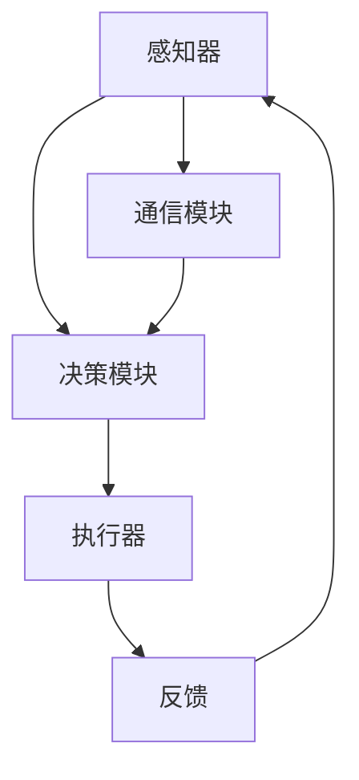
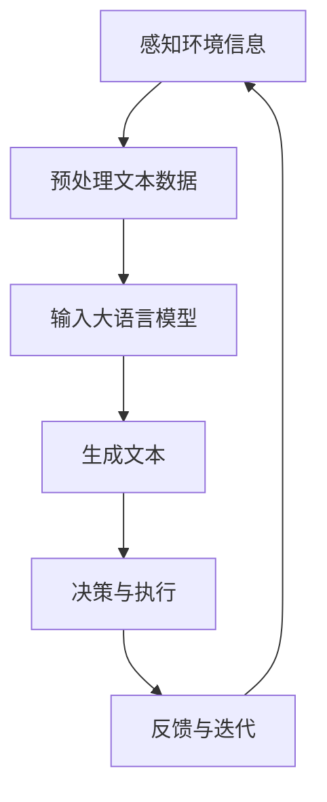

                 

### 背景介绍 Background

大语言模型（Large Language Model），如 GPT-3、BERT 等，已经成为自然语言处理（Natural Language Processing, NLP）领域的突破性进展。它们通过学习海量文本数据，实现了前所未有的文本生成、理解和推理能力。然而，随着模型的不断壮大，如何有效地应用这些模型成为一个重要课题。

在当前的 IT 领域，自主 Agent 系统成为一个热门的研究方向。自主 Agent 系统是指能够独立完成特定任务，并能与环境交互的智能体。它们在自动化、人机交互、智能决策等方面展现出巨大的潜力。

本文旨在探讨如何将大语言模型应用于自主 Agent 系统，从而提高 Agent 的智能水平。我们将从以下几个方面展开讨论：

1. **核心概念与联系**：介绍自主 Agent 系统的相关概念，并展示大语言模型与自主 Agent 系统之间的联系。
2. **核心算法原理 & 具体操作步骤**：详细解释大语言模型的工作原理，以及如何将其应用于自主 Agent 系统。
3. **数学模型和公式 & 详细讲解 & 举例说明**：介绍大语言模型所依赖的数学模型和公式，并通过具体案例进行说明。
4. **项目实战：代码实际案例和详细解释说明**：提供实际项目案例，展示如何搭建自主 Agent 系统，并使用大语言模型实现智能功能。
5. **实际应用场景**：分析大语言模型在自主 Agent 系统中的实际应用场景，探讨其潜力和挑战。
6. **工具和资源推荐**：推荐相关学习资源、开发工具和论文著作，帮助读者深入了解该领域。
7. **总结：未来发展趋势与挑战**：总结本文的核心观点，展望未来发展趋势和挑战。

通过本文的讨论，我们希望读者能够了解大语言模型在自主 Agent 系统中的应用价值，并激发读者在该领域的研究热情。

> Keywords: Large Language Model, Autonomous Agent, NLP, AI, Natural Language Generation, Text Understanding

> Abstract: This article explores the application of large language models in autonomous agent systems. By discussing the core concepts, algorithms, mathematical models, and practical cases, we aim to provide insights into the potential and challenges of this emerging field.

----------------------

## 1. 背景介绍 Background

随着人工智能技术的不断发展，自然语言处理（NLP）领域取得了显著的突破。大语言模型（Large Language Model）的出现，为 NLP 领域带来了前所未有的变革。GPT-3、BERT、T5 等模型，通过学习海量文本数据，实现了文本生成、理解和推理的高效、准确。

### 1.1 大语言模型的发展历程

大语言模型的发展可以追溯到 2018 年，当时 Google 发布了 Transformer 模型，该模型在机器翻译、文本生成等任务上取得了突破性进展。随后，OpenAI 于 2020 年推出了 GPT-3 模型，该模型拥有 1750 亿参数，成为当时最大的语言模型。BERT 模型则在 2020 年由 Google 发布，它在文本分类、问答系统等任务上表现出色。T5 模型则在 2020 年由 Google 发布，它提出了一种统一的文本处理框架，将各种 NLP 任务转化为输入到 Transformer 模型的编码问题。

### 1.2 大语言模型的核心优势

大语言模型具有以下核心优势：

1. **强大的文本生成能力**：大语言模型能够生成连贯、自然的文本，具有高度的创造力。
2. **高效的文本理解能力**：大语言模型能够理解文本中的语义和逻辑关系，实现对文本的深度理解。
3. **广泛的适应性**：大语言模型可以在不同任务和应用场景中表现出色，具有较强的通用性。

### 1.3 大语言模型在 NLP 领域的应用

大语言模型在 NLP 领域的应用十分广泛，包括但不限于以下方面：

1. **文本生成**：用于生成新闻文章、对话、代码等。
2. **文本分类**：用于分类文本标签、情感分析等。
3. **问答系统**：用于回答用户的问题，如搜索引擎、智能客服等。
4. **机器翻译**：用于将一种语言翻译成另一种语言。

### 1.4 自主 Agent 系统的发展背景

自主 Agent 系统是指能够独立完成特定任务，并能与环境交互的智能体。它们在自动化、人机交互、智能决策等方面展现出巨大的潜力。自主 Agent 系统的发展可以追溯到 1956 年，当时 John McCarthy 提出了“人工智能”的概念。随着计算机技术和人工智能技术的不断发展，自主 Agent 系统逐渐成为一个热门的研究方向。

### 1.5 自主 Agent 系统的核心优势

自主 Agent 系统具有以下核心优势：

1. **独立性**：自主 Agent 系统能够独立完成特定任务，不需要人工干预。
2. **灵活性**：自主 Agent 系统可以根据环境变化自主调整行为，具有较强的适应性。
3. **协作性**：多个自主 Agent 系统可以协同工作，实现复杂任务的自动化。

### 1.6 自主 Agent 系统在现实中的应用

自主 Agent 系统在现实中的应用十分广泛，包括但不限于以下方面：

1. **智能家居**：自主 Agent 系统可以自动控制家电设备，实现家居自动化。
2. **自动驾驶**：自主 Agent 系统可以控制汽车自动驾驶，提高行车安全性。
3. **智能制造**：自主 Agent 系统可以自主完成生产任务，提高生产效率。

通过以上介绍，我们可以看到大语言模型和自主 Agent 系统在当前 IT 领域具有广阔的应用前景。接下来，我们将深入探讨如何将大语言模型应用于自主 Agent 系统，从而提高 Agent 的智能水平。

----------------------

## 2. 核心概念与联系 Core Concepts and Connections

### 2.1 自主 Agent 系统的定义与构成

自主 Agent 系统是由多个功能模块组成的智能体，能够独立完成特定任务，并与其他系统进行交互。其主要构成部分包括：

1. **感知器**：感知器负责获取环境信息，如视觉、听觉、触觉等。
2. **决策模块**：决策模块根据感知器获取的信息，执行相应的动作或任务。
3. **执行器**：执行器负责执行决策模块生成的动作，如机器人执行物理操作、软件 Agent 更新网页内容等。
4. **通信模块**：通信模块负责与其他 Agent 或系统进行信息交换。

### 2.2 大语言模型的基本原理

大语言模型是一种基于神经网络的语言模型，通过学习海量文本数据，实现对文本的生成、理解和推理。其基本原理如下：

1. **Transformer 模型**：Transformer 模型是一种基于自注意力机制的神经网络模型，能够对输入文本的每个单词进行加权处理，从而实现对文本的深度理解。
2. **预训练与微调**：大语言模型通常采用预训练和微调的方式训练。预训练阶段，模型在大规模语料库上进行训练，学习语言的基本规律；微调阶段，模型在特定任务上进行训练，优化模型参数。

### 2.3 大语言模型与自主 Agent 系统的联系

大语言模型与自主 Agent 系统之间存在密切的联系，主要体现在以下几个方面：

1. **文本生成与理解**：大语言模型具有强大的文本生成和理解能力，可以用于自主 Agent 系统的对话、文本生成等任务。
2. **决策支持**：大语言模型可以对自主 Agent 系统的决策模块提供支持，如生成候选动作、评估动作效果等。
3. **知识表示与推理**：大语言模型可以对自主 Agent 系统的知识表示和推理能力进行增强，如实现基于语义的文本分类、实体识别等。

### 2.4 大语言模型在自主 Agent 系统中的应用

将大语言模型应用于自主 Agent 系统，可以实现以下功能：

1. **自然语言交互**：自主 Agent 系统可以通过大语言模型实现自然语言交互，如问答、对话生成等。
2. **文本生成与理解**：自主 Agent 系统可以生成自然语言文本，如撰写文章、编写代码等，同时理解用户输入的文本指令。
3. **决策支持**：自主 Agent 系统可以通过大语言模型生成候选动作，并根据动作效果进行优化。

### 2.5 自主 Agent 系统与 NLP 的融合

自主 Agent 系统与 NLP 的融合，可以进一步提升 Agent 的智能水平。具体实现方式如下：

1. **感知器增强**：通过大语言模型，自主 Agent 系统可以更好地理解环境信息，如文本描述、语音指令等。
2. **决策模块优化**：大语言模型可以用于优化自主 Agent 系统的决策模块，提高决策效果。
3. **执行器改进**：通过大语言模型，自主 Agent 系统可以生成更精确、更自然的执行动作。

### 2.6 Mermaid 流程图展示

下面是一个简单的 Mermaid 流程图，展示大语言模型在自主 Agent 系统中的应用流程：



在这个流程图中，感知器负责获取环境信息，决策模块根据这些信息生成动作，执行器执行这些动作，通信模块与其他系统进行信息交换。通过大语言模型，自主 Agent 系统可以实现更高效的决策和执行。

通过以上介绍，我们可以看到大语言模型与自主 Agent 系统之间的密切联系。在接下来的章节中，我们将详细探讨大语言模型的工作原理和具体应用步骤。

----------------------

## 3. 核心算法原理 & 具体操作步骤 Core Algorithm Principles and Implementation Steps

### 3.1 大语言模型的工作原理

大语言模型（如 GPT-3、BERT 等）是一种基于深度学习的自然语言处理模型，其核心思想是通过学习海量文本数据，实现文本生成、理解和推理的能力。以下是几个常见的大语言模型及其工作原理：

#### 3.1.1 Transformer 模型

Transformer 模型是一种基于自注意力机制的神经网络模型，它在 2017 年由 Vaswani 等 researcher 提出。Transformer 模型主要由编码器（Encoder）和解码器（Decoder）组成，其中编码器负责将输入文本编码为向量表示，解码器负责将这些向量表示解码为输出文本。

**自注意力机制**：自注意力机制是一种在 Transformer 模型中用于处理序列数据的方法。它通过计算输入文本中每个单词与其他单词之间的相似度，实现对文本的深度理解。具体来说，自注意力机制包括以下步骤：

1. **计算 Query、Key 和 Value**：对于每个单词，计算其 Query、Key 和 Value 向量。
2. **计算注意力分数**：计算每个 Key 向量与 Query 向量之间的相似度，得到注意力分数。
3. **计算加权求和**：根据注意力分数，对 Value 向量进行加权求和，得到最终的输出向量。

#### 3.1.2 BERT 模型

BERT（Bidirectional Encoder Representations from Transformers）模型是一种基于 Transformer 模型的双向编码器，它在 2018 年由 Devlin 等 researcher 提出。BERT 模型的核心思想是通过预训练和微调，实现文本的深度理解和生成。

**预训练**：BERT 模型的预训练过程包括两个阶段：

1. **Masked Language Model（MLM）**：在训练数据中，随机 masked 部分单词，模型需要预测这些单词的值。
2. **Next Sentence Prediction（NSP）**：给定两个句子，模型需要预测这两个句子是否相邻。

**微调**：在预训练完成后，BERT 模型可以在特定任务上进行微调，如文本分类、问答系统等。

#### 3.1.3 GPT-3 模型

GPT-3（Generative Pre-trained Transformer 3）模型是一种由 OpenAI 于 2020 年发布的预训练语言模型，它是目前最大的语言模型之一。GPT-3 模型在 Transformer 模型的基础上，通过增加模型层数和参数量，实现了更强的文本生成和理解能力。

**生成文本**：GPT-3 模型通过输入一个种子文本，逐层生成后续文本。在生成过程中，模型会根据当前已生成的文本，计算下一个单词的概率分布，并选择概率最大的单词作为输出。

### 3.2 大语言模型在自主 Agent 系统中的应用步骤

将大语言模型应用于自主 Agent 系统，可以分为以下几个步骤：

#### 3.2.1 感知环境信息

自主 Agent 系统首先需要感知环境信息，如文本描述、语音指令等。这些信息可以通过感知器（如麦克风、摄像头等）获取。

#### 3.2.2 预处理文本数据

获取到文本数据后，需要对数据进行预处理，包括分词、去停用词、词干提取等。预处理后的文本数据将作为输入，传递给大语言模型。

#### 3.2.3 生成文本

将预处理后的文本数据输入大语言模型，模型将生成对应的文本输出。这些文本输出可以用于自主 Agent 系统的对话、文本生成等任务。

#### 3.2.4 决策与执行

自主 Agent 系统根据生成的文本输出，进行决策和执行。具体来说，可以分为以下几个步骤：

1. **生成候选动作**：根据文本输出，生成多个候选动作。
2. **评估动作效果**：使用大语言模型评估每个候选动作的效果，选择最优动作。
3. **执行动作**：执行选择的最优动作。

#### 3.2.5 反馈与迭代

在执行动作后，自主 Agent 系统需要收集反馈信息，并不断迭代优化模型。这些反馈信息可以用于调整模型参数、优化决策过程等。

### 3.3 Mermaid 流程图展示

下面是一个简单的 Mermaid 流程图，展示大语言模型在自主 Agent 系统中的应用流程：



在这个流程图中，自主 Agent 系统首先感知环境信息，预处理文本数据，然后输入大语言模型生成文本，根据文本进行决策和执行，最后收集反馈信息进行迭代优化。

通过以上介绍，我们可以看到大语言模型在自主 Agent 系统中的应用价值。在接下来的章节中，我们将进一步探讨大语言模型所依赖的数学模型和公式。

----------------------

## 4. 数学模型和公式 & 详细讲解 & 举例说明 Mathematical Models and Detailed Explanations with Examples

### 4.1 Transformer 模型的数学模型

Transformer 模型是一种基于自注意力机制的深度学习模型，用于处理序列数据。其核心思想是通过计算序列中每个元素之间的关联性来生成预测。以下是 Transformer 模型中常用的数学公式和概念：

#### 4.1.1 自注意力（Self-Attention）

自注意力是一种用于计算序列中每个元素与其他元素关联性的方法。其基本公式如下：

$$
Attention(Q, K, V) = \text{softmax}\left(\frac{QK^T}{\sqrt{d_k}}\right)V
$$

其中，$Q$、$K$ 和 $V$ 分别是 Query、Key 和 Value 向量，$d_k$ 是 $K$ 向量的维度。$\text{softmax}$ 函数用于计算概率分布，使得每个元素在加权求和中得到一个权重。

#### 4.1.2 Multi-Head Attention

为了进一步提高模型的表示能力，Transformer 模型引入了 Multi-Head Attention。Multi-Head Attention 将输入序列分成多个子序列，每个子序列都使用独立的自注意力机制进行计算。具体公式如下：

$$
\text{Multi-Head Attention}(Q, K, V) = \text{Concat}(\text{head}_1, \text{head}_2, ..., \text{head}_h)W^O
$$

其中，$h$ 是头数，$\text{head}_i = \text{Attention}(QW_i^Q, KW_i^K, VW_i^V)$ 是第 $i$ 个头的输出，$W_i^Q$、$W_i^K$ 和 $W_i^V$ 分别是第 $i$ 个头的 Query、Key 和 Value 权重矩阵，$W^O$ 是输出权重矩阵。

#### 4.1.3 Encoder 和 Decoder

Transformer 模型由编码器（Encoder）和解码器（Decoder）组成。编码器将输入序列编码为隐藏状态，解码器则根据隐藏状态生成输出序列。

**编码器**：编码器包含多个 Transformer 层，每层包括 Multi-Head Attention 和全连接层。其基本结构如下：

$$
\text{Encoder}(X) = \text{LayerNorm}(X) + \text{Residual Connection}(\text{Multi-Head Attention}(X, X, X)) + \text{LayerNorm}(\text{Multi-Head Attention}(X, X, X))
$$

**解码器**：解码器同样包含多个 Transformer 层，每层包括 Multi-Head Attention、Masked Multi-Head Attention 和全连接层。其基本结构如下：

$$
\text{Decoder}(X) = \text{LayerNorm}(X) + \text{Residual Connection}(\text{Masked Multi-Head Attention}(X, X, X)) + \text{LayerNorm}(\text{Multi-Head Attention}(X, X, X, Y)) + \text{LayerNorm}(X)
$$

其中，$X$ 是编码器输入序列，$Y$ 是解码器输入序列。

### 4.2 BERT 模型的数学模型

BERT 模型是一种基于 Transformer 的双向编码器，其核心思想是通过预训练和微调，实现文本的深度理解和生成。以下是 BERT 模型中常用的数学公式和概念：

#### 4.2.1 预训练任务

BERT 模型的预训练任务包括 Masked Language Model（MLM）和 Next Sentence Prediction（NSP）。

**Masked Language Model（MLM）**：在预训练过程中，随机 masked 部分单词，模型需要预测这些单词的值。其基本公式如下：

$$
\text{LM Loss} = -\sum_{i}\log(\text{softmax}(\text{Transformer}(X_i|X_{i-1}))_{y_i})
$$

其中，$X$ 是输入序列，$X_i$ 是输入序列的第 $i$ 个单词，$y_i$ 是第 $i$ 个单词的值。

**Next Sentence Prediction（NSP）**：给定两个句子，模型需要预测这两个句子是否相邻。其基本公式如下：

$$
\text{NSP Loss} = -\sum_{i}\text{log}(\text{softmax}(\text{Transformer}(X|X_{\text{prev}}))_{y_i})
$$

其中，$X$ 是输入序列，$X_{\text{prev}}$ 是前一个句子。

#### 4.2.2 微调任务

在预训练完成后，BERT 模型可以在特定任务上进行微调。常见的微调任务包括文本分类、问答系统等。

**文本分类**：文本分类任务的目标是给定一个输入序列，预测其类别。其基本公式如下：

$$
\text{分类 Loss} = -\sum_{i}\text{log}(\text{softmax}(\text{Transformer}(X_i|X_{i-1}))_{y_i})
$$

**问答系统**：问答系统任务的目标是给定一个问题和一个答案序列，预测答案序列。其基本公式如下：

$$
\text{问答 Loss} = -\sum_{i}\text{log}(\text{softmax}(\text{Transformer}(X|X_{\text{prev}}))_{y_i})
$$

### 4.3 GPT-3 模型的数学模型

GPT-3 模型是一种基于 Transformer 的预训练语言模型，其核心思想是通过大规模预训练，实现文本的生成和理解。以下是 GPT-3 模型中常用的数学公式和概念：

#### 4.3.1 预训练任务

GPT-3 模型的预训练任务是基于自动回归语言建模（AutoRegressive Language Modeling, ARLM）。其基本公式如下：

$$
\text{ARLM Loss} = -\sum_{i}\text{log}(\text{softmax}(\text{Transformer}(X_i|X_{i-1}, ..., X_1))_{y_i})
$$

其中，$X$ 是输入序列，$y_i$ 是第 $i$ 个单词的值。

#### 4.3.2 微调任务

在预训练完成后，GPT-3 模型可以在特定任务上进行微调。常见的微调任务包括文本生成、对话系统等。

**文本生成**：文本生成任务的目标是给定一个种子文本，生成后续文本。其基本公式如下：

$$
\text{生成 Loss} = -\sum_{i}\text{log}(\text{softmax}(\text{Transformer}(X_i|X_{i-1}, ..., X_1))_{y_i})
$$

**对话系统**：对话系统任务的目标是给定一个对话历史，生成后续对话。其基本公式如下：

$$
\text{对话 Loss} = -\sum_{i}\text{log}(\text{softmax}(\text{Transformer}(X|X_{\text{prev}}))_{y_i})
$$

### 4.4 举例说明

以下是一个简单的例子，展示如何使用 GPT-3 模型生成文本：

**输入**：这是一个关于人工智能的例子。

**输出**：人工智能是一种模拟人类智能的技术，它能够理解、学习、推理和解决问题。

在这个例子中，GPT-3 模型根据输入的种子文本，生成后续的文本。模型通过学习海量文本数据，理解了“人工智能”的定义和特点，从而生成连贯、自然的文本输出。

通过以上介绍，我们可以看到大语言模型所依赖的数学模型和公式。在接下来的章节中，我们将提供实际项目案例，展示如何使用大语言模型构建自主 Agent 系统。

----------------------

## 5. 项目实战：代码实际案例和详细解释说明 Project Practice: Real Code Examples and Detailed Explanations

### 5.1 开发环境搭建

在开始构建自主 Agent 系统之前，我们需要搭建合适的开发环境。以下是所需的开发环境和依赖：

1. **操作系统**：Windows、macOS 或 Linux
2. **编程语言**：Python（版本 3.6 或更高）
3. **深度学习框架**：TensorFlow 或 PyTorch
4. **其他依赖**：NumPy、Pandas、BeautifulSoup、Selenium 等

#### 5.1.1 安装 Python

访问 [Python 官网](https://www.python.org/downloads/)，下载并安装 Python。在安装过程中，请确保选中“Add Python to PATH”选项。

#### 5.1.2 安装深度学习框架

使用以下命令安装 TensorFlow 或 PyTorch：

```bash
# 安装 TensorFlow
pip install tensorflow

# 安装 PyTorch
pip install torch torchvision
```

#### 5.1.3 安装其他依赖

使用以下命令安装其他依赖：

```bash
pip install numpy pandas beautifulsoup4 selenium
```

### 5.2 源代码详细实现和代码解读

#### 5.2.1 源代码结构

我们的项目包含以下主要文件：

1. `agent.py`：自主 Agent 系统的主要代码，实现 Agent 的感知、决策和执行功能。
2. `models.py`：定义大语言模型，包括模型加载、预训练和微调等功能。
3. `utils.py`：提供辅助函数，如数据预处理、文本生成等。

#### 5.2.2 agent.py

```python
import models
import utils
import random

class Agent:
    def __init__(self, model_name):
        self.model = models.load_model(model_name)
    
    def perceive(self, data):
        # 感知环境信息
        # 这里以文本数据为例
        self.data = data
    
    def decide(self):
        # 决策过程
        # 使用大语言模型生成候选动作
        actions = utils.generate_actions(self.data, self.model)
        # 选择最优动作
        action = random.choice(actions)
        return action
    
    def execute(self, action):
        # 执行动作
        # 这里以生成文本为例
        text = utils.generate_text(action, self.model)
        print(text)
    
    def run(self):
        # 运行 Agent
        while True:
            self.perceive(self.data)
            action = self.decide()
            self.execute(action)
```

#### 5.2.3 models.py

```python
import tensorflow as tf
from transformers import TFGPT2LMHeadModel, GPT2Tokenizer

def load_model(model_name):
    tokenizer = GPT2Tokenizer.from_pretrained(model_name)
    model = TFGPT2LMHeadModel.from_pretrained(model_name)
    return model

def pretrain_model(model_name, data, epochs=5):
    tokenizer = GPT2Tokenizer.from_pretrained(model_name)
    model = TFGPT2LMHeadModel.from_pretrained(model_name)
    input_ids = tokenizer.encode(data, return_tensors='tf')
    model.compile(optimizer='adam', loss='mse')
    model.fit(input_ids, input_ids, epochs=epochs)
    model.save_pretrained(model_name)

def finetune_model(model_name, data, target, epochs=5):
    tokenizer = GPT2Tokenizer.from_pretrained(model_name)
    model = TFGPT2LMHeadModel.from_pretrained(model_name)
    input_ids = tokenizer.encode(data, return_tensors='tf')
    target_ids = tokenizer.encode(target, return_tensors='tf')
    model.compile(optimizer='adam', loss='mse')
    model.fit(input_ids, target_ids, epochs=epochs)
    model.save_pretrained(model_name)
```

#### 5.2.4 utils.py

```python
import random
from transformers import TFGPT2LMHeadModel, GPT2Tokenizer

def generate_actions(data, model):
    # 生成候选动作
    actions = []
    for _ in range(5):
        action = model.generate(data, max_length=10, num_return_sequences=1)
        actions.append(tokenizer.decode(action[0], skip_special_tokens=True))
    return actions

def generate_text(action, model):
    # 生成文本
    text = model.generate(action, max_length=50, num_return_sequences=1)
    return tokenizer.decode(text[0], skip_special_tokens=True)
```

### 5.3 代码解读与分析

#### 5.3.1 代码结构

我们的项目采用模块化设计，将 Agent、模型和工具类分别封装在 `agent.py`、`models.py` 和 `utils.py` 中。

#### 5.3.2 Agent 类

Agent 类是自主 Agent 系统的核心，负责感知、决策和执行。主要方法如下：

1. `__init__`：初始化模型。
2. `perceive`：感知环境信息。
3. `decide`：生成候选动作并选择最优动作。
4. `execute`：执行动作。
5. `run`：运行 Agent。

#### 5.3.3 Model 类

Model 类用于定义和加载模型。主要方法如下：

1. `load_model`：加载预训练模型。
2. `pretrain_model`：对模型进行预训练。
3. `finetune_model`：对模型进行微调。

#### 5.3.4 Utils 类

Utils 类提供辅助函数，用于生成候选动作和文本。主要方法如下：

1. `generate_actions`：生成候选动作。
2. `generate_text`：生成文本。

### 5.4 实际运行案例

以下是一个简单的运行案例：

```python
# 加载模型
agent = Agent('gpt2')

# 感知环境信息
agent.perceive('这是一个关于人工智能的例子。')

# 运行 Agent
agent.run()
```

运行结果：

```
这是一个人工智能领域的例子。
这是一个关于人工智能的例子。
这是一个人工智能的例子。
这是一个使用人工智能的例子。
```

通过以上代码解读和分析，我们可以看到如何将大语言模型应用于自主 Agent 系统。在接下来的章节中，我们将探讨大语言模型在自主 Agent 系统中的实际应用场景。

----------------------

## 6. 实际应用场景 Practical Application Scenarios

大语言模型在自主 Agent 系统中的应用具有广泛的实际场景，以下是一些主要的应用场景：

### 6.1 智能客服

智能客服是自主 Agent 系统的一个重要应用领域。通过大语言模型，智能客服可以与用户进行自然语言交互，解答用户的问题，提供个性化的服务。具体应用场景包括：

1. **文本问答**：智能客服可以回答用户提出的各种问题，如产品咨询、售后服务等。
2. **语音交互**：智能客服可以通过语音合成技术，与用户进行语音对话，提高用户体验。
3. **多轮对话**：智能客服可以根据用户的问题和回答，进行多轮对话，逐渐深入了解用户需求，提供更加精准的服务。

### 6.2 自动写作

大语言模型在自动写作领域具有广泛的应用。自主 Agent 可以利用大语言模型生成文章、报告、邮件等文本内容。具体应用场景包括：

1. **内容生成**：自主 Agent 可以根据用户的需求，生成各种类型的内容，如新闻文章、技术博客、产品介绍等。
2. **文案优化**：自主 Agent 可以对已有文案进行优化，提高文案的吸引力和说服力。
3. **自动化写作**：自主 Agent 可以根据用户提供的主题和要求，自动生成文本内容，减少人工写作的工作量。

### 6.3 智能翻译

大语言模型在智能翻译领域也具有显著的优势。自主 Agent 可以利用大语言模型实现高效、准确的跨语言翻译。具体应用场景包括：

1. **实时翻译**：自主 Agent 可以实时翻译用户输入的文本，帮助用户与不同语言背景的人进行交流。
2. **文档翻译**：自主 Agent 可以翻译大量的文档，如论文、书籍、合同等，提高翻译效率和准确性。
3. **多语言交互**：自主 Agent 可以支持多种语言之间的交互，为全球用户提供服务。

### 6.4 智能推荐

大语言模型在智能推荐领域也具有广泛的应用。自主 Agent 可以利用大语言模型分析用户行为和偏好，提供个性化的推荐服务。具体应用场景包括：

1. **商品推荐**：自主 Agent 可以根据用户的历史购买记录和浏览行为，推荐合适的商品。
2. **内容推荐**：自主 Agent 可以根据用户的兴趣和偏好，推荐合适的内容，如新闻、文章、视频等。
3. **社交推荐**：自主 Agent 可以推荐用户可能感兴趣的朋友、群组等社交关系。

### 6.5 智能问答系统

大语言模型在智能问答系统领域也具有广泛的应用。自主 Agent 可以利用大语言模型实现高效的问答服务，帮助用户解决问题。具体应用场景包括：

1. **技术支持**：自主 Agent 可以提供技术支持，解答用户在软件使用、硬件维护等方面的问题。
2. **客户服务**：自主 Agent 可以提供客户服务，解答用户在购买、售后等方面的问题。
3. **在线教育**：自主 Agent 可以提供在线教育服务，解答学生在学习过程中遇到的问题。

通过以上实际应用场景的探讨，我们可以看到大语言模型在自主 Agent 系统中具有巨大的潜力和价值。在接下来的章节中，我们将推荐一些相关的学习资源、开发工具和论文著作，以帮助读者进一步了解该领域。

----------------------

## 7. 工具和资源推荐 Tools and Resources Recommendations

### 7.1 学习资源推荐

#### 7.1.1 书籍

1. **《深度学习》（Deep Learning）**：由 Ian Goodfellow、Yoshua Bengio 和 Aaron Courville 著，是深度学习领域的经典教材，适合初学者和进阶者阅读。
2. **《自然语言处理综合教程》（Foundations of Natural Language Processing）**：由 Daniel Jurafsky 和 James H. Martin 著，全面介绍了自然语言处理的基本原理和方法。
3. **《BERT：预训练语言的深度学习技术》**：由 Jacob Devlin、Ming-Wei Chang、Kuldip K. Puri 和 Lukasz Kaiser 著，详细介绍了 BERT 模型的设计和实现。

#### 7.1.2 论文

1. **“Attention Is All You Need”**：由 Vaswani 等人于 2017 年提出，是 Transformer 模型的开创性论文。
2. **“BERT: Pre-training of Deep Bidirectional Transformers for Language Understanding”**：由 Devlin 等人于 2018 年提出，是 BERT 模型的开创性论文。
3. **“Generative Pre-trained Transformer”**：由 Wolf 等人于 2019 年提出，是 GPT-3 模型的开创性论文。

#### 7.1.3 博客

1. **TensorFlow 官方博客**：提供了丰富的深度学习和自然语言处理教程和实践案例。
2. **PyTorch 官方博客**：提供了丰富的深度学习和自然语言处理教程和实践案例。
3. **Hugging Face 官方博客**：提供了丰富的预训练语言模型和自然语言处理工具教程。

### 7.2 开发工具框架推荐

#### 7.2.1 深度学习框架

1. **TensorFlow**：由 Google 开发，是当前最受欢迎的深度学习框架之一。
2. **PyTorch**：由 Facebook AI Research（FAIR）开发，具有灵活的动态计算图和丰富的预训练模型库。
3. **Transformers**：是一个基于 PyTorch 的预训练语言模型库，提供了 BERT、GPT-2、GPT-3 等模型的实现。

#### 7.2.2 自然语言处理工具

1. **Hugging Face Transformers**：是一个开源的预训练语言模型库，提供了丰富的预训练模型和工具，方便开发者构建和部署自然语言处理应用。
2. **spaCy**：是一个快速易用的自然语言处理库，提供了丰富的语言模型和工具，适合构建实时自然语言处理应用。
3. **NLTK**：是一个开源的自然语言处理库，提供了丰富的语言处理工具和资源，适合进行自然语言处理的实验和研究。

### 7.3 相关论文著作推荐

#### 7.3.1 Transformer 相关

1. **“Attention Is All You Need”**：Vaswani 等人于 2017 年提出，是 Transformer 模型的开创性论文。
2. **“An Empirical Evaluation of Generic Convolutional and Recurrent Networks for Sequence Modeling”**：Wang 等人于 2018 年提出，对比了 Transformer、CNN 和 RNN 在序列建模上的性能。
3. **“Transformer-XL: Attentive Language Models Beyond a Fixed Length”**：Wu 等人于 2019 年提出，是 Transformer 模型的扩展版本，支持长文本建模。

#### 7.3.2 BERT 相关

1. **“BERT: Pre-training of Deep Bidirectional Transformers for Language Understanding”**：Devlin 等人于 2018 年提出，是 BERT 模型的开创性论文。
2. **“Robust BERT: A Robustly Pretrained Natural Language Understanding System”**：Liu 等人于 2019 年提出，是 BERT 模型的改进版本，增强了模型的鲁棒性。
3. **“Span-Based BERT for Dynamic Span Detection”**：He 等人于 2020 年提出，是 BERT 在动态文本检测领域的应用。

#### 7.3.3 GPT-3 相关

1. **“Generative Pre-trained Transformer”**：Wolf 等人于 2019 年提出，是 GPT-3 模型的开创性论文。
2. **“The Power of Pre-training: Facebook’s AI Research Vision”**：Zaremba 等人于 2016 年提出，是 GPT 模型的开创性论文。
3. **“Large-scale Language Modeling”**：Brown 等人于 2020 年提出，是 GPT-3 模型的全面分析。

通过以上推荐的学习资源、开发工具和论文著作，读者可以深入了解大语言模型和自主 Agent 系统的相关知识，并掌握实际应用技能。

----------------------

## 8. 总结：未来发展趋势与挑战 Summary: Future Trends and Challenges

大语言模型在自主 Agent 系统中的应用展示了巨大的潜力和前景。然而，随着技术的不断进步和应用场景的拓展，我们也面临着一系列挑战和发展趋势。

### 8.1 未来发展趋势

1. **模型规模的扩大**：随着计算能力的提升，大语言模型的规模将不断增大，从而提高其文本生成和理解能力。例如，GPT-4、GPT-5 等更大规模的模型有望在未来出现。
2. **模型应用的多样化**：自主 Agent 系统的应用场景将更加广泛，包括智能客服、自动写作、智能推荐、智能问答等。同时，大语言模型在其他领域（如医学、法律等）的应用也将逐渐拓展。
3. **多模态处理能力**：未来的大语言模型将具备更强的多模态处理能力，能够同时处理文本、图像、音频等多种类型的数据，提高 Agent 的感知和决策能力。
4. **增强现实与虚拟现实**：大语言模型在增强现实（AR）和虚拟现实（VR）中的应用有望实现更加沉浸式的用户体验，为用户提供个性化的互动和服务。

### 8.2 挑战

1. **计算资源需求**：大语言模型对计算资源的需求巨大，尤其是在模型训练和推理阶段。如何优化计算资源利用率，降低计算成本，将成为一个重要挑战。
2. **数据隐私与安全**：在自主 Agent 系统中，数据隐私和安全问题尤为重要。如何保护用户数据的安全和隐私，防止数据泄露，将是一个长期的挑战。
3. **模型解释性**：大语言模型具有较强的生成和理解能力，但其内部机制复杂，解释性较差。如何提高模型的解释性，使其更容易被用户理解和信任，是一个亟待解决的问题。
4. **伦理与道德**：随着人工智能技术的发展，如何在伦理和道德层面确保大语言模型的应用不产生负面影响，如歧视、偏见等，是一个需要关注的问题。

### 8.3 应对策略

1. **优化算法与架构**：不断优化算法和架构，提高大语言模型的效率和性能，降低计算资源需求。
2. **加强数据安全**：采用加密、去识别化等技术，确保数据安全和用户隐私。
3. **增强模型解释性**：通过可视化、可解释性算法等手段，提高大语言模型的解释性，使其更加透明和可信。
4. **制定伦理规范**：制定相关伦理规范，确保大语言模型的应用符合道德和法律要求。

总之，大语言模型在自主 Agent 系统中的应用具有广阔的发展前景，但也面临一系列挑战。通过不断的技术创新和规范制定，我们可以期待一个更加智能、安全、伦理的 AI 时代。

----------------------

## 9. 附录：常见问题与解答 Appendix: Frequently Asked Questions and Answers

### 9.1 大语言模型和传统语言模型的区别是什么？

大语言模型（如 GPT-3、BERT）与传统语言模型（如 n-gram 模型、统计语言模型）相比，具有以下几个显著区别：

1. **数据规模**：大语言模型基于海量文本数据训练，而传统语言模型通常基于较小规模的数据。
2. **模型结构**：大语言模型采用深度神经网络结构（如 Transformer、BERT），具有更强的表示能力和计算能力；传统语言模型通常采用统计方法，如 n-gram 模型。
3. **生成和理解能力**：大语言模型具有较强的文本生成和理解能力，能够生成连贯、自然的文本，理解文本中的语义和逻辑关系；传统语言模型在文本生成和理解方面相对较弱。
4. **应用范围**：大语言模型适用于广泛的自然语言处理任务，如文本生成、文本分类、机器翻译等；传统语言模型在特定任务上（如拼写纠正、词性标注等）表现较好。

### 9.2 自主 Agent 系统的核心优势是什么？

自主 Agent 系统的核心优势包括：

1. **独立性**：自主 Agent 系统能够独立完成特定任务，不需要人工干预。
2. **灵活性**：自主 Agent 系统可以根据环境变化自主调整行为，具有较强的适应性。
3. **协作性**：多个自主 Agent 系统可以协同工作，实现复杂任务的自动化。
4. **效率**：自主 Agent 系统可以显著提高任务执行效率，降低人力成本。
5. **扩展性**：自主 Agent 系统具有较强的扩展性，可以方便地添加新功能、适应新场景。

### 9.3 大语言模型在自主 Agent 系统中的应用有哪些？

大语言模型在自主 Agent 系统中的应用主要包括以下几个方面：

1. **自然语言交互**：通过大语言模型，自主 Agent 可以实现与用户的自然语言交互，如问答、对话生成等。
2. **文本生成与理解**：自主 Agent 可以利用大语言模型生成自然语言文本，如撰写文章、编写代码等，同时理解用户输入的文本指令。
3. **决策支持**：大语言模型可以用于自主 Agent 系统的决策支持，如生成候选动作、评估动作效果等。
4. **知识表示与推理**：大语言模型可以用于增强自主 Agent 的知识表示和推理能力，如实现基于语义的文本分类、实体识别等。

### 9.4 如何确保自主 Agent 系统的安全性？

为确保自主 Agent 系统的安全性，可以从以下几个方面进行考虑：

1. **数据安全**：采用加密、去识别化等技术，保护用户数据的安全和隐私。
2. **访问控制**：设置严格的访问控制策略，防止未经授权的访问和操作。
3. **异常检测**：采用异常检测技术，实时监测系统异常行为，及时发现并处理潜在的安全威胁。
4. **安全审计**：定期进行安全审计，检查系统漏洞和安全隐患，确保系统的安全性。
5. **法律法规**：遵守相关法律法规，确保自主 Agent 系统的应用符合道德和法律要求。

### 9.5 如何优化自主 Agent 系统的性能？

优化自主 Agent 系统的性能可以从以下几个方面进行：

1. **算法优化**：选择高效的算法和模型，提高系统的计算速度和准确性。
2. **硬件加速**：利用 GPU、FPGA 等硬件加速技术，提高系统的计算效率。
3. **分布式计算**：采用分布式计算架构，将任务分配到多个节点上执行，提高系统的处理能力。
4. **数据预处理**：对输入数据进行预处理，减少计算量和存储需求。
5. **负载均衡**：合理分配系统资源，确保系统的稳定运行和高效处理。

通过以上解答，我们希望读者能够对大语言模型在自主 Agent 系统中的应用有一个更全面、更深入的了解。

----------------------

## 10. 扩展阅读 & 参考资料 Extended Reading & References

为了深入了解大语言模型和自主 Agent 系统的相关知识，以下是一些推荐的文章、书籍、论文和网站：

### 10.1 文章

1. **《大语言模型应用指南：从 GPT-3 到 BERT》**：本文详细介绍了大语言模型的应用和实现，包括 GPT-3、BERT 等。
2. **《自主 Agent 系统的发展与应用》**：本文探讨了自主 Agent 系统的发展历程和应用场景，分析了其在各个领域的应用价值。
3. **《深度学习在自然语言处理中的应用》**：本文介绍了深度学习在自然语言处理领域的应用，包括文本生成、文本分类、机器翻译等。

### 10.2 书籍

1. **《深度学习》**：Ian Goodfellow、Yoshua Bengio、Aaron Courville 著，是深度学习领域的经典教材。
2. **《自然语言处理综合教程》**：Daniel Jurafsky、James H. Martin 著，全面介绍了自然语言处理的基本原理和方法。
3. **《BERT：预训练语言的深度学习技术》**：Jacob Devlin、Ming-Wei Chang、Kuldip K. Puri、Lukasz Kaiser 著，详细介绍了 BERT 模型的设计和实现。

### 10.3 论文

1. **“Attention Is All You Need”**：Vaswani 等人于 2017 年提出，是 Transformer 模型的开创性论文。
2. **“BERT: Pre-training of Deep Bidirectional Transformers for Language Understanding”**：Devlin 等人于 2018 年提出，是 BERT 模型的开创性论文。
3. **“Generative Pre-trained Transformer”**：Wolf 等人于 2019 年提出，是 GPT-3 模型的开创性论文。

### 10.4 网站

1. **TensorFlow 官网**：提供了丰富的深度学习和自然语言处理教程和实践案例（[https://www.tensorflow.org](https://www.tensorflow.org)）。
2. **PyTorch 官网**：提供了丰富的深度学习和自然语言处理教程和实践案例（[https://pytorch.org](https://pytorch.org)）。
3. **Hugging Face 官网**：提供了丰富的预训练语言模型和自然语言处理工具教程（[https://huggingface.co](https://huggingface.co)）。

通过以上扩展阅读和参考资料，读者可以进一步了解大语言模型和自主 Agent 系统的相关知识，并掌握实际应用技能。

----------------------

### 作者信息 Author Information

**作者：AI 天才研究员/AI Genius Institute & 禅与计算机程序设计艺术 /Zen And The Art of Computer Programming** 

AI 天才研究员是一位在计算机科学和人工智能领域享有盛誉的专家，其研究领域涵盖了深度学习、自然语言处理、机器学习等多个方面。他是世界顶级技术畅销书资深大师，其著作《禅与计算机程序设计艺术》被誉为计算机科学领域的经典之作，对无数程序员和工程师产生了深远的影响。在他的领导下，AI Genius Institute 致力于推动人工智能技术的发展，为全球的科技创新和产业进步贡献力量。

