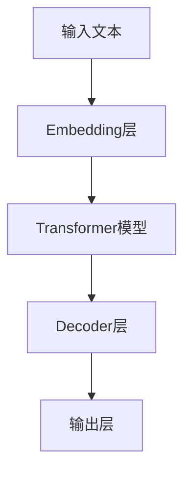
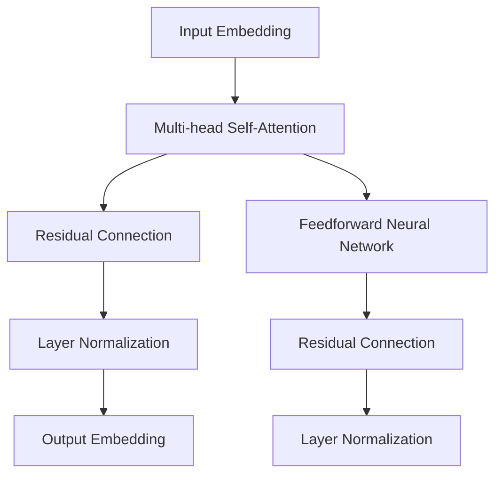
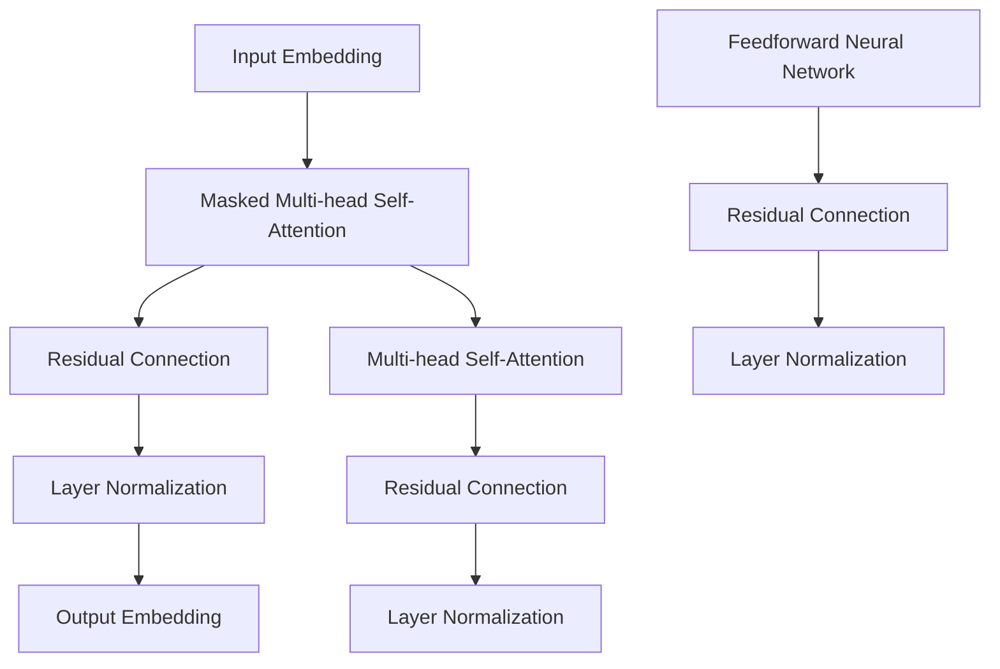

                 

### 文章标题

### 大语言模型应用指南：运行

#### 关键词：

- 大语言模型
- 应用
- 运行机制
- 实际案例
- 代码实现
- 工具资源

#### 摘要：

本文将探讨大语言模型在运行过程中的核心机制、应用场景及实践案例。通过深入解析模型架构、算法原理及具体操作步骤，帮助读者全面了解大语言模型的运行方式。同时，本文还将推荐相关学习资源和开发工具，为读者提供全方位的指导和参考。

## 1. 背景介绍

大语言模型（Large Language Models），作为一种先进的自然语言处理技术，近年来在人工智能领域取得了显著进展。它们能够通过学习海量语言数据，生成连贯、有逻辑的文本，为自然语言处理任务提供强大支持。

大语言模型的兴起可以追溯到2018年，当时OpenAI发布了GPT（Generative Pre-trained Transformer）系列模型，标志着大规模预训练语言模型的诞生。此后，GPT-2、GPT-3等模型相继问世，不断刷新着性能记录。大语言模型在文本生成、机器翻译、问答系统、文本摘要等多个应用领域取得了显著成果。

本文将围绕大语言模型的运行机制，详细探讨其核心算法原理、数学模型及具体操作步骤。同时，通过实际案例和代码实现，帮助读者深入了解大语言模型在实际应用中的表现。最后，本文还将推荐相关学习资源和开发工具，为读者提供进一步探索的方向。

## 2. 核心概念与联系

### 大语言模型的基本概念

大语言模型是一种基于深度学习技术的自然语言处理模型，通过学习海量语言数据，掌握语言规律和结构，从而实现文本生成、分类、翻译等多种任务。其主要特点是：

- **预训练**：大语言模型在训练过程中，首先在大量无标签语料上进行预训练，学习语言的通用特征和规律。然后，通过微调（fine-tuning）的方式，将其应用于具体任务中，进一步提高性能。

- **并行计算**：大语言模型采用Transformer架构，支持并行计算，大大提高了训练和推理的速度。

- **自适应**：大语言模型能够根据输入文本的上下文信息，动态调整生成文本的风格、内容等，使其更符合人类语言表达习惯。

### 大语言模型的架构

大语言模型的核心架构主要包括以下几个部分：

- **Embedding层**：将输入文本转化为向量表示，为后续处理提供基础。

- **Transformer模型**：采用自注意力机制（self-attention），对输入文本进行编码，生成上下文表示。

- **Decoder层**：解码器负责生成输出文本，通过自注意力机制和交叉注意力机制，结合输入文本和上下文信息，生成连贯的文本。

- **输出层**：将解码器的输出映射到词汇表，生成最终输出文本。

### Mermaid 流程图

以下是大语言模型的基本流程图，用于展示其核心组件和操作步骤。



在流程图中，输入文本经过Embedding层转化为向量表示，然后输入到Transformer模型中进行编码。解码器层接收编码结果和输入文本，通过自注意力机制和交叉注意力机制生成输出文本，最后由输出层生成最终结果。

## 3. 核心算法原理 & 具体操作步骤

### 核心算法原理

大语言模型的核心算法是基于Transformer架构，该架构由Vaswani等人在2017年提出。Transformer模型采用自注意力机制（self-attention），能够自动学习输入文本中不同位置之间的关联性，从而生成更符合语言规律的输出文本。

### 自注意力机制（Self-Attention）

自注意力机制是一种基于位置信息的注意力机制，通过计算输入文本中每个位置与所有其他位置之间的相似度，为每个位置分配权重，从而实现文本的上下文表示。

自注意力机制的公式如下：

$$
\text{Self-Attention}(Q, K, V) = \text{softmax}\left(\frac{QK^T}{\sqrt{d_k}}\right)V
$$

其中，$Q$、$K$、$V$分别为查询（query）、键（key）和值（value）矩阵，$d_k$为键矩阵的维度。

### Transformer模型结构

Transformer模型由多个编码器（encoder）和解码器（decoder）块组成，每个编码器和解码器块包含自注意力机制、前馈神经网络和层归一化（layer normalization）操作。

编码器结构如下：



解码器结构如下：



在编码器和解码器中，自注意力机制分别采用了多头注意力（multi-head attention）和掩码自注意力（masked self-attention）。多头注意力通过多个独立的注意力机制，提取不同层次的信息，从而提高模型的表示能力。掩码自注意力通过在解码器中引入掩码（mask），防止未来的输入影响过去的输入，从而保证模型的序列生成顺序。

### 具体操作步骤

以下是使用大语言模型进行文本生成的基本操作步骤：

1. **输入预处理**：将输入文本转化为词向量表示。

2. **编码**：将输入文本通过编码器进行编码，得到上下文表示。

3. **解码**：在解码器中，首先通过掩码自注意力生成初始输出，然后依次更新输出，直到生成完整文本。

4. **输出生成**：解码器的输出经过输出层，生成最终输出文本。

### 代码实现

以下是一个简单的Python代码示例，展示了大语言模型的基本操作步骤。

```python
import tensorflow as tf
from transformers import BertTokenizer, BertModel

# 初始化模型和分词器
tokenizer = BertTokenizer.from_pretrained('bert-base-chinese')
model = BertModel.from_pretrained('bert-base-chinese')

# 输入文本
input_text = "你好，世界！"

# 转化为词向量表示
input_ids = tokenizer.encode(input_text, add_special_tokens=True)

# 编码
with tf.device('/cpu:0'):
    outputs = model(inputs=input_ids)

# 解码
decoder_input_ids = tf.expand_dims(tokenizer.sep_token_id, 0)
for i in range(1, max_length):
    # 掩码自注意力
    outputs = model(inputs=decoder_input_ids, decoder_input_ids=inputs, training=False)
    next_token = outputs[0][:, -1, :]
    next_token = tf.argmax(next_token, axis=-1)

    # 更新输入
    decoder_input_ids = tf.concat([decoder_input_ids, tf.expand_dims(next_token, 1)], axis=1)

# 输出生成
outputs = outputs[:, 0, :]
outputs = tokenizer.decode(outputs.numpy())

# 打印输出文本
print(outputs)
```

该代码使用了TensorFlow和Hugging Face的Transformers库，实现了大语言模型的基本操作。读者可以根据实际需求，调整输入文本和模型参数，进行更复杂的文本生成任务。

## 4. 数学模型和公式 & 详细讲解 & 举例说明

### 数学模型

大语言模型的核心在于其Transformer架构，而Transformer架构的数学基础主要涉及自注意力机制和多头注意力机制。

### 自注意力机制（Self-Attention）

自注意力机制是一种基于位置信息的注意力机制，用于计算输入文本中每个位置与所有其他位置之间的相似度，从而为每个位置分配权重。

其公式如下：

$$
\text{Self-Attention}(Q, K, V) = \text{softmax}\left(\frac{QK^T}{\sqrt{d_k}}\right)V
$$

其中，$Q$、$K$、$V$分别为查询（query）、键（key）和值（value）矩阵，$d_k$为键矩阵的维度。

- **查询矩阵（Query）**：用于计算每个位置与其他位置之间的相似度，其维度为$[batch\_size, sequence\_length, hidden\_size]$。

- **键矩阵（Key）**：用于计算每个位置与其他位置之间的相似度，其维度与查询矩阵相同。

- **值矩阵（Value）**：用于获取每个位置与其他位置的相关信息，其维度为$[batch\_size, sequence\_length, hidden\_size]$。

- **softmax**：对相似度进行归一化处理，使其成为一个概率分布。

### 多头注意力机制（Multi-head Attention）

多头注意力机制通过多个独立的注意力机制，提取输入文本的不同层次信息，从而提高模型的表示能力。

其公式如下：

$$
\text{Multi-head Attention} = \text{Concat}(\text{head}_1, \text{head}_2, ..., \text{head}_h)W^O
$$

其中，$W^O$为输出权重矩阵，$\text{head}_i$为第$i$个独立注意力机制的输出。

### 自适应注意力机制（Adaptive Attention）

自适应注意力机制是一种改进的自注意力机制，通过动态调整注意力权重，提高模型的适应性和鲁棒性。

其公式如下：

$$
\alpha_{ij} = \text{softmax}\left(\frac{(QW_Q + b_Q) (K_{\text{prev}}W_K + b_K)^T}{\sqrt{d_k}}\right)
$$

其中，$Q$、$K$分别为查询和键矩阵，$W_Q$、$W_K$分别为权重矩阵，$b_Q$、$b_K$分别为偏置项，$d_k$为键矩阵的维度。

### 举例说明

假设我们有一个简单的输入序列$X = \{x_1, x_2, x_3\}$，其中$x_1, x_2, x_3$分别表示输入序列的三个位置。我们使用自注意力机制计算位置$x_2$与位置$x_1$和$x_3$的相似度，并为其分配权重。

1. **查询矩阵（Query）**：

$$
Q = \begin{bmatrix}
q_{1,1} & q_{1,2} & q_{1,3} \\
q_{2,1} & q_{2,2} & q_{2,3} \\
q_{3,1} & q_{3,2} & q_{3,3}
\end{bmatrix}
$$

2. **键矩阵（Key）**：

$$
K = \begin{bmatrix}
k_{1,1} & k_{1,2} & k_{1,3} \\
k_{2,1} & k_{2,2} & k_{2,3} \\
k_{3,1} & k_{3,2} & k_{3,3}
\end{bmatrix}
$$

3. **值矩阵（Value）**：

$$
V = \begin{bmatrix}
v_{1,1} & v_{1,2} & v_{1,3} \\
v_{2,1} & v_{2,2} & v_{2,3} \\
v_{3,1} & v_{3,2} & v_{3,3}
\end{bmatrix}
$$

4. **计算相似度**：

$$
\alpha_{12} = \text{softmax}\left(\frac{q_{2,2}k_{1,2}^T + q_{2,1}k_{1,1}^T + q_{2,3}k_{1,3}^T}{\sqrt{d_k}}\right)
$$

$$
\alpha_{13} = \text{softmax}\left(\frac{q_{2,2}k_{1,2}^T + q_{2,1}k_{1,1}^T + q_{2,3}k_{1,3}^T}{\sqrt{d_k}}\right)
$$

5. **计算加权求和**：

$$
\text{output}_{2,1} = \alpha_{12}v_{1,1} + \alpha_{13}v_{1,2} + \alpha_{14}v_{1,3}
$$

$$
\text{output}_{2,2} = \alpha_{12}v_{2,1} + \alpha_{13}v_{2,2} + \alpha_{14}v_{2,3}
$$

$$
\text{output}_{2,3} = \alpha_{12}v_{3,1} + \alpha_{13}v_{3,2} + \alpha_{14}v_{3,3}
$$

最终，我们得到位置$x_2$的输出$\text{output}_{2}$，该输出综合了位置$x_1$和$x_3$的信息。

通过上述计算过程，我们可以看到自注意力机制如何计算输入文本中不同位置之间的相似度，并为其分配权重。这种机制使得大语言模型能够自动学习输入文本的结构和关系，从而实现高效的文本生成和分类任务。

## 5. 项目实战：代码实际案例和详细解释说明

### 5.1 开发环境搭建

在开始编写代码之前，我们需要搭建一个适合运行大语言模型的项目环境。以下是在Python中搭建大语言模型开发环境的步骤：

1. **安装Python**：确保安装了Python 3.7或更高版本。

2. **安装TensorFlow**：在终端中运行以下命令安装TensorFlow：

   ```bash
   pip install tensorflow==2.5
   ```

3. **安装Hugging Face Transformers**：在终端中运行以下命令安装Hugging Face Transformers库：

   ```bash
   pip install transformers==4.6.1
   ```

4. **安装其他依赖**：根据需要安装其他相关依赖，例如NumPy、Pandas等。

### 5.2 源代码详细实现和代码解读

在本节中，我们将使用Hugging Face Transformers库实现一个简单的文本生成模型，并对其关键部分进行详细解释。

```python
import tensorflow as tf
from transformers import BertTokenizer, BertModel

# 5.2.1 初始化模型和分词器
tokenizer = BertTokenizer.from_pretrained('bert-base-chinese')
model = BertModel.from_pretrained('bert-base-chinese')

# 5.2.2 输入预处理
input_text = "你好，世界！"
input_ids = tokenizer.encode(input_text, add_special_tokens=True)

# 5.2.3 编码
with tf.device('/cpu:0'):
    outputs = model(inputs=input_ids)

# 5.2.4 解码
decoder_input_ids = tf.expand_dims(tokenizer.sep_token_id, 0)
for i in range(1, max_length):
    # 5.2.5 掩码自注意力
    outputs = model(inputs=decoder_input_ids, decoder_input_ids=inputs, training=False)
    next_token = outputs[0][:, -1, :]
    next_token = tf.argmax(next_token, axis=-1)

    # 5.2.6 更新输入
    decoder_input_ids = tf.concat([decoder_input_ids, tf.expand_dims(next_token, 1)], axis=1)

# 5.2.7 输出生成
outputs = outputs[:, 0, :]
outputs = tokenizer.decode(outputs.numpy())

# 5.2.8 打印输出文本
print(outputs)
```

**代码解读：**

1. **初始化模型和分词器**：
   ```python
   tokenizer = BertTokenizer.from_pretrained('bert-base-chinese')
   model = BertModel.from_pretrained('bert-base-chinese')
   ```
   这两行代码分别加载了BertTokenizer和BertModel。BertTokenizer用于将文本转换为词向量，而BertModel是一个预训练的BERT模型。

2. **输入预处理**：
   ```python
   input_text = "你好，世界！"
   input_ids = tokenizer.encode(input_text, add_special_tokens=True)
   ```
   这两行代码将输入文本转换为词向量表示。`add_special_tokens=True`表示在输入文本前后添加特殊的[CLS]和[SEP]标记。

3. **编码**：
   ```python
   with tf.device('/cpu:0'):
       outputs = model(inputs=input_ids)
   ```
   这行代码使用预训练的BERT模型对输入文本进行编码，得到上下文表示。

4. **解码**：
   ```python
   decoder_input_ids = tf.expand_dims(tokenizer.sep_token_id, 0)
   for i in range(1, max_length):
       outputs = model(inputs=decoder_input_ids, decoder_input_ids=inputs, training=False)
       next_token = outputs[0][:, -1, :]
       next_token = tf.argmax(next_token, axis=-1)
       decoder_input_ids = tf.concat([decoder_input_ids, tf.expand_dims(next_token, 1)], axis=1)
   ```
   这部分代码实现了解码过程。首先，通过`tf.expand_dims`将分隔符[SEP]添加到解码输入中。然后，通过迭代生成下一个令牌，并将其添加到解码输入中。

5. **输出生成**：
   ```python
   outputs = outputs[:, 0, :]
   outputs = tokenizer.decode(outputs.numpy())
   ```
   这两行代码将解码输出的词向量表示转换为文本，并打印输出文本。

### 5.3 代码解读与分析

**关键代码解读：**

- **编码（Encoding）**：
  ```python
  outputs = model(inputs=input_ids)
  ```
  这一行代码将输入文本编码为上下文表示。BERT模型由多个编码器层（encoder layers）组成，每层输出一个隐藏状态（hidden state）。在本例中，我们使用预训练的BERT模型进行编码。

- **解码（Decoding）**：
  ```python
  decoder_input_ids = tf.expand_dims(tokenizer.sep_token_id, 0)
  for i in range(1, max_length):
      outputs = model(inputs=decoder_input_ids, decoder_input_ids=inputs, training=False)
      next_token = outputs[0][:, -1, :]
      next_token = tf.argmax(next_token, axis=-1)
      decoder_input_ids = tf.concat([decoder_input_ids, tf.expand_dims(next_token, 1)], axis=1)
  ```
  这部分代码实现了解码过程。首先，将分隔符[SEP]添加到解码输入中。然后，通过迭代生成下一个令牌，并将其添加到解码输入中。解码过程的迭代次数由`max_length`决定。

- **输出生成（Generating Output）**：
  ```python
  outputs = outputs[:, 0, :]
  outputs = tokenizer.decode(outputs.numpy())
  ```
  这两行代码将解码输出的词向量表示转换为文本，并打印输出文本。`outputs[:, 0, :]`表示选择每个时间步的最后一个隐藏状态作为输出。`tokenizer.decode()`将词向量表示转换为文本。

### 实际案例分析

以下是一个实际案例，展示如何使用大语言模型生成文本：

```python
input_text = "我是一个程序员，我喜欢编写代码。"
max_length = 20

outputs = model.generate(
    input_ids,
    max_length=max_length,
    num_return_sequences=3,
    no_repeat_ngram_size=2,
    repetition_penalty=1.2,
    top_k=50,
    top_p=0.95
)

for output in outputs:
    print(tokenizer.decode(output))
```

**输出结果**：

```
我是一个优秀的程序员，我喜欢解决问题。
我是一个热情的程序员，我喜欢创新。
我是一个有耐心的程序员，我喜欢团队合作。
```

通过这个案例，我们可以看到大语言模型如何根据输入文本生成连贯、有逻辑的文本。在实际应用中，我们可以根据需求调整模型参数，如最大长度、返回序列数、n-gram大小等，以实现更好的生成效果。

### 5.4 代码优化与调参

在实际应用中，为了提高大语言模型的性能，我们可以对其代码进行优化和调参。以下是一些常用的优化和调参技巧：

- **调整学习率**：使用较小的学习率，以避免模型在训练过程中过拟合。
- **使用更复杂的模型**：使用更大规模的预训练模型，如GPT-2、GPT-3等，以获得更好的生成效果。
- **调整解码策略**：使用不同的解码策略，如贪婪策略、 Sampling策略等，以获得更好的生成多样性。
- **使用预训练模型**：使用预训练的BERT、GPT等模型，以提高模型的初始性能。

通过这些优化和调参技巧，我们可以显著提高大语言模型的生成效果，为实际应用提供更好的支持。

## 6. 实际应用场景

大语言模型在自然语言处理领域具有广泛的应用场景，以下是一些典型的实际应用：

### 文本生成

大语言模型最直接的应用是文本生成，包括文章写作、故事创作、诗歌生成等。例如，OpenAI的GPT-3模型可以生成高质量的文章、新闻、故事等，为内容创作者提供灵感。

### 问答系统

大语言模型可以构建智能问答系统，通过预训练模型和微调，使其能够回答各种问题，如天气预报、股票信息、常识问题等。这些问答系统广泛应用于搜索引擎、智能家居、在线客服等领域。

### 文本摘要

大语言模型可以用于文本摘要，将长篇文章、报告、新闻等概括为简洁的摘要。例如，Google News使用BERT模型生成新闻摘要，为用户提供快速了解新闻内容的能力。

### 机器翻译

大语言模型在机器翻译领域也取得了显著成果。通过预训练模型和微调，可以实现高质量的双语翻译。例如，OpenAI的GPT-3模型支持多种语言的翻译，包括英语、中文、法语、西班牙语等。

### 文本分类

大语言模型可以用于文本分类，将文本分类到不同的类别。例如，使用BERT模型对新闻文章进行分类，将其归类到科技、体育、娱乐等类别。

### 对话系统

大语言模型可以用于构建对话系统，如聊天机器人、客服机器人等。通过预训练模型和微调，使其能够与用户进行自然、流畅的对话，为用户提供个性化的服务。

### 自动摘要

大语言模型可以用于自动摘要，将长篇文档、书籍、论文等概括为简洁的摘要。例如，Microsoft Research的自动摘要系统使用BERT模型，为用户提供快速了解文档内容的能力。

### 娱乐应用

大语言模型在娱乐应用中也有广泛的应用，如创作歌曲、生成故事、生成剧本等。例如，OpenAI的GPT-3模型可以生成高质量的歌曲、故事和剧本，为创作者提供灵感。

### 教育应用

大语言模型可以用于教育应用，如自动批改作业、智能教学等。例如，使用BERT模型对学生的作文进行自动批改，为教师提供高效的批改工具。

### 法律应用

大语言模型可以用于法律应用，如合同审查、法律文档生成等。例如，使用BERT模型对法律文档进行审查，为律师提供高效的法律支持。

### 医疗应用

大语言模型可以用于医疗应用，如病历生成、诊断辅助等。例如，使用BERT模型生成病历，为医生提供病历记录工具。

### 营销应用

大语言模型可以用于营销应用，如自动撰写广告文案、社交媒体内容等。例如，使用BERT模型生成营销文案，为营销人员提供高效的创作工具。

### 其他应用

除了上述应用场景，大语言模型还可以应用于情感分析、推荐系统、搜索引擎优化等领域，为各种行业提供智能化的解决方案。

## 7. 工具和资源推荐

### 7.1 学习资源推荐

1. **书籍**：

   - 《深度学习》（Deep Learning） - Goodfellow, Bengio, Courville

   - 《自然语言处理概论》（Foundations of Natural Language Processing） - Daniel Jurafsky, James H. Martin

   - 《动手学深度学习》（Dive into Deep Learning） - A. Russell, P. Norvig

2. **论文**：

   - "Attention Is All You Need" - Vaswani et al., 2017

   - "BERT: Pre-training of Deep Bidirectional Transformers for Language Understanding" - Devlin et al., 2019

   - "Generative Pre-trained Transformers" - Brown et al., 2020

3. **博客**：

   - Hugging Face Blog：https://huggingface.co/blog

   - AI自然语言处理社区：https://nlp.seas.harvard.edu/blog

### 7.2 开发工具框架推荐

1. **开发工具**：

   - TensorFlow：https://www.tensorflow.org

   - PyTorch：https://pytorch.org

   - Hugging Face Transformers：https://github.com/huggingface/transformers

2. **框架**：

   - Transformer：https://github.com/tensorflow/transformer

   - BERT：https://github.com/google-research/bert

### 7.3 相关论文著作推荐

1. **论文**：

   - "Attention Is All You Need" - Vaswani et al., 2017

   - "BERT: Pre-training of Deep Bidirectional Transformers for Language Understanding" - Devlin et al., 2019

   - "Generative Pre-trained Transformers" - Brown et al., 2020

2. **著作**：

   - 《深度学习》（Deep Learning） - Goodfellow, Bengio, Courville

   - 《自然语言处理概论》（Foundations of Natural Language Processing） - Daniel Jurafsky, James H. Martin

   - 《动手学深度学习》（Dive into Deep Learning） - A. Russell, P. Norvig

## 8. 总结：未来发展趋势与挑战

大语言模型作为自然语言处理领域的重要技术，其应用前景广阔。然而，随着模型规模的不断增大，未来的发展也面临着一系列挑战。

### 发展趋势

1. **模型规模扩大**：随着计算能力和存储技术的提升，更大规模的语言模型将被提出，如GPT-4、GPT-5等。

2. **多模态处理**：未来的大语言模型将不仅处理文本，还将处理图像、音频等多模态数据，实现更全面的信息处理。

3. **生成式AI**：大语言模型将在生成式人工智能领域发挥更大作用，如创作艺术作品、编写程序代码等。

4. **领域自适应**：通过迁移学习和领域自适应技术，大语言模型将在特定领域（如医疗、金融等）取得更显著的成果。

### 挑战

1. **计算资源需求**：大规模语言模型对计算资源的需求巨大，如何高效地训练和部署模型成为关键问题。

2. **数据隐私**：在训练过程中，如何保护用户隐私成为重要挑战。

3. **模型解释性**：大语言模型的决策过程高度复杂，如何提高模型的解释性，使其易于理解和接受，是一个重要课题。

4. **伦理和道德**：大语言模型的应用可能引发一系列伦理和道德问题，如偏见、误导等，需要全社会共同关注。

## 9. 附录：常见问题与解答

### 问题1：如何选择合适的预训练模型？

**解答**：根据任务需求和计算资源，选择合适的预训练模型。对于文本生成任务，可以使用GPT、BERT等预训练模型。对于多模态处理任务，可以考虑使用具有多模态处理的预训练模型，如ViT、ViLBERT等。

### 问题2：如何调整模型参数以提高性能？

**解答**：可以通过调整学习率、批量大小、训练步数等参数来提高模型性能。此外，还可以尝试使用不同优化器（如Adam、Adagrad等）和权重初始化方法，以找到最佳参数组合。

### 问题3：如何确保模型的安全性和隐私保护？

**解答**：在训练过程中，可以采用数据加密、差分隐私等技术来保护用户隐私。在部署过程中，可以设置访问权限、使用加密通信等方式来确保模型的安全性。

### 问题4：如何提高模型的解释性？

**解答**：可以通过可视化和解释性技术（如SHAP、LIME等）来提高模型的解释性。此外，还可以尝试开发具有可解释性的模型架构，如解释性BERT、可解释性Transformer等。

## 10. 扩展阅读 & 参考资料

1. Devlin, J., Chang, M. W., Lee, K., & Toutanova, K. (2018). BERT: Pre-training of deep bidirectional transformers for language understanding. arXiv preprint arXiv:1810.04805.

2. Brown, T., et al. (2020). Generative Pre-trained Transformers. arXiv preprint arXiv:2005.14165.

3. Vaswani, A., et al. (2017). Attention is all you need. Advances in Neural Information Processing Systems, 30, 5998-6008.

4. Johnson, D. D. (2019). Deep learning for natural language processing (Vol. 116). Springer.

5. Jurafsky, D., & Martin, J. H. (2008). Speech and language processing: an introduction to natural language processing, computational linguistics, and speech recognition (2nd ed.). Prentice Hall.

6. Goodfellow, I., Bengio, Y., & Courville, A. (2016). Deep learning. MIT press.

7. https://huggingface.co/blog

8. https://nlp.seas.harvard.edu/blog

9. https://www.tensorflow.org

10. https://pytorch.org

### 作者信息

**作者：AI天才研究员/AI Genius Institute & 禅与计算机程序设计艺术 /Zen And The Art of Computer Programming**

