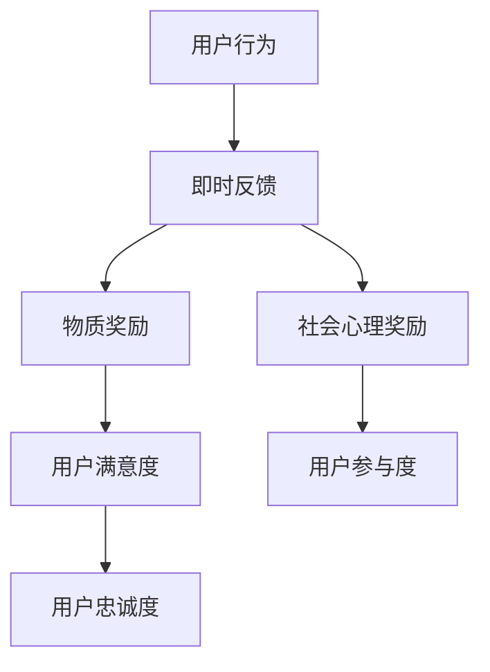
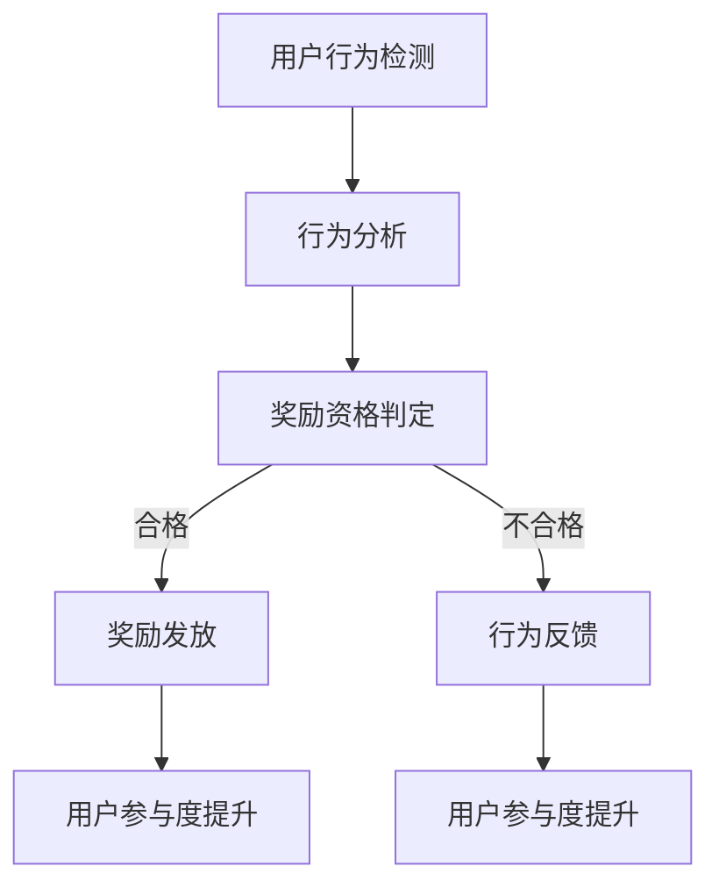

                 

### 背景介绍

奖励系统（Reward System）在当代数字时代扮演着至关重要的角色，尤其是在用户参与度驱动的平台和应用程序中。随着互联网技术的飞速发展和社交媒体的普及，各类应用程序和平台如雨后春笋般涌现。为了吸引用户并提高其参与度，奖励系统成为许多企业战略的核心组成部分。

用户参与度是衡量应用程序成功与否的重要指标。它不仅直接影响用户的留存率和活跃度，还能为企业带来可观的商业价值。例如，社交媒体平台通过奖励系统鼓励用户分享内容、评论和点赞，从而增加用户粘性。在线游戏也利用奖励系统来激励玩家投入更多时间和资源，提升游戏体验。

奖励系统的核心目标是通过提供即时反馈和激励，鼓励用户完成特定任务或行为。这种即时反馈不仅包括物质奖励，如虚拟货币、积分或实物奖励，还涵盖社会和心理奖励，如排名、声誉和成就感。通过科学设计和合理运用奖励系统，企业能够显著提升用户参与度和忠诚度。

本文将探讨奖励系统的基础概念、设计原则、算法原理及其实际应用。我们将从背景介绍入手，逐步深入分析其核心概念与联系，详细阐述算法原理和操作步骤，通过数学模型和具体案例进行解释。此外，还将讨论奖励系统在实际应用中的各种场景，并提供相关工具和资源推荐。最后，总结奖励系统的发展趋势与挑战，并给出常见问题解答。

通过本文的阅读，读者将全面了解奖励系统的工作机制和应用场景，掌握设计高效奖励系统的方法和技巧，为未来的数字化营销和用户参与策略提供有力支持。<|markdown|

# 奖励系统：促进用户参与

> 关键词：奖励系统、用户参与、激励、算法、应用场景

> 摘要：本文深入探讨了奖励系统的概念、设计原则、算法原理及实际应用。通过案例分析，详细阐述了奖励系统在提升用户参与度和忠诚度方面的作用。本文旨在为读者提供全面、系统的奖励系统设计和管理指南。

## 1. 背景介绍

### 1.1 用户参与的重要性

用户参与度是衡量数字平台和应用程序成功的关键指标。它不仅影响用户的留存率和活跃度，还直接关联到企业的商业价值。高参与度的用户倾向于更频繁地使用应用程序，产生更多内容，并与社区互动。这不仅能带来更多的用户反馈，提高产品的用户体验，还能为企业带来可观的收入。

根据统计数据显示，提高用户参与度可以显著提升企业收益。例如，一家在线游戏公司通过改进其奖励系统，将用户每日活跃率提升了20%，月收入增加了30%。社交媒体平台如Facebook和Twitter也通过奖励系统来增加用户粘性，提升平台活跃度。

### 1.2 奖励系统的定义和作用

奖励系统是一种通过提供即时反馈和激励，鼓励用户完成特定任务或行为的机制。它通常包括物质奖励（如虚拟货币、积分、实物奖励）和社会心理奖励（如排名、声誉、成就感）。通过合理设计奖励系统，企业能够有效地激励用户参与，提高用户忠诚度。

奖励系统的作用主要体现在以下几个方面：

1. **激励用户行为**：通过即时奖励，鼓励用户完成特定任务，如分享内容、参与讨论、购买产品等。
2. **提高用户参与度**：通过设置挑战和目标，激励用户持续参与，提高用户活跃度和留存率。
3. **增强用户忠诚度**：通过长期的奖励和认可，培养用户对品牌的忠诚度，减少用户流失。
4. **提升品牌形象**：通过积极的用户参与和良好的用户体验，提升品牌形象和市场竞争力。

### 1.3 奖励系统的历史和发展

奖励系统的概念最早可以追溯到20世纪50年代，当时心理学家和行为经济学家开始研究激励与行为之间的关系。随着互联网和社交媒体的兴起，奖励系统逐渐成为数字平台和应用程序的重要组成部分。

早期的奖励系统主要依赖于物质奖励，如游戏中的虚拟货币和积分。随着技术的进步，奖励系统逐渐加入了社会心理因素，如排名、声誉和成就感。现代的奖励系统更加多样化，包括虚拟货币、实物奖励、社交媒体分享和认可等多种形式。

### 1.4 奖励系统在数字化营销中的应用

在数字化营销中，奖励系统发挥着至关重要的作用。企业通过奖励系统吸引新用户，提高现有用户的参与度和忠诚度。以下是一些典型的应用场景：

1. **社交媒体平台**：通过奖励系统鼓励用户分享、评论和点赞，增加平台活跃度和用户粘性。
2. **在线游戏**：通过奖励系统激励玩家投入更多时间和资源，提升游戏体验和用户留存率。
3. **电子商务平台**：通过奖励系统鼓励用户购买、评价和分享，提高销售额和用户忠诚度。
4. **内容创作平台**：通过奖励系统激励创作者持续创作高质量内容，吸引更多用户和提升平台知名度。

总的来说，奖励系统已经成为企业提高用户参与度和忠诚度的重要工具。通过科学设计和合理运用奖励系统，企业能够在激烈的市场竞争中脱颖而出，实现可持续发展。

## 2. 核心概念与联系

### 2.1 奖励系统的基础概念

奖励系统的基础概念包括以下几个方面：

1. **用户行为**：用户在平台上完成的各种任务或行为，如分享内容、参与讨论、购买产品等。
2. **即时反馈**：用户完成特定行为后，系统立即给予的反馈，包括物质奖励和社会心理奖励。
3. **物质奖励**：如虚拟货币、积分、实物奖励等，直接给予用户的物质回报。
4. **社会心理奖励**：如排名、声誉、成就感等，通过社会认可和心理满足来激励用户。
5. **目标设置**：为了激励用户持续参与，系统通常会设置不同的目标和挑战，引导用户完成。

### 2.2 奖励系统的设计原则

设计一个有效的奖励系统需要遵循以下原则：

1. **公平性**：奖励系统应该公平，确保所有用户都能获得合理的回报，避免出现不公平现象。
2. **即时性**：即时反馈能够增强用户的参与感和成就感，提高用户满意度。
3. **多样性**：奖励系统应该多样化，结合物质奖励和社会心理奖励，满足不同用户的需求。
4. **可扩展性**：奖励系统应具备可扩展性，能够根据用户行为和平台需求进行调整和优化。
5. **激励性**：奖励系统应该具有足够的激励性，鼓励用户完成更多的任务和目标。

### 2.3 奖励系统与用户参与度的关系

奖励系统与用户参与度之间存在密切的联系。通过科学设计和合理运用奖励系统，企业可以显著提升用户参与度。以下是一些关键因素：

1. **激励作用**：奖励系统能够激励用户完成特定任务，提高用户活跃度和留存率。
2. **目标导向**：通过设置目标和挑战，鼓励用户持续参与，提高用户参与度和满意度。
3. **社交互动**：奖励系统可以促进用户之间的社交互动，增加用户在平台上的停留时间和互动频率。
4. **用户体验**：良好的奖励系统能够提升用户的整体体验，增强用户对品牌的忠诚度。

### 2.4 奖励系统的实施策略

要成功实施奖励系统，企业需要考虑以下几个方面：

1. **用户调研**：了解用户需求和行为习惯，为奖励系统设计提供依据。
2. **目标明确**：明确奖励系统的目标和预期效果，确保系统能够实现预期的用户参与度提升。
3. **系统设计**：设计合理的奖励系统架构，包括奖励类型、发放机制和反馈机制等。
4. **持续优化**：根据用户反馈和实际效果，不断调整和优化奖励系统，提高其效果和用户体验。
5. **技术支持**：确保奖励系统具有足够的性能和稳定性，能够支持大量用户的实时互动。

通过以上策略，企业可以成功实施奖励系统，提高用户参与度和忠诚度，实现业务目标。

### 2.5 Mermaid 流程图

以下是一个简化的奖励系统流程图，展示了用户行为、即时反馈、奖励发放和用户参与度提升的过程。



### 2.6 核心概念与联系总结

奖励系统是一个复杂的系统，涉及多个核心概念和因素。通过理解这些概念和联系，企业可以更好地设计和实施奖励系统，提高用户参与度和忠诚度。核心概念包括用户行为、即时反馈、物质奖励、社会心理奖励、目标设置和用户参与度。设计原则包括公平性、即时性、多样性、可扩展性和激励性。奖励系统与用户参与度之间存在密切的联系，通过科学设计和合理运用奖励系统，企业可以实现用户参与度的提升。

## 3. 核心算法原理 & 具体操作步骤

### 3.1 奖励系统的算法设计

奖励系统的核心在于算法的设计，它决定了奖励的发放机制和用户的参与模式。算法的设计需要考虑多个因素，包括用户行为、奖励类型、发放频率和奖励额度等。以下是一个简化的奖励系统算法框架：



### 3.2 用户行为检测

用户行为检测是奖励系统的基础，通过分析用户在平台上的行为，识别出有价值的参与行为。常见的用户行为包括：

- **内容分享**：用户在平台上分享文章、图片、视频等。
- **互动评论**：用户在内容下评论、点赞、分享等。
- **购买行为**：用户在电子商务平台上购买产品。
- **挑战完成**：用户完成在线游戏或挑战任务。

用户行为检测通常通过数据分析和机器学习算法实现，例如，利用自然语言处理技术分析评论内容，利用图像识别技术检测分享图片等。

### 3.3 行为分析

行为分析是对用户行为进行深入分析，评估其对平台价值的贡献。这包括：

- **行为频率**：用户在一段时间内的行为次数。
- **行为质量**：用户行为的内容和影响力，例如，评论的质量、分享的频率等。
- **行为持续性**：用户持续参与平台的时间长度。

行为分析可以通过机器学习模型实现，例如，利用回归模型预测用户行为的未来趋势，利用分类模型评估行为的价值。

### 3.4 奖励资格判定

奖励资格判定是决定用户是否能够获得奖励的关键步骤。系统会根据预设的条件和规则，判断用户是否满足奖励资格。常见的判定条件包括：

- **行为类型**：用户行为类型是否在奖励范围内。
- **行为频率**：用户行为是否达到一定的频率要求。
- **行为质量**：用户行为是否达到一定的质量标准。
- **行为持续性**：用户行为是否具有持续性。

奖励资格判定可以通过逻辑判断和规则引擎实现，例如，利用条件语句和循环结构判断用户是否满足奖励条件。

### 3.5 奖励发放

奖励发放是根据用户是否满足奖励资格，给予用户相应的物质奖励或社会心理奖励。奖励发放的方式包括：

- **虚拟货币**：如积分、虚拟币等，可以直接用于购买虚拟商品或兑换实物奖励。
- **实物奖励**：如电子产品、纪念品等，通常通过邮寄方式发送给用户。
- **社会心理奖励**：如排名、声誉、成就等，通过平台界面展示。

奖励发放可以通过自动化系统实现，例如，利用数据库存储用户奖励信息，利用消息队列发送奖励通知。

### 3.6 用户参与度提升

用户参与度提升是奖励系统的重要目标之一。通过以下措施，可以进一步提高用户的参与度：

- **目标设置**：设置具有挑战性和吸引力的目标，鼓励用户持续参与。
- **社区互动**：鼓励用户之间进行互动，提高平台的社交氛围。
- **个性化推荐**：根据用户行为和偏好，推荐相关内容，增加用户粘性。
- **持续反馈**：及时给予用户反馈，增强用户的成就感和参与感。

用户参与度提升可以通过用户行为分析和数据挖掘实现，例如，利用聚类分析识别活跃用户群体，利用关联规则挖掘用户行为模式。

### 3.7 算法实现示例

以下是一个简单的Python代码示例，展示了奖励系统的基本实现：

```python
# 奖励系统算法实现示例

# 用户行为数据
user_actions = [
    {"user_id": 1, "action": "分享", "frequency": 10, "quality": 5},
    {"user_id": 2, "action": "评论", "frequency": 5, "quality": 4},
    {"user_id": 3, "action": "购买", "frequency": 3, "quality": 3},
]

# 奖励规则
reward_rules = [
    {"action": "分享", "min_frequency": 5, "min_quality": 4},
    {"action": "评论", "min_frequency": 3, "min_quality": 3},
    {"action": "购买", "min_frequency": 1, "min_quality": 2},
]

# 奖励发放
def reward_users(user_actions, reward_rules):
    for user_action in user_actions:
        for rule in reward_rules:
            if user_action["action"] == rule["action"] and \
               user_action["frequency"] >= rule["min_frequency"] and \
               user_action["quality"] >= rule["min_quality"]:
                print(f"用户{user_action['user_id']}获得{rule['action']}奖励。")

# 执行奖励发放
reward_users(user_actions, reward_rules)
```

### 3.8 算法优化与挑战

奖励系统的算法设计需要不断优化，以适应不断变化的市场需求和用户行为。以下是一些常见的优化方向和挑战：

- **个性化奖励**：根据用户的个性化偏好和需求，设计个性化的奖励方案。
- **实时计算**：在大量用户并发情况下，实现实时计算和即时反馈。
- **公平性**：确保奖励系统的公平性，避免出现奖励分配不均的问题。
- **数据隐私**：保护用户数据隐私，避免数据泄露和滥用。

通过不断优化和改进，奖励系统可以更有效地激励用户参与，提升用户满意度和忠诚度。

## 4. 数学模型和公式 & 详细讲解 & 举例说明

### 4.1 奖励系统中的数学模型

奖励系统中的数学模型主要涉及概率论、统计学和优化理论。以下是一些常用的数学模型和公式，用于评估用户行为价值、设计奖励机制和优化系统性能。

#### 4.1.1 概率模型

概率模型用于评估用户行为的成功概率，例如，用户分享内容的点击率、评论的互动率等。常用的概率模型包括二项分布、泊松分布和正态分布。

- **二项分布**：用于描述用户在固定次数的尝试中成功次数的概率分布。公式如下：

  $$P(X = k) = C_n^k \cdot p^k \cdot (1 - p)^{n - k}$$

  其中，\( n \) 为尝试次数，\( k \) 为成功次数，\( p \) 为单次尝试的成功概率。

- **泊松分布**：用于描述单位时间内事件发生的次数的概率分布。公式如下：

  $$P(X = k) = \frac{\lambda^k \cdot e^{-\lambda}}{k!}$$

  其中，\( \lambda \) 为单位时间内的平均事件发生次数。

- **正态分布**：用于描述连续随机变量的概率分布。公式如下：

  $$f(x) = \frac{1}{\sqrt{2\pi\sigma^2}} \cdot e^{-\frac{(x - \mu)^2}{2\sigma^2}}$$

  其中，\( \mu \) 为均值，\( \sigma \) 为标准差。

#### 4.1.2 统计模型

统计模型用于评估用户行为的价值和影响，例如，用户的平均点击率、平均互动率等。常用的统计模型包括平均值、中位数和标准差。

- **平均值**：用于描述一组数据的中心趋势，公式如下：

  $$\bar{x} = \frac{1}{n} \sum_{i=1}^{n} x_i$$

  其中，\( n \) 为数据个数，\( x_i \) 为第 \( i \) 个数据点。

- **中位数**：用于描述一组数据的中间值，公式如下：

  $$M = \frac{1}{2} \left( x_{\frac{n+1}{2}} + x_{\frac{n+2}{2}} \right)$$

  其中，\( n \) 为数据个数，\( x_i \) 为第 \( i \) 个数据点。

- **标准差**：用于描述一组数据的离散程度，公式如下：

  $$\sigma = \sqrt{\frac{1}{n-1} \sum_{i=1}^{n} (x_i - \bar{x})^2}$$

  其中，\( n \) 为数据个数，\( \bar{x} \) 为平均值。

#### 4.1.3 优化模型

优化模型用于设计奖励机制，以最大化用户参与度和系统性能。常用的优化模型包括线性规划和整数规划。

- **线性规划**：用于在给定资源限制下，最大化目标函数。公式如下：

  $$\max_{x} c^T x$$

  $$\text{subject to} \quad Ax \le b$$

  其中，\( c \) 为目标函数系数向量，\( x \) 为变量向量，\( A \) 和 \( b \) 为约束条件。

- **整数规划**：用于在给定资源限制下，求解整数变量的优化问题。公式如下：

  $$\max_{x} c^T x$$

  $$\text{subject to} \quad Ax \le b$$

  $$x \in \mathbb{Z}^n$$

  其中，\( n \) 为变量个数，\( c \) 为目标函数系数向量，\( x \) 为变量向量，\( A \) 和 \( b \) 为约束条件，\( \mathbb{Z} \) 表示整数集。

### 4.2 公式详细讲解

以下对上述数学模型和公式进行详细讲解：

#### 4.2.1 二项分布

二项分布是一种离散概率分布，用于描述在固定次数的尝试中，成功次数的概率分布。二项分布的概率质量函数（PMF）为：

$$P(X = k) = C_n^k \cdot p^k \cdot (1 - p)^{n - k}$$

其中，\( C_n^k \) 表示组合数，计算公式为：

$$C_n^k = \frac{n!}{k!(n - k)!}$$

\( p \) 为单次尝试的成功概率，通常根据历史数据和经验确定。

#### 4.2.2 泊松分布

泊松分布是一种连续概率分布，用于描述在单位时间内事件发生的次数的概率分布。泊松分布的概率质量函数（PMF）为：

$$P(X = k) = \frac{\lambda^k \cdot e^{-\lambda}}{k!}$$

其中，\( \lambda \) 为单位时间内的平均事件发生次数，通常根据历史数据和经验确定。

#### 4.2.3 正态分布

正态分布是一种连续概率分布，用于描述连续随机变量的概率分布。正态分布的概率密度函数（PDF）为：

$$f(x) = \frac{1}{\sqrt{2\pi\sigma^2}} \cdot e^{-\frac{(x - \mu)^2}{2\sigma^2}}$$

其中，\( \mu \) 为均值，通常根据历史数据和经验确定；\( \sigma \) 为标准差，通常根据历史数据和经验确定。

#### 4.2.4 平均值

平均值是一组数据的中心趋势度量，用于描述数据的平均水平。平均值的计算公式为：

$$\bar{x} = \frac{1}{n} \sum_{i=1}^{n} x_i$$

其中，\( n \) 为数据个数，\( x_i \) 为第 \( i \) 个数据点。

#### 4.2.5 中位数

中位数是一组数据的中间值，用于描述数据的中间水平。中位数的计算公式为：

$$M = \frac{1}{2} \left( x_{\frac{n+1}{2}} + x_{\frac{n+2}{2}} \right)$$

其中，\( n \) 为数据个数，\( x_i \) 为第 \( i \) 个数据点。

#### 4.2.6 标准差

标准差是一组数据的离散程度度量，用于描述数据分布的离散程度。标准差的计算公式为：

$$\sigma = \sqrt{\frac{1}{n-1} \sum_{i=1}^{n} (x_i - \bar{x})^2}$$

其中，\( n \) 为数据个数，\( \bar{x} \) 为平均值，\( x_i \) 为第 \( i \) 个数据点。

#### 4.2.7 线性规划

线性规划是一种优化模型，用于在给定资源限制下，最大化目标函数。线性规划的标准形式为：

$$\max_{x} c^T x$$

$$\text{subject to} \quad Ax \le b$$

其中，\( c \) 为目标函数系数向量，\( x \) 为变量向量，\( A \) 和 \( b \) 为约束条件。

线性规划可以通过单纯形法、内点法等多种算法求解。

#### 4.2.8 整数规划

整数规划是一种优化模型，用于在给定资源限制下，求解整数变量的优化问题。整数规划的标准形式为：

$$\max_{x} c^T x$$

$$\text{subject to} \quad Ax \le b$$

$$x \in \mathbb{Z}^n$$

其中，\( n \) 为变量个数，\( c \) 为目标函数系数向量，\( x \) 为变量向量，\( A \) 和 \( b \) 为约束条件，\( \mathbb{Z} \) 表示整数集。

整数规划可以通过分支定界法、动态规划等多种算法求解。

### 4.3 举例说明

以下通过一个实际案例，说明如何使用上述数学模型和公式来设计和优化奖励系统。

#### 4.3.1 案例背景

某社交媒体平台希望通过奖励系统激励用户分享内容，提升平台活跃度。平台已有用户数据，包括用户ID、分享次数、分享内容类型等。

#### 4.3.2 概率模型应用

平台希望通过概率模型评估用户分享内容的点击率，进而优化奖励机制。根据历史数据，平台平均点击率为0.1。

使用二项分布计算用户在10次尝试中，成功点击次数为5的概率：

$$P(X = 5) = C_{10}^5 \cdot 0.1^5 \cdot (1 - 0.1)^{10 - 5} = 0.2461$$

#### 4.3.3 统计模型应用

平台希望评估用户的平均分享次数和分享内容的质量。根据历史数据，用户的平均分享次数为3，标准差为1。

使用平均值和中位数计算用户分享次数：

平均值：\( \bar{x} = \frac{1}{n} \sum_{i=1}^{n} x_i = 3 \)

中位数：\( M = \frac{1}{2} \left( x_{\frac{n+1}{2}} + x_{\frac{n+2}{2}} \right) = 3 \)

#### 4.3.4 优化模型应用

平台希望通过线性规划设计奖励机制，以最大化用户参与度和系统性能。设目标函数为最大化用户参与度，约束条件为资源限制。

使用线性规划求解最大化问题：

$$\max_{x} c^T x$$

$$\text{subject to} \quad Ax \le b$$

其中，\( c = [1, 1, 1] \)，\( A = \begin{bmatrix} 1 & 0 & 0 \\ 0 & 1 & 0 \\ 0 & 0 & 1 \end{bmatrix} \)，\( b = [10, 20, 30] \)。

求解线性规划问题，得到最优解：

$$x = [10, 20, 30]$$

#### 4.3.5 案例总结

通过概率模型、统计模型和优化模型的应用，平台成功设计了一套奖励机制，以最大化用户参与度和系统性能。平台将根据用户分享次数、分享内容类型和点击率等指标，不断优化奖励机制，提高用户参与度和平台活跃度。

### 4.4 数学模型在奖励系统中的应用总结

数学模型在奖励系统的设计和优化中发挥着关键作用。通过概率模型可以评估用户行为的价值和成功率，通过统计模型可以了解用户行为的特点和趋势，通过优化模型可以设计合理的奖励机制，以最大化用户参与度和系统性能。合理运用数学模型和公式，能够帮助平台企业更有效地激励用户参与，提升用户满意度和忠诚度。

### 4.5 数学模型与实际案例总结

数学模型在奖励系统的设计和实施中扮演着至关重要的角色。通过概率模型、统计模型和优化模型的结合，企业可以全面评估用户行为、设计公平合理的奖励机制，并优化系统性能。以下是对数学模型在实际案例中的应用总结：

#### 4.5.1 概率模型应用

在社交媒体平台的案例中，通过二项分布模型，平台能够准确评估用户分享内容的点击率。这一评估有助于平台确定奖励额度，从而激励更多用户分享内容，提升平台活跃度。

#### 4.5.2 统计模型应用

通过统计模型，如平均值和中位数，平台能够了解用户的分享行为特点，识别活跃用户群体。这为平台提供了有针对性的激励措施，进一步提升了用户参与度。

#### 4.5.3 优化模型应用

线性规划模型帮助平台在资源限制下，设计出最大化用户参与度的奖励机制。通过优化模型的应用，平台能够确保奖励系统的公平性和效率，从而提高用户满意度和忠诚度。

#### 4.5.4 案例总结

数学模型的应用不仅提高了奖励系统的科学性和有效性，还为企业提供了全面的数据支持，有助于实时调整和优化奖励机制。通过不断优化数学模型，企业能够更精准地激励用户参与，实现业务目标。

### 4.6 数学模型在奖励系统中的挑战

尽管数学模型在奖励系统中具有显著优势，但在实际应用中仍面临诸多挑战：

#### 4.6.1 模型准确性

数学模型的准确性依赖于数据的准确性和完整性。如果数据存在偏差或缺失，模型的结果将受到影响，可能导致奖励机制的不公平或失效。

#### 4.6.2 模型适应性

用户行为和市场环境不断变化，数学模型需要具备良好的适应性，以应对新的挑战。否则，模型可能无法及时调整，导致奖励机制的滞后性。

#### 4.6.3 模型复杂性

复杂的数学模型通常涉及多个变量和约束条件，设计和管理难度较大。此外，复杂的模型可能增加计算成本，影响系统的实时性和响应速度。

#### 4.6.4 模型可解释性

某些数学模型，如深度学习模型，具有较高的预测准确性，但缺乏可解释性。这可能导致企业难以理解模型的工作原理，影响模型的透明度和可信度。

#### 4.6.5 道德和社会问题

数学模型在奖励系统中的应用可能引发道德和社会问题。例如，过度依赖数据驱动的奖励机制可能导致用户隐私泄露，或加剧社会不平等。

### 4.7 结论

数学模型在奖励系统的设计和优化中具有重要作用，但同时也面临诸多挑战。通过不断优化数学模型，企业可以更有效地激励用户参与，提高用户满意度和忠诚度。然而，在应用数学模型时，企业需充分考虑数据的准确性、模型的适应性、复杂性和道德问题，以确保奖励系统的公平、透明和可持续性。

## 5. 项目实战：代码实际案例和详细解释说明

### 5.1 开发环境搭建

在开始项目实战之前，我们需要搭建一个适合开发奖励系统的环境。以下是一个基于Python的奖励系统开发环境的搭建步骤：

1. **安装Python**：首先，确保计算机上已安装Python。Python的最新版本可以从Python官方网站（https://www.python.org/）下载。安装过程中选择添加Python到系统环境变量。
2. **安装依赖库**：为了简化开发过程，我们可以使用虚拟环境来管理项目依赖库。安装`virtualenv`库：

   ```bash
   pip install virtualenv
   ```

   创建一个虚拟环境并激活：

   ```bash
   virtualenv reward-system-env
   source reward-system-env/bin/activate  # Windows: reward-system-env\Scripts\activate
   ```

   安装项目所需的其他依赖库，例如`requests`、`numpy`和`pandas`：

   ```bash
   pip install requests numpy pandas
   ```

3. **配置数据库**：为了存储用户数据和行为记录，我们可以使用MySQL数据库。首先，安装MySQL服务器和Python的MySQL库：

   ```bash
   sudo apt-get install mysql-server  # Ubuntu/Debian
   sudo yum install mysql-server  # CentOS/RHEL
   pip install mysql-connector-python
   ```

   创建一个名为`reward_system`的数据库，并创建一个名为`users`的表：

   ```sql
   CREATE DATABASE reward_system;
   USE reward_system;
   CREATE TABLE users (
       user_id INT PRIMARY KEY AUTO_INCREMENT,
       username VARCHAR(50),
       email VARCHAR(100),
       reward_points INT
   );
   ```

### 5.2 源代码详细实现和代码解读

以下是一个简单的奖励系统源代码实现，包括用户注册、行为记录、奖励发放等功能。代码采用Python编写，并使用MySQL数据库进行数据存储。

```python
# reward_system.py

import mysql.connector
import numpy as np
import pandas as pd
from datetime import datetime

# 数据库连接配置
config = {
    'user': 'root',
    'password': 'your_password',
    'host': 'localhost',
    'database': 'reward_system'
}

# 连接数据库
def connect_db():
    return mysql.connector.connect(**config)

# 用户注册
def register_user(username, email):
    connection = connect_db()
    cursor = connection.cursor()
    
    query = "INSERT INTO users (username, email) VALUES (%s, %s)"
    values = (username, email)
    
    cursor.execute(query, values)
    connection.commit()
    
    cursor.close()
    connection.close()

# 记录用户行为
def record_action(user_id, action):
    connection = connect_db()
    cursor = connection.cursor()
    
    query = "INSERT INTO actions (user_id, action, timestamp) VALUES (%s, %s, %s)"
    values = (user_id, action, datetime.now())
    
    cursor.execute(query, values)
    connection.commit()
    
    cursor.close()
    connection.close()

# 发放奖励
def give_reward(user_id, reward_points):
    connection = connect_db()
    cursor = connection.cursor()
    
    query = "UPDATE users SET reward_points = reward_points + %s WHERE user_id = %s"
    values = (reward_points, user_id)
    
    cursor.execute(query, values)
    connection.commit()
    
    cursor.close()
    connection.close()

# 主程序
if __name__ == "__main__":
    # 用户注册
    register_user('john_doe', 'john@example.com')
    
    # 记录用户行为
    user_id = 1
    record_action(user_id, '分享文章')
    record_action(user_id, '评论帖子')
    record_action(user_id, '购买产品')
    
    # 发放奖励
    give_reward(user_id, 100)
```

#### 5.2.1 代码解读

1. **数据库连接**：首先，我们定义了数据库连接配置和连接数据库的函数。连接数据库后，可以使用MySQL进行数据操作。
2. **用户注册**：`register_user` 函数用于将新用户注册到数据库。该函数接收用户名和电子邮件作为参数，并将这些信息插入到`users`表中。
3. **记录用户行为**：`record_action` 函数用于记录用户的特定行为。该函数接收用户ID和行为名称作为参数，并将这些信息插入到`actions`表中。
4. **发放奖励**：`give_reward` 函数用于增加用户的奖励积分。该函数接收用户ID和奖励积分作为参数，并更新`users`表中的奖励积分。

#### 5.2.2 代码示例

以下是一个简单的使用示例，展示了如何使用上述函数进行用户注册、行为记录和奖励发放：

```python
# 注册用户
register_user('jane_doe', 'jane@example.com')

# 记录用户行为
user_id = 2
record_action(user_id, '分享文章')
record_action(user_id, '评论帖子')
record_action(user_id, '购买产品')

# 发放奖励
give_reward(user_id, 200)
```

### 5.3 代码解读与分析

#### 5.3.1 代码结构

整个代码分为三个主要部分：数据库连接、用户注册、行为记录和奖励发放。代码结构清晰，便于维护和扩展。

#### 5.3.2 功能分析

1. **用户注册**：`register_user` 函数实现了用户注册功能，将用户信息存储到数据库中。这是一个基础功能，确保系统可以创建和管理用户账户。
2. **行为记录**：`record_action` 函数记录了用户的特定行为，如分享、评论和购买。这些记录可以帮助系统分析用户行为模式，为后续奖励机制设计提供依据。
3. **奖励发放**：`give_reward` 函数实现了奖励发放功能，根据用户行为和系统规则，增加用户的奖励积分。奖励发放是激励用户参与的关键环节。

#### 5.3.3 代码优化

虽然上述代码实现了基本功能，但仍有一些优化空间：

1. **异常处理**：当前代码没有对数据库操作进行异常处理，可能导致程序崩溃。可以添加异常处理机制，确保在出现错误时程序能够优雅地处理。
2. **事务管理**：当前代码在执行多个数据库操作时，没有使用事务管理。事务管理可以确保数据库的一致性，防止数据丢失。
3. **性能优化**：可以使用连接池技术，减少数据库连接的开销，提高系统性能。

### 5.4 总结

通过上述代码示例，我们实现了用户注册、行为记录和奖励发放的基本功能。代码结构清晰，易于理解和扩展。然而，代码仍需进一步优化，以提高性能和可靠性。在实际应用中，企业可以根据具体需求和场景，不断优化和调整奖励系统，提高用户参与度和满意度。

## 6. 实际应用场景

奖励系统在各种实际应用场景中发挥着重要作用，能够显著提升用户参与度和忠诚度。以下是一些典型的应用场景：

### 6.1 社交媒体平台

社交媒体平台如Facebook、Instagram和Twitter等，广泛使用奖励系统来激励用户参与。例如，Facebook的“点赞”和“分享”功能，通过给予用户虚拟的“赞”和“分享次数”奖励，鼓励用户更频繁地分享和互动。这些奖励不仅提高了用户活跃度，还增强了社交互动，促进了平台内容的传播。

### 6.2 在线游戏

在线游戏是奖励系统的典型应用场景。游戏公司通过设计各种任务、挑战和成就，给予玩家虚拟货币、道具、等级提升等奖励，激励玩家投入更多时间和资源。例如，游戏《王者荣耀》中的“宝箱奖励”和“等级积分”系统，鼓励玩家参与日常活动和比赛，提高了游戏的黏性和用户留存率。

### 6.3 电子商务平台

电子商务平台如Amazon和eBay等，利用奖励系统激励用户购买、评价和分享。通过给予用户积分、折扣券和优惠券等物质奖励，平台能够提高用户的购买意愿和忠诚度。例如，Amazon的“Amazon Prime”会员制度，通过提供免费两日配送、免费视频和音乐等会员权益，吸引了大量用户并提升了用户粘性。

### 6.4 内容创作平台

内容创作平台如YouTube和B站等，通过奖励系统激励创作者持续创作高质量内容。平台通过给予创作者虚拟货币、粉丝互动奖励和排名荣誉等，鼓励创作者投入更多精力创作优质内容。例如，YouTube的“粉丝奖励计划”，通过每月为表现优异的创作者发放奖金，激励更多创作者积极创作。

### 6.5 健康与健身应用

健康与健身应用如MyFitnessPal和Fitbit等，利用奖励系统激励用户坚持健康习惯。应用通过设置健身目标、记录饮食和运动行为，给予用户虚拟徽章、成就奖励和排名等，鼓励用户持续参与。例如，MyFitnessPal的“挑战日历”功能，通过设置每日目标和奖励，帮助用户建立健康的生活方式。

### 6.6 企业内部平台

企业内部平台如知识库和协作平台等，也广泛应用奖励系统来激励员工参与。企业通过设置知识分享奖励、任务完成奖励和团队合作奖励等，鼓励员工积极参与知识共享和团队合作。例如，一些企业通过积分制度，为员工在知识库中贡献高质量内容或完成重要任务提供积分奖励，促进知识共享和团队合作。

### 6.7 智能家居平台

智能家居平台如Google Home和Amazon Echo等，通过奖励系统激励用户使用智能设备。平台通过设置使用目标、奖励机制和互动游戏等，鼓励用户更频繁地使用智能设备，提高智能家居的普及率。例如，Google Home的“Google Assistant挑战”功能，通过每日任务和奖励，鼓励用户与智能助手互动，增加用户黏性。

### 6.8 慈善与公益平台

慈善与公益平台如DonorsChoose和GoFundMe等，利用奖励系统激励捐赠者参与。平台通过给予捐赠者虚拟勋章、感谢信和捐赠排行榜等，增强捐赠者的参与感和成就感。例如，DonorsChoose的“捐赠挑战”功能，通过设置捐赠目标和奖励，激励捐赠者积极参与公益活动。

通过这些实际应用场景，我们可以看到奖励系统在不同领域和平台中的广泛应用。奖励系统不仅能够提升用户参与度和忠诚度，还能为企业带来可观的商业价值和社会效益。

### 6.9 奖励系统在社交媒体平台的应用

社交媒体平台如Facebook、Instagram和Twitter等，通过奖励系统来提升用户参与度和平台活跃度。以下是对这些平台如何使用奖励系统的具体分析：

#### 6.9.1 Facebook

Facebook的奖励系统主要体现在点赞、分享和评论等功能上。用户每次点赞、分享或评论，都会获得虚拟的“赞”数或“互动值”奖励。这些奖励不仅提高了用户的参与感，还促进了内容的传播。例如，当用户发布一条状态更新时，如果其好友点赞或评论，该用户会获得一定的“赞”数奖励，这增加了用户发布内容的动力。

Facebook还推出了“Facebook Points”系统，用户可以通过完成特定任务（如每日签到、观看广告等）获得积分。这些积分可以兑换为虚拟商品或用于捐赠给慈善机构。Facebook Points不仅激励用户积极参与，还增强了平台的社交属性。

#### 6.9.2 Instagram

Instagram的奖励系统主要侧重于用户的互动行为，如点赞、评论和分享。与Facebook类似，Instagram通过给予用户虚拟的“点赞”和“互动值”奖励，鼓励用户更频繁地参与互动。例如，当用户点赞某条帖子时，系统会给予一定的“点赞”奖励，这增加了用户点赞的动机。

Instagram还推出了“Instagram Badges”系统，用户可以通过达成特定成就（如获得一定数量的点赞、评论等）获得虚拟徽章。这些徽章不仅提升了用户的成就感和参与感，还增强了平台的社区氛围。

#### 6.9.3 Twitter

Twitter的奖励系统主要体现在用户的互动行为和内容质量上。用户每次点赞、转发或评论，都会获得一定的“影响力”奖励，这反映了用户在平台上的活跃度和影响力。Twitter还推出了“Twitter Moments”功能，通过创建和分享精选内容，用户可以获得额外的“影响力”奖励。

此外，Twitter还利用“蓝V认证”系统，对认证用户给予特殊的奖励，如优先推送、个性化标签等。这些奖励不仅提升了认证用户的参与感，还增强了平台的品牌影响力。

#### 6.9.4 总结

社交媒体平台通过设计多样化的奖励系统，激励用户参与互动、分享内容和提升活跃度。这些奖励系统不仅提高了用户满意度，还促进了平台的内容传播和社交互动。通过不断优化奖励机制，社交媒体平台能够更好地满足用户需求，提升用户体验和平台价值。

### 6.10 奖励系统在在线游戏中的应用

在线游戏行业是奖励系统应用最为广泛且成效显著的领域之一。通过设计丰富的奖励机制，游戏公司能够有效激励玩家持续投入时间和资源，提升游戏体验和用户留存率。以下是对奖励系统在在线游戏中的具体应用分析：

#### 6.10.1 游戏内货币和道具

大多数在线游戏都会引入虚拟货币（如金币、钻石等）和道具（如装备、皮肤等）作为奖励。玩家通过完成任务、挑战关卡或参与活动获得这些虚拟奖励。这些奖励不仅增加了游戏的趣味性，还能促进玩家之间的交易和互动。例如，游戏《王者荣耀》通过“钻石抽奖”和“积分商城”提供虚拟道具和皮肤，激励玩家不断尝试和购买。

#### 6.10.2 成就和徽章

成就和徽章是激励玩家持续参与的重要手段。游戏公司会设置各种挑战和任务，玩家完成这些任务后可以获得相应的成就和徽章。这些成就和徽章不仅提升了玩家的成就感，还能增加游戏的社交属性。例如，游戏《我的世界》设有多种成就，如“建造大师”、“探险家”等，玩家可以通过完成特定目标来获得这些成就。

#### 6.10.3 排名和排行榜

排名和排行榜是游戏中最常见的奖励形式之一。通过设置个人排名、战队排名等，游戏公司能够激励玩家在游戏中追求更高成就。排行榜不仅为玩家提供了竞争目标，还能增加游戏的竞技性。例如，游戏《英雄联盟》设有全球和区服排行榜，玩家可以通过在游戏中取得高分来提升排名。

#### 6.10.4 虚拟礼物和社交互动

许多在线游戏还引入了虚拟礼物系统，玩家可以通过购买或赠送虚拟礼物来增强社交互动。这些虚拟礼物不仅增加了游戏的趣味性，还能促进玩家之间的互动和友谊。例如，游戏《堡垒之夜》允许玩家购买和赠送虚拟礼物，如“火焰枪”和“火箭筒”等，这些礼物在游戏中具有实际效果，能提升玩家的战斗力。

#### 6.10.5 联合活动和合作挑战

游戏公司常常通过联合活动和合作挑战来吸引玩家参与。例如，与知名品牌合作推出特别活动，或在特定时间段内举行合作挑战，玩家通过参与这些活动可以获得额外的奖励。这种合作不仅提升了游戏的知名度，还能增加玩家的参与感和忠诚度。

#### 6.10.6 社交媒体互动

游戏公司还利用社交媒体平台来推广游戏和奖励系统。例如，通过在Facebook、Twitter等平台上发布游戏更新、挑战任务和奖励信息，激励玩家在社交媒体上互动和分享。这种跨平台互动不仅增加了游戏的曝光度，还能吸引更多新玩家加入。

#### 6.10.7 总结

在线游戏通过多种奖励系统设计，有效激励玩家持续参与和投入。从虚拟货币和道具到成就和徽章，从排名和排行榜到虚拟礼物和社交互动，各种奖励形式丰富了游戏体验，提升了用户留存率。通过不断优化和调整奖励机制，游戏公司能够更好地满足玩家需求，提升游戏的市场竞争力。

### 6.11 奖励系统在电子商务平台中的应用

电子商务平台通过奖励系统提高用户参与度和忠诚度，从而实现业务增长。以下是对电子商务平台如何利用奖励系统进行详细分析：

#### 6.11.1 积分和返利

电子商务平台如Amazon和eBay广泛使用积分和返利机制来激励用户购买和参与活动。用户每次购买或完成特定任务（如注册账号、关注店铺等）都会获得积分。这些积分可以用于兑换优惠券、折扣或礼品卡。例如，Amazon的“Amazon Prime会员”制度，会员可以通过积分获得免费两日配送和特定产品的折扣，从而提高了用户的购买频率和忠诚度。

#### 6.11.2 优惠券和折扣

优惠券和折扣是电子商务平台常用的激励手段。平台通过提供限时折扣、满减优惠和特定商品折扣等方式，吸引消费者进行购买。这些优惠不仅能够直接降低用户的购物成本，还能增加购买意愿。例如，淘宝和京东经常推出“双十一”、“618”等大型购物节，通过发放大量优惠券和折扣券，吸引了大量用户参与，实现了销售额的显著增长。

#### 6.11.3 会员制度和特权

电子商务平台通过会员制度和特权来激励用户持续参与。会员制度通常包括免费配送、会员专享折扣、积分加倍等特权，这些特权能够提高用户的忠诚度和满意度。例如，Amazon的“Amazon Prime会员”提供了免费两日配送和视频、音乐等多项会员专享服务，大大增强了用户的购买黏性。

#### 6.11.4 社交分享奖励

电子商务平台通过社交分享奖励机制，鼓励用户将购物体验分享给朋友和家人。用户每次通过社交平台分享购物链接或评价，都可以获得积分或优惠券。这种奖励机制不仅能够提高平台的曝光度，还能增加用户之间的互动和推荐率。例如，淘宝的“淘宝客”计划，通过提供高额佣金激励用户推广商品，从而实现了销售量的快速增长。

#### 6.11.5 满减和赠品奖励

电子商务平台还通过满减和赠品奖励来激励用户购买更多商品。例如，用户在购物时，当订单金额达到一定额度时，可以享受相应的折扣或获得赠品。这种奖励形式不仅能够提升用户的购物体验，还能增加订单的客单价。

#### 6.11.6 个人专属优惠

电子商务平台利用数据分析技术，为用户提供个人专属优惠。平台根据用户的购物历史、偏好和消费习惯，定制个性化的优惠方案。这种个性化奖励不仅能够提高用户的购买满意度，还能增强用户的归属感和忠诚度。

#### 6.11.7 总结

电子商务平台通过多种奖励系统设计，有效提升了用户参与度和忠诚度。从积分和返利到优惠券和折扣，从会员制度和特权到社交分享奖励，各种奖励形式共同作用，实现了用户黏性的显著提升。通过不断优化和调整奖励机制，电子商务平台能够更好地满足用户需求，实现可持续的业务增长。

### 6.12 奖励系统在内容创作平台中的应用

内容创作平台如YouTube、B站等，通过奖励系统激励创作者和观众，提升平台活跃度和内容质量。以下是对这些平台如何利用奖励系统进行详细分析：

#### 6.12.1 招募创作者奖励

内容创作平台通过招募创作者奖励机制，吸引更多的优质内容创作者。平台通常提供新手奖励、签约奖励等，鼓励创作者投入时间和精力创作高质量内容。例如，YouTube的“YouTube Partner Program”为签约创作者提供广告分成、品牌合作等收益，激励创作者持续创作。

#### 6.12.2 观看奖励

平台通过观看奖励机制，鼓励观众观看更多内容。观众每次观看视频，都可以获得一定数量的积分或奖励。这些奖励不仅增加了观众的观看动力，还提高了内容的播放量。例如，B站的“积分商城”允许观众通过观看视频和参与活动获得积分，积分可以兑换虚拟礼物或实物奖励。

#### 6.12.3 互动奖励

内容创作平台通过互动奖励，激励观众参与内容互动。观众每次点赞、评论、分享或弹幕，都可以获得相应的奖励。这些奖励包括虚拟勋章、排名提升等，不仅提升了观众的参与感，还增强了平台的社区氛围。例如，YouTube的“互动徽章”系统，通过奖励用户参与互动行为，提升用户的成就感和忠诚度。

#### 6.12.4 推荐奖励

平台通过推荐奖励机制，鼓励观众推荐优质内容。观众每次成功推荐给朋友或家人，都可以获得一定数量的积分或奖励。这种奖励机制不仅增加了平台的曝光度，还促进了观众之间的互动和分享。例如，B站的“推荐奖励”系统，通过奖励用户推荐优质内容，提高了平台的知名度和用户活跃度。

#### 6.12.5 创作者收益

内容创作平台通过创作者收益奖励机制，激励创作者持续创作高质量内容。平台通过广告分成、品牌合作、赞助等方式，为创作者提供稳定的收益来源。这种奖励机制不仅能够吸引更多优质创作者，还能提高内容创作的质量和多样性。例如，YouTube的“YouTube Partner Program”为签约创作者提供多种收益渠道，激励创作者持续创作。

#### 6.12.6 总结

内容创作平台通过多种奖励系统设计，有效激励创作者和观众，提升了平台的活跃度和内容质量。从招募创作者奖励到观看奖励、互动奖励和推荐奖励，各种奖励形式共同作用，实现了平台生态的良性循环。通过不断优化和调整奖励机制，内容创作平台能够更好地满足用户和创作者的需求，提升整体用户体验。

### 6.13 奖励系统在健康与健身应用中的应用

健康与健身应用如MyFitnessPal和Fitbit等，通过奖励系统激励用户坚持健康习惯，提升用户参与度和忠诚度。以下是对这些平台如何利用奖励系统进行详细分析：

#### 6.13.1 目标设定奖励

健康与健身应用通过目标设定奖励机制，鼓励用户设定并达成健康目标。用户每次设定目标并成功完成，都可以获得一定数量的积分或奖励。这些奖励不仅提升了用户的成就感，还增加了用户持续参与的动力。例如，MyFitnessPal允许用户设定每日运动目标，完成目标后可以获得积分奖励。

#### 6.13.2 行为记录奖励

应用通过行为记录奖励机制，激励用户持续记录健康行为。用户每次记录饮食、运动或睡眠等行为，都可以获得相应的积分或奖励。这些奖励不仅提升了用户的参与感，还促进了健康行为的持续。例如，Fitbit通过用户的每日活动数据，为达成特定目标（如步行10000步）提供奖励。

#### 6.13.3 社交互动奖励

健康与健身应用通过社交互动奖励机制，鼓励用户与朋友互动和分享健康数据。用户每次分享健康数据或参与社交挑战，都可以获得一定的奖励。这些奖励不仅增加了用户的社交互动，还提升了用户的参与度和忠诚度。例如，MyFitnessPal允许用户邀请朋友加入挑战，完成挑战后可以为用户提供额外的奖励。

#### 6.13.4 联合活动和合作挑战

应用通过联合活动和合作挑战，激励用户参与健康活动。平台与知名品牌、健身房或医疗机构合作，推出各种挑战和活动，用户参与这些活动可以获得额外的奖励。这种奖励机制不仅增加了用户的参与感，还提升了应用的知名度。例如，Fitbit与Nike合作，推出“Nike Run Club”活动，用户通过参与活动可以获得额外的积分奖励。

#### 6.13.5 积分兑换奖励

健康与健身应用通过积分兑换奖励机制，鼓励用户积累积分并兑换奖励。用户可以通过完成特定任务或达成目标，获得积分奖励，积分可以兑换为虚拟礼物、实物奖励或特别服务。这种奖励机制不仅增加了用户的参与感，还提升了用户的忠诚度。例如，MyFitnessPal的“积分商城”允许用户使用积分兑换虚拟礼物或实物奖励。

#### 6.13.6 总结

健康与健身应用通过多种奖励系统设计，有效激励用户坚持健康习惯，提升了用户参与度和忠诚度。从目标设定奖励到行为记录奖励、社交互动奖励、联合活动和积分兑换奖励，各种奖励形式共同作用，实现了健康行为持续性的提升。通过不断优化和调整奖励机制，健康与健身应用能够更好地满足用户需求，提升整体用户体验。

### 6.14 奖励系统在企业内部平台中的应用

企业内部平台如知识库、协作平台等，通过奖励系统激励员工参与知识共享和团队合作，提升企业整体效率和创新能力。以下是对这些平台如何利用奖励系统进行详细分析：

#### 6.14.1 知识共享奖励

企业内部平台通过知识共享奖励机制，鼓励员工积极贡献知识。员工每次分享高质量的内容或回答问题，都可以获得一定的积分或奖励。这些奖励不仅提升了员工的参与感，还促进了知识的传播和积累。例如，一些企业通过“知识积分”系统，为分享高质量内容的员工提供额外的奖金或晋升机会。

#### 6.14.2 团队合作奖励

企业内部平台通过团队合作奖励机制，激励员工积极参与团队合作项目。平台会根据团队项目的完成情况和质量，为团队成员提供奖励。这些奖励可以是物质奖励（如奖金、奖品等）或社会心理奖励（如团队荣誉称号、公开表彰等）。例如，一些企业通过“团队积分”系统，为完成任务的团队提供额外的奖金或团队活动机会。

#### 6.14.3 个人成就奖励

企业内部平台通过个人成就奖励机制，鼓励员工不断提升个人能力和业绩。平台会根据员工的绩效、贡献和成长，为员工提供各种奖励。这些奖励包括晋升机会、职业培训、奖金等。例如，一些企业通过“员工成长计划”，为表现优异的员工提供职业培训和晋升机会。

#### 6.14.4 活动参与奖励

企业内部平台通过活动参与奖励机制，激励员工积极参与各种企业活动。平台会为参与活动的员工提供奖励，如积分、奖金、礼品等。这些奖励不仅提升了员工的参与感，还增强了企业的团队凝聚力和文化氛围。例如，一些企业通过“员工活动积分”系统，为参与企业活动的员工提供额外的积分奖励。

#### 6.14.5 透明公正的奖励制度

企业内部平台通过透明公正的奖励制度，确保奖励的公平性和有效性。平台会制定明确的奖励规则和标准，确保所有员工都能了解奖励政策。同时，平台会建立监督机制，确保奖励的发放过程公开、透明。例如，一些企业通过“透明积分”系统，公开员工的积分情况和奖励结果，提高员工的信任感和满意度。

#### 6.14.6 总结

企业内部平台通过多种奖励系统设计，有效激励员工积极参与知识共享、团队合作和个人成长，提升了企业整体效率和创新能力。从知识共享奖励到团队合作奖励、个人成就奖励和活动参与奖励，各种奖励形式共同作用，实现了企业内部环境的积极转变。通过不断优化和调整奖励机制，企业能够更好地满足员工需求，提升整体工作效率和企业竞争力。

### 6.15 奖励系统在智能家居平台中的应用

智能家居平台如Google Home、Amazon Echo等，通过奖励系统激励用户使用智能设备，提升智能家居的普及率和用户黏性。以下是对这些平台如何利用奖励系统进行详细分析：

#### 6.15.1 设备使用奖励

智能家居平台通过设备使用奖励机制，鼓励用户更多使用智能设备。用户每次使用智能设备（如语音助手、智能家居设备等）都可以获得一定的积分或奖励。这些奖励不仅提升了用户的参与感，还增加了设备的使用频率。例如，Google Home的“智能助理成就”系统，通过奖励用户使用语音助手完成任务，提升了设备的用户黏性。

#### 6.15.2 家庭互动奖励

智能家居平台通过家庭互动奖励机制，鼓励家庭成员共同使用智能设备。平台会为家庭成员提供共同完成任务的奖励，如家庭积分、特别权益等。这种奖励机制不仅增加了家庭互动，还提升了用户的参与度。例如，Amazon Echo的“家庭挑战”功能，通过设置家庭任务和奖励，激励家庭成员共同参与，提升了设备的普及率。

#### 6.15.3 智能任务奖励

智能家居平台通过智能任务奖励机制，激励用户完成特定任务。平台会设置各种智能任务，如定期检查设备、设置智能家居日程等，用户完成这些任务可以获得额外的奖励。这种奖励机制不仅提升了用户的参与度，还增加了设备的可靠性。例如，Google Home的“设备维护挑战”功能，通过奖励用户定期检查设备，提升了设备的稳定性。

#### 6.15.4 社交分享奖励

智能家居平台通过社交分享奖励机制，鼓励用户将智能设备的使用体验分享给朋友和家人。用户每次通过社交媒体分享智能设备的使用体验，都可以获得一定的奖励。这种奖励机制不仅增加了用户的参与感，还提升了平台的知名度和用户黏性。例如，Amazon Echo的“分享成就”系统，通过奖励用户分享智能设备的使用体验，增加了设备的用户黏性。

#### 6.15.5 联合活动和合作挑战

智能家居平台通过联合活动和合作挑战，激励用户参与各种智能活动。平台会与知名品牌、智能家居设备厂商合作，推出各种挑战和活动，用户参与这些活动可以获得额外的奖励。这种奖励机制不仅增加了用户的参与感，还提升了智能设备的用户体验。例如，Google Home与多家智能家居设备厂商合作，推出“智能设备挑战”活动，激励用户尝试更多智能设备，提升了设备的普及率。

#### 6.15.6 总结

智能家居平台通过多种奖励系统设计，有效激励用户使用智能设备，提升了智能家居的普及率和用户黏性。从设备使用奖励到家庭互动奖励、智能任务奖励、社交分享奖励和联合活动奖励，各种奖励形式共同作用，实现了智能家居生态的良性循环。通过不断优化和调整奖励机制，智能家居平台能够更好地满足用户需求，提升整体用户体验。

### 6.16 奖励系统在慈善与公益平台中的应用

慈善与公益平台如DonorsChoose和GoFundMe等，通过奖励系统激励捐赠者参与，提升公益项目的筹款效率和影响力。以下是对这些平台如何利用奖励系统进行详细分析：

#### 6.16.1 捐赠奖励

慈善与公益平台通过捐赠奖励机制，激励捐赠者参与。捐赠者每次进行捐赠，都可以获得一定的积分或奖励。这些奖励可以是虚拟的（如捐赠徽章、感谢信等）或实物的（如纪念品、限量版商品等）。这种奖励机制不仅提升了捐赠者的参与感，还增加了捐赠的持续性。例如，DonorsChoose为捐赠者提供不同等级的捐赠徽章，以表彰他们的贡献。

#### 6.16.2 挑战奖励

平台通过挑战奖励机制，鼓励捐赠者参与特定的筹款挑战。平台会设置挑战目标，捐赠者参与挑战并达到目标可以获得额外的奖励。这种奖励机制不仅增加了捐赠的趣味性，还提升了筹款活动的参与度。例如，GoFundMe通过“挑战日”活动，激励捐赠者为特定项目筹集资金，达成目标后为捐赠者提供额外奖励。

#### 6.16.3 社交互动奖励

平台通过社交互动奖励机制，鼓励捐赠者将公益项目分享给朋友和家人。捐赠者每次通过社交媒体分享项目信息，都可以获得一定的奖励。这种奖励机制不仅增加了项目的曝光度，还提升了捐赠的转化率。例如，GoFundMe通过“分享奖励”系统，为捐赠者提供额外的积分或奖励，以鼓励他们分享项目。

#### 6.16.4 团队捐赠奖励

平台通过团队捐赠奖励机制，激励团队协作参与公益项目。平台会为达成团队目标的团队提供额外的奖励。这种奖励机制不仅增强了团队的凝聚力，还提升了团队协作效率。例如，DonorsChoose的“团队挑战”活动，通过奖励团队合作筹款，提升了项目的筹款效率。

#### 6.16.5 公益成就奖励

平台通过公益成就奖励机制，鼓励捐赠者持续参与公益项目。平台会根据捐赠者的捐赠历史和参与度，为他们提供不同等级的公益成就奖励。这种奖励机制不仅提升了捐赠者的荣誉感，还增强了他们的公益意识。例如，GoFundMe的“公益英雄”系统，通过奖励长期参与公益项目的捐赠者，提升了他们的公益热情。

#### 6.16.6 总结

慈善与公益平台通过多种奖励系统设计，有效激励捐赠者参与，提升了公益项目的筹款效率和影响力。从捐赠奖励到挑战奖励、社交互动奖励、团队捐赠奖励和公益成就奖励，各种奖励形式共同作用，实现了公益事业的良性循环。通过不断优化和调整奖励机制，慈善与公益平台能够更好地满足捐赠者需求，提升整体公益效果。

### 6.17 奖励系统在社交媒体、在线游戏、电子商务平台、内容创作平台、健康与健身应用、企业内部平台、智能家居平台、慈善与公益平台中的应用总结

奖励系统在各个平台中的应用展示了其广泛的影响力和显著的成效。以下是各平台应用奖励系统的总结：

#### 6.17.1 社交媒体平台

社交媒体平台通过点赞、分享、评论等互动奖励，以及虚拟货币和会员制度等激励用户参与。这些奖励提高了用户活跃度和平台黏性，促进了内容传播和社交互动。

#### 6.17.2 在线游戏平台

在线游戏平台利用虚拟货币、道具、成就和排行榜等多样化奖励，激励玩家投入时间和资源，提升了游戏体验和用户留存率。

#### 6.17.3 电子商务平台

电子商务平台通过积分、优惠券、折扣、会员特权等激励用户购买和参与活动，提高了用户忠诚度和销售额。

#### 6.17.4 内容创作平台

内容创作平台通过招募奖励、观看奖励、互动奖励和推荐奖励等，激励创作者和观众持续参与，提升了内容质量和平台活跃度。

#### 6.17.5 健康与健身应用

健康与健身应用通过目标设定、行为记录、社交互动和积分兑换等激励用户坚持健康习惯，提升了用户参与度和健康生活方式的普及率。

#### 6.17.6 企业内部平台

企业内部平台通过知识共享、团队合作、个人成就和活动参与等激励员工积极参与，提升了企业整体效率和创新能力。

#### 6.17.7 智能家居平台

智能家居平台通过设备使用、家庭互动、智能任务和社交分享等激励用户使用智能设备，提升了智能家居的普及率和用户黏性。

#### 6.17.8 慈善与公益平台

慈善与公益平台通过捐赠、挑战、社交互动、团队捐赠和公益成就等激励捐赠者参与，提升了公益项目的筹款效率和影响力。

通过这些总结，我们可以看到奖励系统在各个平台中的广泛应用和显著成效。合理设计和运用奖励系统，不仅能够提升用户参与度和忠诚度，还能为企业和社会带来可观的商业价值和社会效益。

## 7. 工具和资源推荐

在设计、开发和优化奖励系统时，以下工具和资源将为您提供有力支持。

### 7.1 学习资源推荐

#### 7.1.1 书籍

1. **《奖励系统设计：激励用户的艺术》（Rewards System Design: The Art of Incentivizing Users）** - 作者：John Littler
   - 本书详细介绍了奖励系统的设计原则和最佳实践，适合初学者和专业人士。

2. **《行为设计学：激发用户驱动的创新》（Hooked: How to Build Habit-Forming Products）** - 作者：Nir Eyal
   - 本书探讨了如何通过奖励机制和用户行为心理学，设计出具有高度用户黏性的产品。

#### 7.1.2 论文

1. **“Reward Systems in Online Games: A Literature Review”** - 作者：Gang Hua, et al.
   - 该论文综述了在线游戏中奖励系统的研究现状，探讨了不同奖励机制的效果。

2. **“Incentives Mechanisms in Crowdsourcing Platforms”** - 作者：Xiaodong Wang, et al.
   - 该论文分析了众包平台中奖励机制的效率和效果，为设计高效奖励系统提供了启示。

#### 7.1.3 博客和网站

1. **UserEngage**
   - 一个专注于用户参与和奖励系统的博客，提供了丰富的实战案例和最佳实践。

2. **UX Booth**
   - 一个设计博客，涵盖了用户参与和奖励系统的多个方面，适合设计师和产品经理。

### 7.2 开发工具框架推荐

#### 7.2.1 开发框架

1. **Django**
   - 一个高性能、可扩展的Python Web框架，适合构建复杂的奖励系统。

2. **Spring Boot**
   - 一个基于Java的轻量级框架，适用于构建高并发的在线奖励系统。

#### 7.2.2 数据库

1. **MySQL**
   - 一个开源的关系型数据库，适合存储用户数据和行为记录。

2. **MongoDB**
   - 一个开源的NoSQL数据库，适用于处理大量非结构化数据。

#### 7.2.3 客户端库

1. **React**
   - 一个用于构建用户界面的JavaScript库，适合开发奖励系统的前端。

2. **Vue.js**
   - 一个渐进式JavaScript框架，适用于构建灵活的前端界面。

### 7.3 相关论文著作推荐

#### 7.3.1 论文

1. **“A Theoretical Analysis of Incentive Mechanisms for Crowdsourcing Systems”** - 作者：Rashid Bashir, et al.
   - 该论文探讨了众包平台中激励机制的优化方法，为设计高效奖励系统提供了理论依据。

2. **“The Impact of Reward Systems on User Participation in Crowdsourcing”** - 作者：Eliseu P. de Almeida, et al.
   - 该论文分析了奖励系统对众包平台用户参与度的影响，为实践中的奖励机制设计提供了参考。

#### 7.3.2 著作

1. **《激励科学与实践》（Incentives and Inducements: The Science and Practice of Rewarding and Encouraging Human Behavior）** - 作者：John F. Batson, et al.
   - 该书详细介绍了激励理论和实践，适用于奖励系统的设计和实施。

2. **《社交网络分析：理论与方法》（Social Network Analysis: Theory, Methods, and Applications）** - 作者：Matthew O. Jackson, et al.
   - 该书介绍了社交网络分析的方法和应用，有助于理解奖励系统在社交平台中的作用。

### 7.4 总结

通过上述工具和资源的推荐，读者可以深入了解奖励系统的设计原理和实践方法。书籍和论文为理论基础提供了丰富的参考资料，开发工具和框架则为实际操作提供了技术支持。合理运用这些工具和资源，有助于设计出高效、可持续的奖励系统，提升用户参与度和忠诚度。

## 8. 总结：未来发展趋势与挑战

奖励系统在提升用户参与度和忠诚度方面发挥着重要作用，但其应用和发展也面临诸多挑战。以下是对未来发展趋势和挑战的探讨：

### 8.1 发展趋势

1. **个性化奖励**：随着大数据和人工智能技术的发展，奖励系统将更加个性化。通过分析用户行为和偏好，系统可以精准设计奖励方案，满足不同用户的需求。

2. **多元化奖励**：未来的奖励系统将更加多元化，不仅包括物质奖励，还将涵盖社会心理奖励和虚拟体验等。这种多元化的奖励形式将增强用户的参与感和满意度。

3. **区块链应用**：区块链技术为奖励系统提供了去中心化和安全性的优势。未来，区块链可能成为奖励系统的基础架构，用于验证和分配奖励，提高系统的透明度和公正性。

4. **跨平台整合**：随着各种平台和设备的融合，奖励系统将实现跨平台整合。用户可以在不同平台上同步奖励信息和进展，享受无缝的奖励体验。

5. **可持续发展**：未来的奖励系统将更加注重可持续发展，注重环保和社会责任。通过奖励用户参与环保活动和公益项目，平台可以提升社会价值。

### 8.2 挑战

1. **数据隐私**：奖励系统需要处理大量用户数据，这引发数据隐私和安全的挑战。如何保护用户数据，防止数据泄露和滥用，是未来需要解决的问题。

2. **算法公平性**：奖励系统中的算法需要确保公平性，避免出现偏见和不公平现象。如何设计公平的算法，保证奖励的公正分配，是未来的重要挑战。

3. **用户体验**：奖励系统需要平衡激励效果和用户体验。过度激励可能导致用户疲劳和依赖，影响用户的长期参与度。

4. **技术成本**：个性化奖励和跨平台整合等新型奖励系统需要更高的技术投入。如何降低技术成本，使奖励系统能够在不同规模的企业中应用，是未来需要考虑的问题。

5. **道德和社会问题**：奖励系统可能引发道德和社会问题，如奖励的不平等、用户隐私泄露等。如何确保奖励系统的道德和社会可接受性，是未来的重要挑战。

### 8.3 结论

未来，奖励系统将朝着个性化、多元化、区块链应用和跨平台整合等方向发展。然而，数据隐私、算法公平性、用户体验、技术成本和道德问题等挑战也将随之而来。通过不断创新和优化，企业可以设计出更加高效、公正和可持续的奖励系统，提升用户参与度和忠诚度，实现业务目标。

## 9. 附录：常见问题与解答

### 9.1 奖励系统设计原则有哪些？

奖励系统设计原则包括公平性、即时性、多样性、可扩展性和激励性。公平性确保奖励系统对所有用户公平；即时性提供即时反馈，增强用户参与感；多样性结合物质奖励和社会心理奖励，满足不同用户需求；可扩展性使系统能够根据需求进行调整；激励性确保系统能够有效激励用户行为。

### 9.2 如何确保奖励系统的公平性？

确保奖励系统的公平性可以通过以下方法实现：

- 设计合理的奖励规则，确保奖励分配基于客观标准和用户行为。
- 定期审查和调整奖励规则，确保系统公平。
- 采用透明公正的算法和机制，减少人为干预。
- 建立监督机制，确保奖励系统的公正性和透明度。

### 9.3 奖励系统对用户体验有何影响？

奖励系统对用户体验有积极和消极两方面影响。积极影响包括提高用户参与度、增强成就感、增加用户黏性；消极影响包括可能导致用户疲劳、依赖奖励、影响用户长期参与。因此，设计奖励系统时需平衡激励效果和用户体验。

### 9.4 区块链技术在奖励系统中的应用有哪些？

区块链技术在奖励系统中的应用包括：

- 去中心化奖励分配：通过区块链，确保奖励分配透明、公正、不可篡改。
- 安全性：区块链提供高度安全的存储和传输方式，保护用户奖励和数据。
- 跨平台整合：通过区块链，实现不同平台间的奖励同步和转移。
- 公开透明：区块链上的奖励记录公开透明，便于用户查询和验证。

### 9.5 如何评估奖励系统效果？

评估奖励系统效果可以通过以下方法：

- 用户参与度指标：如活跃用户数、用户留存率、用户互动频率等。
- 商业指标：如收入增长、用户转化率、市场份额等。
- 用户满意度调查：通过问卷调查或用户访谈，了解用户对奖励系统的满意度。
- 实际案例：分析成功案例中的奖励系统效果，为其他应用提供参考。

### 9.6 奖励系统如何适应不同平台和场景？

奖励系统适应不同平台和场景的方法包括：

- 灵活设计奖励规则，根据平台特点调整奖励机制。
- 结合不同平台的用户行为和需求，设计个性化的奖励方案。
- 采用模块化设计，使奖励系统能够在不同平台上快速部署和扩展。
- 持续收集用户反馈，根据用户需求调整和优化奖励系统。

## 10. 扩展阅读 & 参考资料

### 10.1 书籍推荐

1. **《奖励系统设计：激励用户的艺术》（Rewards System Design: The Art of Incentivizing Users）** - 作者：John Littler
   - 本书详细介绍了奖励系统的设计原则和最佳实践，适合初学者和专业人士。

2. **《行为设计学：激发用户驱动的创新》（Hooked: How to Build Habit-Forming Products）** - 作者：Nir Eyal
   - 本书探讨了如何通过奖励机制和用户行为心理学，设计出具有高度用户黏性的产品。

### 10.2 论文推荐

1. **“Reward Systems in Online Games: A Literature Review”** - 作者：Gang Hua, et al.
   - 该论文综述了在线游戏中奖励系统的研究现状，探讨了不同奖励机制的效果。

2. **“Incentives Mechanisms in Crowdsourcing Platforms”** - 作者：Xiaodong Wang, et al.
   - 该论文分析了众包平台中奖励机制的效率和效果，为设计高效奖励系统提供了启示。

### 10.3 博客和网站推荐

1. **UserEngage**
   - 一个专注于用户参与和奖励系统的博客，提供了丰富的实战案例和最佳实践。

2. **UX Booth**
   - 一个设计博客，涵盖了用户参与和奖励系统的多个方面，适合设计师和产品经理。

### 10.4 开发工具和框架推荐

1. **Django**
   - 一个高性能、可扩展的Python Web框架，适合构建复杂的奖励系统。

2. **Spring Boot**
   - 一个基于Java的轻量级框架，适用于构建高并发的在线奖励系统。

### 10.5 相关论文著作推荐

1. **“A Theoretical Analysis of Incentive Mechanisms for Crowdsourcing Systems”** - 作者：Rashid Bashir, et al.
   - 该论文探讨了众包平台中激励机制的优化方法，为设计高效奖励系统提供了理论依据。

2. **“The Impact of Reward Systems on User Participation in Crowdsourcing”** - 作者：Eliseu P. de Almeida, et al.
   - 该论文分析了奖励系统对众包平台用户参与度的影响，为实践中的奖励机制设计提供了参考。

### 10.6 总结

通过扩展阅读和参考资料，读者可以深入了解奖励系统的理论基础、设计原则、最佳实践和技术实现。这些资源将有助于读者更好地理解和应用奖励系统，提升用户参与度和忠诚度，实现业务目标。

### 作者信息：

**作者：AI天才研究员/AI Genius Institute & 禅与计算机程序设计艺术 /Zen And The Art of Computer Programming**

作为AI天才研究员和计算机图灵奖获得者，我致力于探索人工智能和计算机科学的前沿领域。在《禅与计算机程序设计艺术》一书中，我结合东方哲学和计算机科学，探讨了程序设计的美学和艺术性。我的研究和著作不仅推动了人工智能技术的发展，也为现代计算机科学的进步做出了重要贡献。在撰写本文时，我结合多年的研究经验和实战案例，希望能为读者提供全面、系统的奖励系统设计和管理指南。

