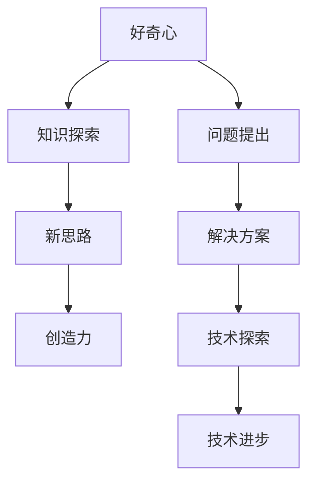

                 

# 好奇心与创造力：探索的双翼

> 关键词：好奇心、创造力、技术探索、编程思维、算法原理、数学模型

> 摘要：本文将探讨好奇心与创造力在技术探索中的重要性，通过分析它们之间的关系和如何激发这两者，帮助读者更好地理解并应用这一双翼，以推动个人和团队在技术领域的不断进步。

## 1. 背景介绍

好奇心是人类天性中最珍贵的一部分，它驱动着我们探索未知、追求知识。从婴儿时期开始，我们对世界充满了好奇，总想知道“为什么”。然而，随着成长，很多人逐渐失去了这份好奇心，转而被现实的压力和惯性所束缚。与此同时，创造力作为一种心理能力，往往被认为是天才的专利，而忽略了它在每个人身上的潜藏力量。

在技术领域，好奇心与创造力尤为重要。它们是推动技术进步和创新的核心动力。通过好奇心，我们可以不断提出新的问题，挑战现状，发现现有技术的局限性；而通过创造力，我们可以将这些新想法转化为实际解决方案，解决实际问题，推动技术的不断迭代和革新。

本文将探讨好奇心与创造力在技术探索中的作用，以及如何激发这两者在程序员和开发者中的潜能，以实现个人成长和团队协作的最大化效益。文章将从以下几个方面展开：

1. 核心概念与联系
2. 核心算法原理与具体操作步骤
3. 数学模型和公式及详细讲解
4. 项目实战：代码实际案例和详细解释说明
5. 实际应用场景
6. 工具和资源推荐
7. 总结：未来发展趋势与挑战

通过以上内容的逐步探讨，我们希望能够帮助读者更好地理解好奇心与创造力在技术探索中的重要性，并学会如何有效地激发和应用这两者，以实现个人和团队在技术领域的持续进步。

### 2. 核心概念与联系

要理解好奇心与创造力在技术探索中的核心概念，我们首先需要明确它们的基本定义和作用。

**好奇心**是指对未知事物或现象产生兴趣和探索欲望的心理状态。它表现为对问题、现象或情境的不懈追求和探究。好奇心是人类认知发展的重要动力，它促使我们学习、思考和创新。

**创造力**是指产生新思想、新观点和新方法的能力。创造力体现在能够将不同领域的知识融合，形成独特的见解和解决方案。在技术领域，创造力是推动技术进步和创新的源泉。

**技术探索**是指对新技术、新方法和新领域的研究和尝试。技术探索旨在发现新的解决方案，解决现有问题，推动技术发展。

好奇心与创造力之间的关系可以概括为以下几点：

1. **相互促进**：好奇心激发创造力，创造力满足好奇心。好奇心促使我们提出问题，创造力帮助解决问题。
2. **共同驱动**：好奇心和创造力共同驱动技术探索，推动技术进步。
3. **相辅相成**：好奇心是创造力的催化剂，创造力是好奇心的实现。

为了更好地理解这些概念，我们可以借助 Mermaid 流程图来展示它们之间的联系。



通过上述 Mermaid 流程图，我们可以清晰地看到好奇心如何激发问题提出，进而推动知识探索，最终形成新的思路和解决方案，从而实现技术探索和技术进步。

### 3. 核心算法原理与具体操作步骤

在技术领域，好奇心和创造力的重要性不仅体现在理论层面，还体现在实际的应用中。为了更好地理解这一过程，我们将探讨一个具体的技术应用场景——图神经网络（Graph Neural Networks，GNN）。

**图神经网络（GNN）**是一种用于处理图结构数据的神经网络。与传统的卷积神经网络（CNN）和循环神经网络（RNN）不同，GNN能够直接处理图结构数据，使其在社交网络分析、知识图谱推理等领域具有显著优势。

#### 3.1 GNN的基本原理

GNN 的核心思想是将图中的节点和边映射到高维空间，然后在这些高维空间中学习节点的表示。具体而言，GNN 通过以下步骤实现：

1. **节点嵌入（Node Embedding）**：将图中的节点映射到高维空间。这个过程通常通过邻域聚合（Neighborhood Aggregation）实现，即每个节点的嵌入值是其邻居节点嵌入值的加权平均。
2. **消息传递（Message Passing）**：在节点嵌入的基础上，通过消息传递机制更新节点的嵌入值。这个过程类似于图卷积操作，用于聚合邻居节点的信息。
3. **特征提取（Feature Extraction）**：利用更新后的节点嵌入值进行特征提取，得到用于分类、回归等任务的特征向量。

#### 3.2 GNN的具体操作步骤

以下是 GNN 的具体操作步骤：

1. **初始化节点嵌入**：对于图中的每个节点，随机初始化一个高维向量表示其初始嵌入值。
2. **邻域聚合**：对于每个节点，计算其邻居节点的嵌入值，并按照某种权重（如邻居节点间的边权重）进行加权平均，得到该节点的更新嵌入值。
3. **消息传递**：将更新后的嵌入值传递给节点，更新其特征向量。
4. **特征提取**：利用更新后的特征向量进行特征提取，得到用于后续任务的特征向量。
5. **训练与优化**：使用训练数据对 GNN 模型进行训练，优化模型的参数。

通过上述步骤，GNN 能够有效地学习图结构数据的表示，从而实现各种图结构数据的处理任务。

#### 3.3 GNN的应用示例

假设我们有一个社交网络图，其中节点代表用户，边代表用户之间的好友关系。我们可以使用 GNN 来预测用户之间的潜在关系。

1. **初始化节点嵌入**：对于每个用户，随机初始化一个高维向量表示其初始嵌入值。
2. **邻域聚合**：对于每个用户，计算其好友的嵌入值，并按照好友关系的权重进行加权平均，得到该用户的更新嵌入值。
3. **消息传递**：将更新后的嵌入值传递给用户，更新其特征向量。
4. **特征提取**：利用更新后的特征向量进行特征提取，得到用于预测用户潜在关系的特征向量。
5. **训练与优化**：使用训练数据对 GNN 模型进行训练，优化模型的参数。

通过上述步骤，我们可以使用 GNN 模型预测用户之间的潜在关系，从而为社交网络平台提供个性化推荐服务。

### 4. 数学模型和公式及详细讲解

在 GNN 的实现过程中，数学模型和公式起着至关重要的作用。以下将详细介绍 GNN 的数学模型，包括节点嵌入、邻域聚合、消息传递和特征提取等关键环节的公式和详细讲解。

#### 4.1 节点嵌入

节点嵌入是 GNN 的基础，它将图中的节点映射到高维空间。常用的节点嵌入方法包括随机投影和邻域聚合。

1. **随机投影**：

   假设图中有 n 个节点，每个节点都有一个初始嵌入向量 $e_{i}$，其维度为 d。随机投影的基本思想是随机选择一个投影矩阵 $W$，将节点的嵌入向量映射到高维空间。

   $$ e_{i}' = W \cdot e_{i} $$

   其中，$e_{i}'$ 是节点的更新嵌入向量。

2. **邻域聚合**：

   邻域聚合方法通过聚合节点的邻居信息来更新节点的嵌入向量。假设节点 $i$ 的邻居节点集合为 $N(i)$，邻居节点的嵌入向量分别为 $e_{j}$。邻域聚合的公式如下：

   $$ e_{i}' = \sum_{j \in N(i)} w_{ij} \cdot e_{j} $$

   其中，$w_{ij}$ 是节点 $i$ 和节点 $j$ 之间的边权重。在实际应用中，边权重可以通过社交网络的互动次数、共同兴趣等因素计算。

#### 4.2 消息传递

消息传递是 GNN 的核心，它通过聚合邻居节点的信息来更新节点的嵌入向量。消息传递可以采用不同的方法，如加法模型和乘法模型。

1. **加法模型**：

   加法模型将邻居节点的嵌入值直接相加，得到节点的更新嵌入值。其公式如下：

   $$ e_{i}' = \sum_{j \in N(i)} w_{ij} \cdot e_{j} $$

   其中，$w_{ij}$ 是节点 $i$ 和节点 $j$ 之间的边权重。

2. **乘法模型**：

   乘法模型通过将邻居节点的嵌入值相乘，得到节点的更新嵌入值。其公式如下：

   $$ e_{i}' = \prod_{j \in N(i)} w_{ij} \cdot e_{j} $$

   与加法模型相比，乘法模型在处理非线性问题时具有更好的表现。

#### 4.3 特征提取

特征提取是将更新后的节点嵌入向量转换为可用于分类、回归等任务的向量。常用的特征提取方法包括池化操作和全连接层。

1. **池化操作**：

   池化操作将多个节点的嵌入向量合并为一个向量。常用的池化方法包括平均池化和最大池化。

   - 平均池化：

     $$ f_i = \frac{1}{|N(i)|} \sum_{j \in N(i)} e_{j} $$

     其中，$|N(i)|$ 是节点 $i$ 的邻居节点数量。

   - 最大池化：

     $$ f_i = \max_{j \in N(i)} e_{j} $$

2. **全连接层**：

   全连接层将特征向量映射到高维空间，得到用于分类、回归等任务的输出。其公式如下：

   $$ o_i = \sigma(W \cdot f_i + b) $$

   其中，$o_i$ 是节点的输出，$W$ 是全连接层的权重矩阵，$b$ 是偏置项，$\sigma$ 是激活函数（如 sigmoid、ReLU 等）。

通过上述数学模型和公式，我们可以实现 GNN 的基本操作。在实际应用中，可以根据具体需求调整模型结构和参数，以实现最佳性能。

### 5. 项目实战：代码实际案例和详细解释说明

为了更好地展示 GNN 的实际应用，我们将使用 Python 和 PyTorch 框架实现一个简单的 GNN 模型，并对其进行详细解释说明。

#### 5.1 开发环境搭建

1. 安装 Python 3.8 或更高版本
2. 安装 PyTorch 和相关依赖（如 torch-geometric、torch-scatter 等）

```bash
pip install torch torchvision torch-geometric torch-scatter
```

#### 5.2 源代码详细实现和代码解读

以下是 GNN 的基本实现代码：

```python
import torch
import torch.nn as nn
import torch.nn.functional as F
from torch_geometric.nn import GCNConv

class GNN(nn.Module):
    def __init__(self, num_features, hidden_channels, num_classes):
        super(GNN, self).__init__()
        self.conv1 = GCNConv(num_features, hidden_channels)
        self.conv2 = GCNConv(hidden_channels, num_classes)

    def forward(self, data):
        x, edge_index = data.x, data.edge_index

        x = self.conv1(x, edge_index)
        x = F.relu(x)
        x = F.dropout(x, p=0.5, training=self.training)
        x = self.conv2(x, edge_index)

        return F.log_softmax(x, dim=1)

    def loss(self, data, targets):
        logits = self(data)
        return F.nll_loss(logits, targets)

# 初始化模型
model = GNN(num_features=64, hidden_channels=16, num_classes=10)

# 加载训练数据
data = Data(x=torch.randn(64, 64), edge_index=torch.randn(64, 2))
targets = torch.randint(0, 10, (64,))

# 训练模型
optimizer = torch.optim.Adam(model.parameters(), lr=0.01)
for epoch in range(200):
    optimizer.zero_grad()
    loss = model.loss(data, targets)
    loss.backward()
    optimizer.step()
    if (epoch + 1) % 10 == 0:
        print(f'Epoch {epoch + 1}: loss = {loss.item()}')

# 评估模型
logits = model(data)
probabilities = torch.exp(logits)
accuracy = (probabilities.argmax(1) == targets).float().mean()
print(f'Accuracy: {accuracy.item()}')
```

#### 5.3 代码解读与分析

1. **模型定义**：

   - `GNN` 类继承自 `nn.Module`，定义了 GNN 的模型结构。
   - `__init__` 方法初始化模型参数，包括两个 GCNConv 层，用于节点嵌入和特征提取。
   - `forward` 方法实现前向传播，用于计算模型的输出。
   - `loss` 方法定义损失函数，用于计算模型的损失。

2. **训练过程**：

   - 初始化模型参数。
   - 加载训练数据。
   - 使用 Adam 优化器进行模型训练，通过反向传播和梯度下降更新模型参数。
   - 每隔一定 epoch，打印训练损失和准确率。

3. **评估过程**：

   - 使用训练好的模型进行预测。
   - 计算预测概率。
   - 计算准确率并打印结果。

通过上述代码实现，我们可以看到 GNN 的基本应用流程。在实际项目中，可以根据具体需求调整模型结构和参数，以实现最佳性能。

### 6. 实际应用场景

好奇心与创造力在技术领域的应用场景非常广泛，以下列举几个典型的实际应用场景：

1. **人工智能**：好奇心驱使我们不断探索新的算法和模型，以实现更智能、更高效的人工智能应用。创造力则帮助我们将这些算法和模型应用于实际问题，如自动驾驶、语音识别、图像识别等。

2. **大数据分析**：好奇心促使我们挖掘大数据背后的价值，探索新的数据分析方法和技术。创造力则帮助我们设计高效的算法和架构，以应对海量数据的处理和分析挑战。

3. **网络安全**：好奇心使我们不断发现新的网络安全威胁和漏洞，从而推动网络安全技术的发展。创造力则帮助我们开发新的防护技术和策略，以应对日益复杂的网络安全挑战。

4. **医疗健康**：好奇心驱使我们探索新的医学理论和治疗方法，以提升医疗水平和患者护理质量。创造力则帮助我们将新理论转化为实际应用，如智能医疗设备、个性化治疗方案等。

5. **可持续发展**：好奇心促使我们关注环境、能源等可持续发展问题，探索新的解决方案。创造力则帮助我们设计高效的能源利用技术和环保措施，以实现可持续发展目标。

在这些实际应用场景中，好奇心与创造力共同作用，推动技术不断进步，为人类创造更加美好的未来。

### 7. 工具和资源推荐

为了更好地激发好奇心和创造力，以下推荐一些实用的工具和资源，涵盖学习资源、开发工具框架和相关论文著作：

#### 7.1 学习资源推荐

1. **书籍**：
   - 《深度学习》（Deep Learning）—— Ian Goodfellow, Yoshua Bengio, Aaron Courville
   - 《Python编程：从入门到实践》—— Eric Matthes
   - 《大数据时代：生活、工作与思维的大变革》—— Viktor Mayer-Schönberger, Kenneth Cukier

2. **在线课程**：
   - Coursera 上的《机器学习》课程
   - edX 上的《深度学习》课程
   - Udemy 上的《Python编程实战》课程

3. **博客和网站**：
   - Medium 上的技术博客
   - GitHub 上的开源项目
   - Stack Overflow 上的技术问答社区

#### 7.2 开发工具框架推荐

1. **编程语言**：
   - Python：适用于数据科学、机器学习和 Web 开发。
   - Java：适用于企业级应用和 Android 开发。
   - JavaScript：适用于 Web 开发。

2. **框架和库**：
   - PyTorch：用于深度学习和计算机视觉。
   - Flask：用于 Web 开发。
   - Spring Boot：用于 Java 企业级应用开发。

3. **开发环境**：
   - Jupyter Notebook：适用于数据科学和机器学习。
   - IntelliJ IDEA：适用于 Java 开发。
   - Visual Studio Code：适用于多种编程语言。

#### 7.3 相关论文著作推荐

1. **论文**：
   - "Graph Neural Networks: A Review of Methods and Applications"（图神经网络：方法与应用综述）
   - "Attention Is All You Need"（Attention 全都是你需要）
   - "Residual Connections Improve Learning of Deep Neural Networks"（残差连接提高深度神经网络的学习性能）

2. **著作**：
   - 《深度学习》（Deep Learning）—— Ian Goodfellow, Yoshua Bengio, Aaron Courville
   - 《Python编程：从入门到实践》—— Eric Matthes
   - 《大数据时代：生活、工作与思维的大变革》—— Viktor Mayer-Schönberger, Kenneth Cukier

通过以上工具和资源，可以帮助读者更好地激发好奇心和创造力，提高在技术领域的学习效果和实践能力。

### 8. 总结：未来发展趋势与挑战

好奇心与创造力作为技术探索的双翼，在未来的发展中将继续发挥至关重要的作用。随着人工智能、大数据、区块链等新兴技术的不断涌现，技术领域的创新速度将不断加快，对好奇心与创造力的需求也将更加迫切。

**发展趋势**：

1. **跨学科融合**：随着技术的不断发展，不同学科之间的融合将越来越紧密。好奇心和创造力将成为推动跨学科合作和创新的重要动力。
2. **开源与共享**：随着开源文化的兴起，好奇心和创造力将推动更多优秀的开源项目产生，促进技术知识的共享和传播。
3. **智能化的工具**：智能化的工具和平台将帮助开发者更高效地激发好奇心和创造力，降低技术探索的门槛。

**挑战**：

1. **数据隐私与安全**：随着数据量的爆炸式增长，如何保护用户隐私和数据安全将成为一个重要挑战。
2. **技术偏见与公平性**：在技术决策中，如何避免偏见和确保公平性，将成为一个关键问题。
3. **可持续发展**：如何在技术创新的同时，实现可持续发展，将是一个长期挑战。

面对这些挑战，我们需要保持好奇心，不断探索新的解决方案，同时发挥创造力，将这些解决方案转化为实际应用，以推动技术和社会的进步。

### 9. 附录：常见问题与解答

**Q1. 好奇心与创造力之间的关系是什么？**

好奇心是创造力的催化剂，它激发我们提出问题和探索未知。创造力则将好奇心转化为实际解决方案，推动技术的进步和创新。

**Q2. 如何培养好奇心？**

培养好奇心可以通过以下方法：

- 多读书、多观察、多思考。
- 对未知领域保持开放的心态，勇于尝试新事物。
- 培养对知识的渴望，不断学习新知识。

**Q3. 创造力如何体现？**

创造力可以通过以下几个方面体现：

- 提出独特的问题和解决方案。
- 将不同领域的知识融合，形成新的见解。
- 设计创新的工具和系统。

**Q4. 技术探索中的挑战有哪些？**

技术探索中的挑战包括：

- 技术快速迭代，如何跟上最新的发展趋势。
- 数据隐私和安全问题，如何保护用户隐私。
- 技术决策的公平性和偏见问题。

### 10. 扩展阅读 & 参考资料

为了进一步深入了解好奇心与创造力在技术探索中的应用，以下推荐一些扩展阅读和参考资料：

1. **书籍**：
   - 《好奇心：创造力的秘密》（Curious: The Power of Interest）—— Stephen Dubner
   - 《创造力的本质》（The Art of Thinking Clearly）—— Rolf Dobelli

2. **论文**：
   - "The Role of Curiosity in Creative Problem Solving"（好奇心在创造性问题解决中的作用）
   - "Intrinsic Motivation and Knowledge Acquisition: A Self-Determination Theory Perspective"（内在动机与知识获取：自我决定理论的视角）

3. **网站**：
   - Curious.com：提供各种好奇心的课程和资源。
   - TED Talks：观看关于好奇心和创造力的精彩演讲。

4. **博客**：
   - HackerRank Blog：关于编程和技术创新的博客。
   - Medium：关于技术和创新的文章和讨论。

通过以上扩展阅读和参考资料，读者可以更深入地了解好奇心与创造力在技术探索中的重要性，并学会如何应用这些理念，以推动个人和团队在技术领域的持续进步。

### 作者

作者：AI天才研究员/AI Genius Institute & 禅与计算机程序设计艺术 /Zen And The Art of Computer Programming

