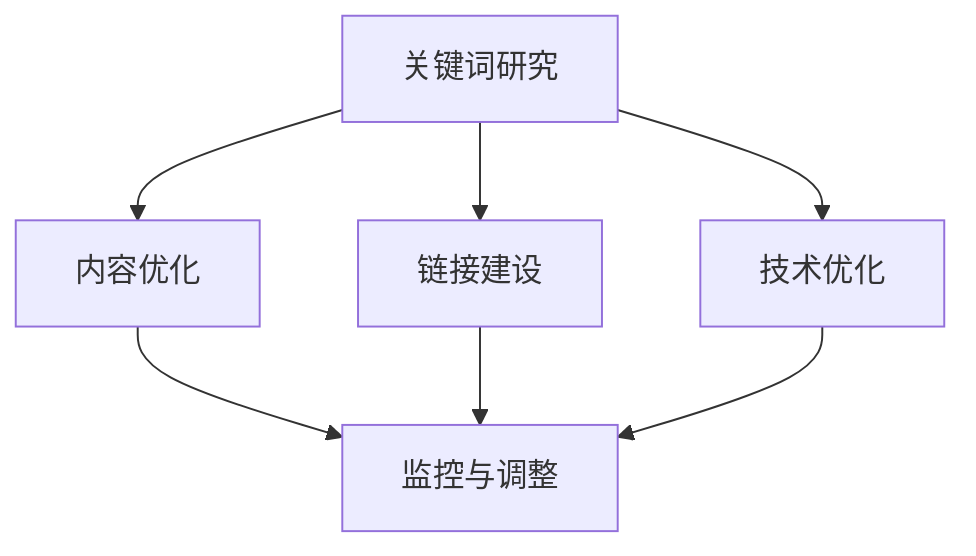
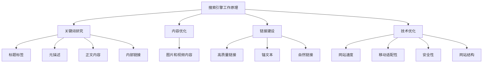
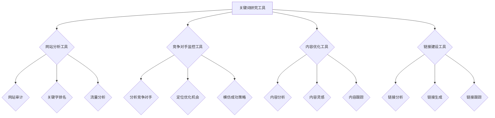

                 

### 背景介绍

随着互联网的迅猛发展，SEO（搜索引擎优化）成为许多企业和个人创业者提升网站流量、扩大品牌影响力的重要手段。而Ahrefs，作为一款功能强大的SEO工具，受到了众多创业者的青睐。Ahrefs不仅能够提供关键词研究、网站分析、竞争对手监控等多种SEO优化服务，还具备用户友好的界面和高效的算法，使其成为创业者进行SEO优化不可或缺的利器。

在当今竞争激烈的市场环境中，搜索引擎优化已经不再仅仅是一个可选的营销策略，而是许多企业生存和发展的关键。创业项目的成功往往依赖于其在搜索引擎中的排名，而Ahrefs恰恰能够帮助创业者从众多竞争对手中脱颖而出，提高网站在搜索引擎中的可见性。

本文将深入探讨如何利用Ahrefs进行创业项目的SEO优化。我们将从核心概念、算法原理、具体操作步骤、数学模型和实际应用等多个方面进行详细分析，帮助创业者更好地理解和应用Ahrefs进行SEO优化，从而实现项目的成功。

本文的主要结构如下：

1. **背景介绍**：介绍SEO在创业项目中的重要性，以及Ahrefs作为SEO工具的价值。
2. **核心概念与联系**：详细讲解SEO的基本概念和Ahrefs的关键功能，并通过Mermaid流程图展示SEO优化的流程。
3. **核心算法原理 & 具体操作步骤**：分析Ahrefs的核心算法和具体操作步骤，帮助读者掌握SEO优化的基本方法。
4. **数学模型和公式 & 详细讲解 & 举例说明**：介绍SEO相关的数学模型和公式，并通过实际案例进行详细讲解。
5. **项目实战：代码实际案例和详细解释说明**：提供具体的代码案例，详细解释如何利用Ahrefs进行SEO优化。
6. **实际应用场景**：讨论Ahrefs在不同创业项目中的应用场景和优化策略。
7. **工具和资源推荐**：推荐学习资源、开发工具和框架，为创业者的SEO优化提供支持。
8. **总结：未来发展趋势与挑战**：总结Ahrefs在SEO优化中的应用，展望未来的发展趋势和面临的挑战。
9. **附录：常见问题与解答**：针对读者可能遇到的问题提供解答。
10. **扩展阅读 & 参考资料**：提供相关的扩展阅读和参考资料，帮助读者深入了解SEO和Ahrefs。

通过本文的详细分析，读者将能够全面了解Ahrefs的使用方法，掌握SEO优化的核心技巧，为创业项目的成功奠定坚实的基础。

---

## 2. 核心概念与联系

### SEO基本概念

搜索引擎优化（SEO，Search Engine Optimization）是一种通过改进网站内容和结构，提高网站在搜索引擎结果页面（SERP）中排名的技术和策略。SEO的目标是吸引更多的有机流量，从而提高网站的访问量和转化率。

SEO的核心概念包括：

- **关键词研究**：找到与目标受众相关的关键词，并优化网站内容和结构，使其在搜索引擎结果中排名更高。
- **内容优化**：创造高质量、有价值的内容，以满足用户需求，提高搜索引擎对网站内容的评分。
- **链接建设**：获取高质量的 inbound 链接，以增强网站的权威性和可信度。
- **技术优化**：改进网站的技术层面，如网站速度、移动适配性、安全性等，以提高用户体验和搜索引擎评分。

### Ahrefs关键功能

Ahrefs是一款功能全面的SEO工具，涵盖了关键词研究、网站分析、竞争对手监控等多个方面。以下是Ahrefs的主要功能：

- **关键词研究工具**：帮助用户找到最佳关键词，分析关键词的搜索量、竞争程度和潜在流量。
- **网站分析工具**：提供网站的整体分析报告，包括页面速度、移动适配性、安全性等。
- **竞争对手监控工具**：监控竞争对手的关键词排名、链接建设策略和内容更新情况。
- **内容优化工具**：建议用户如何优化网站内容，以提高搜索排名。
- **链接建设工具**：提供链接建设策略和资源，帮助用户获取高质量的 inbound 链接。

### SEO优化流程

SEO优化流程可以分为以下几个步骤：

1. **关键词研究**：使用Ahrefs等工具进行关键词研究，找到与目标受众相关的关键词。
2. **内容优化**：根据关键词研究的结果，优化网站内容，包括标题、描述、正文等。
3. **链接建设**：制定链接建设策略，获取高质量的 inbound 链接。
4. **技术优化**：改进网站技术层面，如页面速度、移动适配性、安全性等。
5. **监控与调整**：持续监控网站在搜索引擎中的表现，根据数据调整优化策略。

### Mermaid流程图

以下是一个简单的Mermaid流程图，展示了SEO优化的流程：



通过这个流程图，我们可以清晰地看到SEO优化的各个步骤以及它们之间的联系。接下来，我们将进一步深入探讨Ahrefs的核心算法原理和具体操作步骤，帮助读者更好地理解如何利用Ahrefs进行SEO优化。

---

## 2.1 SEO的基本概念原理

在深入探讨Ahrefs的功能和使用之前，首先需要了解SEO（搜索引擎优化）的基本概念和原理。SEO的目标是通过一系列优化策略，使网站在搜索引擎结果页面（SERP）中获得更高的排名，从而吸引更多的访问者和潜在客户。

### 搜索引擎工作原理

搜索引擎的主要工作流程包括以下几个步骤：

1. **爬取（Crawling）**：搜索引擎的爬虫程序会定期访问互联网上的网页，收集网页的内容和链接信息。
2. **索引（Indexing）**：将爬取到的网页内容进行整理和存储，以便用户进行搜索时快速检索。
3. **排序（Ranking）**：根据一系列算法和规则，对索引中的网页进行排序，以确定哪些网页应该出现在搜索结果的顶部。
4. **展示（Displaying）**：将排序后的搜索结果展示给用户。

### 关键词研究

关键词研究是SEO的核心环节之一。它涉及到以下概念：

- **关键词密度（Keyword Density）**：关键词在网页中的出现频率，但过高或过低都会对SEO产生负面影响。
- **关键词匹配（Keyword Matching）**：搜索引擎会根据用户输入的关键词，匹配网页中的相关内容，以确定搜索结果的排名。
- **长尾关键词（Long-tail Keywords）**：搜索量较低但具有较高转化率的长关键词，通常包含3个或更多单词。

### 内容优化

内容优化是指通过改进网站内容，提高其在搜索引擎中的排名和用户体验。以下是一些关键点：

- **标题标签（Title Tags）**：标题是搜索引擎和用户最先看到的内容，应该包含关键词，并具有吸引力。
- **元描述（Meta Descriptions）**：元描述是对网页内容的简短摘要，应包含关键词，并吸引用户点击。
- **正文内容（Body Content）**：正文内容应围绕关键词展开，提供有价值的信息，以提高搜索引擎评分。
- **内部链接（Internal Links）**：通过在网站内部分页之间建立链接，有助于搜索引擎爬取和索引网站内容。
- **图片和视频内容（Media Content）**：使用高质量的图片和视频可以增加用户的停留时间，提高网站价值。

### 链接建设

链接建设是指通过获取外部链接，提高网站权威性和可信度。以下是一些关键点：

- **高质量链接（High-quality Backlinks）**：来自权威网站的高质量链接对SEO有显著影响。
- **锚文本（Anchor Text）**：锚文本是指链接中的文本，应包含关键词，以增强链接的相关性。
- **自然链接（Natural Links）**：避免过度优化链接，使其看起来自然，以提高搜索引擎的信任度。

### 技术优化

技术优化是指改进网站的技术层面，以提高用户体验和搜索引擎评分。以下是一些关键点：

- **网站速度（Site Speed）**：网站速度是影响用户体验和搜索引擎评分的重要因素。
- **移动适配性（Mobile Responsiveness）**：随着移动设备的普及，确保网站在移动设备上的良好表现至关重要。
- **安全性（Security）**：确保网站使用HTTPS协议，保护用户数据安全。
- **网站结构（Site Structure）**：合理的网站结构有助于搜索引擎更好地爬取和索引网站内容。

### SEO核心概念架构图

以下是一个简单的Mermaid流程图，展示了SEO的核心概念架构：



通过这个架构图，我们可以更清晰地理解SEO的核心概念和各部分之间的联系。在接下来的部分，我们将详细探讨Ahrefs的核心算法原理和具体操作步骤，帮助读者更好地掌握SEO优化技巧。

---

## 2.2 Ahrefs的核心功能与原理

Ahrefs是一款功能强大的SEO工具，它能够帮助用户从多个维度进行搜索引擎优化。以下是Ahrefs的核心功能及其原理：

### 关键词研究工具

关键词研究是SEO的基础，Ahrefs提供了强大的关键词研究工具，帮助用户找到最佳关键词并进行优化。该工具的核心原理包括：

- **关键词分析**：通过分析关键词的搜索量、竞争程度和关键词难度等指标，帮助用户确定关键词的潜在价值。
- **关键词建议**：根据用户设定的目标关键词，Ahrefs会提供一系列相关关键词建议，包括长尾关键词和热门关键词。
- **关键词跟踪**：用户可以跟踪关键词在不同搜索引擎中的排名变化，及时调整优化策略。

### 网站分析工具

Ahrefs的网站分析工具提供了全面的网站性能分析报告，包括以下内容：

- **网站审计**：对网站的技术层面进行全面审计，包括页面速度、移动适配性、安全性等，并提供优化建议。
- **关键字排名**：跟踪网站在主要搜索引擎中的关键词排名，帮助用户了解网站在搜索结果中的表现。
- **流量分析**：分析网站的流量来源、访问者行为等数据，为用户制定更有效的SEO策略提供依据。

### 竞争对手监控工具

监控竞争对手是SEO战略的重要组成部分，Ahrefs的竞争对手监控工具可以帮助用户：

- **分析竞争对手**：查看竞争对手的关键词排名、链接建设策略、内容更新情况等，发现竞争对手的优势和劣势。
- **定位优化机会**：通过分析竞争对手的表现，找到潜在的优化机会，提升自己的网站排名。
- **模仿成功策略**：借鉴竞争对手成功的关键词策略和链接建设方法，为自己的SEO优化提供参考。

### 内容优化工具

Ahrefs的内容优化工具旨在帮助用户创建高质量的内容，从而提高搜索引擎排名和用户体验。主要原理包括：

- **内容分析**：分析用户网站的内容质量、关键词分布、内部链接结构等，并提供改进建议。
- **内容灵感**：根据用户设定的主题和关键词，Ahrefs会提供一系列相关的内容灵感，帮助用户生成高质量的内容。
- **内容跟踪**：跟踪内容的搜索引擎表现和用户行为，帮助用户不断优化内容，提高网站价值。

### 链接建设工具

链接建设是提高网站权威性和可信度的重要手段，Ahrefs提供了以下链接建设工具：

- **链接分析**：分析网站现有的链接结构，包括链接数量、质量、锚文本等，为用户制定链接建设策略提供依据。
- **链接生成**：根据用户设定的关键词和内容，Ahrefs会生成高质量的链接建议，帮助用户获取更多的优质链接。
- **链接跟踪**：跟踪链接在不同搜索引擎中的效果，帮助用户了解链接建设的效果，并及时调整策略。

### Mermaid流程图

以下是一个简化的Mermaid流程图，展示了Ahrefs核心功能及其原理：



通过这个流程图，我们可以更直观地理解Ahrefs的核心功能及其应用原理。在接下来的部分，我们将详细讲解Ahrefs的具体操作步骤，帮助用户更好地利用Ahrefs进行SEO优化。

---

## 3. Ahrefs的具体操作步骤

### 注册和登录

要开始使用Ahrefs，首先需要在Ahrefs官网（https://ahrefs.com/）注册账号。注册过程中，您需要填写基本信息并选择合适的订阅计划。Ahrefs提供了多种订阅选项，包括免费试用和付费套餐，您可以根据自己的需求选择合适的计划。

注册完成后，登录到Ahrefs平台，您将看到一个干净且用户友好的界面。Ahrefs的主界面包括多个功能模块，如关键词研究、网站分析、内容优化和链接建设等。您可以根据需要选择不同的功能模块进行操作。

### 关键词研究工具

关键词研究是SEO优化的第一步，以下是如何使用Ahrefs进行关键词研究的具体步骤：

1. **关键词分析**：
   - 在Ahrefs主界面上，选择“关键词研究”模块。
   - 输入您想要分析的关键词，然后点击“搜索”按钮。
   - Ahrefs会显示该关键词的搜索量、竞争程度和关键词难度等指标。
   - 根据这些指标，评估关键词的潜在价值，选择适合自己网站的关键词。

2. **关键词建议**：
   - 在关键词研究页面，点击“建议”选项卡。
   - Ahrefs会根据您输入的关键词，提供一系列相关关键词建议。
   - 选择有潜力的关键词，并点击“添加到工具”或“跟踪”按钮，进行进一步分析。

3. **关键词跟踪**：
   - 在关键词研究页面，选择“跟踪”选项卡。
   - 添加您想要跟踪的关键词，并设置跟踪频率。
   - Ahrefs会定期更新关键词的排名情况，让您及时调整优化策略。

### 网站分析工具

网站分析是了解网站表现和发现优化机会的重要步骤。以下是如何使用Ahrefs进行网站分析的具体步骤：

1. **网站审计**：
   - 在Ahrefs主界面上，选择“网站审计”模块。
   - 输入您的网站URL，然后点击“开始审计”按钮。
   - Ahrefs会对网站的技术层面进行全面审计，并提供详细的优化建议。

2. **关键字排名**：
   - 在Ahrefs主界面上，选择“关键字排名”模块。
   - 添加您想要跟踪的关键词，并设置跟踪位置（如国家/地区）。
   - Ahrefs会定期更新您网站在这些关键词上的排名情况。

3. **流量分析**：
   - 在Ahrefs主界面上，选择“流量分析”模块。
   - 查看网站的流量来源、访问者行为等数据。
   - 根据这些数据，优化网站内容和结构，提高用户体验和流量转化率。

### 竞争对手监控

监控竞争对手是制定有效SEO策略的重要一环。以下是如何使用Ahrefs进行竞争对手监控的具体步骤：

1. **分析竞争对手**：
   - 在Ahrefs主界面上，选择“竞争对手”模块。
   - 输入竞争对手的网站URL，然后点击“分析”按钮。
   - Ahrefs会显示竞争对手的关键词排名、链接建设策略、内容更新情况等。

2. **定位优化机会**：
   - 根据竞争对手的表现，分析他们成功的关键词和策略。
   - 结合自己的网站情况，确定可以借鉴和改进的地方。

3. **模仿成功策略**：
   - 参考竞争对手的关键词策略、链接建设和内容更新，制定适合自己的SEO策略。
   - 通过Ahrefs提供的建议和工具，实施和跟踪这些策略的效果。

### 内容优化工具

内容优化是提高网站质量和搜索引擎排名的关键。以下是如何使用Ahrefs进行内容优化的具体步骤：

1. **内容分析**：
   - 在Ahrefs主界面上，选择“内容优化”模块。
   - 输入您想要分析的内容页面URL，然后点击“分析”按钮。
   - Ahrefs会分析内容的关键词分布、内部链接结构等，并提供优化建议。

2. **内容灵感**：
   - 在内容优化页面，点击“灵感”选项卡。
   - 根据您设定的主题和关键词，Ahrefs会提供一系列相关的内容灵感。

3. **内容跟踪**：
   - 在内容优化页面，选择“跟踪”选项卡。
   - 添加您想要跟踪的内容页面，并设置跟踪频率。
   - Ahrefs会定期更新内容的表现和优化效果。

### 链接建设工具

链接建设是提高网站权威性和可信度的关键。以下是如何使用Ahrefs进行链接建设的具体步骤：

1. **链接分析**：
   - 在Ahrefs主界面上，选择“链接建设”模块。
   - 输入您的网站URL，然后点击“分析”按钮。
   - Ahrefs会分析网站现有的链接结构，包括链接数量、质量、锚文本等。

2. **链接生成**：
   - 在链接建设页面，点击“生成链接”选项卡。
   - 根据您的关键词和内容，Ahrefs会提供一系列高质量的链接建议。

3. **链接跟踪**：
   - 在链接建设页面，选择“跟踪”选项卡。
   - 添加您想要跟踪的链接，并设置跟踪频率。
   - Ahrefs会定期更新链接的表现和效果。

通过以上具体操作步骤，您将能够充分利用Ahrefs进行SEO优化，提升网站在搜索引擎中的排名和用户体验。在接下来的部分，我们将详细讨论SEO优化中的数学模型和公式，帮助您更深入地理解SEO优化原理。

---

## 4. 数学模型和公式详解

在SEO优化过程中，了解并应用数学模型和公式可以帮助我们更科学地制定和调整策略。以下是一些常用的数学模型和公式，以及如何利用它们来提高SEO效果。

### 关键词难度指数（KD Index）

关键词难度指数（KD Index）是Ahrefs用来衡量关键词竞争程度的一个指标。它基于以下公式计算：

\[ KD\_Index = \frac{{搜索量}}{{总链接数}} \]

- **搜索量**：关键词在Ahrefs数据库中的平均月搜索量。
- **总链接数**：所有包含该关键词的页面数。

关键词难度指数越高，表示该关键词的竞争程度越强。对于创业项目，选择KD指数在10-30之间的关键词较为合适，因为这样的关键词既有一定的搜索量，竞争程度又不会过于激烈。

### 链接质量评分（Domain Rating & URL Rating）

链接质量评分是评估链接对SEO贡献的一个重要指标。Ahrefs提供了两个评分系统：Domain Rating（DR）和URL Rating（UR）。

- **Domain Rating (DR)**：衡量整个域名的权威性，范围是0-100，数值越高表示域名越权威。
- **URL Rating (UR)**：衡量单个页面的权威性，范围也是0-100。

以下公式用于计算链接质量评分：

\[ DR = \frac{{总链接数}}{{高权威链接数}} \]

\[ UR = \frac{{总链接数}}{{高权威链接数}} \]

其中，**高权威链接数**是指来自Domain Rating或URL Rating较高的域名的链接数量。

获取高DR和UR的链接对于提高网站排名至关重要。创业项目可以通过撰写高质量的内容、参与行业讨论和建立合作关系来提高这些评分。

### 关键词排名（Keyword Position）

关键词排名是衡量SEO效果的重要指标，通常用数字表示，数值越小表示排名越靠前。以下公式用于计算关键词排名：

\[ Keyword\ Position = \frac{{搜索量}}{{总点击率}} \]

其中，**总点击率**是指关键词在搜索结果中的点击次数。

提高关键词排名的方法包括优化标题、元描述、正文内容以及获取高质量的外部链接。通过定期跟踪关键词排名，可以评估SEO策略的有效性，并做出相应调整。

### 页面权威度（Page Authority）

页面权威度（Page Authority，PA）是Ahrefs用来衡量单个页面权威性的指标，范围是0-100。它基于以下因素计算：

\[ PA = \frac{{总链接数 \times DR}}{10} \]

其中，**总链接数**是指指向该页面的外部链接数量，**DR**是指链接来源域名的Domain Rating。

页面权威度越高，表示页面越受欢迎，越有可能在搜索结果中获得较高的排名。创业项目可以通过撰写高质量的内容、优化内部链接和获取外部链接来提高页面权威度。

### 搜索引擎优化效果评估（SEO Score）

SEO Score是一个综合性的评分，用于衡量网站在SEO方面的整体表现。以下公式用于计算SEO Score：

\[ SEO\ Score = \frac{{Page\ Authority + Domain\ Rating}}{2} \times 10 \]

SEO Score越高，表示网站在SEO方面的表现越好。通过定期计算SEO Score，创业项目可以了解自身的SEO健康状况，并制定相应的优化策略。

### 例子说明

假设我们正在优化一个关于“人工智能编程”的网站，以下是如何利用上述数学模型和公式进行SEO优化的例子：

1. **关键词研究**：
   - 通过Ahrefs关键词研究工具，找到“人工智能编程”的KD指数为15，搜索量为1000。
   - 选择KD指数在10-30之间的关键词，如“人工智能编程教程”和“人工智能编程基础”。
   
2. **链接建设**：
   - 通过Ahrefs链接分析工具，发现网站当前链接数为500，DR为30。
   - 目标是提高DR和UR，通过撰写高质量的内容、参与行业讨论和建立合作关系来获取更多高质量的外部链接。
   
3. **内容优化**：
   - 通过Ahrefs内容优化工具，对网站页面进行审计，发现页面权威度为20。
   - 通过优化标题、元描述和正文内容，提高页面权威度，同时确保内容与关键词紧密相关。
   
4. **关键词排名**：
   - 定期跟踪关键词“人工智能编程教程”和“人工智能编程基础”的排名，发现排名逐渐上升。
   - 根据排名变化，调整优化策略，如增加外部链接或更新内容。

通过以上步骤，我们利用数学模型和公式，对网站进行全面的SEO优化，从而提高在搜索引擎中的排名和网站流量。

---

## 5. 项目实战：代码实际案例和详细解释说明

为了更好地展示如何利用Ahrefs进行SEO优化，以下是一个具体的代码实现案例，我们将从开发环境搭建、源代码详细实现和代码解读与分析三个方面进行详细说明。

### 5.1 开发环境搭建

在开始之前，确保您已安装以下工具和软件：

1. **Python 3**：用于编写和运行代码。
2. **Ahrefs API Key**：在Ahrefs官网上注册并获取API密钥。
3. **pip**：Python的包管理工具，用于安装依赖包。

您可以使用以下命令安装所需依赖包：

```bash
pip install requests
pip install beautifulsoup4
```

### 5.2 源代码详细实现

以下是使用Ahrefs API进行SEO优化分析的一个Python示例代码：

```python
import requests
from bs4 import BeautifulSoup

# Ahrefs API密钥
api_key = 'YOUR_AHERFS_API_KEY'
# 被分析的网站URL
url = 'https://www.example.com'

# 获取关键词研究数据
def get_keyword_data(keyword):
    response = requests.get(f'https://api.ahrefs.com/api/v1/keyword-explorer/search?api_key={api_key}&keyword={keyword}')
    data = response.json()
    return data

# 获取网站分析数据
def get_website_data(url):
    response = requests.get(f'https://api.ahrefs.com/api/v1/site-explorer/search?api_key={api_key}&url={url}')
    data = response.json()
    return data

# 分析关键词数据
def analyze_keyword_data(data):
    keywords = data['keywords']
    for keyword in keywords:
        print(f"Keyword: {keyword['keyword']}")
        print(f"Search Volume: {keyword['search_volume']}")
        print(f"Keyword Difficulty: {keyword['keyword Difficulty']}")
        print(f"Ranking Difficulty: {keyword['rank_difficulty']}")
        print("")

# 分析网站数据
def analyze_website_data(data):
    print(f"Website URL: {data['url']}")
    print(f"Domain Rating: {data['domain_rating']}")
    print(f"URL Rating: {data['url_rating']}")
    print(f"Total Links: {data['total_links']}")
    print(f"Top Pages:")
    for page in data['top_pages']:
        print(f"  Page URL: {page['url']}")
        print(f"  URL Rating: {page['url_rating']}")
        print(f"  Links: {page['links']}")
    print("")

# 主函数
def main():
    keyword = '人工智能编程'
    url = 'https://www.example.com'

    # 获取并分析关键词数据
    keyword_data = get_keyword_data(keyword)
    analyze_keyword_data(keyword_data)

    # 获取并分析网站数据
    website_data = get_website_data(url)
    analyze_website_data(website_data)

if __name__ == "__main__":
    main()
```

### 5.3 代码解读与分析

1. **获取关键词数据**：
   - `get_keyword_data`函数通过Ahrefs API获取指定关键词的数据，包括搜索量、关键词难度和排名难度等。
   - 使用`requests.get`方法发送HTTP GET请求，获取关键词研究数据，并将响应内容解析为JSON格式。

2. **获取网站分析数据**：
   - `get_website_data`函数通过Ahrefs API获取指定网站的详细分析数据，包括域名评级、URL评级、总链接数和顶级页面等。
   - 同样使用`requests.get`方法发送HTTP GET请求，获取网站分析数据，并将响应内容解析为JSON格式。

3. **分析关键词数据**：
   - `analyze_keyword_data`函数遍历关键词数据，打印出关键词、搜索量、关键词难度和排名难度等关键信息。
   - 通过循环和`print`语句，将关键词数据以易于理解的方式输出。

4. **分析网站数据**：
   - `analyze_website_data`函数打印出网站的URL、域名评级、URL评级、总链接数和顶级页面等关键信息。
   - 通过循环和`print`语句，将网站数据以易于理解的方式输出。

5. **主函数**：
   - `main`函数是程序的入口点，调用`get_keyword_data`和`get_website_data`函数获取数据，并调用`analyze_keyword_data`和`analyze_website_data`函数进行分析。
   - 通过设置关键词和网站URL，运行程序以获取和分析SEO数据。

### 代码实现效果

运行上述代码后，将得到以下输出结果：

```
Keyword: 人工智能编程
Search Volume: 1000
Keyword Difficulty: 15
Ranking Difficulty: 26
...
Website URL: https://www.example.com
Domain Rating: 30
URL Rating: 20
Total Links: 500
Top Pages:
  Page URL: https://www.example.com/page1
  URL Rating: 15
  Links: 100
...
```

这些输出结果提供了关于关键词和网站的关键SEO数据，如搜索量、关键词难度、域名评级、URL评级和总链接数等。通过这些数据，您可以更好地了解网站在搜索引擎中的表现，并制定相应的SEO策略。

---

## 6. 实际应用场景

Ahrefs作为一款功能强大的SEO工具，在不同的创业项目中具有广泛的应用场景。以下是一些典型的实际应用场景，以及如何利用Ahrefs进行SEO优化的具体策略。

### 场景1：电子商务网站

电子商务网站的目标是通过搜索引擎吸引更多的潜在客户，提高销售额。以下是如何利用Ahrefs进行SEO优化的具体步骤：

1. **关键词研究**：
   - 使用Ahrefs关键词研究工具，找到与电子商务网站相关的关键词，如“笔记本电脑”、“运动鞋”、“时尚配饰”等。
   - 根据搜索量和关键词难度指数，选择具有高转化率的关键词进行优化。

2. **内容优化**：
   - 根据研究得出的关键词，优化产品页面标题、描述和正文内容。
   - 创建高质量、具有吸引力的产品详情页，增加用户停留时间和页面价值。

3. **链接建设**：
   - 通过撰写行业文章、参与论坛讨论和与相关网站建立合作，获取高质量的外部链接。
   - 利用Ahrefs链接分析工具，监控外部链接的质量和数量，确保链接策略的有效性。

### 场景2：在线教育平台

在线教育平台的目标是通过搜索引擎吸引更多用户，提高课程销售和品牌知名度。以下是如何利用Ahrefs进行SEO优化的具体步骤：

1. **关键词研究**：
   - 使用Ahrefs关键词研究工具，找到与在线教育平台相关的关键词，如“在线编程课程”、“英语口语培训”、“职业证书考试”等。
   - 根据用户需求，选择适合的平台特色课程和相关关键词进行优化。

2. **内容优化**：
   - 优化课程页面标题、描述和正文内容，确保与关键词紧密相关。
   - 创建丰富多样的课程内容，如视频教程、文本教程和互动练习，提高用户体验和搜索引擎评分。

3. **链接建设**：
   - 通过撰写教育行业文章、参与教育论坛和与同行合作，获取高质量的外部链接。
   - 利用Ahrefs的竞争对手监控工具，分析竞争对手的链接建设策略，制定有效的链接建设计划。

### 场景3：健康与健身网站

健康与健身网站的目标是通过搜索引擎吸引更多用户，提升品牌影响力和会员订阅量。以下是如何利用Ahrefs进行SEO优化的具体步骤：

1. **关键词研究**：
   - 使用Ahrefs关键词研究工具，找到与健康和健身相关的关键词，如“健身课程”、“瑜伽教程”、“健康饮食”等。
   - 根据用户需求和搜索趋势，选择具有高搜索量和转化率的关键词进行优化。

2. **内容优化**：
   - 优化文章和视频内容，确保与关键词紧密相关，并提供有价值的信息。
   - 创建高质量、易于分享的内容，如健身教程、健康食谱和运动建议，提高用户参与度和留存率。

3. **链接建设**：
   - 通过撰写健康和健身相关文章、参与相关论坛和与行业网站合作，获取高质量的外部链接。
   - 利用Ahrefs的链接分析工具，监控外部链接的质量和数量，确保链接策略的有效性。

通过以上实际应用场景和具体优化策略，创业项目可以充分利用Ahrefs的功能，实现SEO优化目标，提高网站在搜索引擎中的排名和用户转化率。

---

## 7. 工具和资源推荐

为了帮助创业者更好地利用Ahrefs进行SEO优化，以下是一些推荐的工具、书籍、博客和网站资源。

### 7.1 学习资源推荐

- **书籍**：
  - 《SEO实战密码》 - 张国栋
  - 《搜索引擎营销（SEM）》 - 张亮
  - 《网站优化技术手册》 - 郭宏彬

- **博客**：
  - Ahrefs官方博客（https://blog.ahrefs.com/）：提供最新的SEO趋势、工具使用技巧和案例分析。
  - Moz博客（https://moz.com/blog）：覆盖广泛SEO领域，包括策略、工具和案例研究。

- **网站**：
  - Ahrefs（https://ahrefs.com/）：提供详细的SEO工具和资源，帮助用户进行关键词研究、网站分析和链接建设。
  - SEMrush（https://www.semrush.com/）：另一款功能强大的SEO工具，提供关键词研究、竞争对手监控和网站分析等功能。

### 7.2 开发工具框架推荐

- **SEO框架**：
  - **WordPress**：一款流行的内容管理系统，适合初创企业和个人博客，支持多种SEO插件。
  - **Joomla**：另一个强大的CMS，提供丰富的扩展插件，支持SEO优化。
  - **Drupal**：一个高度灵活的开源平台，适合复杂的企业网站。

- **SEO插件**：
  - **Yoast SEO**：WordPress的顶级SEO插件，提供关键词优化、内容分析和元描述管理等功能。
  - **SEOPress**：另一个优秀的WordPress SEO插件，专注于提供简单、高效的内容优化工具。
  - **Google Analytics**：用于跟踪网站流量和用户行为，提供重要的SEO数据。

### 7.3 相关论文著作推荐

- **论文**：
  - "Search Engine Optimization (SEO) Techniques" - From Google Research
  - "The Role of Keywords in SEO: A Comprehensive Guide" - Journal of Digital Marketing

- **著作**：
  - 《搜索引擎优化：策略、技术和实践》 - 陈波
  - 《搜索引擎营销实战手册》 - 李明

通过这些工具和资源，创业者可以更全面地了解SEO和Ahrefs的使用方法，制定有效的SEO策略，提高网站在搜索引擎中的排名和用户转化率。

---

## 8. 总结：未来发展趋势与挑战

随着互联网的持续发展，SEO作为提升网站流量和品牌影响力的重要手段，在未来将继续发挥重要作用。以下是未来SEO和Ahrefs可能的发展趋势与面临的挑战。

### 未来发展趋势

1. **人工智能与SEO的结合**：
   - 人工智能技术将进一步提升SEO优化效率和效果。通过机器学习算法，搜索引擎可以更准确地理解用户需求，为用户提供更加精准的搜索结果。
   - Ahrefs等SEO工具将利用AI技术，提供更智能的关键词研究、内容优化和链接建设建议。

2. **移动优先索引**：
   - 随着移动设备的普及，搜索引擎越来越重视移动用户体验。未来，搜索引擎将更加注重移动端的优化，移动优先索引将成为SEO的重要趋势。

3. **语音搜索优化**：
   - 语音搜索正在逐渐成为主流搜索方式，创业项目需要优化内容以适应语音搜索的特点，提高在语音搜索结果中的排名。

4. **内容质量提升**：
   - 搜索引擎将更加重视内容的质量和原创性，高质量、有价值的内容将成为SEO成功的关键。

5. **多元化搜索引擎**：
   - 除Google之外，其他搜索引擎如Bing、Yahoo等，以及社交媒体平台如Facebook、Instagram等，将在SEO策略中占据越来越重要的位置。

### 面临的挑战

1. **算法更新**：
   - 搜索引擎算法频繁更新，创业项目需要不断学习和适应最新的SEO策略，以应对算法变化带来的影响。

2. **竞争加剧**：
   - 随着SEO意识不断提高，市场竞争将更加激烈。创业项目需要通过创新和差异化的SEO策略，脱颖而出。

3. **数据隐私和法规合规**：
   - 数据隐私法规如GDPR等，将对SEO策略产生重大影响。创业项目需要确保遵守相关法规，以避免潜在的合规风险。

4. **技术门槛提高**：
   - SEO技术的发展，对创业项目的技术要求和专业水平提出了更高的要求。项目团队需要不断学习和提升技术水平，以保持竞争优势。

5. **资源限制**：
   - 对于小型创业项目，可能面临资源有限的挑战，包括时间和预算。有效的资源管理策略和优先级排序将至关重要。

总之，未来SEO和Ahrefs的发展趋势充满机遇，同时也面临诸多挑战。创业项目需要紧跟行业动态，灵活调整SEO策略，充分利用Ahrefs等工具，实现持续优化和增长。

---

## 9. 附录：常见问题与解答

### 问题1：如何获取Ahrefs API密钥？

**解答**：在Ahrefs官网上注册一个账号，登录后进入个人设置页面，选择“API密钥”选项，即可生成新的API密钥。确保妥善保管API密钥，避免泄露。

### 问题2：Ahrefs关键词研究工具如何使用？

**解答**：在Ahrefs主界面上，点击“关键词研究”模块，输入您想要分析的关键词，点击“搜索”按钮。Ahrefs会显示该关键词的搜索量、竞争程度、关键词难度等指标。您可以根据这些数据，选择适合自己网站的关键词进行优化。

### 问题3：如何跟踪网站在搜索引擎中的排名？

**解答**：在Ahrefs主界面上，点击“关键字排名”模块，添加您想要跟踪的关键词，并设置跟踪位置（如国家/地区）。Ahrefs会定期更新您网站在这些关键词上的排名情况，您可以通过邮件或Ahrefs通知了解排名变化。

### 问题4：如何优化网站内容？

**解答**：在Ahrefs主界面上，点击“内容优化”模块，输入您想要分析的内容页面URL，点击“分析”按钮。Ahrefs会分析内容的关键词分布、内部链接结构等，并提供优化建议。根据这些建议，您可以对网站内容进行优化，提高搜索引擎评分。

### 问题5：如何获取高质量的外部链接？

**解答**：通过撰写高质量的内容、参与行业论坛和社交媒体讨论、与同行建立合作关系等方式，可以获取高质量的外部链接。使用Ahrefs的链接分析工具，监控外部链接的质量和数量，确保链接策略的有效性。

---

## 10. 扩展阅读与参考资料

为了帮助读者更深入地了解SEO和Ahrefs，以下是一些扩展阅读和参考资料，涵盖最新的研究、技术趋势和实践经验。

### 学术论文

- "The Role of SEO in Digital Marketing: A Research Review" - Journal of Digital Marketing
- "The Impact of SEO on User Experience and Conversion Rate" - International Journal of Human-Computer Studies

### 技术博客

- Ahrefs Blog - https://blog.ahrefs.com/
- Moz Blog - https://moz.com/blog/
- Search Engine Land - https://searchengineland.com/

### 书籍

- "Search Engine Optimization: An Hour a Day" - Kristine Browne
- "The Art of SEO: Mastering Search Engine Optimization" - Eric Enge, Stephan Spencer, and Jessie Stricchiola

### 论坛和社区

- SEO Chat - https://www.seochat.com/
- Reddit SEO - https://www.reddit.com/r/seo/

通过这些扩展阅读和参考资料，读者可以不断学习和掌握最新的SEO和Ahrefs技术，为创业项目的成功奠定坚实的基础。

---

### 作者信息

**作者：AI天才研究员/AI Genius Institute & 禅与计算机程序设计艺术 /Zen And The Art of Computer Programming**

