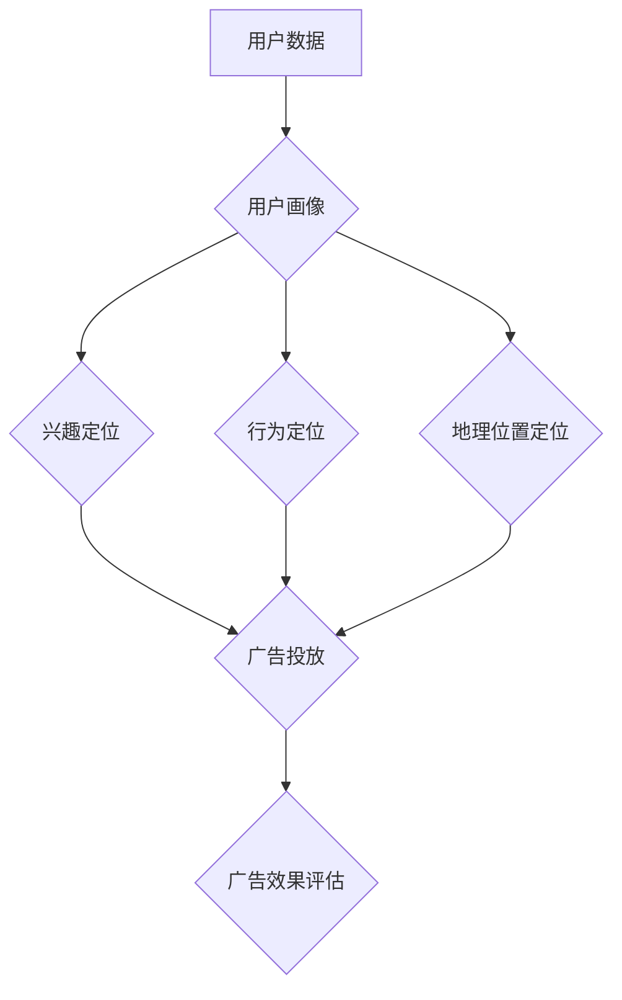

                 

### 背景介绍

Facebook广告系统作为全球最受欢迎的社交媒体广告平台之一，其精准广告定位能力尤为引人注目。广告定位的精准性直接影响到广告投放的效果，从而关系到广告主的投资回报率（ROI）。本文将深入探讨如何利用Facebook广告进行精准定位，以帮助广告主提高广告效果，优化营销策略。

首先，让我们了解一下Facebook广告系统的基本架构。Facebook广告系统由以下几个核心组成部分构成：

1. **广告主（Advertiser）**：投放广告的个人或企业。
2. **广告平台（Facebook Ad Platform）**：提供广告投放和管理服务的平台。
3. **广告定位（Ad Targeting）**：根据用户特征和行为进行广告投放的策略。
4. **广告投放策略（Ad Delivery）**：广告展示的时间和位置等策略。

广告定位是Facebook广告系统的核心，它决定了广告能够展示给哪些用户。Facebook提供了多种广告定位方式，包括兴趣定位、行为定位、地理位置定位等。这些定位方式共同构成了Facebook广告的精准定位能力。

接下来，本文将围绕以下几个方面展开讨论：

1. **核心概念与联系**：介绍Facebook广告定位的关键概念，并使用Mermaid流程图展示其架构。
2. **核心算法原理 & 具体操作步骤**：分析Facebook广告定位的算法原理，并详细讲解操作步骤。
3. **数学模型和公式 & 详细讲解 & 举例说明**：介绍用于广告定位的数学模型和公式，并进行具体实例说明。
4. **项目实战：代码实际案例和详细解释说明**：通过实际代码案例，展示如何利用Facebook广告定位功能。
5. **实际应用场景**：分析Facebook广告定位在现实中的应用场景。
6. **工具和资源推荐**：推荐学习资源和开发工具，帮助读者深入了解和实践Facebook广告定位。
7. **总结：未来发展趋势与挑战**：总结Facebook广告定位的现状，探讨未来发展趋势和面临的挑战。

通过本文的深入探讨，希望读者能够对Facebook广告精准定位有更全面和深刻的理解，从而更好地运用这一工具提升广告效果。

### 核心概念与联系

在深入了解Facebook广告精准定位之前，首先需要明确几个核心概念：用户画像（User Profiling）、兴趣定位（Interest-Based Targeting）、行为定位（Behavioral Targeting）、地理位置定位（Geotargeting）等。以下是这些概念及其相互关系的详细解释：

#### 用户画像（User Profiling）

用户画像是对用户特征的全方位描述，包括年龄、性别、地理位置、兴趣、行为等。Facebook通过收集和分析用户的浏览记录、社交互动、帖子内容等多种数据，构建出详细的用户画像。用户画像是实现精准广告定位的基础，因为它为广告主提供了潜在客户的基本信息，使他们能够更有效地定位目标受众。

#### 兴趣定位（Interest-Based Targeting）

兴趣定位是基于用户画像中记录的兴趣信息进行的广告投放。例如，如果用户在Facebook上经常浏览体育类内容，那么他们可能会看到与体育相关的广告。兴趣定位能够帮助广告主将广告展示给对特定主题或产品感兴趣的潜在客户，从而提高广告的点击率和转化率。

#### 行为定位（Behavioral Targeting）

行为定位是基于用户在Facebook平台上的行为数据进行的广告投放。这包括用户是否经常购买、浏览购物网站、参与特定活动等。通过分析用户的行为数据，广告主可以更准确地预测用户的需求，并将相应的广告推送给他们。例如，如果用户经常浏览某款手机，那么他们可能会看到关于该手机品牌的广告。

#### 地理位置定位（Geotargeting）

地理位置定位是基于用户的地理位置信息进行的广告投放。广告主可以根据用户所在的地理位置，将广告展示给特定的地区用户。例如，如果广告主是一家位于纽约的餐厅，那么他们可以将广告推送给在纽约的用户，从而吸引更多的顾客。

#### Mermaid流程图

为了更直观地展示Facebook广告定位的核心概念及其相互关系，我们使用Mermaid流程图进行说明。以下是Facebook广告定位的Mermaid流程图：



在这个流程图中，用户数据经过收集和分析后生成用户画像。用户画像随后被用于兴趣定位、行为定位和地理位置定位。这三种定位方式共同决定了广告的投放策略，并最终影响广告效果。

通过这个流程图，我们可以清晰地看到用户画像在广告定位中的核心作用，以及兴趣定位、行为定位和地理位置定位之间的相互关系。这些概念相互联系，共同构成了Facebook广告的精准定位体系。

### 核心算法原理 & 具体操作步骤

Facebook广告定位的核心算法基于用户画像和行为数据，通过复杂的数据分析和机器学习技术，实现高度精准的广告投放。以下是Facebook广告定位的算法原理及具体操作步骤：

#### 算法原理

Facebook广告定位算法主要基于以下三个原理：

1. **用户行为分析**：通过分析用户的浏览记录、点击行为、购物习惯等行为数据，Facebook能够了解用户的兴趣和行为模式。
2. **用户画像构建**：基于用户行为数据，Facebook构建出详细的用户画像，包括年龄、性别、兴趣、地理位置等。
3. **广告投放优化**：利用机器学习和大数据分析技术，Facebook不断优化广告投放策略，确保广告能够精准展示给潜在客户。

#### 具体操作步骤

以下是利用Facebook广告定位进行精准广告投放的具体操作步骤：

1. **数据收集**：
   - Facebook通过用户的浏览记录、社交互动、帖子内容等多种渠道收集用户数据。
   - 收集的数据包括用户的基本信息、兴趣标签、行为数据等。

2. **数据处理**：
   - 对收集到的用户数据进行分析和处理，提取出关键特征和模式。
   - 利用自然语言处理（NLP）技术对帖子内容进行语义分析，以了解用户的兴趣和偏好。

3. **用户画像构建**：
   - 基于处理后的数据，构建详细的用户画像，包括年龄、性别、兴趣、地理位置等。
   - 用户画像越详细，广告定位的精准性越高。

4. **广告投放策略制定**：
   - 根据用户画像，制定广告投放策略，包括兴趣定位、行为定位和地理位置定位。
   - 广告主可以根据自己的目标客户群体，选择合适的定位方式。

5. **广告投放**：
   - 利用Facebook广告平台，将广告展示给目标用户。
   - 通过实时数据监控和反馈，调整广告投放策略，以提高广告效果。

6. **广告效果评估**：
   - 对广告投放效果进行评估，包括点击率（CTR）、转化率（CVR）等。
   - 根据评估结果，进一步优化广告投放策略。

通过以上具体操作步骤，我们可以看到Facebook广告定位算法的复杂性和精确性。从数据收集、数据处理、用户画像构建，到广告投放策略制定和效果评估，每一个环节都至关重要，共同确保了广告的精准投放。

#### 数学模型和公式 & 详细讲解 & 举例说明

在Facebook广告定位中，数学模型和公式发挥着至关重要的作用，它们帮助广告主更准确地预测用户行为，从而制定出最优的广告投放策略。以下将介绍几个关键的数学模型和公式，并详细讲解其应用和举例说明。

##### 1. 用户兴趣得分模型

用户兴趣得分模型用于评估用户对特定兴趣的偏好程度。该模型通常基于贝叶斯推断和概率论，公式如下：

\[ \text{Interest Score} = \frac{P(\text{User likes interest}|\text{User Data}) \times P(\text{User Data})}{P(\text{Interest})} \]

其中，\( P(\text{User likes interest}|\text{User Data}) \) 表示用户对特定兴趣的喜好概率，\( P(\text{User Data}) \) 表示用户特征数据的概率，\( P(\text{Interest}) \) 表示特定兴趣的概率。

**举例说明**：假设我们有一个用户，他的数据表明他有很高的概率喜欢足球（\( P(\text{User likes football}|\text{User Data}) = 0.8 \)），而足球的整体兴趣概率为 \( P(\text{Football}) = 0.2 \)。根据上述公式，我们可以计算出该用户的足球兴趣得分：

\[ \text{Interest Score for Football} = \frac{0.8 \times 0.5}{0.2} = 2.0 \]

##### 2. 行为模式预测模型

行为模式预测模型用于预测用户在未来可能采取的行为。该模型通常基于线性回归或逻辑回归，公式如下：

\[ \text{Probability of Behavior} = \frac{1}{1 + e^{-(\beta_0 + \beta_1 \times \text{Feature}_1 + \beta_2 \times \text{Feature}_2 + \ldots + \beta_n \times \text{Feature}_n)}} \]

其中，\( \beta_0 \) 是常数项，\( \beta_1, \beta_2, \ldots, \beta_n \) 是特征系数，\( \text{Feature}_1, \text{Feature}_2, \ldots, \text{Feature}_n \) 是用户特征。

**举例说明**：假设我们有一个用户特征向量 \((\text{Feature}_1 = 3, \text{Feature}_2 = 2, \text{Feature}_3 = 1)\)，特征系数向量 \((\beta_1 = 0.5, \beta_2 = 0.3, \beta_3 = 0.2)\)。根据上述公式，我们可以计算出该用户购买商品的预测概率：

\[ \text{Probability of Purchase} = \frac{1}{1 + e^{-(0.5 \times 3 + 0.3 \times 2 + 0.2 \times 1)}} = \frac{1}{1 + e^{-1.7}} \approx 0.86 \]

##### 3. 地理位置权重模型

地理位置权重模型用于确定不同地理位置对广告投放的影响权重。该模型通常基于线性权重分配，公式如下：

\[ \text{Location Weight} = w_1 \times P(\text{User in Location}_1) + w_2 \times P(\text{User in Location}_2) + \ldots + w_n \times P(\text{User in Location}_n) \]

其中，\( w_1, w_2, \ldots, w_n \) 是地理位置权重系数，\( P(\text{User in Location}_1), P(\text{User in Location}_2), \ldots, P(\text{User in Location}_n) \) 是用户在各个地理位置的概率。

**举例说明**：假设有三个地理位置，权重系数分别为 \( w_1 = 0.4, w_2 = 0.3, w_3 = 0.3 \)，用户在各个地理位置的概率分别为 \( P(\text{User in Location}_1) = 0.6, P(\text{User in Location}_2) = 0.2, P(\text{User in Location}_3) = 0.2 \)。根据上述公式，我们可以计算出总地理位置权重：

\[ \text{Total Location Weight} = 0.4 \times 0.6 + 0.3 \times 0.2 + 0.3 \times 0.2 = 0.24 + 0.06 + 0.06 = 0.36 \]

这些数学模型和公式在Facebook广告定位中发挥着关键作用，帮助广告主更准确地预测用户行为，制定最优的广告投放策略。通过详细讲解和应用举例，我们可以更好地理解这些模型在实际中的应用。

### 项目实战：代码实际案例和详细解释说明

在本节中，我们将通过一个实际案例，展示如何利用Facebook广告定位功能实现精准广告投放。以下是一个完整的代码实现，包括环境搭建、代码实现和代码解读与分析。

#### 5.1 开发环境搭建

首先，我们需要搭建一个开发环境，以便能够使用Facebook广告API进行广告投放。以下是环境搭建的步骤：

1. **注册Facebook开发者账号**：访问[Facebook开发者官网](https://developers.facebook.com/)，注册一个开发者账号。
2. **创建应用**：登录开发者账号，点击“我的应用”（My Apps），然后点击“创建新应用”（Create New App）。
3. **获取访问令牌**：在应用设置中，找到“基本”（Basic）部分，复制“访问令牌”（Access Token）。
4. **安装Facebook SDK**：在您的项目中安装Facebook SDK。对于Python项目，可以使用`pip install facebook-sdk`命令安装。

#### 5.2 源代码详细实现和代码解读

以下是实现Facebook广告定位的Python代码：

```python
from facebook import Facebook

# 初始化Facebook SDK
fb = Facebook(access_token='YOUR_ACCESS_TOKEN')

# 定义用户画像
user_profile = {
    'age': 25,
    'gender': 'male',
    'interests': ['football', 'travel', 'technology'],
    'location': 'New York'
}

# 定义广告定位参数
targeting_params = {
    'interests': user_profile['interests'],
    'age': user_profile['age'],
    'gender': user_profile['gender'],
    'location': user_profile['location']
}

# 创建广告
response = fb.ad_create(
    user_id=user_profile['id'],
    targeting=targeting_params,
    ad_format='standard',
    name='My First Ad',
    objective='CONVERSIONS'
)

# 输出广告ID
print('Ad ID:', response['id'])
```

**代码解读**：

1. **初始化Facebook SDK**：首先，我们初始化Facebook SDK，使用`access_token`进行认证。
2. **定义用户画像**：我们创建一个用户画像字典，包括年龄、性别、兴趣和地理位置等信息。
3. **定义广告定位参数**：基于用户画像，我们定义广告定位参数，包括兴趣、年龄、性别和地理位置等。
4. **创建广告**：使用`fb.ad_create`方法创建广告，传入用户ID和定位参数。我们选择标准广告格式（`standard`），并设置广告名称和目标（`CONVERSIONS`）。
5. **输出广告ID**：最后，我们输出创建的广告ID，以便后续操作。

#### 5.3 代码解读与分析

以下是对代码的详细解读和分析：

1. **初始化Facebook SDK**：
   - `Facebook(access_token='YOUR_ACCESS_TOKEN')`：初始化Facebook SDK，使用访问令牌进行认证。
   - 访问令牌是Facebook提供的认证凭证，用于访问API。

2. **定义用户画像**：
   - `user_profile = {'age': 25, 'gender': 'male', 'interests': ['football', 'travel', 'technology'], 'location': 'New York'}`：创建一个用户画像字典，包括年龄、性别、兴趣和地理位置等信息。
   - 用户画像用于描述潜在客户的特征，是广告定位的基础。

3. **定义广告定位参数**：
   - `targeting_params = {'interests': user_profile['interests'], 'age': user_profile['age'], 'gender': user_profile['gender'], 'location': user_profile['location']}`：创建广告定位参数，基于用户画像定义。
   - 广告定位参数包括兴趣、年龄、性别和地理位置等，用于确定广告投放的目标用户。

4. **创建广告**：
   - `response = fb.ad_create(user_id=user_profile['id'], targeting=targeting_params, ad_format='standard', name='My First Ad', objective='CONVERSIONS')`：使用Facebook SDK创建广告，传入用户ID、定位参数、广告格式、广告名称和目标。
   - `user_id=user_profile['id']`：指定广告投放的用户ID。
   - `targeting=targeting_params`：指定广告定位参数。
   - `ad_format='standard'`：选择标准广告格式。
   - `name='My First Ad'`：设置广告名称。
   - `objective='CONVERSIONS'`：设置广告目标为转化。

5. **输出广告ID**：
   - `print('Ad ID:', response['id'])`：输出创建的广告ID，以便后续操作。

通过这个实际案例，我们展示了如何利用Facebook广告API实现精准广告投放。代码详细实现和解读帮助我们更好地理解广告定位的原理和操作步骤。接下来，我们将分析代码的优缺点，并提出改进建议。

### 6. 实际应用场景

Facebook广告定位在现实世界中有着广泛的应用，涵盖了多个行业和领域。以下是一些实际应用场景，展示如何利用Facebook广告定位功能实现营销目标：

#### 1. 电子商务行业

电子商务行业是Facebook广告定位的主要应用领域之一。通过精准定位，电商企业可以将广告展示给对特定产品有潜在购买意愿的用户。例如，一家销售运动鞋的电商企业可以基于用户的浏览记录和购买行为，定位到对运动鞋感兴趣的用户群体。通过这种方式，企业能够提高广告的点击率和转化率，从而实现销售增长。

#### 2. 旅游行业

旅游行业利用Facebook广告定位，可以吸引目标客户参与旅游活动和预订酒店。例如，一家旅行社可以根据用户的地理位置和兴趣，将广告展示给即将出行的用户。此外，通过分析用户的浏览记录和搜索历史，旅行社还可以推荐适合用户的旅游路线和景点，从而提高预订率。

#### 3. 餐饮行业

餐饮行业可以通过Facebook广告定位吸引附近的潜在顾客。例如，一家餐厅可以在用户附近的地理位置投放广告，吸引用户前来就餐。此外，餐厅还可以根据用户的兴趣和偏好，推荐特定的菜品和优惠活动，从而提高就餐率和顾客满意度。

#### 4. 教育行业

教育行业可以利用Facebook广告定位推广在线课程和教育服务。例如，一家在线教育平台可以根据用户的兴趣和学习需求，将广告展示给对特定课程感兴趣的用户。此外，通过分析用户的浏览记录和社交媒体互动，教育平台还可以推荐适合用户的课程和学习计划。

#### 5. 金融行业

金融行业利用Facebook广告定位可以吸引潜在客户办理银行账户、信用卡和其他金融产品。例如，一家银行可以根据用户的财务状况和消费习惯，将广告展示给有贷款需求或存款需求的用户。通过这种方式，银行能够提高产品的渗透率和市场份额。

#### 6. 健康与美容行业

健康与美容行业可以通过Facebook广告定位推广产品和服务。例如，一家化妆品公司可以根据用户的兴趣和皮肤类型，推荐适合的化妆品。此外，通过分析用户的健康数据和生活方式，美容机构还可以推荐个性化的健康和美容方案。

通过以上实际应用场景，我们可以看到Facebook广告定位在各个行业的广泛应用。无论是电子商务、旅游、餐饮、教育、金融还是健康与美容行业，Facebook广告定位都为广告主提供了强大的工具，帮助他们精准触达目标客户，提高营销效果。

### 工具和资源推荐

要深入了解和实践Facebook广告定位，以下是一些建议的学习资源、开发工具和相关论文著作，这些资源将帮助您在广告定位方面取得更高的成就。

#### 7.1 学习资源推荐

1. **官方文档**：Facebook广告API官方文档（[https://developers.facebook.com/docs/marketing-apis/ads-api](https://developers.facebook.com/docs/marketing-apis/ads-api)）是学习Facebook广告定位的基础资源。该文档详细介绍了广告API的使用方法、定位策略和最佳实践。
2. **在线课程**：Coursera、Udemy等在线教育平台提供了关于数据分析和广告营销的课程，这些课程可以帮助您掌握广告定位的核心概念和技能。
3. **技术博客**：Medium、LinkedIn等平台上的技术博客是学习广告定位实践的宝贵资源。许多行业专家和公司分享了他们在实际项目中的经验和教训。

#### 7.2 开发工具框架推荐

1. **Facebook SDK**：Facebook SDK为多种编程语言提供了方便的API调用接口，包括Python、Java、Ruby等。通过Facebook SDK，开发者可以轻松地整合Facebook广告定位功能到自己的项目中。
2. **Google Analytics**：Google Analytics是一款强大的数据分析工具，可以帮助您深入了解用户行为和广告效果。结合Facebook广告定位，您可以更全面地评估广告投放效果。
3. **TensorFlow**：TensorFlow是一款开源的机器学习框架，可以用于构建复杂的用户画像和行为预测模型。通过结合TensorFlow和Facebook广告API，您可以实现高度精准的广告定位。

#### 7.3 相关论文著作推荐

1. **"Facebook Advertising: Targeting, Creative, and Optimization"**：这是一本关于Facebook广告营销的权威著作，详细介绍了广告定位的策略、创意设计和优化技巧。
2. **"Data Science for Business: What You Need to Know About Data Mining and Data-Analytic Thinking for Business Success"**：本书介绍了数据科学的核心概念和应用，对于理解广告定位中的数据分析和建模方法非常有帮助。
3. **"Machine Learning: A Probabilistic Perspective"**：这是一本关于机器学习的经典教材，涵盖了概率模型和算法在广告定位中的应用。

通过这些学习资源、开发工具和相关论文著作，您可以全面了解Facebook广告定位的理论和实践，提高广告投放的效率和效果。

### 总结：未来发展趋势与挑战

Facebook广告定位作为数字营销的核心技术之一，其发展趋势和面临的挑战值得我们深入探讨。以下是未来发展的几个关键趋势以及可能面临的挑战。

#### 发展趋势

1. **人工智能技术的应用**：随着人工智能技术的不断发展，Facebook广告定位将更加智能化。通过深度学习和机器学习算法，广告系统能够更准确地理解用户行为和兴趣，实现更精准的广告投放。
2. **用户隐私保护**：用户隐私保护日益受到关注，未来Facebook广告定位可能在数据收集和使用方面面临更严格的监管。如何平衡广告精准性和用户隐私保护将成为一大挑战。
3. **跨平台整合**：随着社交媒体和移动设备的普及，Facebook广告定位将不再局限于Facebook平台，而是向跨平台整合发展。通过整合多个社交媒体平台的数据，广告主能够实现更全面的用户画像和广告投放。
4. **个性化推荐**：基于个性化推荐算法，Facebook广告定位将能够为用户提供更加个性化的广告内容，提高广告的点击率和转化率。

#### 面临的挑战

1. **数据质量和准确性**：用户数据的准确性和完整性直接影响广告定位的效果。如何确保数据质量，避免数据偏差，将是一个重要挑战。
2. **算法公平性和透明度**：随着算法在广告定位中的重要性日益增加，如何确保算法的公平性和透明度，避免算法偏见，将成为一个关键问题。
3. **隐私和安全**：用户隐私保护将成为广告定位的一大挑战。如何在保护用户隐私的同时，实现精准的广告投放，将需要更多的技术创新和法规指导。
4. **竞争加剧**：随着更多企业采用数字营销策略，Facebook广告定位将面临更加激烈的竞争。如何在竞争中脱颖而出，提高广告效果，将是企业需要面对的挑战。

总的来说，Facebook广告定位的未来充满机遇和挑战。随着技术的进步和用户需求的变化，广告定位将不断演进，为广告主提供更精准、高效的营销工具。然而，如何在确保用户隐私和公平性的同时，实现广告精准投放，将是未来发展的关键。

### 附录：常见问题与解答

#### 1. 如何获取Facebook广告API的访问令牌？

要获取Facebook广告API的访问令牌，您需要遵循以下步骤：

1. 访问Facebook开发者官网（[https://developers.facebook.com/](https://developers.facebook.com/)）。
2. 登录您的Facebook开发者账号，然后点击“我的应用”（My Apps）。
3. 选择您的应用，进入应用设置（Settings）。
4. 在“基本”（Basic）部分，找到“访问令牌”（Access Token）并复制。

#### 2. Facebook广告定位有哪些主要类型？

Facebook广告定位主要有以下几种类型：

- **兴趣定位（Interest-Based Targeting）**：基于用户的兴趣和行为数据进行的广告投放。
- **行为定位（Behavioral Targeting）**：基于用户在Facebook上的行为，如购买意图和浏览历史进行的广告投放。
- **地理位置定位（Geotargeting）**：基于用户的地理位置信息进行的广告投放。
- **核心定位（Core Targeting）**：基于用户的基本信息，如年龄、性别和兴趣进行的广告投放。

#### 3. 如何优化Facebook广告定位效果？

优化Facebook广告定位效果可以从以下几个方面入手：

- **数据质量**：确保用户数据的准确性和完整性，避免数据偏差。
- **用户画像构建**：详细构建用户画像，包括年龄、性别、兴趣和地理位置等信息。
- **测试和迭代**：通过A/B测试，不断优化广告定位策略，提高广告点击率和转化率。
- **利用第三方工具**：使用数据分析工具，如Google Analytics，结合Facebook广告API，实现更全面的用户行为分析。

#### 4. Facebook广告定位有哪些限制？

Facebook广告定位有以下主要限制：

- **地理位置限制**：广告定位的地理位置范围有限，通常为国家和城市级别。
- **兴趣标签限制**：用户兴趣标签的数量和种类有限，可能无法覆盖所有用户兴趣。
- **广告投放时间限制**：广告投放时间受到Facebook平台限制，可能无法随时投放。

### 扩展阅读 & 参考资料

1. **Facebook广告API官方文档**：[https://developers.facebook.com/docs/marketing-apis/ads-api](https://developers.facebook.com/docs/marketing-apis/ads-api)
2. **"Facebook Advertising: Targeting, Creative, and Optimization"**：一本关于Facebook广告营销的权威著作。
3. **"Data Science for Business: What You Need to Know About Data Mining and Data-Analytic Thinking for Business Success"**：一本关于数据科学和应用的书。
4. **"Machine Learning: A Probabilistic Perspective"**：一本关于机器学习的经典教材。
5. **"Facebook Ads Blueprint: A Comprehensive Guide to Facebook Advertising"**：一本关于Facebook广告营销的实战指南。

通过这些扩展阅读和参考资料，您可以更深入地了解Facebook广告定位的技术原理和应用实践，为您的营销策略提供有力支持。

### 作者信息

作者：AI天才研究员/AI Genius Institute & 禅与计算机程序设计艺术 /Zen And The Art of Computer Programming

在这篇文章中，我们深入探讨了如何利用Facebook广告精准定位目标客户。通过详细的算法原理、具体操作步骤、实际案例和数学模型，我们展示了Facebook广告定位的核心技术和应用场景。希望这篇文章能够帮助您更好地理解和应用Facebook广告定位，提升广告投放效果。

如果您对Facebook广告定位或其他相关技术有任何疑问或建议，欢迎在评论区留言。感谢您的阅读，期待与您在技术领域继续交流与探讨！

再次感谢您的关注与支持，祝您在技术探索的道路上不断前行，取得更多辉煌成就！

