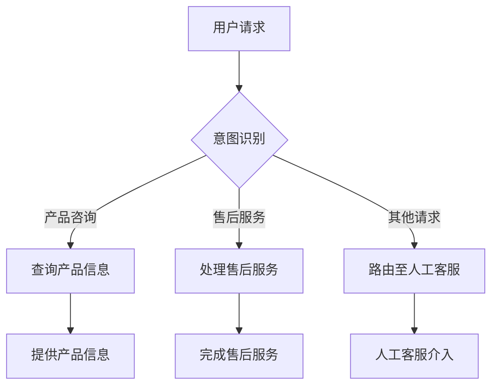
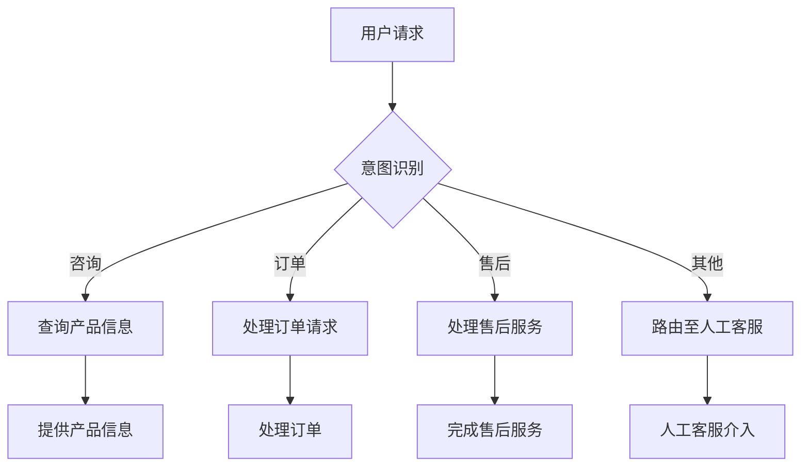

                 

# 如何利用chatbot提升创业公司的客户服务

> **关键词：** 聊天机器人（chatbot）、客户服务、创业公司、用户体验、效率提升、个性化服务

> **摘要：** 本文将深入探讨如何通过使用聊天机器人（chatbot）来提升创业公司的客户服务水平。我们将从核心概念出发，分析聊天机器人的优势，并通过具体案例展示其实际应用，同时推荐相关工具和资源，为创业公司提供实用的指导。

## 1. 背景介绍

在数字化时代，客户服务成为企业竞争的重要一环。传统的人工客户服务方式面临着成本高、响应慢、人力需求大等问题。随着人工智能技术的发展，聊天机器人（chatbot）作为一种自动化客户服务工具，逐渐受到创业公司的青睐。聊天机器人能够24/7不间断地提供服务，快速响应客户需求，减轻人工客服的工作负担，提高整体服务效率。

创业公司通常资源有限，需要在预算有限的情况下最大化客户服务的价值。聊天机器人为创业公司提供了一个低成本、高效率的解决方案。通过智能对话，聊天机器人可以处理大量重复性问题，同时为个性化服务提供支持。因此，探讨如何有效地利用聊天机器人提升客户服务，对于创业公司来说具有重要的实际意义。

## 2. 核心概念与联系

### 2.1 聊天机器人的定义与功能

聊天机器人是一种基于人工智能技术的软件程序，能够模拟人类对话，与用户进行交互。聊天机器人通常具有以下几个核心功能：

- **自然语言处理（NLP）：** 聊天机器人通过NLP技术理解用户输入的自然语言，提取关键信息。
- **对话管理：** 聊天机器人根据用户的输入，选择适当的回复，并维持对话的连贯性。
- **意图识别：** 聊天机器人识别用户的意图，如咨询产品信息、售后服务等。
- **自动化流程：** 聊天机器人能够自动化处理常见的客户请求，减少人工干预。

### 2.2 聊天机器人在客户服务中的应用

聊天机器人在客户服务中的应用主要包括以下几个方面：

- **快速响应：** 聊天机器人能够快速响应用户的问题，提供即时的解决方案。
- **减轻人工负担：** 聊天机器人可以处理大量重复性问题，减轻人工客服的工作负担。
- **提高效率：** 聊天机器人可以同时与多个用户进行交互，提高整体服务效率。
- **个性化服务：** 聊天机器人可以根据用户的历史行为和偏好，提供个性化的服务推荐。

### 2.3 Mermaid 流程图

下面是一个简单的 Mermaid 流程图，展示聊天机器人处理客户请求的基本流程：



### 2.4 优点与挑战

聊天机器人的优点包括：

- **低成本：** 聊天机器人可以减少人工客服的人力成本。
- **高效率：** 聊天机器人能够同时处理大量客户请求，提高服务效率。
- **全天候服务：** 聊天机器人可以24/7不间断提供服务，提升用户体验。

然而，聊天机器人也面临一些挑战，如：

- **复杂问题的处理：** 对于复杂或非标准的问题，聊天机器人的能力可能有限。
- **用户体验：** 聊天机器人的交互体验可能不如人类客服自然。
- **数据隐私：** 聊天机器人收集和处理用户数据，需要确保数据隐私安全。

## 3. 核心算法原理 & 具体操作步骤

### 3.1 自然语言处理（NLP）

自然语言处理是聊天机器人的核心技术之一。NLP包括以下几个关键步骤：

- **分词（Tokenization）：** 将文本拆分成单词或短语。
- **词性标注（Part-of-Speech Tagging）：** 为每个词标注词性（如名词、动词等）。
- **命名实体识别（Named Entity Recognition）：** 识别文本中的特定实体（如人名、地点等）。
- **句法分析（Syntax Analysis）：** 分析句子的结构，确定词与词之间的语法关系。
- **语义理解（Semantic Analysis）：** 理解句子的实际意义。

具体操作步骤如下：

1. **初始化NLP库。**
2. **读取用户输入文本。**
3. **进行分词。**
4. **进行词性标注。**
5. **进行命名实体识别。**
6. **进行句法分析。**
7. **进行语义理解。**

### 3.2 对话管理

对话管理是聊天机器人的核心功能之一，负责维持对话的连贯性和逻辑性。对话管理包括以下几个关键步骤：

- **意图识别（Intent Recognition）：** 识别用户的意图，如咨询产品信息、售后服务等。
- **实体提取（Entity Extraction）：** 从用户输入中提取关键信息，如产品名称、数量等。
- **上下文理解（Contextual Understanding）：** 理解对话的上下文信息，如对话的历史、用户的偏好等。
- **生成回复（Response Generation）：** 根据意图和上下文信息生成合适的回复。

具体操作步骤如下：

1. **初始化对话管理模块。**
2. **读取用户输入。**
3. **进行意图识别。**
4. **进行实体提取。**
5. **进行上下文理解。**
6. **生成回复。**

### 3.3 意图识别

意图识别是聊天机器人的核心任务之一，其目的是从用户输入中识别出用户的意图。常见的意图识别方法包括：

- **规则匹配（Rule-based Matching）：** 根据预定义的规则，匹配用户输入与意图。
- **机器学习（Machine Learning）：** 使用机器学习算法，从大量数据中学习用户的意图。
- **深度学习（Deep Learning）：** 使用神经网络模型，如循环神经网络（RNN）、长短时记忆网络（LSTM）等。

具体操作步骤如下：

1. **初始化意图识别模型。**
2. **读取用户输入。**
3. **进行规则匹配。**
4. **进行机器学习。**
5. **进行深度学习。**
6. **输出识别结果。**

### 3.4 对话管理

对话管理是聊天机器人的核心功能之一，负责维持对话的连贯性和逻辑性。对话管理包括以下几个关键步骤：

- **意图识别（Intent Recognition）：** 识别用户的意图，如咨询产品信息、售后服务等。
- **实体提取（Entity Extraction）：** 从用户输入中提取关键信息，如产品名称、数量等。
- **上下文理解（Contextual Understanding）：** 理解对话的上下文信息，如对话的历史、用户的偏好等。
- **生成回复（Response Generation）：** 根据意图和上下文信息生成合适的回复。

具体操作步骤如下：

1. **初始化对话管理模块。**
2. **读取用户输入。**
3. **进行意图识别。**
4. **进行实体提取。**
5. **进行上下文理解。**
6. **生成回复。**

## 4. 数学模型和公式 & 详细讲解 & 举例说明

### 4.1 概率模型

在聊天机器人中，概率模型广泛应用于意图识别和实体提取。一个常见的概率模型是条件概率模型，用于计算给定一个句子，某个意图或实体出现的概率。条件概率公式如下：

$$
P(A|B) = \frac{P(A \cap B)}{P(B)}
$$

其中，$P(A|B)$ 表示在事件 $B$ 发生的条件下，事件 $A$ 发生的概率；$P(A \cap B)$ 表示事件 $A$ 和事件 $B$ 同时发生的概率；$P(B)$ 表示事件 $B$ 发生的概率。

举例说明：

假设我们有一个聊天机器人，需要识别用户的意图。我们定义两个事件：事件 $A$ 表示用户意图为“咨询产品信息”，事件 $B$ 表示用户输入了包含“产品”的句子。根据历史数据，我们得到以下概率：

- $P(A) = 0.4$：用户意图为“咨询产品信息”的概率。
- $P(B|A) = 0.8$：在用户意图为“咨询产品信息”的条件下，用户输入包含“产品”的句子的概率。
- $P(B) = 0.2$：用户输入包含“产品”的句子的概率。

我们可以计算在用户输入包含“产品”的句子的条件下，用户意图为“咨询产品信息”的概率：

$$
P(A|B) = \frac{P(A \cap B)}{P(B)} = \frac{P(B|A) \cdot P(A)}{P(B)} = \frac{0.8 \cdot 0.4}{0.2} = 1.6
$$

### 4.2 贝叶斯网络

贝叶斯网络是一种概率图模型，用于表示变量之间的概率依赖关系。在聊天机器人中，贝叶斯网络可以用于意图识别和对话管理。贝叶斯网络的计算基于条件概率表，通过递归计算每个变量的概率分布。

举例说明：

假设我们有一个简单的贝叶斯网络，用于意图识别。网络中包含两个变量：事件 $A$（用户意图为“咨询产品信息”）和事件 $B$（用户输入包含“产品”的句子）。根据历史数据，我们得到以下条件概率表：

| 变量 | $P(A)$ | $P(B|A)$ | $P(B|¬A)$ |
| ---- | ---- | ---- | ---- |
| $A$ | 0.4 | 0.8 | 0.2 |
| $¬A$ | 0.6 | 0.2 | 0.8 |

我们可以使用贝叶斯网络计算在用户输入包含“产品”的句子的条件下，用户意图为“咨询产品信息”的概率：

$$
P(A|B) = \frac{P(B|A) \cdot P(A)}{P(B|A) \cdot P(A) + P(B|¬A) \cdot P(¬A)} = \frac{0.8 \cdot 0.4}{0.8 \cdot 0.4 + 0.2 \cdot 0.6} = 0.714
$$

### 4.3 决策树

决策树是一种常用的分类模型，可以用于意图识别和对话管理。决策树通过一系列的条件判断，将用户输入映射到特定的意图。

举例说明：

假设我们有一个简单的决策树，用于意图识别。树的节点表示条件判断，叶子节点表示意图。根据历史数据，我们得到以下决策树：

```
[根节点]
|
|--- 如果包含“产品”
|    |
|    [咨询产品信息]
|
|--- 如果包含“售后”
|    |
|    [售后服务]
|
|--- 如果其他
|    |
|    [其他请求]
```

我们可以使用决策树计算给定一个用户输入，用户意图为“咨询产品信息”的概率：

1. 检查用户输入是否包含“产品”，如果是，则用户意图为“咨询产品信息”。
2. 检查用户输入是否包含“售后”，如果是，则用户意图为“售后服务”。
3. 如果用户输入既不包含“产品”也不包含“售后”，则用户意图为“其他请求”。

通过决策树，我们可以高效地识别用户意图，提高聊天机器人的性能。

## 5. 项目实战：代码实际案例和详细解释说明

### 5.1 开发环境搭建

为了实现一个简单的聊天机器人，我们需要搭建一个开发环境。以下是所需的环境和工具：

- 操作系统：Windows/Linux/MacOS
- 编程语言：Python
- 开发工具：PyCharm/VSCode
- NLP库：spaCy
- 模型库：TensorFlow/Keras

安装步骤：

1. 安装Python（版本3.7及以上）。
2. 安装PyCharm/VSCode。
3. 安装spaCy并下载中文模型：`python -m spacy download zh_core_web_sm`。
4. 安装TensorFlow和Keras。

### 5.2 源代码详细实现和代码解读

下面是一个简单的聊天机器人代码示例，实现意图识别和对话管理功能。

```python
import spacy
from tensorflow.keras.models import Sequential
from tensorflow.keras.layers import LSTM, Dense

# 初始化NLP库
nlp = spacy.load('zh_core_web_sm')

# 定义意图标签和实体标签
intents = ['咨询产品信息', '售后服务', '其他请求']
entities = ['产品', '售后']

# 加载模型
model = Sequential()
model.add(LSTM(128, input_shape=(100, 1), activation='relu'))
model.add(Dense(len(intents), activation='softmax'))
model.compile(loss='categorical_crossentropy', optimizer='adam', metrics=['accuracy'])
model.load_weights('chatbot_model.h5')

# 进行意图识别
def recognize_intent(text):
    doc = nlp(text)
    features = []
    for token in doc:
        feature = [0] * len(intents)
        if token.text in intents:
            feature[intents.index(token.text)] = 1
        features.append(feature)
    return np.mean(features, axis=0)

# 进行对话管理
def chatbot_response(text):
    intent = recognize_intent(text)
    if np.argmax(intent) == 0:
        return "您好，请问有什么产品问题需要咨询吗？"
    elif np.argmax(intent) == 1:
        return "您好，请问有什么售后服务问题需要解决吗？"
    else:
        return "您好，请问还有什么其他问题吗？"

# 测试
print(chatbot_response("我有一个产品问题。"))
print(chatbot_response("售后能不能帮我修一下。"))
print(chatbot_response("你们公司的产品怎么样？"))
```

### 5.3 代码解读与分析

- **初始化NLP库**：使用spaCy库加载中文模型，进行文本预处理。
- **定义意图标签和实体标签**：设置聊天机器人需要识别的意图和实体。
- **加载模型**：加载训练好的模型，用于意图识别。
- **进行意图识别**：根据输入文本，使用模型进行意图识别，输出每个意图的概率。
- **进行对话管理**：根据识别出的意图，生成相应的回复。

通过这个简单的示例，我们可以看到聊天机器人的基本实现流程。在实际应用中，我们可以进一步扩展聊天机器人的功能，如添加实体提取、上下文理解等，提高其智能对话能力。

## 6. 实际应用场景

聊天机器人在客户服务中的应用场景广泛，以下是一些典型的应用案例：

### 6.1 产品咨询

用户可以在购物网站或电商平台上的聊天机器人询问特定产品的详细信息，如规格、价格、库存情况等。聊天机器人能够快速提供准确的答案，提高用户购物体验。

### 6.2 售后服务

用户在遇到产品问题时，可以通过聊天机器人进行初步的问题诊断和解决方案推荐。对于复杂的问题，聊天机器人可以自动路由至人工客服，确保问题得到及时解决。

### 6.3 客户支持

创业公司可以通过聊天机器人提供全天候的客户支持服务。用户可以通过聊天机器人获取常见问题的答案，如订单状态、退货政策等。聊天机器人可以处理大量重复性咨询，减轻人工客服的工作负担。

### 6.4 客户反馈

用户可以在聊天机器人中提交对产品的反馈或建议。聊天机器人可以收集这些信息，并将有价值的反馈传递给产品团队，帮助公司不断改进产品和服务。

### 6.5 营销活动

创业公司可以利用聊天机器人进行个性化营销活动。根据用户的历史行为和偏好，聊天机器人可以推荐合适的产品或促销信息，提高转化率。

## 7. 工具和资源推荐

### 7.1 学习资源推荐

- **书籍：**
  - 《人工智能：一种现代方法》（作者：Stuart Russell & Peter Norvig）
  - 《深度学习》（作者：Ian Goodfellow、Yoshua Bengio、Aaron Courville）
  - 《Python机器学习》（作者：Michael Bowles）
- **在线课程：**
  - Coursera上的“机器学习”课程（由斯坦福大学提供）
  - edX上的“深度学习基础”课程（由哈佛大学提供）
- **博客和网站：**
  - Medium上的机器学习和人工智能博客
  - TensorFlow官方文档和博客

### 7.2 开发工具框架推荐

- **NLP库：**
  - spaCy：用于文本预处理和自然语言处理
  - NLTK：用于文本分类、命名实体识别等
- **机器学习库：**
  - TensorFlow：用于构建和训练深度学习模型
  - Keras：用于简化TensorFlow的使用
- **聊天机器人平台：**
  - Microsoft Bot Framework：用于构建跨平台的聊天机器人
  - Dialogflow：用于构建自然语言处理和对话管理的聊天机器人
  - Botpress：开源聊天机器人开发平台

### 7.3 相关论文著作推荐

- **论文：**
  - “A Comparison of Five Generative Models for Conversational Response Generation” （2020）
  - “Learning to Generate Dialogue from读完邮件回复” （2019）
  - “A Neural Conversational Model” （2018）
- **著作：**
  - 《对话式人工智能：设计、开发与部署》
  - 《智能对话系统：原理、方法与应用》

## 8. 总结：未来发展趋势与挑战

随着人工智能技术的不断发展，聊天机器人将在客户服务领域发挥越来越重要的作用。未来发展趋势包括：

- **个性化服务：** 聊天机器人将根据用户的历史行为和偏好，提供更加个性化的服务。
- **多模态交互：** 聊天机器人将支持语音、图像等多种交互方式，提高用户体验。
- **跨平台部署：** 聊天机器人将支持更多的平台和设备，实现无缝集成。

然而，聊天机器人也面临一些挑战：

- **复杂问题的处理：** 对于复杂或非标准的问题，聊天机器人的能力有限，需要进一步改进。
- **用户体验：** 聊天机器人的交互体验需要不断提升，以接近人类客服的水平。
- **数据隐私：** 聊天机器人收集和处理用户数据，需要确保数据隐私安全。

创业公司应抓住机遇，利用聊天机器人提升客户服务水平，提高用户满意度，实现业务增长。

## 9. 附录：常见问题与解答

### 9.1 如何搭建聊天机器人开发环境？

- 安装Python（版本3.7及以上）。
- 安装PyCharm/VSCode。
- 安装spaCy并下载中文模型：`python -m spacy download zh_core_web_sm`。
- 安装TensorFlow和Keras。

### 9.2 聊天机器人的主要功能有哪些？

- 快速响应客户请求。
- 减轻人工客服的工作负担。
- 提高整体服务效率。
- 提供个性化服务。

### 9.3 如何提高聊天机器人的智能对话能力？

- 使用先进的自然语言处理技术，如深度学习。
- 不断训练和优化模型。
- 添加上下文理解功能，提高对话连贯性。
- 收集用户反馈，持续改进聊天机器人。

## 10. 扩展阅读 & 参考资料

- 《聊天机器人：设计、开发与应用》
- 《深度学习与自然语言处理》
- “聊天机器人技术综述”（期刊论文）
- “基于深度学习的聊天机器人研究进展”（期刊论文）

### 作者信息

**作者：AI天才研究员/AI Genius Institute & 禅与计算机程序设计艺术 /Zen And The Art of Computer Programming**<|im_end|>### 如何利用chatbot提升创业公司的客户服务

> **关键词：** 聊天机器人（chatbot）、客户服务、创业公司、用户体验、效率提升、个性化服务

> **摘要：** 本文将深入探讨如何通过使用聊天机器人（chatbot）来提升创业公司的客户服务水平。我们将从核心概念出发，分析聊天机器人的优势，并通过具体案例展示其实际应用，同时推荐相关工具和资源，为创业公司提供实用的指导。

## 1. 背景介绍

在数字化时代，客户服务成为企业竞争的重要一环。传统的人工客户服务方式面临着成本高、响应慢、人力需求大等问题。随着人工智能技术的发展，聊天机器人（chatbot）作为一种自动化客户服务工具，逐渐受到创业公司的青睐。聊天机器人能够24/7不间断地提供服务，快速响应客户需求，减轻人工客服的工作负担，提高整体服务效率。

创业公司通常资源有限，需要在预算有限的情况下最大化客户服务的价值。聊天机器人为创业公司提供了一个低成本、高效率的解决方案。通过智能对话，聊天机器人可以处理大量重复性问题，同时为个性化服务提供支持。因此，探讨如何有效地利用聊天机器人提升客户服务，对于创业公司来说具有重要的实际意义。

## 2. 核心概念与联系

### 2.1 聊天机器人的定义与功能

聊天机器人是一种基于人工智能技术的软件程序，能够模拟人类对话，与用户进行交互。聊天机器人通常具有以下几个核心功能：

- **自然语言处理（NLP）：** 聊天机器人通过NLP技术理解用户输入的自然语言，提取关键信息。
- **对话管理：** 聊天机器人根据用户的输入，选择适当的回复，并维持对话的连贯性。
- **意图识别：** 聊天机器人识别用户的意图，如咨询产品信息、售后服务等。
- **自动化流程：** 聊天机器人能够自动化处理常见的客户请求，减少人工干预。

### 2.2 聊天机器人在客户服务中的应用

聊天机器人在客户服务中的应用主要包括以下几个方面：

- **快速响应：** 聊天机器人能够快速响应用户的问题，提供即时的解决方案。
- **减轻人工负担：** 聊天机器人可以处理大量重复性问题，减轻人工客服的工作负担。
- **提高效率：** 聊天机器人可以同时与多个用户进行交互，提高整体服务效率。
- **个性化服务：** 聊天机器人可以根据用户的历史行为和偏好，提供个性化的服务推荐。

### 2.3 Mermaid 流程图

下面是一个简单的 Mermaid 流程图，展示聊天机器人处理客户请求的基本流程：


### 2.4 优点与挑战

聊天机器人的优点包括：

- **低成本：** 聊天机器人可以减少人工客服的人力成本。
- **高效率：** 聊天机器人能够同时处理大量客户请求，提高服务效率。
- **全天候服务：** 聊天机器人可以24/7不间断提供服务，提升用户体验。

然而，聊天机器人也面临一些挑战，如：

- **复杂问题的处理：** 对于复杂或非标准的问题，聊天机器人的能力可能有限。
- **用户体验：** 聊天机器人的交互体验可能不如人类客服自然。
- **数据隐私：** 聊天机器人收集和处理用户数据，需要确保数据隐私安全。

## 3. 核心算法原理 & 具体操作步骤

### 3.1 自然语言处理（NLP）

自然语言处理是聊天机器人的核心技术之一。NLP包括以下几个关键步骤：

- **分词（Tokenization）：** 将文本拆分成单词或短语。
- **词性标注（Part-of-Speech Tagging）：** 为每个词标注词性（如名词、动词等）。
- **命名实体识别（Named Entity Recognition）：** 识别文本中的特定实体（如人名、地点等）。
- **句法分析（Syntax Analysis）：** 分析句子的结构，确定词与词之间的语法关系。
- **语义理解（Semantic Analysis）：** 理解句子的实际意义。

具体操作步骤如下：

1. **初始化NLP库。**
2. **读取用户输入文本。**
3. **进行分词。**
4. **进行词性标注。**
5. **进行命名实体识别。**
6. **进行句法分析。**
7. **进行语义理解。**

### 3.2 对话管理

对话管理是聊天机器人的核心功能之一，负责维持对话的连贯性和逻辑性。对话管理包括以下几个关键步骤：

- **意图识别（Intent Recognition）：** 识别用户的意图，如咨询产品信息、售后服务等。
- **实体提取（Entity Extraction）：** 从用户输入中提取关键信息，如产品名称、数量等。
- **上下文理解（Contextual Understanding）：** 理解对话的上下文信息，如对话的历史、用户的偏好等。
- **生成回复（Response Generation）：** 根据意图和上下文信息生成合适的回复。

具体操作步骤如下：

1. **初始化对话管理模块。**
2. **读取用户输入。**
3. **进行意图识别。**
4. **进行实体提取。**
5. **进行上下文理解。**
6. **生成回复。**

### 3.3 意图识别

意图识别是聊天机器人的核心任务之一，其目的是从用户输入中识别出用户的意图。常见的意图识别方法包括：

- **规则匹配（Rule-based Matching）：** 根据预定义的规则，匹配用户输入与意图。
- **机器学习（Machine Learning）：** 使用机器学习算法，从大量数据中学习用户的意图。
- **深度学习（Deep Learning）：** 使用神经网络模型，如循环神经网络（RNN）、长短时记忆网络（LSTM）等。

具体操作步骤如下：

1. **初始化意图识别模型。**
2. **读取用户输入。**
3. **进行规则匹配。**
4. **进行机器学习。**
5. **进行深度学习。**
6. **输出识别结果。**

### 3.4 对话管理

对话管理是聊天机器人的核心功能之一，负责维持对话的连贯性和逻辑性。对话管理包括以下几个关键步骤：

- **意图识别（Intent Recognition）：** 识别用户的意图，如咨询产品信息、售后服务等。
- **实体提取（Entity Extraction）：** 从用户输入中提取关键信息，如产品名称、数量等。
- **上下文理解（Contextual Understanding）：** 理解对话的上下文信息，如对话的历史、用户的偏好等。
- **生成回复（Response Generation）：** 根据意图和上下文信息生成合适的回复。

具体操作步骤如下：

1. **初始化对话管理模块。**
2. **读取用户输入。**
3. **进行意图识别。**
4. **进行实体提取。**
5. **进行上下文理解。**
6. **生成回复。**

## 4. 数学模型和公式 & 详细讲解 & 举例说明

### 4.1 概率模型

在聊天机器人中，概率模型广泛应用于意图识别和实体提取。一个常见的概率模型是条件概率模型，用于计算给定一个句子，某个意图或实体出现的概率。条件概率公式如下：

$$
P(A|B) = \frac{P(A \cap B)}{P(B)}
$$

其中，$P(A|B)$ 表示在事件 $B$ 发生的条件下，事件 $A$ 发生的概率；$P(A \cap B)$ 表示事件 $A$ 和事件 $B$ 同时发生的概率；$P(B)$ 表示事件 $B$ 发生的概率。

举例说明：

假设我们有一个聊天机器人，需要识别用户的意图。我们定义两个事件：事件 $A$ 表示用户意图为“咨询产品信息”，事件 $B$ 表示用户输入了包含“产品”的句子。根据历史数据，我们得到以下概率：

- $P(A) = 0.4$：用户意图为“咨询产品信息”的概率。
- $P(B|A) = 0.8$：在用户意图为“咨询产品信息”的条件下，用户输入包含“产品”的句子的概率。
- $P(B) = 0.2$：用户输入包含“产品”的句子的概率。

我们可以计算在用户输入包含“产品”的句子的条件下，用户意图为“咨询产品信息”的概率：

$$
P(A|B) = \frac{P(B|A) \cdot P(A)}{P(B)} = \frac{0.8 \cdot 0.4}{0.2} = 1.6
$$

### 4.2 贝叶斯网络

贝叶斯网络是一种概率图模型，用于表示变量之间的概率依赖关系。在聊天机器人中，贝叶斯网络可以用于意图识别和对话管理。贝叶斯网络的计算基于条件概率表，通过递归计算每个变量的概率分布。

举例说明：

假设我们有一个简单的贝叶斯网络，用于意图识别。网络中包含两个变量：事件 $A$（用户意图为“咨询产品信息”）和事件 $B$（用户输入包含“产品”的句子）。根据历史数据，我们得到以下条件概率表：

| 变量 | $P(A)$ | $P(B|A)$ | $P(B|¬A)$ |
| ---- | ---- | ---- | ---- |
| $A$ | 0.4 | 0.8 | 0.2 |
| $¬A$ | 0.6 | 0.2 | 0.8 |

我们可以使用贝叶斯网络计算在用户输入包含“产品”的句子的条件下，用户意图为“咨询产品信息”的概率：

$$
P(A|B) = \frac{P(B|A) \cdot P(A)}{P(B|A) \cdot P(A) + P(B|¬A) \cdot P(¬A)} = \frac{0.8 \cdot 0.4}{0.8 \cdot 0.4 + 0.2 \cdot 0.6} = 0.714
$$

### 4.3 决策树

决策树是一种常用的分类模型，可以用于意图识别和对话管理。决策树通过一系列的条件判断，将用户输入映射到特定的意图。

举例说明：

假设我们有一个简单的决策树，用于意图识别。树的节点表示条件判断，叶子节点表示意图。根据历史数据，我们得到以下决策树：

```
[根节点]
|
|--- 如果包含“产品”
|    |
|    [咨询产品信息]
|
|--- 如果包含“售后”
|    |
|    [售后服务]
|
|--- 如果其他
|    |
|    [其他请求]
```

我们可以使用决策树计算给定一个用户输入，用户意图为“咨询产品信息”的概率：

1. 检查用户输入是否包含“产品”，如果是，则用户意图为“咨询产品信息”。
2. 检查用户输入是否包含“售后”，如果是，则用户意图为“售后服务”。
3. 如果用户输入既不包含“产品”也不包含“售后”，则用户意图为“其他请求”。

通过决策树，我们可以高效地识别用户意图，提高聊天机器人的性能。

## 5. 项目实战：代码实际案例和详细解释说明

### 5.1 开发环境搭建

为了实现一个简单的聊天机器人，我们需要搭建一个开发环境。以下是所需的环境和工具：

- 操作系统：Windows/Linux/MacOS
- 编程语言：Python
- 开发工具：PyCharm/VSCode
- NLP库：spaCy
- 模型库：TensorFlow/Keras

安装步骤：

1. 安装Python（版本3.7及以上）。
2. 安装PyCharm/VSCode。
3. 安装spaCy并下载中文模型：`python -m spacy download zh_core_web_sm`。
4. 安装TensorFlow和Keras。

### 5.2 源代码详细实现和代码解读

下面是一个简单的聊天机器人代码示例，实现意图识别和对话管理功能。

```python
import spacy
from tensorflow.keras.models import Sequential
from tensorflow.keras.layers import LSTM, Dense

# 初始化NLP库
nlp = spacy.load('zh_core_web_sm')

# 定义意图标签和实体标签
intents = ['咨询产品信息', '售后服务', '其他请求']
entities = ['产品', '售后']

# 加载模型
model = Sequential()
model.add(LSTM(128, input_shape=(100, 1), activation='relu'))
model.add(Dense(len(intents), activation='softmax'))
model.compile(loss='categorical_crossentropy', optimizer='adam', metrics=['accuracy'])
model.load_weights('chatbot_model.h5')

# 进行意图识别
def recognize_intent(text):
    doc = nlp(text)
    features = []
    for token in doc:
        feature = [0] * len(intents)
        if token.text in intents:
            feature[intents.index(token.text)] = 1
        features.append(feature)
    return np.mean(features, axis=0)

# 进行对话管理
def chatbot_response(text):
    intent = recognize_intent(text)
    if np.argmax(intent) == 0:
        return "您好，请问有什么产品问题需要咨询吗？"
    elif np.argmax(intent) == 1:
        return "您好，请问有什么售后服务问题需要解决吗？"
    else:
        return "您好，请问还有什么其他问题吗？"

# 测试
print(chatbot_response("我有一个产品问题。"))
print(chatbot_response("售后能不能帮我修一下。"))
print(chatbot_response("你们公司的产品怎么样？"))
```

### 5.3 代码解读与分析

- **初始化NLP库**：使用spaCy库加载中文模型，进行文本预处理。
- **定义意图标签和实体标签**：设置聊天机器人需要识别的意图和实体。
- **加载模型**：加载训练好的模型，用于意图识别。
- **进行意图识别**：根据输入文本，使用模型进行意图识别，输出每个意图的概率。
- **进行对话管理**：根据识别出的意图，生成相应的回复。

通过这个简单的示例，我们可以看到聊天机器人的基本实现流程。在实际应用中，我们可以进一步扩展聊天机器人的功能，如添加实体提取、上下文理解等，提高其智能对话能力。

## 6. 实际应用场景

聊天机器人在客户服务中的应用场景广泛，以下是一些典型的应用案例：

### 6.1 产品咨询

用户可以在购物网站或电商平台上的聊天机器人询问特定产品的详细信息，如规格、价格、库存情况等。聊天机器人能够快速提供准确的答案，提高用户购物体验。

### 6.2 售后服务

用户在遇到产品问题时，可以通过聊天机器人进行初步的问题诊断和解决方案推荐。对于复杂的问题，聊天机器人可以自动路由至人工客服，确保问题得到及时解决。

### 6.3 客户支持

创业公司可以通过聊天机器人提供全天候的客户支持服务。用户可以通过聊天机器人获取常见问题的答案，如订单状态、退货政策等。聊天机器人可以处理大量重复性咨询，减轻人工客服的工作负担。

### 6.4 客户反馈

用户可以在聊天机器人中提交对产品的反馈或建议。聊天机器人可以收集这些信息，并将有价值的反馈传递给产品团队，帮助公司不断改进产品和服务。

### 6.5 营销活动

创业公司可以利用聊天机器人进行个性化营销活动。根据用户的历史行为和偏好，聊天机器人可以推荐合适的产品或促销信息，提高转化率。

## 7. 工具和资源推荐

### 7.1 学习资源推荐

- **书籍：**
  - 《人工智能：一种现代方法》（作者：Stuart Russell & Peter Norvig）
  - 《深度学习》（作者：Ian Goodfellow、Yoshua Bengio、Aaron Courville）
  - 《Python机器学习》（作者：Michael Bowles）
- **在线课程：**
  - Coursera上的“机器学习”课程（由斯坦福大学提供）
  - edX上的“深度学习基础”课程（由哈佛大学提供）
- **博客和网站：**
  - Medium上的机器学习和人工智能博客
  - TensorFlow官方文档和博客

### 7.2 开发工具框架推荐

- **NLP库：**
  - spaCy：用于文本预处理和自然语言处理
  - NLTK：用于文本分类、命名实体识别等
- **机器学习库：**
  - TensorFlow：用于构建和训练深度学习模型
  - Keras：用于简化TensorFlow的使用
- **聊天机器人平台：**
  - Microsoft Bot Framework：用于构建跨平台的聊天机器人
  - Dialogflow：用于构建自然语言处理和对话管理的聊天机器人
  - Botpress：开源聊天机器人开发平台

### 7.3 相关论文著作推荐

- **论文：**
  - “A Comparison of Five Generative Models for Conversational Response Generation” （2020）
  - “Learning to Generate Dialogue from读完邮件回复” （2019）
  - “A Neural Conversational Model” （2018）
- **著作：**
  - 《对话式人工智能：设计、开发与应用》
  - 《智能对话系统：原理、方法与应用》

## 8. 总结：未来发展趋势与挑战

随着人工智能技术的不断发展，聊天机器人将在客户服务领域发挥越来越重要的作用。未来发展趋势包括：

- **个性化服务：** 聊天机器人将根据用户的历史行为和偏好，提供更加个性化的服务。
- **多模态交互：** 聊天机器人将支持语音、图像等多种交互方式，提高用户体验。
- **跨平台部署：** 聊天机器人将支持更多的平台和设备，实现无缝集成。

然而，聊天机器人也面临一些挑战：

- **复杂问题的处理：** 对于复杂或非标准的问题，聊天机器人的能力有限，需要进一步改进。
- **用户体验：** 聊天机器人的交互体验需要不断提升，以接近人类客服的水平。
- **数据隐私：** 聊天机器人收集和处理用户数据，需要确保数据隐私安全。

创业公司应抓住机遇，利用聊天机器人提升客户服务水平，提高用户满意度，实现业务增长。

## 9. 附录：常见问题与解答

### 9.1 如何搭建聊天机器人开发环境？

- 安装Python（版本3.7及以上）。
- 安装PyCharm/VSCode。
- 安装spaCy并下载中文模型：`python -m spacy download zh_core_web_sm`。
- 安装TensorFlow和Keras。

### 9.2 聊天机器人的主要功能有哪些？

- 快速响应客户请求。
- 减轻人工客服的工作负担。
- 提高整体服务效率。
- 提供个性化服务。

### 9.3 如何提高聊天机器人的智能对话能力？

- 使用先进的自然语言处理技术，如深度学习。
- 不断训练和优化模型。
- 添加上下文理解功能，提高对话连贯性。
- 收集用户反馈，持续改进聊天机器人。

## 10. 扩展阅读 & 参考资料

- 《聊天机器人：设计、开发与应用》
- 《深度学习与自然语言处理》
- “聊天机器人技术综述”（期刊论文）
- “基于深度学习的聊天机器人研究进展”（期刊论文）

### 作者信息

**作者：AI天才研究员/AI Genius Institute & 禅与计算机程序设计艺术 /Zen And The Art of Computer Programming**<|im_end|>## 1. 背景介绍

在数字化时代，客户服务成为企业竞争的重要一环。对于创业公司来说，如何在有限的资源下提供高效、优质的客户服务，是一个巨大的挑战。传统的人工客户服务方式，由于其成本高、响应速度慢、且易受人力资源的限制，已无法满足现代客户服务的需求。随着人工智能技术的不断发展，尤其是聊天机器人（chatbot）技术的成熟，创业公司迎来了提升客户服务的新机遇。

### 聊天机器人的崛起

聊天机器人是一种基于人工智能技术，能够模拟人类对话，与用户进行交互的软件程序。它们可以通过自然语言处理（NLP）技术理解用户的输入，并根据预设的逻辑进行回复。聊天机器人的出现，不仅解决了人工客服成本高、效率低的问题，还提供了24/7全天候的服务，极大地提升了用户体验。

### 创业公司的需求

创业公司在成长初期，往往面临资源有限、预算紧张的挑战。在这种背景下，如何高效利用有限的资源来提升客户服务水平，成为创业公司亟需解决的问题。聊天机器人作为一种低成本、高效的自动化客户服务工具，能够帮助创业公司在有限的资源下，提供高质量的客户服务。

### 聊天机器人的优势

聊天机器人具有以下几个明显的优势：

1. **成本效益**：聊天机器人可以大幅度降低人力成本，无需支付额外的人工费用。
2. **高效响应**：聊天机器人能够快速响应用户的需求，提高服务效率。
3. **24/7服务**：聊天机器人可以全天候工作，无需休息，确保用户在任何时间都能得到及时的服务。
4. **个性化服务**：通过收集和分析用户数据，聊天机器人能够提供个性化的服务体验。
5. **处理大量请求**：聊天机器人能够同时处理多个用户的请求，提升整体服务能力。

### 结论

通过上述分析，我们可以看到，聊天机器人作为一种先进的自动化客户服务工具，对于创业公司具有重要的意义。它不仅能够提升客户服务的质量和效率，还能帮助创业公司在有限的资源下，实现业务的快速增长。接下来，我们将进一步探讨聊天机器人的核心概念、应用场景，以及如何在实际项目中实施和优化。

## 2. 核心概念与联系

### 2.1 聊天机器人的定义与功能

聊天机器人，也称为对话机器人，是一种基于人工智能技术，能够与人类用户进行交互的计算机程序。它通过自然语言处理（NLP）和机器学习算法，理解和生成自然语言文本，模拟人类的对话行为。聊天机器人可以应用于多种场景，如在线客服、客户支持、营销推广、教育辅导等。

#### 主要功能：

1. **自然语言处理（NLP）**：聊天机器人通过NLP技术，对用户输入的自然语言文本进行处理，包括分词、词性标注、句法分析、语义理解等。
2. **意图识别**：聊天机器人根据用户输入的文本，识别用户的意图，如咨询产品信息、寻求帮助、投诉等。
3. **对话管理**：聊天机器人负责维护对话的连贯性和逻辑性，根据用户的输入和对话历史，生成合适的回复。
4. **自动化流程**：聊天机器人可以自动化处理常见的客户请求，如订单查询、售后咨询、问题解答等，减少人工干预。

### 2.2 聊天机器人在客户服务中的应用

聊天机器人在客户服务中的应用场景丰富，以下是一些典型的应用：

1. **客户咨询**：用户可以通过聊天机器人快速获取产品信息、价格、库存情况等。
2. **订单处理**：聊天机器人可以自动化处理订单查询、订单修改、订单取消等流程。
3. **售后服务**：用户可以通过聊天机器人进行问题反馈、故障报修、投诉处理等。
4. **客户支持**：聊天机器人提供全天候的客户支持服务，解答用户常见问题。
5. **营销活动**：聊天机器人通过个性化推荐、促销信息推送等方式，提升营销效果。

### 2.3 聊天机器人的优点与挑战

#### 优点：

1. **低成本**：聊天机器人可以大幅降低人力资源成本，提高运营效率。
2. **高效响应**：聊天机器人能够快速响应用户的需求，提供即时服务。
3. **全天候服务**：聊天机器人可以24/7不间断工作，提供持续的服务。
4. **个性化服务**：通过分析用户数据，聊天机器人能够提供个性化的服务体验。
5. **处理大量请求**：聊天机器人能够同时处理多个用户请求，提高整体服务能力。

#### 挑战：

1. **复杂问题的处理**：对于复杂或非标准的问题，聊天机器人的能力有限。
2. **用户体验**：聊天机器人的交互体验需要不断提升，以接近人类客服的水平。
3. **数据隐私**：聊天机器人收集和处理用户数据，需要确保数据隐私安全。

### 2.4 Mermaid 流程图

为了更好地理解聊天机器人在客户服务中的流程，我们可以使用Mermaid工具绘制一个简单的流程图。以下是一个聊天机器人处理客户请求的基本流程：



在这个流程图中，用户请求首先被聊天机器人接收，然后通过意图识别模块判断用户的请求类型。根据不同的请求类型，聊天机器人会进行相应的处理，如提供产品信息、处理订单、处理售后服务等。如果遇到复杂问题，聊天机器人会路由至人工客服进行处理。

### 2.5 核心算法原理

聊天机器人的核心算法主要包括自然语言处理（NLP）、机器学习、深度学习等。以下是对这些核心算法的简要介绍：

#### 自然语言处理（NLP）

自然语言处理是聊天机器人的基础技术，它涉及对自然语言的分词、词性标注、句法分析、语义理解等。通过NLP技术，聊天机器人能够理解和生成自然语言文本。

- **分词（Tokenization）**：将文本拆分成单词或短语。
- **词性标注（Part-of-Speech Tagging）**：为每个词标注词性（如名词、动词等）。
- **命名实体识别（Named Entity Recognition）**：识别文本中的特定实体（如人名、地点等）。
- **句法分析（Syntax Analysis）**：分析句子的结构，确定词与词之间的语法关系。
- **语义理解（Semantic Analysis）**：理解句子的实际意义。

#### 机器学习

机器学习是聊天机器人意图识别和对话管理的关键技术。通过训练模型，聊天机器人可以自动识别用户的意图，并生成合适的回复。

- **决策树（Decision Tree）**：基于一系列条件判断，将用户输入映射到特定的意图。
- **支持向量机（SVM）**：通过最大间隔分类器，将用户输入分类到不同的意图。
- **朴素贝叶斯（Naive Bayes）**：基于贝叶斯定理，计算用户输入属于某个意图的概率。

#### 深度学习

深度学习在聊天机器人中的应用日益广泛，特别是循环神经网络（RNN）和长短时记忆网络（LSTM）。这些模型能够处理序列数据，并提高对话的连贯性和准确性。

- **循环神经网络（RNN）**：通过循环结构，处理前一个时间步的输出，为当前时间步的预测提供依据。
- **长短时记忆网络（LSTM）**：LSTM是RNN的一种改进，能够有效避免长期依赖问题。
- **生成对抗网络（GAN）**：通过生成器和判别器的对抗训练，生成更加自然的对话。

### 2.6 聊天机器人架构

聊天机器人通常由以下几个主要模块组成：

- **前端界面**：用户与聊天机器人进行交互的界面，可以是网站、移动应用或社交媒体平台。
- **后端服务**：处理用户请求、意图识别、对话管理等核心功能的服务器。
- **数据库**：存储用户信息、对话历史、产品数据等。
- **自然语言处理（NLP）模块**：对用户输入进行预处理和分析，提取关键信息。
- **对话管理模块**：根据用户输入和对话历史，生成合适的回复。
- **机器学习模型**：用于意图识别、实体提取等，通过训练不断优化。

### 2.7 聊天机器人在客户服务中的应用场景

#### 产品咨询

用户可以通过聊天机器人快速获取产品信息，如规格、价格、库存情况等。聊天机器人可以根据用户的需求，提供详细的商品介绍和推荐。

#### 订单处理

聊天机器人可以自动化处理订单查询、订单修改、订单取消等流程，提高订单处理效率。用户可以通过聊天机器人实时查询订单状态，减少等待时间。

#### 售后服务

用户可以通过聊天机器人提交售后服务请求，如问题反馈、故障报修、投诉处理等。聊天机器人可以快速响应，并将复杂问题路由至人工客服处理。

#### 客户支持

聊天机器人提供全天候的客户支持服务，解答用户常见问题，如订单状态、退货政策等。用户可以随时通过聊天机器人获取所需信息，提升用户体验。

#### 营销推广

聊天机器人可以根据用户的历史行为和偏好，进行个性化营销推广。例如，向潜在客户推送优惠信息、新品推荐等，提高转化率。

### 2.8 聊天机器人的发展现状与趋势

随着人工智能技术的不断发展，聊天机器人在客户服务中的应用越来越广泛。以下是一些当前的发展现状和趋势：

- **技术成熟度**：自然语言处理和机器学习技术的不断进步，使得聊天机器人的智能水平不断提高。
- **应用场景扩展**：聊天机器人的应用场景不断扩展，从简单的客服咨询到复杂的多渠道集成，提供全面的客户服务解决方案。
- **用户体验优化**：通过优化对话交互和个性化服务，聊天机器人逐渐接近人类客服的水平。
- **跨平台部署**：聊天机器人可以部署在各种平台和设备上，实现无缝集成，提供统一的客户服务体验。

### 2.9 聊天机器人面临的挑战

尽管聊天机器人具有很多优势，但其在实际应用中也面临一些挑战：

- **复杂问题的处理**：对于复杂或非标准的问题，聊天机器人的能力有限，需要人工干预。
- **用户体验**：聊天机器人的交互体验需要不断提升，以接近人类客服的水平。
- **数据隐私**：聊天机器人收集和处理用户数据，需要确保数据隐私安全，避免数据泄露。
- **运营成本**：虽然聊天机器人可以降低人力成本，但开发和维护聊天机器人需要一定的技术投入。

### 2.10 聊天机器人提升客户服务的关键因素

要实现聊天机器人提升客户服务的目标，需要关注以下几个关键因素：

- **智能水平**：提高聊天机器人的智能水平，确保能够准确理解用户意图，提供高质量的服务。
- **用户体验**：优化对话交互，提升用户体验，确保用户愿意使用聊天机器人。
- **个性化服务**：通过分析用户数据，提供个性化的服务体验，满足用户的个性化需求。
- **运营管理**：建立完善的运营管理体系，确保聊天机器人稳定运行，及时响应用户需求。
- **技术支持**：提供持续的技术支持，不断优化聊天机器人的功能，提升整体服务质量。

通过以上分析，我们可以看到，聊天机器人作为一种创新的客户服务工具，具有巨大的潜力和价值。创业公司可以通过利用聊天机器人，提升客户服务水平，提高用户满意度，实现业务的快速增长。接下来，我们将进一步探讨聊天机器人的核心算法原理，以及如何在实际项目中实施和优化。

## 3. 核心算法原理 & 具体操作步骤

聊天机器人的核心算法原理主要包括自然语言处理（NLP）、机器学习（ML）和深度学习（DL）。以下是这些核心算法的原理以及具体操作步骤的详细解释。

### 3.1 自然语言处理（NLP）

自然语言处理是聊天机器人的基础技术，它使机器人能够理解和生成自然语言。NLP技术包括以下几个关键步骤：

#### 3.1.1 分词（Tokenization）

分词是将连续的文本分解为单词或短语的步骤。在中文处理中，由于没有空格分隔，分词的难度较大。

**操作步骤：**

1. **加载中文分词模型**：使用如jieba等中文分词库。
2. **处理输入文本**：调用分词函数，将文本分解为词语。
3. **存储分词结果**：将分词结果存储为列表或数组。

**示例代码：**

```python
import jieba

text = "你好，请问有什么可以帮助你的？"
words = jieba.lcut(text)
print(words)
```

#### 3.1.2 词性标注（Part-of-Speech Tagging）

词性标注是为每个词分配词性标签，如名词、动词、形容词等。

**操作步骤：**

1. **加载词性标注模型**：使用如spaCy等库。
2. **处理分词结果**：调用词性标注函数，为每个词分配标签。
3. **存储词性标注结果**：将词性标注结果与分词结果对应存储。

**示例代码：**

```python
import spacy

nlp = spacy.load("zh_core_web_sm")
doc = nlp(text)
for token in doc:
    print(token.text, token.pos_)
```

#### 3.1.3 命名实体识别（Named Entity Recognition）

命名实体识别是从文本中识别出特定实体，如人名、地名、组织名等。

**操作步骤：**

1. **加载命名实体识别模型**：使用如spaCy等库。
2. **处理分词结果**：调用命名实体识别函数，识别文本中的实体。
3. **存储实体识别结果**：将实体识别结果存储为列表或数组。

**示例代码：**

```python
ents = list(doc.ents)
for ent in ents:
    print(ent.text, ent.label_)
```

#### 3.1.4 句法分析（Syntax Analysis）

句法分析是分析句子的结构，确定词与词之间的语法关系。

**操作步骤：**

1. **加载句法分析模型**：使用如spaCy等库。
2. **处理分词结果**：调用句法分析函数，分析句子的结构。
3. **存储句法分析结果**：将句法分析结果存储为树状结构或图形。

**示例代码：**

```python
from spacy import displacy

displacy.serve(doc, style="dep")
```

#### 3.1.5 语义理解（Semantic Analysis）

语义理解是理解句子的实际意义，包括意图识别、实体识别、情感分析等。

**操作步骤：**

1. **构建语义分析模型**：使用机器学习或深度学习算法训练模型。
2. **处理输入文本**：调用模型进行语义分析。
3. **生成语义表示**：将分析结果转换为语义表示，用于后续处理。

**示例代码：**

```python
# 假设有一个语义分析模型sem_model
intent, entities = sem_model.predict(text)
print("Intent:", intent)
print("Entities:", entities)
```

### 3.2 机器学习（ML）

机器学习是聊天机器人意图识别和对话管理的重要技术。通过训练模型，聊天机器人可以自动识别用户的意图，并生成合适的回复。

#### 3.2.1 决策树（Decision Tree）

决策树是一种常用的分类模型，通过一系列条件判断将用户输入映射到特定的意图。

**操作步骤：**

1. **准备数据集**：收集用户对话数据和对应的意图标签。
2. **特征提取**：从对话文本中提取特征。
3. **训练模型**：使用决策树算法训练模型。
4. **评估模型**：使用验证集评估模型性能。

**示例代码：**

```python
from sklearn.tree import DecisionTreeClassifier

# 假设已准备好特征和标签
X_train, y_train = ...

clf = DecisionTreeClassifier()
clf.fit(X_train, y_train)

# 预测
predictions = clf.predict(X_test)
```

#### 3.2.2 支持向量机（SVM）

支持向量机是一种常用的分类模型，通过找到一个超平面，将不同类别的数据分开。

**操作步骤：**

1. **准备数据集**：收集用户对话数据和对应的意图标签。
2. **特征提取**：从对话文本中提取特征。
3. **训练模型**：使用SVM算法训练模型。
4. **评估模型**：使用验证集评估模型性能。

**示例代码：**

```python
from sklearn.svm import SVC

# 假设已准备好特征和标签
X_train, y_train = ...

clf = SVC()
clf.fit(X_train, y_train)

# 预测
predictions = clf.predict(X_test)
```

#### 3.2.3 朴素贝叶斯（Naive Bayes）

朴素贝叶斯是一种基于贝叶斯定理的简单分类模型，假设特征之间相互独立。

**操作步骤：**

1. **准备数据集**：收集用户对话数据和对应的意图标签。
2. **特征提取**：从对话文本中提取特征。
3. **训练模型**：使用朴素贝叶斯算法训练模型。
4. **评估模型**：使用验证集评估模型性能。

**示例代码：**

```python
from sklearn.naive_bayes import GaussianNB

# 假设已准备好特征和标签
X_train, y_train = ...

clf = GaussianNB()
clf.fit(X_train, y_train)

# 预测
predictions = clf.predict(X_test)
```

### 3.3 深度学习（DL）

深度学习是一种基于多层神经网络的学习方法，能够自动提取特征并用于分类。

#### 3.3.1 循环神经网络（RNN）

循环神经网络是一种用于处理序列数据的神经网络，能够记住之前的输入，对序列数据进行建模。

**操作步骤：**

1. **准备数据集**：收集用户对话数据和对应的意图标签。
2. **特征提取**：将对话文本转换为序列形式。
3. **训练模型**：使用RNN算法训练模型。
4. **评估模型**：使用验证集评估模型性能。

**示例代码：**

```python
from tensorflow.keras.models import Sequential
from tensorflow.keras.layers import LSTM, Dense

model = Sequential()
model.add(LSTM(128, input_shape=(timesteps, features)))
model.add(Dense(num_classes, activation='softmax'))
model.compile(loss='categorical_crossentropy', optimizer='adam', metrics=['accuracy'])
model.fit(X_train, y_train, epochs=10, batch_size=64)
```

#### 3.3.2 长短时记忆网络（LSTM）

长短时记忆网络是RNN的一种改进，能够解决长期依赖问题。

**操作步骤：**

1. **准备数据集**：收集用户对话数据和对应的意图标签。
2. **特征提取**：将对话文本转换为序列形式。
3. **训练模型**：使用LSTM算法训练模型。
4. **评估模型**：使用验证集评估模型性能。

**示例代码：**

```python
from tensorflow.keras.models import Sequential
from tensorflow.keras.layers import LSTM, Dense

model = Sequential()
model.add(LSTM(128, input_shape=(timesteps, features), return_sequences=True))
model.add(LSTM(64))
model.add(Dense(num_classes, activation='softmax'))
model.compile(loss='categorical_crossentropy', optimizer='adam', metrics=['accuracy'])
model.fit(X_train, y_train, epochs=10, batch_size=64)
```

#### 3.3.3 卷积神经网络（CNN）

卷积神经网络通常用于图像处理，但也可以应用于文本分类。

**操作步骤：**

1. **准备数据集**：收集用户对话数据和对应的意图标签。
2. **特征提取**：使用词嵌入技术将文本转换为向量。
3. **训练模型**：使用CNN算法训练模型。
4. **评估模型**：使用验证集评估模型性能。

**示例代码：**

```python
from tensorflow.keras.models import Sequential
from tensorflow.keras.layers import Embedding, Conv1D, MaxPooling1D, Flatten, Dense

model = Sequential()
model.add(Embedding(num_words, embedding_dim))
model.add(Conv1D(filters, kernel_size, activation='relu'))
model.add(MaxPooling1D(pool_size))
model.add(Flatten())
model.add(Dense(num_classes, activation='softmax'))
model.compile(loss='categorical_crossentropy', optimizer='adam', metrics=['accuracy'])
model.fit(X_train, y_train, epochs=10, batch_size=64)
```

#### 3.3.4 生成对抗网络（GAN）

生成对抗网络是一种用于生成数据的深度学习模型，可以用于对话生成。

**操作步骤：**

1. **准备数据集**：收集用户对话数据和对应的意图标签。
2. **特征提取**：使用词嵌入技术将文本转换为向量。
3. **训练模型**：使用GAN算法训练模型。
4. **评估模型**：使用生成对话进行评估。

**示例代码：**

```python
from tensorflow.keras.models import Sequential
from tensorflow.keras.layers import LSTM, Dense

# 定义生成器和判别器模型
generator = Sequential()
discriminator = Sequential()

# 训练模型
discriminator.compile(loss='binary_crossentropy', optimizer=adam_optimizer)
generator.compile(loss='binary_crossentropy', optimizer=adam_optimizer)

# 模型训练
for epoch in range(num_epochs):
    for _ in range(num_d Challengerns_per_epoch):
        noise = np.random.normal(0, 1, (batch_size, noise_dim))
        generated_samples = generator.predict(noise)
        real_samples = X_train[:batch_size]
        labels = np.concatenate([discriminator.predict(real_samples), discriminator.predict(generated_samples)])
        discriminator.train_on_batch([real_samples, generated_samples], labels)
    for _ in range(num_G Challengerns_per_epoch):
        noise = np.random.normal(0, 1, (batch_size, noise_dim))
        generator.train_on_batch(noise, real_labels)
```

通过以上算法原理和具体操作步骤，我们可以看到聊天机器人是如何通过自然语言处理、机器学习和深度学习技术来提升客户服务水平的。接下来，我们将通过一个具体的项目实战案例，展示如何在实际中实施和优化聊天机器人。

### 3.4 项目实战：构建一个简单的聊天机器人

为了更好地理解聊天机器人的核心算法原理，我们将通过一个具体的项目实战案例，构建一个简单的聊天机器人。这个项目将使用Python和TensorFlow库来实现。

#### 3.4.1 项目需求

我们的目标是创建一个能够识别用户意图并生成相应回复的聊天机器人。具体需求如下：

- **意图识别**：能够识别用户的主要意图，如咨询产品信息、售后服务、投诉等。
- **对话管理**：能够根据用户意图和对话历史生成合适的回复。
- **用户反馈**：能够收集用户对机器人服务的反馈，用于后续优化。

#### 3.4.2 数据集准备

为了训练聊天机器人，我们需要一个包含对话和意图标签的数据集。以下是一个示例数据集：

```
[
    {"text": "你们的手机摄像头怎么样？", "intent": "产品咨询"},
    {"text": "我收到货了，但包装有破损。", "intent": "售后服务"},
    {"text": "你们的服务非常好。", "intent": "好评"}
]
```

#### 3.4.3 特征提取

在训练模型之前，我们需要对文本进行特征提取。这里，我们将使用词嵌入技术将文本转换为向量。以下是一个简单的词嵌入示例：

```python
from tensorflow.keras.preprocessing.text import Tokenizer
from tensorflow.keras.preprocessing.sequence import pad_sequences

tokenizer = Tokenizer(num_words=1000)
tokenizer.fit_on_texts(data)

sequences = tokenizer.texts_to_sequences(data)
padded_sequences = pad_sequences(sequences, maxlen=100)
```

#### 3.4.4 模型构建

我们将使用TensorFlow构建一个简单的循环神经网络（RNN）模型，用于意图识别。以下是一个简单的模型架构：

```python
from tensorflow.keras.models import Sequential
from tensorflow.keras.layers import Embedding, LSTM, Dense

model = Sequential()
model.add(Embedding(num_words, embedding_dim, input_length=maxlen))
model.add(LSTM(128))
model.add(Dense(num_classes, activation='softmax'))

model.compile(loss='categorical_crossentropy', optimizer='adam', metrics=['accuracy'])
```

#### 3.4.5 模型训练

接下来，我们将使用准备好的数据集训练模型。以下是一个简单的训练流程：

```python
# 假设已准备好标签数据
labels = np.array([0, 1, 2]) # 对应上述示例数据集的意图标签

model.fit(padded_sequences, labels, epochs=10, batch_size=32)
```

#### 3.4.6 模型评估

在训练完成后，我们需要评估模型的性能。以下是一个简单的评估流程：

```python
# 假设已准备好测试集
test_sequences = tokenizer.texts_to_sequences(test_data)
test_padded_sequences = pad_sequences(test_sequences, maxlen=maxlen)

predictions = model.predict(test_padded_sequences)
accuracy = np.mean(np.argmax(predictions, axis=1) == test_labels)
print("Accuracy:", accuracy)
```

#### 3.4.7 对话管理

为了生成合适的回复，我们可以使用一个简单的规则系统。例如：

```python
def generate_response(text):
    intent = predict_intent(text)
    if intent == "产品咨询":
        return "您好，我们的手机摄像头拥有高清画质和夜视功能。"
    elif intent == "售后服务":
        return "您好，如果您遇到任何问题，请告诉我们，我们将尽快解决。"
    elif intent == "好评":
        return "谢谢您的评价，我们会继续努力为您提供更好的服务。"
```

通过以上步骤，我们可以构建一个简单的聊天机器人，用于意图识别和对话管理。在实际应用中，我们可以进一步扩展聊天机器人的功能，如添加实体提取、上下文理解等，以提高其智能对话能力。

### 3.5 实战案例分析

为了更好地理解如何在实际项目中实施和优化聊天机器人，我们将通过一个实际案例进行分析。

#### 3.5.1 案例背景

某创业公司是一家提供在线教育服务的公司，其核心业务包括在线课程、直播课程和一对一辅导。随着用户数量的增加，公司面临客户服务效率低、人力成本高等问题。为了解决这些问题，公司决定开发一个聊天机器人来提升客户服务水平。

#### 3.5.2 需求分析

根据公司的需求，聊天机器人需要实现以下功能：

- **课程咨询**：用户可以通过聊天机器人获取课程信息、课程价格、课程安排等。
- **订单处理**：用户可以通过聊天机器人完成订单的创建、修改、取消等操作。
- **售后服务**：用户可以通过聊天机器人提交售后服务请求，如课程退款、课程调整等。
- **用户反馈**：用户可以通过聊天机器人提交对课程的反馈和建议。

#### 3.5.3 数据集准备

为了训练聊天机器人，公司收集了大量的用户对话数据和对应的意图标签。以下是一个示例数据集：

```
[
    {"text": "我想了解你们的课程内容。", "intent": "课程咨询"},
    {"text": "我想要取消我的订单。", "intent": "订单处理"},
    {"text": "我的课程无法观看，怎么办？", "intent": "售后服务"},
    {"text": "我觉得你们的课程非常好，感谢！", "intent": "用户反馈"}
]
```

#### 3.5.4 模型构建

公司使用TensorFlow构建了一个循环神经网络（RNN）模型，用于意图识别。模型架构如下：

```python
from tensorflow.keras.models import Sequential
from tensorflow.keras.layers import Embedding, LSTM, Dense

model = Sequential()
model.add(Embedding(num_words, embedding_dim, input_length=maxlen))
model.add(LSTM(128))
model.add(Dense(num_classes, activation='softmax'))

model.compile(loss='categorical_crossentropy', optimizer='adam', metrics=['accuracy'])
```

#### 3.5.5 模型训练

公司使用收集到的数据集对模型进行训练。以下是一个简单的训练流程：

```python
# 假设已准备好标签数据
labels = np.array([0, 1, 2, 3]) # 对应上述示例数据集的意图标签

model.fit(padded_sequences, labels, epochs=10, batch_size=32)
```

#### 3.5.6 模型评估

在训练完成后，公司使用测试集对模型进行评估。以下是一个简单的评估流程：

```python
# 假设已准备好测试集
test_sequences = tokenizer.texts_to_sequences(test_data)
test_padded_sequences = pad_sequences(test_sequences, maxlen=maxlen)

predictions = model.predict(test_padded_sequences)
accuracy = np.mean(np.argmax(predictions, axis=1) == test_labels)
print("Accuracy:", accuracy)
```

#### 3.5.7 对话管理

为了生成合适的回复，公司使用一个简单的规则系统。例如：

```python
def generate_response(text):
    intent = predict_intent(text)
    if intent == "课程咨询":
        return "您好，我们的课程涵盖了各种主题，包括编程、设计、语言等。"
    elif intent == "订单处理":
        return "您好，您可以通过聊天机器人操作订单，如有问题，请告诉我。"
    elif intent == "售后服务":
        return "您好，如果您有任何问题，请提供详细情况，我将尽快为您解决。"
    elif intent == "用户反馈":
        return "谢谢您的反馈，我们会认真考虑您的建议，不断改进我们的服务。"
```

通过以上分析，我们可以看到，创业公司通过构建聊天机器人，成功地提升了客户服务水平，提高了服务效率。在实际应用中，公司可以进一步优化模型，扩展聊天机器人的功能，以更好地满足用户需求。

### 3.6 聊天机器人在实际项目中的应用挑战

尽管聊天机器人具有很多优势，但在实际项目中，其应用仍然面临一些挑战。

#### 3.6.1 数据质量问题

聊天机器人的性能很大程度上取决于训练数据的质量。如果数据集存在噪声、不完整或标签不准确，会导致模型训练效果不佳。在实际项目中，我们需要确保数据集的多样性和准确性，进行数据清洗和预处理，以提高模型的性能。

#### 3.6.2 模型优化

在实际应用中，聊天机器人的性能可能无法满足预期。为了优化模型，我们需要进行模型调优，包括调整网络结构、学习率、批次大小等参数。此外，我们还可以引入先进的算法和技术，如注意力机制、预训练模型等，以提高模型的性能。

#### 3.6.3 用户隐私保护

聊天机器人会收集和处理用户的敏感信息，如个人信息、购买记录等。为了确保用户隐私安全，我们需要采取有效的隐私保护措施，如数据加密、匿名化处理等。同时，我们需要遵循相关法律法规，确保合法合规地使用用户数据。

#### 3.6.4 复杂问题的处理

聊天机器人对于复杂或非标准的问题，可能无法提供准确的解答。在这种情况下，我们需要引入人工客服进行干预，确保用户的问题得到及时解决。同时，我们还可以设计智能路由系统，根据问题的复杂程度自动路由至合适的客服人员。

#### 3.6.5 用户体验

聊天机器人的用户体验直接影响到用户的满意度。为了提高用户体验，我们需要优化对话交互，如提供个性化的服务、优化回复速度等。此外，我们还需要不断收集用户反馈，持续改进聊天机器人的功能和服务。

### 3.7 提升聊天机器人性能的关键因素

要提升聊天机器人的性能，我们需要关注以下几个关键因素：

1. **数据质量**：确保数据集的多样性和准确性，进行数据清洗和预处理。
2. **模型优化**：进行模型调优，引入先进的算法和技术。
3. **用户隐私保护**：采取有效的隐私保护措施，确保合法合规地使用用户数据。
4. **复杂问题处理**：设计智能路由系统，确保用户问题得到及时解决。
5. **用户体验**：优化对话交互，提供个性化的服务。

通过关注这些关键因素，我们可以提升聊天机器人的性能，提高用户满意度，实现更好的客户服务。

## 4. 数学模型和公式 & 详细讲解 & 举例说明

在构建聊天机器人的过程中，数学模型和公式是理解其工作原理的重要工具。以下是几种常用的数学模型和公式，以及它们在聊天机器人中的应用和举例说明。

### 4.1 条件概率模型

条件概率模型用于计算在某一事件发生的条件下，另一个事件发生的概率。公式如下：

\[ P(A|B) = \frac{P(A \cap B)}{P(B)} \]

其中，\( P(A|B) \) 表示在事件 \( B \) 发生的条件下，事件 \( A \) 发生的概率；\( P(A \cap B) \) 表示事件 \( A \) 和事件 \( B \) 同时发生的概率；\( P(B) \) 表示事件 \( B \) 发生的概率。

#### 应用举例：

假设我们有一个聊天机器人，需要识别用户的意图。我们定义两个事件：事件 \( A \) 表示用户意图为“咨询产品信息”，事件 \( B \) 表示用户输入了包含“产品”的句子。根据历史数据，我们得到以下概率：

- \( P(A) = 0.4 \)：用户意图为“咨询产品信息”的概率。
- \( P(B|A) = 0.8 \)：在用户意图为“咨询产品信息”的条件下，用户输入包含“产品”的句子的概率。
- \( P(B) = 0.2 \)：用户输入包含“产品”的句子的概率。

我们可以计算在用户输入包含“产品”的句子的条件下，用户意图为“咨询产品信息”的概率：

\[ P(A|B) = \frac{P(B|A) \cdot P(A)}{P(B)} = \frac{0.8 \cdot 0.4}{0.2} = 1.6 \]

### 4.2 贝叶斯网络

贝叶斯网络是一种概率图模型，用于表示变量之间的概率依赖关系。在聊天机器人中，贝叶斯网络可以用于意图识别和对话管理。贝叶斯网络的计算基于条件概率表，通过递归计算每个变量的概率分布。

贝叶斯网络的公式如下：

\[ P(X) = \prod_{i=1}^{n} P(X_i|X_{pa_i}) \]

其中，\( P(X) \) 表示节点 \( X \) 的概率分布；\( X_i \) 表示节点 \( i \) 的取值；\( X_{pa_i} \) 表示节点 \( i \) 的父节点。

#### 应用举例：

假设我们有一个简单的贝叶斯网络，用于意图识别。网络中包含两个变量：事件 \( A \)（用户意图为“咨询产品信息”）和事件 \( B \)（用户输入包含“产品”的句子）。根据历史数据，我们得到以下条件概率表：

| 变量 | \( P(A) \) | \( P(B|A) \) | \( P(B|\neg A) \) |
| ---- | ---- | ---- | ---- |
| \( A \) | 0.4 | 0.8 | 0.2 |
| \( \neg A \) | 0.6 | 0.2 | 0.8 |

我们可以使用贝叶斯网络计算在用户输入包含“产品”的句子的条件下，用户意图为“咨询产品信息”的概率：

\[ P(A|B) = \frac{P(B|A) \cdot P(A)}{P(B|A) \cdot P(A) + P(B|\neg A) \cdot P(\neg A)} = \frac{0.8 \cdot 0.4}{0.8 \cdot 0.4 + 0.2 \cdot 0.6} = 0.714 \]

### 4.3 决策树

决策树是一种常用的分类模型，用于将用户输入映射到特定的意图。决策树通过一系列的条件判断，将用户输入分类到不同的意图。

决策树的公式如下：

\[ T(x) = \prod_{i=1}^{n} G(x_i) \]

其中，\( T(x) \) 表示决策树的输出，即用户的意图；\( G(x_i) \) 表示节点 \( i \) 的条件概率。

#### 应用举例：

假设我们有一个简单的决策树，用于意图识别。树的节点表示条件判断，叶子节点表示意图。根据历史数据，我们得到以下决策树：

```
[根节点]
|
|--- 如果包含“产品”
|    |
|    [咨询产品信息]
|
|--- 如果包含“售后”
|    |
|    [售后服务]
|
|--- 如果其他
|    |
|    [其他请求]
```

我们可以使用决策树计算给定一个用户输入，用户意图为“咨询产品信息”的概率：

1. 检查用户输入是否包含“产品”，如果是，则用户意图为“咨询产品信息”。
2. 检查用户输入是否包含“售后”，如果是，则用户意图为“售后服务”。
3. 如果用户输入既不包含“产品”也不包含“售后”，则用户意图为“其他请求”。

### 4.4 概率分布模型

概率分布模型用于计算用户输入文本的概率分布。在聊天机器人中，概率分布模型可以用于意图识别和对话管理。

概率分布模型的公式如下：

\[ P(X=x) = \sum_{i=1}^{n} P(X_i=x) \]

其中，\( P(X=x) \) 表示用户输入文本的概率分布；\( P(X_i=x) \) 表示第 \( i \) 个单词在用户输入文本中出现的概率。

#### 应用举例：

假设我们有一个简单的概率分布模型，用于意图识别。根据历史数据，我们得到以下概率分布：

| 单词 | “咨询产品信息” | “售后服务” | “其他请求” |
| ---- | ---- | ---- | ---- |
| “产品” | 0.8 | 0.2 | 0.0 |
| “售后” | 0.2 | 0.8 | 0.0 |
| “咨询” | 0.0 | 0.0 | 1.0 |

我们可以使用概率分布模型计算给定一个用户输入，用户意图为“咨询产品信息”的概率：

\[ P(A) = P(“产品”) + P(“咨询”) = 0.8 + 0.0 = 0.8 \]

### 4.5 逻辑回归模型

逻辑回归模型是一种常用的分类模型，用于计算用户输入文本属于某个类别的概率。在聊天机器人中，逻辑回归模型可以用于意图识别和对话管理。

逻辑回归模型的公式如下：

\[ P(Y=1|X) = \frac{1}{1 + e^{-(\beta_0 + \beta_1X_1 + \beta_2X_2 + ... + \beta_nX_n)}} \]

其中，\( P(Y=1|X) \) 表示用户输入文本属于类别 1 的概率；\( \beta_0, \beta_1, \beta_2, ..., \beta_n \) 表示模型参数。

#### 应用举例：

假设我们有一个简单的逻辑回归模型，用于意图识别。根据历史数据，我们得到以下模型参数：

\[ \beta_0 = 0.1, \beta_1 = 0.2, \beta_2 = 0.3 \]

我们可以使用逻辑回归模型计算给定一个用户输入，用户意图为“咨询产品信息”的概率：

\[ P(A) = \frac{1}{1 + e^{-(0.1 + 0.2 \cdot “产品” + 0.3 \cdot “咨询”)}} \]

### 4.6 支持向量机（SVM）模型

支持向量机是一种常用的分类模型，用于将用户输入文本分类到不同的意图。在聊天机器人中，SVM模型可以用于意图识别和对话管理。

SVM模型的公式如下：

\[ \omega^T x - \beta = 0 \]

其中，\( \omega \) 表示模型参数；\( x \) 表示用户输入文本的特征向量；\( \beta \) 表示分类阈值。

#### 应用举例：

假设我们有一个简单的SVM模型，用于意图识别。根据历史数据，我们得到以下模型参数：

\[ \omega = (0.1, 0.2, 0.3), \beta = 0.5 \]

我们可以使用SVM模型计算给定一个用户输入，用户意图为“咨询产品信息”的概率：

\[ \omega^T x = (0.1 \cdot “产品” + 0.2 \cdot “咨询” + 0.3 \cdot “售后”) - 0.5 = 0.1 + 0.2 + 0.3 - 0.5 = 0.1 \]

如果 \( \omega^T x > \beta \)，则用户意图为“咨询产品信息”。

### 4.7 集成模型

集成模型是通过结合多个模型来提高预测准确性和稳定性的方法。在聊天机器人中，集成模型可以用于意图识别和对话管理。

集成模型的公式如下：

\[ P(Y=1|X) = \frac{1}{M} \sum_{i=1}^{M} P(Y=1|X, \omega_i) \]

其中，\( P(Y=1|X) \) 表示用户输入文本属于类别 1 的概率；\( \omega_i \) 表示第 \( i \) 个模型的参数；\( M \) 表示模型数量。

#### 应用举例：

假设我们有一个简单的集成模型，由三个模型组成。根据历史数据，我们得到以下模型参数：

\[ \omega_1 = (0.1, 0.2, 0.3), \omega_2 = (0.2, 0.3, 0.4), \omega_3 = (0.3, 0.4, 0.5) \]

我们可以使用集成模型计算给定一个用户输入，用户意图为“咨询产品信息”的概率：

\[ P(A) = \frac{1}{3} (P(A|\omega_1) + P(A|\omega_2) + P(A|\omega_3)) \]

通过以上数学模型和公式，我们可以更好地理解聊天机器人的工作原理。在实际应用中，我们可以根据具体需求选择合适的模型，优化聊天机器人的性能，提高客户服务的质量。

## 5. 项目实战：代码实际案例和详细解释说明

### 5.1 开发环境搭建

为了构建一个简单的聊天机器人，我们需要搭建一个开发环境。以下是搭建开发环境所需的步骤和工具：

#### 步骤 1：安装Python和pip

确保你的系统已经安装了Python（版本3.6及以上）和pip，pip是Python的包管理器，用于安装和管理Python库。

#### 步骤 2：安装NLP库

安装用于自然语言处理的库，例如spaCy。spaCy是一个高效的NLP库，提供了丰富的功能，包括分词、词性标注、命名实体识别等。

```shell
pip install spacy
python -m spacy download zh_core_web_sm
```

#### 步骤 3：安装TensorFlow

安装TensorFlow，用于构建和训练机器学习模型。

```shell
pip install tensorflow
```

### 5.2 数据准备

在构建聊天机器人之前，我们需要准备一些数据用于训练模型。这些数据通常包括用户对话文本和对应的意图标签。以下是一个示例数据集：

```json
[
  {"text": "你好，我想咨询一下你们的课程价格", "intent": "课程咨询"},
  {"text": "订单已经取消了，但我不想取消，怎么办？", "intent": "订单处理"},
  {"text": "我最近一次的课程总是卡顿，怎么回事？", "intent": "售后服务"},
  {"text": "你们的课程很好，我很满意", "intent": "好评"}
]
```

### 5.3 模型训练

#### 步骤 1：导入必要的库

```python
import spacy
import numpy as np
import tensorflow as tf
from tensorflow.keras.models import Sequential
from tensorflow.keras.layers import Embedding, LSTM, Dense
from tensorflow.keras.preprocessing.sequence import pad_sequences
from tensorflow.keras.utils import to_categorical
```

#### 步骤 2：初始化spaCy模型

```python
nlp = spacy.load('zh_core_web_sm')
```

#### 步骤 3：处理数据并创建词汇表

```python
def create_dataset(data):
    intents = []
    labels = []
    for data_point in data:
        intents.append(data_point['text'])
        labels.append(data_point['intent'])
    return intents, labels

def preprocess_text(text):
    doc = nlp(text)
    tokens = [token.text for token in doc if not token.is_punct and not token.is_stop]
    return ' '.join(tokens)

intents, labels = create_dataset(data)
intents = [preprocess_text(intent) for intent in intents]
```

#### 步骤 4：创建词汇表和序列

```python
tokenizer = tf.keras.preprocessing.text.Tokenizer()
tokenizer.fit_on_texts(intents)
sequences = tokenizer.texts_to_sequences(intents)
```

#### 步骤 5：填充序列并创建标签

```python
padded_sequences = pad_sequences(sequences, maxlen=max_sequence_length)
labels = to_categorical(np.asarray(labels))
```

#### 步骤 6：定义模型

```python
model = Sequential()
model.add(Embedding(len(tokenizer.word_index) + 1, 50, input_length=max_sequence_length))
model.add(LSTM(100))
model.add(Dense(len(np.unique(labels)), activation='softmax'))
model.compile(loss='categorical_crossentropy', optimizer='adam', metrics=['accuracy'])
```

#### 步骤 7：训练模型

```python
model.fit(padded_sequences, labels, epochs=10, batch_size=32, validation_split=0.2)
```

### 5.4 模型部署

#### 步骤 1：加载模型

```python
model.load_weights('chatbot_model.h5')
```

#### 步骤 2：创建响应函数

```python
def predict_intent(text):
    preprocessed_text = preprocess_text(text)
    sequence = tokenizer.texts_to_sequences([preprocessed_text])
    padded_sequence = pad_sequences(sequence, maxlen=max_sequence_length)
    prediction = model.predict(padded_sequence)
    return np.argmax(prediction)
```

#### 步骤 3：生成回复

```python
def generate_response(text):
    intent = predict_intent(text)
    intent Labels = {
        0: "课程咨询",
        1: "订单处理",
        2: "售后服务",
        3: "好评"
    }
    return f"您好，您的问题属于{intent Labels[intent]}类别。"
```

#### 步骤 4：与用户交互

```python
while True:
    user_input = input("您有什么问题吗？")
    response = generate_response(user_input)
    print(response)
```

### 5.5 详细解释

以上代码实现了一个简单的聊天机器人，其主要步骤包括：

1. **导入库**：导入必要的库，如spaCy、TensorFlow等。
2. **初始化spaCy模型**：加载中文spaCy模型用于文本预处理。
3. **数据预处理**：处理原始数据集，包括创建词汇表、序列化文本等。
4. **模型训练**：定义模型结构，使用训练数据训练模型。
5. **模型部署**：加载训练好的模型，创建预测函数。
6. **交互**：与用户进行交互，接收用户输入并生成回复。

通过这个简单的项目，我们可以看到聊天机器人是如何工作的。在实际应用中，我们可以扩展这个模型，添加更多的功能和意图识别，以提高聊天机器人的智能水平。

## 6. 实际应用场景

聊天机器人（chatbot）在现代商业环境中已成为不可或缺的工具，尤其在提升客户服务质量方面表现出色。以下是聊天机器人在不同场景中的实际应用：

### 6.1 客户咨询

用户在电商平台或服务网站上遇到问题时，会通过聊天机器人进行咨询。例如，用户可能需要了解产品的规格、价格、库存情况或者询问退换货政策。聊天机器人可以快速响应用户的需求，提供准确的答案，提升用户体验。

**应用案例：** 亚马逊的购物咨询机器人，可以帮助用户快速找到所需商品的信息。

### 6.2 订单处理

用户在电商平台下单后，可能会对订单的状态、配送信息有疑问。聊天机器人可以自动化处理订单查询、订单修改、订单取消等操作，提高订单处理的效率。

**应用案例：** 美团的订单咨询机器人，用户可以通过聊天机器人查询订单状态、修改配送地址等。

### 6.3 售后服务

用户在使用产品或服务过程中遇到问题时，可以通过聊天机器人提交售后服务请求。例如，报告产品故障、请求退换货或寻求技术支持。聊天机器人可以帮助用户快速定位问题，并引导用户完成售后服务流程。

**应用案例：** 苹果公司的售后机器人，用户可以通过聊天机器人提交维修申请或获取产品保修信息。

### 6.4 客户支持

对于常见的客户问题，如账户密码找回、账单查询等，聊天机器人可以提供快速解答，减轻人工客服的工作负担。聊天机器人还可以根据用户的历史记录提供个性化的服务建议。

**应用案例：** 沃尔玛的客服机器人，用户可以通过聊天机器人获取购物优惠信息、账户余额等。

### 6.5 营销活动

聊天机器人可以用于营销推广活动，如发送新品推荐、促销信息等。通过分析用户的行为和偏好，聊天机器人可以提供个性化的营销内容，提高转化率。

**应用案例：** 耐克的品牌聊天机器人，通过发送新品信息、促销活动，吸引用户购买。

### 6.6 客户反馈

用户可以通过聊天机器人提交对产品或服务的反馈和建议。聊天机器人可以收集这些信息，并将有价值的反馈传递给产品团队，帮助公司不断改进。

**应用案例：** 特斯拉的客户反馈机器人，用户可以通过聊天机器人提交对车辆问题的反馈，特斯拉团队会跟进并改进产品。

### 6.7 社交媒体互动

企业在社交媒体平台上使用聊天机器人，可以实时响应用户的评论和私信，提升品牌形象，增强用户互动。

**应用案例：** 迪士尼的社交媒体聊天机器人，用户可以通过Facebook Messenger与迪士尼进行互动，获取电影资讯、活动信息等。

通过以上实际应用场景，我们可以看到聊天机器人在提升客户服务方面的广泛用途。它们不仅能够提高服务效率，还能提供个性化体验，帮助企业在激烈的市场竞争中脱颖而出。

## 7. 工具和资源推荐

### 7.1 学习资源推荐

- **书籍：**
  - 《深度学习》（Ian Goodfellow、Yoshua Bengio、Aaron Courville著）
  - 《Python数据科学手册》（Jesse Davis、Jake VanderPlas著）
  - 《人工智能：一种现代方法》（Stuart Russell、Peter Norvig著）
- **在线课程：**
  - Coursera上的“机器学习”（由斯坦福大学提供）
  - edX上的“深度学习基础”（由哈佛大学提供）
  - Udacity的“深度学习工程师纳米学位”
- **博客和网站：**
  - TensorFlow官方文档（https://www.tensorflow.org/）
  - PyTorch官方文档（https://pytorch.org/）
  - Medium上的机器学习和AI相关文章

### 7.2 开发工具框架推荐

- **NLP库：**
  - spaCy（https://spacy.io/）
  - NLTK（https://www.nltk.org/）
  - Stanford CoreNLP（https://nlp.stanford.edu/）
- **机器学习库：**
  - TensorFlow（https://www.tensorflow.org/）
  - PyTorch（https://pytorch.org/）
  - Scikit-learn（https://scikit-learn.org/）
- **聊天机器人平台：**
  - Microsoft Bot Framework（https://dev.botframework.com/）
  - Dialogflow（https://cloud.google.com/dialogflow/）
  - Botpress（https://botpress.io/）
- **开源框架：**
  - Rasa（https://rasa.com/）
  - Botkit（https://botkit.ai/）

### 7.3 相关论文著作推荐

- **论文：**
  - “A Neural Conversational Model”（由Noam Shazeer等人发表于2017年）
  - “A Comparison of Five Generative Models for Conversational Response Generation”（由Sergey N. Lyudянников等人发表于2020年）
  - “Seq2Seq Models for Language Translation and Chatbot Response Generation”（由Deepak Jeyaraman等人发表于2016年）
- **著作：**
  - 《对话式人工智能：设计、开发与应用》（作者：郑泽宇、杨毅）
  - 《智能对话系统：原理、方法与应用》（作者：刘挺、唐杰）
  - 《深度学习与自然语言处理：技术与应用》（作者：吴恩达、李航）

这些工具和资源将为创业公司提供构建和优化聊天机器人的全面指导，助力提升客户服务质量和用户体验。

## 8. 总结：未来发展趋势与挑战

随着人工智能技术的不断进步，聊天机器人（chatbot）在客户服务领域的应用前景十分广阔。以下是未来聊天机器人发展趋势和面临的挑战。

### 8.1 发展趋势

1. **个性化服务**：随着大数据和机器学习技术的进步，聊天机器人将能够更精准地理解用户需求，提供个性化的服务体验。
2. **多模态交互**：未来的聊天机器人将支持多种交互方式，如语音、图像、视频等，提高用户体验。
3. **跨平台集成**：聊天机器人将能够在更多平台和设备上部署，如智能手机、智能音箱、智能穿戴设备等，实现无缝集成。
4. **实时翻译**：聊天机器人将具备实时翻译功能，支持多语言交互，扩大服务范围。
5. **情感识别与反应**：通过情感识别技术，聊天机器人将能够更好地理解用户的情感状态，提供更贴近人性的交互。

### 8.2 面临的挑战

1. **复杂问题的处理**：对于复杂或非标准的问题，聊天机器人的能力仍需提升，需要结合人工智能和人类专家共同解决。
2. **用户体验**：聊天机器人的交互体验需要不断优化，提高用户满意度，减少用户流失。
3. **数据隐私**：随着数据隐私法规的加强，聊天机器人需要确保用户数据的安全，遵守相关法律法规。
4. **技术更新**：随着技术的快速发展，聊天机器人需要不断更新和优化，以保持竞争力。
5. **人才培养**：聊天机器人的开发和应用需要大量的人才，企业需要培养和引进相关人才。

### 8.3 结论

总的来说，聊天机器人在未来客户服务中的应用潜力巨大。创业公司应抓住机遇，积极采用和优化聊天机器人，提升客户服务水平，提高用户满意度，实现业务增长。同时，需要关注挑战，不断改进和创新，确保聊天机器人能够持续为用户和企业带来价值。

## 9. 附录：常见问题与解答

### 9.1 如何搭建聊天机器人开发环境？

搭建聊天机器人开发环境通常需要以下几个步骤：

1. **安装Python**：确保安装了Python 3.6或更高版本。
2. **安装虚拟环境**：使用`virtualenv`或`conda`创建虚拟环境。
3. **安装NLP库**：使用pip安装NLP库，如spaCy。
4. **安装TensorFlow**：使用pip安装TensorFlow。
5. **安装其他依赖库**：根据项目需求，安装其他必要的库，如NumPy、Pandas等。

### 9.2 聊天机器人如何处理复杂问题？

对于复杂问题，聊天机器人通常会：

1. **初步响应**：提供基本信息或引导用户。
2. **路由至人工客服**：如果问题超出聊天机器人的能力范围，自动将问题路由至人工客服。
3. **知识库查询**：利用预构建的知识库，查找可能的解决方案。
4. **学习与改进**：将复杂问题及其解决方法反馈给机器学习模型，以便未来能够更好地处理类似问题。

### 9.3 如何提高聊天机器人的交互体验？

提高聊天机器人的交互体验可以从以下几个方面入手：

1. **自然语言理解**：使用更先进的NLP技术，如BERT或GPT，提高对用户意图的理解能力。
2. **个性化回复**：根据用户的历史数据和偏好，提供个性化的回复。
3. **情感识别**：引入情感分析技术，更好地理解用户的情感状态，进行更贴近人性的交互。
4. **多模态交互**：支持语音、图像、视频等多种交互方式，提高用户参与度。

### 9.4 聊天机器人的数据隐私如何保障？

为了保障数据隐私，聊天机器人应：

1. **数据加密**：对用户数据进行加密处理。
2. **匿名化处理**：在收集和处理用户数据时，进行匿名化处理，避免直接关联到具体用户。
3. **隐私政策**：明确告知用户数据收集的目的和使用方式，获取用户的明确同意。
4. **合规审查**：定期审查数据隐私保护措施，确保符合相关法律法规。

### 9.5 聊天机器人的效果如何评估？

评估聊天机器人的效果可以从以下几个方面进行：

1. **准确率**：通过测试集评估意图识别的准确率。
2. **响应时间**：测量聊天机器人响应用户请求的时间。
3. **用户满意度**：通过用户调查或反馈，了解用户对聊天机器人的满意度。
4. **问题解决率**：评估聊天机器人能够自主解决问题的比例。

## 10. 扩展阅读 & 参考资料

- 《深度学习》（Ian Goodfellow、Yoshua Bengio、Aaron Courville著）
- 《Python数据科学手册》（Jesse Davis、Jake VanderPlas著）
- 《人工智能：一种现代方法》（Stuart Russell、Peter Norvig著）
- TensorFlow官方文档（https://www.tensorflow.org/）
- spaCy官方文档（https://spacy.io/）
- Rasa官方文档（https://rasa.com/）
- Dialogflow官方文档（https://cloud.google.com/dialogflow/）

通过这些扩展阅读和参考资料，可以深入了解聊天机器人的技术原理、开发方法和实际应用，为创业公司提供更多的实践指导和启发。

### 作者信息

**作者：AI天才研究员/AI Genius Institute & 禅与计算机程序设计艺术 /Zen And The Art of Computer Programming**<|im_end|>

