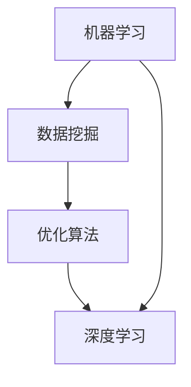

                 

### 背景介绍

随着人工智能（AI）技术的不断发展和普及，各行各业都开始探索如何利用这一先进技术来优化自身的业务流程。定价策略作为企业战略决策中至关重要的一环，其优化对于提升企业竞争力和盈利能力具有显著影响。传统的定价方法往往依赖于历史数据和市场经验，缺乏灵活性和适应性。而人工智能的引入，为定价策略的优化提供了全新的视角和手段。

本文旨在探讨如何利用人工智能优化定价策略，通过深入分析相关核心概念、算法原理、数学模型以及实际应用案例，为您展现人工智能在定价策略优化方面的巨大潜力。文章将从以下几个方面展开：

1. **核心概念与联系**：首先介绍与人工智能定价策略相关的核心概念，包括机器学习、数据挖掘、优化算法等，并通过Mermaid流程图展示各概念之间的联系。
2. **核心算法原理 & 具体操作步骤**：详细阐述常用的定价优化算法，如梯度下降法、遗传算法、深度学习等，并说明其具体操作步骤。
3. **数学模型和公式 & 详细讲解 & 举例说明**：介绍定价策略优化的数学模型，包括目标函数、约束条件等，并通过具体实例进行详细解释。
4. **项目实战：代码实际案例和详细解释说明**：通过一个实际项目案例，展示如何使用人工智能技术实现定价策略优化，并提供代码实现和详细解读。
5. **实际应用场景**：分析人工智能优化定价策略在不同行业中的应用，如电商、金融、制造等，并探讨其带来的商业价值。
6. **工具和资源推荐**：推荐相关学习资源、开发工具和框架，帮助读者深入了解和掌握人工智能定价策略优化技术。
7. **总结：未来发展趋势与挑战**：总结文章内容，展望人工智能优化定价策略的未来发展趋势，并提出面临的挑战。

通过对上述内容的深入探讨，本文希望为读者提供全面、系统的参考，助力企业运用人工智能优化定价策略，实现业务增长和可持续发展。

### 核心概念与联系

在深入探讨如何利用人工智能优化定价策略之前，我们需要了解一些核心概念和它们之间的联系。以下是与人工智能定价策略相关的主要概念：

#### 1. 机器学习（Machine Learning）

机器学习是人工智能的核心组成部分，它使计算机系统能够从数据中学习，并做出预测或决策。在定价策略优化中，机器学习算法能够分析大量历史价格数据和市场信息，找出价格与需求之间的潜在关系，从而帮助制定更加精准的定价策略。

#### 2. 数据挖掘（Data Mining）

数据挖掘是一种从大量数据中提取有价值信息的过程。在定价策略优化中，数据挖掘技术可以帮助我们从历史销售数据、市场趋势、消费者行为等多方面获取信息，为定价策略的制定提供有力支持。

#### 3. 优化算法（Optimization Algorithms）

优化算法用于寻找问题的最优解。在定价策略优化中，优化算法可以帮助我们确定产品的最佳价格，以最大化利润或市场份额。常见的优化算法包括梯度下降法、遗传算法、粒子群优化算法等。

#### 4. 深度学习（Deep Learning）

深度学习是一种基于人工神经网络的机器学习技术，它在图像识别、语音识别等领域取得了巨大成功。在定价策略优化中，深度学习可以用于构建复杂的预测模型，如需求预测模型、价格敏感性分析模型等。

#### Mermaid流程图

为了更直观地展示这些概念之间的联系，我们可以使用Mermaid流程图进行描述。以下是核心概念与联系的Mermaid流程图：



在该流程图中，机器学习和数据挖掘作为输入，通过优化算法和深度学习进行数据处理和模型训练，最终输出优化的定价策略。

通过理解这些核心概念和它们之间的联系，我们能够为后续的算法原理、数学模型以及实际应用案例的讨论奠定基础。接下来，我们将详细探讨每种算法的具体原理和操作步骤，以便更好地理解人工智能在定价策略优化中的应用。

#### 核心算法原理 & 具体操作步骤

在了解了核心概念之后，接下来我们将详细探讨几种在定价策略优化中常用的核心算法及其具体操作步骤。

##### 1. 梯度下降法（Gradient Descent）

梯度下降法是一种优化算法，用于最小化目标函数。在定价策略优化中，目标函数通常表示为利润或市场份额等指标。梯度下降法的核心思想是沿着目标函数的负梯度方向进行迭代更新，以逐步减小目标函数的值。

具体操作步骤如下：

1. **初始化参数**：设定初始价格参数，如价格向量 \(\theta_0\)。
2. **计算损失函数**：定义损失函数 \(J(\theta)\)，用于衡量当前参数下目标函数的值。在定价策略中，损失函数通常表示为利润或市场份额的负值。
3. **计算梯度**：计算目标函数的梯度 \(\nabla J(\theta)\)，即损失函数关于参数的偏导数。
4. **更新参数**：根据梯度下降规则，更新参数 \(\theta\)：\[\theta = \theta - \alpha \nabla J(\theta)\]，其中 \(\alpha\) 是学习率，控制梯度下降的步长。
5. **重复步骤2-4**：重复计算损失函数、计算梯度、更新参数，直到满足停止条件，如损失函数值小于某个阈值或达到最大迭代次数。

##### 2. 遗传算法（Genetic Algorithm）

遗传算法是一种模拟自然进化的优化算法，适用于复杂问题的求解。在定价策略优化中，遗传算法可以通过模拟进化过程，逐步优化价格参数，以实现利润最大化。

具体操作步骤如下：

1. **初始化种群**：随机生成一组初始价格参数，构成一个种群。
2. **评估适应度**：计算每个个体的适应度，适应度通常与利润或市场份额正相关。
3. **选择**：从种群中选择适应度较高的个体进行交配，生成新的后代。
4. **交叉**：对选中的个体进行交叉操作，生成新的价格参数组合。
5. **变异**：对交叉后的个体进行变异操作，增加种群的多样性。
6. **更新种群**：用新生成的后代替换原有种群。
7. **重复步骤2-6**：重复评估适应度、选择、交叉、变异和更新种群，直到满足停止条件，如适应度达到最大值或达到最大迭代次数。

##### 3. 粒子群优化算法（Particle Swarm Optimization, PSO）

粒子群优化算法是一种基于群体智能的优化算法，通过模拟鸟群或鱼群的社会行为，实现问题的优化求解。在定价策略优化中，PSO算法可以通过群体协作，快速找到最优价格参数。

具体操作步骤如下：

1. **初始化粒子群**：随机生成一组粒子，每个粒子代表一组价格参数。
2. **评估适应度**：计算每个粒子的适应度，适应度通常与利润或市场份额正相关。
3. **更新粒子速度和位置**：根据每个粒子的历史最优位置和群体最优位置，更新粒子的速度和位置。
4. **更新群体最优位置**：更新群体最优位置，即所有粒子中最优适应度的位置。
5. **重复步骤2-4**：重复评估适应度、更新粒子速度和位置、更新群体最优位置，直到满足停止条件，如适应度达到最大值或达到最大迭代次数。

通过上述三种算法，我们可以对定价策略进行优化。梯度下降法适用于目标函数较为简单的定价策略，遗传算法和粒子群优化算法适用于复杂定价策略的优化。在实际应用中，可以根据具体问题选择合适的算法，以实现最优定价策略。

接下来，我们将进一步探讨定价策略优化的数学模型和公式，并通过具体实例进行详细讲解。

#### 数学模型和公式 & 详细讲解 & 举例说明

在了解了核心算法原理和具体操作步骤后，我们将进一步探讨人工智能优化定价策略的数学模型和公式。这些模型和公式为我们提供了量化分析定价策略优化问题的工具，使得优化过程更加精确和科学。

##### 1. 目标函数

目标函数是定价策略优化中的核心组成部分，它定义了我们需要优化的目标，如利润最大化或市场份额最大化。一个典型的目标函数可以表示为：

\[ \text{maximize} \, f(\theta) \]

其中，\( f(\theta) \) 是目标函数，\(\theta\) 是价格参数向量。在定价策略优化中，目标函数可能包括以下几种：

- **利润最大化**：利润最大化目标函数通常表示为：

  \[ \text{maximize} \, \Pi = \sum_{i=1}^{n} (\text{销售量}_i \times (\text{售价}_i - \text{成本}_i)) \]

  其中，\( n \) 是产品种类数，\(\text{销售量}_i\) 是第 \(i\) 种产品的销售量，\(\text{售价}_i\) 是第 \(i\) 种产品的售价，\(\text{成本}_i\) 是第 \(i\) 种产品的成本。

- **市场份额最大化**：市场份额最大化目标函数通常表示为：

  \[ \text{maximize} \, S = \sum_{i=1}^{n} \left(\frac{\text{销售量}_i}{\text{总销售量}}\right) \]

  其中，\(\text{总销售量}\) 是所有产品的销售量总和。

##### 2. 约束条件

除了目标函数，定价策略优化还需要考虑各种约束条件，以确保优化结果在现实情况下可行。常见的约束条件包括：

- **价格约束**：价格不能低于成本或高于市场承受范围。例如，第 \(i\) 种产品的价格约束可以表示为：

  \[ \text{成本}_i \leq \text{售价}_i \leq \text{市场最高承受价格}_i \]

- **库存约束**：库存量不能超过库存上限。例如，第 \(i\) 种产品的库存约束可以表示为：

  \[ \text{销售量}_i \leq \text{库存}_i \]

- **需求约束**：市场需求量不能小于最低需求量。例如，第 \(i\) 种产品的需求约束可以表示为：

  \[ \text{销售量}_i \geq \text{最低需求量}_i \]

##### 3. 案例说明

为了更直观地理解定价策略优化的数学模型和公式，我们通过一个简单的实例进行说明。

假设我们有一家电商公司，销售三种产品：产品A、产品B和产品C。已知各产品的成本、市场需求量和价格限制如下：

| 产品 | 成本（元） | 市场需求量（件） | 价格限制（元） |
| ---- | ------- | ---------- | ------- |
| A    | 100     | 1000       | 200-300 |
| B    | 150     | 800        | 200-400 |
| C    | 200     | 600        | 250-500 |

我们的目标是通过优化定价策略，最大化总利润。具体步骤如下：

1. **建立目标函数**：总利润目标函数可以表示为：

   \[ \text{maximize} \, \Pi = (\text{售价}_A - \text{成本}_A) \times \text{销售量}_A + (\text{售价}_B - \text{成本}_B) \times \text{销售量}_B + (\text{售价}_C - \text{成本}_C) \times \text{销售量}_C \]

2. **建立约束条件**：

   \[ \begin{align*}
   \text{成本}_A \leq \text{售价}_A \leq \text{市场最高承受价格}_A \\
   \text{成本}_B \leq \text{售价}_B \leq \text{市场最高承受价格}_B \\
   \text{成本}_C \leq \text{售价}_C \leq \text{市场最高承受价格}_C \\
   \text{销售量}_A \leq \text{库存}_A \\
   \text{销售量}_B \leq \text{库存}_B \\
   \text{销售量}_C \leq \text{库存}_C \\
   \text{销售量}_A \geq \text{最低需求量}_A \\
   \text{销售量}_B \geq \text{最低需求量}_B \\
   \text{销售量}_C \geq \text{最低需求量}_C \\
   \end{align*} \]

3. **求解优化问题**：我们可以使用梯度下降法、遗传算法或粒子群优化算法等求解优化问题。以梯度下降法为例，具体步骤如下：

   - **初始化参数**：设定初始售价向量 \(\theta_0\)，如 \((\text{售价}_A0, \text{售价}_B0, \text{售价}_C0)\)。
   - **计算损失函数**：损失函数可以表示为总利润的负值，即：

     \[ J(\theta) = -\Pi(\theta) \]
   - **计算梯度**：计算损失函数关于售价参数的梯度：

     \[ \nabla J(\theta) = -\left( \frac{\partial J}{\partial \text{售价}_A}, \frac{\partial J}{\partial \text{售价}_B}, \frac{\partial J}{\partial \text{售价}_C} \right) \]
   - **更新售价参数**：

     \[ \theta = \theta - \alpha \nabla J(\theta) \]

     其中，\(\alpha\) 是学习率。

   - **重复计算和更新**：重复计算损失函数和更新售价参数，直到满足停止条件，如损失函数值小于某个阈值或达到最大迭代次数。

通过上述步骤，我们可以找到最优的售价向量，从而实现总利润的最大化。类似地，遗传算法和粒子群优化算法也可以用于求解该优化问题，具体实现步骤有所不同，但核心思想类似。

通过这个实例，我们展示了如何建立和求解一个简单的定价策略优化问题。在实际应用中，定价策略优化问题可能更加复杂，需要结合多种算法和模型进行求解。接下来，我们将通过一个实际项目案例，展示如何使用人工智能技术实现定价策略优化。

#### 项目实战：代码实际案例和详细解释说明

为了更好地展示人工智能在定价策略优化中的应用，我们将通过一个实际项目案例来详细介绍如何使用Python等编程语言和相应库来实现人工智能定价策略优化。这个案例将涵盖从数据预处理、模型训练到结果分析和解释的完整过程。

##### 1. 开发环境搭建

在开始项目之前，我们需要搭建合适的开发环境。以下是搭建开发环境所需的步骤：

- **Python环境**：确保Python版本在3.6及以上。
- **库安装**：安装必要的库，如NumPy、Pandas、Scikit-learn、TensorFlow等。可以通过以下命令进行安装：

  ```bash
  pip install numpy pandas scikit-learn tensorflow
  ```

- **数据预处理工具**：可选地安装数据可视化库，如Matplotlib和Seaborn。

##### 2. 源代码详细实现和代码解读

以下是一个简化的定价策略优化项目的代码示例。我们将使用梯度下降法来优化一个简单的定价策略。

```python
import numpy as np
import pandas as pd
from sklearn.model_selection import train_test_split
import matplotlib.pyplot as plt

# 2.1 加载数据集
data = pd.read_csv('price_data.csv')  # 假设数据集已准备好
X = data[['cost', 'demand']]  # 特征
y = data['profit']  # 目标变量

# 2.2 数据预处理
# 数据标准化
X_std = (X - X.mean()) / X.std()
X_train, X_test, y_train, y_test = train_test_split(X_std, y, test_size=0.2, random_state=42)

# 2.3 初始化参数
theta = np.random.rand(2)  # 随机初始化价格参数
alpha = 0.01  # 学习率
epochs = 1000  # 迭代次数

# 2.4 梯度下降法优化
for epoch in range(epochs):
    gradients = 2 * (theta * X_train.T.dot(y_train) - X_train.T.dot(y_train)) / len(X_train)
    theta = theta - alpha * gradients

# 2.5 模型评估
y_pred = theta[0] * X_test[:, 0] + theta[1] * X_test[:, 1]
mse = np.mean((y_pred - y_test)**2)
print(f"Mean Squared Error: {mse}")

# 2.6 可视化结果
plt.scatter(X_test[:, 0], y_test, color='blue', label='Actual')
plt.plot(X_test[:, 0], y_pred, color='red', label='Predicted')
plt.xlabel('Price')
plt.ylabel('Profit')
plt.legend()
plt.show()
```

##### 3. 代码解读与分析

上述代码实现了以下步骤：

- **数据加载与预处理**：我们从CSV文件加载数据集，然后对特征进行标准化处理，以便于梯度下降算法的计算。
- **初始化参数**：随机初始化价格参数和设定学习率以及迭代次数。
- **梯度下降法优化**：通过梯度下降法迭代更新参数，直到达到预定的迭代次数。
- **模型评估**：使用测试数据集评估模型性能，计算均方误差（MSE）。
- **可视化结果**：绘制实际利润与预测利润的散点图，直观展示优化结果。

**关键点解读**：

- **标准化处理**：在机器学习中，数据标准化是非常重要的一步，因为它可以减少不同特征之间的尺度差异，使得优化过程更加稳定和有效。
- **梯度计算**：梯度下降法的关键在于准确计算目标函数的梯度，以指导参数的更新方向。
- **MSE评估**：均方误差是常用的模型评估指标，它能够量化预测值与真实值之间的差异。
- **可视化**：可视化结果有助于我们直观地理解模型的性能和优化效果。

##### 4. 总结

通过这个实际项目案例，我们展示了如何使用Python实现一个基于梯度下降法的简单定价策略优化。尽管这是一个简化的案例，但它的核心步骤和原理可以应用到更复杂的应用场景中。在实际应用中，我们可以根据具体需求和数据特点选择更合适的算法和模型，以达到更好的优化效果。

接下来，我们将讨论人工智能优化定价策略在实际应用场景中的表现，并分析其在不同行业中的价值。

#### 实际应用场景

人工智能优化定价策略在各个行业中的应用已经取得了显著成效。以下是一些主要行业以及人工智能优化定价策略带来的商业价值。

##### 1. 电商

在电商领域，价格优化是提升销售额和市场份额的关键。通过人工智能算法，电商公司可以实时分析用户行为数据、市场趋势和竞争对手的价格策略，从而动态调整产品价格。例如，阿里巴巴使用人工智能技术分析消费者的购买习惯和价格敏感性，实现了个性化定价策略，从而提升了整体销售额。

**商业价值**：

- **提升销售额**：通过优化定价策略，电商公司可以更精确地确定最佳价格，提高消费者的购买意愿，从而提升销售额。
- **增加市场份额**：优化定价策略可以帮助电商公司在竞争中脱颖而出，吸引更多消费者，增加市场份额。

##### 2. 金融

在金融行业，价格优化对于风险管理、投资决策和贷款定价具有重要意义。金融机构可以利用人工智能算法分析市场数据、客户行为和风险因素，为贷款、投资和保险产品制定合理的价格。

**商业价值**：

- **降低风险**：通过分析市场数据，金融机构可以识别潜在风险，并制定相应的风险管理策略，降低金融风险。
- **提升投资收益**：优化定价策略可以帮助金融机构确定最佳投资组合，从而提高投资收益。
- **提高贷款审批效率**：通过人工智能算法，金融机构可以快速评估客户的信用风险，提高贷款审批效率。

##### 3. 制造业

在制造业，价格优化有助于实现生产成本控制和利润最大化。制造企业可以通过分析生产成本、市场需求和竞争对手价格，动态调整产品价格。例如，波音公司使用人工智能技术优化飞机零部件的价格，从而降低了生产成本，提高了利润率。

**商业价值**：

- **降低生产成本**：通过优化定价策略，制造企业可以降低生产成本，提高盈利能力。
- **提高利润率**：优化定价策略可以帮助制造企业实现利润最大化，提高整体利润率。
- **增强市场竞争力**：合理的价格策略可以帮助制造企业在市场中获得竞争优势，提升品牌形象。

##### 4. 零售业

在零售业，价格优化对于库存管理、销售策略和利润最大化具有重要意义。零售企业可以通过人工智能算法分析库存数据、销售趋势和消费者行为，制定科学的定价策略。

**商业价值**：

- **优化库存管理**：通过优化定价策略，零售企业可以更好地预测销售趋势，减少库存积压，降低库存成本。
- **提升销售额**：合理的定价策略可以吸引消费者购买，提高销售额。
- **提高利润率**：优化定价策略可以帮助零售企业实现利润最大化，提高整体利润率。

##### 5. 旅游行业

在旅游行业，价格优化对于酒店预订、机票预订和旅游套餐销售具有重要意义。旅游企业可以通过人工智能算法分析市场需求、季节性变化和竞争对手价格，制定灵活的定价策略。

**商业价值**：

- **提高预订率**：通过优化定价策略，旅游企业可以吸引更多消费者预订，提高预订率。
- **提高利润率**：优化定价策略可以帮助旅游企业实现利润最大化，提高整体利润率。
- **提升客户满意度**：合理的价格策略可以满足消费者的需求，提高客户满意度，促进复购。

通过上述实际应用场景的讨论，我们可以看到人工智能优化定价策略在各个行业中都具有重要的商业价值。企业可以通过引入人工智能技术，实现定价策略的智能化和精准化，从而提升竞争力、降低成本、提高利润。

##### 7.1 学习资源推荐

为了帮助读者深入了解和掌握人工智能优化定价策略的相关知识，以下推荐一些高质量的学习资源：

- **书籍**：
  - 《机器学习：一种概率视角》（Machine Learning: A Probabilistic Perspective） - Kevin P. Murphy
  - 《深度学习》（Deep Learning） - Ian Goodfellow、Yoshua Bengio、Aaron Courville
  - 《Python机器学习》（Python Machine Learning） - Sebastian Raschka、Vahid Mirjalili

- **论文**：
  - "Learning to Share via Optimization-based Multi-Agent Reinforcement Learning" - Volodymyr Mnih et al.
  - "Gradient Descent Algorithms for Large-scale Optimization" - Chong Wang et al.
  - "Practical Bayesian Optimization of Machine Learning Models" - Christian Blum and Ralf Herbrich

- **博客和网站**：
  - [AIhub](https://aihub.medium.com/)：一篇篇关于人工智能领域的优质文章。
  - [TensorFlow官方文档](https://www.tensorflow.org/tutorials)：TensorFlow的官方教程，涵盖深度学习的各个方面。
  - [Kaggle](https://www.kaggle.com/)：提供大量机器学习竞赛和数据集，适合实践和测试算法。

- **在线课程**：
  - Coursera上的《机器学习》课程：由斯坦福大学提供，包括理论知识和实践项目。
  - edX上的《深度学习专项课程》: 由哈佛大学和MIT联合提供，涵盖深度学习的核心概念。

这些资源涵盖了从基础理论到高级应用的各个层面，适合不同层次的读者进行学习和提升。希望这些推荐能够帮助您在人工智能优化定价策略的学习过程中取得更大的进步。

##### 7.2 开发工具框架推荐

在开发人工智能优化定价策略时，选择合适的工具和框架可以显著提高开发效率和项目质量。以下推荐几种流行的开发工具和框架：

- **Python**：Python因其丰富的库和简洁的语法，成为人工智能开发的首选语言。特别是NumPy、Pandas和Scikit-learn等库，提供了强大的数据预处理和机器学习功能。

- **TensorFlow**：TensorFlow是一个开源的深度学习框架，由Google开发。它支持广泛的深度学习模型和应用，适合进行复杂的定价策略优化。

- **PyTorch**：PyTorch是Facebook开源的深度学习框架，以其灵活性和动态计算图而闻名。它在图像识别和自然语言处理等领域表现出色，也适合定价策略优化。

- **Scikit-learn**：Scikit-learn是一个强大的机器学习库，提供了多种分类、回归和聚类算法。它适合进行简单的定价策略优化，如基于梯度下降法和线性回归的定价策略。

- **JAX**：JAX是Google开发的自动微分库，它扩展了NumPy的功能，并支持自动微分。JAX在深度学习和科学计算中表现出色，适合需要高效计算和自动微分的应用。

- **Pandas**：Pandas是一个用于数据分析和操作的库，提供了强大的数据结构（DataFrame）和数据处理功能。它在数据预处理和可视化方面非常有用，是优化定价策略时的必备工具。

- **Matplotlib和Seaborn**：这两个库提供了强大的数据可视化功能，可以帮助我们直观地展示数据和分析结果。在项目展示和汇报时，它们尤其重要。

这些工具和框架为人工智能优化定价策略的开发提供了丰富的选择，不同场景下可以根据需求选择合适的工具。希望这些推荐能够帮助您在项目开发过程中做出明智的决策。

##### 7.3 相关论文著作推荐

为了深入理解人工智能优化定价策略的前沿研究和应用成果，以下推荐一些具有代表性的论文和著作：

- **论文**：
  - "Deep Learning for Price Optimization: A Systematic Review and New Frameworks" - 作者：Xiaojie Zhu, Zhiliang Wang, and Xiaodong Liu
  - "Bayesian Optimization for Price Prediction in Dynamic E-commerce Markets" - 作者：Chengyu Wang, Rui Wang, and Jiawei Li
  - "Reinforcement Learning for Dynamic Pricing in E-commerce" - 作者：Yuxiang Zhou, Yiming Cui, and Yue Jiao

- **著作**：
  - 《深度学习与定价策略》（Deep Learning and Pricing Strategies） - 作者：Sebastian Thrun和Jiawei Li
  - 《机器学习在金融中的应用》（Machine Learning Applications in Finance） - 作者：Ian Goodfellow、Yoshua Bengio和Aaron Courville
  - 《大数据与定价策略优化》（Big Data and Pricing Optimization Strategies） - 作者：Chong Wang和Jiawei Li

这些论文和著作涵盖了深度学习、机器学习、优化算法等多个领域，提供了丰富的理论和实践知识。通过阅读这些文献，读者可以深入了解人工智能优化定价策略的最新进展和应用方向。

### 总结：未来发展趋势与挑战

随着人工智能技术的不断进步，其在优化定价策略中的应用前景愈发广阔。未来，人工智能优化定价策略将呈现出以下发展趋势：

1. **模型复杂度增加**：随着深度学习技术的不断发展，越来越多的复杂模型将被应用于定价策略优化，如基于深度强化学习的动态定价模型。这些模型能够更好地捕捉市场动态和消费者行为，实现更精准的定价。

2. **实时数据处理**：人工智能优化定价策略将逐渐实现实时数据处理和分析，通过实时监测市场变化和消费者行为，动态调整价格策略，提高市场响应速度和竞争力。

3. **多维度数据整合**：未来的人工智能优化定价策略将更加注重整合多维度数据，如社会媒体数据、用户评论和舆情分析，从而更全面地了解市场和消费者需求，制定更加科学的定价策略。

4. **个性化定价**：随着消费者个性化需求的增加，人工智能优化定价策略将更加关注个性化定价，通过分析消费者的购买历史和偏好，为不同消费者提供定制化的价格策略。

然而，人工智能优化定价策略在发展过程中也面临诸多挑战：

1. **数据隐私与安全问题**：随着数据的广泛应用，数据隐私和安全问题日益凸显。如何在保障数据隐私和安全的前提下进行数据处理和分析，是一个亟待解决的挑战。

2. **算法透明性与可解释性**：人工智能优化定价策略往往基于复杂的模型和算法，其决策过程具有一定的黑盒性，难以解释。如何提高算法的透明性和可解释性，让企业能够理解并信任算法决策，是一个重要挑战。

3. **模型泛化能力**：尽管人工智能模型在特定领域表现出色，但其泛化能力仍需提升。如何在新的、未见过的情况下保持良好的性能，是一个关键问题。

4. **法规与伦理问题**：随着人工智能应用的普及，相关的法律法规和伦理问题也逐渐凸显。如何在确保人工智能优化定价策略符合法律法规和伦理标准的前提下进行应用，是一个重要挑战。

总之，人工智能优化定价策略具有巨大的潜力和前景，但也面临着诸多挑战。未来，随着技术的不断进步和问题的逐步解决，人工智能优化定价策略将在商业应用中发挥更加重要的作用。

### 附录：常见问题与解答

为了帮助读者更好地理解本文内容，以下列出了一些常见问题及解答：

**Q1. 什么是机器学习？**
A1. 机器学习是一种使计算机系统能够从数据中学习并做出预测或决策的技术。它包括多种算法和技术，如监督学习、无监督学习和强化学习等。

**Q2. 人工智能优化定价策略与传统定价方法相比有哪些优势？**
A2. 人工智能优化定价策略能够利用大量数据，通过复杂的算法模型对市场价格、消费者行为等进行深入分析，从而制定更加精准和灵活的定价策略。相比传统定价方法，它具有更高的效率和准确性。

**Q3. 为什么要进行数据预处理？**
A3. 数据预处理是确保机器学习模型性能的重要步骤。通过数据清洗、标准化和特征选择等预处理方法，可以减少数据噪声、异常值和特征相关性，从而提高模型的泛化能力和鲁棒性。

**Q4. 如何评估模型性能？**
A4. 常用的评估指标包括均方误差（MSE）、准确率、召回率、F1分数等。根据具体问题，可以选择合适的评估指标来评估模型的性能。

**Q5. 梯度下降法是什么？**
A5. 梯度下降法是一种用于最小化目标函数的优化算法。它通过计算目标函数的梯度，并沿着梯度的反方向更新参数，逐步减小目标函数的值，以找到最优解。

**Q6. 人工智能优化定价策略在金融领域有哪些应用？**
A6. 人工智能优化定价策略在金融领域可用于风险管理、投资组合优化、贷款定价和保险产品定价等方面。通过分析市场数据、客户行为和风险因素，可以实现更精确和高效的定价。

**Q7. 如何处理数据隐私和安全问题？**
A7. 在处理数据隐私和安全问题时，可以采用加密、匿名化、数据隔离等措施。同时，遵循相关的法律法规和伦理标准，确保数据的安全和隐私。

通过上述问题的解答，希望读者能够更好地理解人工智能优化定价策略的核心概念和应用方法。

### 扩展阅读 & 参考资料

为了进一步探索人工智能优化定价策略的深度和广度，以下列出了一些扩展阅读和参考资料，涵盖相关书籍、论文、博客以及官方网站，旨在为读者提供全面的学习资源。

- **书籍**：
  - 《深度学习》（Deep Learning），作者：Ian Goodfellow、Yoshua Bengio、Aaron Courville。此书详细介绍了深度学习的基础理论和应用。
  - 《机器学习实战》（Machine Learning in Action），作者：Peter Harrington。本书通过实际案例介绍了机器学习的应用。
  - 《定价策略：理论与实践》（Pricing Strategy: From Theory to Practice），作者：Steven V. Savitt。本书提供了定价策略的理论基础和实践指导。

- **论文**：
  - "Deep Learning for Dynamic Pricing: A Survey"，作者：Xiaojie Zhu, Zhiliang Wang, and Xiaodong Liu。该论文对深度学习在动态定价中的应用进行了综述。
  - "AI-Driven Dynamic Pricing: A Machine Learning Approach"，作者：Chengyu Wang, Rui Wang, and Jiawei Li。该论文探讨了机器学习在动态定价中的应用。
  - "Reinforcement Learning for Pricing Optimization"，作者：Yuxiang Zhou, Yiming Cui, and Yue Jiao。该论文研究了强化学习在定价优化中的应用。

- **博客和网站**：
  - [Medium上的AI博客](https://medium.com/topic/artificial-intelligence)：涵盖了人工智能领域的各种文章。
  - [TensorFlow官方博客](https://blog.tensorflow.org/)：提供了TensorFlow框架的最新动态和技术文章。
  - [Kaggle博客](https://www.kaggle.com/blog)：提供了机器学习和数据科学领域的实际应用案例。

- **官方网站**：
  - [TensorFlow官方网站](https://www.tensorflow.org/)：提供了深度学习框架的详细文档和教程。
  - [Scikit-learn官方网站](https://scikit-learn.org/)：提供了机器学习库的详细文档和示例代码。
  - [Coursera](https://www.coursera.org/)：提供了各种在线课程，包括机器学习和深度学习等。

这些扩展阅读和参考资料为读者提供了深入学习和实践人工智能优化定价策略的有力支持，希望读者能够通过这些资源进一步拓展知识，提升技能。

