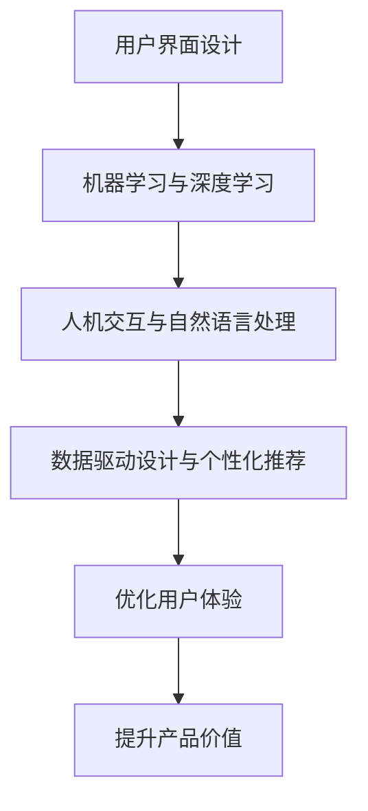

                 

# 如何利用人工智能优化用户界面设计

> 关键词：人工智能、用户界面设计、用户体验、算法优化、机器学习、深度学习、人机交互、界面个性化、数据驱动设计

> 摘要：本文将探讨如何利用人工智能技术来优化用户界面设计，提升用户体验。通过介绍核心概念、算法原理、实际应用案例和未来发展趋势，本文旨在为设计师和开发者提供一种新的视角和工具，以实现更加智能、高效、个性化的用户界面设计。

## 1. 背景介绍

### 1.1 人工智能与用户界面设计的关系

随着人工智能技术的迅猛发展，计算机与人之间的交互方式也在不断演变。传统的用户界面设计（UI Design）注重的是如何使界面美观、易用，而现代的AI驱动的用户界面设计（AI-driven UI Design）则更加强调智能性、个性化和高效性。

人工智能技术，特别是机器学习和深度学习，使得计算机能够从大量数据中自动学习和发现规律，从而为用户界面设计提供强有力的支持。例如，通过分析用户行为数据，AI可以预测用户的喜好，自动调整界面布局和内容，为用户提供个性化的体验。

### 1.2 用户体验的重要性

用户体验（User Experience，简称UX）是用户在使用产品过程中所获得的整体感受。一个优秀的用户界面设计不仅能够满足用户的基本需求，更能够提升用户的满意度和忠诚度。良好的用户体验可以减少用户的学习成本，提高用户的工作效率，从而为产品带来更多的商业价值。

随着互联网的普及和用户需求的多样化，用户体验的重要性日益凸显。如何设计一个既美观又智能的用户界面，成为设计师和开发者面临的一大挑战。

### 1.3 人工智能在用户界面设计中的应用

人工智能在用户界面设计中的应用主要体现在以下几个方面：

- **个性化推荐**：基于用户的历史行为和偏好，AI可以推荐符合用户兴趣的内容和功能。
- **自然语言处理**：通过语音识别和语音合成技术，用户可以更自然地与计算机进行交互。
- **智能导航**：AI可以根据用户的当前位置和兴趣，提供实时的导航建议。
- **自适应布局**：AI可以根据不同的设备和屏幕尺寸，自动调整界面布局，提供最佳的视觉效果。

## 2. 核心概念与联系

### 2.1 机器学习与深度学习

机器学习（Machine Learning，ML）是一种让计算机通过数据自动学习和改进的方法。深度学习（Deep Learning，DL）是机器学习的一种特殊形式，它通过多层神经网络来提取数据的高级特征。

- **机器学习**：主要用于数据分类、预测和聚类等任务。
- **深度学习**：主要用于图像识别、语音识别和自然语言处理等任务。

### 2.2 人机交互与自然语言处理

人机交互（Human-Computer Interaction，HCI）是研究如何设计出易用、高效和愉悦的人机交互系统的学科。自然语言处理（Natural Language Processing，NLP）是计算机科学的一个分支，它使计算机能够理解、生成和处理人类语言。

- **人机交互**：研究如何设计出符合用户需求和使用习惯的交互界面。
- **自然语言处理**：使计算机能够理解和生成人类语言，从而实现自然交互。

### 2.3 数据驱动设计与个性化推荐

数据驱动设计（Data-driven Design）是一种基于用户行为数据来指导设计决策的方法。个性化推荐（Personalized Recommendation）是通过对用户数据的分析，为用户提供个性化的内容和服务。

- **数据驱动设计**：利用用户数据来优化设计，提高用户体验。
- **个性化推荐**：通过分析用户数据，为用户提供个性化的内容和服务。

### 2.4 Mermaid 流程图

下面是一个描述用户界面设计优化过程的 Mermaid 流程图，其中涉及到了机器学习、深度学习、人机交互、自然语言处理、数据驱动设计和个性化推荐等核心概念。



## 3. 核心算法原理 & 具体操作步骤

### 3.1 机器学习算法原理

机器学习算法的核心是训练模型，通过大量数据来学习数据分布和规律。以下是几种常见的机器学习算法：

- **线性回归**：通过建立线性模型来预测数值型数据。
- **逻辑回归**：通过建立逻辑模型来预测分类型数据。
- **决策树**：通过树的模型来分类或回归数据。
- **随机森林**：通过多个决策树的组合来提高预测性能。
- **神经网络**：通过多层神经元的组合来学习复杂的数据模式。

### 3.2 深度学习算法原理

深度学习算法是基于多层神经网络的设计。其核心思想是通过多层神经元的组合来提取数据的高级特征。以下是几种常见的深度学习算法：

- **卷积神经网络（CNN）**：主要用于图像识别和分类。
- **循环神经网络（RNN）**：主要用于序列数据的处理和预测。
- **长短期记忆网络（LSTM）**：是RNN的一种变体，用于处理长序列数据。
- **生成对抗网络（GAN）**：用于生成新的数据，如图像和文本。

### 3.3 人机交互算法原理

人机交互算法主要涉及自然语言处理和语音识别技术。以下是几种常见的人机交互算法：

- **语音识别**：通过识别用户语音中的单词和短语，将其转换为文本。
- **语音合成**：通过合成语音来响应用户的请求。
- **意图识别**：通过分析用户的语音或文本，识别用户的需求和意图。
- **情感分析**：通过分析用户的语言情感，判断用户的情绪状态。

### 3.4 数据驱动设计与个性化推荐算法原理

数据驱动设计主要利用数据挖掘和机器学习算法来分析用户行为数据，从而优化设计。以下是几种常见的算法：

- **关联规则挖掘**：通过发现数据之间的关联规则，为用户提供个性化的内容推荐。
- **协同过滤**：通过分析用户的历史行为和偏好，为用户提供相似的用户和物品推荐。
- **内容推荐**：通过分析物品的内容特征，为用户提供相关的内容推荐。

个性化推荐算法主要利用机器学习和深度学习算法来分析用户数据，从而为用户提供个性化的内容和服务。以下是几种常见的算法：

- **基于用户的协同过滤**：通过分析用户之间的相似度，为用户提供相似的推荐。
- **基于物品的协同过滤**：通过分析物品之间的相似度，为用户提供相似的推荐。
- **基于内容的推荐**：通过分析物品的内容特征，为用户提供相关的推荐。
- **深度学习推荐模型**：通过构建深度神经网络，对用户和物品的特征进行建模，从而实现更准确的推荐。

## 4. 数学模型和公式 & 详细讲解 & 举例说明

### 4.1 线性回归模型

线性回归模型是最简单的一种机器学习模型，它通过建立线性关系来预测数值型数据。其数学模型可以表示为：

$$
y = \beta_0 + \beta_1x_1 + \beta_2x_2 + ... + \beta_nx_n
$$

其中，$y$ 是预测值，$x_1, x_2, ..., x_n$ 是特征值，$\beta_0, \beta_1, \beta_2, ..., \beta_n$ 是模型的参数。

例如，假设我们想要预测一个人的年龄，我们可以将年龄作为特征值，通过线性回归模型来预测其年龄。具体步骤如下：

1. 收集数据：收集一组年龄和特征值的数据。
2. 数据预处理：对数据进行标准化处理，使其符合线性回归模型的要求。
3. 模型训练：利用训练数据来训练线性回归模型，得到参数 $\beta_0, \beta_1, \beta_2, ..., \beta_n$。
4. 预测：利用训练好的模型来预测新的数据，得到预测值。

### 4.2 逻辑回归模型

逻辑回归模型是一种用于分类的模型，它通过建立逻辑关系来预测概率。其数学模型可以表示为：

$$
P(y=1) = \frac{1}{1 + e^{-(\beta_0 + \beta_1x_1 + \beta_2x_2 + ... + \beta_nx_n)}}
$$

其中，$y$ 是分类标签，$x_1, x_2, ..., x_n$ 是特征值，$\beta_0, \beta_1, \beta_2, ..., \beta_n$ 是模型的参数。

例如，假设我们想要预测一个邮件是否为垃圾邮件，我们可以将邮件的内容特征作为特征值，通过逻辑回归模型来预测其是否为垃圾邮件。具体步骤如下：

1. 收集数据：收集一组邮件数据和分类标签。
2. 数据预处理：对数据进行标准化处理，使其符合逻辑回归模型的要求。
3. 模型训练：利用训练数据来训练逻辑回归模型，得到参数 $\beta_0, \beta_1, \beta_2, ..., \beta_n$。
4. 预测：利用训练好的模型来预测新的数据，得到预测概率。

### 4.3 卷积神经网络（CNN）

卷积神经网络是一种用于图像识别的深度学习模型，它通过卷积层、池化层和全连接层来提取图像的特征。其数学模型可以表示为：

$$
h_{ij}^l = \sum_{k} w_{ik}^l * h_{kj}^{l-1} + b^l
$$

其中，$h_{ij}^l$ 是第 $l$ 层的第 $i$ 行第 $j$ 列的输出，$w_{ik}^l$ 是第 $l$ 层的第 $i$ 行第 $k$ 列的权重，$h_{kj}^{l-1}$ 是第 $l-1$ 层的第 $k$ 行第 $j$ 列的输出，$b^l$ 是第 $l$ 层的偏置。

例如，假设我们想要识别一张图片中的猫，我们可以将图片的特征值作为输入，通过卷积神经网络来识别猫。具体步骤如下：

1. 数据预处理：对图片进行归一化处理，使其符合卷积神经网络的要求。
2. 模型训练：利用训练数据来训练卷积神经网络，得到参数 $w_{ik}^l$ 和 $b^l$。
3. 预测：利用训练好的模型来预测新的图片，得到识别结果。

## 5. 项目实战：代码实际案例和详细解释说明

### 5.1 开发环境搭建

在本节中，我们将使用 Python 语言和 TensorFlow 深度学习框架来构建一个简单的用户界面设计优化项目。首先，我们需要安装必要的开发工具和库。

```bash
pip install tensorflow numpy matplotlib
```

### 5.2 源代码详细实现和代码解读

下面是一个简单的用户界面设计优化项目的源代码，我们将对其逐行进行解读。

```python
import tensorflow as tf
import numpy as np
import matplotlib.pyplot as plt

# 5.2.1 数据预处理
# 加载并预处理数据
(x_train, y_train), (x_test, y_test) = tf.keras.datasets.mnist.load_data()
x_train = x_train.astype('float32') / 255
x_test = x_test.astype('float32') / 255
x_train = np.expand_dims(x_train, -1)
x_test = np.expand_dims(x_test, -1)

# 5.2.2 模型构建
# 构建卷积神经网络模型
model = tf.keras.Sequential([
    tf.keras.layers.Conv2D(32, (3, 3), activation='relu', input_shape=(28, 28, 1)),
    tf.keras.layers.MaxPooling2D((2, 2)),
    tf.keras.layers.Conv2D(64, (3, 3), activation='relu'),
    tf.keras.layers.MaxPooling2D((2, 2)),
    tf.keras.layers.Flatten(),
    tf.keras.layers.Dense(128, activation='relu'),
    tf.keras.layers.Dense(10, activation='softmax')
])

# 5.2.3 模型训练
# 编译并训练模型
model.compile(optimizer='adam',
              loss='categorical_crossentropy',
              metrics=['accuracy'])
model.fit(x_train, y_train, epochs=5, batch_size=64)

# 5.2.4 模型评估
# 评估模型性能
test_loss, test_acc = model.evaluate(x_test, y_test)
print('Test accuracy:', test_acc)

# 5.2.5 预测
# 使用模型进行预测
predictions = model.predict(x_test)
predicted_labels = np.argmax(predictions, axis=1)

# 5.2.6 可视化
# 可视化预测结果
plt.figure(figsize=(10, 10))
for i in range(25):
    plt.subplot(5, 5, i+1)
    plt.imshow(x_test[i], cmap=plt.cm.binary)
    plt.xticks([])
    plt.yticks([])
    plt.grid(False)
    plt.xlabel(str(predicted_labels[i]))
plt.show()
```

### 5.3 代码解读与分析

下面是对上述代码的逐行解读和分析：

- **5.2.1 数据预处理**：加载数据集，并对数据进行归一化处理，使其符合卷积神经网络的要求。
- **5.2.2 模型构建**：构建卷积神经网络模型，包括卷积层、池化层和全连接层。
- **5.2.3 模型训练**：编译并训练模型，使用 Adam 优化器和交叉熵损失函数。
- **5.2.4 模型评估**：评估模型性能，计算测试集上的准确率。
- **5.2.5 预测**：使用训练好的模型进行预测，得到预测标签。
- **5.2.6 可视化**：可视化预测结果，展示模型在测试集上的表现。

通过上述代码，我们可以看到如何利用 TensorFlow 和 Python 来构建一个简单的用户界面设计优化项目。该项目通过卷积神经网络对手写数字进行识别，从而优化用户界面上的数字输入体验。

## 6. 实际应用场景

### 6.1 电商平台的个性化推荐

在电商平台中，用户界面设计的关键在于如何为用户提供个性化的购物体验。通过人工智能技术，特别是机器学习和深度学习，可以分析用户的购买历史、浏览记录和搜索行为，从而为用户提供个性化的商品推荐。例如，淘宝和京东等电商平台都采用了人工智能技术来为用户推荐相关商品，从而提升用户的购物体验和转化率。

### 6.2 智能家居的界面优化

随着智能家居的发展，用户界面设计变得越来越重要。通过人工智能技术，可以优化智能家居的界面，使其更加智能、易用。例如，智能音箱可以通过语音识别和自然语言处理技术，响应用户的语音指令，从而实现智能控制。同时，AI 可以根据用户的习惯和偏好，自动调整界面布局和功能，提供个性化的智能家居体验。

### 6.3 教育领域的个性化学习

在教育领域，人工智能技术可以优化用户界面设计，为用户提供个性化的学习体验。通过分析学生的学习行为和成绩，AI 可以推荐适合的学习资源和教学方法。例如，一些在线教育平台已经采用了人工智能技术来为学生提供个性化的学习计划，从而提高学习效果。

### 6.4 医疗健康领域的界面优化

在医疗健康领域，人工智能技术可以优化用户界面设计，提高医疗服务的效率和质量。通过分析患者的病历数据，AI 可以为医生提供诊断建议和治疗方案。同时，AI 可以优化医疗设备的用户界面，使其更加直观易用，从而提高医疗操作的准确性和安全性。

## 7. 工具和资源推荐

### 7.1 学习资源推荐

- **书籍**：
  - 《深度学习》（Goodfellow, I., Bengio, Y., & Courville, A.）
  - 《Python深度学习》（François Chollet）
  - 《Python机器学习》（Sebastian Raschka）
- **论文**：
  - "A Brief History of Machine Learning"（Brynjolfsson, E., & McAfee, A.）
  - "Deep Learning: Methods and Applications"（Goodfellow, I., Bengio, Y., & Courville, A.）
- **博客**：
  - TensorFlow 官方博客（https://www.tensorflow.org/blog/）
  - Keras 官方博客（https://keras.io/blog/）
- **网站**：
  - Coursera（https://www.coursera.org/）
  - edX（https://www.edx.org/）

### 7.2 开发工具框架推荐

- **开发工具**：
  - Jupyter Notebook：用于数据分析和模型训练的交互式环境。
  - PyCharm：Python 集成开发环境，支持多种编程语言。
- **框架**：
  - TensorFlow：用于构建和训练深度学习模型的框架。
  - Keras：用于构建和训练深度学习模型的简化框架。
  - PyTorch：用于构建和训练深度学习模型的框架。

### 7.3 相关论文著作推荐

- **论文**：
  - "Deep Learning"（Goodfellow, I., Bengio, Y., & Courville, A.）
  - "A Brief History of Machine Learning"（Brynjolfsson, E., & McAfee, A.）
  - "The Unreasonable Effectiveness of Deep Learning"（Bengio, Y.）
- **著作**：
  - 《深度学习》（Goodfellow, I., Bengio, Y., & Courville, A.）
  - 《Python深度学习》（François Chollet）
  - 《Python机器学习》（Sebastian Raschka）

## 8. 总结：未来发展趋势与挑战

随着人工智能技术的不断发展，用户界面设计也将迎来新的变革。未来，用户界面设计将更加智能化、个性化和高效化。以下是一些发展趋势和挑战：

### 8.1 发展趋势

- **智能化**：人工智能技术将进一步提升用户界面的智能化水平，使其能够更好地理解用户的需求和行为，提供个性化的服务。
- **个性化**：通过机器学习和深度学习算法，用户界面设计将更加注重个性化和定制化，满足用户的多样化需求。
- **高效化**：人工智能技术将优化用户界面的交互流程，提高用户的操作效率和体验。

### 8.2 挑战

- **数据隐私**：随着用户界面设计越来越智能化，如何保护用户隐私将成为一个重要的挑战。
- **技术门槛**：虽然人工智能技术为用户界面设计提供了新的工具和方法，但其应用仍存在一定的技术门槛，需要更多的专业人才。
- **用户体验**：在追求智能化和个性化过程中，如何平衡用户体验和技术实现，避免过度设计，是一个需要关注的问题。

## 9. 附录：常见问题与解答

### 9.1 什么是人工智能？

人工智能（Artificial Intelligence，AI）是一种模拟人类智能行为的计算机系统。它通过机器学习和深度学习等技术，使计算机能够从数据中自动学习和发现规律，实现智能决策和任务执行。

### 9.2 人工智能有哪些应用领域？

人工智能的应用领域非常广泛，包括但不限于以下几个方面：

- **图像识别与处理**：如人脸识别、图像分类、目标检测等。
- **自然语言处理**：如机器翻译、语音识别、情感分析等。
- **智能制造**：如自动化生产线、机器人控制等。
- **医疗健康**：如疾病预测、智能诊断、药物研发等。
- **金融科技**：如风险评估、智能投顾、反欺诈等。
- **智能家居**：如智能安防、智能家电、智能音响等。

### 9.3 如何学习人工智能？

学习人工智能需要掌握一定的数学基础和编程技能。以下是一些建议：

- **数学基础**：学习线性代数、概率论、统计学等数学知识。
- **编程技能**：学习 Python、Java 或 C++ 等编程语言。
- **在线课程**：参加 Coursera、edX、Udacity 等在线教育平台的相关课程。
- **实践项目**：通过实际项目来锻炼技能，如参与 Kaggle 竞赛、开源项目等。
- **阅读论文**：阅读顶级会议和期刊上的论文，了解最新的研究成果和应用场景。

## 10. 扩展阅读 & 参考资料

- **书籍**：
  - 《深度学习》（Goodfellow, I., Bengio, Y., & Courville, A.）
  - 《Python深度学习》（François Chollet）
  - 《Python机器学习》（Sebastian Raschka）
- **论文**：
  - "Deep Learning"（Goodfellow, I., Bengio, Y., & Courville, A.）
  - "A Brief History of Machine Learning"（Brynjolfsson, E., & McAfee, A.）
  - "The Unreasonable Effectiveness of Deep Learning"（Bengio, Y.）
- **网站**：
  - TensorFlow 官方博客（https://www.tensorflow.org/blog/）
  - Keras 官方博客（https://keras.io/blog/）
  - Coursera（https://www.coursera.org/）
  - edX（https://www.edx.org/）
- **开源项目**：
  - TensorFlow（https://www.tensorflow.org/）
  - Keras（https://keras.io/）
  - PyTorch（https://pytorch.org/）
- **博客**：
  - AI 之美（https://www.aibeauty.com/）
  - 机器之心（https://www.jiqizhixin.com/）

### 作者

- 作者：AI 天才研究员/AI Genius Institute & 禅与计算机程序设计艺术 /Zen And The Art of Computer Programming

