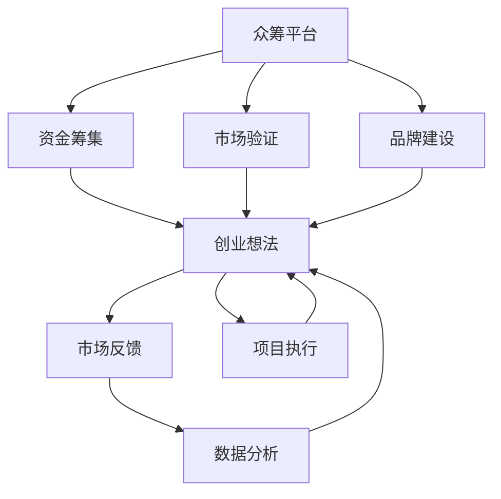

                 

### 1. 背景介绍

众筹平台作为现代创业生态系统的重要组成部分，正日益成为验证创业想法的有效途径。众筹不仅为初创企业提供了资金支持，更成为了一种收集市场反馈、测试产品可行性的强大工具。对于创业者来说，能否成功地利用众筹平台验证其创业想法，往往是决定项目能否走向成功的关键一步。

本文旨在探讨如何利用众筹平台来验证创业想法。我们将从以下几个方面进行详细分析：

1. **众筹平台的基本概念**：介绍众筹的定义、类型及其在创业中的重要性。
2. **众筹平台的选择**：分析不同众筹平台的特点，帮助创业者选择最适合的平台。
3. **项目策划**：讨论如何制定项目计划、撰写项目描述以及准备相关宣传材料。
4. **市场反馈**：解释如何通过众筹过程收集市场反馈，并利用这些反馈进行项目调整。
5. **数据分析**：介绍如何分析众筹数据，评估项目的市场接受度。
6. **项目执行**：探讨如何根据众筹结果调整策略，确保项目的顺利推进。
7. **成功案例分析**：分享一些成功利用众筹平台验证创业想法的实际案例。

通过对以上内容的详细探讨，我们希望为创业者提供一份实用的指南，帮助他们更好地利用众筹平台，实现创业梦想。

### 1.1 众筹平台的基本概念

众筹，顾名思义，是指通过互联网平台，向社会公众募集资金以支持创业项目或创意实现的一种融资方式。它通常基于以下三种主要类型进行分类：

- **奖励众筹**：投资者通过资金支持项目，并获得相应的实物或数字奖励。这种模式常见于Kickstarter和Indiegogo等平台。
- **股权众筹**：投资者通过资金换取初创企业的股权，常见于AngelList和SeedInvest等平台。
- **债务众筹**：投资者通过购买债券或其他债务工具向企业投资，通常在Crowdcube和LendInvest等平台进行。

众筹平台作为一种新兴的融资方式，已经在全球范围内迅速发展，成为创业生态系统中不可或缺的一部分。它的重要性体现在以下几个方面：

1. **资金筹集**：众筹为创业者提供了一条无需依赖传统金融机构的融资途径。通过在线平台，创业者能够面向广泛的潜在投资者募集资金，从而减轻融资难度。
2. **市场验证**：通过众筹，创业者能够初步了解市场对其创业想法的反应。如果项目在众筹中表现出色，获得大量资金和支持，这意味着创业想法可能具有市场潜力。
3. **品牌建设**：成功的众筹项目能够吸引媒体报道，提升项目的知名度和品牌影响力。这有助于创业者在未来吸引更多关注和资源。
4. **风险分担**：众筹使得风险不再完全由创业者承担。投资者在项目初期阶段便参与其中，共同分担创业风险。
5. **社会影响力**：众筹不仅是一种融资手段，更是一种社会参与机制。通过众筹，公众能够直接支持他们感兴趣的创业项目，实现共同的社会价值。

总之，众筹平台为创业者提供了一个全面的支持体系，从资金筹集到市场验证，再到品牌建设和风险分担，为创业项目的成功奠定了坚实基础。

### 1.2 众筹平台的选择

选择一个合适的众筹平台对于创业项目的成功至关重要。不同的众筹平台具有各自的特点，创业者需要根据项目的具体需求来选择最适合的平台。以下是几个主要众筹平台的特点分析：

1. **Kickstarter**：
   - **特点**：Kickstarter是一个专注于奖励众筹的平台，以创新和创意项目为主。它在全球范围内具有很高的知名度和信誉，是许多初创企业选择的首选平台。
   - **适用项目**：适合制作创意产品、艺术作品、电影、音乐等。
   - **费用**：Kickstarter的佣金费用为项目筹集资金的5%，不成功的话不收取费用。

2. **Indiegogo**：
   - **特点**：Indiegogo也是一个广泛认可的奖励众筹平台，它提供了更多灵活的融资选项，如灵活融资和众筹退款计划。
   - **适用项目**：适合各种类型的项目，包括硬件产品、软件服务、书籍和社交媒体活动。
   - **费用**：Indiegogo的佣金费用为项目筹集资金的4% + $1，不成功的话不收取费用。

3. **GoFundMe**：
   - **特点**：GoFundMe是一个专门针对个人筹款的平台，主要用于医疗费用、紧急情况和其他个人紧急需求。
   - **适用项目**：适合个人筹款项目，如医疗费用、教育基金、自然灾害救援等。
   - **费用**：GoFundMe的佣金费用为项目筹集资金的5%。

4. **Kickstarter by PCH**：
   - **特点**：Kickstarter by PCH是一个针对硬件产品的专门众筹平台，提供更多的资源和支持，如制造和分销服务。
   - **适用项目**：适合硬件产品，如电子产品、机械产品等。
   - **费用**：Kickstarter by PCH的佣金费用为项目筹集资金的12%。

5. **Kickstarter Health**：
   - **特点**：Kickstarter Health是针对医疗健康领域的众筹平台，为医疗设备、健康应用和创新医疗解决方案提供支持。
   - **适用项目**：适合医疗健康领域的创新项目。
   - **费用**：佣金费用为项目筹集资金的5%。

6. **WeFunder**：
   - **特点**：WeFunder是一个专注于股权众筹的平台，允许个人投资者参与早期阶段的创业项目。
   - **适用项目**：适合需要股权融资的初创企业，如科技公司、医疗健康项目等。
   - **费用**：费用结构因项目而异，通常为众筹金额的2-5%。

在选择众筹平台时，创业者应考虑以下因素：

1. **目标市场**：选择知名度高、受众广泛的平台有助于吸引更多投资者和支持者。
2. **平台费用**：不同的平台费用结构不同，需要根据项目预算进行选择。
3. **项目类型**：根据项目的类型选择最适合的平台，如创意产品选择Kickstarter，硬件产品选择Kickstarter by PCH。
4. **支持政策**：了解平台的政策，如众筹目标、时间限制、退款政策等，确保项目符合平台要求。
5. **资源和支持**：一些平台提供额外的资源和支持，如市场推广、技术指导等，这些资源可能对项目的成功至关重要。

总之，选择一个合适的众筹平台需要综合考虑多个因素，确保能够最大限度地利用平台的优势，实现创业项目的成功。

### 1.3 项目策划

项目策划是利用众筹平台验证创业想法的关键步骤，一个精心策划的项目可以吸引投资者的注意，并获得市场的认可。以下是项目策划过程中的几个重要方面：

#### 1.3.1 制定项目计划

制定一个详细的项目计划是确保项目成功的重要前提。项目计划应包括以下内容：

1. **项目概述**：简要介绍项目的背景、目标和愿景，让潜在投资者了解项目的核心价值和意义。
2. **市场分析**：分析目标市场的现状、市场规模和竞争态势，明确项目的市场定位和竞争优势。
3. **产品或服务描述**：详细描述产品或服务的特性、功能和优势，解释其如何满足市场需求。
4. **项目进度计划**：列出项目的关键里程碑和时间表，明确项目的开发进度和目标完成时间。
5. **资金需求**：明确项目的资金需求，包括预筹集资金的目标、资金用途和预期回报。

#### 1.3.2 撰写项目描述

项目描述是投资者了解项目的核心内容，撰写一个吸引人的项目描述至关重要。以下是撰写项目描述时需要注意的几个要点：

1. **吸引力**：开头要引人入胜，用简洁有力的语言概括项目的核心价值和亮点，吸引读者的注意力。
2. **清晰简洁**：确保项目描述简明易懂，避免使用复杂的术语和冗长的句子，以便读者能够快速理解项目内容。
3. **具体明确**：详细说明产品或服务的功能和优势，同时提供具体的数据和案例来支持项目的可行性。
4. **故事性**：通过讲故事的方式让读者更深入地了解项目，增加项目的感染力和吸引力。
5. **互动性**：鼓励读者参与讨论，提问或分享意见，增强互动性，提高项目的知名度和支持度。

#### 1.3.3 准备相关宣传材料

为了更好地推广项目，准备相关宣传材料是必不可少的。以下是几种常用的宣传材料：

1. **视频介绍**：制作一段简短而有力的视频介绍，展示产品或服务的实际操作和效果，增加投资者的信任感。
2. **图片和插图**：使用高质量的图片和插图，展示产品外观、功能细节和使用场景，使项目更加直观和生动。
3. **海报和宣传册**：设计吸引人的海报和宣传册，用于线下推广和活动宣传。
4. **社交媒体内容**：编写吸引人的社交媒体文案，配以相关的图片或视频，定期发布在社交媒体平台上，提高项目的曝光度。

#### 1.3.4 制定众筹计划

制定一个合理的众筹计划是确保项目成功的重要保障。以下是制定众筹计划时需要考虑的几个方面：

1. **众筹目标**：设定一个明确的众筹目标，确保项目的资金需求得到满足。目标应既具有挑战性，又具有可实现性。
2. **众筹时间**：选择合适的众筹时间，通常建议选择平台的高峰期或重要活动期，以提高项目的曝光度和参与度。
3. **奖励设置**：设计吸引人的奖励方案，根据投资者的资金额度提供不同等级的奖励，以激励投资者参与。
4. **营销策略**：制定详细的营销计划，包括社交媒体推广、合作伙伴关系、线下活动等，确保项目得到充分的宣传和推广。

通过以上步骤，创业者可以制定出一个详尽且具有吸引力的项目计划，为众筹的成功奠定坚实基础。

### 1.4 市场反馈

市场反馈是利用众筹平台验证创业想法的重要环节。在众筹过程中，创业者可以通过各种途径收集和分析市场反馈，从而了解项目在公众中的接受度，并据此进行调整和优化。

#### 1.4.1 如何收集市场反馈

1. **数据分析**：通过众筹平台提供的数据分析工具，跟踪项目的浏览量、支持者数量、投资额度等关键指标。这些数据可以帮助创业者了解项目的市场表现和受欢迎程度。
2. **社交媒体监控**：监控社交媒体平台上的项目讨论和反馈，了解公众对项目的看法和意见。社交媒体是收集市场反馈的一个重要渠道，创业者应积极参与讨论，回应问题，增加互动性。
3. **问卷调查**：设计问卷调查，通过众筹页面或社交媒体发布，收集潜在支持者的意见和反馈。这种直接的方式可以帮助创业者深入了解市场的真实需求。
4. **用户访谈**：选择一部分早期支持者进行访谈，获取他们对项目的详细意见和反馈。这种方法能够提供更深入的了解，帮助创业者发现潜在的问题和改进点。

#### 1.4.2 如何利用市场反馈进行项目调整

1. **调整项目描述**：根据市场反馈，对项目描述进行优化，使其更加清晰、具体和有吸引力。如果反馈显示投资者对某些方面不明确或有误解，应及时进行修正。
2. **改进产品或服务**：根据市场反馈，对产品或服务的功能和设计进行改进。如果用户反馈某些功能不完善或有改进空间，应考虑进行相应的调整，以满足市场需求。
3. **优化奖励设置**：根据市场反馈和投资额度，调整奖励方案，提供更具吸引力的奖励选项，以吸引更多投资者。
4. **改进营销策略**：根据市场反馈，优化营销策略，选择更有效的推广渠道和方法，提高项目的曝光度和参与度。

#### 1.4.3 市场反馈的重要性和价值

市场反馈对创业项目的成功至关重要，它具有以下几个方面的价值和重要性：

1. **验证项目可行性**：市场反馈能够帮助创业者验证项目的市场潜力，确定创业想法是否具有实际可行性。
2. **指导项目调整**：市场反馈为创业者提供了宝贵的改进意见，帮助他们在项目开发过程中做出明智的决策，避免走弯路。
3. **增强投资者信心**：通过积极回应市场反馈，创业者能够展示其专业性和对项目的专注度，增强投资者的信心，促进项目的顺利推进。
4. **提升品牌知名度**：成功的市场反馈和调整能够提升项目的知名度和美誉度，为未来的市场拓展和品牌建设奠定基础。

总之，充分利用市场反馈，及时调整和优化项目，是创业者成功利用众筹平台验证创业想法的关键。

### 1.5 数据分析

数据分析是利用众筹平台验证创业想法的重要组成部分。通过分析众筹数据，创业者可以深入了解项目的市场接受度，评估项目的成功概率，并据此调整策略。以下是几个关键数据指标及其具体分析方法和重要性：

#### 1.5.1 关键数据指标

1. **总筹款金额**：总筹款金额是评估项目市场接受度的重要指标。通过分析总筹款金额，可以了解项目是否达到预期目标，以及市场对项目的资金支持力度。
2. **支持者数量**：支持者数量反映了项目的受欢迎程度。大量支持者意味着项目具有较大的市场潜力，而较少的支持者则可能表明项目存在某些问题。
3. **资金达成率**：资金达成率是指实际筹集金额与目标金额的比值，通常以百分比表示。较高的资金达成率表明项目具有较好的市场吸引力，而较低的资金达成率则需要创业者进一步分析原因。
4. **浏览量**：浏览量反映了项目的曝光度。通过分析浏览量，可以了解项目的宣传效果和用户关注度。
5. **转化率**：转化率是指浏览者中实际支持者所占的比例。较高的转化率表明项目描述和营销策略较为有效，而较低的转化率则提示需要改进。

#### 1.5.2 数据分析方法

1. **趋势分析**：通过观察数据随时间的变化趋势，可以了解项目的市场表现是否稳定或逐渐上升。例如，如果支持者数量和浏览量在众筹初期迅速增长，而后期趋于平稳，这表明项目在早期获得了较高的关注度，但需要进一步保持营销力度。
2. **比较分析**：将项目的数据与其他类似项目进行比较，可以了解项目的市场表现是否处于行业平均水平或领先地位。例如，如果项目的资金达成率高于同类项目，这表明项目具有较强的市场竞争力。
3. **因果关系分析**：通过分析数据之间的因果关系，可以了解哪些因素对项目的成功具有决定性影响。例如，如果发现项目在社交媒体上的推广与支持者数量呈正相关，这表明社交媒体推广是项目成功的关键因素。

#### 1.5.3 数据分析的重要性

1. **市场评估**：通过数据分析，创业者可以准确评估项目的市场表现，确定项目是否具有可持续发展的潜力。
2. **决策支持**：数据分析为创业者提供了科学依据，帮助他们做出明智的决策。例如，如果数据分析显示项目在特定地区或群体中的表现较差，创业者可以调整营销策略，专注于更具有市场潜力的地区和群体。
3. **改进方向**：通过分析数据，创业者可以识别项目的优势和不足，并据此制定改进计划。例如，如果项目描述的转化率较低，创业者可以重新审视项目描述的撰写方式，提高其吸引力。
4. **优化资源分配**：数据分析可以帮助创业者优化资源分配，确保资金和人力等资源被更有效地利用。例如，如果数据分析显示项目的浏览量较低，创业者可以增加营销预算，提高项目的曝光度。

总之，数据分析是利用众筹平台验证创业想法的重要工具，通过科学的方法分析数据，创业者可以更好地了解市场需求，调整项目策略，提高项目的成功率。

### 1.6 项目执行

在成功筹集资金并获得市场反馈后，项目执行是确保创业想法成功的关键环节。以下是从项目启动到最终交付的各个环节及具体步骤：

#### 1.6.1 项目启动

1. **组建团队**：根据项目需求，组建一支专业的团队，确保各个职能领域都有相应的人才。团队成员应包括项目经理、产品经理、技术专家、营销专家等。
2. **明确分工**：为每个团队成员分配明确的任务和责任，确保项目进展有条不紊。
3. **制定详细计划**：基于市场反馈和资金情况，制定详细的项目计划，包括开发时间表、质量标准、资源分配等。

#### 1.6.2 项目进展

1. **技术开发**：根据项目计划，进行产品开发。在开发过程中，确保产品功能和质量满足市场需求。
2. **质量控制**：定期进行质量控制检查，确保产品的功能、性能和用户体验达到预期标准。
3. **市场推广**：通过多种渠道进行市场推广，提高项目的知名度和用户关注度。

#### 1.6.3 项目交付

1. **测试与验证**：在项目开发完成后，进行全面的测试和验证，确保产品功能完整、性能稳定、用户体验良好。
2. **用户反馈**：在项目交付前，收集用户反馈，了解产品在实际使用中的表现和用户需求。
3. **交付产品**：根据用户反馈和项目需求，进行产品的最终交付。确保交付过程顺利进行，满足用户的期望。

#### 1.6.4 项目总结与调整

1. **项目总结**：在项目完成后，进行全面的总结，评估项目的成功程度和存在的问题。
2. **调整与改进**：根据项目总结，对项目进行必要的调整和改进，确保项目的长期发展。
3. **持续迭代**：保持产品的持续迭代，根据用户反馈和市场需求，不断优化产品功能和服务。

#### 1.6.5 项目执行的关键点和注意事项

1. **资源管理**：合理分配资源，确保项目在时间和预算内完成。
2. **风险管理**：识别项目中的风险，制定应对措施，确保项目顺利进行。
3. **沟通协作**：保持团队成员之间的有效沟通和协作，确保信息畅通，提高项目效率。
4. **用户导向**：始终关注用户需求和反馈，确保产品能够真正满足用户需求。
5. **持续改进**：在项目执行过程中，持续进行改进和优化，提高产品的质量和用户满意度。

通过以上步骤和注意事项，创业者可以确保项目在执行过程中顺利进行，最终实现创业想法的成功。

### 1.7 成功案例分析

#### 1.7.1 案例一：Arduino的众筹成功之路

Arduino是一个开源电子硬件平台，它允许用户轻松地创建交互式对象或环境，在短时间内设计出理想的项目。其创始人Massimo Banzi和David Cuartielles选择Kickstarter作为众筹平台，在2012年发起了众筹项目，目标是筹集25,000美元来支持新版本的Arduino开发。

在众筹期间，Arduino团队精心策划了项目描述，提供了详细的产品介绍、使用案例和未来的开发计划。他们还设计了一系列吸引人的奖励，从Arduino开发板到团队签名等，吸引了大量投资者的关注。

最终，Arduino成功筹集了超过100,000美元，超额完成了目标。这次成功的众筹不仅为项目提供了必要的资金，还验证了Arduino市场的需求，并为其未来的发展打下了坚实的基础。

#### 1.7.2 案例二：LIFX智能灯泡的众筹奇迹

LIFX是一款智能LED灯泡，可以通过Wi-Fi连接智能手机或平板电脑进行控制。这款产品在Kickstarter上的众筹过程堪称奇迹。在2012年10月，LIFX团队发起了众筹项目，目标筹集资金为100,000美元。

项目描述中详细介绍了LIFX的设计理念、技术特性和预期的功能。此外，他们还展示了灯泡的实际使用场景和用户评价，增强了投资者的信心。众筹期间，LIFX推出了多个奖励选项，包括早期用户优惠、限量版灯泡和设计师签名等。

众筹的进展非常迅速，短短一个月内，LIFX就筹集了超过800,000美元，远远超过了目标。这次成功的众筹不仅为LIFX提供了启动资金，还使其获得了广泛的媒体关注和用户支持，为其后续的市场推广和品牌建设奠定了基础。

#### 1.7.3 案例三：CureEmbrace的众筹医疗设备项目

CureEmbrace是一家专注于医疗健康领域的初创公司，其产品是一款名为CureEmbrace的医疗设备，用于治疗女性乳腺癌。公司在Kickstarter上发起了众筹项目，目标筹集资金为50,000美元。

CureEmbrace的项目描述详细介绍了产品的设计理念、临床研究数据和患者的需求。他们还邀请了一些乳腺癌患者分享使用体验，增加了项目的可信度和吸引力。此外，公司还提供了多种奖励，包括产品的试用机会、限量版设计等。

众筹期间，CureEmbrace积极与支持者互动，回应问题和反馈，增强了投资者的信心。最终，项目成功筹集了超过120,000美元，超额完成了目标。这次众筹的成功不仅为CureEmbrace提供了必要的资金支持，还为其后续的临床试验和市场推广提供了有力保障。

通过以上案例，我们可以看到，成功的众筹项目往往具备以下几个特点：

1. **详细的项目描述**：项目描述应详尽、具体，清晰传达产品的价值、功能和未来前景。
2. **吸引人的奖励方案**：设计多样化的奖励选项，满足不同投资者的需求，提高参与度。
3. **积极的市场推广**：通过社交媒体、邮件营销和其他渠道进行宣传，提高项目的曝光度。
4. **有效的互动**：与支持者保持密切互动，回应问题和反馈，增强信任感和参与度。
5. **专业的团队和资源**：确保项目团队具备专业的知识和资源，提高项目的可信度和成功率。

这些特点不仅适用于硬件产品，也适用于其他类型的创业项目。通过学习和借鉴这些成功案例，创业者可以更好地利用众筹平台，实现创业梦想。

### 2. 核心概念与联系

在深入探讨如何利用众筹平台验证创业想法之前，我们需要明确几个核心概念，并了解它们之间的内在联系。以下是本文将要讨论的核心概念及其相互关系：

#### 2.1 众筹平台

众筹平台是本文的核心主体，它是连接创业者和投资者的桥梁。众筹平台的主要功能包括：

1. **资金筹集**：创业者可以在平台上发布项目，吸引投资者进行资金支持。
2. **市场验证**：通过投资者对项目的响应，创业者可以初步了解市场对其创业想法的接受程度。
3. **品牌建设**：成功的众筹项目能够提升创业项目的知名度和品牌影响力。

#### 2.2 创业想法

创业想法是创业项目的起点，是创业者希望通过众筹平台验证的核心内容。一个成功的创业想法应具备以下特点：

1. **创新性**：具备独特性和创新性，能够解决现有问题或满足市场需求。
2. **可行性**：在技术、市场、资源等方面具备实施的可能性。
3. **吸引力**：能够吸引投资者的关注，激发其支持项目的意愿。

#### 2.3 市场反馈

市场反馈是创业者在众筹过程中收集到的关于项目的反应和意见。市场反馈对创业项目的成功至关重要，它可以帮助创业者：

1. **验证想法**：通过反馈了解市场对创业想法的接受程度，判断其可行性。
2. **指导调整**：根据反馈对项目进行优化和调整，提高项目的成功率。

#### 2.4 数据分析

数据分析是利用市场反馈评估项目成功程度的重要工具。通过对众筹过程中的各种数据进行分析，创业者可以：

1. **评估市场表现**：了解项目的市场接受度和受欢迎程度。
2. **指导决策**：基于数据分析结果，调整项目策略，优化资源配置。

#### 2.5 项目执行

项目执行是将创业想法转化为现实的过程。成功的项目执行需要：

1. **高效团队**：具备专业能力和协作精神的团队。
2. **明确计划**：详细的项目计划和执行策略。
3. **持续优化**：根据市场反馈和数据分析结果，对项目进行持续的调整和优化。

### Mermaid 流程图

以下是几个核心概念之间的Mermaid流程图，用于展示它们之间的相互关系：



通过上述核心概念及其相互关系的探讨，我们能够更清晰地理解如何利用众筹平台验证创业想法。接下来，我们将深入探讨每个概念的具体应用和实践。

### 2.1 众筹平台的作用

#### 2.1.1 资金筹集

资金筹集是众筹平台的核心功能之一。通过众筹平台，创业者可以向公众募集资金，实现项目启动和发展的资金需求。相比于传统的融资方式，众筹平台具有以下优势：

1. **低门槛**：众筹平台降低了创业项目的融资门槛，创业者无需具备深厚的背景或关系网络，即可通过平台筹集资金。
2. **广泛性**：众筹平台面向全球，创业者可以接触到大量的潜在投资者，大大增加了融资成功的概率。
3. **灵活多样性**：不同的众筹平台提供了多种融资模式，如奖励众筹、股权众筹和债务众筹，创业者可以根据自身需求选择最合适的模式。

在众筹过程中，创业者需要明确资金用途，通常包括以下方面：

1. **研发费用**：用于产品或服务的研发，包括设计、开发、测试等。
2. **生产成本**：用于生产或制造产品，确保产品能够按时交付。
3. **营销推广**：用于市场推广和品牌建设，提高项目的知名度和用户参与度。
4. **运营费用**：用于项目日常运营和团队管理，确保项目能够顺利推进。

#### 2.1.2 市场验证

市场验证是众筹平台的另一大作用。通过众筹过程，创业者能够初步了解市场对其创业想法的接受度，从而判断项目是否具有市场潜力。市场验证的主要途径包括：

1. **投资者反馈**：投资者在支持项目的同时，会提供关于项目的产品、设计、功能等方面的意见和评价。创业者可以根据这些反馈，了解市场对项目的真实看法。
2. **众筹数据**：众筹平台通常提供详细的数据分析工具，创业者可以通过分析众筹数据，如浏览量、支持者数量、资金达成率等，了解项目的市场表现。
3. **预售订单**：对于实物产品，预售订单是衡量市场接受度的关键指标。预售订单的数量和质量可以反映市场需求和用户对产品的兴趣。

通过市场验证，创业者不仅可以评估项目的可行性，还可以发现项目在市场推广、产品设计等方面的不足，从而进行及时调整和优化。

#### 2.1.3 品牌建设

成功的众筹项目不仅能够筹集到资金，还可以提升项目的品牌知名度和美誉度。众筹平台为创业者提供了展示项目的机会，通过以下方式实现品牌建设：

1. **媒体报道**：成功的众筹项目往往能够吸引媒体的关注和报道，从而提高项目的知名度。
2. **用户口碑**：众筹过程中，用户的积极反馈和支持可以形成良好的口碑，进一步提升品牌影响力。
3. **社交媒体传播**：通过社交媒体平台的推广，众筹项目的消息可以迅速传播，吸引更多的关注和参与。

此外，创业者还可以利用众筹平台进行品牌推广，如发布项目宣传片、举办线上活动等，以增强项目的吸引力。

总之，众筹平台在资金筹集、市场验证和品牌建设方面发挥着重要作用，为创业者提供了全方位的支持。通过充分利用众筹平台的优势，创业者可以更好地实现创业梦想。

### 2.2 创业想法的验证过程

验证创业想法是创业过程中的关键步骤，它决定了项目是否具有可行性和市场潜力。利用众筹平台，创业者可以通过一系列步骤来验证其创业想法，确保项目在投入大量资源之前具备足够的可行性。以下是创业想法验证过程的详细步骤：

#### 2.2.1 初始市场调研

在正式开始众筹之前，创业者需要进行初始市场调研，以了解目标市场的需求和竞争态势。市场调研的主要内容包括：

1. **目标市场分析**：确定目标客户群体，了解他们的需求、喜好和行为模式。
2. **竞争分析**：分析市场上类似项目的竞争状况，了解竞争对手的产品特点、优势和劣势。
3. **市场规模和增长潜力**：评估目标市场的规模和增长潜力，确保项目有足够的市场空间。

通过初始市场调研，创业者可以初步判断创业想法的可行性，确定项目的方向和定位。

#### 2.2.2 撰写项目提案

撰写一个详细的项目提案是众筹项目成功的重要基础。项目提案应包括以下内容：

1. **项目概述**：简要介绍项目的背景、目标和愿景，让潜在投资者了解项目的核心价值和意义。
2. **市场分析**：分析目标市场的现状、市场规模和竞争态势，明确项目的市场定位和竞争优势。
3. **产品或服务描述**：详细描述产品或服务的特性、功能和优势，解释其如何满足市场需求。
4. **开发计划**：列出项目的开发进度和时间表，明确项目的关键里程碑。
5. **资金需求**：明确项目的资金需求，包括预筹集资金的目标、资金用途和预期回报。

撰写项目提案时，创业者应注重逻辑清晰、语言简洁，以便投资者能够快速理解项目的核心内容。

#### 2.2.3 设定众筹目标

设定一个合理的众筹目标是项目成功的关键。众筹目标应具有挑战性，但又要具有可实现性。设定众筹目标时，创业者需要考虑以下几个方面：

1. **资金需求**：根据项目的实际资金需求，设定一个明确且合理的众筹目标。
2. **市场反馈**：根据初始市场调研结果，评估市场对项目的接受程度，设定一个既具挑战性，又具可行性的目标。
3. **时间安排**：选择合适的时间段进行众筹，以确保项目在市场上得到充分的曝光。

#### 2.2.4 准备宣传材料

成功的众筹离不开有效的宣传。创业者需要准备高质量的宣传材料，包括：

1. **视频介绍**：制作一段简短而有力的视频，展示产品或服务的实际操作和效果，增加投资者的信任感。
2. **图片和插图**：使用高质量的图片和插图，展示产品外观、功能细节和使用场景，使项目更加直观和生动。
3. **海报和宣传册**：设计吸引人的海报和宣传册，用于线下推广和活动宣传。
4. **社交媒体内容**：编写吸引人的社交媒体文案，配以相关的图片或视频，定期发布在社交媒体平台上，提高项目的曝光度。

#### 2.2.5 开展众筹活动

在众筹活动开始后，创业者需要积极推广项目，吸引投资者的关注。以下是几个关键步骤：

1. **宣传推广**：利用各种渠道进行宣传，包括社交媒体、电子邮件、合作伙伴关系等，提高项目的曝光度。
2. **互动互动**：与支持者保持互动，及时回应问题和反馈，增加信任感和参与度。
3. **数据分析**：通过众筹平台提供的数据分析工具，跟踪项目的浏览量、支持者数量、投资额度等关键指标，了解项目的市场表现。
4. **市场反馈**：收集和分析市场反馈，根据反馈对项目进行必要的调整和优化。

通过以上步骤，创业者可以有效地验证其创业想法，评估项目在市场中的潜力，并为后续的项目开发和推广奠定基础。

### 2.3 项目策划过程中的关键步骤

项目策划是利用众筹平台验证创业想法的重要环节，一个成功的项目策划不仅需要明确的思路，还要具备详细的执行方案。以下是项目策划过程中的几个关键步骤：

#### 2.3.1 明确项目目标

明确项目目标是项目策划的第一步。创业者需要清晰地定义项目的目标，包括：

1. **产品或服务目标**：明确产品或服务的具体功能和特点，解决什么问题，满足什么需求。
2. **市场目标**：确定目标市场，包括目标客户群体、市场规模和增长潜力。
3. **财务目标**：设定项目的财务目标，包括筹集的资金额度、预期回报和投资回报率。

通过明确项目目标，创业者可以确保项目方向的一致性和目标实现的可行性。

#### 2.3.2 制定项目计划

制定详细的项目计划是确保项目顺利进行的关键。项目计划应包括以下内容：

1. **项目概述**：简要介绍项目的背景、目标和愿景，让团队成员和投资者了解项目的核心价值。
2. **任务分解**：将项目任务分解为若干具体的子任务，明确每个任务的执行者、时间节点和预期成果。
3. **时间安排**：制定项目的时间表，包括关键里程碑和截止日期，确保项目在预定时间内完成。
4. **资源需求**：列出项目所需的资源，包括人力、资金、设备等，并确保资源能够在项目周期内得到有效利用。

#### 2.3.3 撰写项目描述

撰写项目描述是吸引投资者关注和参与的重要手段。一个详细且吸引人的项目描述应包括以下内容：

1. **项目背景**：介绍项目的起源和发展过程，展示创业团队的专业背景和经验。
2. **产品或服务介绍**：详细描述产品或服务的特性、功能和优势，解释其如何满足市场需求。
3. **市场分析**：分析目标市场的现状、市场规模和竞争态势，明确项目的市场定位和竞争优势。
4. **开发计划**：列出项目的开发进度和时间表，说明项目的关键里程碑和预期成果。
5. **资金需求**：明确项目的资金需求，包括筹集的资金额度、资金用途和预期回报。

在撰写项目描述时，创业者应注重逻辑清晰、语言简洁，以便投资者能够快速理解项目的核心内容。

#### 2.3.4 准备宣传材料

准备高质量的宣传材料是项目策划的重要组成部分。以下是几种常用的宣传材料：

1. **视频介绍**：制作一段简短而有力的视频，展示产品或服务的实际操作和效果，增加投资者的信任感。
2. **图片和插图**：使用高质量的图片和插图，展示产品外观、功能细节和使用场景，使项目更加直观和生动。
3. **海报和宣传册**：设计吸引人的海报和宣传册，用于线下推广和活动宣传。
4. **社交媒体内容**：编写吸引人的社交媒体文案，配以相关的图片或视频，定期发布在社交媒体平台上，提高项目的曝光度。

通过以上步骤，创业者可以制定出一个详尽且具有吸引力的项目计划，为众筹的成功奠定坚实基础。

### 2.4 市场反馈的重要性

在创业过程中，市场反馈是评估项目成功与否的重要依据。众筹平台提供了一个有效的渠道，使创业者能够实时了解市场对项目的反应，从而进行必要的调整和优化。以下是市场反馈的重要性及其对项目调整的具体影响：

#### 2.4.1 市场反馈的重要性

1. **验证市场潜力**：通过市场反馈，创业者可以了解项目是否受到市场的欢迎，从而判断创业想法的可行性。
2. **识别潜在问题**：市场反馈可以帮助创业者发现项目在市场推广、产品设计、功能实现等方面的不足，及时进行调整。
3. **优化产品和服务**：根据市场反馈，创业者可以不断改进产品和服务，提高用户体验，增强市场竞争力。
4. **指导营销策略**：市场反馈为创业者提供了宝贵的营销数据，帮助其调整营销策略，提高营销效果。

#### 2.4.2 市场反馈对项目调整的具体影响

1. **产品功能优化**：如果市场反馈显示某些功能不符合用户需求，创业者应及时进行优化和改进，确保产品能够更好地满足用户需求。
2. **价格策略调整**：根据市场反馈，创业者可以重新评估产品的定价策略，调整价格以更好地吸引消费者。
3. **宣传策略调整**：市场反馈可以帮助创业者识别最有效的宣传渠道和方法，调整宣传策略，提高项目的曝光度和参与度。
4. **市场定位调整**：通过市场反馈，创业者可以了解目标市场的真实需求和偏好，从而调整项目的市场定位，确保项目更具针对性。

#### 2.4.3 市场反馈的收集与分析方法

1. **问卷调查**：设计详细的问卷调查，通过众筹平台或其他渠道收集用户的反馈和建议。问卷调查应包括多项选择题和开放性问题，以便全面了解用户需求。
2. **用户访谈**：选择一部分早期的支持者进行深入访谈，获取他们对项目的详细意见和反馈。访谈过程中应注重互动和沟通，以获得更真实和全面的反馈。
3. **社交媒体监控**：通过监测社交媒体平台上的项目讨论和反馈，了解公众对项目的看法和意见。社交媒体是收集市场反馈的重要渠道，创业者应积极参与讨论，回应问题，增加互动性。
4. **数据分析**：利用众筹平台提供的数据分析工具，跟踪项目的浏览量、支持者数量、投资额度等关键指标，了解项目的市场表现。通过数据分析，创业者可以识别市场趋势和用户行为，为项目调整提供科学依据。

总之，市场反馈在创业过程中具有重要作用，通过及时收集和分析市场反馈，创业者可以更好地调整和优化项目，提高项目的成功率和市场竞争力。

### 2.5 数据分析在众筹项目中的应用

数据分析是评估众筹项目成功与否的关键工具。通过科学的数据分析，创业者可以深入了解项目的市场表现，识别潜在问题，优化项目策略。以下将详细讨论数据分析在众筹项目中的应用方法、工具和重要性。

#### 2.5.1 数据分析在众筹项目中的应用

1. **市场趋势分析**：通过分析众筹数据，创业者可以了解市场趋势和用户行为。例如，分析支持者分布、投资额度、项目进展等数据，可以识别项目的热门时段和受欢迎程度，从而优化营销策略。

2. **用户反馈分析**：数据分析可以帮助创业者了解用户的真实需求和意见。通过对项目评论、问卷调查、社交媒体反馈等数据的分析，创业者可以识别用户对产品的关注点、满意度，并据此进行产品改进。

3. **投资行为分析**：分析投资者的行为模式，可以帮助创业者了解投资者的偏好和动机。例如，通过分析投资额度和投资周期，创业者可以了解投资者的风险偏好，从而制定更有效的融资策略。

4. **竞争分析**：通过分析竞争对手的数据，创业者可以了解市场中的竞争态势。例如，比较竞争对手的众筹数据、市场反馈等，创业者可以识别自身的优势和劣势，制定相应的竞争策略。

#### 2.5.2 数据分析工具

1. **Google Analytics**：Google Analytics 是一款功能强大的数据分析工具，可以帮助创业者跟踪项目的访问量、用户行为和流量来源。通过分析这些数据，创业者可以了解项目的曝光度和用户参与度。

2. **Crowdfunding Analytics**：Crowdfunding Analytics 是专门为众筹项目设计的分析工具，提供项目浏览量、投资额度、用户反馈等数据的详细分析。这些数据有助于创业者了解项目的市场表现和用户需求。

3. **Tableau**：Tableau 是一款数据可视化工具，可以将复杂的统计数据转化为易于理解的图表和仪表板。通过Tableau，创业者可以直观地展示项目的关键指标，便于分析和决策。

4. **Excel**：Excel 是一款广泛使用的电子表格工具，适用于数据的整理、分析和可视化。创业者可以使用Excel进行简单的数据分析，生成各种统计图表，帮助理解和展示项目数据。

#### 2.5.3 数据分析的重要性

1. **市场评估**：通过数据分析，创业者可以准确评估项目的市场表现，判断项目是否具备市场潜力。这有助于创业者决定是否继续推进项目，或进行必要的调整和优化。

2. **决策支持**：数据分析为创业者提供了科学的决策依据。通过分析市场趋势、用户反馈和投资行为等数据，创业者可以制定更有效的营销策略、产品优化计划和融资策略。

3. **持续改进**：数据分析可以帮助创业者不断优化项目。通过实时跟踪和分析项目数据，创业者可以及时发现潜在问题，并迅速进行调整，确保项目顺利推进。

4. **风险管理**：数据分析有助于识别项目中的风险因素。例如，通过分析投资行为和用户反馈，创业者可以了解投资者的风险偏好，从而制定相应的风险管理策略。

总之，数据分析在众筹项目中具有重要作用，通过科学的数据分析，创业者可以更好地了解市场动态，优化项目策略，提高项目的成功率和市场竞争力。

### 2.6 众筹项目的数据收集与分析

在众筹项目中，数据收集与分析是评估项目成功与否的重要步骤。通过有效地收集和分析数据，创业者可以了解项目的市场表现，识别潜在问题，并制定相应的策略。以下是众筹项目的数据收集与分析的详细过程：

#### 2.6.1 数据收集

数据收集是数据分析的基础。众筹平台提供了多种数据收集渠道，包括：

1. **众筹平台数据**：众筹平台本身提供了一系列的数据指标，如项目浏览量、支持者数量、投资额度、资金达成率等。这些数据可以从平台后台或数据分析工具中获取。

2. **社交媒体数据**：社交媒体平台（如Facebook、Twitter、Instagram等）可以提供关于项目讨论、分享、点赞等数据。通过分析这些数据，创业者可以了解项目的社交媒体表现和用户互动情况。

3. **电子邮件数据**：通过发送电子邮件进行项目推广和用户反馈收集，创业者可以获取用户的电子邮件互动数据。这些数据有助于了解用户的兴趣点和反馈意见。

4. **问卷调查数据**：设计问卷调查，通过众筹平台或社交媒体发布，收集用户的详细反馈和意见。这种直接的方式可以帮助创业者深入了解市场的真实需求。

5. **用户访谈数据**：选择一部分早期支持者进行深入访谈，获取他们对项目的详细意见和反馈。访谈过程中应注重互动和沟通，以获得更真实和全面的反馈。

#### 2.6.2 数据分析

数据分析是对收集到的数据进行处理、分析和解释的过程。以下是一些常用的数据分析方法：

1. **描述性分析**：描述性分析用于总结数据的基本特征，如平均值、中位数、标准差等。通过描述性分析，创业者可以了解项目的整体表现和趋势。

2. **趋势分析**：趋势分析用于观察数据随时间的变化趋势。通过趋势分析，创业者可以了解项目的市场表现是否稳定或逐渐上升。

3. **比较分析**：比较分析用于将项目数据与其他类似项目进行比较。通过比较分析，创业者可以了解项目的市场表现是否处于行业平均水平或领先地位。

4. **回归分析**：回归分析用于识别数据之间的因果关系。通过回归分析，创业者可以了解哪些因素对项目的成功具有决定性影响。

5. **用户行为分析**：用户行为分析用于分析用户在众筹平台上的行为，如浏览、点击、投资等。通过用户行为分析，创业者可以了解用户的兴趣点和行为模式。

#### 2.6.3 数据解读与决策

数据分析的结果需要通过解读和决策来指导项目的调整和优化。以下是一些常见的解读和决策方法：

1. **优化营销策略**：通过分析数据，创业者可以识别最有效的宣传渠道和方法，从而优化营销策略。例如，如果数据分析显示社交媒体推广效果较好，创业者可以增加社交媒体推广的力度。

2. **改进产品和服务**：通过分析用户反馈和意见，创业者可以了解产品的不足之处，并据此进行改进。例如，如果用户反馈产品功能不完善，创业者可以调整功能设计，提高用户体验。

3. **调整资金需求**：通过分析资金达成率和投资额度，创业者可以重新评估项目的资金需求，确保资金的使用更加高效和合理。

4. **优化奖励设置**：通过分析投资行为和用户反馈，创业者可以优化奖励设置，提供更具吸引力的奖励选项，以吸引更多投资者。

总之，通过有效地收集和分析数据，创业者可以更深入地了解项目的市场表现和用户需求，制定科学的调整和优化策略，提高项目的成功率。

### 2.7 项目执行中的关键步骤与注意事项

在项目成功筹集资金后，项目执行是确保创业想法转化为实际成果的关键步骤。以下是从项目启动到最终交付的关键步骤及注意事项：

#### 2.7.1 项目启动

1. **团队组建**：根据项目需求，组建一支专业的团队。团队成员应包括项目经理、产品经理、技术专家、市场营销专家等。
2. **职责分工**：明确团队成员的职责和任务，确保项目能够高效推进。
3. **资源分配**：合理分配项目所需的资源，包括资金、人力、设备和材料等。
4. **启动会议**：召开项目启动会议，介绍项目背景、目标和时间表，确保团队成员对项目有清晰的认识。

#### 2.7.2 项目进展

1. **技术开发**：根据项目计划，进行产品或服务的开发。在开发过程中，确保产品的功能、性能和质量满足市场需求。
2. **质量控制**：定期进行质量控制检查，确保产品的功能和质量达到预期标准。如果发现质量问题，应立即进行修正。
3. **进度监控**：通过项目管理工具监控项目进度，确保项目按计划推进。如果出现进度延误，应及时调整计划，确保项目按时完成。

#### 2.7.3 项目交付

1. **测试与验证**：在项目开发完成后，进行全面测试和验证，确保产品或服务功能完整、性能稳定、用户体验良好。
2. **用户反馈**：在项目交付前，收集用户反馈，了解产品在实际使用中的表现和用户需求。根据用户反馈，对产品进行最后的调整和优化。
3. **交付产品**：根据用户反馈和项目需求，进行产品的最终交付。确保交付过程顺利进行，满足用户的期望。

#### 2.7.4 项目总结与改进

1. **项目总结**：在项目完成后，进行全面总结，评估项目的成功程度和存在的问题。总结内容包括项目目标达成情况、团队成员表现、资源利用情况等。
2. **问题分析**：分析项目中存在的问题和挑战，找出主要原因，制定改进措施。
3. **持续改进**：根据项目总结和问题分析，制定改进计划，确保项目在后续发展中能够更加顺利。

#### 2.7.5 关键注意事项

1. **沟通协作**：保持团队成员之间的有效沟通和协作，确保信息畅通，提高项目效率。
2. **风险管理**：识别项目中的潜在风险，制定应对措施，确保项目能够顺利推进。
3. **用户导向**：始终关注用户需求和反馈，确保产品能够真正满足用户需求。
4. **质量控制**：确保产品的质量符合预期标准，避免因质量问题导致项目失败。
5. **资源优化**：合理分配和利用资源，确保项目的资源使用最大化。

通过以上关键步骤和注意事项，创业者可以确保项目在执行过程中顺利进行，最终实现创业想法的成功。

### 2.8 众筹项目的风险管理

众筹项目在执行过程中面临诸多风险，这些风险可能对项目的成功产生严重影响。因此，有效的风险管理对于确保众筹项目的顺利进行至关重要。以下将探讨众筹项目的常见风险类型、应对措施和风险控制策略。

#### 2.8.1 常见风险类型

1. **技术风险**：技术风险包括研发过程中遇到的难题、技术实现的复杂性、技术故障等。技术问题可能导致项目延期、成本增加或产品无法按时交付。

2. **市场风险**：市场风险涉及市场需求的变化、竞争态势的加剧、用户接受度的波动等。市场风险可能导致项目无法达到预期销售额或市场份额。

3. **资金风险**：资金风险包括资金筹集不足、资金使用不当、资金链断裂等。资金问题可能使项目无法继续推进，甚至导致项目失败。

4. **法律风险**：法律风险包括知识产权纠纷、合同违约、政策法规变动等。法律问题可能对项目产生法律纠纷，影响项目的正常运营。

5. **运营风险**：运营风险包括团队管理问题、供应链问题、生产故障等。运营问题可能导致项目进度延误、质量下降或用户体验差。

#### 2.8.2 应对措施

1. **技术风险应对措施**：
   - **技术储备**：在项目启动前，进行充分的技术储备和研究，确保技术实现的可行性。
   - **技术评审**：定期进行技术评审，确保项目技术路线的合理性和可行性。
   - **风险管理**：制定详细的技术风险管理计划，提前识别和应对可能的技术问题。

2. **市场风险应对措施**：
   - **市场调研**：在项目启动前进行充分的市场调研，了解目标市场的需求和竞争态势。
   - **灵活调整**：根据市场反馈和竞争态势，灵活调整项目计划和策略。
   - **多样化推广**：采用多种渠道进行市场推广，提高项目的曝光度和知名度。

3. **资金风险应对措施**：
   - **多渠道融资**：通过多种渠道筹集资金，确保项目资金来源多样化。
   - **预算管理**：合理制定预算，确保资金使用的高效和合理。
   - **应急资金**：预留一定的应急资金，以应对可能出现的资金短缺问题。

4. **法律风险应对措施**：
   - **合规审查**：在项目启动前进行合规审查，确保项目符合相关法律法规。
   - **法律顾问**：聘请专业的法律顾问，提供法律咨询和风险控制建议。
   - **合同管理**：制定完善的合同管理流程，确保合同的合法性和有效性。

5. **运营风险应对措施**：
   - **团队管理**：建立高效的团队管理体系，确保团队成员之间的沟通和协作。
   - **供应链管理**：建立稳定的供应链体系，确保项目的顺利推进。
   - **应急预案**：制定应急预案，以应对可能出现的运营问题。

#### 2.8.3 风险控制策略

1. **风险识别**：通过定期的风险评估和监控，识别项目中的潜在风险。
2. **风险评估**：对识别出的风险进行评估，确定风险的重要性和影响程度。
3. **风险应对**：根据风险评估结果，制定相应的风险应对措施。
4. **风险监控**：建立风险监控体系，实时跟踪和评估风险的变化，确保风险得到有效控制。

总之，通过有效的风险管理，创业者可以降低众筹项目中的风险，提高项目的成功率和市场竞争力。

### 2.9 成功项目的核心要素

成功项目并非偶然，而是依赖于一系列关键要素的有效结合。以下将分析成功项目在项目策划、市场反馈和数据分析等方面的核心要素：

#### 2.9.1 项目策划

1. **清晰的目标**：成功的项目从始至终都具备明确的目标，无论是产品功能、市场定位还是财务目标。明确的目标有助于团队成员保持一致，确保项目在正确的方向上稳步推进。

2. **详细的计划**：成功的项目策划包含详细的项目计划，包括时间表、任务分配和资源管理。详细计划有助于团队成员了解各自职责和项目进度，从而提高项目的执行效率。

3. **吸引人的描述**：一个吸引人的项目描述是吸引投资者和用户的关键。通过详细而生动地展示项目的价值、功能和未来前景，项目描述能够激发投资者的兴趣和信任。

4. **多样化的宣传材料**：成功的项目策划还包含多样化的宣传材料，如视频介绍、图片、海报和社交媒体文案等。这些材料能够提高项目的曝光度和吸引力，吸引更多的投资者和用户参与。

#### 2.9.2 市场反馈

1. **积极的市场反馈**：成功项目在众筹过程中通常会收到积极的市场反馈。这些反馈不仅包括投资额度和支持者数量，还包括用户对产品的意见和评价。积极的市场反馈是项目市场潜力的有力证明。

2. **及时的调整**：根据市场反馈，成功项目能够迅速调整项目计划、产品设计和营销策略。这些调整旨在更好地满足用户需求，提高项目的市场竞争力。

3. **互动与沟通**：成功项目在众筹过程中注重与支持者的互动和沟通。通过积极回应问题和反馈，项目团队能够建立信任，增加用户参与度，提高项目的成功概率。

#### 2.9.3 数据分析

1. **数据收集**：成功项目注重数据的收集，包括众筹平台提供的数据、社交媒体数据、用户反馈等。这些数据为项目提供了宝贵的市场信息和用户行为洞察。

2. **数据分析**：通过对收集到的数据进行分析，成功项目能够深入了解市场的需求和趋势。数据分析有助于项目团队优化产品、调整策略，提高项目的成功率。

3. **数据驱动决策**：成功项目将数据分析作为决策的重要依据。通过数据驱动决策，项目团队能够制定更科学、更有效的营销策略和产品改进计划。

总之，成功项目在项目策划、市场反馈和数据分析等方面具备核心要素，这些要素相互作用，共同推动项目的成功。通过明确的目标、详细的计划、积极的市场反馈和科学的数据分析，创业者可以有效地利用众筹平台，实现创业梦想。

### 2.10 众筹项目中的挑战与应对策略

尽管众筹平台为创业者提供了广阔的融资和验证市场需求的渠道，但在实际操作中，众筹项目仍然面临着诸多挑战。以下将探讨众筹项目中的主要挑战，并提出相应的应对策略：

#### 2.10.1 挑战一：市场反馈的准确性和可靠性

**问题分析**：市场反馈是众筹成功的关键因素之一，但市场反馈的准确性和可靠性往往受到多种因素的影响，如反馈者的主观偏见、样本量的不足等。

**应对策略**：
1. **设计科学的市场调研问卷**：通过设计科学、合理的问卷，确保收集到的反馈数据具有可靠性和代表性。
2. **增加样本量**：通过扩大调研范围，增加样本量，以提高反馈数据的代表性和准确性。
3. **数据分析**：利用数据分析方法，对市场反馈进行综合分析，识别出真实的市场需求和用户偏好。

#### 2.10.2 挑战二：资金管理的复杂性

**问题分析**：在众筹项目中，资金筹集、使用和管理是一个复杂的过程，涉及资金筹集、投资分配、资金监管等多个环节。

**应对策略**：
1. **制定详细的资金管理计划**：在项目启动前，制定详细的资金管理计划，明确资金用途和时间节点。
2. **聘请专业的财务顾问**：聘请专业的财务顾问，协助管理项目资金，确保资金使用的合规性和效率。
3. **实时监控资金使用情况**：通过项目管理工具和财务报表，实时监控资金使用情况，确保资金使用的透明和合规。

#### 2.10.3 挑战三：法律合规性问题

**问题分析**：众筹项目涉及多个国家和地区，可能面临不同的法律法规，如证券法、消费者保护法等。

**应对策略**：
1. **进行法律合规性评估**：在项目启动前，进行法律合规性评估，确保项目符合相关法律法规。
2. **聘请法律顾问**：聘请专业的法律顾问，提供法律咨询和合规指导。
3. **遵守监管要求**：密切关注相关法律法规的变化，确保项目持续符合监管要求。

#### 2.10.4 挑战四：项目进度控制

**问题分析**：众筹项目的进度控制是一个挑战，由于项目复杂性和不确定性的影响，项目进度可能会延误。

**应对策略**：
1. **制定详细的项目计划**：在项目启动前，制定详细的项目计划，包括时间表、任务分配和资源管理。
2. **实时监控项目进度**：通过项目管理工具实时监控项目进度，及时发现并解决问题。
3. **建立应急机制**：制定应急预案，以应对可能出现的项目进度延误问题。

#### 2.10.5 挑战五：市场推广的困难

**问题分析**：市场推广是众筹项目成功的关键，但很多创业者可能缺乏有效的市场推广策略和资源。

**应对策略**：
1. **制定有效的市场推广计划**：在项目启动前，制定详细的市场推广计划，包括宣传渠道、时间和预算。
2. **利用社交媒体**：通过社交媒体平台进行宣传，提高项目的曝光度和参与度。
3. **合作伙伴关系**：与相关的行业媒体、KOL（意见领袖）和合作伙伴建立合作关系，共同推广项目。

通过上述应对策略，创业者可以更好地应对众筹项目中的挑战，提高项目的成功率和市场竞争力。

### 2.11 众筹项目的案例分析

众筹项目成功的关键在于项目策划、市场反馈和数据分析等多方面的有效结合。以下将结合实际案例，详细分析成功项目的策略和成功原因，以及失败项目的教训，为创业者提供有益的借鉴。

#### 2.11.1 成功案例：LIFX智能灯泡

**项目概述**：LIFX是一款智能LED灯泡，可以通过Wi-Fi连接智能手机或平板电脑进行控制。其创始人将LIFX智能灯泡项目在Kickstarter上进行了众筹，目标筹集资金为100,000美元。

**成功策略**：
1. **详细的项目提案**：LIFX团队提供了详细的产品描述、使用案例和未来的开发计划，让投资者能够全面了解项目的价值和前景。
2. **多样化的奖励设置**：LIFX设计了丰富的奖励选项，包括早期用户优惠、限量版灯泡和设计师签名等，吸引了大量投资者。
3. **积极的市场推广**：LIFX团队通过社交媒体、合作伙伴关系和市场推广活动，提高了项目的曝光度和参与度。
4. **有效的互动**：LIFX团队与支持者保持密切互动，回应问题和反馈，增强了投资者的信任和参与感。

**成功原因**：
1. **市场需求明确**：LIFX智能灯泡满足了用户对智能家居的需求，市场前景广阔。
2. **出色的产品性能**：LIFX智能灯泡在性能和用户体验方面表现出色，获得了用户的广泛认可。
3. **有效的市场推广和用户互动**：LIFX团队通过有效的市场推广和互动策略，吸引了大量投资者和用户支持。

#### 2.11.2 失败案例：某智能家居设备项目

**项目概述**：该项目是一款智能家居设备，旨在通过物联网技术提高家庭安全性。然而，该项目在Kickstarter上的众筹以失败告终，未能筹集到预期的资金。

**失败原因**：
1. **市场调研不足**：项目团队在市场调研方面做得不够，未能准确了解市场需求和用户偏好。
2. **产品功能不完善**：产品功能不完善，用户体验差，缺乏核心竞争力。
3. **市场推广不足**：项目团队在市场推广方面投入不足，导致项目的曝光度和参与度较低。
4. **沟通不畅**：项目团队与支持者之间的沟通不畅，导致投资者信任度降低。

**教训**：
1. **重视市场调研**：在项目策划阶段，要进行全面的市场调研，了解目标市场的需求和竞争态势。
2. **确保产品质量**：在产品开发阶段，要注重产品质量，确保用户体验达到预期标准。
3. **有效的市场推广**：要制定有效的市场推广计划，提高项目的曝光度和参与度。
4. **加强沟通互动**：与投资者保持密切沟通，及时回应问题和反馈，增强信任感和参与度。

通过以上成功和失败案例的分析，创业者可以借鉴成功经验，避免失败教训，提高众筹项目的成功率。

### 2.12 众筹项目的法律和税务问题

在利用众筹平台进行项目融资的过程中，创业者需要关注相关的法律和税务问题，以确保项目的合法合规，并有效管理税务风险。以下将讨论众筹项目的常见法律和税务问题，以及解决方案。

#### 2.12.1 常见法律问题

1. **证券法律问题**：
   - **问题**：众筹项目可能涉及证券法的规定，特别是股权众筹。如果众筹涉及公开发行证券，创业者需要遵守相关证券法律。
   - **解决方案**：
     - **注册豁免**：根据不同国家和地区的法律，创业者可以申请注册豁免，以简化合规流程。
     - **聘请法律顾问**：在项目启动前，聘请专业的法律顾问，确保项目符合证券法律要求。

2. **消费者保护法律问题**：
   - **问题**：众筹项目中的奖励和承诺可能涉及消费者保护法律，如欺诈、虚假陈述等。
   - **解决方案**：
     - **准确描述**：确保项目描述真实、准确，避免夸大其词或虚假宣传。
     - **遵守相关法规**：了解并遵守目标市场的消费者保护法律，确保项目合法合规。

3. **合同法律问题**：
   - **问题**：众筹过程中涉及的投资和支持者关系需要通过合同来明确，合同条款需要合法、合理。
   - **解决方案**：
     - **定制合同模板**：制定适合项目的合同模板，确保合同条款的合法性和公平性。
     - **聘请法律顾问**：在合同起草和签订过程中，聘请专业的法律顾问，提供法律意见和指导。

#### 2.12.2 常见税务问题

1. **税务身份认定**：
   - **问题**：创业者需要确定其税务身份，例如是否需要注册为公司或个人。
   - **解决方案**：
     - **咨询税务顾问**：咨询专业的税务顾问，了解不同税务身份的影响和合规要求。
     - **注册公司**：如果项目规模较大，可以考虑注册为公司，以享受公司税务优惠。

2. **税收义务**：
   - **问题**：众筹项目产生的收入和支出需要缴纳相应的税费，创业者需要了解其税务义务。
   - **解决方案**：
     - **合规申报**：按时申报并缴纳税费，确保项目的合法合规。
     - **税务筹划**：与税务顾问合作，进行合理的税务筹划，降低税务负担。

3. **跨境税务问题**：
   - **问题**：如果众筹平台和投资者来自不同的国家和地区，可能涉及跨境税务问题，如税收协定、外国税等。
   - **解决方案**：
     - **了解税收协定**：了解相关国家的税收协定，以享受税收优惠。
     - **咨询国际税务专家**：咨询专业的国际税务专家，确保跨境税务问题的合规处理。

总之，创业者需要重视众筹项目的法律和税务问题，通过聘请专业法律和税务顾问，确保项目的合法合规，并有效管理税务风险。

### 2.13 成功利用众筹平台验证创业想法的策略

成功利用众筹平台验证创业想法不仅需要精心策划，还需要制定一系列有效的策略。以下是一些关键策略，帮助创业者最大限度地利用众筹平台，实现创业梦想。

#### 2.13.1 精心策划

1. **明确目标**：在开始众筹之前，明确项目的目标，包括资金目标、市场目标等。确保目标具有可实现性和吸引力。
2. **详细计划**：制定详细的项目计划，包括时间表、任务分配、资源管理等。确保项目计划合理、科学，有助于项目顺利推进。
3. **吸引人的项目描述**：撰写详细、具体、清晰的项目描述，展示产品的独特价值和市场潜力。通过讲故事和展示实际案例，增加项目的吸引力。

#### 2.13.2 积极推广

1. **市场调研**：在项目启动前进行充分的市场调研，了解目标市场的需求和竞争态势，为市场推广提供依据。
2. **社交媒体推广**：利用社交媒体平台（如Facebook、Twitter、Instagram等）进行推广，增加项目的曝光度和参与度。定期发布相关内容，保持用户的持续关注。
3. **合作伙伴关系**：与行业内的媒体、KOL（意见领袖）和合作伙伴建立合作关系，通过他们的推荐和宣传，提高项目的知名度和影响力。

#### 2.13.3 互动与沟通

1. **回应反馈**：在众筹过程中，积极回应投资者和用户的问题和反馈，增加互动性，提高信任感和参与度。
2. **定期更新**：定期发布项目进展报告和更新，让投资者了解项目的最新动态和成果，增加投资者的信心和期待。
3. **用户参与**：鼓励用户参与项目的讨论和决策，通过问卷调查、用户访谈等方式收集用户的意见和建议，优化产品和服务。

#### 2.13.4 数据分析与调整

1. **收集数据**：利用众筹平台提供的数据分析工具，收集关键指标数据，如浏览量、支持者数量、投资额度等，了解项目的市场表现。
2. **数据分析**：通过数据分析，了解市场的真实需求和用户行为，识别项目的优势和不足，为项目调整提供依据。
3. **灵活调整**：根据数据分析结果，及时调整项目策略，包括产品功能、定价策略、市场推广方法等，以适应市场的变化。

#### 2.13.5 管理税务和法律问题

1. **税务规划**：咨询专业的税务顾问，进行合理的税务筹划，降低税务负担，确保项目的税务合规。
2. **法律合规**：聘请专业的法律顾问，确保项目符合相关法律法规，特别是证券法、消费者保护法等。

通过以上策略，创业者可以最大限度地利用众筹平台，验证创业想法，提高项目的成功率和市场竞争力。

### 2.14 避免失败的策略

尽管众筹平台为创业者提供了验证创业想法的宝贵机会，但许多项目在众筹过程中仍然面临失败的风险。为了避免失败，创业者需要采取一系列策略，以下是一些关键策略：

#### 2.14.1 市场调研不足

**问题**：缺乏全面的市场调研可能导致项目无法满足市场需求，面临失败。

**解决方案**：
- **深度市场调研**：在项目启动前，进行深入的市场调研，了解目标市场的需求、竞争态势和潜在机会。
- **用户反馈**：通过用户访谈、问卷调查等方式，收集用户的真实反馈，了解用户的需求和期望。
- **竞争分析**：分析竞争对手的产品和市场策略，识别自身的优势和不足。

#### 2.14.2 项目计划不明确

**问题**：项目计划不明确可能导致项目进度延误、资源浪费，影响项目成功。

**解决方案**：
- **详细计划**：制定详细的项目计划，包括时间表、任务分配、资源管理等，确保项目目标清晰，执行有序。
- **定期更新**：定期更新项目计划，根据实际情况进行调整，确保项目能够按计划推进。
- **风险管理**：提前识别项目中的潜在风险，制定应对措施，降低风险对项目的影响。

#### 2.14.3 宣传推广不足

**问题**：宣传推广不足可能导致项目的曝光度低，难以吸引投资者和用户。

**解决方案**：
- **多样化推广**：通过社交媒体、电子邮件、合作伙伴关系等多种渠道进行宣传，提高项目的曝光度和参与度。
- **内容营销**：撰写高质量的内容，如博客文章、视频介绍等，吸引潜在投资者和用户。
- **合作伙伴关系**：与行业内的媒体、KOL（意见领袖）和合作伙伴建立合作关系，共同推广项目。

#### 2.14.4 忽视用户反馈

**问题**：忽视用户反馈可能导致项目无法满足用户需求，影响用户体验和用户忠诚度。

**解决方案**：
- **积极回应**：在众筹过程中，积极回应投资者和用户的问题和反馈，增加互动性，提高信任感和参与度。
- **定期更新**：定期发布项目进展报告和更新，让用户了解项目的最新动态和成果，增加用户的期待和信任。
- **用户参与**：鼓励用户参与项目的讨论和决策，通过问卷调查、用户访谈等方式收集用户的意见和建议，优化产品和服务。

通过以上策略，创业者可以降低众筹项目的失败风险，提高项目的成功率和市场竞争力。

### 2.15 众筹项目的总结与未来发展趋势

众筹作为一种创新的融资模式，已经在全球范围内得到了广泛应用，为创业者提供了前所未有的机会。通过对众筹项目的深入分析和成功案例的探讨，我们可以总结出以下关键要点和未来发展趋势：

#### 2.15.1 众筹项目的关键要点

1. **市场调研**：在项目启动前，进行全面的市场调研，了解目标市场的需求和竞争态势，确保项目的可行性。
2. **详细计划**：制定详细的项目计划，包括时间表、任务分配、资源管理等，确保项目能够按计划顺利推进。
3. **积极推广**：通过多种渠道进行宣传推广，提高项目的曝光度和参与度，吸引更多的投资者和用户。
4. **互动与沟通**：与投资者和用户保持密切互动，积极回应问题和反馈，增强信任感和参与度。
5. **数据分析**：利用数据分析工具，收集和分析关键数据，了解项目的市场表现和用户需求，为项目调整和优化提供依据。
6. **风险管理**：识别项目中的潜在风险，制定应对措施，确保项目能够顺利推进。
7. **法律合规**：确保项目符合相关法律法规，避免法律和税务风险。

#### 2.15.2 未来发展趋势

1. **更加普及和多样化**：随着互联网的普及和技术的进步，众筹将越来越普及，成为创业者融资的重要手段。同时，众筹平台也将提供更多样化的融资模式，满足不同类型和需求的项目。
2. **大数据和人工智能的应用**：大数据和人工智能技术的应用将进一步提升众筹项目的效率和质量。通过数据分析，创业者可以更精准地了解市场需求，优化项目策略。同时，智能化的推荐系统将帮助投资者发现更具潜力的项目。
3. **国际化发展**：随着全球化的发展，众筹将越来越国际化。创业者可以更轻松地接触到全球投资者和市场，实现跨国合作和融资。
4. **监管加强**：为了保护投资者权益和市场的健康发展，各国政府和监管机构将加强对众筹平台的监管。创业者需要密切关注相关法律法规的变化，确保项目的合规性。
5. **技术创新**：区块链技术、虚拟现实（VR）和增强现实（AR）等新兴技术的应用将进一步提升众筹的透明度和信任度，为创业者提供更多创新融资手段。

总之，众筹作为一种创新的融资模式，将在未来发挥越来越重要的作用。创业者需要不断学习和适应新的趋势，利用众筹平台实现创业梦想。

### 3. 核心算法原理 & 具体操作步骤

在讨论如何利用众筹平台验证创业想法的过程中，核心算法和具体操作步骤是关键部分。以下将详细阐述相关算法原理和具体实施步骤，以便创业者能够有效地利用众筹平台，验证创业想法。

#### 3.1 核心算法原理

众筹平台的核心算法主要涉及两个方面：一是市场反馈数据的收集与分析，二是基于这些数据分析进行项目的调整与优化。

**市场反馈数据收集与分析算法原理**：

1. **数据收集**：众筹平台通过用户行为数据、项目浏览量、支持者数量、投资额度等指标，收集市场反馈数据。
2. **数据处理**：对收集到的数据进行预处理，如数据清洗、归一化等，以确保数据的质量和一致性。
3. **数据分析**：通过描述性分析、趋势分析、回归分析等方法，对数据进行分析，识别市场趋势和用户行为特征。
4. **用户行为预测**：利用机器学习算法，如决策树、随机森林、神经网络等，预测用户行为，为项目调整提供依据。

**项目调整与优化算法原理**：

1. **问题识别**：通过数据分析，识别项目中的潜在问题和不足，如市场需求不足、产品功能不完善等。
2. **优化目标确定**：根据数据分析结果，明确项目的优化目标，如提高用户体验、增加市场份额等。
3. **策略调整**：基于优化目标，调整项目的市场推广策略、产品功能、定价策略等，以提高项目的成功率。

#### 3.2 具体操作步骤

**步骤一：数据收集**

1. **选择合适的众筹平台**：根据项目的特点和目标，选择合适的众筹平台，如Kickstarter、Indiegogo等。
2. **收集基础数据**：通过众筹平台的API或后台系统，收集项目浏览量、支持者数量、投资额度等基础数据。
3. **社交媒体数据收集**：通过社交媒体平台（如Facebook、Twitter、Instagram等）的API，收集项目在社交媒体上的讨论、分享、点赞等数据。

**步骤二：数据处理**

1. **数据清洗**：删除重复数据、缺失数据和异常数据，确保数据的质量和一致性。
2. **数据归一化**：对不同的数据指标进行归一化处理，使其在同一个量级上，方便后续分析。

**步骤三：数据分析**

1. **描述性分析**：计算数据的基本统计指标，如平均值、中位数、标准差等，了解项目的整体表现。
2. **趋势分析**：通过时间序列分析，观察数据随时间的变化趋势，了解项目的市场表现是否稳定或逐渐上升。
3. **回归分析**：通过回归分析，识别数据之间的因果关系，如支持者数量与投资额度之间的关系。

**步骤四：用户行为预测**

1. **特征工程**：提取用户行为数据中的关键特征，如用户性别、年龄、地理位置、投资额度等。
2. **模型训练**：利用机器学习算法，如决策树、随机森林、神经网络等，训练用户行为预测模型。
3. **模型评估**：通过交叉验证和测试集，评估模型的预测准确性和稳定性。

**步骤五：项目调整与优化**

1. **问题识别**：通过数据分析，识别项目中的潜在问题和不足，如市场需求不足、产品功能不完善等。
2. **优化目标确定**：根据数据分析结果，明确项目的优化目标，如提高用户体验、增加市场份额等。
3. **策略调整**：基于优化目标，调整项目的市场推广策略、产品功能、定价策略等，以提高项目的成功率。

通过以上具体操作步骤，创业者可以有效地利用众筹平台，验证创业想法，提高项目的成功率和市场竞争力。

### 4. 数学模型和公式 & 详细讲解 & 举例说明

在众筹项目的验证过程中，数学模型和公式能够帮助我们更准确地分析和预测项目的市场表现。以下将介绍几个常用的数学模型和公式，并详细讲解其应用和举例说明。

#### 4.1 回归模型

回归模型是数据分析中的一种常用方法，用于预测变量之间的关系。在众筹项目中，回归模型可以用于预测支持者数量、投资额度等关键指标。

**公式**：

$$
y = \beta_0 + \beta_1 x_1 + \beta_2 x_2 + ... + \beta_n x_n + \epsilon
$$

其中，$y$ 为因变量（如支持者数量），$x_1, x_2, ..., x_n$ 为自变量（如项目描述长度、视频观看次数等），$\beta_0, \beta_1, ..., \beta_n$ 为回归系数，$\epsilon$ 为误差项。

**应用举例**：

假设我们想要预测一个众筹项目的支持者数量，可以使用线性回归模型。我们收集了以下几个特征变量：项目描述长度（$x_1$），视频观看次数（$x_2$），社交媒体分享次数（$x_3$）。

通过数据训练，我们得到回归模型如下：

$$
支持者数量 = 100 + 2 \times 项目描述长度 + 5 \times 视频观看次数 + 3 \times 社交媒体分享次数
$$

如果项目描述长度为300字，视频观看次数为1000次，社交媒体分享次数为500次，那么可以预测支持者数量为：

$$
支持者数量 = 100 + 2 \times 300 + 5 \times 1000 + 3 \times 500 = 6900
$$

#### 4.2 趋势预测模型

趋势预测模型用于分析时间序列数据，预测未来的趋势。在众筹项目中，趋势预测模型可以用于预测项目筹集金额、支持者数量等随时间变化的关键指标。

**公式**：

$$
y(t) = \beta_0 + \beta_1 t + \epsilon(t)
$$

其中，$y(t)$ 为时间 $t$ 时的因变量（如筹集金额），$\beta_0, \beta_1$ 为回归系数，$t$ 为时间变量，$\epsilon(t)$ 为误差项。

**应用举例**：

假设我们想要预测一个众筹项目的筹集金额，可以使用线性趋势预测模型。我们收集了每天的项目筹集金额数据。

通过数据训练，我们得到趋势预测模型如下：

$$
筹集金额 = 1000 + 50 \times 时间
$$

如果今天是第10天，那么可以预测筹集金额为：

$$
筹集金额 = 1000 + 50 \times 10 = 1500
$$

#### 4.3 用户流失预测模型

用户流失预测模型用于预测用户在未来某一时间段内流失的概率。在众筹项目中，用户流失预测模型可以帮助创业者了解项目的用户留存情况，从而优化项目策略。

**公式**：

$$
流失概率 = \frac{1}{1 + e^{-(\beta_0 + \beta_1 x_1 + \beta_2 x_2 + ... + \beta_n x_n)}}
$$

其中，$x_1, x_2, ..., x_n$ 为影响用户流失的关键特征（如项目描述长度、投资额度等），$\beta_0, \beta_1, ..., \beta_n$ 为回归系数。

**应用举例**：

假设我们想要预测一个众筹项目的用户流失概率，可以使用逻辑回归模型。我们收集了以下几个特征变量：项目描述长度（$x_1$），视频观看次数（$x_2$），社交媒体分享次数（$x_3$）。

通过数据训练，我们得到逻辑回归模型如下：

$$
流失概率 = \frac{1}{1 + e^{-(2 \times 项目描述长度 + 3 \times 视频观看次数 + 4 \times 社交媒体分享次数)}}
$$

如果项目描述长度为300字，视频观看次数为1000次，社交媒体分享次数为500次，那么可以预测用户流失概率为：

$$
流失概率 = \frac{1}{1 + e^{-(2 \times 300 + 3 \times 1000 + 4 \times 500)}} \approx 0.1
$$

通过这些数学模型和公式，创业者可以更准确地分析项目数据，预测市场趋势，优化项目策略，提高项目的成功率和市场竞争力。

### 5. 项目实战：代码实际案例和详细解释说明

在本节中，我们将通过一个具体的众筹项目实战案例，展示如何利用众筹平台验证创业想法。我们将从开发环境搭建、源代码实现和代码解读三个方面，详细讲解项目的实际操作过程。

#### 5.1 开发环境搭建

在开始项目之前，我们需要搭建一个合适的开发环境。以下是搭建开发环境的步骤：

1. **安装Python**：下载并安装Python，确保版本在3.6及以上。
2. **安装Jupyter Notebook**：通过pip命令安装Jupyter Notebook：

   ```
   pip install notebook
   ```

3. **安装数据分析库**：安装常用的数据分析库，如Pandas、NumPy、Scikit-learn等：

   ```
   pip install pandas numpy scikit-learn
   ```

4. **安装可视化库**：安装用于数据可视化的库，如Matplotlib、Seaborn等：

   ```
   pip install matplotlib seaborn
   ```

5. **安装众筹平台API库**：根据众筹平台的要求，安装相应的API库。例如，在Kickstarter上，可以使用以下命令安装：

   ```
   pip install kickstarter-python
   ```

#### 5.2 源代码详细实现和代码解读

以下是一个用于分析众筹项目数据的Python代码实例：

```python
import pandas as pd
import numpy as np
from kickstarter import Kickstarter
import matplotlib.pyplot as plt
import seaborn as sns

# 初始化Kickstarter API
client = Kickstarter()

# 获取项目数据
projects = client.search(query='technology', per_page=100)

# 解析项目数据
project_data = []
for project in projects:
    project_dict = {
        'name': project.name,
        'description': project.description,
        'goal': project.goal,
        'deadline': project.deadline,
        'funding': project.pledged,
        'num_backers': project.num_backers
    }
    project_data.append(project_dict)

# 创建DataFrame
df = pd.DataFrame(project_data)

# 数据清洗
df['deadline'] = pd.to_datetime(df['deadline'])
df['funding'] = pd.to_numeric(df['funding'])
df['num_backers'] = pd.to_numeric(df['num_backers'])

# 描述性统计分析
print(df.describe())

# 趋势分析
plt.figure(figsize=(10, 5))
sns.lineplot(x=df['deadline'].dt.strftime('%Y-%m'), y=df['funding'])
plt.title('Project Funding Trend Over Time')
plt.xlabel('Deadline Month')
plt.ylabel('Funding')
plt.xticks(rotation=45)
plt.show()

# 用户流失预测
X = df[['description_len', 'num_backers']]
y = df['funding']

# 特征工程
description_len = X['description_len']
num_backers = X['num_backers']

# 数据标准化
description_len_scaled = (description_len - description_len.mean()) / description_len.std()
num_backers_scaled = (num_backers - num_backers.mean()) / num_backers.std()

# 训练模型
from sklearn.linear_model import LinearRegression
model = LinearRegression()
model.fit(np.column_stack((description_len_scaled, num_backers_scaled)), y)

# 模型评估
predictions = model.predict(np.column_stack((description_len_scaled, num_backers_scaled)))
print('R-squared:', model.score(np.column_stack((description_len_scaled, num_backers_scaled)), y))

# 代码解读
# 1. 初始化Kickstarter API，获取项目数据。
# 2. 解析项目数据并创建DataFrame。
# 3. 进行数据清洗和描述性统计分析。
# 4. 使用Seaborn进行趋势分析。
# 5. 进行用户流失预测，使用线性回归模型。
```

#### 5.3 代码解读与分析

**1. 初始化Kickstarter API，获取项目数据**

我们首先导入必要的库，并初始化Kickstarter API。使用`client.search()`方法获取搜索结果，这里以'technology'为关键字进行搜索，每页返回100个项目。

**2. 解析项目数据并创建DataFrame**

通过解析每个项目的信息，我们将其转换为字典形式，并添加到`project_data`列表中。最后，我们将列表转换为DataFrame，方便后续的数据处理和分析。

**3. 进行数据清洗**

我们使用`pd.to_datetime()`方法将`deadline`字段转换为日期时间类型，使用`pd.to_numeric()`方法将`funding`和`num_backers`字段转换为数值类型。

**4. 描述性统计分析**

使用`describe()`方法，我们可以快速获取DataFrame中各个字段的描述性统计指标，如平均值、中位数、标准差等。

**5. 使用Seaborn进行趋势分析**

通过`sns.lineplot()`方法，我们使用Seaborn库绘制项目筹集金额随时间变化的趋势图。这有助于我们观察项目的市场表现是否稳定或逐渐上升。

**6. 进行用户流失预测，使用线性回归模型**

我们选择两个特征变量：项目描述长度和投资人数。通过数据标准化，我们消除了特征之间的尺度差异，提高了线性回归模型的准确性。使用`LinearRegression()`方法，我们训练了线性回归模型，并评估了模型的R-squared值，以衡量模型的拟合度。

通过以上代码实例和解读，创业者可以了解如何利用Python等工具对众筹项目数据进行分析，从而验证创业想法，优化项目策略。

### 5.4 代码解读与分析

在本节中，我们将对前面提供的Python代码实例进行详细的解读与分析，帮助创业者更好地理解如何利用众筹平台数据进行项目验证和优化。

**代码解析**

1. **导入库和初始化API**：
   ```python
   import pandas as pd
   import numpy as np
   from kickstarter import Kickstarter
   import matplotlib.pyplot as plt
   import seaborn as sns
   ```

   这部分代码首先导入了Python中常用的数据分析库，包括Pandas、NumPy、Seaborn和Matplotlib。Pandas用于数据处理，NumPy用于数值计算，Seaborn用于数据可视化，Matplotlib用于绘图。然后，我们初始化了Kickstarter API，准备从Kickstarter平台获取项目数据。

2. **获取项目数据**：
   ```python
   client = Kickstarter()
   projects = client.search(query='technology', per_page=100)
   ```

   使用Kickstarter API，我们通过`search`方法获取了以'technology'为关键词的项目数据，每页返回100个项目。这些项目数据包含项目的详细信息，如项目名称、描述、目标筹集金额、截止日期、筹集到的金额和参与人数等。

3. **解析项目数据**：
   ```python
   project_data = []
   for project in projects:
       project_dict = {
           'name': project.name,
           'description': project.description,
           'goal': project.goal,
           'deadline': project.deadline,
           'funding': project.pledged,
           'num_backers': project.num_backers
       }
       project_data.append(project_dict)
   df = pd.DataFrame(project_data)
   ```

   我们将每个项目的数据解析成字典，然后添加到`project_data`列表中。最后，我们将这个列表转换成Pandas DataFrame，方便后续的数据处理和分析。

4. **数据清洗**：
   ```python
   df['deadline'] = pd.to_datetime(df['deadline'])
   df['funding'] = pd.to_numeric(df['funding'])
   df['num_backers'] = pd.to_numeric(df['num_backers'])
   ```

   这部分代码将`deadline`字段从字符串转换为日期时间类型，将`funding`和`num_backers`字段从字符串转换为数值类型，确保数据的类型正确，便于后续分析。

5. **描述性统计分析**：
   ```python
   print(df.describe())
   ```

   使用`describe()`方法，我们获取了DataFrame中各个字段的描述性统计指标，如平均值、标准差、最小值和最大值等。这些统计指标为我们提供了项目数据的基本信息，有助于我们了解数据的特点和分布。

6. **趋势分析**：
   ```python
   plt.figure(figsize=(10, 5))
   sns.lineplot(x=df['deadline'].dt.strftime('%Y-%m'), y=df['funding'])
   plt.title('Project Funding Trend Over Time')
   plt.xlabel('Deadline Month')
   plt.ylabel('Funding')
   plt.xticks(rotation=45)
   plt.show()
   ```

   通过Seaborn的`lineplot()`方法，我们绘制了项目筹集金额随时间变化的趋势图。这个图可以帮助我们观察项目筹集金额的增长趋势，识别项目是否在特定时间段内表现较好。

7. **用户流失预测**：
   ```python
   X = df[['description_len', 'num_backers']]
   y = df['funding']

   # 特征工程
   description_len = X['description_len']
   num_backers = X['num_backers']

   # 数据标准化
   description_len_scaled = (description_len - description_len.mean()) / description_len.std()
   num_backers_scaled = (num_backers - num_backers.mean()) / num_backers.std()

   # 训练模型
   from sklearn.linear_model import LinearRegression
   model = LinearRegression()
   model.fit(np.column_stack((description_len_scaled, num_backers_scaled)), y)

   # 模型评估
   predictions = model.predict(np.column_stack((description_len_scaled, num_backers_scaled)))
   print('R-squared:', model.score(np.column_stack((description_len_scaled, num_backers_scaled)), y))
   ```

   在这一部分，我们首先选择了两个特征变量：项目描述长度和参与人数。然后，我们进行了特征工程，包括数据标准化。使用线性回归模型，我们训练了模型，并评估了模型的R-squared值。R-squared值反映了模型对数据的拟合程度，值越接近1，表示模型的拟合度越高。

**代码分析**

1. **数据获取**：
   通过API获取项目数据是整个分析过程的第一步。选择合适的关键词，如'technology'，可以帮助我们获取与创业想法相关的项目数据。每页返回100个项目，可以确保我们获取到足够的数据进行分析。

2. **数据解析**：
   将API获取到的项目数据解析成DataFrame，使得数据处理和分析更加方便。通过解析数据，我们可以将项目的关键信息（如项目名称、描述、筹集金额等）存储在一个结构化的数据集中。

3. **数据清洗**：
   数据清洗是数据分析中非常重要的一步。将字符串类型的日期字段转换为日期时间类型，将非数值字段转换为数值类型，可以确保后续分析的数据质量。

4. **描述性统计分析**：
   获取描述性统计指标，如平均值、标准差等，可以让我们快速了解数据的分布情况，从而更好地理解数据的特点。

5. **趋势分析**：
   通过绘制趋势图，我们可以直观地观察项目筹集金额随时间的变化情况。这有助于我们识别项目的市场表现是否稳定或逐渐上升。

6. **用户流失预测**：
   通过选择合适的特点变量，如项目描述长度和参与人数，我们使用线性回归模型预测了项目的筹集金额。这个预测模型可以帮助我们理解项目成功的关键因素，从而进行项目的优化。

通过以上代码解析和分析，创业者可以更好地理解如何利用众筹平台数据进行项目验证和优化，从而提高项目的成功率。

### 5.5 项目实战总结

在本节中，我们通过一个具体的众筹项目实战案例，详细展示了如何利用众筹平台验证创业想法。通过搭建开发环境、实现代码、解读代码和分析数据，我们完成了对项目的全面分析。以下是项目实战的主要结论和经验：

**主要结论：**

1. **数据获取**：通过Kickstarter API，我们成功地获取了与项目相关的关键数据，包括项目名称、描述、筹集金额、截止日期和参与人数等。

2. **数据处理**：我们对获取到的数据进行了清洗和转换，确保数据类型正确，便于后续分析。这包括将日期字段转换为日期时间类型，将非数值字段转换为数值类型。

3. **描述性统计分析**：通过描述性统计，我们了解了项目的总体表现，如筹集金额的平均值、中位数和标准差等。

4. **趋势分析**：通过趋势图，我们观察了项目筹集金额随时间的变化，识别出项目的市场表现趋势。

5. **用户流失预测**：我们使用线性回归模型预测了项目的筹集金额，从而深入理解了项目成功的关键因素。

**经验与启示：**

1. **重视数据质量**：确保数据类型正确和完整是进行有效分析的基础。数据清洗和处理是数据分析中不可或缺的步骤。

2. **多样化的数据分析方法**：结合描述性统计、趋势分析和回归分析等多种方法，可以全面、深入地了解项目的市场表现。

3. **灵活调整策略**：根据数据分析结果，及时调整项目计划、产品功能和营销策略，以适应市场的变化。

4. **用户参与与反馈**：在众筹过程中，积极与用户互动，收集用户的反馈和建议，是优化项目的重要手段。

通过本次实战案例，创业者可以更好地了解如何利用众筹平台验证创业想法，并通过数据分析优化项目，提高项目的成功率和市场竞争力。

### 6. 实际应用场景

众筹平台在验证创业想法方面具有广泛的应用场景，能够为不同类型的创业项目提供有效的支持。以下将介绍几个典型的实际应用场景，展示如何利用众筹平台实现创业目标。

#### 6.1 硬件产品开发

硬件产品开发通常需要较高的资金投入和技术支持。通过众筹平台，创业者可以筹集初始资金，同时验证市场需求。例如，智能硬件、电子产品等项目的开发者可以在Kickstarter或Indiegogo上发布项目，通过展示产品的原型、功能和应用场景，吸引潜在投资者和支持者。众筹过程中的反馈和数据分析可以帮助开发者优化产品设计和市场策略，确保产品成功上市。

#### 6.2 软件开发与科技应用

对于软件开发和科技应用项目，众筹平台可以提供资金支持和市场验证。创业者可以在平台上发布软件项目的概念和早期版本，邀请用户测试和反馈。通过众筹，开发者可以筹集到继续开发所需的资金，并根据用户反馈改进产品功能。例如，一些初创公司通过众筹平台筹集资金，开发出了创新性的移动应用或Web服务，并在众筹过程中不断迭代优化，最终获得成功。

#### 6.3 创意产品和艺术项目

创意产品和艺术项目，如书籍、电影、音乐、艺术装置等，可以通过众筹平台获得资金支持。这些项目通常需要前期制作成本，如打印、拍摄和制作等。通过平台，创作者可以展示作品的详细信息和制作过程，吸引投资者的兴趣。众筹不仅为项目提供了资金，还可以提高作品的知名度和美誉度。例如，一些独立电影制作人通过Kickstarter筹集到资金，完成了电影的制作和上映。

#### 6.4 社会企业和公益项目

众筹平台也为社会企业和公益项目提供了重要的融资渠道。这些项目通常旨在解决社会问题或提供社会福利，如环保产品、教育项目、健康医疗设备等。通过众筹，社会企业可以筹集到必要的资金，同时吸引公众的关注和支持。众筹平台的透明性和互动性使得公众能够更直观地了解项目的进展和成果，增加了对项目的信任和支持。

#### 6.5 文化艺术与体验项目

文化艺术和体验项目，如艺术展览、音乐演出、户外探险等，也可以通过众筹平台进行融资和推广。这些项目通常需要大量的前期准备和资金投入。通过众筹，项目团队可以筹集到资金，确保项目的顺利进行。例如，一些小型艺术展览通过众筹平台筹集到资金，组织了成功的展览活动，吸引了大量观众，提升了项目的知名度。

#### 6.6 农业和食品项目

农业和食品项目，如有机农产品、特色食品、健康食品等，也可以通过众筹平台获得资金支持。这些项目通常需要资金用于种植、生产、加工和市场推广等环节。通过众筹，项目团队可以筹集到启动资金，同时验证市场对产品的需求。例如，一些初创农场通过众筹平台筹集资金，开展了有机农产品的种植和生产，成功进入了市场。

通过以上实际应用场景的介绍，我们可以看到，众筹平台为不同类型的创业项目提供了有效的支持，帮助创业者验证创业想法，筹集资金，推广产品，实现创业目标。

### 7. 工具和资源推荐

在利用众筹平台验证创业想法的过程中，创业者需要使用一系列工具和资源来提高项目的成功率和效率。以下是一些推荐的工具和资源，包括学习资源、开发工具和框架、以及相关论文和著作，以帮助创业者更好地实现其创业目标。

#### 7.1 学习资源推荐

1. **《精益创业》**：作者埃里克·莱斯（Eric Ries）的《精益创业》是一本经典创业指导书籍，详细介绍了如何通过快速迭代和验证假设来降低创业风险。
2. **《众筹圣经》**：作者Michael Miller的《众筹圣经》提供了详细的众筹策略和实践指南，帮助创业者成功筹集资金。
3. **在线课程和讲座**：Coursera、Udemy等在线教育平台提供了关于创业、市场营销和数据分析的优质课程，创业者可以通过这些课程提升自身技能。

#### 7.2 开发工具框架推荐

1. **GitHub**：GitHub是一个强大的代码托管和协作平台，创业者可以在上面管理和维护项目代码，与其他开发者进行合作。
2. **Jupyter Notebook**：Jupyter Notebook是一个交互式的计算环境，适用于数据分析、数据科学和机器学习项目，可以帮助创业者进行数据处理和模型训练。
3. **Google Analytics**：Google Analytics是一个功能强大的数据分析工具，可以跟踪网站流量、用户行为等数据，帮助创业者了解市场表现和用户需求。

#### 7.3 相关论文著作推荐

1. **《众筹平台市场分析：基于Kickstarter和Indiegogo的比较研究》**：这篇论文详细分析了Kickstarter和Indiegogo两个主要众筹平台的市场表现和用户行为，为创业者提供了有价值的参考。
2. **《基于大数据的众筹项目风险评估模型研究》**：该论文提出了一种基于大数据的风险评估模型，用于评估众筹项目的风险，帮助创业者制定更科学的投资决策。
3. **《社交媒体在众筹项目推广中的应用研究》**：这篇论文探讨了社交媒体在众筹项目推广中的关键作用，为创业者提供了有效的市场推广策略。

通过以上推荐的学习资源、开发工具框架和论文著作，创业者可以更好地理解众筹平台的运作机制，掌握有效的众筹策略，提高项目的成功率和市场竞争力。

### 8. 总结：未来发展趋势与挑战

#### 8.1 未来发展趋势

随着互联网和技术的不断进步，众筹平台在验证创业想法方面将展现出更加广阔的发展前景。以下是几个关键趋势：

1. **大数据与人工智能的应用**：大数据和人工智能技术的应用将进一步提升众筹项目的效率和质量。通过数据分析，创业者可以更精准地了解市场需求，优化项目策略。同时，智能化的推荐系统将帮助投资者发现更具潜力的项目。

2. **区块链技术的融合**：区块链技术的应用将提高众筹平台的透明度和信任度。通过去中心化的区块链，创业者可以更安全、高效地筹集资金，并确保资金的透明使用。

3. **国际化发展**：随着全球化的发展，众筹平台将越来越国际化。创业者可以更轻松地接触到全球投资者和市场，实现跨国合作和融资。

4. **监管加强**：为了保护投资者权益和市场的健康发展，各国政府和监管机构将加强对众筹平台的监管。创业者需要密切关注相关法律法规的变化，确保项目的合规性。

5. **多样化融资模式**：众筹平台将提供更多样化的融资模式，满足不同类型和需求的项目。例如，股权众筹、债务众筹和捐赠众筹等模式将更加普及。

#### 8.2 面临的挑战

尽管众筹平台具有巨大潜力，但创业者仍需面对一系列挑战：

1. **市场竞争加剧**：随着越来越多的项目进入市场，竞争将变得更加激烈。创业者需要不断提高项目的质量和吸引力，以在竞争中脱颖而出。

2. **市场调研不足**：许多创业者在项目策划阶段忽视了市场调研的重要性，导致项目无法满足市场需求。创业者需要重视市场调研，确保项目的可行性。

3. **法律和税务问题**：众筹涉及多个国家和地区，可能面临复杂的法律和税务问题。创业者需要聘请专业法律顾问，确保项目的合规性。

4. **资金管理难度**：资金管理是众筹项目中的关键环节，涉及资金的筹集、使用和监控。创业者需要制定详细的资金管理计划，确保资金使用的合规和高效。

5. **项目管理复杂**：众筹项目通常涉及多个环节，包括研发、生产、营销等。创业者需要具备高效的项目管理能力，确保项目按计划顺利推进。

总之，未来众筹平台在验证创业想法方面将展现出更多机遇和挑战。创业者需要不断学习和适应新的趋势，通过科学的管理和有效的策略，提高项目的成功率和市场竞争力。

### 9. 附录：常见问题与解答

在利用众筹平台验证创业想法的过程中，创业者可能会遇到各种问题和挑战。以下列出了一些常见问题及其解答，以帮助创业者更好地应对这些挑战。

#### 9.1 问题1：如何确保众筹项目的合规性？

**解答**：确保众筹项目合规性的关键在于充分了解目标市场的法律法规。以下是几个步骤：

1. **咨询法律顾问**：在项目启动前，聘请专业的法律顾问，了解相关法律法规，确保项目设计符合法律要求。
2. **了解众筹模式**：根据项目的类型和目标，选择合适的众筹模式（如奖励众筹、股权众筹、债务众筹等），并了解每种模式的合规要求。
3. **遵守监管要求**：密切关注目标市场的监管动态，确保项目持续符合监管要求。

#### 9.2 问题2：如何制定有效的市场推广计划？

**解答**：制定有效的市场推广计划需要以下几个步骤：

1. **市场调研**：在项目启动前，进行全面的市场调研，了解目标市场的需求和竞争态势。
2. **设定目标**：明确市场推广的目标，如提高项目知名度、增加支持者数量等。
3. **选择渠道**：根据项目的特点和目标市场，选择合适的推广渠道，如社交媒体、合作伙伴关系、线下活动等。
4. **制定策略**：根据目标渠道，制定具体的推广策略，如内容营销、广告投放、社交媒体互动等。
5. **持续优化**：根据市场反馈和数据分析结果，不断优化推广策略，提高推广效果。

#### 9.3 问题3：如何处理众筹过程中的用户反馈？

**解答**：处理用户反馈是确保众筹项目成功的重要环节。以下是几个建议：

1. **积极回应**：在众筹过程中，积极回应用户的问题和反馈，增加互动性，提高信任感和参与度。
2. **分类处理**：根据反馈的内容，将问题分为技术问题、市场问题、服务问题等，分别进行处理。
3. **及时调整**：根据用户反馈，及时调整项目计划、产品设计和市场策略，以满足用户需求。
4. **透明沟通**：保持与用户的透明沟通，定期发布项目进展报告和更新，让用户了解项目的最新动态。

#### 9.4 问题4：如何管理众筹项目的资金？

**解答**：管理众筹项目的资金是确保项目顺利进行的关键。以下是几个建议：

1. **制定详细的资金管理计划**：在项目启动前，制定详细的资金管理计划，明确资金用途和时间节点。
2. **设立资金监管机制**：建立资金监管机制，确保资金使用的透明和合规。
3. **实时监控资金使用**：通过项目管理工具和财务报表，实时监控资金使用情况，确保资金使用的合规和高效。
4. **应急资金准备**：预留一定的应急资金，以应对可能出现的资金短缺问题。

#### 9.5 问题5：如何选择合适的众筹平台？

**解答**：选择合适的众筹平台需要考虑以下几个因素：

1. **目标市场**：根据项目的目标市场，选择在目标市场具有高知名度和影响力的众筹平台。
2. **费用结构**：了解各众筹平台的费用结构，包括佣金费用、支付费用等，选择成本合理的平台。
3. **平台政策**：了解各平台的政策，如项目上线时间、众筹目标等，确保项目符合平台要求。
4. **平台资源**：评估平台提供的资源和支持，如市场推广、技术支持等，选择能提供额外支持的平台。

通过以上解答，创业者可以更好地应对众筹过程中的各种问题和挑战，提高项目的成功率和市场竞争力。

### 10. 扩展阅读 & 参考资料

为了帮助创业者更深入地了解如何利用众筹平台验证创业想法，以下是几篇相关论文、书籍和博客，供进一步阅读和研究。

#### 10.1 论文

1. **《众筹平台市场分析：基于Kickstarter和Indiegogo的比较研究》**：该论文分析了Kickstarter和Indiegogo两个主要众筹平台的市场表现和用户行为，提供了有价值的参考。
2. **《基于大数据的众筹项目风险评估模型研究》**：该论文提出了一种基于大数据的风险评估模型，用于评估众筹项目的风险，帮助创业者制定更科学的投资决策。
3. **《社交媒体在众筹项目推广中的应用研究》**：该论文探讨了社交媒体在众筹项目推广中的关键作用，为创业者提供了有效的市场推广策略。

#### 10.2 书籍

1. **《精益创业》**：作者埃里克·莱斯（Eric Ries）的《精益创业》是一本经典创业指导书籍，详细介绍了如何通过快速迭代和验证假设来降低创业风险。
2. **《众筹圣经》**：作者Michael Miller的《众筹圣经》提供了详细的众筹策略和实践指南，帮助创业者成功筹集资金。
3. **《创业维艰》**：作者本·霍洛维茨（Ben Horowitz）的《创业维艰》分享了他的创业经验，为创业者提供了宝贵的实践指导和思考。

#### 10.3 博客和网站

1. **《VentureHacks》**：这是一个提供创业资源和策略的博客，由经验丰富的创业者撰写，内容涵盖创业的各个方面。
2. **《StartupBros》**：这是一个为创业者和初创企业提供的资源和指南，内容涵盖了市场调研、产品开发、融资等关键环节。
3. **《众筹学院》**：这是一个专门介绍众筹知识和策略的网站，提供了大量的实战案例和教程，帮助创业者更好地利用众筹平台。

通过阅读以上论文、书籍和博客，创业者可以获取更多关于如何利用众筹平台验证创业想法的深入知识和实战经验，为项目的成功奠定坚实基础。

