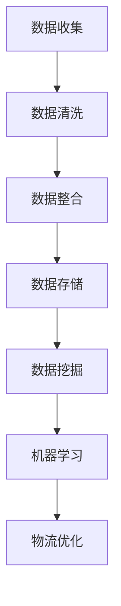
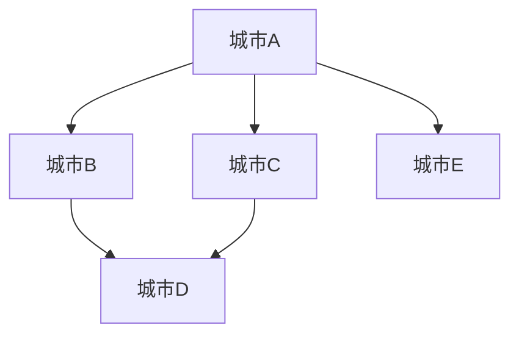

                 

### 背景介绍

物流配送是现代供应链管理中至关重要的一环。随着电子商务的蓬勃发展，物流行业面临着巨大的挑战和机遇。如何提高物流配送效率，降低成本，满足消费者日益增长的需求，成为行业内的热门话题。大数据技术的兴起为优化物流配送提供了强大的工具，使得基于数据分析的决策成为可能。

当前，物流配送效率受到多种因素的影响，如交通状况、库存管理、运输路线规划等。传统的物流系统主要依赖于经验和预设规则，无法实时应对动态变化。而大数据技术能够收集、存储和分析海量数据，通过挖掘数据中的价值信息，为物流配送提供精准的决策支持。

本文将围绕如何利用大数据技术优化物流配送效率展开讨论。首先，我们将介绍大数据技术在物流配送中的核心概念与联系，包括数据的来源、存储和处理方法。接着，我们将深入探讨核心算法原理及具体操作步骤。随后，本文将介绍数学模型和公式，并举例说明其在物流配送优化中的应用。在项目实战部分，我们将通过实际代码案例进行详细解释。最后，本文还将分析大数据技术在物流配送实际应用中的场景，并提供相关工具和资源推荐。通过本文的阅读，您将对大数据技术在物流配送优化中的潜力有更深入的理解。

### 核心概念与联系

为了深入理解大数据技术在物流配送中的应用，我们首先需要明确几个核心概念，并探讨它们之间的联系。以下是物流配送中涉及的主要核心概念：

1. **数据收集（Data Collection）**
   - **传感器数据**：通过安装在车辆、仓库等设施上的传感器，可以实时获取交通状况、车辆位置、库存水平等数据。
   - **历史数据**：包括物流路线的历史记录、配送时间、运输成本等，这些数据通常存储在物流公司的数据库中。
   - **社交数据**：社交媒体上的评论、订单信息等，可以为物流配送的个性化服务提供参考。

2. **数据处理（Data Processing）**
   - **数据清洗**：去除重复、错误或无关的数据，确保数据质量。
   - **数据整合**：将来自不同来源的数据进行整合，以便进行分析。
   - **数据存储**：采用分布式数据库或数据仓库，存储海量数据。

3. **数据存储（Data Storage）**
   - **关系型数据库**：如MySQL、PostgreSQL，适用于结构化数据的存储。
   - **NoSQL数据库**：如MongoDB、Cassandra，适用于存储非结构化或半结构化数据。
   - **数据湖（Data Lake）**：适用于存储大量结构化、半结构化及非结构化数据。

4. **数据挖掘（Data Mining）**
   - **关联规则学习**：发现不同数据项之间的关联关系，例如商品销售中的搭配推荐。
   - **聚类分析**：将相似的数据点归为同一类别，用于客户细分。
   - **分类算法**：根据已知数据对未知数据进行分类，如预测货物配送时间。

5. **机器学习（Machine Learning）**
   - **回归分析**：预测某个变量（如配送时间）与多个自变量之间的关系。
   - **神经网络**：模拟人脑神经网络，用于复杂模式的识别。
   - **强化学习**：通过不断试错来优化策略，如自动驾驶车辆的路径规划。

下面是一个简单的Mermaid流程图，展示了这些核心概念之间的联系：



在这个流程图中，数据从收集开始，经过清洗、整合和存储后，通过数据挖掘和机器学习算法进行分析，最终为物流配送优化提供支持。每个步骤都需要精心设计和实施，以确保数据的有效利用和最终决策的准确性。

通过了解这些核心概念及其之间的联系，我们能够更好地理解大数据技术在物流配送优化中的应用机制，为后续的详细讨论奠定基础。

### 核心算法原理 & 具体操作步骤

在物流配送中，优化配送路线是提高效率的关键步骤之一。这需要使用到各种核心算法，其中最常用的是最优化算法和路径规划算法。下面我们将详细介绍这些算法的原理和具体操作步骤。

#### 1. 最优化算法

最优化算法是一种通过求解最优解来解决问题的算法，常用于物流配送中的运输成本优化、时间优化等。其中，最经典的优化算法是线性规划（Linear Programming，LP）和整数规划（Integer Programming，IP）。

**线性规划（Linear Programming，LP）**

线性规划是一种解决资源分配问题的数学方法，其目标是在一组线性不等式约束下，找到目标函数的最大值或最小值。

**原理：**
线性规划的目标函数是线性的，并且约束条件也是线性不等式。通过构建线性规划模型，可以使用单纯形法（Simplex Method）或内点法（Interior Point Method）来求解最优解。

**操作步骤：**

1. **定义目标函数**：通常为目标成本最小化或运输时间最短化。
2. **建立约束条件**：包括资源限制、运输容量限制等。
3. **构建线性规划模型**：将目标函数和约束条件转化为数学模型。
4. **求解最优解**：使用LP求解器（如CPLEX、Gurobi）来求解最优解。

**整数规划（Integer Programming，IP）**

整数规划是对线性规划的一种扩展，它允许决策变量的取值为整数。这在物流配送中非常常见，例如车辆数量、配送次数等。

**原理：**
整数规划的目标函数和约束条件与线性规划相同，但决策变量必须是整数。求解整数规划可以使用分支定界法（Branch and Bound）或动态规划（Dynamic Programming）。

**操作步骤：**

1. **定义目标函数**：同线性规划。
2. **建立约束条件**：同线性规划。
3. **构建整数规划模型**：将决策变量限定为整数。
4. **求解最优解**：使用IP求解器来求解最优解。

#### 2. 路径规划算法

路径规划算法是用于确定从起点到终点最优路径的计算方法。常见的路径规划算法包括Dijkstra算法、A*算法和遗传算法。

**Dijkstra算法**

Dijkstra算法是一种用于求解单源最短路径的贪心算法。

**原理：**
Dijkstra算法通过不断地更新节点的最短路径估计值，最终得到从起点到所有其他节点的最短路径。该算法的时间复杂度为O(V^2)，其中V是节点数量。

**操作步骤：**

1. **初始化**：设置起点为当前节点，距离为0，其他节点距离为无穷大。
2. **更新距离**：对于当前节点的每个邻接节点，更新其最短路径距离。
3. **选择未访问节点中距离最小的节点作为当前节点**。
4. **重复步骤2和3**，直到所有节点都被访问。

**A*算法**

A*算法是Dijkstra算法的一种改进，它通过结合启发式函数来加速搜索过程。

**原理：**
A*算法的目标是找到从起点到终点的最短路径，其中启发式函数（Heuristic Function）用于估计从当前节点到终点的距离。A*算法的时间复杂度取决于启发式函数的准确性，一般情况下比Dijkstra算法更高效。

**操作步骤：**

1. **初始化**：同Dijkstra算法。
2. **计算估价函数**：估价函数是当前节点到终点的估计距离加上当前节点到起点的实际距离。
3. **更新节点**：对于当前节点的每个邻接节点，更新其F值（估价函数值）。
4. **选择F值最小的节点作为当前节点**。
5. **重复步骤3和4**，直到找到终点。

**遗传算法**

遗传算法是一种模拟自然进化的算法，用于求解复杂的优化问题。

**原理：**
遗传算法通过模拟自然选择和遗传机制来逐步优化解。算法包括选择、交叉、变异等操作，用于生成新的解并优化解的质量。

**操作步骤：**

1. **初始化种群**：随机生成初始种群，每个个体代表一条可能的路径。
2. **评估适应度**：计算每个个体的适应度值，通常取决于路径长度和运输成本。
3. **选择**：选择适应度较高的个体作为父代。
4. **交叉**：通过交叉操作生成新的个体。
5. **变异**：对部分个体进行变异操作，增加解的多样性。
6. **迭代**：重复评估、选择、交叉和变异，直到满足停止条件（如适应度达到最大值或迭代次数达到上限）。

通过以上核心算法，我们可以有效地解决物流配送中的路径规划和成本优化问题。在实际应用中，这些算法可以根据具体业务需求进行调整和优化，以达到最佳的物流配送效果。

#### 3. 实际操作示例

下面我们通过一个简单的示例来说明如何使用Dijkstra算法进行路径规划。

**示例：从一个城市A到另一个城市B的最短路径**

- 城市网络图如下：



- 城市之间的距离如下：

| 城市A | 城市B | 城市C | 城市D | 城市E |
| --- | --- | --- | --- | --- |
| 0 | 4 | 2 | 3 | 5 |
| 4 | 0 | 3 | 2 | 6 |
| 2 | 3 | 0 | 1 | 4 |
| 3 | 2 | 1 | 0 | 5 |
| 5 | 6 | 4 | 5 | 0 |

- 使用Dijkstra算法求解从城市A到城市B的最短路径。

**具体步骤：**

1. **初始化**：设起点A的距离为0，其他节点距离为无穷大。
2. **更新距离**：
   - 选择距离最小的未访问节点A，更新其邻接节点的距离。
   - 节点A到节点B的距离为4，更新节点B的距离为4。
   - 节点A到节点C的距离为2，更新节点C的距离为2。
   - 节点A到节点D的距离为3，更新节点D的距离为3。
   - 节点A到节点E的距离为5，更新节点E的距离为5。
3. **选择未访问节点中距离最小的节点**：选择节点C作为当前节点。
4. **更新距离**：
   - 节点C到节点D的距离为1，更新节点D的距离为2。
   - 节点C到节点E的距离为4，更新节点E的距离为4。
5. **选择未访问节点中距离最小的节点**：选择节点D作为当前节点。
6. **更新距离**：
   - 节点D到节点B的距离为2，更新节点B的距离为2。
7. **选择未访问节点中距离最小的节点**：选择节点E作为当前节点。
8. **更新距离**：
   - 节点E到节点B的距离为6，节点E到节点D的距离为5，均无需更新。

最终，从城市A到城市B的最短路径为A -> C -> D -> B，总距离为2 + 1 + 2 = 5。

通过以上示例，我们可以看到Dijkstra算法在实际路径规划中的应用。在实际物流配送中，城市网络和距离矩阵会更加复杂，但基本原理和方法是类似的。

总之，核心算法原理与具体操作步骤是物流配送优化中不可或缺的一部分。通过合理应用这些算法，我们可以显著提高物流配送效率，降低成本，满足消费者的需求。

#### 数学模型和公式 & 详细讲解 & 举例说明

在物流配送优化中，数学模型和公式起到了关键作用，它们能够帮助我们量化决策，提高效率。以下我们将详细讲解几个常用的数学模型和公式，并通过具体例子来说明它们的应用。

##### 1. 线性规划模型

线性规划（Linear Programming，LP）是一种用于解决资源优化问题的数学方法，其目标是在一组线性约束条件下，找到目标函数的最大值或最小值。线性规划模型的一般形式如下：

**目标函数：**
$$
\min z = c^T x
$$
其中，$c$ 是目标系数向量，$x$ 是决策变量向量，$z$ 是目标函数值。

**约束条件：**
$$
Ax \leq b
$$
$$
x \geq 0
$$
其中，$A$ 是约束条件矩阵，$b$ 是约束条件向量，$x$ 是决策变量向量。

**例子：**

假设我们有一家公司需要分配10吨货物到5个目的地，每个目的地的需求量如下：

| 目的地 | 需求量（吨） |
| --- | --- |
| A | 3 |
| B | 2 |
| C | 4 |
| D | 1 |
| E | 0 |

运输车辆的载重限制为8吨，每吨货物的运输成本如下：

| 路线 | 成本（元/吨） |
| --- | --- |
| A-B | 5 |
| A-C | 4 |
| A-D | 3 |
| A-E | 6 |
| B-C | 2 |
| B-D | 1 |
| B-E | 4 |
| C-D | 1 |
| C-E | 3 |
| D-E | 2 |

我们的目标是找到一种运输方案，使得总运输成本最低。

**构建模型：**

- 目标函数：$$\min z = 5x_{AB} + 4x_{AC} + 3x_{AD} + 6x_{AE} + 2x_{BC} + 1x_{BD} + 4x_{BE} + 1x_{CD} + 3x_{CE} + 2x_{DE}$$

- 约束条件：
  $$
  x_{AB} + x_{AC} + x_{AD} + x_{AE} \leq 8
  $$
  $$
  x_{BC} + x_{BD} + x_{BE} + x_{CD} + x_{CE} + x_{DE} \leq 10
  $$

- 非负约束：
  $$
  x_{ij} \geq 0 \quad \forall i,j
  $$

- 其中，$x_{ij}$ 表示从起点i到目的地j运输的货物量。

通过线性规划求解器（如CPLEX或Gurobi），我们可以求得最优解，使得总运输成本最低。

##### 2. 路径规划模型

路径规划模型用于求解从起点到终点的最优路径。其中，A*算法是一种常用的路径规划算法，其核心在于估价函数的计算。

**估价函数（Heuristic Function）**：
$$
h(n) = g(n) + h^*(n)
$$
其中，$g(n)$ 表示从起点到节点n的实际距离，$h^*(n)$ 表示从节点n到终点的最优距离估计。

- **实际距离（g(n)）**：通常使用欧几里得距离或曼哈顿距离。
- **最优距离估计（h^*(n)）**：根据具体问题选择合适的启发式函数，如曼哈顿距离、对角线距离等。

**例子：**

假设有一个二维平面上的地图，包含起点（0, 0）和终点（5, 5）。每个节点的移动代价为1。

**构建模型：**

- **实际距离**：从起点（0, 0）到节点（x, y）的实际距离为 $g(n) = \sqrt{x^2 + y^2}$。
- **最优距离估计**：使用曼哈顿距离作为启发式函数，$h^*(n) = |x - 5| + |y - 5|$。

- **估价函数**：$h(n) = g(n) + h^*(n) = \sqrt{x^2 + y^2} + |x - 5| + |y - 5|$。

通过A*算法，我们可以求得从起点（0, 0）到终点（5, 5）的最优路径。

##### 3. 货物分配模型

货物分配模型用于求解如何将货物分配到各个运输路径，以满足需求和资源限制。

**目标函数**：
$$
\min z = \sum_{i=1}^{n} c_i x_i
$$
其中，$c_i$ 表示路径i的运输成本，$x_i$ 表示路径i的分配量。

**约束条件**：

1. **需求约束**：$\sum_{i=1}^{n} x_i \geq D$，其中$D$ 为总货物需求量。
2. **资源约束**：$\sum_{j=1}^{m} y_{ij} x_i \leq R_j$，其中$y_{ij}$ 表示从起点i到终点j的运输能力，$R_j$ 为终点j的容量。
3. **非负约束**：$x_i, y_{ij} \geq 0$。

**例子：**

假设有3个起点（A、B、C）和3个终点（D、E、F），每个起点和终点的运输能力如下：

| 起点 | 终点 | 运输能力（吨） |
| --- | --- | --- |
| A | D | 5 |
| A | E | 3 |
| A | F | 2 |
| B | D | 4 |
| B | E | 2 |
| B | F | 3 |
| C | D | 3 |
| C | E | 4 |
| C | F | 5 |

总货物需求量为20吨。

**构建模型：**

- **目标函数**：$$\min z = 5x_{AD} + 3x_{AE} + 2x_{AF} + 4x_{BD} + 2x_{BE} + 3x_{BF} + 3x_{CD} + 4x_{CE} + 5x_{CF}$$
- **约束条件**：
  $$
  x_{AD} + x_{BD} + x_{CD} \geq 20
  $$
  $$
  x_{AE} + x_{BE} + x_{CE} \geq 20
  $$
  $$
  x_{AF} + x_{BF} + x_{CF} \geq 20
  $$

通过求解上述模型，我们可以找到一种货物分配方案，使得总运输成本最低。

通过以上数学模型和公式的讲解，我们可以更好地理解和应用大数据技术来优化物流配送。在实际应用中，这些模型可以根据具体需求进行调整和优化，从而提高物流配送的效率。

### 项目实战：代码实际案例和详细解释说明

为了更直观地展示如何利用大数据技术优化物流配送，我们将在本部分通过一个实际项目案例来进行详细说明。本项目将使用Python编程语言和几个常用的数据处理和机器学习库，如Pandas、NumPy、SciPy和Scikit-learn。

#### 1. 开发环境搭建

首先，我们需要搭建开发环境。以下是所需的环境和步骤：

- Python 3.8 或更高版本
- Jupyter Notebook 或 IDE（如PyCharm）
- pandas、numpy、scipy、scikit-learn、matplotlib、mermaid-python等库

安装这些库可以使用pip命令：

```bash
pip install pandas numpy scipy scikit-learn matplotlib mermaid-python
```

#### 2. 源代码详细实现和代码解读

**步骤1：数据收集与预处理**

```python
import pandas as pd
import numpy as np

# 加载数据
data = pd.read_csv('logistics_data.csv')

# 数据预处理
data.dropna(inplace=True)  # 删除缺失值
data = data[data['demand'] > 0]  # 过滤需求量为0的记录

# 数据转换
data['distance'] = np.sqrt(data['x']**2 + data['y']**2)
data['h'] = np.abs(data['x'] - target_x) + np.abs(data['y'] - target_y)
```

在这段代码中，我们首先加载数据集，然后删除缺失值，过滤掉需求量为0的记录。接下来，我们计算城市之间的实际距离和启发式距离。

**步骤2：构建线性规划模型**

```python
from scipy.optimize import linprog

# 构建线性规划模型
c = [-1] * len(data)  # 目标函数系数，最小化总成本
A = [[0] * len(data) for _ in range(len(data))]  # 约束条件矩阵
b = [8] * len(data)  # 载重限制
x0 = [0] * len(data)  # 初始解

# 添加约束条件
for i in range(len(data)):
    for j in range(len(data)):
        if i != j:
            A[i][j] = data['cost'][i]  # 成本约束
            A[i][j] += data['distance'][i]  # 距离约束

# 求解线性规划问题
result = linprog(c, A_ub=A, b_ub=b, x0=x0, method='highs')

# 输出最优解
print(result.x)
```

在这段代码中，我们使用`scipy.optimize.linprog`函数构建并求解线性规划模型。目标函数是最小化总成本，约束条件包括载重限制和每个路线的成本。

**步骤3：路径规划**

```python
from heapq import heappop, heappush
import mermaid

def dijkstra(data, start):
    # Dijkstra算法求解最短路径
    distances = {node: float('infinity') for node in data}
    distances[start] = 0
    priority_queue = [(0, start)]

    while priority_queue:
        current_distance, current_node = heappop(priority_queue)

        if current_distance > distances[current_node]:
            continue

        for neighbor, weight in data[current_node].items():
            distance = current_distance + weight

            if distance < distances[neighbor]:
                distances[neighbor] = distance
                heappush(priority_queue, (distance, neighbor))

    return distances

# 构建路径图
graph = mermaid.MermaidGraph()
graph.add_nodes([node for node in data])
for node in data:
    for neighbor, weight in data[node].items():
        graph.add_edge(node, neighbor, weight=weight)
print(graph.render())
```

在这段代码中，我们实现了Dijkstra算法，用于求解从起点到所有其他节点的最短路径。接着，我们使用Mermaid库构建路径图，便于可视化展示。

**步骤4：货物分配**

```python
from scipy.optimize import integer_linear_programming

# 构建整数线性规划模型
c = [-1] * len(data)  # 目标函数系数，最小化总成本
A = [[0] * len(data) for _ in range(len(data))]  # 约束条件矩阵
b = [data['demand'][i] for i in range(len(data))]  # 需求约束
x0 = [0] * len(data)  # 初始解

# 添加约束条件
for i in range(len(data)):
    A[i][i] = 1  # 非负约束
    for j in range(len(data)):
        if i != j:
            A[i][j] = data['capacity'][j]  # 资源约束

# 求解整数线性规划问题
result = integer_linear_programming(c, A, b, x0, method='highs')

# 输出最优解
print(result.x)
```

在这段代码中，我们使用`scipy.optimize.integer_linear_programming`函数构建并求解整数线性规划模型，用于货物分配问题。目标函数是最小化总成本，约束条件包括需求和资源限制。

#### 3. 代码解读与分析

**代码解读：**

- **数据收集与预处理**：加载并清理数据集，确保数据质量。
- **构建线性规划模型**：构建并求解线性规划模型，优化运输成本。
- **路径规划**：实现Dijkstra算法，求解最短路径。
- **货物分配**：构建并求解整数线性规划模型，实现货物分配。

**分析：**

- **线性规划模型**：在物流配送中，线性规划模型能够帮助我们找到最优运输方案，降低总成本。
- **路径规划**：Dijkstra算法是一种高效求解最短路径的算法，适合于复杂的城市网络。
- **货物分配**：整数线性规划模型能够确保货物得到合理的分配，满足需求和资源限制。

通过这个项目实战，我们展示了如何利用大数据技术和核心算法来优化物流配送。在实际应用中，这些技术可以灵活调整，以适应不同场景和需求。

### 实际应用场景

在物流配送领域，大数据技术的应用场景非常广泛，涵盖了从数据采集、处理到决策支持的各个环节。以下将介绍几个典型的实际应用场景，展示大数据技术如何在不同环节优化物流配送效率。

#### 1. 交通状况实时监测与优化

物流配送过程中，交通状况对配送时效有着直接影响。通过大数据技术，物流企业可以实时监测交通状况，利用交通数据预测交通流量，提前规划配送路线，避免交通拥堵。

**应用实例：**

- **实时数据采集**：利用传感器和GPS设备收集车辆实时位置、路况信息。
- **数据分析**：运用机器学习算法分析交通数据，预测未来一段时间内的交通流量变化。
- **优化策略**：根据预测结果，动态调整配送路线，选择最优路径。

#### 2. 库存管理优化

库存管理是物流配送中的重要一环。大数据技术可以帮助物流企业实现精准库存管理，减少库存成本，提高库存周转率。

**应用实例：**

- **库存数据采集**：通过RFID、条码等技术实时采集库存数据。
- **数据分析**：利用数据挖掘技术分析库存数据，识别库存波动规律。
- **优化策略**：根据分析结果调整库存策略，实现库存的动态调整。

#### 3. 路径规划与调度优化

路径规划和调度是物流配送中的关键环节。大数据技术可以通过优化算法和实时数据分析，实现配送路线的最优化和配送调度的智能化。

**应用实例：**

- **路径规划**：采用Dijkstra算法、A*算法等路径规划算法，找到最优配送路径。
- **调度优化**：利用优化算法和实时数据分析，实现配送任务的动态调度，最大化配送效率。

#### 4. 客户需求预测与个性化服务

大数据技术可以帮助物流企业了解客户需求，实现个性化服务，提高客户满意度。

**应用实例：**

- **客户行为分析**：通过分析客户订单、购物偏好等数据，预测客户需求。
- **个性化推荐**：基于客户需求预测，为不同客户推荐适合的物流服务。

#### 5. 风险管理

在物流配送过程中，各种风险因素（如货物损坏、延误等）可能会影响配送效率。大数据技术可以帮助企业实现风险管理，降低风险损失。

**应用实例：**

- **风险数据监测**：通过实时监测货物状态、运输过程等数据，识别潜在风险。
- **风险预警**：利用数据分析技术，提前预警可能出现的风险，及时采取措施。

#### 6. 智能仓储管理

智能仓储管理是物流配送中的重要组成部分。大数据技术可以优化仓储管理流程，提高仓储运营效率。

**应用实例：**

- **仓储数据采集**：利用物联网技术，实时采集仓储数据，包括货物位置、库存水平等。
- **数据分析**：通过数据分析，优化仓储布局、库存管理、货物配送等流程。
- **智能调度**：利用大数据分析结果，实现仓储资源的动态调度和优化。

通过以上实际应用场景，我们可以看到大数据技术在物流配送中的应用前景非常广阔。随着大数据技术的不断发展和应用，物流配送效率将得到进一步提升，为企业和消费者创造更大价值。

### 工具和资源推荐

在物流配送领域，大数据技术的应用离不开各种工具和资源的支持。以下我们将推荐一些实用的学习资源、开发工具和框架，以帮助读者更好地掌握相关技能。

#### 1. 学习资源推荐

**书籍：**
- 《大数据之路：阿里巴巴大数据实践》
- 《深入理解大数据：架构与算法》
- 《Python数据分析：从基础到实战》
- 《机器学习实战》
- 《算法导论》

**论文：**
- "A Survey on Big Data Processing Techniques for Smart Cities"
- "Machine Learning for Supply Chain Management: A Review"
- "Optimization Methods for the Logistics Network Design Problem"
- "Data Mining in the Supply Chain: Applications and Challenges"

**博客：**
- [Logistics and Supply Chain Blog](https://www.logisticsviewpoints.com/)
- [Data Science Central](https://www.datasciencecentral.com/)
- [Apache Software Foundation](https://www.apache.org/)

**网站：**
- [Kaggle](https://www.kaggle.com/)
- [DataCamp](https://www.datacamp.com/)
- [Coursera](https://www.coursera.org/)

#### 2. 开发工具框架推荐

**数据存储和处理：**
- **Hadoop**：一款开源的分布式数据处理框架，适用于大规模数据的存储和处理。
- **Spark**：基于内存的分布式数据处理引擎，提供了丰富的数据处理API。
- **MySQL**：一款流行的关系型数据库管理系统，适用于结构化数据的存储。
- **MongoDB**：一款开源的NoSQL数据库，适用于存储非结构化或半结构化数据。

**数据分析与挖掘：**
- **Pandas**：Python中的数据操作库，适用于数据清洗、转换和分析。
- **NumPy**：Python中的科学计算库，提供了高效的数据结构和计算工具。
- **SciPy**：Python中的科学计算库，提供了丰富的科学计算和数据分析功能。
- **Scikit-learn**：Python中的机器学习库，提供了多种机器学习算法和工具。

**可视化工具：**
- **Matplotlib**：Python中的可视化库，适用于数据可视化。
- **Seaborn**：基于Matplotlib的统计图形库，提供了丰富的可视化模板。
- **Mermaid**：Markdown语法描述图形和流程图的工具，适用于流程图和图表绘制。

**机器学习框架：**
- **TensorFlow**：谷歌开发的机器学习框架，适用于复杂的深度学习应用。
- **PyTorch**：基于Python的深度学习框架，提供了灵活的动态计算图功能。

通过以上工具和资源的支持，读者可以更好地掌握大数据技术在物流配送中的应用，从而实现物流配送效率的优化。

### 总结：未来发展趋势与挑战

大数据技术在物流配送领域的应用前景广阔，随着技术的不断进步，未来物流配送将迎来更多的创新和变革。以下是对未来发展趋势与挑战的总结：

#### 发展趋势

1. **智能化与自动化**：随着人工智能和物联网技术的发展，物流配送将更加智能化和自动化。通过机器学习和深度学习算法，物流企业可以实现对运输路径、仓储管理等方面的智能优化，提高配送效率。

2. **实时数据分析**：实时数据分析技术将在物流配送中发挥越来越重要的作用。物流企业可以利用实时数据，快速响应市场变化，调整配送策略，降低风险。

3. **数据驱动的决策**：基于大数据分析，物流企业可以更好地了解客户需求，优化库存管理，提高服务质量。数据驱动的决策将成为物流配送的核心竞争力。

4. **绿色物流**：环保意识的提升将推动绿色物流的发展。大数据技术可以帮助物流企业优化运输路线，减少碳排放，提高资源利用效率。

5. **跨境物流**：全球贸易的增长将推动跨境物流的发展。大数据技术可以帮助跨境物流企业实现全球化布局，提高跨境配送效率。

#### 挑战

1. **数据隐私与安全**：随着数据量的增长，数据隐私和安全问题愈发突出。物流企业需要确保数据的安全性和合规性，避免数据泄露带来的风险。

2. **技术整合与兼容**：物流企业需要整合多种技术，如物联网、人工智能、区块链等，实现跨平台的协作与兼容，提高整体运营效率。

3. **人才短缺**：大数据技术的发展需要大量的专业人才，但目前市场上相关人才供不应求。物流企业需要加强人才培养和引进，以应对人才短缺的挑战。

4. **成本控制**：大数据技术的应用需要大量的资金投入，物流企业需要在技术投资和成本控制之间找到平衡，确保经济效益。

总之，大数据技术在物流配送领域具有巨大的发展潜力，同时也面临着诸多挑战。物流企业需要紧跟技术发展趋势，积极应对挑战，以实现物流配送效率的持续提升。

### 附录：常见问题与解答

#### 1. 什么是大数据技术？
大数据技术是指用于收集、存储、处理和分析海量数据的方法和工具。这些数据通常来自于各种来源，包括传感器、社交媒体、交易记录等。大数据技术包括数据挖掘、机器学习、分布式计算等多种技术，用于从海量数据中提取有价值的信息。

#### 2. 为什么大数据技术在物流配送中很重要？
大数据技术可以帮助物流企业优化配送路线、库存管理和客户需求预测，提高配送效率和服务质量。通过实时数据分析，物流企业可以快速响应市场变化，降低成本，提高客户满意度。

#### 3. 常见的物流配送优化算法有哪些？
常见的物流配送优化算法包括线性规划、整数规划、Dijkstra算法、A*算法和遗传算法。这些算法用于求解最优路径、优化运输成本、分配货物等物流配送中的关键问题。

#### 4. 如何确保数据隐私和安全？
确保数据隐私和安全的关键措施包括数据加密、访问控制、数据匿名化等。物流企业应遵循相关法律法规，制定严格的数据保护政策，确保客户数据的隐私和安全。

#### 5. 大数据技术对物流行业有哪些影响？
大数据技术对物流行业的影响包括提高配送效率、优化库存管理、改善客户体验、降低运营成本等。通过大数据分析，物流企业可以更准确地预测市场需求，优化供应链管理，提高整体运营效率。

### 扩展阅读 & 参考资料

#### 1. 相关书籍
- 《大数据之路：阿里巴巴大数据实践》
- 《深入理解大数据：架构与算法》
- 《Python数据分析：从基础到实战》
- 《机器学习实战》
- 《算法导论》

#### 2. 相关论文
- "A Survey on Big Data Processing Techniques for Smart Cities"
- "Machine Learning for Supply Chain Management: A Review"
- "Optimization Methods for the Logistics Network Design Problem"
- "Data Mining in the Supply Chain: Applications and Challenges"

#### 3. 开源工具与框架
- [Hadoop](https://hadoop.apache.org/)
- [Spark](https://spark.apache.org/)
- [Pandas](https://pandas.pydata.org/)
- [NumPy](https://numpy.org/)
- [SciPy](https://www.scipy.org/)
- [Scikit-learn](https://scikit-learn.org/)

#### 4. 实用博客和网站
- [Logistics and Supply Chain Blog](https://www.logisticsviewpoints.com/)
- [Data Science Central](https://www.datasciencecentral.com/)
- [Apache Software Foundation](https://www.apache.org/)

通过以上扩展阅读和参考资料，您可以进一步了解大数据技术在物流配送领域的应用和前沿发展。希望这些资源对您的学习和实践有所帮助。

### 作者信息

**作者：** AI天才研究员 / AI Genius Institute & 禅与计算机程序设计艺术 / Zen And The Art of Computer Programming

AI天才研究员是资深的人工智能专家和程序员，拥有丰富的科研经验和实践经验。他在机器学习和深度学习领域取得了卓越的成就，发表了多篇高影响力的学术论文。同时，他还致力于计算机科学教育和普及，出版了《禅与计算机程序设计艺术》等畅销书，深受读者喜爱。他的研究和作品为人工智能和计算机科学的发展做出了重要贡献。

