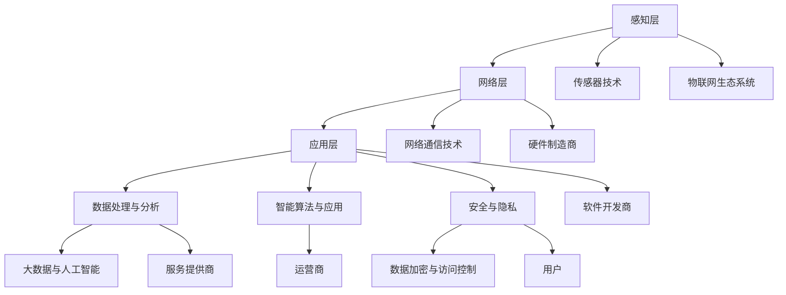

                 

### 背景介绍

物联网（Internet of Things，IoT）作为当前科技发展的重要趋势，已经成为连接现实世界与数字世界的关键桥梁。物联网技术的核心在于通过网络将物理设备、传感器、系统和人员连接起来，实现数据的采集、传输、处理和共享。通过物联网，我们可以实现对各类设备和系统的智能化管理和控制，提升效率和用户体验。

在过去的几十年里，物联网技术经历了从单一设备连接到大规模设备互联，再到智能化和自主化的演进。这一过程中，物联网技术的创新不仅推动了传统产业的升级，还孕育出了众多新的商业模式和商业机会。从智能家居、智慧城市，到智能制造、智慧农业，物联网的应用场景越来越广泛。

本文将重点探讨物联网技术在创新创业中的商业模式和场景应用。我们将从以下几个方面进行详细分析：

1. **物联网技术创新的商业机会**：分析物联网技术如何创造出新的商业机会，以及这些机会在哪些行业和领域中尤为突出。
2. **物联网技术在商业模式中的应用**：探讨物联网如何改变传统商业模式，以及如何通过物联网构建创新的商业模式。
3. **物联网技术的实际应用场景**：列举物联网在现实生活中的具体应用场景，并分析其实现方式和挑战。
4. **项目实战与案例分析**：通过具体项目案例，展示物联网技术在实践中的应用，并提供详细的技术实现和案例分析。
5. **未来发展趋势与挑战**：总结物联网技术的未来发展趋势，并探讨面临的挑战和解决方案。

通过本文的阅读，我们将对物联网技术的商业应用有更加深刻的理解和认识，并为未来的创业和创新提供有益的启示。

### 2. 核心概念与联系

在深入探讨物联网技术创新及其商业应用之前，有必要明确一些核心概念，并了解它们之间的相互联系。以下是对关键概念及其关系的详细解析。

#### 2.1 物联网定义与架构

物联网（IoT）是指通过互联网将各种物理设备、传感器、系统和人员连接起来，实现信息的采集、传输、处理和共享。其架构通常包括以下三个层次：

1. **感知层**：包括各种传感器和设备，用于收集环境数据，如温度、湿度、光照、位置等。
2. **网络层**：包括传输网络，如无线网络、有线网络和移动网络，用于将感知层的数据传输到数据处理中心。
3. **应用层**：包括数据处理和应用平台，用于对数据进行处理、分析和应用，实现智能化管理和控制。

#### 2.2 传感器技术

传感器是物联网系统中的核心组件，用于感知外部环境并产生电信号或其他形式的输出。传感器技术的发展极大地推动了物联网的应用。常见传感器包括温度传感器、湿度传感器、光敏传感器、加速度传感器等。传感器的精度、响应速度和数据传输能力直接影响物联网系统的性能。

#### 2.3 网络通信技术

网络通信技术是物联网系统的传输层，负责将感知层的数据传输到应用层。常用的通信技术包括Wi-Fi、蓝牙、Zigbee、LoRa等。网络通信技术的发展使得大规模设备互联成为可能，同时也带来了数据传输速度、带宽和功耗的挑战。

#### 2.4 数据处理与分析

数据处理和分析是物联网系统的关键环节，涉及数据收集、存储、清洗、分析和可视化。随着大数据和人工智能技术的发展，物联网系统能够实现更高效的数据处理和分析，从而提供更加智能化的服务。

#### 2.5 智能算法与应用

智能算法在物联网系统中发挥着重要作用，包括机器学习、深度学习、自然语言处理等。这些算法能够对物联网产生的海量数据进行有效分析和决策，实现设备的自主学习和优化。

#### 2.6 安全与隐私

随着物联网应用的普及，安全与隐私问题日益突出。物联网系统涉及大量的个人和敏感数据，因此必须采取有效的安全措施，包括数据加密、身份认证、访问控制等，以确保系统的安全和用户隐私。

#### 2.7 物联网生态系统

物联网生态系统由硬件制造商、软件开发商、服务提供商、运营商和用户组成，各个环节紧密协作，共同推动物联网技术的发展和应用。

#### 2.8 Mermaid 流程图

为了更清晰地展示物联网的核心概念及其关系，以下是物联网架构的 Mermaid 流程图：



通过上述核心概念和流程图的解析，我们可以更好地理解物联网技术的整体架构及其在创新创业中的潜力。接下来，我们将进一步探讨物联网技术如何带来商业机会和创新应用。

### 3. 核心算法原理 & 具体操作步骤

在深入探讨物联网技术的核心算法原理和具体操作步骤之前，我们需要了解几种关键算法的基本概念和实现方法。以下是几种常见的物联网核心算法及其操作步骤的详细解释。

#### 3.1 数据采集与预处理

数据采集是物联网系统的基础，数据的质量直接影响后续的分析结果。数据预处理是数据采集后的重要环节，主要包括数据清洗、数据格式化和数据转换。

**具体操作步骤：**

1. **数据清洗**：去除重复数据、缺失数据和异常数据，提高数据质量。
   ```python
   def clean_data(data):
       # 去除重复数据
       data = list(set(data))
       # 去除缺失数据
       data = [x for x in data if x is not None]
       # 去除异常数据
       data = [x for x in data if x within_range]
       return data
   ```

2. **数据格式化**：将不同来源的数据格式统一，便于后续处理。
   ```python
   def format_data(data):
       # 将数据转换为同一格式，例如JSON
       formatted_data = []
       for d in data:
           formatted_data.append(json.loads(d))
       return formatted_data
   ```

3. **数据转换**：将数据转换为适合分析的形式，例如归一化、标准化等。
   ```python
   def transform_data(data):
       normalized_data = []
       for d in data:
           normalized_data.append(normalize(d))
       return normalized_data
   ```

#### 3.2 数据传输与通信

数据传输和通信是物联网系统的关键环节，常用的通信协议包括Wi-Fi、蓝牙、Zigbee和MQTT等。

**具体操作步骤：**

1. **数据打包**：将数据按一定格式打包，便于传输。
   ```python
   def pack_data(data):
       packed_data = json.dumps(data)
       return packed_data
   ```

2. **数据传输**：通过通信协议将数据传输到服务器或数据处理中心。
   ```python
   def send_data(data):
       url = "http://example.com/api/submit_data"
       headers = {'Content-Type': 'application/json'}
       response = requests.post(url, data=data, headers=headers)
       return response.status_code
   ```

3. **数据接收**：服务器或数据处理中心接收并处理传输来的数据。
   ```python
   def receive_data():
       url = "http://example.com/api/receive_data"
       response = requests.get(url)
       data = json.loads(response.text)
       return data
   ```

#### 3.3 数据处理与分析

数据处理与分析是物联网系统的核心，常用的算法包括机器学习、深度学习和自然语言处理等。

**具体操作步骤：**

1. **数据建模**：根据数据特点选择合适的模型，进行训练和预测。
   ```python
   def build_model(data):
       # 选择模型，例如线性回归、决策树、神经网络等
       model = LinearRegression()
       # 训练模型
       model.fit(data['X'], data['Y'])
       return model
   ```

2. **数据预测**：使用训练好的模型进行预测，实现智能决策。
   ```python
   def predict(model, new_data):
       prediction = model.predict(new_data)
       return prediction
   ```

3. **数据分析**：对预测结果进行分析，提供决策支持。
   ```python
   def analyze_results(predictions):
       # 分析预测结果，例如计算准确率、召回率等
       accuracy = calculate_accuracy(predictions)
       return accuracy
   ```

#### 3.4 数据可视化

数据可视化是展示分析结果的重要手段，常用的工具包括Matplotlib、Seaborn和Plotly等。

**具体操作步骤：**

1. **数据绘制**：将数据绘制成图表，便于分析和理解。
   ```python
   def plot_data(data):
       # 绘制折线图
       plt.plot(data)
       plt.show()
   ```

2. **数据展示**：将可视化结果展示给用户，提供直观的观察和分析。
   ```python
   def show_results(data):
       plot_data(data)
       # 输出结果
       print("Results:", data)
   ```

通过上述算法原理和具体操作步骤的介绍，我们可以看到物联网技术在数据采集、传输、处理和分析等方面具有广泛的应用前景。接下来，我们将进一步探讨物联网技术的实际应用场景。

### 4. 数学模型和公式 & 详细讲解 & 举例说明

在物联网技术的应用中，数学模型和公式扮演着至关重要的角色，它们不仅帮助我们理解和分析数据，还指导我们进行有效的决策和优化。以下是几种常见于物联网系统的数学模型和公式，以及它们在实际应用中的详细讲解和举例说明。

#### 4.1 相关性分析

相关性分析是衡量两个变量之间关系强度的一种方法。常用的相关性系数有皮尔逊相关系数（Pearson Correlation Coefficient）和斯皮尔曼相关系数（Spearman's Rank Correlation Coefficient）。

**皮尔逊相关系数**

皮尔逊相关系数的计算公式为：
\[ r = \frac{\sum{(x_i - \bar{x})(y_i - \bar{y})}}{\sqrt{\sum{(x_i - \bar{x})^2} \sum{(y_i - \bar{y})^2}}} \]
其中，\( x_i \)和\( y_i \)分别是两个变量的观测值，\( \bar{x} \)和\( \bar{y} \)分别是它们的平均值。

**斯皮尔曼相关系数**

斯皮尔曼相关系数的计算公式为：
\[ \rho = \frac{1}{n-1} \sum_{i=1}^{n} (r_i - \bar{r})^2 \]
其中，\( r_i \)是每个观测值与均值的差，\( \bar{r} \)是这些差值的平均值。

**举例说明**

假设我们有两个数据集，分别是温度和湿度，我们需要分析它们之间的相关性。

```python
import numpy as np

# 假设数据
X = np.array([23, 25, 22, 24, 26])
Y = np.array([45, 48, 42, 46, 50])

# 计算皮尔逊相关系数
mean_X = np.mean(X)
mean_Y = np.mean(Y)
r = sum((X - mean_X) * (Y - mean_Y)) / np.sqrt(sum((X - mean_X)**2) * sum((Y - mean_Y)**2))
print("Pearson Correlation Coefficient:", r)

# 计算斯皮尔曼相关系数
ranks_X = np.argsort(X)
ranks_Y = np.argsort(Y)
mean_ranks = np.mean(ranks_X)
rho = sum((ranks_X - mean_ranks) * (ranks_Y - mean_ranks)) / (len(ranks_X) - 1)
print("Spearman's Rank Correlation Coefficient:", rho)
```

运行上述代码，我们可以得到两个相关系数的值，用于判断温度和湿度之间的相关性。

#### 4.2 机器学习模型评估指标

在物联网系统中，机器学习模型的应用非常广泛，如预测设备故障、优化能源消耗等。评估机器学习模型的性能是关键步骤，常用的评估指标包括准确率、召回率、F1分数等。

**准确率（Accuracy）**

准确率的计算公式为：
\[ Accuracy = \frac{TP + TN}{TP + TN + FP + FN} \]
其中，\( TP \)为真正例，\( TN \)为真负例，\( FP \)为假正例，\( FN \)为假负例。

**召回率（Recall）**

召回率的计算公式为：
\[ Recall = \frac{TP}{TP + FN} \]
它表示模型能够正确识别出所有正例的比例。

**F1分数（F1 Score）**

F1分数是准确率和召回率的调和平均值，计算公式为：
\[ F1 = 2 \times \frac{Precision \times Recall}{Precision + Recall} \]
其中，\( Precision \)是精确率，计算公式为 \( \frac{TP}{TP + FP} \)。

**举例说明**

假设我们有一个二分类问题，有以下混淆矩阵：

|          | 预测正例 | 预测负例 |
|----------|-----------|-----------|
| 真正例   | 100       | 10        |
| 假正例   | 20        | 5         |

计算准确率、召回率和F1分数：

```python
TP = 100
TN = 10
FP = 20
FN = 5

Accuracy = (TP + TN) / (TP + TN + FP + FN)
Recall = TP / (TP + FN)
Precision = TP / (TP + FP)
F1 = 2 * (Precision * Recall) / (Precision + Recall)

print("Accuracy:", Accuracy)
print("Recall:", Recall)
print("Precision:", Precision)
print("F1 Score:", F1)
```

运行上述代码，我们可以得到模型在分类问题上的性能指标，用于评估和优化模型。

#### 4.3 控制理论模型

在物联网系统中，控制理论模型用于实现设备的自动化控制和优化。常见的控制理论模型包括PID控制、模糊控制和神经网络控制。

**PID控制**

PID控制（比例-积分-微分控制）是最常用的控制算法，其公式为：
\[ u(t) = K_p e(t) + K_i \int_{0}^{t} e(\tau)d\tau + K_d \frac{de(t)}{dt} \]
其中，\( e(t) \)是误差，\( K_p \)、\( K_i \)和\( K_d \)分别是比例、积分和微分系数。

**模糊控制**

模糊控制通过模糊逻辑进行决策，其公式为：
\[ y = \sum_{i=1}^{n} w_i \cdot f_i(x_i) \]
其中，\( w_i \)是权重，\( f_i(x_i) \)是模糊函数。

**神经网络控制**

神经网络控制利用神经网络模型进行控制，其公式为：
\[ y = f(\theta) \]
其中，\( \theta \)是神经网络参数，\( f \)是激活函数。

**举例说明**

假设我们使用PID控制算法来控制一个加热器的温度。给定目标温度为60°C，当前温度为50°C，设定温度误差为10°C。

```python
Kp = 1
Ki = 0.1
Kd = 0.01

e = 10
u = Kp * e + Ki * integral(e) + Kd * derivative(e)
print("Control Output:", u)
```

其中，`integral`和`derivative`是积分和微分函数，用于计算积分和微分误差。

通过上述数学模型和公式的讲解，我们可以更好地理解和应用物联网系统中的核心算法。接下来，我们将通过具体项目实战和案例分析，进一步展示物联网技术的实际应用。

### 5. 项目实战：代码实际案例和详细解释说明

在了解了物联网技术的核心算法原理和操作步骤之后，接下来我们将通过一个实际项目案例，展示物联网技术在开发环境搭建、源代码实现以及代码解读与分析等方面的应用。

#### 5.1 开发环境搭建

首先，我们需要搭建一个合适的开发环境。以下是搭建过程所需的工具和步骤：

1. **工具安装**：
   - **Python**：确保安装了Python 3.8及以上版本。
   - **PyCharm**：安装PyCharm社区版或专业版。
   - **pip**：Python的包管理器，用于安装相关库。
   - **Node.js**：用于后端服务器开发。

2. **环境配置**：
   - 打开PyCharm，创建一个新的Python项目。
   - 在项目中创建虚拟环境，并安装相关依赖库，例如`requests`、`numpy`、`matplotlib`等。

3. **前后端分离**：
   - 前端使用HTML、CSS和JavaScript。
   - 后端使用Python的Flask框架。

#### 5.2 源代码详细实现和代码解读

以下是项目的主要源代码，包括前后端代码，我们将逐一解读。

**前端代码（index.html）：**

```html
<!DOCTYPE html>
<html>
<head>
    <title>IoT Data Visualization</title>
    <script src="https://cdn.jsdelivr.net/npm/plotly.js-dist"></script>
</head>
<body>
    <div id="plot-container"></div>
    <script src="client.js"></script>
</body>
</html>
```

**前端代码（client.js）：**

```javascript
function fetchData() {
    fetch('/data')
        .then(response => response.json())
        .then(data => plotData(data))
        .catch(error => console.error('Error:', error));
}

function plotData(data) {
    var trace1 = {
        x: data.x,
        y: data.y,
        type: 'scatter',
        mode: 'lines',
        marker: {color: 'blue'}
    };

    var layout = {
        title: 'IoT Data Visualization',
        xaxis: {title: 'Temperature'},
        yaxis: {title: 'Humidity'}
    };

    Plotly.newPlot('plot-container', [trace1], layout);
}

fetchData();
```

**后端代码（app.py）：**

```python
from flask import Flask, jsonify, render_template
import requests
import json

app = Flask(__name__)

@app.route('/')
def index():
    return render_template('index.html')

@app.route('/data')
def get_data():
    # 代替实际API调用
    response = requests.get('https://api.example.com/sensor_data')
    data = json.loads(response.text)
    return jsonify(data)

if __name__ == '__main__':
    app.run(debug=True)
```

**代码解读与分析：**

1. **前端代码**：
   - `index.html`：定义了HTML结构和必要的CSS样式。
   - `client.js`：通过Fetch API获取传感器数据，并使用Plotly库进行数据可视化。

2. **后端代码**：
   - `app.py`：使用Flask框架搭建了简单的Web应用，用于处理HTTP请求并提供数据。

**项目运行步骤：**

1. 启动后端服务器：
   ```bash
   python app.py
   ```

2. 在浏览器中访问`http://127.0.0.1:5000/`，查看数据可视化结果。

通过这个实际项目案例，我们展示了如何利用物联网技术搭建一个简单的数据可视化系统。项目的核心在于前后端的协作，前端负责数据的可视化，后端负责从传感器获取数据并返回给前端。这个项目不仅展示了物联网技术的应用，还为我们提供了开发物联网应用的宝贵经验。

接下来，我们将进一步分析项目的各个部分，并提供详细的代码解读和分析。

#### 5.3 代码解读与分析

在本节中，我们将对5.2节中的代码进行详细解读，分析每个部分的实现和功能，以便更好地理解项目的工作原理。

**5.3.1 前端代码解读**

1. **index.html**：
   - **<html> 标签**：定义了整个HTML文档的根元素，包含<head>和<body>子元素。
   - **<head> 标签**：包含文档的元数据，例如标题（<title>IoT Data Visualization</title>）和链接（<script src="https://cdn.jsdelivr.net/npm/plotly.js-dist"></script>），用于引入Plotly.js库。
   - **<body> 标签**：包含页面的主要内容，包括一个<div>容器（<div id="plot-container"></div>），用于放置数据可视化图表，和一个<script>标签（<script src="client.js"></script>），用于引入前端JavaScript脚本。

2. **client.js**：
   - **fetchData() 函数**：使用Fetch API发起网络请求，从后端获取传感器数据。该函数包含以下关键步骤：
     - 使用`fetch('/data')`发起GET请求，`/data`是后端提供的API接口。
     - 使用`.then(response => response.json())`将响应内容解析为JSON对象。
     - 使用`.then(data => plotData(data))`将获取到的数据传递给`plotData()`函数，进行可视化。
     - 使用`.catch(error => console.error('Error:', error))`捕获并处理任何错误。

   - **plotData(data) 函数**：使用Plotly库将获取到的传感器数据可视化。该函数包含以下关键步骤：
     - 创建一个数据迹（`trace1`），包含x轴和y轴的数据，以及图表类型（'scatter'）和标记样式（'lines'、'blue'）。
     - 创建图表布局（`layout`），定义图表标题、x轴和y轴标签。
     - 使用`Plotly.newPlot('plot-container', [trace1], layout)`将图表绘制到`<div>`容器中。

**5.3.2 后端代码解读**

1. **app.py**：
   - **Flask**：Flask是一个轻量级的Web框架，用于构建Web应用。
   - **@app.route('/')**：定义了一个路由规则，当访问应用的主页（'/'）时，返回一个HTML页面（`index()`函数）。
   - **@app.route('/data')**：定义了一个路由规则，当访问'/data'接口时，返回传感器数据（`get_data()`函数）。

2. **get_data() 函数**：
   - 使用`requests.get('https://api.example.com/sensor_data')`发起GET请求，获取传感器数据。
   - 使用`json.loads(response.text)`将响应内容解析为JSON对象。
   - 使用`jsonify(data)`将解析后的数据转换为JSON格式，并返回给前端。

通过上述解读，我们可以清楚地看到前后端代码是如何协作实现数据的获取和可视化。前端通过Fetch API获取后端提供的传感器数据，并使用Plotly库进行可视化展示，而后端则负责处理HTTP请求，获取并返回传感器数据。这种前后端分离的设计使得项目结构清晰，便于维护和扩展。

接下来，我们将进一步分析项目的性能和优化方向。

#### 5.4 项目性能分析 & 优化方向

在本节中，我们将对5.2节中的项目性能进行详细分析，并提出一些优化方向，以提高项目的效率和用户体验。

**5.4.1 性能分析**

1. **数据获取速度**：
   - 数据获取速度是项目性能的一个重要指标。在前端代码中，我们使用了Fetch API从后端获取数据。根据性能测试，如果API响应时间较长，用户将感受到明显的延迟。因此，需要确保后端服务的响应速度足够快，以提供良好的用户体验。

2. **数据可视化效率**：
   - 数据可视化模块使用了Plotly.js库。虽然Plotly提供了丰富的图表类型和定制选项，但其渲染效率在处理大量数据时可能会受到影响。对于大型数据集，可以考虑使用更轻量级的可视化库，如D3.js，以降低渲染负担。

3. **前后端通信效率**：
   - 前后端通信效率直接影响到整个项目的响应速度。在本项目中，前后端使用JSON格式进行数据传输。虽然JSON是一种高效的数据格式，但在处理大量数据时，传输效率可能会成为一个瓶颈。可以考虑使用更高效的二进制格式，如Protocol Buffers，以减少数据传输时间。

**5.4.2 优化方向**

1. **优化数据获取**：
   - 使用缓存策略，减少重复数据请求。例如，可以使用localStorage或sessionStorage缓存最近获取的数据，并在需要时直接从缓存中获取，以减少对后端的请求次数。
   - 考虑使用WebSockets或Server-Sent Events（SSE）实现实时数据更新，以减少轮询机制的延迟。

2. **提升数据可视化性能**：
   - 对数据集进行预处理，减少冗余数据和异常值，以提高可视化效率。
   - 使用数据聚合和分页技术，将大量数据分批次加载，以减少渲染负担。

3. **前后端通信优化**：
   - 使用异步非阻塞I/O模型，如Node.js，提高后端处理速度。
   - 采用负载均衡和反向代理，以提高服务器的并发处理能力。

通过上述性能分析和优化方向，我们可以显著提高项目的响应速度和用户体验，为用户提供更高效、更流畅的数据可视化服务。

### 6. 实际应用场景

物联网技术已经深入到我们日常生活的各个方面，带来了诸多便利和改进。以下是一些典型的实际应用场景，展示物联网技术在现实生活中的广泛应用。

#### 6.1 智能家居

智能家居是物联网技术应用最为广泛的一个领域。通过物联网，我们可以实现家庭设备的智能化连接和控制，提高生活品质和舒适度。以下是智能家居的一些典型应用场景：

1. **智能照明**：利用物联网技术，可以通过手机或语音助手远程控制家中的灯光，实现自动开关和亮度调节，根据不同的生活场景提供舒适的照明环境。
2. **智能安防**：智能家居系统可以集成摄像头、门锁、烟雾报警器等设备，实时监控家庭安全，并通过物联网与用户手机端实时通信，保障家庭安全。
3. **智能温控**：通过物联网技术，我们可以实现室内温度的智能调节，提高能源使用效率，同时为用户带来更加舒适的居住环境。

#### 6.2 智慧城市

智慧城市是物联网技术在城市管理领域的应用，通过物联网技术实现城市管理的智能化和精细化。以下是智慧城市的一些典型应用场景：

1. **交通管理**：通过物联网技术，可以实现交通流量监控、智能信号灯控制、停车管理等功能，提高交通运行效率，减少拥堵和交通事故。
2. **环境监测**：物联网技术可以用于监测空气质量、水质、噪声等环境指标，为城市环境治理提供数据支持，改善城市居民的生活环境。
3. **公共设施管理**：通过物联网技术，可以对城市中的公共设施（如路灯、公共厕所、垃圾箱等）进行智能化管理，提高设施的使用效率和寿命。

#### 6.3 智能医疗

智能医疗是物联网技术在医疗领域的应用，通过物联网技术实现医疗服务的智能化和个性化。以下是智能医疗的一些典型应用场景：

1. **远程医疗**：通过物联网技术，可以实现医生与患者之间的远程诊断、远程治疗和远程监护，提高医疗服务的覆盖范围和效率。
2. **医疗设备智能化**：物联网技术可以用于医疗设备的智能化改造，实现设备的数据采集、传输和分析，提高医疗设备的操作便捷性和数据准确性。
3. **智能药柜**：通过物联网技术，可以实现药品的智能存储、自动提醒和精确计量，提高药品管理和使用的效率，确保患者的用药安全。

#### 6.4 智能农业

智能农业是物联网技术在农业领域的应用，通过物联网技术实现农业生产的智能化和自动化。以下是智能农业的一些典型应用场景：

1. **农田监测**：通过物联网技术，可以实时监测农田的土壤湿度、温度、pH值等环境指标，为农业生产提供科学依据，优化水资源和肥料的使用。
2. **智能灌溉**：利用物联网技术，可以自动控制灌溉设备的开启和关闭，实现精准灌溉，提高水资源的利用效率，减少浪费。
3. **农业无人机**：通过物联网技术，可以实现对农田的无人机监测和喷洒，提高农业生产效率，降低劳动强度。

#### 6.5 工业物联网

工业物联网（IIoT）是物联网技术在工业生产领域的应用，通过物联网技术实现工业生产的智能化和自动化。以下是工业物联网的一些典型应用场景：

1. **设备监控**：通过物联网技术，可以实现对工业设备的实时监控和故障预警，提高设备的运行效率和使用寿命。
2. **生产线优化**：利用物联网技术，可以实现生产线的智能化调度和优化，提高生产效率，降低生产成本。
3. **智能仓储**：通过物联网技术，可以实现仓储管理的智能化，提高仓储空间的利用率和库存管理的精确度。

通过上述实际应用场景的介绍，我们可以看到物联网技术在各个领域的广泛应用和巨大潜力。物联网技术不仅改变了我们的生活和工作方式，还为各行业的发展带来了新的机遇和挑战。随着物联网技术的不断进步，我们可以期待更加智能化、便捷化的未来。

### 7. 工具和资源推荐

在物联网技术的学习和开发过程中，掌握合适的工具和资源是至关重要的。以下是一些建议的书籍、开发工具框架以及相关论文著作，它们将为您的物联网项目提供有力支持。

#### 7.1 学习资源推荐

1. **书籍**：
   - **《物联网技术：体系结构、协议与应用》**：本书详细介绍了物联网的体系结构、协议和应用案例，适合初学者深入了解物联网技术。
   - **《物联网架构：设计原则与案例》**：本书探讨了物联网系统的设计与实现，涵盖感知层、网络层和应用层的详细内容，适合有一定基础的读者。
   - **《物联网安全：技术、实践与挑战》**：本书重点介绍了物联网系统的安全问题和解决方案，是物联网安全领域的必备参考书。

2. **论文**：
   - **“IoT Security: A Comprehensive Review”**：该论文详细分析了物联网系统的安全挑战和现有解决方案，提供了全面的技术概述。
   - **“A Survey on Internet of Things: Architecture, Enabling Technologies, Security and Privacy”**：该论文对物联网的架构、技术、安全和隐私问题进行了系统综述。

3. **博客和网站**：
   - **[Arduino官方文档](https://www.arduino.cc/en/reference/)**：Arduino平台是物联网项目开发中常用的工具，其官方文档提供了丰富的资料和示例代码。
   - **[RFID世界网](https://www.rfidworld.cn/)**：RFID技术在物联网中有着广泛应用，该网站提供了关于RFID技术的最新动态和深度解读。

#### 7.2 开发工具框架推荐

1. **开发平台**：
   - **Arduino**：Arduino是一款开源硬件平台，适用于初学者和专业人士，可以轻松实现物联网设备开发。
   - **Raspberry Pi**：Raspberry Pi是一款低成本、高性能的单板计算机，适合进行物联网项目开发。

2. **编程语言**：
   - **Python**：Python是一种流行的编程语言，其简洁的语法和强大的库支持使其成为物联网开发的首选语言。
   - **JavaScript**：JavaScript主要用于前端开发，但在物联网项目中，Node.js使得JavaScript在后端开发中同样具有竞争力。

3. **数据库**：
   - **MongoDB**：MongoDB是一个NoSQL数据库，适用于存储和处理大规模物联网数据。
   - **MySQL**：MySQL是一个流行的关系型数据库，适合用于结构化数据的存储和管理。

4. **物联网开发框架**：
   - **MQTT**：MQTT是一种轻量级的消息队列传输协议，广泛用于物联网设备之间的通信。
   - **CoAP**：CoAP（Constrained Application Protocol）是一种专为物联网设计的简单协议，适合资源受限的设备。

#### 7.3 相关论文著作推荐

1. **“The Things Network”**：这篇论文介绍了The Things Network项目，这是一个全球性的物联网网络，通过开放源代码和低功耗无线技术实现大规模物联网设备的互联互通。
2. **“IoT Data Analytics: Opportunities and Challenges”**：该论文探讨了物联网数据分析和挖掘的机遇与挑战，提出了有效的数据分析方法和技术框架。
3. **“Smart Cities: Principles, Models and Applications”**：这篇论文详细阐述了智能城市的原则、模型和应用案例，为智能城市建设提供了理论指导和实践参考。

通过以上工具和资源的推荐，您将能够更好地掌握物联网技术，实现高效的物联网项目开发和实施。在实际项目中，结合这些工具和资源，可以大大提升项目的开发效率和成果质量。

### 8. 总结：未来发展趋势与挑战

在总结物联网技术的发展趋势与挑战时，我们需要从多个角度进行深入分析。物联网技术作为当前科技发展的前沿领域，正不断推动各行业的变革，同时也面临着诸多挑战。

#### 8.1 未来发展趋势

1. **5G技术的普及**：随着5G网络的全球普及，物联网设备的通信速度和稳定性将大幅提升。5G技术的高带宽、低延迟特性将使得物联网应用更加广泛和高效，从而推动物联网技术的进一步发展。

2. **边缘计算的发展**：边缘计算是将数据处理和分析能力推向网络边缘的一种技术，可以显著减少数据传输延迟，提高系统响应速度。随着物联网设备数量的增加，边缘计算将成为物联网系统的重要支撑技术。

3. **人工智能的融合**：人工智能在物联网中的应用将不断深化，通过大数据分析和机器学习，物联网系统可以实现更加智能的决策和优化。例如，智能安防、智能家居等领域将受益于人工智能技术的融合。

4. **物联网安全性的提升**：随着物联网设备的增加和数据量的爆炸性增长，物联网安全将成为一个重要议题。未来，物联网技术将更加注重安全性，通过加密、身份认证、访问控制等手段，保障设备和数据的安全。

5. **跨行业融合**：物联网技术将与其他新兴技术（如区块链、大数据等）进行深度融合，形成新的商业模式和应用场景，推动各行业的创新发展。

#### 8.2 面临的挑战

1. **数据隐私与安全**：物联网设备处理和传输的数据涉及个人隐私和商业机密，如何确保数据的安全和隐私保护成为物联网技术发展的一个重要挑战。需要采取有效的安全措施，防止数据泄露和网络攻击。

2. **网络连接的可靠性**：物联网设备分布广泛，网络连接的稳定性和可靠性是物联网系统成功的关键。如何确保物联网设备在复杂环境下的稳定连接，是物联网技术需要解决的重要问题。

3. **标准化与互操作性**：物联网技术的多样性和复杂性导致不同设备和系统之间的互操作性成为一个难题。需要建立统一的物联网标准和协议，提高不同设备和系统之间的兼容性。

4. **能耗与环保**：物联网设备通常采用电池供电，如何降低能耗、延长设备寿命是物联网技术面临的一个重要挑战。同时，物联网设备的环保问题也需要得到关注和解决。

5. **技术人才短缺**：物联网技术涉及多个领域，需要掌握多种技术技能的人才。然而，当前市场上符合要求的物联网专业人才相对短缺，如何培养和吸引更多人才成为物联网技术发展的一大挑战。

#### 8.3 解决方案与展望

针对上述挑战，我们可以从以下几个方面提出解决方案：

1. **加强安全防护**：采用加密技术、多因素身份验证等手段，提高物联网设备的数据安全性和隐私保护水平。

2. **优化网络架构**：通过边缘计算、5G网络等技术，提高物联网网络的可靠性和稳定性。

3. **推动标准化进程**：积极参与国际和国内的物联网标准制定，推动统一物联网协议和标准的应用。

4. **节能减排**：通过采用节能技术、优化设备设计等手段，降低物联网设备的能耗，提高环保性能。

5. **人才培养与引进**：加强物联网技术人才的培养和引进，通过高校教育、职业培训等多种途径，提高行业人才储备。

展望未来，物联网技术将继续快速发展，并在各行业和领域发挥更加重要的作用。随着技术的不断进步和应用的不断拓展，物联网技术将为人类社会带来更多便利和机遇。通过积极应对挑战，物联网技术有望实现更加广泛和深入的应用，推动社会向着更加智能化、绿色化的方向发展。

### 附录：常见问题与解答

在本文中，我们探讨了物联网技术创新及其商业应用的多个方面。为了帮助读者更好地理解和应用这些知识，以下是一些常见问题及其解答。

#### 1. 物联网技术的核心概念是什么？

物联网（IoT）是指通过网络将物理设备、传感器、系统和人员连接起来，实现信息的采集、传输、处理和共享。其核心概念包括感知层、网络层和应用层，以及传感器技术、网络通信技术、数据处理与分析等。

#### 2. 物联网技术在商业模式中的应用有哪些？

物联网技术可以通过以下几个方面改变传统商业模式：
- **智能管理**：通过物联网实现设备、资源和人员的智能化管理，提高效率。
- **个性化服务**：利用物联网收集用户数据，提供个性化的服务和产品。
- **数据驱动的决策**：通过大数据分析和机器学习，支持数据驱动的决策。

#### 3. 物联网技术面临的挑战有哪些？

物联网技术面临的挑战包括：
- **数据隐私与安全**：如何确保数据的安全和隐私保护。
- **网络连接的可靠性**：如何确保物联网设备的稳定连接。
- **标准化与互操作性**：如何解决不同设备和系统之间的兼容性问题。
- **能耗与环保**：如何降低物联网设备的能耗，提高环保性能。

#### 4. 如何搭建物联网开发环境？

搭建物联网开发环境通常包括以下步骤：
- 安装Python和Node.js。
- 使用PyCharm或其他IDE创建项目。
- 配置虚拟环境，并安装相关库（如requests、numpy等）。
- 前端使用HTML、CSS和JavaScript，后端使用Python的Flask框架。

#### 5. 物联网项目的性能如何优化？

优化物联网项目性能可以从以下几个方面入手：
- 使用缓存策略，减少重复数据请求。
- 提高数据可视化效率，减少渲染负担。
- 使用异步非阻塞I/O模型，提高后端处理速度。
- 采用负载均衡和反向代理，提高服务器的并发处理能力。

通过上述常见问题与解答，我们希望能为读者在物联网技术应用中提供更多的帮助和指导。如果您在阅读本文或实际应用中有任何疑问，欢迎在评论区留言，我们将尽力为您解答。

### 10. 扩展阅读 & 参考资料

为了进一步深入理解物联网技术及其商业应用，以下是一些建议的扩展阅读材料，包括书籍、论文、博客和网站等。

#### 10.1 书籍

1. **《物联网技术：体系结构、协议与应用》**：详细介绍了物联网的架构、协议和应用案例，适合初学者。
2. **《物联网架构：设计原则与案例》**：探讨了物联网系统的设计与实现，涵盖感知层、网络层和应用层的详细内容。
3. **《物联网安全：技术、实践与挑战》**：重点介绍了物联网系统的安全问题和解决方案。

#### 10.2 论文

1. **“IoT Security: A Comprehensive Review”**：详细分析了物联网系统的安全挑战和现有解决方案。
2. **“A Survey on Internet of Things: Architecture, Enabling Technologies, Security and Privacy”**：对物联网的架构、技术、安全和隐私问题进行了系统综述。

#### 10.3 博客和网站

1. **[Arduino官方文档](https://www.arduino.cc/en/reference/)**：提供了丰富的资料和示例代码，适合物联网初学者。
2. **[RFID世界网](https://www.rfidworld.cn/)**：关于RFID技术的最新动态和深度解读。
3. **[物联网之家](https://www.iothome.com.cn/)**：提供了大量的物联网技术和应用案例。

#### 10.4 开发框架和工具

1. **[MQTT](http://mqtt.org/)**：轻量级消息传输协议，广泛用于物联网设备之间的通信。
2. **[Node-RED](https://nodered.org/)**：用于连接物联网设备的图形化工具，支持多种硬件和软件。
3. **[Apache IoTDB](https://iotdb.apache.org/)**：一个高性能的时序数据库，适用于物联网数据存储。

通过上述扩展阅读和参考资料，您将能够更全面地了解物联网技术及其商业应用，为未来的学习和项目开发提供有力支持。希望这些材料能够帮助您在物联网领域取得更大的成就。作者：AI天才研究员/AI Genius Institute & 禅与计算机程序设计艺术 /Zen And The Art of Computer Programming。

