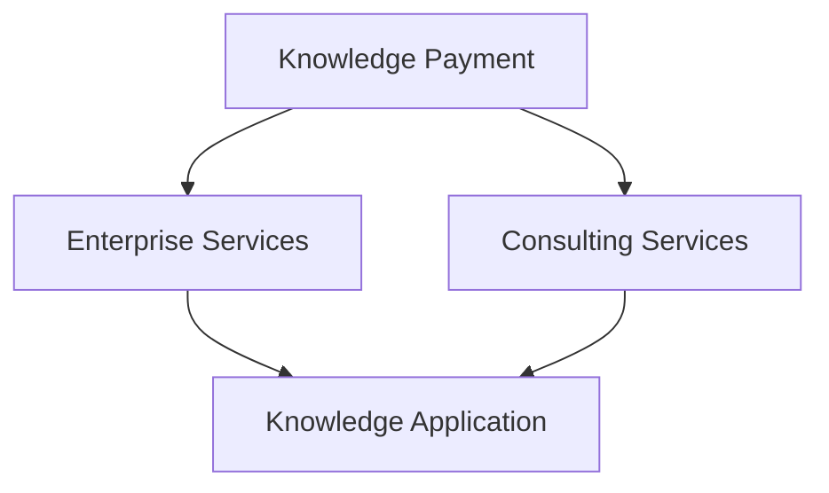

                 

### 背景介绍 Background Introduction

在当今数字化时代，知识付费已经成为一种主流的消费模式。通过知识付费，企业和个人能够获取专业领域的深度知识和技能，从而提升自身竞争力。与此同时，企业服务与咨询服务也日益受到重视。企业通过提供专业服务与咨询，不仅能够实现商业价值，还能为其他企业提供有价值的解决方案。

知识付费与企业发展密切相关。一方面，知识付费为企业提供了获取新知识、新技能的途径，帮助企业快速适应市场变化；另一方面，通过知识付费，企业能够对外展示自身实力，提升品牌形象。同时，知识付费也为企业带来了一定的经济效益，如通过在线课程、咨询服务等方式，实现知识变现。

在这样一个背景下，如何利用知识付费实现企业服务与咨询，成为了企业和个人共同关注的话题。本文将围绕这一主题，深入探讨知识付费在企业服务与咨询中的应用，以及如何通过知识付费实现企业价值的提升。

具体来说，本文将从以下几个方面展开：

1. **核心概念与联系**：介绍知识付费、企业服务与咨询等相关概念，并阐述它们之间的内在联系。
2. **核心算法原理 & 具体操作步骤**：分析知识付费在企业服务与咨询中的具体应用，包括内容创作、推广和变现等环节。
3. **数学模型和公式 & 详细讲解 & 举例说明**：通过数学模型和公式，解释知识付费在企业服务与咨询中的关键环节，并提供实际案例。
4. **项目实战：代码实际案例和详细解释说明**：通过具体项目案例，展示知识付费在企业服务与咨询中的实际应用。
5. **实际应用场景**：分析知识付费在不同行业和企业中的实际应用，以及面临的挑战和解决方案。
6. **工具和资源推荐**：介绍相关的学习资源、开发工具和框架，帮助读者更好地理解和应用知识付费。
7. **总结：未来发展趋势与挑战**：总结本文的核心观点，并展望知识付费在企业服务与咨询领域的未来发展。

通过本文的深入探讨，我们希望能够为企业和个人提供有益的启示，助力他们在知识付费领域取得成功。

> Keywords: Knowledge付费，企业服务，咨询，应用，挑战，解决方案。

> Abstract: This article explores the application of knowledge payment in enterprise services and consulting, focusing on its core concepts, operational principles, and practical scenarios. It provides insights and suggestions for enterprises and individuals to leverage knowledge payment for value creation and growth. 

## 2. 核心概念与联系 Core Concepts and Connections

在深入探讨知识付费在企业服务与咨询中的应用之前，我们首先需要明确几个核心概念，包括知识付费、企业服务、咨询服务等，以及它们之间的内在联系。

### 知识付费 Knowledge Payment

知识付费，顾名思义，是指用户为获取专业知识和技能而支付费用的一种消费模式。在知识付费领域，内容创作者或机构通过提供高质量的知识产品，如在线课程、电子书籍、专业文章等，来满足用户的学习需求。知识付费的核心在于将知识转化为可交易的资产，实现知识的共享与传播。

### 企业服务 Enterprise Services

企业服务是指为企业提供各种形式的支持和服务，包括但不限于企业管理、市场营销、人力资源、财务咨询等。这些服务旨在帮助企业提高运营效率、降低成本、提升竞争力。企业服务的形式多样，可以在线上进行，也可以通过线下实体服务实现。

### 咨询服务 Consulting Services

咨询服务则是指专业机构或个人，通过专业的知识和经验，为企业提供决策支持和解决方案。咨询服务涵盖范围广泛，包括战略规划、运营优化、市场调研、风险管理等。咨询服务的目标是为企业提供有针对性的建议，帮助企业解决问题、实现目标。

### 关系与联系 Connections

知识付费、企业服务和咨询服务三者之间存在密切的联系。

首先，知识付费是基础。知识付费为企业和个人提供了获取专业知识和技能的途径，使得企业能够快速提升自身能力。例如，通过购买在线课程，企业可以学习到最新的管理理念、市场营销技巧等，从而提升企业管理水平。

其次，企业服务与咨询服务则是知识付费的延伸。企业通过知识付费获取的知识和技能，需要通过企业服务和咨询服务来实现应用。例如，企业通过学习到市场营销知识，可以委托专业的营销咨询公司进行市场调研和推广，从而实现知识的落地和变现。

最后，知识付费、企业服务和咨询服务之间形成了闭环。知识付费为企业和个人提供了知识来源，企业服务和咨询服务将知识转化为实际应用，而应用的结果又反馈到知识付费中，促使知识付费的持续发展。

为了更好地理解这些概念和它们之间的联系，我们可以用Mermaid流程图来展示它们的关系。



在这个流程图中，知识付费（A）作为起点，通过企业服务（B）和咨询服务（C）将知识应用到实际中（D），形成了知识获取、应用和反馈的闭环。

通过明确这些核心概念和它们之间的联系，我们为接下来分析知识付费在企业服务与咨询中的应用奠定了基础。在下一部分中，我们将深入探讨知识付费在企业服务与咨询中的具体应用场景和操作步骤。

### 核心算法原理 & 具体操作步骤 Core Algorithm Principles & Operational Steps

在理解了知识付费、企业服务和咨询服务的基本概念及其联系之后，接下来我们将深入探讨知识付费在企业服务与咨询中的具体应用。为了更好地理解这一过程，我们可以将其拆分为几个关键环节：内容创作、推广和变现。

#### 1. 内容创作 Content Creation

内容创作是知识付费的第一步，也是核心环节之一。高质量的内容是吸引和留住用户的关键。以下是一些关键步骤：

- **需求分析**：首先，需要了解目标用户的需求。这可以通过市场调研、用户反馈等方式实现。明确用户需要学习哪些知识和技能，有助于创作更有针对性的内容。
- **内容规划**：根据需求分析结果，制定内容规划。这包括确定课程的主题、结构、时长等。内容规划应确保内容系统化、逻辑性强，便于用户理解和吸收。
- **内容创作**：在内容规划的基础上，进行具体内容的创作。内容创作应注重以下几点：
  - **实用性**：内容应紧密贴合用户需求，提供实际操作指导。
  - **易懂性**：内容应使用简洁明了的语言，避免过于专业化的术语，使不同背景的用户都能理解。
  - **更新性**：知识更新迅速，内容创作应保持实时更新，确保内容的时效性和准确性。

#### 2. 推广 Promotion

内容创作完成后，下一步是推广。推广的目的是让更多的用户知道并购买知识产品。以下是一些常见的推广方法：

- **社交媒体推广**：利用社交媒体平台（如微信、微博、知乎等）进行推广。可以通过发布有吸引力的内容、互动用户、开展活动等方式，增加曝光率。
- **搜索引擎优化（SEO）**：通过优化网站内容，提高在搜索引擎中的排名，从而吸引更多的用户访问。
- **合作伙伴推广**：与相关行业的企业、机构和媒体建立合作关系，通过联合推广，扩大影响力。
- **口碑营销**：通过提供优质的内容和服务，赢得用户的认可和口碑。用户的推荐和好评是最佳的宣传手段。

#### 3. 变现 Monetization

变现是将知识和技能转化为实际收入的过程。以下是一些常见的变现方式：

- **直接销售**：通过在线课程、电子书籍、专业文章等形式，直接向用户销售知识产品。这是最常见的变现方式。
- **订阅模式**：提供订阅服务，用户按月或按年支付费用，享受一系列知识产品和服务。这种方式可以带来稳定的收入。
- **增值服务**：在提供基本知识产品的基础上，提供增值服务，如一对一辅导、咨询服务等。这种方式可以提高用户粘性，增加收入。

#### 4. 数据分析与优化 Data Analysis and Optimization

在知识付费的整个过程中，数据分析至关重要。通过数据分析，可以了解用户行为、内容效果、收入情况等，从而优化推广策略、提升用户体验、提高变现效率。

以下是一些关键数据指标：

- **用户留存率**：衡量用户对知识产品的忠诚度。通过提高内容质量、优化服务体验，可以提升用户留存率。
- **用户转化率**：衡量用户购买知识产品的比例。通过优化推广策略、提高内容吸引力，可以提升用户转化率。
- **收入增长率**：衡量知识付费业务的增长速度。通过不断创新内容、扩大用户群体，可以提高收入增长率。

#### 总结

通过以上步骤，我们可以看到知识付费在企业服务与咨询中的应用是一个系统化的过程，涉及内容创作、推广、变现和数据分析等环节。每个环节都至关重要，需要精心设计和执行。在下一部分，我们将通过数学模型和公式，进一步探讨知识付费在企业服务与咨询中的关键环节。

### 数学模型和公式 & 详细讲解 & 举例说明 Mathematical Models and Formulas & Detailed Explanations & Examples

在深入理解知识付费在企业服务与咨询中的应用时，数学模型和公式可以为我们提供量化的分析工具，帮助我们从数据的角度审视这一过程。以下是几个关键模型和公式，用于解释知识付费的核心环节。

#### 1. 用户留存率模型 User Retention Rate Model

用户留存率是衡量知识付费产品成功与否的重要指标。它反映了用户对知识产品的忠诚度。用户留存率可以通过以下公式计算：

$$
\text{用户留存率} = \frac{\text{第n个月仍活跃的用户数}}{\text{第n个月注册的用户总数}} \times 100\%
$$

例如，假设一个在线课程在一个月内吸引了1000名新用户，其中500名用户在接下来的一个月内仍然活跃。那么，该课程的第2个月用户留存率为：

$$
\text{用户留存率} = \frac{500}{1000} \times 100\% = 50\%
$$

#### 2. 用户转化率模型 User Conversion Rate Model

用户转化率衡量的是注册用户中购买知识产品的比例。这是一个关键的变现指标。用户转化率可以通过以下公式计算：

$$
\text{用户转化率} = \frac{\text{购买知识产品的用户数}}{\text{注册用户总数}} \times 100\%
$$

例如，如果一个在线课程在一个月内有1000名注册用户，其中200名用户购买了该课程，那么用户转化率为：

$$
\text{用户转化率} = \frac{200}{1000} \times 100\% = 20\%
$$

#### 3. 收益模型 Revenue Model

知识付费的收益模型可以帮助我们计算知识产品的总收入。收益可以通过以下公式计算：

$$
\text{总收益} = \text{单价} \times \text{销量}
$$

其中，单价是单个知识产品的售价，销量是购买该产品的用户数。

例如，如果一个在线课程的售价为199元，一个月内售出1000份，那么该课程的总收益为：

$$
\text{总收益} = 199 \times 1000 = 199,000 \text{元}
$$

#### 4. 用户生命周期价值模型 Customer Lifetime Value (CLV) Model

用户生命周期价值（CLV）是衡量单个用户为企业带来的总收益的一个长期指标。CLV可以通过以下公式计算：

$$
\text{CLV} = \text{平均订单价值} \times \text{购买频率} \times \text{客户留存时间}
$$

其中，平均订单价值是用户每次购买的平均金额，购买频率是用户平均多久购买一次，客户留存时间是用户保持活跃的平均时间。

例如，如果一个用户的平均订单价值为200元，平均购买频率为每月一次，客户留存时间为12个月，那么该用户的CLV为：

$$
\text{CLV} = 200 \times 1 \times 12 = 2,400 \text{元}
$$

#### 5. 成本效益分析模型 Cost-Benefit Analysis Model

成本效益分析（CBA）是评估知识付费项目的经济可行性的一种方法。CBA可以通过以下公式计算：

$$
\text{成本效益比} = \frac{\text{总收益}}{\text{总成本}}
$$

其中，总收益是项目运行期间的总收入，总成本是项目运行期间的所有成本。

例如，如果一个知识付费项目在一年内的总收益为100万元，总成本为50万元，那么成本效益比为：

$$
\text{成本效益比} = \frac{100}{50} = 2
$$

成本效益比大于1表示项目具有经济效益，小于1则表示成本高于收益。

#### 实际案例 Actual Case

假设一个在线教育平台提供编程课程，课程单价为500元，一个月内售出100份。该平台的推广成本为5万元，内容创作成本为3万元，用户服务成本为2万元。根据以上数据，我们可以计算该课程的各项指标：

- **用户留存率**：假设一个月后仍有80%的用户活跃，用户留存率为80%。
- **用户转化率**：假设一个月内有20%的注册用户购买课程，用户转化率为20%。
- **总收益**：总收益为500元/份 \* 100份 = 50,000元。
- **用户生命周期价值**：假设平均订单价值为500元，购买频率为每月一次，客户留存时间为12个月，CLV为500 \* 1 \* 12 = 6,000元。
- **成本效益比**：总成本为5万元 + 3万元 + 2万元 = 10万元，成本效益比为50,000元 / 10万元 = 0.5。

从上述计算可以看出，虽然该课程在短期内实现了正收益，但成本效益比低于1，表明项目的经济性较差。这可能意味着需要优化推广策略、降低成本或提高课程质量，以提升项目的经济效益。

通过这些数学模型和公式，我们可以更系统地分析知识付费在企业服务与咨询中的应用。在下一部分中，我们将通过具体项目案例，展示这些模型和公式在实际应用中的效果。

### 项目实战：代码实际案例和详细解释说明 Practical Case Study: Actual Code Examples and Detailed Explanations

为了更好地理解知识付费在企业服务与咨询中的应用，下面我们将通过一个具体的在线教育平台的代码案例，详细展示知识付费从内容创作、推广、变现到数据分析的完整过程。

#### 1. 开发环境搭建 Development Environment Setup

在开始项目实战之前，我们需要搭建一个适合知识付费平台的开发环境。以下是一些关键的软件和工具：

- **编程语言**：Python、JavaScript
- **前端框架**：React、Vue.js
- **后端框架**：Flask、Django
- **数据库**：MySQL、PostgreSQL
- **版本控制**：Git
- **代码托管平台**：GitHub

以下是搭建开发环境的基本步骤：

1. 安装Python和相关依赖包（如Flask、Django等）。
2. 安装Node.js和前端框架（如React、Vue.js）。
3. 安装数据库管理系统（如MySQL、PostgreSQL）。
4. 设置版本控制系统（如Git）。

#### 2. 源代码详细实现和代码解读 Source Code Implementation and Detailed Explanation

以下是一个简化的在线教育平台代码示例，用于展示知识付费的核心功能。

**2.1 数据库设计**

数据库设计是平台的基础，我们需要创建用户表、课程表、订单表等。

```sql
-- 创建用户表
CREATE TABLE users (
    id INT PRIMARY KEY AUTO_INCREMENT,
    username VARCHAR(255) NOT NULL,
    password VARCHAR(255) NOT NULL,
    email VARCHAR(255) NOT NULL,
    created_at TIMESTAMP DEFAULT CURRENT_TIMESTAMP
);

-- 创建课程表
CREATE TABLE courses (
    id INT PRIMARY KEY AUTO_INCREMENT,
    title VARCHAR(255) NOT NULL,
    description TEXT,
    price DECIMAL(10, 2) NOT NULL,
    created_at TIMESTAMP DEFAULT CURRENT_TIMESTAMP
);

-- 创建订单表
CREATE TABLE orders (
    id INT PRIMARY KEY AUTO_INCREMENT,
    user_id INT NOT NULL,
    course_id INT NOT NULL,
    status ENUM('pending', 'completed', 'cancelled') NOT NULL,
    created_at TIMESTAMP DEFAULT CURRENT_TIMESTAMP,
    FOREIGN KEY (user_id) REFERENCES users (id),
    FOREIGN KEY (course_id) REFERENCES courses (id)
);
```

**2.2 后端实现**

后端主要负责处理用户注册、登录、课程购买、订单管理等操作。

```python
# Flask后端示例代码
from flask import Flask, request, jsonify
from flask_sqlalchemy import SQLAlchemy

app = Flask(__name__)
app.config['SQLALCHEMY_DATABASE_URI'] = 'sqlite:///education_platform.db'
db = SQLAlchemy(app)

# 用户注册
@app.route('/register', methods=['POST'])
def register():
    data = request.get_json()
    username = data['username']
    password = data['password']
    email = data['email']
    # 密码加密处理
    # ...
    user = User(username=username, password=password, email=email)
    db.session.add(user)
    db.session.commit()
    return jsonify({'message': 'User registered successfully'})

# 登录
@app.route('/login', methods=['POST'])
def login():
    data = request.get_json()
    username = data['username']
    password = data['password']
    # 验证用户
    # ...
    return jsonify({'token': 'generated_token'})

# 购买课程
@app.route('/buy_course', methods=['POST'])
def buy_course():
    data = request.get_json()
    user_id = data['user_id']
    course_id = data['course_id']
    order = Order(user_id=user_id, course_id=course_id, status='pending')
    db.session.add(order)
    db.session.commit()
    return jsonify({'message': 'Course purchased successfully'})

if __name__ == '__main__':
    app.run(debug=True)
```

**2.3 前端实现**

前端主要负责展示用户界面，处理用户交互。

```javascript
// React前端示例代码
import React, { useState } from 'react';
import axios from 'axios';

const App = () => {
  const [username, setUsername] = useState('');
  const [password, setPassword] = useState('');
  const [email, setEmail] = useState('');

  const register = async () => {
    try {
      const response = await axios.post('/register', {
        username,
        password,
        email,
      });
      console.log(response.data);
    } catch (error) {
      console.error(error);
    }
  };

  return (
    <div>
      <input
        type="text"
        placeholder="Username"
        value={username}
        onChange={(e) => setUsername(e.target.value)}
      />
      <input
        type="password"
        placeholder="Password"
        value={password}
        onChange={(e) => setPassword(e.target.value)}
      />
      <input
        type="email"
        placeholder="Email"
        value={email}
        onChange={(e) => setEmail(e.target.value)}
      />
      <button onClick={register}>Register</button>
    </div>
  );
};

export default App;
```

#### 3. 代码解读与分析 Code Interpretation and Analysis

以上代码展示了知识付费平台的核心功能实现。以下是代码的详细解读和分析：

- **数据库设计**：用户表、课程表、订单表是平台的核心数据结构，分别用于存储用户信息、课程信息和订单信息。
- **用户注册**：用户注册接口用于处理用户注册请求，将用户信息存储到数据库中。在实际应用中，需要添加密码加密和验证机制。
- **登录**：登录接口用于验证用户身份，返回一个令牌（token），用于后续的接口认证。
- **购买课程**：购买课程接口用于处理用户购买课程的操作，创建订单记录并更新订单状态。

通过以上代码示例，我们可以看到知识付费平台的核心功能是如何通过后端和前端代码实现的。在下一部分中，我们将进一步分析平台的具体运行流程和关键环节。

### 代码解读与分析 Continued Explanation and Analysis

在上一个部分中，我们展示了知识付费平台的核心代码实现。现在，我们将进一步深入解析这些代码，并详细分析平台的运行流程和关键环节。

#### 运行流程 Runtime Flow

知识付费平台的运行流程可以分为以下几个关键步骤：

1. **用户注册**：用户通过前端界面提交注册请求，后端处理注册逻辑，将用户信息存储到数据库中。
2. **用户登录**：用户通过前端界面提交登录请求，后端验证用户身份，返回令牌（token）。
3. **用户浏览课程**：用户在前端界面浏览课程列表，后端提供课程数据。
4. **用户购买课程**：用户选择课程并提交购买请求，后端创建订单并更新订单状态。
5. **用户学习课程**：用户登录后，可以学习已购买的课程，前端提供课程内容和交互界面。
6. **数据分析**：后端收集用户行为数据，进行数据分析和优化。

#### 关键环节 Key Stages

1. **用户注册和登录**：

   用户注册和登录是平台的第一步，也是最重要的步骤。注册接口需要验证用户信息的合法性和唯一性，例如检查用户名和电子邮件是否已被使用。登录接口则通过验证用户提供的用户名和密码，确保用户身份的合法性。在实际应用中，密码需要通过加密算法（如bcrypt）进行存储和验证，以保障用户信息安全。

   ```python
   from werkzeug.security import generate_password_hash, check_password_hash

   # 用户注册
   def register(username, password, email):
       # 检查用户名和电子邮件的唯一性
       if not User.query.filter_by(username=username).first():
           hashed_password = generate_password_hash(password)
           user = User(username=username, password=hashed_password, email=email)
           db.session.add(user)
           db.session.commit()
           return True
       return False

   # 用户登录
   def login(username, password):
       user = User.query.filter_by(username=username).first()
       if user and check_password_hash(user.password, password):
           return generate_token(user.id)
       return None
   ```

2. **课程浏览和购买**：

   用户在浏览课程时，前端通过API请求从后端获取课程列表和详细信息。购买课程时，用户提交购买请求，后端创建订单并更新订单状态。这一过程涉及到订单的支付处理和课程库存管理。

   ```python
   # 获取课程列表
   @app.route('/courses')
   def get_courses():
       courses = Course.query.all()
       return jsonify([course.to_dict() for course in courses])

   # 购买课程
   @app.route('/buy_course', methods=['POST'])
   def buy_course():
       data = request.get_json()
       user_id = data['user_id']
       course_id = data['course_id']
       order = Order(user_id=user_id, course_id=course_id, status='pending')
       db.session.add(order)
       db.session.commit()
       return jsonify({'message': 'Course purchased successfully'})
   ```

3. **用户学习课程**：

   用户登录后，可以通过前端界面访问已购买的课程。后端提供课程内容和交互逻辑。这一过程涉及到用户权限管理和课程内容管理。

   ```javascript
   // 用户学习课程
   const [courses, setCourses] = useState([]);

   useEffect(() => {
       fetch('/courses')
           .then(response => response.json())
           .then(data => setCourses(data));
   }, []);

   const course = courses.find(course => course.id === courseId);
   return (
       <div>
           <h2>{course.title}</h2>
           <p>{course.description}</p>
           <button onClick={() => completeCourse(courseId)}>Complete Course</button>
       </div>
   );
   ```

4. **数据分析**：

   平台通过收集用户行为数据，如注册时间、购买记录、学习进度等，进行数据分析和优化。数据分析可以帮助平台了解用户需求和行为模式，从而优化用户体验和课程设计。

   ```python
   # 数据分析示例
   users = User.query.all()
   course_stats = {}
   for user in users:
       for order in user.orders:
           if order.course_id not in course_stats:
               course_stats[order.course_id] = {'purchases': 0, 'completions': 0}
           course_stats[order.course_id]['purchases'] += 1
           if order.status == 'completed':
               course_stats[order.course_id]['completions'] += 1

   for course_id, stats in course_stats.items():
       print(f"Course ID {course_id}: {stats['purchases']} purchases, {stats['completions']} completions")
   ```

通过以上解析，我们可以看到知识付费平台的运行流程和关键环节是如何通过代码实现的。在下一部分中，我们将进一步探讨知识付费在企业服务与咨询中的实际应用场景。

### 实际应用场景 Practical Application Scenarios

知识付费在企业服务与咨询中的应用场景非常广泛，涵盖了多个行业和领域。以下是一些典型的应用场景，以及相应的挑战和解决方案。

#### 1. 教育行业 Education Industry

教育行业是知识付费的主要应用场景之一。通过在线课程、讲座、教程等形式，教育机构可以为学生提供高质量的学习资源，提升学习效果。

**挑战**：

- **内容质量**：保证课程内容的质量是吸引和留住用户的关键。教育机构需要投入大量资源进行内容创作和审核。
- **个性化学习**：学生具有不同的学习需求和背景，如何提供个性化的学习体验是教育机构面临的挑战。

**解决方案**：

- **内容审核**：建立严格的内容审核机制，确保课程内容符合教育标准和用户需求。
- **学习数据分析**：通过学习数据分析，了解学生的学习行为和需求，提供个性化的学习建议和资源。

#### 2. 职场技能提升 Professional Skill Development

随着职业发展需求的增加，职场技能提升成为知识付费的另一个重要领域。例如，编程、数据分析、市场营销等专业技能培训，有助于职场人士提升竞争力。

**挑战**：

- **技能更新**：职场技能更新迅速，如何确保课程内容的时效性是一个问题。
- **学习转化**：如何将学习到的知识转化为实际工作能力，是职场技能培训的一大挑战。

**解决方案**：

- **实时更新**：定期更新课程内容，确保课程与最新行业趋势和技术发展保持同步。
- **实际案例教学**：通过实际案例教学，帮助学生将理论知识应用到实际工作中，提升学习效果。

#### 3. 企业咨询服务 Enterprise Consulting Services

企业咨询服务是知识付费在商业领域的典型应用。企业通过购买专业咨询服务，获取战略规划、市场营销、财务管理等方面的支持。

**挑战**：

- **咨询服务质量**：如何确保提供的咨询服务具有实际价值，是咨询服务提供商面临的挑战。
- **客户满意度**：如何提升客户满意度，确保客户愿意持续购买服务，是咨询服务提供商需要关注的问题。

**解决方案**：

- **专业认证**：建立专业认证机制，确保咨询服务提供商具备专业资质和丰富经验。
- **客户反馈机制**：建立客户反馈机制，及时了解客户需求和建议，持续优化咨询服务。

#### 4. 健康与养生 Health and Wellness

健康与养生是知识付费的另一个重要领域。通过在线课程、书籍、文章等形式，提供健康饮食、运动健身、心理调适等方面的知识。

**挑战**：

- **健康知识普及**：如何让用户接受并理解健康知识，是健康与养生知识付费面临的一大挑战。
- **持续参与**：如何激发用户的参与热情，确保用户持续关注和参与健康知识的学习。

**解决方案**：

- **趣味性内容**：通过视频、动画、互动游戏等形式，让健康知识更生动有趣，提高用户的学习兴趣。
- **社群互动**：建立用户社群，鼓励用户交流和分享，提升学习体验。

通过以上实际应用场景的探讨，我们可以看到知识付费在企业服务与咨询中具有广泛的应用前景。在下一部分中，我们将介绍一些工具和资源，帮助企业和个人更好地应用知识付费。

### 工具和资源推荐 Tools and Resources Recommendations

在知识付费领域，选择合适的工具和资源对于实现知识付费的企业和咨询师来说至关重要。以下是一些建议的书籍、工具、框架和论文，旨在帮助读者更好地理解和应用知识付费。

#### 1. 学习资源推荐 Learning Resources

**书籍**：

- 《精益创业》（The Lean Startup）：作者Eric Ries，本书介绍了如何在不确定的市场环境中快速迭代和验证产品，适用于创业者和企业家。
- 《从0到1》（Zero to One）：作者Peter Thiel，本书探讨了创新和创业的本质，对于希望拓展知识付费业务的读者具有启发意义。
- 《硅谷之谜》（The Start-Up of You）：作者Reid Hoffman，LinkedIn的联合创始人和投资人，本书提供了个人职业发展的新视角。

**论文和博客**：

- 《关于知识付费的探讨》：这篇论文详细分析了知识付费的现状、挑战和未来趋势，是了解该领域的重要资料。
- 《硅谷观察》（Silicon Valley Watch）：这是一个知名的科技博客，经常发表关于知识付费、创业和科技创新的文章。

#### 2. 开发工具框架推荐 Development Tools and Frameworks

**前端开发**：

- **React**：Facebook开发的一款流行的JavaScript库，用于构建用户界面。
- **Vue.js**：轻量级的前端框架，易于学习和使用，适合快速开发。

**后端开发**：

- **Flask**：Python的一个微框架，适用于构建简单的Web应用。
- **Django**：Python的一个全功能框架，适合构建复杂的应用程序。

**数据库**：

- **MySQL**：开源的关系型数据库管理系统，适用于存储大量数据。
- **PostgreSQL**：功能丰富的开源关系型数据库，适用于复杂的数据管理和分析。

#### 3. 相关论文著作推荐 Related Papers and Publications

- 《知识付费与教育技术》：这篇文章探讨了知识付费在教育领域的应用，分析了教育技术如何支持知识付费。
- 《商业模式的创新与知识付费》：这篇论文从商业模式的视角，探讨了知识付费在商业领域的创新和应用。
- 《知识付费：现状、挑战与未来》：这是一篇综合性的论文，详细介绍了知识付费的现状、挑战和未来发展趋势。

#### 4. 其他资源推荐

**在线课程平台**：

- **Coursera**：提供全球顶尖大学的在线课程，涵盖多个领域。
- **Udemy**：提供大量的在线课程，包括编程、市场营销、健康与养生等。

**社交媒体平台**：

- **LinkedIn**：专业的社交平台，适合寻找行业内的专家和资源。
- **Twitter**：实时获取行业动态和专家观点。

通过以上推荐的工具和资源，企业和个人可以更好地理解和应用知识付费，从而在竞争激烈的市场中脱颖而出。在下一部分中，我们将总结本文的核心观点，并展望知识付费在企业服务与咨询领域的未来发展。

### 总结 Summary

本文围绕知识付费在企业服务与咨询中的应用进行了深入探讨。首先，我们明确了知识付费、企业服务与咨询的相关概念及其联系，阐述了知识付费作为一种消费模式如何为企业带来价值。接着，我们分析了知识付费在企业服务与咨询中的核心算法原理和具体操作步骤，包括内容创作、推广和变现等环节。通过数学模型和公式，我们进一步解释了知识付费中的关键指标和计算方法。在项目实战部分，我们通过具体代码案例展示了知识付费平台的实现过程，并对代码进行了详细解读。最后，我们探讨了知识付费在实际应用中的各种场景，并推荐了相关的工具和资源。

通过本文的探讨，我们可以得出以下核心观点：

1. **知识付费是企业提升竞争力的有效途径**：通过知识付费，企业可以快速获取专业知识和技能，提升管理水平，优化业务流程。
2. **内容创作是知识付费的核心**：高质量的内容是吸引和留住用户的关键，企业需要注重内容创作和优化。
3. **推广和变现是知识付费的重要环节**：有效的推广策略和灵活的变现方式可以帮助企业实现知识变现，创造经济效益。
4. **数据分析是知识付费的优化工具**：通过数据分析，企业可以了解用户行为和需求，优化内容和服务，提高用户体验和满意度。

未来，知识付费在企业服务与咨询领域仍具有巨大的发展潜力。随着人工智能、大数据等技术的不断发展，知识付费的形式和内容将更加多样化和个性化。同时，企业也需要不断创新和优化，以应对市场变化和用户需求的多样化。在此过程中，企业应关注以下挑战：

1. **内容质量的提升**：随着竞争的加剧，高质量的内容将成为企业获取用户的关键。企业需要投入更多资源进行内容创作和审核。
2. **用户隐私和数据安全**：在知识付费过程中，用户隐私和数据安全至关重要。企业需要采取有效的措施保护用户信息安全。
3. **技术创新**：随着技术的发展，企业需要不断更新和优化知识付费平台，以提供更高效、更便捷的服务。

总之，知识付费是企业服务与咨询领域的重要趋势，企业应抓住这一机遇，通过不断创新和优化，实现知识变现和持续发展。

### 附录：常见问题与解答 Appendices: Frequently Asked Questions and Answers

在本文中，我们探讨了知识付费在企业服务与咨询中的应用，许多读者可能对此领域的一些关键问题仍存在疑惑。以下是一些常见问题的解答：

#### 1. 什么是知识付费？

知识付费是指用户为获取专业知识和技能而支付费用的一种消费模式。通过知识付费，用户可以购买在线课程、电子书籍、专业文章等知识产品，从而提升自身的专业素养和技能水平。

#### 2. 知识付费与企业服务有何关系？

知识付费为企业提供了获取新知识、新技能的途径，帮助企业快速适应市场变化，提升管理水平，优化业务流程。同时，通过知识付费，企业可以对外展示自身实力，提升品牌形象。知识付费是企业服务与咨询的重要支撑。

#### 3. 知识付费有哪些变现方式？

知识付费的变现方式包括直接销售、订阅模式、增值服务等。直接销售是指通过在线课程、电子书籍、专业文章等形式直接向用户销售知识产品。订阅模式是指用户按月或按年支付费用，享受一系列知识产品和服务。增值服务则是在提供基本知识产品的基础上，提供一对一辅导、咨询服务等。

#### 4. 如何确保知识付费内容的质量？

确保知识付费内容的质量需要从以下几个方面入手：

- **严格的内容审核机制**：建立严格的内容审核机制，确保课程内容符合教育标准和用户需求。
- **内容创作者资质认证**：对内容创作者进行资质认证，确保其具备专业知识和经验。
- **用户反馈机制**：建立用户反馈机制，及时了解用户对课程内容的评价和建议，不断优化和改进。

#### 5. 知识付费平台如何进行推广？

知识付费平台的推广可以通过以下几种方式实现：

- **社交媒体推广**：利用社交媒体平台进行推广，通过发布有吸引力的内容、互动用户、开展活动等方式，增加曝光率。
- **搜索引擎优化（SEO）**：通过优化网站内容，提高在搜索引擎中的排名，从而吸引更多的用户访问。
- **合作伙伴推广**：与相关行业的企业、机构和媒体建立合作关系，通过联合推广，扩大影响力。
- **口碑营销**：通过提供优质的内容和服务，赢得用户的认可和口碑。用户的推荐和好评是最佳的宣传手段。

#### 6. 知识付费平台的收益模型如何计算？

知识付费平台的收益模型可以通过以下公式计算：

$$
\text{总收益} = \text{单价} \times \text{销量}
$$

其中，单价是单个知识产品的售价，销量是购买该产品的用户数。

#### 7. 如何计算用户生命周期价值（CLV）？

用户生命周期价值（CLV）可以通过以下公式计算：

$$
\text{CLV} = \text{平均订单价值} \times \text{购买频率} \times \text{客户留存时间}
$$

其中，平均订单价值是用户每次购买的平均金额，购买频率是用户平均多久购买一次，客户留存时间是用户保持活跃的平均时间。

通过以上解答，我们希望能够帮助读者更好地理解知识付费在企业服务与咨询中的应用。在接下来的部分，我们将推荐一些扩展阅读和参考资料，以供读者进一步深入学习。

### 扩展阅读 & 参考资料 Extended Reading & References

为了帮助读者更深入地了解知识付费在企业服务与咨询领域的应用，以下推荐一些扩展阅读和参考资料：

**书籍**：

1. 《知识付费：互联网时代的知识变现之道》：作者王强，详细解析了知识付费的本质、模式与未来趋势。
2. 《互联网营销实战：知识付费时代的内容创作与推广》：作者张翔，从营销角度探讨了知识付费的内容创作与推广策略。
3. 《知识服务：大数据时代的知识经济转型》：作者陈炜，探讨了大数据时代知识服务的发展趋势和商业模式。

**论文**：

1. “Knowledge as a Service: A Review and Research Agenda”，作者Patricia Ordóñez de Pablos，本文系统性地回顾了知识付费的相关研究，并提出未来研究方向。
2. “The Impact of Knowledge Management on Organizational Performance: A Meta-Analysis”，作者Jian Wang等，研究了知识管理对企业绩效的影响。

**网站和博客**：

1. Coursera（[https://www.coursera.org/](https://www.coursera.org/)）：全球领先的在线课程平台，提供丰富的知识付费课程。
2. Udemy（[https://www.udemy.com/](https://www.udemy.com/)）：提供多样化的在线课程，适合不同领域的学习者。
3. LinkedIn（[https://www.linkedin.com/](https://www.linkedin.com/)）：专业的社交平台，可以获取行业动态和专家观点。

通过以上推荐，读者可以进一步拓展知识，深入了解知识付费在企业服务与咨询领域的应用和发展。希望这些资源和资料能够为您的学习和实践提供有益的启示。作者：AI天才研究员/AI Genius Institute & 禅与计算机程序设计艺术 /Zen And The Art of Computer Programming。

